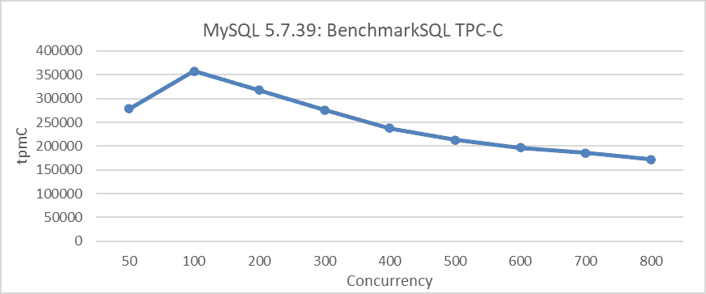
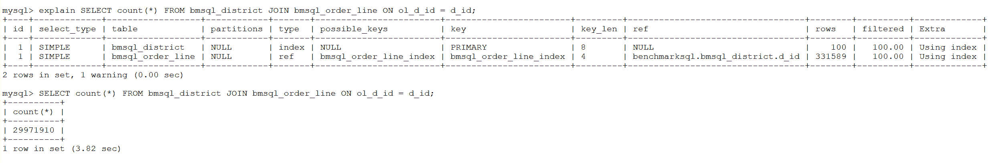
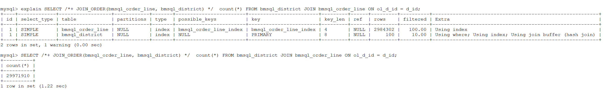
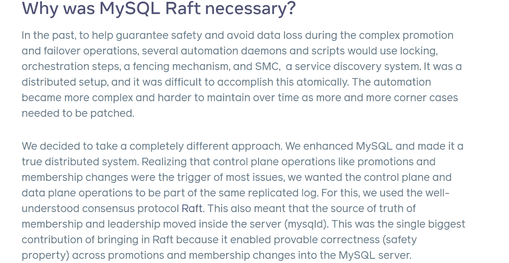
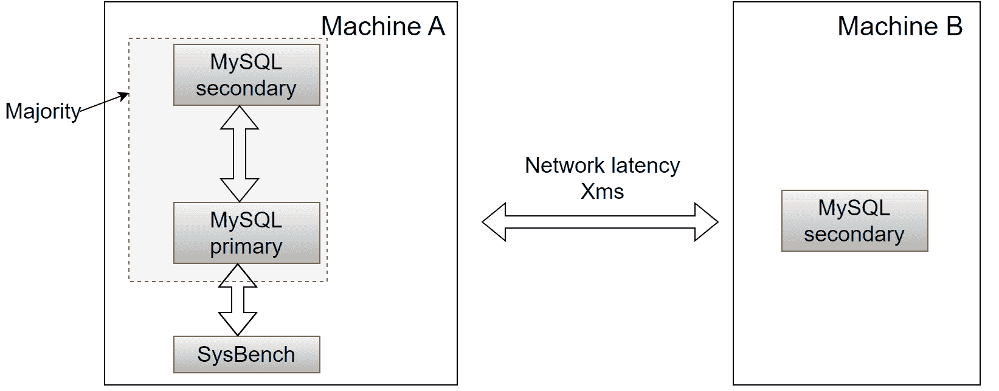
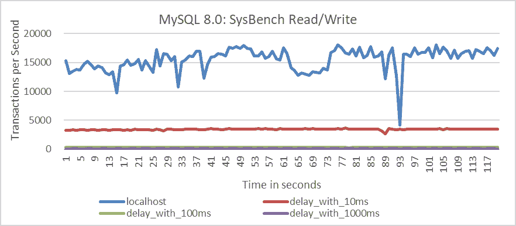
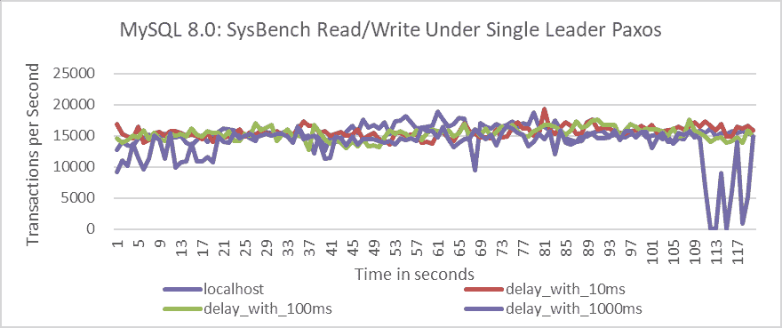
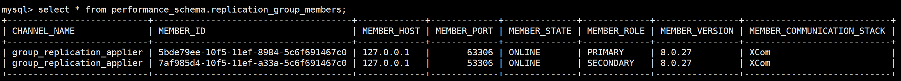
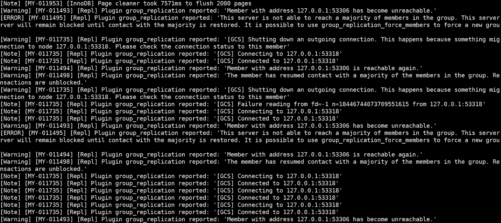
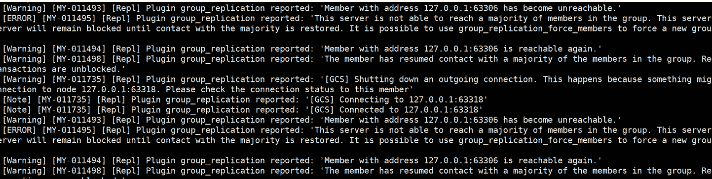

# 第一章：解决 MySQL 问题的传统方法

> 原文：[`enhancedformysql.github.io/The-Art-of-Problem-Solving-in-Software-Engineering_How-to-Make-MySQL-Better/Chapter1.html`](https://enhancedformysql.github.io/The-Art-of-Problem-Solving-in-Software-Engineering_How-to-Make-MySQL-Better/Chapter1.html)

## 1.1 解决 MySQL 问题的当前状态

解决与 MySQL 使用相关的问题通常很简单，涉及收集信息和应用逻辑推理，使得这些问题通常可以解决。然而，解决 MySQL 内在的问题则证明要复杂得多。幸运的是，MySQL 用户富有创造力，已经设计了各种解决方案，例如实施线程池来缓解可扩展性挑战。

为了有效地解决 MySQL 的各种问题，仅仅依靠外围的修复和补丁是不够的。深入探究这些问题的核心本质并全面解决它们，才能取得有意义的进展。例如，MySQL Group Replication 持续面临不稳定的问题。尽管开发工作非常稳健，但持续的挑战在于采用正确的问题解决方法，这导致在减少错误方面存在困难。

## 1.2 如何解决 MySQL 问题？

下面列出了一些经典问题，以及在实际 MySQL 使用场景中的典型解决方案。

### 1.2.1 解决 MySQL 5.7 的可扩展性问题

下图展示了在特定配置下，MySQL 5.7.39 的 TPC-C 吞吐量与并发之间的关系。这包括将事务隔离级别设置为 Read Committed，并调整 *innodb_spin_wait_delay* 参数以减轻吞吐量下降。

图 1-1\. 在 BenchmarkSQL 测试中 MySQL 5.7.39 的可扩展性问题。

从图中可以看出，可扩展性问题显著限制了 MySQL 吞吐量的增加。例如，在 100 并发之后，吞吐量开始下降。由于 MySQL 历史上的可扩展性挑战，Percona 甚至开源了一个线程池来解决这些问题。下图展示了配置 Percona 线程池后 TPC-C 吞吐量与并发之间的关系。

图 1-2\. Percona 线程池缓解 MySQL 5.7.39 的可扩展性问题。

对于 MySQL 5.7.39，线程池有效地减轻了吞吐量下降，尽管由于固有的开销成本，它也略微降低了峰值吞吐量。当比较较低并发水平时的性能时，这种开销变得更加明显。

随着 MySQL 8.0 版本的扩展性提升，线程池在缓解吞吐量下降方面的有效性降低。后续章节将提供实际案例来证实这一观察。

### 1.2.2 提升 MySQL 中连接性能

由于 MySQL 5.7 不支持哈希连接，以下统计 SQL 查询执行耗时为 3.82 秒。

图 1-3\. MySQL 5.7 中的非哈希连接性能。

在 MySQL 8.0 中，执行计划中引入的哈希连接提高了连接性能。对于前面提到的相同 SQL 查询，通过注释指定哈希连接将执行时间缩短到仅为 1.22 秒，相较于之前观察到的 3.82 秒有显著提升。

图 1-4\. MySQL 8.0 中的哈希连接性能。

这说明了 MySQL 8.0 中引入的连接执行改进，突出了其关键进步之一。

### 1.2.3 大规模部署中 MySQL 半同步复制的挑战

自从引入 Paxos 协议以来，越来越多的数据库采用了状态机复制来构建高可用性集群。

Paxos 协议依赖于基于集合理论的多数机制来实现共识。例如，在包含 3 个 MySQL 节点的集群中，2 个节点可以形成一个多数。如果这两个节点达成共识，系统可以持续运行。理论上，遵循这种基于多数的机制应该能够在任何异常情况下防止发散或脑裂问题。

Raft 是另一个广泛使用的协议，本质上是对 Paxos 协议的简化。以下章节描述了 Meta 使用 Raft 协议实现 MySQL 高可用性[38]，这简化了传统的高可用性流程。

图 1-5\. Meta 使用 raft 的原因。

Meta 的案例研究显示，基于 Raft 协议的新解决方案简化了高可用性挑战。Raft 通常被视为 Paxos 协议的简化版本。同样，基于 Paxos 协议的 Group Replication 解决方案，如果正确实施，也可以提供一个优雅的解决方案。

### 1.2.4 基于多数的机制性能及其准确性

将事务隔离级别设置为 Read Committed 后，在多种网络延迟条件下进行了基于 Group Replication 的模拟。

Group Replication 的部署设置如下：在机器 A 上部署了两个 MySQL 实例——一个作为主实例，另一个作为从实例。这两个实例构成多数并通过 localhost 进行通信。机器 B 托管一个作为集群成员部署的第三个实例，网络延迟为 X 毫秒。

图 1-6\. 基于多数机制性能测试的部署图。

理论上，基于多数制的机制，3 节点集群只需要从 2 个节点获取响应即可向客户端提供结果。按照这个逻辑，本地 SysBench 测试应该表现出非常高的效率。

对同一数据中心内以及具有 10ms、100ms 和 1000ms 延迟的数据中心之间的场景进行了机器 B 的吞吐量随时间变化的比较。具体结果将在以下图中展示。

图 1-7\. 默认多主 Paxos 算法的性能测试结果。

从图中可以看出，在 Group Replication 的默认模式下，数据中心间的吞吐量与理论预期存在显著偏差。例如，在网络延迟为 10ms 的场景中，集群的吞吐量降至原始水平的五分之一。为了解决这一差异，从 MySQL 8.0.27 版本开始，引入了 *group_replication_paxos_single_leader* 选项。启用此选项将使用单主 Paxos 算法而不是默认的多主 Paxos 算法。

在配置 Group Replication 使用单主 Paxos 算法后，使用 SysBench 测试工具在相同条件下进行了测试。测试结果如下。

图 1-8\. 单主 Paxos 算法的性能测试结果。

从图中可以看出，单主模式的结果明显优于之前的结果。然而，缺点是单主模式只能在 MySQL 的单主模式下运行，其应用范围有限，无法应用于需要读写操作强一致性的场景。

这种对底层 Paxos 算法的修改是否真的是最佳解决方案？这将在以下章节中深入探讨。

### 1.2.5 节点组复制：本地主机部署报告不可达

在同一台机器上部署具有两个节点的 Group Replication，其中这些节点之间的通信通过 localhost 进行，理论上不应遇到网络相关的抖动、数据包丢失或不可达的节点问题。

图 1-9\. 性能模式显示的本地主机部署关系。

在正常压力下使用 BenchmarkSQL 进行 TPC-C 数据加载测试期间，MySQL 错误日志显示主节点和从节点多次报告对方不可达。

这里是 MySQL 主节点错误日志的部分截图：

图 1-10\. MySQL 主节点错误日志的部分截图。

这里是 MySQL 从节点错误日志的部分截图：

图 1-11\. MySQL 从属服务器的错误日志的部分截图。

从这些日志中，可以明显看到指示“已无法访问”的警告。在正常情况下，在这种 localhost 场景中频繁出现“无法访问”的报告是不预期的。将 Group Replication 延迟处理问题的责任归咎于网络并不是最佳选择。未来的章节将探讨对网络探测机制的改进，以解决这些误报问题。

## 1.3 摘要

本章分析了用户如何解决 MySQL 问题。MySQL 8.0 在改进方面取得了进展，特别是在缓解可伸缩性问题以及引入对哈希连接的支持方面，这是一个积极的进展。然而，仍然存在许多未解决的问题，既有长期存在的问题，也有新出现的问题。有效地解决 MySQL 问题需要彻底理解这些问题和相关理论；否则，理解可能是不完整的。

下一章将通过各种案例研究展示解决晦涩 MySQL 问题的巨大挑战。这需要广泛的知识基础和深入的逻辑推理，以确定这些问题的根本原因。

下一章
