# 第二章：神秘的 MySQL 问题

> 原文：[`enhancedformysql.github.io/The-Art-of-Problem-Solving-in-Software-Engineering_How-to-Make-MySQL-Better/Chapter2.html`](https://enhancedformysql.github.io/The-Art-of-Problem-Solving-in-Software-Engineering_How-to-Make-MySQL-Better/Chapter2.html)


MySQL，拥有几十年历史的最受欢迎的开源数据库软件，以其简洁性和用户友好性而闻名，成为互联网公司的基础选择。尽管其应用广泛，MySQL 仍面临各种挑战。

本章介绍了九个令人困惑的 MySQL 问题或现象，作为例子并为后续主题的深入探讨奠定了基础。

## 2.1 SysBench 读写测试展示超线性吞吐量增长

以 MySQL 8.0.27 版本为例，在 x86 架构的 4 路 NUMA 环境中，使用 SysBench 远程测试 MySQL 的读写能力。MySQL 事务隔离级别设置为 Read Committed。MySQL 实例 1 和实例 2 部署在同一台机器上，测试持续时间为 60 秒。以下图中显示了 MySQL 实例 1 和实例 2 的单独 SysBench 测试结果。

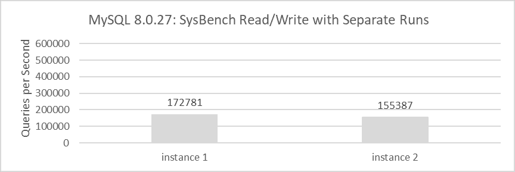

图 2-1\. MySQL 独立运行时的吞吐量。

每个实例的吞吐量都相当适中，分别为 172,781 QPS 和 155,387 QPS。当组合时，这两个实例的总吞吐量为 328,168 QPS。当使用 SysBench 同时测试这两个实例的读写能力时，获得的吞吐量分别为 271,232 QPS 和 275,197 QPS。

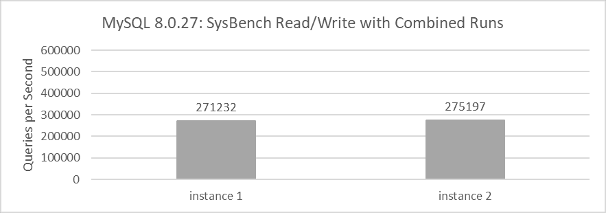

图 2-2\. MySQL 一起运行时的吞吐量。

这两个 MySQL 实例的组合吞吐量为 546,429 QPS。这些数据表明，当这两个 MySQL 实例在同一台机器上运行时，组合吞吐量显著高于它们单独运行时的吞吐量之和。对于详细的统计比较，请参阅以下图表。


图 2-3\. 独立运行与一起运行的总吞吐量。

从数学逻辑的角度来看，如果同时运行两个实例的总吞吐量大致等于单独运行时的吞吐量之和，这表示线性关系。如果组合吞吐量超过这个总和，则表明存在超线性关系。

什么驱动超线性关系？MySQL 是否表现出超线性行为？理解这一点需要深入研究计算机基础和高级 MySQL 概念。

## 2.2 应用 PGO 后 TPC-C 吞吐量意外下降

Profile-guided optimization（PGO）是一种成熟的提高编译时优化决策的技术。通过仪器或可执行文件的采样收集配置文件信息，并使用这些数据优化收集到的可执行文件 [45]。尽管 PGO 非常有效，但由于其繁琐的双编译模型，它尚未被软件项目广泛采用。然而，PGO 仍然是考虑提高 MySQL 性能的一个非常有价值的优化技术，因为它理论上有可能显著提高 MySQL 的效率。

以下图展示了 PGO 在 MySQL 8.0 更高版本中的应用。

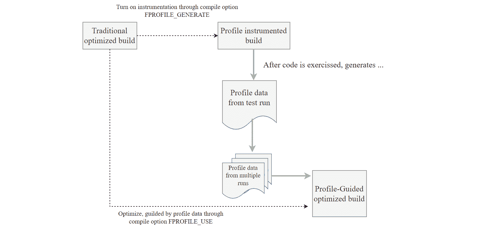

图 2-4\. 在 MySQL 8.0 更高版本中使用 PGO：一步一步指南。

从图中可以看出，Profile-Guided Optimization（PGO）机制涉及几个步骤：

1.  首先，使用编译选项 *“-DFPROFILE_GENERATE=ON”* 编译 MySQL 的特定版本。

1.  启动这个 MySQL 版本，通过运行性能测试（如 TPC-C）来捕获训练数据，这些测试有助于收集性能指标。

1.  在完成训练阶段后，使用选项 *“-DFPROFILE_USE=ON”* 进行第二次编译。在此编译过程中，编译器自动利用收集到的统计数据来优化条件分支和相关方面，显著提高了生成的 MySQL 可执行文件的性能。

以下图展示了应用 PGO 前后 MySQL 8.0.27 的吞吐量和并发之间的关系。


图 2-5\. 在 MySQL 8.0.27 中使用 PGO 前后的性能比较测试。

根据图示，很明显，在较低的并发级别下，PGO（Profile-Guided Optimization）对 MySQL 的吞吐量有显著的提升。然而，当并发超过 150 时，整体吞吐量和峰值性能都出现了下降。

PGO 主要受益于低并发场景，还是存在其他因素限制了其有效性？这个问题深入探讨了排队论和系统架构。进一步探索实际的计算机基础知识将有助于更深入地了解这个问题。

## 2.3 可扩展性增强后线程池对 MySQL 的负面影响

在对 MySQL 8.0.27 应用各种可扩展性补丁后，评估 Percona 线程池是否仍然有效地解决可扩展性问题至关重要。以下图展示了使用 BenchmarkSQL 在独立 MySQL 实例上进行的 TPC-C 测试结果。深蓝色线条表示启用 Percona 线程池的配置（线程池大小=128），而深红色线条表示禁用线程池的配置。测试覆盖了从 50 到 2000 的并发级别，使用了一个包含 1000 个仓库的数据库。

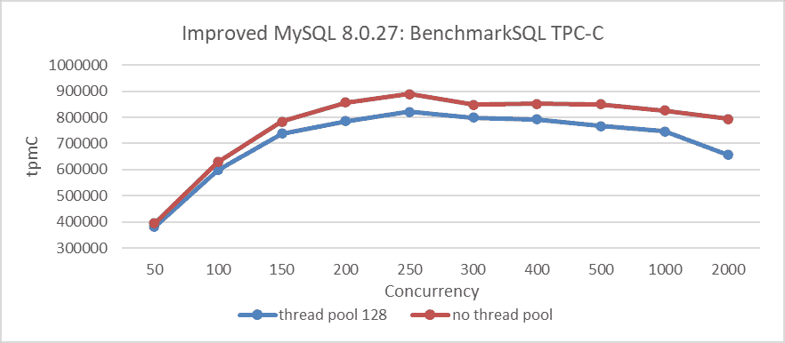

图 2-6\. 启用 Percona 线程池与未启用时的吞吐量相比有显著降低。

从图中可以看出，启用 Percona 线程池与未启用时相比，吞吐量明显降低。值得注意的是，即使在未启用线程池的情况下，MySQL 8.0 与 MySQL 5.7 相比，可扩展性也有显著提升。这表明使用 Percona 线程池来提高 TPC-C 测试的额外好处是有限的。此外，Percona 线程池机制本身引入了开销，这在图的结果中得到了体现。

重要的是要承认，在涉及频繁连接创建和严重竞争的场景中，Percona 线程池仍然很有价值。然而，关键问题仍然是：究竟是什么导致了 MySQL 可扩展性如此显著的提升？未来的章节将进一步探讨这些谜团。

## 2.4 在 MySQL 8.0 中，TPC-C 吞吐量下降过快

长期 TPC-C 测试的标准如下：TPC-C 基准要求数据库至少运行八小时，在两小时内抖动小于 2% [14]。

基于 MySQL 8.0.27，使用 BenchmarkSQL 工具进行了长期 TPC-C 测试。以下是 BenchmarkSQL 测试参数：

```cpp
warehouses=1000
loadWorkers=100
terminals=200
warehouses-begin=1
warehouses-end=1000
//To run specified transactions per terminal- runMins must equal zero
runTxnsPerTerminal=0
//To run for specified minutes- runTxnsPerTerminal must equal zero
runMins=480
//Number of total transactions per minute
limitTxnsPerMin=0
//Set to true to run in 4.x compatible mode. Set to false to use the
//entire configured database evenly.
terminalWarehouseFixed=false
//The following five values must add up to 100
//The default percentages of 45, 43, 4, 4 & 4 match the TPC-C spec
newOrderWeight=45
paymentWeight=43
orderStatusWeight=4
deliveryWeight=4
stockLevelWeight=4 
```

从上述内容可以看出，有 1000 个仓库，并发数为 200，且 terminalWarehouseFixed 设置为 false。此设置使每次事务都能使用不同的仓库 ID，从而访问所有仓库的数据。

下图展示了长期测试过程中吞吐量随时间的变化。TPC-C 吞吐量显示出远超预期的下降率，接近 50%的减少。

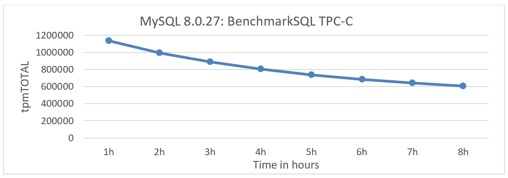

图 2-7\. 在 BenchmarkSQL 测试 MySQL 8.0.27 时暴露的性能下降。

这个问题是在使用 BenchmarkSQL 进行测试时发现的，可能不会在其他 TPC-C 测试工具中出现。截至当前版本 MySQL 8.0.40，快速吞吐量下降的问题尚未完全解决。后续章节将深入探讨该问题的根本原因。

## 2.5 可重复读意外优于可重复读

事务隔离性是数据库处理的基本要素，在 ACID 缩写中表示为‘I’。隔离级别决定了在多个事务同时进行更改和查询时，性能与结果的可靠性、一致性和可预测性之间的平衡。常用的隔离级别有读已提交、可重复读和串行化。默认情况下，InnoDB 使用可重复读。

InnoDB 为每个隔离级别采用不同的锁定策略，这影响了并发条件下的查询锁定行为。根据隔离级别，查询在开始执行之前可能需要等待其他会话持有的锁 [13]。有一种普遍的看法认为，更严格的隔离级别可能会降低性能。MySQL 在实际场景中的表现如何？

在可序列化、可重复读（RR）和读取提交（RC）隔离级别上进行了测试，使用了两种基准类型：SysBench 均匀测试和 pareto 测试。SysBench 均匀测试模拟低冲突场景，而 SysBench pareto 测试模拟高冲突情况。由于 SysBench pareto 测试期间生成了过多的死锁日志，这严重干扰了性能分析，因此通过修改源代码抑制了这些日志，以确保公平的测试条件。此外，MySQL 测试程序使用了修改后的版本以确保准确性，而不是原始版本。

下面的图展示了 SysBench 均匀测试的结果，其中并发性从 50 增加到 800，以加倍的方式增加。鉴于这种测试类型中的冲突很少，在低并发级别上，三个事务隔离级别之间的吞吐量变化很小。然而，超过 400 并发性后，可序列化隔离级别的吞吐量表现出明显的下降。


图 2-8. 在不同隔离级别下，SysBench 读写性能比较（低冲突）。

在 400 并发性以下，由于均匀测试中的冲突较少，差异很小。由于冲突较少，不同事务隔离级别下的锁定策略的影响降低。然而，读取提交主要受频繁获取 MVCC ReadView 的限制，导致性能劣于可重复读。

继续在 pareto 分布条件下进行 SysBench 测试，具体的比较测试结果可以在以下图中看到。

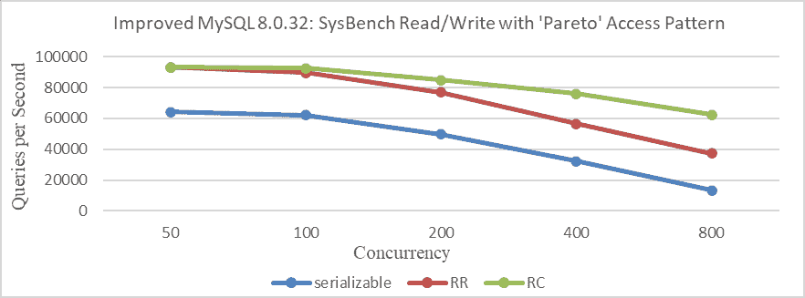

图 2-9. 在不同隔离级别下，SysBench 读写性能比较（高冲突）。

该图清楚地说明了，在存在重大冲突的场景中，不同事务隔离级别下的锁定策略导致的性能差异明显。正如预期的那样，较高的事务隔离级别通常表现出较低的吞吐量，尤其是在严重冲突条件下。

在冲突较少的场景中，性能主要受 MVCC 中获取 ReadView 开销的限制。这是因为，在可重复读隔离级别下，MySQL 每次从全局活动事务列表中读取时，都必须复制整个活动事务列表，而在可重复读隔离级别下，它只需要在事务开始时获取活动事务列表的副本。

总结来说，在像 SysBench 均匀这样的低冲突测试中，MVCC ReadView 的开销是主要的瓶颈，超过了锁的开销。因此，可重复读的性能优于可重复读。相反，在像 SysBench pareto 这样的高冲突测试中，锁的开销成为主要的瓶颈，导致可重复读的性能优于可重复读。

## 2.6 组复制吞吐量低于半同步复制

在组复制操作期间，维护一个认证数据库。定期清理过时的认证信息对于有效地管理内存使用至关重要。然而，此清理过程涉及获取全局闩锁，暂时暂停 MySQL 主节点的执行，直到认证信息被清除。

相比之下，传统的半同步复制要求 MySQL 从节点处理大量的重传日志事件信息。只有在这些重传日志事件被写入磁盘后，从节点才能将确认（ack）信息发送回 MySQL 主节点。此过程包括网络交互、处理多个重传日志事件和磁盘刷新，导致半同步复制的响应时间相对较长。

总体而言，在半同步复制中，MySQL 主节点必须在将重传日志事件写入磁盘后等待 MySQL 从节点的确认才能继续。相比之下，组复制在 Paxos 层达成共识后继续处理，无需等待该层的日志写入。理论上，组复制可以达到更高的吞吐量。

在双节点集群的场景中，进行了基于并发的 TPC-C 吞吐量比较，比较了组复制和半同步复制。请参考以下图表以获取详细信息。

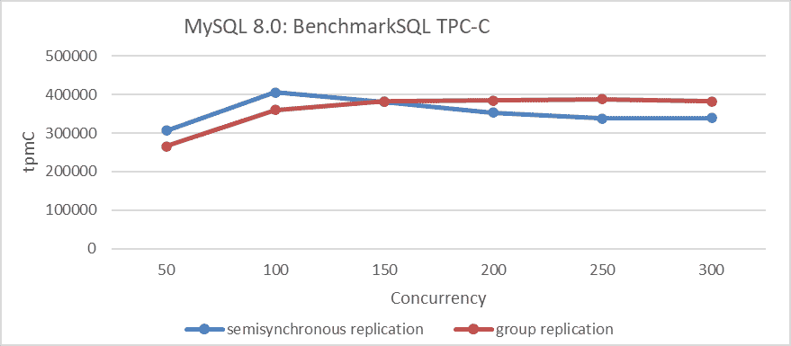

图 2-10. 组复制与半同步复制的性能比较。

该图表明，在低并发情况下，半同步复制优于组复制，而在高并发情况下，组复制表现出更优越的性能。半同步复制在 100 并发时达到峰值性能，而组复制在 250 并发时达到峰值，但峰值性能低于半同步复制。这些测试结果出乎意料。可能是什么问题？

根本问题在于组复制使用的认证数据库机制，而在半同步复制中则不存在这种机制。该机制涉及大量的内存分配和释放，这显著限制了吞吐量的提升。尽管不需要 Paxos 日志持久化，但这个瓶颈抵消了组复制的优势。很明显，认证数据库机制的实现是组复制的主要性能挑战。

## 2.7 修改后的组复制优于半同步复制

在解决 MySQL 8.0.32 中的可扩展性问题的同时，组复制得到了广泛增强。为了验证这些改进，对半同步复制和基于 Paxos 日志持久化的组复制进行了同时测试。部署设置包括半同步复制和组复制的双节点配置，它们托管在同一台机器上，具有独立的 NVMe SSD 和 NUMA 绑定以隔离每个节点。具体来说，MySQL 主实例使用了 NUMA 节点 0 到 2，而 MySQL 从实例使用了 NUMA 节点 3。所有设置，除了与半同步复制或组复制配置直接相关的设置外，都保持一致。

下图显示了不同并发级别下半同步复制和基于 Paxos 日志持久化的组复制的吞吐量比较。


图 2-11. 基于 Paxos 日志持久化的组复制与半同步复制的性能比较。

两者都采用了持久化机制，组复制使用 Paxos 日志持久化，而半同步复制使用中继日志持久化。由于这些不同的机制，基于 Paxos 日志持久化的组复制在性能上显著优于半同步复制。

Meta 公司已经实施了一个基于 Raft 的 MySQL 高可用性解决方案。根据 Meta 公司开发人员进行的测试，基于 Raft 的改进版本的性能与半同步复制相当。有关具体细节，请参阅下面的图[42]。

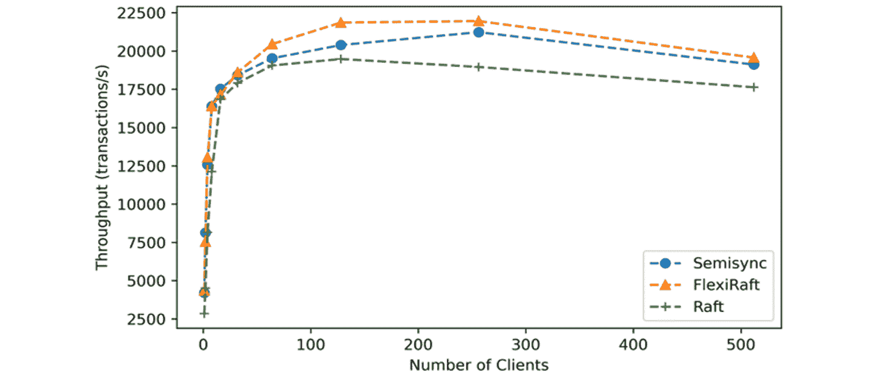

图 2-12. 吞吐量比较，借鉴自 Meta 论文。

在理论上，组复制可以利用基于批处理的磁盘持久化机制，从而在磁盘写入过程中消除处理 binlog 事件的必要性，从而实现更高的预期吞吐量。未来的章节将深入讨论修改组复制以及检查导致原生半同步复制的可扩展性挑战的具体因素。

## 2.8 SysBench 无影响，TPC-C 表现良好

MySQL 8.0 中锁-sys 优化的具体细节如下：

```cpp
commit 1d259b87a63defa814e19a7534380cb43ee23c48
Author: Jakub Łopuszański <jakub.lopuszanski@oracle.com>
Date:   Wed Feb 5 14:12:22 2020 +0100
    WL#10314 - InnoDB: Lock-sys optimization: sharded lock_sys mutex

    The Lock-sys orchestrates access to tables and rows. Each table, and each row,
    can be thought of as a resource, and a transaction may request access right for
    a resource. As two transactions operating on a single resource can lead to 
    problems if the two operations conflict with each other, Lock-sys remembers
    lists of already GRANTED lock requests and checks new requests for conflicts in
    which case they have to start WAITING for their turn.

    Lock-sys stores both GRANTED and WAITING lock requests in lists known as queues.
    To allow concurrent operations on these queues, we need a mechanism to latch
    these queues in safe and quick fashion.

    In the past a single latch protected access to all of these queues. 
    This scaled poorly, and the management of queues become a bottleneck.

    In this WL, we introduce a more granular approach to latching. 
```

这代表了 MySQL 8.0 通过解决全局闩锁瓶颈和优化 InnoDB 中的锁调度，在可扩展性方面取得的改进。为了验证这种锁-sys 优化的有效性，请参考下面图表中用 SysBench 读写测试展示的具体测试结果。

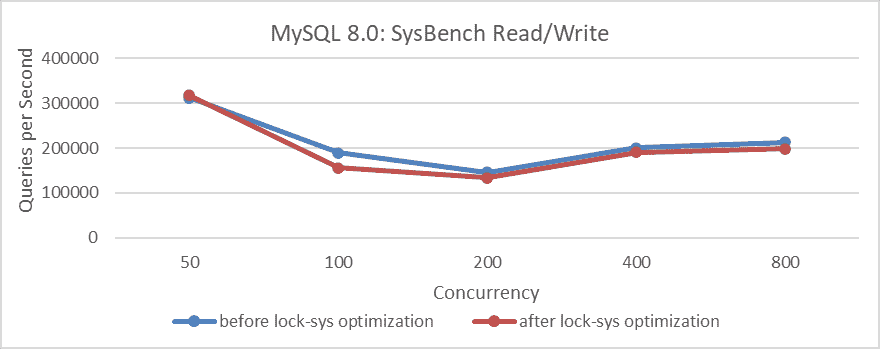

图 2-13. 锁-sys 优化前后 SysBench 读写测试的比较。

实施锁-sys 优化后，吞吐量下降，这是出乎意料的。为了减轻 MySQL 代码中 NUMA 兼容性问题带来的干扰，MySQL 运行实例被绑定到 NUMA 节点 0（类似于 SMP 环境）。以下是测试结果。

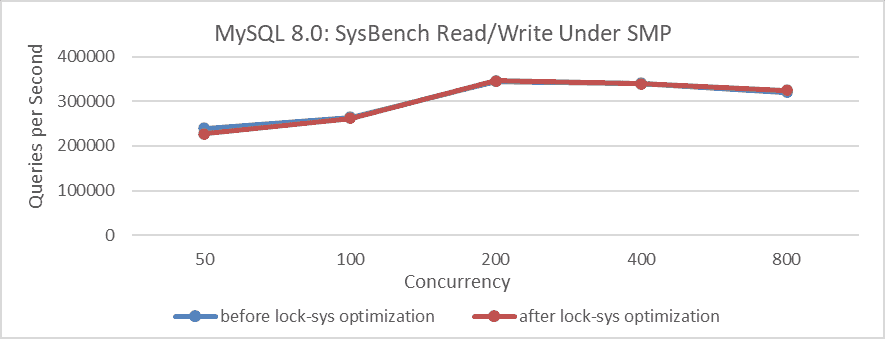

图 2-14. 在 SMP 下锁-sys 优化前后 SysBench 读写测试的比较。

图表显示，优化前后的差异最小，几乎可以忽略不计。这表明在测试过程中，锁-sys 优化的有效性被其他因素所掩盖，导致测试结果失真。然而，绑定到 NUMA 节点 0 减少了来自其他瓶颈的干扰，缩小了性能差距。这也表明，锁-sys 优化对 SysBench 标准读写测试的影响有限。

使用 BenchmarkSQL 进行 TPC-C 测试，结果如下：

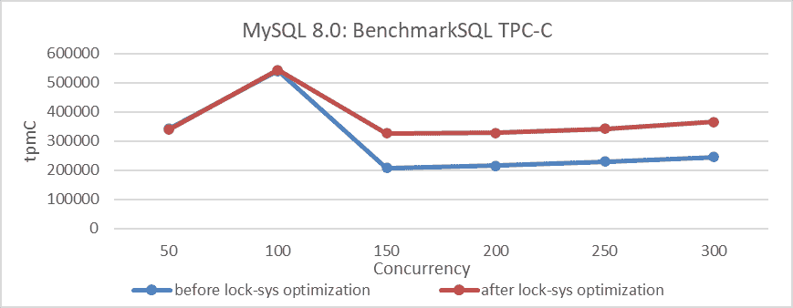

图 2-15. 锁-sys 优化前后 BenchmarkSQL 测试的比较。

图表表明，锁-sys 优化带来了明显的改进。然而，它也提出了疑问，为什么 SysBench 测试没有效果，而 BenchmarkSQL 测试却有效。在接下来的章节中，将详细讨论这两种工具之间的差异以及测试过程中的重要考虑因素。

## 2.9 禁用 NUMA 对 MySQL 真的有益吗？

首先测试了禁用 NUMA 对 MySQL 主服务器的影响。部署设置如下：在具有相同硬件配置的两个 x86 机器上进行了 BenchmarkSQL 高压压力测试。一台机器在 BIOS 中禁用了 NUMA，而另一台则启用了 NUMA。以下是 TPC-C 吞吐量与并发的比较图。

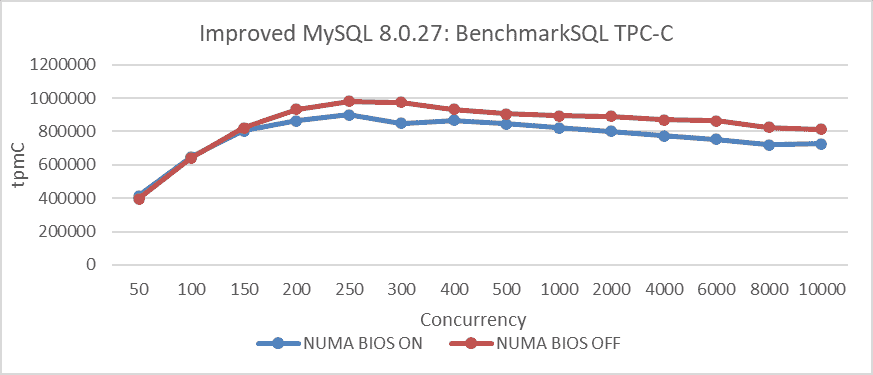

图 2-16. 通过在 BIOS 中禁用 NUMA 显著提高了 TPC-C 吞吐量。

图表表明，在 x86 机器上禁用 NUMA 可以显著提高 TPC-C 吞吐量。这种改进源于在 BIOS 中禁用 NUMA 后的有利内存分配机制，这对像 MySQL 主服务器这样的应用程序特别有益。

现在，禁用 NUMA 是否也有利于 MySQL 二级回放？使用之前提到的相同机器进行测试，设置细节如下：在 BIOS 中禁用 NUMA 的环境中，无法使用 NUMA 绑定，允许使用所有内存。相反，在 BIOS 中启用 NUMA 的环境中，MySQL 二级被绑定到 NUMA 节点 0。以下图显示了在这些不同环境中测试的平衡回放速度。

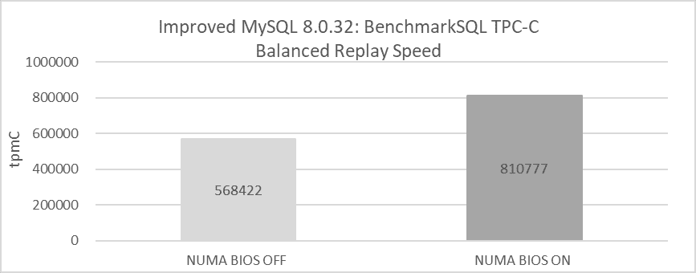

图 2-17. 在 BIOS 中禁用 NUMA 前后平衡回放速度的比较。

该图显示，在 BIOS 级别禁用 NUMA 会导致平衡回放速度仅为约 570,000 tpmC，这主要是由于 MySQL 二级的未解决 NUMA 不友好问题。相比之下，启用 NUMA 并将 MySQL 二级绑定到单个 NUMA 节点可以实现超过 810,000 tpmC 的平衡回放速度。这项测试突出了在 BIOS 级别禁用 NUMA 对 MySQL 二级回放效率的劣势。在 NUMA 禁用的情况下进行有效的 MySQL 二级回放需要解决这些 NUMA 不友好问题，因为未能这样做会显著降低效率。即将到来的第十章将详细检查这些 NUMA 不友好问题。

## 2.10 概述

本章深入探讨经典且复杂的 MySQL 问题，这些问题对分析提出了重大挑战。解决这些问题的第一步是对以下章节中概述的详细逻辑分析。解决这些问题需要深刻理解计算机基础和 MySQL 内部机制。计算机基础包括广泛的主题，如计算机架构、数据结构、算法、操作系统、计算机网络、编译器、排队论和分布式系统理论等。这些主题将在第四章中详细探讨。第五章将专门关注 MySQL 内部机制。

下一节
