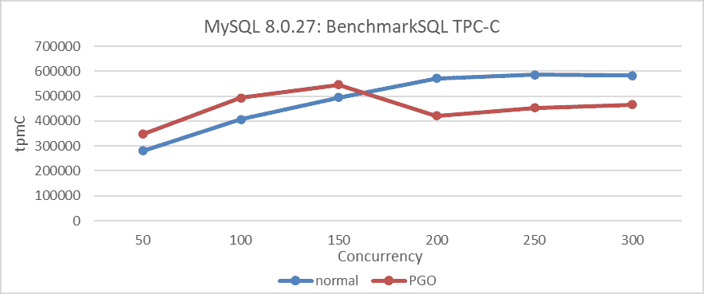
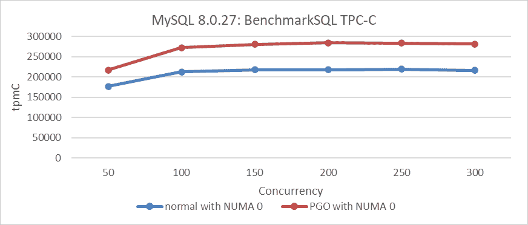
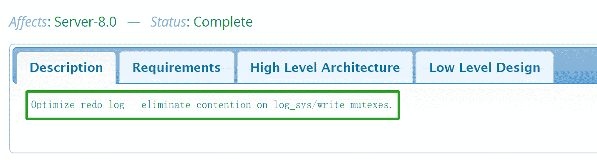
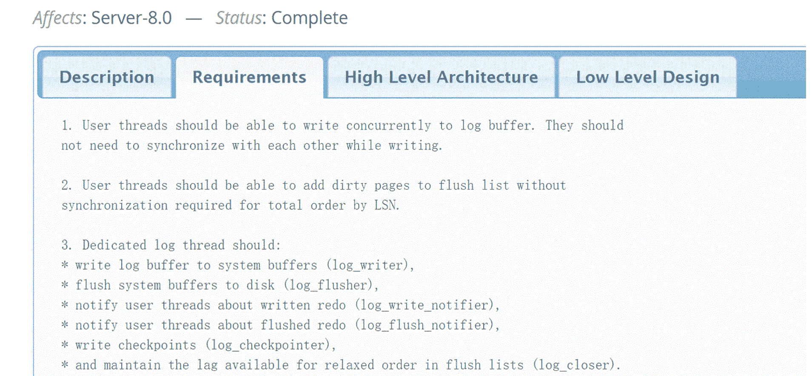
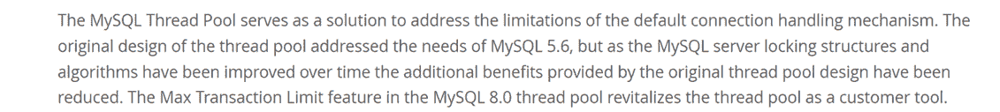
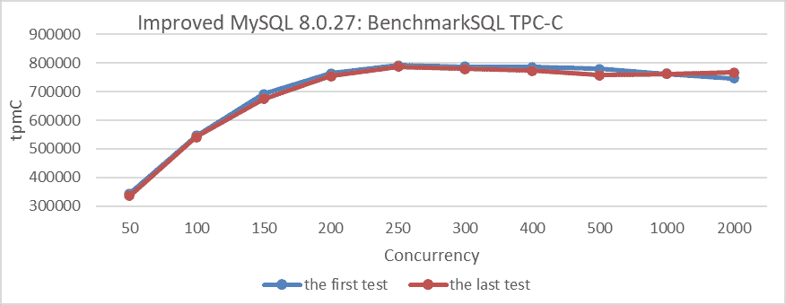
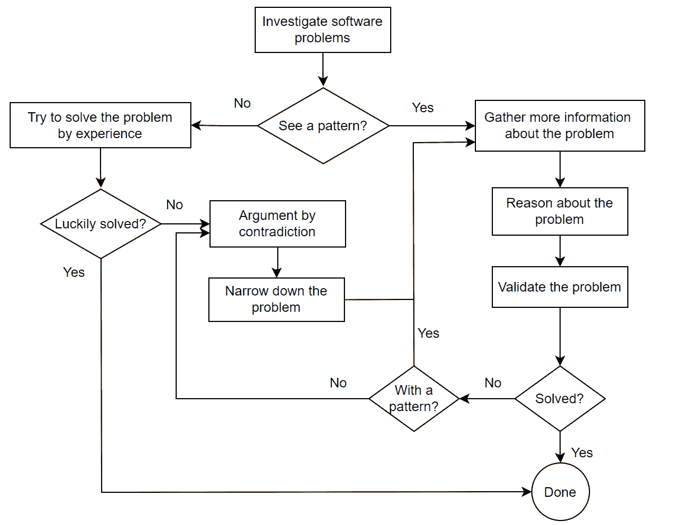

# 第三章：如何有效解决软件问题

> 原文：[`enhancedformysql.github.io/The-Art-of-Problem-Solving-in-Software-Engineering_How-to-Make-MySQL-Better/Chapter3.html`](https://enhancedformysql.github.io/The-Art-of-Problem-Solving-in-Software-Engineering_How-to-Make-MySQL-Better/Chapter3.html)


当遇到具有挑战性的问题时，软件专业人士通常会依赖经验来寻找解决方案。然而，尤其是这本书中讨论的众多 MySQL 问题，仅凭经验很难确定问题的根本原因。因此，需要科学的方法来分析和解决这些问题。

本章讨论了如何从两个不同层面分析解决问题：策略和战术 [1]。

## 3.1 分析策略

存在许多分析策略，包括心理策略、简化策略、模式发现策略、提高可重现性的策略和寻找关键证据的策略。

### 3.1.1 心理策略

许多人经常感到问题压倒性，尤其是当它们看似神秘或难以解决时。当他们遇到这样的挑战时，他们首先的本能是如果自己无法解决，就寻求他人的帮助。然而，仅仅依赖他人可能会阻碍通过问题解决来发展和加强自己的逻辑思维能力的机会。

面对困难，尤其是那些看似复杂的问题，以自信的态度去应对是至关重要的。这些挑战可以作为挖掘个人潜力并提高问题解决能力的机遇。MySQL 作为一款复杂的数据库软件，提供了许多这样的挑战。

首先，随着时间的推移，遇到这些挑战会导致对 MySQL 的更深入理解。其次，它们提供了宝贵的解决复杂问题的机会，从而提高开发者的问题解决能力。最后，与 MySQL 相关的历史问题非常有价值；没有它们，像这样的书籍就不会存在。每个挑战都有助于扩展我们的知识库并完善我们解决 MySQL 相关问题的方法。

### 3.1.2 简化策略

当问题发生且重现原始条件非常复杂时，逐步简化重现环境是至关重要的。这种方法允许你检查问题是否仍然存在。如果存在，你继续简化直到问题不再显现。这种策略显著简化了问题分析难度。例如，当处理 MySQL 集群的问题时，首先检查问题是否出现在单个 MySQL 实例上。如果出现，就没有必要设置整个集群；你可以使用单个实例进行故障排除。

### 3.1.3 模式发现策略

当问题复发时，它通常会揭示潜在的特征，从而促进与问题相关的模式和规律性的统计聚合。这些数据支持问题的重现和推理。例如，在 PGO 之后，而不是增加，峰值性能反而下降。在各个并发级别进行测试时，在高并发下出现了显著的下降，而在较低级别观察到改进。这一洞察为解决后续问题奠定了基础，并增强了在高度并发场景下 PGO 提高吞吐量的潜力的信心。

### 3.1.4 提高可重现性的策略

许多问题是环境特定的，通常在并发度高时偶尔出现。挑战在于解决这些不经常发生的情况，这些情况可能每几个月才发生一次。将问题重现的频率从每几个月一次提高到每几个小时或几分钟，可以显著简化它们的解决。

如何实现这一点？捕捉问题发生中的模式至关重要。例如，在处理组复制中同时发生的、偶尔冻结视图的故障时，分析统计模式可以揭示关键见解。这些问题通常围绕特定的阈值聚集。将底层通信超时设置调整到与网络中断持续时间一致，可以更频繁地重现问题。一旦理解了这些关键因素，重现问题的可能性显著增加，为有效解决问题奠定了坚实的基础。

因此，能够重现问题通常在解决难题时至关重要。通过捕捉问题复发的特征来提高可重现性是加速问题解决的关键。

### 3.1.5 寻找关键证据的策略

有时，直接揭示问题的特征是具有挑战性的；它需要创造条件，以充分展现问题。让我们回顾下面的图，以 PGO 为例。



图 3-1. 在 MySQL 8.0.27 下使用 PGO 前后的性能比较测试。

PGO（基于配置文件优化）在低并发情况下有效提高吞吐量。然而，人们普遍认为，在高并发场景中，其他因素的干扰限制了 PGO 实现预期效果的能力。

基于上述分析，将 MySQL 实例绑定到 NUMA 节点 0 使我们能够探索 PGO 是否能够在 SMP 环境中实现其性能潜力。对于具体的比较测试结果，请参阅以下图：



图 3-2. 在 MySQL 8.0.27 下使用 PGO 前后的性能比较测试。

从图中可以看出，绑定到单个 NUMA 节点表明 PGO 显著提高了所有显示的并发场景的性能。这一发现强调了 PGO 提高 MySQL 吞吐量的能力，为在 NUMA 环境中提高性能奠定了坚实的基础。

关于 2.4 节中讨论的 TPC-C 吞吐量急剧下降，用户在升级到 MySQL 8.0.29 后的回归测试中遇到了这个问题。值得注意的是，在 MySQL 8.0.25 中没有出现这种性能下降。用户对这种差异的反馈对于解决过程至关重要，极大地促进了问题的解决。

## 3.2 逻辑思维

编程的核心是解决问题。逻辑推理使程序员能够将复杂问题分解成可管理的组件，通过分析需求、理解元素之间的关系以及逻辑和高效地规划，来制定实际可行的解决方案。这种结构化方法使程序员能够进行批判性思考并创造性地创新[56]。逻辑推理在计算机工程中对于创建合理的推断至关重要。在工作场所中，逻辑思维的增强通过改进决策和减少错误来提高生产力。基于顺序思维，逻辑是所有系统分析、解决方案设计、错误纠正和性能优化的基础。它利用演绎、归纳、类比推理和归谬法来收集关键证据、识别矛盾并确保软件可靠性。

### 3.2.1 演绎推理

演绎推理涉及从前提中得出结论，通常结构为三段论。三段论通常包括一个主要前提、一个小前提和一个结论。例如：

+   主要前提：所有集群数据库都无法同时满足 CAP（一致性、可用性和分区容错性）的三个要求。

+   小前提：Group Replication 是一种集群数据库。

+   结论：因此，Group Replication 也不能满足 CAP 的三个要求。

由于 Group Replication 无法满足这些要求，它应根据用户特定的需求来选择，而不是试图满足所有标准。

这里还有一个例子：

+   主要前提：异步网络系统难以区分缓慢响应和系统故障。

+   小前提：TCP 通信依赖于异步网络。

+   结论：因此，TCP 通信系统在区分缓慢响应和实际系统故障方面也遇到了挑战。

由于这些挑战，TCP 设计必须包含特定的功能，例如强大的超时机制和对幂等性的支持。

### 3.2.2 归纳推理

归纳推理从具体实例推断出一般结论。例如：

+   在 x86 NUMA 平台上，原生 MySQL 8.0.32 在 Read Committed 隔离级别下表现出较差的可伸缩性。

+   在 ARM NUMA 平台上，原生 MySQL 8.0.32 在 Read Committed 隔离级别下同样表现出较差的可扩展性。

因此，在各种 NUMA 平台上，原生 MySQL 8.0.32 在 Read Committed 隔离级别下始终表现出较差的可扩展性。归纳推理在问题分析中至关重要，并在各种应用中具有实际意义。

### 3.2.3 归纳推理

归纳推理，也称为逆向推理，涉及从观察到的事实中推导出最佳解释。它是解决编程问题中广泛使用的方法，尤其是在症状明显但根本原因不明确时。例如，在用 PGO（配置文件引导优化）优化 MySQL 后，如果吞吐量峰值下降而不是上升，归纳推理可能揭示出在 NUMA 环境中 MySQL 处理不当是导致这种结果的原因。

### 3.2.4 反证法

“Reductio ad absurdum”是一种通过证明其逻辑结论导致荒谬或矛盾的结果来反驳命题的方法。这种方法旨在表明，一个陈述或假设必须是错误的，因为接受它会导致不逻辑或不可接受的结果。这是一种常见的反驳论点的方法，其策略是“*退而求进*”，通过引入荒谬来暴露推理中的缺陷。

例如，组复制经常报告网络不可达错误。为了验证这些错误信息的可靠性，应将其视为准确。然而，在不需要外部网络访问的受控 localhost 环境中部署组复制，不应导致相同的网络错误。然而，在正常的 TPC-C 数据加载过程中，频繁的网络不可达错误仍然存在。这种不一致性表明，不能依赖错误信息。

### 3.2.5 全面利用各种方法

软件问题解决中的挑战与数学问题中的挑战显著不同，通常受人类误判和众多外部因素的影响，导致频繁的判断错误。该领域的理论基础相对不发达，增加了问题解决的复杂性。

利用逻辑思维方法是解决复杂编程问题的关键。这些方法通常需要综合多种方法来应对挑战，有时还会结合概率信息。

## 3.3 解决问题的策略

策略本身很少直接解决问题；需要更强大的方法来解决它们。

### 3.3.1 平衡不同选项

一旦确定了问题的根本原因，通常有多种选择可供选择，需要仔细权衡它们的利弊。例如，在解决 InnoDB 与 NUMA 兼容性差的问题时，有两种解决方案：第一种是无锁修改，这种方法复杂、易出错且维护成本高；第二种是提高访问关键锁资源的速度，这是一个更简单的解决方案，但不是最终的解决方案，因为它在极高并发下仍然存在问题。鉴于在修改过程中需要与 MySQL 官方版本保持兼容性的需求，选择了第二种方案，这是一个谨慎的决定。至于在高并发下的可扩展性问题，实现事务节流机制可以提高与无锁解决方案相当的性能。

### 3.3.2 分解问题

复杂问题通常会带来多个相关的问题，这些问题的存在可能会严重影响分析和判断。为了有效地解决这类问题，消除这些干扰、简化问题并最小化误判的风险至关重要。例如，在优化 Group Replication 中的 Paxos 算法时，事先解决其他性能问题是准确评估 Paxos 算法优化影响的关键。

一旦所有干扰都被消除，如果核心问题仍然过于复杂，进一步分解它就变得必要了。下面图示展示了重做日志优化的一个例子：



图 3-3\. 重做日志优化官方工作日志的描述。

为了解决重做日志的可扩展性问题，开发者已经将这个问题细分为以下子问题：



图 3-4\. 重做日志优化官方工作日志的要求。

这涉及到对日志缓冲区的无锁并发写入，为处理写入和刷新过程而专设的线程，等等。

### 3.3.3 通过探索寻找解决方案

面对不熟悉的问题或被过多的细节所淹没时，同时探索和寻求解决方案是至关重要的。这种方法对于解决复杂问题特别有效。例如，在我们对 Paxos 算法进行优化时，最初我们只有对优化的基本概念，还有许多细节尚未考虑。在这个阶段，我们需要通过遇到的挑战来测试和改进我们的解决方案，最终逐步实现我们的优化目标。

### 3.3.4 寻求理论支持

在增强群复制（Group Replication）的过程中，基于状态机复制（State Machine Replication, SMR）理论，首先通过彻底的论文审查获取大量的理论知识至关重要。这种方法有助于加深理解，并在整个增强过程中保持清晰，确保全面掌握概念，防止偏离既定路径。

书籍《设计数据密集型应用》很好地讨论了理论，具体如下 [28]：

*尽管理论论文和证明不一定容易理解，有时会做出不切实际的假设，但它们对于指导该领域的实际工作具有极大的价值：它们帮助我们思考什么可以做，什么不可以做，并帮助我们找到分布式系统常常存在的反直觉缺陷。如果你有时间，这些参考文献非常值得探索。*

值得一提的是，这本书包含了大量的学术材料，作为演绎推理和理论支持的基础。

### 3.3.5 基于逻辑的测试

为了评估新特性的性能改进潜力，从各种角度和环境中进行严格的迭代测试和验证是必不可少的。可靠的结论确保后续测试的可预测结果。在验证过程中观察到的任何偏差都必须彻底调查，以确定潜在的干扰因素。

例如，考虑线程池机制对性能的影响，尤其是在高并发测试条件下。在 MySQL 5.7 上的先前验证表明，线程池带来了显著的吞吐量提升。然而，MySQL 8.0 的后续修改揭示了不同的情景。第 2.3 章中的案例研究表明，Percona 线程池对可扩展性产生了负面影响。MySQL 的官方技术博客报告称，线程池的有效性随时间下降 [31]。



在进行性能比较测试时，消除人为错误，如环境或配置的变化至关重要。为了减轻这个问题，重复初始测试并将其结果与第一次测试的结果进行比较，可以帮助识别显著的变化。如果没有明显差异，这表明中间测试相对可靠。例如，通过以下图中所示的增加一个测试，来比较其与初始测试的性能差异。



图 3-5. 对比初始测试性能差异的附加测试。

重复初始测试可以显著减轻测试不确定性和环境污染的问题。然而，这还不足以解决问题；还必须解释每个测试中的任何异常结果。如果无法提供解释且问题可重现，这通常为优化提供了新的机会。

例如，在 TPC-C 测试期间，观察到吞吐量异常，后来发现是由于省略了 jemalloc 的使用。发现实际上没有 jemalloc 性能更好。广泛的测试发现 MySQL 的 jemalloc 3.6 没有提供最佳性能，这促使人们探索替代的 jemalloc 版本。这些测试强调了内存分配工具对整体性能的显著影响。

## 3.4 逻辑推理的原则

这里是逻辑推理的原则 [15]，它可以在如何进行逻辑推理方面提供一些帮助：

```cpp
1\.  ask for reasons before accepting a conclusion,
2\.  give an argument to support your conclusion,
3\.  design your reasons to imply the conclusion,
4\.  recognize the value of having more relevant information,
5\.  weigh the pros and cons,
6\.  consider the possible courses of action,
7\.  look at the consequences of these various courses of action,
8\.  evaluate the consequences,
9\.  consider the probabilities that those various consequences will actually occur,
10\.  delay making important decisions when practical,
11\.  assess what is said in light of the situation,
12\.  use your background knowledge and common sense in drawing conclusions,
13\.  remember that extraordinary statements require extraordinarily good evidence,
14\.  defer to the expert,
15\.  remember that firmer conclusions require better reasons,
16\.  be consistent in your own reasoning,
17\.  be on the lookout for inconsistency in the reasoning of yourself and others,
18\.  check to see whether explanations fit all the relevant facts,
19\.  you can make your opponent's explanation less believable by showing that there are 
     alternative explanations that haven't been ruled out,
20\.  stick to the subject,
21\.  don't draw a conclusion until you've gotten enough evidence. 
```

## 3.5 逻辑推理：解决复杂问题的关键

许多复杂的软件问题源于信息和逻辑的混淆。为了解决这些问题，通过精确的数据和系统推理来阐明逻辑关系，以追踪根本原因至关重要。利用这种逻辑方法可以显著提高程序员的解决问题的能力。

虽然数据结构和算法是编程的核心，但解决编程问题不仅仅需要熟悉或精通它们。它需要逻辑推理技能。因此，本章的内容构成了后续主题的基础。

## 3.6 解决难题与做练习的区别

在练习中，通常提供必要的信息，使学生能够应用教科书知识和逻辑推理来找到解决方案。这个过程有助于培养解决问题的能力。然而，进入职场并面对真实的编程挑战时，个人往往感到准备不足。学校很少教授如何处理像 MySQL 这样的程序中的复杂问题，这使得初学者感到困惑，不知道从哪里开始或如何找到必要的信息。

复杂的问题可能会让程序员感觉像是遇到了超自然现象，尤其是在他们获得的信息相互冲突或误导时。在实践中，解决具有挑战性的编程问题与解决练习问题明显不同。即使是技术娴熟的团队，也可能花费数月时间筛选干扰信息以确定根本原因，这可能导致不断增加的挫败感。

解决练习和解决现实问题之间的主要相似之处在于逻辑推理。区别在于信息的可访问性：练习在开始时提供必要的信息，而现实问题需要推理来揭示关键、通常被掩盖的信息。这个过程涉及区分真伪，过滤掉干扰，并确定对有效问题解决真正相关的条件。

在许多情况下，获取关键问题解决信息的难度远超过解决问题本身的挑战。

## 3.7 常见问题解决框架

在软件行业，面对问题时，最初的直觉通常是检查其他人是否遇到过类似的问题。然而，在问题解决过程中，个人经常依赖个人经验来提出解决方案，有时没有坚实的基础。怀疑可能指向网络故障或配置问题，促使采取各种行动，这些行动可能只是暂时缓解问题，而没有解决其根本原因。提问者和解决问题的人通常优先考虑快速修复，可能会忽视逻辑推理的关键作用。

考虑一个现实场景：一位数据库管理员（DBA）在进行 MySQL 性能测试时发现不稳定和低吞吐量。他们提供了 CPU、内存和配置的详细信息，指出线程级别的 I/O 存在显著的脏页活动，但省略了具体的 I/O 设备信息。通过 DBA 进行的测试排除了网络问题的猜测。关于自旋延迟配置的建议也被同样驳斥。这种推测性的方法证明是低效的，未能揭示根本问题。

专业的问题解决需要基于观察现象的逻辑推理，系统地缩小问题范围。这包括分析不同并发级别下的使用模式，尝试在不同类型的机器上复制问题，并回顾过去的软件版本以寻找类似问题。这些见解有助于精确的逻辑推理。

回到 DBA 的案例研究，在高性能机器上绑定 NUMA 节点，调整 CPU 和内存资源以匹配用户硬件规格，同时保持高性能的磁盘。随后的测试显示显著提高和稳定的吞吐量。最终，关键问题被定位到 I/O 设备的不匹配。这种方法有效地识别了根本原因，而不是仅仅依赖于经验或推测性方法。

有效的软件问题解决依赖于逻辑推理。下面是一个展示常见问题解决框架的图示。



图 3-6。解决程序问题的通用框架。

该图整合了逻辑推理和信息检索。保持逻辑思维确保每一步的可靠性。没有它，一个人可能会陷入阻碍有效软件问题解决的陷阱。

下一节
