# 第五章：MySQL 内部结构

> 原文：[`enhancedformysql.github.io/The-Art-of-Problem-Solving-in-Software-Engineering_How-to-Make-MySQL-Better/Chapter5.html`](https://enhancedformysql.github.io/The-Art-of-Problem-Solving-in-Software-Engineering_How-to-Make-MySQL-Better/Chapter5.html)


为了解决 MySQL 中固有的众多问题，掌握与 MySQL 相关的扎实知识基础至关重要。本章提供了 MySQL 核心基础知识的详细解释。

## 5.1 InnoDB 的“存储栈”

下图从开发者的角度描述了 InnoDB 存储栈。上层主要包含 SQL 层，而下层由具有事务能力的 InnoDB 存储引擎层组成。SQL 层与 InnoDB 存储引擎层之间的交互通过接口进行。InnoDB 存储引擎主要包括事务层和迷你事务层。InnoDB 通过系统函数与操作系统交互，操作系统与硬件交互。

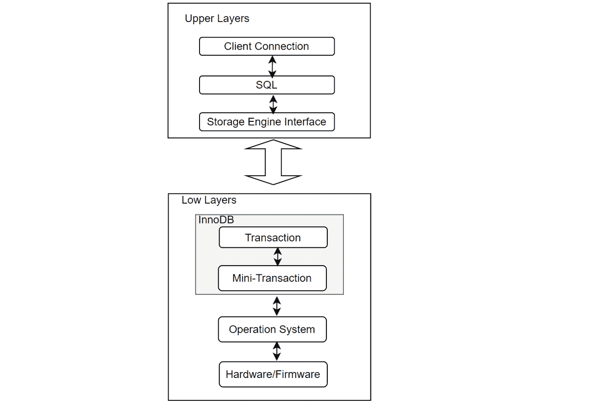

图 5-1\. InnoDB 存储栈。

在 InnoDB 存储引擎中，更改通过迷你事务（mtr）应用，这允许跨多个页面的原子修改。这种方法在并发事务和数据库异常期间保持数据一致性。由于单个事务通常涉及多个页面的更改，迷你事务确保页面级一致性，这意味着单个事务通常包含多个迷你事务。

下图展示了事务与迷你事务之间的函数调用栈关系，展示了事务如何使用迷你事务执行低级操作。

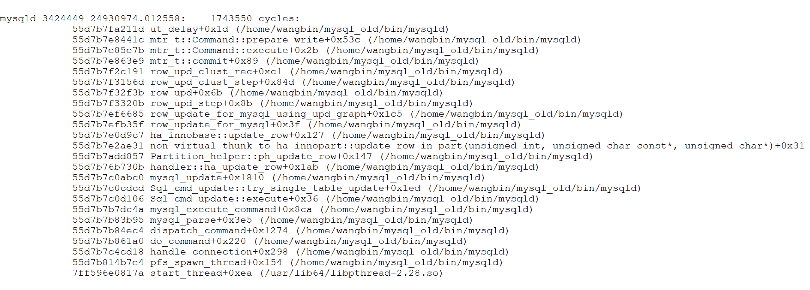

图 5-2\. 事务与迷你事务之间的调用栈关系。

应该强调的是，事务层和迷你事务层共同实现了完整事务的功能。

## 5.2 事务

ACID 模型概述了关键数据库设计原则，这些原则对于商业数据和关键任务应用至关重要。MySQL，如 InnoDB 存储引擎等组件，严格遵循 ACID 模型，以确保数据完整性，防止在软件崩溃和硬件故障等异常情况下数据损坏。依赖 ACID 兼容功能消除了自定义一致性检查和崩溃恢复机制的需求。然而，在存在额外安全措施、使用超可靠硬件或可接受轻微数据丢失或不一致的情况下，MySQL 设置可以调整以在 ACID 可靠性和性能或吞吐量之间进行权衡[13]。

要实现事务，必须满足以下 ACID 属性：

1.  **原子性**：确保“全有或全无”的语义，意味着事务的所有操作要么全部完成，要么一个都不完成。这一方面主要涉及 InnoDB 事务。

1.  **一致性**：要求每个事务都维护数据库预定的完整性规则，将其从一种一致状态转换为另一种状态。一致性由数据库管理系统保证，并涉及 InnoDB 的内部处理以保护数据免受崩溃的影响。

1.  **隔离性**：防止事务相互干扰，确保未完成的事务对其他人不可见。隔离性主要通过 InnoDB 事务和每个事务应用的隔离级别来管理。

1.  **持久性**：保证一旦事务提交，它就会保持这种状态，即使在崩溃的情况下也是如此。这一方面涉及 MySQL 软件功能和硬件配置，并且是提供具体指南最复杂的方面。

在 InnoDB 存储引擎中：

+   **事务层**：

    +   **原子性、一致性和隔离性**：通过锁和 ReadView 实现。

    +   **跨引擎原子提交**：使用 XA 两阶段提交（2PC）实现，确保 SQL 层 binlog 和 InnoDB 重做日志之间的原子性，形成崩溃恢复的基础。

+   **最小事务层**：

    +   **原子性、一致性和持久性修改**：通过跨多个页面的重做/回滚日志交互进行管理，支持崩溃恢复。

总体而言，原子性、一致性和持久性是通过最小事务层和事务层共同实现的，而隔离性主要在事务层管理。

在 InnoDB 中，每个事务都被分配一个事务 ID，该 ID 严格按照时间顺序严格递增。事务 ID 不仅由外部事务生成，还由 MySQL 内部的各种操作生成，例如 GTID 更新触发内部事务以实现持久性。

## 5.3 并发控制

高性能事务系统需要并发事务以满足性能需求。没有并发控制，这些系统无法提供正确的结果或维护一致的数据[45]。

并发控制允许最终用户同时访问数据库，同时保持每个事务似乎在专用系统上独立运行的错觉，确保原子性和隔离性。

两阶段锁定（2PL）是确保数据库系统中并发事务正确执行的第一种已证明的方法。在 2PL 下，事务必须在读取或写入数据库元素之前获取对这些元素的锁。一个事务需要一个读锁来读取一个元素，需要一个写锁来修改它。

在线事务处理（OLTP）系统依赖于并发控制协议来确保并发执行的事务的串行化。当两个并行事务尝试访问相同的数据项时，并发控制协议会协调它们的访问以保持串行化。不同的协议以各种方式实现这一点。基于锁的协议，如两阶段锁（2PL），将锁与每个数据项关联。在释放任何锁之前，事务必须获取所有必要的锁（共享或独占）。基于验证的协议，如乐观并发控制（OCC），使用可能过时或未提交的数据执行事务，并在提交前验证其串行化 [51]。

MySQL 的默认隔离级别是可重复读。在这个级别上，事务开始时获取一个 ReadView，确保整个事务中数据读取的一致性。该机制使用 ReadView 中的事务 ID 信息从回滚日志中获取指定的数据版本，以保持数据一致性。

## 5.4 事务隔离级别

事务隔离是数据库处理的基本要素。隔离，ACID 中的“I”，在多个事务同时发生时平衡性能、可靠性、一致性和可重复性 [45]。在 InnoDB 中，实现了传统的四个事务隔离级别，这里主要关注可重复读（RR）、可重复读（RC）和可串行化级别。

值得注意的是，并发控制只是影响数据库管理系统可扩展性的几个方面之一 [51]。

MySQL 中最常用的隔离级别是可重复读（Read Committed），这也是 Oracle 的默认设置。本书中所有 TPC-C 测试都使用可重复读级别。在可重复读中，事务中的每个读操作都会获取一个相应的 ReadView，如果发生并发修改，可能会导致相同读取操作的数据不同。

可串行化隔离提供了最强的隔离形式，类似于串行执行。然而，可串行化隔离并不强制执行串行执行；如果事务不冲突，它们可以并行执行。

## 5.5 MVCC

由于性能和其他考虑因素，数据库很少仅基于锁来实现隔离级别。MVCC + 锁的方法是最流行的实现方式，因为它允许在不锁定的情况下读取请求。

在 MVCC（多版本并发控制）下，每个写操作都会创建一个元组的新版本，并带有事务的时间戳标记。数据库管理系统为每个元素维护一个版本列表，确定事务在读取操作期间将访问哪个版本。这确保了操作的串行化顺序，并防止由于数据被覆盖而拒绝读取操作。

InnoDB，一个多版本存储引擎，保留已更改行的旧版本以支持并发和回滚。这些信息存储在回滚段内的撤销表空间中，其中包含插入和更新撤销日志。插入撤销日志仅用于事务回滚，提交后可以丢弃。更新撤销日志用于一致性读取，只能在没有事务需要它们来构建行的早期版本时才能丢弃。

建议定期提交事务，包括具有一致性读取的事务，以防止回滚段过度增长并填满其所在的撤销表空间[13]。

## 5.6 InnoDB 架构

以下图示说明了构成 InnoDB 存储引擎架构的内存和磁盘结构。

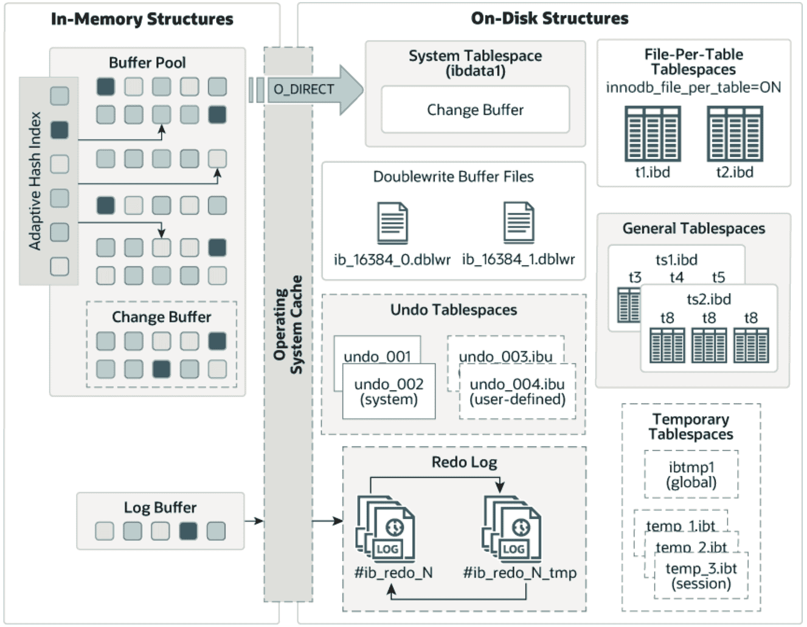

图 5-3\. 从官方 MySQL 文档借用的 InnoDB 架构。

**内存结构**

1.  **缓冲池**:

    +   在主内存中缓存表和索引数据，允许频繁访问的数据直接从内存中读取，从而加快处理速度。

    +   分为页面以容纳多个行，使用链表和 LRU（最近最少使用）算法的变体进行管理。

    +   MySQL 调优的关键方面，以实现高效的高容量读取操作。

1.  **日志缓冲区**:

    +   存储要写入磁盘的日志文件中的数据，定期刷新到磁盘。

    +   较大的日志缓冲区允许在提交前不将重做日志数据写入磁盘，从而减少磁盘 I/O。

    +   由**innodb_flush_log_at_trx_commit**变量控制。

**磁盘结构**

1.  **双写缓冲区**:

    +   一个中间存储区域，在页面最终写入 InnoDB 数据文件之前，从缓冲池中写入页面。

    +   确保从系统崩溃或意外关闭导致的部分写入中恢复。

    +   尽管数据被写入两次，但效率高，不会加倍 I/O 开销。

1.  **重做日志**:

    +   用于崩溃恢复的基于磁盘的结构，纠正不完整事务的数据。

    +   编码来自 SQL 语句或低级 API 调用的更改；在崩溃后初始化期间自动重放。

    +   通过 ARIES 算法优化随机写入到顺序日志写入（提高性能）[2]。

    +   重做日志文件对于确认事务完成至关重要。

1.  **撤销日志**:

    +   回滚段内的撤销日志段的一部分，位于撤销表空间和全局临时表空间中。

    +   对于事务回滚和 MVCC（多版本并发控制）读取至关重要。

通过有效管理这些结构，InnoDB 实现了高可靠性和性能的平衡。

## 5.7 日志管理器

日志管理器是现代数据库管理系统的一个关键组件，由于其集中式设计和对 I/O 的依赖，常常容易成为瓶颈。长时间的刷新时间、由日志引起的闩锁竞争以及主内存中日志缓冲区的竞争都会影响可伸缩性，没有单一的瓶颈完全负责次优性能。现代系统可以达到每秒 100 千次事务或更高的交易率，加剧了日志瓶颈。现有研究为这些瓶颈提供了一些部分解决方案，但没有一个提供适用于今天多核硬件的完全可伸缩的日志管理器[3]。

日志管理器是 MySQL 5.7 的主要可伸缩性瓶颈。然而，MySQL 8.0 在这个领域进行了重大重构，从而在可伸缩性方面取得了实质性改进。

## 5.8 锁调度算法

在计算机科学中，调度是将资源分配给执行任务的行为[45]。调度算法是由系统需求决定的资源分配策略，例如 FIFO（先进先出）、轮转和最短作业优先（SJF）。这些算法用于操作系统、数据库和网络。

MySQL 5.7 使用了经典的 FIFO 锁调度算法。从 MySQL 8.0.20 版本开始，后续版本采用了 CATS（Contention-Aware Transaction Scheduling）锁调度算法。这次变更的目的是提高 MySQL 操作的整体效率并提高吞吐量。

让我们分析 MySQL 8.0 中使用的 CATS 算法。CATS 算法的核心思想是在释放锁时优先考虑具有更高加权成本的交易锁。下面的图示说明了 CATS 的原理机制[57]。尽管事务 t1 具有更深的子图，但 CATS 将锁分配给了 t2，因为完成 t2 可以触发更多并发事务的执行。


图 5-4. 从论文《针对事务数据库的竞争感知锁调度》中借用的锁调度示例。

CATS 算法在严重锁竞争的场景中理论上具有显著的有效性。它在 SysBench Pareto 分布测试场景中显示了一些影响，但它的确切有效性取决于具体环境。

第七章将随后对 CATS 调度算法进行详细讨论。

## 5.9 Binlog 文件

MySQL 通过在 SQL 层引入 binlog 文件来记录事务修改，从而提高了其多功能性，便于数据复制和灾难恢复。对于 MySQL 事务，更改首先写入 binlog 文件，然后写入重做日志文件，通过 XA 两阶段提交（2PC）机制确保原子性。

Binlog 文件对于数据复制和高可用性至关重要，支持异步复制、半同步复制和组复制。

本书侧重于基于行的 binlog，其中事务以事件的形式存储。

随着快速固态硬盘和组提交等技术的出现，日志刷新 I/O 时间的影響已经减小。

## 5.10 组提交机制

MySQL 引入了 binlog 组提交机制，通过在多个事务同时提交时合并多个 binlog 刷新操作，减少了磁盘 I/O 操作的数量。这种方法通过推迟日志访问到稳定存储，在内存中聚集多个提交，并为一组事务执行单个写入和刷新操作，从而减少了磁盘 I/O。

组提交策略通过将多个日志刷新请求聚合为单个 I/O 操作，提高了磁盘性能。然而，组提交并不能消除不想要的上下文切换，因为事务阻塞了日志的待处理通知，而不是直接在 I/O 请求上阻塞 [3]。需要有效的激活机制来减少上下文切换，但当前 MySQL 的实现效率不高。这个问题将在第八章中详细探讨。

## 5.11 执行计划

执行计划详细说明了 SQL 语句在 MySQL 查询优化器优化后的执行方式。根据表结构、索引和 WHERE 子句条件，优化器考虑各种技术以执行高效的查找。对大型表的查询可以在不读取所有行的情况下执行，并且可以在不比较每一行组合的情况下进行连接。

MySQL 查询优化器是为简单的、OLTP 类型的查询设计的，对于复杂查询存在局限性。例如，在实际应用中，连接顺序优化仅使用左深计划和使用贪婪算法。下面的图示说明了 MySQL 查询优化和执行架构 [44]。解析器和求解器层处理语法检查、名称解析、访问控制、数据类型和字符串排序。在准备阶段，发生逻辑转换，例如合并派生表、谓词下沉和将子查询转换为连接。

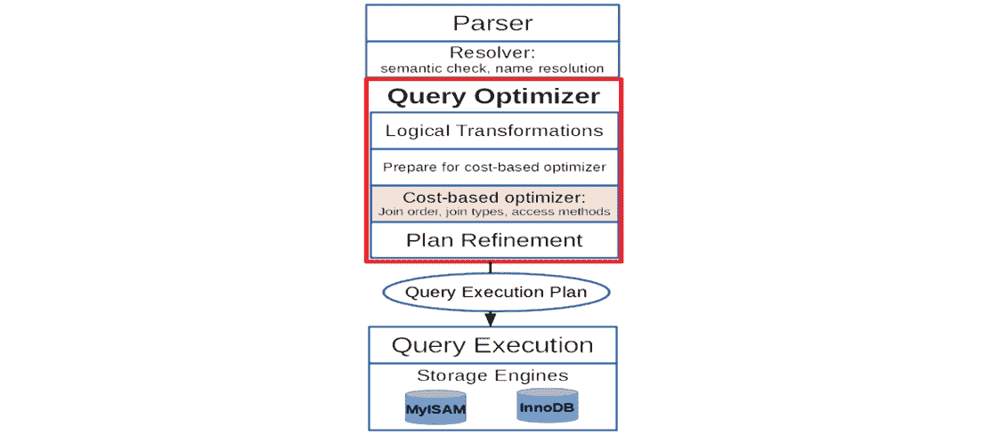

图 5-5\. MySQL 查询优化和执行架构借鉴自论文《将 Orca 优化器集成到 MySQL》。

基于成本的优化，一次仅限于一个 SELECT 块，确定最佳连接顺序、连接方法和表访问方法。优化器通常只考虑左深计划，并在所有表连接后进行聚合。计划细化包括将选择条件推入表和索引中，如果索引扫描提供排序的行则避免排序，并添加聚合、分组级别过滤和行限制执行。

启发式算法可能会错过最优计划，导致执行时间更长。连接顺序优化已被广泛研究，并为多核架构开发了并行方法。由于连接顺序优化的 NP-hard 特性，使用了启发式解决方案和有限的搜索空间。

通常情况下，MySQL 的执行计划中仍然存在大量的优化潜力。MySQL 持续探索新的方法，这些方法在 MySQL 8.0 中得到了体现。

## 5.12 分区

分区允许您根据您定义的规则在文件系统上分布表数据，有效地将表的不同部分作为单独的表存储在不同的位置。这种由分区函数控制的划分可以使用模数、范围或列表匹配、内部哈希或线性哈希。用户指定的函数将用户提供的表达式作为其参数，该表达式可以是列值、作用于一个或多个列值的函数，或是一组列值 [13]。

使用分区的优点如下：

1.  允许存储比单个磁盘或文件系统分区所能容纳的更多数据。

1.  通过允许通过删除分区轻松删除过时数据，以及通过添加分区来促进新数据的添加，简化数据管理。

1.  通过限制搜索到包含相关数据的特定分区来优化查询。

MySQL 分区不仅提供了这些好处，还在高并发下减少了大型表的闩锁竞争。以下图显示了在 BenchmarkSQL 中对大型表进行分区后对 TPC-C 吞吐量的影响。

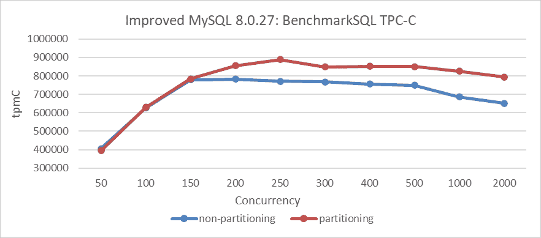

图 5-6\. 分区前后 BenchmarkSQL 测试的比较。

该图显示，在低并发下，分区的影响最小。然而，当并发超过 150 时，分区通过缓解大型表的闩锁冲突，显著提高了吞吐量。

除非另有说明，本书中所有 TPC-C 测试都使用分区的大型表。每个表都有自己的闩锁，分区采用闩锁分片来减少高并发下的闩锁冲突，防止闩锁竞争影响大型表的性能测试。

## 5.13 协调避免

在数据库系统中，最小化并发执行操作之间的协调对于最大化可伸缩性、可用性和性能至关重要。然而，无协调执行可能会损害应用程序的正确性和一致性。虽然可序列化事务保持正确性，但它们对于所有应用程序来说并非必要，并且可能会限制可伸缩性 [25]。

## 5.14 灾难恢复

灾难恢复确保数据库在故障后能够重新上线。对于 MySQL 来说，这涉及到及时刷新 binlog 和重做日志，以及写入双写缓冲区，以防止损坏的数据页引起的恢复问题。

## 5.15 幂等性

创建或修改表和例程的数据库代码应该是幂等的，以避免多次应用时出现的问题。幂等性通过按批次记录进度，而不是按单个记录记录，防止在同步失败期间创建重复数据。当同步中断时，进程通常必须从最后一个批次的开始重新启动，导致重新处理一些数据。

这里是一个 MySQL 从节点重放的示例。在以下代码片段中，MySQL 在从节点上的重放过程中实现了幂等性。

```cpp
 const bool skip_transaction = is_already_logged_transaction(thd);
  if (gtid_next_list == nullptr) {
    if (skip_transaction) {
      skip_statement(thd);
      return GTID_STATEMENT_SKIP;
    }     
    return GTID_STATEMENT_EXECUTE;
  } else { 
```

调用 *is_already_logged_transaction* 函数以确定事务是否已经执行。如果已执行，则 *skip_transaction* 设置为 true。因此，后续过程立即返回 *GTID_STATEMENT_SKIP*，停止进一步重放事务。

## 5.16 线程池

MySQL 使用每个客户端连接一个线程来执行语句。当连接数量超过某个阈值时，性能会下降。以下图显示了 MySQL 5.7.36 的 TPC-C 吞吐量与并发性测试。

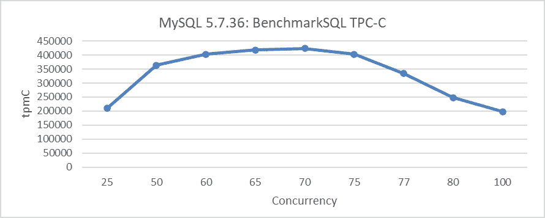

图 5-7. MySQL 5.7.36 的 TPC-C 吞吐量与并发性。

当并发级别达到 75 后，吞吐量急剧下降，证实了上述结论。

线程池重用固定数量的线程来处理多个客户端连接，从而减少开销并避免竞争和上下文切换[31]。MySQL 线程池将用户连接与线程分离。每个用户连接不再有专用的操作系统线程。相反，线程池由线程组组成，默认为 *n* 个组。用户连接以轮询方式分配到线程组。每个线程组管理连接的子集，一个或多个线程从这些连接中执行查询。


图 5-8. 从 MySQL 博客借用的线程池模型。

Percona 线程池在 MySQL 5.7 中被广泛使用，但随着 MySQL 8.0 的改进可伸缩性，其作用已经减弱。MySQL 8.0 引入了新的线程池模式，旨在防止随着用户连接的增加而导致的性能下降。"最大事务限制"功能限制了同时执行的事务数量，通过减少在高度负载系统上的数据锁和死锁来提高整体吞吐量[31]。因此，控制用户线程进入 InnoDB 存储引擎是缓解 MySQL 可伸缩性问题关键。

## 5.17 传统集群

传统的 MySQL 集群依赖于异步和半同步复制，这对维护人员来说简单且易于管理。

### 5.17.1 异步复制

传统的 MySQL 复制采用简单的源到副本方法，主节点应用事务，然后异步地将它们发送到副本节点以进行应用。这个无共享系统默认确保所有服务器都有数据的完整副本[13]。

异步复制提供了更好的写可伸缩性，但以牺牲较低的数据一致性为代价。以下图是异步复制的流程图[13]。主节点继续执行，而不等待从节点的确认，导致用户 SQL 查询响应时间与单个服务器相当。然而，如果主节点在从节点收到最新数据之前失败，这可能导致数据丢失。

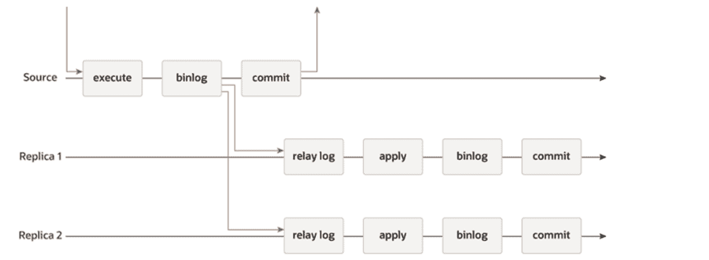

图 5-9\. MySQL 异步复制，借用自官方 MySQL 文档。

当使用异步复制时，如果主节点失败并选择了一个新的领导者，旧领导者的未复制写操作可能会丢失。这可能导致冲突和持久性问题。通常，解决方案是丢弃旧领导者的未复制写操作，这可能与客户端的持久性期望不符。如果两个领导者都接受写操作而不进行冲突解决，那么如果不妥善管理，存在两个节点同时关闭的风险[28]。

### 5.17.2 半同步复制

为了解决异步复制中的数据丢失问题，MySQL 引入了半同步复制。在半同步复制中，事务提交需要相应的 binlog 至少被发送到至少一个 MySQL 副本节点，然后才能继续。这确保至少有一个副本节点拥有最新的数据。

在 MySQL 的半同步复制中，副本节点仅在将中继日志写入磁盘后才会向主节点发送 ACK 回复。主节点在继续事务之前至少等待一个 ACK 回复。这引入了来自网络时间的额外延迟，以及从节点处理 binlog 事件并将它们写入磁盘。

在传统的可用性设置中，半同步复制可能会很繁琐且复杂。例如，Meta 在其基于 Raft 协议的高可用性实现中已经强调了这些问题[38]。

由于仅半同步复制并不能完全解决高可用性问题，因此出现了许多第三方工具，MySQL 也引入了组复制。

### 5.17.3 半同步复制的可伸缩性如何？

这里是显示在发送 ACK 响应之前半同步复制所经过过程的相应代码：

```cpp
 while (!io_slave_killed(thd, mi)) {
        ulong event_len;
        ...
        THD_STAGE_INFO(thd, stage_waiting_for_source_to_send_event);
        event_len = read_event(mysql, &rpl, mi, &suppress_warnings);
        ...
        THD_STAGE_INFO(thd, stage_queueing_source_event_to_the_relay_log);
        event_buf = (const char *)mysql->net.read_pos + 1;
        ...
        if (RUN_HOOK(binlog_relay_io, after_read_event,
                     (thd, mi, (const char *)mysql->net.read_pos + 1, event_len,
                      &event_buf, &event_len))) {
          mi->report(ERROR_LEVEL, ER_REPLICA_FATAL_ERROR,
                     ER_THD(thd, ER_REPLICA_FATAL_ERROR),
                     "Failed to run 'after_read_event' hook");
          goto err;
        }
        ...
        QUEUE_EVENT_RESULT queue_res = queue_event(mi, event_buf, event_len);
        if (queue_res == QUEUE_EVENT_ERROR_QUEUING) {
          mi->report(ERROR_LEVEL, ER_REPLICA_RELAY_LOG_WRITE_FAILURE,
                     ER_THD(thd, ER_REPLICA_RELAY_LOG_WRITE_FAILURE),
                     "could not queue event from source");
          goto err;
        }
        ...
        if (RUN_HOOK(binlog_relay_io, after_queue_event,
                     (thd, mi, event_buf, event_len, synced))) {
          mi->report(ERROR_LEVEL, ER_REPLICA_FATAL_ERROR,
                     ER_THD(thd, ER_REPLICA_FATAL_ERROR),
                     "Failed to run 'after_queue_event' hook");
          goto err;  
        } 
        ...
        thd->mem_root->ClearForReuse();
      } 
```

在 binlog 文件中，一个事务由多个事件组成。对于 TPC-C 事务，有数十个事件是正常的。每个事件都要经过如 *read event*（读取事件）、*after_read_event*（读取后事件）、*queue event*（队列事件）和 *after_queue_event*（队列后事件）等过程。事务包含的事件越多，处理时间越长，所有这些事件都由单个线程处理。这种单线程处理限制，加上基于事件的处理，意味着半同步复制具有有限的计算能力和较差的可扩展性。

下图显示了半同步复制的 TPC-C 吞吐量与并发测试。可以观察到，半同步复制的可扩展性非常弱，远低于重构后的组复制。

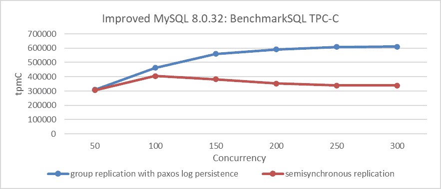

图 5-10\. 带 Paxos 日志持久性的组复制与半同步复制的性能比较。

## 5.18 组复制

为了持续运行，业务需要其数据库的高可用性。为了确保持续可用性，数据库必须具有容错性和健壮性，能够承受故障。这些特性是通过组复制 [13] 实现的。

### 5.18.1 为什么实现组复制？

异步和半同步复制无法完全解决高可用性的复杂性。为了实现高可用性，MySQL 使用基于 Paxos 算法的状态机复制，称为组复制。这种方法从理论上解决了其他复制方法无法解决的高可用性问题。尽管具有潜力，但组复制面临着众多挑战，这也是它没有获得广泛普及的原因。

### 5.18.2 为什么最初采用孟子？

孟子是一种基于 Paxos [32] 的多主状态机复制协议。它旨在在高客户端负载下实现高吞吐量，在低客户端负载下实现低延迟，适应不断变化的网络和客户端环境。孟子将共识协议实例的序列分割到服务器之间，分摊领导者负载，并在 CPU 密集型操作时提高吞吐量。它还通过允许客户端使用本地服务器作为领导者，充分利用可用带宽并降低延迟。由于这些优势，孟子与组复制的多主模式设计相一致，其中每个 MySQL 节点都可以在任何时候执行写操作，并且最初被 MySQL 采用。

### 5.18.3 为什么引入单主多 Paxos 算法？

单主多 Paxos 算法具有以下特性 [13]：

+   它依赖于单个领导者来选择请求序列。

+   这种简单性导致领导者附近的客户端具有高吞吐量和低延迟，但远离领导者的客户端具有更高的延迟。

+   领导者成为瓶颈，限制了吞吐量，并创建了一种不平衡的通信模式，导致可用网络带宽利用率低下。

MySQL 引入了单领导者多 Paxos 算法，以在单主模式下提高性能和弹性，尤其是在某些从节点不可达的情况下[13]。

在跨数据中心场景的测试中，使用单领导者多 Paxos 算法显著提高了单主模式下的 Group Replication 性能。然而，它也有其他节点需要发送数据时的延迟高的缺点，因为它们必须从领导者获取请求序列号。

### 5.18.4 Group Replication 是否会丢失数据？

Group Replication 实现了状态机复制，但并不固有地包含持久状态机复制，这意味着 Paxos 消息不会被持久化。这种设计选择意味着虽然集群内可以达成共识，但在极端情况下可能会发生数据丢失。例如，如果所有 Group Replication 节点同时崩溃，并且 MySQL 主节点无法重启，剩余节点组成的集群可能会丢失尚未写入磁盘的事务数据。

### 5.18.5 Group Replication 是否会优于半同步复制？

孟子算法从理论上使 Group Replication 能够达到内存共识，绕过了在 Paxos 层解析事务事件的需要。此外，批处理机制可以将多个事务合并为单个消息进行 Paxos 通信。基于此，预计 Group Replication 的吞吐量将超过半同步复制。

### 5.18.6 单线程是否足够用于底层 Paxos 通信？

Paxos 是串行操作的，但通过管道化和批处理，它显著提高了吞吐量。因此，即使有多线程的 Paxos 通信，Group Replication 的整体系统吞吐量通常不受影响。然而，大事务可能会压垮单个线程，因此需要多个线程来减少等待时间并加快处理速度。总之，虽然单个线程对于典型事务来说是足够的，但处理大量的大事务可能需要多个线程。

### 5.18.7 Paxos 单领导者与 Group Replication 单主模式

Group Replication 使用两种 Paxos 变体：单领导者多 Paxos 和多个领导者孟子。在单主模式中，只有一个节点处理事务更新，而在多主模式中，所有节点都可以执行更新。下面的图示说明了这些算法与 Group Replication 的应用模式之间的关系：

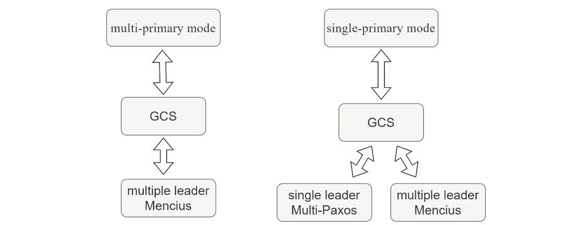

图 5-11. Paxos 变体算法与 Group Replication 模式之间的关系。

在单主模式中，可以使用孟子算法和单领导者多 Paxos 算法。然而，在多主模式中，只有孟子算法适用。这是因为在使用单领导者多 Paxos 算法的多主模式中，每个非领导者节点都需要从领导者节点请求序列号，这会严重降低性能。

单主模式下的 Group Replication 采用单领导者 Multi-Paxos 算法，假设领导者节点主要发送消息，而非领导者节点具有最小角色。这允许高效地使用单领导者 Multi-Paxos 算法，确保节点间有效协调和共识。

### 5.18.8 单主模式下，单领导者 Multi-Paxos 是否普遍适用？

在 Group Replication 的单主模式下，一致的读操作需要每个 MySQL 节点发送‘before’消息，而一致的写操作需要‘after’消息。在这种情况下使用单领导者 Multi-Paxos 算法将显著降低性能。

下图显示了 SysBench 随时间变化的 100 个并发读写操作的吞吐量，MySQL 配置为使用“after”机制进行强一致性写操作。

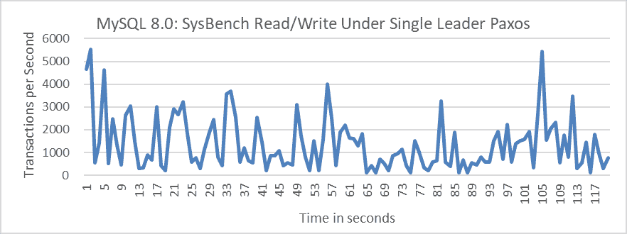

图 5-12\. 在单领导者 Paxos 变体下使用“after”机制进行强一致性写操作的性能。

从图中可以看出，采用单领导者 Multi-Paxos 后，MySQL 主节点进行强一致性写操作的吞吐量显著降低。下图显示了 SysBench 测试结果的局部截图，表明平均响应时间为 73ms。

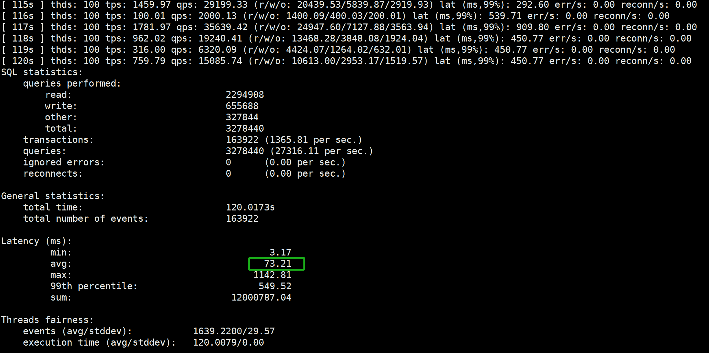

图 5-13\. 在单领导者 Paxos 变体下使用“after”机制进行 SysBench 测试结果的局部截图。

阅读官方文档的用户可能会认为单领导者 Multi-Paxos 算法可以加速访问。然而，实际上，此算法不适合一致的读写操作。

## 5.19 MySQL 从节点重放

### 5.19.1 MySQL 从节点重放的介绍

MySQL 支持主/从复制，通常使用日志传输。在这种配置中，主实例生成事务日志，然后将其传输到一个或多个从实例。从实例回放这些日志以镜像主实例的状态，但可能会落后，影响只读查询的准确性 [16]。

随着服务器故障变得普遍，高可用性的复制至关重要。然而，在多核系统上事务处理的高并发需求与传统复制方法相冲突。这种紧张关系可能导致在主负载过重时从节点落后，增加数据丢失的风险或需要限制主节点的速度，从而影响性能。

### 5.19.2 重放与事务执行之间的区别

在 MySQL 的行日志中，每个操作都是一个日志事件。行更改记录为插入、更新或删除事件。这些行事件，以及事务开始和结束事件，定义了事务边界。插入事件记录新的行图像，更新事件记录行图像的前后状态，删除事件记录已删除的行图像。

在事务过程中，主节点将更新写入日志，然后从节点获取并重放这些更新。从节点可以处理比主节点更多的读请求，因为重放更新仅需要执行原始查询工作量的一半左右。此外，主节点上的读查询可能与更新事务冲突，导致速度减慢，这支持将读请求调度到从节点[16]。

### 5.19.3 加速 MySQL 二级重放的作用

MySQL 二级重放速度越快，从 MySQL 二级读取过时数据的可能性就越低。对于组复制，MySQL 二级重放的速度与高可用性密切相关。如果 MySQL 二级重放速度足够快，在高可用切换期间，新主节点可以立即开始服务新请求。否则，通常需要等待 MySQL 二级重放完成后才能服务新请求。

### 5.19.4 MySQL 二级重放架构

下面的图中显示了 MySQL 二级重放的架构：


图 5-14\. MySQL 二级重放架构。

异步和半同步复制都使用 IO 线程来读取和存储事务事件到中继日志。当组复制正常运行时，它使用应用线程将应用事件存储到中继日志。SQL 线程对于 MySQL 二级重放至关重要，负责解析事件和调度它们。在 MySQL 二级重放期间，多个工人处理重放过程，每个工人都有自己的工作队列，其中 SQL 线程放置挂起的事件。

对于 MySQL 二级重放，SQL 线程不仅充当调度器，还从中继日志文件中读取和解析事务事件。当中继日志量较小时，SQL 线程可以管理，但随着中继日志的增长，SQL 线程成为主要的瓶颈。它难以跟上解析事件和管理调度任务的工作量。此外，SQL 线程在以下情况下会遇到等待情况：

1.  每个工作队列都有一个固定的大小，没有可调整的参数。如果一个事务包含大量事件（例如，大事务），工作队列会很快填满，导致 SQL 线程等待。

1.  如果没有足够的工人可用，SQL 线程会等待。

1.  如果 SQL 线程发现一个新事务，其最后提交的值大于已提交事务的最小逻辑时间戳（低水位标记）值，它也需要等待。

例如，以下代码片段说明了当工作队列满时，SQL 线程如何进入等待状态。

```cpp
 // possible WQ overfill
  while (worker->running_status == Slave_worker::RUNNING && !thd->killed &&
         (ret = worker->jobs.en_queue(job_item)) ==
             Slave_jobs_queue::error_result) {
    thd->ENTER_COND(&worker->jobs_cond, &worker->jobs_lock,
                    &stage_replica_waiting_worker_queue, &old_stage);
    worker->jobs.overfill = true;
    worker->jobs.waited_overfill++;
    rli->mts_wq_overfill_cnt++;
    // wait if worker queue is full
    mysql_cond_wait(&worker->jobs_cond, &worker->jobs_lock);
    mysql_mutex_unlock(&worker->jobs_lock);
    thd->EXIT_COND(&old_stage);
    mysql_mutex_lock(&worker->jobs_lock);
  } 
```

这里是另一个代码示例，其中如果 SQL 线程检测到一个新开始的事务，其最后提交的值大于当前计算的 LWM 值，则需要等待：

```cpp
bool Mts_submode_logical_clock::wait_for_last_committed_trx(
    Relay_log_info *rli, longlong last_committed_arg) {
  THD *thd = rli->info_thd;
  ...
  if ((!rli->info_thd->killed && !is_error) &&
      !clock_leq(last_committed_arg, get_lwm_timestamp(rli, true))) {
    PSI_stage_info old_stage;
    struct timespec ts[2];
    set_timespec_nsec(&ts[0], 0);
    assert(rli->gaq->get_length() >= 2);  // there's someone to wait
    thd->ENTER_COND(&rli->logical_clock_cond, &rli->mts_gaq_LOCK,
                    &stage_worker_waiting_for_commit_parent, &old_stage);
    do {
      // wait if LWM is less than last committed
      mysql_cond_wait(&rli->logical_clock_cond, &rli->mts_gaq_LOCK);
    } while ((!rli->info_thd->killed && !is_error) &&
             !clock_leq(last_committed_arg, estimate_lwm_timestamp()));
    min_waited_timestamp.store(SEQ_UNINIT);  // reset waiting flag
    mysql_mutex_unlock(&rli->mts_gaq_LOCK);
    thd->EXIT_COND(&old_stage);
    set_timespec_nsec(&ts[1], 0);
    rli->mts_total_wait_overlap += diff_timespec(&ts[1], &ts[0]);
  } else {
    min_waited_timestamp.store(SEQ_UNINIT);
    mysql_mutex_unlock(&rli->mts_gaq_LOCK);
  }
  return rli->info_thd->killed || is_error;
} 
```

因此，SQL 线程通常很忙，遇到许多等待情况，这实际上是慢速 MySQL 二级重放的主要原因之一。

## 5.20 数据库与人工智能的集成

传统的数据库设计依赖于经验方法和规范，需要人类参与（例如，数据库管理员）进行调优和维护。AI 技术通过探索比人类更广阔的设计空间并取代启发式方法来解决复杂问题来减轻这些限制。现有的数据库优化 AI 技术可以按以下方式分类 [55]。

### 5.20.1 基于学习的数据库配置

1.  **旋钮调整**

    数据库有许多旋钮需要数据库管理员（DBAs）根据不同场景进行调整。这种方法对于数百万个云数据库实例来说不可扩展。最近，基于学习的技术被用来自动调整这些旋钮，探索更多组合并推荐高质量设置，通常优于数据库管理员。

1.  **索引/视图顾问**

    索引和视图对于高性能至关重要，传统上由数据库管理员（DBAs）管理。鉴于列/表组合的数量庞大，推荐和构建适当的索引/视图成本高昂。最近，基于学习的方案出现，以自动化索引和视图的推荐和维护。

1.  **SQL 重写器**

    许多 SQL 程序员难以编写高质量的查询，需要重写以提高性能。例如，嵌套查询可能被重写为连接以进行优化。现有方法使用基于规则的战略，依赖于预定义的规则，这些规则的质量和可扩展性有限。深度强化学习可用于有效地选择和应用规则。

### 5.20.2 基于学习的数据库优化

1.  **基数/成本估计**

    传统的数据库优化器难以捕捉不同列/表之间的相关性，导致成本和基数估计不佳。最近，深度学习技术被提出，通过使用神经网络更好地捕捉相关性来改进这些估计。

1.  **连接顺序选择**

    SQL 查询可能有数百万甚至数十亿可能的执行计划。有效地找到一个好的计划至关重要，但传统的优化器由于探索广泛计划空间的高成本，在处理大型表时遇到困难。已经开发出深度强化学习方法来自动选择高效计划。

1.  **端到端优化器**

    一个全面的优化器必须考虑成本/基数估计、连接顺序、索引和视图。基于学习的优化器使用深度神经网络全面优化 SQL 查询，提高整体查询性能。

### 5.20.3 基于学习的数据库设计

传统数据库是由建筑师根据经验设计的，这限制了设计空间的探索。最近，基于学习的自我设计技术已经出现 [55]：

1.  **学习到的索引**：这些减少了索引大小并提高了性能。

1.  **学习型数据结构设计**：不同的数据结构适用于不同的环境（例如，硬件、读写应用）。数据结构炼金术创建了一个推理引擎，以推荐和设计合适的结构。

1.  **基于学习的交易管理**：传统技术侧重于 OCC、PCC、MVCC、2PC 等协议。新的研究利用 AI 预测和调度交易，通过学习数据模式和预测未来工作负载趋势来平衡冲突率和并发性。

### 5.20.4 基于学习的数据库监控

数据库监控捕获运行时指标，如读写延迟和 CPU/内存使用情况，向管理员发出关于性能下降和攻击等异常的警报。传统方法依赖于管理员监控活动并报告问题，这效率低下。机器学习技术通过确定何时以及如何监控特定指标来优化这一过程。

### 5.20.5 基于学习的数据库安全

传统的数据库安全技术，如数据掩码和审计，依赖于用户定义的规则，无法自动检测未知漏洞。基于 AI 的算法通过以下方式解决这个问题：

1.  **敏感数据发现**：使用机器学习自动识别敏感数据。

1.  **异常检测**：监控数据库活动以检测漏洞。

1.  **访问控制**：自动估计数据访问动作以防止数据泄露。

1.  **SQL 注入预防**：使用深度学习分析用户行为并识别 SQL 注入攻击。

### 5.20.6 性能预测

查询性能预测对于满足服务水平协议（SLAs）至关重要，尤其是对于并发查询。传统方法仅关注逻辑 I/O 指标，忽略了许多与资源相关的特征，导致结果不准确。

Marcus 等人使用深度学习预测并发下的查询延迟，考虑了子/父操作符之间的交互和并行计划。然而，他们的管道结构导致了信息丢失，未能捕获操作符到操作符的关系，如数据共享和冲突特征。

为了解决这个问题，周等人提出了一种使用图嵌入的方法。他们使用一个图来模拟并发查询，其中顶点表示操作符，边捕获操作符之间的相关性（例如，数据传递、访问冲突、资源竞争）。使用图卷积网络将工作负载图嵌入，提取与性能相关的特征，并根据这些特征预测性能[55]。

### 5.20.7 AI 挑战

人工智能模型需要大规模、高质量、多样化的训练数据以实现最佳性能，但在 AI4DB 中由于安全问题和对数据库管理员（DBA）的依赖，获取此类数据具有挑战性。例如，在数据库旋钮调整中，训练样本依赖于 DBA 的经验，这使得收集足够的样本变得困难。有效的模型还需要涵盖各种场景、硬件环境和工作负载的数据，需要在小型训练数据集上表现良好的方法。

适应性是一个主要挑战，包括适应动态数据更新、不同的数据集、新的硬件环境以及其他数据库系统[55]。关键问题包括：

+   如何将训练好的模型（例如，优化器、成本估计）适应其他数据集？

+   如何将模型适应不同的硬件环境？

+   如何将模型适应不同的数据库？

+   如何支持动态数据更新？

模型收敛至关重要。如果一个模型没有收敛，就需要其他解决方案来避免延迟和不准确，例如在旋钮调整中，非收敛的模型无法提供可靠的在线建议。

传统 OLAP 主要关注关系型数据分析，但大数据引入了新的类型，如图、时间序列和空间数据。需要新的技术来分析这些多模型数据类型，并将人工智能与数据库技术相结合以增强分析，例如图像分析。

由于事务之间可能存在冲突，事务建模和调度对于 OLTP 系统至关重要。学习技术可以优化 OLTP 查询，如一致快照。然而，需要高效的模型来即时在多个核心和机器上建模和调度事务。

### 5.20.8 AI 总结

将人工智能集成到 MySQL 提供了许多有影响力的机会，并且是未来开发的主要焦点之一。

## 5.21 MySQL 内部如何以管道方式工作？

类似 MySQL 这样的数据库引擎在中等并发性方面表现出色，交错执行许多事务，其中大多数在任何给定时刻都是空闲的[3]。然而，随着摩尔定律下每颗芯片核心数量的增加，MySQL 必须利用高并行性来从新的硬件中获益。尽管工作负载具有高并发性，但内部瓶颈通常阻止 MySQL 达到所需的并行性。

MySQL 的内部操作遵循管道方法，其中每个组件都按部就班地工作。为了确保正确性，MySQL 使用闩锁和锁来防止并发操作之间的干扰。为了实现崩溃安全恢复，MySQL 采用诸如重做日志、回滚日志、幂等性和双重写入等机制。

为了支持并发读写操作，MySQL 实现了事务隔离级别和 MVCC。这些机制使得处理并发操作变得高效。

为了减轻单服务器故障风险，MySQL 使用集群和高可用性解决方案。一些操作，如重做日志刷新和 MVCC ReadView 复制，是串行的。这些过程的快速执行支持高吞吐量，但慢速串行化可能会阻碍可伸缩性。

MySQL 管理各种进程，包括 SQL 解析、执行计划生成、重做日志写入、事务子系统操作、锁定子系统操作、binlog 组提交和网络交互。当这些过程由不同的线程处理且无重叠时，才能实现有效的吞吐量。然而，串行过程中的线程聚合可能导致冲突和性能问题。

优化 MySQL 的效率涉及更快的响应时间、减少 CPU 消耗和增强可伸缩性。

## 5.22 为什么 MySQL 需要支持高并发？

无法实现高吞吐量主要是由于保证 ACID 的约束。更多的核心会导致更多并发事务访问相同竞争数据，需要串行访问以确保隔离。数据库系统的最大吞吐量取决于硬件和软件实现等因素。虽然更好的硬件和软件可以提高性能，但吞吐量本质上受限于竞争操作。竞争操作随着事务隔离级别、多版本化能力和操作交换性而变化。无论如何，一些操作始终需要串行化，这限制了吞吐量。只有当额外的交易不与现有的交易冲突时，增加更多的处理器才能提高吞吐量 [23]。

在高冲突场景中，吞吐量的线性可伸缩性是无法实现的。然而，在低冲突场景中，可伸缩性会提高，如众多仓库的 TPC-C 测试所示。在实际的 MySQL 操作中，短时间的高并发爆发是常见的。支持高并发有助于在运行时保持 MySQL 的稳定性。

随后，分析了支持高并发对于 TPC-C 测试的具体重要性。下图显示了在 1 毫秒思考时间场景下，MySQL 5.7.39 的吞吐量与并发之间的关系。在此背景下，1 毫秒思考时间意味着用户在收到前一个响应后等待 1 毫秒，然后发送下一个请求。

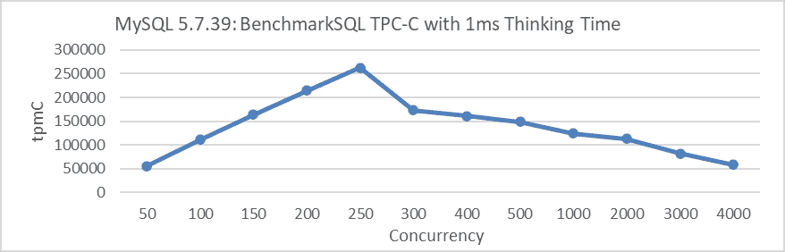

图 5-15. MySQL 5.7.39 在 1 毫秒思考时间下的较差可伸缩性。

从图中可以看出，在 1 毫秒思考时间场景下，MySQL 5.7.39 的吞吐量在低并发级别时呈线性增长。然而，一旦达到 250 并发，吞吐量会急剧下降。

下图显示了在相同 1 毫秒思考时间场景下，改进后的 MySQL 8.0.27 的吞吐量与并发之间的关系：

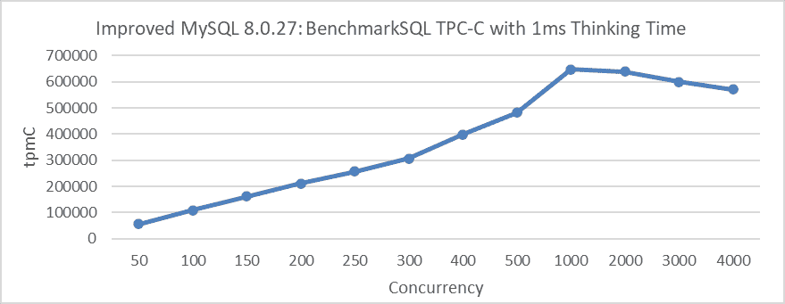

图 5-16\. 改进的 MySQL 8.0.27 在 1ms 思考时间下的卓越可扩展性。

从图中可以看出，峰值吞吐量在 1000 并发时达到，并且这个峰值显著超过了 MySQL 5.7.39 版本的峰值。

MySQL 的高并发支持不仅对具有思考时间的场景至关重要，而且对于跨多个城市的部署（地理分布式部署）也是必不可少的。

下图展示了在不同网络延迟场景下改进的 MySQL 8.0.27 的吞吐量和并发性之间的关系。


图 5-17\. 改进的 MySQL 8.0.27 在不同网络延迟下的卓越可扩展性。

在本地访问的延迟在几十微秒范围内的场景中，峰值吞吐量在 250 并发时达到。当网络延迟为 5ms 时，峰值吞吐量在 500 并发时达到，而在 10ms 延迟下，则需要 1000 并发。

因此，增强 MySQL 的可扩展性非常有意义。在低冲突场景中，显著增强可扩展性可以显著提高吞吐量，并在各种应用场景中产生深远的影响。然而，在高冲突情况下，需要采取事务节流策略来缓解可扩展性问题。

## 5.23 理解 MySQL 集群的可扩展性

首先，让我们来考察异步复制的可扩展性。下图展示了独立 MySQL 实例和异步复制之间的吞吐量和并发性关系。

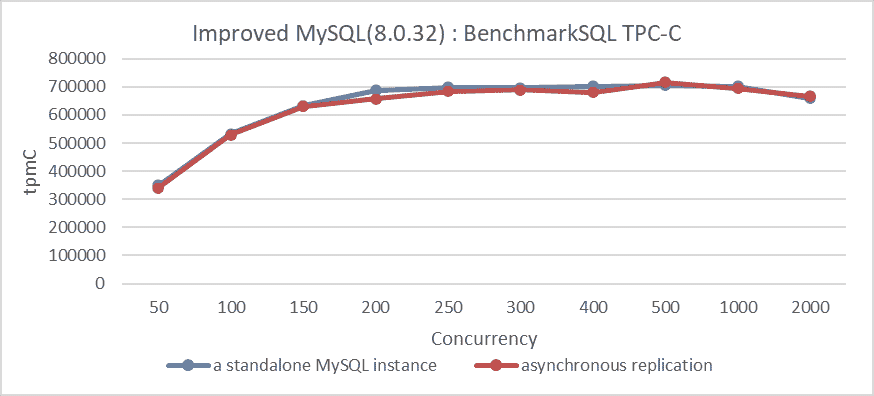

图 5-18\. MySQL 异步复制的卓越可扩展性。

从图中可以看出，在异步复制的情况下，MySQL 从节点对 MySQL 主节点的吞吐量没有显著影响。

现在让我们来考察半同步复制的可扩展性。例如，下图展示了半同步复制吞吐量和并发性之间的关系。

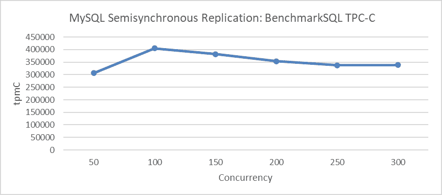

图 5-19\. MySQL 半同步复制的可扩展性差。

从图中可以看出，半同步复制的吞吐量难以进一步增加。在达到 100 并发后，吞吐量逐渐下降，表明存在一个限制额外扩展的障碍。更多详情请参阅 5.17.3 节。

最后，让我们来考察 Group Replication 的可扩展性。在深入探讨之前，了解状态机复制的性能缺点[41]，如下所述是很重要的：

然而，一致性协议的通信和同步成本意味着状态机复制给系统的性能增加了相当大的开销，即典型的状态机复制请求速率低于非复制系统的请求速率。

随后，测试了组复制的最大可伸缩性，包括实施事务节流机制以确保只有指定数量的线程可以访问事务系统。

下图显示了组复制吞吐量与并发性之间的关系：


图 5-20\. 带有事务节流机制的改进组复制的卓越可伸缩性。

当吞吐量达到 250 并发并随后缓慢下降时，这清楚地表明在事务节流机制下，组复制表现出卓越的可伸缩性。与半同步复制相比，组复制的架构设计明显更优越。

重要的是要注意，事务节流被实施以管理广泛的并发性。过多的事务进入 InnoDB 存储引擎可能会降低性能并干扰对组复制可伸缩性的评估。

## 5.24 MySQL 问题诊断

缺陷是编程的必然部分。逻辑推理对于识别和修复这些缺陷至关重要。这涉及到系统地分析代码、诊断问题的原因，并根据逻辑推理和推断制定解决方案的计划。这种方法有助于程序员以结构化和有效的方式进行调试和故障排除 [56]。

除了常用的 GDB 调试之外，另一种方法是使用日志来协助故障排除。后续章节将介绍介绍这种方法的研究案例。

除了上述方法之外，MySQL 本身也提供了几种调试解决方案，具体描述如下：

1）MySQL 以调试模式编译，可以在命令终端中添加跟踪输出（请参考以下示例）。

```cpp
set global debug= 'd:T:t:i:o,/tmp/mysql.trace'; 
```

执行特定的 SQL 语句会将 MySQL 的内部函数调用关系输出到跟踪文件中，如下例所示：

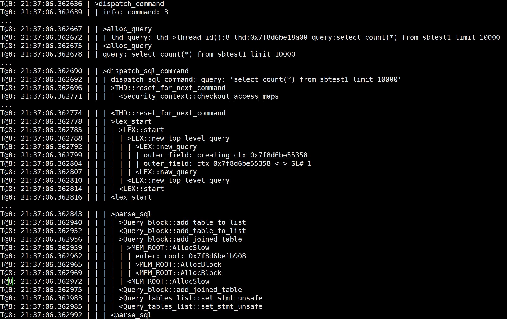

跟踪信息对于理解 MySQL 的工作方式非常有帮助，但这种方法仅适用于流量非常低的场景。

2）性能模式收集各种类型的信息的统计数据，包括内存使用信息、锁以及条件变量的统计数据等。

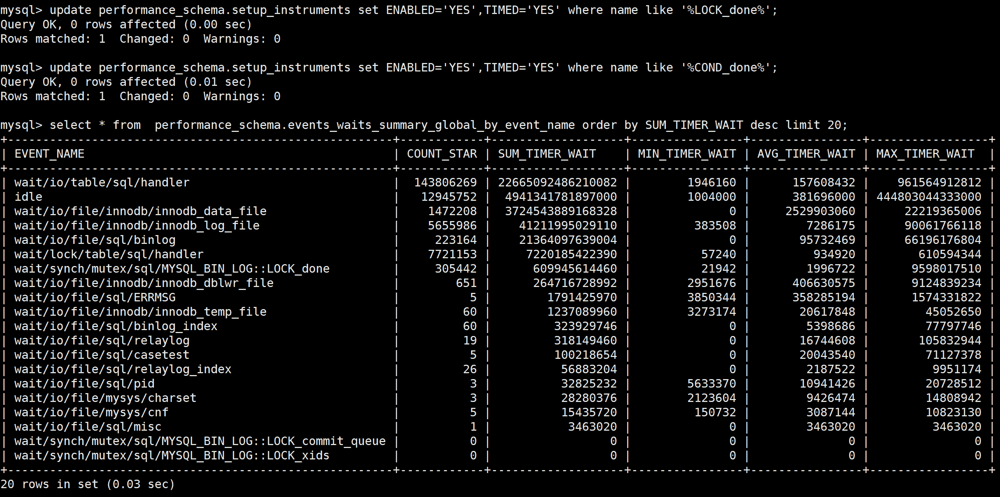

上图使用性能模式对互斥锁和其他元素进行统计分析，使得识别哪些元素产生更高的成本变得容易。

## 5.25 BenchmarkSQL 和 SysBench 之间的显著差异

以优化 lock-sys 为例，本节评估了 SysBench 工具和 BenchmarkSQL 在 MySQL 性能测试中的显著差异。

首先，使用 SysBench 的标准读写测试来评估 lock-sys 的优化。

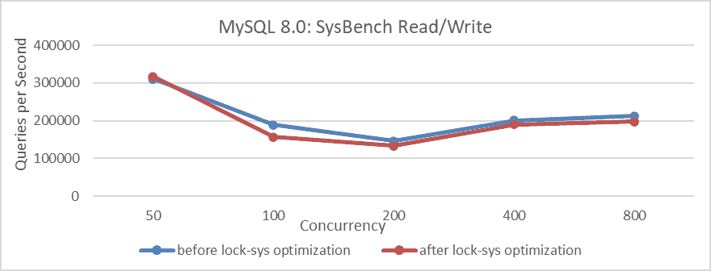

图 5-21\. 锁-sys 优化前后 SysBench 读写测试的比较。

从图中可以观察到，经过优化后，SysBench 测试的整体性能实际上有所下降。

接下来，使用 BenchmarkSQL 测试这个优化，结果如下图所示。

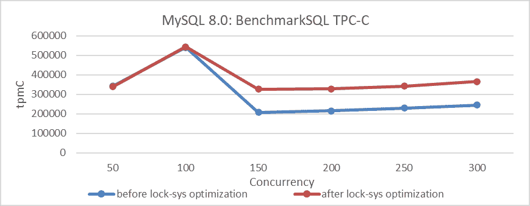

图 5-22\. 锁-sys 优化前后 BenchmarkSQL 测试的比较。

从图中可以看出，BenchmarkSQL 的 TPC-C 测试结果表明 lock-sys 优化是有效的。为什么会出现如此显著的区别？让我们分析这些测试工具之间特性的差异，以了解为什么它们的测试结果不同。

SysBench RW 测试以其速度和简单性以及 SQL 查询为特点。在相同的并发条件下，SysBench 通常处理的并发事务比 BenchmarkSQL 少。因此，面对如 lock-sys 这样的闩锁队列瓶颈，SysBench 的高并发可能等同于 BenchmarkSQL 的低并发。因此，lock-sys 优化可能不会在 BenchmarkSQL 运行在较低并发级别的情况下产生重大影响。

BenchmarkSQL，一个广泛使用的 TPC-C 测试工具，将用户线程更均匀地分布在各个模块中，减少了聚合效应的敏感性。在高并发情况下，优化 lock-sys 可以显著减少闩锁冲突并最小化对其他队列的影响，从而提高吞吐量。与 SysBench 相比，BenchmarkSQL 的 TPC-C 测试更适合揭示 MySQL 中的更深层次的并发问题。

本分析采用演绎推理来探讨 SysBench 和 BenchmarkSQL 之间的差异。它表明，SysBench 测试中的性能不佳并不一定意味着生产环境中的性能不佳，反之亦然。这种差异产生的原因是 SysBench 测试环境通常与实际生产环境存在显著差异。因此，SysBench 测试结果应用于特定场景的性能比较，而不是作为生产能力的全面指标。

值得注意的是，本书中性能测试和比较的主要依据，主要基于 TPC-C，如下[50]：

*TPC 基准 C 也称为 TPC-C，是领先的在线事务处理（OLTP）基准，已被用于进行比较*。

在这本书中，BenchmarkSQL 主要用于 TPC-C 测试。这个选择不仅基于 BenchmarkSQL 在 TPC-C 测试中的代表性能力，还因为它与实际在线环境的高度一致性。

下一章
