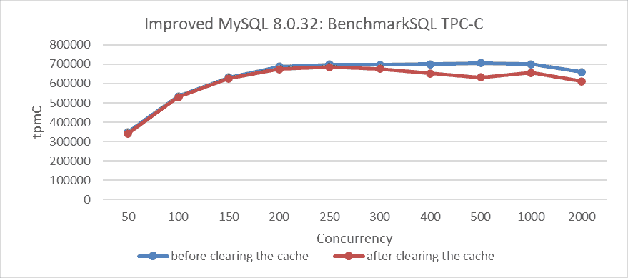
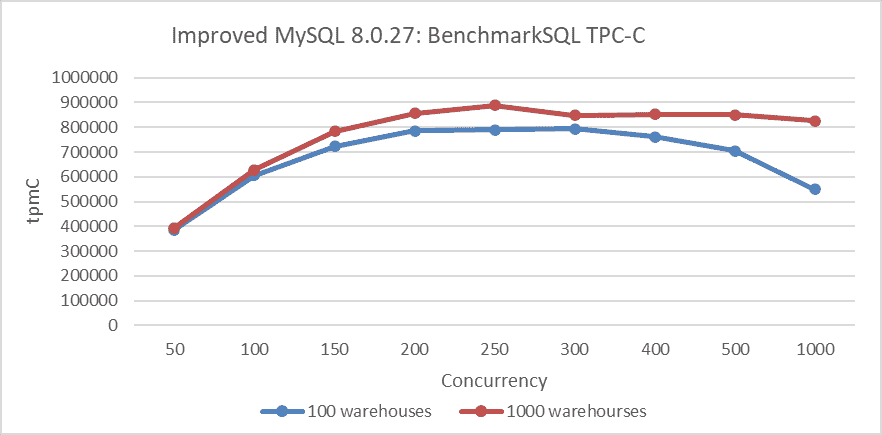
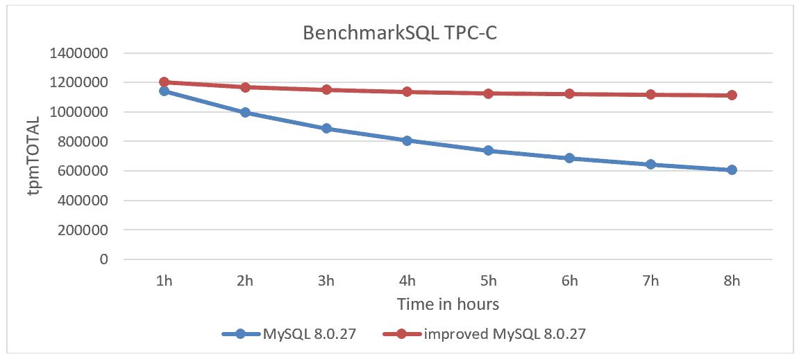
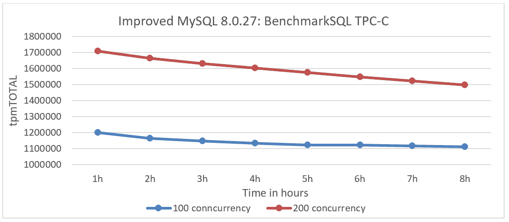
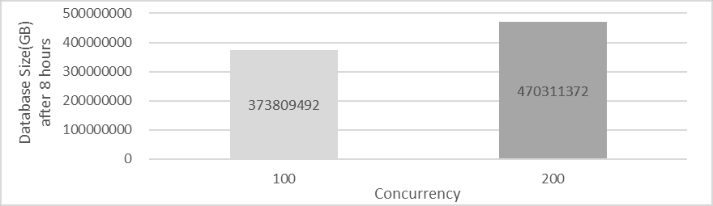
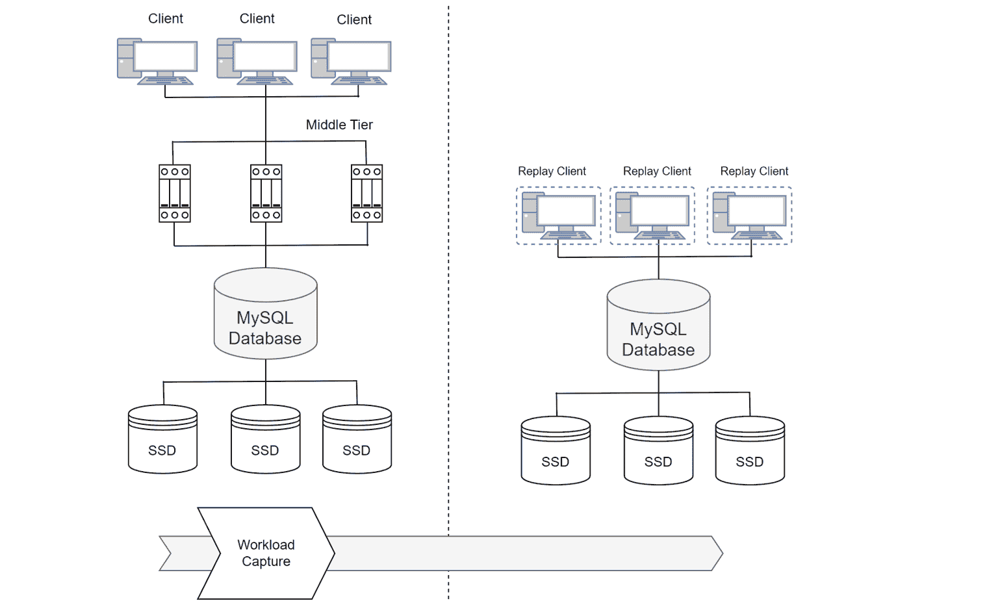

# 第六章：如何科学地测试 MySQL 性能？

> 原文：[`enhancedformysql.github.io/The-Art-of-Problem-Solving-in-Software-Engineering_How-to-Make-MySQL-Better/Chapter6.html`](https://enhancedformysql.github.io/The-Art-of-Problem-Solving-in-Software-Engineering_How-to-Make-MySQL-Better/Chapter6.html)

性能基准测试在科学文献和工业出版物中常用于比较不同的系统或算法。尽管性能测量可能看似客观，但各种因素可能会影响基准测试结果，有意或无意地偏向某一系统。性能基准测试存在根本的利益冲突，尤其是在对先前版本或竞争对手的系统进行评估时。一些结果，通常被称为“基准营销”，歪曲了性能数据。公平的性能基准测试具有挑战性，很容易无意或有意地歪曲数据[9]。

本书探讨了 MySQL 性能基准测试中的常见陷阱，并描述了如何避免它们以确保公平的性能比较。

## 6.1 常见陷阱

本节讨论在执行性能比较时遇到的常见陷阱。

### 6.1.1 不可重复性

可重复性是科学研究的基础，它允许他人验证结果并识别错误。没有可重复性，实验中的主张和数字无法得到验证。进行可重复的实验相对于更大规模的科学研究来说相对简单且成本低廉。然而，许多数据库研究论文由于闭源代码、未公开的数据或专有系统而缺乏可重复性。

为了实现可重复性，必须提供所有配置参数，包括操作系统、服务器安装、版本、设置和配置标志等细节。此外，任何算法或实现的源代码也应提供[9]。

本书中的大多数测试都将包括源代码、MySQL 配置文件、测试工具细节、硬件规格和操作系统版本，以确保可重复性和测试结果的验证。

### 6.1.2 未能优化

基准测试通常用于比较系统或评估新算法的有效性。通常，实验涉及比较一个新提出的系统与现有系统，以证明其优越的性能。

然而，这种设置可能会削弱对现有系统进行适当优化的积极性，因为当前系统的性能不佳可能会使新系统看起来更好。对于依赖于正确配置的系统来说，这是一个重要问题，因为配置不当的系统可能比配置良好的系统表现差得多。

为特定工作负载优化数据库管理系统（DBMS）是复杂的，通常需要专业知识。即使是微小的优化也能提高性能比较的公平性。遵循基准测试的优化指南或涉及比较系统的代表也可以帮助实现更准确的结果 [9]。

在本书的性能测试中，以下策略被应用：

1.  **执行优化前后的比较**：在可行的情况下，在优化前后进行性能比较，目标是尽量减少变化。

1.  **匹配配置参数**：尽可能将配置参数与生产环境对齐。

1.  **在相同硬件上执行性能比较**：在 NUMA 环境中使用相同配置的同一 x86 机器上进行测试。重新初始化 MySQL 数据目录并清理 SSD（通过 TRIM）以避免干扰。在一系列并发级别上进行测试以评估吞吐量并确定优化是否提高了性能或可伸缩性。

1.  **使用 NUMA 节点绑定重复测试**：绑定到 NUMA 节点 0 后，重复测试以比较 SMP 环境中的性能。

1.  **在禁用 NUMA 的 x86 机器上测试**：在具有相同硬件但 NUMA 在 BIOS 中禁用的 x86 机器上进行比较性能测试。

1.  **评估 ARM 机器上的性能**：在具有类似 MySQL 配置的 NUMA 环境中测试 ARM 机器的比较性能。

1.  **使用不同工具验证一致性**：使用各种测试工具比较结果并确保一致性。例如，使用 BenchmarkSQL 和 tpcc-mysql 的修改版本进行 TPC-C 测试。

1.  **评估不同网络延迟下的性能**：检查在不同网络延迟条件下的性能影响。

1.  **测试不同“思考时间”场景下的性能**：评估性能如何随着不同的“思考时间”场景而变化，以衡量一致性。

1.  **执行闭环测试**：通过重复初始测试并将结果与第一轮比较来确保测试过程中没有干扰。测试结果的小差异表明环境相对稳定。

1.  **验证瓶颈干扰**：确认在高并发下其他瓶颈的干扰是否扭曲了性能比较。

1.  **分析理论基础和异常**：评估性能优化是否有理论基础，以及是否可以解释任何异常。分析优化类型、其通用适用性和哪些环境受益最大。调查异常以确定其原因。

### 6.1.3 过度特定的调整

通过进行超出标准化基准的一系列实验可以缓解这些问题。虽然标准化基准提供了一个有用的基线，但某些系统可能对其进行了大量优化，从而降低了其在比较中的有效性。因此，应该测试和测量额外的查询 [9]。

为了解决这些问题，MySQL 配置应满足以下标准：

1.  **最小化配置参数的影响**：确保参数，如缓冲池大小，不会阻碍其他优化。

1.  **使用默认配置**：对于不确定的参数，如自旋延迟，应用默认设置。

1.  **匹配生产配置**：将测试设置与生产配置对齐，例如，sync_binlog=1 和 innodb_flush_log_at_trx_commit=1。

为了克服单一类型测试的限制，采用多种测试场景。对于 TPC-C，包括具有不同冲突严重程度、思考时间和网络延迟的测试。对于 SysBench，使用具有帕累托分布、读写和只写操作的测试。

这些策略确保在各种条件下对 MySQL 性能优化进行全面的评估，从而产生更稳健和可靠的结果。

### 6.1.4 冷启动与热启动

区分“热”和“冷”启动至关重要。当相关数据从持久存储加载并解析查询时，冷启动通常比数据已经缓存的“热”启动慢。由于这些差异，冷启动和热启动的性能测量应分别记录和报告 [9]。

对于 TPC-C 测试，所有测试操作都遵循标准化流程以确保一致性，测试在无人类干扰的环境中执行。此外，为了减轻不同环境引起的性能干扰，采用闭环测试尽可能最大化测试结果的可信度。

### 6.1.5 冷启动与热启动

测量冷启动需要谨慎，以避免意外记录热启动。正确的测量方法不仅仅是重启数据库服务器并运行查询，因为操作系统可能会在内存中缓存数据。正确的方法是停止数据库服务器，清除所有操作系统缓存，重启服务器，然后运行查询

进行了评估测试以评估这些影响。例如，以下图比较了清除缓存前后 TPC-C 吞吐量和并发性的变化。

图 6-1\. 清除缓存前后 BenchmarkSQL 测试的比较。

从图中可以看出，清除缓存后的吞吐量确实低于之前的吞吐量。

为了减轻这些问题，采用了闭环测试，这有效地检测了环境中的异常。

### 6.1.6 人类错误

当评估新设计算法的性能时，验证实现的正确性至关重要，以避免忽略可能导致错误结果的错误。一个错误可能导致性能指标基于错误的结果，例如，由于处理的数据较少，算法可能看起来更高效。如果基准不可重复，这个问题会变得更加严重，因为错误的实现可能被错误地接受为有效。

此外，一个程序可能对特定数据集工作正常，但由于不足的溢出处理或数据集属性硬编码等问题，在一般情况下可能失败。始终通过将输出与基准规范中的参考答案进行比较，并检查不同数据的结果来验证程序产生正确的结果 [9]。

对于性能测试，考虑优化结果是否受其他因素影响是至关重要的。例如，在 MySQL 8.0 使用 CATS 锁调度算法时，性能评估可能会受到 MySQL 生成的广泛死锁日志的影响。

## 6.2 综合测试

性能测试是一个极其复杂的过程。只有通过综合测试和分析，才能将测试过程中的错误降到最低，从而对优化的价值进行科学评估。

### 6.2.1 使用多种工具进行测试

SysBench、BenchmarkSQL 和修改后的 tpcc-mysql 工具主要用于测试。SysBench 测试读写、只写和 Pareto 分布场景。BenchmarkSQL 用于各种并发级别下的 TPC-C 测试。修改后的 tpcc-mysql 工具用于测试极端条件下的 MySQL。

### 6.2.2 识别竞争密集型测试

访问相同数据的并发线程越多，竞争越大。SysBench Pareto 分布测试被认为是高竞争，而 SysBench 均匀分布测试被认为是低竞争。在修改后的 BenchmarkSQL 中，使用 1000 个仓库的测试代表低竞争，而在相同并发级别下使用 10 个仓库的测试表示高竞争。

### 6.2.3 理解 TPC-C 测试特性

TPC-C 基准是研究和工业界数据库并发控制的黄金标准 [25]。

实验设置可以显著影响评估结果。在 TPC-C：

+   引入等待时间使得实验变得 I/O 密集。

+   移除等待时间使得实验变得 CPU/内存密集。

+   减少仓库数量使得实验竞争密集。

TPC-C 可以对计算机系统的几乎所有关键组件进行压力测试，但这种多功能性给不同系统之间的公平比较带来了挑战 [8]。

从高层次来看，以下因素可以减少竞争：

+   更多的仓库

+   跨仓库交易数量较少

+   每个仓库的工人/用户数量较少

+   添加等待时间

+   关键部分内的短或无 I/O

在低竞争设置中，吞吐量受系统最慢组件的限制：

+   如果数据超过 DRAM 大小，则进行磁盘 I/O

+   如果使用传统的 TCP 堆栈且数据适合在 DRAM 中

+   集中式序列器或全局依赖图也可能导致可扩展性瓶颈

相反，以下因素会增加竞争：

+   仓库数量较少

+   更多跨仓库交易

+   每个仓库有更多的工作者/用户

+   没有等待时间

+   在关键部分内的长 I/O

在高竞争设置中，吞吐量由并发控制机制决定。能够更早释放锁或减少中止的系统将具有优势 [8]。

下图显示了不同仓库数量下 TPC-C 吞吐量和并发性的关系。深蓝色曲线代表 100 个仓库，而深红色曲线代表 1000 个仓库。图示表明，由于前一种场景中竞争更加激烈，100 个仓库的吞吐量显著低于 1000 个仓库。

图 6-2\. 仓库数量越多，竞争越不激烈。

### 6.2.4 在测试中包含思考时间

TPC-C 包括等待时间，通过在每个事务之前模拟用户的按键和思考时间来模拟用户行为。每个仓库有十个终端，每个地区一个，允许每个仓库最多有十个并发事务。vanilla TPC-C 不允许调整这些参数，除了仓库数量。

由于等待时间和每个仓库的十个并发用户限制，每个仓库的最大吞吐量是有限的。为了实现更高的吞吐量，必须使用许多仓库，这也是为什么 OceanBase 和 Oracle 这样的系统使用数百万个仓库的原因。对于存储大量数据且每 GB 吞吐量低的负载，SSD 比 DRAM 更经济有效地满足吞吐量要求，与 OceanBase 和 Oracle 的硬件配置相匹配。因此，vanilla TPC-C 是一个以 I/O 密集型、低竞争为特点的基准测试，因为每个仓库的长时间等待和有限的并发用户意味着同时访问概率低。

大多数研究都针对竞争问题，需要移除等待时间以实现更高的吞吐量和每个仓库的竞争级别。为了维持竞争，使用较少的仓库。由于压力测试不同的系统组件 [8]，带有和不带有等待时间的 TPC-C 数据不可比。

使用 1ms 思考时间（请求前的暂停）的 TPC-C 测试结果如图所示，展示了吞吐量与并发性的关系。

图 6-3\. 1ms 思考时间对吞吐量的影响。

从图中可以看出，在 1 毫秒的思考时间内，峰值吞吐量达到 1000 并发，而在正常的 TPC-C 测试中，峰值是在 250 并发时达到。带有思考时间的测试与常规 BenchmarkSQL 测试相比有显著差异，并且还需要 MySQL 有更好的可伸缩性。

### 6.2.5 I/O 对测试的影响

一个功能齐全的数据库系统必须处理像 2PC、数据复制或 Paxos 这样的协议的网络 I/O，以及数据持久性的磁盘 I/O。许多研究忽略了这些 I/O，引发了关于它们影响的问题。

结果可能因硬件和实现方式而异，但通常情况下，如果每个 TPC-C 事务只需要一个数据包，TCP 本身就可以支持每秒数百万次交易。然而，添加像 2PC 和复制这样的协议会显著增加数据包需求。例如，标准 Paxos 复制到三个副本至少需要每个事务四个数据包，这可能会压垮 TCP 堆栈，并成为高交易率的一个瓶颈。

网络和磁盘延迟也会影响竞争工作负载中的吞吐量。关键部分的较长延迟会降低最大吞吐量，其中 I/O 延迟的影响更为显著。

然而，没有解决方案是完美的：例如，RDMA 涉及昂贵的硬件和复杂的软件，并且在地理分布式环境中并没有显著帮助[8]。

### 6.2.6 长期稳定性测试

根据 TPC-C 基准测试，数据库必须在稳定状态下运行八小时，并且在性能收集阶段超过两小时。此外，基准测试要求数据库在两小时的测试中保持低于 2%的抖动[14]。

为了满足 MySQL 测试中的稳定性要求，采取了以下措施：

1.  定期清理 binlog 以防止由于 I/O 空间限制导致的 SSD 性能下降。

1.  利用更多的仓库数量。

1.  添加索引。

1.  部署多个 SSD。

采取这些措施后，使用 BenchmarkSQL 进行了 TPC-C 测试。下面的图表展示了 MySQL 8.0.27 和改进版 MySQL 8.0.27 之间的稳定性测试比较。

图 6-4. 稳定性测试比较：MySQL 8.0.27 与改进版 MySQL 8.0.27。

从图中可以看出，尽管 MySQL 和改进版 MySQL 的吞吐量起始相似，但 MySQL 的吞吐量随着时间的推移下降得更快，而改进版 MySQL 则保持了显著更高的稳定性。

此外，还对不同并发级别下的改进版 MySQL 进行了比较。下面的图表显示了随时间变化的吞吐量：深蓝色曲线代表 100 并发，而深红色曲线代表 200 并发。

图 6-5. 稳定性测试比较：100 并发与 200 并发。

从图中可以看出，在 100 并发时吞吐量更稳定。在 200 并发时，数据处理的增加导致吞吐量更快地下降，因为单个服务器上的更大数据库规模导致访问时间变慢。

以下图表比较了在 100 和 200 并发级别完成 8 小时测试后 MySQL 数据库文件的大小。

图 6-6\. 数据库大小比较：8 小时后 100 与 200 并发。

从图中可以看出，在 200 并发时，数据库大小明显大于 100 并发。通常，更高的吞吐量往往会降低稳定性，而各种因素会影响稳定性测试，使得广泛的概括变得困难。

### 6.2.7 在线流量测试

性能测试往往无法反映真实世界的用例，并且通常报告的细节不足，无法进行复制或得出准确的结论 [39]。

TCPCopy [60] 可以捕获生产工作负载并在测试系统上重放，保留原始工作负载的精确时间、并发性和事务特征。这允许在不影响生产环境的情况下测试系统更改的影响。

以下图表说明了将 MySQL 在线系统中的流量复制到 MySQL 测试系统的机制。

图 6-7\. 从生产系统到测试系统的 MySQL 流量复制机制。

对于 MySQL 来说，测试真实世界的在线流量至关重要，因为它有效地揭示了潜在问题，如性能稳定性、内存泄漏以及新 MySQL 版本的健壮性。

下一页
