# 第七章：MySQL 8.0 相比 MySQL 5.7 的关键改进

> 原文：[`enhancedformysql.github.io/The-Art-of-Problem-Solving-in-Software-Engineering_How-to-Make-MySQL-Better/Chapter7.html`](https://enhancedformysql.github.io/The-Art-of-Problem-Solving-in-Software-Engineering_How-to-Make-MySQL-Better/Chapter7.html)


MySQL 8.0 在 MySQL 5.7 的基础上引入了大量的改进。它不仅增强了功能并增加了执行计划中对哈希连接的支持，更重要的是，极大地提高了可扩展性。这些进步为未来的改进奠定了坚实的基础。

## 7.1 扩展：InnoDB 改进

早期开源数据库管理系统代码通常在整个内核中使用粗粒度闩锁。相比之下，InnoDB 采用了更精细的方法，为不同的内核组件（如锁管理器和缓冲池）使用单独的闩锁 [19]。

MySQL 8.0 引入了额外的改进，以增强 InnoDB 存储引擎的可扩展性。以下是相关的改进：

1.  **重做日志优化**：对重做日志的增强促进了后续的性能改进。

1.  **锁-sys 闩锁分片**：锁-sys 闩锁已被分片，类似于读写锁，以提高事务锁定。

1.  **trx-sys 闩锁拆分和分片**：尽管闩锁竞争仍然存在，但 trx-sys 的优化为 MVCC ReadView 的未来改进奠定了坚实的基础。

以下将详细讨论这些显著的扩展性改进。

### 7.1.1 重做日志优化

预写日志是 ARIES 风格并发和恢复中的基本、无处不在的组件，它代表了显著的潜在瓶颈，尤其是在频繁对数据进行小更改的 OLTP 工作负载中。确定了两个与数据库系统可扩展性相关的障碍，每个都挑战着软件架构的不同层面 [3]：

1.  大量的小型 I/O 请求可能会使磁盘饱和。

1.  当事务序列化访问内存中的日志数据结构时，会出现竞争。

上述潜在瓶颈在 MySQL 5.7 中有所体现。有关重做日志优化的详细信息，请参阅“*MySQL 8.0：新的无锁、可扩展 WAL 设计*”，其中复杂性在于如何在新设计中确保日志序列号（LSN）的顺序。文章还强调了以下改进 [27]：

*我们为与重做日志写入相关的特定任务引入了专用线程。用户线程不再直接写入重做文件。他们只需等待需要将重做刷新到磁盘，但尚未刷新时。*

这次改进完全改变了之前的机制，为可扩展性奠定了坚实的基础。以下 git log 详细说明了对重做日志进行的特定优化。

```cpp
commit 6be2fa0bdbbadc52cc8478b52b69db02b0eaff40
Author: Paweł Olchawa <pawel.olchawa@oracle.com>
Date:   Wed Feb 14 09:33:42 2018 +0100

    WL#10310 Redo log optimization: dedicated threads and concurrent log buffer.

    0. Log buffer became a ring buffer, data inside is no longer shifted.
    1. User threads are able to write concurrently to log buffer. 
    2. Relaxed order of dirty pages in flush lists - no need to synchronize
       the order in which dirty pages are added to flush lists.
    3. Concurrent MTR commits can interleave on different stages of commits.
    4. Introduced dedicated log threads which keep writing log buffer: 
        * log_writer: writes log buffer to system buffers,
        * log_flusher: flushes system buffers to disk.
       As soon as they finished writing (flushing) and there is new data to 
       write (flush), they start next write (flush).
    5. User threads no longer write / flush log buffer to disk, they only
       wait by spinning or on event for notification. They do not have to 
       compete for the responsibility of writing / flushing.
    6. Introduced a ring buffer of events (one per log-block) which are used
       by user threads to wait for written/flushed redo log to avoid:
        * contention on single event
        * false wake-ups of all waiting threads whenever some write/flush
          has finished (we can wake-up only those waiting in related blocks)
    7. Introduced dedicated notifier threads not to delay next writes/fsyncs:
        * log_write_notifier: notifies user threads about written redo,
        * log_flush_notifier: notifies user threads about flushed redo.
    8. Master thread no longer has to flush log buffer.
    ...
    30. Mysql test runner received a new feature (thanks to Marcin):
        --exec_in_background.
    Review: RB#15134
    Reviewers:
        - Marcin Babij <marcin.babij@oracle.com>,
        - Debarun Banerjee <debarun.banerjee@oracle.com>.
    Performance tests:
        - Dimitri Kravtchuk <dimitri.kravtchuk@oracle.com>,
        - Daniel Blanchard <daniel.blanchard@oracle.com>,
        - Amrendra Kumar <amrendra.x.kumar@oracle.com>.
    QA and MTR tests:
        - Vinay Fisrekar <vinay.fisrekar@oracle.com>. 
```

新机制采用专用线程来刷新重做日志文件，支持对日志缓冲区的并发写入，移除了代码中的全局闩锁，并引入了无闩锁处理，显著提高了可伸缩性。

进行了一项测试，比较了优化前后不同并发级别下的 TPC-C 吞吐量。具体细节如下图所示：

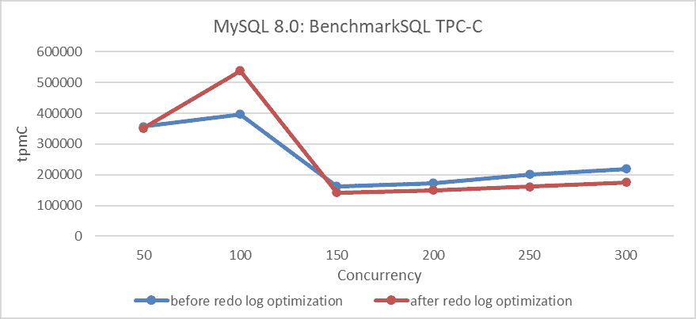

图 7-1. 不同并发级别下重做日志优化的影响。

图中的结果显示，在并发级别为 100 时吞吐量有显著提升，但在高并发级别时有所下降。这种下降可以归因于两个潜在原因：

1.  **未解决的根本性缺陷**：在转换过程中，可能没有完全解决根本性问题。

1.  **多队列瓶颈的干扰**：可能出现类似多队列瓶颈相互干扰的问题。尽管在某些方面的性能有所提升，但在高并发情况下，其他瓶颈却变得更加严重。

广泛的研究表明，优化理论上应该提高吞吐量。重做日志优化使用类似于组提交的机制来减少 I/O 开销。用户线程不是立即刷新重做日志内容，而是写入日志缓冲区并等待，而专用线程则批量刷新日志到磁盘，并在过程完成后通知用户线程。这种方法预计在高并发情况下将显著减少 I/O 操作。因此，最可能引起性能问题的原因是其他队列中的瓶颈加剧。

实施重做日志优化极具挑战性，没有它，达到数百万 tpmC 的吞吐量几乎是不可能的。

广泛的测试表明，在低并发条件下，这些优化表现良好，并显著加速了 TPC-C 数据加载过程。具体细节如下图所示：

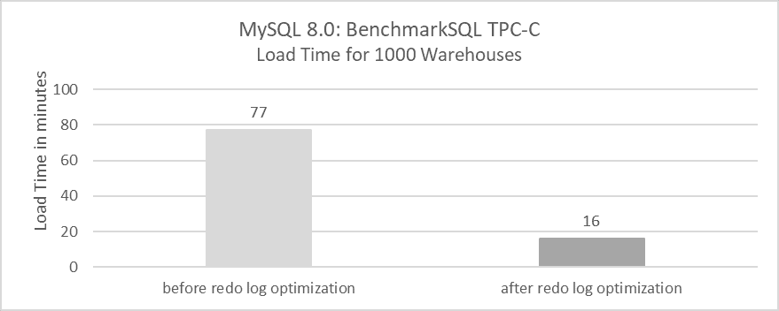

图 7-2. 重做日志优化对 TPC-C 数据加载时间的影响。

TPC-C 数据加载过程涉及高达 100MB 的大事务。以前，加载 1000 个仓库需要 77 分钟，但经过优化后，现在只需 16 分钟。这表明重做日志优化对于处理大事务非常有效。

为了评估这种优化的真正价值，对 MySQL 5.7.36 进行了可伸缩性增强。这个过程首先应用了 trx-sys 补丁，然后是 lock-sys 补丁，以评估吞吐量提升的程度。具体细节如下图所示：

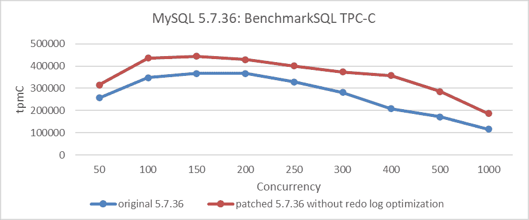

图 7-3. 重做日志优化的间接影响。

从图中可以看出，在应用了 trx-sys 和 lock-sys 扩展性补丁后，MySQL 5.7.36 的吞吐量有所提升。然而，它并没有从根本上解决扩展性问题，尤其是与改进后的 MySQL 8.0.27 版本相比。差距仍然很大。为了识别 250 并发时的瓶颈，可以检查以下*perf*工具的截图。

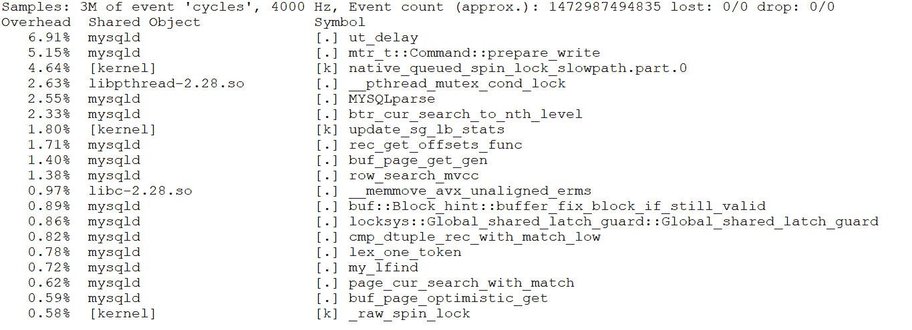

图 7-4. 在 250 并发时的*perf*工具截图。

从图中可以看出，瓶颈是**prepare_write**，这恰好对应于 MySQL 5.7.36 版本中写入重做日志缓冲区的瓶颈。

```cpp
/** Prepare to write the mini-transaction log to the redo log buffer.
@return number of bytes to write in finish_write() */
ulint mtr_t::Command::prepare_write() {
  switch (m_impl->m_log_mode) {
    case MTR_LOG_SHORT_INSERTS:
      ut_d(ut_error);
      /* fall through (write no redo log) */
      [[fallthrough]];
    case MTR_LOG_NO_REDO:
    case MTR_LOG_NONE:
      ut_ad(m_impl->m_log.size() == 0);
      return 0;
    case MTR_LOG_ALL:
      break;
    default:
      ut_d(ut_error);
      ut_o(return 0);
  }
  ... 
```

让我们通过检查其调用栈关系来分析这个函数。


图 7-5. 显示重做日志写入瓶颈的调用栈关系。

图表清晰地显示瓶颈在于重做日志写入。没有重做日志优化补丁，MySQL 5.7.36 的扩展性问题无法得到根本解决，这突显了重做日志优化的重要性。

目前重做日志优化是否有任何副作用？测试数据显示，在低并发条件下，刷新操作的数量显著增加。使用 SysBench 读写测试，对每笔交易平均 I/O 刷新次数与并发之间的关系进行了统计分析。具体细节如下所示：

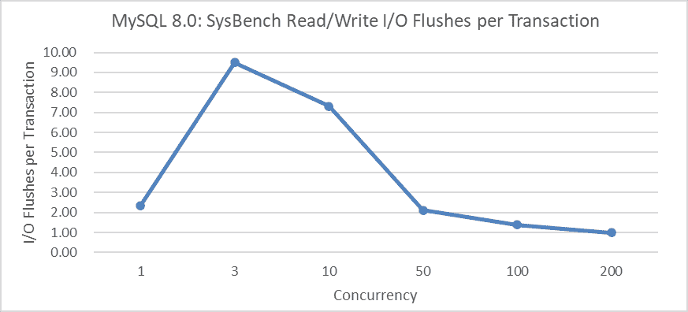

图 7-6. 低并发下重做日志优化的副作用：更多的 I/O 刷新。

从图中可以观察到，在 3 个并发读写操作中，每笔交易平均超过 9 次刷新，而在 200 并发时，每笔交易减少到大约 1 次刷新。这些平均刷新次数可以进一步优化，但这需要找到一个平衡点：及时刷新可以更快地激活用户线程，但会带来更高的 I/O 开销，而延迟刷新可以降低 I/O 成本，但可能会增加用户响应时间。

重要的是要注意，重做日志的改进主要关注于在高并发环境中提升整体性能，但在少于 50 个并发连接的场景中表现不佳。许多用户抱怨 MySQL 8.0 的性能未达到预期，这是其中一个基本原因。

### 7.1.2 通过 Latch Sharding 优化 Lock-Sys

在 MySQL 5.7 中，锁系统遇到了严重的 latch 竞争问题，在高并发下严重影响了吞吐量。在事务执行期间，频繁的锁定和解锁操作需要获取全局 latch。当许多用户线程竞争这个全局 latch 时，MySQL 的可扩展性成为一个主要问题。

Lock-sys 优化是 MySQL 8.0 中进行的第二大改进。以下 git log 描述了 lock-sys 优化的具体细节。

```cpp
commit 1d259b87a63defa814e19a7534380cb43ee23c48
Author: Jakub Łopuszański <jakub.lopuszanski@oracle.com>
Date:   Wed Feb 5 14:12:22 2020 +0100

    WL#10314 - InnoDB: Lock-sys optimization: sharded lock_sys mutex

    The Lock-sys orchestrates access to tables and rows. Each table, and each row,
    can be thought of as a resource, and a transaction may request access right for
    a resource. As two transactions operating on a single resource can lead to
    problems if the two operations conflict with each other, Lock-sys remembers
    lists of already GRANTED lock requests and checks new requests for conflicts in
    which case they have to start WAITING for their turn.

    Lock-sys stores both GRANTED and WAITING lock requests in lists known as queues.
    To allow concurrent operations on these queues, we need a mechanism to latch
    these queues in safe and quick fashion.

    In the past a single latch protected access to all of these queues.
    This scaled poorly, and the managment of queues become a bottleneck.
    In this WL, we introduce a more granular approach to latching.

    Reviewed-by: Pawel Olchawa <pawel.olchawa@oracle.com>
    Reviewed-by: Debarun Banerjee <debarun.banerjee@oracle.com>
      RB:23836 
```

理论上对全局 Latch 进行分片可以显著提高在高并发情况下的可扩展性。基于对 lock-sys 优化前后的程序，使用 BenchmarkSQL 比较不同并发情况下的 TPC-C 吞吐量，具体结果如下所示：

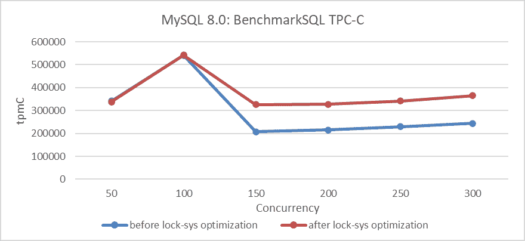

图 7-7\. 不同并发级别下 lock-sys 优化的影响。

从图中可以看出，优化 lock-sys 在高并发条件下显著提高了吞吐量，而在低并发条件下由于冲突较少，效果不太明显。

### 7.1.3 trx-sys 中的 Latch Splitting

MySQL 中的 trx-sys 子系统与 MVCC 密切相关，主要涉及读操作。对重做日志和 lock-sys 的改进主要与写操作相关。

MySQL 5.7 使用全局 Latch 来同步 trx-sys 内部的各种操作。为了增强读能力，解决这个 Latch 瓶颈至关重要。然而，复杂的逻辑使得修改变得具有挑战性。

在 MySQL 8.0 中，全局 Latch 被最初分割。为 *serialization_list* 引入了一个新的 Latch，允许绕过全局 Latch 并减少其上的竞争压力。以下 git log 描述了这些优化的具体细节。

```cpp
commit e66d48b0c73d5fec278f81784bd5697502990263
Author: Paweł Olchawa <pawel.olchawa@oracle.com>
Date:   Mon Mar 1 15:52:30 2021 +0100

    BUG#27933068 USE DIFFERENT MUTEX TO PROTECT TRX_SYS->SERIALISATION_LIST

    This is an optimization patch, which reduces contention on the trx_sys_t::mutex
    by introducing a new mutex - the trx_sys_t::serialisation_mutex.

    The new mutex protects the trx_sys_t::serialisation_list and replaces the
    trx_sys_t::mutex when trx->no is being assigned.

    This is a modified version of the contribution patch which was created by Zhai Weixiang.
    Modifications:
    1. Periodical write of max_trx_id to the transaction system header page is modified.
    2. The trx_get_serial_no() is called when we do not hold trx_sys_t::mutex.
    3. Members in trx_sys_t are rearranged, so they are grouped by mutex that protects them.
    4. The new mutex received its own latch_id.
    5. InnoDB relies on rw_trx_max_id instead of max_trx_id in few places.
    6. The min_active_id is updated only when it really changes.

    RB: 19712
    Reviewed-by: Debarun Banerjee debarun.banerjee@oracle.com 
```

基于此优化前后的对比，使用 BenchmarkSQL 比较不同并发情况下的 TPC-C 吞吐量，具体结果如下所示：

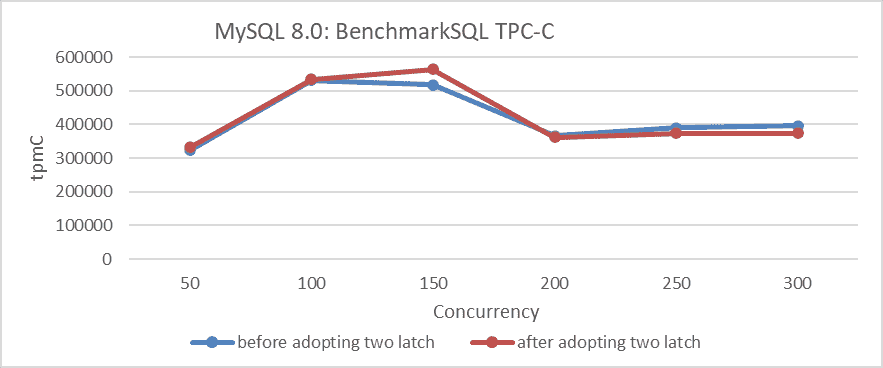

图 7-8\. 不同并发级别下 trx-sys 中 Latch Splitting 的影响。

从图中可以看出，优化在 150 并发时有效。然而，超过 200 并发后，吞吐量不仅没有增加，实际上还下降了。这种在高并发水平下的下降主要是由于其他队列瓶颈的干扰。

### 7.1.4 trx-sys 的 Latch Sharding

在 MySQL 8.0 中，对 trx-sys 子系统进行了进一步的扩展性改进。*rw_trx_set* 已被划分为多个分片，每个分片都有自己的 Latch。这显著减少了全局 Latch 在读操作上的竞争。以下 git log 描述了这些优化的具体细节。

```cpp
commit bc95476c0156070fd5cedcfd354fa68ce3c95bdb
Author: Paweł Olchawa <pawel.olchawa@oracle.com>
Date:   Tue May 25 18:12:20 2021 +0200

    BUG#32832196 SINGLE RW_TRX_SET LEADS TO CONTENTION ON TRX_SYS MUTEX

    1. Introduced shards, each with rw_trx_set and dedicated mutex.
    2. Extracted modifications to rw_trx_set outside its original critical sections
       (removal had to be extracted outside trx_erase_lists).
    3. Eliminated allocation on heap inside TrxUndoRsegs.
    4. [BUG-FIX] The trx->state and trx->start_time became converted to std::atomic<>
       fields to avoid risk of torn reads on egzotic platforms.
    5. Added assertions which ensure that thread operating on transaction has rights
       to do so (to show there is no possible race condition).

    RB: 26314
    Reviewed-by: Jakub Łopuszański jakub.lopuszanski@oracle.com 
```

基于此优化前后的对比，使用 BenchmarkSQL 比较不同并发情况下的 TPC-C 吞吐量，具体结果如下所示：

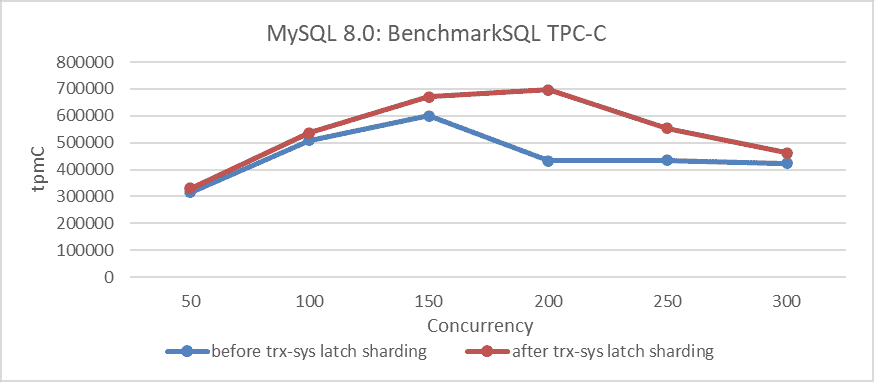

图 7-9\. 不同并发级别下 trx-sys 中 Latch Sharding 的影响。

从图中可以看出，这种改进显著提高了 TPC-C 吞吐量，在 200 并发时达到峰值。值得注意的是，在 300 并发时，影响减弱，这主要是由于与 MVCC ReadView 相关的 trx-sys 子系统中的持续可扩展性问题。这个问题将在下一章中进一步讨论。

### 7.1.5 总结

上述一系列的可扩展性改进为在 MySQL 中实现高吞吐量奠定了坚实的基础。没有这些变化，后续的改进将失去其意义。因此，MySQL 8.0 在可扩展性方面取得了显著的进步。

## 7.2 评估 MySQL 锁调度算法的性能提升

调度在计算机系统设计中至关重要。正确的策略可以在不需要更快的机器的情况下显著降低平均响应时间，从而免费提高性能。调度还优化了其他指标，如用户公平性和差异化服务水平，确保某些工作类别的平均延迟低于其他类别[24]。

MySQL 8.0 使用基于冲突感知的事务调度（CATS）算法来优先处理等待锁的事务。当多个事务竞争同一把锁时，CATS 根据调度权重确定优先级，该权重由给定事务阻塞的事务数量计算得出。阻塞其他事务最多的交易获得更高的优先级；如果权重相等，则等待时间最长的交易优先。

当多个事务因为每个事务都持有其他事务需要的锁而无法进行时，就会发生死锁，导致所有涉及的事务无限期地等待而不释放它们的锁。

在理解了 MySQL 锁调度算法之后，让我们来考察这个算法如何影响吞吐量。在测试之前，有必要了解之前的 FIFO 算法以及如何恢复它。有关详细信息，请参阅以下 git log 解释。

```cpp
This WL improves the implementation of CATS to the point where the FCFS will be redundant (as often slower, and easy to "emulate" by setting equal schedule weights in CATS), so it removes FCFS from the code, further simplifying the lock_sys's logic. 
```

根据上述提示，在 MySQL 中恢复 FIFO 锁调度算法是直接的。随后，使用 SysBench Pareto 分布场景和改进后的 MySQL 8.0.32 的不同并发级别进行了吞吐量测试。详细信息见以下图表。

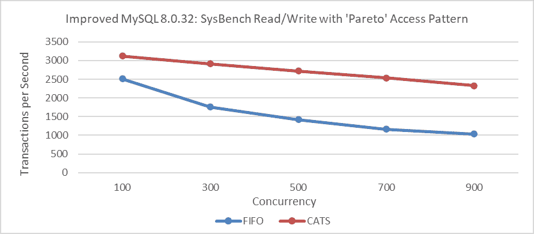

图 7-10\. CATS 在不同并发级别上对吞吐量的影响。

从图中可以看出，CATS 算法的吞吐量显著高于 FIFO 算法。要比较这两个算法的用户响应时间，请参阅以下图表。

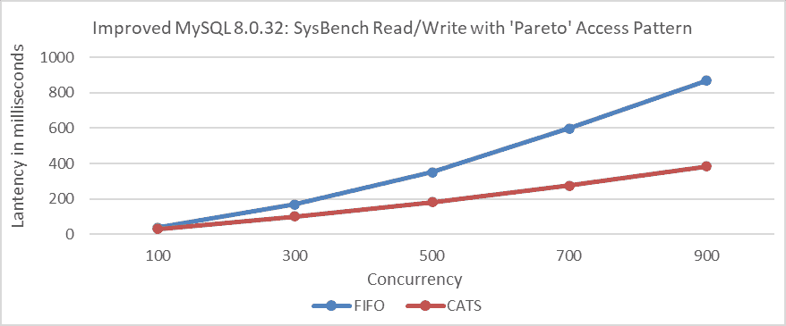

图 7-11\. CATS 在不同并发级别上对响应时间的影响。

从图中可以看出，CATS 算法提供了显著更好的用户响应时间。

此外，在帕累托分布测试过程中比较死锁错误统计，详细信息可以在以下图中找到。

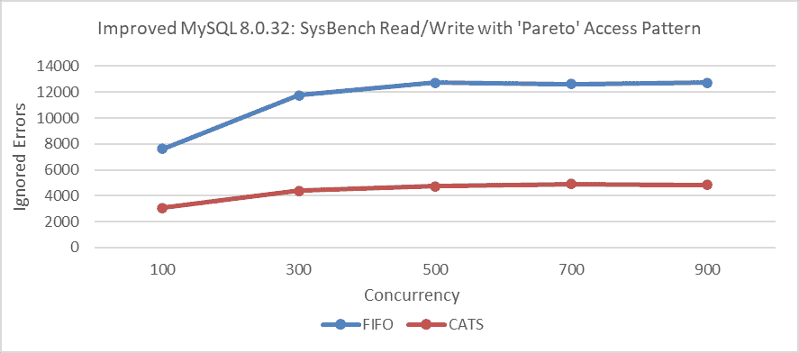

图 7-12\. CATS 在不同并发级别对忽略错误的影响。

比较分析表明，CATS 算法显著减少了死锁。这种死锁的减少可能在提高性能中发挥了关键作用。这一相关性的理论基础如下[8]：

*在高竞争设置下，目标系统的吞吐量将由目标系统的并发控制机制决定：能够更早释放锁或减少中止次数的系统将在这种设置中具有优势。*

上述测试结果与 MySQL 的官方发现非常吻合。以下两个图基于官方测试[57]，展示了 CATS 算法的显著有效性。

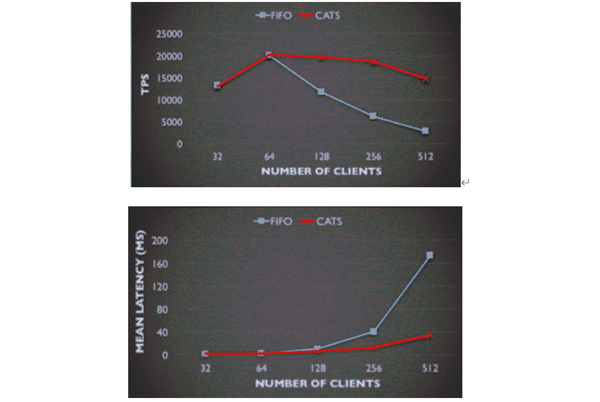

图 7-13\. CATS 与 FIFO 在 TPS 和平均延迟方面的比较：来自 MySQL 博客的见解。

此外，MySQL 实施 CATS 算法的官方要求非常严格。具体细节在以下图中提供：

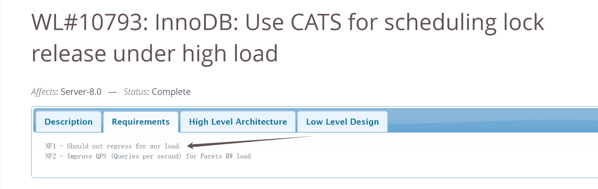

图 7-14\. CATS 官方工作日志的要求。

因此，采用 CATS 算法后，所有场景中都不应出现性能下降。看起来事情到此为止，但 CATS 算法论文[24]中的总结引发了一些疑问。具体细节在以下图中提供：

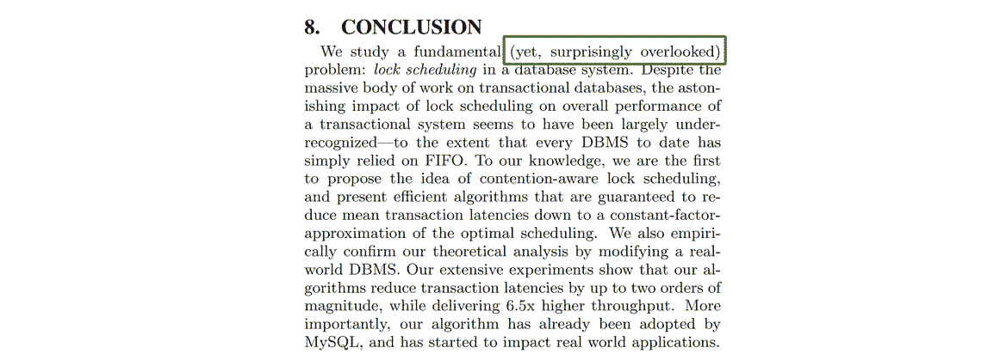

图 7-15\. 对 CATS 论文的疑问。

从上述信息可以推断，要么行业忽视了 FIFO 的潜在缺陷，要么论文的评估有误，FIFO 并没有出现所暗示的严重问题。这种矛盾突显了一个关键问题：这些结论中必有一个是错误的；两者不可能都是正确的。

矛盾往往为深入的问题分析和解决提供了宝贵的机会。它们突出了现有理解可能受到挑战或可以取得新见解的领域。

这次，在改进的 MySQL 8.0.27 上进行测试时，MySQL 错误日志文件中出现了大量错误日志。以下是部分截图：

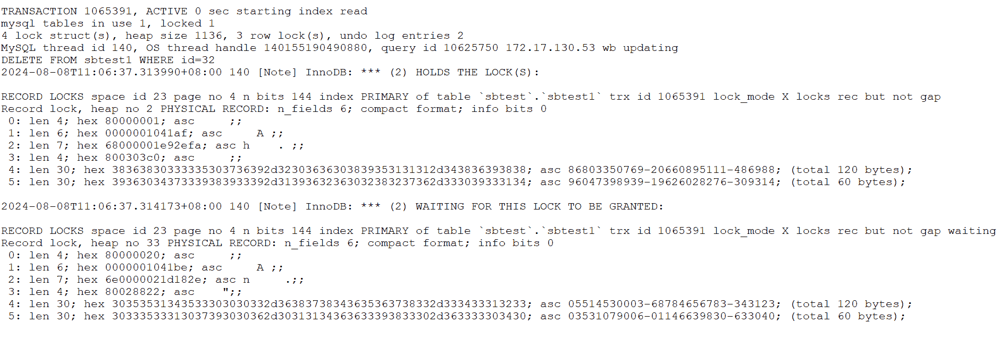

图 7-16\. 大量错误日志的部分截图。

继续分析相应的代码，具体如下：

```cpp
void Deadlock_notifier::notify(const ut::vector<const trx_t *> &trxs_on_cycle,
                               const trx_t *victim_trx) {
  ut_ad(locksys::owns_exclusive_global_latch());
  start_print();
  const auto n = trxs_on_cycle.size();
  for (size_t i = 0; i < n; ++i) {
    const trx_t *trx = trxs_on_cycle[i];
    const trx_t *blocked_trx = trxs_on_cycle[0 < i ? i - 1 : n - 1];
    const lock_t *blocking_lock =
        lock_has_to_wait_in_queue(blocked_trx->lock.wait_lock, trx);
    ut_a(blocking_lock);
    print_title(i, "TRANSACTION");
    print(trx, 3000);
    print_title(i, "HOLDS THE LOCK(S)");
    print(blocking_lock);
    print_title(i, "WAITING FOR THIS LOCK TO BE GRANTED");
    print(trx->lock.wait_lock);
  }
  const auto victim_it =
      std::find(trxs_on_cycle.begin(), trxs_on_cycle.end(), victim_trx);
  ut_ad(victim_it != trxs_on_cycle.end());
  const auto victim_pos = std::distance(trxs_on_cycle.begin(), victim_it);
  ut::ostringstream buff;
  buff << "*** WE ROLL BACK TRANSACTION (" << (victim_pos + 1) << ")\n";
  print(buff.str().c_str());
  DBUG_PRINT("ib_lock", ("deadlock detected"));
  ...
  lock_deadlock_found = true;
} 
```

从代码分析来看，死锁会导致大量的日志输出。在测试期间观察到的忽略错误与这些死锁有关。CATS 算法有助于减少忽略错误的数量，从而减少日志输出。这个问题可以持续重现。

在此背景下，出现了一些考虑因素：

1.  **对性能测试的影响：**广泛的错误日志和由此产生的中断可能会潜在地扭曲性能评估，导致对系统能力的评估不准确。

1.  **CATS 算法的有效性：**CATS 算法的性能提升可能需要重新评估。如果广泛的错误日志输出对性能有显著影响，其实际有效性可能不如最初认为的那么高。

设置`innodb_print_all_deadlocks=OFF`或从`Deadlock_notifier::notify`函数中移除所有日志，重新编译 MySQL，并使用帕累托分布运行 SysBench 读写测试。详细信息见以下图表：

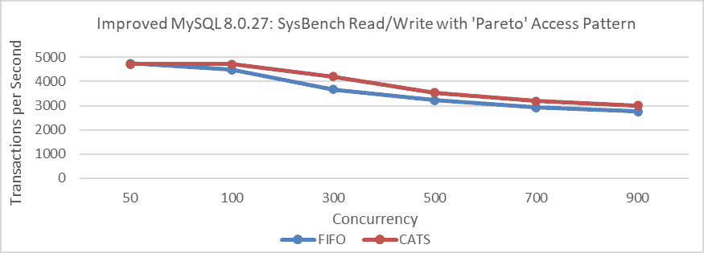

图 7-17\. 消除干扰后，在改进后的 MySQL 8.0.27 的各个并发级别上 CATS 对吞吐量的影响。

从图中可以看出，吞吐量比较发生了显著变化。在严重冲突的场景中，CATS 算法略优于 FIFO 算法，但差异很小，远不如之前的测试中明显。请注意，这些测试是在改进后的 MySQL 8.0.27 上进行的。

让我们在改进后的 MySQL 8.0.32 上执行性能比较测试，移除死锁日志干扰，使用帕累托分布。

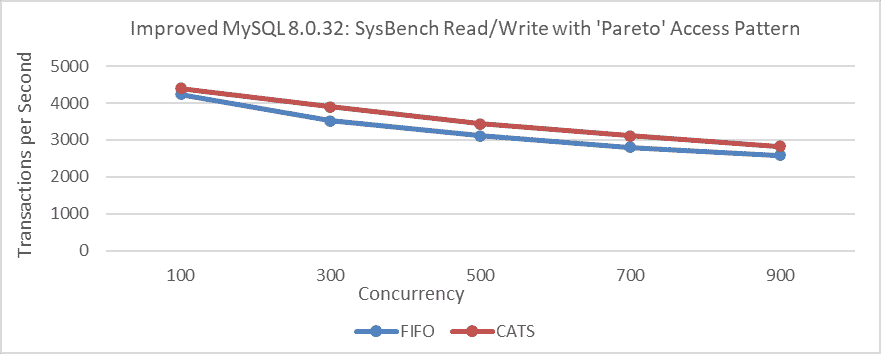

图 7-18\. 消除干扰后，在改进后的 MySQL 8.0.32 的各个并发级别上 CATS 对吞吐量的影响。

从图中可以看出，消除干扰只导致轻微的性能差异。这种小的变化使得 FIFO 调度问题的严重性可能难以察觉。CATS 作者和 MySQL 官员感知到的偏差很可能是由于广泛的死锁日志输出造成的干扰。

使用与 CATS 算法论文中相同的 32 个仓库，在各个并发级别上进行了 TPC-C 测试。MySQL 基于改进后的 MySQL 8.0.27，BenchmarkSQL 被修改以支持每个仓库 100 个并发事务。

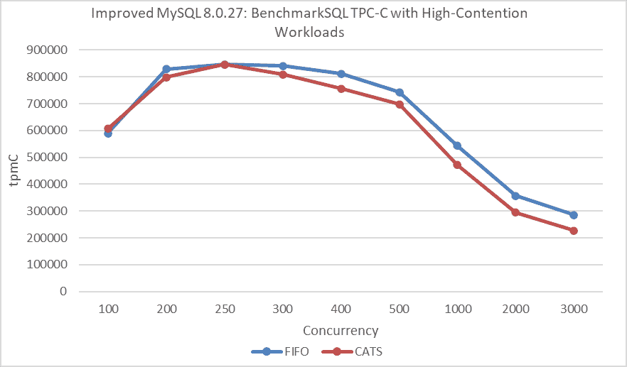

图 7-19\. 根据 CATS 论文，消除干扰后，在 NUMA 下不同并发级别上 CATS 对吞吐量的影响。

从图中可以看出，CATS 算法的性能不如 FIFO 算法。为了避免 NUMA 相关的干扰，MySQL 被绑定到 NUMA 节点 0，进行了一轮新的吞吐量与并发测试。

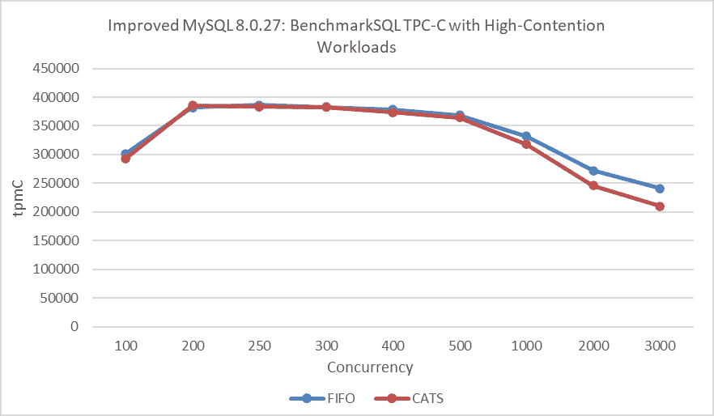

图 7-20\. 根据 CATS 论文，消除干扰后，在 SMP 下不同并发级别上 CATS 对吞吐量的影响。

在这一轮测试中，FIFO 算法继续优于 CATS 算法。与 SysBench Pareto 测试中的改进相比，BenchmarkSQL TPC-C 测试中 CATS 算法性能的下降可以归因于以下原因：

1.  **额外开销**：CATS 算法本身引入了一些额外的开销。

1.  **NUMA 环境问题**：CATS 算法可能在 NUMA 环境中无法发挥最佳性能。

1.  **冲突严重程度**：在 TPC-C 测试中，冲突严重程度比在 SysBench Pareto 测试中要轻微。

1.  **不同的并发场景**：SysBench 创建的并发场景与 BenchmarkSQL 中的场景有显著差异。

最后，在 1000 个仓库和不同并发级别下再次进行了标准的 TPC-C 测试。具体细节如下所示：

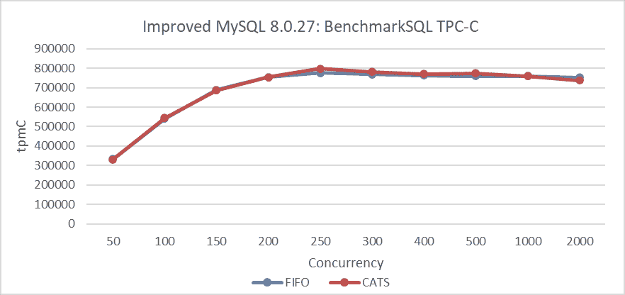

图 7-21\. 消除干扰后，CATS 对 BenchmarkSQL 吞吐量的影响。

从图中可以看出，在低冲突场景下，两种算法之间几乎没有差异。换句话说，在冲突较少的情况下，CATS 算法并没有提供显著的优势。

总体而言，虽然 CATS 在 Pareto 测试中显示出一些改进，但比预期的要少。CATS 算法显著减少了事务死锁，可能比 FIFO 算法导致更少的性能下降。当抑制死锁日志时，这些算法之间的差异最小，澄清了围绕 CATS 算法性能的困惑。

数据库性能测试本质上复杂且容易出错[9]。不能仅凭数据来判断，需要彻底调查以确保逻辑一致性。

## 7.3 MySQL 执行计划的增强

### 7.3.1 MySQL 中哈希连接的实现

正如名称所示，哈希是哈希连接算法的核心。它从一个输入表构建哈希表，然后逐行处理另一个表，使用哈希表进行查找。

哈希连接通常更快，并且比早期 MySQL 版本中使用的块嵌套循环算法更受欢迎。以下实际案例展示了其显著的益处。

在缺乏哈希连接支持的 MySQL 5.7 中，SQL 查询依赖于传统的连接方法，导致执行时间延长至 3.82 秒。


图 7-22\. MySQL 5.7 中非哈希连接的性能。

MySQL 8.0 引入了哈希连接。对于相同的 SQL 查询，使用带有提示的哈希连接将执行时间缩短至 1.22 秒，比传统方法的 3.82 秒有显著改进。


图 7-23\. MySQL 8.0 中哈希连接的性能。

值得注意的是，在以下条件下，MySQL 8.0 中的哈希连接增强了连接性能[13]：

1.  没有可用的索引

1.  查询是 I/O 受限的

1.  表的大部分内容被访问

1.  在多个表中存在选择性条件

1.  增加 join_buffer_size 可以进一步提高性能

哈希连接的引入是 MySQL 8.0 的一个重要特性，为减少响应时间提供了有希望的解决方案。

### 7.3.2 MySQL 中引入超图算法

超图算法是在 MySQL 8.0 中引入的，但目前仅在调试模式下可用。以下 git log 提供了超图算法的具体实现细节。

```cpp
commit b9be77784bf690173522d8db015acf0e72f28f84
Author: Steinar H. Gunderson <steinar.gunderson@oracle.com>
Date:   Wed May 6 16:32:13 2020 +0200

    WL #14070: Hypergraph partitioning algorithm

    Implement DPhyp for hypergraph partitioning, a central component of the join
    optimizer. The algorithm enumerates all possible connected sub-hypergraphs
    of the larger join graph, in a bottom-up fashion. (That is, for a given graph G
    with a subgraphs A and B than can further be partitioned respectively into A1/A2
    and B1/B2, A1 and A2 will both be seen before A, which will in turn be seen
    before S. However, there is no guarantee that B1 or B2 is seen before A.)

    The algorithm is described in the paper "Dynamic Programming Strikes Back" by
    Neumann and Moerkotte. There is a somewhat extended version of the paper
    (that also contains a few corrections) in Moerkotte's treatise "Building Query  Compilers". Some critical details are still missing, which we've had to fill in
    ourselves. We don't currently implement the extension to generalized
    hypergraphs, but it should be fairly straightforward to do later.

    Since our graphs can never have more than 61 tables, node sets and edge lists
    are implemented using 64-bit bit sets. This allows for a compact representation
    and very fast set manipulation; the algorithm does a fair amount of
    intersections and unions. If we should need extensions to larger graphs later
    (this will require additional heuristics for reducing the search space), we can
    use dynamic bit sets, although at a performance cost.

    This is implemented entirely independently of the server; there are no MySQL
    dependencies, short of some shared header files for bit manipulations. It is
    tested using unit tests and microbenchmarks.

    Change-Id: I7912c09ab69a17e607ee3b8fb2af2bd7602e54ec 
```

从上述内容可以看出，超图算法实现的原理在论文“动态规划卷土重来” [35] 中进行了详细阐述。这突显了其在实现过程中涉及的高度复杂性。

基于成本的查询优化器对于数据库管理系统的整体性能至关重要，尤其是在寻找最佳连接顺序方面。基于使用动态规划的效率较高的*DPccp*算法，引入了一种新的算法*DPhyp*，以有效地处理复杂的连接谓词。通过将查询图建模为超图并分析其连通子图，*DPhyp*改善了非内连接的优化，与先前方法相比提供了实质性的性能提升。

随着硬件的进步，高复杂度算法变得可行。尽管某些算法可能不在多项式时间内运行，但现代计算机可以有效地处理大型 NP 完全问题。动态规划技术，虽然仍然是指数级的，但对于中等实例大小越来越可行，通常达到时间复杂度为 O(2^n)。

然而，在使用超图算法时，应将参与连接的表的数量控制在合理的范围内，以避免潜在的性能问题。在 TPC-C 中进行了复杂连接操作的性能比较，包括启用和未启用超图优化。详细结果如下图所示：

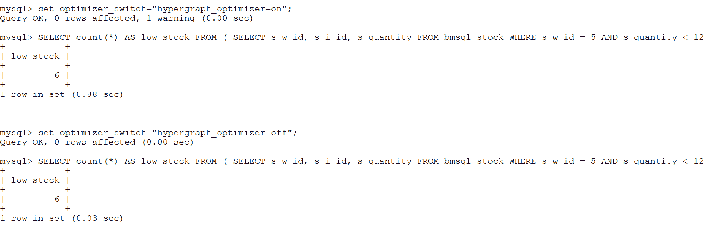

图 7-24\. 超图算法对典型 TPC-C SQL 工作负载的影响。

从图中可以看出，启用超图算法的执行时间为 0.88 秒，而禁用它则将时间缩短到 0.03 秒。这证明了使用超图算法对性能的显著影响。在许多情况下，超图的额外开销可能很大。如果 MySQL 的默认执行计划导致性能缓慢，超图算法可能会提供有价值的改进。

让我们进一步通过以下图中显示的*perf*火焰图来分析超图算法的性能。

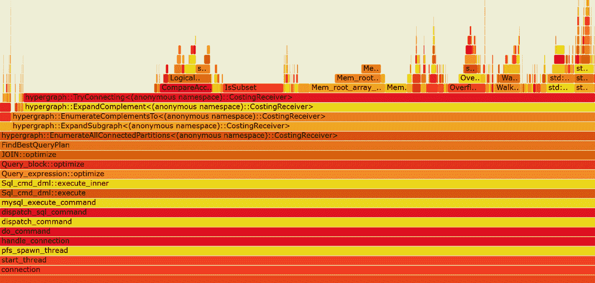

图 7-25\. 超图算法的典型火焰图。

从图中可以看出，超图算法（超图*）消耗了大量的计算资源。目前它以单线程模式运行，超图算法的优化潜力巨大。

由于 MySQL 缺乏查询计划缓存，使用超图算法构建最优执行计划耗时较长，这对其在生产环境中的有效使用构成了挑战。

值得注意的是，AI 也可以用于优化执行计划，如第 5.20.2 节所述。

## 7.4 使用 Binlog 压缩节省成本

从 MySQL 8.0.20 版本开始，支持 binlog 压缩，但默认情况下是禁用的。可以通过设置 *binlog_transaction_compression* 参数来启用它，并且可以使用 *binlog_transaction_compression_level_zstd* 参数调整 *zstd* 压缩级别，默认级别为 3。

在同一数据中心内使用 Group Replication 集群，使用 BenchmarkSQL 检查了 binlog 压缩对 TPC-C 吞吐量和并发性的影响。主节点和从节点都配置了 *binlog_transaction_compression* 参数。具体测试结果如下图所示：

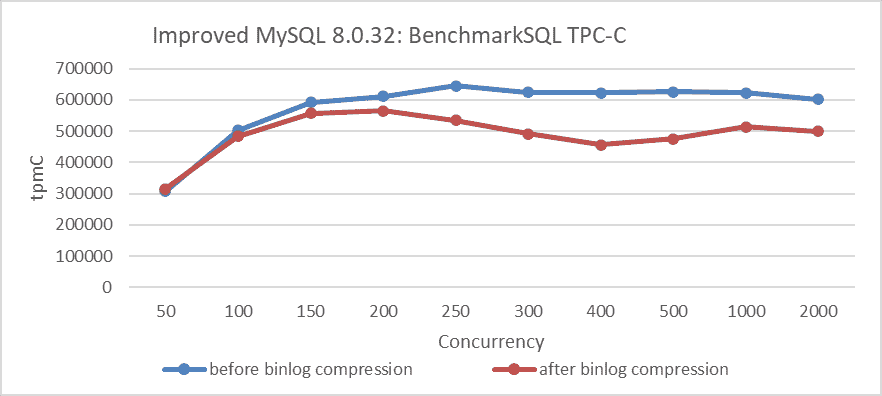

图 7-26\. binlog 压缩对 BenchmarkSQL 性能的影响。

从图中可以看出，启用 binlog 压缩对吞吐量有显著影响，且波动明显。

下一步是比较压缩前后的 binlog 大小。具体细节如下图所示：


图 7-27\. BenchmarkSQL 测试后 binlog 压缩的影响。

从图中可以看出，binlog 压缩对 TPC-C 测试有明显的积极影响。值得注意的是，设置 *binlog_row_image=minimal* 可以显著减小 binlog 的大小，但它对性能的影响较小。具体细节如下图所示：

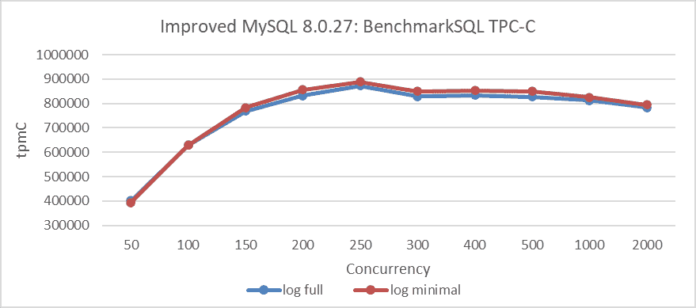

图 7-28\. *binlog_row_image=minimal* 对 BenchmarkSQL 性能的影响。

最后，让我们比较 *binlog_row_image=minimal* 和 *binlog_row_image=full* 之间的 binlog 大小。具体细节如下图所示：

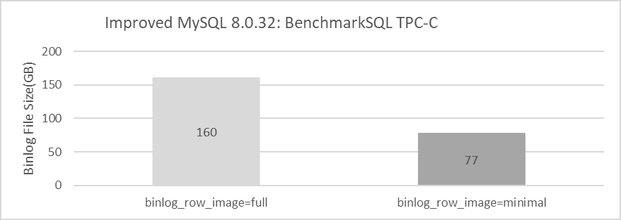

图 7-29\. BenchmarkSQL 测试后 *binlog_row_image=minimal* 的影响。

从图中可以看出，设置 *binlog_row_image=minimal* 也可以显著减小 binlog 的大小。

总体而言，MySQL 8.0 提供了有效的解决方案来解决 binlog 消耗大量 I/O 空间的问题。用户可以利用 binlog 压缩，并在可行的情况下，通过使用 *binlog_row_image=minimal* 来进一步减小 binlog 的大小，从而节省存储成本。需要注意的是，压缩比可能因不同的应用程序而异。

下一章
