# 第八章：精炼 MySQL 8.0：下一级改进

> 原文：[`enhancedformysql.github.io/The-Art-of-Problem-Solving-in-Software-Engineering_How-to-Make-MySQL-Better/Chapter8.html`](https://enhancedformysql.github.io/The-Art-of-Problem-Solving-in-Software-Engineering_How-to-Make-MySQL-Better/Chapter8.html)


本章探讨了 MySQL 8.0 改进中发现的优化机会和解决方案，包括 SQL 层的改进、InnoDB 存储引擎的增强、事务节流机制以及低并发读写性能的改进。

## 8.1 SQL 层的改进

查询执行计划中某些场景的性能下降问题得到了解决。激活 binlog group commit 中的用户线程的机制也得到了改进，从而进一步提高了效率。

### 8.1.1 解决了查询执行计划中的性能下降问题

在对 MySQL 8.0.27 进行二次开发期间，使用 BenchmarkSQL 的 TPC-C 测试变得不稳定。吞吐量迅速下降，使得优化变得复杂。尽管测试困难，但最初由于对官方版本的信任而忽略了这个问题。

只有在用户报告了在升级后性能显著下降之后，我们才开始认真对待这个问题。用户的可靠反馈表明，虽然 MySQL 8.0.25 的性能良好，但升级到 MySQL 8.0.29 导致了显著的性能下降。这一关键信息表明存在性能问题。

同时，确认 MySQL 8.0.27 中的性能下降问题与 MySQL 8.0.29 中的问题相同。MySQL 8.0.27 对 trx-sys 进行了两次针对可扩展性的优化，理论上应该会增加吞吐量。回顾 latch sharding 在 trx-sys 上的性能影响：


图 8-1\. 不同并发级别下 trx-sys 中 latch sharding 的影响。

让我们继续比较 trx-sys latch sharding 优化与 MySQL 8.0.27 发布版本之间的吞吐量和并发性。具体细节如下所示：

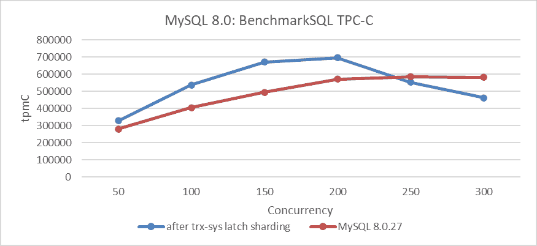

图 8-2\. MySQL 8.0.27 发布版本中的性能下降。

从图中可以看出，在低并发条件下，MySQL 8.0.27 发布版本的性能下降非常明显，峰值性能出现了明显下降。这与用户关于吞吐量下降的反馈一致，并且使用 BenchmarkSQL 很容易重现。

MySQL 8.0.27 发布版本已经存在这个问题，而早先的 MySQL 8.0.25 发布版本则没有。利用这个信息，目标是确定导致性能下降的具体 git 提交。找到导致性能下降的 git 提交是一个复杂的过程，通常涉及二分搜索。经过广泛的测试，最初缩小到特定的提交。然而，这个提交包含数万行代码，使得几乎不可能确定导致问题的确切代码段。后来发现，这个提交是从特定分支的一个合并。这允许进一步分解，并最终在以下方面确定了问题的根本原因：

```cpp
commit 9a13c1c6971f4bd56d143179ecfb34cca8ecc018
Author: Steinar H. Gunderson <steinar.gunderson@oracle.com>
Date:   Tue Jun 8 15:14:35 2021 +0200

    Bug #32976857: REMOVE QEP_TAB_STANDALONE [range optimizer, noclose]

    Remove the QEP_TAB dependency from test_quick_select() (ie., the range
    optimizer).

    Change-Id: Ie0fcce71dfc813920711c43c3d62635dae0d7d20 
```

使用提交信息，编译了两个版本，并识别出在 TPC-C 测试中执行特别缓慢的 SQL 查询。使用“*explain*”分析了这些慢速 SQL 查询的执行计划。具体细节如下图所示：

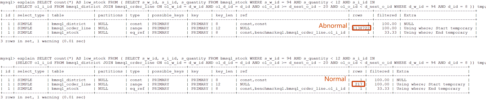

图 8-3。“*explain*”中行数显示的异常。

从图中可以看出，大多数执行计划是相同的，除了“*行数*”列。在正常版本中，“*行数*”列显示略超过 200，而在有问题的版本中，它显示超过 1,000,000。经过不断地简化 SQL 语句，最终确定了一个具有高度代表性的 SQL 查询。具体细节如下图所示：

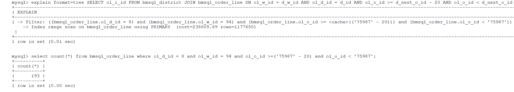

图 8-4。SQL 执行结果与“*explain*”输出的显著差异。

根据从“*explain*”获得的“*过滤*”信息，构建了图中所显示的最后一个查询。图显示，尽管最后一个查询只返回了 193 行，但“*explain*”显示“*行数*”超过 1.17 百万行。这种差异凸显了一个复杂问题，因为并非所有 MySQL 开发者都能完全理解执行计划。幸运的是，识别出导致性能下降的提交为解决问题提供了关键的基础。尽管有了这些信息解决问题相对直接，但分析 SQL 语句本身的根本原因证明要困难得多。

让我们继续深入分析这个问题。以下图显示了特定 SQL 查询的“*explain*”结果：

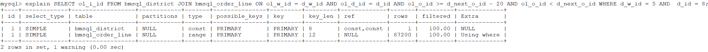

图 8-5。表示问题的示例 SQL 查询。

从图中可以看出，行数仍然很大，这表明这个 SQL 查询具有代表性。

编译了两种不同的 MySQL 调试版本：一个包含异常，一个正常。使用调试版本通过调试跟踪捕获有用的函数调用关系。在异常版本上执行有问题的 SQL 语句时，相关的调试跟踪信息如下：

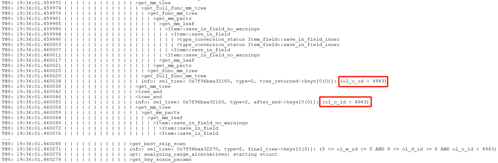

图 8-6。异常版本的调试跟踪信息。

类似地，对于正常版本，相关的调试跟踪信息如下：

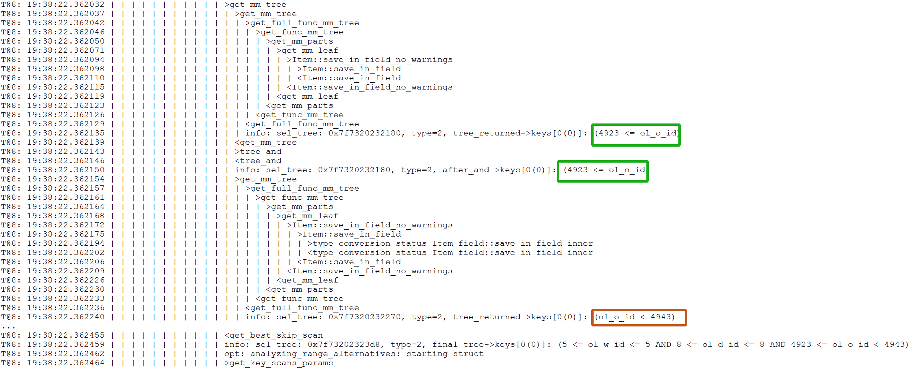

图 8-7。正常版本的调试跟踪信息。

比较上述两个图，可以注意到正常版本在绿色框内包含额外的内容，表明在正常版本中应用了条件，而异常版本缺少这些条件。为了理解为什么异常版本缺少这些条件，有必要在*get_full_func_mm_tree*函数中添加额外的跟踪信息，以捕获导致这种差异的具体细节。

添加额外的跟踪信息后，异常版本的调试跟踪结果如下：

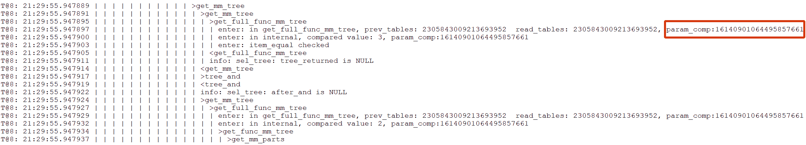

图 8-8。异常版本的补充调试跟踪信息。

正常版本的调试跟踪结果如下：

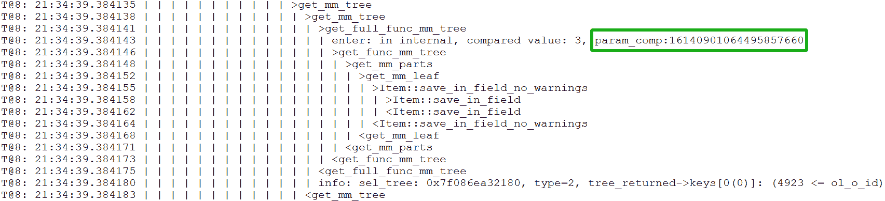

图 8-9。正常版本的补充调试跟踪信息。

比较上述两个图，可以观察到显著的差异。在正常版本中，*param_comp*的值为 16140901064495857660，而在异常版本中，它为 16140901064495857661，相差 1。为了理解这种差异，让我们首先检查*param_comp*值的计算方法，如下面的代码片段中详细说明：

```cpp
static SEL_TREE *get_full_func_mm_tree(THD *thd, RANGE_OPT_PARAM *param,
                                       table_map prev_tables,
                                       table_map read_tables,
                                       table_map current_table,
                                       bool remove_jump_scans, Item *predicand,
                                       Item_func *op, Item *value, bool inv) {
  SEL_TREE *tree = nullptr;
  SEL_TREE *ftree = nullptr;
  const table_map param_comp = ~(prev_tables | read_tables | current_table);
  DBUG_TRACE;
  ... 
```

从代码中可以看出，*param_comp*是通过三个变量的位或操作计算得出的，然后是位非操作。1 的差值表明至少有一个这些变量不同，有助于缩小问题范围。

计算涉及三个具有长值的*table_map*变量，使得普通计算器不足，而且过程过于复杂，无法在此详细说明。

关键点在于调试跟踪揭示了关键差异。结合识别出导致性能差异的 Git 提交信息，分析根本原因就不再困难。

这里是最终的修复补丁，具体如下：

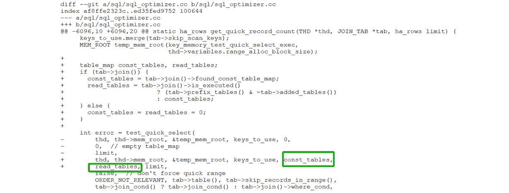

图 8-10。解决查询执行计划性能下降的最终补丁。

在调用*test_quick_select*函数时，重新引入*const_table*和*read_tables*变量（与之前讨论的变量相关）。这确保了执行计划中的过滤条件不会被忽略。

在将上述补丁应用到 MySQL 8.0.27 后，性能下降问题得到了解决。进行了比较补丁前后在不同并发级别下 TPC-C 吞吐量的测试。具体细节如图所示：

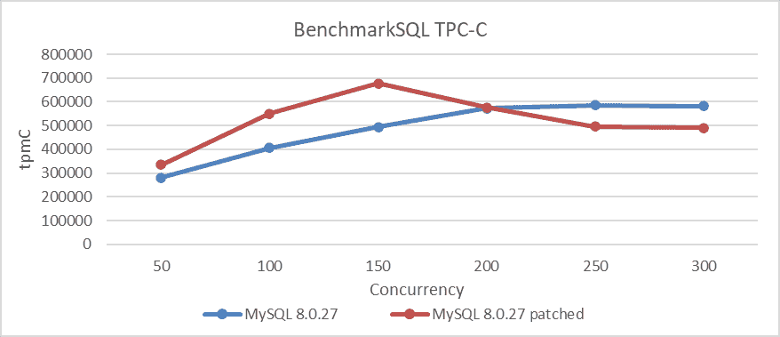

图 8-11. 补丁对解决性能下降的影响。

从图中可以看出，在低并发条件下，应用补丁后，吞吐量和峰值性能显著提高。然而，在高并发条件下，吞吐量不仅没有增加，反而实际上下降了，这很可能是由于 MVCC ReadView 的可扩展性瓶颈造成的。

在解决 MVCC ReadView 的可扩展性问题后，重新评估该补丁的影响，具体如图所示：

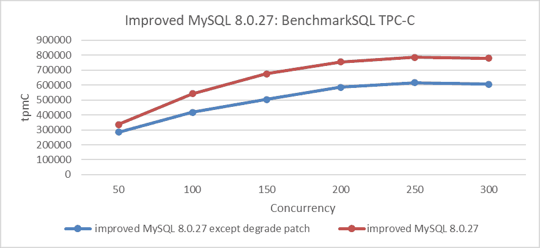

图 8-12. 解决 MVCC ReadView 可扩展性问题后的补丁实际效果。

从图中可以看出，这个补丁显著提高了 MySQL 的吞吐量。这个案例表明，可扩展性问题可能会破坏某些优化。为了科学地评估优化的有效性，在评估之前解决大多数可扩展性问题至关重要，以实现更准确的评估。

最后，让我们检查 TPC-C 长期稳定性测试的结果。以下图显示了在 100 并发情况下进行的 8 小时测试结果，吞吐量在各个小时被捕获（其中 1 ≤ n ≤ 8）。

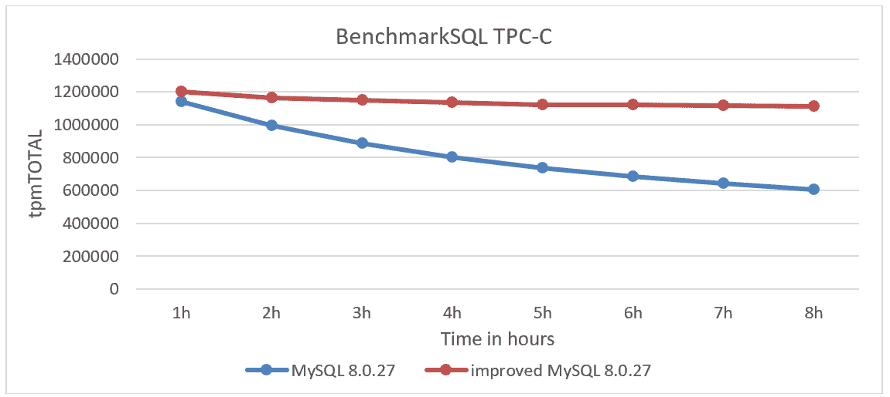

图 8-13. 稳定性测试比较：MySQL 8.0.27 与改进后的 MySQL 8.0.27。

从图中可以看出，应用补丁后，吞吐量下降的速度显著减缓。MySQL 8.0.27 版本经历了显著的吞吐量下降，未能满足 TPC-C 测试的稳定性要求。然而，应用补丁后，MySQL 的性能恢复了正常。

直接解决这个问题带来了相当大的挑战，尤其是对于不熟悉查询执行计划的 MySQL 开发者来说。使用逻辑推理和系统性的方法来识别和解决问题出现前后的代码差异是一种更优雅的解决问题的方法，尽管它很复杂。

值得注意的是，在应用补丁后没有遇到回归测试问题，这表明了高度的稳定性，并为未来的性能改进提供了坚实的基础。目前，MySQL 8.0.40 仍未解决这个问题，这表明 MySQL 测试系统可能存在潜在缺陷。鉴于 MySQL 数据库的复杂性，用户在升级时应谨慎，并考虑使用 TCPCopy [65]等工具来避免潜在的回归测试问题。

### 8.1.2 提高 Binlog Group Commit 的可扩展性

binlog 组提交机制相当复杂，这种复杂性使得识别其固有的性能问题变得具有挑战性。

首先，使用*perf*工具在 TPC-C 测试中捕获 500 并发性能问题，如图所示：


图 8-14. *_pthread_mutex_cond_lock*瓶颈揭示了性能问题。

显然，*_pthread_mutex_cond_lock*是一个重要的瓶颈，占大约 9.5%的开销。尽管*perf*没有直接指出确切的问题，但它表明了这种瓶颈的存在。

为了解决这个问题，对 MySQL 内部进行了深入探索，以揭示导致这种性能瓶颈的因素。使用了一种传统的二分搜索方法，并尽量减少日志记录，以确定在执行过程中产生重大开销的函数或代码段。选择最小化日志记录方法是为了在诊断问题的根本原因时减少性能干扰。过多的日志记录可能会干扰性能分析，尽管有些人可能使用 MySQL 的内部机制进行故障排除，但这些通常会引入大量的性能开销。

经过彻底的调查，瓶颈被确定在以下代码段中。

```cpp
 /*
    If the queue was not empty, we're a follower and wait for the
    leader to process the queue. If we were holding a mutex, we have
    to release it before going to sleep.
  */
  if (!leader) {
    CONDITIONAL_SYNC_POINT_FOR_TIMESTAMP("before_follower_wait");
    mysql_mutex_lock(&m_lock_done);
    ... 
    ulonglong start_wait_time = my_micro_time();
    while (thd->tx_commit_pending) {
      if (stage == COMMIT_ORDER_FLUSH_STAGE) {
        mysql_cond_wait(&m_stage_cond_commit_order, &m_lock_done);
      } else {
        mysql_cond_wait(&m_stage_cond_binlog, &m_lock_done);
      }
    }
    ulonglong end_wait_time = my_micro_time();
    ulonglong wait_time = end_wait_time - start_wait_time;
    if (wait_time > 100000) {
        fprintf(stderr, "wait too long:%llu\n", wait_time);
    }
    mysql_mutex_unlock(&m_lock_done);
    return false;
  } 
```

“等待时间过长”输出的多次出现表明瓶颈已被暴露。为了调查为什么会出现“等待时间过长”，日志被添加和相应修改。请参见以下具体代码：

```cpp
 /*
    If the queue was not empty, we're a follower and wait for the
    leader to process the queue. If we were holding a mutex, we have
    to release it before going to sleep.
  */
  if (!leader) {
    CONDITIONAL_SYNC_POINT_FOR_TIMESTAMP("before_follower_wait");
    mysql_mutex_lock(&m_lock_done);
    ...
    ulonglong start_wait_time = my_micro_time();
    while (thd->tx_commit_pending) {
      if (stage == COMMIT_ORDER_FLUSH_STAGE) {
        mysql_cond_wait(&m_stage_cond_commit_order, &m_lock_done);
      } else {
        mysql_cond_wait(&m_stage_cond_binlog, &m_lock_done);
      }
      fprintf(stderr, "wake up thread:%p,total wait time:%llu, stage:%d\n",
              thd, my_micro_time() - start_wait_time, stage);
    }
    ulonglong end_wait_time = my_micro_time();
    ulonglong wait_time = end_wait_time - start_wait_time;
    if (wait_time > 100000) {
        fprintf(stderr, "wait too long:%llu for thread:%p\n", wait_time, thd);
    }
    mysql_mutex_unlock(&m_lock_done);
    return false;
  } 
```

在另一轮测试后，观察到一种奇特的现象：当出现“等待时间过长”消息时，“唤醒线程”日志显示许多用户线程被唤醒多次。

问题追踪到*thd->tx_commit_pending*值没有变化，导致线程反复重新进入等待过程。进一步检查揭示了该变量变为 false 的条件，如下面的代码所示：

```cpp
void Commit_stage_manager::signal_done(THD *queue, StageID stage) {
  mysql_mutex_lock(&m_lock_done);
  for (THD *thd = queue; thd; thd = thd->next_to_commit) {
    thd->tx_commit_pending = false;
    thd->rpl_thd_ctx.binlog_group_commit_ctx().reset();
  }
  /* if thread belong to commit order wake only commit order queue threads */
  if (stage == COMMIT_ORDER_FLUSH_STAGE)
    mysql_cond_broadcast(&m_stage_cond_commit_order);
  else
    mysql_cond_broadcast(&m_stage_cond_binlog);
  mysql_mutex_unlock(&m_lock_done);
} 
```

从代码中可以看出，在*signal_done*函数中，*thd->tx_commit_pending*被设置为 false。随后，*mysql_cond_broadcast*函数激活所有等待的线程，导致类似暴风群问题的情况。当所有之前等待的用户线程被激活后，它们会检查 tx_commit_pending 是否被设置为 false。如果是，它们将继续处理；否则，它们将继续等待。

尽管 binlog 组提交机制很复杂，但简单的分析就能确定根本原因：应该不被激活的线程被触发，导致每次激活都产生不必要的上下文切换。

在一次测试中，收集了用户线程进入等待状态的次数的额外统计信息。详细信息如下所示：

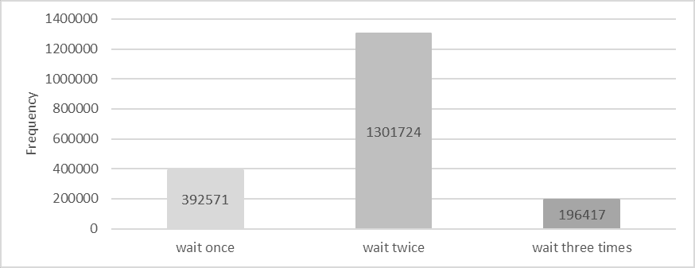

图 8-15. 激活 1 次、2 次、3 次的线程统计。

等待一次是正常的，表示 100%的效率。等待两次表明 50%的效率，而等待三次则表示 33.3%的效率。根据图表，整体激活效率计算为 52.7%。

为了解决这个问题，一个理想的解决方案是具有 100%效率的多播激活机制，其中将 tx_commit_pending 设置为 false 的用户线程一起激活。然而，实现这一点需要深入理解 binlog 组提交背后的复杂逻辑。

在这种情况下，使用了点对点激活机制，实现了 100%的效率，但引入了显著的系统调用开销。以下图表展示了优化前后 TPC-C 吞吐量和并发的变化关系。

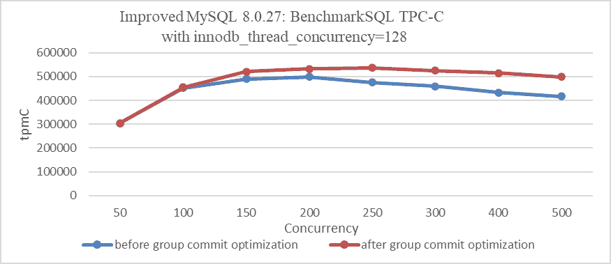

图 8-16. 使用 innodb_thread_concurrency=128 的组提交优化的影响。

从图表中可以看出，当 innodb_thread_concurrency=128 时，binlog 组提交的优化在高并发下显著提高了吞吐量。

重要的是要注意，这种优化的有效性可能因配置设置和特定场景等因素而异。然而，总的来说，它在高并发条件下显著提高了吞吐量。

下面是使用标准配置在优化前后 TPC-C 吞吐量和并发的比较：

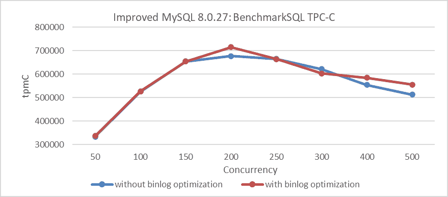

图 8-17. 使用标准配置进行组提交优化的影响。

从图表中可以看出，这次优化与之前的优化相比不那么明显，但仍然显示出整体上的改进。广泛的测试表明，MySQL 的可扩展性越差，binlog 组提交优化的效果就越显著。

同时，之前识别出的*b pthread_mutex_cond_lock*瓶颈在优化后得到了显著缓解，如下面的图表所示：

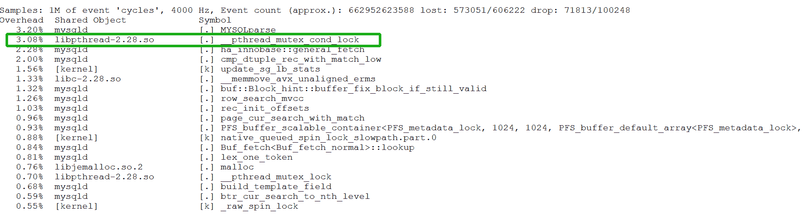

图 8-18. *b pthread_mutex_cond_lock*瓶颈的缓解。

总结来说，这次优化有助于解决与 binlog 组提交相关的可扩展性问题。

## 8.2 增强 InnoDB 存储引擎

### 8.2.1 MVCC ReadView：识别出的问题

任何 MVCC 方案的关键组成部分是快速确定哪些元组对哪些事务可见的机制。事务的快照是通过构建一个包含所有小于事务 TXID 的并发事务 TXID 的 ReadView (RV)向量来创建的。获取快照的成本会随着并发事务数量的增加而线性增加，即使事务只读取单个已提交事务写入的元组也是如此，这突显了一个已知的可扩展性限制[7]。

在理解了 MVCC ReadView 机制的伸缩性问题之后，让我们来看看 MySQL 是如何实现 MVCC ReadView 的。在可重复读隔离级别下，在读取数据的过程中，InnoDB 存储引擎触发获取 ReadView。下面是 ReadView 数据结构的一部分截图：

```cpp
private:
  // Disable copying
  ReadView(const ReadView &);
  ReadView &operator=(const ReadView &);
private:
  /** The read should not see any transaction with trx id >= this
  value. In other words, this is the "high water mark". */
  trx_id_t m_low_limit_id;
  /** The read should see all trx ids which are strictly
  smaller (<) than this value.  In other words, this is the
  low water mark". */
  trx_id_t m_up_limit_id;
  /** trx id of creating transaction, set to TRX_ID_MAX for free
  views. */
  trx_id_t m_creator_trx_id;
  /** Set of RW transactions that was active when this snapshot
  was taken */
  ids_t m_ids;
  /** The view does not need to see the undo logs for transactions
  whose transaction number is strictly smaller (<) than this value:
  they can be removed in purge if not needed by other views */
  trx_id_t m_low_limit_no;
  ... 
```

在这里，*m_ids* 是一个类型为 *ids_t* 的数据结构，它非常类似于 *std::vector*。具体解释如下：

```cpp
 /** This is similar to a std::vector but it is not a drop
  in replacement. It is specific to ReadView. */
  class ids_t {
    typedef trx_ids_t::value_type;
    /**
    Constructor */
    ids_t() : m_ptr(), m_size(), m_reserved() {}
    /**
    Destructor */
    ~ids_t() { ut::delete_arr(m_ptr); }
    /** Try and increase the size of the array. Old elements are copied across.
    It is a no-op if n is < current size.
    @param n            Make space for n elements */
    void reserve(ulint n);
    ... 
```

MVCC ReadView 可见性确定算法，具体参考下面的 *changes_visible* 函数：

```cpp
 /** Check whether the changes by id are visible.
  @param[in]    id      transaction id to check against the view
  @param[in]    name    table name
  @return whether the view sees the modifications of id. */
  [[nodiscard]] bool changes_visible(trx_id_t id,
                                     const table_name_t &name) const {
    ut_ad(id > 0);
    if (id < m_up_limit_id || id == m_creator_trx_id) {
      return (true);
    }
    check_trx_id_sanity(id, name);
    if (id >= m_low_limit_id) {
      return (false);
    } else if (m_ids.empty()) {
      return (true);
    }
    const ids_t::value_type *p = m_ids.data();
    return (!std::binary_search(p, p + m_ids.size(), id));
 } 
```

从代码中可以看出，当并发性低时，可见性算法效率很高。然而，随着并发性的增加，使用二分查找来确定可见性的效率显著降低，尤其是在 NUMA 环境中。

### 8.2.2 提高 MVCC ReadView 伸缩性的解决方案

在这里，提高可伸缩性有两种基本方法 [58]：

*首先，找到一个提高复杂度的算法，这样每个额外的连接都不会线性增加快照计算成本。*

*其次，为每个连接做更少的工作，希望这样能大幅减少总时间，即使在高连接数的情况下，总时间也足够小，以至于不太重要（即减少常数因子）。*

对于第一个解决方案，采用基于提交序列号（CSN）的多版本可见性算法提供了以下好处 [7]：*通过将快照转换为 CSN 而不是维护事务 ID 列表，可以降低获取快照的成本。*具体来说，在可重复读隔离级别下，不需要为每次读取操作复制一个活动事务列表，从而提高可伸缩性。

考虑到实现的复杂性，本书选择了第二种解决方案，即直接修改 MVCC ReadView 数据结构以缓解 MVCC ReadView 的伸缩性问题。

### 8.2.3 MVCC ReadView 数据结构的改进

在 ReadView 结构中，最初的方法使用向量来存储活动事务列表。现在，它已经改为以下数据结构：

```cpp
class ReadView {
 ...
 private:
  // Disable copying
  ReadView &operator=(const ReadView &);
 public:
  bool skip_view_list{false};
 private:
  unsigned char top_active[MAX_TOP_ACTIVE_BYTES];
  trx_id_t m_short_min_id;
  trx_id_t m_short_max_id;
  bool m_has_short_actives;
  /** The read should not see any transaction with trx id >= this
  value. In other words, this is the "high water mark". */
  trx_id_t m_low_limit_id;
  /** The read should see all trx ids which are strictly
  smaller (<) than this value.  In other words, this is the low water mark". */
  trx_id_t m_up_limit_id;
  /** trx id of creating transaction, set to TRX_ID_MAX for free views. */
  trx_id_t m_creator_trx_id;
  /** Set of RW transactions that was active when this snapshot
  was taken */
  ids_t m_long_ids;
  ... 
```

此外，在相关的接口函数中进行了相应的代码修改，因为数据结构的更改需要调整这些函数内部的内部代码。

这种新的 MVCC ReadView 数据结构可以看作是一种混合数据结构，如下面的图所示。

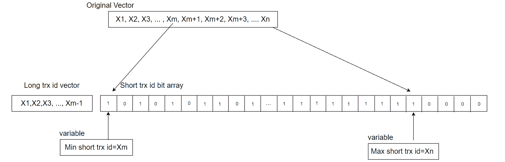

图 8-19。适用于 MVCC ReadView 活动事务列表的新混合数据结构。

对于更详细的解释，请参阅第 4.2.8 章关于混合数据结构的内容。

通常，在线事务是短事务而不是长事务，事务 ID 持续增加。为了利用这些特性，使用混合数据结构：一个静态数组用于连续的短事务 ID，一个向量用于长事务。使用 2048 字节的数组可以存储多达 16,384 个连续的活跃事务 ID，每个位代表一个事务 ID。

最小短事务 ID 用于区分短事务和长事务。小于此最小值的 ID 进入长事务向量，而等于或大于此值的 ID 则放置在短事务数组中。对于 changes_visible 中的 ID，如果它低于最小短事务 ID，则直接查询向量，由于长事务通常数量较少，因此这种方法效率较高。如果 ID 等于或高于最小短事务 ID，则执行位查询，时间复杂度为 O(1)，与之前的 O(log n)复杂度相比。这种改进提高了效率并减少了 NUMA 节点之间的缓存迁移，因为 O(1)查询通常在单个 CPU 时间片中完成。

除了之前提到的转换外，类似的修改也应用于全局事务活跃列表。用于此列表的原始数据结构如下代码片段所示：

```cpp
 /** Array of Read write transaction IDs for MVCC snapshot. A ReadView would
  take a snapshot of these transactions whose changes are not visible to it.
  We should remove transactions from the list before committing in memory and
  releasing locks to ensure right order of removal and consistent snapshot. */
  trx_ids_t rw_trx_ids; 
```

现在它已经改为以下数据结构：

```cpp
 /** Array of Read write transaction IDs for MVCC snapshot. A ReadView would
  take a snapshot of these transactions whose changes are not visible to it.
  We should remove transactions from the list before committing in memory and
  releasing locks to ensure right order of removal and consistent snapshot. */
  trx_ids_t long_rw_trx_ids;
  unsigned char short_rw_trx_ids_bitmap[MAX_SHORT_ACTIVE_BYTES];
  int short_rw_trx_valid_number;
  trx_id_t min_short_valid_id;
  trx_id_t max_short_valid_id 
```

在*short_rw_trx_ids_bitmap*结构中，*MAX_SHORT_ACTIVE_BYTES*设置为 65536，理论上可以容纳多达 524,288 个连续的短事务 ID。如果超过此限制，最老的短事务 ID 将被转换为长事务并存储在*long_rw_trx_ids*中。全局长事务和短事务通过*min_short_valid_id*区分：小于此值的 ID 被视为全局长事务，而等于或大于此值的 ID 被视为全局短事务。

在从全局活跃事务列表复制过程中，仅使用一个位表示每个事务 ID 的*short_rw_trx_ids_bitmap*结构，与原生的 MySQL 解决方案相比，允许实现更高的复制效率。例如，对于 1000 个活跃事务，原生 MySQL 版本至少需要复制 8000 字节，而优化后的解决方案可能只需要几百字节。这导致复制效率显著提高。

在实施这些修改后，进行了性能比较测试，以评估 MVCC ReadView 优化的有效性。下面的图显示了修改 MVCC ReadView 数据结构前后，不同并发级别下的 TPC-C 吞吐量比较。

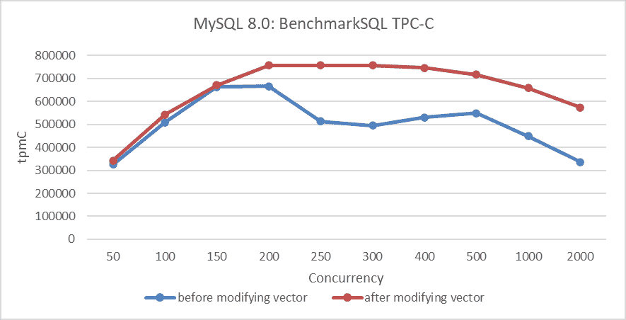

图 8-20. 采用新的混合数据结构前后在 NUMA 中的性能比较。

从图中可以明显看出，这种转换主要优化了可扩展性，并提高了 NUMA 环境下的 MySQL 峰值吞吐量。可以使用*perf*等工具分析优化前后的性能比较。以下是优化前 300 并发下的*perf*截图：

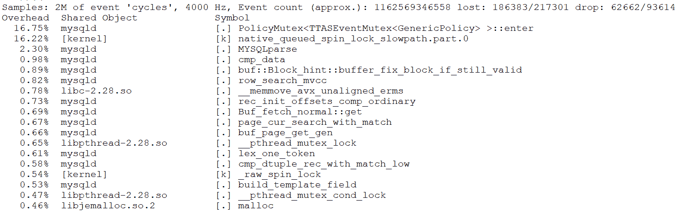

图 8-21\. 在*perf*截图中观察到的与闩锁相关的瓶颈。

从图中可以看出，前两个瓶颈非常显著，占大约 33%的开销。优化后，300 并发下的*perf*截图如下：


图 8-22\. 与闩锁相关的瓶颈显著缓解。

优化后，如上图所示，之前前两个瓶颈的比例已经显著降低。

为什么改变 MVCC ReadView 数据结构能显著提高可扩展性？这是因为访问这些结构涉及到获取全局闩锁。优化数据结构加速了对关键资源的访问，减少了并发冲突并最小化了 NUMA 节点间的缓存迁移。

原生的 MVCC ReadView 使用一个向量来存储活动事务的列表。在高并发场景下，这个列表可能会变得很大，导致更大的工作集。在 NUMA 环境中，查询和复制都可能变慢，可能造成单个 CPU 时间片错过其截止时间，从而导致显著的上下文切换成本。这一方面的理论基础如下[21]：

*在逻辑操作过程中发生的上下文切换会将可能更大的工作集从缓存中驱逐出去。当挂起的线程恢复执行时，它会浪费时间去恢复被驱逐的工作集。*

接下来评估 ARM 架构下的吞吐量提升。详细信息如下图所示：

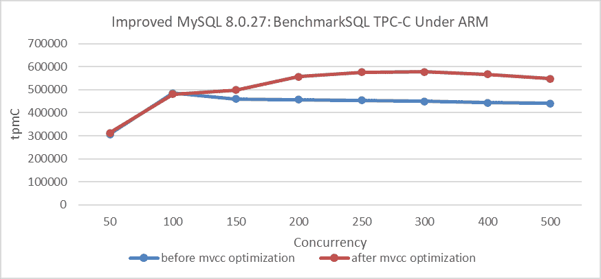

图 8-23\. ARM 架构下的吞吐量提升。

从图中可以看出，在 ARM 架构下也有显著的提升。大量的测试数据证实，无论架构是 ARM 还是 x86，MVCC ReadView 优化在 NUMA 环境中都能带来明显的收益。

这种优化在 SMP 环境中能实现多少提升？

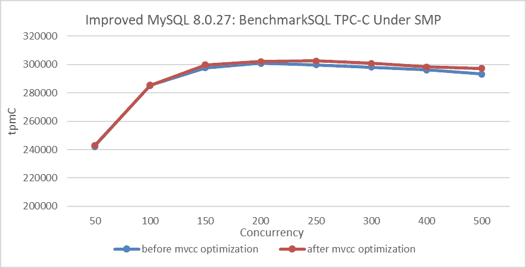

图 8-24\. 采用新的混合数据结构前后 SMP 的性能比较。

从图中可以看出，绑定到 NUMA 节点 0 之后，MVCC ReadView 优化带来的提升并不显著。这表明优化主要增强了 NUMA 架构的可扩展性。

在实际的 MySQL 使用中，防止过多的用户线程进入 InnoDB 存储引擎可以显著减少全局活动事务列表的大小。这种事务节流机制有效地补充了 MVCC ReadView 优化，提高了整体性能。结合下一节讨论的双重闩锁避免，以下图中的 TPC-C 测试结果清楚地展示了这些改进。

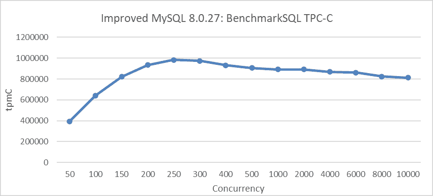

图 8-25\. 带事务节流机制的 BenchmarkSQL 中的最大 TPC-C 吞吐量。

### 8.2.4 避免双重闩锁问题

在 MVCC ReadView 优化后的测试期间，在极高并发条件下观察到吞吐量明显下降。具体细节如下所示：

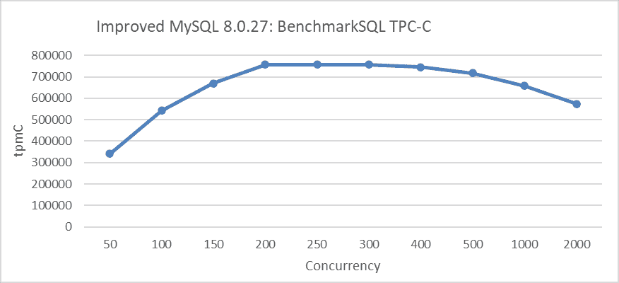

图 8-26\. 在并发级别超过 500 时的性能下降。

从图中可以看出，一旦并发超过 500，吞吐量会显著下降。问题追踪到频繁获取*trx-sys*闩锁，如下面的代码片段所示：

```cpp
 } else if (trx->isolation_level <= TRX_ISO_READ_COMMITTED &&
               MVCC::is_view_active(trx->read_view)) {
      mutex_enter(&trx_sys->mutex);
      trx_sys->mvcc->view_close(trx->read_view, true);
      mutex_exit(&trx_sys->mutex);
    } 
```

另一个代码片段如下所示：

```cpp
 if (lock_type != TL_IGNORE && trx->n_mysql_tables_in_use == 0) {
    trx->isolation_level =
        innobase_trx_map_isolation_level(thd_get_trx_isolation(thd));
    if (trx->isolation_level <= TRX_ISO_READ_COMMITTED &&
        MVCC::is_view_active(trx->read_view)) {
      /* At low transaction isolation levels we let
      each consistent read set its own snapshot */
      mutex_enter(&trx_sys->mutex);
      trx_sys->mvcc->view_close(trx->read_view, true);
      mutex_exit(&trx_sys->mutex);
    }
  } 
```

InnoDB 在视图关闭过程中引入了一个全局 trx-sys 闩锁，在高并发下影响了可伸缩性。为了解决这个问题，尝试移除全局闩锁。以下是一个修改示例：

```cpp
 } else if (trx->isolation_level <= TRX_ISO_READ_COMMITTED &&
               MVCC::is_view_active(trx->read_view)) {
      trx_sys->mvcc->view_close(trx->read_view, false);
} 
```

其他修改如下所示：

```cpp
 if (lock_type != TL_IGNORE && trx->n_mysql_tables_in_use == 0) {
    trx->isolation_level =
        innobase_trx_map_isolation_level(thd_get_trx_isolation(thd));
    if (trx->isolation_level <= TRX_ISO_READ_COMMITTED &&
        MVCC::is_view_active(trx->read_view)) {
      /* At low transaction isolation levels we let
      each consistent read set its own snapshot */
      trx_sys->mvcc->view_close(trx->read_view, false);
    }
  } 
```

使用 MVCC ReadView 优化版本，比较修改前后的 TPC-C 吞吐量。具体细节如下所示：

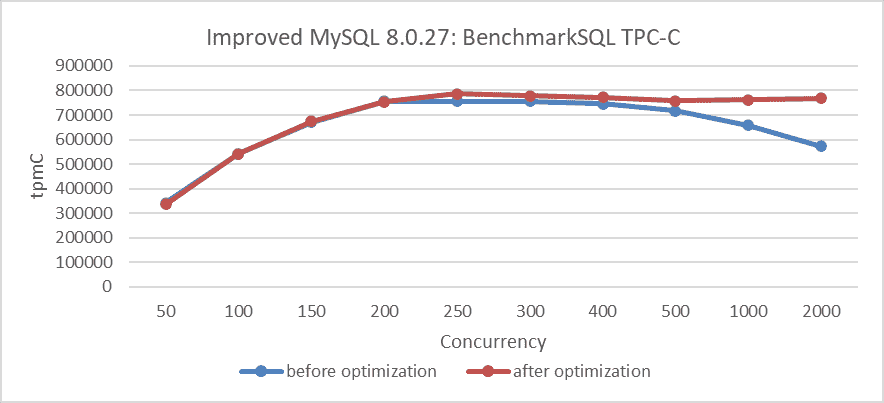

图 8-27\. 消除双重闩锁瓶颈后的性能提升。

从图中可以看出，修改显著提高了高并发条件下的可伸缩性。为了了解这种改进的原因，让我们使用*perf*工具进行进一步调查。以下是修改前的 2000 并发时的*perf*截图：

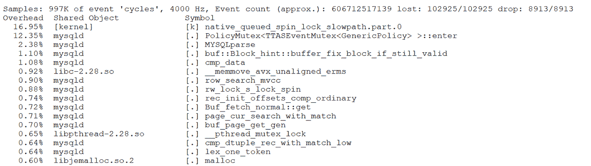

图 8-28\. 在*perf*截图观察到的与闩锁相关的瓶颈。

从图中可以看出，与闩锁相关的瓶颈相当明显。在代码修改后，以下是 3000 并发时的*perf*截图：

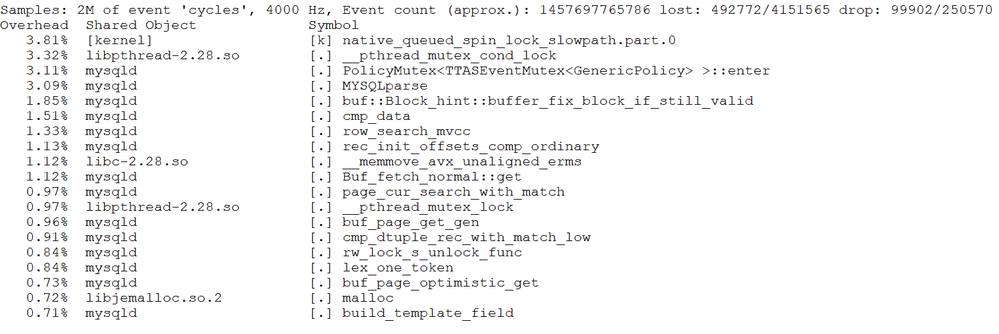

图 8-29\. 与闩锁相关的瓶颈显著缓解。

即使在高并发情况下，如 3000，瓶颈并不明显。这表明优化有效地缓解了与闩锁相关的性能问题，在极端条件下提高了可伸缩性。

在*view_close*函数调用前后排除全局闩锁可以提高可伸缩性，而在高并发情况下包含它会严重降低可伸缩性。尽管*view_close*函数在其关键部分内运行效率很高，但频繁获取全局使用的*trx-sys*闩锁——在整个*trx-sys*子系统中使用——导致显著的竞争和头阻塞。这个问题被称为“双重闩锁”问题，它源于*view_open*和*view_close*都需要全局*trx-sys*闩锁。值得注意的是，从最终阶段移除闩锁或使用新的闩锁可以显著缓解这个问题。

### 8.2.5 解释超线性性能现象

第 2.1 节描述了在 x86 NUMA 环境中进行 SysBench 读写测试时观察到的吞吐量超线性扩展。在改进 InnoDB 存储引擎之后，当前的研究考察了这种超线性扩展效应是否仍然存在。使用改进的 MySQL 版本在同一环境中进行了测试。以下图中显示了 MySQL 实例 1 和 MySQL 实例 2 的 SysBench 测试的个体结果：

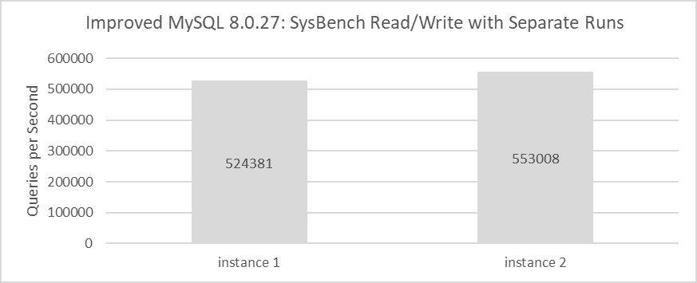

图 8-30\. MVCC 优化后 MySQL 独立运行的吞吐量。

每个实例的吞吐量都有显著提高，MySQL 实例 1 实现了 524,381 QPS，MySQL 实例 2 达到了 553,008 QPS。合并起来，它们提供了 1,077,389 QPS，大幅超过了之前的 328,168 QPS。

SysBench 用于同时评估这两个实例的读写性能，如图下所示。

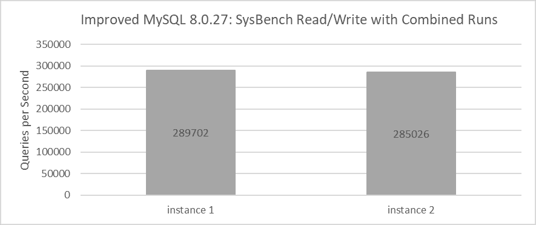

图 8-31\. MVCC 优化后 MySQL 一起运行的吞吐量。

从图中可以看出，一个实例实现了 289,702 QPS 的吞吐量，而另一个实例达到了 285,026 QPS。两个 MySQL 实例的总吞吐量为 574,728 QPS，与 MySQL 发布版本观察到的 546,429 QPS 非常接近。这说明了 Linux 操作系统在 NUMA 环境中有效调度多个进程的作用。

从数据中可以看出，同时运行的两个 MySQL 实例的总吞吐量明显低于每个实例单独运行的吞吐量。对于详细的统计比较，请参考以下图：

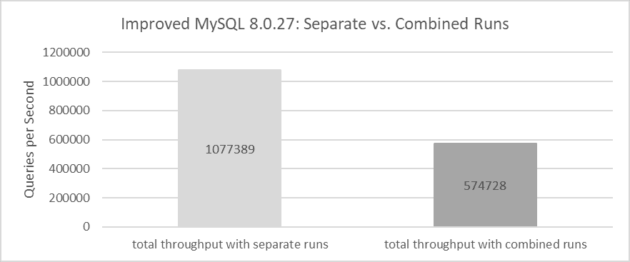

图 8-32\. MVCC 优化后单独运行和一起运行的吞吐量总和。

在改进 InnoDB 存储引擎之后，超线性扩展问题得到了解决，揭示了 MySQL 发布版本中潜在的原因是 InnoDB 中设计不良的 MVCC 机制。这种设计缺陷放大了 NUMA 环境中的问题，导致了观察到的超线性扩展效应。

## 8.3 事务节流机制

根据“凝视深渊：对具有一千个核心的并发控制的评估” [22] 这篇论文，包括 MySQL 在内的集中式数据库由于事务系统的限制，难以充分利用数百个 CPU 核心。

为了解决可扩展性问题，传统方法使用线程池来限制数据库使用的 CPU 核心数量。本书介绍了一种事务节流机制，该机制限制访问事务系统的线程数量，提供了一种缓解可扩展性挑战的替代方法。

### 8.3.1 Percona 线程池

通常，传统 MySQL 中的线程池有两个主要用途：

1.  **缓解短连接风暴**：通过管理和重用线程，线程池有助于防止在短期连接突然激增时系统过载。

1.  **增强可扩展性**：线程池通过使 MySQL 更有效地利用可用的 CPU 核心来提高可扩展性，尤其是在高竞争场景中。

以 Percona 的线程池作为案例研究，让我们来考察线程池在提高 MySQL 可扩展性方面的成本效益。以下图表比较了实施线程池前后吞吐量和并发的变化。

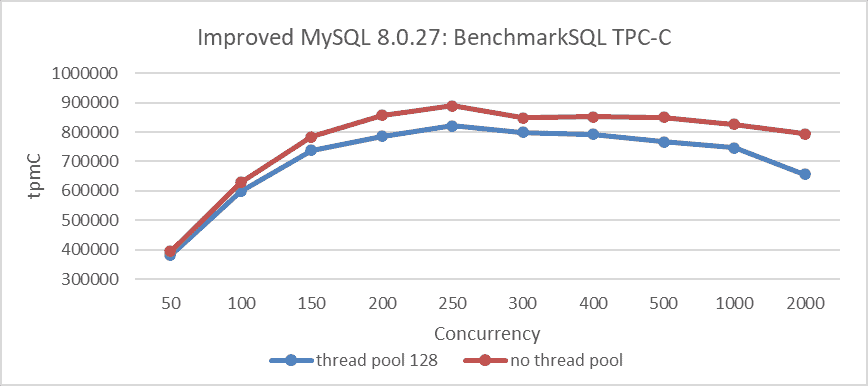

图 8-33。启用 Percona 线程池导致吞吐量明显下降。

从图中可以看出，采用线程池后，吞吐量有所下降。这种下降归因于 Percona 线程池的高固有成本。此外，由于改进版的 MySQL 已经实现了显著的可扩展性改进，Percona 线程池在提高 TPC-C 应用程序可扩展性方面的额外好处有限。

对于可扩展性较差的 MySQL 版本，线程池在解决可扩展性问题方面仍然很有价值。正如第一章中所示，线程池的使用显著缓解了 MySQL 5.7 的可扩展性问题。

根据广泛的测试，在解决 MySQL 大多数可扩展性问题之后，观察到虽然 Percona 线程池在管理短期连接和高竞争场景中仍然可以非常有效，但其整体有效性会降低，甚至可能在其他环境中阻碍性能。

### 8.3.2 事务节流机制

由于事务系统的限制，集中式数据库难以充分利用数百个 CPU 核心的问题。为了解决这个问题，事务节流机制变得越来越重要。

MySQL 在其线程池中引入了“最大事务限制”功能，以减轻性能下降[31]。此功能限制了并发事务的数量，通过减少在重载系统上的数据锁和死锁来提高吞吐量[64]。这种方法可以启发类似的机制，在不完全依赖传统线程池的情况下，在高并发场景中提高吞吐量。

对于 MySQL，事务节流的特定流程图如下：

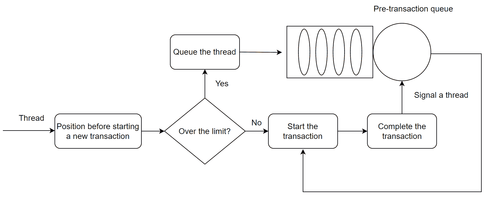

图 8-34\. MySQL 中的新事务节流机制。

在开始新事务之前，检查并发事务的数量是否超过限制。如果是，事务进入等待状态。否则，它将继续进入事务系统。事务完成后，从等待列表中激活一个用户线程以继续执行另一个事务。

实施此事务节流机制后，MySQL 的可扩展性得到了验证。以下图显示了使用节流机制与使用 Percona 线程池相比，TPC-C 吞吐量与并发之间的关系。

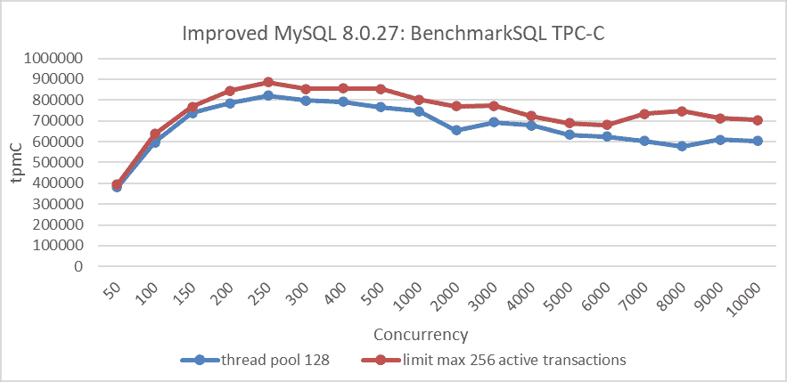

图 8-35\. 事务节流机制的影响。

从图中可以看出，节流方法优于 Percona 线程池方法，并且这种优势是全面的。

以下图展示了实施事务节流后进行的 TPC-C 可扩展性压力测试。测试是在禁用 NUMA BIOS 的情况下进行的，限制最多 512 个用户线程进入事务系统。


图 8-36\. 在 BenchmarkSQL 中使用事务节流机制的最大 TPC-C 吞吐量。

从图中可以看出，吞吐量更加稳定。这种稳定性主要归因于在 BIOS 中禁用 NUMA，这提高了内存访问效率并增强了整体系统稳定性。

然而，事务节流并非万能，也有其局限性：

+   当最大数量的交易同时执行时，新交易必须等待现有交易完成。如果所有并发交易都包含长时间运行的查询，可能会出现 MySQL 系统停滞[31]的情况。

值得注意的是，事务节流的具体实现方式和其灵活性是 AI 可以展示其有用性的领域。

## 8.4 缓解性能下降

用户往往更容易注意到低并发性能的下降，而高并发性能的提高通常更难察觉。因此，保持低并发性能至关重要，因为它直接影响用户体验和升级意愿。

根据广泛的用户反馈，升级到 MySQL 8.0 后，用户普遍感觉到性能有所下降，尤其是在批量插入和连接操作中。这种下降趋势在 MySQL 更高版本中变得更加明显。此外，一些 MySQL 爱好者和技术测试人员报告称，在升级后多个 sysbench 测试中出现了性能下降。

能否避免这些性能问题？或者，更具体地说，我们应该如何科学地评估性能下降的持续趋势？这些问题都是需要考虑的重要问题。

尽管官方团队持续优化，但性能的逐渐恶化不容忽视。在某些场景中，可能会出现改进的迹象，但这并不意味着所有场景的性能都得到了同等优化。此外，牺牲其他领域的性能来优化特定场景的性能也很容易。

### 8.4.1 MySQL 性能下降的根本原因

通常情况下，随着更多功能的添加，代码库增长，随着功能的持续扩展，性能变得越来越难以控制。

MySQL 开发者往往未能注意到性能下降，因为代码库的每次增加只会导致性能非常小的下降。然而，随着时间的推移，这些小的下降累积起来，导致显著的累积效应，使用户在新版本的 MySQL 中感知到明显的性能下降。

例如，以下图显示了简单单连接操作的性能，与 MySQL 8.0.27 相比，MySQL 8.0.40 显示出性能下降：

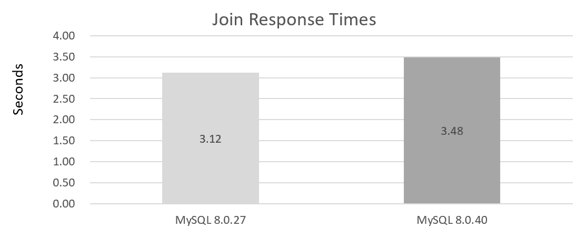

图 8-37\. MySQL 8.0.40 中连接性能的显著下降。

下图显示了在单并发情况下的批量插入性能测试，与 MySQL 5.7.44 版本相比，MySQL 8.0.40 的性能有所下降：

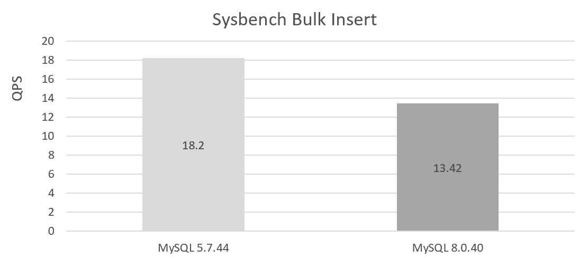

图 8-38\. MySQL 8.0.40 中批量插入性能的显著下降。

从上面的两个图表中可以看出，8.0.40 版本的性能并不好。

接下来，让我们从代码层面分析 MySQL 性能下降的根本原因。以下是 MySQL 8.0 中的***PT_insert_values_list::contextualize***函数：

```cpp
bool PT_insert_values_list::contextualize(Parse_context *pc) {
  if (super::contextualize(pc)) return true;
  for (List_item *item_list : many_values) {
    for (auto it = item_list->begin(); it != item_list->end(); ++it) {
      if ((*it)->itemize(pc, &*it)) return true;
    }
  }

  return false;
} 
```

MySQL 5.7 中对应的***PT_insert_values_list::contextualize***函数如下：

```cpp
bool PT_insert_values_list::contextualize(Parse_context *pc)
{
  if (super::contextualize(pc))
    return true;
  List_iterator<List_item> it1(many_values);
  List<Item> *item_list;
  while ((item_list= it1++))
  {
    List_iterator<Item> it2(*item_list);
    Item *item;
    while ((item= it2++))
    {
      if (item->itemize(pc, &item))
        return true;
      it2.replace(item);
    }
  }

  return false;
} 
```

从代码比较来看，MySQL 8.0 似乎有更优雅的代码，看起来有所进步。

不幸的是，很多时候，正是这些代码改进背后的动机导致了性能下降。MySQL 官方团队将之前的***List***数据结构替换为***deque***，这已成为性能逐渐下降的根本原因之一。让我们看看***deque***的文档：

```cpp
std::deque (double-ended queue) is an indexed sequence container that allows fast insertion and deletion at both its 
beginning and its end. In addition, insertion and deletion at either end of a deque never invalidates pointers or 
references to the rest of the elements.

As opposed to std::vector, the elements of a deque are not stored contiguously: typical implementations use a sequence 
of individually allocated fixed-size arrays, with additional bookkeeping, which means indexed access to deque must 
perform two pointer dereferences, compared to vector's indexed access which performs only one.

The storage of a deque is automatically expanded and contracted as needed. Expansion of a deque is cheaper than the 
expansion of a std::vector because it does not involve copying of the existing elements to a new memory location. On 
the other hand, deques typically have large minimal memory cost; a deque holding just one element has to allocate its 
full internal array (e.g. 8 times the object size on 64-bit libstdc++; 16 times the object size or 4096 bytes, 
whichever is larger, on 64-bit libc++).

The complexity (efficiency) of common operations on deques is as follows:
Random access - constant O(1).
Insertion or removal of elements at the end or beginning - constant O(1).
Insertion or removal of elements - linear O(n). 
```

如上述描述所示，在极端情况下，保留单个元素需要分配整个数组，导致非常低的内存效率。例如，在批量插入中，需要插入大量记录，官方实现将每条记录存储在单独的 deque 中。即使记录内容很少，仍然需要分配 deque。MySQL deque 实现为每个 deque 分配 1KB 的内存以支持快速查找。

```cpp
The implementation is the same as classic std::deque: Elements are held in blocks of about 1 kB each. 
```

官方实现使用 1KB 的内存来存储索引信息，即使记录长度不大但记录数量很多，内存访问地址可能变得不连续，导致缓存友好性差。这种设计旨在提高缓存友好性，但效果并不完全。

值得注意的是，原始实现使用 List 数据结构，内存通过内存池分配，提供了一定程度的缓存友好性。虽然随机访问效率较低，但优化 List 元素的顺序访问可以显著提高性能。

在升级到 MySQL 8.0 的过程中，用户观察到批量插入性能显著下降，其中一个主要原因是底层数据结构的重大变化。

此外，尽管官方团队改进了重做日志机制，这也导致了 MTR 提交操作效率的降低。与 MySQL 5.7 相比，添加的代码显著降低了单个提交的性能，尽管整体写入吞吐量已经大幅提高。

让我们分析 MySQL 5.7.44 中 MTR 提交的核心 ***execute*** 操作：

```cpp
/** Write the redo log record, add dirty pages to the flush list and 
release the resources. */
void mtr_t::Command::execute()
{
  ut_ad(m_impl->m_log_mode != MTR_LOG_NONE);
  if (const ulint len = prepare_write()) {
    finish_write(len);
  }
  if (m_impl->m_made_dirty) {
    log_flush_order_mutex_enter();
  }
  /* It is now safe to release the log mutex because the
  flush_order mutex will ensure that we are the first one
  to insert into the flush list. */
  log_mutex_exit();
  m_impl->m_mtr->m_commit_lsn = m_end_lsn;
  release_blocks();
  if (m_impl->m_made_dirty) {
    log_flush_order_mutex_exit();
  }
  release_all();
  release_resources();
} 
```

让我们分析 MySQL 8.0.40 中 MTR 提交的核心 ***execute*** 操作：

```cpp
/** Write the redo log record, add dirty pages to the flush list and 
release the resources. */
void mtr_t::Command::execute() {
  ut_ad(m_impl->m_log_mode != MTR_LOG_NONE);
#ifndef UNIV_HOTBACKUP
  ulint len = prepare_write();
  if (len > 0) {
    mtr_write_log_t write_log;
    write_log.m_left_to_write = len;
    auto handle = log_buffer_reserve(*log_sys, len);
    write_log.m_handle = handle;
    write_log.m_lsn = handle.start_lsn;
    m_impl->m_log.for_each_block(write_log);
    ut_ad(write_log.m_left_to_write == 0);
    ut_ad(write_log.m_lsn == handle.end_lsn);
    log_wait_for_space_in_log_recent_closed(*log_sys, handle.start_lsn);
    DEBUG_SYNC_C("mtr_redo_before_add_dirty_blocks");
    add_dirty_blocks_to_flush_list(handle.start_lsn, handle.end_lsn);
    log_buffer_close(*log_sys, handle);
    m_impl->m_mtr->m_commit_lsn = handle.end_lsn;
  } else {
    DEBUG_SYNC_C("mtr_noredo_before_add_dirty_blocks");
    add_dirty_blocks_to_flush_list(0, 0);
  }
#endif /* !UNIV_HOTBACKUP */ 
```

通过比较，可以看出在 MySQL 8.0.40 中，MTR 提交中的执行操作变得更加复杂，涉及更多步骤。这种复杂性是低并发写性能下降的主要原因之一。

特别是，操作 ***m_impl->m_log.for_each_block(write_log)*** 和 **log_wait_for_space_in_log_recent_closed(*log_sys, handle.start_lsn)** 具有显著的开销。这些更改是为了提高高并发性能，但它们以低并发性能为代价。

在高并发模式下，重做日志的优先级导致低并发工作负载的性能较差。尽管引入 ***innodb_log_writer_threads*** 的目的是为了缓解低并发性能问题，但它并不影响上述函数的执行。由于这些操作变得更加复杂且需要频繁的 MTR 提交，性能仍然显著下降。

让我们看看即时添加/删除功能对性能的影响。以下是 MySQL 5.7 中的 ***rec_init_offsets_comp_ordinary*** 函数：

```cpp
/******************************************************//**
Determine the offset to each field in a leaf-page record
in ROW_FORMAT=COMPACT.  This is a special case of
rec_init_offsets() and rec_get_offsets_func(). */
UNIV_INLINE MY_ATTRIBUTE((nonnull))
void
rec_init_offsets_comp_ordinary(
/*===========================*/
  const rec_t*    rec,  /*!< in: physical record in
          ROW_FORMAT=COMPACT */
  bool      temp, /*!< in: whether to use the
          format for temporary files in
          index creation */
  const dict_index_t* index,  /*!< in: record descriptor */
  ulint*      offsets)/*!< in/out: array of offsets;
          in: n=rec_offs_n_fields(offsets) */
{   
  ulint   i   = 0;
  ulint   offs    = 0;
  ulint   any_ext   = 0;
  ulint   n_null    = index->n_nullable;
  const byte* nulls   = temp
    ? rec - 1
    : rec - (1 + REC_N_NEW_EXTRA_BYTES);
  const byte* lens    = nulls - UT_BITS_IN_BYTES(n_null);
  ulint   null_mask = 1;

  ...
  ut_ad(temp || dict_table_is_comp(index->table));

  if (temp && dict_table_is_comp(index->table)) {
    /* No need to do adjust fixed_len=0\. We only need to
    adjust it for ROW_FORMAT=REDUNDANT. */
    temp = false;
  }
  /* read the lengths of fields 0..n */
  do {
    const dict_field_t* field
      = dict_index_get_nth_field(index, i);
    const dict_col_t* col
      = dict_field_get_col(field);
    ulint     len;
  ... 
```

MySQL 8.0.40 中的 ***rec_init_offsets_comp_ordinary*** 函数如下：

```cpp
/** Determine the offset to each field in a leaf-page record in
ROW_FORMAT=COMPACT.  This is a special case of rec_init_offsets() and
rec_get_offsets().
...
*/
inline void rec_init_offsets_comp_ordinary(const rec_t *rec, bool temp,
                                           const dict_index_t *index,
                                           ulint *offsets) {
  ...
  const byte *nulls = nullptr;
  const byte *lens = nullptr;
  uint16_t n_null = 0;
  enum REC_INSERT_STATE rec_insert_state = REC_INSERT_STATE::NONE;
  uint8_t row_version = UINT8_UNDEFINED;
  uint16_t non_default_fields = 0;

  if (temp) {
    rec_insert_state = rec_init_null_and_len_temp(
        rec, index, &nulls, &lens, &n_null, non_default_fields, row_version);
  } else {
    rec_insert_state = rec_init_null_and_len_comp(
        rec, index, &nulls, &lens, &n_null, non_default_fields, row_version);
  }

  ut_ad(temp || dict_table_is_comp(index->table));
  if (temp) {
    if (dict_table_is_comp(index->table)) {
      /* No need to do adjust fixed_len=0\. We only need to
      adjust it for ROW_FORMAT=REDUNDANT. */
      temp = false;
    } else {
      /* Redundant temp row. Old instant record is logged as version 0.*/
      if (rec_insert_state == INSERTED_BEFORE_INSTANT_ADD_OLD_IMPLEMENTATION ||
          rec_insert_state == INSERTED_AFTER_INSTANT_ADD_OLD_IMPLEMENTATION) {
        rec_insert_state = INSERTED_BEFORE_INSTANT_ADD_NEW_IMPLEMENTATION;
        ut_ad(row_version == UINT8_UNDEFINED);
      }
    }
  }

  /* read the lengths of fields 0..n */
  ulint offs = 0;
  ulint any_ext = 0;
  ulint null_mask = 1;
  uint16_t i = 0;
  do {
    /* Fields are stored on disk in version they are added in and are
    maintained in fields_array in the same order. Get the right field. */
    const dict_field_t *field = index->get_physical_field(i);
    const dict_col_t *col = field->col;
    uint64_t len;

    switch (rec_insert_state) {
      case INSERTED_INTO_TABLE_WITH_NO_INSTANT_NO_VERSION:
        ut_ad(!index->has_instant_cols_or_row_versions());
        break;

      case INSERTED_BEFORE_INSTANT_ADD_NEW_IMPLEMENTATION: {
        ut_ad(row_version == UINT8_UNDEFINED || row_version == 0);
        ut_ad(index->has_row_versions() || temp);
        /* Record has to be interpreted in v0\. */
        row_version = 0;
      }
        [[fallthrough]];
      case INSERTED_AFTER_UPGRADE_BEFORE_INSTANT_ADD_NEW_IMPLEMENTATION
      case INSERTED_AFTER_INSTANT_ADD_NEW_IMPLEMENTATION: {
        ...
      } break;
      case INSERTED_BEFORE_INSTANT_ADD_OLD_IMPLEMENTATION:
      case INSERTED_AFTER_INSTANT_ADD_OLD_IMPLEMENTATION: {
        ...
      } break;

      default:
        ut_ad(false);
    }
    ... 
```

从上述代码中可以看出，随着即时添加/删除列功能的引入，`***rec_init_offsets_comp_ordinary***` 函数变得更加复杂，引入了更多的函数调用，并添加了一个影响缓存优化的开关语句。由于这个函数被频繁调用，它直接影响了更新索引、批量插入和连接的性能，导致性能大幅下降。

此外，MySQL 8.0 的性能下降不仅限于上述问题；还有许多其他领域对整体性能下降做出了贡献，特别是对内联函数扩展的影响。例如，以下代码影响了内联函数的扩展：

```cpp
void validate_rec_offset(const dict_index_t *index, const ulint *offsets,
                         ulint n, ut::Location L) {
  ut_ad(rec_offs_validate(nullptr, nullptr, offsets));
  if (n >= rec_offs_n_fields(offsets)) {
#ifndef UNIV_NO_ERR_MSGS
    dump_metadata_dict_table(index->table);
    auto num_fields = static_cast<size_t>(rec_offs_n_fields(offsets));
    ib::fatal(L, ER_IB_DICT_INVALID_COLUMN_POSITION, ulonglong{n}, num_fields);
#endif /* !UNIV_NO_ERR_MSGS */   }
} 
```

根据我们的测试，`***ib::fatal***` 语句严重干扰了内联优化。对于频繁访问的函数，建议避免干扰内联优化的语句。

接下来，让我们看看一个类似的问题。`***row_sel_store_mysql_field function***` 被频繁调用，其中 `***row_sel_field_store_in_mysql_format***` 是其中的热点函数。具体代码如下：

```cpp
// clang-format off
/** Convert a field in the Innobase format to a field in the MySQL format.
@param[out]     mysql_rec       Record in the MySQL format
@param[in,out]  prebuilt        Prebuilt struct
@param[in]      rec             InnoDB record; must be protected by a page
                                latch
@param[in]      rec_index       Index of rec
@param[in]      prebuilt_index  prebuilt->index
@param[in]      offsets         Array returned by rec_get_offsets()
@param[in]      field_no        templ->rec_field_no or
                                templ->clust_rec_field_no or
                                templ->icp_rec_field_no or sec field no if
                                clust_templ_for_sec is true
@param[in]      templ           row template
@param[in]      sec_field_no    Secondary index field no if the secondary index
                                record but the prebuilt template is in
                                clustered index format and used only for end
                                range comparison.
@param[in]      lob_undo        the LOB undo information.
@param[in,out]  blob_heap       If not null then use this heap for BLOBs */
// clang-format on
[[nodiscard]] static bool row_sel_store_mysql_field(
    byte *mysql_rec, row_prebuilt_t *prebuilt, const rec_t *rec,
    const dict_index_t *rec_index, const dict_index_t *prebuilt_index,
    const ulint *offsets, ulint field_no, const mysql_row_templ_t *templ,
    ulint sec_field_no, lob::undo_vers_t *lob_undo, mem_heap_t *&blob_heap) {
  DBUG_TRACE;
  ...
    } else {
    /* Field is stored in the row. */

    data = rec_get_nth_field_instant(rec, offsets, field_no, index_used, &len);

    if (len == UNIV_SQL_NULL) {
      /* MySQL assumes that the field for an SQL
      NULL value is set to the default value. */
      ut_ad(templ->mysql_null_bit_mask);

      UNIV_MEM_ASSERT_RW(prebuilt->default_rec + templ->mysql_col_offset,
                         templ->mysql_col_len);
      mysql_rec[templ->mysql_null_byte_offset] |=
          (byte)templ->mysql_null_bit_mask;
      memcpy(mysql_rec + templ->mysql_col_offset,
             (const byte *)prebuilt->default_rec + templ->mysql_col_offset,
             templ->mysql_col_len);
      return true;
    } 

    if (DATA_LARGE_MTYPE(templ->type) || DATA_GEOMETRY_MTYPE(templ->type)) {
      ...
      mem_heap_t *heap{};

      if (blob_heap == nullptr) {
        blob_heap = mem_heap_create(UNIV_PAGE_SIZE, UT_LOCATION_HERE);
      } 

      heap = blob_heap;
      data = static_cast<byte *>(mem_heap_dup(heap, data, len));
    } 

    /* Reassign the clustered index field no. */
    if (clust_templ_for_sec) {
      field_no = clust_field_no;
    } 

    row_sel_field_store_in_mysql_format(mysql_rec + templ->mysql_col_offset,
                                        templ, rec_index, field_no, data, len,
                                        sec_field_no);
    ... 
```

`***row_sel_field_store_in_mysql_format***` 函数最终调用 `***row_sel_field_store_in_mysql_format_func***`。

```cpp
/** Convert a non-SQL-NULL field from Innobase format to MySQL format. */
static inline void row_sel_field_store_in_mysql_format(
    byte *dest, const mysql_row_templ_t *templ, const dict_index_t *idx,
    ulint field, const byte *src, ulint len, ulint sec) {
  row_sel_field_store_in_mysql_format_func(
      dest, templ, idx, IF_DEBUG(field, ) src, len IF_DEBUG(, sec));
} 
```

由于存在 `***ib::fatal***` 代码，`***row_sel_field_store_in_mysql_format_func***` 函数不能内联。

```cpp
void row_sel_field_store_in_mysql_format_func(
    byte *dest, const mysql_row_templ_t *templ, const dict_index_t *index,
    IF_DEBUG(ulint field_no, ) const byte *data,
    ulint len IF_DEBUG(, ulint sec_field)) {
  byte *ptr;

  ...

  if (templ->is_multi_val) {
    ib::fatal(UT_LOCATION_HERE, ER_CONVERT_MULTI_VALUE)
        << "Table name: " << index->table->name
        << " Index name: " << index->name;
  } 
```

频繁调用的低效函数，每秒执行数千万次，会严重影响连接性能。

让我们继续探讨性能下降的原因。以下官方性能优化实际上是一系列导致连接性能下降的根本原因之一。尽管某些查询可能得到改善，但它仍然是普通连接操作性能下降的原因之一。

```cpp
commit ffe1726f2542505e486c4bcd516c30f36c8ed5f6 (HEAD)
Author: Knut Anders Hatlen <knut.hatlen@oracle.com>
Date:   Wed Dec 21 14:29:02 2022 +0100

    Bug#34891365: MySQL 8.0.29+ is slower than MySQL 8.0.28 with
    queries using JOINS

    The one-row cache in EQRefIterator was disabled for queries using
    streaming aggregation in the fix for bug#33674441. This was done in
    order to fix a number of wrong result bugs, but it turned out to have
    too big impact on the performance of many queries.

    This patch re-enables the cache for the above queries, and fixes the
    original wrong result bugs in a different way. There were two
    underlying problems that caused the wrong results:

    1) AggregateIterator::Init() does not restore the table buffers to the
    state they had after the last read from the child iterator in the
    previous invocation. The table buffers would have the content from the
    first row in the last group that was returned from the iterator in the
    previous invocation, rather than the contents of the last row read by
    the child iterator, and this made the cache in EQRefIterator return
    wrong values. Fixed by restoring the table buffers in
    AggregateIterator::Init() if the previous invocation had modified
    them.

    2) When the inner tables of an outer join are null-complemented, the
    table buffers are modified to contain NULL values, thereby disturbing
    the cached value for any EQRefIterator reading from one of the
    null-complemented tables. Fixed by making StoreFromTableBuffers()
    store the actual values contained in the table buffer instead of the
    null values, if the table is accessed by EQRefIterator.
    LoadIntoTableBuffers() is taught to restore those values, but
    additionally set the null flags on the columns after restoring them.

    The hypergraph optimizer had another workaround for these wrong
    results (it added a streaming step right before the aggregation). This
    workaround is also removed now.

    Change-Id: I554a90213cae60749dd6407e48a745bc71578e0c 
```

MySQL 的问题不仅限于此。如上述分析所示，MySQL 性能下降并非没有原因。一系列小问题积累起来，可能导致用户感受到的性能明显下降。然而，这些问题往往难以识别，使得它们更加难以解决。

所说的“过早优化”是万恶之源，在 MySQL 开发中并不适用。数据库开发是一个复杂的过程，忽视性能随着时间的推移会使后续的性能改进变得更加困难。

### 8.4.2 缓解 MySQL 性能下降的解决方案

写性能下降的主要原因与 MTR 提交问题、即时添加/删除列以及几个其他因素有关。这些因素在传统方式下难以优化。然而，用户可以通过 PGO 优化来补偿性能下降。采用适当的策略，性能通常可以保持稳定。

对于批量插入性能下降的问题，我们的开源版本[64]用改进的列表实现替换了官方的 deque。这主要解决了内存效率问题，并可以部分缓解性能下降。通过结合 PGO 优化和我们的开源版本，批量插入性能可以接近 MySQL 5.7 的水平。

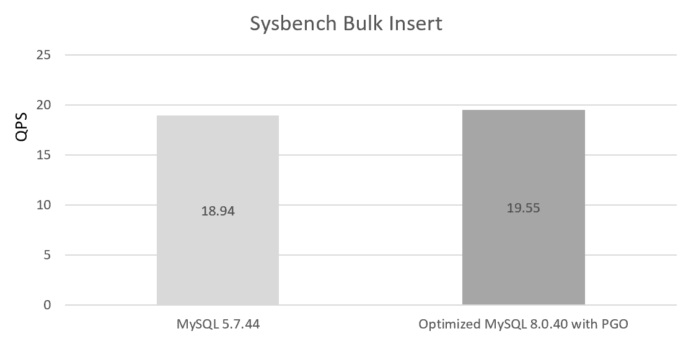

图 8-39。使用 PGO 优化的 MySQL 8.0.40 版本与版本 5.7 的表现大致相当。

用户还可以利用多线程进行并发批量处理，充分利用改进的重做日志并发性，这可以显著提高批量插入性能。

关于更新索引的问题，由于新代码的不可避免添加，PGO 优化可以帮助缓解这个问题。我们的 PGO 版本[64]可以显著减轻这个问题。

对于读取性能，尤其是连接性能，我们已经做出了重大改进，包括修复内联问题和其他优化。通过添加 PGO，连接性能可以比官方版本提高超过 30%。

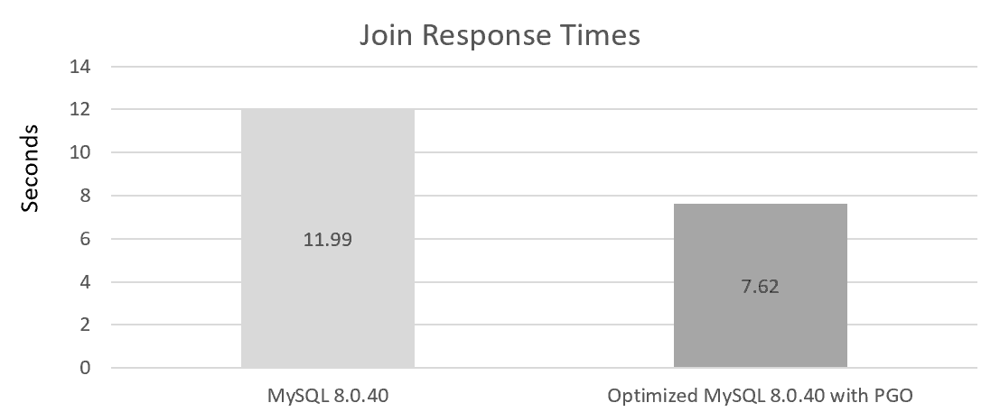

图 8-40。使用 PGO 进行连接性能优化带来了显著的改进。

我们将继续投资时间优化低并发性能。这个过程虽然漫长，但涉及许多需要改进的领域。

开源版本可供测试，并且将持续努力提高 MySQL 的性能。

下一节
