# 第九章：Group Replication 的主要增强功能


> 原文：[`enhancedformysql.github.io/The-Art-of-Problem-Solving-in-Software-Engineering_How-to-Make-MySQL-Better/Chapter9.html`](https://enhancedformysql.github.io/The-Art-of-Problem-Solving-in-Software-Engineering_How-to-Make-MySQL-Better/Chapter9.html)

## 9.1 Group Replication 中的主要设计缺陷

Group Replication 最初是在 SSD 被广泛采用之前设计的。在 Paxos 层引入 I/O 操作可能会显著影响性能，因此最初的设计没有考虑将 Paxos 日志持久化到磁盘。

Group Replication 采用了一种基于认证数据库的冲突检测方法，以在分布式环境中实现并发控制，旨在支持对任何 MySQL 节点的写操作。这种方法忽略了 MySQL 单节点写入的固有特性，导致 Group Replication 的单主吞吐量低于半同步复制。

在为多主场景设计 Group Replication 时，并没有严格遵循状态机复制原则，即操作序列应在所有节点上保持一致。这导致 Group Replication 的多主设置在某些场景中出现了最终不一致的问题。

当 MySQL 从节点重放卡住或其 I/O 存储空间填满时，最终所有 Group Replication 节点都会受到影响，大多数节点可能会遇到内存不足（OOM）问题。虽然 Group Replication 旨在解决高可用性问题，但它也应该确保自身的高可用性，防止整个集群因单个 MySQL 从节点的问题而不可用。

这些设计缺陷通常只有通过暴露问题才能有效地发现。Group Replication 的逻辑非常复杂，仅从代码中直接识别问题具有挑战性。

### 9.1.1 缺乏持久性：Paxos 未提交到磁盘

以下是 Meta 公司工程师对 Group Replication 的观点[42]：

*另一个重要且故意的选择是，不使用从 MySQL 5.7 开始提供的 Group Replication。虽然该协议提供了显著的进步（例如多主模式），但在我们的部署中使用 Group Replication 带来了重大的挑战。它基于一种不使用持久日志的 Paxos 变体。条目仅在通过内存共识轮考虑为已提交后才会写入日志。领导者选举算法是本地和确定性的。它也不考虑选择新领导者时的延迟，短暂的网络中断会触发一个计算成本高昂的恢复算法。这个选项可能可行，但不是没有付出过度的工程努力来修复其缺点。*

如上所述，Group Replication 的主要问题在于 Paxos 消息缺乏持久化。最初的设计背景包括：

1.  不理想的 SSD 硬件性能。

1.  Paxos 日志持久化不符合具有多个主机的 Group Replication 的要求。

    在认证数据库中没有持久化存储的情况下，具有多个主机的 Group Replication 无法使用 Paxos 消息持久化进行故障恢复。MySQL 重启后，没有相应的认证数据库，导致持续处理持久化的 Paxos 消息容易导致不一致的状态。

基于使用 NVMe SSDs 的 Group Replication 单主模式，使用 SysBench 只写测试来检查添加 Paxos 持久化对吞吐量的影响。请参考下面的具体图表：

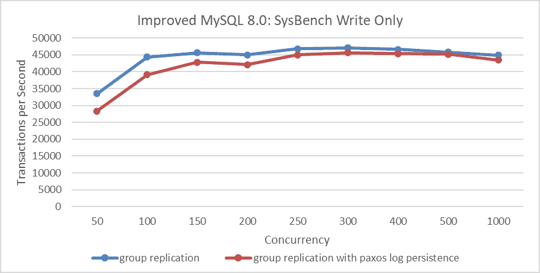

图 9-1\. SysBench 只写测试中 Paxos 日志持久化的性能开销。

从图中可以看出，在低并发情况下，添加了 Paxos 持久化后，性能略有下降，这是预期结果。然而，在高并发情况下，差异并不显著。这是因为，在高并发情况下，Paxos 使用批处理机制，允许多个事务记录一起记录到 Paxos 实例中，从而减少 I/O 压力。

接下来，让我们检查比较响应时间。

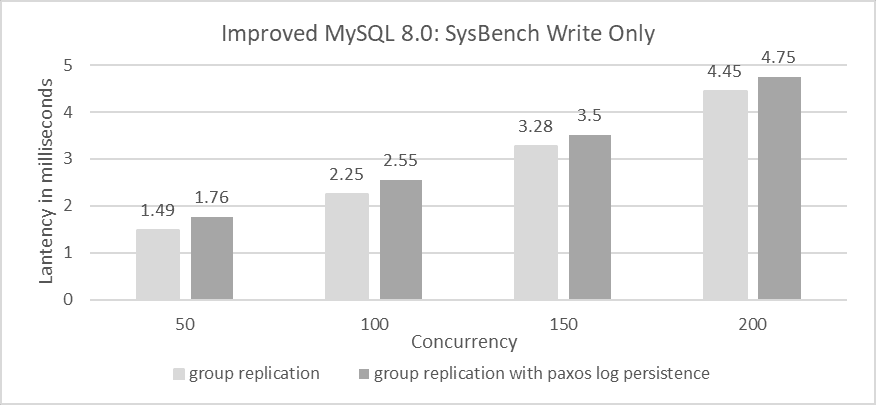

图 9-2\. 在 SysBench 只写测试中添加 Paxos 日志持久化后，平均响应时间增加。

图表显示了 50 到 200 个并发场景的响应时间。具有 Paxos 日志持久化的平均响应时间增加是可以接受的。SysBench 只写测试对 Group Replication 的压力很大，而 TPC-C 测试由于它们的读操作，减少了 Group Replication 的写压力。对于基于单主模式、使用 SSD 的 Group Replication 和不同并发级别下 BenchmarkSQL 的 TPC-C 吞吐量的比较，请参考下面的图表。

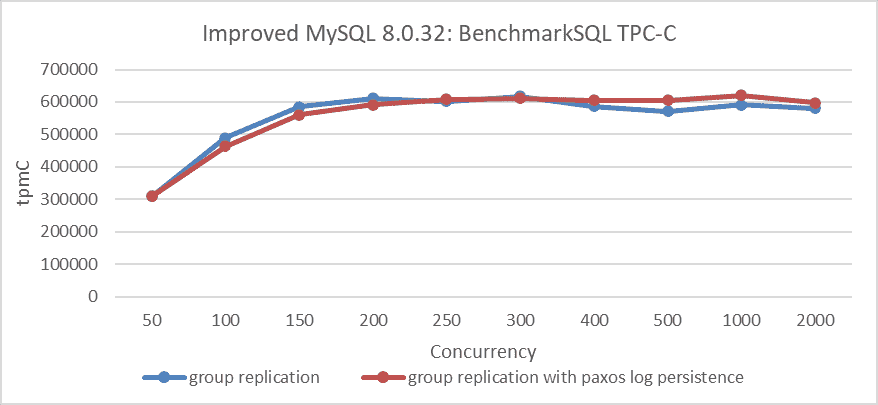

图 9-3\. BenchmarkSQL 测试中 Paxos 日志持久化的性能开销。

图表显示，在低并发级别下，具有 Paxos 日志持久化的版本吞吐量略有降低，尽管与 SysBench 只写测试相比，影响要小得多。基于各种测试结果，可以得出结论，在当前的 SSD 硬件条件下，采用 Paxos 日志持久化是一个可行的解决方案。

### 9.1.2 将桶原理应用于认证数据库

使用认证数据库进行冲突检测是乐观并发控制（OCC）的一部分。OCC 允许多个事务并发读取和更新数据而不阻塞，通过维护事务历史并检查提交前的冲突来实现。如果检测到冲突，其中一个事务将被回滚。虽然 OCC 避免了锁等待，但在实际冲突中可能会产生重大惩罚，类似于两阶段锁定（2PL），但以回滚代替锁等待。OCC 在冲突不频繁时表现良好，但在冲突频繁时，由于过多的回滚和重试，效果较差，使其在这种场景下不太有效[59]。

在多主组复制中，每个 MySQL 节点可以独立写入，需要全局并发控制。MySQL 使用认证数据库来实现这一点，通过实现 OCC 来决定事务提交或回滚。然而，在严重写冲突的情况下，OCC 可能会导致大量的回滚，这表明它在高冲突场景中的无效性。

让我们继续通过检查 MySQL 认证数据库使用的数结构来继续：

```cpp
typedef std::unordered_map<
      std::string, Gtid_set_ref *, std::hash<std::string>,
      std::equal_to<std::string>,
      Malloc_allocator<std::pair<const std::string, Gtid_set_ref *>>>
      Certification_info;
  ...
  /**
    Certification database.
  */
  Certification_info certification_info; 
```

认证数据库使用 C++标准模板库（STD）中的*unordered_map*，这是一个哈希表。该数据库存储有关事务写操作的信息，其中每个键是一个表示行的 base64 编码字符串，每个值包含用于重放计算的 GTID 和相关信息。以下代码演示了如何将行插入到认证数据库中。

```cpp
bool Certifier::add_item(const char *item, Gtid_set_ref *snapshot_version,
                         int64 *item_previous_sequence_number) {
  DBUG_TRACE;
  mysql_mutex_assert_owner(&LOCK_certification_info);
  bool error = true;
  std::string key(item);
  Certification_info::iterator it = certification_info.find(key);
  snapshot_version->link();
  if (it == certification_info.end()) {
    std::pair<Certification_info::iterator, bool> ret =
        certification_info.insert(
            std::pair<std::string, Gtid_set_ref *>(key, snapshot_version));
    error = !ret.second;
  } else {
    *item_previous_sequence_number =
        it->second->get_parallel_applier_sequence_number();
    if (it->second->unlink() == 0) delete it->second;
    it->second = snapshot_version;
    error = false;
  }
  ...
  return error;
} 
```

随着更新的频率增加，认证数据库会变得更大。为了及时清理过时信息，组复制使用桶原理。例如，如果最慢节点的执行 GTID 是 A，那么认证数据库中 GTID 小于或等于 A 的信息可以被清理。

接下来，回顾以下在组复制操作期间拍摄的*perf*屏幕截图。

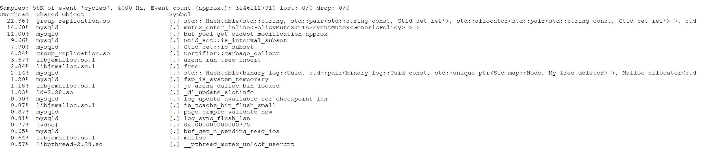

图 9-4. 哈希表操作中揭示的瓶颈。

该图揭示了操作哈希表时的瓶颈。清理认证数据库类似于垃圾回收；在清理过程中，事务必须等待，涉及大量的内存释放。排队论表明，这种延迟显著影响了事务处理速度。下图展示了组复制和半同步复制的吞吐量与并发之间的关系。

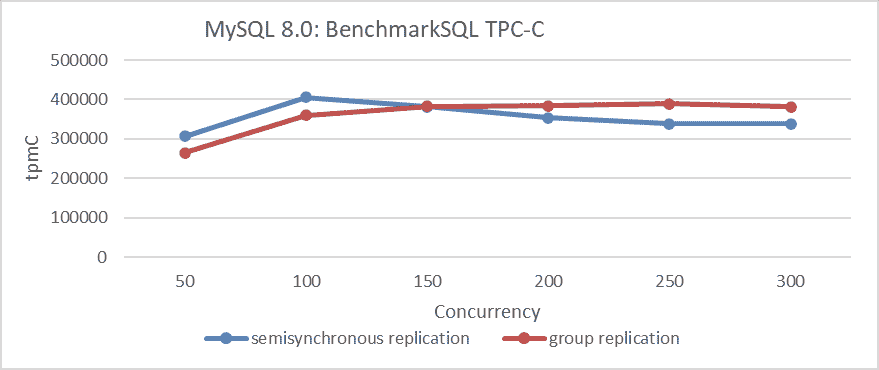

图 9-5. 半同步复制和组复制之间的性能比较。

该图显示，组复制的峰值吞吐量低于半同步复制。

用户需要什么样的组复制？鉴于组复制是为高可用性服务设计的，其高可用性功能不应显著影响性能。用户期望组复制提供真正的高可用性，同时与半同步复制相比提供更好的性能。

### 9.1.3 缺乏对状态机复制机制的严格遵循

实现具有强一致性的容错分布式系统的一个著名方法是状态机复制。这项技术将操作按顺序排列并传播到所有服务器，然后它们依次执行。所有状态机的副本都从相同的初始状态开始，经过相同的连续状态，并产生相同的输出序列。状态机复制确保副本之间的一致性，使分布式服务看起来像一个连贯的、集中的服务，同时保留分布式优势。

状态机复制的关键在于所有副本都从相同的初始状态开始，经过相同的状态，并产生相同的输出[41]。任何偏离此规则的偏差都是不符合规定的，并且难以检测，通常只在边缘情况下揭示问题。所有节点必须以相同的顺序执行，使用相同的交易和底层数据。

在组复制多主架构中，发生规则违反：*CT_CERTIFICATION_MESSAGE*消息没有被放入应用队列，导致处理顺序不统一。以下是在提前处理*CT_CERTIFICATION_MESSAGE*消息的函数*handle_certifier_data*。

```cpp
void Plugin_gcs_events_handler::handle_certifier_message(
    const Gcs_message &message) const {
  if (this->applier_module == nullptr) {
    LogPluginErr(ERROR_LEVEL,
                 ER_GRP_RPL_MISSING_GRP_RPL_APPLIER); /* purecov: inspected */
    return;                                           /* purecov: inspected */
  }
  Certifier_interface *certifier =
      this->applier_module->get_certification_handler()->get_certifier();
  const unsigned char *payload_data = nullptr;
  size_t payload_size = 0;
  Plugin_gcs_message::get_first_payload_item_raw_data(
      message.get_message_data().get_payload(), &payload_data, &payload_size);
  if (certifier->handle_certifier_data(payload_data,
                                       static_cast<ulong>(payload_size),
                                       message.get_origin())) {
    LogPluginErr(
        ERROR_LEVEL,
        ER_GRP_RPL_CERTIFIER_MSSG_PROCESS_ERROR); /* purecov: inspected */
  }
} 
```

提前处理*CT_CERTIFICATION_MESSAGE*消息可能导致不同节点依赖的证书数据库数据不一致，可能最终导致数据不一致。虽然这个问题可能不容易检测到，但在特定条件下相对容易重现。

重现的具体细节如下：在组复制多主场景中，使用负载均衡器（如 LVS）在所有 MySQL 节点之间均匀分配写压力。在足够的写冲突下，有可能在状态机复制的最终状态中重现不一致性。

根据广泛的测试，将证书消息放入应用队列进行统一处理可以消除上述数据不一致问题。

### 9.1.4 组复制缺乏内置的高可用性

组复制在以下情况下可能会面临集体故障场景：

1.  如果 MySQL 从属节点的 I/O 空间已满，导致重放操作受阻，这可能会在整个集群中引发级联效应。

1.  如果由于任何原因在 MySQL 从属节点上停止重放，实际上将其吞吐量降低到零，根据桶原理，集群的整体吞吐量最终也会降至零。

Group Replication 旨在实现高可用性，但这些问题可能导致整个集群系统不可用。因此，解决 Group Replication 固有的高可用性问题对于提供更好的高可用性至关重要。

## 9.2 Paxos 变体算法的问题

### 9.2.1 为什么没有采用 Raft 协议？

Raft 是一种在容错性和性能上与 Multi-Paxos 等效的共识算法。设计用于提高可理解性，Raft 被详细描述以满足实际系统需求。与 Paxos 不同，Raft 减少了状态空间，并将共识分为领导者选举、日志复制和安全阶段。它通过选出的领导者实现共识，并且不是拜占庭容错。只有拥有最新数据的服务器才能成为领导者，并且它包括一个使用重叠多数来确保安全性的机制 [42]。

在设计 Group Replication 时，目标是支持单主和多主模式。采用 Raft 或多 Paxos 协议并不能有效地支持 Group Replication 的多主模式。因此，选择了一种具有多个领导者的 Paxos 变体，即 Mencius 算法。

### 9.2.2 在 Group Replication 中实现 Mencius 的问题

Group Replication 在其核心采用了 Mencius，这是一种从 Paxos 衍生出的多领导者状态机复制协议。Mencius 的独特之处在于它不仅分区序列号，还解决了适应变化的客户端负载和不对称网络带宽等关键性能问题。

Mencius 通过使用简化的共识版本，称为简单共识来实现这一点。这使得负载较低的服务器可以跳过它们的轮次，而无需多数同意。通过在其它消息上 opportunistic 地 piggybacking SKIP 消息，Mencius 使服务器能够以最小的通信和计算开销跳过轮次，从而使其能够高效地适应客户端和网络负载的变化 [32]。

不幸的是，Group Replication 没有遵循上述设计。等待 SKIP 信息的花费仍然很大，导致 Group Replication 可能经历吞吐量波动和比预期更长的响应时间，尤其是在跨数据中心部署场景中。

### 9.2.3 为什么添加自己的 Multi-Paxos 实现？

由于 MySQL 除了现有的 Mencius 算法外，还引入了一种新的 Multi-Paxos 算法，这表明 Mencius 实现存在不足，或者 Mencius 算法本身存在固有问题。

关于 Mencius 算法，以下方面特别值得关注 [32]：

*通过在其它消息上 opportunistic 地 piggybacking SKIP 消息，Mencius 允许服务器以最小的或没有通信和计算开销跳过轮次。这使得 Mencius 能够以低成本适应客户端和网络负载的变化。*

可以推断出，即使在严重的领导者不平衡下，孟子算法也能表现出良好的性能，因为理论和实践证据都支持这一点。因此，问题很可能是由于孟子算法实施不充分造成的。

当孟子算法没有理论问题时，引入新的多 Paxos 算法并不是一个优雅的解决方案，并且带来了几个挑战：

1.  **高维护成本**：维护和测试两套代码库使这部分的工作量翻倍。

1.  **回归测试挑战**：在实践中，新算法导致了一些回归问题，其中一些问题难以解决。

1.  **部分问题解决**：新算法可能只部分满足要求。在组复制的单主模式中，它可能并不普遍适用，因为一致性的读写操作需要所有节点持续通信信息。

## 9.3 Paxos 跳过优化的具体实现

首先，让我们调查 MySQL 孟子算法实现中的性能问题。以下图示了孟子算法在网络延迟为 10 毫秒时稳定运行的网络交互状态：

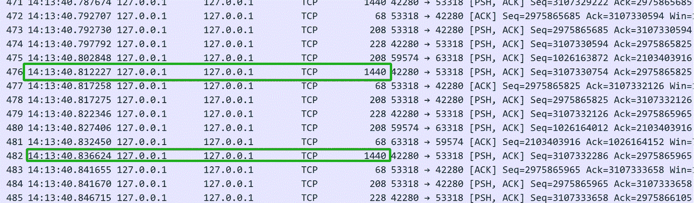

图 9-6. 从数据包捕获数据中得到的孟子协议见解。

图中的绿色框表示两个连续 Paxos 实例之间的时间间隔达到了 24 毫秒。这表明 MySQL 中的孟子算法在其实施中并未与单个往返时间（RTT）对齐。

接下来，让我们参考孟子算法论文《“广域网中的状态机复制”》[54]。网络测试环境的具体细节如下：


从绿色框中可以明显看出，论文中测试的网络延迟是 RTT=100 毫秒。现在让我们检查论文中提供的 Paxos 处理的相关信息。

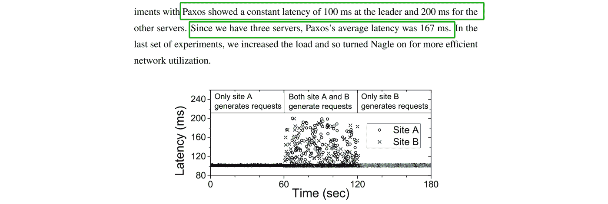

图 9-7. 如孟子论文中所示，孟子协议的共识机制。

根据图示，可以推断出如果只有一个节点生成请求，孟子协议共识需要 100 毫秒，相当于一个往返时间（RTT）。这表明从组复制主节点的角度来看，孟子共识可以在单个 RTT 内完成。在理论可行性明确之后，接下来的讨论将集中在优化组复制的孟子通信上。

优化孟子算法的理论基础包括[32]：

*跳过是使孟子高效的核心技术*。

[Paxos 网络交互的具体图示](https://enhancedformysql.github.io/animation/paxos_app.html)在 Paxos 跳过优化后的显示如下：

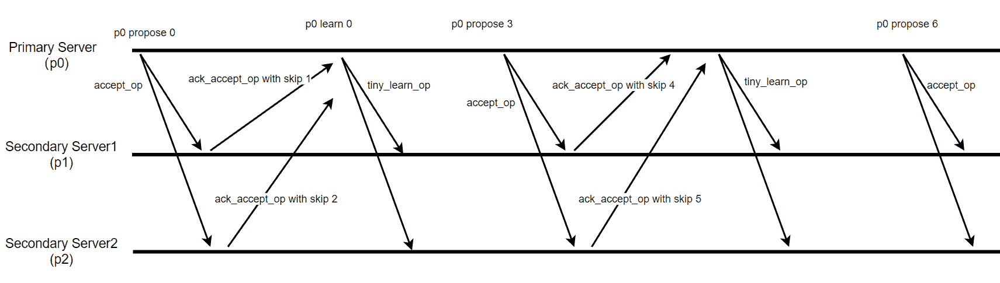

图 9-8. Paxos 跳过优化的机制。

当 Paxos 节点从 Paxos 领导者接收*accept_op*消息且没有要提出的消息时，它可以在发送*ack_accept_op*消息时包含跳过信息。这通知其他节点当前节点在本轮不会提出任何消息。在正常稳定运行期间，每个*accept_op*消息都可以由 Paxos 节点以这种方式处理。

在具体实现中，还必须考虑流水线的影响。在 Paxos 跳过优化过程中，有必要记录这些跳过操作，以避免不同 Paxos 实例之间通信的干扰。

最后，在网络延迟为 10ms 的情况下，评估 Paxos 跳过优化的有效性显示出显著的好处。以下是 Paxos 跳过优化前后在不同并发级别下 TPC-C 吞吐量的比较：

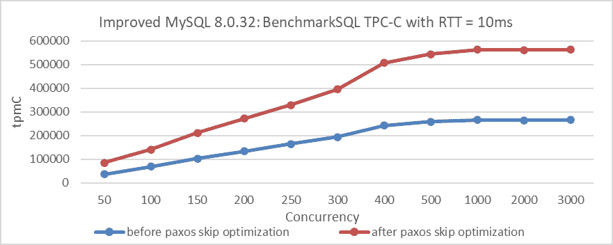

图 9-9. Paxos 跳过优化对具有 10ms 延迟的 BenchmarkSQL 测试的影响。

从图中可以看出，Paxos 跳过优化在网络延迟为 10ms 的情况下显著提高了性能。广泛的 TPC-C 测试证实，这种优化提高了组复制的性能，无论是使用单个主节点还是多个主节点，并支持一致性的读写。

Paxos 跳过优化将代码复杂度降低了与单领导者 Multi-Paxos 实现相比一个数量级。它还最小化了回归测试问题并简化了维护。

总体而言，利用理论和逻辑解决方案优雅地解决了这个问题，比当前的 MySQL 原生实现更有效地解决了这个问题。

## 9.4 单主模式使用组复制的优化设计

基于 Paxos 日志持久化的可行性，组复制单主模式的设计架构可以构建如下：

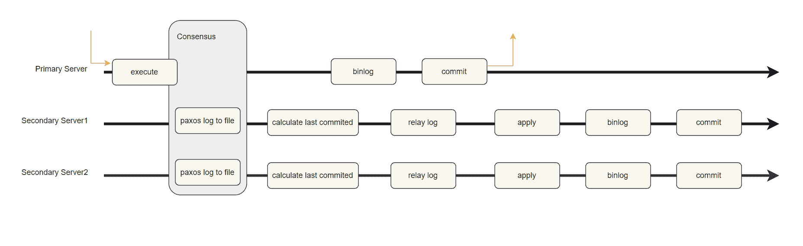

图 9-10. 带有 Paxos 日志持久化的重新设计的组复制单主模式。

当一个事务提交时，它将经历 Paxos 通信，只有在其内容被持久化到 Paxos 日志后才能达成共识。一旦达成共识，主服务器将继续执行操作，如将事务写入二进制日志和执行提交。同时，从服务器处理诸如计算 last_committed 值以进行重放、将事务事件写入中继日志和重放事务等任务。

在组复制中，从服务器需要计算 last_committed 值的需求源于主服务器在参与低级 Paxos 通信之前尚未达到 binlog 阶段。因此，last_committed 值尚未可用。从服务器通过证书数据库中的 writeset 信息计算 last_committed 值，从而使组复制能够实现高并行的重放。

在 MySQL 从库计算 last_committed 之后，下一步是将事务事件写入中继日志。为了加快写入磁盘的速度，应使用批处理技术，并对其实现进行周密规划。

提高重放速度对于：

+   **快速故障转移**: 更快的重放确保了更快的故障转移。

+   **改进数据新鲜度**: 更快的重放增加了访问最新数据的可能性。

在解决这些方面之后，组复制单主模式的设计就完成了，为构建一个高性能、高可用、快速故障转移和高效状态机复制的系统奠定了基础。

### 9.4.1 Paxos 日志持久性

Paxos 日志持久性可行性的最关键基础[30]：

*为了在并发系统中获得更高的吞吐量，可以将不同应用线程提交的值集合批处理成一个单一的 Paxos 实例。*

通过使用批处理技术，可以将多个事务组合成一个单一的 Paxos 实例。在达成共识后，事务数据可以一起写入磁盘，显著减少 I/O 压力。随着 SSD 技术的进步，实现无数据丢失的状态机复制是完全可行的。

### 9.4.2 绕过冲突检测

传统的认证数据库使用大量内存，尤其是在主节点和从节点之间存在速度不匹配时，会导致由于大量内存分配和释放而增加的队列等待时间。在 NUMA 环境中，频繁的跨 NUMA 内存分配会降低性能。

在组复制单主模式下，可以在认证数据库中绕过冲突检测。冲突检测主要用在：

1.  组复制多主模式。

1.  在组复制单主模式下的单主切换过程中，当新主节点仍在重放事务的同时接收新的用户请求时。

对于组复制单主模式，只需考虑第二种场景，而“在主节点故障切换前”等机制确保新主节点在接收新请求之前完成事务重放。加速 MySQL 从库的重放过程可以帮助减少用户等待时间。

### 9.4.3 快速计算重放所需的 last_committed 值

首先，让我们明确“*sequence_number*”和“*last_committed*”这两个术语的含义：

+   **sequence_number**: 这是一个自动递增的值，用于跟踪组复制操作期间事务的顺序。在操作期间，每个事务都会被分配一个唯一的*sequence_number*。

+   **last_committed**: 这个值表示新事务所依赖的最后一个已提交事务的序列号。在 MySQL 从库的重放过程中，为了使事务能够继续进行，该事务必须等待序列号等于*last_committed*的事务被完全重放。

例如，在下图中绿色方框突出显示的事务中，*sequence_number=12759* 和 *last_committed=12757*，*last_committed=12757* 表示具有 *sequence_number=12759* 的事务必须等待具有 *sequence_number=12757* 的事务被完全重放后才能继续进行。

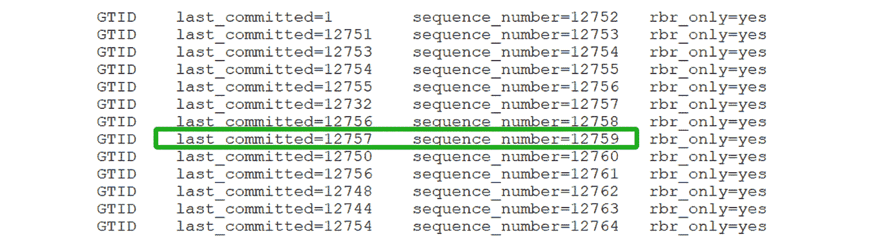

图 9-11\. *sequence_number* 和 *last_committed* 的典型示例。

一旦理解了 *sequence_number* 和 *last_committed*，就可以探索 *last_committed* 值的计算。通常，此值来自事务的写集，它详细说明了事务修改的行。写集中的每一行都由一个对应于表行的键表示。在写集中：

+   对于更新操作，有两个具有相同键的元素。

+   对于插入和删除操作，有一个元素。

+   DDL 事务的写集为空，表示 DDL 操作必须顺序重放。

在组复制中，当处理事务的写集时，应用线程会检查认证数据库中已修改与写集中相同记录的事务。如果找到这样的交易，应用线程确定小于当前事务 *sequence_number* 的最新 *sequence_number*，这成为事务的 *last_committed* 值。这确保了事务以正确的顺序重放，以维护数据一致性。

在深入分析之前，让我们回顾一下应用线程做了什么：

1.  基于认证数据库计算 *last_committed*。

1.  将事务事件写入中继日志文件。

下面是从捕获应用线程性能数据生成的火焰图：

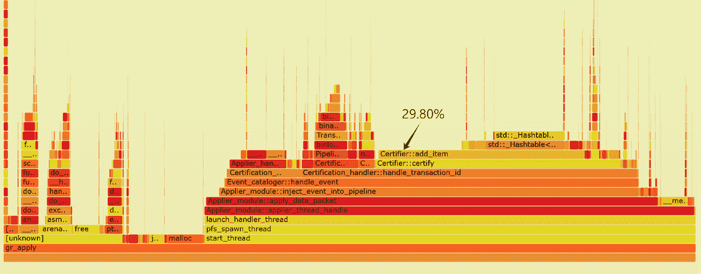

图 9-12\. 应用线程性能数据的火焰图。

从火焰图中可以看出，认证数据库中的 *‘add_item’* 操作消耗了 29.80%的计算时间，其中一半的时间花在哈希表操作上。哈希表的低效导致计算 *last_committed* 时 CPU 资源消耗过高，并延迟写入事务事件到磁盘。

为了解决这个瓶颈并提高磁盘写入性能，必须减少哈希表的开销。由于直接改进哈希表具有挑战性，因此需要一个新的数据结构。

基于单主模式下的组复制设计，已经开发了一种重新设计的数据结构来替换认证数据库中之前使用的哈希表方法。这个新结构旨在消除计算 *last_committed* 时的延迟，并确保及时将事务事件写入磁盘。下面是新的数据结构的具体代码：

```cpp
#define REPLAY_CAL_HASH_ITEMS (REPLAY_CAL_HASH_ITEM / 8)
#define MAX_RELATIVE_SEQUENCE_NUMBER 65535
#define REPLAY_CAL_ARRAY 65536
#define REPLAY_CAL_HASH_ITEM 4088 typedef struct {
  int number;
  int size;
  unsigned char values[REPLAY_CAL_HASH_ITEM];
} replay_cal_hash_item;

class Certifier : public Certifier_interface {
 ...
 private:
  replay_cal_hash_item replayed_cal_array[REPLAY_CAL_ARRAY];
 ... 
```

为了存储计算 *last_committed* 所必需的信息，使用了一个名为 *replayed_cal_array* 的静态数组。这个数组包含 65,536 个元素，每个元素代表一个带有 *replay_cal_hash_item* 的桶槽。*replay_cal_hash_item* 结构包括：

+   **数量**：表示 *replay_cal_hash_item* 内当前元素的数量，跟踪有多少元素在使用。

+   **大小**：指定 *replay_cal_hash_item* 的最大容量，定义它可以容纳的元素的上限。

+   **值**：一个包含 4,088 个无符号字符元素的数组，用于存储数据。

**values** 成员用于存储 511 个条目，每个条目占用 8 字节。每个条目由以下内容组成：

+   **键值**：6 字节。

+   **相对序列号**：2 字节。

对于具体细节，请参考下面的图：

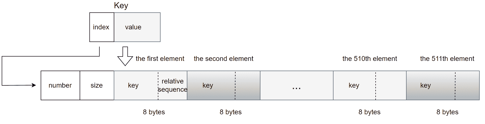

图 9-13\. 一种适合计算 last_committed 的新数据结构。

*键* 经过 base64 转换成一个 8 字节的整数。这个 8 字节整数如下划分：

+   **replayed_cal_array 的索引**：前两个字节用作 *replayed_cal_array* 的索引。

+   **值**：剩余的六个字节存储在每个 8 字节条目的前六个字节中。

关于 *序列号* 的存储：

+   只存储 *序列号* 的相对值，计算为当前 *序列号* 减去一个基序列值。

+   与需要 8 字节相比，这个相对的 *序列号* 只需 2 字节。

+   这个 2 字节的相对 *序列号* 存储在每个 8 字节条目的最后两个字节中。

这种设置通过使用 *键* 的紧凑表示和仅存储必要的相对 *序列号* 来优化存储，确保在 *replay_cal_hash_item* 结构中高效使用内存。

下面的图展示了基于新数据结构的算法，突出以下关键点：

1.  充分利用 *键* 的特性和 *序列* 号的单调增加，有效地压缩存储空间，从而实现新数据结构的高内存使用效率。

1.  对存储的信息设置上限。一旦超过阈值，将触发类似于检查点的过程，并将当前事务设置为串行回放。

1.  新数据结构的内容相对较小，具有高缓存命中率。此外，在 *replay_cal_hash_item* 中，*值* 是连续存储的，这使得它非常适合缓存。

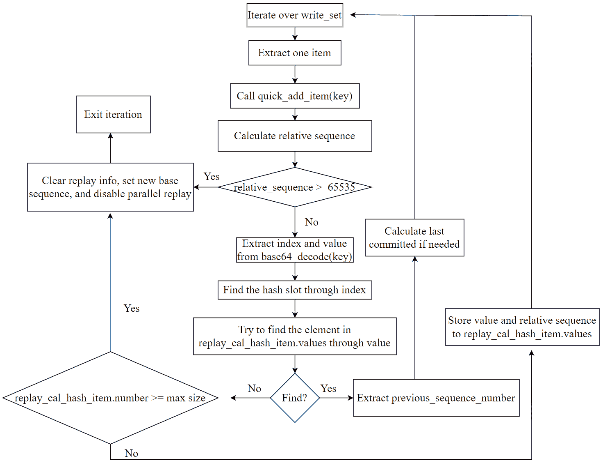

图 9-14\. 一种适合计算 last_committed 的新算法。

应该注意的是，新的数据结构占用 256MB（65536 * 4096 字节）的内存占用，这比在基准测试期间传统认证数据库通常需要的几个 GB 甚至数十 GB 小得多。这种适度的内存使用为优化整个应用线程的性能奠定了坚实的基础。

优化后，应用线程显著加速了其计算 last_committed 值的速度，从而显著提高了应用线程的整体处理速度。以下是通过捕获应用线程改进版本的*perf*数据生成的火焰图。

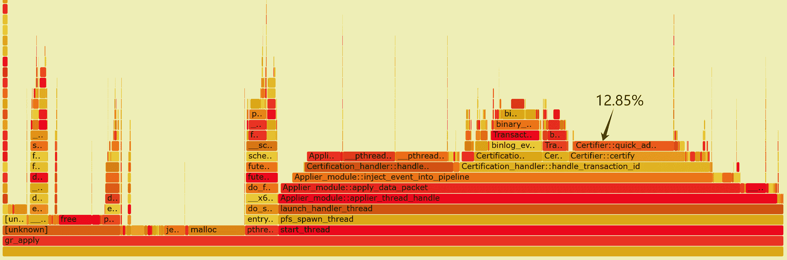

图 9-15。优化后应用线程性能数据的火焰图。

从图中可以看出，*Certifier::certify*的 CPU 处理开销显著降低。具体来说，*quick_add_item*现在只占开销的 12.85%，而之前，当吞吐量较低时，*add_item*消耗了 29.80%。这突出了采用新数据结构所取得的显著性能提升。

基于广泛的 TPC-C 测试统计数据，可以得出以下优化结论：在优化之前，应用线程的磁盘吞吐量支持大约 500,000 tpmC。优化后，由于有更多的 CPU 时间用于处理磁盘写入，应用线程的磁盘吞吐量现在支持大约 1,000,000 tpmC。

这种改进不仅提高了应用线程的整体处理能力，还加速了过时 writeset 信息的清理。根据测试，每次清理操作现在只需毫秒。因此，它有效地缓解了原生 Group Replication 固有的性能波动，进一步提高了稳定性。

从这个案例研究中，性能提升的原因可以总结如下：

1.  **静态数组用于值**：在*replay_cal_hash_item*中的*values*使用静态数组增强了搜索效率，由于连续内存访问，这使得它非常缓存友好。

1.  **减少数据存储**：存储的数据量已经显著减少。之前可能需要几 GB 的存储空间，而现在只需 256MB。较小的内存占用通常会导致更高的效率。

1.  **固定内存空间**：分配的内存空间是固定的，不需要动态分配。之前的频繁内存分配和释放由于内存操作的同步性质而对高性能有害。

1.  **高效的认证清理**：认证清理可以达到毫秒级的性能。在认证清理过程中，只需要对 65,536 个*replay_cal_hash_item*项目中的*number*值进行零值操作。

通过基于 Group Replication 的单主模式实现更好的数据结构，以实现相同的 last_committed 计算功能，可以显著提高应用线程的最大处理能力，并消除性能波动。

### 9.4.4  Relay 日志的批量写入机制

事务事件记录到磁盘是应用线程的两个主要任务之一。此记录的效率直接影响 Group Replication 的可用性。如果记录过程效率低下，根据排队理论，应用队列的大小将不断增大。让我们检查如图所示的优化后的应用线程主流程：

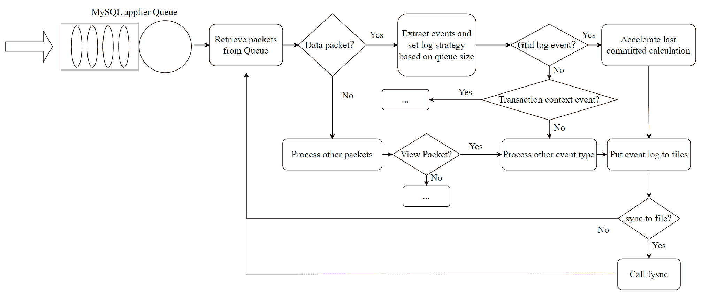

图 9-16. 应用线程优化后的主流程。

批量写入机制指的是对原生 MySQL 版本的改进，其中事件是单独写入磁盘的。现在，至少来自同一事务的事件会一起写入磁盘，显著减少了 I/O 写入操作的次数。如果应用队列的大小超过指定的阈值，事务批次中的事件会一起写入，进一步减少 I/O 写入调用的频率。

批量写入机制，通过 TPC-C 基准测试，最初将磁盘写入速度从略超过 200,000 tpmC 提高到 500,000 tpmC。通过上一节中 last_committed 重放计算的进一步改进，这个速度可以提升到大约 1,000,000 tpmC，有效解决了由于磁盘写入延迟导致的过多应用队列增长问题。

### 9.4.5 与传统 Group Replication 的性能比较

下图比较了 TPC-C 吞吐量与不同模式下的并发级别。部署设置如下：MySQL 的主从都部署在同一台机器上，使用 NUMA 绑定隔离以防止计算干扰。主从分别使用独立的 NVMe SSD，以确保没有 I/O 操作干扰。

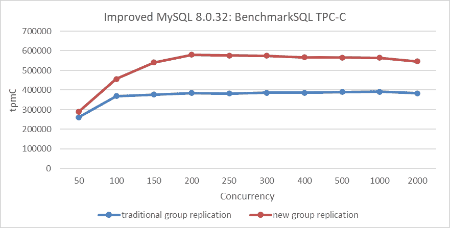

图 9-17. 新的 Group Replication 单主模式设计的影响。

从图中可以看出，新的 Group Replication 单主模式设计在性能上全面优于传统的 Group Replication 模式。

## 9.5 如何减轻 Group Replication 中的性能波动？

### 9.5.1 增强故障检测机制

由于 FLP 不可行性结果，准确检测节点故障具有挑战性，该结果指出，如果即使有一个进程可以失败，在纯异步系统中达成共识是不可能的。困难在于，当服务器没有收到消息时，它无法区分另一个服务器是已经失败还是只是“非常慢”。[32]。幸运的是，大多数实际系统不是纯异步的，所以 FLP 结果不适用。为了规避这一点，对系统同步性做出了额外的假设，从而允许设计在特定条件下保持安全并提供活性的协议。一种常见的方法是使用不精确的本地故障检测器。

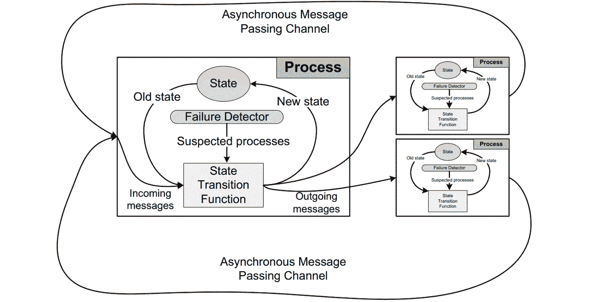

图 9-18. 从孟子论文中借鉴的异步消息传递模型。

上面的图示说明了异步消息传递模型。每个故障检测器监控服务器并维护一个疑似故障服务器的列表。这些检测器可能会犯错误，例如怀疑一个正在运行的服务器已经崩溃。如果后来得到纠正，该服务器可以从疑似列表中移除。使用故障检测器的协议必须始终确保安全，即使在这些错误发生的情况下，并且在检测器长时间准确时保证进展。

Group Replication 的故障检测机制识别并驱逐不通信的成员。这增加了组中包含大多数功能成员的可能性，确保正确处理客户端请求。所有组成员都会定期交换消息。如果一个成员在 5 秒内没有收到来自另一个成员的消息，它会怀疑那个成员。如果怀疑没有得到解决，该成员将被驱逐。被驱逐的成员对其状态一无所知，并认为其他成员是不可达的。如果它重新连接，它将通过更新的成员视图了解到自己的驱逐情况。

在理解了上述内容之后，让我们分析常见的视图变更事件类型：

1.  **节点被杀死**

    在 Linux 系统中，当一个节点被杀死时，TCP 层通常会发送一个重置（RST）数据包来通知其他节点连接问题。Paxos 通信可以使用这个 RST 数据包来识别节点的终止。然而，MySQL 并没有专门处理这个问题，而是依赖于标准的超时机制。

1.  **节点网络分割**

    检测一个节点是否是网络分割还是仅仅缓慢是一个挑战。在这种情况下，通常会使用超时机制，因为很难明确区分这些情况。

1.  **节点优雅地离线**

    通常，通过发送命令通知其他节点应该是直接的。然而，MySQL 并没有很好地处理这个方面。

1.  **向集群添加新节点**

    添加新节点需要共识并涉及最终安装视图同步。尽管预期会有一些性能波动，但严重的波动表明节点添加过程处理不当。

每当发生需要复制的变更时，组必须达成共识。这适用于常规事务、组成员变更以及某些维护组一致性的内部消息。共识需要多数派成员就决策达成一致。如果没有多数派，组无法进步，并且会阻塞，因为它无法确保法定人数。

由于多次非自愿故障，可能会丢失法定人数，导致大多数服务器被突然移除。在一个由 5 个服务器组成的组中，如果 3 个服务器同时变得无响应，多数派就会丢失，这阻止了达到法定人数。

相反，如果服务器自愿退出组，它们可以指示组重新配置自己。离开组的服务器会通知其他人，允许适当的重新配置。这保持了成员一致性，并重新计算多数派。例如，如果 5 个服务器中有 3 个一个接一个地离开并通知组，成员可以从 5 个减少到 2 个，同时在过程中确保法定人数 [13]。

在理解视图变更的工作机制之后，可以进一步考察 MySQL 是如何处理它的。

在节点故障或网络分区的情况下，MySQL 的处理方法类似。测试是在杀死一个 MySQL 从节点的情况下进行的。测试的详细信息可以在以下图中查看。

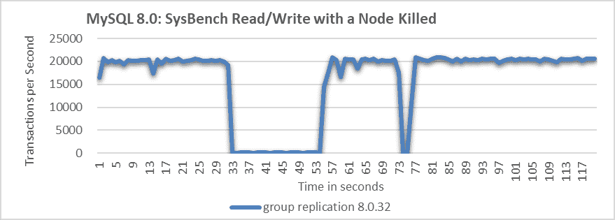

图 9-19\. 杀死节点时显著的吞吐量波动。

从图中可以看出，当 MySQL 从节点被杀死时，MySQL 主节点的吞吐量显著波动，吞吐量降至零并持续超过 20 秒。理想情况下，在一个三节点集群中，如果一个节点被杀死，剩余的两个节点仍然可以形成一个多数派，防止出现长时间的零吞吐量问题。这表明 MySQL 可能无法有效管理多数法定人数和故障检测机制。

当 MySQL 从节点被优雅地关闭时，吞吐量通常会表现出以下行为：

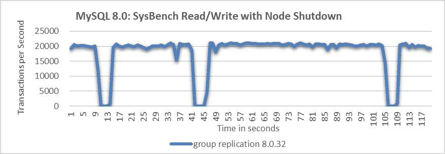

图 9-20\. 关闭节点时吞吐量在间隔中降至零。

图中显示，允许 MySQL 节点优雅地离线会导致吞吐量在几个点降至零，这表明故障检测机制存在问题。

在组复制中添加 MySQL 节点会发生什么？

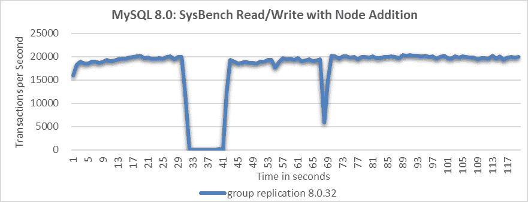

图 9-21\. 添加节点时吞吐量下降约 10 秒。

从图中可以看出，节点添加过程导致吞吐量下降约 10 秒。这表明 MySQL 没有有效地处理节点添加过程。

为了解决组复制中的这些问题，提高探测机制对于提高故障检测准确性至关重要。没有这项改进，吞吐量可能会受到严重影响，使得进一步的性能提升变得困难。

关于探测机制，已经做出了以下改进。

1.  **确保探测协程的公平执行**

    在处理大型事务期间，Paxos 协议处理大量的 writeset 数据，垄断了单线程协程模型的处理资源。这给探测检测协程更新关键信息的机会有限。因此，过时的探测数据可能导致错误的判断，如 1.2.5 节中所述。

    为了解决这个问题，解决方案是将数据处理分摊到多个阶段，这种方法确保探测检测协程有更多公平的机会执行并及时更新信息，从而提高故障检测的准确性。

1.  **改进的唤醒延迟函数**

    检查 MySQL 中的**wakeup_delay**函数，如下所示：

    ```cpp
    static double wakeup_delay(double old) {
      double const minimum_threshold = 0.1;
    #ifdef EXECUTOR_TASK_AGGRESSIVE_NO_OP  
      double const maximum_threshold = 1.0;
    #else   
      double const maximum_threshold = 20.0;
    #endif /* EXECUTOR_TASK_AGGRESSIVE_NO_OP */   double retval = 0.0;
      if (0.0 == old) {
        double m = median_time();
        double const fuzz = 5.0;
        IFDBG(D_BUG, FN; NDBG(m, f));
        // Guard against unreasonable estimates of median consensus time
        if (m <= 0.0) m = minimum_threshold;
        if (m > maximum_threshold / fuzz) m = (maximum_threshold / fuzz) / 2.0;
        retval = minimum_threshold + fuzz * m + m * xcom_drand48();
      } else {
        retval = old * 1.4142136; /* Exponential backoff */
      } 
      /* If we exceed maximum, choose a random value in the max/2..max interval */
      if (retval > maximum_threshold) {
        double const low = maximum_threshold / 2.0;
        retval = low + xcom_drand48() * (maximum_threshold - low);
      }
      IFDBG(D_BUG, FN; NDBG(retval, f));
      return retval;
    } 
    ```

    从代码中可以看出，计算出的延迟时间过于僵化。这种僵化性是性能波动的主要原因，因为主节点在节点退出后可能等待时间过长。为了解决这个问题，根据环境调整相关常数对于适应复杂多变网络条件是必不可少的。

1.  **将 wakeup_delay 函数拆分以适应不同的环境**

    例如，在检查提议消息是否被接受时，使用原始的*wakeup_delay*函数，如下所示：

    ```cpp
     while (!finished(ep->p)) { /* Try to get a value accepted */
            /* We will wake up periodically, and whenever a message arrives */
            TIMED_TASK_WAIT(&ep->p->rv, ep->delay = wakeup_delay(ep->delay));
            ... 
    ```

    在函数*get_xcom_message*中，使用*wakeup_delay_for_perf*函数，如下所示：

    ```cpp
     DECL_ENV
      ...
      while (!finished(*p)) {
        ...
        if (!((*p)->force_delivery)) {
          ep->delay = wakeup_delay_for_perf(ep->delay, 0.003);
        } else {
          ep->delay = wakeup_delay_for_perf(ep->delay, 0.1);
        }
        IFDBG(D_NONE, FN; NDBG(ep->delay, f));
        TIMED_TASK_WAIT(&(*p)->rv, ep->delay);
        *p = get_cache(msgno);
        dump_debug_exec_state();
      }
      FINALLY
      IFDBG(D_NONE, FN; SYCEXP(msgno); PTREXP(*p); NDBG(ep->wait, u);
            SYCEXP(msgno));
      TASK_END;
    } 
    ```

    在*wakeup_delay_for_perf*函数中，可以采用更激进的策略，例如进一步减少等待时间。

1.  将网络往返时间（RTT）纳入 wakeup_delay。

    这样做的目的是提高网络探测活动的准确性。

1.  区分节点被杀死和网络分区。

    在 Linux 系统中，当一个节点被杀死时，TCP 向集群中的其他节点发送重置包，有助于区分节点终止和网络分区故障。将异常节点终止的信息集成到 Paxos 的决策逻辑中，可以做出更准确的判断，解决在节点终止过程中出现的吞吐量长时间下降的问题。

通过实施上述机制，探测精度得到了显著提高。结合即将到来的降级机制，即使在异常条件下也能确保相对稳定的吞吐量。

### 9.5.2 利用降级机制解决长时间等待问题

降级机制采用基于多数的方法在节点在短暂延迟后无响应时做出决策。虽然这个机制并不新颖，并且已经是 Mencius 交互的一部分，但 MySQL 并没有有效地利用它来处理异常情况。

降级机制的缺点是它增加了网络交互，包括准备阶段，导致性能下降。然而，它的优势在于与 MySQL 处理故障相比，显著提高了吞吐量。理论上，只要多数节点之间的网络延迟低，降级机制可以非常有效。

下图比较了在节点被杀死后，改进前后 SysBench 读写测试的吞吐量。

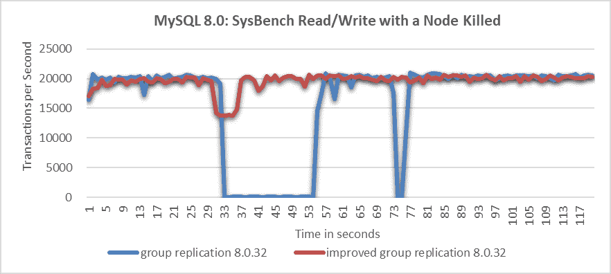

图 9-22. 杀死节点时观察到的显著吞吐量提升。

从图中可以看出，原生组复制经历了长时间的吞吐量下降，这对用户来说是不可接受的。在改进后的组复制中，由于降级过程，吞吐量从每秒 20,000 次下降到 14,000 次交易。尽管这种下降是明显的，但用户认为它是可接受的，因为它比原生组复制有显著改进。

让我们继续检查在特定节点正常关闭后，改进前后吞吐量随时间变化的比较，如图所示：

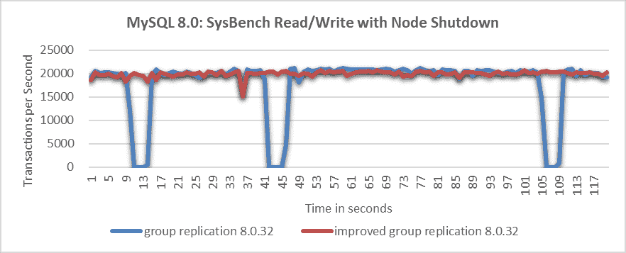

图 9-23. 关闭节点时观察到的显著吞吐量提升。

从图中可以看出，改进后的组复制与原生版本相比提供了更稳定的吞吐量。尽管由于内部同步，视图变化期间会有轻微的波动，但改进后的组复制的吞吐量性能被认为是用户可接受的。相比之下，原生组复制频繁的吞吐量下降被认为是不可接受的。

再次比较在向集群添加 MySQL 从节点后，改进前后的吞吐量，如图所示：

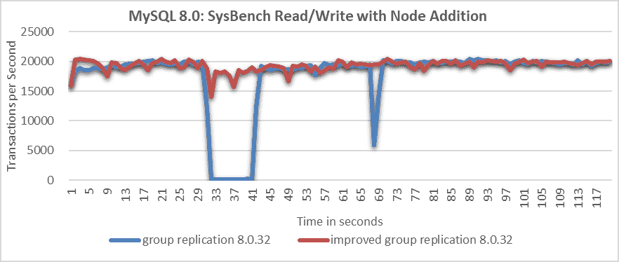

图 9-24. 向集群添加节点时观察到的显著吞吐量提升。

从图中可以看出，原生组复制在吞吐量上大约有 10 秒的下降，而改进后的组复制吞吐量仅略有下降，对性能的影响最小。

总体而言，原生组复制在异常场景中的问题可以得到有效解决。

### 9.5.3 缓解 XCom Cache 中的性能波动

孟子算法使用一个追赶机制来处理延迟副本。如果一个进程检测到过去的一个未决实例，并且通过心跳确认了领导者的正确性，它应该查询其他进程以了解决定。

XCom 是 Group Replication 的群组通信引擎，它包括一个用于存储 Paxos 实例消息和元数据的缓存。这个缓存有助于恢复在通信故障后重新加入节点的丢失消息。如果消息不再在缓存中，节点必须退出集群并经历代价高昂的传统恢复。因此，XCom 缓存应该足够大，以优化恢复效率，同时考虑内存限制[13]。

MySQL 使用动态内存分配来调整 XCom 缓存大小。虽然这种方法看起来有利，但测试表明 XCom 缓存导致了性能波动。

让我们检查负责 XCom 缓存内存分配的 expand_lru 函数，如下面的代码所示：

```cpp
static void expand_lru() {
  uint64_t i;
  for (i = 0; i < BUCKETS; i++) { 
    lru_machine *l = (lru_machine *)xcom_calloc(1, sizeof(lru_machine));
    link_init(&l->lru_link, TYPE_HASH("lru_machine"));
    link_into(&l->lru_link, &probation_lru);
    init_pax_machine(&l->pax, l, null_synode);
    cache_length++;
  }
} 
```

*expand_lru*函数根据*BUCKETS*的数量分配内存。大量的*BUCKETS*可能导致显著的开销。接下来，让我们确定*BUCKETS*的具体大小。

*BUCKETS*的定义如下。

```cpp
static size_t length_increment = INCREMENT;
static size_t size_decrement = INCREMENT / 10;
#define BUCKETS length_increment 
```

*BUCKETS*对应于*长度增量*，它由*增量*定义。让我们继续检查*增量*的定义。

```cpp
#define MIN_LENGTH MIN_CACHE_SIZE /* Also Default value */ #define INCREMENT MIN_LENGTH /* Total number of slots to add/remove */ 
```

*增量*等同于*最小长度*，而*最小长度*由*最小缓存大小*定义。最后，*最小缓存大小*的定义如下：

```cpp
enum {
  EVENT_HORIZON_MIN = 10, 
  EVENT_HORIZON_MAX = 200,
  MAX_BATCH_SIZE = 0x3fffffff, /* Limit batch size to sensible ? amount */
  MAX_BATCH_APP_DATA = 5000,   /* Limit nr. of batched elements */
  MAX_DEAD = 10, 
  PROPOSERS = 10,              /* The number of proposers on one node */
  MIN_CACHE_SIZE = 250000,     /* Minimum cache size */
  DEFAULT_CACHE_LIMIT = 1000000000UL /* Reasonable initial cache limit */
}; 
```

*MIN_CACHE_SIZE*设置为 250,000，因此*BUCKETS*也是 250,000。因此，*expand_lru*函数执行 250,000 次内存分配调用。鉴于内存分配是一个阻塞的系统调用，如此大量的调用可能会引入从数十到数百毫秒的延迟。之前进行了日志分析，以评估执行 250,000 次内存分配调用的开销，如图下所示。

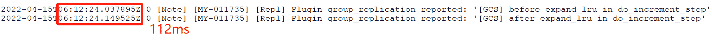

图 9-25.典型机器上 250,000 次内存分配调用的开销。

250,000 次内存分配调用耗时 112 毫秒。此外，XCom 缓存在批量内存释放方面存在问题，这也可能导致性能延迟。虽然这些延迟的持续时间随机器性能而变化，但通常为数十毫秒。这种波动可能导致许多用户提交在数十毫秒内意外阻塞，从而严重影响用户体验。

为了解决这个问题，提供了各种配置选项——高端、中端和低端。这些选项涉及选择固定静态数组的大小，从而消除了与批量内存分配和释放相关的问题。这种新机制的好处包括：

1.  缓存友好，性能高。

1.  消除了 XCom 缓存侧的性能波动。

### 9.5.4 多主认证数据库清理的新策略

在组复制的单主模式下，实现了一种机制，在重放期间快速计算*最后提交*值，从而减少由认证数据库清理引起的显著性能波动。然而，在多主组复制中，通过认证数据库进行冲突检测是不可避免的，这限制了管理性能波动时的灵活性。为了解决这些挑战，采用了负载均衡策略来减轻显著性能变化的影响。

以下图显示了在组复制多主场景中，SysBench 读写测试吞吐量随时间变化的关系。

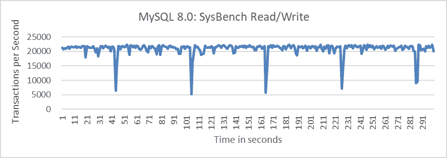

图 9-26. 组复制中的性能波动。

图中每 60 秒出现一次显著的吞吐量波动，反映了不稳定性。这种不稳定性源于定期清理认证数据库的需要，这需要获取全局闩锁。这个过程导致 MySQL 主服务器暂停，从而引起性能的突然下降。

认证数据库消耗了大量的内存，长时间的清理过程会导致停滞。将清理周期从 60 秒减少到 10 秒并不是万能的解决方案。在处理大量事务的环境中，10 秒的周期可能不足，会导致重叠的清理周期，从而加剧性能问题。

基于广泛的实践和经验，有效解决该问题涉及：

1.  **严格遵守状态机复制**：如第 9.1.3 节所述，紧密遵循状态机复制机制，确保处理事务的一致性。

1.  **减少 GTID 广播间隔**：将 GTID（全局事务标识符）广播的间隔降低到亚秒级别。

1.  **增强事务并行重放**：提高 MySQL 从服务器上并行事务重放的效率，特别是对于大事务，可以减少内存消耗并减轻“桶原理”的影响，从而提高性能并减少性能波动的影响。

通过实施这些步骤，将清理周期从 60 秒减少到亚秒间隔变得可行。这种方法使每次清理操作能够管理更小的数据量，从而减少性能的突然下降并稳定吞吐量。以下图显示了应用摊销方法后，SysBench 读写测试吞吐量随时间变化的关系。

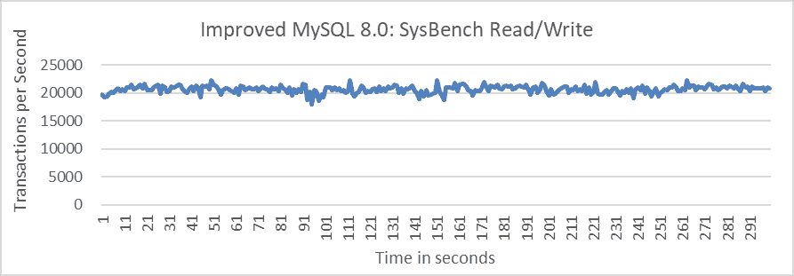

图 9-27. 改进后的组复制中消除的性能波动。

从图中可以看出，优化这部分逻辑后，突然的性能下降已被消除。总体而言，这里实施的解决方案展示了摊销原则的应用，有效地分配和减少了清理操作的影响。

### 9.5.5 组复制单主模式中的流量控制避免

在组复制中，流量控制机制同步 MySQL 二级节点与主节点的速度，防止主节点超过二级节点，避免出现内存不足（OOM）等性能问题。

为了避免单主设置中组复制流量控制的影响，可以考虑以下策略：

1.  **加速 MySQL 二级重放速度**：提高 MySQL 二级上事务的重放速度，特别是对于大型事务。这有助于确保二级节点能够跟上主节点的步伐，减少需要流量控制干预的需求。

1.  **增加中继日志写入速度**：加快写入中继日志的过程，以防止由于写入磁盘的延迟而导致应用队列过度增长。这可以防止内存使用激增，从而触发流量控制机制。

通过在单个主节点的组复制设置中实施这两种策略，可以有效地避免组复制强加的流量控制机制。

## 9.6 视图变化复杂性问题

当组复制集群内节点的成员发生变化时，会发生相应的视图变化事件。这些视图变化事件还需要大多数 Paxos 参与者的共识。

### 9.6.1 理论基础

为了实现高可用性，应按相同顺序将传入的有效负载复制到多个节点。这种分布减少了主二级节点的负担，如果主节点失败，另一个二级节点可以快速接管，同时即使在恢复后也能保持原始日志顺序 [43]。

每位不同成员的统治时期都分配了一个唯一的视图编号，从而建立了一个总顺序。系统通过一系列视图进行进展，每当成员发生变化时，都会发生视图变化。来自不同视图的多个提案按其视图编号排序，较低的视图编号表示较早发生。

在组复制中，视图变化是一个同步过程，有助于解决 FLP 不可能性问题，但引入了新的性能抖动问题。

### 9.6.2 同时多次视图变化的问题

下图显示了不同网络分区故障的情况 [6]：

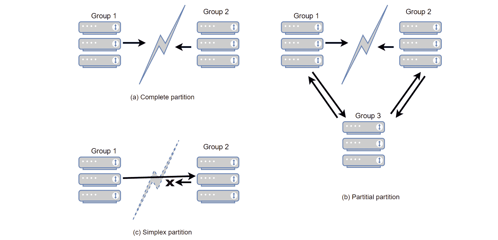

图 9-28\. 网络分区类型。

网络分区可以分为完全、部分和单点类型。当这些分区与其他导致视图变更的故障或命令相交时，会创建复杂的并发挑战。目前，组复制缺乏有效的隔离措施来处理这些问题。

这里有一些常见的并发视图变更问题：

1.  **force_members 命令**：此命令与由网络抖动触发的视图变更不兼容。请谨慎使用，尤其是在严重的网络不稳定期间。

1.  **快速节点重启**：节点重启过快，如果在完全移除之前重新加入，可能会导致视图混乱。组复制试图解决这个问题，但问题仍然存在。

1.  **同时添加节点**：一次性添加多个节点可能导致视图问题。

1.  **安装视图过程失败**：在安装视图过程中出现的新故障可以使整个集群冻结。

一些视图变更问题难以缓解，解决它们需要大量的努力，尤其是在这个领域缺乏理论支持。

对于 MySQL 节点在信息尚未完全移除之前尝试重新加入组复制集群，可能造成视图不一致的问题，解决方案涉及类似于 TCP 的 timewait 机制的措施：

1.  当组复制集群检测到一个节点即将被移除（使用 remove_node_type）时，它会通知 Paxos 层暂时阻止节点重新加入。

1.  在节点移除过程完成后，通常在安装视图操作之后，Paxos 层被通知节点可以继续重新应用以加入集群。

这个谨慎的过程有助于最小化节点提前重新进入导致的视图相关问题。

目前，关于并发视图变更（问题 2 和 3）的问题已经得到解决，但问题 1 和 4 仍然复杂，并计划在未来解决。

### 9.6.3 与安装视图的同步问题

视图变更过程比典型的 Paxos 交互更复杂。一旦在组复制集群内就视图变更达成共识，集群必须经历一个同步的“安装视图”过程。这种强同步如果在安装过程中出现问题，可能会导致整个集群冻结。

## 9.7 组复制中的一致性问题

### 9.7.1 组复制中主切换期间的读一致性

在单主组中，在发生主故障切换，将一个从节点提升为主节点时，新主节点可以立即对应用流量开放，无论复制积压有多大，或者可以选择在积压被应用后限制对其的访问[13]。

故障转移期间的一致性包括：

+   **RW 事务**：在应用之前等待所有先前的交易完成。

+   **RO 事务**：在执行之前等待先前的交易完成，确保它们读取最新的数据。

在新选出的主节点上，新事务将保持直到积压的事务被应用，确保客户端看到最新的值。这种方法优先考虑一致性，但可能会根据积压的大小引入延迟。

为了优雅地解决主节点切换过程中读取脏数据的问题，可以实施以下措施：

1.  **加速重放速度**：增强 MySQL 从节点的重放速度，确保它们尽可能快地赶上主节点。这最小化了可能读取旧数据的窗口。

1.  **优化领导者选举**：在领导者选举过程中，选择 MySQL 从节点中具有最快重放进度的节点。这减少了主节点切换的等待时间，确保更快的过渡和更及时的数据可用性。

### 9.7.2 写操作中的一致性问题和

Group Replication 中的“之后”机制旨在实现 MySQL 主节点和从节点之间的几乎完全同步，达到强同步。这需要在 Paxos 和重放级别进行同步，导致用户响应时间更长。选择这种强同步的用户应了解以下风险：

1.  性能波动。

1.  用户提交响应时间可能无法满足性能要求。

“之后”机制目前还不成熟；在测试期间，许多实例显示 MySQL 节点长时间处于恢复状态。根本原因在于采用新的票据机制来解决“之后”问题，该机制过于复杂且效果不足。

在实际应用中，不建议使用基于“之后”机制的强一致性写入。尽管此机制确保没有数据丢失，但 CAP 定理规定此类机制不能保证可用性。

这本书推荐基于 Paxos 日志持久性的机制。这些机制不仅提供更低且更可预测的响应时间，而且远远超过了“之后”机制的扩展性。以下图表比较了基于“之后”的强同步机制和 Paxos 日志持久性机制的 TPC-C 吞吐量。


图 9-29\. 基于 Paxos 日志持久性的组复制与强同步机制的比较。

从图中可以看出，基于 Paxos 日志持久性的机制在性能上显著优于基于“之后”的强同步机制。

## 9.8 组复制与其他复制机制的比较

### 9.8.1 不同网络延迟条件下的比较测试

MySQL 集群可以在各种环境中部署，了解每种环境的优缺点有助于做出明智的决定。在改进版的 MySQL 下，对四种解决方案（异步复制、半同步复制、组复制和具有 Paxos 日志持久化的组复制）在不同网络延迟条件下的性能进行了比较。

下图比较了在 1ms 网络延迟场景下，不同复制方案下 SysBench 读/写测试的吞吐量。

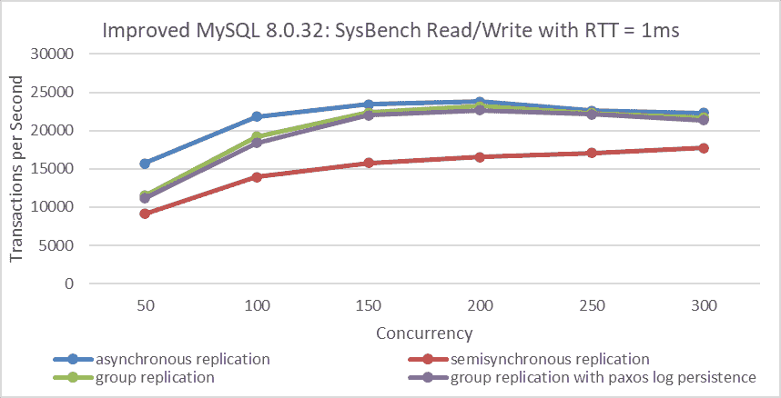

图 9-30。在 1ms 网络延迟下，不同复制方案下 SysBench 读/写测试的吞吐量比较。

异步复制提供了最佳的吞吐量，因为它不需要 MySQL 从节点 ACK 确认，但它不能保证高可用性。通过在内存中的 Paxos 层达成共识并确保事务批量共识，组复制提供了显著的优势，并且与半同步机制相比，表现出更好的性能。具有 Paxos 日志持久化的组复制与组复制表现出相似的性能，得益于 Paxos 条目的批量处理和增强的 SSD 硬件性能。

相反，半同步复制按顺序处理事件。由于一个事务涉及多个事件，这会导致高 CPU 处理延迟。根据排队论，半同步复制中的等待时间与其他解决方案相比显著更高，导致吞吐量较差。

下图展示了在不同并发级别下 4 种解决方案的响应时间比较。

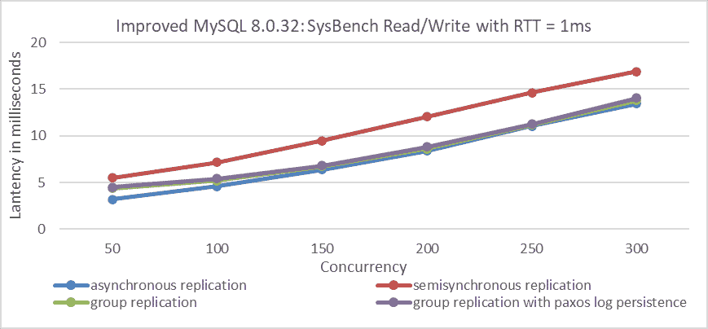

图 9-31。在 1ms 网络延迟下，不同复制方案下 SysBench 读/写测试的响应时间比较。

从图中可以看出，半同步复制的响应时间最差，而异步复制表现出最佳性能，这与预期一致。

当网络延迟增加到 10ms 时，以下图展示了具体的性能比较。

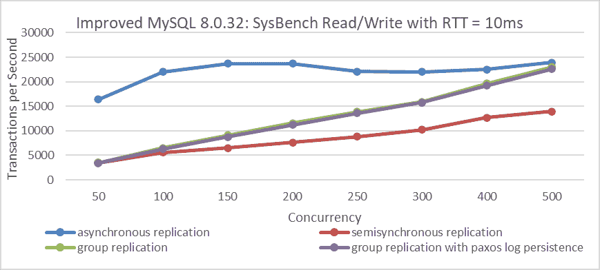

图 9-32。在 10ms 网络延迟下，不同复制方案下 SysBench 读/写测试的吞吐量比较。

从图中可以看出，异步复制提供了最佳的吞吐量。它实现了显著更高的吞吐量，并且在网络延迟的情况下保持了相对稳定的响应时间，使其成为跨城市或区域部署的首选选择。

在网络延迟较长（10ms）的场景中，MySQL 从库的处理延迟对于半同步复制和 Group Replication 来说都不是瓶颈。然而，由于事件处理机制效率较低，半同步复制的吞吐量在 Group Replication 之下。

同时，对 4 种不同的解决方案在响应时间方面的比较进行了评估。

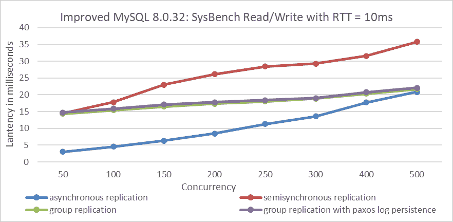

图 9-33\. 在 10ms 网络延迟下，不同复制方案下 SysBench Read/Write 测试的响应时间比较。

从图中可以看出，在低并发级别下，异步复制的响应时间最低。然而，随着并发性的增加，异步复制与 Group Replication 之间的性能差距缩小。在所有解决方案中，半同步复制始终显示出最高的响应时间。理论上，带有 Paxos 日志持久性的 Group Replication 可以完全替代半同步复制，提供改进的性能，同时保留 Group Replication 的高可用性优势。

### 9.8.2 带有 Paxos 日志持久性的 Group Replication 与其他复制方法的比较

在相同的数据中心环境中，使用 BenchmarkSQL 进行的 TPC-C 测试用于比较半同步复制、带有 Paxos 日志持久性的 Group Replication 和异步复制的吞吐量与并发级别。具体细节在以下图中展示：

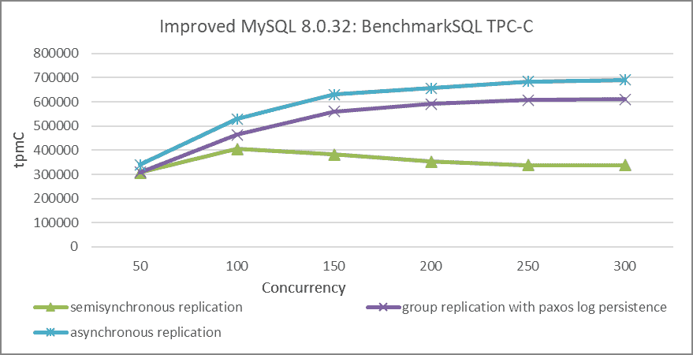

图 9-34\. 不同复制方案下，BenchmarkSQL 测试的吞吐量与不同并发级别的比较。

从图中可以看出，在相同的数据中心环境中，异步复制实现了最高的吞吐量，尽管与 Group Replication 相比，差异并不显著。为了提高可用性而牺牲一些性能，对于 Group Replication 来说通常是值得的。与带有 Paxos 日志持久性的 Group Replication 相比，半同步复制在性能上明显落后。

在易用性方面，半同步复制更简单，尤其是在 MySQL 实例较少的情况下。然而，随着实例数量的增加，由于可能出现更多边缘情况和故障，管理半同步复制变得更加复杂。

## 9.9 Group Replication 的可伸缩性

Paxos 算法对多数一致性的依赖会减慢决策过程，因为每个决策都需要往返于许多参与者之间 [29]。这种通信和同步成本引入了显著的开销，导致与未复制系统相比，状态机复制的请求数率较低。

在审查完内容后，使用修改后的 tpcc-mysql 工具来比较独立服务器和组复制设置之间的吞吐量。这种比较将有助于评估组复制功能的限制。

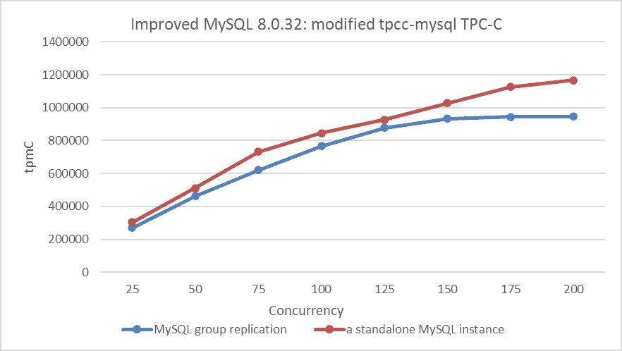

图 9-35. 组复制功能的限制。

从图中可以看出，独立 MySQL 实例的吞吐量仍有提升空间。组复制增加了额外的队列延迟，吞吐量峰值达到 200 并发。在当前硬件环境下，进一步提高吞吐量具有挑战性。

组复制面临由硬件能力、Paxos 的同步成本和 XCom 的单线程处理限制所决定的吞吐量上限。相比之下，独立的 MySQL 显示出了更好的可伸缩性，并实现了更高的吞吐量。

每个决策都涉及大多数参与者，这给参与者和领导者之间的网络带来了高负载。因此，系统通常限制在五到七个参与者，因为每个额外的参与者都会显著降低整体性能[29]。

随着节点数量的增加，组复制的可伸缩性如何？由于底层 Paxos 通信基于单线程模型，增加更多节点理论上会削弱处理能力。在同一数据中心环境中，进行了 3 节点、5 节点、7 节点和 9 节点的集群测试，如图下所示：

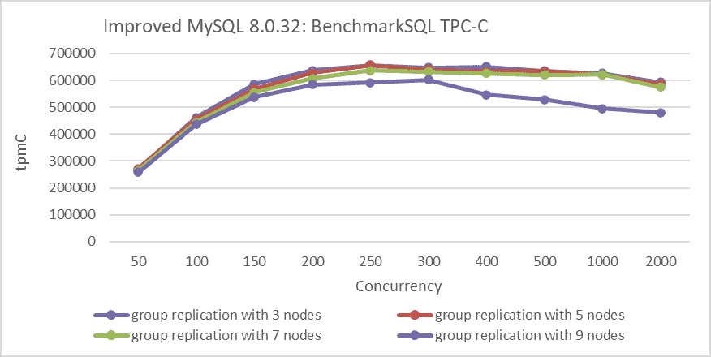

图 9-36. 不同节点配置下组复制的可伸缩性。

从图中可以看出，7 节点集群的吞吐量仍然可以接受，但与 7 节点相比，9 节点的吞吐量有显著下降。这些测试是在同一数据中心环境中进行的，可能不代表所有场景。然而，它突显了一个担忧：随着节点数量的增加，组复制的可伸缩性可能会受到影响。

下一页
