# 第十章：MySQL 二级重放的重大改进

> [`enhancedformysql.github.io/The-Art-of-Problem-Solving-in-Software-Engineering_How-to-Make-MySQL-Better/Chapter10.html`](https://enhancedformysql.github.io/The-Art-of-Problem-Solving-in-Software-Engineering_How-to-Make-MySQL-Better/Chapter10.html)


## 10.1 MySQL 二级重放机制

MySQL 支持主/从复制，通常使用日志传输。一个复制的 MySQL 实例由一个主实例和一个或多个从实例组成。事务首先在主实例上执行。主实例生成记录这些事务操作的日志，并将日志条目传输到从实例。从实例按顺序重放日志条目，以达到与主实例相同的状态 [16]。

应该注意的是，上述讨论的 MySQL 二级重放机制是指按事务提交的顺序重放事务。在提交之前不冲突的事务可以并行执行。

不论是使用异步复制、半同步复制还是组复制，它们都遵循相同的重放过程。MySQL 二级重放必须确保正确重放，支持一致性读取，并且对于高可用性要快速。因此，MySQL 从实例以高质量重放事务的能力对于集群的性能至关重要。

### 10.1.1 确保重放正确性

为了确保正确重放，有必要在事务之间建立依赖关系。如果有两个事务之间存在冲突，必须确定重放顺序——具体来说，哪个事务应该首先重放，哪个应该随后。这些依赖关系基于 binlog 或中继日志文件中的事务顺序。

一旦建立了依赖关系，确保重放幂等性至关重要。这种属性在诸如崩溃恢复等场景中尤为重要，以确保事务可以正确且一致地重放，而不产生意外的副作用。

为了确保基于 GTID 的 MySQL 二级重放的幂等性，请参阅以下具体代码：

```cpp
 const bool skip_transaction = is_already_logged_transaction(thd);
  if (gtid_next_list == nullptr) {
    if (skip_transaction) {
      skip_statement(thd);
      return GTID_STATEMENT_SKIP;
    }
    return GTID_STATEMENT_EXECUTE;
  } else { 
```

下面将解释 *is_already_logged_transaction* 函数的详细信息：

```cpp
/**
  Check if current transaction should be skipped, that is, if GTID_NEXT
  was already logged.
  @param  thd    The calling thread.
  @retval true   Transaction was already logged.
  @retval false  Transaction must be executed.
*/
bool is_already_logged_transaction(const THD *thd); 
```

实际上，它检查 GTID 事务是否已经被执行，如果是，则跳过它。

除了在不同事务之间建立重放关系并保持幂等性之外，MySQL 事务重放还需要支持重试过程。在极端情况下，由于冲突的锁定策略，重放有时会导致死锁。当这种情况发生时，需要重新重放被杀掉的事务，这涉及到重试过程的执行。

### 10.1.2 支持一致性读取

为了确保从 MySQL 二级读取的一致性，请考虑以下因素：

1.  **优化回放速度**：加速 MySQL 二级的事务回放以减少与主级的延迟。

1.  **保留提交顺序**：为了保持因果关系，MySQL 二级按照它们写入中继日志的顺序提交事务。这通过设置参数*replica_preserve_commit_order=on*来控制。

1.  **读取写入一致性**：为了满足“读取你的写入”一致性要求，检查最近重放的事务的 GTID 是否已达到指定的 GTID 值。如果没有，等待直到它达到。这确保了读取反映了最近的写入。

### 10.1.3 MySQL 二级回放的效率

MySQL 二级回放的执行过程与主库不同。虽然二级回放侧重于执行事务事件和提交操作（主要处理写操作），但主库处理事务 SQL 的读写操作。

下图比较了在标准 TPC-C 测试期间 MySQL 主库和二级的 CPU 消耗。

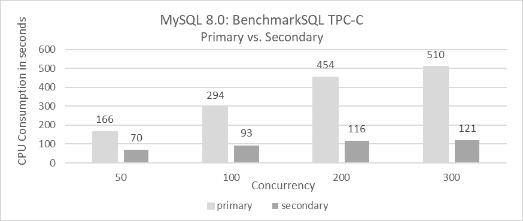

图 10-1\. 二级 CPU 消耗显著低于主级。

根据图示，可以得出以下结论：

1.  **CPU 消耗比较**：

    MySQL 二级回放与 MySQL 主库相比，无论并发级别如何，都持续消耗显著更少的 CPU。这归因于：

    +   MySQL 的二级重放仅涉及写操作，避免读操作。

    +   基于事件的回放通常可以提高执行效率。

1.  **并发影响**：

    在低并发情况下，主从 CPU 消耗差异较小，但在高并发情况下变得更为明显。

上述统计数据基于标准的 TPC-C 测试结果，不包括大事务。以下图表比较了 TPC-C 数据加载过程中的时间消耗。

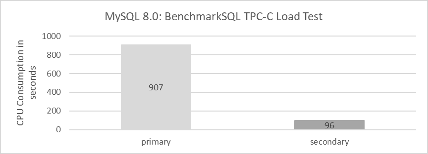

图 10-2\. 处理大事务时，二级 CPU 使用率远低于主级。

从图中可以看出，MySQL 主库的 CPU 消耗显著高于 MySQL 二级。这表明，对于数据加载，包括处理大事务，MySQL 二级表现出非常高的执行效率。相比之下，MySQL 主库处理大事务可能还有进一步的优化空间。

接下来，让我们检查 MySQL 主库加载 1000 个仓库 TPC-C 数据所需的时间。具体的统计结果如下图所示：

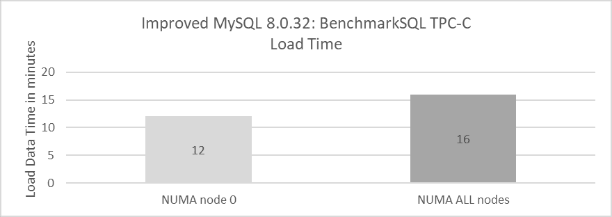

图 10-3\. 将 MySQL 主库绑定到单个 NUMA 节点可以提高 BenchmarkSQL 数据加载速度。

从图中可以推断，在 MySQL 主库处理大事务方面，提高 NUMA 兼容性有很大的潜力。

基于一系列比较测试，可以得出以下结论：

1.  MySQL 二级重放的效率显著高于 MySQL 主库在处理用户事务方面的效率。

1.  MySQL 主库在处理大型事务时显示 NUMA 兼容性问题。

### 10.1.4 MySQL 二级重放的理论最大重放速度

论文“Scalable Replay-Based Replication For Fast Databases”描述了重放屏障 [18]：

一个大挑战是，二级通过按顺序重放数据库日志来确保与主库的一致性。这种重放难以并行执行，因此二级性能可能不会随着主库性能而扩展。

MySQL 二级的事务重放过程包括两个主要阶段：

1.  **事务事件重放：** 这涉及到执行从主库接收到的交易事件。

1.  **提交：** 此阶段通过提交更改来完成交易。

请参考下图的更多详细信息。

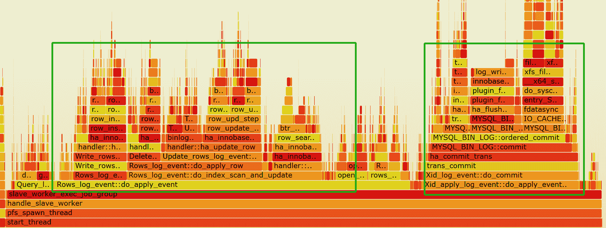

图 10-4\. MySQL 二级上的事务重放过程。

为了确保读一致性，MySQL 二级上的提交操作必须按顺序执行至关重要。具体来说：

+   **并行重放：** 如果事务之间没有冲突，可以并行重放并发事务。

+   **顺序提交：** 在提交阶段，事务必须按照它们最初执行的顺序进行提交。

在性能方面，MySQL 二级重放的队列模型可以简化如下图所示。

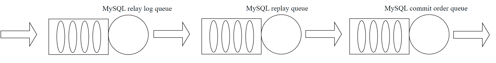

图 10-5\. MySQL 二级重放的队列模型。

在 MySQL 二级重放中，多队列阶段——例如，用于中继日志刷新、事务事件重放（包括读取、解析和排队事件）以及提交操作——限制了理论上的最大重放速度。这些序列化过程在重放可以进行的速度上创建了固有的限制。

## 10.2 慢速 MySQL 重放的根本原因分析

### 10.2.1 MySQL 二级重放的队列模型

在此进一步细化 MySQL 二级重放的队列模型，如下所示：

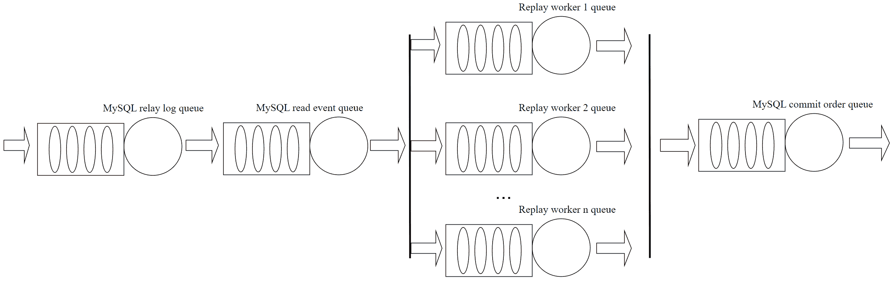

图 10-6\. MySQL 二级重放的更详细队列模型。

MySQL 二级重放采用一个分阶段模型，其中不同的处理阶段通过队列相互连接。此模型在异步复制、半同步复制和组复制中一致使用。

初始时，MySQL 二级将接收到的交易事件写入中继日志。然后 SQL 线程从中继日志读取这些事件并将它们分配到各自的工人队列中。

为什么这些写入和读取中继日志事件的流程是必要的，而不是跳过它们？如果 MySQL 从节点无法跟上重放事件，队列中的不平衡会导致队列大小增大。在磁盘上使用中继日志事件利用文件作为队列，避免了内存队列可能出现的内存不足（OOM）等问题。

SQL 线程的速度需要灵活；如果太慢，事件无法及时重放，如果太快，未重放的事务可能会在工作队列中积累，增加内存使用开销。因此，在需要时可能需要进行流量控制。

在工作队列中，MySQL 对队列大小施加限制，这不利于高效地重放大型事务。随着现代服务器内存容量的增加，将工作队列大小限制为 16,384 常常不足以满足重放需求。为了跟上 MySQL 主节点的速度，增加工作队列大小是必要的；否则，队列可能会迅速填满，导致 SQL 线程不必要的等待。

在 MySQL 从节点重放期间的提交操作方面，根据进入中继日志的顺序进行提交为一致读操作奠定了基础。这从根本上将 MySQL 从节点重放与在 MySQL 主节点上执行用户 SQL 区分开来：主服务器需要解析 SQL、生成执行计划，并处理一系列读写操作，这会产生显著的 CPU 开销，但不受上述队列模型的约束。相比之下，MySQL 从节点重放只需要根据事务事件进行重放，从而产生较低的 CPU 开销，但它受到上述描述的队列模型施加的约束。

### 10.2.2 瓶颈分析

在 MySQL 异步复制中，从节点有两个线程：IO 线程从主节点读取日志条目并将其存储在本地磁盘上，而 SQL 线程从本地磁盘读取日志并重放事件。单个线程顺序解析和执行日志事件。当解析行事件时，它包括操作类型和行图像，这些作为原始字节存储。SQL 线程必须“解包”这些字节到字段，在执行操作之前需要了解表模式。这种在将事件发送到多个线程进行重放之前对日志事件的解包和检查是昂贵的，如果由单个线程处理可能会成为瓶颈 [18]。具体来说，解包行图像消耗了 SQL 线程大量的 CPU 资源，严重限制了 MySQL 从节点重放性能。

例如，在组复制从节点重放过程中，捕捉到的主要瓶颈之一是 SQL 线程，具体体现在图下所示的 *rpl_rca_sql-0* 线程中。

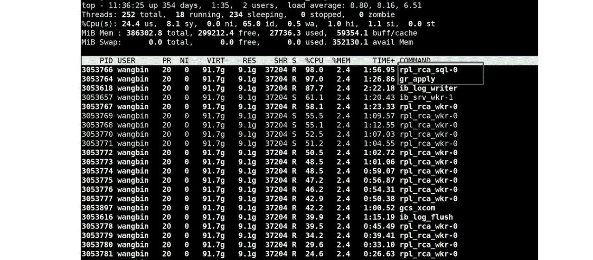

图 10-7\. 组复制从节点重放中 CPU 消耗最多的前两个线程。

捕获 SQL 线程的性能数据并生成火焰图可以提供有关 CPU 资源消耗位置的见解。请参阅下面的图表以获取详细信息。

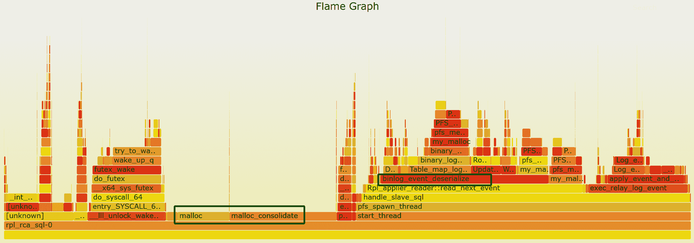

图 10-8\. 火焰图中识别到的 SQL 线程瓶颈。

从图中可以观察到，SQL 线程遇到了两个主要瓶颈。一个显著的瓶颈是在事件解析过程中（如图中 *binlog_event_deserialize* 函数所示），另一个主要瓶颈是在 *malloc* 调用中。

在切换到 jemalloc 4.5 作为内存分配工具后，不仅 MySQL 的二级重放速度提高了，而且 SQL 线程本身的 CPU 开销也降低了。请参阅下面的图表以获取详细信息。

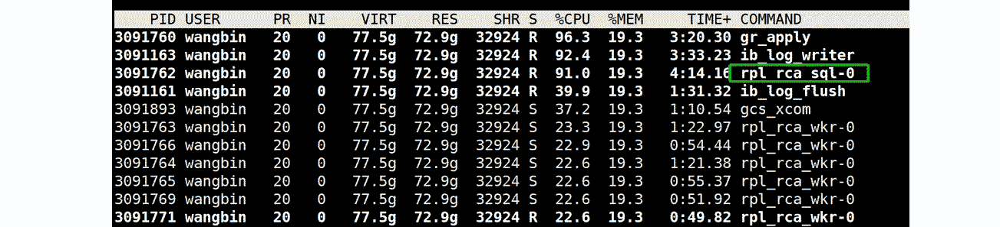

图 10-9\. 改进 jemalloc 后 SQL 线程的 CPU 开销降低。

继续查看下面的新火焰图，可以看出 SQL 线程在内存分配方面的开销显著减少。

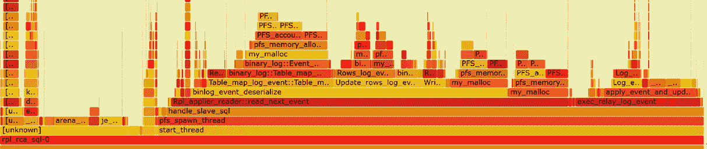

图 10-10\. 解决了 SQL 线程的内存瓶颈。

从图中可以看出，*binlog_event_deserialize* 占据了大约 45% 的工作量。事件解析的速度直接影响最大重放速度。为了解决这个瓶颈，可以在多个线程上并行化事件解析，这可能会显著提高性能。

一旦解决了 *binlog_event_deserialize* 瓶颈，下一步就是确定其他可能影响重放速度的潜在瓶颈。审查工作队列的相关源代码显示，其大小限制为 16,384。

```cpp
/*
  MTS load-balancing parameter.
  Max length of one MTS Worker queue. The value also determines the size
  of Relay_log_info::gaq (see @c slave_start_workers()).
  It can be set to any value in [1, ULONG_MAX - 1] range.
*/
const ulong mts_slave_worker_queue_len_max = 16384; 
```

很明显，工作队列可以容纳最多 16,384 个事件。虽然这个容量通常足以满足标准事务量，但对于更大的事务来说就不够了。广泛的测试表明，这个限制显著限制了重放速度，尤其是在像加载 TPC-C 仓库数据这样的任务中。以下代码演示了当工作队列满时，会阻塞 SQL 线程的执行。

```cpp
 // possible WQ overfill
  while (worker->running_status == Slave_worker::RUNNING && !thd->killed &&
         (ret = worker->jobs.en_queue(job_item)) ==
             Slave_jobs_queue::error_result) {
    thd->ENTER_COND(&worker->jobs_cond, &worker->jobs_lock,
                    &stage_replica_waiting_worker_queue, &old_stage);
    worker->jobs.overfill = true;
    worker->jobs.waited_overfill++;
    rli->mts_wq_overfill_cnt++;
    // wait if worker queue is full
    mysql_cond_wait(&worker->jobs_cond, &worker->jobs_lock);
    mysql_mutex_unlock(&worker->jobs_lock);
    thd->EXIT_COND(&old_stage);
    mysql_mutex_lock(&worker->jobs_lock);
  } 
```

大事务可以迅速填满工作队列，导致 SQL 线程保持空闲，错失分配其他事务的机会。

不仅当工作队列满时 SQL 线程会阻塞，如果待重放的事务依赖于尚未完成重放的前一个事务，它也会等待。有关详细信息，请参阅以下具体代码：

```cpp
bool Mts_submode_logical_clock::wait_for_last_committed_trx(
    Relay_log_info *rli, longlong last_committed_arg) {
  THD *thd = rli->info_thd;
  ...
  if ((!rli->info_thd->killed && !is_error) &&
      !clock_leq(last_committed_arg, get_lwm_timestamp(rli, true))) {
    PSI_stage_info old_stage;
    struct timespec ts[2];
    set_timespec_nsec(&ts[0], 0);
    assert(rli->gaq->get_length() >= 2);  // there's someone to wait
    thd->ENTER_COND(&rli->logical_clock_cond, &rli->mts_gaq_LOCK,
                    &stage_worker_waiting_for_commit_parent, &old_stage);
    do {
      // wait if LWM is less than last committed
      mysql_cond_wait(&rli->logical_clock_cond, &rli->mts_gaq_LOCK);
    } while ((!rli->info_thd->killed && !is_error) &&
             !clock_leq(last_committed_arg, estimate_lwm_timestamp()));
    min_waited_timestamp.store(SEQ_UNINIT);  // reset waiting flag
    mysql_mutex_unlock(&rli->mts_gaq_LOCK);
    thd->EXIT_COND(&old_stage);
    set_timespec_nsec(&ts[1], 0);
    rli->mts_total_wait_overlap += diff_timespec(&ts[1], &ts[0]);
  } else {
    min_waited_timestamp.store(SEQ_UNINIT);
    mysql_mutex_unlock(&rli->mts_gaq_LOCK);
  }
  return rli->info_thd->killed || is_error;
} 
```

代码描述了一种机制，即如果记录的低水位标记（LWM）——表示事务及其所有先前事务都已提交——小于正在重放的事务的最后一个提交值，则 SQL 线程会等待。在 MySQL 中，等待的是 SQL 线程，而不是工作线程。这种等待机制显著限制了重放速度。

最后，让我们检查 NUMA 环境中与 MySQL 次要重放相关的问题。以下图表显示了 MySQL 次要重放的测试结果：

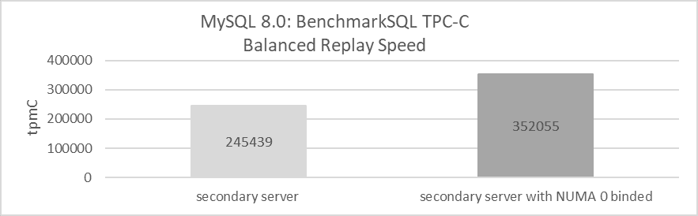

图 10-11\. 将 MySQL 次要绑定到单个 NUMA 节点可以提高重放速度。

利用所有 NUMA 节点实现约 245,000 tpmC 的平衡重放速度。这意味着如果 MySQL 主机的吞吐量超过此值，MySQL 次要通常无法跟上。

相比之下，当 MySQL 次要绑定到 NUMA 节点 0 时，平衡的重放速度增加到 352,000 tpmC，提高了 43.7%。这种改进归因于 MySQL 次要重放期间观察到的显著全局闩锁竞争。在 NUMA 环境中，这种竞争导致不同 NUMA 节点之间频繁的缓存迁移，降低重放效率。将 MySQL 次要绑定到 NUMA 节点 0 通过避免 NUMA 节点之间的缓存迁移来减轻这种低效，从而实现显著的性能提升。

## 10.3 MySQL 次要重放优化

### 10.3.1 事务事件解析的并行化

在这里，实现了分割 SQL 线程的新模型。

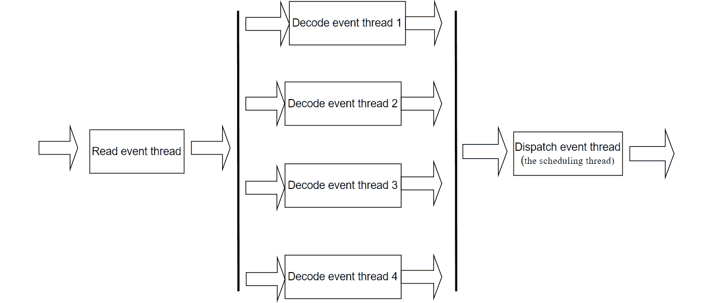

图 10-12\. 分割 SQL 线程的新模型。

在 MySQL 中，用于次要重放的 SQL 线程被分为六个线程：一个用于读取事件，四个用于解码事件，一个用于处理调度（调度线程）。这些线程通过队列连接。当队列大小变得过大时，为了管理过度的内存使用，会对事件读取线程应用流量控制。

下面是 MySQL 次要运行进程的 *‘top’* 截图。

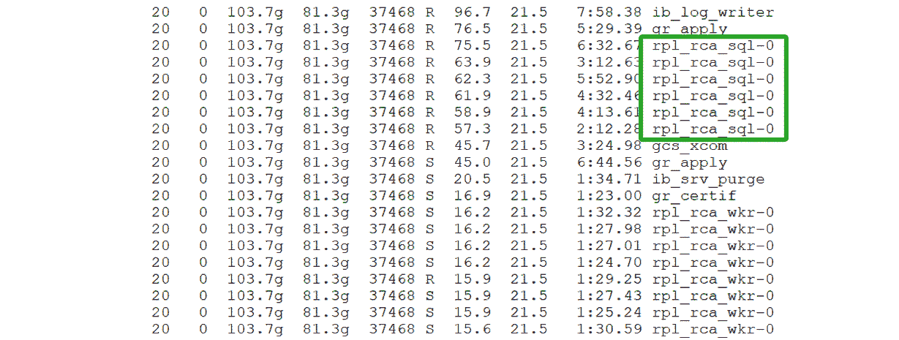

图 10-13\. 在 *‘top’* 显示中，SQL 线程表现为六个独立的线程。

通过分割 SQL 线程，解决了单个线程处理能力有限的问题，有效地消除了事件解析的瓶颈。

### 10.3.2 改进大型事务的并行重放

对于大型事务重放，主要问题在于工作队列太小，导致 SQL 线程频繁等待。

为了解决这个问题，可以将队列大小设置得更大，如下面的代码所示。

```cpp
/*
  MTS load-ballancing parameter.
  Max length of one MTS Worker queue. The value also determines the size
  of Relay_log_info::gaq (see @c slave_start_workers()).
  It can be set to any value in [1, ULONG_MAX - 1] range.
*/
const ulong mts_slave_worker_queue_len_max = 16384 << 6; 
```

将工作队列大小增加到 64 倍至 1,048,576 个事务事件，可以容纳具有许多事件的较大事务，使 MySQL 次要能够充分利用其重放这些大型事务的能力。然而，这种增加可能会引起对内存使用的担忧。以下图表显示了具有不同工作队列大小和不同工作者数量的 MySQL 次要进程的内存消耗。横坐标表示工作者的数量，纵坐标显示 MySQL 次要进程的实际内存使用量。

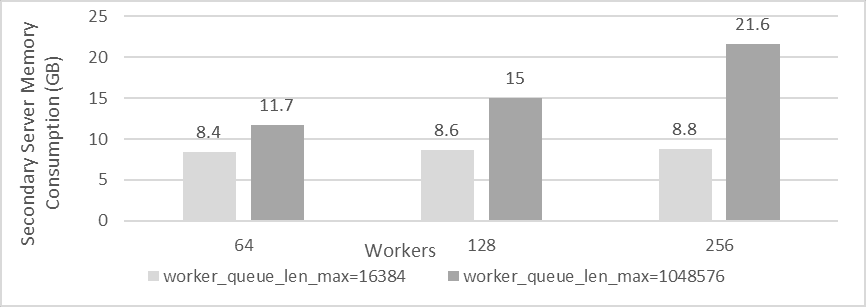

图 10-14\. 不同工作队列大小和不同工作线程数量的 MySQL 从库进程内存消耗。

从图中可以看出，MySQL 从库的实际内存消耗受 *worker_queue_len_max* 和工作线程数量的影响。在高性能机器上，额外的内存使用可能不是主要问题。然而，在低端机器上，减少工作线程数量可以帮助更有效地管理内存消耗。请注意，不同的硬件和软件系统可能会产生不同的结果，因此上述数据仅供参考。具体环境应进行定制测试。

目前，MySQL 没有提供配置选项来调整 *worker_queue_len_max* 参数。尽管如此，在高性能机器上，此参数在提高大事务重放速度方面起着至关重要的作用。

### 10.3.3 优化调度线程机制

如果两个在时间上接近的事务在 MySQL 中修改相同的数据，它们在从库重放过程中可能会创建依赖关系。具体来说，后一个事务的 *last_committed* 值可能与前一个事务的 *sequence_number* 相匹配。在 MySQL 从库重放过程中，如果后续事务依赖于尚未完成重放的前一个事务，调度线程将阻塞自身。这种方法效率低下，因为理想情况下应该由工作线程处理此类等待，而不是调度线程。调度线程本身还有许多其他任务要处理，而且无法保证后续事务不能及时重放。

为了更好地理解这个问题，考虑以下情况：


图 10-15\. *sequence_number* 和 *last_committed* 的典型示例。

假设 MySQL 从库已完成事务 12756（*LWM*=12756），当调度线程调度事务 12759（如图中绿色方框所示）时，它发现依赖事务 12757 尚未完成重放。因此，调度线程会阻塞自身，直到事务 12757 完成。同时，事务 12760、12761、12762、12763 和 12764 可以分配给工作线程进行重放。等待事务 12757 的过程可以通过工作线程重放线程来处理，从而允许调度线程继续执行其他任务。这为优化提供了机会。

下图展示了使用 BenchmarkSQL 在不同并发级别下进行的 TPC-C 测试，以评估 MySQL 从库是否能够匹配 MySQL 主库的速度。横坐标表示并发级别，纵坐标显示 tpmC 值。浅灰色区域表示 MySQL 从库与 MySQL 主库保持同步，而深灰色区域表示没有。

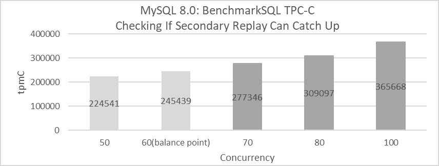

图 10-16\. 如果 MySQL 主库的处理速度超过平衡回放速度，从库可能无法跟上。

从图中可以看出，当并发性达到 70 时，MySQL 从库的处理速度落后于 MySQL 主库。这种低效主要由于调度线程不必要的等待，这干扰了正常的回放过程。只要吞吐量低于 245,439 tpmC，MySQL 从库就能与主库保持同步。然而，一旦超过这个阈值，MySQL 从库就难以匹配主库的速度。本质上，MySQL 从库回放无法有效地支持高吞吐量。

为了解决这个问题，允许工作者独立处理 **last_committed** 事务的等待，可以完全缓解调度线程的压力。这种调整为未来 MySQL 从库回放性能的改进提供了坚实的基础。

### 10.3.4 内存分配工具对回放性能的影响

利用高级内存分配工具可以提高 MySQL 从库的回放速度。以下图示展示了在 x86 架构下，两个 jemalloc 版本对 MySQL 从库回放性能的影响。


图 10-17\. 使用 jemalloc 4.5 实现更好的回放速度。

从图中可以看出，使用 jemalloc 4.5 显著提高了 MySQL 从库的回放速度。在相同条件下，jemalloc 3.6 的平衡回放速度仅为 710,000 tpmC，而 jemalloc 4.5 达到 810,000 tpmC，性能提升了 14%。

### 10.3.5 解决 NUMA 环境中的不友好问题

在 BIOS 级别禁用 NUMA 的场景下，评估 MySQL 从库回放过程的效率。请参考以下图示的详细信息。

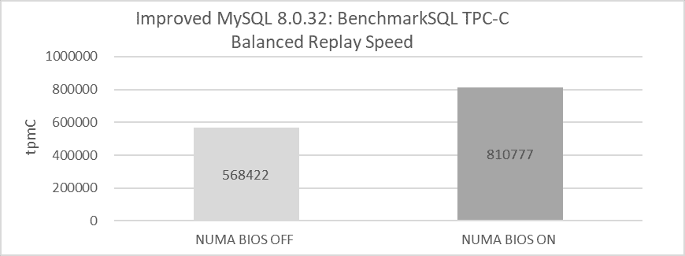

图 10-18\. 在 BIOS 中禁用 NUMA 前后的平衡回放速度比较。

在 BIOS 中禁用 NUMA 导致回放速度显著下降。虽然这种变化影响了内存分配方法，但它并没有改变底层 NUMA 硬件架构。

是否禁用 NUMA 的决定应基于全面的分析。在 x86 架构上的测试表明，禁用 NUMA 对 MySQL 从库的回放有负面影响，但可能对 MySQL 主库操作有益。进一步调查 NUMA 与 MySQL 从库回放的不兼容性可能会揭示 MySQL 本身更深层次的问题。

基于 MySQL 的性能架构，收集了闩锁操作的统计数据。请参见以下图示：

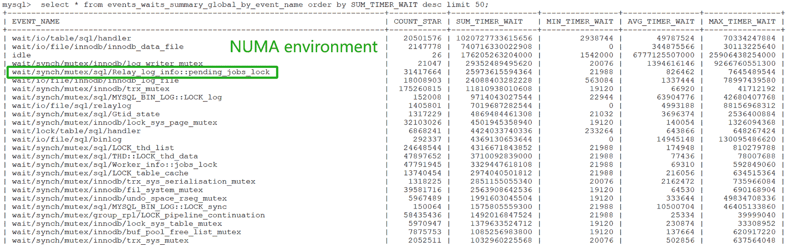

图 10-19\. 在性能架构中暴露了 pending_jobs_lock 的瓶颈。

从图中可以看出，在 NUMA 环境中，*Relay_log_info::pending_jobs_lock* 在重放相关的重要性排名第五。将 MySQL 辅助数据库实例绑定到 NUMA 节点 0，测试评估在 SMP 环境下性能模式统计是否发生变化。具体的测试结果如下图所示：


图 10-20\. 在 SMP 环境中，pending_jobs_lock 的瓶颈已经缓解。

从图中可以看出，*Relay_log_info::pending_jobs_lock* 已移动到第八位，这表明在绑定到 NUMA 节点 0 的场景下，与 *Relay_log_info::pending_jobs_lock* 相关的竞争已经缓解。

在 MySQL 源代码中，与 *pending_jobs_lock* 相关的代码在两个地方频繁调用。第一次出现在 *remove_item_from_jobs* 函数中，如下代码片段所示：

```cpp
/**
  Remove a job item from the given workers job queue. It also updates related
  status.
  param[in] job_item The job item will be removed
  param[in] worker   The worker which job_item belongs to.
  param[in] rli      slave's relay log info object.
 */
static void remove_item_from_jobs(slave_job_item *job_item,
                                  Slave_worker *worker, Relay_log_info *rli) {
  Log_event *ev = job_item->data;
  mysql_mutex_lock(&worker->jobs_lock);
  worker->jobs.de_queue(job_item);
  /* possible overfill */
  if (worker->jobs.get_length() == worker->jobs.capacity - 1 &&
      worker->jobs.overfill == true) {
    worker->jobs.overfill = false;
    // todo: worker->hungry_cnt++;
    mysql_cond_signal(&worker->jobs_cond);
  }
  mysql_mutex_unlock(&worker->jobs_lock);
  /* statistics */
  const auto jobs_length = worker->jobs.get_length();
  /* todo: convert to rwlock/atomic write */
  mysql_mutex_lock(&rli->pending_jobs_lock);
  rli->pending_jobs--;
  rli->mts_pending_jobs_size -= ev->common_header->data_written;
  assert(rli->mts_pending_jobs_size < rli->mts_pending_jobs_size_max);
  ... 
```

另一个是在 **append_item_to_jobs** 函数中，如下代码片段所示：

```cpp
/**
   Coordinator enqueues a job item into a Worker private queue.
   @param job_item  a pointer to struct carrying a reference to an event
   @param worker    a pointer to the assigned Worker struct
   @param rli       a pointer to Relay_log_info of Coordinator
   @return false Success.
           true  Thread killed or worker stopped while waiting for
                 successful enqueue.
*/
bool append_item_to_jobs(slave_job_item *job_item, Slave_worker *worker,
                         Relay_log_info *rli) {
  THD *thd = rli->info_thd;
  size_t ret = Slave_jobs_queue::error_result;
  size_t ev_size = job_item->data->common_header->data_written;
  ulonglong new_pend_size;
  PSI_stage_info old_stage;
  assert(thd == current_thd);
  mysql_mutex_lock(&rli->pending_jobs_lock);
  new_pend_size = rli->mts_pending_jobs_size + ev_size;
  bool big_event = (ev_size > rli->mts_pending_jobs_size_max);
  ... 
```

*remove_item_from_jobs* 和 *append_item_to_jobs* 函数主要利用 *pending_jobs_lock* 锁来管理作业队列。由调度线程执行的 *append_item_to_jobs* 函数，每次事件发生时都会调用一次，将其入队到工作队列中。相比之下，由工作线程执行的 *remove_item_from_jobs*，每次事件移除时都会调用一次。

在高吞吐量场景中，调度线程频繁调用 *append_item_to_jobs* 来入队事件，而多个工作线程并发调用 *remove_item_from_jobs* 来出队事件。这导致显著的锁竞争，因为这两个函数都涉及获取和释放锁。当事件处理速率达到每秒数百万次时，调度线程和工作线程之间的锁竞争可能会变得严重。

锁的频繁获取和释放会导致上下文切换。在 NUMA 环境中，这些上下文切换会导致 NUMA 节点之间的缓存迁移，从而降低重放效率。

在解决与 *pending_jobs_lock* 相关的锁瓶颈并应用在线 MySQL 辅助数据库的配置参数后，重点转向评估在 BIOS 中禁用 NUMA 是否能提高 MySQL 辅助数据库的重放性能。以下图表比较了在不同 NUMA 配置下 MySQL 辅助数据库的平衡重放速度。


图 10-21\. 在 BIOS 中禁用 NUMA 通过解决 NUMA 不兼容瓶颈提高了 MySQL 辅助数据库的重放速度。

从图中可以看出，在解决 NUMA 不兼容瓶颈后，在 x86 架构的 BIOS 中禁用 NUMA 提高了 MySQL 辅助数据库的重放速度。

### 10.3.6 “Dual One” 对重放性能的影响

“双一”指的是 binlog 和 redo 日志的实时磁盘刷新，这是 MySQL 故障恢复的关键技术。测试表明，“双一”显著影响了 MySQL 从属的重放速度。以下图表显示，在相同条件下，禁用“双一”将平衡重放速度提高到 810,000 tpmC，而启用它则将重放速度降低到大约 700,000 tpmC。因此，禁用“双一”导致重放速度提高了 15.7%。

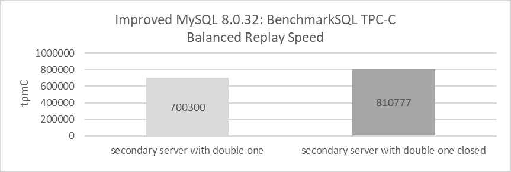

图 10-22\. 通过关闭“双一”实现更好的重放速度。

### 10.3.7 Binlog 行图像格式对重放性能的影响

理论上减小 binlog 的大小有助于提高 MySQL 的重放速度。以下图表显示了使用 *binlog_row_image=minimal* 和 *binlog_row_image=full* 在平衡重放速度方面的比较：

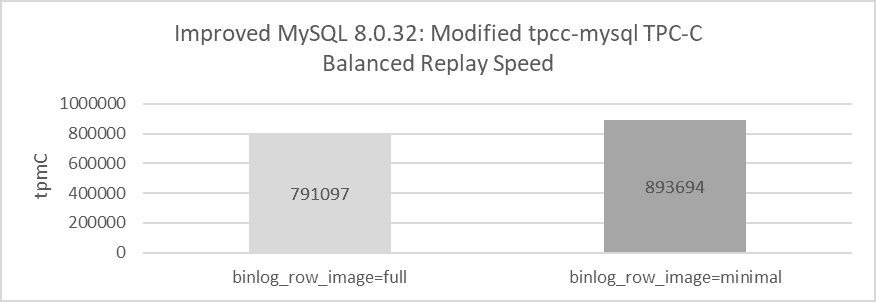

图 10-23\. 通过设置 binlog_row_image=minimal 实现更好的重放速度。

当使用 binlog 的完整模式时，MySQL 的平衡重放速度仅为略高于 790,000 tpmC。然而，切换到 minimal 模式后，这种速度增加到超过 890,000 tpmC，这代表了显著的 13% 的提升。这种提升突出了设置 *binlog_row_image=minimal*（这大大减小了 binlog 的大小）可以提升 MySQL 从属的重放速度。然而，需要注意的是，此设置在某些场景下可能也带来数据恢复不完整的风险。

### 10.3.8 性能模式对重放性能的影响

由于与大量内存的广泛交互，启用性能模式对 MySQL 从属的重放速度有显著影响。以下是启用性能模式后的火焰图。


图 10-24\. my_malloc 调用 PFS 相关函数产生的巨大开销。

从图表中可以看出，与 my_malloc 调用 PFS 相关函数相关的开销很大，并且分布在多个区域，突显了一个显著的瓶颈。广泛的测试结果表明，启用性能模式对 MySQL 从属重放的影响比 MySQL 主节点执行的影响要大得多。对于更详细的信息，请参阅第 11.5.5 节。

## 10.4 组复制中最大重放速度的探索

使用修改后的 tpcc-mysql，高吞吐量测试可以确定 Group Replication 从属何时落后于 MySQL 主节点。以下图表展示了详细的测试结果。测试设置包括：使用 jemalloc 4.5 禁用“双一”，在独立的机器上部署 MySQL 从属和主节点，将 binlog 行图像格式设置为 minimal，并运行 300 秒的测试。

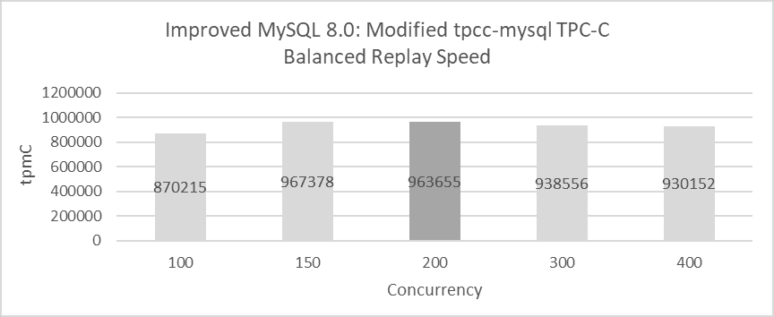

图 10-25. 组复制中的最大重放速度。

图表展示了 MySQL 主库在并发级别为 100、150、200、300 和 400 时的吞吐量。在图表中，浅灰色表示 MySQL 主库和从库同步速度，而深灰色则表示 MySQL 从库相对于 MySQL 主库存在轻微的延迟。除了在 200 并发的情况下观察到 2 秒的延迟外，MySQL 从库通常与主库保持同步。

值得注意的是，最大重放速度与并发性直接相关。在 150 并发时，吞吐量高，几乎无延迟，而在 200 并发时，吞吐量略有下降，存在 2 秒的延迟。

使用更好的硬件，最大重放速度的进一步改进可能成为可能，但测试结果已经非常接近可达到的最大值。

下一页
