# 第十一章：性能调优


> 原文：[`enhancedformysql.github.io/The-Art-of-Problem-Solving-in-Software-Engineering_How-to-Make-MySQL-Better/Chapter11.html`](https://enhancedformysql.github.io/The-Art-of-Problem-Solving-in-Software-Engineering_How-to-Make-MySQL-Better/Chapter11.html)

本章主要讨论在不修改 MySQL 源代码的情况下提高 MySQL 应用程序性能的方法。

## 11.1 PGO

基于配置文件优化的（PGO）通常可以提高程序执行效率。以下图表展示了在解决 MySQL MVCC ReadView 可伸缩性问题后，PGO 如何提高不同并发级别下独立 MySQL 实例的吞吐量。

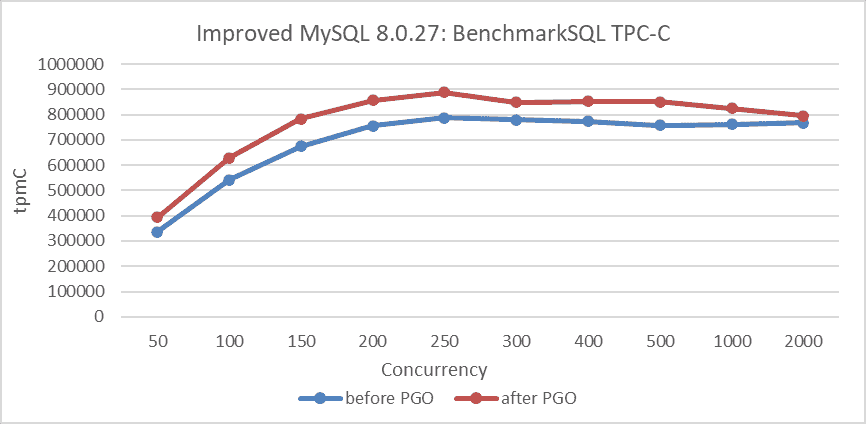

图 11-1\. 解决 MVCC ReadView 可伸缩性问题后 PGO 的影响。

从图中可以看出，PGO 具有显著的影响。

对于 MySQL 8.0.27 使用 PGO，在高并发条件下吞吐量会下降。具体细节如下图所示：


图 11-2\. 在 MySQL 8.0.27 中使用 PGO 前后的性能比较测试。

上述测试结果表明，为了充分发挥 PGO 对 MySQL 的改进作用，需要解决可伸缩性问题。需要注意的是，上述两种比较测试都是在主流 NUMA 环境中进行的。当 MySQL 绑定到单个 NUMA 节点时，创建 SMP 环境，以下图表显示了在 PGO 前后 TPC-C 吞吐量与并发级别之间的关系。

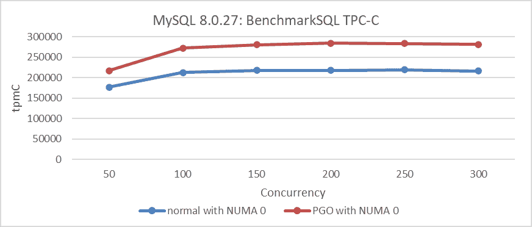

图 11-3\. 在 MySQL 8.0.27 下使用 PGO 前后的性能比较测试。

从图中可以看出，PGO 在 SMP 环境中持续提高吞吐量，并不会随着并发级别的增加而降低。以下图表比较了 NUMA 和 SMP 环境中 PGO 的性能提升。

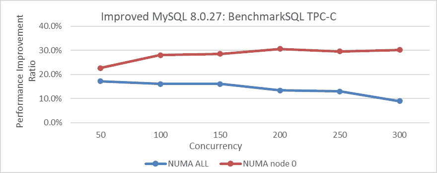

图 11-4\. 不同环境下 PGO 优化的性能。

从图中可以看出，PGO 在 SMP 环境中实现了高达 30%的最大性能提升，而在 NUMA 环境中，随着并发的增加，性能提升逐渐降低。这表明 PGO 在 SMP 环境中具有更大的潜力。

继续分析，比较了 PGO 在组复制集群环境与单个 MySQL 实例中的性能。以下图表展示了组复制的简化队列模型。

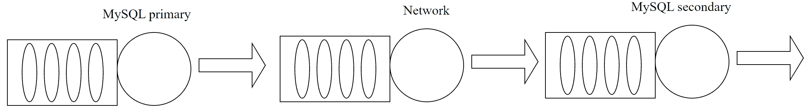

图 11-5\. 组复制简化队列模型。

由于网络部分不能通过 PGO 进行优化，MySQL 主实例相对于单个 MySQL 实例消耗的时间比例较低。根据 Amdahl 定律，PGO 带来的性能提升将比独立 MySQL 实例的提升不那么明显。一般来说，随着网络延迟的增加，PGO 的改进效果往往会减弱。

下图比较了使用 PGO 的独立 MySQL 实例和组复制的吞吐量提升。

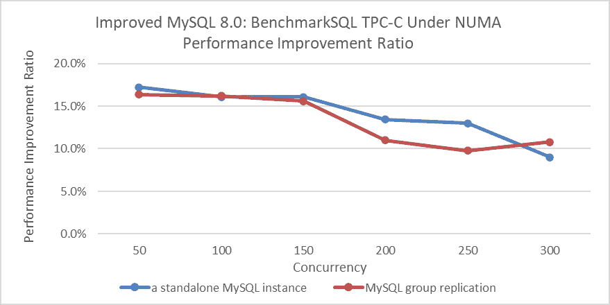

图 11-6\. 组复制与独立 MySQL 的 PGO 性能提升。

从图中可以看出，在组复制集群环境中，PGO 带来的性能提升通常低于独立 MySQL 实例。

总之，PGO 可以总结如下：

1.  对于 MySQL，PGO 是一种值得优化的方法，理论上可以全面提高性能，尤其是在 SMP 环境中。

1.  在 NUMA 环境中，解决可伸缩性问题对于从 PGO 中获得显著效益是必要的。

1.  相比于独立 MySQL 实例，PGO 在组复制集群中的效果较差。

## 11.2 最小化网络交互

为了在不影响 TPC-C 测试正确性的情况下提高 MySQL 应用程序性能，修改 SQL 交互方法以减少客户端和 MySQL 之间的网络交互次数。这种优化间接提高了性能。

以下示例使用优化的 tpcc-mysql 测试工具，在特定的软件和硬件条件下确定组复制支持的最大吞吐量。

```cpp
 [warehouse]: 200
[connection]: 200
    [rampup]: 0 (sec.)
   [measure]: 60 (sec.)
RAMP-UP TIME.(0 sec.)
MEASURING START.
  10, trx: 179372, 95%: 7.134, 99%: 9.097, max_rt: 16.857, 178944|16.256, 17941|5.395, 17932|25.313, 17943|14.180
  20, trx: 181215, 95%: 7.216, 99%: 9.228, max_rt: 20.587, 180703|433.405, 18123|4.086, 18122|29.192, 18124|4.922
  30, trx: 180596, 95%: 7.410, 99%: 9.463, max_rt: 16.930, 180110|16.705, 18061|3.146, 18056|25.658, 18060|7.392
  40, trx: 179032, 95%: 7.594, 99%: 10.575, max_rt: 18.047, 178513|16.862, 17906|3.861, 17900|27.482, 17904|5.724
  50, trx: 173856, 95%: 8.199, 99%: 12.705, max_rt: 31.777, 173412|30.990, 17388|9.501, 17388|37.472, 17385|5.538
  60, trx: 171950, 95%: 8.499, 99%: 13.721, max_rt: 31.584, 171546|31.808, 17200|9.185, 17188|35.098, 17202|13.781
STOPPING THREADS........................................................................................................................................................................................................
<Raw Results>
  [0] sc:481189 lt:584832  rt:0  fl:0 avg_rt: 5.3 (5)
  [1] sc:915412 lt:147816  rt:0  fl:0 avg_rt: 4.4 (5)
  [2] sc:106614 lt:5  rt:0  fl:0 avg_rt: 0.8 (5)
  [3] sc:106586 lt:0  rt:0  fl:0 avg_rt: 11.9 (80)
  [4] sc:106619 lt:0  rt:0  fl:0 avg_rt: 2.1 (20)
 in 60 sec.
<Raw Results2(sum ver.)>
  [0] sc:481239  lt:585014  rt:0  fl:0 
  [1] sc:918008  lt:148245  rt:0  fl:0 
  [2] sc:106622  lt:5  rt:0  fl:0 
  [3] sc:106622  lt:0  rt:0  fl:0 
  [4] sc:106628  lt:0  rt:0  fl:0 
<Constraint Check> (all must be [OK])
 [transaction percentage]
        Payment: 43.41% (>=43.0%) [OK]
   Order-Status: 4.35% (>= 4.0%) [OK]
       Delivery: 4.35% (>= 4.0%) [OK]
    Stock-Level: 4.35% (>= 4.0%) [OK]
 [response time (at least 90% passed)]
      New-Order: 45.14%  [NG] *
        Payment: 86.10%  [NG] *
   Order-Status: 100.00%  [OK]
       Delivery: 100.00%  [OK]
    Stock-Level: 100.00%  [OK]
<TpmC>
                 1066021.000 TpmC 
```

数据表明，在给定的软件和硬件测试环境中，组复制实现了 106.6 万 tpmC 的峰值吞吐量，创下了新纪录。

这表明在应用程序开发期间减少与 MySQL 的网络交互次数可以显著提高性能。

## 11.3 利用高级内存分配工具

MySQL 默认使用 jemalloc 内存分配工具，具体版本为 3.6。测试数据表明 jemalloc 3.6 在性能上并非最佳。以下图显示了 jemalloc 4.5 与 jemalloc 3.6 在 x86 架构上的吞吐量提升。

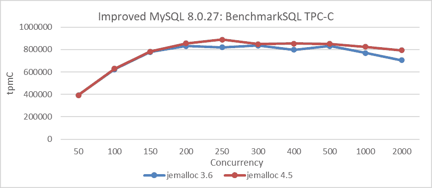

图 11-7\. jemalloc 4.5 在性能上优于 jemalloc 3.6。

从图中可以看出，jemalloc 4.5 在性能上优于 jemalloc 3.6。

对于 MySQL 次级回放，请参考以下图：

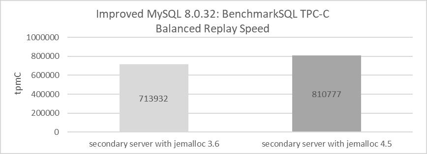

图 11-8\. 使用 jemalloc 4.5 实现更好的回放速度。

使用优化后的 MySQL 回放进行的测试显示了 jemalloc 3.6 和 jemalloc 4.5 之间的显著差异。该图说明了 jemalloc 4.5 在平衡回放速度方面的显著提升。

一个有效的内存分配工具不仅可以提高 MySQL 主服务器的性能，还可以提高 MySQL 从属服务器的重放速度。

## 11.4 索引与性能

4.10.6 节提供了关于此主题的详细信息。

## 11.5 影响性能的关键 MySQL 参数

数据库具有许多可调整的系统参数，这些参数控制着诸如内存分配、I/O 管理和日志记录等关键方面。这些参数的影响可能因配置而异，从显著到最小效果不等。这种可变性是由于影响 MySQL 性能的众多因素造成的，这使得预测性能结果变得复杂。然而，可以确定导致异常吞吐量的特定因素。以下各节详细介绍了影响性能的常用参数。

### 11.5.1 “双一”对性能的影响

“双一”配置参数包括两个参数：*sync_binlog* 和 *innodb_flush_log_at_trx_commit*。

*sync_binlog* 参数描述如下：

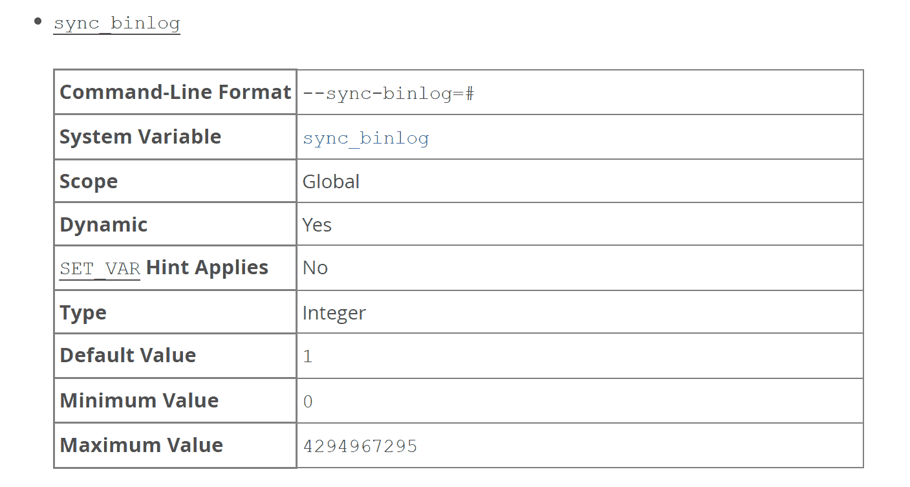

以下配置控制 MySQL 服务器将二进制日志同步到磁盘的频率。

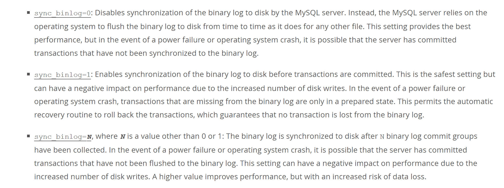

*innodb_flush_log_at_trx_commit* 参数描述如下：

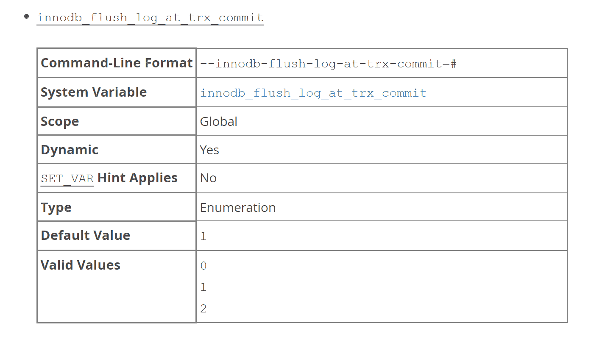

以下配置在保持提交操作的严格 ACID 兼容性的同时，通过重新排列和批量处理与提交相关的 I/O 操作，实现了更高的性能。调整默认值可以提高性能，但在崩溃事件中可能会导致事务丢失。

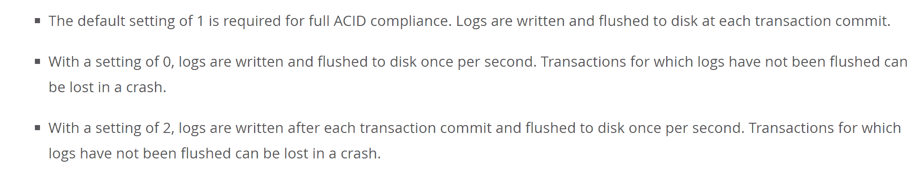

需要注意的是，随着 MySQL 8.0 的可扩展性改进和重做日志处理的优化，禁用“双一”设置对高并发测试场景中 MySQL 主服务器的吞吐量影响已经减弱。

首先进行了使用 MySQL 8.0.27 的比较测试。下图展示了启用和禁用“双一”时吞吐量和并发的关系。

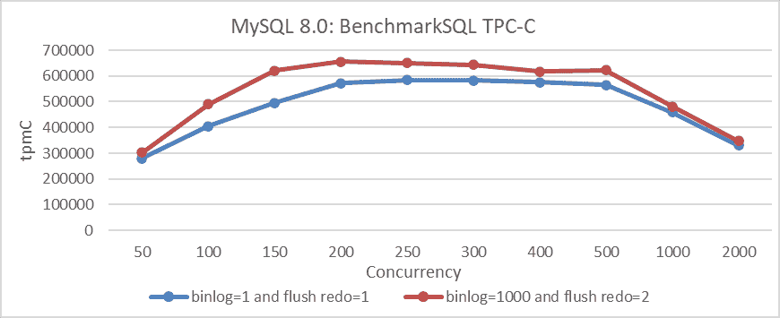

图 11-9\. 禁用“双一”后实现更好的性能。

根据图示，很明显，在 MySQL 8.0.27 中，禁用“双一”显著提高了吞吐量。然而，随着并发的增加，这种性能提升会减弱。

基于带有 PGO 改进的 MySQL 版本，禁用“双一”后的性能提升并不显著，如图下所示：

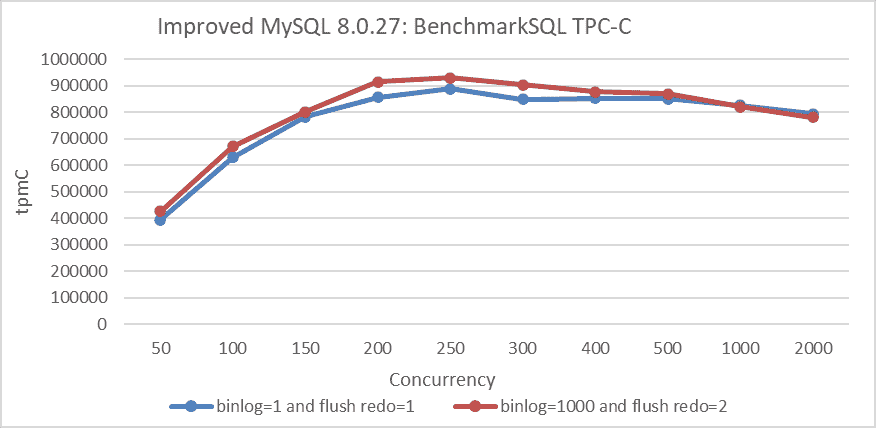

图 11-10\. 在解决 MySQL 的可扩展性瓶颈后，禁用“双一”后性能提升较少。

还可以观察到，性能改进的程度随着吞吐量的变化而变化，并不恒定。随着 MySQL 可扩展性瓶颈的解决，‘双重一’的影响减小。

由于存在如**replica_preserve_commit_order**队列等机制，‘双重一’对 MySQL 从库回放的影响更为明显。下图使用优化后的 MySQL 版本比较了禁用‘双重一’前后 MySQL 从库的平衡回放速度。

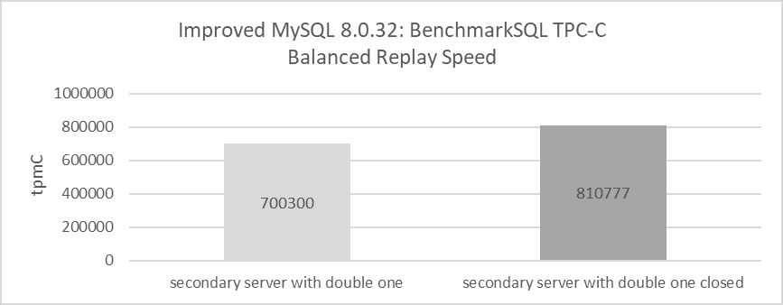

图 11-11\. 关闭“双重一”以实现更好的回放速度。

在等效条件下，禁用“双重一”实现了 MySQL 从库的平衡回放速度为 810,000 tpmC，而启用“双重一”将此速度降低到大约 700,000 tpmC。因此，禁用“双重一”显著提高了 MySQL 从库的回放速度。

注意，上述测试结果是在高性能 SSD 环境中获得的，SSD 硬件性能的差异可能导致结果不同。

### 11.5.2 禁用 binlog 的性能影响

当启用二进制日志时，服务器将所有修改数据的语句记录到二进制日志中，该日志用于备份和复制目的。理论上，禁用 binlog 可以消除队列等待时间，从而提高吞吐量和减少响应时间。

下图使用 BenchmarkSQL 比较了禁用 binlog 前后在相同并发级别下的 TPC-C 吞吐量。

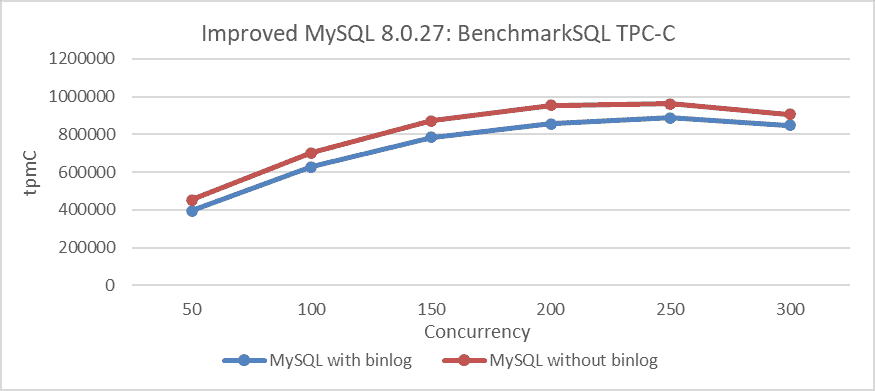

图 11-12\. 禁用 binlog 以实现更好的性能

从图中可以看出，禁用 binlog 对性能有显著影响。

### 11.5.3 理解自旋延迟参数对性能的影响

当锁不可用时，竞争线程必须等待。存在几种等待策略，其中无界自旋（或忙等待）是最简单的。在这种方法中，线程会反复检查一个内存位置，直到其值发生变化。这种方法会消耗资源，并可能导致在线程数量多于 CPU 数量的过载系统中出现抢占 [3]。

**自旋的优势：**

+   在无负载系统中，自旋以最小的开销提供高性能，因为它避免了操作系统协调，并且每次锁传递仅产生几个缓存未命中延迟。在具有共享缓存的芯片多处理器上，锁获取和释放延迟可以低至 150 纳秒。

**自旋的缺点：**

+   当系统负载时，自旋会降低性能，因为它减少了可用于有用工作的处理器数量，当可运行线程超过硬件上下文时，会导致性能不佳。此外，由于自旋没有与操作系统协调，它没有在调度决策中考虑锁持有者或自旋者。

自旋延迟参数有助于解决 NUMA（非一致性内存访问）兼容性问题。通常，更好的 MySQL 可伸缩性会减少自旋延迟参数的影响。相反，在可伸缩性较差的情况下，自旋延迟参数会明显影响性能，尽管其有效性有上限。

基于带有锁-sys 优化的 MySQL 8.0.21 版本，以下图表比较了各种并发级别下的 TPC-C 吞吐量。

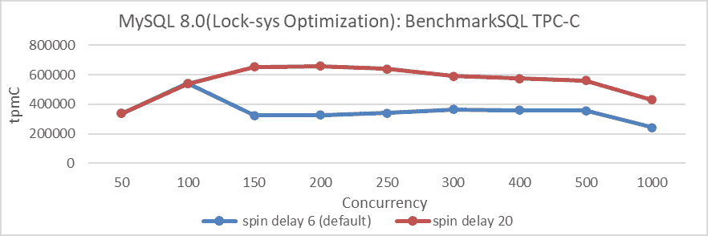

图 11-13\. 在 MySQL 8.0.21 中使用自旋延迟 20 实现更好的性能。

图表显示，设置 *spin_delay=20* 显著缓解了带有锁-sys 优化的 MySQL 8.0.21 的可伸缩性问题。然而，在高并发场景下，自旋延迟参数可能会显著增加 CPU 负担。根据论文“Locking Made Easy”，在低竞争情况下，简单的自旋锁非常高效，但可扩展性不佳 [63]。

在 MVCC ReadView 优化之前的 MySQL 版本中，对自旋延迟参数的进一步分析，以及使用 PGO 编译的详细信息，在下图中详细说明。

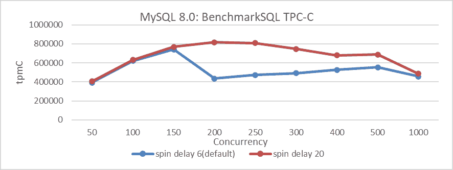

图 11-14\. 在 MVCC ReadView 优化之前使用自旋延迟 20 实现更好的性能。

从图表中可以看出，当默认的 *spin_delay* 参数设置为 6 时，吞吐量在 200 并发时急剧下降。然而，设置 *spin_delay=20* 导致吞吐量显著提高。

让我们继续进行 MVCC ReadView 优化，以进一步提高 MySQL 的可伸缩性。以下图表显示了 MVCC ReadView 优化与 *spin delay=20* 之间的吞吐量比较：

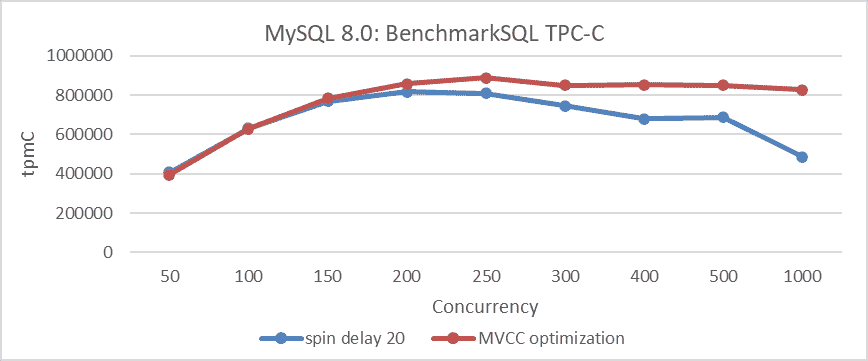

图 11-15\. MVCC ReadView 优化与自旋延迟 20 之间的吞吐量比较。

从图表中可以看出，虽然自旋延迟可以在一定程度上缓解可伸缩性问题，但其效果与采用 MVCC ReadView 优化的好处相比明显不那么显著。

在 MVCC ReadView 优化后，再次测试了 *spin_delay* 的影响。具体结果见下图：

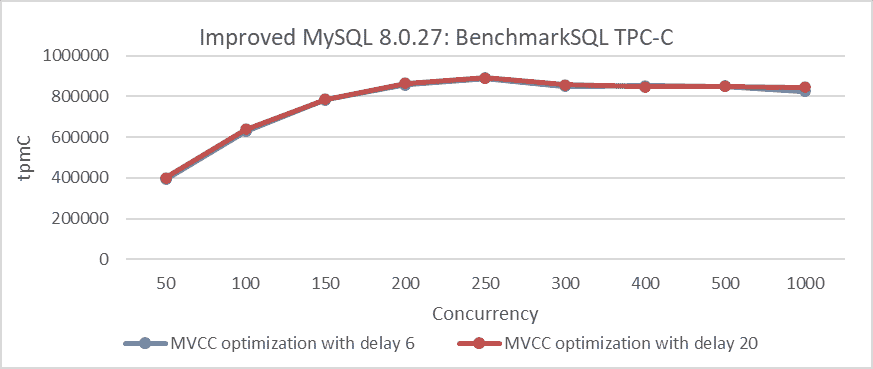

图 11-16\. 解决 MVCC ReadView 可伸缩性问题后，自旋延迟 20 无效。

图表显示，在解决 MVCC ReadView 可伸缩性问题后，*spin_delay* 参数的影响最小。

### 11.5.4 Binlog 提交顺序对性能的影响

下面简要介绍 *binlog_order_commits* 参数：

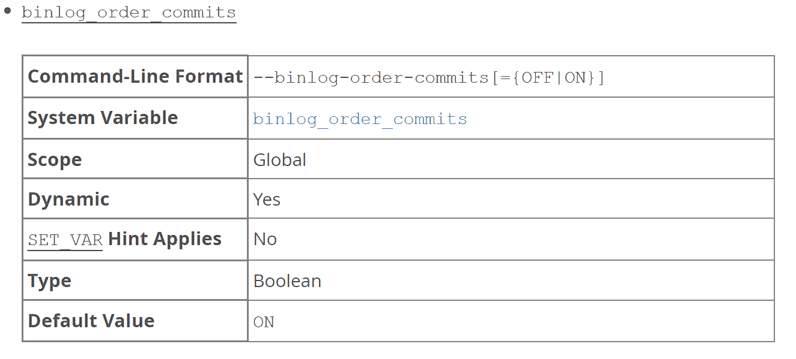

当此变量在复制源服务器上启用（默认）时，事务提交指令在单个线程上序列化，确保事务以与它们写入二进制日志相同的顺序提交。禁用此变量允许使用多个线程发布事务提交指令。与二进制日志分组提交结合使用，这可以防止单个事务的提交率成为吞吐量的瓶颈，因此可能产生性能提升 [13]。

基于 MySQL 8.0.27 版本，检查启用 *binlog_order_commit* 参数是否会影响 TPC-C 吞吐量。具体比较见下图的说明：

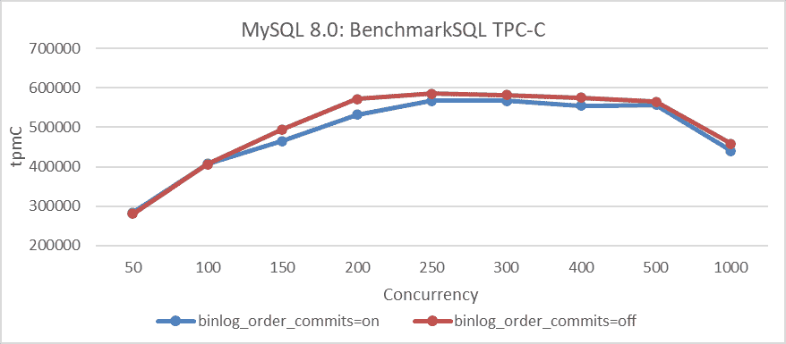

图 11-17\. 在 binlog 分组提交优化之前关闭 binlog_order_commits 以获得更好的性能。

从图中可以看出，禁用 *binlog_order_commits* 在不同的并发级别下导致 TPC-C 吞吐量有明显的提升。

下图基于改进的 MySQL 版本，使用 PGO 设置进行优化。禁用 *binlog_order_commits* 显示 TPC-C 吞吐量的提升并不明显。解决由 binlog 分组提交引起的雷鸣效应等问题，提高了 MySQL 的效率，并减轻了启用 *binlog_order_commits* 时观察到的性能下降。

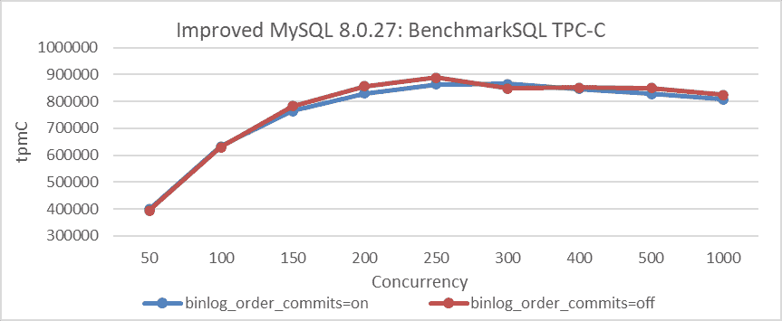

图 11-18\. 在 binlog 分组提交优化后，关闭 binlog_order_commits 后性能提升较少。

MySQL 默认启用 *binlog_order_commits*。值得注意的是，禁用 *binlog_order_commits* 将影响 MySQL 的克隆功能。

### 11.5.5 对性能模式性能的全面理解

性能模式通过进行实际测量而不是猜测来帮助 DBA 调整性能。不幸的是，在 NUMA 环境中，启用性能模式会影响 MySQL 的性能，特别是影响 MySQL 的二级重放。下图使用 BenchmarkSQL 分析了这种影响，比较了不同并发级别下的 TPC-C 吞吐量。

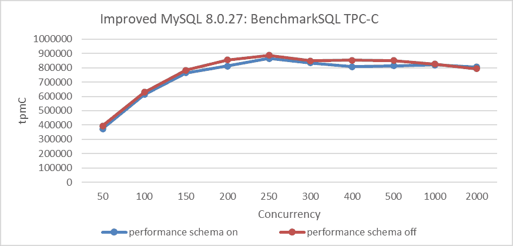

图 11-19\. 关闭 performance_schema 以获得更好的性能。

从图中可以看出，性能模式对 MySQL 的主性能影响相对较小，这通常是可以接受的。然而，启用性能模式显著影响了 MySQL 二级的重放速度。下图显示了启用性能模式后，组复制重放队列大小的变化。

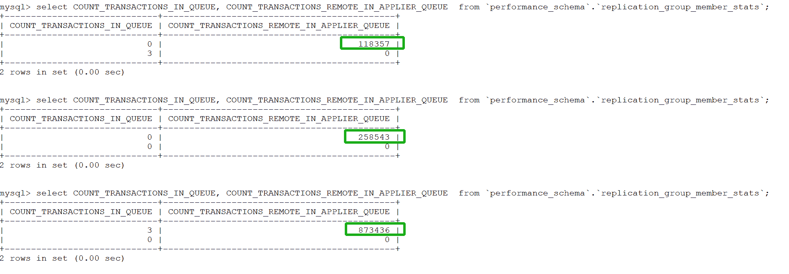

图 11-20\. 启用性能模式后，组复制中的重放队列大小增加。

从图中可以看出，回放队列大小在增加，这表明 MySQL 从机无法跟上 MySQL 主机的处理速度。在 MySQL 主机上执行后的吞吐量结果如下：

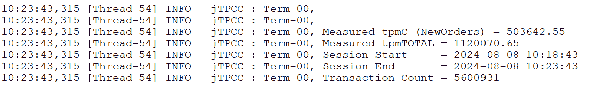

MySQL 主机完成执行后，以下是 MySQL 从机在回放过程中捕获的性能截图：

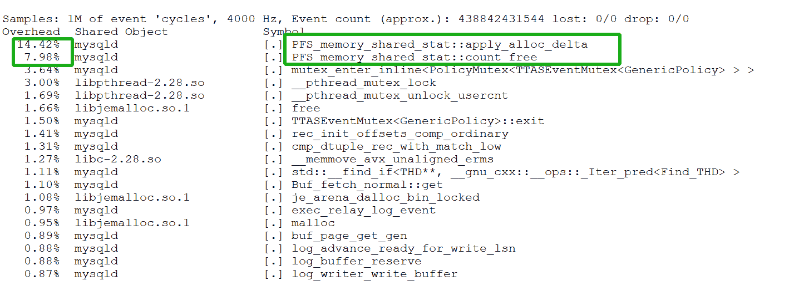

图 11-21。与性能模式相关的显著瓶颈。

从高亮的绿色框中可以看出，存在与性能模式相关的显著瓶颈。

总结上述测试结果：当 MySQL 主机达到 500,000 tpmC 的吞吐量时，启用性能模式的 MySQL 从机显示出明显的瓶颈。此外，MySQL 从机在回放过程中无法跟上 MySQL 主机的速度。

现在，禁用性能模式，进行相同的并发测试。具体结果见下图：

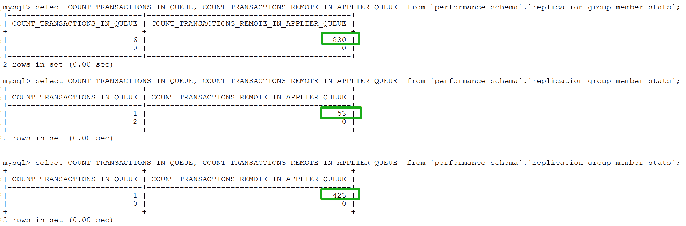

图 11-22。禁用性能模式后，组复制中的回放队列大小不会增加。

图表显示，等待回放的交易数量在时间上没有显著增加。MySQL 主机完成执行后的吞吐量结果如下：

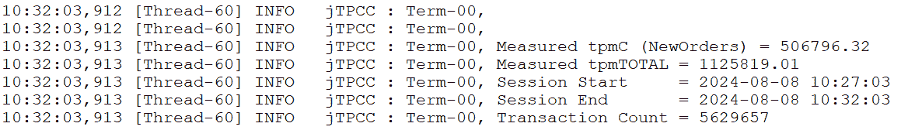

当 MySQL 主机测试完成时，MySQL 从机也几乎同时完成回放。这表明在主流 NUMA 环境中，性能模式对 MySQL 从机回放有极大的负面影响。性能模式与 NUMA 的兼容性问题尚未解决，并将成为未来优化的重点。

### 11.5.6 doublewrite 对性能的影响

这里简要介绍 *innodb_doublewrite* 参数：

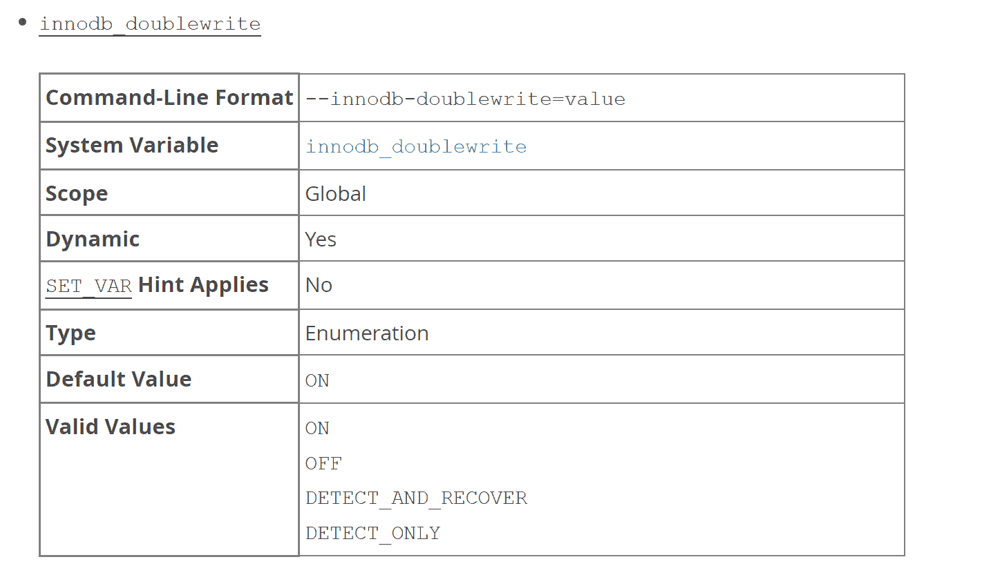

doublewrite 缓冲区是一个存储区域，InnoDB 在将页面提交到数据文件之前，会从缓冲池中将页面写入该区域。这种机制通过在出现故障时提供可靠的页面副本，确保在崩溃恢复期间的数据完整性。然而，由于默认的 InnoDB 页面大小为 16 KB，而文件系统只能保证最多 4 KB 的原子性，因此可能只有页面的一部分可以恢复。启用 doublewrite 有助于 InnoDB 通过写入两次来恢复整个页面。

使用改进的 MySQL 8.0.27 版本和 PGO 评估启用 doublewrite 对性能的影响。下图显示了在不同并发级别上禁用 doublewrite 对 TPC-C 吞吐量的影响。

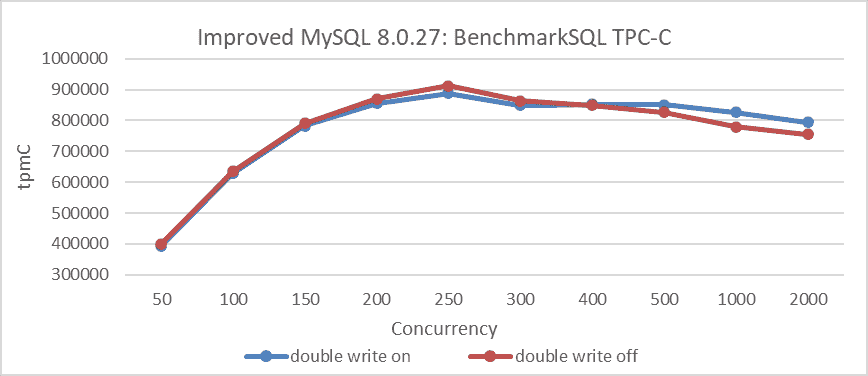

图 11-23。禁用 doublewrite 实现更高的峰值吞吐量。

从图中可以看出，禁用 doublewrite 参数可以提高峰值吞吐量。虽然广泛的测试和统计分析表明该参数对性能的整体影响有限，但它确实有助于提高峰值吞吐量。然而，禁用 doublewrite 可能会在数据库崩溃事件中危及恢复安全性，因此应谨慎使用。

### 11.5.7 Binlog 行图像格式对性能的影响

下面是对 *binlog_row_image* 参数的简要介绍：

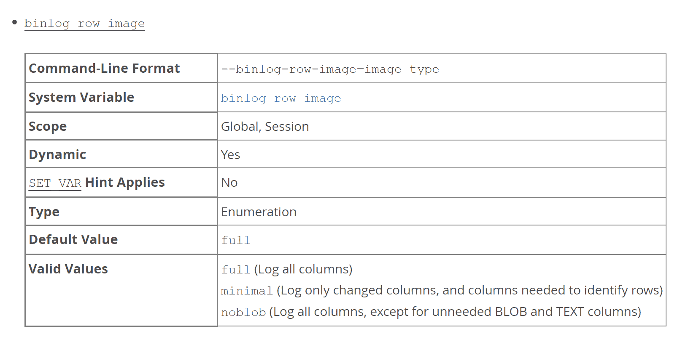

对于 MySQL 基于行的复制，此变量控制行图像在二进制日志中的记录方式 [13]。每个行变更事件包含两个图像：一个“之前”图像，表示变更之前的行状态，以及一个“之后”图像，反映了更新后的状态。通常，MySQL 为这两个图像记录所有列。然而，只记录必要的列是可能的，这可以减少磁盘、内存和网络的使用。

基于 MySQL 8.0.27 的改进版本和 PGO，分析了 *binlog_row_image* 参数在各个并发级别对 TPC-C 吞吐量的影响。请参考下面的图示：

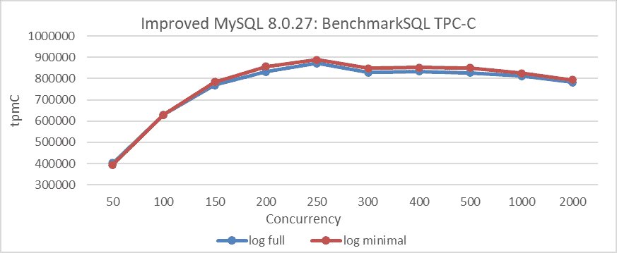

图 11-24\. 通过最小化日志记录实现提高吞吐量。

从图中可以观察到，使用 *binlog_row_image=minimal* 对 MySQL 主节点的吞吐量提供了适度的提升，但增加并不显著。关于 MySQL 从节点重放的具体细节可以在第 10.3.7 节中找到。

### 11.5.8 理解 Binlog 压缩设置对性能的影响

下面是对 *binlog_transaction_compression* 参数的简要介绍：

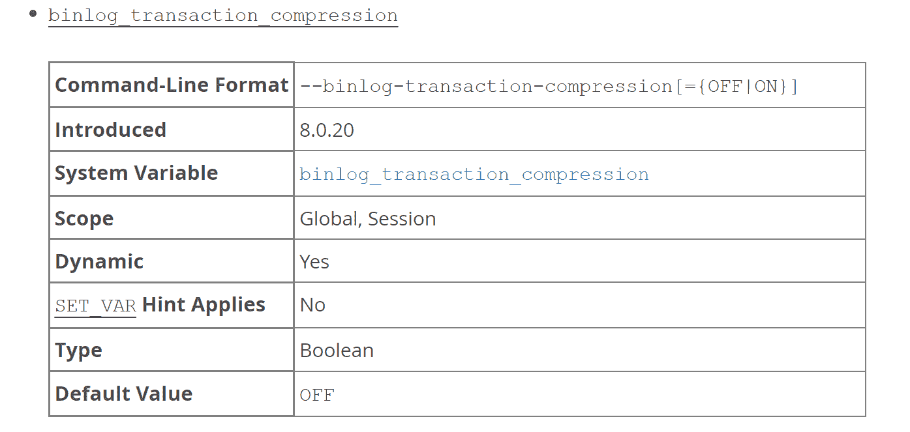

当启用二进制日志事务压缩时，事务负载会被压缩并作为一个单独的事件写入二进制日志。这些压缩负载在复制流和重传日志中保持压缩状态，减少了存储需求并节省了事务发起者和接收者的网络带宽 [13]。

在同一数据中心内的 Group Replication 集群中，对于 MySQL 的主节点和从节点启用了 *binlog_transaction_compression*，让我们分析二进制日志压缩对 TPC-C 吞吐量的影响。请参考下面的图示以获取详细结果：


图 11-25\. 在 LAN 环境中，二进制日志压缩可能会对性能产生负面影响。

从图中可以看出，启用二进制日志压缩会导致 Group Replication 集群的吞吐量显著下降，尤其是在高并发情况下。这种下降发生在网络从压缩中获得的收益被涉及的计算成本所抵消时。

为了调查增加网络延迟是否可以提高压缩后的吞吐量，使用了 10ms 的模拟网络延迟。以下图中显示了在 binlog 压缩前后，TPC-C 吞吐量与并发级别的比较。

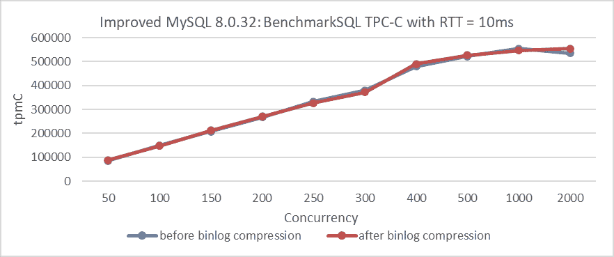

图 11-26\. Binlog 压缩不会影响 WAN 环境中的性能。

从图中可以看出，在 10ms 的网络延迟下，压缩后的吞吐量与压缩前相似。这表明增加网络延迟可以帮助缓解与 MySQL 压缩相关的性能下降。

用户应根据其具体需求权衡存储成本降低和性能提升之间的权衡。

### 11.5.9 理解 InnoDB 缓冲池大小对性能的影响

这里简要介绍*innodb_buffer_pool_size*参数：

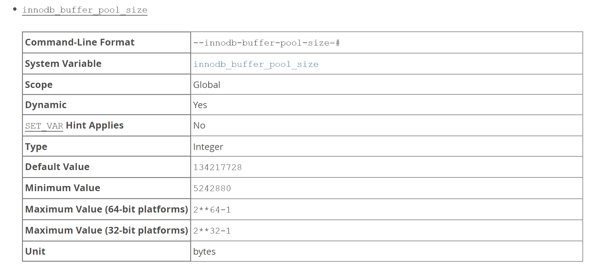

较大的缓冲池在内存中保留更多数据，减少页面淘汰、I/O 操作和缓冲池内的竞争[13]。

基于改进的 MySQL 8.0.27 版本和 PGO，分析了*innodb_buffer_pool_size*参数在各个并发级别对 TPC-C 吞吐量的影响。结果（仓库数量为 1000）显示在下图中。

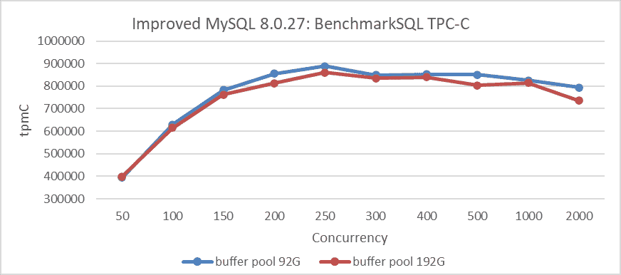

图 11-27\. innodb_buffer_pool_size：最佳大小是性能的关键，而不仅仅是更大。

从图中可以看出，增加缓冲池大小并不总是导致更高的吞吐量。对于测试中占用约 92GB I/O 空间的 1000 个仓库，将*innodb_buffer_pool_size*设置为 92GB 比设置为 192GB 表现更好。

显然，*innodb_buffer_pool_size*参数非常适合使用 AI 进行动态自适应调整。

## 11.6 概述

本章重点介绍在不修改 MySQL 源代码的情况下优化 MySQL 应用性能的方法。关键方法包括使用 PGO、最小化网络交互、采用高级内存分配工具以及改进索引和参数配置。

这些优化方法的有效性取决于 MySQL 版本、配置参数、硬件环境和特定应用特性。虽然一个参数可能在一种情况下对性能有显著影响，但在另一种情况下其有效性可能会降低。这种可变性源于多个影响性能的队列和潜在瓶颈之间的复杂交互，使得性能测试特别具有挑战性。

下一页
