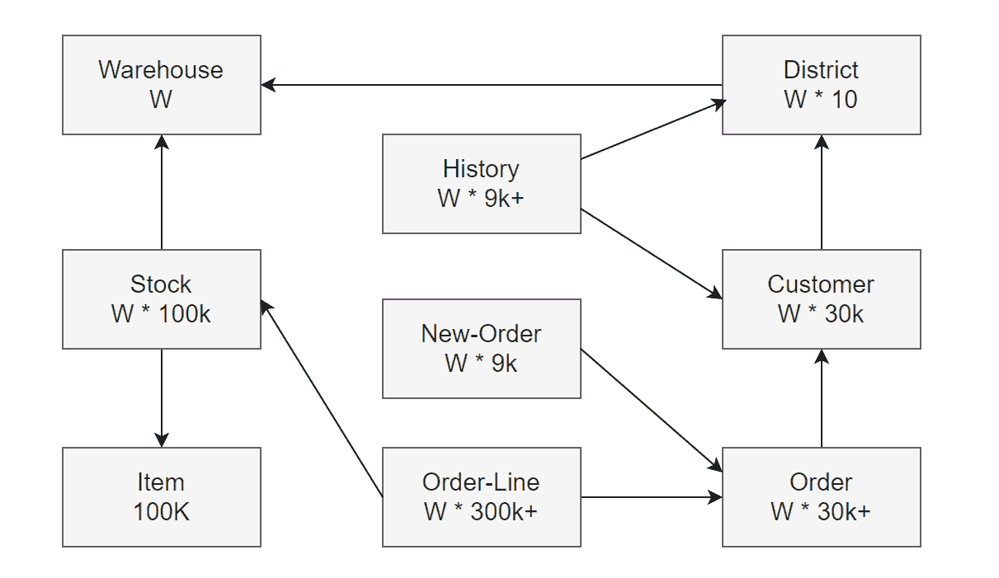
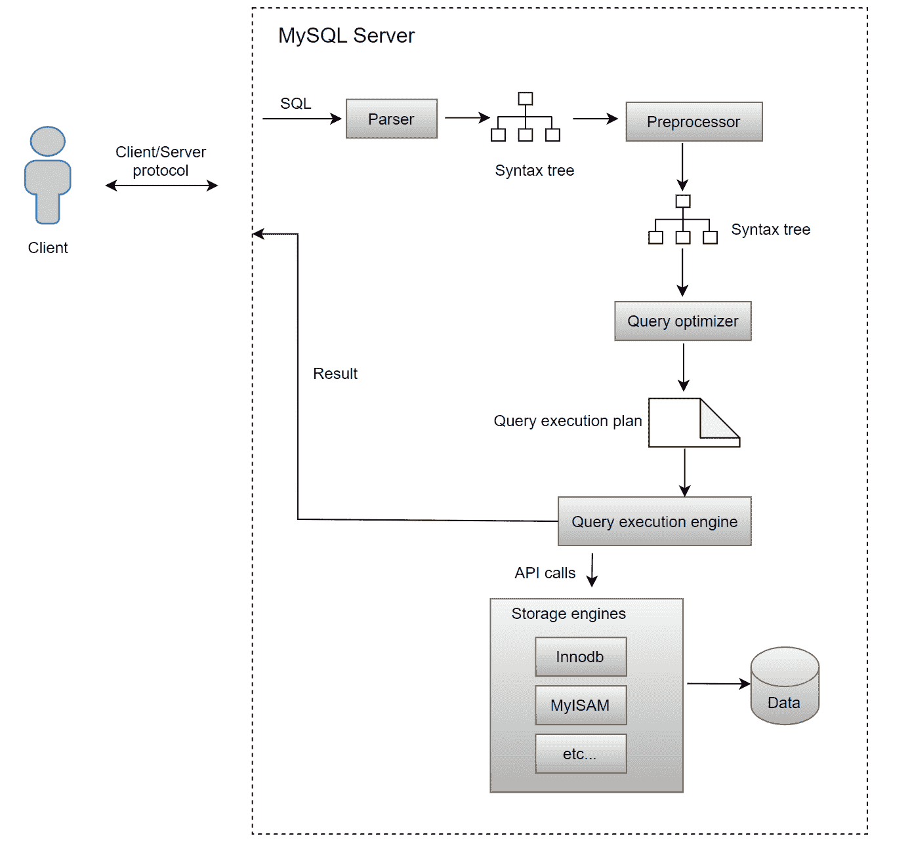
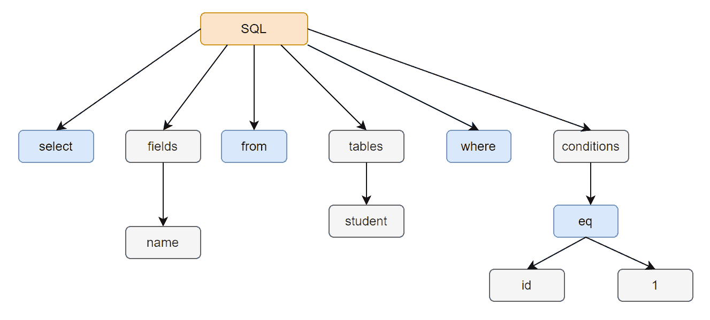
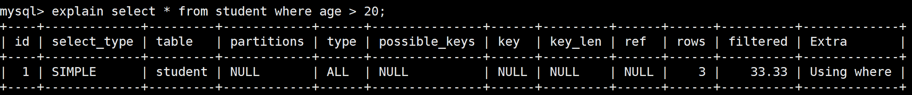
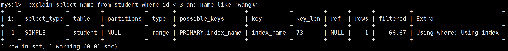
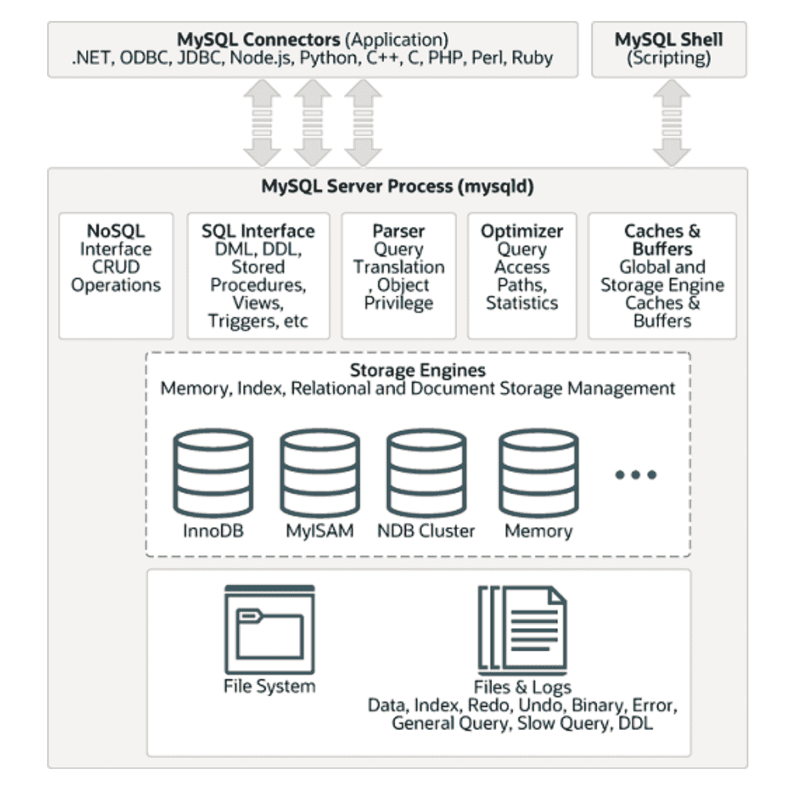
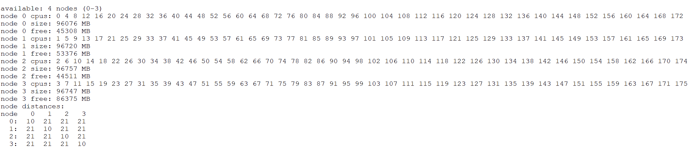

# 附录

> 原文：[`enhancedformysql.github.io/The-Art-of-Problem-Solving-in-Software-Engineering_How-to-Make-MySQL-Better/Appendix.html`](https://enhancedformysql.github.io/The-Art-of-Problem-Solving-in-Software-Engineering_How-to-Make-MySQL-Better/Appendix.html)


## 术语表

本书包含许多术语。提前熟悉它们的含义将有助于您更好地理解所讨论的问题。

**1 实现读写操作的强一致性**

MySQL 组复制通过两种机制确保强一致性：

**强一致性读（机制前）**：

一个读写（RW）事务在应用之前会等待所有先前事务完成。一个只读（RO）事务在执行之前会等待所有先前事务。这保证了事务读取最新的值，只影响读取延迟。

**强一致性写（机制后）**：

一个 RW 事务会等待其更改应用到所有组成员上。这确保了在本地成员上提交后，任何后续在任何成员上的读取都将看到已提交的值或更近的值。RO 事务不受影响。

**2 人工智能**

人工智能（AI）通过开发用于感知、学习和目标导向行为的方法和软件，使机器表现出智能行为。机器学习（ML），作为人工智能的一个子集，创建出从数据中学习以执行任务而不需要明确指令的算法。神经网络的发展显著提高了许多领域的性能。

深度学习，一个突出的机器学习方向，由于计算能力的提升（尤其是 GPU）和像 ImageNet 这样的广泛训练数据集，极大地增强了计算机视觉、语音识别和自然语言处理等领域。

在数据库中，人工智能可以自动化操作、调整性能参数和构建 SQL 语句，提高效率和功能。MySQL HeatWave 将事务、分析和机器学习结合成一个单一的管理服务。

**3 算法**

设计算法是解决特定问题的指令。逻辑推理是必不可少的，因为它涉及到创建一个逻辑上组织有序的步骤序列以实现预期的结果。程序员必须考虑控制流、数据流和交互，以确保算法高效、正确并满足要求。

**4 平衡重放速度**

对于 MySQL 的二级重放，平衡重放速度是在正常条件下二级副本与主副本速度相匹配的点。如果主副本的速度达到或低于此阈值，延迟最小。然而，如果主副本的速度超过此阈值，二级副本在事务重放进度上开始落后。

**5 因果性**

因果性是指一个事件或状态（原因）导致另一个事件或状态（结果）的产生。原因是结果的部分原因，结果依赖于原因。

**6 崩溃恢复**

数据库中的事务可能会意外中断。如果在事务的所有更改完成并提交之前发生故障，数据库可能会变得不一致且不可用。崩溃恢复是将数据库恢复到一致和可用状态的过程。

**7 数据结构**

在计算机科学中，数据结构是一种数据组织、存储格式，通常用于高效访问数据。它由数据值、它们之间的关系以及可以对这些值执行的操作组成，形成一个代数结构。

**8 双写**

双写缓冲区是一个存储区域，其中 InnoDB 在将页面写入数据文件最终位置之前，先将其从缓冲池中写入。如果在页面写入过程中发生意外故障，InnoDB 可以使用双写缓冲区中的副本在崩溃恢复期间恢复页面。

**9 双一**

Binlog 是记录 MySQL 数据复制和灾难恢复中事务修改的逻辑日志。相比之下，重做日志是一个物理日志，它捕获数据页面的修改，对于在崩溃后恢复已提交的数据至关重要。这两个日志对于 MySQL 崩溃恢复至关重要。为了防止意外故障期间的数据丢失，'双一'保护是必不可少的，这涉及到确保 binlog 和重做日志及时刷新到磁盘。

**10 容错性**

容错性是指系统在组件出现故障或错误的情况下，仍能继续正确运行的能力。

**11 GTID**

全局事务标识符（GTID）通过唯一标识每个事务简化了复制，消除了在设置新从节点或处理故障转移时引用日志文件或位置的必要性。基于 GTID 的复制直接跟踪事务，确保一致性验证简单：如果主节点上提交的所有事务都存在于从节点上，则一致性得到保证。

GTID 在主节点和从节点之间维护，使您能够通过二进制日志追踪任何事务的起源。一旦在服务器上提交了具有特定 GTID 的事务，具有相同 GTID 的重复事务将被忽略，确保每个事务只在从节点上应用一次，从而保持一致性。

在本书中，MySQL 服务器在运行前配置了以下设置：

```cpp
gtid_mode=ON
enforce_gtid_consistency=ON 
```

此配置确保每个 MySQL 节点使用 GTID，简化了问题和故障追踪的过程。

**12 高可用性**

高可用性是一种网络弹性属性，即使在故障和操作挑战的情况下，也能确保可接受的服务水平。

**13 幂等性**

幂等性是计算机科学中某些操作的一个属性，其中多次应用操作的效果与单次应用相同。

**14 闩锁与锁：关键区别**

在计算机科学中，闩锁或互斥锁（简称互斥）是一种同步原语，它防止多个线程同时访问状态。锁定是一种用于防止数据库中数据并发访问的技术，确保结果的一致性。

闩锁类似于互斥锁，而 MySQL 中的锁结构如下：

```cpp
/** Lock struct; protected by lock_sys latches */
struct lock_t {
  /** transaction owning the lock */
  trx_t *trx;
  /** list of the locks of the transaction */
  UT_LIST_NODE_T(lock_t) trx_locks;
  /** Index for a record lock */
  dict_index_t *index;
  /** Hash chain node for a record lock. The link node in a singly
  linked list, used by the hash table. */
  lock_t *hash;
  union {
    /** Table lock */
    lock_table_t tab_lock;
    /** Record lock */
    lock_rec_t rec_lock;
  };
  ... 
```

那么，这两个概念有什么区别呢？考虑以下比喻 [19]：

+   **闩锁**可以固定门、栅栏或窗户，但不会提供防止未经授权访问的保护。

+   然而，**锁**限制了没有钥匙的人的进入，确保了安全和控制。

在 MySQL 中，全局闩锁用于序列化特定的处理过程。例如，以下是 MySQL 对全局闩锁作用的描述。

```cpp
All of the steps above (except 2, as we usually know the page already) are
accomplished with the help of single line:
    locksys::Shard_latches_guard guard{*block_a, *block_b};
And to "stop the world" one can simply x-latch the global latch by using:
    locksys::Global_exclusive_latch_guard guard{};
This class does not expose too many public functions, as the intention is to
rather use friend guard classes, like the Shard_latches_guard demonstrated.
*/
class Latches {
 private:
  using Lock_mutex = ib_mutex_t;
 ... 
```

在 MySQL 中，锁是事务模型的核心，常见的类型包括行锁和表锁。MySQL 中的死锁检测与锁有关，而不是与闩锁有关。

理解锁对于：

+   实现大规模、繁忙或高度可靠的数据库应用程序

+   调优 MySQL 性能

理解 InnoDB 锁定和 InnoDB 事务模型对于这些任务至关重要。

值得注意的是，MySQL 中的锁对象需要闩锁保护以确保正确性，如下面的代码所示。

```cpp
/** Grants a lock to a waiting lock request and releases the waiting
transaction. The caller must hold lock_sys latch for the shard containing the
lock, but not the lock->trx->mutex.
@param[in,out]    lock    waiting lock request
 */
static void lock_grant(lock_t *lock) {
  ut_ad(locksys::owns_lock_shard(lock));
  ut_ad(!trx_mutex_own(lock->trx));
  trx_mutex_enter(lock->trx);
  if (lock_get_mode(lock) == LOCK_AUTO_INC) {
    dict_table_t *table = lock->tab_lock.table;
    if (table->autoinc_trx == lock->trx) {
      ib::error(ER_IB_MSG_637) << "Transaction already had an"
                               << " AUTO-INC lock!";
    } else {
      ut_ad(table->autoinc_trx == nullptr);
      table->autoinc_trx = lock->trx;
      ib_vector_push(lock->trx->lock.autoinc_locks, &lock);
    }
  }
  ... 
```

**15 使用 replica_preserve_commit_order 维护事务顺序**

在 MySQL 中，`replica_preserve_commit_order` 配置确保在从数据库上提交的事务按照它们在重播日志中出现的顺序进行提交。这个设置是维护事务因果关系的基石：如果在主数据库上事务 A 在事务 B 之前提交，那么事务 A 也会在从数据库上在事务 B 之前提交。这防止了在从数据库上读取事务的顺序可能相反的不一致性。

**16 多版本并发控制 (MVCC**)

多版本并发控制 (MVCC) 是数据库管理系统使用的一种非锁定并发控制方法，用于实现数据库的并发访问。

**17 网络延迟**

在分组交换网络中，网络延迟通常测量为往返延迟时间，这包括从源到目的地以及返回的延迟。这种延迟显著影响了 MySQL 的性能。

**18 网络分区**

网络分区将计算机网络划分为独立的子网，这可能是出于优化目的而有意为之，也可能是由于设备故障。分布式软件必须具备分区容错性，这意味着即使在网络分区的情况下，它也应继续正确地运行。

**19 NUMA**

非一致性内存访问（NUMA）是一种在多处理器系统中使用的计算机内存设计，其中内存访问时间取决于内存位置相对于处理器的位置。NUMA 扩展了对称多处理（SMP）架构的扩展性。SMP 在可扩展性方面存在挑战，因为它一次只允许一个处理器访问内存，导致瓶颈。NUMA，现在是主流的服务器架构，缓解了这些问题。然而，将 MySQL 实例绑定到单个 NUMA 节点实际上使其功能类似于纯 SMP 架构。

**20 OLTP**

在线事务处理（OLTP）指的是用于面向事务的应用程序（如运营系统）的数据库系统。这些系统旨在实时处理和响应用户请求。这与专注于数据分析而不是事务处理的在线分析处理（OLAP）形成对比。

**21 Paxos 算法**

Paxos 是一系列用于解决不可靠或易出错的处理器网络中共识的协议。

**22 流水线**

在计算机科学中，流水线（或流水线处理）类似于一个制造装配线，其中过程的不同阶段可以并发执行，即使某些阶段依赖于其他阶段的完成。这种方法允许多个操作同时进行，从而提高整体效率并减少处理时间。

**23 PGO**

基于配置文件优化（PGO）是一种编译器技术，它使用配置文件数据来提高程序运行时性能。作为一种动态优化方法，PGO 根据运行时信息改进代码。

**24 可读提交隔离级别**

简而言之，可读提交隔离级别确保在读取数据时，事务期间读取的任何数据都已被提交。它防止读取者看到未提交或“脏”数据。然而，它不保证如果事务再次读取相同的数据，它将是相同的；数据在读取后可能会更改。

**25 复制**

复制依赖于主服务器跟踪其二进制日志中所有数据库更改（更新、删除等）。此日志记录了从服务器启动以来更改数据库结构或内容的所有事件。SELECT 语句不记录，因为它们不会修改数据库。复制通过从主服务器上的二进制日志读取事件并在从服务器上处理这些事件来工作。事件以不同的格式记录在二进制日志中，具体取决于事件类型。

**26 响应时间**

在计算机科学中，响应时间衡量系统对服务请求做出响应所需的时间，这表明了服务的响应性。

**27 基于行的复制**

当使用基于行的日志记录时，主服务器将事件写入二进制日志，详细记录单个表行的更改。将复制到从服务器涉及将这些行更改事件复制到从服务器，这个过程称为基于行的复制。

**28 状态机复制**

在计算机科学中，状态机复制（SMR）是通过复制服务器并协调客户端与这些副本的交互来实现容错服务的一种方法。在 MySQL 组复制集群中，使用 Paxos 算法实现 SMR。

**29 Thread Pool**

在计算机编程中，线程池是一种用于实现并发执行的设计模式。它维护一个线程池，这些线程准备执行任务，当任务可用时执行。这种方法通过减少频繁创建和销毁线程的开销来提高性能。线程池中的线程数量根据程序的计算资源进行调整，优化任务执行和资源利用。

**30 Throughput**

吞吐量衡量系统在单位时间内处理请求数量。常见的统计指标包括：

1.  **Transactions Per Second (TPS):** 每秒执行的数据库事务数。

1.  **Queries Per Second (QPS):** 每秒执行的数据库查询数。

1.  **tpmC for TPC-C:** TPC-C 基准测试中每分钟执行的新订单交易率。

1.  **tpmTOTAL for TPC-C:** TPC-C 基准测试中每分钟执行的总交易率。

**31 Thundering Herd**

在计算机科学中，当许多进程或线程被一个事件唤醒，但只有一个可以处理它时，会发生雷鸣般的人群问题。这会导致对资源的过度竞争，可能使系统冻结。

**32 TPC-C**

TPC-C 是一个 OLTP 基准测试，它根据每分钟执行的新订单交易率来衡量性能。这个比率报告为 tpmC（每分钟 C 个交易），它是基准测试的主要性能指标。

**33 Transaction**

在数据库管理系统（DBMS）中，事务是一个逻辑工作单元，通常包含多个操作。事务不仅简化了应用编码的复杂性，而且是数据库管理系统的一个核心功能。

**34 Transaction Throttling**

在 MySQL 中，通过限制一次性进入事务系统的用户线程数量来管理高并发的事务节流。这种方法通过控制系统负载来帮助减少系统压力并增强稳定性。

**35 View Change**

视图表示在特定时间点 MySQL 组复制配置中的活动成员。当组配置发生变化时，例如成员加入或离开，并且同时通知所有成员时，会发生视图变更。

## **Testing Tool**

### 1 SysBench

SysBench 是一个广泛使用的开源基准测试工具，用于测试开源数据库管理系统（DBMS）。它提供了快速评估系统性能，无需复杂的基准测试设置。该工具支持各种测试，包括传统的读写和只写测试，以及基于帕累托分布的冲突类型测试。

SysBench 的主要优势在于其简单性、易用性和用户友好性。然而，这种简单性也可能是一个重大的缺点。测试过程的过度简化可能导致扭曲，可能遗漏关键问题，并且无法准确代表在线处理能力。因此，虽然 SysBench 提供了一种简单的基准测试方法，但它可能无法完全捕捉数据库性能的复杂性。

### 2 TPC-C 测试工具

TPC-C 基准测试由事务处理委员会定义，是一个涉及 9 个表和 10 个外键关系的 OLTP 测试。除了项目表外，所有表在初始数据库加载期间指定的仓库数量（W）的基础上进行基数扩展。



此架构被五个不同的交易使用，每个交易创建不同的访问模式：

1.  **项目：** 只读。

1.  **仓库、区域、客户、库存：** 读写。

1.  **新订单：** 插入、读取和删除。

1.  **订单和订单行：** 插入带有时间延迟更新，导致行变得过时且很少被读取。

1.  **历史：** 只插入。

这个小型模式中有限数量的交易的多样化访问模式有助于 TPC-C 作为主要数据库基准测试的持续重要性。在这本书中，BenchmarkSQL [68] 主要用于评估 MySQL 中的 TPC-C 性能。

## 如何处理 MySQL 的 SQL？

在计算机科学中，请求-响应或请求-回复模型是网络中的基本通信方法。它涉及一台计算机发送数据请求，另一台计算机响应该请求。具体来说，这种模式涉及向回复系统发送请求或消息，该系统处理请求并返回响应。

MySQL 使用经典的请求-响应模型：客户端向 MySQL 服务器发送 SQL 查询，服务器处理这些查询并将响应发送回客户端。以下图示了 MySQL 8.0 服务器中标准 SQL 查询处理流程。



下面是如何处理 SQL 请求的详细示例。假设用户从 MySQL 客户端向 MySQL 服务器发送以下 SQL 语句：

```cpp
select name from student where id=1; 
```

在执行 SQL 查询之前，MySQL 服务器首先使用“解析器”解析 SQL 语句，该解析器执行两个基本任务：

**1. 词法分析**

MySQL 服务器扫描您输入的 SQL 字符串，并将其转换为标记，识别关键字和其他元素。


**2. 语法分析**

使用词法分析中的标记，语法解析器检查 SQL 语句是否遵循 MySQL 语法规则。验证成功后，它构建一个 SQL 语法树。这种树结构有助于后续模块从 WHERE 子句中提取关键组件，如 SQL 类型（例如，SELECT、INSERT）、表名、字段名和条件。例如，提供的 SQL 语句将生成一个表示这些组件的语法树：



这捕捉了解析过程的核心，MySQL 服务器使用 Bison 解析器构建语法树。

解析后，MySQL 服务器在实际执行开始之前执行几个步骤以优化查询性能：

**1. 预处理器**

预处理器执行初步任务，例如验证表或字段的存在，并将`select *`中的通配符`*`展开以包含所有表列。

**2. 查询优化器**

查询优化器确定 SQL 查询的执行计划。此阶段包括：

+   **逻辑查询重写**：将查询转换为逻辑上等价的形式。

+   **基于成本的连接优化**：评估不同的连接方法以最小化执行成本。

+   **基于规则的访问路径选择**：根据预定义的规则选择最佳数据访问路径。

查询优化器生成执行计划，然后由查询执行器引擎使用。

执行计划确定后，查询执行器引擎开始执行 SQL 语句，逐条记录与存储引擎交互。

这里有两种执行过程：全表扫描和索引查询。

**1. 全表扫描**

假设有一个查询用于检索所有 20 岁以上的学生信息：

```cpp
select * from student where age > 20; 
```

由于此查询条件未使用索引，优化器通过将访问类型设置为 ALL 来选择全表扫描。



执行器和存储引擎的执行过程如下：

1.  服务器层调用存储引擎的全表扫描接口以开始从表中读取记录。

1.  执行器检查检索的记录的年龄是否超过 20 岁。如果记录满足此条件，并且有可用空间，则将这些记录发送到网络写入缓冲区。

1.  执行器在循环中从存储引擎请求下一条记录。每条记录都会与查询条件进行评估，如果满足条件，并且缓冲区未满，则将这些记录发送到网络写入缓冲区。

1.  一旦存储引擎已从表中读取所有记录，它将通知执行器读取已完成。

1.  接收到完成信号后，执行器退出循环并将查询结果刷新到客户端。

为了优化性能，MySQL 在将记录发送到客户端之前检查网络缓冲区是否已满，以最小化频繁的写系统调用。只有在缓冲区已满或接收到完成信号时，才会发送记录。

**2. 索引查询**

考虑以下 SQL 查询：

```cpp
select name from student where id < 3 and name like 'wang%'; 
```

在执行此查询之前，请在学生表的姓名字段上添加一个二级索引：

```cpp
alter table student add index index_name(name); 
```

可以使用*‘explain’*语句查看此 SQL 查询的执行计划，该语句显示查询现在正在使用新创建的索引。



带有索引的执行过程如下：

1.  执行器请求存储引擎定位与查询条件匹配的第一个索引记录（例如，name LIKE ‘wang%’）。

1.  存储引擎检索并返回匹配的索引记录到服务器层。

1.  执行器检查记录是否满足额外的查询条件（例如，id < 3）。

    如果满足条件，相应的名称将被添加到网络缓冲区中，除非它已满。如果不满足条件，执行器将跳过该记录并从存储引擎请求下一个记录。

1.  此周期会持续进行，直到执行器反复请求和评估与查询条件匹配的下一个索引记录，直到处理完所有相关索引记录。

1.  一旦存储引擎指示所有相关索引记录都已处理，执行器将退出循环并将收集到的结果发送到客户端。

使用索引允许存储引擎快速定位必要的记录，绕过扫描整个表的需要。通常，这会显著提高执行效率并加快查询速度。

## MySQL 架构

下图说明了客户端-服务器架构：



MySQL 遵循客户端-服务器架构，将系统分为两个主要组件：客户端和服务器。

### 1 客户端

1.  客户端是一个与应用程序交互的 MySQL 数据库服务器。

1.  它可以是一个独立的应用程序，一个 Web 应用程序，或任何需要数据库的程序。

1.  客户端将 SQL 查询发送到 MySQL 服务器进行处理。

### 2 服务器

1.  服务器是负责存储、管理和处理数据的 MySQL 数据库管理系统。

1.  它接收 SQL 查询，处理它们，并返回结果集。

1.  它管理多个客户端的数据存储、安全和并发访问。

客户端通过网络使用 MySQL 协议与服务器通信，允许多个客户端并发交互。应用程序使用 MySQL 连接器连接到数据库服务器。MySQL 还提供客户端工具，如基于终端的 MySQL 客户端，以直接与服务器交互。

MySQL 数据库服务器包括几个守护进程：

1.  **SQL 接口**：为应用程序提供使用 SQL 查询与数据库交互的标准接口。

1.  **查询解析器**：分析 SQL 查询以理解其结构和语法，将它们分解成组件以进行进一步处理。

1.  **查询优化器**：评估给定查询的各种执行计划，并选择最有效的一个以提高性能。

在 MySQL 中，存储引擎负责数据的存储、检索和管理。MySQL 的可插拔存储引擎架构允许选择不同的存储引擎，如 InnoDB 和 MyISAM，以满足特定的性能和可伸缩性要求，同时保持一致的 SQL 接口。

文件系统组织和存储各种文件类型，包括数据和索引文件。MySQL 使用日志文件，如二进制日志和重做日志，以维护事务一致性并支持恢复机制。

总体而言，MySQL 遵循客户端-服务器架构，其中客户端将 SQL 查询发送到服务器进行处理。MySQL 支持可插拔存储引擎架构，允许使用具有各种功能和性能特性的不同存储引擎来管理数据存储和检索。

## MySQL 集群

创建容错系统的最常见方法是使用冗余组件，允许系统在某个组件失败时继续运行。

MySQL 中的复制将数据从一台服务器（主服务器）复制到一台或多台服务器（从服务器），提供了以下优点：

1.  **扩展解决方案**：在多个从服务器之间分配负载以提高性能。所有写入和更新都发生在主服务器上，而读取可以在从服务器上进行，从而提高读取速度。

1.  **分析**：允许在不影响主性能的情况下对从服务器进行分析。

1.  **长距离数据分布**：为远程站点创建本地数据副本，无需持续访问主服务器。

原始的同步类型是单向异步复制。异步复制的优点是用户响应时间不受从服务器的影响。然而，如果主服务器失败且从服务器未完全同步，则存在数据丢失的重大风险。

除了异步复制之外，半同步复制还需要在主服务器上进行提交，直到至少一个从服务器确认并记录事务事件。这确保了从服务器上的数据是最新的，但会影响用户响应时间并引入高可用性复杂性。

复制引入了显著的复杂性，因为它需要管理多个服务器而不是一个。这涉及到解决经典分布式系统问题，如网络分区和脑裂场景。主要挑战是协调这些服务器的一致性，确保它们在每个变化时都同意系统和数据状态。本质上，服务器必须作为一个分布式状态机运行，要么作为一个单一实体前进，要么最终收敛到相同的状态。

MySQL 群组复制提供了具有强服务器协调的分布式状态机复制。组内的服务器通过内置的成员服务自动维护一致视图，当服务器加入或离开时进行更新。如果服务器发生故障，故障检测机制会通知组。

事务提交需要全局事务序列的多数共识，确保统一的提交或中止决策。在脑裂场景中，网络分区会停止进度直到问题解决。群组通信系统（GCS）协议通过故障检测、成员管理以及有序消息传递确保一致的数据复制，所有这些均由 Paxos 算法作为核心通信引擎提供支持。

MySQL 群组复制可以在单主模式运行，并自动选择主节点，一次只允许一个服务器接受更新。另外，高级用户可以部署多主模式，此时所有服务器都可以接受并发更新。然而，这要求应用程序管理此类部署的限制。

通常，简单的集群设置更容易配置，但问题出现时可能会更具挑战性。相比之下，更复杂的集群初始配置更困难，但提供了处理问题的更优雅解决方案。复制机制的选取应基于具体的使用场景。

## 测试相关材料

这里提供了详细的硬件配置、操作系统和各种测试脚本，以帮助读者复制本书中展示的一些测试结果。

### 1 硬件配置

Intel(R) Xeon(R) Gold 6238 CPU @ 2.10GHz

缓存对齐：64

cpu MHz：3700.000

缓存大小：30976 KB

x86 架构 NUMA 环境中的节点详细信息：



磁盘都是 NVMe SSD。

除非另有说明，大多数测试都是在这些硬件条件下进行的。

### 2 操作系统

操作系统内核版本是 Linux 5.19.8。

### 3 BenchmarkSQL 脚本

创建 TPC-C 表的脚本可以在以下地址找到：

https://github.com/enhancedformysql/mysql_8.0.27/blob/main/tableCreates.sql_base_for_test

创建相关索引的脚本可以在以下地址找到：

https://github.com/enhancedformysql/mysql_8.0.27/blob/main/indexCreates.sql_base_for_test

BenchmarkSQL 测试的主要配置脚本如下：

```cpp
warehouses=1000
loadWorkers=100
terminals=300
warehouses-begin=1
warehouses-end=1000
//To run specified transactions per terminal- runMins must equal zero
runTxnsPerTerminal=0
//To run for specified minutes- runTxnsPerTerminal must equal zero
runMins=5
//Number of total transactions per minute
limitTxnsPerMin=0
//Set to true to run in 4.x compatible mode. Set to false to use the
//entire configured database evenly.
terminalWarehouseFixed=true
//The following five values must add up to 100
//The default percentages of 45, 43, 4, 4 & 4 match the TPC-C spec
newOrderWeight=45
paymentWeight=43
orderStatusWeight=4
deliveryWeight=4
stockLevelWeight=4 
```

从图中可以看出，通常有 1000 个仓库，每个测试持续 5 分钟。

### 4 SysBench 脚本

SysBench 测试相当简单；这里只列出关键参数。

SysBench 测试参数：*-table_size=1000000 –tables=1*

对于低争用率的测试，请使用参数 *–rand-type=uniform*；对于高争用率的测试，请使用参数 *–rand-type=pareto*。

### 5 使用 tpcc-mysql 脚本进行基准测试

tpcc-mysql 改进工具的下载链接：http://www.anysql.net/


如何使用 tpcc-mysql 工具？

假设用户名为 xxx，密码为 yyy，步骤如下：

数据加载命令如下：

```cpp
./tpcc_load -h127.0.0.1 -d tpcc200 -u xxx -p "yyy" -P 3306 -w 200 
```

测试命令如下：

```cpp
./tpcc_start -h127.0.0.1 -P 3306 -d tpcc200 -u xxx -p "yyy" -w 200 -c 100 -r 0 -l 60 -F 1 
```

### 6 配置参数

由于进行了大量测试，此处仅列出典型配置。特殊配置需要相应的参数修改。

关于独立 MySQL 实例的典型配置参数的详细信息，请参阅以下地址：

https://github.com/enhancedformysql/mysql_8.0.27/blob/main/my.cnf_base_for_test

应注意，默认情况下，测试是在 *可重复读* 事务隔离级别下进行的，启用了 *二进制日志*，*‘双一’* 配置，并启用了 *双写*。

对于组复制，原生 MySQL 版本中的主服务器配置参数如下：

```cpp
# for mgr
plugin_load_add='group_replication.so'
enforce-gtid-consistency
gtid-mode=on
loose-group_replication_member_expel_timeout=3
loose-group_replication_start_on_boot= OFF
loose-group_replication_group_name="aaaaaaaa-aaaa-aaaa-aaaa-baaaaaaaaaab"
loose-group_replication_local_address=127.0.0.1:63318
loose-group_replication_group_seeds= "127.0.0.1:63318,127.0.0.1:53318,127.0.0.1:43318"
loose-group_replication_member_weight=50
loose-group_replication_flow_control_mode=disabled
slave_parallel_workers=256
slave_parallel_type=LOGICAL_CLOCK
slave_preserve_commit_order=on 
```

应注意，读者应修改 IP 地址以匹配其特定环境。

对于组复制，原生 MySQL 版本中从服务器的配置参数如下：

```cpp
# for mgr
plugin_load_add='group_replication.so'
enforce-gtid-consistency
gtid-mode=on
loose-group_replication_member_expel_timeout=3
loose-group_replication_start_on_boot= OFF
loose-group_replication_group_name="aaaaaaaa-aaaa-aaaa-aaaa-baaaaaaaaaab"
loose-group_replication_local_address=127.0.0.1:53318
loose-group_replication_group_seeds= "127.0.0.1:63318,127.0.0.1:53318,127.0.0.1:43318"
loose-group_replication_member_weight=50
loose-group_replication_flow_control_mode=disabled
slave_parallel_workers=256
slave_parallel_type=LOGICAL_CLOCK
slave_preserve_commit_order=on 
```

关于改进的组复制，由于它在 MySQL 8.0.32 和 MySQL 8.0.40 之间相似，我们已在以下地址提供了可供在线使用的版本：https://github.com/enhancedformysql/mysql-8.0.40。

因此，主服务器的配置参数如下：

```cpp
# for mgr
plugin_load_add='group_replication.so'
enforce-gtid-consistency
gtid-mode=on
loose-group_replication_member_expel_timeout=3
loose-group_replication_start_on_boot= OFF
loose-group_replication_group_name="aaaaaaaa-aaaa-aaaa-aaaa-baaaaaaaaaab"
loose-group_replication_local_address=127.0.0.1:63318
loose-group_replication_group_seeds= "127.0.0.1:63318,127.0.0.1:53318,127.0.0.1:43318"
loose-group_replication_member_weight=50

slave_parallel_workers=256
slave_parallel_type=LOGICAL_CLOCK
slave_preserve_commit_order=on 
```

对于改进的组复制，从服务器的配置参数如下：

```cpp
# for mgr
plugin_load_add='group_replication.so'
enforce-gtid-consistency
gtid-mode=on
loose-group_replication_member_expel_timeout=3
loose-group_replication_start_on_boot= OFF
loose-group_replication_group_name="aaaaaaaa-aaaa-aaaa-aaaa-baaaaaaaaaab"
loose-group_replication_local_address=127.0.0.1:53318
loose-group_replication_group_seeds= "127.0.0.1:63318,127.0.0.1:53318,127.0.0.1:43318"
loose-group_replication_member_weight=50

slave_parallel_workers=256
slave_parallel_type=LOGICAL_CLOCK
slave_preserve_commit_order=on 
```

请注意，我们不再提供基于 MySQL 8.0.32 的源代码，但我们提供基于 MySQL 8.0.40 的源代码。

与半同步复制相关的详细信息可在以下地址找到：

https://github.com/enhancedformysql/mysql_8.0.27/blob/main/semisynchronous.txt

### 7 源代码仓库

**针对“Percona Server for MySQL 8.0.27-18”的补丁：**

补丁地址：

https://github.com/enhancedformysql/mysql_8.0.27/blob/main/book_8.0.27_single.patch

该补丁专门针对独立 MySQL 实例的优化，包括：

+   **多版本并发控制（MVCC）ReadView**增强

+   **二进制日志组提交**改进

+   **查询执行计划**优化

**集群源代码：**

MySQL 集群版本的源代码在此处可用：https://github.com/enhancedformysql/mysql-8.0.40

对于 MySQL 集群，该补丁引入了对 **组复制** 和 **MySQL 从库重放** 的进一步优化。

## 关于作者

在早年，Bin Wang 在一家专注于开发高性能计算和高并发系统的互联网公司工作。他还为像 TCPCopy [65] 和 MySQL Proxy [66] 这样的开源项目做出了贡献，在问题解决方面积累了宝贵的经验，尤其是在逻辑思维方面。

离开互联网公司后，他专注于 MySQL 相关的开发，成功为组复制、从库重放、InnoDB 存储引擎和查询优化等项目做出了贡献 [67]。他在 MySQL 领域的问题解决方面积累了丰富的经验。
