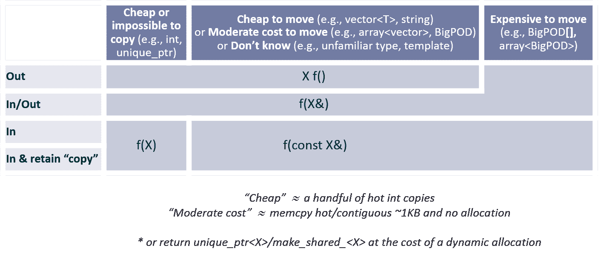

# C++ 核心准则

> 来源：[`isocpp.github.io/CppCoreGuidelines/CppCoreGuidelines#s-profile`](https://isocpp.github.io/CppCoreGuidelines/CppCoreGuidelines#s-profile)

2025 年 7 月 8 日

编辑者：

+   [比约恩·斯特劳斯特鲁普](https://www.stroustrup.com)

+   [赫布·萨特](https://herbsutter.com/)

这是一个持续改进的活文档。如果它是一个开源（代码）项目，这将是一个 0.8 版本。从本项目复制、使用、修改和创建衍生作品受 MIT 风格许可协议的许可。向本项目贡献需要同意贡献者许可协议。有关详细信息，请参阅附带的[LICENSE](https://github.com/isocpp/CppCoreGuidelines/blob/master/LICENSE)文件。我们向“友好用户”提供此项目，以使用、复制、修改和衍生，希望得到建设性的反馈。

欢迎提出改进意见和评论。我们计划随着我们对语言和可用库的理解加深而修改和扩展此文档。在评论时，请注意介绍，其中概述了我们的目标和一般方法。贡献者名单在此。

问题：

+   规则集尚未完全检查其完整性、一致性或可执行性。

+   三重问号（???)表示已知缺失信息。

+   更新参考部分；许多 C++11 之前的源代码过于陈旧。

+   更新或更接近更新的待办事项列表请参阅：待办：未分类原型规则。

您可以阅读关于本指南范围和结构的说明或直接进入：

+   介绍

+   P：哲学

+   I：接口

+   F：函数

+   C：类和类层次

+   Enum：枚举

+   R：资源管理

+   ES：表达式和语句

+   性能

+   CP：并发和并行

+   错误处理

+   常量和不可变性

+   T：模板和泛型编程

+   C 风格编程

+   SF：源文件

+   SL：标准库

支持部分：

+   A：架构思想

+   NR：非规则和神话

+   RF：参考

+   Pro：配置文件

+   GSL：指南支持库

+   NL：命名和布局建议

+   常见问题解答

+   附录 A：库

+   附录 B：代码现代化

+   附录 C：讨论

+   附录 D：支持工具

+   术语表

+   待办：未分类原型规则

您可以针对特定语言特性采样规则：

+   赋值：常规类型 – 优先初始化 – 复制 – 移动 – 其他操作 – 默认

+   `类`：数据 – 不变性 – 成员 – 辅助函数 – 具体类型 – 构造函数、赋值运算符和析构函数 – 层次结构 – 操作符

+   `概念`：规则 – 泛型编程中 – 模板参数 – 语义

+   构造函数：不变性 – 建立不变性 – 抛出 – 默认 – 不必要 – 显式 – 委托 – 虚

+   派生 `类`：何时使用 – 作为接口 – 析构函数 – 复制 – 获取器和设置器 – 多重继承 – 重载 – 切片 – `dynamic_cast`

+   析构函数：和构造函数 – 何时需要？ – 不能失败

+   异常：错误 – 抛出 – 仅限错误 – 无异常 – 最小化 `try` – 如果没有异常怎么办？

+   `for`：range-for 和 for – for 和 while – for 初始化器 – 空体 – 循环变量 – 循环变量类型 ???

+   函数：命名 – 单一操作 – 不抛出 – 参数 – 参数传递 – 多个返回值 – 指针 – lambda 表达式

+   `内联`：小型函数 – 在头文件中

+   初始化：总是 – 优先使用 `{}` – lambda 表达式 – 默认成员初始化器 – 类成员 – 工厂函数

+   lambda 表达式：何时使用

+   操作符：传统 – 避免转换操作符 – 和 lambda 表达式

+   `public`、`private` 和 `protected`：信息隐藏 – 一致性 – 保护

+   `static_assert`：编译时检查 – 和概念

+   `struct`：用于组织数据 – 如果没有不变性则使用 – 没有私有成员

+   `模板`：抽象 – 容器 – 概念

+   `无符号`：和有符号 – 位操作

+   `virtual`：接口 – 非 `virtual` – 析构函数 – 永不失败

您可以查看用于表达规则的设计概念：

+   断言：???

+   错误：???

+   异常：异常保证（???）

+   失败：???

+   不变量：???

+   泄漏：???

+   库：???

+   前置条件：???

+   后置条件：???

+   资源：???

# 摘要

这份文档是一套关于如何有效使用 C++的指南。本文件的目的是帮助人们有效地使用现代 C++。当我们说“现代 C++”时，我们指的是有效使用 ISO C++标准（目前为 C++20，但我们的几乎所有建议也适用于 C++17、C++14 和 C++11）。换句话说，如果你现在开始，你希望你的代码在 5 年后看起来是什么样子？在 10 年后呢？

指南主要关注相对高级的问题，例如接口、资源管理、内存管理和并发。这些规则会影响应用程序架构和库设计。遵循这些规则将导致代码在静态类型安全、没有资源泄漏，并且比现在常见的代码捕捉到更多的编程逻辑错误。而且它将运行得很快——你可以负担得起正确做事。

我们对低级问题（如命名约定和缩进风格）不太关心。然而，任何可能帮助程序员的主题都不在界限之外。

我们最初的一套规则强调安全性（各种形式）和简单性。它们可能非常严格。我们预计将需要引入更多例外情况，以更好地满足现实世界的需求。我们还需要更多的规则。

你可能会发现一些规则与你的预期甚至与你的经验相反。如果我们没有以任何方式建议你改变你的编码风格，那么我们就失败了！请尝试验证或反驳这些规则！特别是，我们非常希望有一些规则能够得到测量或更好的示例的支持。

你可能会发现一些规则很明显甚至很平凡。请记住，指南的一个目的是帮助那些经验较少或来自不同背景或语言的人快速上手。

许多规则旨在由分析工具支持。违反规则将用引用（或链接）到相关规则来标记。我们不期望你在尝试编写代码之前记住所有规则。将这些指南视为一种工具规范，这种工具恰好可以由人类阅读，是一种思考这些指南的方式。

规则旨在逐步引入到代码库中。我们计划为此构建工具，并希望其他人也会这样做。

欢迎评论和建议。我们计划随着我们对语言和可用库的理解提高而修改和扩展这份文档。 

# 在：简介

这是一套针对现代 C++（目前为 C++20 和 C++17）的核心指南，考虑到可能的未来增强和 ISO 技术规范（TS）。目标是帮助 C++程序员编写更简单、更高效、更易于维护的代码。

简介摘要：

+   目标读者：目标读者

+   目标：目标

+   非目标：非目标

+   In.force: 执法

+   In.struct: 本文档的结构

+   In.sec: 主要部分

## In.target: 目标读者群体

所有 C++程序员。这包括可能考虑使用 C 的程序员。

## In.aims: 目标

本文档的目的是帮助开发者采用现代 C++（目前为 C++20 和 C++17）并使代码库的风格更加统一。

我们并不抱有一种幻想，认为这些规则中的每一个都能有效地应用于每一个代码库。升级旧系统是困难的。然而，我们确实相信，使用规则的程序比不使用规则的程序更少出错，更容易维护。通常，规则也会导致更快/更简单的初始开发。据我们所知，这些规则产生的代码性能与较老、更传统的技术相当甚至更好；它们旨在遵循零开销原则（“你不使用的，你就不必支付”或“当你适当地使用抽象机制时，你至少能得到与使用底层语言结构手动编码相当的性能”）。将这些规则视为新代码的理想，当处理旧代码时是利用的机会，并尽可能接近这些理想。记住：

### In.0: 不要慌张！

抽出时间来理解指南规则对你程序的影响。

这些指南是根据“子集超集”原则设计的（Stroustrup05）。它们并不简单地定义一个要使用的 C++子集（为了可靠性、安全性、性能或其他）。相反，它们强烈推荐使用一些简单的“扩展”（库组件），这些扩展使得使用 C++中最容易出错的特性变得多余，因此可以禁止（在我们的规则集中）。

这些规则强调静态类型安全和资源安全。因此，它们强调范围检查的可能性，避免解引用`nullptr`，避免悬垂指针，以及系统地使用异常（通过 RAII）。部分是为了实现这一点，部分是为了最小化模糊代码作为错误来源，这些规则还强调了简洁性和将必要的复杂性隐藏在良好定义的接口之后。

许多规则是规定性的。我们不喜欢那些只是声明“不要那样做！”而不提供替代方案的规则。其后果之一是，一些规则只能通过启发式方法来支持，而不是精确和机械可验证的检查。其他规则阐述了一般原则。对于这些更一般的规则，更详细和具体的规则提供了部分检查。

这些指南针对 C++的核心及其使用。我们预计大多数大型组织、特定应用领域甚至大型项目都需要进一步的规则、可能的进一步限制和进一步的库支持。例如，硬实时程序员通常不能自由使用自由存储（动态内存），并且在选择库方面会受到限制。我们鼓励开发此类更具体的规则，作为这些核心指南的补充。构建您理想的小型基础库并使用它，而不是降低您的编程水平到被美化的汇编代码。

规则旨在允许逐步采用。

一些规则旨在提高各种形式的安全性，而另一些规则旨在降低事故发生的可能性，许多规则两者兼具。旨在防止事故的指南通常禁止完全合法的 C++。然而，当有两种表达一个想法的方式，其中一种已被证明是常见错误源而另一种没有时，我们试图引导程序员向后者靠拢。

## In.not: 非目标

规则并非旨在最小化或正交化。特别是，一般规则可以很简单，但难以执行。此外，通常很难理解一般规则的影响。更专业的规则通常更容易理解和执行，但没有一般规则，它们就只是一长串的特殊情况。我们提供旨在帮助新手的规则以及支持专家使用的规则。一些规则可以完全执行，但其他规则基于启发式方法。

这些规则并非旨在按顺序阅读，就像一本书一样。您可以通过链接浏览它们。然而，它们的主要用途是作为工具的目标。也就是说，工具会查找违规情况，并返回违反规则的链接。然后，规则会提供原因、违反潜在后果的示例以及建议的补救措施。

这些指南并非旨在替代对 C++的教程式处理。如果您需要某个特定经验水平的教程，请参阅参考资料。

这不是关于如何将旧 C++代码转换为更现代代码的指南。它的目的是以具体的方式阐述新代码的想法。然而，请参阅现代化部分以了解一些可能的现代化/更新/升级方法。重要的是，规则支持逐步采用：通常不可能一次性完全转换大型代码库。

这些指南并非旨在在每种语言的技术细节上完整或精确。关于语言定义问题的最终决定，包括所有一般规则的例外和每个特性，请参阅 ISO C++标准。

规则并非旨在强迫您使用 C++的贫乏子集进行编写。它们绝对不是旨在定义一个类似 Java 的 C++子集。它们不是旨在定义一个单一的“真正的 C++”语言。我们重视表达性和无妥协的性能。

规则并非价值中立。它们旨在使代码比大多数现有的 C++代码更简单、更正确/更安全，而不会损失性能。它们旨在阻止与错误、虚假复杂性和较差性能相关的完全有效的 C++代码。

规则并不精确到一个人（或机器）可以无需思考就能遵循它们的地步。执行部分试图做到这一点，但我们更愿意让规则或定义保持一点模糊和开放性，而不是精确到错误的地步。有时，精确性只有通过时间和经验才能获得。设计（目前）不是一种数学形式。

规则并不完美。一个规则可能会通过禁止在特定情况下有用的东西来造成伤害。一个规则可能会通过未能禁止在特定情况下导致严重错误的东西来造成伤害。一个规则可能会因为模糊、含糊不清、无法执行或允许解决问题的每个解决方案而造成很多伤害。完全满足“不造成伤害”的标准是不可能的。相反，我们的目标是更雄心勃勃的：“为大多数程序员做最多的好事”；如果你不能接受一个规则，就反对它，忽略它，但不要将其稀释到没有意义。同时，提出改进建议。

## 强制执行：执行

对于大型代码库来说，没有执行的规则是无法管理的。只有一小部分弱规则或特定用户社区才能执行所有规则。

+   但我们希望有很多规则，我们希望每个人都能使用这些规则。

+   但不同的人有不同的需求。

+   但人们不喜欢阅读很多规则。

+   但人们无法记住很多规则。

因此，我们需要子集来满足各种需求。

+   但任意的子集会导致混乱。

我们希望有指导方针，帮助很多人，使代码更加统一，并强烈鼓励人们更新他们的代码。我们希望鼓励最佳实践，而不是让所有事情都取决于个人选择和管理压力。理想的情况是使用所有规则；这会带来最大的好处。

这导致了相当多的困境。我们试图使用工具来解决这些问题。每个规则都有一个**执行**部分，列出了执行的想法。执行可能通过代码审查、静态分析、编译器或运行时检查来完成。尽可能的情况下，我们更喜欢“机械”检查（人类速度慢、不准确且容易感到无聊）和静态检查。只有在没有其他选择的情况下，才会建议进行运行时检查；我们不希望引入“分布式膨胀”。在适当的情况下，我们会在**执行**部分用相关规则组（称为“配置文件”）的名称标记规则。一个规则可以是多个配置文件的一部分，也可以不是。一开始，我们有几个与常见需求（愿望、理想）相对应的配置文件：

+   **类型**：不允许类型违规（通过类型转换、联合或 varargs 将`T`重新解释为`U`）

+   **边界**：不允许边界违规（访问数组范围之外）

+   **生命周期**：没有泄漏（未能`delete`或多次`delete`）和没有对无效对象的访问（解引用`nullptr`，使用悬垂引用）。

配置文件旨在供工具使用，但也为人类读者提供帮助。我们在**执行**部分中不限制我们知道的可以执行的内容；一些评论只是愿望，可能会激发一些工具构建者的灵感。

实现这些规则的工具应遵守以下语法以显式禁用规则：

```
[[gsl::suppress("tag")]] 
```

可选地附带一条消息（遵循常用的 C++11 标准属性语法）：

```
[[gsl::suppress("tag", justification: "message")]] 
```

其中

+   `"tag"` 是一个字符串字面量，表示执行规则出现的项目的锚点名称（例如，对于 C.134 它是 “rh-public”），一个规则组（“类型”、“边界”或“生命周期”）的名称，或者配置文件中的特定规则（type.4，或 bounds.2）。任何不属于这些的文本都应该被拒绝。

+   `"message"` 是一个字符串字面量

## In.struct: 本文件的结构

每条规则（指南、建议）可以有多个部分：

+   规则本身 - 例如，**不允许裸`new`**

+   规则引用编号 - 例如，**C.7**（与类相关的第 7 条规则）。由于主要部分本身没有内在的顺序，我们使用字母作为规则引用“编号”的第一部分。我们在编号中留下空缺，以最小化添加或删除规则时的“干扰”。

+   **原因**（理由） - 因为程序员发现难以遵循他们不理解的规定

+   **示例** - 因为规则在抽象中难以理解；可以是积极的或消极的

+   **替代方案** - 对于“不要这样做”的规则

+   **例外** - 我们更喜欢简单的通用规则。然而，许多规则应用广泛，但并非普遍适用，因此必须列出例外

+   **执行** - 关于如何“机械地”检查规则的想法

+   **参见** - 指向相关规则和/或进一步讨论（在本文件或其他地方）

+   **注意**（注释）- 需要说明但不符合其他分类的内容

+   **讨论** - 指向更广泛的理由和/或示例，这些示例放置在规则的主要列表之外

一些规则难以进行机械检查，但它们都满足专家程序员可以轻松发现许多违规的最小标准。我们希望“机械”工具会随着时间的推移而改进，以近似这样的专家程序员所注意到的。此外，我们假设规则会随着时间的推移而细化，使其更加精确和可检查。

规则旨在简单，而不是精心措辞以提及每个替代方案和特殊情况。此类信息可在**替代**段落和讨论部分找到。如果您不理解某个规则或不同意它，请访问其**讨论**。如果您觉得讨论缺失或不完整，请提交一个[问题](https://github.com/isocpp/CppCoreGuidelines/issues)，说明您的担忧，并可能附上一个相应的 PR。

示例是为了说明规则而编写的。

+   示例并非旨在具有生产质量或涵盖所有教程维度。例如，许多示例是语言技术性的，并使用像`f`、`base`和`x`这样的名称。

+   我们试图确保“好的”示例遵循核心指南。

+   注释通常用于说明规则，在“真实代码”中它们可能是多余的，或者会分散注意力。

+   我们假设读者了解标准库。例如，我们使用普通的`vector`而不是`std::vector`。

这不是一本语言手册。它的目的是提供帮助，而不是全面、完全准确的技术细节，或现有代码的指南。推荐的信息来源可以在参考文献中找到。

## In.sec: 主要部分

+   In: 简介

+   P: 哲学

+   I: 接口

+   F: 函数

+   C: 类和类层次

+   Enum: 枚举

+   R: 资源管理

+   ES: 表达式和语句

+   Per: 性能

+   CP: 并发与并行

+   E: 错误处理

+   Con: 常量和不可变性

+   T: 模板和泛型编程

+   CPL: C 风格编程

+   SF: 源文件

+   SL: 标准库

支持部分：

+   A: 架构思想

+   NR: 非规则和神话

+   RF: 引用

+   Pro: 配置文件

+   GSL: 指南支持库

+   NL: 命名和布局建议

+   FAQ: 常见问题解答

+   附录 A: 库

+   附录 B: 代码现代化

+   附录 C: 讨论

+   附录 D: 支持工具

+   Glossary

+   To-do: 未分类的原型规则

这些部分不是正交的。

每个部分（例如，“P”代表“哲学”）和每个子部分（例如，“C.hier”代表“类层次（面向对象）”）都有一个缩写，以便于搜索和引用。主要部分的缩写也用于规则编号（例如，“C.11”代表“使具体类型正规化”）。

# P: 哲学

本节中的规则非常通用。

哲学规则摘要：

+   P.1: 直接在代码中表达思想

+   P.2: 使用 ISO 标准 C++编写

+   P.3: 表达意图

+   P.4: 理想情况下，程序应该是静态类型安全的

+   P.5: 优先使用编译时检查而不是运行时检查

+   P.6: 在编译时无法检查的内容应在运行时进行检查

+   P.7: 早期捕获运行时错误

+   P.8: 不要泄露任何资源

+   P.9: 不要浪费时间和空间

+   P.10: 优先使用不可变数据而不是可变数据

+   P.11: 封装混乱的结构，而不是让它们散布在代码中

+   P.12: 根据需要使用支持工具

+   P.13: 根据需要使用支持库

哲学规则通常不是机械可检查的。然而，反映这些哲学主题的个别规则是。如果没有哲学基础，更具体、更具体、更可检查的规则就会缺乏理由。

### P.1: 直接在代码中表达想法

##### 原因

编译器不读取注释（或设计文档），许多程序员（一致地）也不这样做。代码中表达的内容具有定义良好的语义，并且（原则上）可以由编译器和其他工具进行检查。

##### 示例

```
class Date {
public:
    Month month() const;  // do
    int month();          // don't
    // ...
}; 
```

`month`的第一个声明明确表示返回一个`Month`，并且不修改`Date`对象的状态。第二个版本让读者猜测，并打开了更多未捕获错误的可能。

##### 示例，不良

这个循环是`std::find`的一个受限形式：

```
void f(vector<string>& v)
{
    string val;
    cin >> val;
    // ...
    int index = -1;                    // bad, plus should use gsl::index
    for (int i = 0; i < v.size(); ++i) {
        if (v[i] == val) {
            index = i;
            break;
        }
    }
    // ...
} 
```

##### 示例，良好

这将是一个意图表达得更清晰的形式：

```
void f(vector<string>& v)
{
    string val;
    cin >> val;
    // ...
    auto p = find(begin(v), end(v), val);  // better
    // ...
} 
```

一个设计良好的库比直接使用语言特性更能表达意图（要做什么，而不仅仅是如何做）。

C++程序员应该了解标准库的基础知识，并在适当的地方使用它。任何程序员都应该了解正在工作的项目的基础库的基本知识，并适当地使用它们。任何使用这些指南的程序员都应该了解指南支持库，并适当地使用它。

##### 示例

```
change_speed(double s);   // bad: what does s signify?
// ...
change_speed(2.3); 
```

一个更好的方法是明确双精度浮点数的含义（新的速度还是旧的速度的增量？）以及使用的单位：

```
change_speed(Speed s);    // better: the meaning of s is specified
// ...
change_speed(2.3);        // error: no unit
change_speed(23_m / 10s);  // meters per second 
```

我们本可以接受一个普通的（无单位的）`double`作为增量，但那样会有错误风险。如果我们想要同时有绝对速度和增量，我们就会定义一个`Delta`类型。

##### 执法

通常来说，这非常困难。

+   一致地使用`const`（检查成员函数是否修改其对象；检查函数是否通过指针或引用修改参数）

+   标志使用类型转换（类型转换会削弱类型系统）

+   检测模仿标准库的代码（困难）

### P.2: 使用 ISO 标准 C++

##### 原因

这是一套编写 ISO 标准 C++的指南。

##### 注意

在某些环境中，扩展是必要的，例如，为了访问系统资源。在这种情况下，将必要扩展的使用本地化，并使用非核心编码指南控制它们的使用。如果可能，构建封装扩展的接口，以便在不支持这些扩展的系统上关闭或编译掉它们。

扩展通常没有严格定义的语义。即使是常见并由多个编译器实现的扩展，也可能因为*没有*严格的标准化定义而具有略微不同的行为和边缘情况行为。充分使用任何此类扩展都会影响预期的可移植性。

##### 注意

使用有效的 ISO C++ 不能保证可移植性（更不用说正确性）。避免依赖于未定义的行为（例如，未定义的评估顺序）并注意具有实现定义意义的结构（例如，`sizeof(int)`）。

##### 注意

在某些环境中，对标准 C++ 语言或库特性的使用限制是必要的，例如，为了满足飞机控制软件标准的要求，避免动态内存分配。在这种情况下，使用针对特定环境的这些编码指南的扩展来控制它们的（不）使用。

##### 执法

使用最新的 C++ 编译器（目前为 C++20 或 C++17）并设置一组不接受扩展的选项。

### P.3：表达意图

##### 原因

如果没有明确说明某些代码的意图（例如，在名称或注释中），则无法判断代码是否做了它应该做的事情。

##### 示例

```
gsl::index i = 0;
while (i < v.size()) {
    // ... do something with v[i] ...
} 
```

“仅仅”遍历 `v` 元素的意图在这里没有表达出来。一个索引的实现细节被暴露（因此可能会被误用），并且 `i` 超出了循环的作用域，这可能是或可能不是预期的。读者仅从这段代码中无法得知。

更好：

```
for (const auto& x : v) { /* do something with the value of x */ } 
```

现在，没有明确提到迭代机制，循环操作的是 `const` 元素的引用，因此不可能发生意外修改。如果需要修改，请明确说明：

```
for (auto& x : v) { /* modify x */ } 
```

有关 for-语句的更多详细信息，请参阅 ES.71。有时更好的做法是使用命名算法。此示例使用 Ranges TS 中的 `for_each`，因为它直接表达了意图：

```
for_each(v, [](int x) { /* do something with the value of x */ });
for_each(par, v, [](int x) { /* do something with the value of x */ }); 
```

最后一种变体清楚地表明，我们对处理 `v` 元素的顺序不感兴趣。

程序员应该熟悉

+   指南支持库

+   ISO C++ 标准库

+   对于当前项目（s）使用的任何基础库

##### 注意

替代方案：说明应该做什么，而不仅仅是如何做。

##### 注意

一些语言结构比其他结构更好地表达了意图。

##### 示例

如果两个 `int` 被用作二维点的坐标，请明确说明：

```
draw_line(int, int, int, int);  // obscure: (x1,y1,x2,y2)? (x,y,h,w)? ...?
                                // need to look up documentation to know

draw_line(Point, Point);        // clearer 
```

##### 执法

寻找有更好替代方案的常见模式

+   简单的 `for` 循环与范围-`for` 循环

+   `f(T*, int)` 接口与 `f(span<T>)` 接口

+   范围过大的循环变量

+   裸 `new` 和 `delete`

+   具有许多内置类型参数的函数

在程序中存在大量巧妙和半自动化的程序转换空间。

### P.4：理想情况下，程序应该是静态类型安全的

##### 原因

理想情况下，程序应该是完全静态（编译时）类型安全的。不幸的是，这是不可能的。问题区域：

+   联合体

+   类型转换

+   数组退化

+   范围错误

+   狭化转换

##### 注意

这些领域是严重问题的来源（例如，崩溃和安全违规）。我们试图提供替代技术。

##### 执法

我们可以分别禁止、限制或检测个别问题类别，具体取决于所需和可行的情况。始终建议一个替代方案。例如：

+   联合体 - 使用 `variant`（在 C++17 中）。

+   类型转换 - 最小化其使用；模板可以帮助

+   数组退化 - 使用 `span`（来自 GSL）。

+   范围错误 - 使用 `span`

+   狭化转换 - 最小化其使用，并在必要时使用 `narrow` 或 `narrow_cast`（来自 GSL）。

### P.5：优先考虑编译时检查而不是运行时检查

##### 原因

代码清晰度和性能。你不需要为编译时捕获的错误编写错误处理器。

##### 示例

```
// Int is an alias used for integers
int bits = 0;         // don't: avoidable code
for (Int i = 1; i; i <<= 1)
    ++bits;
if (bits < 32)
    cerr << "Int too small\n"; 
```

这个例子未能实现其试图实现的目标（因为溢出是未定义的），应该用简单的 `static_assert` 替换：

```
// Int is an alias used for integers
static_assert(sizeof(Int) >= 4);    // do: compile-time check 
```

或者更好的是直接使用类型系统，将 `Int` 替换为 `int32_t`。

##### 示例

```
void read(int* p, int n);   // read max n integers into *p

int a[100];
read(a, 1000);    // bad, off the end 
```

更好

```
void read(span<int> r); // read into the range of integers r

int a[100];
read(a);        // better: let the compiler figure out the number of elements 
```

**替代方案**：不要推迟到运行时可以很好地在编译时完成的事情。

##### 执法

+   寻找指针参数。

+   寻找运行时检查范围违规。

### P.6：编译时无法检查的内容应在运行时可检查

##### 原因

在程序中留下难以检测的错误是请求崩溃和不良结果。

##### 注意

理想情况下，我们在编译时或运行时捕获所有错误（这些错误不是程序员逻辑中的错误）。在编译时捕获所有错误是不可能的，而且在运行时捕获所有剩余的错误通常是不划算的。然而，我们应该努力编写程序，在资源足够的情况下（分析程序、运行时检查、机器资源、时间），原则上可以进行检查。

##### 示例，错误

```
// separately compiled, possibly dynamically loaded
extern void f(int* p);

void g(int n)
{
    // bad: the number of elements is not passed to f()
    f(new int[n]);
} 
```

在这里，一条关键信息（元素数量）被如此彻底地“隐藏”，以至于静态分析可能变得不可行，并且当 `f()` 是 ABI 的一部分时，动态检查可能非常困难，因为我们不能“仪器化”该指针。我们可以将有用的信息嵌入到自由存储中，但这需要对系统进行全局更改，也许还需要对编译器进行更改。我们这里有一个使错误检测非常困难的设计。

##### 示例，错误

我们当然可以传递元素数量以及指针：

```
// separately compiled, possibly dynamically loaded
extern void f2(int* p, int n);

void g2(int n)
{
    // bad: the wrong number of elements can be passed to f2()
    f2(new int[n], n);
} 
```

将元素数量作为参数传递比仅仅传递指针并依赖于某些（未声明的）约定来知道或发现元素数量更好（并且更常见）。然而（如所示），一个简单的打字错误可以引入严重的错误。`f2()` 的两个参数之间的联系是传统的，而不是明确的。

此外，隐含的是 `f2()` 应该删除其参数（或者调用者是否犯了第二个错误？）。

##### 示例，错误

标准库资源管理指针在指向对象时未能传递大小：

```
// separately compiled, possibly dynamically loaded
// NB: this assumes the calling code is ABI-compatible, using a
// compatible C++ compiler and the same stdlib implementation
extern void f3(unique_ptr<int[]>, int n);

void g3(int n)
{
    f3(make_unique<int[]>(n), m);    // bad: pass ownership and size separately
} 
```

##### 示例

我们需要将指针和元素数量作为一个整体对象传递：

```
extern void f4(vector<int>&);   // separately compiled, possibly dynamically loaded
extern void f4(span<int>);      // separately compiled, possibly dynamically loaded
                                // NB: this assumes the calling code is ABI-compatible, using a
                                // compatible C++ compiler and the same stdlib implementation

void g3(int n)
{
    vector<int> v(n);
    f4(v);                     // pass a reference, retain ownership
    f4(span<int>{v});          // pass a view, retain ownership
} 
```

此设计将元素的数量作为对象的一个组成部分，因此错误不太可能发生，并且动态（运行时）检查总是可行的，即使不一定总是负担得起。

##### 示例

我们如何转移所有权和验证使用所需的所有信息？

```
vector<int> f5(int n)    // OK: move
{
    vector<int> v(n);
    // ... initialize v ...
    return v;
}

unique_ptr<int[]> f6(int n)    // bad: loses n
{
    auto p = make_unique<int[]>(n);
    // ... initialize *p ...
    return p;
}

owner<int*> f7(int n)    // bad: loses n and we might forget to delete
{
    owner<int*> p = new int[n];
    // ... initialize *p ...
    return p;
} 
```

##### 示例

+   ???

+   如何通过传递多态基类来避免接口中可能避免的检查？或者字符串作为“自由式”选项？

##### 执行

+   标记（指针、计数）风格的接口（这将标记许多由于兼容性原因无法修复的示例）

+   ???

### P.7: 早期捕获运行时错误

##### 原因

避免出现“神秘”的崩溃。避免导致（可能未被识别）错误结果的错误。

##### 示例

```
void increment1(int* p, int n)    // bad: error-prone
{
    for (int i = 0; i < n; ++i) ++p[i];
}

void use1(int m)
{
    const int n = 10;
    int a[n] = {};
    // ...
    increment1(a, m);   // maybe typo, maybe m <= n is supposed
                        // but assume that m == 20
    // ...
} 
```

在这里，我们在`use1`中犯了一个小错误，这将导致数据损坏或崩溃。`(指针，计数)`风格的接口让`increment1()`没有现实的方法来防御越界错误。如果我们能够检查子索引以进行越界访问，那么错误将不会在访问`p[10]`时被发现。我们可以更早地进行检查并改进代码：

```
void increment2(span<int> p)
{
    for (int& x : p) ++x;
}

void use2(int m)
{
    const int n = 10;
    int a[n] = {};
    // ...
    increment2({a, m});    // maybe typo, maybe m <= n is supposed
    // ...
} 
```

现在，`m <= n`可以在调用点（早期）进行检查，而不是稍后。如果我们只是有一个打字错误，所以我们的意图是使用`n`作为界限，代码可以进一步简化（消除错误的可能性）：

```
void use3(int m)
{
    const int n = 10;
    int a[n] = {};
    // ...
    increment2(a);   // the number of elements of a need not be repeated
    // ...
} 
```

##### 示例，不好

不要重复检查相同的值。不要将结构化数据作为字符串传递：

```
Date read_date(istream& is);    // read date from istream

Date extract_date(const string& s);    // extract date from string

void user1(const string& date)    // manipulate date
{
    auto d = extract_date(date);
    // ...
}

void user2()
{
    Date d = read_date(cin);
    // ...
    user1(d.to_string());
    // ...
} 
```

日期被验证了两次（通过`Date`构造函数）并以字符字符串（非结构化数据）的形式传递。

##### 示例

过度检查可能代价高昂。有些情况下，早期检查可能效率低下，因为你可能永远不需要该值，或者可能只需要部分值，这部分值比整个值更容易检查。同样，不要添加会改变你接口渐近行为的有效性检查（例如，不要向平均复杂度为`O(1)`的接口添加`O(n)`检查）。

```
class Jet {    // Physics says: e * e < x * x + y * y + z * z
    float x;
    float y;
    float z;
    float e;
public:
    Jet(float x, float y, float z, float e)
        :x(x), y(y), z(z), e(e)
    {
        // Should I check here that the values are physically meaningful?
    }

    float m() const
    {
        // Should I handle the degenerate case here?
        return sqrt(x * x + y * y + z * z - e * e);
    }

    ???
}; 
```

对于喷流（`e * e < x * x + y * y + z * z`）的物理定律不是不变的，因为存在测量误差的可能性。

???

##### 执行

+   看看指针和数组：尽早进行范围检查，而不是反复检查

+   看看转换：消除或标记缩窄转换

+   寻找来自输入的未检查的值

+   寻找结构化数据（具有不变性的类的对象）被转换为字符串

+   ???

### P.8: 不要泄露任何资源

##### 原因

即使资源增长缓慢，随着时间的推移，也会耗尽这些资源的可用性。这对于长时间运行的程序尤为重要，但这是负责任编程行为的一个基本要素。

##### 示例，不好

```
void f(char* name)
{
    FILE* input = fopen(name, "r");
    // ...
    if (something) return;   // bad: if something == true, a file handle is leaked
    // ...
    fclose(input);
} 
```

优先考虑 RAII：

```
void f(char* name)
{
    ifstream input {name};
    // ...
    if (something) return;   // OK: no leak
    // ...
} 
```

**参见**: 资源管理部分

##### 注意

泄露在口语中指的是“任何没有被清理的东西。” 更重要的分类是“任何不能再被清理的东西。” 例如，在堆上分配一个对象然后丢失指向该分配的最后一个指针。这条规则不应被理解为要求在程序关闭期间必须返回长生存期对象内的分配。例如，依赖于系统保证的清理，如文件关闭和进程关闭时的内存释放，可以简化代码。然而，依赖于隐式清理的抽象可能同样简单，并且通常更安全。

##### 注意

强制执行生存期安全配置文件消除了泄露。当与 RAII 提供的资源安全相结合时，它消除了“垃圾收集”的需要（通过不产生垃圾）。结合对类型和边界配置文件的强制执行，你将获得完全的类型和资源安全性，由工具保证。

##### 强制执行

+   查看指针：将它们分类为非所有者（默认）和所有者。在可行的情况下，用标准库的资源句柄（如上面的例子）替换所有者。或者，使用 GSL 中的 `owner` 将所有者标记为所有者。

+   寻找裸露的 `new` 和 `delete`

+   寻找返回原始指针的已知资源分配函数（如 `fopen`、`malloc` 和 `strdup`）

### P.9: 不要浪费时间和空间

##### 原因

这实际上是 C++。

##### 注意

你为了实现目标（例如，开发速度、资源安全或测试简化）而投入的时间和空间是不会浪费的。“追求效率的另一个好处是，这个过程迫使你更深入地理解问题。” - Alex Stepanov

##### 示例，不好

```
struct X {
    char ch;
    int i;
    string s;
    char ch2;

    X& operator=(const X& a);
    X(const X&);
};

X waste(const char* p)
{
    if (!p) throw Nullptr_error{};
    int n = strlen(p);
    auto buf = new char[n];
    if (!buf) throw Allocation_error{};
    for (int i = 0; i < n; ++i) buf[i] = p[i];
    // ... manipulate buffer ...
    X x;
    x.ch = 'a';
    x.s = string(n);    // give x.s space for *p
    for (gsl::index i = 0; i < x.s.size(); ++i) x.s[i] = buf[i];  // copy buf into x.s
    delete[] buf;
    return x;
}

void driver()
{
    X x = waste("Typical argument");
    // ...
} 
```

是的，这是一个讽刺，但我们已经看到了生产代码中的每一个错误，甚至更糟。请注意，`X` 的布局保证了至少浪费 6 个字节（并且很可能是更多）。虚假的复制操作定义禁用了移动语义，使得返回操作变慢（请注意，RVO（返回值优化）在这里并不保证）。对于 `buf` 使用 `new` 和 `delete` 是多余的；如果我们真的需要一个局部字符串，我们应该使用一个局部的 `string`。还有几个更多的性能错误和多余的复杂性。

##### 示例，不好

```
void lower(zstring s)
{
    for (int i = 0; i < strlen(s); ++i) s[i] = tolower(s[i]);
} 
```

这实际上是一个来自生产代码的例子。我们可以看到，在我们的条件下，我们有 `i < strlen(s)`。这个表达式将在循环的每次迭代中被评估，这意味着 `strlen` 必须在每次循环中遍历字符串以发现其长度。当字符串内容发生变化时，假设 `tolower` 不会影响字符串的长度，因此最好在循环外缓存长度，以避免每次迭代都产生这个成本。

##### 注意

单个浪费的例子很少是重要的，而且即使它很重要，通常也容易由专家消除。然而，在代码库中广泛传播的浪费可能会变得很重要，而且专家并不总是像我们希望的那样容易获得。本规则（以及支持它的更具体规则）的目标是在发生之前消除与 C++使用相关的大多数浪费。之后，我们可以查看与算法和需求相关的浪费，但这超出了这些指南的范围。

##### 执法

许多更具体的规则旨在实现简单性和消除不必要的浪费的整体目标。

+   标记用户定义的非默认后缀`operator++`或`operator--`函数中的未使用返回值。优先使用前缀形式。（注意：“用户定义的非默认”旨在减少噪音。如果实践中仍然过于嘈杂，请审查此执法。）

### P.10：优先使用不可变数据而非可变数据

##### 原因

与变量相比，常数更容易推理。不可变的事物不能意外地改变。有时不可变性可以启用更好的优化。你无法在常量上发生数据竞争。

查看常量和不可变性

### P.11：封装杂乱的构造，而不是让其在代码中传播

##### 原因

杂乱的代码更有可能隐藏错误，并且更难编写。良好的接口更容易且更安全地使用。杂乱的低级代码会滋生更多这样的代码。

##### 示例

```
int sz = 100;
int* p = (int*) malloc(sizeof(int) * sz);
int count = 0;
// ...
for (;;) {
    // ... read an int into x, exit loop if end of file is reached ...
    // ... check that x is valid ...
    if (count == sz)
        p = (int*) realloc(p, sizeof(int) * sz * 2);
    p[count++] = x;
    // ...
} 
```

这是一种低级、冗长且容易出错的操作。例如，我们“忘记”测试内存耗尽并分配新的值给`sz`。相反，我们可以使用`vector`：

```
vector<int> v;
v.reserve(100);
// ...
for (int x; cin >> x; ) {
    // ... check that x is valid ...
    v.push_back(x);
} 
```

##### 注意

标准库和 GSL 是这种哲学的例子。例如，我们不是与数组、联合、类型转换、复杂的生命周期问题、`gsl::owner`等打交道，这些是实现关键抽象（如`vector`、`span`、`lock_guard`和`future`）所必需的，而是使用由比我们更有时间和专业知识的人设计和实现的库。同样，我们可以也应该设计和实现更多专门的库，而不是让用户（通常是我们自己）反复面对编写低级代码的挑战。这是这些指南背后的子集超集原则的一个变体。

##### 执法

+   寻找“杂乱代码”，例如在抽象实现之外的复杂指针操作和类型转换。

### P.12：根据需要使用辅助工具

##### 原因

有许多事情是“由机器”做得更好的。计算机不会因为重复性任务而感到疲倦或无聊。我们通常有比反复执行常规任务更好的事情要做。

##### 示例

运行静态分析器以验证您的代码是否遵循您希望其遵循的指南。

##### 注意

查看

+   [静态分析工具](https://en.wikipedia.org/wiki/List_of_tools_for_static_code_analysis)

+   并发工具

+   [测试工具](https://github.com/isocpp/CppCoreGuidelines/tree/master)

还有许多其他类型的工具，例如源代码仓库、构建工具等，但这些超出了这些指南的范围。

##### 注意

注意不要过度依赖过于复杂或过于专业的工具链。这些工具链可能会使你的代码变得不可移植。

### P.13: 根据需要使用支持库

##### 原因

使用设计良好、文档齐全、支持良好的库可以节省时间和精力；其质量和文档可能比你花费大量时间在实现上所能做到的更好。库的成本（时间、精力、金钱等）可以由许多用户共享。广泛使用的库更有可能保持更新并移植到新的系统，而不是单个应用程序。对广泛使用的库的了解可以在其他/未来的项目中节省时间。因此，如果你的应用程序领域存在合适的库，请使用它。

##### 示例

```
std::sort(begin(v), end(v), std::greater<>()); 
```

除非你是排序算法的专家并且有大量时间，否则这可能是更正确且运行速度更快的，比为特定应用程序编写的任何东西都要好。你需要一个不使用标准库（或你的应用程序使用的任何基础库）的理由，而不是使用它的理由。

##### 注意

默认使用

+   ISO C++ 标准库

+   指南支持库

##### 注意

如果不存在设计良好、文档齐全、支持良好的库来处理一个重要领域，也许你应该设计和实现它，然后使用它。

# I: 接口

接口是程序两个部分之间的合同。精确地说明对服务提供者和该服务的使用者期望的内容是至关重要的。拥有良好的（易于理解、鼓励高效使用、不易出错、支持测试等）接口可能是代码组织最重要的单个方面。

接口规则摘要：

+   I.1: 明确接口

+   I.2: 避免非 `const` 全局变量

+   I.3: 避免单例

+   I.4: 使接口精确且强类型

+   I.5: 状态前置条件（如果有）

+   I.6: 使用 `Expects()` 表达前置条件

+   I.7: 状态后置条件

+   I.8: 使用 `Ensures()` 表达后置条件

+   I.9: 如果一个接口是模板，使用概念文档其参数

+   I.10: 使用异常来表示执行所需任务失败

+   I.11: 永远不要通过原始指针 (`T*`) 或引用 (`T&`) 转移所有权

+   I.12: 声明一个不能为空的指针为 `not_null`

+   I.13: 不要将数组作为单个指针传递

+   I.22: 避免全局对象的复杂初始化

+   I.23: 保持函数参数数量低

+   I.24: 避免相邻参数，这些参数可以以不同的顺序使用相同的参数调用，具有不同的意义

+   I.25: 优先使用空抽象类作为类层次结构的接口

+   I.26: 如果你想有一个交叉编译器 ABI，请使用 C 样式子集

+   I.27: 对于稳定的库 ABI，考虑使用 Pimpl 习语

+   I.30: 封装规则违反

**另请参阅**：

+   F: 函数

+   C.concrete: 具体类型

+   C.hier: 类层次结构

+   C.over: 赋值和重载运算符

+   C.con: 容器和其他资源句柄

+   E: 错误处理

+   T: 模板和泛型编程

### I.1: 使接口明确

##### 原因

正确性。未在接口中声明的假设容易被忽视，并且难以测试。

##### 示例，不好

通过全局（命名空间作用域）变量（一种调用模式）控制函数的行为是隐式的，并且可能令人困惑。例如：

```
int round(double d)
{
    return (round_up) ? ceil(d) : d;    // don't: "invisible" dependency
} 
```

调用者可能不会明显地意识到两次调用`round(7.2)`的结果可能不同。

##### 异常

有时我们通过环境变量控制一组操作的细节，例如，正常输出与详细输出或调试与优化。非局部控制的使用可能令人困惑，但它只控制其他固定语义的实现细节。

##### 示例，不好

通过非局部变量（例如，`errno`）进行报告容易被忽视。例如：

```
// don't: no test of fprintf's return value
fprintf(connection, "logging: %d %d %d\n", x, y, s); 
```

如果连接断开，以至于没有产生日志输出怎么办？参见 I.???。

**替代方案**：抛出异常。异常不能被忽视。

**替代方案**：避免通过非局部或隐式状态在接口之间传递信息。请注意，非`const`成员函数通过其对象的状态将信息传递给其他成员函数。

**替代方案**：接口应该是一个函数或一组函数。函数可以是函数模板，而函数集可以是类或类模板。

##### 执法

+   （简单）函数不应基于在命名空间作用域中声明的变量的值做出控制流决策。

+   （简单）函数不应向在命名空间作用域中声明的变量写入。

### I.2: 避免非`const`全局变量

##### 原因

非`const`全局变量隐藏依赖关系，并使依赖关系容易受到不可预测的变化。

##### 示例

```
struct Data {
    // ... lots of stuff ...
} data;            // non-const data

void compute()     // don't
{
    // ... use data ...
}

void output()     // don't
{
    // ... use data ...
} 
```

谁还可能修改`data`？

**警告**：全局对象的初始化不是完全有序的。如果你使用全局对象，请用常量初始化它。请注意，即使是`const`对象，也可能得到未定义的初始化顺序。

##### 异常

全局对象通常比单例更好。

##### 注意

全局常量是有用的。

##### 注意

对全局变量的规则也适用于命名空间作用域变量。

**替代方案**：如果你使用全局（更一般地说，命名空间作用域）数据来避免复制，考虑通过引用将数据作为对象传递给`const`。另一个解决方案是将数据定义为某些对象的状态，将操作定义为成员函数。

**警告**：小心数据竞争：如果一个线程可以在另一个线程执行被调用者时访问非局部数据（或通过引用传递的数据），我们可能会遇到数据竞争。每个指向可变数据的指针或引用都是一个潜在的数据竞争。

使用全局指针或引用来访问和更改非 const 数据，而不是使用非 const 全局变量，这不是更好的替代方案，因为这并不能解决隐藏依赖或潜在竞争条件的问题。

##### 注意

你不能在不可变数据上产生竞争条件。

**参考**：参见调用函数的规则。

##### 注意

规则是“避免”，而不是“不使用”。当然，会有（罕见的）例外，比如`cin`、`cout`和`cerr`。

##### 执行

（简单）报告在命名空间作用域声明的所有非`const`变量以及指向非 const 数据的全局指针/引用。

### I.3：避免单例

##### 原因

单例基本上是伪装成复杂全局对象的。

##### 示例

```
class Singleton {
    // ... lots of stuff to ensure that only one Singleton object is created,
    // that it is initialized properly, etc.
}; 
```

单例模式的变体有很多。这也是问题的一部分。

##### 注意

如果你不想全局对象改变，声明它为`const`或`constexpr`。

##### 例外

如果有任何，你可以使用最简单的“单例”（简单到通常不被认为是单例）来在首次使用时进行初始化：

```
X& myX()
{
    static X my_x {3};
    return my_x;
} 
```

这是解决初始化顺序相关问题的最有效解决方案之一。在多线程环境中，静态对象的初始化不会引入竞争条件（除非你在构造函数中不小心访问了共享对象）。

注意，局部`static`的初始化并不隐含竞争条件。然而，如果`X`的销毁涉及需要同步的操作，我们必须使用更复杂的方法。例如：

```
X& myX()
{
    static auto p = new X {3};
    return *p;  // potential leak
} 
```

现在必须以某种适合线程安全的方式删除该对象。这是容易出错的，所以我们只有在

+   `myX`位于多线程代码中，

+   `X`对象需要被销毁（例如，因为它释放了资源），并且

+   `X`的析构函数代码需要同步。

如果你像很多人一样，将单例定义为一个只创建一个对象的类，那么像`myX`这样的函数就不是单例，这种有用的技术也不是无单例规则的例外。

##### 执行

通常很难。

+   寻找名称中包含`singleton`的类。

+   寻找只创建一个对象的类（通过计数对象或检查构造函数）。

+   如果类 X 有一个包含类类型 X 的函数局部静态的公共静态函数，并返回对其的指针或引用，则禁止这样做。

### I.4：精确且强类型化接口

##### 原因

类型是最简单、最好的文档，由于它们有明确的含义，因此提高了可读性，并且在编译时进行检查。此外，精确类型化的代码通常优化得更好。

##### 例子，不要

考虑：

```
void pass(void* data);    // weak and under-qualified type void* is suspicious 
```

调用者不确定允许哪些类型，以及数据是否可能被 `const` 修改，因为未指定。注意所有指针类型隐式转换为 `void*`，因此调用者很容易提供这个值。

被调用者必须将数据 `static_cast` 到未经验证的类型才能使用它。这是有风险的，并且很冗长。

仅在 C++ 中难以描述的设计中使用 `const void*` 来传递数据。考虑使用 `variant` 或基类指针。

**替代方案**：通常，模板参数可以消除 `void*`，将其转换为 `T*` 或 `T&`。对于通用代码，这些 `T` 可以是通用的或概念约束的模板参数。

##### 例子，坏

考虑：

```
draw_rect(100, 200, 100, 500); // what do the numbers specify?

draw_rect(p.x, p.y, 10, 20); // what units are 10 and 20 in? 
```

很明显，调用者描述了一个矩形，但它们所关联的部分并不清楚。此外，`int` 可以携带任意形式的信息，包括许多单位的值，因此我们必须猜测四个 `int` 的含义。最可能的是前两个是 `x`、`y` 坐标对，但最后两个是什么？

注释和参数名称可以帮助，但我们可以更明确：

```
void draw_rectangle(Point top_left, Point bottom_right);
void draw_rectangle(Point top_left, Size height_width);

draw_rectangle(p, Point{10, 20});  // two corners
draw_rectangle(p, Size{10, 20});   // one corner and a (height, width) pair 
```

显然，我们无法通过静态类型系统捕获所有错误（例如，第一个参数应该是左上角点的这一事实留给了惯例（命名和注释））。

##### 例子，坏

考虑：

```
set_settings(true, false, 42); // what do the numbers specify? 
```

参数类型及其值并没有传达出正在指定哪些设置或这些值的意义。

这种设计更明确、更安全、更易读：

```
alarm_settings s{};
s.enabled = true;
s.displayMode = alarm_settings::mode::spinning_light;
s.frequency = alarm_settings::every_10_seconds;
set_settings(s); 
```

对于布尔值集合的情况，考虑使用标志 `enum`；一种表示布尔值集合的模式。

```
enable_lamp_options(lamp_option::on | lamp_option::animate_state_transitions); 
```

##### 例子，坏

在以下示例中，从接口中不清楚 `time_to_blink` 的含义：秒？毫秒？

```
void blink_led(int time_to_blink) // bad -- the unit is ambiguous
{
    // ...
    // do something with time_to_blink
    // ...
}

void use()
{
    blink_led(2);
} 
```

##### 例子，好

`std::chrono::duration` 类型有助于使时间持续单位更明确。

```
void blink_led(milliseconds time_to_blink) // good -- the unit is explicit
{
    // ...
    // do something with time_to_blink
    // ...
}

void use()
{
    blink_led(1500ms);
} 
```

函数也可以写成可以接受任何时间单位。

```
template<class rep, class period>
void blink_led(duration<rep, period> time_to_blink) // good -- accepts any unit
{
    // assuming that millisecond is the smallest relevant unit
    auto milliseconds_to_blink = duration_cast<milliseconds>(time_to_blink);
    // ...
    // do something with milliseconds_to_blink
    // ...
}

void use()
{
    blink_led(2s);
    blink_led(1500ms);
} 
```

##### 强制执行

+   （简单）报告使用 `void*` 作为参数或返回类型。

+   （简单）报告使用多个 `bool` 参数。

+   （难以做好）寻找使用过多原始类型参数的函数。

### I.5：状态先决条件（如果有）

##### 原因

参数可能有意义，这可能会限制它们在调用者中的适当使用。

##### 例子

考虑：

```
double sqrt(double x); 
```

在这里 `x` 必须是非负的。类型系统无法（容易且自然地）表达这一点，因此我们必须使用其他手段。例如：

```
double sqrt(double x); // x must be non-negative 
```

一些先决条件可以表示为断言。例如：

```
double sqrt(double x) { Expects(x >= 0); /* ... */ } 
```

理想情况下，`Expects(x >= 0)` 应该是 `sqrt()` 函数接口的一部分，但这并不容易实现。目前，我们将其放在定义（函数体）中。

**参考文献**：`Expects()` 在 GSL 中描述。

##### 注意

优先使用正式的需求规范，例如`Expects(p);`。如果不可行，则在注释中使用英文文本，例如`// the sequence [p:q) is ordered using <`。

##### 注意

大多数成员函数都有一个先决条件，即某些类不变量成立。该不变量由构造函数建立，并且必须由从类外调用的每个成员函数在退出时重新建立。我们不需要为每个成员函数提及它。

##### 执行

（不可强制执行）

**另请参阅**：传递指针的规则。 ???

### I.6：优先使用`Expects()`来表示预先条件

##### 原因

以清楚地表明条件是预先条件，并启用工具使用。

##### 示例

```
int area(int height, int width)
{
    Expects(height > 0 && width > 0);            // good
    if (height <= 0 || width <= 0) my_error();   // obscure
    // ...
} 
```

##### 注意

预先条件可以用多种方式陈述，包括注释、`if`语句和`assert()`。这可能会使它们难以与普通代码区分开来，难以更新，难以由工具操作，并且可能具有错误的语义（你总是在调试模式下终止并检查生产运行中的内容吗？）。

##### 注意

预先条件应该是接口的一部分，而不是实现的一部分，但我们还没有语言功能来实现这一点。一旦语言支持变得可用（例如，参见[合同提案](https://www.open-std.org/jtc1/sc22/wg21/docs/papers/2016/p0380r1.pdf)），我们将采用预先条件、后置条件和断言的标准版本。

##### 注意

`Expects()`也可以用于在算法的中间检查条件。

##### 注意

不，使用`unsigned`并不是绕过确保值非负（确保值非负）问题的好方法。

##### 执行

（不可强制执行）寻找预先条件可以声明的各种方式是不可行的。在没有语言功能的情况下，警告那些可以轻易识别的（`assert()`）具有可疑的价值。

### I.7：声明后置条件

##### 原因

为了检测对结果的理解错误，并可能捕获错误的实现。

##### 示例，不好

考虑：

```
int area(int height, int width) { return height * width; }  // bad 
```

在这里，我们（不小心）省略了预先条件规范，因此并不明确高度和宽度必须是正数。我们也省略了后置条件规范，因此并不明显算法（`height * width`）对于大于最大整数的区域是错误的。可能会发生溢出。考虑使用：

```
int area(int height, int width)
{
    auto res = height * width;
    Ensures(res > 0);
    return res;
} 
```

##### 示例，不好

考虑一个著名的安全漏洞：

```
void f()    // problematic
{
    char buffer[MAX];
    // ...
    memset(buffer, 0, sizeof(buffer));
} 
```

没有后置条件说明应该清除缓冲区，并且优化器消除了显然冗余的`memset()`调用：

```
void f()    // better
{
    char buffer[MAX];
    // ...
    memset(buffer, 0, sizeof(buffer));
    Ensures(buffer[0] == 0);
} 
```

##### 注意

后置条件通常在注释中以函数的目的来非正式地陈述；`Ensures()`可以用来使它更系统化、更可见和可检查。

##### 注意

后置条件在它们与返回结果中未直接反映的事物相关时尤为重要，例如使用的数据结构的状态。

##### 示例

考虑一个操作`Record`的函数，使用`mutex`来避免竞态条件：

```
mutex m;

void manipulate(Record& r)    // don't
{
    m.lock();
    // ... no m.unlock() ...
} 
```

在这里，我们“忘记”声明应该释放`mutex`，因此我们不知道未能确保释放`mutex`是错误还是特性。声明后置条件将使情况变得明确：

```
void manipulate(Record& r)    // postcondition: m is unlocked upon exit
{
    m.lock();
    // ... no m.unlock() ...
} 
```

现在错误很明显（但只有阅读注释的人类才能看出）。

更好地，使用 RAII 确保后置条件（“锁必须释放”）在代码中得到执行：

```
void manipulate(Record& r)    // best
{
    lock_guard<mutex> _ {m};
    // ...
} 
```

##### 备注

理想情况下，后置条件应在接口/声明中表述，以便用户可以轻松地看到它们。只有与用户相关的后置条件可以在接口中表述。仅与内部状态相关的后置条件属于定义/实现。

##### 执行

（不可强制执行）这是一个哲学性指南，在一般情况下难以直接检查。对于许多工具链存在特定领域的检查器（如持有锁的检查器）。

### I.8：优先使用 `Ensures()` 表达后置条件

##### 原因

为了明确条件是后置条件并启用工具使用。

##### 示例

```
void f()
{
    char buffer[MAX];
    // ...
    memset(buffer, 0, MAX);
    Ensures(buffer[0] == 0);
} 
```

##### 备注

后置条件可以用多种方式表述，包括注释、`if`-语句和`assert()`。这可能会使它们难以与普通代码区分开来，难以更新，难以被工具操作，并且可能具有错误的语义。

**替代方案**：形式为“此资源必须释放”的后置条件最好用 RAII 表达。

##### 备注

理想情况下，`Ensures` 应该是接口的一部分，但这并不容易做到。目前，我们将其放在定义（函数体）中。一旦语言支持变得可用（例如，参见[合同提案](https://www.open-std.org/jtc1/sc22/wg21/docs/papers/2016/p0380r1.pdf)），我们将采用预置条件、后置条件和断言的标准版本。

##### 执行

（不可强制执行）找到可以断言后置条件的多种方式是不可行的。在没有语言功能的情况下，警告那些可以轻易识别的（`assert()`）具有可疑的价值。

### I.9：如果一个接口是模板，请使用概念来记录其参数

##### 原因

在（不太遥远的）未来，使接口精确指定且可编译时检查。

##### 示例

使用 C++20 风格的需求规范。例如：

```
template<typename Iter, typename Val>
  requires input_iterator<Iter> && equality_comparable_with<iter_value_t<Iter>, Val>
Iter find(Iter first, Iter last, Val v)
{
    // ...
} 
```

**另请参阅**：泛型编程 和 概念。

##### 执行

如果任何非变长模板参数没有通过概念（在其声明中或在`requires`子句中提及）进行约束，则发出警告。

### I.10：使用异常来表示执行所需任务失败

##### 原因

它不应该可能忽略错误，因为这可能会使系统或计算处于未定义（或意外）的状态。这是错误的主要来源。

##### 示例

```
int printf(const char* ...);    // bad: return negative number if output fails

template<class F, class ...Args>
// good: throw system_error if unable to start the new thread
explicit thread(F&& f, Args&&... args); 
```

##### 备注

错误是什么？

错误意味着函数无法实现其宣称的目的（包括建立后置条件）。调用忽略错误的代码可能导致结果错误或系统状态未定义。例如，无法连接到远程服务器本身并不是错误：服务器可以出于各种原因拒绝连接，因此自然的事情是返回调用者应该始终检查的结果。然而，如果无法建立连接被视为错误，那么失败应该抛出异常。

##### 异常

许多传统接口函数（例如，UNIX 信号处理程序）使用错误代码（例如，`errno`）来报告实际上是状态代码，而不是错误。在这种情况下没有好的替代方案，因此调用这些函数并不违反规则。

##### 替代方案

如果不能使用异常（例如，因为代码中充满了旧式原始指针使用或因为存在硬实时约束），考虑使用返回值对的风格：

```
int val;
int error_code;
tie(val, error_code) = do_something();
if (error_code) {
    // ... handle the error or exit ...
}
// ... use val ... 
```

这种风格不幸地导致了未初始化的变量。自 C++17 起，可以使用“结构化绑定”功能直接从返回值初始化变量：

```
auto [val, error_code] = do_something();
if (error_code) {
    // ... handle the error or exit ...
}
// ... use val ... 
```

##### 注意

我们不认为“性能”是拒绝使用异常的有效理由。

+   通常，显式错误检查和处理消耗的时间和空间与异常处理相当。

+   通常，更简洁的代码在异常情况下（简化程序路径的追踪及其优化）能带来更好的性能。

+   对于性能关键代码，一个好的规则是将检查移出代码的关键部分。

+   从长远来看，更规范的代码会得到更好的优化。

+   在做出性能声明之前，始终仔细测量。

**另请参阅**：I.5 和 I.7 以报告先决条件和后置条件违规。

##### 执法

+   （不可强制执行）这是一个无法直接检查的哲学性指南。

+   寻找 `errno`。

### I.11：永远不要通过原始指针 (`T*`) 或引用 (`T&`) 转移所有权

##### 原因

如果对调用者或被调用者是否拥有对象有任何疑问，将发生泄漏或过早销毁。

##### 示例

考虑：

```
X* compute(args)    // don't
{
    X* res = new X{};
    // ...
    return res;
} 
```

谁删除返回的 `X`？如果 `compute` 返回一个引用，这个问题会更难发现。考虑通过值返回结果（如果结果很大，使用移动语义）：

```
vector<double> compute(args)  // good
{
    vector<double> res(10000);
    // ...
    return res;
} 
```

**替代方案**：使用“智能指针”，如 `unique_ptr`（用于独占所有权）和 `shared_ptr`（用于共享所有权）来传递所有权。然而，这通常不如直接返回对象本身优雅且效率低，因此只有在需要引用语义时才使用智能指针。

**替代方案**：有时，由于 ABI 兼容性要求或资源不足，旧代码无法修改。在这种情况下，使用来自指南支持库的 `owner` 标记拥有指针：

```
owner<X*> compute(args)    // It is now clear that ownership is transferred
{
    owner<X*> res = new X{};
    // ...
    return res;
} 
```

这告诉分析工具`res`是一个所有者。也就是说，它的值必须被`delete`或转移到另一个所有者，就像这里通过`return`所做的那样。

`owner`在资源句柄的实现中类似使用。

##### 注意

每个作为原始指针（或迭代器）传递的对象都假定由调用者拥有，因此其生命周期由调用者处理。从另一个角度来看：与指针传递 API 相比，所有权转移 API 相对较少，因此默认为“不转移所有权”。

**参见**：参数传递，智能指针参数的使用，以及值返回。

##### 执法

+   (简单) 在删除不是`owner<T>`的原始指针时发出警告。建议使用标准库资源句柄或使用`owner<T>`。

+   (简单) 在每个代码路径上未能`reset`或显式`delete`一个`owner`指针时发出警告。

+   (简单) 如果`new`或带有`owner`返回值的函数调用被赋值给原始指针或非`owner`引用，则发出警告。

### I.12：将必须不为空的指针声明为`not_null`

##### 原因

为了帮助避免解引用`nullptr`错误。通过避免对`nullptr`进行冗余检查来提高性能。

##### 示例

```
int length(const char* p);            // it is not clear whether length(nullptr) is valid

length(nullptr);                      // OK?

int length(not_null<const char*> p);  // better: we can assume that p cannot be nullptr

int length(const char* p);            // we must assume that p can be nullptr 
```

通过在源代码中声明意图，实现者和工具可以提供更好的诊断，例如通过静态分析找到某些类别的错误，并执行优化，例如删除分支和空测试。

##### 注意

`not_null`在指南支持库中定义。

##### 注意

指针指向`char`的假设仍然隐含地指向 C 风格字符串（一个以空字符终止的字符序列），这可能是混淆和错误的一个潜在来源。优先使用`czstring`而不是`const char*`。

```
// we can assume that p cannot be nullptr
// we can assume that p points to a zero-terminated array of characters
int length(not_null<czstring> p); 
```

注意：`length()`当然是以`std::strlen()`的形式出现的。

##### 执法

+   (简单) ((基础)) 如果一个函数在访问之前对所有控制流路径上的指针参数进行`nullptr`检查，则警告它应该声明为`not_null`。

+   (复杂) 如果一个具有指针返回值的函数确保在所有返回路径上都不是`nullptr`，则警告返回类型应该声明为`not_null`。

### I.13：不要将数组作为单个指针传递

##### 原因

(指针，大小)-风格的接口容易出错。此外，一个普通的指针（到数组）必须依赖于某种约定，以便调用者能够确定大小。

##### 示例

考虑：

```
void copy_n(const T* p, T* q, int n); // copy from [p:p+n) to [q:q+n) 
```

如果`q`指向的数组中的元素少于`n`个，会发生什么？那么，我们将覆盖一些可能无关的内存。如果`p`指向的数组中的元素少于`n`个，会发生什么？那么，我们将读取一些可能无关的内存。这两种情况都是未定义的行为，可能是非常糟糕的错误。

##### 替代方案

考虑使用显式跨度：

```
void copy(span<const T> r, span<T> r2); // copy r to r2 
```

##### 示例，不好

考虑：

```
void draw(Shape* p, int n);  // poor interface; poor code
Circle arr[10];
// ...
draw(arr, 10); 
```

将 `10` 作为 `n` 参数传递可能是一个错误：最常见的约定是假设 `[0:n)`，但这一点并未明确说明。更糟糕的是，`draw()` 的调用竟然编译成功：存在从数组到指针（数组衰减）的隐式转换，然后是从 `Circle` 到 `Shape` 的另一个隐式转换。`draw()` 没有安全迭代该数组的方法：它无法知道元素的大小。

**替代方案**：使用支持类以确保元素数量正确，并防止危险的隐式转换。例如：

```
void draw2(span<Circle>);
Circle arr[10];
// ...
draw2(span<Circle>(arr));  // deduce the number of elements
draw2(arr);    // deduce the element type and array size

void draw3(span<Shape>);
draw3(arr);    // error: cannot convert Circle[10] to span<Shape> 
```

这个 `draw2()` 将相同的信息传递给 `draw()`，但明确指出它应该是一个 `Circle` 的范围。见 ???。

##### 异常

使用 `zstring` 和 `czstring` 来表示 C 风格的、以空字符结尾的字符串。但在此过程中，使用来自 GSL 的 `std::string_view` 或 `span<char>` 以防止范围错误。

##### 执行

+   （简单）（边界）对于任何依赖于将数组类型隐式转换为指针类型的表达式进行警告。允许 zstring/czstring 指针类型的例外。

+   （简单）（边界）对于任何导致指针类型值的指针类型表达式的算术运算进行警告。允许 zstring/czstring 指针类型的例外。

### I.22：避免全局对象的复杂初始化

##### 原因

复杂的初始化可能导致执行顺序未定义。

##### 示例

```
// file1.c

extern const X x;

const Y y = f(x);   // read x; write y

// file2.c

extern const Y y;

const X x = g(y);   // read y; write x 
```

由于 `x` 和 `y` 在不同的翻译单元中，对 `f()` 和 `g()` 的调用顺序是未定义的；其中一个将访问未初始化的 `const`。这表明全局（命名空间范围）对象的初始化顺序问题不仅限于全局 *变量*。

##### 注意

在并发代码中，初始化顺序问题变得特别难以处理。通常最好完全避免全局（命名空间范围）对象。

##### 执行

+   标记调用非 `constexpr` 函数的全局初始化器

+   标记访问 `extern` 对象的全局初始化器

### I.23：保持函数参数数量低

##### 原因

参数过多会带来混淆的机会。与替代方案相比，传递大量参数通常成本较高。

##### 讨论

函数参数过多最常见的两个原因是：

1.  *缺少抽象。* 缺少抽象，因此复合值被作为单独的元素传递，而不是作为强制不变的单个对象。这不仅扩展了参数列表，而且由于组件值不再受到强制不变的保护，这会导致错误。

1.  *违反“一个函数，一个职责。”* 函数试图做更多的工作，可能需要重构。

##### 示例

标准库的 `merge()` 函数是我们能舒适处理的极限：

```
template<class InputIterator1, class InputIterator2, class OutputIterator, class Compare>
OutputIterator merge(InputIterator1 first1, InputIterator1 last1,
                     InputIterator2 first2, InputIterator2 last2,
                     OutputIterator result, Compare comp); 
```

注意，这是因为上面的问题 1——缺少抽象。STL 不是传递范围（抽象），而是传递迭代器对（未封装的组件值）。

在这里，我们有四个模板参数和六个函数参数。为了简化最常见和最简单的用法，比较参数可以默认为`<`：

```
template<class InputIterator1, class InputIterator2, class OutputIterator>
OutputIterator merge(InputIterator1 first1, InputIterator1 last1,
                     InputIterator2 first2, InputIterator2 last2,
                     OutputIterator result); 
```

这并不减少总复杂性，但它减少了呈现给许多用户的表面复杂性。要真正减少参数数量，我们需要将参数捆绑到更高层次的抽象中：

```
template<class InputRange1, class InputRange2, class OutputIterator>
OutputIterator merge(InputRange1 r1, InputRange2 r2, OutputIterator result); 
```

将参数组合成“包”是一种减少参数数量并增加检查机会的通用技术。

或者，我们可以使用标准库的概念来定义必须可用于合并的三种类型的概念：

```
template<class In1, class In2, class Out>
  requires mergeable<In1, In2, Out>
Out merge(In1 r1, In2 r2, Out result); 
```

##### 例子

安全配置文件建议替换

```
void f(int* some_ints, int some_ints_length);  // BAD: C style, unsafe 
```

使用

```
void f(gsl::span<int> some_ints);              // GOOD: safe, bounds-checked 
```

在这里，使用抽象具有安全性和健壮性的好处，并且自然会减少参数的数量。

##### 注意

有多少参数太多？尽量使用少于四个（4）个参数。有一些函数最好用四个单独的参数表达，但不多。

**替代方案**：使用更好的抽象：将参数组合成有意义的对象，并通过值或引用传递这些对象。

**替代方案**：使用默认参数或重载来允许使用较少的参数执行最常见的调用形式。

##### 执法

+   当一个函数声明了两个相同类型的迭代器（包括指针）而不是范围或视图时，发出警告。

+   （不可强制执行）这是一个哲学性的指导方针，直接检查是不可行的。

### I.24：避免相邻参数，这些参数可以通过不同的顺序以不同的意义调用

##### 原因

相同类型的相邻参数很容易被错误地交换。

##### 例子，不好

考虑：

```
void copy_n(T* p, T* q, int n);  // copy from [p:p + n) to [q:q + n) 
```

这是一个 K&R C 风格接口的讨厌变种。很容易颠倒“到”和“从”参数。

为“从”参数使用`const`：

```
void copy_n(const T* p, T* q, int n);  // copy from [p:p + n) to [q:q + n) 
```

##### 异常

如果参数的顺序不重要，则没有问题：

```
int max(int a, int b); 
```

##### 替代方案

不要传递数组作为指针，传递表示范围的对象（例如，`span`）：

```
void copy_n(span<const T> p, span<T> q);  // copy from p to q 
```

##### 替代方案

定义一个`struct`作为参数类型，并相应地命名这些参数的字段：

```
struct SystemParams {
    string config_file;
    string output_path;
    seconds timeout;
};
void initialize(SystemParams p); 
```

这往往使未来的读者对这种调用清晰，因为参数通常在调用位置按名称填充。

##### 注意

只有接口的设计者才能充分解决违反此指南的原因。

##### 执法策略

（简单）如果两个连续的参数具有相同的类型，则发出警告。

我们仍在寻找一种不那么简单的强制执行方法。

### I.25：优先使用空抽象类作为类层次结构的接口

##### 原因

没有非静态成员数据的空抽象类比具有状态的基类更有可能稳定。

##### 例子，不好

你就知道`Shape`会出现在某个地方 :-)

```
class Shape {  // bad: interface class loaded with data
public:
    Point center() const { return c; }
    virtual void draw() const;
    virtual void rotate(int);
    // ...
private:
    Point c;
    vector<Point> outline;
    Color col;
}; 
```

这将迫使每个派生类都计算一个中心点——即使这并不简单，而且中心点从未被使用。同样，并非每个`Shape`都有`Color`，许多`Shape`最好不定义为一个由`Point`序列组成的轮廓。使用抽象类更好：

```
class Shape {    // better: Shape is a pure interface
public:
    virtual Point center() const = 0;   // pure virtual functions
    virtual void draw() const = 0;
    virtual void rotate(int) = 0;
    // ...
    // ... no data members ...
    // ...
    virtual ~Shape() = default;
}; 
```

##### 执法

（简单）如果将类`C`的指针/引用分配给`C`的基类的指针/引用，并且基类包含数据成员，则发出警告。

### I.26: 如果你想有一个跨编译器的 ABI，请使用 C 风格的子集

##### 原因

不同编译器为类、异常处理、函数名和其他实现细节实现不同的二进制布局。

##### 异常

常见的 ABI（应用二进制接口）在一些平台上正在出现，这使你免受更严格的限制。

##### 备注

如果你使用单个编译器，你可以在接口中使用完整的 C++。这可能需要在升级到新编译器版本后重新编译。

##### 执法

（不可强制执行）可靠地识别接口形成 ABI 一部分的位置是困难的。

### I.27: 对于稳定的库 ABI，考虑使用 Pimpl 习语

##### 原因

由于私有数据成员参与类布局，私有成员函数参与重载解析，因此对这些实现细节的更改需要重新编译使用它们的类的所有用户。一个持有实现指针（Pimpl）的非多态接口类可以通过间接调用的代价来隔离类的用户，使其免受其实施更改的影响。

##### 示例

接口（widget.h）

```
class widget {
    class impl;
    std::unique_ptr<impl> pimpl;
public:
    void draw(); // public API that will be forwarded to the implementation
    widget(int); // defined in the implementation file
    ~widget();   // defined in the implementation file, where impl is a complete type
    widget(widget&&) noexcept; // defined in the implementation file
    widget(const widget&) = delete;
    widget& operator=(widget&&) noexcept; // defined in the implementation file
    widget& operator=(const widget&) = delete;
}; 
```

实现（widget.cpp）

```
class widget::impl {
    int n; // private data
public:
    void draw(const widget& w) { /* ... */ }
    impl(int n) : n(n) {}
};
void widget::draw() { pimpl->draw(*this); }
widget::widget(int n) : pimpl{std::make_unique<impl>(n)} {}
widget::widget(widget&&) noexcept = default;
widget::~widget() = default;
widget& widget::operator=(widget&&) noexcept = default; 
```

##### 备注

请参阅[GOTW #100](https://herbsutter.com/gotw/_100/)和[cppreference](https://en.cppreference.com/w/cpp/language/pimpl)，了解与此习语相关的权衡和附加实现细节。

##### 执法

（不可强制执行）可靠地识别接口形成 ABI 一部分的位置是困难的。

### I.30: 封装规则违规

##### 原因

为了保持代码简单和安全。有时，出于逻辑或性能原因，需要使用丑陋、不安全或容易出错的技巧。如果是这样，请将它们本地化，而不是“感染”接口，这样更大的程序员群体就必须意识到这些细微差别。如果可能的话，实现复杂性不应泄露到用户代码中。

##### 示例

考虑一个程序，它根据某种形式的输入（例如，`main`的参数），应该从文件、命令行或标准输入中获取输入。我们可能会写

```
bool owned;
owner<istream*> inp;
switch (source) {
case std_in:        owned = false; inp = &cin;                       break;
case command_line:  owned = true;  inp = new istringstream{argv[2]}; break;
case file:          owned = true;  inp = new ifstream{argv[2]};      break;
}
istream& in = *inp; 
```

这违反了未初始化变量的规则，违反了忽略所有权的规则，以及违反了魔法常量的规则。特别是，有人必须记得在某个地方写下

```
if (owned) delete inp; 
```

我们可以通过使用具有特殊删除器的 `unique_ptr` 来处理这个特定的例子，该删除器对 `cin` 不做任何事情，但这对于新手来说很复杂（他们很容易遇到这个问题），而且这个例子是一个更普遍问题的例子，其中我们希望考虑为静态（在这里，是所有权）的特性很少在运行时被处理。常见的、最频繁的、最安全的例子可以静态处理，所以我们不希望给这些例子增加成本和复杂性。但是，我们也必须应对不常见、不太安全且必然更昂贵的案例。这些例子在 [[Str15]](https://www.stroustrup.com/resource-model.pdf) 中讨论。

因此，我们编写一个类

```
class Istream { [[gsl::suppress("lifetime")]]
public:
    enum Opt { from_line = 1 };
    Istream() { }
    Istream(czstring p) : owned{true}, inp{new ifstream{p}} {}            // read from file
    Istream(czstring p, Opt) : owned{true}, inp{new istringstream{p}} {}  // read from command line
    ~Istream() { if (owned) delete inp; }
    operator istream&() { return *inp; }
private:
    bool owned = false;
    istream* inp = &cin;
}; 
```

现在，`istream` 所有权动态性质已经被封装。在真实代码中，可能会添加一些检查潜在错误的代码。

##### 执法

+   困难，很难决定哪些违规代码是必要的

+   抑制标志规则，允许规则违规跨越接口

# F: 函数

函数指定一个动作或计算，它将系统从一个一致状态转换到下一个状态。它是程序的基本构建块。

应该能够有意义地命名一个函数，指定其参数的要求，并清楚地说明参数与结果之间的关系。实现不是规范。尝试思考函数做什么以及它是如何做的。函数是大多数接口中最关键的部分，因此请参阅接口规则。

函数规则摘要：

函数定义规则：

+   F.1: 将有意义的操作作为命名良好的函数“打包”

+   F.2: 函数应该执行单个逻辑操作

+   F.3: 保持函数简短和简单

+   F.4: 如果一个函数可能需要在编译时评估，声明它为 `constexpr`

+   F.5: 如果一个函数非常小且时间关键，声明它为内联

+   F.6: 如果你的函数绝对不能抛出异常，声明它为 `noexcept`

+   F.7: 对于通用情况，使用 `T*` 或 `T&` 参数而不是智能指针

+   F.8: 优先使用纯函数

+   F.9: 未使用的参数应该是未命名的

+   F.10: 如果一个操作可以被重用，给它起一个名字

+   F.11: 如果只需要一个简单的函数对象在一个地方，使用未命名的 lambda

参数传递表达式规则：

+   F.15: 优先使用简单和传统的信息传递方式

+   F.16: 对于“输入”参数，通过值传递便宜复制的类型，通过 `const` 引用传递其他类型

+   F.17: 对于“输入-输出”参数，通过非 `const` 引用传递

+   F.18: 对于“将移动”参数，通过 `X&&` 传递，并使用 `std::move` 移动参数

+   F.19: 对于“正向”参数，通过 `TP&&` 传递，并且只 `std::forward` 参数

+   F.20: 对于“输出”输出值，优先使用返回值而不是输出参数

+   F.21: 要返回多个“输出”值，优先返回一个结构体

+   F.60: 当“无参数”是一个有效选项时，优先使用 `T*` 而不是 `T&`

参数传递语义规则：

+   F.22: 使用 `T*` 或 `owner<T*>` 来指定单个对象

+   F.23: 使用 `not_null<T>` 来指示“null”不是一个有效值

+   F.24: 使用 `span<T>` 或 `span_p<T>` 来指定半开序列

+   F.25: 使用 `zstring` 或 `not_null<zstring>` 来指定 C 风格字符串

+   F.26: 使用 `unique_ptr<T>` 来转移需要指针的所有权

+   F.27: 使用 `shared_ptr<T>` 来共享所有权

值返回语义规则：

+   F.42: 返回 `T*` 来指示位置（仅限）

+   F.43: 永远不要（直接或间接）返回局部对象的指针或引用

+   F.44: 当复制不希望发生且不需要“返回无对象”时返回 `T&`

+   F.45: 不要返回 `T&&`

+   F.46: `main()` 的返回类型为 `int`

+   F.47: 从赋值运算符返回 `T&`

+   F.48: 不要返回 `std::move(local)`

+   F.49: 不要返回 `const T`

其他函数规则：

+   F.50: 当函数不足以使用时使用 lambda（用于捕获局部变量或编写局部函数）

+   F.51: 在有选择的情况下，优先使用默认参数而不是重载

+   F.52: 在本地使用且包括传递给算法的 lambda 中，优先捕获引用

+   F.53: 在非局部使用 lambda 时避免引用捕获，包括返回、存储在堆上或传递给另一个线程

+   [F.54: 当编写捕获 `this` 或任何类数据成员的 lambda 时，不要使用 `[=]` 默认捕获](#rf-this-capture)

+   F.55: 不要使用 `va_arg` 参数

+   F.56: 避免不必要的条件嵌套

函数与 lambda 和函数对象有很强的相似性。

**另请参阅**: C.lambdas: 函数对象和 lambda

## F.def: 函数定义

函数定义是一个同时指定了函数实现和函数体的函数声明。

### F.1: “封装”有意义的操作为精心命名的函数

##### 原因

将常用代码提取出来可以使代码更易于阅读，更可能被重用，并限制复杂代码中的错误。如果某项操作是明确指定的，则将其从周围代码中分离出来并给它一个名字。

##### 示例，不要

```
void read_and_print(istream& is)    // read and print an int
{
    int x;
    if (is >> x)
        cout << "the int is " << x << '\n';
    else
        cerr << "no int on input\n";
} 
```

几乎所有关于 `read_and_print` 的东西都是错误的。它读取，它写入（到一个固定的 `ostream`），它写入错误消息（到一个固定的 `ostream`），它只处理 `int`。没有可以重用的东西，逻辑上分离的操作交织在一起，局部变量在其逻辑使用结束后仍在作用域内。对于一个微小的例子，这看起来还可以，但如果输入操作、输出操作和错误处理更加复杂，混乱的混乱可能难以理解。

##### 注意

如果你编写了一个非平凡的 lambda，它可能在多个地方使用，给它命名，通过将其分配给一个（通常是非局部）变量。

##### 示例

```
sort(a, b, [](T x, T y) { return x.rank() < y.rank() && x.value() < y.value(); }); 
```

给这个 lambda 命名将表达式分解为其逻辑部分，并为 lambda 的含义提供了强烈的提示。

```
auto lessT = [](T x, T y) { return x.rank() < y.rank() && x.value() < y.value(); };

sort(a, b, lessT); 
```

最短的代码不一定是性能或可维护性最好的。

##### 例外

循环体，包括用作循环体的 lambda，很少需要命名。然而，大的循环体（例如，数十行或数十页）可能是一个问题。规则保持函数简短和简单意味着“保持循环体简短。”同样，用作回调参数的 lambda 有时可能非平凡，但不太可能重用。

##### 执法

+   查看保持函数简短和简单

+   标记在不同地方使用的相同和非常相似的 lambda。

### F.2：函数应执行单个逻辑操作

##### 原因

执行单个操作的函数更容易理解、测试和重用。

##### 示例

考虑：

```
void read_and_print()    // bad
{
    int x;
    cin >> x;
    // check for errors
    cout << x << "\n";
} 
```

这是一个绑定到特定输入的单一块，它永远不会找到另一个（不同的）用途。相反，将函数分解成合适的逻辑部分并进行参数化：

```
int read(istream& is)    // better
{
    int x;
    is >> x;
    // check for errors
    return x;
}

void print(ostream& os, int x)
{
    os << x << "\n";
} 
```

这些现在可以在需要的地方组合：

```
void read_and_print()
{
    auto x = read(cin);
    print(cout, x);
} 
```

如果有需要，我们可以进一步将 `read()` 和 `print()` 模板化，针对数据类型、I/O 机制、错误响应等进行。例如：

```
auto read = [](auto& input, auto& value)    // better
{
    input >> value;
    // check for errors
};

void print(auto& output, const auto& value)
{
    output << value << "\n";
} 
```

##### 执法

+   考虑具有多个“输出”参数的函数可疑。使用返回值代替，包括 `tuple` 用于多个返回值。

+   考虑那些不适合一个编辑器屏幕的“大”函数可疑。考虑将这些函数分解成更小的、有良好命名的子操作。

+   考虑具有 7 个或更多参数的函数可疑。

### F.3：保持函数简短和简单

##### 原因

大函数难以阅读，更可能包含复杂的代码，并且更有可能在比最小作用域更大的范围内有变量。具有复杂控制结构的函数更有可能很长，并且更有可能隐藏逻辑错误。

##### 示例

考虑：

```
double simple_func(double val, int flag1, int flag2)
    // simple_func: takes a value and calculates the expected ASIC output,
    // given the two mode flags.
{
    double intermediate;
    if (flag1 > 0) {
        intermediate = func1(val);
        if (flag2 % 2)
             intermediate = sqrt(intermediate);
    }
    else if (flag1 == -1) {
        intermediate = func1(-val);
        if (flag2 % 2)
             intermediate = sqrt(-intermediate);
        flag1 = -flag1;
    }
    if (abs(flag2) > 10) {
        intermediate = func2(intermediate);
    }
    switch (flag2 / 10) {
    case 1: if (flag1 == -1) return finalize(intermediate, 1.171);
            break;
    case 2: return finalize(intermediate, 13.1);
    default: break;
    }
    return finalize(intermediate, 0.);
} 
```

这太复杂了。你如何知道是否正确处理了所有可能的替代方案？是的，这也打破了其他规则。

我们可以重构：

```
double func1_muon(double val, int flag)
{
    // ???
}

double func1_tau(double val, int flag1, int flag2)
{
    // ???
}

double simple_func(double val, int flag1, int flag2)
    // simple_func: takes a value and calculates the expected ASIC output,
    // given the two mode flags.
{
    if (flag1 > 0)
        return func1_muon(val, flag2);
    if (flag1 == -1)
        // handled by func1_tau: flag1 = -flag1;
        return func1_tau(-val, flag1, flag2);
    return 0.;
} 
```

##### 注意

“它不适合屏幕”通常是“过于庞大”的一个很好的实际定义。一行到五行的函数应被视为正常。

##### 注意

将大型函数拆分成更小、更紧密且命名的函数。当函数调用的成本较高时，小型简单函数可以轻松地内联。

##### 执行

+   标记那些“不适合屏幕”的函数。屏幕有多大？尝试 60 行乘以 140 个字符；这大约是舒适的书页的最大容量。

+   标记过于复杂的函数。多复杂才算复杂？你可以使用循环复杂度。尝试“超过 10 个逻辑路径”。将简单的 switch 视为一条路径。

### F.4：如果一个函数可能需要在编译时进行评估，则声明它为`constexpr`

##### 原因

`constexpr`需要告诉编译器允许编译时评估。

##### 示例

（不）著名的阶乘：

```
constexpr int fac(int n)
{
    constexpr int max_exp = 17;      // constexpr enables max_exp to be used in Expects
    Expects(0 <= n && n < max_exp);  // prevent silliness and overflow
    int x = 1;
    for (int i = 2; i <= n; ++i) x *= i;
    return x;
} 
```

这是 C++14。对于 C++11，使用`fac()`的递归公式。

##### 注意

`constexpr`并不保证编译时评估；它只是保证如果程序员要求或编译器决定这样做以优化，则函数可以在编译时对常量表达式参数进行评估。

```
constexpr int min(int x, int y) { return x < y ? x : y; }

void test(int v)
{
    int m1 = min(-1, 2);            // probably compile-time evaluation
    constexpr int m2 = min(-1, 2);  // compile-time evaluation
    int m3 = min(-1, v);            // run-time evaluation
    constexpr int m4 = min(-1, v);  // error: cannot evaluate at compile time
} 
```

##### 注意

不要试图使所有函数都成为`constexpr`。大多数计算最好在运行时完成。

##### 注意

任何可能最终依赖于高级运行时配置或业务逻辑的 API 都不应该被声明为`constexpr`。这种定制无法由编译器评估，并且依赖于该 API 的任何`constexpr`函数都需要重构或放弃`constexpr`。

##### 执行

不可能且不必要的。如果需要在常量表达式中调用非`constexpr`函数，编译器会报错。

### F.5：如果一个函数非常小且时间关键，则声明它为`inline`

##### 原因

一些优化器在没有程序员提示的情况下也能很好地内联，但不要依赖它。要测量！在过去的 40 年左右，我们一直被承诺编译器可以在没有人类提示的情况下比人类更好地内联。我们仍在等待。指定内联（显式地，或在类定义内部编写成员函数时隐式地）鼓励编译器做得更好。

##### 示例

```
inline string cat(const string& s, const string& s2) { return s + s2; } 
```

##### 异常

除非你确定它不会改变，否则不要将内联函数放入预期为稳定的接口中。内联函数是 ABI 的一部分。

##### 注意

`constexpr`意味着`inline`。

##### 注意

在类中定义的成员函数默认为`inline`。

##### 异常

函数模板（包括类模板`A<T>::function()`的成员函数和成员函数模板`A::function<T>()`）通常在头文件中定义，因此是内联的。

##### 注意

如果函数超过三个语句并且可以声明为非内联（例如类成员函数），考虑将其声明为非内联。

### F.6：如果你的函数不能抛出异常，则声明它为`noexcept`

##### 原因

如果不应该抛出异常，程序不能假设能够处理错误，而应该尽快终止。声明函数为`noexcept`有助于优化器通过减少替代执行路径的数量。它也加快了失败后的退出速度。

##### 示例

在完全用 C 语言或任何其他没有异常的语言编写的每个函数上使用`noexcept`。C++标准库对所有 C 标准库中的函数都隐式地做了这一点。

##### 注意

`constexpr`函数在运行时评估时可能会抛出异常，因此你可能需要对其中的一些使用条件`noexcept`。

##### 示例

即使在可以抛出异常的函数上也可以使用`noexcept`：

```
vector<string> collect(istream& is) noexcept
{
    vector<string> res;
    for (string s; is >> s;)
        res.push_back(s);
    return res;
} 
```

如果`collect()`运行时内存不足，程序会崩溃。除非程序被设计成能够生存内存耗尽，否则这可能是正确的事情；`terminate()`可能会生成合适的错误日志信息（但在内存耗尽后很难做任何聪明的事情）。

##### 注意

在决定是否标记函数为`noexcept`时，你必须意识到你的代码正在运行的执行环境，特别是由于抛出和分配的问题。旨在完全通用的代码（如标准库和其他类似类型的实用代码）需要支持可以有意义地处理`bad_alloc`异常的环境。然而，大多数程序和执行环境无法有意义地处理分配失败，在这些情况下，终止程序是对分配失败的最干净、最简单的响应。如果你知道你的应用程序代码无法响应分配失败，那么在分配函数上添加`noexcept`可能是合适的。

另一种说法是：在大多数程序中，大多数函数都可以抛出（例如，因为它们使用了`new`，调用了会抛出的函数，或者使用了通过抛出报告失败的库函数），所以不要不加考虑地在所有地方随意添加`noexcept`，而应该考虑可能的异常是否可以被处理。

`noexcept`对于常用、低级函数最有用（并且最明显正确）。

##### 注意

析构函数、`swap`函数、移动操作和默认构造函数永远不应该抛出异常。参见 C.44。

##### 注意

对于基类虚函数和公共接口中的函数，必须小心处理，因为声明函数为`noexcept`是在建立一个保证，即所有当前和未来的实现都必须遵守。对于虚函数，所有重写者也必须是`noexcept`，从函数中移除`noexcept`可能会破坏调用函数。

##### 执法

+   （困难）标记那些不是`noexcept`但也不能抛出异常的低级函数。

+   标记抛出`swap`、`move`、析构函数和默认构造函数。

### F.7：对于通用用途，使用`T*`或`T&`作为参数，而不是智能指针

##### 原因

通过智能指针传递转移或共享所有权，并且仅在打算使用所有权语义时使用。不操作生命周期的函数应使用原始指针或引用。

通过智能指针传递限制了函数的使用范围，只能由使用智能指针的调用者使用。需要`widget`的函数应该能够接受任何`widget`对象，而不仅仅是那些由特定类型的智能指针管理的生命周期。

传递共享智能指针（例如，`std::shared_ptr`）意味着存在运行时成本。

##### 示例

```
// accepts any int*
void f(int*);

// can only accept ints for which you want to transfer ownership
void g(unique_ptr<int>);

// can only accept ints for which you are willing to share ownership
void g(shared_ptr<int>);

// doesn't change ownership, but requires a particular ownership of the caller
void h(const unique_ptr<int>&);

// accepts any int
void h(int&); 
```

##### 示例，不良

```
// callee
void f(shared_ptr<widget>& w)
{
    // ...
    use(*w); // only use of w -- the lifetime is not used at all
    // ...
};

// caller
shared_ptr<widget> my_widget = /* ... */;
f(my_widget);

widget stack_widget;
f(stack_widget); // error 
```

##### 示例，良好

```
// callee
void f(widget& w)
{
    // ...
    use(w);
    // ...
};

// caller
shared_ptr<widget> my_widget = /* ... */;
f(*my_widget);

widget stack_widget;
f(stack_widget); // ok -- now this works 
```

##### 注意

我们可以静态地捕获许多悬挂指针的常见情况（参见生命周期安全性配置文件）。函数参数自然地存在于函数调用期间的生命周期中，因此生命周期问题较少。

##### 执行

+   （简单）如果函数接受一个可复制的智能指针类型（重载`operator->`或`operator*`）的参数，但该函数只调用任何：`operator*`、`operator->`或`get()`，则发出警告。建议使用`T*`或`T&`。

+   标记一个可复制/可移动的智能指针类型（重载`operator->`或`operator*`的类型）的参数，该参数在函数体中从未被复制/移动过，也从未被修改，并且未传递给另一个可能执行此操作的函数。这意味着没有使用所有权语义。建议使用`T*`或`T&`。

**另请参阅**：

+   当“无参数”是有效选项时，优先使用`T*`而不是`T&`

+   智能指针规则摘要

### F.8：优先使用纯函数

##### 原因

纯函数更容易推理，有时更容易优化（甚至并行化），有时可以缓存。

##### 示例

```
template<class T>
auto square(T t) { return t * t; } 
```

##### 执行

不可能。

### F.9：未使用的参数应未命名

##### 原因

可读性。抑制未使用参数警告。

##### 示例

```
widget* find(const set<widget>& s, const widget& w, Hint);   // once upon a time, a hint was used 
```

##### 注意

允许参数未命名是在 20 世纪 80 年代初引入的，以解决此问题。

如果参数在条件性未使用的情况下，请使用`[[maybe_unused]]`属性进行声明。例如：

```
template <typename Value>
Value* find(const set<Value>& s, const Value& v, [[maybe_unused]] Hint h)
{
    if constexpr (sizeof(Value) > CacheSize)
    {
        // a hint is used only if Value is of a certain size
    }
} 
```

##### 执行

标记未使用的参数。

### F.10：如果操作可以重用，请给它命名

##### 原因

文档，可读性，重用机会。

##### 示例

```
struct Rec {
    string name;
    string addr;
    int id;         // unique identifier
};

bool same(const Rec& a, const Rec& b)
{
    return a.id == b.id;
}

vector<Rec*> find_id(const string& name);    // find all records for "name"

auto x = find_if(vr.begin(), vr.end(),
    & {
        if (r.name.size() != n.size()) return false; // name to compare to is in n
        for (int i = 0; i < r.name.size(); ++i)
            if (tolower(r.name[i]) != tolower(n[i])) return false;
        return true;
    }
); 
```

这里有一个有用的函数（不区分大小写的字符串比较），就像 Lambda 参数变得很大时经常发生的那样。

```
bool compare_insensitive(const string& a, const string& b)
{
    if (a.size() != b.size()) return false;
    for (int i = 0; i < a.size(); ++i) if (tolower(a[i]) != tolower(b[i])) return false;
    return true;
}

auto x = find_if(vr.begin(), vr.end(),
    & { return compare_insensitive(r.name, n); }
); 
```

或者（如果你更喜欢避免隐式名称绑定到 n）：

```
auto cmp_to_n = &n { return compare_insensitive(a, n); };

auto x = find_if(vr.begin(), vr.end(),
    [](const Rec& r) { return cmp_to_n(r.name); }
); 
```

##### 注意

不论是函数、Lambda 还是运算符。

##### 异常

+   仅在局部逻辑上使用的 Lambda，例如`for_each`和类似的控制流算法的参数。

+   Lambda 作为初始化器

##### 执行

+   （困难）标记类似的 Lambda

+   ???

### F.11：如果只需要一个简单的函数对象，请使用未命名的 Lambda

##### 原因

这使得代码更加简洁，并且比替代方案提供了更好的局部性。

##### 示例

```
auto earlyUsersEnd = std::remove_if(users.begin(), users.end(),
                                    [](const User &a) { return a.id > 100; }); 
```

##### 异常

即使 Lambda 只使用一次，命名 Lambda 也可以提高清晰度。

##### 执行

+   寻找相同或几乎相同的 lambda（将被替换为命名函数或命名 lambda）。

## F.call: 参数传递

有多种方法可以将参数传递给函数并返回值。

### F.15: 倾向于使用简单和传统的信息传递方式

##### 原因

使用“不寻常且巧妙”的技术会导致意外，减慢其他程序员的理解速度，并鼓励错误。如果您真的觉得需要超越常见技术的优化，请测量以确保它确实是一个改进，并记录/注释，因为改进可能不可移植。

以下表格总结了以下指南中的建议，F.16-21。

正常参数传递：



高级参数传递：


仅在证明需要后使用高级技术，并在注释中记录该需求。

对于传递字符序列，请参阅 String。

##### 异常

要使用`shared_ptr`类型表达共享所有权，而不是遵循 F.16-21 指南，请遵循 R.34、R.35 和 R.36。

### F.16: 对于“in”参数，通过值传递便宜复制的类型，通过引用传递到`const`

##### 原因

两者都让调用者知道函数不会修改参数，并且两者都允许通过右值进行初始化。

“便宜复制”取决于机器架构，但通常最好通过值传递两到三个单词（双精度浮点数、指针、引用）。当复制便宜时，没有什么能比复制的简单性和安全性更好，对于小型对象（多达两到三个单词）来说，它也比通过引用传递更快，因为它不需要额外的间接访问来从函数中访问。

##### 示例

```
void f1(const string& s);  // OK: pass by reference to const; always cheap

void f2(string s);         // bad: potentially expensive

void f3(int x);            // OK: Unbeatable

void f4(const int& x);     // bad: overhead on access in f4() 
```

对于仅用于高级用途的情况，您确实需要优化传递给“仅输入”参数的右值：

+   如果函数将要无条件地从参数移动，则通过`&&`获取。参见 F.18。

+   如果函数只为自己的局部使用而保留参数的局部可修改副本，则通过值获取是合适的。

+   如果函数将要保留对参数的副本以传递到另一个目的地（传递到另一个函数或存储在非局部位置），除了通过`const&`（对于左值）传递外，还应添加一个通过`&&`（对于右值）传递的过载，并在函数体中使用`std::move`将其移动到目的地。本质上这是对“将要移动”的过载；参见 F.18。

+   在特殊情况下，例如多个“输入+复制”参数，考虑使用完美前向。参见 F.19。

##### 示例

```
int multiply(int, int); // just input ints, pass by value

// suffix is input-only but not as cheap as an int, pass by const&
string& concatenate(string&, const string& suffix);

void sink(unique_ptr<widget>);  // input only, and moves ownership of the widget 
```

避免使用“晦涩的技术”如将参数作为 `T&&` “为了效率”传递。关于通过 `&&` 传递性能优势的大多数传言都是错误的或脆弱的（但参见 F.18 和 F.19）。

##### 备注

可以假设引用指向一个有效的对象（语言规则）。不存在（合法的）“空引用”。如果你需要可选值的观念，请使用指针、`std::optional` 或用于表示“无值”的特殊值。

##### 执法

+   （简单）((基础)) 当通过值传递的参数的大小大于 `2 * sizeof(void*)` 时发出警告。建议使用 `const` 引用。

+   （简单）((基础)) 当将引用传递给 `const` 的参数的大小小于或等于 `2 * sizeof(void*)` 时发出警告。建议使用值传递。

+   （简单）((基础)) 当将引用传递给 `const` 的参数移动时发出警告。

##### 异常

要使用 `shared_ptr` 类型表达共享所有权，根据函数是否无条件接受参数的引用，遵循 R.34 或 R.36。

### F.17：对于“输入输出”参数，通过非 `const` 引用传递

##### 原因

这使得调用者清楚地知道对象假定会被修改。

##### 示例

```
void update(Record& r);  // assume that update writes to r 
```

##### 备注

一些用户定义的标准库类型，如 `span<T>` 或迭代器，复制成本低 并且可以通过值传递，而这样做具有可变（输入输出）引用语义：

```
void increment_all(span<int> a)
{
  for (auto&& e : a)
    ++e;
} 
```

##### 备注

一个 `T&` 参数可以既将信息传递给函数，也可以从函数中传出。因此 `T&` 可以是一个输入输出参数。这本身可能就是一个问题，也是错误的一个来源：

```
void f(string& s)
{
    s = "New York";  // non-obvious error
}

void g()
{
    string buffer = ".................................";
    f(buffer);
    // ...
} 
```

在这里，`g()` 的编写者提供了一个缓冲区供 `f()` 填充，但 `f()` 简单地替换了它（比简单复制字符的成本要高一些）。如果 `g()` 的编写者错误地假设了 `buffer` 的大小，可能会发生逻辑错误。

##### 执法

+   （中等）((基础)) 警告关于不写入它们的非 `const` 参数引用的函数。

+   （简单）((基础)) 当通过引用传递的非 `const` 参数被移动时发出警告。

### F.18：对于“将要移动”的参数，通过 `X&&` 传递参数并使用 `std::move`。

##### 原因

这既高效又消除了调用点的错误：`X&&` 绑定到右值，如果传递左值，则需要在调用点显式使用 `std::move`。

##### 示例

```
void sink(vector<int>&& v)  // sink takes ownership of whatever the argument owned
{
    // usually there might be const accesses of v here
    store_somewhere(std::move(v));
    // usually no more use of v here; it is moved-from
} 
```

注意，`std::move(v)` 使得 `store_somewhere()` 能够将 `v` 留在移动后的状态。这可能是危险的。

##### 异常

唯一所有者类型，如 `unique_ptr`，是移动只读且移动成本低，也可以通过值传递，这更简单易写，并达到相同的效果。通过值传递确实会生成一个额外的（低成本）移动操作，但首先考虑简洁和清晰。

例如：

```
template<class T>
void sink(std::unique_ptr<T> p)
{
    // use p ... possibly std::move(p) onward somewhere else
}   // p gets destroyed 
```

##### 异常

如果“将要移动”的参数是 `shared_ptr`，则遵循 R.34 并通过值传递 `shared_ptr`。

##### 执法

+   标记所有`X&&`参数（其中`X`不是模板类型参数名称），在函数体中使用它们而不使用`std::move`。

+   标记对已移动对象的访问。

+   不要有条件地从对象移动

### F.19：对于“转发”参数，通过`TP&&`传递，并且只使用`std::forward`传递参数

##### 原因

如果目标是让这个函数将对象传递给其他代码而不是直接使用，我们希望这个函数对参数的`const`属性和右值属性不敏感。

在那种情况下，并且只有那种情况下，将参数设为`TP&&`，其中`TP`是一个模板类型参数 – 它既*忽略*也*保留* `const`属性和右值属性。因此，任何使用`TP&&`的代码都隐式地声明它自己不关心变量的`const`属性和右值属性（因为它被忽略了），但意图将值传递给其他代码，这些代码关心`const`属性和右值属性（因为它被保留了）。当用作参数`TP&&`时是安全的，因为任何从调用者传递的临时对象将存在于函数调用的整个过程中。在函数体中，类型为`TP&&`的参数应该基本上总是通过`std::forward`传递。

##### 示例

通常你会在每个静态控制流路径上恰好一次转发整个参数（或参数包，使用`...`）：

```
template<class F, class... Args>
inline decltype(auto) invoke(F&& f, Args&&... args)
{
    return forward<F>(f)(forward<Args>(args)...);
} 
```

##### 示例

有时你可能需要分部分地转发复合参数，每个子对象在每个静态控制流路径上一次：

```
template<class PairLike>
inline auto test(PairLike&& pairlike)
{
    // ...
    f1(some, args, and, forward<PairLike>(pairlike).first);           // forward .first
    f2(and, forward<PairLike>(pairlike).second, in, another, call);   // forward .second
} 
```

##### 执法

+   标记一个接受`TP&&`参数（其中`TP`是模板类型参数名称）的函数，并且除了在每条静态路径上恰好一次使用`std::forward`之外，对它做任何其他操作，或者在每个静态路径上多次使用`std::forward`，但恰好一次使用不同的数据成员进行限定。

### F.20：对于“输出”输出值，优先使用返回值而不是输出参数

##### 原因

返回值是自我说明的，而`&`可以是输入输出或仅输出，并且容易误用。

这包括像标准容器这样的大型对象，它们使用隐式移动操作以提高性能并避免显式内存管理。

如果你有多值要返回，使用元组或类似的多成员类型。

##### 示例

```
// OK: return pointers to elements with the value x
vector<const int*> find_all(const vector<int>&, int x);

// Bad: place pointers to elements with value x in-out
void find_all(const vector<int>&, vector<const int*>& out, int x); 
```

##### 注意

一个包含许多（单独移动成本低）元素的`struct`可能整体移动成本很高。

##### 异常

+   对于非具体类型，例如继承层次结构中的类型，通过`unique_ptr`或`shared_ptr`返回对象。

+   如果一个类型移动成本很高（例如，`array<BigTrivial>`），考虑在自由存储上分配它并返回一个句柄（例如，`unique_ptr`），或者通过非`const`目标对象的引用传递它以填充（用作输出参数）。

+   为了在内部循环的多次函数调用中重用携带容量的对象（例如，`std::string`，`std::vector`）：将其作为输入/输出参数并通过引用传递。

##### 示例

假设`Matrix`有移动操作（可能通过将其元素保存在`std::vector`中）：

```
Matrix operator+(const Matrix& a, const Matrix& b)
{
    Matrix res;
    // ... fill res with the sum ...
    return res;
}

Matrix x = m1 + m2;  // move constructor

y = m3 + m3;         // move assignment 
```

##### 注意

返回值优化不处理赋值情况，但移动赋值可以。

##### 示例

```
struct Package {      // exceptional case: expensive-to-move object
    char header[16];
    char load[2024 - 16];
};

Package fill();       // Bad: large return value
void fill(Package&);  // OK

int val();            // OK
void val(int&);       // Bad: Is val reading its argument 
```

##### 执法

+   标记在写入之前未读取的非 `const` 参数的引用，并且是可能以低成本返回的类型；它们应该是“输出”返回值。

### F.21：为了返回多个“输出”值，首选返回一个结构体

##### 原因

返回值作为一个“仅输出”值是自我文档化的。请注意，C++确实有多个返回值，这是通过使用类似元组的类型（`struct`、`array`、`tuple` 等）的惯例实现的，可能在调用站点提供了额外的便利（C++17）。如果可能，首选使用命名的 `struct`。否则，`tuple` 在变长模板中很有用。

##### 示例

```
// BAD: output-only parameter documented in a comment
int f(const string& input, /*output only*/ string& output_data)
{
    // ...
    output_data = something();
    return status;
}

// GOOD: self-documenting
struct f_result { int status; string data; };

f_result f(const string& input)
{
    // ...
    return {status, something()};
} 
```

C++98 的标准库在某些地方使用了这种风格，通过在某些函数中返回 `pair`。例如，给定一个 `set<string> my_set`，考虑：

```
// C++98
pair<set::iterator, bool> result = my_set.insert("Hello");
if (result.second)
    do_something_with(result.first);    // workaround 
```

随着 C++17 的推出，我们能够使用“结构化绑定”为每个成员命名：

```
if (auto [ iter, success ] = my_set.insert("Hello"); success)
    do_something_with(iter); 
```

在现代 C++ 中，使用具有意义名称的 `struct` 更为常见。例如 `ranges::min_max_result`、`from_chars_result` 以及其他。

##### 异常

有时，我们需要将一个对象传递给函数以操作其状态。在这种情况下，通过引用 `T&` 传递对象通常是正确的技术。将输入输出参数显式地作为返回值传递通常是不必要的。例如：

```
istream& operator>>(istream& in, string& s);    // much like std::operator>>()

for (string s; in >> s; ) {
    // do something with line
} 
```

在这里，`s` 和 `in` 都被用作输入输出参数。我们通过（非 `const`）引用传递 `in` 以便能够操作其状态。我们传递 `s` 以避免重复分配。通过重用 `s`（通过引用传递），我们仅在需要扩展 `s` 的容量时分配新内存。这种技术有时被称为“调用者分配输出”模式，对于需要做内存分配的类型，如 `string` 和 `vector`，特别有用。

相比之下，如果我们传递所有值作为返回值，我们会写出类似这样的代码：

```
struct get_string_result { istream& in; string s; };

get_string_result get_string(istream& in)  // not recommended
{
    string s;
    in >> s;
    return { in, move(s) };
}

for (auto [in, s] = get_string(cin); in; s = get_string(in).s) {
    // do something with string
} 
```

我们认为这比显著更优雅，性能也显著更低。

对于这条规则（F.21）的真正严格解读，异常实际上并不是异常，因为它依赖于输入输出参数，而不是规则中提到的普通输出参数。然而，我们更喜欢明确，而不是微妙。

##### 注意

在大多数情况下，返回一个特定的、用户定义的类型是有用的。例如：

```
struct Distance {
    int value;
    int unit = 1;   // 1 means meters
};

Distance d1 = measure(obj1);        // access d1.value and d1.unit
auto d2 = measure(obj2);            // access d2.value and d2.unit
auto [value, unit] = measure(obj3); // access value and unit; somewhat redundant
                                    // to people who know measure()
auto [x, y] = measure(obj4);        // don't; it's likely to be confusing 
```

过于通用的 `pair` 和 `tuple` 应仅在使用返回值代表独立实体而非抽象时使用。

另一个选项是使用 `optional<T>` 或 `expected<T, error_code>`，而不是 `pair` 或 `tuple`。当适当使用这些类型时，它们比 `pair<T, bool>` 或 `pair<T, error_code>` 传达了更多关于成员含义的信息。

##### 注意

当要返回的对象是从昂贵的局部变量初始化时，显式 `move` 可能有助于避免复制：

```
pair<LargeObject, LargeObject> f(const string& input)
{
    LargeObject large1 = g(input);
    LargeObject large2 = h(input);
    // ...
    return { move(large1), move(large2) }; // no copies
} 
```

或者，

```
pair<LargeObject, LargeObject> f(const string& input)
{
    // ...
    return { g(input), h(input) }; // no copies, no moves
} 
```

注意这与 ES.56 中的 `return move(...)` 反模式不同。

##### 执法

+   输出参数应替换为返回值。输出参数是指函数写入的参数，调用非 `const` 成员函数，或作为非 `const` 传递的参数。

+   `pair` 或 `tuple` 返回类型应尽可能替换为 `struct`。在变长模板中，`tuple` 往往是不可避免的。

### F.60：当“无参数”是一个有效选项时，优先使用 `T*` 而不是 `T&`

##### 原因

一个指针 (`T*`) 可以是 `nullptr`，而一个引用 (`T&`) 不能，没有有效的“空引用”。有时将 `nullptr` 作为表示“无对象”的替代品是有用的，但如果没有，引用在记法上更简单，可能产生更好的代码。

##### 示例

```
string zstring_to_string(zstring p) // zstring is a char*; that is a C-style string
{
    if (!p) return string{};    // p might be nullptr; remember to check
    return string{p};
}

void print(const vector<int>& r)
{
    // r refers to a vector<int>; no check needed
} 
```

##### 注意

虽然可能，但不是有效的 C++ 构造一个本质上为 `nullptr` 的引用（例如，`T* p = nullptr; T& r = *p;`）。这种错误非常罕见。

##### 注意

如果你更喜欢指针表示法（`->` 和/或 `*` 与 `.`），`not_null<T*>` 提供与 `T&` 相同的保证。

##### 执法

+   标志 ???

### F.22：使用 `T*` 或 `owner<T*>` 来指定单个对象

##### 原因

可读性：它使普通指针的含义清晰。启用重要的工具支持。

##### 注意

在传统的 C 和 C++ 代码中，`T*` 被用于许多弱相关的目的，例如：

+   识别一个（单个）对象（此函数不会删除）

+   指向在自由存储上分配的对象（稍后删除）

+   保持 `nullptr`

+   识别一个 C 风格的字符串（以 null 结尾的字符数组）

+   识别一个具有单独指定长度的数组

+   识别数组中的一个位置

这使得理解代码的功能和预期功能变得困难，并增加了检查和工具支持复杂性。

##### 示例

```
void use(int* p, int n, char* s, int* q)
{
    p[n - 1] = 666; // Bad: we don't know if p points to n elements;
                    // assume it does not or use span<int>
    cout << s;      // Bad: we don't know if that s points to a zero-terminated array of char;
                    // assume it does not or use zstring
    delete q;       // Bad: we don't know if *q is allocated on the free store;
                    // assume it does not or use owner
} 
```

更好

```
void use2(span<int> p, zstring s, owner<int*> q)
{
    p[p.size() - 1] = 666; // OK, a range error can be caught
    cout << s; // OK
    delete q;  // OK
} 
```

##### 注意

`owner<T*>` 表示所有权，`zstring` 表示 C 风格的字符串。

**此外**：假设从 `T` 的智能指针（例如，`unique_ptr<T>`）获得的 `T*` 指向单个元素。

**另请参阅**：支持库

**另请参阅**：不要将数组作为单个指针传递

##### 执法

+   （简单）（（界限））警告任何在指针类型表达式上进行的算术运算，如果结果为指针类型值。

### F.23：使用 `not_null<T>` 来指示“null”不是一个有效值

##### 原因

清晰性。具有 `not_null<T>` 参数的函数使调用者清楚，调用者需要执行可能必要的任何 `nullptr` 检查。同样，具有 `not_null<T>` 返回值的函数使调用者清楚，调用者不需要检查 `nullptr`。

##### 示例

`not_null<T*>` 使读者（无论是人类还是机器）明显看出，在解引用之前不需要进行 `nullptr` 测试。此外，在调试时，`owner<T*>` 和 `not_null<T>` 可以被配置为检查正确性。

考虑：

```
int length(Record* p); 
```

当我调用 `length(p)` 时，我应该首先检查 `p` 是否为 `nullptr` 吗？`length()` 的实现应该检查 `p` 是否为 `nullptr` 吗？

```
// it is the caller's job to make sure p != nullptr
int length(not_null<Record*> p);

// the implementor of length() must assume that p == nullptr is possible
int length(Record* p); 
```

##### 注意

`not_null<T*>` 假设不是 `nullptr`；`T*` 可能是 `nullptr`；两者都可以在内存中以 `T*` 的形式表示（因此没有运行时开销）。

##### 备注

`not_null` 不仅适用于内置指针。它适用于 `unique_ptr`、`shared_ptr` 和其他类似指针的类型。

##### 执法

+   （简单）如果在函数中未将原始指针与 `nullptr`（或等效）进行比较就解引用，则发出警告，建议将其声明为 `not_null`。

+   （简单）如果在函数中首先将原始指针与 `nullptr`（或等效）进行比较，然后有时会解引用，有时不会，则发生错误。

+   （简单）如果在函数中将 `not_null` 指针与 `nullptr` 进行比较，则发出警告。

### F.24：使用 `span<T>` 或 `span_p<T>` 来指定半开序列

##### 原因

非正式/非显式范围是错误的一个来源。

##### 示例

```
X* find(span<X> r, const X& v);    // find v in r

vector<X> vec;
// ...
auto p = find({vec.begin(), vec.end()}, X{});  // find X{} in vec 
```

##### 备注

范围在 C++ 代码中非常常见。通常，它们是隐式的，并且正确使用它们非常难以保证。特别是，给定一对参数 `(p, n)`，它指定了一个数组 `[p:p+n)`，通常无法知道在 `*p` 之后是否真的有 `n` 个元素可以访问。`span<T>` 和 `span_p<T>` 是简单的辅助类，分别表示 `[p:q)` 范围和从 `p` 开始并以第一个使谓词为真的元素结束的范围。

##### 示例

一个 `span` 表示一系列元素的范围，但我们如何操作该范围中的元素？

```
void f(span<int> s)
{
    // range traversal (guaranteed correct)
    for (int x : s) cout << x << '\n';

    // C-style traversal (potentially checked)
    for (gsl::index i = 0; i < s.size(); ++i) cout << s[i] << '\n';

    // random access (potentially checked)
    s[7] = 9;

    // extract pointers (potentially checked)
    std::sort(&s[0], &s[s.size() / 2]);
} 
```

##### 备注

`span<T>` 对象不拥有其元素，因此它非常小，可以按值传递。

将 `span` 对象作为参数传递与传递一对指针参数或传递指针和整数计数一样高效。

**另请参阅**：支持库

##### 执法

（复杂）如果对指针参数的访问受其他参数（整型）的限制，则发出警告，并建议它们可以使用 `span` 代替。

### F.25：使用 `zstring` 或 `not_null<zstring>` 来指定 C 风格的字符串

##### 原因

C 风格的字符串无处不在。它们由约定定义：以零结尾的字符数组。我们必须区分 C 风格的字符串与指向单个字符的指针或旧式的指向字符数组的指针。

如果你不需要空终止符，请使用 `string_view`。

##### 示例

考虑：

```
int length(const char* p); 
```

当我调用 `length(s)` 时，我应该首先检查 `s` 是否为 `nullptr` 吗？`length()` 的实现应该检查 `p` 是否为 `nullptr` 吗？

```
// the implementor of length() must assume that p == nullptr is possible
int length(zstring p);

// it is the caller's job to make sure p != nullptr
int length(not_null<zstring> p); 
```

##### 备注

`zstring` 不表示所有权。

**另请参阅**：支持库

### F.26：使用 `unique_ptr<T>` 传递需要指针的所有权

##### 原因

使用 `unique_ptr` 是安全传递指针成本最低的方式。

**另请参阅**：C.50 关于何时从工厂返回 `shared_ptr`。

##### 示例

```
unique_ptr<Shape> get_shape(istream& is)  // assemble shape from input stream
{
    auto kind = read_header(is); // read header and identify the next shape on input
    switch (kind) {
    case kCircle:
        return make_unique<Circle>(is);
    case kTriangle:
        return make_unique<Triangle>(is);
    // ...
    }
} 
```

##### 备注

如果你需要传递一个对象，该对象来自一个将通过接口（基类）使用的类层次结构，则需要传递一个指针而不是对象。

##### 执法

（简单）如果函数返回局部分配的原始指针，则发出警告。建议使用`unique_ptr`或`shared_ptr`。

### F.27: 使用`shared_ptr<T>`来共享所有权

##### 原因

使用`std::shared_ptr`是表示共享所有权的标准方式。也就是说，最后一个所有者删除对象。

##### 示例

```
{
    shared_ptr<const Image> im { read_image(somewhere) };

    std::thread t0 {shade, args0, top_left, im};
    std::thread t1 {shade, args1, top_right, im};
    std::thread t2 {shade, args2, bottom_left, im};
    std::thread t3 {shade, args3, bottom_right, im};

    // detaching threads requires extra care (e.g., to join before
    // main ends), but even if we do detach the four threads here ...
}
// ... shared_ptr ensures that eventually the last thread to
//     finish safely deletes the image 
```

##### 注意

如果一次只有一个所有者，则优先使用`unique_ptr`而不是`shared_ptr`。`shared_ptr`用于共享所有权。

注意，广泛使用`shared_ptr`是有代价的（对`shared_ptr`引用计数的原子操作有一个可测量的总成本）。

##### 替代方案

让单个对象拥有共享对象（例如，一个作用域对象），并在所有用户完成时（最好隐式地）销毁它。

##### 执行

（不可强制执行）这是一个过于复杂的模式，无法可靠地检测。

### F.42: 返回`T*`来指示位置（仅限）

##### 原因

这正是指针的作用所在。返回`T*`以转移所有权是一种误用。

##### 示例

```
Node* find(Node* t, const string& s)  // find s in a binary tree of Nodes
{
    if (!t || t->name == s) return t;
    if ((auto p = find(t->left, s))) return p;
    if ((auto p = find(t->right, s))) return p;
    return nullptr;
} 
```

如果它不是`nullptr`，则`find`返回的指针表示一个持有`s`的`Node`。重要的是，这并不暗示指向的对象的所有权转移到调用者。

##### 注意

位置也可以通过迭代器、索引和引用进行转移。如果没有必要使用`nullptr`，引用通常是比指针更好的替代方案如果不需要使用`nullptr`或如果引用的对象不应该改变。

##### 注意

不要返回指向不在调用者作用域内的对象的指针；参见 F.43。

**另请参阅**：悬垂指针预防讨论

##### 执行

+   将`delete`、`std::free()`等标志应用于普通的`T*`。只有所有者应该被删除。

+   将`new`、`malloc()`等标志分配给普通的`T*`。只有所有者应该负责删除。

### F.43: 永远（直接或间接）不返回指向局部对象的指针或引用

##### 原因

为了避免使用此类悬垂指针可能导致的崩溃和数据损坏。

##### 示例，错误

函数返回后，其局部对象不再存在：

```
int* f()
{
    int fx = 9;
    return &fx;  // BAD
}

void g(int* p)   // looks innocent enough
{
    int gx;
    cout << "*p == " << *p << '\n';
    *p = 999;
    cout << "gx == " << gx << '\n';
}

void h()
{
    int* p = f();
    int z = *p;  // read from abandoned stack frame (bad)
    g(p);        // pass pointer to abandoned stack frame to function (bad)
} 
```

在这里，我得到了一个流行实现的输出：

```
*p == 999
gx == 999 
```

我预计因为`g()`的调用重新使用了`f()`的调用所放弃的栈空间，所以`*p`现在指向`gx`所占据的空间。

+   想象一下，如果`fx`和`gx`是不同类型会发生什么。

+   想象一下，如果`fx`或`gx`是一个具有不变性的类型会发生什么。

+   想象一下，如果那个悬垂指针在更大的函数集中传递会发生什么。

+   想象一下，黑客可以用那个悬垂指针做什么。

幸运的是，大多数（所有？）现代编译器都会捕获并警告这种简单情况。

##### 注意

这也适用于引用：

```
int& f()
{
    int x = 7;
    // ...
    return x;  // Bad: returns reference to object that is about to be destroyed
} 
```

##### 注意

这仅适用于非`static`局部变量。所有`static`变量（正如其名称所示）都是静态分配的，因此指向它们的指针不会悬垂。

##### 示例，错误

并非所有泄露局部变量指针的示例都那么明显：

```
int* glob;       // global variables are bad in so many ways

template<class T>
void steal(T x)
{
    glob = x();  // BAD
}

void f()
{
    int i = 99;
    steal([&] { return &i; });
}

int main()
{
    f();
    cout << *glob << '\n';
} 
```

在这里，我设法读取了 `f` 调用放弃的位置。存储在 `glob` 中的指针可以在很久以后使用，并以不可预测的方式引起麻烦。

##### 注意

局部变量的地址可以通过返回语句、`T&`输出参数、作为返回对象的成员、作为返回数组的元素等方式“返回”/泄露。

##### 注意

可以构建类似的例子“泄露”指针从内部作用域到外部作用域；这些例子被等效地处理为函数外的指针泄露。

将指针放置在超出其指向的对象的生命周期的容器中是问题的另一种轻微变体。

**另请参阅**：另一种获得悬垂指针的方法是指针失效。它可以使用类似的技术检测/预防。

##### 执法

+   编译器倾向于捕获对局部变量的引用返回和可能在许多情况下捕获对局部变量的指针返回。

+   静态分析可以捕获许多指针位置使用模式的常见模式（从而消除悬垂指针）

### F.44：当复制不希望发生且不需要“返回无对象”时返回 `T&`

##### 原因

语言保证 `T&` 指向一个对象，因此不需要测试 `nullptr`。

**另请参阅**：返回引用不得暗示所有权的转移：关于悬垂指针预防的讨论和关于所有权的讨论.

##### 示例

```
class Car
{
    array<wheel, 4> w;
    // ...
public:
    wheel& get_wheel(int i) { Expects(i < w.size()); return w[i]; }
    // ...
};

void use()
{
    Car c;
    wheel& w0 = c.get_wheel(0); // w0 has the same lifetime as c
} 
```

##### 执法

标记那些没有 `return` 表达式可能返回 `nullptr` 的函数。

### F.45：不要返回 `T&&`

##### 原因

这是请求返回一个指向已销毁临时对象的引用。`&&` 是临时对象的磁铁。

##### 示例

返回的右值引用在其返回的表达式结束时超出作用域：

```
auto&& x = max(0, 1);   // OK, so far
foo(x);                 // Undefined behavior 
```

这种用法是 bug 的常见来源，通常错误地报告为编译器 bug。函数的实现者应避免为用户设置此类陷阱。

生命周期安全性配置文件（当完全实现时）将捕获此类问题。

##### 示例

当临时对象的引用被“向下”传递给调用者时，返回右值引用是好的；然后，临时对象保证在函数调用之后仍然存在（参见 F.18 和 F.19）。然而，当将此类引用“向上”传递给更大的调用者作用域时，则不是好的。对于传递参数（通过普通引用或完美转发）并希望返回值的 passthrough 函数，使用简单的`auto`返回类型推导（而不是`auto&&`）。

假设 `F` 通过值返回：

```
template<class F>
auto&& wrapper(F f)
{
    log_call(typeid(f)); // or whatever instrumentation
    return f();          // BAD: returns a reference to a temporary
} 
```

更好：

```
template<class F>
auto wrapper(F f)
{
    log_call(typeid(f)); // or whatever instrumentation
    return f();          // OK
} 
```

##### 异常

`std::move` 和 `std::forward` 确实返回 `&&`，但它们只是类型转换——通常只在表达式中使用，在这种表达式中，在临时对象被销毁之前，临时对象的引用在同一个表达式中被传递。我们不知道其他任何返回 `&&` 的好例子。

##### 执法

将任何作为返回类型的 `&&` 标记出来，除了在 `std::move` 和 `std::forward` 中。

### F.46：`int` 是 `main()` 的返回类型

##### 原因

这是一个语言规则，但经常通过“语言扩展”来违反，因此值得提及。将`main`（程序的一个全局`main`）声明为`void`限制了可移植性。

##### 示例

```
 void main() { /* ... */ };  // bad, not C++

    int main()
    {
        std::cout << "This is the way to do it\n";
    } 
```

##### 注意

我们之所以提到这一点，是因为这种错误在社区中持续存在。请注意，尽管主函数具有非 void 返回类型，但它不需要显式返回语句。

##### 执行

+   编译器应该这样做

+   如果编译器不做，让工具标记它

### F.47：从赋值运算符返回`T&`

##### 原因

对于操作符重载（尤其是在具体类型上）的约定是，`operator=(const T&)`执行赋值然后返回（非`const`）`*this`。这确保了与标准库类型的兼容性，并遵循了“像整数那样做”的原则。

##### 注意

从历史上看，有一些指导建议使赋值运算符返回`const T&`。这主要是为了避免形式为`(a = b) = c`的代码——这样的代码并不常见，不足以违反与标准类型的兼容性。

##### 示例

```
class Foo
{
 public:
    ...
    Foo& operator=(const Foo& rhs)
    {
      // Copy members.
      ...
      return *this;
    }
}; 
```

##### 执行

这应该通过工具通过检查任何赋值运算符的返回类型（和返回值）来强制执行。

### F.48：不要`return std::move(local)`

##### 原因

隐式返回局部变量仍然会移动它。显式使用`std::move`总是次优的，因为它阻止了返回值优化（RVO），这可以完全消除移动操作。

##### 示例，不良

```
S bad()
{
  S result;
  return std::move(result);
} 
```

##### 示例，良好

```
S good()
{
  S result;
  // Named RVO: move elision at best, move construction at worst
  return result;
} 
```

##### 执行

这应该通过工具通过检查返回表达式来强制执行。

### F.49：不要返回`const T`

##### 原因

不建议返回`const`值。这种过时的建议现在已经过时了；它没有增加价值，并且会干扰移动语义。

##### 示例

```
const vector<int> fct();    // bad: that "const" is more trouble than it is worth

void g(vector<int>& vx)
{
    // ...
    fct() = vx;   // prevented by the "const"
    // ...
    vx = fct(); // expensive copy: move semantics suppressed by the "const"
    // ...
} 
```

将`const`添加到返回值中的论点是它防止（非常罕见的）对临时对象的意外访问。反对的论点是它阻止（非常频繁的）使用移动语义。

**另请参阅**：F.20，关于“out”输出值的一般性说明

##### 执行

+   标记返回`const`值。修复方法：移除`const`以返回非`const`值。

### F.50：当函数不起作用时使用 lambda（捕获局部变量或编写局部函数）

##### 原因

函数不能捕获局部变量或定义在局部作用域中；如果需要这些功能，尽可能使用 lambda，如果不行，则使用手写的函数对象。另一方面，lambda 和函数对象不重载；如果需要重载，则优先使用函数（使 lambda 重载的折衷方案很复杂）。如果两者都可以工作，则优先编写函数；使用最简单的工具。

##### 示例

```
// writing a function that should only take an int or a string
// -- overloading is natural
void f(int);
void f(const string&);

// writing a function object that needs to capture local state and appear
// at statement or expression scope -- a lambda is natural
vector<work> v = lots_of_work();
for (int tasknum = 0; tasknum < max; ++tasknum) {
    pool.run([=, &v] {
        /*
        ...
        ... process (1/max)-th of v, the tasknum-th chunk
        ...
        */
    });
}
pool.join(); 
```

##### 异常

泛型 lambda 提供了一种简洁地编写函数模板的方法，因此即使在正常函数模板也能很好地工作的情况下，它也可能是有用的。这种优势在未来一旦所有函数都获得了拥有概念参数的能力后可能会消失。

##### 执行

+   警告：当使用无捕获内容的命名非泛型 lambda（例如，`auto x = [](int i) { /*...*/; };`）且出现在全局作用域时。请改写为普通函数。

### F.51：在有选择的情况下，优先使用默认参数而不是重载

##### 原因

默认参数只是为单个实现提供替代接口。不能保证一组重载函数都实现相同的语义。使用默认参数可以避免代码重复。

##### 注意

当替代方案来自同一类型参数集时，在使用默认参数和重载之间有选择。例如：

```
void print(const string& s, format f = {}); 
```

相反

```
void print(const string& s);  // use default format
void print(const string& s, format f); 
```

当一组函数用于执行与一组类型语义等效的操作时，没有选择余地。例如：

```
void print(const char&);
void print(int);
void print(zstring); 
```

##### 参见

虚拟函数的默认参数

##### 执法

+   警告：当重载集的重载函数具有参数的共同前缀时（例如，`f(int)`，`f(int, const string&)`，`f(int, const string&, double)`）。（注意：如果实际中过于嘈杂，请审查此执法。）

### F.52：在将用于本地的 lambda（包括传递给算法）中，优先按引用捕获

##### 原因

为了效率和正确性，在本地使用 lambda 时，几乎总是想按引用捕获。这包括当编写或调用局部并行算法时，因为它们在返回之前会连接。

##### 讨论

效率考虑是大多数类型按引用传递比按值传递更便宜。

正确性考虑是许多调用希望在调用位置对原始对象执行副作用（见下例）。按值传递可以防止这种情况。

##### 注意

不幸的是，没有简单的方法可以通过引用捕获`const`来获得局部调用的高效性，同时防止副作用。

##### 示例

在这里，一个大型对象（一个网络消息）被传递给一个迭代算法，复制消息（可能不可复制）既不高效也不正确：

```
std::for_each(begin(sockets), end(sockets), &message
{
    socket.send(message);
}); 
```

##### 示例

这是一个简单的三阶段并行管道。每个`stage`对象封装了一个工作线程和一个队列，有一个`process`函数用于入队工作，并在其析构函数中自动阻塞等待队列清空后再结束线程。

```
void send_packets(buffers& bufs)
{
    stage encryptor([](buffer& b) { encrypt(b); });
    stage compressor(& { compress(b); encryptor.process(b); });
    stage decorator(& { decorate(b); compressor.process(b); });
    for (auto& b : bufs) { decorator.process(b); }
}  // automatically blocks waiting for pipeline to finish 
```

##### 执法

标记一个按引用捕获的 lambda，但除了在函数作用域内本地使用或通过引用传递给函数之外。 （注意：此规则是一个近似值，但确实标记了通过指针传递，因为这些更有可能被调用者存储，通过参数写入堆位置，返回 lambda 等。生命周期规则也将提供一般规则，标记通过 lambda 逃逸的指针和引用。）

### F.53：避免在将用于非本地的 lambda 中按引用捕获，包括返回、存储在堆上或传递给另一个线程

##### 原因

局部变量的指针和引用不应超出其作用域。捕获引用的 lambda 只是一个存储局部对象引用的地方，并且如果它们（或其副本）超出作用域，则不应这样做。

##### 示例，错误

```
int local = 42;

// Want a reference to local.
// Note that after program exits this scope,
// local no longer exists, therefore
// process() call will have undefined behavior!
thread_pool.queue_work([&] { process(local); }); 
```

##### 示例，良好

```
int local = 42;
// Want a copy of local.
// Since a copy of local is made, it will
// always be available for the call.
thread_pool.queue_work([=] { process(local); }); 
```

##### 注意

如果必须捕获非局部指针，考虑使用 `unique_ptr`；这处理了生命周期和同步。

如果必须捕获 `this` 指针，考虑使用 `[*this]` 捕获，它创建整个对象的副本。

##### 执法

+   （简单）当捕获列表包含对局部声明的变量的引用时发出警告

+   （复杂）当捕获列表包含对局部声明的变量的引用，并且 lambda 被传递到非 `const` 和非局部上下文时发出警告

### F.54：在编写捕获 `this` 或任何类数据成员的 lambda 时，不要使用 `[=]` 默认捕获

##### 原因

这很令人困惑。在成员函数中写入 `[=]` 似乎是通过值捕获，但实际上是通过引用捕获数据成员，因为它实际上是通过值捕获不可见的 `this` 指针。如果你是那个意思，请明确写出 `this`。

##### 示例

```
class My_class {
    int x = 0;
    // ...

    void f()
    {
        int i = 0;
        // ...

        auto lambda = [=] { use(i, x); };   // BAD: "looks like" copy/value capture

        x = 42;
        lambda(); // calls use(0, 42);
        x = 43;
        lambda(); // calls use(0, 43);

        // ...

        auto lambda2 = [i, this] { use(i, x); }; // ok, most explicit and least confusing

        // ...
    }
}; 
```

##### 注意

如果你打算捕获所有类数据成员的副本，考虑使用 C++17 的 `[*this]`。

##### 执法

+   标记任何指定捕获默认为 `[=]` 并捕获 `this`（无论是显式还是通过默认捕获和在主体中使用 `this`）的 lambda 捕获列表。

### F.55：不要使用 `va_arg` 参数

##### 原因

从 `va_arg` 读取假设实际上传递了正确的类型。传递给 varargs 假设将读取正确的类型。这是脆弱的，因为它通常不能在语言中强制执行为安全，因此依赖于程序员遵守纪律以正确执行。

##### 示例

```
int sum(...)
{
    // ...
    while (/*...*/)
        result += va_arg(list, int); // BAD, assumes it will be passed ints
    // ...
}

sum(3, 2); // ok
sum(3.14159, 2.71828); // BAD, undefined

template<class ...Args>
auto sum(Args... args) // GOOD, and much more flexible
{
    return (... + args); // note: C++17 "fold expression"
}

sum(3, 2); // ok: 5
sum(3.14159, 2.71828); // ok: ~5.85987 
```

##### 替代方案

+   重载

+   可变模板

+   `variant` 参数

+   `initializer_list`（同质）

##### 注意

声明 `...` 参数有时对不涉及实际参数传递的技术很有用，特别是为了声明“接受任何东西”的函数，以便在重载集中禁用“其他所有内容”，或在模板元程序中表达一个通配情况。

##### 执法

+   对使用 `va_list`、`va_start` 或 `va_arg` 发出诊断。

+   当向一个没有为 vararg 参数提供更具体类型重载的函数传递参数时，发出诊断。修复方法：使用不同的函数，或 `[[suppress("type")]]`。

### F.56：避免不必要的条件嵌套

##### 原因

条件嵌套较浅使代码更容易理解。它还使意图更清晰。努力将关键代码放在最外层作用域，除非这会模糊意图。

##### 示例

使用保护子句来处理异常情况并尽早返回。

```
// Bad: Deep nesting
void foo() {
    ...
    if (x) {
        computeImportantThings(x);
    }
}

// Bad: Still a redundant else.
void foo() {
    ...
    if (!x) {
        return;
    }
    else {
        computeImportantThings(x);
    }
}

// Good: Early return, no redundant else
void foo() {
    ...
    if (!x)
        return;

    computeImportantThings(x);
} 
```

##### 示例

```
// Bad: Unnecessary nesting of conditions
void foo() {
    ...
    if (x) {
        if (y) {
            computeImportantThings(x);
        }
    }
}

// Good: Merge conditions + return early
void foo() {
    ...
    if (!(x && y))
        return;

    computeImportantThings(x);
} 
```

##### 执法

标记冗余的 `else`。标记一个其主体仅包含一个包含块的条件语句的函数。

# C：类和类层次结构

类是一个用户定义的类型，程序员可以定义其表示、操作和接口。类层次结构用于将相关类组织成层次结构。

类规则摘要：

+   C.1: 将相关数据组织成结构（`struct`s 或`class`es）

+   C.2: 如果类有一个不变量，则使用`class`；如果数据成员可以独立变化，则使用`struct`

+   C.3: 使用类来表示接口和实现之间的区别

+   C.4: 只有当函数需要直接访问类的表示时，才将其作为成员函数

+   C.5: 将辅助函数放置在与它们支持的类相同的命名空间中

+   C.7: 不要在同一语句中定义一个类或枚举并声明其类型的变量

+   C.8: 如果任何成员是非公共的，则使用`class`而不是`struct`

+   C.9: 最小化成员的暴露

子节：

+   C.concrete: 具体类型

+   C.ctor: 构造函数、赋值和析构函数

+   C.con: 容器和其它资源句柄

+   C.lambdas: 函数对象和 lambda 表达式

+   C.hier: 类层次结构（面向对象编程）

+   C.over: 赋值和重载运算符

+   C.union: 联合

### C.1: 将相关数据组织成结构（`struct`s 或`class`es）

##### 原因

理解的容易性。如果数据相关（出于基本原因），这一事实应在代码中得到反映。

##### 示例

```
void draw(int x, int y, int x2, int y2);  // BAD: unnecessary implicit relationships
void draw(Point from, Point to);          // better 
```

##### 注意

一个没有虚拟函数的简单类意味着没有空间或时间开销。

##### 注意

从语言的角度来看，`class`和`struct`的不同之处仅在于它们成员的默认可见性。

##### 执法

可能不可能。可能有一个启发式方法来寻找一起使用的数据项是可能的。

### C.2: 如果类有一个不变量，则使用`class`；如果数据成员可以独立变化，则使用`struct`

##### 原因

可读性。理解的容易性。使用`class`提醒程序员需要不变量。这是一个有用的约定。

##### 注意

不变量是对象成员的逻辑条件，构造函数必须建立这些条件，以便公共成员函数可以假定。在建立不变量（通常由构造函数完成）之后，可以调用对象的每个成员函数。不变量可以非正式地陈述（例如，在注释中）或更正式地使用`Expects`。

如果所有数据成员都可以相互独立地变化，则不可能存在不变量。

##### 示例

```
struct Pair {  // the members can vary independently
    string name;
    int volume;
}; 
```

但：

```
class Date {
public:
    // validate that {yy, mm, dd} is a valid date and initialize
    Date(int yy, Month mm, char dd);
    // ...
private:
    int y;
    Month m;
    char d;    // day
}; 
```

##### 注意

如果一个类有任何`私有`数据，用户不能在不使用构造函数的情况下完全初始化一个对象。因此，类定义者将提供一个构造函数，并必须指定其含义。这意味着定义者需要定义一个不变量。

**另请参阅**：

+   使用`class`定义具有私有数据的类

+   在类中首先放置接口

+   最小化成员的暴露

+   避免使用`protected`数据

##### 执行

寻找所有数据为私有的`struct`s 和具有公共成员的`class`es。

### C.3: 使用类来表示接口和实现之间的区别

##### 原因

在接口和实现之间进行明确的区分可以提高可读性并简化维护。

##### 示例

```
class Date {
public:
    Date();
    // validate that {yy, mm, dd} is a valid date and initialize
    Date(int yy, Month mm, char dd);

    int day() const;
    Month month() const;
    // ...
private:
    // ... some representation ...
}; 
```

例如，我们现在可以改变`Date`的表示，而不会影响其用户（尽管可能需要重新编译）。

##### 注意

使用类以这种方式来表示接口和实现之间的区别当然不是唯一的方法。例如，我们可以在命名空间中使用一组独立函数的声明，一个抽象基类，或者一个带有概念的函数模板来表示接口。最重要的是明确区分接口及其实现“细节”。理想情况下，通常，接口比其实现（们）更稳定。

##### 执行

???

### C.4: 只有当函数需要直接访问类的表示时，才将其作为类的成员

##### 原因

与成员函数相比，耦合度更低，可以修改对象状态的函数更少，减少了在表示更改后需要修改的函数数量。

##### 示例

```
class Date {
    // ... relatively small interface ...
};

// helper functions:
Date next_weekday(Date);
bool operator==(Date, Date); 
```

“辅助函数”不需要直接访问`Date`的表示。

##### 注意

如果 C++得到[“统一函数调用”](https://www.open-std.org/jtc1/sc22/wg21/docs/papers/2016/p0251r0.pdf)，这个规则会变得更好。

##### 异常

语言要求`virtual`函数是成员，并且并非所有`virtual`函数都直接访问数据。特别是，抽象类的成员很少这样做。

注意[多方法](https://web.archive.org/web/20200605021759/https://parasol.tamu.edu/~yuriys/papers/OMM10.pdf)。

##### 异常

语言要求操作符`=`, `()`, `[]`, 和 `->`是成员。

##### 异常

重载集可能有一些成员不直接访问`private`数据：

```
class Foobar {
public:
    void foo(long x) { /* manipulate private data */ }
    void foo(double x) { foo(std::lround(x)); }
    // ...
private:
    // ...
}; 
```

##### 异常

类似地，可以设计一组函数用于链式调用：

```
x.scale(0.5).rotate(45).set_color(Color::red); 
```

通常，这类函数中的一些但不是所有直接访问`private`数据。

##### 执行

+   寻找不直接接触数据成员的`non-`virtual`成员函数。问题是许多不需要直接接触数据成员的成员函数。

+   忽略`virtual`函数。

+   忽略那些至少有一个函数访问`private`成员的重载集的函数。

+   忽略返回`this`的函数。

### C.5: 将辅助函数放置在与它们支持的类相同的命名空间中

##### 原因

辅助函数是一个函数（通常由类的编写者提供），它不需要直接访问类的表示，但被视为类有用接口的一部分。将它们放置在与类相同的命名空间中使得它们与类的关系明显，并允许通过参数依赖查找找到它们。

##### 示例

```
namespace Chrono { // here we keep time-related services

    class Time { /* ... */ };
    class Date { /* ... */ };

    // helper functions:
    bool operator==(Date, Date);
    Date next_weekday(Date);
    // ...
} 
```

##### 注意

这对于重载操作符尤为重要。

##### 执行

+   标记接受单个命名空间参数的全局函数。

### C.7: 不要在同一语句中定义一个类或枚举并声明其类型的变量

##### 原因

在同一声明中将类型定义与另一个实体的定义混合在一起是令人困惑且不必要的。

##### 示例，不良

```
struct Data { /*...*/ } data{ /*...*/ }; 
```

##### 示例，良好

```
struct Data { /*...*/ };
Data data{ /*...*/ }; 
```

##### 执行

+   标记类或枚举定义的`}`后面没有跟一个`;`。`;`丢失了。

### C.8: 如果任何成员不是公共的，则使用`class`而不是`struct`

##### 原因

可读性。为了清楚地表明某事物正在被隐藏/抽象。这是一个有用的约定。

##### 示例，不良

```
struct Date {
    int d, m;

    Date(int i, Month m);
    // ... lots of functions ...
private:
    int y;  // year
}; 
```

就 C++语言规则而言，这段代码没有问题，但从设计角度来看，几乎一切都错了。私有数据被隐藏在公共数据很远的地方。数据被分散在类声明的不同部分。数据的不同部分有不同的访问权限。所有这些都降低了可读性并复杂化了维护。

##### 注意

倾向于将接口首先放置在类中，参见 NL.16。

##### 执行

如果存在`private`或`protected`成员，则标记使用`struct`声明的类。

### C.9: 最小化成员的暴露

##### 原因

封装。信息隐藏。最小化意外访问的机会。这简化了维护。

##### 示例

```
template<typename T, typename U>
struct pair {
    T a;
    U b;
    // ...
}; 
```

无论我们在`//`部分做什么，任意用户都可以任意独立地更改`pair`的`a`和`b`。在一个大型代码库中，我们很难找到哪些代码对`pair`的成员做了什么。这可能是我们想要的，但如果我们想强制成员之间的关系，我们需要将它们声明为`private`并通过构造函数和成员函数强制执行这种关系（不变性）。例如：

```
class Distance {
public:
    // ...
    double meters() const { return magnitude*unit; }
    void set_unit(double u)
    {
            // ... check that u is a factor of 10 ...
            // ... change magnitude appropriately ...
            unit = u;
    }
    // ...
private:
    double magnitude;
    double unit;    // 1 is meters, 1000 is kilometers, 0.001 is millimeters, etc.
}; 
```

##### 注意

如果一组变量的直接用户集合不容易确定，那么该集合的类型或使用方式就不能（容易）改变/改进。对于`public`和`protected`数据，通常是这样的情况。

##### 示例

一个类可以为其用户提供两个接口。一个用于派生类（`protected`）和一个用于一般用户（`public`）。例如，派生类可能被允许跳过运行时检查，因为它已经保证了正确性：

```
class Foo {
public:
    int bar(int x) { check(x); return do_bar(x); }
    // ...
protected:
    int do_bar(int x); // do some operation on the data
    // ...
private:
    // ... data ...
};

class Dir : public Foo {
    //...
    int mem(int x, int y)
    {
        /* ... do something ... */
        return do_bar(x + y); // OK: derived class can bypass check
    }
};

void user(Foo& x)
{
    int r1 = x.bar(1);      // OK, will check
    int r2 = x.do_bar(2);   // error: would bypass check
    // ...
} 
```

##### 注意

将`protected`数据视为不良做法。

##### 注意

倾向于将`public`成员放在`protected`成员之前，再将`private`成员放在最后；参见 NL.16。

##### 执行

+   标记受保护的成员。

+   标记`public`和`private`数据的混合

## C.concrete: 具体类型

具体类型规则摘要：

+   C.10: 优先使用具体类型而不是类层次结构

+   C.11: 使具体类型正规化

+   C.12: 不要在可复制或可移动类型中将数据成员声明为`const`或引用

### C.10: 优先使用具体类型而不是类层次结构

##### 原因

具体类型在本质上比类层次结构中的类型简单：更容易设计、更容易实现、更容易使用、更容易推理、更小、更快。你需要一个理由（用例）来使用层次结构。

##### 示例

```
class Point1 {
    int x, y;
    // ... operations ...
    // ... no virtual functions ...
};

class Point2 {
    int x, y;
    // ... operations, some virtual ...
    virtual ~Point2();
};

void use()
{
    Point1 p11 {1, 2};   // make an object on the stack
    Point1 p12 {p11};    // a copy

    auto p21 = make_unique<Point2>(1, 2);   // make an object on the free store
    auto p22 = p21->clone();                // make a copy
    // ...
} 
```

如果一个类是层次结构的一部分，我们（在真实代码中如果不是在小示例中）必须通过指针或引用来操作其对象。这暗示了更多的内存开销、更多的分配和释放，以及更多的运行时开销来执行结果间接操作。

##### 注意

具体类型可以栈分配，并成为其他类的成员。

##### 注意

使用间接引用对于运行时多态接口是基本的。分配/释放开销并不是（这只是最常见的情况）。我们可以使用基类作为派生类作用域对象的接口。这通常在动态分配被禁止的地方（例如，硬实时）以及为了提供对某些类型插件的稳定接口时进行。

##### 执法

???

### C.11：使具体类型常规

##### 原因

常规类型比非常规类型（不规则性需要额外的努力来理解和使用）更容易理解和推理。

C++的内置类型是常规的，标准库类如`string`、`vector`和`map`也是如此。可以定义没有赋值和相等运算符的具体类，但它们（并且应该是）很少见。

##### 示例

```
struct Bundle {
    string name;
    vector<Record> vr;
};

bool operator==(const Bundle& a, const Bundle& b)
{
    return a.name == b.name && a.vr == b.vr;
}

Bundle b1 { "my bundle", {r1, r2, r3}};
Bundle b2 = b1;
if (!(b1 == b2)) error("impossible!");
b2.name = "the other bundle";
if (b1 == b2) error("No!"); 
```

特别是，如果一个具体类型是可复制的，最好也提供一个相等比较运算符，并确保`a = b`意味着`a == b`。

##### 注意

对于打算与 C 代码共享的结构，定义`operator==`可能不可行。

##### 注意

对于无法克隆的资源句柄，例如，用于互斥锁的`scoped_lock`，它们是具体类型，但通常不能复制（相反，它们通常可以移动），因此它们不是常规的；相反，它们倾向于只可移动。

##### 执法

???

### C.12：不要在可复制或可移动类型中将数据成员设置为`const`或引用

##### 原因

`const`和引用数据成员在可复制或可移动类型中不是很有用，并且会使这些类型难以使用，因为它们至少部分不可复制/不可移动，原因微妙。

##### 示例；不好

```
class bad {
    const int i;    // bad
    string& s;      // bad
    // ...
}; 
```

`const`和`&`数据成员使这个类“只有部分可复制” – 可复制构造但不可复制赋值。

##### 注意

如果你需要一个成员指向某物，请使用指针（原始或智能的，如果它不应为空，则使用`gsl::not_null`）而不是引用。

##### 执法

在具有任何复制或移动操作的类型中标记为`const`、`&`或`&&`的数据成员。

## C.ctor：构造函数、赋值运算符和析构函数

这些函数控制对象的生命周期：创建、复制、移动和销毁。定义构造函数以确保并简化类的初始化。

这些是*默认操作*：

+   默认构造函数：`X()`

+   复制构造函数：`X(const X&)`

+   复制赋值运算符：`operator=(const X&)`

+   移动构造函数：`X(X&&)`

+   移动赋值运算符：`operator=(X&&)`

+   析构函数：`~X()`

默认情况下，编译器会在使用时定义这些操作，但默认值可以被抑制。

默认操作是一组相关操作，共同实现对象的生存周期语义。默认情况下，C++将类视为类似值的类型，但并非所有类型都类似值。

默认操作集合规则：

+   C.20: 如果可以避免定义任何默认操作，则这样做

+   C.21: 如果你定义或`=delete`任何复制、移动或析构函数，则定义或`=delete`它们所有

+   C.22: 使默认操作保持一致

析构函数规则：

+   C.30: 如果类在对象销毁时需要执行显式操作，则定义析构函数

+   C.31: 类获取的所有资源都必须由类的析构函数释放

+   C.32: 如果一个类有一个原始指针（`T*`）或引用（`T&`），考虑它是否可能是拥有的

+   C.33: 如果一个类有一个拥有指针成员，则定义一个析构函数

+   C.35: 基类析构函数应该是公有和虚的，或者保护和非虚的

+   C.36: 析构函数必须不失败

+   C.37: 使析构函数`noexcept`

构造函数规则：

+   C.40: 如果类有一个不变量，则定义构造函数

+   C.41: 构造函数应该创建一个完全初始化的对象

+   C.42: 如果构造函数无法构造一个有效的对象，则抛出异常

+   C.43: 确保可复制的类有一个默认构造函数

+   C.44: 优先使用简单且不抛出异常的默认构造函数

+   C.45: 不要定义只初始化数据成员的默认构造函数；使用成员初始化器代替

+   C.46: 默认情况下，声明单参数构造函数为`explicit`

+   C.47: 按成员声明的顺序定义和初始化数据成员

+   C.48: 优先使用构造函数中的默认成员初始化器而不是常量初始化器中的成员初始化器

+   C.49: 优先在构造函数中使用初始化而不是赋值

+   C.50: 如果在初始化期间需要“虚拟行为”，则使用工厂函数

+   C.51: 使用委托构造函数来表示类中所有构造函数的常见操作

+   C.52: 使用继承构造函数将构造函数导入不需要进一步显式初始化的派生类

复制和移动规则：

+   C.60: 使复制赋值非`virtual`，通过`const&`接收参数，并通过非`const&`返回

+   C.61: 复制操作应该复制

+   C.62: 使复制赋值对自赋值安全

+   C.63: 将移动赋值操作设置为非`virtual`，通过`&&`接收参数，并通过非`const&`返回

+   C.64: 移动操作应该移动并使其源处于有效状态

+   C.65: 使移动赋值对自赋值安全

+   C.66: 使移动操作 `noexcept`

+   C.67: 多态类应抑制公共拷贝/移动

其他默认操作规则：

+   C.80: 如果必须明确使用默认语义，请使用 `=default`

+   C.81: 当你想禁用默认行为（而不想有替代方案）时，请使用 `=delete`

+   C.82: 不要在构造函数和析构函数中调用虚函数

+   C.83: 对于值类型，考虑提供一个 `noexcept` 交换函数

+   C.84: `swap` 必须不失败

+   C.85: 使 `swap` `noexcept`

+   C.86: 使 `==` 在操作数类型和 `noexcept` 方面对称

+   C.87: 注意基类上的 `==`

+   C.89: 使 `hash` `noexcept`

+   C.90: 依赖于构造函数和赋值运算符，而不是 memset 和 memcpy

## C.defop: 默认操作

默认情况下，语言为默认操作提供了默认语义。然而，程序员可以禁用或替换这些默认值。

### C.20: 如果可以避免定义默认操作，则执行

##### 原因

这是最简单且语义最清晰的。

##### 示例

```
struct Named_map {
public:
    explicit Named_map(const string& n) : name(n) {}
    // no copy/move constructors
    // no copy/move assignment operators
    // no destructor
private:
    string name;
    map<int, int> rep;
};

Named_map nm("map"); // construct
Named_map nm2 {nm};  // copy construct 
```

由于 `std::map` 和 `string` 都有所有特殊函数，不需要进一步工作。

##### 注意

这被称为“零法则”。

##### 执法

（不可强制执行）虽然不可强制执行，但一个好的静态分析器可以检测出指示可能改进以符合此规则的模式。例如，一个具有（指针，大小）成员对和析构函数删除指针的类可能可以转换为 `vector`。

### C.21: 如果你定义或 `=delete` 任何拷贝、移动或析构函数，定义或 `=delete` 它们所有

##### 原因

拷贝、移动和析构的语义密切相关，因此如果需要声明其中一个，那么其他也需要考虑的可能性很大。

声明任何拷贝/移动/析构函数，即使是 `=default` 或 `=delete`，都将抑制移动构造函数和移动赋值运算符的隐式声明。声明移动构造函数或移动赋值运算符，即使是 `=default` 或 `=delete`，都将导致隐式生成的拷贝构造函数或隐式生成的拷贝赋值运算符被定义为已删除。因此，一旦声明了这些中的任何一个，其他所有都应该声明，以避免产生不希望的效果，如将所有可能的移动转换为更昂贵的拷贝，或者使类成为仅移动的。

##### 示例，错误

```
struct M2 {   // bad: incomplete set of copy/move/destructor operations
public:
    // ...
    // ... no copy or move operations ...
    ~M2() { delete[] rep; }
private:
    pair<int, int>* rep;  // zero-terminated set of pairs
};

void use()
{
    M2 x;
    M2 y;
    // ...
    x = y;   // the default assignment
    // ...
} 
```

由于需要“特别关注”析构函数（此处，用于释放资源），隐式定义的拷贝和移动赋值运算符很可能不正确（此处，我们将得到双重删除）。

##### 注意

这被称为“五法则”。

##### 注意

如果你想提供一个默认实现（同时定义另一个），写`=default`以表明你故意为此函数这样做。如果你不希望生成默认函数，则使用`=delete`来抑制它。

##### 示例，良好

当析构函数需要声明只是为了使其`virtual`时，它可以定义为默认的。

```
class AbstractBase {
public:
    virtual void foo() = 0;  // at least one abstract method to make the class abstract
    virtual ~AbstractBase() = default;
    // ...
}; 
```

为了防止切片，根据 C.67，使复制和移动操作受保护或`=delete`，并添加一个`clone`：

```
class CloneableBase {
public:
    virtual unique_ptr<CloneableBase> clone() const;
    virtual ~CloneableBase() = default;
    CloneableBase() = default;
    CloneableBase(const CloneableBase&) = delete;
    CloneableBase& operator=(const CloneableBase&) = delete;
    CloneableBase(CloneableBase&&) = delete;
    CloneableBase& operator=(CloneableBase&&) = delete;
    // ... other constructors and functions ...
}; 
```

仅定义移动操作或仅定义复制操作在这里会产生相同的效果，但为每个特殊成员明确声明意图会使读者更容易理解。

##### 注意

编译器强制执行大部分这些规则，并在理想情况下警告任何违规行为。

##### 注意

在具有析构函数的类中依赖于隐式生成的复制操作已被弃用。

##### 注意

编写这些函数可能会出错。注意它们的参数类型：

```
class X {
public:
    // ...
    virtual ~X() = default;               // destructor (virtual if X is meant to be a base class)
    X(const X&) = default;                // copy constructor
    X& operator=(const X&) = default;     // copy assignment
    X(X&&) noexcept = default;            // move constructor
    X& operator=(X&&) noexcept = default; // move assignment
}; 
```

一个小错误（如拼写错误、省略`const`、使用`&`而不是`&&`或省略特殊函数）可能导致错误或警告。为了避免乏味和错误的可能性，尽量遵循零规则。

##### 执行

（简单）一个类应该为所有或没有复制/移动/析构函数声明（即使是一个`=delete`声明）。

### C.22：使默认操作保持一致

##### 原因

默认操作在概念上是一组匹配的集合。它们的语义是相互关联的。如果复制/移动构造和复制/移动赋值在逻辑上做不同的事情，用户会感到惊讶。如果构造函数和析构函数不提供资源管理的统一视图，用户会感到惊讶。如果复制和移动没有反映构造函数和析构函数的工作方式，用户会感到惊讶。

##### 示例，不良

```
class Silly {   // BAD: Inconsistent copy operations
    class Impl {
        // ...
    };
    shared_ptr<Impl> p;
public:
    Silly(const Silly& a) : p(make_shared<Impl>()) { *p = *a.p; }   // deep copy
    Silly& operator=(const Silly& a) { p = a.p; return *this; }   // shallow copy
    // ...
}; 
```

这些操作对复制语义有不同意见。这将导致混淆和错误。

##### 执行

+   （复杂）复制/移动构造函数和相应的复制/移动赋值运算符应该写入同一级别的同一数据成员。

+   （复杂）任何在复制/移动构造函数中编写的成员数据也应该由所有其他构造函数初始化。

+   （复杂）如果复制/移动构造函数对数据成员执行深拷贝，则析构函数应修改该数据成员。

+   （复杂）如果析构函数正在修改数据成员，则该数据成员应该在任何复制/移动构造函数或赋值运算符中编写。

## C.dtor: 析构函数

“这个类需要析构函数吗？”是一个令人惊讶的见解设计问题。对于大多数类，答案是“不”，要么是因为类不持有资源，要么是因为销毁由零规则处理；也就是说，其成员可以自己处理销毁问题。如果答案是“是”，则类的许多设计都遵循（参见五规则)。

### C.30：如果类需要在对象销毁时执行显式操作，则定义一个析构函数

##### 原因

析构函数在对象的寿命结束时隐式调用。如果默认析构函数足够，就使用它。只有当类需要执行其成员析构函数中尚未包含的代码时，才定义非默认析构函数。

##### 示例

```
template<typename A>
struct final_action {   // slightly simplified
    A act;
    final_action(A a) : act{a} {}
    ~final_action() { act(); }
};

template<typename A>
final_action<A> finally(A act)   // deduce action type
{
    return final_action<A>{act};
}

void test()
{
    auto act = finally([] { cout << "Exit test\n"; });  // establish exit action
    // ...
    if (something) return;   // act done here
    // ...
} // act done here 
```

`final_action` 的整个目的就是在析构时执行一段代码（通常是 lambda 表达式）。

##### 注意

需要用户定义析构函数的类通常分为两大类：

+   拥有未作为具有析构函数的类表示的资源（例如，`vector` 或事务类）的类。

+   主要用于在析构时执行某个动作的类，例如跟踪器或 `final_action`。

##### 示例，错误

```
class Foo {   // bad; use the default destructor
public:
    // ...
    ~Foo() { s = ""; i = 0; vi.clear(); }  // clean up
private:
    string s;
    int i;
    vector<int> vi;
}; 
```

默认析构函数做得更好，更高效，而且不会出错。

##### 执法

寻找可能的“隐式资源”，例如指针和引用。寻找即使所有数据成员都有析构函数的类。

### C.31：一个类获取的所有资源都必须由该类的析构函数释放

##### 原因

防止资源泄露，尤其是在错误情况下。

##### 注意

对于表示为具有完整默认操作的类的资源，这会自动发生。

##### 示例

```
class X {
    ifstream f;   // might own a file
    // ... no default operations defined or =deleted ...
}; 
```

`X` 的 `ifstream` 在其 `X` 析构时隐式关闭任何可能打开的文件。

##### 示例，错误

```
class X2 {     // bad
    FILE* f;   // might own a file
    // ... no default operations defined or =deleted ...
}; 
```

`X2` 可能会泄漏文件句柄。

##### 注意

对于一个不会关闭的套接字怎么办？析构函数、关闭或清理操作 永远不应该失败。如果它确实失败了，我们有一个没有真正好解决方案的问题。首先，析构函数的编写者不知道析构函数为什么被调用，并且不能通过抛出异常来“拒绝行动”。参见 讨论。为了使问题更糟，许多“关闭/释放”操作是不可重试的。许多人试图解决这个问题，但还没有找到通用的解决方案。如果可能的话，考虑关闭/清理失败是一个基本的设计错误，并终止。

##### 注意

一个类可以持有它不拥有的对象的指针和引用。显然，这样的对象不应该由类的析构函数 `delete`。例如：

```
Preprocessor pp { /* ... */ };
Parser p { pp, /* ... */ };
Type_checker tc { p, /* ... */ }; 
```

在这里 `p` 指的是 `pp` 但并不拥有它。

##### 执法

+   （简单）如果一个类有指针或引用成员是所有者（例如，通过使用 `gsl::owner` 被认为是所有者），那么它们应该在析构函数中引用。

+   （困难）在没有明确声明所有权的情况下（例如，查看构造函数），确定指针或引用成员是否是所有者。

### C.32：如果一个类有一个原始指针 (`T*`) 或引用 (`T&`)，考虑它是否可能是所有者

##### 原因

有很多代码在所有权方面并不明确。

##### 示例

```
class legacy_class
{
    foo* m_owning;   // Bad: change to unique_ptr<T> or owner<T*>
    bar* m_observer; // OK: keep
} 
```

确定所有权的唯一方法可能是代码分析。

##### 注意

根据 R.20 R.20 对于拥有指针和 R.3 R.3 对于非拥有指针，新代码（以及重构后的遗留代码）中的所有权应该是明确的。引用永远不应该拥有 R.4。

##### 执法

查看原始成员指针和成员引用的初始化，看看是否使用了分配。

### C.33：如果一个类有一个拥有指针成员，则定义一个析构函数

##### 原因

当拥有它的对象被销毁时，必须对拥有的对象进行`delete`操作。

##### 示例

指针成员可以表示资源。一个`T*`不应该这样做，但在旧代码中，这是常见的。将`T*`视为可能的拥有者，因此要怀疑。

```
template<typename T>
class Smart_ptr {
    T* p;   // BAD: vague about ownership of *p
    // ...
public:
    // ... no user-defined default operations ...
};

void use(Smart_ptr<int> p1)
{
    // error: p2.p leaked (if not nullptr and not owned by some other code)
    auto p2 = p1;
} 
```

注意，如果你定义了一个析构函数，你必须定义或删除所有默认操作：

```
template<typename T>
class Smart_ptr2 {
    T* p;   // BAD: vague about ownership of *p
    // ...
public:
    // ... no user-defined copy operations ...
    ~Smart_ptr2() { delete p; }  // p is an owner!
};

void use(Smart_ptr2<int> p1)
{
    auto p2 = p1;   // error: double deletion
} 
```

默认的复制操作只会将`p1.p`复制到`p2.p`中，从而导致`p1.p`的双重销毁。请明确指出所有权：

```
template<typename T>
class Smart_ptr3 {
    owner<T*> p;   // OK: explicit about ownership of *p
    // ...
public:
    // ...
    // ... copy and move operations ...
    ~Smart_ptr3() { delete p; }
};

void use(Smart_ptr3<int> p1)
{
    auto p2 = p1;   // OK: no double deletion
} 
```

##### 注意

获取析构函数最简单的方法通常是替换指针为智能指针（例如，`std::unique_ptr`），并让编译器安排隐式地进行适当的销毁。

##### 注意

为什么不要求所有拥有指针的都使用“智能指针”？这有时需要非平凡的代码更改，可能会影响 ABIs。

##### 执法

+   具有指针数据成员的类是可疑的。

+   具有`owner<T>`的类应该定义其默认操作。

### C.35：基类的析构函数应该是公有的和虚的，或者受保护的和非虚的

##### 原因

为了防止未定义行为。如果析构函数是公有的，那么调用代码可以通过基类指针尝试销毁派生类对象，如果基类的析构函数是非虚的，则结果将是未定义的。如果析构函数是受保护的，那么调用代码不能通过基类指针进行销毁，并且析构函数不需要是虚的；它确实需要是受保护的，而不是私有的，这样派生类的析构函数才能调用它。一般来说，基类的编写者不知道在销毁时应该采取适当的行动。

##### 讨论

见讨论部分中的此内容。

##### 示例，错误

```
struct Base {  // BAD: implicitly has a public non-virtual destructor
    virtual void f();
};

struct D : Base {
    string s {"a resource needing cleanup"};
    ~D() { /* ... do some cleanup ... */ }
    // ...
};

void use()
{
    unique_ptr<Base> p = make_unique<D>();
    // ...
} // p's destruction calls ~Base(), not ~D(), which leaks D::s and possibly more 
```

##### 注意

虚函数定义了一个接口，该接口可以用于派生类，而无需查看派生类。如果接口允许销毁，那么这样做应该是安全的。

##### 注意

析构函数必须不是私有的，否则将阻止使用该类型：

```
class X {
    ~X();   // private destructor
    // ...
};

void use()
{
    X a;                        // error: cannot destroy
    auto p = make_unique<X>();  // error: cannot destroy
} 
```

##### 异常

我们可以想象一种情况，你可能想要一个受保护的虚析构函数：当一个派生类型的对象（仅限于这种类型）应该允许通过指向基的指针销毁*另一个*对象（而不是自身）。尽管我们在实践中没有看到这样的案例。

##### 执法

+   任何具有虚函数的类都应该有一个既是公有的又是虚的，或者既是受保护的又是非虚的析构函数。

+   如果一个类公开继承自基类，则基类应该有一个既是公有的又是虚的析构函数，或者既是受保护的又是非虚的。

### C.36：析构函数不能失败

##### 原因

通常，如果析构函数应该失败，我们不知道如何编写无错误的代码。标准库要求它处理的类都有不通过抛出退出其析构函数的析构函数。

##### 示例

```
class X {
public:
    ~X() noexcept;
    // ...
};

X::~X() noexcept
{
    // ...
    if (cannot_release_a_resource) terminate();
    // ...
} 
```

##### 注意

许多人试图设计一种万无一失的方案来处理析构函数中的失败。没有人成功提出一个通用的方案。这可能是一个真正的实际问题：例如，如果套接字无法关闭怎么办？析构函数的编写者不知道析构函数为什么被调用，并且不能通过抛出异常来“拒绝行动”。参见讨论。使问题更糟的是，许多“关闭/释放”操作是不可重试的。如果可能的话，考虑关闭/清理失败是一个基本的设计错误，并终止程序。

##### 注意

声明析构函数为`noexcept`。这将确保它要么正常完成，要么终止程序。

##### 注意

如果资源无法释放且程序不能失败，尝试以某种方式向系统的其余部分发出失败信号（也许甚至通过修改某些全局状态并希望有人会注意到并能够处理这个问题）。请充分意识到这种技术是专门用途且容易出错的。考虑“我的连接不会关闭”的例子。可能连接的另一端存在问题，只有负责连接两端的代码才能正确处理这个问题。析构函数可以通过某种方式向系统的责任部分发送消息，认为连接已经关闭，并正常返回。

##### 注意

如果析构函数使用了可能会失败的操作，它可以捕获异常，并在某些情况下仍然可以成功完成（例如，通过使用与抛出异常的操作不同的清理机制）。

##### 强制执行

(简单) 如果析构函数可能会抛出异常，则应该声明为`noexcept`。

### C.37: 使析构函数`noexcept`

##### 原因

析构函数不得失败。如果析构函数尝试通过异常退出，这是一个设计错误，程序最好终止。

##### 注意

如果一个析构函数的所有成员都具有`noexcept`析构函数，则析构函数（无论是用户定义的还是编译器生成的）会隐式声明为`noexcept`（与其体内的代码无关）。通过显式标记析构函数为`noexcept`，作者可以防止析构函数通过添加或修改类成员而隐式地变为`noexcept(false)`。

##### 示例

并非所有析构函数默认都是 noexcept；一个抛出异常的成员函数会污染整个类层次结构

```
struct X {
    Details x;  // happens to have a throwing destructor
    // ...
    ~X() { }    // implicitly noexcept(false); aka can throw
}; 
```

因此，如果有疑问，应该声明析构函数为 noexcept。

##### 注意

那为什么不将所有析构函数都声明为 noexcept 呢？因为在许多情况下——尤其是简单情况下——这会分散注意力，造成混乱。

##### 强制执行

(简单) 如果析构函数可能会抛出异常，则应该声明为`noexcept`。

## C.ctor: 构造函数

构造函数定义了对象是如何初始化（构造）的。

### C.40: 如果一个类有不变性，则定义构造函数

##### 原因

这正是构造函数的作用所在。

##### 示例

```
class Date {  // a Date represents a valid date
              // in the January 1, 1900 to December 31, 2100 range
    Date(int dd, int mm, int yy)
        :d{dd}, m{mm}, y{yy}
    {
        if (!is_valid(d, m, y)) throw Bad_date{};  // enforce invariant
    }
    // ...
private:
    int d, m, y;
}; 
```

通常将不变性表达为构造函数上的`Ensures`是一个好主意。

##### 注意

即使一个类没有不变性，构造函数也可以用于方便。例如：

```
struct Rec {
    string s;
    int i {0};
    Rec(const string& ss) : s{ss} {}
    Rec(int ii) :i{ii} {}
};

Rec r1 {7};
Rec r2 {"Foo bar"}; 
```

##### 注意

C++11 的初始化列表规则消除了许多构造函数的需求。例如：

```
struct Rec2{
    string s;
    int i;
    Rec2(const string& ss, int ii = 0) :s{ss}, i{ii} {}   // redundant
};

Rec2 r1 {"Foo", 7};
Rec2 r2 {"Bar"}; 
```

`Rec2`构造函数是多余的。此外，对于`int`类型的默认值，最好使用默认成员初始化。

**另请参阅**: 构造有效对象 和 构造函数抛出异常。

##### 执法

+   标记具有用户定义的复制操作但没有构造函数的类（用户定义的复制是类具有不变性的良好指标）

### C.41：构造函数应该创建一个完全初始化的对象

##### 原因

构造函数为类建立不变性。类的用户应该能够假设一个构造的对象是可以使用的。

##### 示例，不好

```
class X1 {
    FILE* f;   // call init() before any other function
    // ...
public:
    X1() {}
    void init();   // initialize f
    void read();   // read from f
    // ...
};

void f()
{
    X1 file;
    file.read();   // crash or bad read!
    // ...
    file.init();   // too late
    // ...
} 
```

编译器不读取注释。

##### 异常

如果无法方便地通过构造函数构造一个有效对象，使用工厂函数。

##### 执法

+   (简单) 每个构造函数都应该初始化每个数据成员（无论是通过委托构造函数调用还是通过默认构造）。

+   (未知) 如果构造函数有一个`Ensures`合同，尝试查看它是否作为后置条件成立。

##### 注意

如果构造函数获取资源（以创建一个有效对象），则该资源应该由析构函数释放。构造函数获取资源而析构函数释放它们的习语称为 RAII（“资源获取即初始化”）。

### C.42：如果构造函数无法构造一个有效对象，则抛出异常

##### 原因

留下一个无效对象是自找麻烦。

##### 示例

```
class X2 {
    FILE* f;
    // ...
public:
    X2(const string& name)
        :f{fopen(name.c_str(), "r")}
    {
        if (!f) throw runtime_error{"could not open" + name};
        // ...
    }

    void read();      // read from f
    // ...
};

void f()
{
    X2 file {"Zeno"}; // throws if file isn't open
    file.read();      // fine
    // ...
} 
```

##### 示例，不好

```
class X3 {     // bad: the constructor leaves a non-valid object behind
    FILE* f;   // call is_valid() before any other function
    bool valid;
    // ...
public:
    X3(const string& name)
        :f{fopen(name.c_str(), "r")}, valid{false}
    {
        if (f) valid = true;
        // ...
    }

    bool is_valid() { return valid; }
    void read();   // read from f
    // ...
};

void f()
{
    X3 file {"Heraclides"};
    file.read();   // crash or bad read!
    // ...
    if (file.is_valid()) {
        file.read();
        // ...
    }
    else {
        // ... handle error ...
    }
    // ...
} 
```

##### 注意

对于变量定义（例如，在栈上或作为另一个对象的成员），没有显式的函数调用可以返回错误代码。留下一个无效对象并依赖用户在使用前始终检查`is_valid()`函数是繁琐的、容易出错的，并且效率低下。

##### 异常

存在一些领域，例如某些硬实时系统（例如飞机控制），在没有额外工具支持的情况下，异常处理在时间方面不可预测。在那里，必须使用`is_valid()`技术。在这种情况下，始终并立即检查`is_valid()`以模拟 RAII。

##### 替代方案

如果你感到想要使用一些“后构造初始化”或“两阶段初始化”习语，尽量不要这样做。如果你真的必须这样做，看看工厂函数。

##### 注意

人们使用`init()`函数而不是在构造函数中执行初始化工作的一个原因是为了避免代码重复。委托构造函数和默认成员初始化做得更好。另一个原因是为了延迟初始化直到需要对象；解决这个问题的方法通常是不在可以正确初始化之前声明变量。

##### 执法

???

### C.43：确保可复制类有一个默认构造函数

##### 原因

即，确保如果具体类是可复制的，它也满足“半正规”的其他要求。

许多语言和库功能依赖于默认构造函数来初始化它们的元素，例如 `T a[10]` 和 `std::vector<T> v(10)`。默认构造函数通常简化了为也是可复制的类型定义合适的 已移动状态 的任务。

##### 示例

```
class Date { // BAD: no default constructor
public:
    Date(int dd, int mm, int yyyy);
    // ...
};

vector<Date> vd1(1000);   // default Date needed here
vector<Date> vd2(1000, Date{7, Month::October, 1885});   // alternative 
```

默认构造函数仅在不存在用户声明的构造函数时才会自动生成，因此在上面的示例中无法初始化向量 `vd1`。默认值的缺失可能会给用户带来惊喜并使使用变得复杂，因此如果可以合理地定义，则应该定义。

`Date` 是为了鼓励思考而选择的：没有“自然”的默认日期（大爆炸发生在太早以前，对大多数人来说没有用），因此这个例子是非平凡的。`{0, 0, 0}` 在大多数日历系统中不是一个有效的日期，因此选择它就像引入了类似浮点数的 `NaN`。然而，大多数现实的 `Date` 类都有一个“第一个日期”（例如，1970 年 1 月 1 日很受欢迎），因此将其作为默认值通常是微不足道的。

```
class Date {
public:
    Date(int dd, int mm, int yyyy);
    Date() = default; // See also
    // ...
private:
    int dd {1};
    int mm {1};
    int yyyy {1970};
    // ...
};

vector<Date> vd1(1000); 
```

##### 注意

所有成员都具有默认构造函数的类的默认构造函数隐式获得：

```
struct X {
    string s;
    vector<int> v;
};

X x; // means X{ { }, { } }; that is the empty string and the empty vector 
```

注意，内置类型并没有正确地进行默认构造：

```
struct X {
    string s;
    int i;
};

void f()
{
    X x;    // x.s is initialized to the empty string; x.i is uninitialized

    cout << x.s << ' ' << x.i << '\n';
    ++x.i;
} 
```

静态分配的内置类型对象默认初始化为 `0`，但局部内置变量不是。注意，您的编译器可能会默认初始化局部内置变量，而优化构建则不会。因此，上面的示例代码可能看起来可以工作，但它依赖于未定义的行为。假设您想要初始化，显式默认初始化可能会有所帮助：

```
struct X {
    string s;
    int i {};   // default initialize (to 0)
}; 
```

##### 备注

没有合理默认构造的类通常也不可复制，因此它们不适用于此指南。

例如，基类不应该可复制，因此不一定需要默认构造函数：

```
// Shape is an abstract base class, not a copyable type.
// It might or might not need a default constructor.
struct Shape {
    virtual void draw() = 0;
    virtual void rotate(int) = 0;
    // =delete copy/move functions
    // ...
}; 
```

在构造过程中必须获取调用者提供的资源的类通常不能有默认构造函数，但它不适用于此指南，因为此类通常也不可复制：

```
// std::lock_guard is not a copyable type.
// It does not have a default constructor.
lock_guard g {mx};  // guard the mutex mx
lock_guard g2;      // error: guarding nothing 
```

一个具有“特殊状态”的类，该状态必须通过成员函数或用户与其他状态分开处理，这会导致额外的工作（并且很可能会出现更多错误）。这种类型可以自然地将特殊状态用作默认构造值，无论它是否可复制：

```
// std::ofstream is not a copyable type.
// It does happen to have a default constructor
// that goes along with a special "not open" state.
ofstream out {"Foobar"};
// ...
out << log(time, transaction); 
```

类似可复制的特殊状态类型，例如具有特殊状态“==nullptr”的可复制智能指针，应使用特殊状态作为它们的默认构造值。

然而，最好让默认构造函数默认到一个有意义的初始状态，例如 `std::string`s 的 `""` 和 `std::vector`s 的 `{}`。

##### 执法

+   可通过 `=` 复制但没有默认构造函数的标志类

+   可与 `==` 比较但不可复制的标志类

### C.44：优先考虑简单且非抛出异常的默认构造函数

##### 原因

能够在不进行可能失败的操作的情况下将值设置为“默认值”简化了错误处理和对移动操作的推理。

##### 示例，有问题的

```
template<typename T>
// elem points to space-elem element allocated using new
class Vector0 {
public:
    Vector0() :Vector0{0} {}
    Vector0(int n) :elem{new T[n]}, space{elem + n}, last{elem} {}
    // ...
private:
    own<T*> elem;
    T* space;
    T* last;
}; 
```

这很好且很通用，但在错误发生后将 `Vector0` 设置为空涉及到分配，可能会失败。此外，将默认 `Vector` 表示为 `{new T[0], 0, 0}` 似乎很浪费。例如，`Vector0<int> v[100]` 成本为 100 次分配。

##### 示例

```
template<typename T>
// elem is nullptr or elem points to space-elem element allocated using new
class Vector1 {
public:
    // sets the representation to {nullptr, nullptr, nullptr}; doesn't throw
    Vector1() noexcept {}
    Vector1(int n) :elem{new T[n]}, space{elem + n}, last{elem} {}
    // ...
private:
    own<T*> elem {};
    T* space {};
    T* last {};
}; 
```

使用 `{nullptr, nullptr, nullptr}` 使得 `Vector1{}` 成本低廉，但这是一个特殊情况，并暗示了运行时检查。在检测到错误后将 `Vector1` 设置为空是微不足道的。

##### 执行

+   标记抛出默认构造函数

### C.45: 不要定义仅初始化数据成员的默认构造函数；使用默认成员初始化器代替

##### 原因

使用默认成员初始化器可以让编译器为你生成函数。编译器生成的函数可能更高效。

##### 示例，不好

```
class X1 { // BAD: doesn't use member initializers
    string s;
    int i;
public:
    X1() :s{"default"}, i{1} { }
    // ...
}; 
```

##### 示例

```
class X2 {
    string s {"default"};
    int i {1};
public:
    // use compiler-generated default constructor
    // ...
}; 
```

##### 执行

(简单) 如果默认构造函数的显式成员初始化器是一个常量，则标记该常量，并建议将常量作为数据成员初始化器来编写。

### C.46: 默认情况下，声明单参数构造函数为 `explicit`

##### 原因

为了避免意外的转换。

##### 示例，不好

```
class String {
public:
    String(int);   // BAD
    // ...
};

String s = 10;   // surprise: string of size 10 
```

##### 异常

如果你真的想要从构造函数参数类型到类类型的隐式转换，不要使用 `explicit`：

```
class Complex {
public:
    Complex(double d);   // OK: we want a conversion from d to {d, 0}
    // ...
};

Complex z = 10.7;   // unsurprising conversion 
```

**另请参阅**: 隐式转换的讨论

##### 备注

复制构造函数和移动构造函数不应声明为 `explicit`，因为它们不执行转换。显式复制/移动构造函数使按值传递和返回变得困难。

##### 执行

(简单) 单参数构造函数应声明为 `explicit`。大多数代码库中很少见好的非 `explicit` 单参数构造函数。对于不在“正面列表”上的所有这些函数发出警告。

### C.47: 按成员声明的顺序定义和初始化数据成员

##### 原因

为了最小化混淆和错误。这是初始化发生的顺序（独立于成员初始化器的顺序）。

##### 示例，不好

```
class Foo {
    int m1;
    int m2;
public:
    Foo(int x) :m2{x}, m1{++x} { }   // BAD: misleading initializer order
    // ...
};

Foo x(1); // surprise: x.m1 == x.m2 == 2 
```

##### 执行

(简单) 成员初始化列表应按成员声明的顺序提及成员。

**另请参阅**: 讨论

### C.48: 对于常量初始化，优先使用默认成员初始化器而不是构造函数中的成员初始化器

##### 原因

明确指出所有构造函数中预期使用相同的值。避免重复。避免维护问题。这导致最短且最有效的代码。

##### 示例，不好

```
class X {   // BAD
    int i;
    string s;
    int j;
public:
    X() :i{666}, s{"qqq"} { }   // j is uninitialized
    X(int ii) :i{ii} {}         // s is "" and j is uninitialized
    // ...
}; 
```

维护者如何知道 `j` 是故意未初始化的（可能无论如何都是个坏主意）以及是否故意在一种情况下给 `s` 赋予默认值 `""`，而在另一种情况下赋予 `qqq`（几乎肯定是一个错误）？与 `j`（忘记初始化成员）相关的问题通常发生在向现有类添加新成员时。

##### 示例

```
class X2 {
    int i {666};
    string s {"qqq"};
    int j {0};
public:
    X2() = default;        // all members are initialized to their defaults
    X2(int ii) :i{ii} {}   // s and j initialized to their defaults
    // ...
}; 
```

**替代方案**: 我们可以从构造函数的默认参数中获得部分好处，这在旧代码中并不少见。然而，这不太明确，会导致传递更多参数，并且当有多个构造函数时，会重复：

```
class X3 {   // BAD: inexplicit, argument passing overhead
    int i;
    string s;
    int j;
public:
    X3(int ii = 666, const string& ss = "qqq", int jj = 0)
        :i{ii}, s{ss}, j{jj} { }   // all members are initialized to their defaults
    // ...
}; 
```

##### 执行

+   （简单）每个构造函数都应该初始化每个数据成员（无论是显式地通过委托构造函数调用还是通过默认构造）。

+   （简单）构造函数的默认参数表明可能更适合使用默认成员初始化器。

### C.49: 在构造函数中优先使用初始化而不是赋值

##### 原因

明确初始化而不是赋值可以更优雅、更高效。防止“使用前设置”错误。

##### 示例，良好

```
class A {   // Good
    string s1;
public:
    A(czstring p) : s1{p} { }    // GOOD: directly construct (and the C-string is explicitly named)
    // ...
}; 
```

##### 示例，更糟

```
class B {   // BAD
    string s1;
public:
    B(const char* p) { s1 = p; }   // BAD: default constructor followed by assignment
    // ...
};

class C {   // UGLY, aka very bad
    int* p;
public:
    C() { cout << *p; p = new int{10}; }   // accidental use before initialized
    // ...
}; 
```

##### 示例，更好

我们可以使用 C++17 的`std::string_view`或`gsl::span<char>`来代替那些`const char*`，作为向函数呈现参数的更通用方式：

```
class D {   // Good
    string s1;
public:
    D(string_view v) : s1{v} { }    // GOOD: directly construct
    // ...
}; 
```

### C.50: 如果在初始化期间需要“虚拟行为”，请使用工厂函数

##### 原因

如果基类对象的状态必须依赖于对象派生部分的状态，我们需要使用虚拟函数（或等效的），同时最小化误用不完整构造对象的机会窗口。

##### 注意

工厂函数的返回类型通常应该是`unique_ptr`，默认情况下；如果某些使用是共享的，调用者可以将`unique_ptr`移动到`shared_ptr`。然而，如果工厂作者知道所有返回对象的用途都是共享的，则返回`shared_ptr`并在函数体中使用`make_shared`以节省分配。

##### 示例，更糟

```
class B {
public:
    B()
    {
        /* ... */
        f(); // BAD: C.82: Don't call virtual functions in constructors and destructors
        /* ... */
    }

    virtual void f() = 0;
}; 
```

##### 示例

```
class B {
protected:
    class Token {};

public:
    explicit B(Token) { /* ... */ }  // create an imperfectly initialized object
    virtual void f() = 0;

    template<class T>
    static shared_ptr<T> create()    // interface for creating shared objects
    {
        auto p = make_shared<T>(typename T::Token{});
        p->post_initialize();
        return p;
    }

protected:
    virtual void post_initialize()   // called right after construction
        { /* ... */ f(); /* ... */ } // GOOD: virtual dispatch is safe
};

class D : public B {                 // some derived class
protected:
    class Token {};

public:
    explicit D(Token) : B{ B::Token{} } {}
    void f() override { /* ...  */ };

protected:
    template<class T>
    friend shared_ptr<T> B::create();
};

shared_ptr<D> p = D::create<D>();  // creating a D object 
```

`make_shared`要求构造函数是公共的。通过要求受保护的`Token`，构造函数不能再公开调用，因此我们避免了未完全构造的对象逃逸到野外。通过提供工厂函数`create()`，我们使构造（在自由存储上）变得方便。

##### 注意

传统工厂函数在自由存储上分配，而不是在栈或封装对象中。

**参见**: 讨论

### C.51: 使用委托构造函数来表示类中所有构造函数的常见操作

##### 原因

为了避免重复和意外的差异。

##### 示例，更糟

```
class Date {   // BAD: repetitive
    int d;
    Month m;
    int y;
public:
    Date(int dd, Month mm, year yy)
        :d{dd}, m{mm}, y{yy}
        { if (!valid(d, m, y)) throw Bad_date{}; }

    Date(int dd, Month mm)
        :d{dd}, m{mm} y{current_year()}
        { if (!valid(d, m, y)) throw Bad_date{}; }
    // ...
}; 
```

常见操作编写起来很繁琐，可能会意外地不常见。

##### 示例

```
class Date2 {
    int d;
    Month m;
    int y;
public:
    Date2(int dd, Month mm, year yy)
        :d{dd}, m{mm}, y{yy}
        { if (!valid(d, m, y)) throw Bad_date{}; }

    Date2(int dd, Month mm)
        :Date2{dd, mm, current_year()} {}
    // ...
}; 
```

**参见**: 如果“重复操作”是一个简单的初始化，请考虑默认成员初始化器。

##### 执行

（适度）寻找类似的构造函数体。

### C.52: 使用继承构造函数将构造函数导入不需要进一步显式初始化的派生类

##### 原因

如果你需要派生类的这些构造函数，重新实现它们既繁琐又容易出错。

##### 示例

`std::vector`有很多棘手的构造函数，所以如果我想有自己的`vector`，我不想重新实现它们：

```
class Rec {
    // ... data and lots of nice constructors ...
};

class Oper : public Rec {
    using Rec::Rec;
    // ... no data members ...
    // ... lots of nice utility functions ...
}; 
```

##### 示例，更糟

```
struct Rec2 : public Rec {
    int x;
    using Rec::Rec;
};

Rec2 r {"foo", 7};
int val = r.x;   // uninitialized 
```

##### 执行

确保派生类的每个成员都被初始化。

## C.copy：复制和移动

具体类型通常应该是可复制的，但类层次结构中的接口不应该。资源句柄可能可复制也可能不可复制。类型可以定义为移动，出于逻辑和性能原因。

### C.60：使复制赋值非 `virtual`，通过 `const&` 接收参数，并通过非 `const&` 返回

##### 原因

这很简单且高效。如果你想要优化右值引用，提供一个接受 `&&` 的重载（见 F.18）。

##### 示例

```
class Foo {
public:
    Foo& operator=(const Foo& x)
    {
        // GOOD: no need to check for self-assignment (other than performance)
        auto tmp = x;
        swap(tmp); // see C.83
        return *this;
    }
    // ...
};

Foo a;
Foo b;
Foo f();

a = b;    // assign lvalue: copy
a = f();  // assign rvalue: potentially move 
```

##### 注意

`swap` 实现技术提供了 强保证。

##### 示例

但如果你可以通过不创建临时副本来获得显著更好的性能，该怎么办？考虑一个简单的 `Vector`，它适用于一个大型、等大小的 `Vector` 赋值很常见的领域。在这种情况下，`swap` 实现技术隐含的元素复制可能会使成本增加一个数量级：

```
template<typename T>
class Vector {
public:
    Vector& operator=(const Vector&);
    // ...
private:
    T* elem;
    int sz;
};

Vector& Vector::operator=(const Vector& a)
{
    if (a.sz > sz) {
        // ... use the swap technique, it can't be bettered ...
        return *this;
    }
    // ... copy sz elements from *a.elem to elem ...
    if (a.sz < sz) {
        // ... destroy the surplus elements in *this and adjust size ...
    }
    return *this;
} 
```

通过直接写入目标元素，我们只会得到 基本保证，而不是 `swap` 技术提供的强保证。注意 自赋值。

**替代方案**：如果你认为你需要一个 `virtual` 赋值运算符，并且理解这为什么会非常成问题，不要将其命名为 `operator=`。可以将其做成一个命名函数，如 `virtual void assign(const Foo&)`。见 复制构造函数与 `clone()`。

##### 执法

+   (简单) 赋值运算符不应该为虚函数。这里可能有龙！

+   (简单) 赋值运算符应该返回 `T&` 以启用链式调用，而不是像 `const T&` 这样的替代方案，它会干扰组合性和将对象放入容器中。

+   (适度) 赋值运算符应该（隐式或显式地）调用所有基类和成员赋值运算符。查看析构函数以确定类型是否具有指针语义或值语义。

### C.61：复制操作应该复制

##### 原因

这通常是假设的语义。在 `x = y` 之后，我们应该有 `x == y`。在复制之后，`x` 和 `y` 可以是独立对象（值语义，非指针内置类型和标准库类型的工作方式）或引用共享对象（指针语义，指针的工作方式）。

##### 示例

```
class X {   // OK: value semantics
public:
    X();
    X(const X&);     // copy X
    void modify();   // change the value of X
    // ...
    ~X() { delete[] p; }
private:
    T* p;
    int sz;
};

bool operator==(const X& a, const X& b)
{
    return a.sz == b.sz && equal(a.p, a.p + a.sz, b.p, b.p + b.sz);
}

X::X(const X& a)
    :p{new T[a.sz]}, sz{a.sz}
{
    copy(a.p, a.p + sz, p);
}

X x;
X y = x;
if (x != y) throw Bad{};
x.modify();
if (x == y) throw Bad{};   // assume value semantics 
```

##### 示例

```
class X2 {  // OK: pointer semantics
public:
    X2();
    X2(const X2&) = default; // shallow copy
    ~X2() = default;
    void modify();          // change the pointed-to value
    // ...
private:
    T* p;
    int sz;
};

bool operator==(const X2& a, const X2& b)
{
    return a.sz == b.sz && a.p == b.p;
}

X2 x;
X2 y = x;
if (x != y) throw Bad{};
x.modify();
if (x != y) throw Bad{};  // assume pointer semantics 
```

##### 注意

除非你正在构建“智能指针”，否则请优先使用值语义。值语义是最容易推理的，并且标准库设施也期望如此。

##### 执法

(不可强制执行)

### C.62：使复制赋值对自赋值安全

##### 原因

如果 `x = x` 改变了 `x` 的值，人们会感到惊讶，并且会发生错误（通常包括泄漏）。

##### 示例

标准库容器优雅且高效地处理自赋值：

```
std::vector<int> v = {3, 1, 4, 1, 5, 9};
v = v;
// the value of v is still {3, 1, 4, 1, 5, 9} 
```

##### 注意

从正确处理自赋值的成员生成的默认赋值也正确处理自赋值。

```
struct Bar {
    vector<pair<int, int>> v;
    map<string, int> m;
    string s;
};

Bar b;
// ...
b = b;   // correct and efficient 
```

##### 注意

你可以通过显式检查自赋值来处理自赋值，但通常不进行这种测试会更快速且更优雅（例如，使用 `swap`）。

```
class Foo {
    string s;
    int i;
public:
    Foo& operator=(const Foo& a);
    // ...
};

Foo& Foo::operator=(const Foo& a)   // OK, but there is a cost
{
    if (this == &a) return *this;
    s = a.s;
    i = a.i;
    return *this;
} 
```

这显然是安全的，并且看起来很高效。然而，如果我们每百万次赋值中就进行一次自赋值呢？那大约有一百万个冗余测试（但由于答案基本上总是相同的，计算机的分支预测器几乎每次都能猜对）。考虑：

```
Foo& Foo::operator=(const Foo& a)   // simpler, and probably much better
{
    s = a.s;
    i = a.i;
    return *this;
} 
```

`std::string` 对自赋值是安全的，`int` 也是如此。所有成本都由（罕见的）自赋值情况承担。

##### 执法

(简单) 赋值运算符不应包含模式 `if (this == &a) return *this;` ???

### C.63: 使移动赋值非 `virtual`，通过 `&&` 接收参数，并通过非 `const&` 返回

##### 原因

这很简单且高效。

**参见**：复制赋值的规则。

##### 执法

等同于为 复制赋值 所做的操作。

+   (简单) 赋值运算符不应是虚拟的。这里可能有龙！

+   (简单) 赋值运算符应该返回 `T&` 以便实现链式赋值，而不是像 `const T&` 这样的替代品，它会干扰组合性和将对象放入容器中。

+   (适度) 移动赋值运算符应该（隐式或显式地）调用所有基类和成员移动赋值运算符。

### C.64: 移动操作应移动并使其源处于有效状态

##### 原因

这通常是假设的语义。在 `y = std::move(x)` 之后，`y` 的值应该是 `x` 之前拥有的值，而 `x` 应该处于有效状态。

##### 示例

```
class X {   // OK: value semantics
public:
    X();
    X(X&& a) noexcept;  // move X
    X& operator=(X&& a) noexcept; // move-assign X
    void modify();     // change the value of X
    // ...
    ~X() { delete[] p; }
private:
    T* p;
    int sz;
};

X::X(X&& a) noexcept
    :p{a.p}, sz{a.sz}  // steal representation
{
    a.p = nullptr;     // set to "empty"
    a.sz = 0;
}

void use()
{
    X x{};
    // ...
    X y = std::move(x);
    x = X{};   // OK
} // OK: x can be destroyed 
```

##### 注意

理想情况下，移动后的值应该是类型的默认值。确保除非有特别好的理由不这样做。然而，并非所有类型都有默认值，并且对于某些类型，建立默认值可能很昂贵。标准只要求移动后的对象可以被销毁。通常，我们可以轻松且低成本地做得更好：标准库假设可以赋值给移动后的对象。始终将移动后的对象保持在某种（必要指定的）有效状态。

##### 注意

除非有特别强烈的理由不这样做，否则应使 `x = std::move(y); y = z;` 与传统语义兼容。

##### 执法

(不可强制执行) 在移动操作中寻找成员的赋值。如果有默认构造函数，将这些赋值与默认构造函数中的初始化进行比较。

### C.65: 使移动赋值对自赋值安全

##### 原因

如果 `x = x` 改变了 `x` 的值，人们会感到惊讶，并可能发生错误。然而，人们通常不会直接编写变成移动的自赋值，但它可能发生。然而，`std::swap` 是通过移动操作实现的，所以如果你不小心执行 `swap(a, b)` 而其中 `a` 和 `b` 指向同一个对象，未能处理自移动可能是一个严重且微妙错误。

##### 示例

```
class Foo {
    string s;
    int i;
public:
    Foo& operator=(Foo&& a) noexcept;
    // ...
};

Foo& Foo::operator=(Foo&& a) noexcept  // OK, but there is a cost
{
    if (this == &a) return *this;  // this line is redundant
    s = std::move(a.s);
    i = a.i;
    return *this;
} 
```

来自 自赋值 讨论的 `if (this == &a) return *this;` 测试对于自移动来说甚至更加相关。

##### 注意

没有已知的一般方法可以避免对移动赋值进行 `if (this == &a) return *this;` 测试，同时仍然得到正确的结果（即 `x = x` 后，`x` 的值保持不变）。

##### 注意

ISO 标准仅保证标准库容器处于“有效但未指定”的状态。显然，在过去的 10 年实验和生产使用中，这并没有成为问题。如果你找到一个反例，请与编辑联系。这里的规则是更加谨慎并坚持完全的安全性。

##### 示例

这里是一种在不进行测试的情况下移动指针的方法（想象成移动赋值的实现代码）：

```
// move from other.ptr to this->ptr
T* temp = other.ptr;
other.ptr = nullptr;
delete ptr; // in self-move, this->ptr is also null; delete is a no-op
ptr = temp; // in self-move, the original ptr is restored 
```

##### 执行

+   （适度）在自我赋值的情况下，移动赋值运算符不应该留下持有已 `delete` 或设置为 `nullptr` 的指针成员的对象。

+   （不可强制执行）查看标准库容器类型（包括 `string`）的使用，并考虑它们在普通（非生命关键）使用中的安全性。

### C.66：使移动操作 `noexcept`

##### 原因

抛出异常的移动操作违反了大多数人的合理假设。非抛出异常的移动操作将更有效地被标准库和语言设施使用。

##### 示例

```
template<typename T>
class Vector {
public:
    Vector(Vector&& a) noexcept :elem{a.elem}, sz{a.sz} { a.elem = nullptr; a.sz = 0; }
    Vector& operator=(Vector&& a) noexcept {
        if (&a != this) {
            delete elem;
            elem = a.elem; a.elem = nullptr;
            sz   = a.sz;   a.sz   = 0;
        }
        return *this;
    }
    // ...
private:
    T* elem;
    int sz;
}; 
```

这些操作不会抛出异常。

##### 示例，错误

```
template<typename T>
class Vector2 {
public:
    Vector2(Vector2&& a) noexcept { *this = a; }             // just use the copy
    Vector2& operator=(Vector2&& a) noexcept { *this = a; }  // just use the copy
    // ...
private:
    T* elem;
    int sz;
}; 
```

这个 `Vector2` 不仅效率低下，而且由于向量拷贝需要分配，它可能会抛出异常。

##### 执行

（简单）移动操作应该标记为 `noexcept`。

### C.67：多态类应该抑制公共拷贝/移动

##### 原因

一个 *多态类* 是一个定义或继承至少一个虚函数的类。它很可能会被用作具有多态行为的其他派生类的基类。如果它意外地按值传递，使用隐式生成的拷贝构造函数和赋值，我们可能会遇到切片：派生对象的基部分将被复制，多态行为将被破坏。

如果类没有数据，则删除拷贝/移动函数。否则，使它们成为受保护的。

##### 示例，错误

```
class B { // BAD: polymorphic base class doesn't suppress copying
public:
    virtual char m() { return 'B'; }
    // ... nothing about copy operations, so uses default ...
};

class D : public B {
public:
    char m() override { return 'D'; }
    // ...
};

void f(B& b)
{
    auto b2 = b; // oops, slices the object; b2.m() will return 'B'
}

D d;
f(d); 
```

##### 示例

```
class B { // GOOD: polymorphic class suppresses copying
public:
    B() = default;
    B(const B&) = delete;
    B& operator=(const B&) = delete;
    virtual char m() { return 'B'; }
    // ...
};

class D : public B {
public:
    char m() override { return 'D'; }
    // ...
};

void f(B& b)
{
    auto b2 = b; // ok, compiler will detect inadvertent copying, and protest
}

D d;
f(d); 
```

##### 注意

如果你需要创建多态对象的深拷贝，请使用 `clone()` 函数：参见 C.130。

##### 异常

表示异常对象的类需要既是多态的又是可拷贝构造的。

##### 执行

+   标记具有公共拷贝操作的多态类。

+   标记多态类对象的赋值为异常。

## C.其他：其他默认操作规则

除了语言提供的默认实现的操作之外，还有一些基础性操作需要特定的定义规则：比较、`swap` 和 `hash`。

### C.80：如果你必须明确使用默认语义，请使用 `=default`

##### 原因

编译器更有可能正确地得到默认语义，并且你不能比编译器更好地实现这些函数。

##### 示例

```
class Tracer {
    string message;
public:
    Tracer(const string& m) : message{m} { cerr << "entering " << message << '\n'; }
    ~Tracer() { cerr << "exiting " << message << '\n'; }

    Tracer(const Tracer&) = default;
    Tracer& operator=(const Tracer&) = default;
    Tracer(Tracer&&) noexcept = default;
    Tracer& operator=(Tracer&&) noexcept = default;
}; 
```

因为定义了析构函数，我们必须定义拷贝和移动操作。使用 `= default` 是最简单和最直接的方法。

##### 示例，错误

```
class Tracer2 {
    string message;
public:
    Tracer2(const string& m) : message{m} { cerr << "entering " << message << '\n'; }
    ~Tracer2() { cerr << "exiting " << message << '\n'; }

    Tracer2(const Tracer2& a) : message{a.message} {}
    Tracer2& operator=(const Tracer2& a) { message = a.message; return *this; }
    Tracer2(Tracer2&& a) noexcept :message{a.message} {}
    Tracer2& operator=(Tracer2&& a) noexcept { message = a.message; return *this; }
}; 
```

编写复制和移动操作的实现体是冗长、乏味且容易出错的。编译器做得更好。

##### 执行

（适度）用户定义操作的正文不应与编译器生成的版本具有相同的语义，因为这将是多余的。

### C.81：当您想禁用默认行为（而不想有替代方案）时使用 `=delete`

##### 原因

在少数情况下，默认操作是不希望的。

##### 示例

```
class Immortal {
public:
    ~Immortal() = delete;   // do not allow destruction
    // ...
};

void use()
{
    Immortal ugh;   // error: ugh cannot be destroyed
    Immortal* p = new Immortal{};
    delete p;       // error: cannot destroy *p
} 
```

##### 示例

`unique_ptr` 可以移动，但不能复制。为了实现这一点，其复制操作被删除。为了避免复制，需要从左值中删除其复制操作：`=delete`：

```
template<class T, class D = default_delete<T>> class unique_ptr {
public:
    // ...
    constexpr unique_ptr() noexcept;
    explicit unique_ptr(pointer p) noexcept;
    // ...
    unique_ptr(unique_ptr&& u) noexcept;   // move constructor
    // ...
    unique_ptr(const unique_ptr&) = delete; // disable copy from lvalue
    // ...
};

unique_ptr<int> make();   // make "something" and return it by moving

void f()
{
    unique_ptr<int> pi {};
    auto pi2 {pi};      // error: no move constructor from lvalue
    auto pi3 {make()};  // OK, move: the result of make() is an rvalue
} 
```

注意，已删除的函数应该是公共的。

##### 执行

删除默认操作（应该是）基于类的期望语义。考虑这样的类是可疑的，但维护一个“正面列表”，其中人类已经断言语义是正确的。

### C.82：不要在构造函数和析构函数中调用虚拟函数

##### 原因

被调用的函数将是已构造的对象的函数，而不是派生类中可能重写的函数。这可能会非常令人困惑。更糟糕的是，从构造函数或析构函数中直接或间接调用未实现的纯虚拟函数会导致未定义行为。

##### 示例，不良

```
class Base {
public:
    virtual void f() = 0;   // not implemented
    virtual void g();       // implemented with Base version
    virtual void h();       // implemented with Base version
    virtual ~Base();        // implemented with Base version
};

class Derived : public Base {
public:
    void g() override;   // provide Derived implementation
    void h() final;      // provide Derived implementation

    Derived()
    {
        // BAD: attempt to call an unimplemented virtual function
        f();

        // BAD: will call Derived::g, not dispatch further virtually
        g();

        // GOOD: explicitly state intent to call only the visible version
        Derived::g();

        // ok, no qualification needed, h is final
        h();
    }
}; 
```

注意，即使函数是 `virtual`，显式指定函数的调用也不是虚拟调用。

**另请参阅** 工厂函数 了解如何在不冒未定义行为风险的情况下实现调用派生类函数的效果。

##### 注意

从构造函数和析构函数中调用虚拟函数本身并没有固有的错误。此类调用的语义是类型安全的。然而，经验表明，此类调用很少需要，很容易使维护者困惑，并且当新手使用时，会成为一个错误源。

##### 执行

+   从构造函数和析构函数中调用虚拟函数的标志调用。

### C.83：对于值类型，考虑提供一个 `noexcept` 交换函数

##### 原因

`swap` 对于实现许多习惯用法很有用，从平滑地移动对象到轻松实现赋值，再到提供保证提交功能的函数，该功能使强错误安全调用代码成为可能。考虑使用 `swap` 来实现基于复制构造的复制赋值。另请参阅析构函数、分配和交换必须永不失败。

##### 示例，良好

```
class Foo {
public:
    void swap(Foo& rhs) noexcept
    {
        m1.swap(rhs.m1);
        std::swap(m2, rhs.m2);
    }
private:
    Bar m1;
    int m2;
}; 
```

为调用者提供同一命名空间中的非成员 `swap` 函数，以方便调用。

```
void swap(Foo& a, Foo& b)
{
    a.swap(b);
} 
```

##### 执行

+   复制性非平凡的类型应提供成员交换或非成员交换重载。

+   （简单）当一个类有一个 `swap` 成员函数时，它应该声明为 `noexcept`。

### C.84：`swap` 函数必须不失败

##### 原因

`swap` 被广泛用于假设永远不会失败的方式，并且程序无法轻松编写以在 `swap` 失败的情况下正确工作。如果元素类型的交换失败，标准库容器和算法将无法正常工作。

##### 示例，错误

```
void swap(My_vector& x, My_vector& y)
{
    auto tmp = x;   // copy elements
    x = y;
    y = tmp;
} 
```

这不仅速度慢，而且如果 `tmp` 中的元素发生内存分配，这个 `swap` 可能会抛出异常，如果与 STL 算法一起使用，会导致算法失败。

##### 执法

(简单) 当一个类有一个 `swap` 成员函数时，它应该被声明为 `noexcept`。

### C.85: 将 `swap` 声明为 `noexcept`

##### 原因

必须保证 `swap` 不失败。如果 `swap` 尝试通过异常退出，这是一个设计错误，程序最好终止。

##### 执法

(简单) 当一个类有一个 `swap` 成员函数时，它应该被声明为 `noexcept`。

### C.86: 使 `==` 在操作数类型上对称且 `noexcept`

##### 原因

对操作数的不对称处理令人惊讶，并且是可能发生转换的错误来源。`==` 是一个基本操作，程序员应该能够无后顾之忧地使用它。

##### 示例

```
struct X {
    string name;
    int number;
};

bool operator==(const X& a, const X& b) noexcept {
    return a.name == b.name && a.number == b.number;
} 
```

##### 示例，错误

```
class B {
    string name;
    int number;
    bool operator==(const B& a) const {
        return name == a.name && number == a.number;
    }
    // ...
}; 
```

`B` 的比较接受第二个操作数的转换，但不接受第一个操作数。

##### 备注

如果一个类有失败状态，比如 `double` 的 `NaN`，可能会诱使将比较操作应用于失败状态时抛出异常。另一种选择是使两个失败状态比较相等，任何有效状态与失败状态比较都返回假。

##### 备注

这条规则适用于所有常见的比较运算符：`!=`, `<`, `<=`, `>`, 和 `>=`。

##### 执法

+   标记一个操作数类型不同的 `operator==()`；其他比较运算符也是如此：`!=`, `<`, `<=`, `>`, 和 `>=`.

+   标记成员 `operator==()`；其他比较运算符也是如此：`!=`, `<`, `<=`, `>`, 和 `>=`.

### C.87: 谨慎使用基类上的 `==`

##### 原因

为层次结构编写一个无懈可击且有用的 `==` 非常困难。

##### 示例，错误

```
class B {
    string name;
    int number;
public:
    virtual bool operator==(const B& a) const
    {
         return name == a.name && number == a.number;
    }
    // ...
}; 
```

`B` 的比较接受第二个操作数的转换，但不接受第一个操作数。

```
class D : public B {
    char character;
public:
    virtual bool operator==(const D& a) const
    {
        return B::operator==(a) && character == a.character;
    }
    // ...
};

B b = ...
D d = ...
b == d;    // compares name and number, ignores d's character
d == b;    // compares name and number, ignores d's character
D d2;
d == d2;   // compares name, number, and character
B& b2 = d2;
b2 == d;   // compares name and number, ignores d2's and d's character 
```

当然有方法使 `==` 在层次结构中工作，但简单方法并不适用。

##### 备注

这条规则适用于所有常见的比较运算符：`!=`, `<`, `<=`, `>`, `>=`, 和 `<=>`.

##### 执法

+   标记一个虚拟 `operator==()`；其他比较运算符也是如此：`!=`, `<`, `<=`, `>`, `>=`, 和 `<=>`.

### C.89: 使 `hash` 成为 `noexcept`

##### 原因

哈希容器用户间接使用哈希，并且不期望简单的访问会抛出异常。这是一个标准库要求。

##### 示例，错误

```
template<>
struct hash<My_type> {  // thoroughly bad hash specialization
    using result_type = size_t;
    using argument_type = My_type;

    size_t operator()(const My_type & x) const
    {
        size_t xs = x.s.size();
        if (xs < 4) throw Bad_My_type{};    // "Nobody expects the Spanish inquisition!"
        return hash<size_t>()(x.s.size()) ^ trim(x.s);
    }
};

int main()
{
    unordered_map<My_type, int> m;
    My_type mt{ "asdfg" };
    m[mt] = 7;
    cout << m[My_type{ "asdfg" }] << '\n';
} 
```

如果必须定义 `hash` 特化，尝试简单地让它结合标准库的 `hash` 特化与 `^` (异或)。这通常比“巧妙”的方法对非专家来说效果更好。

##### 执法

+   标记抛出 `hash`。

### C.90: 依赖于构造函数和赋值运算符，而不是 `memset` 和 `memcpy`

##### 原因

标准 C++构建类型实例的机制是调用其构造函数。如指南 C.41 所述：构造函数应创建一个完全初始化的对象。不需要额外的初始化，例如通过`memcpy`。类型将提供一个复制构造函数和/或复制赋值运算符，以适当地复制类，并保持类型的不变性。使用`memcpy`复制非平凡可复制的类型具有未定义的行为。这通常会导致切片或数据损坏。

##### 示例，良好

```
struct base {
    virtual void update() = 0;
    std::shared_ptr<int> sp;
};

struct derived : public base {
    void update() override {}
}; 
```

##### 示例，不良

```
void init(derived& a)
{
    memset(&a, 0, sizeof(derived));
} 
```

这种类型不安全，会覆盖虚表。

##### 示例，不良

```
void copy(derived& a, derived& b)
{
    memcpy(&a, &b, sizeof(derived));
} 
```

这也是类型不安全的，会覆盖虚表。

##### 执法

+   标志传递非平凡可复制的类型到`memset`或`memcpy`。

## C.con：容器和其他资源句柄

容器是一个包含某些类型对象序列的对象；`std::vector`是典型的容器。资源句柄是一个拥有资源的类；`std::vector`是典型的资源句柄；其资源是其元素序列。

容器规则摘要：

+   C.100：定义容器时遵循 STL

+   C.101：为容器提供值语义

+   C.102：为容器提供移动操作

+   C.103：为容器提供一个初始化列表构造函数

+   C.104：为容器提供一个默认构造函数，将其设置为空

+   ???

+   C.109：如果资源句柄具有指针语义，提供`*`和`->`

**另请参阅**：资源

### C.100：定义容器时遵循 STL

##### 原因

STL 容器对大多数 C++程序员来说都很熟悉，并且设计基础良好。

##### 注意

当然，还有其他基本良好的设计风格，有时也有理由偏离标准库的风格，但在没有充分理由不同的情况下，对实施者和用户来说，遵循标准更简单、更容易。

特别是，`std::vector`和`std::map`提供了有用的相对简单的模型。

##### 示例

```
// simplified (e.g., no allocators):

template<typename T>
class Sorted_vector {
    using value_type = T;
    // ... iterator types ...

    Sorted_vector() = default;
    Sorted_vector(initializer_list<T>);    // initializer-list constructor: sort and store
    Sorted_vector(const Sorted_vector&) = default;
    Sorted_vector(Sorted_vector&&) noexcept = default;
    Sorted_vector& operator=(const Sorted_vector&) = default;     // copy assignment
    Sorted_vector& operator=(Sorted_vector&&) noexcept = default; // move assignment
    ~Sorted_vector() = default;

    Sorted_vector(const std::vector<T>& v);   // store and sort
    Sorted_vector(std::vector<T>&& v);        // sort and "steal representation"

    const T& operator[](int i) const { return rep[i]; }
    // no non-const direct access to preserve order

    void push_back(const T&);   // insert in the right place (not necessarily at back)
    void push_back(T&&);        // insert in the right place (not necessarily at back)

    // ... cbegin(), cend() ...
private:
    std::vector<T> rep;  // use a std::vector to hold elements
};

template<typename T> bool operator==(const Sorted_vector<T>&, const Sorted_vector<T>&);
template<typename T> bool operator!=(const Sorted_vector<T>&, const Sorted_vector<T>&);
// ... 
```

在这里，遵循 STL 风格，但并不完整。这并不罕见。只为特定容器提供有意义的函数。关键是定义传统的构造函数、赋值、析构函数和迭代器（对特定容器有意义）及其传统语义。从这个基础出发，容器可以根据需要扩展。在这里，添加了来自`std::vector`的特殊构造函数。

##### 执法

???

### C.101：为容器提供值语义

##### 原因

正规对象比不规则对象更容易思考和推理。熟悉性。

##### 注意

如果有意义，使容器成为`Regular`（概念）。特别是，确保对象与其副本相等。

##### 示例

```
void f(const Sorted_vector<string>& v)
{
    Sorted_vector<string> v2 {v};
    if (v != v2)
        cout << "Behavior against reason and logic.\n";
    // ...
} 
```

##### 执法

???

### C.102：为容器提供移动操作

##### 原因

容器往往会变得很大；如果没有移动构造函数和复制构造函数，对象移动起来可能会很昂贵，因此诱使人们传递指向它的指针，从而陷入资源管理问题。

##### 示例

```
Sorted_vector<int> read_sorted(istream& is)
{
    vector<int> v;
    cin >> v;   // assume we have a read operation for vectors
    Sorted_vector<int> sv = v;  // sorts
    return sv;
} 
```

用户可以合理地假设返回标准容器是廉价的。

##### 执法

???

### C.103：给容器提供一个初始化列表构造函数

##### 原因

人们期望能够使用一组值来初始化一个容器。熟悉。

##### 示例

```
Sorted_vector<int> sv {1, 3, -1, 7, 0, 0}; // Sorted_vector sorts elements as needed 
```

##### 执法

???

### C.104：给容器提供一个默认构造函数，将其设置为空

##### 原因

使其“常规”。

##### 示例

```
vector<Sorted_sequence<string>> vs(100);    // 100 Sorted_sequences each with the value "" 
```

##### 执法

???

### C.109：如果资源句柄具有指针语义，提供`*`和`->`

##### 原因

这就是指针所期望的。熟悉。

##### 示例

```
??? 
```

##### 执法

???

## C.lambdas：函数对象和 lambda

函数对象是一个提供重载的 `()` 的对象，这样你就可以调用它。lambda 表达式（口语中常简称为“lambda”）是生成函数对象的表示法。函数对象应该易于复制（因此按值传递）。

摘要：

+   F.10：如果一个操作可以被重用，给它起一个名字

+   F.11：如果只需要在单个位置使用简单的函数对象，使用未命名的 lambda

+   F.50：当函数不起作用时使用 lambda（捕获局部变量或编写局部函数）

+   F.52：在将用于局部位置的 lambda 中优先捕获引用，包括传递给算法

+   F.53：避免在将用于非局部位置的 lambda 中捕获引用，包括返回、存储在堆上或传递给另一个线程

+   ES.28：使用 lambda 进行复杂初始化，特别是`const`变量的初始化

## C.hier：类层次结构（面向对象编程）

类层次结构被构建来表示一组具有层次组织结构的概念（仅限）。通常基类充当接口。层次结构有两个主要用途，通常称为实现继承和接口继承。

类层次结构规则摘要：

+   C.120：使用类层次结构来表示具有固有层次结构的概念（仅限）

+   C.121：如果基类用作接口，则使其成为纯抽象类

+   C.122：当需要完全分离接口和实现时，使用抽象类作为接口

设计类层次结构中的类规则摘要：

+   C.126：一个抽象类通常不需要用户编写的构造函数

+   C.127：具有虚函数的类应具有虚析构函数或保护析构函数

+   C.128：虚函数应指定`virtual`、`override`或`final`之一

+   C.129：在设计类层次结构时，区分实现继承和接口继承

+   C.130: 对于多态类的深拷贝，优先使用虚拟 `clone` 函数而不是公共复制构造函数/赋值操作

+   C.131: 避免平凡的获取器和设置器

+   C.132: 没有理由不要使函数 `virtual`

+   C.133: 避免使用 `protected` 数据

+   C.134: 确保所有非 `const` 数据成员具有相同的访问级别

+   C.135: 使用多重继承来表示多个不同的接口

+   C.136: 使用多重继承来表示实现属性的并集

+   C.137: 使用 `virtual` 基类来避免过于通用的基类

+   C.138: 使用 `using` 为派生类及其基类创建一个重载集

+   C.139: 适度使用 `final` 在类上

+   C.140: 不要为虚函数和覆盖者提供不同的默认参数

层次结构中访问对象的规则总结：

+   C.145: 通过指针和引用访问多态对象

+   C.146: 在类层次结构导航不可避免时使用 `dynamic_cast`

+   C.147: 当找不到所需类被视为错误时，使用 `dynamic_cast` 到引用类型

+   C.148: 当找不到所需类被视为有效替代时，使用 `dynamic_cast` 到指针类型

+   C.149: 使用 `unique_ptr` 或 `shared_ptr` 来避免忘记删除使用 `new` 创建的对象

+   C.150: 使用 `make_unique()` 构造 `unique_ptr` 拥有的对象

+   C.151: 使用 `make_shared()` 来构造 `shared_ptr` 拥有的对象

+   C.152: 永远不要将派生类对象的数组指针赋值给基类指针

+   C.153: 优先使用虚函数而不是类型转换

### C.120: 使用类层次结构来表示具有固有层次结构的概念（仅限）

##### 原因

在代码中对思想的直接表示简化了理解和维护。确保基类中代表的思想与所有派生类型完全匹配，并且没有比使用继承的紧密耦合更好的表达方式。

不要在只需有一个数据成员的情况下使用继承。通常这意味着派生类型需要覆盖基类的虚拟函数或需要访问受保护的成员。

##### 示例

```
class DrawableUIElement {
public:
    virtual void render() const = 0;
    // ...
};

class AbstractButton : public DrawableUIElement {
public:
    virtual void onClick() = 0;
    // ...
};

class PushButton : public AbstractButton {
    void render() const override;
    void onClick() override;
    // ...
};

class Checkbox : public AbstractButton {
// ...
}; 
```

##### 示例，错误

不要将非层次化领域概念表示为类层次结构。

```
template<typename T>
class Container {
public:
    // list operations:
    virtual T& get() = 0;
    virtual void put(T&) = 0;
    virtual void insert(Position) = 0;
    // ...
    // vector operations:
    virtual T& operator[](int) = 0;
    virtual void sort() = 0;
    // ...
    // tree operations:
    virtual void balance() = 0;
    // ...
}; 
```

在这里，大多数覆盖类无法很好地实现接口中所需的大部分函数。因此，基类变成了实现负担。此外，`Container` 的用户不能依赖成员函数实际上以合理高效的方式执行有意义操作；它可能会抛出异常。因此，用户不得不求助于运行时检查和/或避免使用这个（过度）通用的接口，转而使用通过运行时类型查询找到的特定接口（例如，`dynamic_cast`）。

##### 强制执行

+   寻找具有大量成员但只是抛出异常的类。

+   标记所有使用非公共基类 `B` 的位置，其中派生类 `D` 没有重写虚拟函数或访问 `B` 中的受保护成员，并且 `B` 不是以下之一：空类、`D` 的模板参数或参数包、使用 `D` 特化的类模板。

### C.121：如果基类用作接口，则使其成为纯抽象类

##### 原因

如果一个类不包含数据，则更稳定（更不易碎）。接口通常应完全由公共纯虚函数和一个默认/空虚析构函数组成。

##### 示例

```
class My_interface {
public:
    // ... only pure virtual functions here ...
    virtual ~My_interface() {}   // or =default
}; 
```

##### 示例，不好

```
class Goof {
public:
    // ... only pure virtual functions here ...
    // no virtual destructor
};

class Derived : public Goof {
    string s;
    // ...
};

void use()
{
    unique_ptr<Goof> p {new Derived{"here we go"}};
    f(p.get()); // use Derived through the Goof interface
    g(p.get()); // use Derived through the Goof interface
} // leak 
```

`Derived` 通过其 `Goof` 接口被 `delete`，因此其 `string` 被泄漏。给 `Goof` 一个虚拟析构函数，一切就绪。

##### 强制执行

+   对包含数据成员并且具有可覆盖（非 `final`）虚拟函数（该函数不是从基类继承的）的任何类发出警告。

### C.122：当需要完全分离接口和实现时，使用抽象类作为接口

##### 原因

例如在 ABI（链接）边界上。

##### 示例

```
struct Device {
    virtual ~Device() = default;
    virtual void write(span<const char> outbuf) = 0;
    virtual void read(span<char> inbuf) = 0;
};

class D1 : public Device {
    // ... data ...

    void write(span<const char> outbuf) override;
    void read(span<char> inbuf) override;
};

class D2 : public Device {
    // ... different data ...

    void write(span<const char> outbuf) override;
    void read(span<char> inbuf) override;
}; 
```

用户现在可以通过 `Device` 提供的接口相互使用 `D1` 和 `D2`。此外，只要所有访问都通过 `Device` 进行，我们就可以以与旧版本不兼容的方式更新 `D1` 和 `D2`。

##### 强制执行

```
??? 
```

## C.hierclass：在层次结构中设计类：

### C.126：一个抽象类通常不需要用户编写的构造函数

##### 原因

一个抽象类通常没有数据供构造函数初始化。

##### 示例

```
class Shape {
public:
    // no user-written constructor needed in abstract base class
    virtual Point center() const = 0;    // pure virtual
    virtual void move(Point to) = 0;
    // ... more pure virtual functions ...
    virtual ~Shape() {}                 // destructor
};

class Circle : public Shape {
public:
    Circle(Point p, int rad);           // constructor in derived class
    Point center() const override { return x; }
}; 
```

##### 异常

+   基类构造函数执行某些工作，例如在某处注册对象，可能需要一个构造函数。

+   在极其罕见的情况下，您可能会发现抽象类拥有所有派生类共享的一点点数据是合理的（例如，使用统计数据、调试信息等）；这样的类往往有构造函数。但请注意：这样的类也往往容易需要虚拟继承。

##### 强制执行

标记具有构造函数的抽象类。

### C.127：具有虚拟函数的类应该有一个虚拟或受保护的析构函数

##### 原因

具有虚函数的类通常（并且通常）通过基类的指针来使用。通常，最后一个用户必须调用基类指针的 delete 操作，通常是通过基类智能指针来完成的，因此析构函数应该是公共的和虚的。较少见的情况下，如果通过基类指针的删除不被支持，析构函数应该是受保护的和非虚的；参见 C.35。

##### 示例，不良

```
struct B {
    virtual int f() = 0;
    // ... no user-written destructor, defaults to public non-virtual ...
};

// bad: derived from a class without a virtual destructor
struct D : B {
    string s {"default"};
    // ...
};

void use()
{
    unique_ptr<B> p = make_unique<D>();
    // ...
} // undefined behavior, might call B::~B only and leak the string 
```

##### 注意

有的人不遵循这条规则，因为他们计划只通过`shared_ptr`来使用一个类：`std::shared_ptr<B> p = std::make_shared<D>(args);`在这里，共享指针将负责删除，因此不会因为不适当的`delete`操作而导致泄漏。一贯这样做的人可能会得到一个假阳性，但规则很重要——如果使用`make_unique`分配怎么办？除非`B`的作者确保它永远不会被误用，例如通过将所有构造函数设为私有并提供一个工厂函数来强制使用`make_shared`进行分配，否则这是不安全的。

##### 执法

+   具有任何虚函数的类应该有一个公共和虚的或受保护和非虚的析构函数。

+   标记具有虚函数但没有虚析构函数的类的`delete`操作。

### C.128：虚函数应明确指定`virtual`、`override`或`final`中的一个。

##### 原因

可读性。错误检测。显式编写`virtual`、`override`或`final`是自文档化的，并使编译器能够捕获基类和派生类之间类型和/或名称的不匹配。然而，编写这三个中的任何一个都是多余的，并且可能是错误的一个潜在来源。

简单明了：

+   `virtual`意味着正好且仅是“这是一个新的虚函数”。

+   `override`意味着正好且仅是“这是一个非最终覆盖者”。

+   `final`意味着正好且仅是“这是一个最终覆盖者”。

##### 示例，不良

```
struct B {
    void f1(int);
    virtual void f2(int) const;
    virtual void f3(int);
    // ...
};

struct D : B {
    void f1(int);        // bad (hope for a warning): D::f1() hides B::f1()
    void f2(int) const;  // bad (but conventional and valid): no explicit override
    void f3(double);     // bad (hope for a warning): D::f3() hides B::f3()
    // ...
}; 
```

##### 示例，良好

```
struct Better : B {
    void f1(int) override;        // error (caught): Better::f1() hides B::f1()
    void f2(int) const override;
    void f3(double) override;     // error (caught): Better::f3() hides B::f3()
    // ...
}; 
```

#### 讨论

我们希望消除两种特定的错误类型：

+   **隐式虚函数**：程序员意图函数隐式地是虚函数，并且它是（但代码的读者无法知道）；或者程序员意图函数隐式地是虚函数，但它不是（例如，由于参数列表的微妙不匹配）；或者程序员没有意图函数是虚函数，但它却是（因为它恰好与基类中的虚函数具有相同的签名）

+   **隐式覆盖**：程序员意图函数隐式地是一个覆盖者，并且它是（但代码的读者无法知道）；或者程序员意图函数隐式地是一个覆盖者，但它不是（例如，由于参数列表的微妙不匹配）；或者程序员没有意图函数是一个覆盖者，但它却是（因为它恰好与基类中的虚函数具有相同的签名——注意这个问题是否显式声明为虚函数都会出现，因为程序员可能意图创建一个新的虚函数或一个新的非虚函数）

注意：在定义为`final`的类中，每个单独的虚拟函数应使用`override`或`final`；在这种情况下没有语义上的区别。

注意：谨慎使用`final`。它不一定导致优化，并且它排除了进一步的覆盖。

##### 执法

+   比较基类和派生类中的虚拟函数名称，并标记出使用相同名称但没有重写的用法。

+   标记既没有`override`也没有`final`的重写。

+   标记使用一个以上的`virtual`、`override`和`final`的函数声明。

### C.129：在设计类层次结构时，区分实现继承和接口继承

##### 原因

接口中的实现细节会使接口变得脆弱；也就是说，使用者在实现更改后需要重新编译。

##### 注意

定义：

+   接口继承是使用继承来将用户与实现分离，特别是允许在不影响基类用户的情况下添加和更改派生类。

+   实现继承是使用继承来简化新设施的实施，通过为相关新操作的实施者提供有用的操作（有时称为“差异编程”）。

纯接口类只是一组纯虚拟函数；参见 I.25。

在早期的面向对象编程（例如，20 世纪 80 年代和 90 年代），实现继承和接口继承经常混合，坏习惯很难改掉。即使现在，在旧代码库和旧式教学材料中，混合使用仍然很常见。

保持两种继承方式的重要性增加

+   有一个层次的大小（例如，几十个派生类），

+   有一个层次被使用的时间长度（例如，几十年），并且

+   有一个层次被使用的不同组织数量（例如，可能很难分发基类的更新）

##### 例子，不好

```
class Shape {   // BAD, mixed interface and implementation
public:
    Shape();
    Shape(Point ce = {0, 0}, Color co = none): cent{ce}, col {co} { /* ... */}

    Point center() const { return cent; }
    Color color() const { return col; }

    virtual void rotate(int) = 0;
    virtual void move(Point p) { cent = p; redraw(); }

    virtual void redraw();

    // ...
private:
    Point cent;
    Color col;
};

class Circle : public Shape {
public:
    Circle(Point c, int r) : Shape{c}, rad{r} { /* ... */ }

    // ...
private:
    int rad;
};

class Triangle : public Shape {
public:
    Triangle(Point p1, Point p2, Point p3); // calculate center
    // ...
}; 
```

问题：

+   随着层次的增长和更多数据添加到`Shape`中，构造函数的编写和维护变得更加困难。

+   为什么计算`Triangle`的中心？我们可能永远都不会用到它。

+   向`Shape`添加一个数据成员（例如，绘图样式或画布）并将所有从`Shape`派生的类以及所有使用`Shape`的代码都需要进行审查，可能需要更改，并且可能需要重新编译。

`Shape::move()`的实现是实现继承的一个例子：我们为所有派生类定义了`move()`，一次定义，永久使用。这样的基类成员函数实现中的代码越多，通过将其放在基类中共享的数据越多，我们获得的好处就越多——而层次结构就越不稳定。

##### 例子

这个形状层次结构可以使用接口继承重写：

```
class Shape {  // pure interface
public:
    virtual Point center() const = 0;
    virtual Color color() const = 0;

    virtual void rotate(int) = 0;
    virtual void move(Point p) = 0;

    virtual void redraw() = 0;

    // ...
}; 
```

注意：一个纯接口很少具有构造函数：没有需要构造的内容。

```
class Circle : public Shape {
public:
    Circle(Point c, int r, Color c) : cent{c}, rad{r}, col{c} { /* ... */ }

    Point center() const override { return cent; }
    Color color() const override { return col; }

    // ...
private:
    Point cent;
    int rad;
    Color col;
}; 
```

接口现在不那么脆弱，但在实现成员函数方面需要更多的工作。例如，`center`必须由从`Shape`派生的每个类实现。

##### 示例，双重层次结构

我们如何从接口层次结构中获得稳定层次结构的优势，并从实现继承中获得实现重用的优势？一种流行的技术是双重层次结构。实现双重层次结构的方法有很多；这里，我们使用多重继承变体。

首先，我们设计一个接口类层次结构：

```
class Shape {   // pure interface
public:
    virtual Point center() const = 0;
    virtual Color color() const = 0;

    virtual void rotate(int) = 0;
    virtual void move(Point p) = 0;

    virtual void redraw() = 0;

    // ...
};

class Circle : public virtual Shape {   // pure interface
public:
    virtual int radius() = 0;
    // ...
}; 
```

为了使此接口有用，我们必须提供其实现类（在这里，名称相同，但在`Impl`命名空间中）：

```
class Impl::Shape : public virtual ::Shape { // implementation
public:
    // constructors, destructor
    // ...
    Point center() const override { /* ... */ }
    Color color() const override { /* ... */ }

    void rotate(int) override { /* ... */ }
    void move(Point p) override { /* ... */ }

    void redraw() override { /* ... */ }

    // ...
}; 
```

现在`Shape`是一个具有实现的类的不良示例，但请耐心，因为这只是一个针对更复杂层次结构的技术简单示例。

```
class Impl::Circle : public virtual ::Circle, public Impl::Shape {   // implementation
public:
    // constructors, destructor

    int radius() override { /* ... */ }
    // ...
}; 
```

我们可以通过添加笑脸类（:-)）来扩展层次结构。

```
class Smiley : public virtual Circle { // pure interface
public:
    // ...
};

class Impl::Smiley : public virtual ::Smiley, public Impl::Circle {   // implementation
public:
    // constructors, destructor
    // ...
} 
```

现在有两组层次结构：

+   接口：笑脸 -> 圆形 -> 形状

+   实现：Impl::Smiley -> Impl::Circle -> Impl::Shape

由于每个实现既派生自其接口，也派生自其实现基类，我们得到一个格（DAG）：

```
Smiley     ->         Circle     ->  Shape
  ^                     ^               ^
  |                     |               |
Impl::Smiley -> Impl::Circle -> Impl::Shape 
```

如前所述，这只是构建双重层次结构的一种方法。

实现层次结构可以直接使用，而不是通过抽象接口。

```
void work_with_shape(Shape&);

int user()
{
    Impl::Smiley my_smiley{ /* args */ };   // create concrete shape
    // ...
    my_smiley.some_member();        // use implementation class directly
    // ...
    work_with_shape(my_smiley);     // use implementation through abstract interface
    // ...
} 
```

当实现类具有在抽象接口中未提供的成员或直接使用成员提供优化机会时（例如，如果实现成员函数是`final`），这可能很有用。

##### 注意

另一种（相关）的分离接口和实现的技术是 Pimpl。

##### 注意

常常需要在提供（实现）基类函数和独立函数（在实现命名空间中）之间做出选择。基类提供了更短的表示和更易于访问共享数据（在基类中）的方法，但代价是功能仅对层次结构的用户可用。

##### 执法

+   标记派生到具有数据和虚拟函数的基类的转换（除了从派生类成员到基类成员的调用）

+   ???

### C.130：对于多态类的深度复制，首选虚拟`clone`函数而不是公共复制构造函数/赋值操作

##### 原因

由于切片问题，不建议复制多态类，请参阅 C.67。如果您确实需要复制语义，请深度复制：提供一个虚拟的`clone`函数，该函数将复制实际的最派生类型，并返回指向新对象的拥有指针，然后在派生类中返回派生类型（使用协变返回类型）。

##### 示例

```
class B {
public:
    B() = default;
    virtual ~B() = default;
    virtual gsl::owner<B*> clone() const = 0;
protected:
     B(const B&) = default;
     B& operator=(const B&) = default;
     B(B&&) noexcept = default;
     B& operator=(B&&) noexcept = default;
    // ...
};

class D : public B {
public:
    gsl::owner<D*> clone() const override
    {
        return new D{*this};
    };
}; 
```

通常建议使用智能指针来表示所有权（参见 R.20）。然而，由于语言规则，协变返回类型不能是智能指针：`D::clone`不能返回`unique_ptr<D>`，而`B::clone`返回`unique_ptr<B>`。因此，你需要在所有重写中一致地返回`unique_ptr<B>`，或者使用指南支持库中的`owner<>`实用工具。

### C.131：避免平凡的获取器和设置器

##### 原因

一个平凡的获取器或设置器不增加语义价值；数据项也可以是`public`。

##### 示例

```
class Point {   // Bad: verbose
    int x;
    int y;
public:
    Point(int xx, int yy) : x{xx}, y{yy} { }
    int get_x() const { return x; }
    void set_x(int xx) { x = xx; }
    int get_y() const { return y; }
    void set_y(int yy) { y = yy; }
    // no behavioral member functions
}; 
```

考虑将此类改为`struct`——即一个无行为的变量集合，所有都是公共数据，没有成员函数。

```
struct Point {
    int x {0};
    int y {0};
}; 
```

注意我们可以在数据成员上放置默认初始化器：C.49：在构造函数中优先使用初始化而不是赋值。

##### 注意

这条规则的关键在于获取器/设置器的语义是否平凡。虽然这并不是“平凡”的完整定义，但考虑如果获取器/设置器是一个公共数据成员，语法之外是否会有任何区别。非平凡语义的例子包括：维护类的不变量或在内部类型和接口类型之间进行转换。

##### 执法

标记多个仅访问成员而没有额外语义的`get`和`set`成员函数。

### C.132：不要无理由地将函数设为`virtual`

##### 原因

无用的`virtual`增加了运行时和目标代码的大小。一个虚函数可以被重写，因此容易在派生类中出错。虚函数确保在模板层次结构中代码复制。

##### 示例，错误

```
template<class T>
class Vector {
public:
    // ...
    virtual int size() const { return sz; }   // bad: what good could a derived class do?
private:
    T* elem;   // the elements
    int sz;    // number of elements
}; 
```

这种“向量”根本不应该用作基类。

##### 执法

+   标记一个具有虚函数但没有派生类的类。

+   标记一个所有成员函数都是虚函数且有实现的类。

### C.133：避免使用`protected`数据

**替代方案**：将成员数据设置为`public`或（更佳）`private`。

##### 原因

`protected`数据是复杂性和错误的一个来源。`protected`数据使得不变量的声明变得复杂。`protected`数据本质上违反了将数据放在基类中的指导原则，这通常会导致不得不处理虚继承。

##### 示例，错误

```
class Shape {
public:
    // ... interface functions ...
protected:
    // data for use in derived classes:
    Color fill_color;
    Color edge_color;
    Style st;
}; 
```

现在由每个派生的`Shape`类来正确地操作受保护的数据。这很受欢迎，但也是维护问题的主要来源。在一个大的类层次结构中，一致地使用受保护数据很难维护，因为可能会有很多代码，分散在许多类中。可以接触那些数据的类集合是开放的：任何人都可以派生一个新的类并开始操作受保护的数据。通常，无法检查完整的类集合，因此任何对类表示的更改都变得不可行。没有强制的不变量来保护数据；它就像一组全局变量。实际上，受保护的数据已经变成了一大批代码的全局变量。

##### 注意

受保护的数据往往很有吸引力，可以通过派生来实现任意改进。通常，你得到的是无原则的改变和错误。优先使用`private`数据，并具有良好定义和执行的不可变变量。或者，通常更好，将数据排除在用作接口的任何类之外。

##### 注意

受保护的成员函数可以非常好。

##### 执法

标记具有`protected`数据的类。

### C.134：确保所有非`const`数据成员具有相同的访问级别

##### 原因

防止逻辑混淆导致错误。如果非`const`数据成员不具有相同的访问级别，类型就会对其试图做什么感到困惑。这是一个维护不变量的类型，还是一个仅仅是一组值的集合？

##### 讨论

核心问题是：哪段代码负责维护该变量的有意义/正确值？

精确有两种数据成员：

+   A：那些不参与对象不变量的。这些成员的任何值组合都是有效的。

+   B：那些参与对象不变量的。不是每个值的组合都是有意义的（否则就没有不变量）。因此，所有对这些变量具有写入访问权限的代码都必须了解不变量，了解语义，并了解（并积极实施和执行）保持值正确的规则。

类别 A 中的数据成员应该是`public`的（或者，更少见的，如果是只想让派生类看到它们，则可以是`protected`）。它们不需要封装。系统中的所有代码都可以看到并操作它们。

B 类中的数据成员应该是`private`或`const`。这是因为封装很重要。如果使它们非`private`和非`const`，则意味着对象无法控制自己的状态：超出类的未限定数量的代码需要了解不变性并参与其准确维护——如果这些数据成员是`public`的，那么将是所有使用该对象的所有调用代码；如果它们是`protected`的，那么将是当前和未来派生类中的所有代码。这会导致脆弱且紧密耦合的代码，很快就会变得难以维护。任何意外将数据成员设置为无效或意外组合值的代码都会破坏对象及其后续使用。

大多数类要么全是 A，要么全是 B：

+   *所有公共的*：如果你正在编写一个没有变量之间不变性的聚合变量包，那么所有变量都应该是`public`。 按照惯例，声明这样的类为`struct`而不是`class`

+   *所有私有的*：如果你正在编写一个维护不变性的类型，那么所有非`const`变量都应该是私有的——它应该被封装。

##### 异常

有时类会混合 A 和 B，通常是为了调试原因。一个封装的对象可能包含类似非`const`调试工具这样的东西，这不是不变性的一部分，因此属于 A 类——它也不是对象的真正价值或有意义的状态的一部分。在这种情况下，A 部分应被视为 A 的（使其`public`，或在更罕见的情况下，如果它们应该仅对派生类可见，则使用`protected`），而 B 部分应继续像 B 一样处理（`private`或`const`）。

##### 执法

标记任何具有不同访问级别非`const`数据成员的类。

### C.135: 使用多重继承来表示多个不同的接口

##### 原因

并非所有类都必然支持所有接口，也并非所有调用者都必然想要处理所有操作。特别是将单体接口分解为给定派生类支持的行为“方面”。

##### 示例

```
class iostream : public istream, public ostream {   // very simplified
    // ...
}; 
```

`istream`提供了输入操作的接口；`ostream`提供了输出操作的接口。`iostream`提供了`istream`和`ostream`接口的并集以及同步，以允许在单个流上同时使用这两个接口。

##### 注意

这是一种非常常见的继承用法，因为对实现的不同接口的需求很常见，并且这些接口通常不容易或自然地组织成一个单根层次结构。

##### 注意

这样的接口通常是抽象类。

##### 执法

???

### C.136: 使用多重继承来表示实现属性的并集

##### 原因

一些形式的混入有状态，并且通常对那个状态进行操作。如果操作是虚拟的，则使用继承是必要的，如果不使用继承可以避免样板和转发。

##### 示例

```
class iostream : public istream, public ostream {   // very simplified
    // ...
}; 
```

`istream`提供了输入操作（以及一些数据）的接口；`ostream`提供了输出操作（以及一些数据）的接口。`iostream`提供了`istream`和`ostream`接口的联合以及同步，以允许在单个流上同时使用这两个接口。

##### 注意

这是一个相对较少的使用，因为实现通常可以组织成一个单根层次结构。

##### 示例

有时，“实现属性”更像是一个“混入”，它决定了实现的行为，并注入成员以实现它所要求的策略。例如，参见`std::enable_shared_from_this`或 boost.intrusive 的各种基类（例如`list_base_hook`或`intrusive_ref_counter`）。

##### 执法

???

### C.137: 使用`virtual`基类来避免过于通用的基类

##### 原因

允许分离共享数据和接口。为了避免所有共享数据都放入一个终极基类中。

##### 示例

```
struct Interface {
    virtual void f();
    virtual int g();
    // ... no data here ...
};

class Utility {  // with data
    void utility1();
    virtual void utility2();    // customization point
public:
    int x;
    int y;
};

class Derive1 : public Interface, virtual protected Utility {
    // override Interface functions
    // Maybe override Utility virtual functions
    // ...
};

class Derive2 : public Interface, virtual protected Utility {
    // override Interface functions
    // Maybe override Utility virtual functions
    // ...
}; 
```

如果许多派生类共享重要的“实现细节”，则将`Utility`因子化是有意义的。

##### 注意

显然，示例过于“理论化”，但很难找到一个*小*的现实示例。"Interface"是接口层次结构的根，"Utility"是实现层次结构的根。这里有一个[稍微更现实的示例](https://www.quora.com/What-are-the-uses-and-advantages-of-virtual-base-class-in-C%2B%2B/answer/Lance-Diduck)及其解释。

##### 注意

通常，层次结构的线性化是一个更好的解决方案。

##### 执法

标记混合接口和实现层次结构。

### C.138: 使用`using`为派生类及其基类创建一个重载集

##### 原因

没有使用声明的情况下，派生类中的成员函数会隐藏整个继承的重载集。

##### 示例，不良

```
#include <iostream>
class B {
public:
    virtual int f(int i) { std::cout << "f(int): "; return i; }
    virtual double f(double d) { std::cout << "f(double): "; return d; }
    virtual ~B() = default;
};
class D: public B {
public:
    int f(int i) override { std::cout << "f(int): "; return i + 1; }
};
int main()
{
    D d;
    std::cout << d.f(2) << '\n';   // prints "f(int): 3"
    std::cout << d.f(2.3) << '\n'; // prints "f(int): 3"
} 
```

##### 示例，良好

```
class D: public B {
public:
    int f(int i) override { std::cout << "f(int): "; return i + 1; }
    using B::f; // exposes f(double)
}; 
```

##### 注意

此问题影响虚拟和非虚拟成员函数

对于变长基类，C++17 引入了使用声明的变长形式，

```
template<class... Ts>
struct Overloader : Ts... {
    using Ts::operator()...; // exposes operator() from every base
}; 
```

##### 执法

诊断名称隐藏

### C.139: 在类上谨慎使用`final`

##### 原因

由于逻辑原因，很少需要使用`final`类来封顶一个层次结构，并且这可能会损害层次结构的可扩展性。

##### 示例，不良

```
class Widget { /* ... */ };

// nobody will ever want to improve My_widget (or so you thought)
class My_widget final : public Widget { /* ... */ };

class My_improved_widget : public My_widget { /* ... */ };  // error: can't do that 
```

##### 注意

并非每个类都旨在成为基类。大多数标准库类都是这样的例子（例如，`std::vector`和`std::string`不是设计为从其派生的）。本规则是关于在具有虚拟函数的类上使用`final`，这些虚拟函数旨在作为类层次结构的接口。

##### 注意

来自`final`的性能改进声明应该得到证实。过于频繁地，此类声明基于推测或对其他语言的体验。

有一些例子中，`final`对于逻辑和性能原因都很重要。一个例子是编译器或语言分析工具中性能关键性的 AST 层次结构。每年都不会添加新的派生类，而且只有库实现者才会添加。然而，误用（或者至少曾经是）更为常见。

##### 执法

标记类上`final`的使用。

### C.140: 不要为虚拟函数和覆盖者提供不同的默认参数

##### 原因

这可能会导致混淆：覆盖者不会继承默认参数。

##### 示例，不好

```
class Base {
public:
    virtual int multiply(int value, int factor = 2) = 0;
    virtual ~Base() = default;
};

class Derived : public Base {
public:
    int multiply(int value, int factor = 10) override;
};

Derived d;
Base& b = d;

b.multiply(10);  // these two calls will call the same function but
d.multiply(10);  // with different arguments and so different results 
```

##### 执法

如果虚拟函数在基类和派生类声明中不同，则标记默认参数。

## C.hier-access: 访问层次中的对象

### C.145: 通过指针和引用访问多态对象

##### 原因

如果你有一个具有虚拟函数的类，你通常不知道哪个类提供了要使用的函数。

##### 示例

```
struct B { int a; virtual int f(); virtual ~B() = default };
struct D : B { int b; int f() override; };

void use(B b)
{
    D d;
    B b2 = d;   // slice
    B b3 = b;
}

void use2()
{
    D d;
    use(d);   // slice
} 
```

两个 `d` 都被切片了。

##### 异常

你可以安全地访问其定义作用域内的命名多态对象，只是不要切片它。

```
void use3()
{
    D d;
    d.f();   // OK
} 
```

##### 参见

多态类应该抑制复制

##### 执法

标记所有切片。

### C.146: 在类层次导航不可避免时使用 `dynamic_cast`

##### 原因

`dynamic_cast` 在运行时进行检查。

##### 示例

```
struct B {   // an interface
    virtual void f();
    virtual void g();
    virtual ~B();
};

struct D : B {   // a wider interface
    void f() override;
    virtual void h();
};

void user(B* pb)
{
    if (D* pd = dynamic_cast<D*>(pb)) {
        // ... use D's interface ...
    }
    else {
        // ... make do with B's interface ...
    }
} 
```

使用其他转换可能会违反类型安全，并导致程序以不相关类型 `Z` 的方式访问实际上为类型 `X` 的变量：

```
void user2(B* pb)   // bad
{
    D* pd = static_cast<D*>(pb);    // I know that pb really points to a D; trust me
    // ... use D's interface ...
}

void user3(B* pb)    // unsafe
{
    if (some_condition) {
        D* pd = static_cast<D*>(pb);   // I know that pb really points to a D; trust me
        // ... use D's interface ...
    }
    else {
        // ... make do with B's interface ...
    }
}

void f()
{
    B b;
    user(&b);   // OK
    user2(&b);  // bad error
    user3(&b);  // OK *if* the programmer got the some_condition check right
} 
```

##### 注意

与其他转换一样，`dynamic_cast` 被过度使用。优先使用虚拟函数而不是转换。如果可能，优先使用静态多态而不是层次导航（不需要运行时解析且合理方便）。

##### 注意

有些人使用 `dynamic_cast` 而不是更合适的 `typeid`；`dynamic_cast` 是一个通用的“是某种类型”操作，用于发现访问对象的最佳接口，而 `typeid` 是一个“给出此对象的精确类型”操作，用于发现对象的实际类型。后者是一个本质上更简单的操作，应该更快。如果需要（例如，在某个系统中 RTTI 被禁止），后者（`typeid`）可以很容易地手工制作，而前者（`dynamic_cast`）在一般情况下要难得多才能正确实现。

考虑：

```
struct B {
    const char* name {"B"};
    // if pb1->id() == pb2->id() *pb1 is the same type as *pb2
    virtual const char* id() const { return name; }
    // ...
};

struct D : B {
    const char* name {"D"};
    const char* id() const override { return name; }
    // ...
};

void use()
{
    B* pb1 = new B;
    B* pb2 = new D;

    cout << pb1->id(); // "B"
    cout << pb2->id(); // "D"

    if (pb2->id() == "D") {         // looks innocent
        D* pd = static_cast<D*>(pb2);
        // ...
    }
    // ...
} 
```

`pb2->id() == "D"` 的结果是实现定义的。我们添加它来警告自制的 RTTI 的危险。这段代码可能几年内都能按预期工作，但可能在新的机器、新的编译器或新的链接器上失败，这些链接器不统一字符字面量。

如果你实现了自己的 RTTI，请小心。

##### 异常

如果你的实现提供了一个非常慢的 `dynamic_cast`，你可能需要使用一个解决方案。然而，所有无法静态解决的解决方案都涉及显式转换（通常是 `static_cast`），并且容易出错。你基本上是在制作自己的专用 `dynamic_cast`。所以，首先确保你的 `dynamic_cast` 真的像你想象的那样慢（有许多未经证实的谣言），并且你的 `dynamic_cast` 使用确实是性能关键。

我们认为当前的`dynamic_cast`实现不必要地慢。例如，在合适条件下，可以以[快速常量时间](https://www.stroustrup.com/fast_dynamic_casting.pdf)执行`dynamic_cast`。然而，兼容性使得即使所有人都认为优化是值得的，改变也变得困难。

在非常罕见的情况下，如果你已经测量出`dynamic_cast`的开销是实质性的，你有其他方法来静态保证向下转换将成功（例如，你正在谨慎地使用 CRTP），并且没有涉及虚拟继承，考虑策略性地回退到`static_cast`，并附上显眼的注释和免责声明总结本段，并指出在维护期间需要人工注意，因为类型系统无法验证正确性。即便如此，根据我们的经验，这种“我知道我在做什么”的情况仍然是已知的错误来源。

##### 异常

考虑：

```
template<typename B>
class Dx : B {
    // ...
}; 
```

##### 执法

+   标记所有用于向下转换的`static_cast`的使用，包括执行`static_cast`的 C 样式转换。

+   此规则是类型安全配置文件的一部分。

### C.147：当找不到所需类被视为错误时，使用`dynamic_cast`到引用类型

##### 原因

将类型转换为引用表示你打算得到一个有效的对象，因此转换必须成功。如果`dynamic_cast`失败，它将抛出异常。

##### 示例

```
std::string f(Base& b)
{
    return dynamic_cast<Derived&>(b).to_string();
} 
```

##### 执法

???

### C.148：当找不到所需类被视为有效替代方案时，使用`dynamic_cast`到指针类型

##### 原因

`dynamic_cast`转换允许测试指针是否指向具有给定类层次结构的多态对象。由于找不到类的失败仅返回空值，它可以在运行时进行测试。这允许编写根据结果选择不同路径的代码。

与 C.147 进行对比，其中失败被视为错误，不应用于条件执行。

##### 示例

下面的示例描述了`Shape_owner`的`add`函数，该函数接收构造的`Shape`对象的所有权。这些对象也根据它们的几何属性排序到视图中。在这个例子中，`Shape`不继承自`Geometric_attributes`。只有它的子类才继承。

```
void add(Shape* const item)
{
  // Ownership is always taken
  owned_shapes.emplace_back(item);

  // Check the Geometric_attributes and add the shape to none/one/some/all of the views

  if (auto even = dynamic_cast<Even_sided*>(item))
  {
    view_of_evens.emplace_back(even);
  }

  if (auto trisym = dynamic_cast<Trilaterally_symmetrical*>(item))
  {
    view_of_trisyms.emplace_back(trisym);
  }
} 
```

##### 备注

找不到所需类将导致`dynamic_cast`返回空值，解引用空值指针将导致未定义行为。因此，`dynamic_cast`的结果应始终被视为可能包含空值，并对其进行测试。

##### 执法

+   （复杂）除非对指针类型的`dynamic_cast`的结果进行空值测试，否则在解引用指针时发出警告。

### C.149：使用`unique_ptr`或`shared_ptr`来避免忘记删除使用`new`创建的对象

##### 原因

避免资源泄露。

##### 示例

```
void use(int i)
{
    auto p = new int {7};           // bad: initialize local pointers with new
    auto q = make_unique<int>(9);   // ok: guarantee the release of the memory-allocated for 9
    if (0 < i) return;              // maybe return and leak
    delete p;                       // too late
} 
```

##### 执法

+   标记裸指针的初始化为`new`的结果

+   标记局部变量的`delete`

### C.150: 使用 `make_unique()` 构造 `unique_ptr` 拥有的对象

见 R.23

### C.151: 使用 `make_shared()` 构造 `shared_ptr` 拥有的对象

见 R.22

### C.152: 永远不要将派生类对象的数组指针赋值给基类指针

##### 原因

对结果基类指针进行下标访问将导致无效的对象访问，并可能导致内存损坏。

##### 示例

```
struct B { int x; };
struct D : B { int y; };

void use(B*);

D a[] = { {1, 2}, {3, 4}, {5, 6} };
B* p = a;     // bad: a decays to &a[0] which is converted to a B*
p[1].x = 7;   // overwrite a[0].y

use(a);       // bad: a decays to &a[0] which is converted to a B* 
```

##### 执行

+   标记所有数组降级和基类到派生类转换的组合。

+   将数组作为 `span` 而不是指针传递，并且不要让数组名称在进入 `span` 之前经历从派生类到基类的转换

### C.153: 优先使用虚函数而不是类型转换

##### 原因

虚函数调用是安全的，而类型转换则容易出错。虚函数调用会到达最派生的函数，而类型转换可能到达中间类，因此可能给出错误的结果（特别是在维护期间修改了层次结构时）。

##### 示例

```
??? 
```

##### 执行

见 C.146 和 ???

## C.over: 重载和重载运算符

你可以重载普通函数、函数模板和运算符。你不能重载函数对象。

重载规则总结：

+   C.160: 主要定义运算符以模仿传统用法

+   C.161: 使用非成员函数实现对称运算符

+   C.162: 重载大致等价的操作

+   C.163: 仅重载大致等价的操作

+   C.164: 避免隐式转换运算符

+   C.165: 使用 `using` 关键字进行定制点

+   C.166: 仅作为智能指针和引用系统的一部分重载一元 `&` 运算符

+   C.167: 使用运算符实现具有传统意义的操作

+   C.168: 在操作数的命名空间中定义重载运算符

+   C.170: 如果你想重载 lambda 表达式，请使用泛型 lambda

### C.160: 主要定义运算符以模仿传统用法

##### 原因

最小化意外。

##### 示例

```
class X {
public:
    // ...
    X& operator=(const X&); // member function defining assignment
    friend bool operator==(const X&, const X&); // == needs access to representation
                                                // after a = b we have a == b
    // ...
}; 
```

这里，传统的语义得到了保持：副本比较相等。

##### 示例，错误

```
X operator+(X a, X b) { return a.v - b.v; }   // bad: makes + subtract 
```

##### 注意

非成员运算符应该是友元或者定义在与它们的操作数相同的命名空间中在操作数相同的命名空间中定义。二元运算符应该等价地对待它们的操作数。

##### 执行

可能不可能。

### C.161: 使用非成员函数实现对称运算符

##### 原因

如果你使用成员函数，你需要两个。除非你为（例如）`==` 使用非成员函数，否则 `a == b` 和 `b == a` 将会有细微的差别。

##### 示例

```
bool operator==(Point a, Point b) { return a.x == b.x && a.y == b.y; } 
```

##### 执行

标记成员运算符函数。

### C.162: 重载大致等价的操作

##### 原因

对于不同参数类型上逻辑上等价的操作使用不同的名称会令人困惑，会导致在函数名称中编码类型信息，并阻碍泛型编程。

##### 示例

考虑：

```
void print(int a);
void print(int a, int base);
void print(const string&); 
```

这三个函数都适当地打印它们的参数。相反：

```
void print_int(int a);
void print_based(int a, int base);
void print_string(const string&); 
```

这三个函数都适当地打印它们的参数。在名称中添加内容增加了冗余，并阻碍了泛型代码。

##### 执法

???

### C.163: 仅对大致等效的操作进行重载

##### 原因

对于逻辑上不同的函数使用相同的名称会令人困惑，并导致在泛型编程中使用时出错。

##### 示例

考虑：

```
void open_gate(Gate& g);   // remove obstacle from garage exit lane
void fopen(const char* name, const char* mode);   // open file 
```

这两个操作在本质上不同（且无关），因此它们的名称不同是好事。相反：

```
void open(Gate& g);   // remove obstacle from garage exit lane
void open(const char* name, const char* mode ="r");   // open file 
```

这两个操作在本质上仍然不同（且无关），但名称已被缩减到它们的（共同）最小值，这为混淆打开了机会。幸运的是，类型系统将捕获许多此类错误。

##### 注意

特别注意常见和流行的名称，例如 `open`、`move`、`+` 和 `==`。

##### 执法

???

### C.164: 避免隐式转换运算符

##### 原因

隐式转换可能是必要的（例如，`double` 到 `int`），但通常会导致意外（例如，`String` 到 C 风格字符串）。

##### 注意

在证明有严重需求之前，优先使用显式命名的转换。通过“严重需求”我们指的是在应用领域中基本的原因（例如，整数到复数的转换）并且经常需要。不要仅仅为了获得微小的便利而引入隐式转换（通过转换运算符或非 `explicit` 构造函数）。

##### 示例

```
struct S1 {
    string s;
    // ...
    operator char*() { return s.data(); }  // BAD, likely to cause surprises
};

struct S2 {
    string s;
    // ...
    explicit operator char*() { return s.data(); }
};

void f(S1 s1, S2 s2)
{
    char* x1 = s1;     // OK, but can cause surprises in many contexts
    char* x2 = s2;     // error (and that's usually a good thing)
    char* x3 = static_cast<char*>(s2); // we can be explicit (on your head be it)
} 
```

意想不到且可能有害的隐式转换可能在难以察觉的任意环境中发生，例如，

```
S1 ff();

char* g()
{
    return ff();
} 
```

`ff()` 返回的字符串在返回到其中的指针可以使用之前就被销毁了。

##### 执法

标记所有非显式转换运算符。

### C.165: 使用 `using` 进行定制

##### 原因

为了找到定义在单独命名空间中的函数对象和函数，以“定制”通用函数。

##### 示例

考虑 `swap`。它是一个通用（标准库）函数，其定义适用于几乎所有类型。然而，为特定类型定义特定的 `swap()` 是所希望的。例如，通用 `swap()` 将复制正在交换的两个 `vector` 的元素，而一个好的特定实现则根本不会复制元素。

```
namespace N {
    My_type X { /* ... */ };
    void swap(X&, X&);   // optimized swap for N::X
    // ...
}

void f1(N::X& a, N::X& b)
{
    std::swap(a, b);   // probably not what we wanted: calls std::swap()
} 
```

`f1()` 中的 `std::swap()` 正好做了我们要求它做的事情：它调用了命名空间 `std` 中的 `swap()`。不幸的是，这可能不是我们想要的。我们如何使 `N::X` 被考虑？

```
void f2(N::X& a, N::X& b)
{
    swap(a, b);   // calls N::swap
} 
```

但这可能不是我们为泛型代码所期望的。在那里，我们通常希望如果存在特定函数，则使用该特定函数；如果不存在，则使用通用函数。这是通过在函数查找中包含通用函数来实现的：

```
void f3(N::X& a, N::X& b)
{
    using std::swap;  // make std::swap available
    swap(a, b);        // calls N::swap if it exists, otherwise std::swap
} 
```

##### 执法

除了已知的定制点，如 `swap`，否则不太可能。问题是未指定和指定查找都有用途。

### C.166: 仅在智能指针和引用系统中将一元 `&` 赋予重载

##### 原因

在 C++ 中，`&` 运算符是基本的。C++ 语义的许多部分都假设了它的默认意义。

##### 示例

```
class Ptr { // a somewhat smart pointer
    Ptr(X* pp) : p(pp) { /* check */ }
    X* operator->() { /* check */ return p; }
    X operator[](int i);
    X operator*();
private:
    T* p;
};

class X {
    Ptr operator&() { return Ptr{this}; }
    // ...
}; 
```

##### 注意

如果您“玩弄”运算符 `&`，请确保其定义在结果类型上的 `->`、`[]`、`*` 和 `.` 上具有匹配的含义。请注意，运算符 `.` 当前不能重载，因此完美的系统是不可能的。我们希望解决这个问题：[运算符点 (R2)](https://www.open-std.org/jtc1/sc22/wg21/docs/papers/2015/n4477.pdf)。请注意，`std::addressof()` 总是返回一个内置指针。

##### 执法

复杂。如果用户定义了 `&` 但没有同时定义结果类型的 `->`，则发出警告。

### C.167: 使用具有传统意义的运算符

##### 原因

可读性。约定。可重用性。对泛型代码的支持

##### 示例

```
void cout_my_class(const My_class& c) // confusing, not conventional, not generic
{
    std::cout << /* class members here */;
}

std::ostream& operator<<(std::ostream& os, const my_class& c) // OK
{
    return os << /* class members here */;
} 
```

单独来说，`cout_my_class` 可能是好的，但它不能与依赖于 `<<` 输出约定的代码一起使用/组合：

```
My_class var { /* ... */ };
// ...
cout << "var = " << var << '\n'; 
```

##### 注意

大多数运算符的含义有强烈和明确的约定，例如

+   比较运算符（`==`、`!=`、`<`、`<=`、`>`、`>=` 和 `<=>`）

+   算术运算（`+`、`-`、`*`、`/` 和 `%`）

+   访问操作（`.`、`->`、一元 `*` 和 `[]`）

+   赋值（`=`）

不要定义那些非传统的，也不要为它们发明自己的名称。

##### 执法

复杂。需要语义洞察。

### C.168: 在操作数的命名空间中定义重载运算符

##### 原因

可读性。使用 ADL 查找运算符的能力。避免在不同命名空间中定义不一致

##### 示例

```
struct S { };
S operator+(S, S);   // OK: in the same namespace as S, and even next to S
S s;

S r = s + s; 
```

##### 示例

```
namespace N {
    struct S { };
    S operator+(S, S);   // OK: in the same namespace as S, and even next to S
}

N::S s;

S r = s + s;  // finds N::operator+() by ADL 
```

##### 示例，不良

```
struct S { };
S s;

namespace N {
    bool operator!(S a) { return true; }
    bool not_s = !s;
}

namespace M {
    bool operator!(S a) { return false; }
    bool not_s = !s;
} 
```

在这里，`!s` 在 `N` 和 `M` 中的含义不同。这可能会非常令人困惑。删除 `namespace M` 的定义，困惑就会变成一个犯错误的机会。

##### 注意

如果为定义在不同命名空间中的两个类型定义了二元运算符，则不能遵循此规则。例如：

```
Vec::Vector operator*(const Vec::Vector&, const Mat::Matrix&); 
```

这可能是最好避免的事情。

##### 参见

这是规则的特殊情况，即 辅助函数应与其类在同一个命名空间中定义。

##### 执法

+   标记不在操作数命名空间中的运算符定义

### C.170: 如果您想重载 lambda，请使用泛型 lambda

##### 原因

您不能通过定义两个具有相同名称的不同 lambda 来重载。

##### 示例

```
void f(int);
void f(double);
auto f = [](char);   // error: cannot overload variable and function

auto g = [](int) { /* ... */ };
auto g = [](double) { /* ... */ };   // error: cannot overload variables

auto h = [](auto) { /* ... */ };   // OK 
```

##### 执法

编译器会捕获尝试重载 lambda 的尝试。

## C.union: 联合

`union` 是一个 `struct`，其中所有成员都从同一地址开始，因此一次只能保存一个成员。`union` 不跟踪存储的是哪个成员，因此程序员必须正确获取它；这固有的容易出错，但有一些补偿方法。

一种既是 `union` 又有当前持有成员指示器的类型称为 *标记联合*、*区分联合* 或 *变体*。

联合规则摘要：

+   C.180: 使用 `union` 来节省内存

+   C.181: 避免使用“裸”`union`

+   C.182: 使用匿名 `union` 来实现标记联合

+   C.183: 不要使用 `union` 进行类型欺骗

+   ???

### C.180: 使用 `union` 来节省内存

##### 原因

`union`允许在特定时间使用同一块内存来存储不同类型的对象。因此，当有多个对象永远不会同时使用时，可以使用它来节省内存。

##### 示例

```
union Value {
    int x;
    double d;
};

Value v = { 123 };  // now v holds an int
cout << v.x << '\n';    // write 123
v.d = 987.654;  // now v holds a double
cout << v.d << '\n';    // write 987.654 
```

但请注意警告：避免“裸”`union`

##### 示例

```
// Short-string optimization

constexpr size_t buffer_size = 16; // Slightly larger than the size of a pointer

class Immutable_string {
public:
    Immutable_string(const char* str) :
        size(strlen(str))
    {
        if (size < buffer_size)
            strcpy_s(string_buffer, buffer_size, str);
        else {
            string_ptr = new char[size + 1];
            strcpy_s(string_ptr, size + 1, str);
        }
    }

    ~Immutable_string()
    {
        if (size >= buffer_size)
            delete[] string_ptr;
    }

    const char* get_str() const
    {
        return (size < buffer_size) ? string_buffer : string_ptr;
    }

private:
    // If the string is short enough, we store the string itself
    // instead of a pointer to the string.
    union {
        char* string_ptr;
        char string_buffer[buffer_size];
    };

    const size_t size;
}; 
```

##### 执法

???

### C.181：避免“裸”`union`

##### 原因

一个*naked union*是一个没有关联指示器的联合，它持有（如果有的话）哪个成员，因此程序员必须跟踪。裸联合是类型错误的来源。

##### 示例，不好

```
union Value {
    int x;
    double d;
};

Value v;
v.d = 987.654;  // v holds a double 
```

到目前为止，一切顺利，但我们很容易误用`union`：

```
cout << v.x << '\n';    // BAD, undefined behavior: v holds a double, but we read it as an int 
```

注意，类型错误在没有任何显式转换的情况下发生。当我们测试该程序时，最后打印的值是`1683627180`，这是`987.654`的位模式的整数值。我们这里有一个“不可见”的类型错误，它恰好给出了一个可能看起来无辜的结果。

此外，关于“不可见”，这段代码没有产生输出：

```
v.x = 123;
cout << v.d << '\n';    // BAD: undefined behavior 
```

##### 替代方案

将`union`与类型字段一起包装在类中。

C++17 的`variant`类型（在`<variant>`中找到）为你做了这件事：

```
variant<int, double> v;
v = 123;        // v holds an int
int x = get<int>(v);
v = 123.456;    // v holds a double
double w = get<double>(v); 
```

##### 执法

???

### C.182：使用匿名`union`实现标签联合

##### 原因

一个设计良好的标签联合是类型安全的。一个*匿名*联合简化了具有（标签，联合）对的类的定义。

##### 示例

这个例子主要借鉴自 TC++PL4，第 216-218 页。你可以在那里找到解释。

代码有些复杂。处理具有用户定义赋值运算符和析构函数的类型是棘手的。避免程序员编写此类代码是包括`variant`在标准中的一个原因。

```
class Value { // two alternative representations represented as a union
private:
    enum class Tag { number, text };
    Tag type; // discriminant

    union { // representation (note: anonymous union)
        int i;
        string s; // string has default constructor, copy operations, and destructor
    };
public:
    struct Bad_entry { }; // used for exceptions

    ~Value();
    Value& operator=(const Value&);   // necessary because of the string variant
    Value(const Value&);
    // ...
    int number() const;
    string text() const;

    void set_number(int n);
    void set_text(const string&);
    // ...
};

int Value::number() const
{
    if (type != Tag::number) throw Bad_entry{};
    return i;
}

string Value::text() const
{
    if (type != Tag::text) throw Bad_entry{};
    return s;
}

void Value::set_number(int n)
{
    if (type == Tag::text) {
        s.~string();      // explicitly destroy string
        type = Tag::number;
    }
    i = n;
}

void Value::set_text(const string& ss)
{
    if (type == Tag::text)
        s = ss;
    else {
        new(&s) string{ss};   // placement new: explicitly construct string
        type = Tag::text;
    }
}

Value& Value::operator=(const Value& e)   // necessary because of the string variant
{
    if (type == Tag::text && e.type == Tag::text) {
        s = e.s;    // usual string assignment
        return *this;
    }

    if (type == Tag::text) s.~string(); // explicit destroy

    switch (e.type) {
    case Tag::number:
        i = e.i;
        break;
    case Tag::text:
        new(&s) string(e.s);   // placement new: explicit construct
    }

    type = e.type;
    return *this;
}

Value::~Value()
{
    if (type == Tag::text) s.~string(); // explicit destroy
} 
```

##### 执法

???

### C.183：不要使用`union`进行类型戏法

##### 原因

使用与写入时不同类型的类型读取`union`成员是未定义的行为。这种戏法是不可见的，或者至少比使用命名转换更难发现。使用`union`进行类型戏法是错误的来源。

##### 示例，不好

```
union Pun {
    int x;
    unsigned char c[sizeof(int)];
}; 
```

`Pun`的想法是能够查看`int`的字符表示。

```
void bad(Pun& u)
{
    u.x = 'x';
    cout << u.c[0] << '\n';     // undefined behavior
} 
```

如果你想查看`int`的字节，请使用一个（命名的）转换：

```
void if_you_must_pun(int& x)
{
    auto p = reinterpret_cast<std::byte*>(&x);
    cout << to_integer<unsigned>(p[0]) << '\n'; // OK; better
    // ...
} 
```

从对象的声明类型到`char*`、`unsigned char*`或`std::byte*`的`reinterpret_cast`结果是定义良好的行为。（使用`reinterpret_cast`是不被鼓励的，但至少我们可以看到有些棘手的事情正在发生。）

##### 注意

不幸的是，`union`通常用于类型戏法。我们不认为“有时它按预期工作”是一个决定性的论据。

现代 C++引入了`std::byte`（C++17）和`std::bit_cast`（C++20）以简化对原始对象表示的操作。在这些操作中使用`reinterpret_cast`和`std::byte`代替`unsigned char`或`char`。

##### 执法

???

# 枚举：枚举

枚举用于定义整数值集合以及为这些值集合定义类型。有两种枚举类型，“普通”`enum`和`class enum`。

枚举规则摘要：

+   枚举.1：优先使用枚举而不是宏

+   枚举.2：使用枚举表示相关命名字符常量的集合

+   枚举.3：优先使用`enum class`而不是“普通”的`enum`

+   枚举.4：为枚举定义操作以实现安全和简单使用

+   枚举.5：不要使用`ALL_CAPS`作为枚举值

+   枚举.6：避免未命名的枚举

+   枚举.7：仅在必要时指定枚举的基础类型

+   枚举.8：仅在必要时指定枚举值

### 枚举.1：优先使用枚举而不是宏

##### 原因

宏不遵守作用域和类型规则。此外，宏名称在预处理期间被删除，因此通常不会出现在调试器等工具中。

##### 示例

首先，一些旧的糟糕代码：

```
// webcolors.h (third party header)
#define RED   0xFF0000
#define GREEN 0x00FF00
#define BLUE  0x0000FF

// productinfo.h
// The following define product subtypes based on color
#define RED    0
#define PURPLE 1
#define BLUE   2

int webby = BLUE;   // webby == 2; probably not what was desired 
```

而是使用`enum`：

```
enum class Web_color { red = 0xFF0000, green = 0x00FF00, blue = 0x0000FF };
enum class Product_info { red = 0, purple = 1, blue = 2 };

int webby = blue;   // error: be specific
Web_color webby = Web_color::blue; 
```

我们使用`enum class`来避免名称冲突。

##### 注意

还应考虑`constexpr`和`const inline`变量。

##### 强制执行

标记定义整数值的宏。使用`enum`或`const inline`或其他非宏替代方案。

### 枚举.2：使用枚举表示相关命名字符常量的集合

##### 原因

枚举显示了枚举值之间的关系，并且可以是一个命名类型。

##### 示例

```
enum class Web_color { red = 0xFF0000, green = 0x00FF00, blue = 0x0000FF }; 
```

##### 注意

在枚举上使用`switch`是常见的，编译器可以警告不寻常的`case`标签模式。例如：

```
enum class Product_info { red = 0, purple = 1, blue = 2 };

void print(Product_info inf)
{
    switch (inf) {
    case Product_info::red: cout << "red"; break;
    case Product_info::purple: cout << "purple"; break;
    }
} 
```

这种偏移量`switch`语句通常是添加枚举值和测试不足的结果。

##### 强制执行

+   标记`switch`语句，其中`case`涵盖了枚举类型的大多数枚举值，但不是全部。

+   标记`switch`语句，其中`case`涵盖了枚举类型的一些枚举值，但没有`default`。

### 枚举.3：优先使用类枚举而不是“普通”枚举

##### 原因

为了最小化意外：传统的枚举类型太容易转换为整型。

##### 示例

```
void Print_color(int color);

enum Web_color { red = 0xFF0000, green = 0x00FF00, blue = 0x0000FF };
enum Product_info { red = 0, purple = 1, blue = 2 };

Web_color webby = Web_color::blue;

// Clearly at least one of these calls is buggy.
Print_color(webby);
Print_color(Product_info::blue); 
```

而是使用`enum class`：

```
void Print_color(int color);

enum class Web_color { red = 0xFF0000, green = 0x00FF00, blue = 0x0000FF };
enum class Product_info { red = 0, purple = 1, blue = 2 };

Web_color webby = Web_color::blue;
Print_color(webby);  // Error: cannot convert Web_color to int.
Print_color(Product_info::red);  // Error: cannot convert Product_info to int. 
```

##### 强制执行

（简单）对任何非类`enum`定义发出警告。

### 枚举.4：为枚举定义操作以实现安全和简单使用

##### 原因

使用方便和避免错误。

##### 示例

```
enum class Day { mon, tue, wed, thu, fri, sat, sun };

Day& operator++(Day& d)
{
    return d = (d == Day::sun) ? Day::mon : static_cast<Day>(static_cast<int>(d)+1);
}

Day today = Day::sat;
Day tomorrow = ++today; 
```

使用`static_cast`并不美观，但

```
Day& operator++(Day& d)
{
    return d = (d == Day::sun) ? Day::mon : Day{++d};    // error
} 
```

是无限递归，如果不进行类型转换，使用所有情况的`switch`将变得冗长。

##### 强制执行

标记重复表达式转换回枚举。

### 枚举.5：不要使用`ALL_CAPS`作为枚举值

##### 原因

避免与宏冲突。

##### 示例，不好

```
 // webcolors.h (third party header)
#define RED   0xFF0000
#define GREEN 0x00FF00
#define BLUE  0x0000FF

// productinfo.h
// The following define product subtypes based on color

enum class Product_info { RED, PURPLE, BLUE };   // syntax error 
```

##### 强制执行

标记`ALL_CAPS`枚举值。

### 枚举.6：避免未命名的枚举

##### 原因

如果无法命名枚举，则值之间没有关联

##### 示例，不好

```
enum { red = 0xFF0000, scale = 4, is_signed = 1 }; 
```

这样的代码在编写之前没有方便的指定整型常量的替代方法时并不少见。

##### 替代方案

使用`constexpr`值代替。例如：

```
constexpr int red = 0xFF0000;
constexpr short scale = 4;
constexpr bool is_signed = true; 
```

##### 强制执行

标记未命名的枚举。

### 枚举.7：仅在必要时指定枚举的基础类型

##### 原因

默认值是最容易阅读和编写的。`int`是默认的整型。`int`与 C 语言的`enum`兼容。

##### 示例

```
enum class Direction : char { n, s, e, w,
                              ne, nw, se, sw };  // underlying type saves space

enum class Web_color : int32_t { red   = 0xFF0000,
                                 green = 0x00FF00,
                                 blue  = 0x0000FF };  // underlying type is redundant 
```

##### 注意

指定基础类型是枚举或枚举类前向声明的必要条件：

```
enum Flags : char;

void f(Flags);

// ....

enum Flags : char { /* ... */ }; 
```

或者为了确保该类型的值具有指定的位精度：

```
enum Bitboard : uint64_t { /* ... */ }; 
```

##### 执法

????

### 枚举.8: 仅在必要时指定枚举值

##### 原因

这是最简单的。它避免了重复的枚举值。默认情况下，它给出一个连续的值集，这对于 `switch` 语句的实现是有益的。

##### 示例

```
enum class Col1 { red, yellow, blue };
enum class Col2 { red = 1, yellow = 2, blue = 2 }; // typo
enum class Month { jan = 1, feb, mar, apr, may, jun,
                   jul, august, sep, oct, nov, dec }; // starting with 1 is conventional
enum class Base_flag { dec = 1, oct = dec << 1, hex = dec << 2 }; // set of bits 
```

指定值是必要的，以匹配传统值（例如，`Month`）以及连续值不理想的情况（例如，在 `Base_flag` 中获取单独的位）。

##### 执法

+   标记重复枚举值

+   标记显式指定的所有连续枚举值

# R: 资源管理

本节包含与资源相关的规则。资源是指任何必须获取和（显式或隐式）释放的东西，例如内存、文件句柄、套接字和锁。必须释放的原因通常是它们可能短缺，因此即使是延迟释放也可能造成损害。基本目标是确保我们不泄漏任何资源，并且我们不会长时间持有不需要的资源。负责释放资源的实体称为所有者。

有几种情况下泄漏可能是可接受的，甚至是最优的：如果你正在编写一个程序，该程序仅基于输入产生输出，并且所需的内存量与输入的大小成比例，那么（对于性能和编程的简便性）有时简单地永不删除任何东西的策略可能是最优的。如果你有足够的内存来处理最大的输入，那么可以泄漏，但如果你错了，一定要给出一个好的错误信息。在这里，我们忽略这样的情况。

+   资源管理规则摘要：

    +   R.1: 使用资源句柄和 RAII（资源获取即初始化）自动管理资源

    +   R.2: 在接口中，使用原始指针来表示单个对象（仅限）

    +   R.3: 原始指针（`T*`）是非所有权的

    +   R.4: 原始引用（`T&`）是非所有权的

    +   R.5: 优先使用作用域对象，不要不必要地堆分配

    +   R.6: 避免使用非 `const` 全局变量

+   分配和释放规则摘要：

    +   R.10: 避免使用 `malloc()` 和 `free()`

    +   R.11: 避免显式调用 `new` 和 `delete`

    +   R.12: 立即将显式资源分配的结果传递给管理对象

    +   R.13: 在单个表达式语句中最多执行一次显式资源分配

    +   [R.14: 避免使用 `[]` 参数，优先使用 `span`](#rr-ap)

    +   R.15: 总是重载匹配的分配/释放对

+   智能指针规则摘要：

    +   R.20: 使用 `unique_ptr` 或 `shared_ptr` 来表示所有权

    +   R.21: 除非需要共享所有权，否则优先使用 `unique_ptr`

    +   R.22: 使用 `make_shared()` 来创建 `shared_ptr`

    +   R.23: 使用 `make_unique()` 来创建 `unique_ptr`

    +   R.24: 使用 `std::weak_ptr` 来打破 `shared_ptr` 的循环

    +   R.30: 仅为了显式表达生命周期语义，将智能指针作为参数传递

    +   R.31: 如果你有非 `std` 智能指针，遵循 `std` 中的基本模式

    +   R.32: 使用 `unique_ptr<widget>` 参数来表示函数假定拥有 `widget` 的所有权

    +   R.33: 使用 `unique_ptr<widget>&` 参数来表示函数重新设置 `widget` 的位置

    +   R.34: 使用 `shared_ptr<widget>` 参数来表示共享所有权

    +   R.35: 使用 `shared_ptr<widget>&` 参数来表示函数可能重新设置共享指针

    +   R.36: 使用 `const shared_ptr<widget>&` 参数来表示它可能保留对象的引用计数 ???

    +   R.37: 不要传递从别名智能指针获得的指针或引用

### R.1: 使用资源句柄和 RAII（资源获取即初始化）自动管理资源

##### 原因

为了避免泄漏和手动资源管理的复杂性。C++ 的语言强制构造函数/析构函数对称性反映了 `fopen`/`fclose`、`lock`/`unlock` 和 `new`/`delete` 等资源获取/释放函数对固有的对称性。每当您处理需要成对获取/释放函数调用的资源时，请将资源封装在强制成对的对象中——在构造函数中获取资源，并在析构函数中释放它。

##### 示例，错误

考虑：

```
void send(X* x, string_view destination)
{
    auto port = open_port(destination);
    my_mutex.lock();
    // ...
    send(port, x);
    // ...
    my_mutex.unlock();
    close_port(port);
    delete x;
} 
```

在此代码中，您必须记住在所有路径上执行 `unlock`、`close_port` 和 `delete`，并且每个操作都恰好执行一次。此外，如果标记为 `...` 的任何代码抛出异常，则 `x` 将泄漏，并且 `my_mutex` 保持锁定状态。

##### 示例

考虑：

```
void send(unique_ptr<X> x, string_view destination)  // x owns the X
{
    Port port{destination};            // port owns the PortHandle
    lock_guard<mutex> guard{my_mutex}; // guard owns the lock
    // ...
    send(port, x);
    // ...
} // automatically unlocks my_mutex and deletes the pointer in x 
```

现在所有资源清理都是自动的，无论是否有异常，都会在所有路径上执行一次。作为额外的好处，函数现在声明它接管了指针的所有权。

什么是 `Port`？一个方便的包装器，它封装了资源：

```
class Port {
    PortHandle port;
public:
    Port(string_view destination) : port{open_port(destination)} { }
    ~Port() { close_port(port); }
    operator PortHandle() { return port; }

    // port handles can't usually be cloned, so disable copying and assignment if necessary
    Port(const Port&) = delete;
    Port& operator=(const Port&) = delete;
}; 
```

##### 注意

如果资源“行为不良”，即不以具有析构函数的类的形式表示，请将其包装在类中或使用 `finally`（#re-finally）。

**另请参阅**: RAII

### R.2: 在接口中，使用原始指针表示单个对象（仅限）

##### 原因

数组最好用容器类型（例如，`vector`（拥有））或 `span`（非拥有）表示。这样的容器和视图包含足够的信息来进行范围检查。

##### 示例，错误

```
void f(int* p, int n)   // n is the number of elements in p[]
{
    // ...
    p[2] = 7;   // bad: subscript raw pointer
    // ...
} 
```

编译器不读取注释，如果不阅读其他代码，您不知道 `p` 是否真的指向 `n` 个元素。请使用 `span` 代替。

##### 示例

```
void g(int* p, int fmt)   // print *p using format #fmt
{
    // ... uses *p and p[0] only ...
} 
```

##### 异常

C 风格的字符串作为指向零终止字符序列的单个指针传递。使用 `zstring` 而不是 `char*` 来表示您依赖于该约定。

##### 注意

许多当前对单个元素指针的使用可以是引用。然而，当 `nullptr` 是可能值时，引用可能不是合理的替代方案。

##### 执法

+   标记非容器、视图或迭代器部分的指针上的指针算术（包括`++`）。如果将此规则应用于较旧的代码库，它将产生大量的误报。

+   标记作为简单指针传递的数组名称

### R.3：原始指针（`T*`）是非拥有的

##### 原因

在 C++标准或大多数代码中都没有其他说法，并且大多数原始指针都是非拥有的。我们希望识别拥有指针，以便我们可以可靠且高效地删除由拥有指针指向的对象。

##### 示例

```
void f()
{
    int* p1 = new int{7};           // bad: raw owning pointer
    auto p2 = make_unique<int>(7);  // OK: the int is owned by a unique pointer
    // ...
} 
```

`unique_ptr`通过保证其对象的删除来防止泄漏（即使在异常的情况下）。`T*`不这样做。

##### 示例

```
template<typename T>
class X {
public:
    T* p;   // bad: it is unclear whether p is owning or not
    T* q;   // bad: it is unclear whether q is owning or not
    // ...
}; 
```

我们可以通过使所有权明确来修复该问题：

```
template<typename T>
class X2 {
public:
    owner<T*> p;  // OK: p is owning
    T* q;         // OK: q is not owning
    // ...
}; 
```

##### 异常

一个主要的异常类别是遗留代码，特别是必须作为 C 编译或通过 ABIs 与 C 和 C 风格 C++接口的代码。有数十亿行代码违反了关于拥有`T*`的规则这一事实不能被忽视。我们很乐意看到程序转换工具将 20 年前的“遗留”代码转换为闪亮的现代代码，我们鼓励开发、部署和使用此类工具，我们希望这些指南将有助于此类工具的开发，我们甚至为此领域的研究和开发做出了（并继续做出）贡献。然而，这需要时间：“遗留代码”的产生速度比我们修复旧代码的速度快，所以接下来几年将会是这样。

这段代码不能全部重写（即使假设有良好的代码转换软件），尤其是不能很快地重写。这个问题不能通过将所有拥有指针转换为`unique_ptr`和`shared_ptr`来解决（在规模上），部分原因是我们需要/使用拥有“原始指针”以及在我们的基本资源处理实现中的简单指针。例如，常见的`vector`实现有一个拥有指针和两个非拥有指针。许多 ABIs（以及本质上所有 C 代码的接口）使用`T*`，其中一些是拥有的。一些接口不能简单地用`owner`标注，因为它们需要保持 C 的可编译性（尽管这将是仅在 C++模式下展开为`owner`的宏的罕见良好用途）。

##### 注意

`owner<T*>`在`T*`之外没有默认语义。它可以不改变使用它的任何代码，也不影响 ABIs。它只是对程序员和分析工具的指示。例如，如果`owner<T*>`是一个类的成员，那么该类最好有一个析构函数来删除它。

##### 示例，不良

返回（原始）指针给调用者施加了生命周期管理的不确定性；也就是说，谁删除指向的对象？

```
Gadget* make_gadget(int n)
{
    auto p = new Gadget{n};
    // ...
    return p;
}

void caller(int n)
{
    auto p = make_gadget(n);   // remember to delete p
    // ...
    delete p;
} 
```

除了遭受泄漏问题之外，这还增加了一个虚假的分配和释放操作，并且是多余的冗长。如果 Gadget 从函数中移出成本低（即，它很小或者有高效的移动操作），只需通过“值”返回它（参见“输出”返回值）：

```
Gadget make_gadget(int n)
{
    Gadget g{n};
    // ...
    return g;
} 
```

##### 注意

此规则适用于工厂函数。

##### 注意

如果需要指针语义（例如，因为返回类型需要引用类层次结构（接口）的基类），则返回一个“智能指针”。

##### 执法

+   （简单）如果删除了一个不是 `owner<T>` 的原始指针，则发出警告。

+   （中等）在每个代码路径上如果没有重置或显式删除 `owner<T>` 指针，则发出警告。

+   （简单）如果 `new` 的返回值被分配给一个原始指针，则发出警告。

+   （简单）如果函数返回的对象在函数内分配并且具有移动构造函数，则发出警告。建议考虑通过值返回它。

### R.4: 原始引用（一个 `T&`）是非所有者

##### 原因

在 C++ 标准或大多数代码中，没有其他说法，大多数原始引用都是非所有者。我们希望识别所有者，以便我们可以可靠且高效地删除所有者指针指向的对象。

##### 示例

```
void f()
{
    int& r = *new int{7};  // bad: raw owning reference
    // ...
    delete &r;             // bad: violated the rule against deleting raw pointers
} 
```

**另见**: 原始指针规则

##### 执法

见 原始指针规则

### R.5: 优先使用作用域对象，不要不必要地堆分配

##### 原因

作用域对象是一个局部对象、全局对象或成员。这意味着没有超过包含作用域或对象已使用的分配和释放成本的额外成本。作用域对象的成员本身也是作用域的，作用域对象的构造函数和析构函数管理成员的生命周期。

##### 示例

以下示例效率低下（因为它有必要的分配和释放），容易受到 `...` 部分的异常抛出和返回的影响（导致泄漏），并且冗长：

```
void f(int n)
{
    auto p = new Gadget{n};
    // ...
    delete p;
} 
```

相反，使用局部变量：

```
void f(int n)
{
    Gadget g{n};
    // ...
} 
```

##### 执法

+   （中等）如果在函数内的所有路径上对一个对象进行了分配然后释放，则发出警告。建议它应该是一个局部栈对象。

+   （简单）如果局部 `Unique_pointer` 或 `Shared_pointer` 在其生命周期结束之前没有被移动、复制、重新分配或 `reset`，则发出警告。例外：不要在指向无界数组的局部 `Unique_pointer` 上产生此类警告。（见下文。）

##### 异常

如果你的栈空间有限，创建一个局部的 `const unique_ptr<BigObject>` 来在堆上存储对象而不是在栈上是可以的。

### R.6: 避免非 `const` 全局变量

见 I.2

## R.alloc: 分配和释放

### R.10: 避免使用 `malloc()` 和 `free()`

##### 原因

`malloc()` 和 `free()` 不支持构造和析构，并且与 `new` 和 `delete` 不兼容。

##### 示例

```
class Record {
    int id;
    string name;
    // ...
};

void use()
{
    // p1 might be nullptr
    // *p1 is not initialized; in particular,
    // that string isn't a string, but a string-sized bag of bits
    Record* p1 = static_cast<Record*>(malloc(sizeof(Record)));

    auto p2 = new Record;

    // unless an exception is thrown, *p2 is default initialized
    auto p3 = new(nothrow) Record;
    // p3 might be nullptr; if not, *p3 is default initialized

    // ...

    delete p1;    // error: cannot delete object allocated by malloc()
    free(p2);    // error: cannot free() object allocated by new
} 
```

在某些实现中，`delete` 和 `free()` 可能会工作，或者可能引起运行时错误。

##### 异常

在某些应用和代码段中，异常是不被接受的。其中一些最好的例子是生命攸关的硬实时代码。请注意，许多对异常使用的禁令是基于迷信（不好的）或对具有非系统资源管理的旧代码库的关注（不幸但有时是必要的）。在这种情况下，考虑 `nothrow` 版本的 `new`。

##### 执法

标记显式使用`malloc`和`free`。

### R.11：避免显式调用`new`和`delete`

##### 原因

`new`返回的指针应该属于资源句柄（可以调用`delete`）。如果`new`返回的指针被赋给一个普通/裸露的指针，对象可能会泄漏。

##### 注意

在一个大型程序中，裸露的`delete`（即在应用代码中的`delete`，而不是资源管理代码的一部分）很可能是一个错误：如果你有 N 个`delete`，你怎么能确定你不需要 N+1 或 N-1 个？这个错误可能是隐性的：它可能只在维护期间出现。如果你有一个裸露的`new`，你可能在某个地方需要一个裸露的`delete`，所以你可能有一个错误。

##### 执法

（简单）对任何显式使用`new`和`delete`发出警告。建议使用`make_unique`代替。

### R.12：立即将显式资源分配的结果赋给管理对象

##### 原因

如果你这样做，异常或返回可能会引起泄漏。

##### 示例，不好

```
void func(const string& name)
{
    FILE* f = fopen(name, "r");            // open the file
    vector<char> buf(1024);
    auto _ = finally([f] { fclose(f); });  // remember to close the file
    // ...
} 
```

`buf`的分配可能会失败并泄漏文件句柄。

##### 示例

```
void func(const string& name)
{
    ifstream f{name};   // open the file
    vector<char> buf(1024);
    // ...
} 
```

文件句柄（在`ifstream`中）的使用简单、高效且安全。

##### 执法

+   标记用于初始化指针的显式分配（问题：我们能够识别多少个直接资源分配？）

### R.13：在一个表达式语句中最多执行一个显式资源分配

##### 原因

如果你在一个语句中执行两个显式资源分配，你可能会因为许多子表达式（包括函数参数）的评估顺序未指定而导致资源泄漏。

##### 示例

```
void fun(shared_ptr<Widget> sp1, shared_ptr<Widget> sp2); 
```

这个`fun`可以这样调用：

```
// BAD: potential leak
fun(shared_ptr<Widget>(new Widget(a, b)), shared_ptr<Widget>(new Widget(c, d))); 
```

这是不异常安全的，因为编译器可能会重新排序构建函数两个参数的两个表达式。特别是，编译器可以交错执行这两个表达式：两个对象的内存分配（通过调用`operator new`）可能首先完成，然后尝试调用两个`Widget`构造函数。如果其中一个构造函数调用抛出异常，那么另一个对象的内存将永远不会释放！

这个微妙的问题有一个简单的解决方案：永远不要在单个表达式语句中执行超过一个显式资源分配。例如：

```
shared_ptr<Widget> sp1(new Widget(a, b)); // Better, but messy
fun(sp1, new Widget(c, d)); 
```

最佳解决方案是完全避免显式分配，使用返回拥有对象的工厂函数：

```
fun(make_shared<Widget>(a, b), make_shared<Widget>(c, d)); // Best 
```

如果还没有，请编写自己的工厂包装器。

##### 执法

+   标记具有多个显式资源分配的标志表达式（问题：我们能够识别多少个直接资源分配？）

### R.14：避免使用`[]`参数，首选`span`

##### 原因

数组会退化成指针，从而丢失其大小，这为范围错误提供了机会。使用`span`来保留大小信息。

##### 示例

```
void f(int[]);          // not recommended

void f(int*);           // not recommended for multiple objects
                        // (a pointer should point to a single object, do not subscript)

void f(gsl::span<int>); // good, recommended 
```

##### 执法

标记`[]`参数。使用`span`代替。

### R.15：始终重载匹配的分配/释放对

##### 原因

否则你会得到不匹配的操作和混乱。

##### 示例

```
class X {
    // ...
    void* operator new(size_t s);
    void operator delete(void*);
    // ...
}; 
```

##### 注意

如果你想要无法释放的内存，`=delete`释放操作。不要让它未声明。

##### 执法

标记不完整的对。

## R.smart: 智能指针

### R.20: 使用 `unique_ptr` 或 `shared_ptr` 来表示所有权

##### 原因

它们可以防止资源泄漏。

##### 示例

考虑：

```
void f()
{
    X* p1 { new X };              // bad, p1 will leak
    auto p2 = make_unique<X>();   // good, unique ownership
    auto p3 = make_shared<X>();   // good, shared ownership
} 
```

这将导致用于初始化 `p1` 的对象泄漏（仅限）。

##### 执法

+   （简单）如果 `new` 的返回值被分配给一个原始指针，则发出警告。

+   （简单）如果函数返回的原始拥有指针的结果被分配给一个原始指针，则发出警告。

### R.21: 除非你需要共享所有权，否则优先使用 `unique_ptr`

##### 原因

`unique_ptr` 概念上更简单、更可预测（你知道何时发生销毁）并且更快（你不需要隐式维护使用计数）。

##### 示例，不好

这无谓地增加了并维护了引用计数。

```
void f()
{
    shared_ptr<Base> base = make_shared<Derived>();
    // use base locally, without copying it -- refcount never exceeds 1
} // destroy base 
```

##### 示例

这更有效率：

```
void f()
{
    unique_ptr<Base> base = make_unique<Derived>();
    // use base locally
} // destroy base 
```

##### 执法

（简单）如果函数使用一个在函数内部分配对象的 `Shared_pointer`，但从未返回该 `Shared_pointer` 或将其传递给需要 `Shared_pointer` 的函数，则发出警告。建议使用 `unique_ptr`。

### R.22: 使用 `make_shared()` 来创建 `shared_ptr`

##### 原因

`make_shared` 提供了更简洁的构造语句。它还提供了消除单独分配引用计数的可能性，通过将 `shared_ptr` 的使用计数放置在其对象旁边。它还确保了复杂表达式中的异常安全性（在 C++17 之前的代码中）。

##### 示例

考虑：

```
shared_ptr<X> p1 { new X{2} }; // bad
auto p = make_shared<X>(2);    // good 
```

`make_shared()` 版本只提及 `X` 一次，因此通常比显式 `new` 版本更短（以及更快）。

##### 执法

（简单）如果 `shared_ptr` 是从 `new` 的结果而不是 `make_shared` 构造的，则发出警告。

### R.23: 使用 `make_unique()` 来创建 `unique_ptr`

##### 原因

`make_unique` 提供了更简洁的构造语句。它还确保了复杂表达式中的异常安全性（在 C++17 之前的代码中）。

##### 示例

```
unique_ptr<Foo> p {new Foo{7}};    // OK: but repetitive

auto q = make_unique<Foo>(7);      // Better: no repetition of Foo 
```

##### 执法

（简单）如果 `unique_ptr` 是从 `new` 的结果而不是 `make_unique` 构造的，则发出警告。

### R.24: 使用 `std::weak_ptr` 来打破 `shared_ptr` 的循环

##### 原因

`shared_ptr`s 依赖于使用计数，并且循环结构的使用计数永远不会降到零，因此我们需要一种机制来能够销毁循环结构。

##### 示例

```
#include <memory>

class bar;

class foo {
public:
  explicit foo(const std::shared_ptr<bar>& forward_reference)
    : forward_reference_(forward_reference)
  { }
private:
  std::shared_ptr<bar> forward_reference_;
};

class bar {
public:
  explicit bar(const std::weak_ptr<foo>& back_reference)
    : back_reference_(back_reference)
  { }
  void do_something()
  {
    if (auto shared_back_reference = back_reference_.lock()) {
      // Use *shared_back_reference
    }
  }
private:
  std::weak_ptr<foo> back_reference_;
}; 
```

##### 备注

??? (HS: 许多人说“打破循环”，而我认为“临时共享所有权”更准确。) ???(BS: 打破循环是你必须做的；临时共享所有权是你如何做的。你可以简单地通过使用另一个 `shared_ptr` 来“临时共享所有权”。)

##### 执法

??? 可能不可能。如果我们能够静态检测循环，我们就不需要 `weak_ptr`

### R.30: 仅为了显式表达生命周期语义，将智能指针作为参数

见 F.7。

### R.31: 如果你有非 `std` 智能指针，遵循 `std` 的基本模式

##### 原因

下一个部分中的规则也适用于其他类型的第三方和自定义智能指针，并且对于诊断导致性能和正确性问题的一般智能指针错误非常有用。您希望这些规则适用于您使用的所有智能指针。

任何重载一元 `*` 和 `->` 的类型（包括主模板或特化）都被视为智能指针：

+   如果它是可复制的，则被视为引用计数的 `shared_ptr`。

+   如果它不可复制，则被视为唯一的 `unique_ptr`。

##### 示例，不良

```
// use Boost's intrusive_ptr
#include <boost/intrusive_ptr.hpp>
void f(boost::intrusive_ptr<widget> p)  // error under rule 'sharedptrparam'
{
    p->foo();
}

// use Microsoft's CComPtr
#include <atlbase.h>
void f(CComPtr<widget> p)               // error under rule 'sharedptrparam'
{
    p->foo();
} 
```

这两种情况都违反了 `sharedptrparam` 指南（#rr-smartptrparam）：`p` 是 `Shared_pointer`，但在这里没有使用其共享性，按值传递是一个无声的优化；这些函数应该只接受智能指针，如果它们需要参与 `widget` 的生命周期管理。否则，如果它可以 `nullptr`，则应接受 `widget*`。否则，理想情况下，函数应接受 `widget&`。这些智能指针与 `Shared_pointer` 概念相匹配，因此这些指南执行规则在它们上自动生效并暴露了这种常见的优化。

### R.32: 使用 `unique_ptr<widget>` 参数来表示函数假定对 `widget` 拥有所有权

##### 原因

以这种方式使用 `unique_ptr` 既可以记录也可以强制函数调用的所有权转移。

##### 示例

```
void sink(unique_ptr<widget>); // takes ownership of the widget

void uses(widget*);            // just uses the widget 
```

##### 执法

+   (简单) 如果函数通过左值引用接受 `Unique_pointer<T>` 参数并在至少一个代码路径上既没有对其赋值也没有调用 `reset()`，则发出警告。建议改为接受 `T*` 或 `T&`。

### R.33: 使用 `unique_ptr<widget>&` 参数来表示函数重新设置了 `widget`

##### 原因

以这种方式使用 `unique_ptr` 既可以记录也可以强制函数调用的重新设置语义。

##### 备注

“重新设置”意味着“使指针或智能指针指向不同的对象。”

##### 示例

```
void reseat(unique_ptr<widget>&); // "will" or "might" reseat pointer 
```

##### 执法

+   (简单) 如果函数通过左值引用接受 `Unique_pointer<T>` 参数并在至少一个代码路径上既没有对其赋值也没有调用 `reset()`，则发出警告。建议改为接受 `T*` 或 `T&`。

### R.34: 使用 `shared_ptr<widget>` 参数来表示共享所有权

##### 原因

这使得函数的所有权共享是明确的。

##### 示例，良好

```
class WidgetUser
{
public:
    // WidgetUser will share ownership of the widget
    explicit WidgetUser(std::shared_ptr<widget> w) noexcept:
        m_widget{std::move(w)} {}
    // ...
private:
    std::shared_ptr<widget> m_widget;
}; 
```

##### 执法

+   (简单) 如果函数通过左值引用接受 `Shared_pointer<T>` 参数并在至少一个代码路径上既没有对其赋值也没有调用 `reset()`，则发出警告。建议改为接受 `T*` 或 `T&`。

+   (简单) ((基础)) 如果函数通过值或 `const` 引用接受 `Shared_pointer<T>` 并在至少一个代码路径上没有将其复制或移动到另一个 `Shared_pointer`，则发出警告。建议改为接受 `T*` 或 `T&`。

+   (简单) ((基础)) 如果函数通过右值引用接受 `Shared_pointer<T>`，则发出警告。建议改为按值接受。

### R.35: 使用 `shared_ptr<widget>&` 参数来表示函数可能重新设置了共享指针

##### 原因

这使得函数的重新设置是明确的。

##### 注意

“reseat”意味着“使引用或智能指针指向不同的对象。”

##### 示例，良好

```
void ChangeWidget(std::shared_ptr<widget>& w)
{
    // This will change the callers widget
    w = std::make_shared<widget>(widget{});
} 
```

##### 执法

+   （简单）如果函数通过左值引用接受一个 `Shared_pointer<T>` 参数，但在至少一个代码路径上既没有对其赋值也没有调用 `reset()`，则发出警告。建议使用 `T*` 或 `T&`。

+   （简单）((基础)) 如果函数通过值或 `const` 引用接受 `Shared_pointer<T>`，但在至少一个代码路径上既没有复制也没有移动它到另一个 `Shared_pointer`，则发出警告。建议使用 `T*` 或 `T&`。

+   （简单）((基础)) 如果函数通过右值引用接受一个 `Shared_pointer<T>`，则发出警告。建议使用值引用。

### R.36：使用 `const shared_ptr<widget>&` 参数来表示它可能保留对对象的引用计数 ???

##### 原因

这使得函数的 ??? 明确。

##### 示例，良好

```
void share(shared_ptr<widget>);            // share -- "will" retain refcount

void reseat(shared_ptr<widget>&);          // "might" reseat ptr

void may_share(const shared_ptr<widget>&); // "might" retain refcount 
```

##### 执法

+   （简单）如果函数通过左值引用接受一个 `Shared_pointer<T>` 参数，但在至少一个代码路径上既没有对其赋值也没有调用 `reset()`，则发出警告。建议使用 `T*` 或 `T&`。

+   （简单）((基础)) 如果函数通过值或 `const` 引用接受一个 `Shared_pointer<T>`，但在至少一个代码路径上既没有复制也没有移动它到另一个 `Shared_pointer`，则发出警告。建议使用 `T*` 或 `T&`。

+   （简单）((基础)) 如果函数通过右值引用接受一个 `Shared_pointer<T>`，则发出警告。建议使用值引用。

### R.37：不要传递从别名智能指针获得的指针或引用

##### 原因

违反此规则是丢失引用计数和发现自己有一个悬垂指针的主要原因。函数应优先将原始指针和引用传递到调用链中。在调用树的顶部，你从保持对象存活的智能指针中获取原始指针或引用。你需要确保智能指针不会在调用树下方意外地被重置或重新分配。

##### 注意

要做到这一点，有时你需要获取智能指针的局部副本，这样就可以在函数和调用树持续的时间内确保对象存活。

##### 示例

考虑以下代码：

```
// global (static or heap), or aliased local ...
shared_ptr<widget> g_p = ...;

void f(widget& w)
{
    g();
    use(w);  // A
}

void g()
{
    g_p = ...; // oops, if this was the last shared_ptr to that widget, destroys the widget
} 
```

以下代码不应通过代码审查：

```
void my_code()
{
    // BAD: passing pointer or reference obtained from a non-local smart pointer
    //      that could be inadvertently reset somewhere inside f or its callees
    f(*g_p);

    // BAD: same reason, just passing it as a "this" pointer
    g_p->func();
} 
```

修复方法是简单的——获取指针的局部副本以“保持引用计数”：

```
void my_code()
{
    // cheap: 1 increment covers this entire function and all the call trees below us
    auto pin = g_p;

    // GOOD: passing pointer or reference obtained from a local unaliased smart pointer
    f(*pin);

    // GOOD: same reason
    pin->func();
} 
```

##### 执法

+   （简单）如果从非局部智能指针变量（`Unique_pointer` 或 `Shared_pointer`）或潜在别名的局部智能指针变量中获得的指针或引用在函数调用中使用，则发出警告。如果智能指针是 `Shared_pointer`，则建议获取智能指针的局部副本，并从该副本中获取指针或引用。

# ES: 表达式和语句

表达式和语句是表达动作和计算最低级和最直接的方式。局部作用域中的声明是语句。

关于命名、注释和缩进规则，请参阅 NL: 命名和布局。

一般规则：

+   ES.1: 优先使用标准库而不是其他库和“手工代码”

+   ES.2: 优先使用合适的抽象而不是直接使用语言特性

+   ES.3: 不要重复自己，避免冗余代码

声明规则：

+   ES.5: 保持作用域小

+   ES.6: 在 for 语句的初始化器和条件中声明名称以限制作用域

+   ES.7: 保持常见和局部名称短，不常见和非局部名称长

+   ES.8: 避免类似外观的名称

+   ES.9: 避免使用 `ALL_CAPS` 名称

+   ES.10: 每个声明只声明一个名称

+   ES.11: 使用 `auto` 避免重复类型名称

+   ES.12: 不要在嵌套作用域中重用名称

+   ES.20: 总是初始化对象

+   ES.21: 在需要使用它之前不要引入变量（或常量）

+   ES.22: 在没有初始化值之前不要声明变量

+   ES.23: 优先使用 `{}` 初始化器语法

+   ES.24: 使用 `unique_ptr<T>` 来持有指针

+   ES.25: 除非以后想修改其值，否则声明对象为 `const` 或 `constexpr`

+   ES.26: 不要将变量用于两个不相关的目的

+   ES.27: 使用 `std::array` 或 `stack_array` 在栈上创建数组

+   ES.28: 使用 lambda 表达式进行复杂的初始化，特别是 `const` 变量的初始化

+   ES.30: 不要使用宏进行程序文本操作

+   ES.31: 不要将宏用于常量或“函数”

+   ES.32: 使用 `ALL_CAPS` 为所有宏命名

+   ES.33: 如果必须使用宏，请给它们唯一的名称

+   ES.34: 不要定义（C 样式的）可变参数函数

表达式规则：

+   ES.40: 避免复杂的表达式

+   ES.41: 如果对运算符优先级有疑问，请使用括号

+   ES.42: 保持指针使用简单直接

+   ES.43: 避免具有未定义评估顺序的表达式

+   ES.44: 不要依赖于函数参数的评估顺序

+   ES.45: 避免使用“魔法常量”；使用符号常量

+   ES.46: 避免窄化转换

+   ES.47: 使用 `nullptr` 而不是 `0` 或 `NULL`

+   ES.48: 避免类型转换

+   ES.49: 如果必须使用类型转换，请使用命名类型转换

+   ES.50: 不要取消 `const`

+   ES.55: 避免需要范围检查

+   ES.56: 只有在需要显式将对象移动到另一个作用域时才使用 `std::move()`

+   ES.60: 避免在资源管理函数外部使用 `new` 和 `delete`

+   [ES.61: 使用 `delete[]` 删除数组，使用 `delete` 删除非数组](#res-del)

+   ES.62: 不要比较来自不同数组的指针

+   ES.63: 不要切片

+   ES.64: 使用 `T{e}` 符号进行构造

+   ES.65: 不要解引用无效指针

语句规则：

+   ES.70: 当有选择时，优先使用 `switch` 语句而不是 `if` 语句

+   ES.71: 当有选择时，优先使用范围 `for` 语句而不是 `for` 语句

+   ES.72: 当有明显的循环变量时，优先使用 `for` 语句而不是 `while` 语句

+   ES.73: 当没有明显的循环变量时，优先使用 `while` 语句而不是 `for` 语句

+   ES.74: 优先在 `for` 语句的初始化部分声明循环变量

+   ES.75: 避免使用 `do` 语句

+   ES.76: 避免使用 `goto`

+   ES.77: 最小化循环中 `break` 和 `continue` 的使用

+   ES.78: 不要在 `switch` 语句中依赖隐式穿透

+   ES.79: 使用 `default` 处理常见情况（仅限）

+   ES.84: 不要尝试声明一个没有名称的局部变量

+   ES.85: 使空语句可见

+   ES.86: 避免在原始 `for` 循环体中修改循环控制变量

+   ES.87: 不要在条件中添加多余的 `==` 或 `!=`

算术规则：

+   ES.100: 不要混合有符号和无符号算术

+   ES.101: 使用无符号类型进行位操作

+   ES.102: 使用有符号类型进行算术

+   ES.103: 不要溢出

+   ES.104: 不要下溢

+   ES.105: 不要除以整数零

+   ES.106: 不要通过使用 `unsigned` 来尝试避免负值

+   ES.107: 不要使用 `unsigned` 作为下标，优先使用 `gsl::index`

### ES.1: 优先使用标准库而不是其他库和“手工编写”的代码

##### 原因

使用库编写的代码可能比直接使用语言特性的代码更容易编写，更短，往往具有更高的抽象级别，并且库代码可能已经过测试。ISO C++ 标准库是最广为人知且测试最好的库之一。它作为所有 C++ 实现的一部分提供。

##### 示例

```
auto sum = accumulate(begin(a), end(a), 0.0);   // good 
```

一个 `accumulate` 的范围版本会更好：

```
auto sum = accumulate(v, 0.0); // better 
```

但不要手动编写一个众所周知的算法：

```
int max = v.size();   // bad: verbose, purpose unstated
double sum = 0.0;
for (int i = 0; i < max; ++i)
    sum = sum + v[i]; 
```

##### 异常

标准库的大部分部分依赖于动态分配（自由存储）。这些部分，特别是容器，但不包括算法，对于某些硬实时和嵌入式应用来说是不合适的。在这种情况下，考虑提供/使用类似的设施，例如，使用池分配器实现的具有标准库风格的容器。

##### 执法

不容易。??? 寻找混乱的循环、嵌套循环、长函数、缺少函数调用、缺少内置类型的使用。循环复杂度？

### ES.2: 优先使用合适的抽象而不是直接使用语言特性

##### 原因

“合适的抽象”（例如，库或类）比裸语言更接近应用程序概念，导致代码更短、更清晰，并且可能更容易测试。

##### 示例

```
vector<string> read1(istream& is)   // good
{
    vector<string> res;
    for (string s; is >> s;)
        res.push_back(s);
    return res;
} 
```

更传统和更低级的近等价物更长、更混乱、更难正确实现，并且可能更慢：

```
char** read2(istream& is, int maxelem, int maxstring, int* nread)   // bad: verbose and incomplete
{
    auto res = new char*[maxelem];
    int elemcount = 0;
    while (is && elemcount < maxelem) {
        auto s = new char[maxstring];
        is.read(s, maxstring);
        res[elemcount++] = s;
    }
    *nread = elemcount;
    return res;
} 
```

一旦添加了溢出检查和错误处理，代码就会变得相当混乱，并且存在忘记删除返回指针和数组中包含的 C 风格字符串的问题。

##### 执行

不容易。??? 寻找混乱的循环、嵌套循环、长函数、缺少函数调用、缺少内置类型的使用。循环复杂度？

### ES.3: 不要重复自己，避免冗余代码

复制或冗余代码会模糊意图，使逻辑更难理解，并使维护更困难，以及其他问题。它通常源于剪切和粘贴编程。

在适当的地方使用标准算法，而不是编写自己的实现。

**另请参阅**：SL.1，ES.11

##### 示例

```
void func(bool flag)    // Bad, duplicated code.
{
    if (flag) {
        x();
        y();
    }
    else {
        x();
        z();
    }
}

void func(bool flag)    // Better, no duplicated code.
{
    x();

    if (flag)
        y();
    else
        z();
} 
```

##### 执行

+   使用静态分析器。它至少会捕获一些冗余结构。

+   代码审查

## ES.dcl: 声明

声明是一个语句。声明将名称引入作用域，并可能导致命名对象的构造。

### ES.5: 保持作用域小

##### 原因

可读性。最小化资源保留。避免意外误用值。

**另一种表述**：不要在不需要的宽泛作用域中声明名称。

##### 示例

```
void use()
{
    int i;    // bad: i is needlessly accessible after loop
    for (i = 0; i < 20; ++i) { /* ... */ }
    // no intended use of i here
    for (int i = 0; i < 20; ++i) { /* ... */ }  // good: i is local to for-loop

    if (auto pc = dynamic_cast<Circle*>(ps)) {  // good: pc is local to if-statement
        // ... deal with Circle ...
    }
    else {
        // ... handle error ...
    }
} 
```

##### 示例，错误

```
void use(const string& name)
{
    string fn = name + ".txt";
    ifstream is {fn};
    Record r;
    is >> r;
    // ... 200 lines of code without intended use of fn or is ...
} 
```

这个函数无论如何都太长了，但关键是`fn`使用的资源以及`is`持有的文件句柄保留的时间比所需的要长得多，并且`is`和`fn`的未预期使用可能在函数的后面发生。在这种情况下，提取读取可能是个好主意：

```
Record load_record(const string& name)
{
    string fn = name + ".txt";
    ifstream is {fn};
    Record r;
    is >> r;
    return r;
}

void use(const string& name)
{
    Record r = load_record(name);
    // ... 200 lines of code ...
} 
```

##### 执行

+   标记在循环外部声明且在循环之后未使用的循环变量

+   当昂贵资源（如文件句柄和锁）未用于 N 行（对于某些合适的 N）时标记。

### ES.6: 在 for 语句的初始化器和条件中声明名称以限制作用域

##### 原因

可读性。限制循环变量的可见性到循环的作用域。避免在循环之后将循环变量用于其他目的。最小化资源保留。

##### 示例

```
void use()
{
    for (string s; cin >> s;)
        v.push_back(s);

    for (int i = 0; i < 20; ++i) {   // good: i is local to for-loop
        // ...
    }

    if (auto pc = dynamic_cast<Circle*>(ps)) {   // good: pc is local to if-statement
        // ... deal with Circle ...
    }
    else {
        // ... handle error ...
    }
} 
```

##### 示例，不要

```
int j;                            // BAD: j is visible outside the loop
for (j = 0; j < 100; ++j) {
    // ...
}
// j is still visible here and isn't needed 
```

**另请参阅**：不要将变量用于两个无关的目的

##### 执行

+   当`for`语句内部修改的变量在循环外部声明且不在循环外部使用时警告。

+   （困难）标记在循环之前声明并在循环之后用于无关目的的循环变量。

**讨论**：将循环变量作用域限制在循环体中也有助于代码优化器。认识到归纳变量仅在循环体中可访问，可以解除诸如提升、强度降低、循环不变式代码移动等优化。

##### C++17 和 C++20 示例

注意：C++17 和 C++20 还添加了 `if`、`switch` 和范围-`for` 初始化语句。这些需要 C++17 和 C++20 支持。

```
map<int, string> mymap;

if (auto result = mymap.insert(value); result.second) {
    // insert succeeded, and result is valid for this block
    use(result.first);  // ok
    // ...
} // result is destroyed here 
```

##### C++17 和 C++20 强制执行（如果使用 C++17 或 C++20 编译器）

+   在主体之前声明并在主体之后未使用的标志选择/循环变量

+   （困难）在主体之前声明并在主体之后用于无关目的的标志选择/循环变量。

### ES.7：保持常见和局部名称短，保持不常见和非局部名称长

##### 原因

可读性。降低无关非局部名称之间的冲突机会。

##### 示例

传统的简短、局部名称可以提高可读性：

```
template<typename T>    // good
void print(ostream& os, const vector<T>& v)
{
    for (gsl::index i = 0; i < v.size(); ++i)
        os << v[i] << '\n';
} 
```

索引通常称为 `i`，在这个通用函数中没有任何关于向量的含义的提示，因此 `v` 是一个很好的名称。比较

```
template<typename Element_type>   // bad: verbose, hard to read
void print(ostream& target_stream, const vector<Element_type>& current_vector)
{
    for (gsl::index current_element_index = 0;
         current_element_index < current_vector.size();
         ++current_element_index
    )
    target_stream << current_vector[current_element_index] << '\n';
} 
```

是的，这是一个夸张，但我们见过更糟糕的。

##### 示例

不寻常且简短的非局部名称会模糊代码：

```
void use1(const string& s)
{
    // ...
    tt(s);   // bad: what is tt()?
    // ...
} 
```

更好，给非局部实体赋予可读的名称：

```
void use1(const string& s)
{
    // ...
    trim_tail(s);   // better
    // ...
} 
```

在这种情况下，读者可能知道 `trim_tail` 的含义，并且读者在查找后可以记住它。

##### 示例，不好

大函数的参数名称实际上是局部的，并且应该是有意义的：

```
void complicated_algorithm(vector<Record>& vr, const vector<int>& vi, map<string, int>& out)
// read from events in vr (marking used Records) for the indices in
// vi placing (name, index) pairs into out
{
    // ... 500 lines of code using vr, vi, and out ...
} 
```

我们建议保持函数简短，但这条规则并不普遍遵守，命名应该反映这一点。

##### 执行

检查局部和非局部名称的长度。还要考虑函数长度。

### ES.8：避免类似名称

##### 原因

代码清晰度和可读性。过于相似的名字会减慢理解速度并增加出错的可能性。

##### 示例，不好

```
if (readable(i1 + l1 + ol + o1 + o0 + ol + o1 + I0 + l0)) surprise(); 
```

##### 示例，不好

不要在同一作用域中声明与类型具有相同名称的非类型。这消除了使用关键字如 `struct` 或 `enum` 来消除歧义的需求。这也消除了错误来源，因为如果查找失败，`struct X` 可以隐式声明 `X`。

```
struct foo { int n; };
struct foo foo();       // BAD, foo is a type already in scope
struct foo x = foo();   // requires disambiguation 
```

##### 异常

古老的头文件可能声明了在同一作用域中具有相同名称的非类型和类型。

##### 执行

+   将名称与已知易混淆的字母和数字组合列表进行核对。

+   标记一个变量、函数或枚举器的声明，该声明隐藏了在同一作用域中声明的类或枚举。

### ES.9：避免 `ALL_CAPS` 名称

##### 原因

这些名称通常用于宏。因此，`ALL CAPS` 名称容易受到意外宏替换的影响。

##### 示例

```
// somewhere in some header:
#define NE !=

// somewhere else in some other header:
enum Coord { N, NE, NW, S, SE, SW, E, W };

// somewhere third in some poor programmer's .cpp:
switch (direction) {
case N:
    // ...
case NE:
    // ...
// ...
} 
```

##### 注意

不要因为常量曾经是宏就使用 `ALL_CAPS`。

##### 执行

标记所有 `ALL CAPS` 的使用。对于旧代码，接受宏名称为 `ALL CAPS` 并标记所有非全大写的宏名称。

### ES.10：每个声明只声明一个名称（仅此）

##### 原因

每行一个声明可以提高可读性并避免与 C/C++ 语法相关的错误。它还留出了更多描述性行尾注释的空间。

##### 示例，不好

```
char *p, c, a[7], *pp[7], **aa[10];   // yuck! 
```

##### 异常

函数声明可以包含多个函数参数声明。

##### 异常

结构化绑定（C++17）专门设计用于引入多个变量：

```
auto [iter, inserted] = m.insert_or_assign(k, val);
if (inserted) { /* new entry was inserted */ } 
```

##### 示例

```
template<class InputIterator, class Predicate>
bool any_of(InputIterator first, InputIterator last, Predicate pred); 
```

或者更好的是使用概念：

```
bool any_of(input_iterator auto first, input_iterator auto last, predicate auto pred); 
```

##### 示例

```
double scalbn(double x, int n);   // OK: x * pow(FLT_RADIX, n); FLT_RADIX is usually 2 
```

或者：

```
double scalbn(    // better: x * pow(FLT_RADIX, n); FLT_RADIX is usually 2
    double x,     // base value
    int n         // exponent
); 
```

或者：

```
// better: base * pow(FLT_RADIX, exponent); FLT_RADIX is usually 2
double scalbn(double base, int exponent); 
```

##### 示例

```
int a = 10, b = 11, c = 12, d, e = 14, f = 15; 
```

在长列表的声明中，很容易忽略未初始化的变量。

##### 执法

将具有多个声明符的变量和常量声明标记为（例如，`int* p, q;`）

### ES.11：使用 `auto` 避免类型名的冗余重复

##### 原因

+   简单重复既乏味又容易出错。

+   当你使用 `auto` 时，声明的实体名称在声明中处于固定位置，增加了可读性。

+   在函数模板声明中，返回类型可以是成员类型。

##### 示例

考虑：

```
auto p = v.begin();      // vector<DataRecord>::iterator
auto z1 = v[3];          // makes copy of DataRecord
auto& z2 = v[3];         // avoids copy
const auto& z3 = v[3];   // const and avoids copy
auto h = t.future();
auto q = make_unique<int[]>(s);
auto f = [](int x) { return x + 10; }; 
```

在每种情况下，我们节省了编写一个长而难以记住的类型，编译器已经知道，但程序员可能会出错。

##### 示例

```
template<class T>
auto Container<T>::first() -> Iterator;   // Container<T>::Iterator 
```

##### 异常

避免在初始化列表和已知确切类型且可能需要转换的地方使用 `auto`。

##### 示例

```
auto lst = { 1, 2, 3 };   // lst is an initializer list
auto x{1};   // x is an int (in C++17; initializer_list in C++11) 
```

##### 注意

截至 C++20，我们可以（并且应该）使用概念来更具体地说明我们正在推导的类型：

```
// ...
forward_iterator auto p = algo(x, y, z); 
```

##### 示例（C++17）

```
std::set<int> values;
// ...
auto [ position, newly_inserted ] = values.insert(5);   // break out the members of the std::pair 
```

##### 执法

将声明中类型名的冗余重复标记为

### ES.12：不要在嵌套作用域中重用名称

##### 原因

容易混淆使用哪个变量。可能导致维护问题。

##### 示例，不好

```
int d = 0;
// ...
if (cond) {
    // ...
    d = 9;
    // ...
}
else {
    // ...
    int d = 7;
    // ...
    d = value_to_be_returned;
    // ...
}

return d; 
```

如果这是一个大的 `if`-语句，很容易忽略在内部作用域中引入了新的 `d`。这是已知的错误来源。有时在内部作用域中这种名称的重用被称为“遮蔽”。

##### 注意

当函数太大、太复杂时，遮蔽主要是一个问题。

##### 示例

外部块中函数参数的遮蔽在语言中是不允许的：

```
void f(int x)
{
    int x = 4;  // error: reuse of function argument name

    if (x) {
        int x = 7;  // allowed, but bad
        // ...
    }
} 
```

##### 示例，不好

将成员名作为局部变量重用也可能是一个问题：

```
struct S {
    int m;
    void f(int x);
};

void S::f(int x)
{
    m = 7;    // assign to member
    if (x) {
        int m = 9;
        // ...
        m = 99; // assign to local variable
        // ...
    }
} 
```

##### 异常

我们经常在派生类中重用基类中的函数名：

```
struct B {
    void f(int);
};

struct D : B {
    void f(double);
    using B::f;
}; 
```

这是有风险的。例如，如果我们忘记了使用声明，调用 `d.f(1)` 就不会找到 `int` 版本的 `f`。

??? 我们需要关于遮蔽/隐藏在类层次结构中的特定规则吗？

##### 执法

+   将在嵌套局部作用域中重用的名称标记为

+   将成员函数中的成员名重用作为局部变量标记为

+   将全局名称的重用作为局部变量或成员名称标记为

+   将基类成员名称在派生类中重用（除了函数名）

### ES.20：始终初始化对象

##### 原因

避免使用前未设置的错误及其相关的未定义行为。避免与复杂初始化相关的理解问题。简化重构。

##### 示例

```
void use(int arg)
{
    int i;   // bad: uninitialized variable
    // ...
    i = 7;   // initialize i
} 
```

不，`i = 7` 并不是初始化 `i`，而是将其赋值。此外，`i` 可以在 `...` 部分被读取。更好的做法是：

```
void use(int arg)   // OK
{
    int i = 7;   // OK: initialized
    string s;    // OK: default initialized
    // ...
} 
```

##### 注意

“始终初始化”规则故意比“对象在使用前必须设置”的语言规则更强。后者更为宽松的规则可以捕获技术错误，但：

+   这会导致代码可读性降低

+   它鼓励人们在比必要的范围内声明名称

+   这会导致代码难以阅读

+   这通过鼓励复杂代码导致逻辑错误

+   这阻碍了重构

“始终初始化”规则是一种旨在提高可维护性的风格规则，也是一项旨在防止使用前未设置错误的规则。

##### 示例

这里有一个经常被认为需要更宽松初始化规则的例子

```
widget i;    // "widget" a type that's expensive to initialize, possibly a large trivial type
widget j;

if (cond) {  // bad: i and j are initialized "late"
    i = f1();
    j = f2();
}
else {
    i = f3();
    j = f4();
} 
```

这不能简单地重写为使用初始化器初始化 `i` 和 `j`。注意，对于具有默认构造函数的类型，尝试推迟初始化只会导致默认初始化后跟赋值。这种例子流行的原因之一是“效率”，但可以检测我们是否犯了使用前未设置错误的编译器也可以消除任何冗余的双重初始化。

假设 `i` 和 `j` 之间存在逻辑联系，那么这种联系可能应该在代码中表达出来：

```
pair<widget, widget> make_related_widgets(bool x)
{
    return (x) ? {f1(), f2()} : {f3(), f4()};
}

auto [i, j] = make_related_widgets(cond);    // C++17 
```

如果 `make_related_widgets` 函数在其他方面是冗余的，我们可以通过使用 lambda ES.28 来消除它：

```
auto [i, j] = [x] { return (x) ? pair{f1(), f2()} : pair{f3(), f4()} }();    // C++17 
```

使用表示“未初始化”的值是问题的症状，而不是解决方案：

```
widget i = uninit;  // bad
widget j = uninit;

// ...
use(i);         // possibly used before set
// ...

if (cond) {     // bad: i and j are initialized "late"
    i = f1();
    j = f2();
}
else {
    i = f3();
    j = f4();
} 
```

现在，编译器甚至无法简单地检测到使用前未设置的情况。此外，我们在小部件的状态空间中引入了复杂性：哪些操作在未初始化的小部件上是有效的，哪些不是？

##### 注意

复杂初始化几十年来一直是聪明程序员的流行做法。它也是错误和复杂性的主要来源。许多这样的错误是在初始实现后的维护年份中引入的。

##### 示例

此规则涵盖数据成员。

```
class X {
public:
    X(int i, int ci) : m2{i}, cm2{ci} {}
    // ...

private:
    int m1 = 7;
    int m2;
    int m3;

    const int cm1 = 7;
    const int cm2;
    const int cm3;
}; 
```

编译器会标记未初始化的 `cm3`，因为它是一个 `const`，但它不会捕捉到 `m3` 初始化不足的问题。通常，一个罕见的虚假成员初始化可以弥补初始化不足的错误，并且优化器通常可以消除冗余初始化（例如，在赋值之前立即发生的初始化）。

##### 异常

如果你正在声明一个即将从输入初始化的对象，初始化它会导致双重初始化。然而，请注意，这可能会留下未初始化的数据——这已经成为错误和安全漏洞的温床：

```
constexpr int max = 8 * 1024;
int buf[max];         // OK, but suspicious: uninitialized
f.read(buf, max); 
```

在某些情况下，初始化该数组可能代价高昂。然而，这样的例子往往会使未初始化的变量可访问，因此应该对此表示怀疑。

```
constexpr int max = 8 * 1024;
int buf[max] = {};   // zero all elements; better in some situations
f.read(buf, max); 
```

由于数组和 `std::array` 的限制性初始化规则，它们提供了需要这种异常的最有说服力的例子。

当可行时，使用已知不会溢出的库函数。例如：

```
string s;   // s is default initialized to ""
cin >> s;   // s expands to hold the string 
```

不要将简单变量视为输入操作的异常情况：

```
int i;   // bad
// ...
cin >> i; 
```

在输入目标和输入操作分离（如不应发生的那样）的不太常见的情况下，使用前未设置的可能性就出现了。

```
int i2 = 0;   // better, assuming that zero is an acceptable value for i2
// ...
cin >> i2; 
```

一个好的优化器应该了解输入操作并消除冗余操作。

##### 注意

有时，可以使用 lambda 作为初始化器来避免未初始化的变量：

```
error_code ec;
Value v = [&] {
    auto p = get_value();   // get_value() returns a pair<error_code, Value>
    ec = p.first;
    return p.second;
}(); 
```

或者也许：

```
Value v = [] {
    auto p = get_value();   // get_value() returns a pair<error_code, Value>
    if (p.first) throw Bad_value{p.first};
    return p.second;
}(); 
```

**另请参阅**: ES.28

##### 执法

+   标记所有未初始化的变量。不要标记具有默认构造函数的用户定义类型的变量。

+   检查在声明后立即写入未初始化的缓冲区。将未初始化的变量作为非`const`参数的引用传递可以假设为对变量的写入。

### ES.21: 在需要使用它之前不要引入变量（或常量）

##### 原因

可读性。为了限制变量可以使用的范围。

##### 示例

```
int x = 7;
// ... no use of x here ...
++x; 
```

##### 执法

标记远离其首次使用的声明。

### ES.22: 在你有值可以初始化它之前不要声明变量

##### 原因

可读性。限制变量可以使用的范围。不要冒险使用未设置的变量。初始化通常比赋值更有效。

##### 示例，错误

```
string s;
// ... no use of s here ...
s = "what a waste"; 
```

##### 示例，错误

```
SomeLargeType var;  // Hard-to-read CaMeLcAsEvArIaBlE

if (cond)   // some non-trivial condition
    Set(&var);
else if (cond2 || !cond3) {
    var = Set2(3.14);
}
else {
    var = 0;
    for (auto& e : something)
        var += e;
}

// use var; that this isn't done too early can be enforced statically with only control flow 
```

如果`SomeLargeType`有一个不太昂贵的默认初始化，这将是可行的。否则，程序员可能会非常想知道是否已经覆盖了迷宫中所有可能的条件路径。如果没有，我们就有了一个“使用前设置”的 bug。这是一个维护陷阱。

对于中等复杂性的初始化器，包括`const`变量，考虑使用 lambda 表达式来表示初始化器；参见 ES.28。

##### 执法

+   标记在首次读取之前就分配了默认初始化的声明。

+   标记在未初始化变量之后和使用之前的任何复杂计算。

### ES.23: 优先使用`{}`初始化器语法

##### 原因

优先使用`{}`。`{}`初始化的规则更简单、更通用、更不模糊且更安全，比其他形式的初始化。

只有当你确定没有窄化转换时才使用`=`。对于内置算术类型，仅与`auto`一起使用`=`。

避免使用`()`初始化，这允许解析歧义。

##### 示例

```
int x {f(99)};
int y = x;
vector<int> v = {1, 2, 3, 4, 5, 6}; 
```

##### 例外

对于容器，有一个使用`{...}`表示元素列表和`(...)`表示大小的传统：

```
vector<int> v1(10);    // vector of 10 elements with the default value 0
vector<int> v2{10};    // vector of 1 element with the value 10

vector<int> v3(1, 2);  // vector of 1 element with the value 2
vector<int> v4{1, 2};  // vector of 2 elements with the values 1 and 2 
```

##### 注意

`{}`初始化器不允许窄化转换（这通常是好事）并允许显式构造函数（这很好，我们有意初始化一个新变量）。

##### 示例

```
int x {7.9};   // error: narrowing
int y = 7.9;   // OK: y becomes 7\. Hope for a compiler warning
int z {gsl::narrow_cast<int>(7.9)};    // OK: you asked for it
auto zz = gsl::narrow_cast<int>(7.9);  // OK: you asked for it 
```

##### 注意

`{}`初始化可以用于几乎所有初始化；其他形式的初始化则不行：

```
auto p = new vector<int> {1, 2, 3, 4, 5};   // initialized vector
D::D(int a, int b) :m{a, b} {   // member initializer (e.g., m might be a pair)
    // ...
};
X var {};   // initialize var to be empty
struct S {
    int m {7};   // default initializer for a member
    // ...
}; 
```

因此，`{}`初始化通常被称为“统一初始化”（尽管不幸的是还有一些不规则之处）。

##### 注意

使用单个值（例如，`{v}`）初始化使用`auto`声明的变量的初始化，在 C++17 之前有令人惊讶的结果。C++17 的规则相对不那么令人惊讶：

```
auto x1 {7};        // x1 is an int with the value 7
auto x2 = {7};      // x2 is an initializer_list<int> with an element 7

auto x11 {7, 8};    // error: two initializers
auto x22 = {7, 8};  // x22 is an initializer_list<int> with elements 7 and 8 
```

如果你真的想使用`initializer_list<T>`，请使用`={...}`

```
auto fib10 = {1, 1, 2, 3, 5, 8, 13, 21, 34, 55};   // fib10 is a list 
```

##### 注意

`={}`提供复制初始化，而`{}`提供直接初始化。就像复制初始化和直接初始化之间的区别本身可能导致惊讶一样，这可能会导致意外。`{}`接受`explicit`构造函数；`={}`则不接受。例如：

```
struct Z { explicit Z() {} };

Z z1{};     // OK: direct initialization, so we use explicit constructor
Z z2 = {};  // error: copy initialization, so we cannot use the explicit constructor 
```

除非你明确想要禁用显式构造函数，否则请使用普通的 `{}`-初始化。

##### 示例

```
template<typename T>
void f()
{
    T x1(1);    // T initialized with 1
    T x0();     // bad: function declaration (often a mistake)

    T y1 {1};   // T initialized with 1
    T y0 {};    // default initialized T
    // ...
} 
```

**另请参阅**：讨论

##### 执行

+   标记使用 `=` 初始化发生缩窄的算术类型的用法。

+   标记使用 `()` 初始化语法实际上是声明的用法。（许多编译器应该已经对此发出警告。）

### ES.24：使用 `unique_ptr<T>` 来持有指针

##### 原因

使用 `std::unique_ptr` 是避免泄漏的最简单方法。它是可靠的，它使类型系统做很多工作以验证所有权安全性，它提高了可读性，并且具有零或接近零的运行时成本。

##### 示例

```
void use(bool leak)
{
    auto p1 = make_unique<int>(7);   // OK
    int* p2 = new int{7};            // bad: might leak
    // ... no assignment to p2 ...
    if (leak) return;
    // ... no assignment to p2 ...
    vector<int> v(7);
    v.at(7) = 0;                    // exception thrown
    delete p2;                      // too late to prevent leaks
    // ...
} 
```

如果 `leak == true`，则 `p2` 指向的对象会泄漏，而 `p1` 指向的对象不会。当 `at()` 抛出异常时，情况也是如此。在这两种情况下，都不会执行 `delete p2` 语句。

##### 执行

寻找 `new`、`malloc()` 或可能返回此类指针的函数的目标原始指针。

### ES.25：除非你以后想修改其值，否则请声明对象为 `const` 或 `constexpr`

##### 原因

这样做你就不小心改变值了。这样做可能会为编译器提供优化机会。

##### 示例

```
void f(int n)
{
    const int bufmax = 2 * n + 2;  // good: we can't change bufmax by accident
    int xmax = n;                  // suspicious: is xmax intended to change?
    // ...
} 
```

##### 执行

查看变量是否实际上被修改，如果没有，则标记它。不幸的是，可能无法检测到非 `const` 不是 *有意* 变化（与它仅仅没有变化的情况相比）。

### ES.26：不要将变量用于两个不相关的目的

##### 原因

可读性和安全性。

##### 示例，错误

```
void use()
{
    int i;
    for (i = 0; i < 20; ++i) { /* ... */ }
    for (i = 0; i < 200; ++i) { /* ... */ } // bad: i recycled
} 
```

##### 注意

作为优化，你可能想要将缓冲区作为临时垫板重用，但即使在这种情况下，也尽可能限制变量的作用域，并小心不要因为回收的缓冲区中遗留的数据而引起错误，因为这通常是安全漏洞的常见来源。

```
void write_to_file()
{
    std::string buffer;             // to avoid reallocations on every loop iteration
    for (auto& o : objects) {
        // First part of the work.
        generate_first_string(buffer, o);
        write_to_file(buffer);

        // Second part of the work.
        generate_second_string(buffer, o);
        write_to_file(buffer);

        // etc...
    }
} 
```

##### 执行

标记回收变量。

### ES.27：使用 `std::array` 或 `stack_array` 为栈上的数组

##### 原因

它们易于阅读，并且不会隐式转换为指针。它们与非标准扩展的内置数组不会混淆。

##### 示例，错误

```
const int n = 7;
int m = 9;

void f()
{
    int a1[n];
    int a2[m];   // error: not ISO C++
    // ...
} 
```

##### 注意

`a1` 的定义是合法的 C++，并且始终如此。有很多这样的代码。尽管如此，它容易出错，尤其是当界限是非局部的时候。它也是一个“流行”的错误来源（缓冲区溢出、从数组衰减的指针等）。`a2` 的定义是 C 但不是 C++，被认为是一个安全风险。

##### 示例

```
const int n = 7;
int m = 9;

void f()
{
    array<int, n> a1;
    stack_array<int> a2(m);
    // ...
} 
```

##### 执行

+   使用非常量界限标记数组（C 样式的 VLAs）

+   使用非局部常量界限标记标志数组

### ES.28：使用 lambda 表达式进行复杂初始化，特别是 `const` 变量

##### 原因

它很好地封装了局部初始化，包括清理仅用于初始化的临时变量，而无需创建不必要的非局部且不可重用的函数。它也适用于应该为 `const` 但仅在初始化工作之后才为 `const` 的变量。

##### 示例，错误

```
widget x;   // should be const, but:
for (auto i = 2; i <= N; ++i) {          // this could be some
    x += some_obj.do_something_with(i);  // arbitrarily long code
}                                        // needed to initialize x
// from here, x should be const, but we can't say so in code in this style 
```

##### 示例，良好

```
const widget x = [&] {
    widget val;                                // assume that widget has a default constructor
    for (auto i = 2; i <= N; ++i) {            // this could be some
        val += some_obj.do_something_with(i);  // arbitrarily long code
    }                                          // needed to initialize x
    return val;
}(); 
```

如果可能，将条件简化为简单的一组替代方案（例如，一个 `enum`），并且不要混淆选择和初始化。

##### 执行

困难。至多是一个启发式方法。寻找一个未初始化的变量后面跟着一个将其赋值的循环。

### ES.30: 不要使用宏进行程序文本操作

##### 原因

宏是错误的主要来源。宏不遵循通常的作用域和类型规则。宏确保人类读者看到的内容与编译器看到的内容不同。宏使工具构建复杂化。

##### 示例，不良

```
#define Case break; case   /* BAD */ 
```

这个看似无害的宏将单个小写`c`而不是`C`变成了一个糟糕的流程控制错误。

##### 备注

此规则并不禁止在`#ifdef`等“配置控制”中使用宏。

在未来，模块可能会消除配置控制中宏的需求。

##### 备注

这条规则旨在也劝阻使用`#`进行字符串化以及`##`进行连接。对于宏来说，通常有一些“基本上无害”的使用，但这些也可能为工具（如自动完成器、静态分析器和调试器）带来问题。通常，使用花哨宏的愿望是设计过于复杂的标志。此外，`#`和`##`鼓励定义和使用宏：

```
#define CAT(a, b) a ## b
#define STRINGIFY(a) #a

void f(int x, int y)
{
    string CAT(x, y) = "asdf";   // BAD: hard for tools to handle (and ugly)
    string sx2 = STRINGIFY(x);
    // ...
} 
```

使用宏进行低级字符串操作有解决方案。例如：

```
enum E { a, b };

template<int x>
constexpr const char* stringify()
{
    switch (x) {
    case a: return "a";
    case b: return "b";
    }
}

void f()
{
    string s1 = stringify<a>();
    string s2 = stringify<b>();
    // ...
} 
```

这不如宏定义方便，但使用起来方便，没有开销，并且是类型化和作用域化的。

在未来，静态反射可能会消除程序文本操作中预处理器最后的需要。

##### 执法

当你看到不是仅用于源控制（例如，`#ifdef`）的宏时，要大声疾呼。

### ES.31: 不要使用宏定义常量或“函数”

##### 原因

宏是错误的主要来源。宏不遵循通常的作用域和类型规则。宏不遵循通常的参数传递规则。宏确保人类读者看到的内容与编译器看到的内容不同。宏使工具构建复杂化。

##### 示例，不良

```
#define PI 3.14
#define SQUARE(a, b) (a * b) 
```

即使我们在`SQUARE`中留下了一个众所周知的错误，也有许多表现更好的替代方案；例如：

```
constexpr double pi = 3.14;
template<typename T> T square(T a, T b) { return a * b; } 
```

##### 执法

当你看到不是仅用于源控制（例如，`#ifdef`）的宏时，要大声疾呼。

### ES.32: 使用`ALL_CAPS`为所有宏命名

##### 原因

习惯。可读性。区分宏。

##### 示例

```
#define forever for (;;)   /* very BAD */

#define FOREVER for (;;)   /* Still evil, but at least visible to humans */ 
```

##### 执法

当你看到小写宏时，要大声疾呼。

### ES.33: 如果必须使用宏，请给它们起独特的名字

##### 原因

宏不遵循作用域规则。

##### 示例

```
#define MYCHAR        /* BAD, will eventually clash with someone else's MYCHAR*/

#define ZCORP_CHAR    /* Still evil, but less likely to clash */ 
```

##### 备注

如果可能，避免使用宏：ES.30，ES.31，和 ES.32。然而，有成千上万行代码中充满了宏，并且有使用和过度使用宏的悠久传统。如果你被迫使用宏，请使用长名称和假设的独特前缀（例如，你所在组织的名称）以降低冲突的可能性。

##### 执法

警告使用简短的宏名。

### ES.34: 不要定义（C 风格）变长函数

##### 原因

不安全类型。需要混乱的强制转换和宏代码才能正确工作。

##### 示例

```
#include <cstdarg>

// "severity" followed by a zero-terminated list of char*s; write the C-style strings to cerr
void error(int severity ...)
{
    va_list ap;             // a magic type for holding arguments
    va_start(ap, severity); // arg startup: "severity" is the first argument of error()

    for (;;) {
        // treat the next var as a char*; no checking: a cast in disguise
        char* p = va_arg(ap, char*);
        if (!p) break;
        cerr << p << ' ';
    }

    va_end(ap);             // arg cleanup (don't forget this)

    cerr << '\n';
    if (severity) exit(severity);
}

void use()
{
    error(7, "this", "is", "an", "error", nullptr);
    error(7); // crash
    error(7, "this", "is", "an", "error");  // crash
    const char* is = "is";
    string an = "an";
    error(7, "this", is, an, "error"); // crash
} 
```

**替代方案**：重载。模板。变长模板。

```
#include <iostream>

void error(int severity)
{
    std::cerr << '\n';
    std::exit(severity);
}

template<typename T, typename... Ts>
constexpr void error(int severity, T head, Ts... tail)
{
    std::cerr << head;
    error(severity, tail...);
}

void use()
{
    error(7); // No crash!
    error(5, "this", "is", "not", "an", "error"); // No crash!

    std::string an = "an";
    error(7, "this", "is", "not", an, "error"); // No crash!

    error(5, "oh", "no", nullptr); // Compile error! No need for nullptr.
} 
```

##### 备注

这基本上是`printf`的实现方式。

##### 执法

+   标记 C 风格的变长函数的定义。

+   标记 `#include <cstdarg>` 和 `#include <stdarg.h>`

## ES.expr：表达式

表达式操作值。

### ES.40：避免复杂表达式

##### 原因

复杂的表达式容易出错。

##### 示例

```
// bad: assignment hidden in subexpression
while ((c = getc()) != -1)

// bad: two non-local variables assigned in sub-expressions
while ((cin >> c1, cin >> c2), c1 == c2)

// better, but possibly still too complicated
for (char c1, c2; cin >> c1 >> c2 && c1 == c2;)

// OK: if i and j are not aliased
int x = ++i + ++j;

// OK: if i != j and i != k
v[i] = v[j] + v[k];

// bad: multiple assignments "hidden" in subexpressions
x = a + (b = f()) + (c = g()) * 7;

// bad: relies on commonly misunderstood precedence rules
x = a & b + c * d && e ^ f == 7;

// bad: undefined behavior
x = x++ + x++ + ++x; 
```

一些这样的表达式无条件地是错误的（例如，它们依赖于未定义的行为）。其他表达式则非常复杂和/或异常，即使是优秀的程序员在匆忙中也可能误解它们或忽略问题。

##### 注意

C++17 紧缩了评估顺序的规则（除了赋值时从右到左，函数参数的评估顺序是不确定的；见 ES.43)，但这并不改变复杂表达式可能令人困惑的事实。

##### 注意

程序员应该了解并使用表达式的基本规则。

##### 示例

```
x = k * y + z;             // OK

auto t1 = k * y;           // bad: unnecessarily verbose
x = t1 + z;

if (0 <= x && x < max)   // OK

auto t1 = 0 <= x;        // bad: unnecessarily verbose
auto t2 = x < max;
if (t1 && t2)            // ... 
```

##### 执法

复杂。一个表达式必须多么复杂才能被认为是复杂的？将计算写成每个语句只有一个操作也是令人困惑的。需要考虑的事项：

+   副作用：对多个非局部变量（根据某些定义的非局部）的副作用可能是可疑的，特别是如果副作用在单独的子表达式中

+   写入别名变量

+   超过 N 个运算符（N 应该是多少？）

+   精微的优先级规则依赖

+   使用未定义的行为（我们能捕捉到所有未定义的行为吗？）

+   实现定义的行为？

+   ???

### ES.41：如果对运算符优先级有疑问，请使用括号

##### 原因

避免错误。可读性。并非每个人都记住了运算符表。

##### 示例

```
const unsigned int flag = 2;
unsigned int a = flag;

if (a & flag != 0)  // bad: means a&(flag != 0) 
```

注意：我们建议程序员了解算术运算、逻辑运算的优先级表，但考虑将位运算符与其他需要括号的运算符混合使用。

```
if ((a & flag) != 0)  // OK: works as intended 
```

##### 注意

你应该知道足够的信息，不需要括号：

```
if (a < 0 || a <= max) {
    // ...
} 
```

##### 执法

+   标记位运算符组合和其他运算符的组合。

+   标记赋值运算符不是最左边的运算符。

+   ???

### ES.42：保持指针使用简单直接

##### 原因

复杂的指针操作是错误的主要来源。

##### 注意

使用 `gsl::span` 代替。指针应仅引用单个对象。指针算术是脆弱的，容易出错，是许多许多糟糕的漏洞和安全违规的来源。`span` 是一个边界检查的、安全的类型，用于访问数据数组。使用常数作为下标访问已知边界的数组可以通过编译器进行验证。

##### 示例，不良

```
void f(int* p, int count)
{
    if (count < 2) return;

    int* q = p + 1;    // BAD

    ptrdiff_t d;
    int n;
    d = (p - &n);      // OK
    d = (q - p);       // OK

    int n = *p++;      // BAD

    if (count < 6) return;

    p[4] = 1;          // BAD

    p[count - 1] = 2;  // BAD

    use(&p[0], 3);     // BAD
} 
```

##### 示例，良好

```
void f(span<int> a) // BETTER: use span in the function declaration
{
    if (a.size() < 2) return;

    int n = a[0];      // OK

    span<int> q = a.subspan(1); // OK

    if (a.size() < 6) return;

    a[4] = 1;          // OK

    a[a.size() - 1] = 2;  // OK

    use(a.data(), 3);  // OK
} 
```

##### 注意

使用变量进行下标操作对工具和人类来说都很难验证其安全性。`span` 是一个运行时边界检查的、安全的类型，用于访问数据数组。`at()` 是另一个确保单次访问边界检查的替代方案。如果需要迭代器来访问数组，请使用在数组上构建的 `span` 中的迭代器。

##### 示例，不良

```
void f(array<int, 10> a, int pos)
{
    a[pos / 2] = 1; // BAD
    a[pos - 1] = 2; // BAD
    a[-1] = 3;    // BAD (but easily caught by tools) -- no replacement, just don't do this
    a[10] = 4;    // BAD (but easily caught by tools) -- no replacement, just don't do this
} 
```

##### 示例，良好

使用一个`span`：

```
void f1(span<int, 10> a, int pos) // A1: Change parameter type to use span
{
    a[pos / 2] = 1; // OK
    a[pos - 1] = 2; // OK
}

void f2(array<int, 10> arr, int pos) // A2: Add local span and use that
{
    span<int> a = {arr.data(), pos};
    a[pos / 2] = 1; // OK
    a[pos - 1] = 2; // OK
} 
```

使用 `at()`：

```
void f3(array<int, 10> a, int pos) // ALTERNATIVE B: Use at() for access
{
    at(a, pos / 2) = 1; // OK
    at(a, pos - 1) = 2; // OK
} 
```

##### 示例，不良

```
void f()
{
    int arr[COUNT];
    for (int i = 0; i < COUNT; ++i)
        arr[i] = i; // BAD, cannot use non-constant indexer
} 
```

##### 示例，良好

使用 `span`：

```
void f1()
{
    int arr[COUNT];
    span<int> av = arr;
    for (int i = 0; i < COUNT; ++i)
        av[i] = i;
} 
```

使用 `span` 和范围-`for`：

```
void f1a()
{
     int arr[COUNT];
     span<int, COUNT> av = arr;
     int i = 0;
     for (auto& e : av)
         e = i++;
} 
```

使用 `at()` 进行访问：

```
void f2()
{
    int arr[COUNT];
    for (int i = 0; i < COUNT; ++i)
        at(arr, i) = i;
} 
```

使用范围-`for`：

```
void f3()
{
    int arr[COUNT];
    int i = 0;
    for (auto& e : arr)
         e = i++;
} 
```

##### 注意

工具可以提供重写涉及动态索引表达式的数组访问，以使用`at()`代替：

```
static int a[10];

void f(int i, int j)
{
    a[i + j] = 12;      // BAD, could be rewritten as ...
    at(a, i + j) = 12;  // OK -- bounds-checked
} 
```

##### 示例

将数组转换为指针（语言基本上总是这样做）消除了检查的机会，因此避免这样做

```
void g(int* p);

void f()
{
    int a[5];
    g(a);        // BAD: are we trying to pass an array?
    g(&a[0]);    // OK: passing one object
} 
```

如果你想要传递一个数组，请明确指出：

```
void g(int* p, size_t length);  // old (dangerous) code

void g1(span<int> av); // BETTER: get g() changed.

void f2()
{
    int a[5];
    span<int> av = a;

    g(av.data(), av.size());   // OK, if you have no choice
    g1(a);                     // OK -- no decay here, instead use implicit span ctor
} 
```

##### 执法

+   标记任何在指针类型表达式上进行的算术操作，其结果为指针类型值。

+   标记任何在数组类型（静态数组或`std::array`）表达式或变量上的索引表达式，其中索引器不是编译时具有值在`0`和数组上界之间的常量表达式。

+   标记任何可能依赖于数组类型到指针类型隐式转换的表达式。

此规则是边界安全配置文件的一部分。

### ES.43：避免具有未定义求值顺序的表达式

##### 原因

你根本不知道这样的代码会做什么。可移植性。即使它对你来说做了一些合理的事情，它可能在另一个编译器（例如，你编译器的下一个版本）或不同的优化器设置下做不同的事情。

##### 注意

C++17 加强了求值顺序的规则：左到右，除了赋值时右到左，函数参数的求值顺序未指定。

然而，记住你的代码可能使用预 C++17 的编译器编译（例如，通过剪切和粘贴）所以不要太过聪明。

##### 示例

```
v[i] = ++i;   //  the result is undefined 
```

一个好的经验法则是，你不应该在写入表达式中两次读取值。

##### 执法

可以通过一个好的分析器检测到。

### ES.44：不要依赖于函数参数的求值顺序

##### 原因

因为这个顺序是未指定的。

##### 注意

C++17 加强了求值顺序的规则，但函数参数的求值顺序仍然未指定。

##### 示例

```
int i = 0;
f(++i, ++i); 
```

在 C++17 之前，行为是未定义的，所以行为可以是任何东西（例如，`f(2, 2)`）。自从 C++17 以来，这段代码没有未定义的行为，但它仍然没有指定哪个参数首先被求值。调用将是`f(1, 2)`或`f(2, 1)`，但你不知道哪个。

##### 示例

赋值运算符重载可能导致求值顺序问题：

```
f1()->m(f2());          // m(f1(), f2())
cout << f1() << f2();   // operator<<(operator<<(cout, f1()), f2()) 
```

在 C++17 中，这些示例按预期（从左到右）工作，赋值是按右到左求值的（正如=的绑定是右到左）

```
f1() = f2();    // undefined behavior in C++14; in C++17, f2() is evaluated before f1() 
```

##### 执法

可以通过一个好的分析器检测到。

### ES.45：避免“魔法常数”；使用符号常数

##### 原因

嵌入表达式中的未命名常量很容易被忽视，并且通常很难理解：

##### 示例

```
for (int m = 1; m <= 12; ++m)   // don't: magic constant 12
    cout << month[m] << '\n'; 
```

不，我们并不是都知道一年中有 12 个月，编号为 1..12。更好的是：

```
// months are indexed 1..12
constexpr int first_month = 1;
constexpr int last_month = 12;

for (int m = first_month; m <= last_month; ++m)   // better
    cout << month[m] << '\n'; 
```

更好地，不要暴露常数：

```
for (auto m : month)
    cout << m << '\n'; 
```

##### 执法

标记代码中的字面量。在正列表上放过`0`、`1`、`nullptr`、`\n`、`""`和其他。

### ES.46：避免有损（狭义、截断）算术转换

##### 原因

狭义转换会破坏信息，通常是不预期的。

##### 示例，不好

一个关键示例是基本的狭义转换：

```
double d = 7.9;
int i = d;    // bad: narrowing: i becomes 7
i = (int) d;  // bad: we're going to claim this is still not explicit enough

void f(int x, long y, double d)
{
    char c1 = x;   // bad: narrowing
    char c2 = y;   // bad: narrowing
    char c3 = d;   // bad: narrowing
} 
```

##### 注意

The guidelines support library offers a `narrow_cast` operation for specifying that narrowing is acceptable and a `narrow` (“narrow if”) that throws an exception if a narrowing would throw away legal values:

```
i = gsl::narrow_cast<int>(d);   // OK (you asked for it): narrowing: i becomes 7
i = gsl::narrow<int>(d);        // OK: throws narrowing_error 
```

我们还包括有损算术转换，例如从负浮点类型到无符号整型：

```
double d = -7.9;
unsigned u = 0;

u = d;                               // bad: narrowing
u = gsl::narrow_cast<unsigned>(d);   // OK (you asked for it): u becomes 4294967289
u = gsl::narrow<unsigned>(d);        // OK: throws narrowing_error 
```

##### 注意

这条规则不适用于 [上下文转换到 bool](https://en.cppreference.com/w/cpp/language/implicit_conversion#Contextual_conversions)：

```
if (ptr) do_something(*ptr);   // OK: ptr is used as a condition
bool b = ptr;                  // bad: narrowing 
```

##### 执法

一个好的分析器可以检测到所有缩窄转换。然而，标记所有缩窄转换会导致大量误报。建议：

+   标记所有浮点数到整数的转换。（可能只有 `float`->`char` 和 `double`->`int`。这里可能有龙！我们需要数据。）

+   标记所有 `long`->`char`。 (我怀疑 `int`->`char` 非常常见。这里可能有龙！我们需要数据。)

+   尤其要怀疑函数参数的缩窄转换。

### ES.47：使用 `nullptr` 而不是 `0` 或 `NULL`

##### 原因

可读性。最小化意外：`nullptr` 不能与 `int` 混淆。`nullptr` 也有一个明确指定的（非常严格的）类型，因此可以在更多场景中工作，在这些场景中类型推导可能会在 `NULL` 或 `0` 上出错。

##### 示例

考虑：

```
void f(int);
void f(char*);
f(0);         // call f(int)
f(nullptr);   // call f(char*) 
```

##### 执法

标记 `0` 和 `NULL` 作为指针的使用。这种转换可能有助于简单的程序转换。

### ES.48：避免转换

##### 原因

转换是已知错误来源，并使某些优化不可靠。

##### 示例，不好

```
double d = 2;
auto p = (long*)&d;
auto q = (long long*)&d;
cout << d << ' ' << *p << ' ' << *q << '\n'; 
```

你认为这个片段会打印什么？结果最多是实现定义的。我得到了

```
2 0 4611686018427387904 
```

增加

```
*q = 666;
cout << d << ' ' << *p << ' ' << *q << '\n'; 
```

我得到了

```
3.29048e-321 666 666 
```

惊讶吗？这实际上是未定义的行为，因此也可能导致程序崩溃。

##### 注意

编写转换的程序员通常假设他们知道自己在做什么，或者认为编写转换可以使程序“更容易阅读”。实际上，他们经常禁用使用值的通用规则。重载解析和模板实例化通常会在有正确函数可供选择时选择正确的函数。如果没有，也许应该有，而不是应用局部修复（转换）。

##### 备注

在系统编程语言中，转换是必要的。例如，我们如何才能将设备寄存器的地址转换成指针？然而，转换被过度使用，也是错误的主要来源。

如果你觉得需要很多转换，可能存在根本的设计问题。

类型配置文件 禁止 `reinterpret_cast` 和 C 风格的转换。

永远不要将 `(void)` 转换以忽略 `[[nodiscard]]` 返回值。如果你故意想要丢弃这样的结果，首先仔细考虑这是否真的是一个好主意（通常有很好的理由，函数的作者或返回类型最初使用 `[[nodiscard]]`）。如果你仍然认为这是合适的，并且你的代码审查员同意，请使用 `std::ignore =` 来关闭警告，这很简单、可移植且易于 grep。

##### 替代方案

转换操作被广泛（错误地）使用。现代 C++ 有规则和结构，可以在许多情况下消除对转换的需求，例如

+   使用模板

+   使用 `std::variant`

+   依赖于指针类型之间定义良好、安全的隐式转换

+   使用 `std::ignore =` 来忽略 `[[nodiscard]]` 值。

##### 执行

+   标记所有 C 风格的转换，包括到 `void`。

+   使用 `Type(value)` 标记函数式风格的转换。请使用 `Type{value}` 代替，它不会缩小类型。 （参见 ES.64。）

+   标记指针类型之间的 恒等转换，其中源类型和目标类型相同 (#pro-type-identitycast)。

+   标记一个可能是隐式转换的显式指针转换 (隐式转换)。

### ES.49: 如果必须使用转换，请使用命名转换

##### 原因

可读性。错误避免。命名转换比 C 风格或函数式转换更具体，允许编译器捕获一些错误。

命名的转换类型包括：

+   `static_cast`

+   `const_cast`

+   `reinterpret_cast`

+   `dynamic_cast`

+   `std::move` // `move(x)` 是 `x` 的右值引用

+   `std::forward` // `forward<T>(x)` 根据 `T` 是右值引用或左值引用

+   `gsl::narrow_cast` // `narrow_cast<T>(x)` 是 `static_cast<T>(x)`

+   `gsl::narrow` // `narrow<T>(x)` 是 `static_cast<T>(x)` 如果 `static_cast<T>(x) == x` 或它抛出 `narrowing_error`

##### 示例

```
class B { /* ... */ };
class D { /* ... */ };

template<typename D> D* upcast(B* pb)
{
    D* pd0 = pb;                        // error: no implicit conversion from B* to D*
    D* pd1 = (D*)pb;                    // legal, but what is done?
    D* pd2 = static_cast<D*>(pb);       // error: D is not derived from B
    D* pd3 = reinterpret_cast<D*>(pb);  // OK: on your head be it!
    D* pd4 = dynamic_cast<D*>(pb);      // OK: return nullptr
    // ...
} 
```

该示例是从现实世界中的错误中合成的，其中 `D` 以前是从 `B` 派生的，但有人重构了层次结构。C 风格的转换是危险的，因为它可以进行任何类型的转换，剥夺了我们从错误（现在或未来）中获取保护的机会。

##### 注意

当在不会丢失信息（例如从 `float` 转换到 `double` 或从 `int32` 转换到 `int64`）的类型之间转换时，可以使用花括号初始化。

```
double d {some_float};
int64_t i {some_int32}; 
```

这使得类型转换的意图变得明确，并防止了可能导致精度损失的类型之间的转换。 （例如，以这种方式尝试从 `double` 初始化 `float` 是编译错误。）

##### 注意

`reinterpret_cast` 可能是必需的，但必需的使用（例如，将机器地址转换为指针）不是类型安全的：

```
auto p = reinterpret_cast<Device_register>(0x800);  // inherently dangerous 
```

##### 执行

+   标记所有 C 风格的转换，包括到 `void`。

+   使用 `Type(value)` 标记函数式风格的转换。请使用 `Type{value}` 代替，它不会缩小类型。 （参见 ES.64。）

+   类型配置文件 禁止使用 `reinterpret_cast`。

+   当在算术类型之间使用 `static_cast` 时，类型配置文件 会发出警告。

### ES.50: 不要取消 `const`

##### 原因

它使 `const` 变得虚假。如果变量实际上被声明为 `const`，则修改它会导致未定义的行为。

##### 示例，错误

```
void f(const int& x)
{
    const_cast<int&>(x) = 42;   // BAD
}

static int i = 0;
static const int j = 0;

f(i); // silent side effect
f(j); // undefined behavior 
```

##### 示例

有时，你可能会倾向于使用 `const_cast` 来避免代码重复，例如当两个访问器函数仅在 `const`-ness 上有所不同且实现相似时。例如：

```
class Bar;

class Foo {
public:
    // BAD, duplicates logic
    Bar& get_bar()
    {
        /* complex logic around getting a non-const reference to my_bar */
    }

    const Bar& get_bar() const
    {
        /* same complex logic around getting a const reference to my_bar */
    }
private:
    Bar my_bar;
}; 
```

相反，最好共享实现。通常，非 `const` 函数可以直接调用 `const` 函数。然而，当存在复杂逻辑时，这可能导致以下模式，仍然需要使用 `const_cast`：

```
class Foo {
public:
    // not great, non-const calls const version but resorts to const_cast
    Bar& get_bar()
    {
        return const_cast<Bar&>(static_cast<const Foo&>(*this).get_bar());
    }
    const Bar& get_bar() const
    {
        /* the complex logic around getting a const reference to my_bar */
    }
private:
    Bar my_bar;
}; 
```

虽然当正确应用时这个模式是安全的，因为调用者最初必须有一个非 `const` 对象，但它并不理想，因为安全性很难作为检查规则自动强制执行。

相反，最好将常用代码放在一个公共辅助函数中——并将其做成模板，以便推断 `const`。这根本不使用任何 `const_cast`：

```
class Foo {
public:                         // good
          Bar& get_bar()       { return get_bar_impl(*this); }
    const Bar& get_bar() const { return get_bar_impl(*this); }
private:
    Bar my_bar;

    template<class T>           // good, deduces whether T is const or non-const
    static auto& get_bar_impl(T& t)
        { /* the complex logic around getting a possibly-const reference to my_bar */ }
}; 
```

注意：不要在模板内部进行大量非相关工作，这会导致代码膨胀。例如，如果 `get_bar_impl` 的所有或部分可以是非相关的，并且可以分解为公共的非模板函数，这将可能大大减少代码大小。

##### 异常

当调用不正确的 `const` 函数时，可能需要移除 `const`。最好将这些函数包装在内联 `const`-正确包装器中，以将转换封装在一个地方。

##### 示例

有时，“移除 `const`” 是为了允许更新一个不可变对象的某些瞬态信息。例如是缓存、记忆化和预计算。这样的例子通常使用 `mutable` 或间接引用处理得更好或更有效，而不是使用 `const_cast`。

考虑保留之前计算的结果以供昂贵操作使用：

```
int compute(int x); // compute a value for x; assume this to be costly

class Cache {   // some type implementing a cache for an int->int operation
public:
    pair<bool, int> find(int x) const;   // is there a value for x?
    void set(int x, int v);             // make y the value for x
    // ...
private:
    // ...
};

class X {
public:
    int get_val(int x)
    {
        auto p = cache.find(x);
        if (p.first) return p.second;
        int val = compute(x);
        cache.set(x, val); // insert value for x
        return val;
    }
    // ...
private:
    Cache cache;
}; 
```

在这里，`get_val()` 在逻辑上是常量，所以我们希望将其作为 `const` 成员。为此，我们仍然需要修改 `cache`，因此人们有时会求助于 `const_cast`：

```
class X {   // Suspicious solution based on casting
public:
    int get_val(int x) const
    {
        auto p = cache.find(x);
        if (p.first) return p.second;
        int val = compute(x);
        const_cast<Cache&>(cache).set(x, val);   // ugly
        return val;
    }
    // ...
private:
    Cache cache;
}; 
```

幸运的是，有一个更好的解决方案：声明 `cache` 即使对于 `const` 对象也是可变的：

```
class X {   // better solution
public:
    int get_val(int x) const
    {
        auto p = cache.find(x);
        if (p.first) return p.second;
        int val = compute(x);
        cache.set(x, val);
        return val;
    }
    // ...
private:
    mutable Cache cache;
}; 
```

另一个解决方案是存储 `cache` 的指针：

```
class X {   // OK, but slightly messier solution
public:
    int get_val(int x) const
    {
        auto p = cache->find(x);
        if (p.first) return p.second;
        int val = compute(x);
        cache->set(x, val);
        return val;
    }
    // ...
private:
    unique_ptr<Cache> cache;
}; 
```

那个解决方案是最灵活的，但需要显式地构建和销毁 `*缓存`（最可能在 `X` 的构造函数和析构函数中）。

在任何情况下，我们必须在多线程代码中保护 `cache` 的数据竞争，可能使用 `std::mutex`。

##### 执法

+   标记 `const_cast`s。

+   该规则是相关配置文件 `type-safety profile` 的一部分。

### ES.55：避免需要范围检查

##### 原因

不能溢出的构造不会溢出（并且通常运行更快）：

##### 示例

```
for (auto& x : v)      // print all elements of v
    cout << x << '\n';

auto p = find(v, x);   // find x in v 
```

##### 执法

寻找显式的范围检查，并启发式地提出替代方案。

### ES.56：仅在需要显式将对象移动到另一个作用域时使用 `std::move()`

##### 原因

我们移动而不是复制，以避免重复并提高性能。

移动通常会在后面留下一个空对象 (C.64)，这可能会令人惊讶，甚至危险，所以我们尽量避免从左值（它们可能稍后会被访问）移动。

##### 备注

当源是右值时（例如，`return`处理中的值或函数结果），移动是隐式进行的，所以不要在这些情况下无谓地通过显式编写`move`来使代码复杂化。相反，编写返回值的短函数，函数的返回和调用者的接受都会自然地得到优化。

通常，遵循本文件中的指南（包括不使变量的作用域无谓地增大，编写返回值的短函数，返回局部变量）有助于消除对显式`std::move`的大多数需求。

显式移动需要将对象显式地移动到另一个作用域，特别是传递给“汇入”函数以及在移动操作本身的实现（移动构造函数、移动赋值运算符）和交换操作中。

##### 示例，错误

```
void sink(X&& x);   // sink takes ownership of x

void user()
{
    X x;
    // error: cannot bind an lvalue to a rvalue reference
    sink(x);
    // OK: sink takes the contents of x, x must now be assumed to be empty
    sink(std::move(x));

    // ...

    // probably a mistake
    use(x);
} 
```

通常，`std::move()`用作`&&`参数的参数。在你这样做之后，假设对象已经被移动（参见 C.64）并且在你首先将其设置为新的值之前不要再次读取其状态。

```
void f()
{
    string s1 = "supercalifragilisticexpialidocious";

    string s2 = s1;             // ok, takes a copy
    assert(s1 == "supercalifragilisticexpialidocious");  // ok

    // bad, if you want to keep using s1's value
    string s3 = move(s1);

    // bad, assert will likely fail, s1 likely changed
    assert(s1 == "supercalifragilisticexpialidocious");
} 
```

##### 示例

```
void sink(unique_ptr<widget> p);  // pass ownership of p to sink()

void f()
{
    auto w = make_unique<widget>();
    // ...
    sink(std::move(w));               // ok, give to sink()
    // ...
    sink(w);    // Error: unique_ptr is carefully designed so that you cannot copy it
} 
```

##### 备注

`std::move()`是一种伪装成`&&`的转换；它本身不移动任何东西，但标记一个命名对象为可以移动的对象。语言已经知道可以移动的对象的常见情况，尤其是在从函数返回值时，所以不要通过冗余的`std::move()`使代码复杂化。

永远不要仅仅因为听说“它更有效”就写`std::move()`。一般来说，在没有数据（？？？）的情况下不要相信“效率”的声明。一般来说，不要无理由地使代码复杂化（？？）。永远不要在 const 对象上写`std::move()`，它会被静默转换为副本（参见 Meyers15 中的第 23 项）。

##### 示例，错误

```
vector<int> make_vector()
{
    vector<int> result;
    // ... load result with data
    return std::move(result);       // bad; just write "return result;"
} 
```

永远不要写`return move(local_variable);`，因为语言已经知道该变量是一个移动候选者。在这段代码中写入`move`不会有所帮助，实际上可能是有害的，因为在一些编译器上它可能会干扰 RVO（返回值优化）通过创建对局部变量的额外引用别名。

##### 示例，错误

```
vector<int> v = std::move(make_vector());   // bad; the std::move is entirely redundant 
```

永远不要在返回值上写`move`，例如`x = move(f());`，其中`f`按值返回。语言已经知道返回值是一个可以移动的临时对象。

##### 示例

```
void mover(X&& x)
{
    call_something(std::move(x));         // ok
    call_something(std::forward<X>(x));   // bad, don't std::forward an rvalue reference
    call_something(x);                    // suspicious, why not std::move?
}

template<class T>
void forwarder(T&& t)
{
    call_something(std::move(t));         // bad, don't std::move a forwarding reference
    call_something(std::forward<T>(t));   // ok
    call_something(t);                    // suspicious, why not std::forward?
} 
```

##### 执法

+   标记使用`std::move(x)`的情况，其中`x`是右值或语言已经将其视为右值，包括在按值返回的函数上`return std::move(local_variable);`和`std::move(f())`。

+   如果没有`const S&`重载来处理左值，则标记接受`S&&`参数的函数。

+   标记传递给参数的`std::move`化参数，除非参数类型是`X&&`右值引用或类型是仅移动类型且参数按值传递。

+   当`std::move`应用于前向引用（`T&&`，其中`T`是模板参数类型）时，标记。请使用`std::forward`代替。

+   当`std::move`应用于非 const 的右值引用时标记。这是上一条规则的更一般情况，以涵盖非转发的情况。

+   当`std::forward`应用于右值引用（`X&&`，其中`X`是非模板参数类型）时标记。使用`std::move`代替。

+   当`std::forward`应用于非转发引用时标记。这是上一条规则的更一般情况，以涵盖非移动的情况。

+   如果对象可能被移动，并且下一个操作是`const`操作；应该首先有一个非`const`操作作为中间操作，理想情况下是赋值，以首先重置对象的价值。

### ES.60：避免在资源管理函数外部使用`new`和`delete`

##### 原因

在应用程序代码中直接管理资源容易出错且繁琐。

##### 备注

这也被称为“无裸露`new`！”规则。

##### 示例，错误

```
void f(int n)
{
    auto p = new X[n];   // n default constructed Xs
    // ...
    delete[] p;
} 
```

在`...`部分可能有代码导致`delete`永远不会发生。

**另请参阅**：R：资源管理

##### 执行

标记裸露的`new`和裸露的`delete`。

### ES.61：使用`delete[]`删除数组，使用`delete`删除非数组

##### 原因

这正是语言所要求的，不匹配可能导致资源释放错误和/或内存损坏。

##### 示例，错误

```
void f(int n)
{
    auto p = new X[n];   // n default constructed Xs
    // ...
    delete p;   // error: just delete the object p, rather than delete the array p[]
} 
```

##### 备注

这个例子不仅违反了无裸露`new`规则，就像上一个例子一样，还有更多的问题。

##### 执行

+   如果`new`和`delete`在同一个作用域中，则标记不匹配。

+   如果`new`和`delete`在构造函数/析构函数对中不匹配，则标记。

### ES.62：不要比较来自不同数组的指针

##### 原因

这样做的结果是未定义的。

##### 示例，错误

```
void f()
{
    int a1[7];
    int a2[9];
    if (&a1[5] < &a2[7]) {}       // bad: undefined
    if (0 < &a1[5] - &a2[7]) {}   // bad: undefined
} 
```

##### 备注

这个例子有更多的问题。

##### 执行

???

### ES.63：不要切片

##### 原因

切片，即使用赋值或初始化仅复制对象的一部分，通常会导致错误，因为对象原本应该被视为一个整体。在切片是故意的罕见情况下，代码可能会令人惊讶。

##### 示例

```
class Shape { /* ... */ };
class Circle : public Shape { /* ... */ Point c; int r; };

Circle c { {0, 0}, 42 };
Shape s {c};    // copy construct only the Shape part of Circle
s = c;          // or copy assign only the Shape part of Circle

void assign(const Shape& src, Shape& dest)
{
    dest = src;
}
Circle c2 { {1, 1}, 43 };
assign(c, c2);   // oops, not the whole state is transferred
assert(c == c2); // if we supply copying, we should also provide comparison,
                 // but this will likely return false 
```

结果将没有意义，因为中心和半径将不会从`c`复制到`s`。对此的第一个防御措施是定义基类`Shape`不允许这样做。

##### 替代方案

如果你打算切片，定义一个显式的操作来执行切片。这可以避免读者产生困惑。例如：

```
class Smiley : public Circle {
    public:
    Circle copy_circle();
    // ...
};

Smiley sm { /* ... */ };
Circle c1 {sm};  // ideally prevented by the definition of Circle
Circle c2 {sm.copy_circle()}; 
```

##### 执行

警告切片。

### ES.64：使用`T{e}`表示法进行构造

##### 原因

`T{e}`构造语法明确表示希望构造。`T{e}`构造语法不允许缩窄。`T{e}`是从表达式`e`构造类型`T`值的唯一安全且通用的表达式。`T(e)`和`(T)e`的转换表示法既不安全也不通用。

##### 示例

对于内置类型，构造表示法可以防止缩窄和重新解释。

```
void use(char ch, int i, double d, char* p, long long lng)
{
    int x1 = int{ch};     // OK, but redundant
    int x2 = int{d};      // error: double->int narrowing; use a cast if you need to
    int x3 = int{p};      // error: pointer to->int; use a reinterpret_cast if you really need to
    int x4 = int{lng};    // error: long long->int narrowing; use a cast if you need to

    int y1 = int(ch);     // OK, but redundant
    int y2 = int(d);      // bad: double->int narrowing; use a cast if you need to
    int y3 = int(p);      // bad: pointer to->int; use a reinterpret_cast if you really need to
    int y4 = int(lng);    // bad: long long->int narrowing; use a cast if you need to

    int z1 = (int)ch;     // OK, but redundant
    int z2 = (int)d;      // bad: double->int narrowing; use a cast if you need to
    int z3 = (int)p;      // bad: pointer to->int; use a reinterpret_cast if you really need to
    int z4 = (int)lng;    // bad: long long->int narrowing; use a cast if you need to
} 
```

当使用`T(e)`或`(T)e`表示法时，整数到指针的转换是实现定义的，并且在不同整数和指针大小平台之间不可移植。

##### 注意

避免类型转换（显式类型转换），如果必须，则优先使用命名转换。

##### 注意

当没有歧义时，`T`可以省略在`T{e}`中。

```
complex<double> f(complex<double>);

auto z = f({2*pi, 1}); 
```

##### 注意

构造表示法是最通用的初始化表示法。

##### 异常

`std::vector`和其他容器在我们有`{}`作为构造表示法之前就已经定义了。考虑以下示例：

```
vector<string> vs {10};                           // ten empty strings
vector<int> vi1 {1, 2, 3, 4, 5, 6, 7, 8, 9, 10};  // ten elements 1..10
vector<int> vi2 {10};                             // one element with the value 10 
```

我们如何得到一个包含 10 个默认初始化`int`的`vector`？

```
vector<int> v3(10); // ten elements with value 0 
```

使用括号`()`而不是花括号`{}`来表示元素数量是一种传统做法（追溯到 20 世纪 80 年代初），虽然难以改变，但仍然是一个设计错误：对于一个容器，其中元素类型可能会与元素数量混淆，我们存在一个必须解决的歧义。传统的解决方法是解释`{10}`为一个包含一个元素的列表，并使用`(10)`来区分大小。

这种错误在新代码中不必重复。我们可以定义一个类型来表示元素数量：

```
struct Count { int n; };

template<typename T>
class Vector {
public:
    Vector(Count n);                     // n default-initialized elements
    Vector(initializer_list<T> init);    // init.size() elements
    // ...
};

Vector<int> v1{10};
Vector<int> v2{Count{10}};
Vector<Count> v3{Count{10}};    // yes, there is still a very minor problem 
```

剩下的主要问题是为`Count`找到一个合适的名称。

##### 执法

标记 C 风格的`(T)e`和函数风格的`T(e)`类型转换。

### ES.65：不要解引用无效指针

##### 原因

解引用无效指针，如`nullptr`，是未定义行为，通常会导致立即崩溃、错误结果或内存损坏。

##### 注意

在这里，我们所说的指针是指对任何对象的任何间接引用，包括等价的迭代器或视图。

##### 注意

这是一条明显且众所周知的语言规则，但可能难以遵循。这需要良好的编码风格、库支持和静态分析，才能在不产生重大开销的情况下消除违规。这是 C++类型和资源安全模型讨论的一个重要部分。

**另请参阅**：

+   使用 RAII 来避免生命周期问题。

+   使用 unique_ptr 来避免生命周期问题。

+   使用 shared_ptr 来避免生命周期问题。

+   当`nullptr`不是可能的情况时，使用引用。

+   使用 not_null 来尽早捕获意外的`nullptr`。

+   使用边界配置文件以避免范围错误。

##### 示例

```
void f()
{
    int x = 0;
    int* p = &x;

    if (condition()) {
        int y = 0;
        p = &y;
    } // invalidates p

    *p = 42;            // BAD, p might be invalid if the branch was taken
} 
```

为了解决这个问题，要么延长指针所指向的对象的生命周期，要么缩短指针的生命周期（将解引用移到指向的对象的生命周期结束之前）。

```
void f1()
{
    int x = 0;
    int* p = &x;

    int y = 0;
    if (condition()) {
        p = &y;
    }

    *p = 42;            // OK, p points to x or y and both are still in scope
} 
```

不幸的是，大多数无效指针问题更难发现和修复。

##### 示例

```
void f(int* p)
{
    int x = *p; // BAD: how do we know that p is valid?
} 
```

这样的代码有很多。大多数工作在经过大量测试后是可行的，但单独来看，很难判断`p`是否可能是`nullptr`。因此，这也是错误的一个主要来源。处理这个潜在问题的方法有很多：

```
void f1(int* p) // deal with nullptr
{
    if (!p) {
        // deal with nullptr (allocate, return, throw, make p point to something, whatever)
    }
    int x = *p;
} 
```

测试`nullptr`可能存在两个潜在问题：

+   如果我们找到`nullptr`，并不总是明显知道该做什么

+   测试可能是多余的，或者相对昂贵

+   测试是否是为了防止违规或作为所需逻辑的一部分并不明显。

```
void f2(int* p) // state that p is not supposed to be nullptr
{
    assert(p);
    int x = *p;
} 
```

这只会当断言检查被启用时才产生成本，并且会给编译器/分析器提供有用的信息。如果 C++得到对合同的直接支持，这将工作得更好：

```
void f3(int* p) // state that p is not supposed to be nullptr
    [[expects: p]]
{
    int x = *p;
} 
```

或者，我们可以使用`gsl::not_null`来确保`p`不是`nullptr`。

```
void f(not_null<int*> p)
{
    int x = *p;
} 
```

这些补救措施只关注`nullptr`。记住还有其他方式可以得到无效的指针。

##### 示例

```
void f(int* p)  // old code, doesn't use owner
{
    delete p;
}

void g()        // old code: uses naked new
{
    auto q = new int{7};
    f(q);
    int x = *q; // BAD: dereferences invalid pointer
} 
```

##### 示例

```
void f()
{
    vector<int> v(10);
    int* p = &v[5];
    v.push_back(99); // could reallocate v's elements
    int x = *p; // BAD: dereferences potentially invalid pointer
} 
```

##### 执法

这条规则是生命周期安全配置文件的一部分

+   标记指向已超出作用域的对象的指针解引用

+   标记一个指针解引用，该指针可能因赋值为`nullptr`而失效

+   标记一个指针解引用，该指针可能因`delete`操作而失效

+   标记指向容器元素的指针解引用，该指针可能因解引用而失效

## ES.stmt：语句

语句控制控制流（除了函数调用和异常抛出，它们是表达式）。

### ES.70：当有选择时，优先使用`switch`语句而不是`if`语句

##### 原因

+   可读性。

+   效率：`switch`比较的是常量，通常比一系列的`if`-`then`-`else`链测试优化得更好。

+   `switch`允许进行一些启发式一致性检查。例如，`enum`的所有值都被覆盖了吗？如果没有，是否有`default`？

##### 示例

```
void use(int n)
{
    switch (n) {   // good
    case 0:
        // ...
        break;
    case 7:
        // ...
        break;
    default:
        // ...
        break;
    }
} 
```

而不是：

```
void use2(int n)
{
    if (n == 0)   // bad: if-then-else chain comparing against a set of constants
        // ...
    else if (n == 7)
        // ...
} 
```

##### 执法

标记检查常量的`if`-`then`-`else`链

### ES.71：当有选择时，优先使用范围`for`循环语句而不是`for`循环语句

##### 原因

可读性。错误预防。效率。

##### 示例

```
for (gsl::index i = 0; i < v.size(); ++i)   // bad
    cout << v[i] << '\n';

for (auto p = v.begin(); p != v.end(); ++p)   // bad
    cout << *p << '\n';

for (auto& x : v)    // OK
    cout << x << '\n';

for (gsl::index i = 1; i < v.size(); ++i) // touches two elements: can't be a range-for
    cout << v[i] + v[i - 1] << '\n';

for (gsl::index i = 0; i < v.size(); ++i) // possible side effect: can't be a range-for
    cout << f(v, &v[i]) << '\n';

for (gsl::index i = 0; i < v.size(); ++i) { // body messes with loop variable: can't be a range-for
    if (i % 2 != 0)
        cout << v[i] << '\n'; // output odd elements
} 
```

一个人类或一个好的静态分析器可能会确定在`f(v, &v[i])`中对`v`没有副作用，因此可以重写循环。

“在循环体中操作循环变量”通常最好避免。

##### 备注

不要使用范围`for`循环中循环变量的昂贵复制：

```
for (string s : vs) // ... 
```

这将把`vs`中的每个元素复制到`s`中。更好的做法：

```
for (string& s : vs) // ... 
```

更好的是，如果循环变量没有被修改或复制：

```
for (const string& s : vs) // ... 
```

##### 执法

看看循环，如果传统的循环只是查看序列的每个元素，并且对元素的操作没有副作用，可以将循环重写为范围`for`循环。

### ES.72：当存在明显的循环变量时，优先使用`for`循环语句而不是`while`循环语句

##### 原因

可读性：循环的完整逻辑在“前端”可见。循环变量的作用域可以被限制。

##### 示例

```
for (gsl::index i = 0; i < vec.size(); i++) {
    // do work
} 
```

##### 示例，不好

```
int i = 0;
while (i < vec.size()) {
    // do work
    i++;
} 
```

##### 执法

???

### ES.73：当没有明显的循环变量时，优先使用`while`循环语句而不是`for`循环语句

##### 原因

可读性。

##### 示例

```
int events = 0;
for (; wait_for_event(); ++events) {  // bad, confusing
    // ...
} 
```

“事件循环”这个术语是误导性的，因为`events`计数器与循环条件（`wait_for_event()`）无关。更好的做法

```
int events = 0;
while (wait_for_event()) {      // better
    ++events;
    // ...
} 
```

##### 执法

标记`for`初始化器和`for`增量中与`for`条件不相关的操作

### ES.74：优先在`for`循环语句的初始化部分声明循环变量

见 ES.6

### ES.75：避免使用`do`语句

##### 原因

可读性，避免错误。终止条件在末尾（可能被忽略的地方），并且条件不是第一次通过时检查的。

##### 示例

```
int x;
do {
    cin >> x;
    // ...
} while (x < 0); 
```

##### 注意

是的，确实有一些例子中`do`语句是解决方案的明确声明，但也有许多错误。

##### 执法

标记`do`语句。

### ES.76：避免使用`goto`

##### 原因

可读性，避免错误。对于人类来说，有更好的控制结构；`goto`是用于机器生成代码的。

##### 异常

跳出嵌套循环。在这种情况下，总是向前跳转。

```
for (int i = 0; i < imax; ++i)
    for (int j = 0; j < jmax; ++j) {
        if (a[i][j] > elem_max) goto finished;
        // ...
    }
finished:
// ... 
```

##### 示例，错误

C 语言中`goto-exit`惯用法得到了相当多的使用：

```
void f()
{
    // ...
        goto exit;
    // ...
        goto exit;
    // ...
exit:
    // ... common cleanup code ...
} 
```

这是对析构函数的临时模拟。使用具有清理功能的句柄声明资源。如果由于某种原因，您无法使用析构函数处理所有变量的清理，请考虑使用`gsl::finally()`作为`goto exit`的更清洁和更可靠的替代方案。

##### 执法

+   标记`goto`。更好的是标记所有不从一个嵌套循环跳转到紧随其后的语句的`goto`。

### ES.77：最小化循环中使用`break`和`continue`的情况

##### 原因

在非平凡的循环体中，很容易忽略`break`或`continue`。

循环中的`break`与`switch`语句中的`break`有截然不同的意义（您可以在循环中包含`switch`语句，以及在`switch`-case 中包含循环）。

##### 示例

```
switch(x) {
case 1 :
    while (/* some condition */) {
        // ...
    break;
    } // Oops! break switch or break while intended?
case 2 :
    // ...
    break;
} 
```

##### 替代方案

通常，需要`break`的循环是函数（算法）的良好候选者，在这种情况下，`break`变为`return`。

```
//Original code: break inside loop
void use1()
{
    std::vector<T> vec = {/* initialized with some values */};
    T value;
    for (const T item : vec) {
        if (/* some condition*/) {
            value = item;
            break;
        }
    }
    /* then do something with value */
}

//BETTER: create a function and return inside loop
T search(const std::vector<T> &vec)
{
    for (const T &item : vec) {
        if (/* some condition*/) return item;
    }
    return T(); //default value
}

void use2()
{
    std::vector<T> vec = {/* initialized with some values */};
    T value = search(vec);
    /* then do something with value */
} 
```

通常，使用`continue`的循环可以用等价且更清晰的方式通过`if`语句表达。

```
for (int item : vec) {  // BAD
    if (item%2 == 0) continue;
    if (item == 5) continue;
    if (item > 10) continue;
    /* do something with item */
}

for (int item : vec) {  // GOOD
    if (item%2 != 0 && item != 5 && item <= 10) {
        /* do something with item */
    }
} 
```

##### 注意

如果您真的需要跳出循环，通常`break`比修改循环变量（res-loop-counter）或使用`goto`（res-goto）等替代方案更好：

##### 执法

???

### ES.78：不要在`switch`语句中依赖隐式`fallthrough`

##### 原因

总是非空`case`以`break`结束。不小心遗漏`break`是一个相当常见的错误。故意使用`fallthrough`可能是一个维护隐患，应该很少见且明确。

##### 示例

```
switch (eventType) {
case Information:
    update_status_bar();
    break;
case Warning:
    write_event_log();
    // Bad - implicit fallthrough
case Error:
    display_error_window();
    break;
} 
```

单个语句的多个`case`标签是可以的：

```
switch (x) {
case 'a':
case 'b':
case 'f':
    do_something(x);
    break;
} 
```

在`case`标签中的返回语句也是可以的：

```
switch (x) {
case 'a':
    return 1;
case 'b':
    return 2;
case 'c':
    return 3;
} 
```

##### 异常

在极少数情况下，如果认为`fallthrough`是合适的，请明确并使用`[[fallthrough]]`注解：

```
switch (eventType) {
case Information:
    update_status_bar();
    break;
case Warning:
    write_event_log();
    [[fallthrough]];
case Error:
    display_error_window();
    break;
} 
```

##### 注意

##### 执法

标记所有非空`case`中的隐式`fallthrough`。

### ES.79：使用`default`处理常见情况（仅限）

##### 原因

代码清晰度。提高了错误检测的机会。

##### 示例

```
enum E { a, b, c, d };

void f1(E x)
{
    switch (x) {
    case a:
        do_something();
        break;
    case b:
        do_something_else();
        break;
    default:
        take_the_default_action();
        break;
    }
} 
```

这里很明显有一个默认操作，并且情况`a`和`b`是特殊的。

##### 示例

但如果没有默认操作，并且您只想处理特定情况怎么办？在这种情况下，请使用空默认值，否则无法知道您是否想处理所有情况：

```
void f2(E x)
{
    switch (x) {
    case a:
        do_something();
        break;
    case b:
        do_something_else();
        break;
    default:
        // do nothing for the rest of the cases
        break;
    }
} 
```

如果您省略了`default`，维护者或编译器可能会合理地假设您打算处理所有情况：

```
void f2(E x)
{
    switch (x) {
    case a:
        do_something();
        break;
    case b:
    case c:
        do_something_else();
        break;
    }
} 
```

你是忘记 case `d`还是故意省略了它？忘记一个情况通常发生在向枚举添加情况时，而执行此操作的人未能将其添加到每个枚举的 switch 中。

##### 执法

标记覆盖枚举的`switch`语句，这些语句没有处理所有枚举项且没有`default`。这可能在某些代码库中产生过多的误报；如果是这样，则仅标记处理大多数但不是所有情况的`switch`（这是非常第一个 C++编译器的策略）。

### ES.84：不要尝试声明一个没有名字的局部变量

##### 原因

没有这样的事情。对人类来说，一个没有名字的变量在编译器中是一个包含临时变量的语句，该临时变量立即超出作用域。

##### 示例，错误

```
void f()
{
    lock_guard<mutex>{mx};   // Bad
    // ...
} 
```

这声明了一个无名的`lock_guard`对象，该对象在分号处立即超出作用域。这不是一个不常见的错误。特别是，这个特定的例子可能导致难以发现的竞态条件。

##### 注意

无名函数参数是可以的。

##### 执法

标记仅仅是临时的语句。

### ES.85：使空语句可见

##### 原因

可读性。

##### 示例

```
for (i = 0; i < max; ++i);   // BAD: the empty statement is easily overlooked
v[i] = f(v[i]);

for (auto x : v) {           // better
    // nothing
}
v[i] = f(v[i]); 
```

##### 执法

标记不是块且不包含注释的空语句。

### ES.86：避免在原始 for 循环体中修改循环控制变量

##### 原因

循环控制应该在前面，以便正确推理循环内部发生的事情。在迭代表达式和循环体中修改循环计数器是意外和错误的一个常见来源。

##### 示例

```
for (int i = 0; i < 10; ++i) {
    // no updates to i -- ok
}

for (int i = 0; i < 10; ++i) {
    //
    if (/* something */) ++i; // BAD
    //
}

bool skip = false;
for (int i = 0; i < 10; ++i) {
    if (skip) { skip = false; continue; }
    //
    if (/* something */) skip = true;  // Better: using two variables for two concepts.
    //
} 
```

##### 执法

标记在循环控制迭代表达式和循环体中可能被更新的（具有非`const`使用）的变量。

### ES.87：不要在条件中添加冗余的`==`或`!=`

##### 原因

这样做可以避免冗长并消除一些错误的机会。有助于使风格一致和传统。

##### 示例

根据定义，`if`语句、`while`语句或`for`语句中的条件在`true`和`false`之间进行选择。数值与`0`进行比较，指针值与`nullptr`进行比较。

```
// These all mean "if p is not nullptr"
if (p) { ... }            // good
if (p != 0) { ... }       // redundant !=0, bad: don't use 0 for pointers
if (p != nullptr) { ... } // redundant !=nullptr, not recommended 
```

通常，`if (p)`被读作“如果`p`有效”，这是程序员意图的直接表达，而`if (p != nullptr)`则是一个冗长的解决方案。

##### 示例

这条规则在声明用作条件时特别有用。

```
if (auto pc = dynamic_cast<Circle*>(ps)) { ... } // execute if ps points to a kind of Circle, good

if (auto pc = dynamic_cast<Circle*>(ps); pc != nullptr) { ... } // not recommended 
```

##### 示例

注意，条件中应用了隐式转换为 bool。例如：

```
for (string s; cin >> s; ) v.push_back(s); 
```

这调用了`istream`的`operator bool()`。

##### 注意

显式地将整数与`0`进行比较通常不是冗余的。原因是（与指针和布尔值不同）整数通常有多个合理的值。此外，`0`（零）通常用于表示成功。因此，最好对比较进行具体说明。

```
void f(int i)
{
    if (i)            // suspect
    // ...
    if (i == success) // possibly better
    // ...
} 
```

总是记住一个整数可以有多于两个值。

##### 示例，错误

已有记录指出

```
if(strcmp(p1, p2)) { ... }   // are the two C-style strings equal? (mistake!) 
```

这是一个初学者的常见错误。如果你使用 C 风格字符串，你必须很好地了解`<cstring>`函数。冗长且编写

```
if(strcmp(p1, p2) != 0) { ... }   // are the two C-style strings equal? (mistake!) 
```

这本身并不能救你。

##### 注意

使用否定最容易表达相反的条件：

```
// These all mean "if p is nullptr"
if (!p) { ... }           // good
if (p == 0) { ... }       // redundant == 0, bad: don't use 0 for pointers
if (p == nullptr) { ... } // redundant == nullptr, not recommended 
```

##### 执法

很简单，只需检查条件中`!=`和`==`的冗余使用。

## 算术

### ES.100: 不要混合有符号和无符号算术

##### 原因

避免错误的结果。

##### 示例

```
int x = -3;
unsigned int y = 7;

cout << x - y << '\n';  // unsigned result, possibly 4294967286
cout << x + y << '\n';  // unsigned result: 4
cout << x * y << '\n';  // unsigned result, possibly 4294967275 
```

在更现实的例子中，更难发现问题。

##### 注意

不幸的是，C++使用有符号整数作为数组下标，而标准库使用无符号整数作为容器下标。这导致了不一致。使用`gsl::index`作为下标；参见 ES.107。

##### 执法

+   编译器已经知道，有时会发出警告。

+   （为了避免噪声）不要在有符号/无符号混合比较中标记，其中一个参数是`sizeof`或对容器`.size()`的调用，而另一个是`ptrdiff_t`。

### ES.101: 使用无符号类型进行位操作

##### 原因

无符号类型支持位操作，不会从符号位产生意外。

##### 示例

```
unsigned char x = 0b1010'1010;
unsigned char y = ~x;   // y == 0b0101'0101; 
```

##### 注意

无符号类型也可以用于模运算。然而，如果您想使用模运算，根据需要添加注释，指出依赖于回绕行为，因为这样的代码可能会让许多程序员感到惊讶。

##### 执法

+   由于标准库中使用了无符号下标，这在一般情况下几乎是不可能的。

+   ???

### ES.102: 使用有符号类型进行算术

##### 原因

因为大多数算术都假定是有符号的；当`y > x`时，`x - y`会产生负数，除非在极少数情况下您真的想使用模运算。

##### 示例

如果没有预料到，无符号算术可能会产生令人惊讶的结果。对于混合有符号和无符号算术来说，这一点尤其正确。

```
template<typename T, typename T2>
T subtract(T x, T2 y)
{
    return x - y;
}

void test()
{
    int s = 5;
    unsigned int us = 5;
    cout << subtract(s, 7) << '\n';       // -2
    cout << subtract(us, 7u) << '\n';     // 4294967294
    cout << subtract(s, 7u) << '\n';      // -2
    cout << subtract(us, 7) << '\n';      // 4294967294
    cout << subtract(s, us + 2) << '\n';  // -2
    cout << subtract(us, s + 2) << '\n';  // 4294967294
} 
```

在这里，我们已经非常明确地说明了正在发生的事情，但如果你看到了`us - (s + 2)`或`s += 2; ...; us - s`，你是否会可靠地怀疑结果会打印为`4294967294`？

##### 例外

如果您真的想使用模运算，请使用无符号类型 - 根据需要添加注释，指出依赖于溢出行为，因为这样的代码可能会让许多程序员感到惊讶。

##### 示例

标准库使用无符号类型作为下标。内置数组使用有符号类型作为下标。这导致意外（和错误）不可避免。

```
int a[10];
for (int i = 0; i < 10; ++i) a[i] = i;
vector<int> v(10);
// compares signed to unsigned; some compilers warn, but we should not
for (gsl::index i = 0; i < v.size(); ++i) v[i] = i;

int a2[-2];         // error: negative size

// OK, but the number of ints (4294967294) is so large that we should get an exception
vector<int> v2(-2); 
```

使用`gsl::index`作为下标；参见 ES.107。

##### 执法

+   标记混合有符号和无符号算术

+   标记赋值给或打印为有符号的结果的无符号算术。

+   标记用作容器下标的负字面量（例如 `-2`）。

+   （为了避免噪声）不要在有符号/无符号混合比较中标记，其中一个参数是`sizeof`或对容器`.size()`的调用，而另一个是`ptrdiff_t`。

### ES.103: 不要溢出

##### 原因

溢出通常会使您的数值算法变得没有意义。将值增加超过最大值可能导致内存损坏和未定义的行为。

##### 示例，错误

```
int a[10];
a[10] = 7;   // bad, array bounds overflow

for (int n = 0; n <= 10; ++n)
    a[n] = 9;   // bad, array bounds overflow 
```

##### 示例，错误

```
int n = numeric_limits<int>::max();
int m = n + 1;   // bad, numeric overflow 
```

##### 示例，错误

```
int area(int h, int w) { return h * w; }

auto a = area(10'000'000, 100'000'000);   // bad, numeric overflow 
```

##### 例外

如果您真的想使用模运算，请使用无符号类型。

**替代方案**：对于可以承受一些开销的关键应用，使用经过范围检查的整数和/或浮点类型。

##### 执法

???

### ES.104: 不要下溢

##### 原因

将值递减到最小值以下可能导致内存损坏和未定义行为。

##### 示例，不良

```
int a[10];
a[-2] = 7;   // bad

int n = 101;
while (n--)
    a[n - 1] = 9;   // bad (twice) 
```

##### 例外

如果您真的想要模运算，请使用无符号类型。

##### 执法

???

### ES.105: 不要除以整数零

##### 原因

结果是未定义的，可能崩溃。

##### 注意

这也适用于 `%`。

##### 示例，不良

```
int divide(int a, int b)
{
    // BAD, should be checked (e.g., in a precondition)
    return a / b;
} 
```

##### 示例，良好

```
int divide(int a, int b)
{
    // good, address via precondition (and replace with contracts once C++ gets them)
    Expects(b != 0);
    return a / b;
}

double divide(double a, double b)
{
    // good, address via using double instead
    return a / b;
} 
```

**替代方案**：对于可以承受一些开销的关键应用，使用经过范围检查的整数和/或浮点类型。

##### 执法

+   标记除以可能为零的整数值

### ES.106: 不要通过使用 `unsigned` 来尝试避免负值

##### 原因

选择 `unsigned` 意味着需要对整数的常规行为进行许多更改，包括模运算，可以抑制与溢出相关的警告，并为与有符号/无符号混合相关的错误打开大门。使用 `unsigned` 并不会真正消除负值的可能性。

##### 示例

```
unsigned int u1 = -2;   // Valid: the value of u1 is 4294967294
int i1 = -2;
unsigned int u2 = i1;   // Valid: the value of u2 is 4294967294
int i2 = u2;            // Valid: the value of i2 is -2 
```

这些与（完全合法）构造相关的问题在真实代码中很难被发现，并且是许多现实世界错误的来源。考虑：

```
unsigned area(unsigned height, unsigned width) { return height*width; } // see also
// ...
int height;
cin >> height;
auto a = area(height, 2);   // if the input is -2 a becomes 4294967292 
```

记住，当 `-1` 赋值给 `unsigned int` 时，它成为最大的 `unsigned int`。此外，由于无符号算术是模算术，乘法没有溢出，而是回绕。

##### 示例

```
unsigned max = 100000;    // "accidental typo", I mean to say 10'000
unsigned short x = 100;
while (x < max) x += 100; // infinite loop 
```

如果 `x` 是有符号的 `short`，我们可以在溢出时警告未定义行为。

##### 替代方案

+   使用有符号整数并检查 `x >= 0`

+   使用正整数类型

+   使用整数子范围类型

+   `Assert(-1 < x)`

例如

```
struct Positive {
    int val;
    Positive(int x) :val{x} { Assert(0 < x); }
    operator int() { return val; }
};

int f(Positive arg) { return arg; }

int r1 = f(2);
int r2 = f(-2);  // throws 
```

##### 注意

???

##### 执法

参见 ES.100 执法。

### ES.107: 不要使用 `unsigned` 作为下标，优先使用 `gsl::index`

##### 原因

为了避免有符号/无符号混淆。为了实现更好的优化。为了实现更好的错误检测。为了避免与 `auto` 和 `int` 相关的陷阱。

##### 示例，不良

```
vector<int> vec = /*...*/;

for (int i = 0; i < vec.size(); i += 2)                    // might not be big enough
    cout << vec[i] << '\n';
for (unsigned i = 0; i < vec.size(); i += 2)               // risk wraparound
    cout << vec[i] << '\n';
for (auto i = 0; i < vec.size(); i += 2)                   // might not be big enough
    cout << vec[i] << '\n';
for (vector<int>::size_type i = 0; i < vec.size(); i += 2) // verbose
    cout << vec[i] << '\n';
for (auto i = vec.size()-1; i >= 0; i -= 2)                // bug
    cout << vec[i] << '\n';
for (int i = vec.size()-1; i >= 0; i -= 2)                 // might not be big enough
    cout << vec[i] << '\n'; 
```

##### 示例，良好

```
vector<int> vec = /*...*/;

for (gsl::index i = 0; i < vec.size(); i += 2)             // ok
    cout << vec[i] << '\n';
for (gsl::index i = vec.size()-1; i >= 0; i -= 2)          // ok
    cout << vec[i] << '\n'; 
```

##### 注意

内置数组允许有符号下标。标准库容器使用无符号下标。因此，不可能有一个完美且完全兼容的解决方案（除非和直到标准库容器在未来某天改为使用有符号下标）。鉴于已知的无符号和有符号/无符号混合问题，最好坚持使用足够大小的（有符号）整数，这由 `gsl::index` 保证。

##### 示例

```
template<typename T>
struct My_container {
public:
    // ...
    T& operator[](gsl::index i);    // not unsigned
    // ...
}; 
```

##### 示例

```
??? demonstrate improved code generation and potential for error detection ??? 
```

##### 替代方案

用户的替代方案

+   使用算法

+   使用范围-for

+   使用迭代器/指针

##### 执法

+   只要标准库容器出错，就会非常棘手。

+   （为了避免噪声）不要在混合有符号/无符号比较中标记，其中一个参数是 `sizeof` 或容器 `.size()` 的调用，另一个是 `ptrdiff_t`。

# 性能：性能

??? 应该将此部分包含在主要指南中吗???

本节包含适用于需要高性能或低延迟的人的规则。也就是说，这些规则与如何尽可能少地使用时间和资源，在可预测的短时间内完成任务有关。本节中的规则比许多（大多数）应用所需的规则更为严格和侵入性。不要天真地试图在通用代码中遵循它们：实现低延迟的目标需要额外的工作。

性能规则摘要：

+   Per.1: 不要没有理由进行优化

+   Per.2: 不要过早优化

+   Per.3: 不要优化非性能关键的部分

+   Per.4: 不要假设复杂的代码必然比简单的代码快

+   Per.5: 不要假设底层代码必然比高层代码快

+   Per.6: 没有测量不要对性能做出断言

+   Per.7: 设计以启用优化

+   Per.10: 依赖静态类型系统

+   Per.11: 将计算从运行时移到编译时

+   Per.12: 消除冗余别名

+   Per.13: 消除冗余间接引用

+   Per.14: 最小化分配和释放的数量

+   Per.15: 不要在关键分支上进行分配

+   Per.16: 使用紧凑的数据结构

+   Per.17: 首先声明时间关键结构中最常用的成员

+   Per.18: 空间即时间

+   Per.19: 可预测地访问内存

+   Per.30: 避免在关键路径上进行上下文切换

### Per.1: 不要没有理由进行优化

##### 原因

如果不需要优化，努力的主要结果将是更多的错误和更高的维护成本。

##### 注意

有些人出于习惯或因为有趣而进行优化。

???

### Per.2: 不要过早优化

##### 原因

仔细优化的代码通常比未优化的代码更大，更难更改。

???

### Per.3: 不要优化非性能关键的部分

##### 原因

优化程序的非性能关键部分对系统性能没有影响。

##### 注意

如果你的程序大部分时间都在等待网络或人类，优化内存计算可能毫无用处。

换句话说：如果你的程序在计算 A 上花费了 4%的处理时间，在计算 B 上花费了 40%的时间，A 上 50%的改进只相当于 B 上 5%的改进。（如果你甚至不知道在 A 或 B 上花费了多少时间，请参阅 Per.1 和 Per.2。）

### Per.4: 不要假设复杂的代码必然比简单的代码快

##### 原因

简单的代码可以非常快。优化器有时会对简单的代码做出奇迹。

##### 示例，好

```
// clear expression of intent, fast execution

vector<uint8_t> v(100000);

for (auto& c : v)
    c = ~c; 
```

##### 示例，不好

```
// intended to be faster, but is often slower

vector<uint8_t> v(100000);

for (size_t i = 0; i < v.size(); i += sizeof(uint64_t)) {
    uint64_t& quad_word = *reinterpret_cast<uint64_t*>(&v[i]);
    quad_word = ~quad_word;
} 
```

##### 注意

???

???

### Per.5: 不要假设底层代码必然比高层代码快

##### 原因

低级代码有时会阻碍优化。优化器有时会对高级代码做出奇迹。

##### 注释

???

???

### 第 6 页：不要在没有测量的情况下对性能做出断言

##### 原因

性能领域充满了神话和虚假的传说。现代硬件和优化器挑战了简单的假设；即使是专家也经常感到惊讶。

##### 注释

获取良好的性能测量可能很困难，需要专门的工具。

##### 注释

使用 Unix `time`或标准库`<chrono>`进行的一些简单的微基准测试可以帮助消除最明显的神话。如果你不能准确测量你的整个系统，至少尝试测量几个关键操作和算法。分析器可以帮助告诉你系统的哪些部分是性能关键。通常，你会感到惊讶。

???

### 第 7 页：设计以实现优化

##### 原因

因为我们经常需要优化初始设计。因为忽视后期改进可能性的设计很难改变。

##### 示例

来自 C（和 C++）标准的：

```
void qsort (void* base, size_t num, size_t size, int (*compar)(const void*, const void*)); 
```

你什么时候想要对内存进行排序？实际上，我们排序的是存储在容器中的元素序列。调用`qsort`会丢弃许多有用的信息（例如，元素类型），迫使用户重复已知信息（例如，元素大小），并迫使用户编写额外的代码（例如，比较`double`的函数）。这给程序员增加了额外的工作，容易出错，并剥夺了编译器进行优化所需的信息。

```
double data[100];
// ... fill a ...

// 100 chunks of memory of sizeof(double) starting at
// address data using the order defined by compare_doubles
qsort(data, 100, sizeof(double), compare_doubles); 
```

从接口设计的角度来看，`qsort`丢弃了有用的信息。

我们可以做得更好（在 C++98 中）

```
template<typename Iter>
    void sort(Iter b, Iter e);  // sort b:e)

sort(data, data + 100); 
```

在这里，我们使用了编译器关于数组大小、元素类型以及如何比较`double`的知识。

使用 C++20，我们还能做得更好

```
// sortable specifies that c must be a
// random-access sequence of elements comparable with <
void sort(sortable auto& c);

sort(c); 
```

关键是传递足够的信息，以便选择一个好的实现。在这方面，这里显示的`sort`接口仍然存在弱点：它们隐式地依赖于元素类型已定义小于（`<`）操作。为了完善接口，我们需要第二个版本，它接受比较标准：

```
// compare elements of c using r
template<random_access_range R, class C> requires sortable<R, C>
void sort(R&& r, C c); 
```

标准库对`sort`的规范提供了这两个版本，以及更多。

##### 注释

过早的优化被认为是所有邪恶的根源（#rper-knuth），但这并不是轻视性能的理由。考虑什么使设计易于改进永远不会太早，改进的性能是一个普遍期望的改进。旨在建立一个习惯，默认情况下会产生高效、可维护和可优化的代码。特别是，当你编写一个不是一次性实现细节的函数时，考虑

+   信息传递：优先选择携带足够信息以便以后改进实现的清晰[接口。请注意，信息通过我们提供的接口流入和流出实现。

+   紧凑数据：默认情况下，使用紧凑数据，例如 `std::vector`，并以系统化的方式访问它。如果你认为你需要一个链接结构，尝试设计接口以便用户看不到这个结构。

+   函数参数传递和返回：区分可变数据和不可变数据。不要给用户强加资源管理负担。不要在用户上强加虚假的运行时间接引用。使用传统方式通过接口传递信息；非传统和/或“优化”的传递数据方式可能会严重复杂化后续的重实现。

+   抽象：不要过度泛化；一个试图满足所有可能用途（包括误用）并推迟每个设计决策（使用编译时或运行时间接引用）的设计通常是一个复杂、臃肿、难以理解的混乱。从具体例子中泛化，在泛化的同时保留性能。不要基于对未来需求的纯粹推测进行泛化。理想的情况是零开销泛化。

+   库：使用具有良好接口的库。如果没有可用的库，自己构建一个并模仿一个良好库的接口风格。标准库是一个寻找灵感的良好起点。

+   隔离：通过提供你选择的接口来隔离你的代码与混乱和/或旧式代码。这有时被称为为有用/必要但混乱的代码“提供包装”。不要让不良设计“渗透”到你的代码中。

##### 示例

考虑：

```
template<class ForwardIterator, class T>
bool binary_search(ForwardIterator first, ForwardIterator last, const T& val); 
```

`binary_search(begin(c), end(c), 7)` 将告诉你 `7` 是否在 `c` 中。然而，它不会告诉你那个 `7` 在哪里，或者是否有多个 `7`。

有时，仅仅传递最少量的信息（在这里是 `true` 或 `false`）就足够了，但一个好的接口会将所需信息传递回调用者。因此，标准库也提供了

```
template<class ForwardIterator, class T>
ForwardIterator lower_bound(ForwardIterator first, ForwardIterator last, const T& val); 
```

`lower_bound` 如果有任何匹配项，返回第一个匹配项的迭代器，否则返回大于 `val` 的第一个元素的迭代器，如果没有这样的元素，则返回 `last`。

然而，`lower_bound` 仍然没有为所有用途提供足够的信息，因此标准库还提供了

```
template<class ForwardIterator, class T>
pair<ForwardIterator, ForwardIterator>
equal_range(ForwardIterator first, ForwardIterator last, const T& val); 
```

`equal_range` 返回一个迭代器对，指定第一个匹配项和超出最后一个匹配项的迭代器。

```
auto r = equal_range(begin(c), end(c), 7);
for (auto p = r.first; p != r.second; ++p)
    cout << *p << '\n'; 
```

显然，这三个接口是由相同的基本代码实现的。它们只是向用户展示基本二分搜索算法的三种方式，从最简单的（“使简单的事情简单！”）到返回完整但并非总是需要的信息（“不要隐藏有用的信息”）。自然地，制作这样一套接口需要经验和领域知识。

##### 注意

不要简单地根据第一个实现和第一个想到的使用案例来设计接口。一旦你的第一个初始实现完成，请对其进行审查；一旦部署，错误将难以修复。

##### 注意

需要效率并不一定意味着需要低级代码。高级代码并不一定慢或臃肿。

##### 注意

事物都有成本。不要对成本过于担忧（现代计算机确实非常快），但要对你所使用的成本的大致数量级有一个粗略的了解。例如，对内存访问、函数调用、字符串比较、系统调用、磁盘访问以及通过网络的消息的成本有一个大致的了解。

##### 注意

如果你只能想到一种实现方式，你可能没有可以设计稳定接口的东西。也许，它只是实现细节——并不是每一块代码都需要稳定接口——但请停下来思考。一个可能有用的问题是：“如果这个操作应该使用多线程或向量化的方式实现，需要什么样的接口？”

##### 注意

这条规则并不与不要过早优化规则相矛盾。它是其补充，鼓励开发者根据需要启用后续——适当且非过早——的优化。

##### 执法

难以捉摸。也许寻找`void*`函数参数将找到阻碍后续优化的接口示例。

### 第 10 点：依赖静态类型系统

##### 原因

类型违规、弱类型（例如`void*`）和低级代码（例如，将序列作为单个字节进行操作）使优化器的工作变得更加困难。简单的代码通常比手工编写的复杂代码优化得更好。

???

### 第 11 点：将计算从运行时移至编译时

##### 原因

为了减小代码大小和运行时间。通过使用常量来避免数据竞争。在编译时捕获错误（从而消除错误处理代码的需求）。

##### 示例

```
double square(double d) { return d*d; }
static double s2 = square(2);    // old-style: dynamic initialization

constexpr double ntimes(double d, int n)   // assume 0 <= n
{
        double m = 1;
        while (n--) m *= d;
        return m;
}
constexpr double s3 {ntimes(2, 3)};  // modern-style: compile-time initialization 
```

类似于`s2`初始化的代码并不少见，尤其是对于比`square()`稍微复杂一点的初始化。然而，与`s3`的初始化相比，有两个问题：

+   我们在运行时承担了函数调用的开销

+   `s2`在初始化发生之前可能被另一个线程访问。

注意：在常量上不能发生数据竞争。

##### 示例

考虑一种流行的技术，即通过句柄本身存储小对象，在堆上存储大对象。

```
constexpr int on_stack_max = 20;

template<typename T>
struct Scoped {     // store a T in Scoped
        // ...
    T obj;
};

template<typename T>
struct On_heap {    // store a T on the free store
        // ...
        T* objp;
};

template<typename T>
using Handle = typename std::conditional<(sizeof(T) <= on_stack_max),
                    Scoped<T>,      // first alternative
                    On_heap<T>      // second alternative
               >::type;

void f()
{
    Handle<double> v1;                   // the double goes on the stack
    Handle<std::array<double, 200>> v2;  // the array goes on the free store
    // ...
} 
```

假设`Scoped`和`On_heap`提供了兼容的用户接口。在这里，我们在编译时计算最优的类型。还有类似的技术用于选择要调用的最优函数。

##### 注意

理想的情况不是尝试在编译时执行一切。显然，大多数计算依赖于输入，因此它们不能移至编译时，但除此之外还有这样一个事实：复杂的编译时计算可能会严重增加编译时间并使调试复杂化。甚至可能通过编译时计算来减慢代码。这虽然很少见，但通过将通用计算分解为单独的最优子计算，可以使指令缓存变得不那么有效。

##### 执法

+   寻找可能是 constexpr（但不是）的简单函数。

+   寻找所有参数都是常量表达式参数的函数。

+   寻找可以声明为 constexpr 的宏。

### Per.12: 消除冗余别名

???

### Per.13: 消除冗余间接引用

???

### Per.14: 最小化分配和释放的数量

???

### Per.15: 不要在关键分支上分配

???

### Per.16: 使用紧凑的数据结构

##### 原因

性能通常由内存访问时间主导。

???

### Per.17: 首先声明时间关键结构中最常用的成员

???

### Per.18: 空间即时间

##### 原因

性能通常由内存访问时间主导。

???

### Per.19: 可预测地访问内存

##### 原因

性能对缓存性能非常敏感，缓存算法倾向于简单（通常是线性的）访问相邻数据。

##### 示例

```
int matrix[rows][cols];

// bad
for (int c = 0; c < cols; ++c)
    for (int r = 0; r < rows; ++r)
        sum += matrix[r][c];

// good
for (int r = 0; r < rows; ++r)
    for (int c = 0; c < cols; ++c)
        sum += matrix[r][c]; 
```

### Per.30: 避免在关键路径上进行上下文切换

???

# CP: 并发和并行

我们经常希望计算机同时执行许多任务（或者至少看起来是同时执行），这样做的原因多种多样（例如，仅使用单个处理器等待许多事件，同时处理多个数据流，或利用许多硬件设施），表达并发和并行的基本设施也是如此。在这里，我们阐述了使用 ISO 标准 C++设施表达基本并发和并行的原则和规则。

线程是并发和并行编程的机器级基础。线程允许独立运行程序的多个部分，同时共享相同的内存。并发编程很棘手，因为保护线程间的共享数据说起来容易做起来难。使现有的单线程代码以并发方式执行可能只需战略性地添加`std::async`或`std::thread`，或者可能需要完全重写，这取决于原始代码是否以线程友好的方式编写。

本文档中的并发/并行规则旨在实现三个目标：

+   为了帮助编写适用于线程环境的代码

+   为了展示使用标准库提供的线程原语干净、安全的使用方式

+   当并发和并行性没有带来所需的性能提升时，提供指导说明应该做什么

还需要注意的是，C++中的并发是一个未完成的故事。C++11 引入了许多核心并发原语，C++14 和 C++17 对其进行了改进，并且有许多兴趣使 C++中的并发程序编写更加容易。我们预计这里的一些库相关指导随着时间的推移将发生重大变化。

这一节需要大量工作（显然）。请注意，我们首先从针对相对非专家的规则开始。真正的专家必须稍等一下；欢迎贡献，但请考虑大多数努力使并发程序正确且性能良好的程序员。

并发和并行规则摘要：

+   CP.1: 假设你的代码将作为多线程程序的一部分运行

+   CP.2: 避免数据竞争

+   CP.3: 最小化可写数据的显式共享

+   CP.4: 以任务而非线程为思考单位

+   CP.8: 不要尝试使用 `volatile` 进行同步

+   CP.9: 在可行的情况下使用工具验证你的并发代码

**参见**：

+   CP.con: 并发

+   CP.coro: 协程

+   CP.par: 并行

+   CP.mess: 消息传递

+   CP.vec: 向量化

+   CP.free: 无锁编程

+   CP.etc: 等等并发规则

### CP.1: 假设你的代码将作为多线程程序的一部分运行

##### 原因

很难确定并发现在没有被使用，或者将来某个时候不会被使用。代码会被重用。不使用线程的库可能被程序的其他部分使用，而这些部分使用线程。请注意，这条规则对库代码的适用性最为紧迫，对独立应用程序的适用性最不紧迫。然而，随着时间的推移，代码片段可能会出现在意想不到的地方。

##### 示例，不良

```
double cached_computation(int x)
{
    // bad: these statics cause data races in multi-threaded usage
    static int cached_x = 0.0;
    static double cached_result = COMPUTATION_OF_ZERO;

    if (cached_x != x) {
        cached_x = x;
        cached_result = computation(x);
    }
    return cached_result;
} 
```

虽然 `cached_computation` 在单线程环境中工作得很好，但在多线程环境中，两个 `static` 变量会导致数据竞争，从而产生未定义的行为。

##### 示例，良好

```
struct ComputationCache {
    int cached_x = 0;
    double cached_result = COMPUTATION_OF_ZERO;

    double compute(int x) {
        if (cached_x != x) {
            cached_x = x;
            cached_result = computation(x);
        }
        return cached_result;
    }
}; 
```

在这里，缓存被存储为 `ComputationCache` 对象的成员数据，而不是作为共享的静态状态。这种重构本质上是将关注点向上委托给调用者：单线程程序可能仍然选择有一个全局的 `ComputationCache`，而多线程程序可能每个线程有一个 `ComputationCache` 实例，或者每个“上下文”有一个实例（这里的“上下文”可以定义为任何含义）。重构后的函数不再尝试管理 `cached_x` 的分配。从这个意义上说，这是一个单职责原则的应用。

在这个特定的例子中，为了线程安全进行的重构也提高了单线程程序的可重用性。不难想象，单线程程序可能希望在程序的不同部分使用两个 `ComputationCache` 实例，而不让它们覆盖彼此的缓存数据。

为标准多线程环境（即，只有 `std::thread` 形式的并发）编写的代码添加线程安全性的方法有几个：

+   将状态变量标记为 `thread_local` 而不是 `static`。

+   实现并发控制，例如，使用 `static std::mutex` 保护对两个 `static` 变量的访问。

+   拒绝在多线程环境中构建和/或运行。

+   提供两个实现：一个用于单线程环境，另一个用于多线程环境。

##### 异常

从未在多线程环境中运行的代码。

小心：有许多例子表明，那些“已知”永远不会在多线程程序中运行的代码，作为多线程程序的一部分运行，通常是在多年之后。通常，这样的程序会导致痛苦的努力来移除数据竞争。因此，那些从未打算在多线程环境中运行的代码应该清楚地标记为这样的，并且最好带有编译或运行时强制机制，以尽早捕获这些使用错误。

### CP.2：避免数据竞争

##### 原因

除非你这样做，否则没有什么可以保证工作，微妙的错误将持续存在。

##### 注意

简而言之，如果两个线程可以并发地访问同一个对象（没有同步），并且至少有一个是写者（执行非`const`操作），那么你就有一个数据竞争。有关如何使用同步来消除数据竞争的更多信息，请查阅一本关于并发的优秀书籍（参见仔细研究文献）。

##### 例子，不好

存在许多数据竞争的例子，其中一些目前正在生产软件中运行。一个非常简单的例子：

```
int get_id()
{
  static int id = 1;
  return id++;
} 
```

这里增加的例子是一个数据竞争的例子。这可能会以许多方式出错，包括：

+   线程 A 加载`id`的值，操作系统将 A 切换出去一段时间，在这段时间内，其他线程创建了数百个 ID。然后允许线程 A 再次运行，并将`id`写回到该位置，作为 A 读取`id`并加一的值。

+   线程 A 和 B 同时加载`id`并增加它。它们都得到相同的 ID。

局部静态变量是数据竞争的常见来源。

##### 例子，不好：

```
void f(fstream& fs, regex pattern)
{
    array<double, max> buf;
    int sz = read_vec(fs, buf, max);            // read from fs into buf
    gsl::span<double> s {buf};
    // ...
    auto h1 = async([&] { sort(std::execution::par, s); });     // spawn a task to sort
    // ...
    auto h2 = async([&] { return find_all(buf, sz, pattern); });   // spawn a task to find matches
    // ...
} 
```

这里，我们在`buf`的元素上有一个（讨厌的）数据竞争（`sort`将同时读取和写入）。所有数据竞争都很讨厌。在这里，我们设法在栈上的数据上得到了一个数据竞争。并不是所有的数据竞争都像这个那么容易发现。

##### 例子，不好：

```
// code not controlled by a lock

unsigned val;

if (val < 5) {
    // ... other thread can change val here ...
    switch (val) {
    case 0: // ...
    case 1: // ...
    case 2: // ...
    case 3: // ...
    case 4: // ...
    }
} 
```

现在，一个不知道`val`可以改变的编译器很可能会使用具有五个条目的跳转表来实现那个`switch`。然后，一个超出`[0..4]`范围的`val`将导致跳转到程序中的任何地址，执行将从这个地址开始。实际上，如果你遇到数据竞争，“所有赌注都取消了”。实际上，情况可能更糟：通过查看生成的代码，你可能会确定给定值中随机跳转将去哪里；这可能会带来安全风险。

##### 强制执行

有些是可能的，至少做点什么。有商业和开源工具试图解决这个问题，但请注意，解决方案有成本和盲点。静态工具通常有很多误报，而运行时工具通常有显著的成本。我们希望有更好的工具。使用多个工具可以比单个工具捕获更多的问题。

你还有其他方法可以减轻数据竞争的可能性：

+   避免全局数据

+   避免使用`static`变量

+   在栈上使用更多具体类型（并且不要过多传递指针）

+   更多使用不可变数据（字面量、`constexpr`和`const`）

### CP.3：最小化可写数据的显式共享

##### 原因

如果你没有共享可写数据，你就不会发生数据竞争。你共享得越少，忘记同步访问（并得到数据竞争）的机会就越小。你共享得越少，等待锁的机会就越小（因此性能可以提升）。

##### 示例

```
bool validate(const vector<Reading>&);
Graph<Temp_node> temperature_gradients(const vector<Reading>&);
Image altitude_map(const vector<Reading>&);
// ...

void process_readings(const vector<Reading>& surface_readings)
{
    auto h1 = async([&] { if (!validate(surface_readings)) throw Invalid_data{}; });
    auto h2 = async([&] { return temperature_gradients(surface_readings); });
    auto h3 = async([&] { return altitude_map(surface_readings); });
    // ...
    h1.get();
    auto v2 = h2.get();
    auto v3 = h3.get();
    // ...
} 
```

没有这些 `const`，我们就必须审查每个异步调用的函数，以检查 `surface_readings` 上可能的数据竞争。使 `surface_readings` 成为 `const`（相对于这个函数）允许只使用函数体进行推理。

##### 注意

不可变数据可以安全且高效地共享。不需要加锁：你不可能在常量上发生数据竞争。参见 CP.mess: 消息传递和 CP.31：优先使用值传递。

##### 执法

???

### CP.4：用任务而不是线程来思考

##### 原因

一个 `线程` 是一种实现概念，是思考机器的一种方式。一个 `任务` 是一种应用概念，是你想做的事情，最好是与其他任务同时进行。应用概念更容易推理。

##### 示例

```
void some_fun(const std::string& msg)
{
    std::thread publisher([=] { std::cout << msg; });      // bad: less expressive
                                                           //      and more error-prone
    auto pubtask = std::async([=] { std::cout << msg; });  // OK
    // ...
    publisher.join();
} 
```

##### 注意

除了 `async()` 之外，标准库设施是低级的，面向机器的，线程和锁级别的。这是一个必要的基石，但我们必须努力提高抽象级别：为了生产力，为了可靠性，为了性能。这是使用更高级、更面向应用的库（如果可能的话，建立在标准库设施之上）的有力论据。

##### 执法

???

### CP.8：不要尝试使用 `volatile` 进行同步

##### 原因

在 C++ 中，与某些其他语言不同，`volatile` 不提供原子性，不在线程之间同步，也不防止指令重排（既不是编译器也不是硬件）。它只是与并发无关。

##### 示例，不好：

```
int free_slots = max_slots; // current source of memory for objects

Pool* use()
{
    if (int n = free_slots--) return &pool[n];
} 
```

这里我们有一个问题：这是一个单线程程序中的完美代码，但如果有两个线程执行这个操作，那么在 `free_slots` 上就会发生竞争条件，因此两个线程可能会得到相同的值和 `free_slots`。这显然是一个坏的数据竞争，所以受过其他语言训练的人可能会尝试像这样修复它：

```
volatile int free_slots = max_slots; // current source of memory for objects

Pool* use()
{
    if (int n = free_slots--) return &pool[n];
} 
```

这对同步没有影响：数据竞争仍然存在！

C++中实现这一机制的是 `atomic` 类型：

```
atomic<int> free_slots = max_slots; // current source of memory for objects

Pool* use()
{
    if (int n = free_slots--) return &pool[n];
} 
```

现在的 `--` 操作是原子的，而不是一个读取-增加-写入序列，在这个过程中另一个线程可能会在各个操作之间插入。

##### 替代方案

在你可能使用其他语言中的 `volatile` 的情况下使用 `atomic` 类型。对于更复杂的例子，使用 `mutex`。

##### 参见

(罕见的) `volatile` 的正确使用

### CP.9：在可行的情况下使用工具验证你的并发代码

经验表明，并发代码特别难以正确实现，而编译时检查、运行时检查和测试在发现并发错误方面不如发现顺序代码错误有效。微妙的并发错误可能产生严重影响，包括内存损坏、死锁和安全漏洞。

##### 示例

```
??? 
```

##### 注意

线程安全具有挑战性，经常让经验丰富的程序员陷入困境：工具是减轻这些风险的重要策略。有许多工具“在那里”，包括商业和开源工具，研究和生产工具。不幸的是，由于人们的需求和约束差异很大，我们无法提出具体的建议，但我们可以提到：

+   静态强制工具：[clang](https://clang.llvm.org/docs/ThreadSafetyAnalysis.html) 和一些较老的 [GCC](https://gcc.gnu.org/wiki/ThreadSafetyAnnotation) 版本都提供对线程安全属性静态注解的支持。一致地使用这种技术可以将许多类别的线程安全错误转换为编译时错误。这些注解通常是局部的（标记特定的数据成员由特定的互斥锁保护），并且通常容易学习。然而，就像许多静态工具一样，它往往会出现假阴性；应该被捕获但被允许的情况。

+   动态强制工具：Clang 的 [Thread Sanitizer](https://clang.llvm.org/docs/ThreadSanitizer.html)（简称 TSAN）是动态工具的一个强大例子：它更改了程序的构建和执行，以在内存访问上添加账本，在给定二进制执行中绝对识别数据竞争。这种做法的代价是内存（在大多数情况下为 5-10 倍）和 CPU 速度降低（2-20 倍）。这种类型的动态工具最好应用于集成测试、金丝雀推送或操作多线程的单元测试。工作负载很重要：当 TSAN 识别到问题时，它实际上总是实际的数据竞争，但它只能识别在给定执行中看到的竞争。

##### 强制执行

选择哪些支持工具对特定应用程序有价值取决于应用程序构建者。

## CP.con：并发

本节重点关注相对临时的多线程通过共享数据通信的使用。

+   对于并行算法，请参阅 parallelism

+   对于不涉及显式共享的跨任务通信，请参阅 messaging

+   对于向量并行代码，请参阅 vectorization

+   对于无锁编程，请参阅 lock free

并发规则摘要：

+   CP.20：使用 RAII，而不是 plain `lock()`/`unlock()`

+   CP.21：使用 `std::lock()` 或 `std::scoped_lock` 来获取多个 `mutex`

+   CP.22：在持有锁的情况下不要调用未知代码（例如，回调）

+   CP.23：将连接的 `thread` 视为一个作用域容器

+   CP.24：将 `thread` 视为一个全局容器

+   CP.25: 优先使用`gsl::joining_thread`而不是`std::thread`

+   CP.26: 不要`detach()`线程

+   CP.31: 通过值传递少量数据而不是通过引用或指针在线程之间传递数据

+   CP.32: 在无关的`thread`之间共享所有权时使用`shared_ptr`

+   CP.40: 最小化上下文切换

+   CP.41: 最小化线程的创建和销毁

+   CP.42: 不要无条件地`等待`

+   CP.43: 最小化在临界区的时间

+   CP.44: 记得给你的`lock_guard`s 和`unique_lock`s 命名

+   CP.50: 定义一个与保护的数据一起的`mutex`。尽可能使用`synchronized_value<T>`

+   ??? 何时使用自旋锁

+   ??? 何时使用`try_lock()`

+   ??? 何时优先使用`lock_guard`而不是`unique_lock`

+   ??? 时间多路复用

+   ??? 何时/如何使用`new thread`

### CP.20: 使用 RAII，永远不要使用纯`lock()`/`unlock()`

##### 原因

避免未释放锁的讨厌错误。

##### 示例，错误

```
mutex mtx;

void do_stuff()
{
    mtx.lock();
    // ... do stuff ...
    mtx.unlock();
} 
```

总有一天，有人会忘记`mtx.unlock()`，在`... do stuff ...`中放置一个`return`，抛出一个异常，或者类似的事情。

```
mutex mtx;

void do_stuff()
{
    unique_lock<mutex> lck {mtx};
    // ... do stuff ...
} 
```

##### 执法

标记成员`lock()`和`unlock()`的调用。 ???

### CP.21: 使用`std::lock()`或`std::scoped_lock`来获取多个`mutex`

##### 原因

为了避免多个`mutex`上的死锁。

##### 示例

这是在请求死锁：

```
// thread 1
lock_guard<mutex> lck1(m1);
lock_guard<mutex> lck2(m2);

// thread 2
lock_guard<mutex> lck2(m2);
lock_guard<mutex> lck1(m1); 
```

相反，使用`lock()`：

```
// thread 1
lock(m1, m2);
lock_guard<mutex> lck1(m1, adopt_lock);
lock_guard<mutex> lck2(m2, adopt_lock);

// thread 2
lock(m2, m1);
lock_guard<mutex> lck2(m2, adopt_lock);
lock_guard<mutex> lck1(m1, adopt_lock); 
```

或者（更好，但仅限 C++17）：

```
// thread 1
scoped_lock<mutex, mutex> lck1(m1, m2);

// thread 2
scoped_lock<mutex, mutex> lck2(m2, m1); 
```

在这里，`thread1`和`thread2`的编写者仍然没有就`mutex`的顺序达成一致，但顺序不再重要。

##### 备注

在实际代码中，`mutex`很少被命名，以便方便地提醒程序员预期的关系和预期的获取顺序。在实际代码中，`mutex`并不总是在连续的行上方便地获取。

##### 备注

在 C++17 中，可以简单地编写

```
lock_guard lck1(m1, adopt_lock); 
```

并让`mutex`类型推导出来。

##### 执法

检测多个`mutex`的获取。这在一般情况下是不可判定的，但捕捉常见的简单例子（如上面的例子）是容易的。

### CP.22: 永远不要在持有锁的情况下调用未知代码（例如，回调）

##### 原因

如果你不知道一段代码的功能，你正在冒着死锁的风险。

##### 示例

```
void do_this(Foo* p)
{
    lock_guard<mutex> lck {my_mutex};
    // ... do something ...
    p->act(my_data);
    // ...
} 
```

如果你不知道`Foo::act`的功能（可能是一个虚拟函数，调用尚未编写的类的一个派生类的成员），它可能会调用`do_this`（递归地）并在`my_mutex`上造成死锁。它可能会锁定在不同的`mutex`上，并且不会在合理的时间内返回，导致调用`do_this`的任何代码延迟。

##### 示例

“调用未知代码”问题的常见例子是调用一个尝试获取相同对象锁定访问权限的函数。此类问题通常可以通过使用`recursive_mutex`来解决。例如：

```
recursive_mutex my_mutex;

template<typename Action>
void do_something(Action f)
{
    unique_lock<recursive_mutex> lck {my_mutex};
    // ... do something ...
    f(this);    // f will do something to *this
    // ...
} 
```

如果，正如很可能的，`f()`在`*this`上调用操作，我们必须确保在调用之前对象的不变性保持不变。

##### 执法

+   标记使用非递归`mutex`调用虚拟函数

+   标志在持有非递归 `mutex` 时调用回调

### CP.23：将连接的 `thread` 视为一个作用域容器

##### 原因

为了保持指针安全并避免泄漏，我们需要考虑 `thread` 使用了哪些指针。如果 `thread` 被连接，我们可以安全地传递 `thread` 及其封装作用域中对象的指针。

##### 示例

```
void f(int* p)
{
    // ...
    *p = 99;
    // ...
}
int glob = 33;

void some_fct(int* p)
{
    int x = 77;
    joining_thread t0(f, &x);           // OK
    joining_thread t1(f, p);            // OK
    joining_thread t2(f, &glob);        // OK
    auto q = make_unique<int>(99);
    joining_thread t3(f, q.get());      // OK
    // ...
} 
```

`gsl::joining_thread` 是一个具有连接析构函数且不能 `detach()` 的 `std::thread`。当我们说“OK”时，意味着该对象的作用域（“存活”）将持续到 `thread` 可以使用其指针为止。`thread` 并行运行的事实不会影响这里的生命周期或所有权问题；这些 `thread` 可以被视为从 `some_fct` 调用的函数对象。

##### 执行

确保连接的 `thread` 不 `detach()`。之后，通常的生命周期和所有权（对于局部对象）执行适用。

### CP.24：将 `thread` 视为一个全局容器

##### 原因

为了保持指针安全并避免泄漏，我们需要考虑 `thread` 使用了哪些指针。如果 `thread` 被分离，我们可以安全地传递指向静态和自由存储对象的指针（仅限）。

##### 示例

```
void f(int* p)
{
    // ...
    *p = 99;
    // ...
}

int glob = 33;

void some_fct(int* p)
{
    int x = 77;
    std::thread t0(f, &x);           // bad
    std::thread t1(f, p);            // bad
    std::thread t2(f, &glob);        // OK
    auto q = make_unique<int>(99);
    std::thread t3(f, q.get());      // bad
    // ...
    t0.detach();
    t1.detach();
    t2.detach();
    t3.detach();
    // ...
} 
```

当我们说“OK”时，意味着该对象的作用域（“存活”）将持续到 `thread` 可以使用其指针为止。当我们说“bad”时，意味着 `thread` 可能会在指向的对象被销毁后使用指针。`thread` 并行运行的事实不会影响这里的生命周期或所有权问题；这些 `thread` 可以被视为从 `some_fct` 调用的函数对象。

##### 注意

即使是具有静态存储期的对象，如果从分离的线程中使用，也可能有问题：如果线程继续到程序结束，它可能会与具有静态存储期的对象的销毁并行运行，因此对这些对象的访问可能会发生竞态。

##### 注意

如果你不使用 `detach()` 并使用 `gsl::joining_thread`，则此规则是多余的。不调用 `detach()` 和 使用 `gsl::joining_thread`。然而，将代码转换为遵循这些指南可能很困难，甚至对于第三方库来说可能是不可能的。在这种情况下，此规则对于生命周期安全和类型安全至关重要。

通常，是否为 `thread` 执行 `detach()` 是不可判定的，但简单常见的情况很容易检测。如果我们不能证明 `thread` 不会 `detach()`，我们必须假设它会，并且它会超出其构造的作用域；之后，通常的生命周期和所有权（对于全局对象）执行适用。

##### 执行

标志尝试将局部变量传递给可能 `detach()` 的线程。

### CP.25：优先使用 `gsl::joining_thread` 而不是 `std::thread`

##### 原因

`joining_thread` 是在作用域结束时连接的线程。分离的线程难以监控。确保分离线程（和潜在的分离线程）中不存在错误更困难。

##### 示例，错误

```
void f() { std::cout << "Hello "; }

struct F {
    void operator()() const { std::cout << "parallel world "; }
};

int main()
{
    std::thread t1{f};      // f() executes in separate thread
    std::thread t2{F()};    // F()() executes in separate thread
}  // spot the bugs 
```

##### 示例

```
void f() { std::cout << "Hello "; }

struct F {
    void operator()() const { std::cout << "parallel world "; }
};

int main()
{
    std::thread t1{f};      // f() executes in separate thread
    std::thread t2{F()};    // F()() executes in separate thread

    t1.join();
    t2.join();
}  // one bad bug left 
```

##### 注意

将“不朽的线程”作为全局变量，将其放入封装作用域中，或者将其放入自由存储空间而不是使用`detach()`。不要`detach`。

##### 备注

由于旧代码和第三方库使用`std::thread`，这个规则可能难以引入。

##### 执法

标记`std::thread`的使用：

+   建议使用`gsl::joining_thread`或 C++20 的`std::jthread`。

+   如果分离，建议将“导出拥有权”到封装作用域中。

+   如果不明显是否将线程连接或分离，则发出警告。

### CP.26：不要`detach()`线程

##### 原因

通常，线程需要超出其创建作用域的需求是固有的，但通过`detach`实现这个想法会使监控和与分离的线程通信变得更加困难。特别是，确保线程按预期完成或存活预期的时间更困难（尽管不是不可能）。

##### 示例

```
void heartbeat();

void use()
{
    std::thread t(heartbeat);             // don't join; heartbeat is meant to run forever
    t.detach();
    // ...
} 
```

这是对线程的合理使用，通常使用`detach()`。尽管如此，也存在问题。我们如何监控已分离的线程以查看它是否存活？心跳可能出错，丢失心跳在需要它的系统中可能非常严重。因此，我们需要与心跳线程进行通信（例如，通过消息流或使用`condition_variable`的通知事件）。

一种替代方案，通常是更好的解决方案是将它放在创建点（或激活点）之外的作用域中控制其生命周期。例如：

```
void heartbeat();

gsl::joining_thread t(heartbeat);             // heartbeat is meant to run "forever" 
```

这个心跳（除非出现错误、硬件问题等）将运行与程序一样长的时间。

有时，我们需要将创建点与拥有点分开：

```
void heartbeat();

unique_ptr<gsl::joining_thread> tick_tock {nullptr};

void use()
{
    // heartbeat is meant to run as long as tick_tock lives
    tick_tock = make_unique<gsl::joining_thread>(heartbeat);
    // ...
} 
```

#### 执法

标记`detach()`。

### CP.31：通过值传递而不是通过引用或指针在线程之间传递少量数据

##### 原因

相比于使用某种锁定机制共享，少量数据在复制和访问上更便宜。复制自然提供唯一的拥有权（简化代码）并消除数据竞争的可能性。

##### 备注

准确定义“少量”是不可能的。

##### 示例

```
string modify1(string);
void modify2(string&);

void fct(string& s)
{
    auto res = async(modify1, s);
    async(modify2, s);
} 
```

`modify1`的调用涉及复制两个`string`值；`modify2`的调用则不涉及。另一方面，`modify1`的实现与我们为单线程代码编写的实现完全相同，而`modify2`的实现则需要某种形式的锁定来避免数据竞争。如果字符串较短（例如 10 个字符），`modify1`的调用可能会非常快；本质上所有的成本都在线程切换上。如果字符串较长（例如 1,000,000 个字符），复制两次可能不是好主意。

注意，这个论点与`async`本身无关。它同样适用于是否使用消息传递或共享内存的考虑。

##### 执法

???

### CP.32：要在无关的`thread`之间共享所有权，请使用`shared_ptr`

##### 原因

如果线程无关（即，不知道是否在同一个作用域内或一个在另一个的生存期内），并且它们需要共享需要被删除的堆内存，那么 `shared_ptr`（或等效）是确保正确删除的唯一安全方式。

##### 示例

```
??? 
```

##### 注意

+   一个静态对象（例如全局对象）可以共享，因为它不是以某种线程负责其删除的方式拥有的。

+   一个永远不会被删除的堆对象可以共享。

+   一个线程拥有的对象可以安全地与另一个线程共享，只要第二个线程不会比拥有者存活时间更长。

##### 执法

???

### CP.40：最小化上下文切换

##### 原因

上下文切换是昂贵的。

##### 示例

```
??? 
```

##### 执法

???

### CP.41：最小化线程的创建和销毁

##### 原因

线程创建是昂贵的。

##### 示例

```
void worker(Message m)
{
    // process
}

void dispatcher(istream& is)
{
    for (Message m; is >> m; )
        run_list.push_back(new thread(worker, m));
} 
```

这将为每条消息创建一个 `thread`，并且假设 `run_list` 被管理以在任务完成后销毁这些任务。

相反，我们可以有一组预先创建的线程池来处理消息

```
Sync_queue<Message> work;

void dispatcher(istream& is)
{
    for (Message m; is >> m; )
        work.put(m);
}

void worker()
{
    for (Message m; m = work.get(); ) {
        // process
    }
}

void workers()  // set up worker threads (specifically 4 worker threads)
{
    joining_thread w1 {worker};
    joining_thread w2 {worker};
    joining_thread w3 {worker};
    joining_thread w4 {worker};
} 
```

##### 注意

如果你的系统有一个好的线程池，请使用它。如果你的系统有一个好的消息队列，请使用它。

##### 执法

???

### CP.42：不要在没有条件的情况下 `wait`

##### 原因

没有条件的 `wait` 可能会错过唤醒或仅仅是为了发现没有工作可做而唤醒。

##### 示例，不好

```
std::condition_variable cv;
std::mutex mx;

void thread1()
{
    while (true) {
        // do some work ...
        std::unique_lock<std::mutex> lock(mx);
        cv.notify_one();    // wake other thread
    }
}

void thread2()
{
    while (true) {
        std::unique_lock<std::mutex> lock(mx);
        cv.wait(lock);    // might block forever
        // do work ...
    }
} 
```

在这里，如果其他 `thread` 消费了 `thread1` 的通知，`thread2` 可以永远等待。

##### 示例

```
template<typename T>
class Sync_queue {
public:
    void put(const T& val);
    void put(T&& val);
    void get(T& val);
private:
    mutex mtx;
    condition_variable cond;    // this controls access
    list<T> q;
};

template<typename T>
void Sync_queue<T>::put(const T& val)
{
    lock_guard<mutex> lck(mtx);
    q.push_back(val);
    cond.notify_one();
}

template<typename T>
void Sync_queue<T>::get(T& val)
{
    unique_lock<mutex> lck(mtx);
    cond.wait(lck, [this] { return !q.empty(); });    // prevent spurious wakeup
    val = q.front();
    q.pop_front();
} 
```

现在，如果一个执行 `get()` 的线程在队列为空时醒来（例如，因为另一个线程在它之前到达 `get()`），它将立即返回休眠状态，等待。

##### 执法

标记所有没有条件的 `wait`。

### CP.43：最小化在临界区段内花费的时间

##### 原因

花在 `mutex` 上的时间越少，另一个 `thread` 等待的机会就越少，线程的挂起和恢复都是昂贵的。

##### 示例

```
void do_something() // bad
{
    unique_lock<mutex> lck(my_lock);
    do0();  // preparation: does not need lock
    do1();  // transaction: needs locking
    do2();  // cleanup: does not need locking
} 
```

在这里，我们持有的锁超过了必要的时长：我们不应该在我们需要它之前就获取锁，也不应该在开始清理之前再次释放它。我们可以重写为

```
void do_something() // bad
{
    do0();  // preparation: does not need lock
    my_lock.lock();
    do1();  // transaction: needs locking
    my_lock.unlock();
    do2();  // cleanup: does not need locking
} 
```

但这会妥协安全性并违反使用 RAII 规则。相反，为临界区段添加一个代码块：

```
void do_something() // OK
{
    do0();  // preparation: does not need lock
    {
        unique_lock<mutex> lck(my_lock);
        do1();  // transaction: needs locking
    }
    do2();  // cleanup: does not need locking
} 
```

##### 执法

在一般情况下不可能。标记“裸露”的 `lock()` 和 `unlock()`。

### CP.44：记得给你的 `lock_guard`s 和 `unique_lock`s 命名

##### 原因

一个未命名的局部对象是一个立即超出作用域的临时对象。

##### 示例

```
// global mutexes
mutex m1;
mutex m2;

void f()
{
    unique_lock<mutex>(m1); // (A)
    lock_guard<mutex> {m2}; // (B)
    // do work in critical section ...
} 
```

这看起来可能无害，但实际上并非如此。在（A）处，`m1` 是一个默认构造的局部 `unique_lock`，它遮蔽了全局 `::m1`（并且没有锁定它）。在（B）处，一个未命名的临时 `lock_guard` 被构造并锁定了 `::m2`，但立即超出作用域并再次解锁 `::m2`。在函数 `f()` 的其余部分，没有锁定任何互斥锁。

##### 执法

标记所有未命名的 `lock_guard` 和 `unique_lock`。

### CP.50：定义一个与保护的数据一起的 `mutex`。尽可能使用 `synchronized_value<T>`

##### 原因

对于读者来说，应该很明显数据需要被保护以及如何保护。这减少了错误锁定互斥锁或未锁定互斥锁的可能性。

使用 `synchronized_value<T>` 确保数据有一个互斥锁，并且在访问数据时锁定正确的互斥锁。请参阅 [WG21 提案](https://www.open-std.org/jtc1/sc22/wg21/docs/papers/2023/p0290r4.html)，了解如何将 `synchronized_value` 添加到未来的 TS 或 C++ 标准的修订版中。

##### 示例

```
struct Record {
    std::mutex m;   // take this mutex before accessing other members
    // ...
};

class MyClass {
    struct DataRecord {
       // ...
    };
    synchronized_value<DataRecord> data; // Protect the data with a mutex
}; 
```

##### 执法

??? 可能性？

## CP.coro: 协程

本节重点介绍协程的使用。

协程规则摘要：

+   CP.51：不要使用捕获的协程 lambda

+   CP.52：不要在挂起点之间持有锁或其他同步原语

+   CP.53：协程的参数不应通过引用传递

### CP.51：不要使用捕获的协程 lambda

##### 原因

与正常 lambda 一起使用的正确用法模式在协程 lambda 中是危险的。捕获变量的明显模式会导致在第一个挂起点之后访问已释放的内存，即使对于引用计数智能指针和可复制类型也是如此。

lambda 会导致一个具有存储的闭包对象，通常在栈上，该对象将在某个时刻超出作用域。当闭包对象超出作用域时，捕获也将超出作用域。此时，正常 lambda 将已执行完毕，所以这不是问题。协程 lambda 可能会在闭包对象已析构后从挂起状态恢复，此时所有捕获都将是对已释放内存的访问。

##### 示例，不良

```
int value = get_value();
std::shared_ptr<Foo> sharedFoo = get_foo();
{
  const auto lambda = [value, sharedFoo]() -> std::future<void>
  {
    co_await something();
    // "sharedFoo" and "value" have already been destroyed
    // the "shared" pointer didn't accomplish anything
  };
  lambda();
} // the lambda closure object has now gone out of scope 
```

##### 示例，更好

```
int value = get_value();
std::shared_ptr<Foo> sharedFoo = get_foo();
{
  // take as by-value parameter instead of as a capture
  const auto lambda = [](auto sharedFoo, auto value) -> std::future<void>
  {
    co_await something();
    // sharedFoo and value are still valid at this point
  };
  lambda(sharedFoo, value);
} // the lambda closure object has now gone out of scope 
```

##### 示例，最佳

使用函数进行协程。

```
std::future<void> Class::do_something(int value, std::shared_ptr<Foo> sharedFoo)
{
  co_await something();
  // sharedFoo and value are still valid at this point
}

void SomeOtherFunction()
{
  int value = get_value();
  std::shared_ptr<Foo> sharedFoo = get_foo();
  do_something(value, sharedFoo);
} 
```

##### 执法

标记一个具有非空捕获列表的协程 lambda。

### CP.52：不要在挂起点之间持有锁或其他同步原语

##### 原因

这种模式会创建显著的死锁风险。某些类型的等待将允许当前线程在异步操作完成之前执行更多工作。如果持有锁的线程执行需要相同锁的工作，则它将发生死锁，因为它正在尝试获取它已经持有的锁。

如果协程在不同的线程上完成，而不是获取锁的线程，则这是未定义的行为。即使有明确的返回到原始线程，协程恢复之前也可能抛出异常，结果将是锁保护未析构。

##### 示例，不良

```
std::mutex g_lock;

std::future<void> Class::do_something()
{
    std::lock_guard<std::mutex> guard(g_lock);
    co_await something(); // DANGER: coroutine has suspended execution while holding a lock
    co_await somethingElse();
} 
```

##### 示例，良好

```
std::mutex g_lock;

std::future<void> Class::do_something()
{
    {
        std::lock_guard<std::mutex> guard(g_lock);
        // modify data protected by lock
    }
    co_await something(); // OK: lock has been released before coroutine suspends
    co_await somethingElse();
} 
```

##### 注意

这种模式对性能也不利。当达到挂起点，例如 co_await 时，当前函数的执行将停止，其他代码开始运行。协程恢复可能需要很长时间。在整个这段时间内，锁将被持有，其他线程无法获取锁来执行工作。

##### 执法

在协程挂起之前标记所有未析构的锁保护。

### CP.53：协程的参数不应通过引用传递

##### 原因

一旦协程达到第一个挂起点，例如 co_await，同步部分返回。在此之后，任何通过引用传递的参数都是悬垂的。任何超出此范围的用法都是未定义的行为，可能包括写入已释放的内存。

##### 示例，不良

```
std::future<int> Class::do_something(const std::shared_ptr<int>& input)
{
    co_await something();

    // DANGER: the reference to input may no longer be valid and may be freed memory
    co_return *input + 1;
} 
```

##### 示例，良好

```
std::future<int> Class::do_something(std::shared_ptr<int> input)
{
    co_await something();
    co_return *input + 1; // input is a copy that is still valid here
} 
```

##### 注意

此问题不适用于仅在第一个挂起点之前访问的引用参数。函数后续的更改可能会添加或移动挂起点，从而重新引入此类错误。某些类型的协程在协程执行的第一行代码之前就有挂起点，在这种情况下，引用参数始终是不安全的。始终通过值传递更安全，因为复制的参数将存在于协程帧中，在整个协程中都可以安全访问。

##### 注意

同样的危险也适用于输出参数。F.20: 对于“out”输出值，优先返回值而不是输出参数 建议避免使用输出参数。协程应完全避免它们。

##### 执法

将所有引用参数标记为协程。

## CP.par: 并行

通过“并行”我们指的是在许多数据项上（或多或少）同时执行任务（“与...并行”）。

并行规则摘要：

+   ???

+   ??

+   在适当的情况下，优先使用标准库的并行算法

+   使用为并行化设计的算法，而不是对线性评估有不必要的依赖的算法

## CP.mess: 消息传递

标准库设施相当低级，专注于使用 `thread`s、`mutex`es、`atomic` 类型等进行的接近硬件的临界编程需求。大多数人不应在此级别工作：它容易出错且开发缓慢。如果可能，请使用高级设施：消息库、并行算法和向量化。本节探讨传递消息，以便程序员不必进行显式同步。

消息传递规则摘要：

+   CP.60: 使用 `future` 从并发任务返回值

+   CP.61: 使用 `async()` 来启动并发任务

+   消息队列

+   消息库

???? 是否应该有一个“使用 X 而不是 `std::async`”的建议，其中 X 是某种会使用更好指定的线程池的东西？

??? 考虑到未来的（甚至现有的，如库）并行设施，`std::async` 是否值得使用？如果有人想要并行化，例如 `std::accumulate`（具有额外的交换性前提条件），或归并排序，指南应该推荐什么？

### CP.60: 使用 `future` 从并发任务返回值

##### 原因

`future` 保留了异步任务通常的函数调用返回语义。没有显式的锁定，并且正确（值）返回和错误（异常）返回都得到简单处理。

##### 示例

```
??? 
```

##### 注意

???

##### 执法

???

### CP.61: 使用 `async()` 来启动并发任务

##### 原因

与 R.12 类似，它告诉你避免使用原始拥有指针，你也应该尽可能避免使用原始线程和原始承诺。使用像`std::async`这样的工厂函数，它处理线程的创建或重用，而不将原始线程暴露给你的代码。

##### 示例

```
int read_value(const std::string& filename)
{
    std::ifstream in(filename);
    in.exceptions(std::ifstream::failbit);
    int value;
    in >> value;
    return value;
}

void async_example()
{
    try {
        std::future<int> f1 = std::async(read_value, "v1.txt");
        std::future<int> f2 = std::async(read_value, "v2.txt");
        std::cout << f1.get() + f2.get() << '\n';
    } catch (const std::ios_base::failure& fail) {
        // handle exception here
    }
} 
```

##### 注意

不幸的是，`std::async`并不完美。例如，它不使用线程池，这意味着它可能会因为资源耗尽而失败，而不是将任务排队以供稍后执行。然而，即使你不能使用`std::async`，你也应该优先编写自己的返回`future`的工厂函数，而不是使用原始的承诺。

##### 示例（不良）

这个示例展示了两种成功使用`std::future`的不同方法，但失败于避免原始`std::thread`管理。

```
void async_example()
{
    std::promise<int> p1;
    std::future<int> f1 = p1.get_future();
    std::thread t1([p1 = std::move(p1)]() mutable {
        p1.set_value(read_value("v1.txt"));
    });
    t1.detach(); // evil

    std::packaged_task<int()> pt2(read_value, "v2.txt");
    std::future<int> f2 = pt2.get_future();
    std::thread(std::move(pt2)).detach();

    std::cout << f1.get() + f2.get() << '\n';
} 
```

##### 示例（良好）

这个示例展示了你可以遵循`std::async`设定的一般模式的一种方式，在`std::async`本身在生产环境中不可接受使用的情况下。

```
void async_example(WorkQueue& wq)
{
    std::future<int> f1 = wq.enqueue([]() {
        return read_value("v1.txt");
    });
    std::future<int> f2 = wq.enqueue([]() {
        return read_value("v2.txt");
    });
    std::cout << f1.get() + f2.get() << '\n';
} 
```

执行`read_value`代码所创建的任何线程都隐藏在`WorkQueue::enqueue`调用之后。用户代码仅处理`future`对象，而不是原始的`thread`、`promise`或`packaged_task`对象。

##### 执行

???

## CP.vec: 向量化

向量化是一种在不引入显式同步的情况下并发执行多个任务的技术。操作简单地应用于数据结构（如向量、数组等）的元素。向量化有一个有趣的特性，即通常不需要对程序进行非局部更改。然而，向量化与简单数据结构和专门设计以启用它的算法结合得最好。

向量化规则总结：

+   ???

+   ???

## CP.free: 无锁编程

使用`mutex`和`condition_variable`进行同步可能相对昂贵。此外，它可能导致死锁。为了性能和消除死锁的可能性，我们有时必须使用依赖短暂获得内存独占（“原子”）访问的低级“无锁”设施。无锁编程也用于实现高级并发机制，如`thread`和`mutex`。

无锁编程规则总结：

+   CP.100: 除非你绝对必须，否则不要使用无锁编程

+   CP.101: 不信任你的硬件/编译器组合

+   CP.102: 仔细研究文献

+   如何/何时使用原子操作

+   避免饥饿

+   使用无锁数据结构而不是手工制作特定的无锁访问

+   CP.110: 不要自己编写用于初始化的双检查锁定

+   CP.111: 如果你确实需要双检查锁定，请使用传统模式

+   如何/何时比较和交换

### CP.100: 除非你绝对必须，否则不要使用无锁编程

##### 原因

它容易出错，并且需要语言特性、机器架构和数据结构的高级知识。

##### 示例，不良

```
extern atomic<Link*> head;        // the shared head of a linked list

Link* nh = new Link(data, nullptr);    // make a link ready for insertion
Link* h = head.load();                 // read the shared head of the list

do {
    if (h->data <= data) break;        // if so, insert elsewhere
    nh->next = h;                      // next element is the previous head
} while (!head.compare_exchange_weak(h, nh));    // write nh to head or to h 
```

发现错误。通过测试很难找到。了解 ABA 问题。

##### 异常

原子变量 可以简单地、安全地使用，只要你使用的是顺序一致内存模型（memory_order_seq_cst），这是默认的。

##### 注意

高级并发机制，如`thread`和`mutex`，是通过无锁编程实现的。

**替代方案**：使用其他人实现的库中的无锁数据结构。

### CP.101: 不信任你的硬件/编译器组合

##### 原因

无锁编程使用的高级硬件接口是实施难度最大的部分之一，也是出现最微妙可移植性问题的地方。如果你为了性能进行无锁编程，你需要检查回归。

##### 注意

指令重排（静态和动态）使得我们在这个层面上难以有效思考（特别是如果你使用松散的内存模型）。经验、（半）形式模型和模型检查可能是有用的。测试——通常是极端程度——是必不可少的。“不要飞得太近太阳。”

##### 执法

建立强大的规则，以便在硬件、操作系统、编译器和库的任何更改中进行重新测试。

### CP.102: 仔细研究文献

##### 原因

除了原子操作和少数其他标准模式外，无锁编程实际上是一个专家级别的主题。在为他人使用无锁代码之前，请先成为专家。

##### 参考文献

+   Anthony Williams: C++并发实战。Manning Publications。

+   Boehm, Adve, 你对共享变量或内存模型一无所知，ACM 通讯，2012 年 2 月。

+   Boehm, “线程基础”，HPL TR 2009-259。

+   Adve, Boehm, “内存模型：重新思考并行语言和硬件的案例”，ACM 通讯，2010 年 8 月。

+   Boehm, Adve, “C++并发内存模型的基础”，PLDI 08。

+   Mark Batty, Scott Owens, Susmit Sarkar, Peter Sewell 和 Tjark Weber, “数学化 C++并发”，POPL 2011。

+   Damian Dechev, Peter Pirkelbauer 和 Bjarne Stroustrup: 理解和有效预防基于描述符的无锁设计中的 ABA 问题。第 13 届 IEEE 计算机学会 ISORC 2010 研讨会。2010 年 5 月。

+   Damian Dechev 和 Bjarne Stroustrup: 可扩展的非阻塞并发对象，用于关键任务代码。ACM OOPSLA’09。2009 年 10 月

+   Damian Dechev, Peter Pirkelbauer, Nicolas Rouquette 和 Bjarne Stroustrup: 用于并发实时系统的语义增强容器。第 16 届 IEEE 国际计算机基于系统工程会议和研讨会（IEEE ECBS）。2009 年 4 月。

+   Maurice Herlihy, Nir Shavit, Victor Luchangco, Michael Spear, “多处理器编程的艺术”，第 2 版。2020 年 9 月

### CP.110: 不要自己编写用于初始化的双检查锁定

##### 原因

自 C++11 以来，静态局部变量现在以线程安全的方式初始化。当与 RAII 模式结合使用时，静态局部变量可以取代编写自己的双重检查锁定初始化的需要。std::call_once 也可以达到相同的目的。使用 C++11 的静态局部变量或 std::call_once 代替编写自己的双重检查锁定初始化。

##### 示例

使用 std::call_once 的示例。

```
void f()
{
    static std::once_flag my_once_flag;
    std::call_once(my_once_flag, []()
    {
        // do this only once
    });
    // ...
} 
```

使用 C++11 线程安全的静态局部变量的示例。

```
void f()
{
    // Assuming the compiler is compliant with C++11
    static My_class my_object; // Constructor called only once
    // ...
}

class My_class
{
public:
    My_class()
    {
        // do this only once
    }
}; 
```

##### 执法

??? 是否可以检测到这种习语？

### CP.111: 如果你真的需要双重检查锁定，请使用传统模式

##### 原因

双重检查锁定很容易出错。如果你真的需要编写自己的双重检查锁定，尽管有规则 CP.110: 不要为初始化编写自己的双重检查锁定和 CP.100: 除非你绝对需要，否则不要使用无锁编程，那么请按照传统模式进行。

不违反 CP.110: 不要为初始化编写自己的双重检查锁定的双重检查锁定模式的使用出现在一个非线程安全操作既困难又罕见，并且存在一个快速的线程安全测试可以用来保证该操作不需要，但不能用来保证相反的情况。

##### 示例，不良

使用`volatile`并不能使第一次检查线程安全，参见 CP.200: 仅使用`volatile`与非 C++内存通信

```
mutex action_mutex;
volatile bool action_needed;

if (action_needed) {
    std::lock_guard<std::mutex> lock(action_mutex);
    if (action_needed) {
        take_action();
        action_needed = false;
    }
} 
```

##### 示例，良好

```
mutex action_mutex;
atomic<bool> action_needed;

if (action_needed) {
    std::lock_guard<std::mutex> lock(action_mutex);
    if (action_needed) {
        take_action();
        action_needed = false;
    }
} 
```

在获取加载比顺序一致加载更有效的地方，微调内存顺序可能是有益的

```
mutex action_mutex;
atomic<bool> action_needed;

if (action_needed.load(memory_order_acquire)) {
    lock_guard<std::mutex> lock(action_mutex);
    if (action_needed.load(memory_order_relaxed)) {
        take_action();
        action_needed.store(false, memory_order_release);
    }
} 
```

##### 执法

??? 是否可以检测到这种习语？

## CP.etc: 等等并发规则

这些规则难以简单分类：

+   CP.200: 仅使用`volatile`与非 C++内存通信

+   CP.201: ??? 信号

### CP.200: 仅使用`volatile`与非 C++内存通信

##### 原因

`volatile`用于指代与“非-C++”代码或不符合 C++内存模型的硬件共享的对象。

##### 示例

```
const volatile long clock; 
```

这描述了一个由时钟电路不断更新的寄存器。`clock`是`volatile`的，因为它的值会改变，而不会受到使用它的 C++程序采取的任何行动。例如，读取`clock`两次通常会得到两个不同的值，所以优化器最好不要优化掉这段代码中的第二次读取：

```
long t1 = clock;
// ... no use of clock here ...
long t2 = clock; 
```

`clock`是`const`的，因为程序不应该尝试写入`clock`。

##### 注意

除非你正在编写直接操作硬件的最低级代码，否则请考虑`volatile`是一个最好避免的晦涩特性。

##### 示例

通常，C++代码接收到的`volatile`内存是由其他地方（硬件或另一种语言）拥有的：

```
int volatile* vi = get_hardware_memory_location();
    // note: we get a pointer to someone else's memory here
    // volatile says "treat this with extra respect" 
```

有时 C++代码会分配`volatile`内存，并通过故意逃逸指针与“其他地方”（硬件或另一种语言）共享：

```
static volatile long vl;
please_use_this(&vl);   // escape a reference to this to "elsewhere" (not C++) 
```

##### 示例，不良

`volatile` 本地变量几乎总是错误的——如果它们是瞬时的，它们如何与其他语言或硬件共享？同样的情况几乎同样强烈地适用于数据成员，原因相同。

```
void f()
{
    volatile int i = 0; // bad, volatile local variable
    // etc.
}

class My_type {
    volatile int i = 0; // suspicious, volatile data member
    // etc.
}; 
```

##### 注意

在 C++ 中，与某些其他语言不同，`volatile` 与同步无关(#rconc-volatile)。

##### 执法

+   标记 `volatile T` 本地成员和数据成员；你几乎肯定是想使用 `atomic<T>` 而不是 `volatile`。

+   ???

### CP.201: ??? 信号

???UNIX 信号处理???. 可能值得提醒 async-signal-safe 的内容很少，以及如何与信号处理程序通信（最好的可能是“根本不”）

# E: 错误处理

错误处理包括：

+   检测错误

+   将错误信息传递给某些处理代码

+   保持程序的有效状态

+   避免资源泄露

并非所有错误都可以恢复。如果无法从错误中恢复，那么以定义良好的方式快速“退出”就很重要。错误处理策略必须简单，否则它将成为更严重错误的来源。未经测试且很少执行的错误处理代码本身就是许多错误的来源。

这些规则旨在帮助避免几种类型的错误：

+   类型违规（例如，`union` 和类型转换的误用）

+   资源泄露（包括内存泄露）

+   范围错误

+   生命周期错误（例如，在对象被 `delete` 后访问对象）

+   复杂性错误（由于想法表达过于复杂而可能产生的逻辑错误）

+   接口错误（例如，通过接口传递的意外值）

错误处理规则摘要：

+   E.1: 在设计早期制定错误处理策略

+   E.2: 抛出异常以表示函数无法执行其分配的任务

+   E.3: 仅使用异常进行错误处理

+   E.4: 围绕不变量设计你的错误处理策略

+   E.5: 让构造函数建立不变量，如果无法建立则抛出异常

+   E.6: 使用 RAII 防止泄露

+   E.7: 陈述你的前置条件

+   E.8: 陈述你的后置条件

+   E.12: 当退出函数因为抛出是不可能的或不可接受时使用 `noexcept`

+   E.13: 永远不要在直接拥有对象时抛出异常

+   E.14: 使用专门设计的用户定义类型作为异常（而不是内置类型）

+   E.15: 按值抛出，通过引用捕获异常层次结构中的异常

+   E.16: 析构函数、释放、`swap` 和异常类型复制/移动构造函数绝不能失败

+   E.17: 不要尝试在每一个函数中捕获每一个异常

+   E.18: 最小化显式 `try`/`catch` 的使用

+   E.19: 使用 `final_action` 对象表达在没有合适的资源句柄时的清理操作

+   E.25: 如果不能抛出异常，模拟 RAII 进行资源管理

+   E.26: 如果不能抛出异常，考虑快速失败

+   E.27: 如果不能抛出异常，则系统地使用错误代码

+   E.28: 避免基于全局状态的错误处理（例如 `errno`）

+   E.30: 不要使用异常规范

+   E.31: 正确排序你的 `catch` 子句

### E.1: 在设计早期开发错误处理策略

##### 原因

在系统中实现一致且完整的错误处理和资源泄露策略是困难的。

### E.2: 抛出异常以表示函数无法执行其分配的任务

##### 原因

为了使错误处理系统化、健壮且非重复。

##### 示例

```
struct Foo {
    vector<Thing> v;
    File_handle f;
    string s;
};

void use()
{
    Foo bar { {Thing{1}, Thing{2}, Thing{monkey} }, {"my_file", "r"}, "Here we go!"};
    // ...
} 
```

在这里，`vector` 和 `string` 的构造函数可能无法为其元素分配足够的内存，`vector` 的构造函数可能无法复制其初始化列表中的 `Thing`，而 `File_handle` 可能无法打开所需的文件。在每种情况下，它们都会抛出异常供 `use()` 的调用者处理。如果 `use()` 能够处理构建 `bar` 失败，它可以使用 `try`/`catch` 来接管控制。在任何情况下，`Foo` 的构造函数都会在将控制权传递给尝试创建 `Foo` 的任何东西之前正确地销毁已构建的成员。请注意，没有返回值可以包含错误代码。

`File_handle` 构造函数可能定义如下：

```
File_handle::File_handle(const string& name, const string& mode)
    : f{fopen(name.c_str(), mode.c_str())}
{
    if (!f)
        throw runtime_error{"File_handle: could not open " + name + " as " + mode};
} 
```

##### 注意

人们常说，异常是用来表示异常事件和失败的。然而，这有点循环，因为“什么是异常？”例子：

+   无法满足的先决条件

+   无法构建对象的构造函数（无法建立其类的 invariant）

+   越界错误（例如，`v[v.size()] = 7`）

+   无法获取资源（例如，网络断开）

相反，普通循环的终止不是异常的。除非循环被设计成无限循环，否则终止是正常和预期的。

##### 注意

不要将 `throw` 仅作为从函数中返回值的替代方式。

##### 异常

一些系统，例如硬实时系统，需要保证在执行开始前采取一个（通常是短）恒定的最大时间来执行一个动作。这样的系统只有在有工具支持准确预测从 `throw` 中恢复的最大时间时才能使用异常。

**另请参阅**: RAII

**另请参阅**: 讨论

##### 注意

在决定你负担不起或不喜欢异常处理之前，先看看替代方案；它们有自己的复杂性和问题。此外，尽可能在做出关于效率的声明之前进行测量。

### E.3: 仅用于错误处理的异常

##### 原因

为了将错误处理与“普通代码”分开。C++ 实现往往基于异常很少的假设进行优化。

##### 示例，不要

```
// don't: exception not used for error handling
int find_index(vector<string>& vec, const string& x)
{
    try {
        for (gsl::index i = 0; i < vec.size(); ++i)
            if (vec[i] == x) throw i;  // found x
    }
    catch (int i) {
        return i;
    }
    return -1;   // not found
} 
```

这更复杂，并且很可能比明显的替代方案运行得慢得多。在`vector`中找到一个值并没有什么异常。

##### 执法

需要使用启发式方法。寻找“泄漏”出`catch`子句的异常值。

### E.4：围绕不变性设计你的错误处理策略

##### 原因

使用一个对象，它必须处于有效状态（正式或非正式地由不变性定义），并且为了从错误中恢复，每个未被销毁的对象都必须处于有效状态。

##### 注意

不变性是一个逻辑条件，构造函数必须为对象的成员建立，以便公共成员函数可以假设。

##### 执法

???

### E.5：让构造函数建立不变性，如果无法建立则抛出异常

##### 原因

如果一个对象没有建立其不变性，就会带来麻烦。并不是所有成员函数都可以调用。

##### 示例

```
class Vector {  // very simplified vector of doubles
    // if elem != nullptr then elem points to sz doubles
public:
    Vector() : elem{nullptr}, sz{0}{}
    Vector(int s) : elem{new double[s]}, sz{s} { /* initialize elements */ }
    ~Vector() { delete [] elem; }
    double& operator[](int s) { return elem[s]; }
    // ...
private:
    owner<double*> elem;
    int sz;
}; 
```

类的不变性——这里以注释的形式说明——由构造函数建立。`new`如果无法分配所需的内存则抛出。运算符，特别是下标运算符，依赖于不变性。

**另请参阅**：如果构造函数无法构造一个有效的对象，则抛出异常

##### 执法

使用没有构造函数的`private`状态标记类（公共、受保护或私有）。

### E.6：使用 RAII 防止漏洞

##### 原因

漏洞通常是不可接受的。手动资源释放容易出错。RAII（“资源获取即初始化”）是防止漏洞最简单、最系统的方法。

##### 示例

```
void f1(int i)   // Bad: possible leak
{
    int* p = new int[12];
    // ...
    if (i < 17) throw Bad{"in f()", i};
    // ...
} 
```

我们可以在抛出之前谨慎地释放资源：

```
void f2(int i)   // Clumsy and error-prone: explicit release
{
    int* p = new int[12];
    // ...
    if (i < 17) {
        delete[] p;
        throw Bad{"in f()", i};
    }
    // ...
} 
```

这很冗长。在较大的代码中，有多个可能的`throw`时，显式释放会变得重复且容易出错。

```
void f3(int i)   // OK: resource management done by a handle (but see below)
{
    auto p = make_unique<int[]>(12);
    // ...
    if (i < 17) throw Bad{"in f()", i};
    // ...
} 
```

注意，即使`throw`是隐式的，因为它是发生在调用函数中，这也同样适用：

```
void f4(int i)   // OK: resource management done by a handle (but see below)
{
    auto p = make_unique<int[]>(12);
    // ...
    helper(i);   // might throw
    // ...
} 
```

除非你真的需要指针语义，否则请使用局部资源对象：

```
void f5(int i)   // OK: resource management done by local object
{
    vector<int> v(12);
    // ...
    helper(i);   // might throw
    // ...
} 
```

这甚至更简单、更安全，并且通常更有效。

##### 注意

如果没有明显的资源句柄，并且由于某种原因定义适当的 RAII 对象/句柄不可行，作为最后的手段，清理操作可以通过一个`final_action`对象来表示。

##### 注意

但如果我们正在编写不能使用异常的程序，我们该怎么办？首先挑战这个假设；关于反异常的神话有很多。我们只知道几个好的理由：

+   我们在一个如此小的系统上，异常支持会占用我们大部分的 2K 内存。

+   我们处于一个硬实时系统，我们没有工具可以保证我们在所需的时间内处理异常。

+   我们处于一个使用大量指针且难以理解的系统（特别是没有可识别的所有权策略）中，因此异常可能会引起漏洞。

+   我们的 C++异常机制实现不合理地差（慢、消耗内存、对于动态链接库无法正确工作等）。向你的实现提供商投诉；如果没有用户投诉，就不会发生改进。

+   如果我们挑战我们经理的古老智慧，我们就会被解雇。

只有第一个原因是根本性的，因此只要可能，就使用异常来实现 RAII，或者设计你的 RAII 对象以确保永远不会失败。当无法使用异常时，模拟 RAII。也就是说，系统地检查对象在构造后仍然有效，并在析构函数中释放所有资源。一种策略是为每个资源句柄添加一个 `valid()` 操作：

```
void f()
{
    vector<string> vs(100);   // not std::vector: valid() added
    if (!vs.valid()) {
        // handle error or exit
    }

    ifstream fs("foo");   // not std::ifstream: valid() added
    if (!fs.valid()) {
        // handle error or exit
    }

    // ...
} // destructors clean up as usual 
```

显然，这会增加代码的大小，不允许隐式传播“异常”（`valid()` 检查），并且可能会忘记 `valid()` 检查。最好使用异常。

**参见**: 使用 `noexcept`

##### 执法

???

### E.7: 明确你的前置条件

##### 原因

为了避免接口错误。

**参见**: 前置条件规则

### E.8: 明确你的后置条件

##### 原因

为了避免接口错误。

**参见**: 后置条件规则

### E.12: 当由于 `throw` 不可能或不可接受而退出函数时使用 `noexcept`

##### 原因

为了使错误处理系统化、健壮和高效。

##### 示例

```
double compute(double d) noexcept
{
    return log(sqrt(d <= 0 ? 1 : d));
} 
```

在这里，我们知道 `compute` 不会抛出异常，因为它由不抛出异常的操作组成。通过将 `compute` 声明为 `noexcept`，我们向编译器和人类读者提供了可以让他们更容易理解和操作 `compute` 的信息。

##### 注意

许多标准库函数都是 `noexcept`，包括所有从 C 标准库“继承”的标准库函数。

##### 示例

```
vector<double> munge(const vector<double>& v) noexcept
{
    vector<double> v2(v.size());
    // ... do something ...
} 
```

这里的 `noexcept` 表示我不愿意或能够处理无法构造局部 `vector` 的情况。也就是说，我认为内存耗尽是一个严重的错误设计（与硬件故障相当），因此如果发生这种情况，我愿意让程序崩溃。

##### 注意

不要使用传统的 异常指定。

##### 参见

讨论。

### E.13: 在直接拥有对象时永远不要抛出异常

##### 原因

那将是一个泄漏。

##### 示例

```
void leak(int x)   // don't: might leak
{
    auto p = new int{7};
    if (x < 0) throw Get_me_out_of_here{};  // might leak *p
    // ...
    delete p;   // we might never get here
} 
```

避免此类问题的方法是一致地使用资源句柄：

```
void no_leak(int x)
{
    auto p = make_unique<int>(7);
    if (x < 0) throw Get_me_out_of_here{};  // will delete *p if necessary
    // ...
    // no need for delete p
} 
```

另一个更好的解决方案是使用局部变量来消除对指针的显式使用：

```
void no_leak_simplified(int x)
{
    vector<int> v(7);
    // ...
} 
```

##### 注意

如果你有一个需要清理的本地“东西”，但它不是由具有析构函数的对象表示，那么这种清理也必须在 `throw` 之前完成。有时，`finally()`（#re-finally）可以使这种不系统的清理更容易管理。

### E.14: 使用专门设计的用户定义类型作为异常（而不是内置类型）

##### 原因

用户定义的类型可以更好地将有关错误的信息传递给处理程序。信息可以编码到类型本身，并且类型不太可能与他人的异常冲突。

##### 示例

```
throw 7; // bad

throw "something bad";  // bad

throw std::exception{}; // bad - no info 
```

从 `std::exception` 派生提供了捕获特定异常或通过 `std::exception` 通用处理的灵活性：

```
class MyException : public std::runtime_error
{
public:
    MyException(const string& msg) : std::runtime_error{msg} {}
    // ...
};

// ...

throw MyException{"something bad"};  // good 
```

异常不需要从 `std::exception` 派生：

```
class MyCustomError final {};  // not derived from std::exception

// ...

throw MyCustomError{};  // good - handlers must catch this type (or ...) 
```

如果从 `std::exception` 派生的库类型在检测点无法添加有用信息，则可以用作通用异常：

```
throw std::runtime_error("something bad"); // good

// ...

throw std::invalid_argument("i is not even"); // good 
```

`enum` 类也是允许的：

```
enum class alert {RED, YELLOW, GREEN};

throw alert::RED; // good 
```

##### 执法

捕获 `throw` 的内置类型和 `std::exception`。

### E.15: 通过值抛出，通过引用捕获来自继承体系的异常

##### 原因

通过值抛出（而不是通过指针）和通过引用捕获防止复制，特别是切片基子对象。

##### 示例；不好

```
void f()
{
    try {
        // ...
        throw new widget{}; // don't: throw by value, not by raw pointer
        // ...
    }
    catch (base_class e) {  // don't: might slice
        // ...
    }
} 
```

相反，使用一个引用：

```
catch (base_class& e) { /* ... */ } 
```

或者 - 通常更好 - 一个 `const` 引用：

```
catch (const base_class& e) { /* ... */ } 
```

大多数处理程序不会修改它们的异常，通常我们推荐使用 `const`。

##### 注意

通过值捕获对于小值类型，如 `enum` 值，可能是合适的。

##### 注意

要重新抛出一个捕获的异常，请使用 `throw;` 而不是 `throw e;`。使用 `throw e;` 会抛出一个新的 `e` 的副本（当异常被 `catch (const std::exception& e)` 捕获时，会被裁剪到静态类型 `std::exception`），而不是重新抛出原始的 `std::runtime_error` 类型的异常。（但请记住不要在每一个函数中尝试捕获每一个异常和最小化显式 `try`/`catch` 的使用）

##### 执法

+   标记捕获具有虚拟函数的类型。

+   标记抛出原始指针。

### E.16: 析构函数、释放资源、`swap`操作和异常类型拷贝/移动构造函数绝不能失败

##### 原因

如果析构函数、swap、内存释放或尝试复制/移动构造异常对象失败；即，如果它通过异常退出或简单地没有执行其所需操作，我们就不知道如何编写可靠的程序。

##### 示例，不要

```
class Connection {
    // ...
public:
    ~Connection()   // Don't: very bad destructor
    {
        if (cannot_disconnect()) throw I_give_up{information};
        // ...
    }
}; 
```

##### 注意

许多人试图编写遵守此规则的可靠代码，例如一个“拒绝关闭”的网络连接。据我们所知，没有人找到一种通用的方法来做这件事。偶尔，对于非常具体的例子，你可以通过设置一些状态以供将来清理来避免这种情况。例如，我们可能将一个不想关闭的套接字放在“坏套接字”列表中，以便在系统状态的常规扫描中被检查。我们所看到的每一个例子都是易出错的、专门的，并且通常有错误。

##### 注意

标准库假设析构函数、释放资源函数（例如，`operator delete`）和 `swap` 不会抛出异常。如果它们抛出异常，基本标准库的不变性就会被破坏。

##### 注意

+   释放资源函数，包括 `operator delete`，必须是 `noexcept`。

+   `swap` 函数必须是 `noexcept`。

+   大多数析构函数默认情况下隐式地是 `noexcept`。

+   此外，使移动操作 `noexcept`。

+   如果编写一个打算用作异常类型的类型，请确保其拷贝构造函数是 `noexcept`。通常我们无法机械地强制执行此操作，因为我们不知道一个类型是否打算用作异常类型。

+   尽量不要抛出一个其拷贝构造函数不是 `noexcept` 的类型。通常我们无法机械地强制执行此操作，因为即使是 `throw std::string(...)` 也可能抛出异常，但在实践中并不抛出。

##### 执法

+   捕获抛出异常的析构函数、释放操作和 `swap`。

+   捕获那些不是 `noexcept` 的操作。

**另请参阅**：讨论

### E.17：不要尝试在每一个函数中捕获每一个异常

##### 原因

在无法采取有意义恢复动作的函数中捕获异常会导致复杂性和浪费。让异常传播，直到它到达可以处理的函数。让路径上的清理操作由 RAII 处理。

##### 示例，不要

```
void f()   // bad
{
    try {
        // ...
    }
    catch (...) {
        // no action
        throw;   // propagate exception
    }
} 
```

##### 执法

+   标记嵌套的 try 块。

+   标记 try 块与函数比例过高的源代码文件。（??? 问题：定义“过高”）

### E.18：最小化显式 `try`/`catch` 的使用

##### 原因

`try`/`catch` 语句较为冗长且非简单使用容易出错。`try`/`catch` 可能是缺乏系统性和/或低级别资源管理或错误处理的标志。

##### 示例，错误

```
void f(zstring s)
{
    Gadget* p;
    try {
        p = new Gadget(s);
        // ...
        delete p;
    }
    catch (Gadget_construction_failure) {
        delete p;
        throw;
    }
} 
```

这段代码很混乱。`try` 块中的裸指针可能存在泄漏。并非所有异常都得到了处理。`删除` 未成功构造的对象几乎肯定是一个错误。更好的做法：

```
void f2(zstring s)
{
    Gadget g {s};
} 
```

##### 替代方案

+   适当的资源句柄和 RAII

+   `finally`

##### 执法

??? 困难，需要启发式方法

### E.19：使用 `final_action` 对象表达清理，如果没有合适的资源句柄

##### 原因

来自 GSL 的 `finally` 比传统的 `try`/`catch` 更简洁，也更不容易出错。

##### 示例

```
void f(int n)
{
    void* p = malloc(n);
    auto _ = gsl::finally([p] { free(p); });
    // ...
} 
```

##### 注意

`finally` 比起 `try`/`catch` 来说不太混乱，但它仍然是临时的。优先考虑 适当的资源管理对象。将 `finally` 视为最后的手段。

##### 注意

使用 `finally` 是处理清理的一种系统化和相对干净的替代方法，这种方法适用于资源管理不系统的情况。

##### 执法

启发式：检测 `goto exit;`

### E.25：如果你不能抛出异常，模拟 RAII 以进行资源管理

##### 原因

即使没有异常，RAII 通常也是处理资源的最优和最系统化的方法。

##### 注意

在 C++ 中，使用异常处理非局部错误是唯一完整和系统化的方法。特别是，要无侵入地指示对象构造失败，需要使用异常。以无法忽略的方式指示错误也需要使用异常。如果你不能使用异常，尽可能模拟其使用。

对异常的很多恐惧都是没有根据的。当用于没有指针和复杂控制结构的代码中的异常情况时，异常处理几乎总是负担得起的（在时间和空间上）并且几乎总是导致更好的代码。当然，这假设了良好的异常处理机制实现，这并非所有系统都具备。也存在上述问题不适用，但出于其他原因不能使用异常的情况。一些硬实时系统就是一个例子：操作必须在固定时间内完成，否则会有错误或正确答案。在没有适当的时间估计工具的情况下，这很难保证异常。这样的系统（例如，飞行控制系统）通常也禁止使用动态（堆）内存。

因此，错误处理的初级指南是“使用异常和 RAII。”本节讨论的是你既没有有效的异常实现，或者有如此混乱的老式代码（例如，大量指针、未定义的所有权以及大量基于错误代码测试的非系统化错误处理）以至于引入简单和系统的异常处理是不切实际的案例。

在谴责异常或过多抱怨它们的成本之前，考虑使用错误代码的例子。考虑使用错误代码的成本和复杂性。如果你担心性能，进行测量。

##### 示例

假设你想编写

```
void func(zstring arg)
{
    Gadget g {arg};
    // ...
} 
```

如果`gadget`没有正确构建，`func`会通过异常退出。如果我们不能抛出异常，我们可以通过向`Gadget`添加一个`valid()`成员函数来模拟这种 RAII 风格的资源处理：

```
error_indicator func(zstring arg)
{
    Gadget g {arg};
    if (!g.valid()) return gadget_construction_error;
    // ...
    return 0;   // zero indicates "good"
} 
```

当然的问题是调用者现在必须记住检查返回值。为了鼓励这样做，考虑添加一个`[[nodiscard]]`。

**另请参阅**：讨论

##### 执法

可能（仅）适用于这个想法的特定版本：例如，在资源句柄构建后系统地测试`valid()`

### E.26：如果你不能抛出异常，考虑快速失败

##### 原因

如果你不能很好地恢复，至少你可以在造成太多后果性损害之前退出。

**另请参阅**：模拟 RAII

##### 注意

如果你不能系统地处理错误，考虑将“崩溃”作为对任何无法本地处理的错误的响应。也就是说，如果你不能从检测到错误的函数的上下文中恢复，调用`abort()`、`quick_exit()`或类似的函数，这将触发某种形式的系统重启。

在拥有大量进程和/或大量计算机的系统上，你需要预期并处理致命崩溃，例如来自硬件故障。在这种情况下，“崩溃”只是将错误处理留给系统的下一级。

##### 示例

```
void f(int n)
{
    // ...
    p = static_cast<X*>(malloc(n * sizeof(X)));
    if (!p) abort();     // abort if memory is exhausted
    // ...
} 
```

大多数程序无论如何都无法优雅地处理内存耗尽。这大致相当于

```
void f(int n)
{
    // ...
    p = new X[n];    // throw if memory is exhausted (by default, terminate)
    // ...
} 
```

通常，在退出之前记录“崩溃”的原因是一个好主意。

##### 执法

令人尴尬

### E.27: 如果不能抛出异常，则系统地使用错误代码

##### 原因

系统性地使用任何错误处理策略可以最小化忘记处理错误的机会。

**另请参阅**: 模拟 RAII

##### 注意

有几个问题需要解决：

+   你如何从函数外部传递错误指示器？

+   你如何在错误退出之前从函数中释放所有资源？

+   你使用什么作为错误指示器？

通常，返回错误指示器意味着返回两个值：结果和错误指示器。错误指示器可以是对象的一部分，例如，对象可以有一个`valid()`指示器，或者可以返回一对值。

##### 示例

```
Gadget make_gadget(int n)
{
    // ...
}

void user()
{
    Gadget g = make_gadget(17);
    if (!g.valid()) {
            // error handling
    }
    // ...
} 
```

这种方法与模拟 RAII 资源管理相匹配。`valid()`函数可以返回一个`error_indicator`（例如，`error_indicator`枚举的一个成员）。

##### 示例

如果我们无法或不想修改`Gadget`类型怎么办？在这种情况下，我们必须返回一对值。例如：

```
std::pair<Gadget, error_indicator> make_gadget(int n)
{
    // ...
}

void user()
{
    auto r = make_gadget(17);
    if (!r.second) {
            // error handling
    }
    Gadget& g = r.first;
    // ...
} 
```

如所示，`std::pair`是一个可能的返回类型。有些人更喜欢特定类型。例如：

```
Gval make_gadget(int n)
{
    // ...
}

void user()
{
    auto r = make_gadget(17);
    if (!r.err) {
            // error handling
    }
    Gadget& g = r.val;
    // ...
} 
```

偏好特定返回类型的一个原因是为其成员提供名称，而不是有点神秘的`first`和`second`，以及避免与其他`std::pair`的使用混淆。

##### 示例

通常，在错误退出之前必须清理。这可能会很混乱：

```
std::pair<int, error_indicator> user()
{
    Gadget g1 = make_gadget(17);
    if (!g1.valid()) {
        return {0, g1_error};
    }

    Gadget g2 = make_gadget(31);
    if (!g2.valid()) {
        cleanup(g1);
        return {0, g2_error};
    }

    // ...

    if (all_foobar(g1, g2)) {
        cleanup(g2);
        cleanup(g1);
        return {0, foobar_error};
    }

    // ...

    cleanup(g2);
    cleanup(g1);
    return {res, 0};
} 
```

模拟 RAII 可能相当复杂，尤其是在具有多个资源和多个可能错误的函数中。一种不常见的技巧是在函数末尾收集清理以避免重复（请注意，围绕`g2`的额外作用域是不理想的但必要的，以便使`goto`版本编译）：

```
std::pair<int, error_indicator> user()
{
    error_indicator err = 0;
    int res = 0;

    Gadget g1 = make_gadget(17);
    if (!g1.valid()) {
        err = g1_error;
        goto g1_exit;
    }

    {
        Gadget g2 = make_gadget(31);
        if (!g2.valid()) {
            err = g2_error;
            goto g2_exit;
        }

        if (all_foobar(g1, g2)) {
            err = foobar_error;
            goto g2_exit;
        }

        // ...

    g2_exit:
        if (g2.valid()) cleanup(g2);
    }

g1_exit:
    if (g1.valid()) cleanup(g1);
    return {res, err};
} 
```

函数越大，这种技术就越诱人。`finally`可以稍微减轻痛苦。此外，程序越大，系统地应用基于错误指示器的错误处理策略就越困难。

我们更喜欢基于异常的错误处理并建议保持函数简短。

**另请参阅**: 讨论

**另请参阅**: 返回多个值

##### 执法

令人尴尬。

### E.28: 避免基于全局状态的错误处理（例如`errno`）

##### 原因

全局状态难以管理，很容易忘记检查它。你上次测试`printf()`的返回值是什么时候？

**另请参阅**: 模拟 RAII

##### 示例，不好

```
int last_err;

void f(int n)
{
    // ...
    p = static_cast<X*>(malloc(n * sizeof(X)));
    if (!p) last_err = -1;     // error if memory is exhausted
    // ...
} 
```

##### 注意

C 样式错误处理基于全局变量`errno`，因此基本上不可能完全避免这种风格。

##### 执法

令人尴尬。

### E.30: 不要使用异常指定

##### 原因

异常指定使错误处理变得脆弱，增加了运行时成本，并且已被从 C++标准中删除。

##### 示例

```
int use(int arg)
    throw(X, Y)
{
    // ...
    auto x = f(arg);
    // ...
} 
```

如果`f()`抛出与`X`和`Y`不同的异常，则调用意外处理程序，默认情况下会终止。这没问题，但假设我们已经检查了这种情况不会发生，并将`f`更改为抛出一个新的异常`Z`，我们现在遇到了崩溃，除非我们更改`use()`（并重新测试一切）。问题是`f()`可能在一个我们无法控制的库中，新的异常不是`use()`可以处理或以任何方式感兴趣的。我们可以将`use()`更改为传递`Z`，但现在`use()`的调用者可能需要被修改。这很快就会变得难以管理。或者，我们可以在`use()`中添加一个`try-catch`来将`Z`映射到可接受的异常。这也很快就会变得难以管理。请注意，异常集的变化通常发生在系统的最低层（例如，由于网络库或某些中间件的变化），因此变化“向上冒泡”通过长的调用链。在一个大型代码库中，这可能意味着没有人能够更新到库的新版本，直到最后一个用户被修改。如果`use()`是库的一部分，可能无法更新它，因为更改可能会影响未知的客户端。

允许异常传播直到它们到达一个可能可以处理它的函数的政策在多年中已经证明了自己的价值。

##### 注意

No. 即使异常规范被静态强制执行，这也不会有任何改善。例如，参见 Stroustrup94。

##### 注意

如果不能抛出异常，请使用`noexcept`。

##### 执法

标记每个异常规范。

### E.31：正确排序你的`catch`子句

##### 原因

`catch`子句按它们出现的顺序进行评估，一个子句可以隐藏另一个子句。

##### 示例，错误

```
void f()
{
    // ...
    try {
            // ...
    }
    catch (Base& b) { /* ... */ }
    catch (Derived& d) { /* ... */ }
    catch (...) { /* ... */ }
    catch (std::exception& e) { /* ... */ }
} 
```

如果`Derived`从`Base`派生，则`Derived`处理程序永远不会被调用。 “捕获一切”处理程序确保`std::exception`处理程序永远不会被调用。

##### 执法

标记所有“隐藏处理程序”。

# Con：常量和不可变性

你不能在常量上产生竞争条件。当许多对象不能改变它们的值时，更容易对程序进行推理。承诺“不改变”作为参数传递的对象的接口大大增加了可读性。

常量规则摘要：

+   Con.1：默认情况下，使对象不可变

+   Con.2：默认情况下，使成员函数`const`

+   Con.3：默认情况下，传递指向`const`的指针和引用

+   Con.4：使用`const`来定义构造后值不改变的对象

+   Con.5：对于可以在编译时计算的值使用`constexpr`

### Con.1：默认情况下，使对象不可变

##### 原因

不可变对象更容易推理，因此只有在需要更改它们的值时才将对象设置为非`const`。防止意外或难以注意到的值变化。

##### 示例

```
for (const int i : c) cout << i << '\n';    // just reading: const

for (int i : c) cout << i << '\n';          // BAD: just reading 
```

##### 异常

一个通过值返回的局部变量，如果移动比复制更便宜，则不应声明为`const`，因为它可能强制进行不必要的复制。

```
std::vector<int> f(int i)
{
    std::vector<int> v{ i, i, i };  // const not needed
    return v;
} 
```

通过值传递的函数参数很少被修改，但也很少声明为`const`。为了避免混淆和大量错误，不要对函数参数强制执行此规则。

```
void g(const int i) { ... }  // pedantic 
```

注意，函数参数是一个局部变量，因此对其的更改是局部的。

##### 执行

+   标记未修改的（除了参数以避免许多错误和返回的局部变量）非`const`变量

### Con.2：默认情况下，使成员函数`const`

##### 原因

成员函数应该标记为`const`，除非它改变对象的可观察状态。这给出了更精确的设计意图声明，更好的可读性，编译器捕获的错误更多，有时还有更多的优化机会。

##### 示例，不好

```
class Point {
    int x, y;
public:
    int getx() { return x; }    // BAD, should be const as it doesn't modify the object's state
    // ...
};

void f(const Point& pt)
{
    int x = pt.getx();          // ERROR, doesn't compile because getx was not marked const
} 
```

##### 注意

将指针或引用传递给非`const`本身并不是坏事，但只有在被调用的函数应该修改对象时才应该这样做。代码的阅读者必须假设一个接受“普通”`T*`或`T&`的函数将修改所引用的对象。如果现在没有这样做，它可能会在不需要重新编译的情况下稍后这样做。

##### 注意

有一些代码/库提供了声明`T*`的函数，即使这些函数没有修改那个`T`。这对正在现代化代码的人来说是一个问题。你可以

+   更新库以使其`const`正确；首选的长期解决方案

+   “取消`const`的`cast`”；最好避免

+   提供包装函数

示例：

```
void f(int* p);   // old code: f() does not modify `*p`
void f(const int* p) { f(const_cast<int*>(p)); } // wrapper 
```

注意，这种包装解决方案是一个补丁，仅应在无法修改`f()`的声明时使用，例如，因为它在一个你无法修改的库中。

##### 注意

一个`const`成员函数可以修改一个`mutable`或通过指针成员访问的对象的值。一个常见的用途是维护一个缓存，而不是反复进行复杂的计算。例如，这里是一个缓存（记忆化）其字符串表示形式的`Date`，以简化重复使用：

```
class Date {
public:
    // ...
    const string& string_ref() const
    {
        if (string_val == "") compute_string_rep();
        return string_val;
    }
    // ...
private:
    void compute_string_rep() const;    // compute string representation and place it in string_val
    mutable string string_val;
    // ...
}; 
```

这也可以说`const`性不是传递的。一个`const`成员函数可以改变`mutable`成员和通过非`const`指针访问的对象的值。确保这种突变仅在根据它提供给用户的语义（不变性）有意义时进行，这是类的职责。

**另请参阅**: Pimpl

##### 执行

+   标记一个成员函数，该函数未标记为`const`，但不对任何数据成员执行非`const`操作。

### Con.3：默认情况下，传递`const`的指针和引用

##### 原因

为了避免被调用的函数意外地改变值。当被调用的函数不修改状态时，对程序进行推理要容易得多。

##### 示例

```
void f(char* p);        // does f modify *p? (assume it does)
void g(const char* p);  // g does not modify *p 
```

##### 注意

将指针或引用传递给非`const`本身并不是坏事，但只有在被调用的函数应该修改对象时才应该这样做。

##### 注意

不要取消`const`的转换。

##### 执法

+   标记一个不修改通过指针或引用传递给非`const`的对象的函数

+   标记一个（使用类型转换）修改通过指针或引用传递给`const`的对象的函数

### Con.4: 使用`const`来定义构造后值不改变的对象

##### 原因

防止意外改变对象值带来的惊喜。

##### 示例

```
void f()
{
    int x = 7;
    const int y = 9;

    for (;;) {
        // ...
    }
    // ...
} 
```

由于`x`不是`const`，我们必须假设它在循环的某个地方被修改了。

##### 执法

+   标记未修改的非`const`变量。

### Con.5: 使用`constexpr`来定义可以在编译时计算的值

##### 原因

更好的性能，更好的编译时检查，保证编译时评估，没有竞争条件发生的可能性。

##### 示例

```
double x = f(2);            // possible run-time evaluation
const double y = f(2);      // possible run-time evaluation
constexpr double z = f(2);  // error unless f(2) can be evaluated at compile time 
```

##### 注意

见 F.4。

##### 执法

+   使用常量表达式初始化器标记`const`定义。

# T: 模板和泛型编程

泛型编程是使用类型和算法参数化的编程，这些类型、值和算法在 C++中被`template`语言机制所支持。

泛型函数的参数由对涉及参数类型和值的要求的集合来表征。在 C++中，这些要求通过称为概念的编译时谓词来表示。

模板也可以用于元编程；也就是说，在编译时组合代码的程序。

泛型编程中的一个中心概念是“概念”；即作为编译时谓词呈现的对模板参数的要求。“概念”在 C++20 中被标准化，尽管它们最初在 GCC 6.1 中提供，语法略有不同。

模板使用规则摘要：

+   T.1: 使用模板来提高代码的抽象级别

+   T.2: 使用模板来表示适用于许多参数类型的算法

+   T.3: 使用模板来表示容器和范围

+   T.4: 使用模板来表示语法树操作

+   T.5: 结合泛型和 OO 技术以增强其优势，而不是成本

概念使用规则摘要：

+   T.10: 为所有模板参数指定概念

+   T.11: 在可能的情况下使用标准概念

+   T.12: 对于局部变量，优先使用概念名称而不是`auto`

+   T.13: 优先使用简单、单类型参数概念的缩写表示法

+   ???

概念定义规则摘要：

+   T.20: 避免无实际语义的“概念”

+   T.21: 对概念要求一组完整的操作

+   T.22: 为概念指定公理

+   T.23: 通过添加新的使用模式来区分经过细化的概念和其更一般的情况

+   T.24: 使用标记类或特性来区分仅在语义上不同的概念

+   T.25: 避免互补约束

+   T.26: 优先使用使用模式来定义概念，而不是简单的语法

+   T.30: 节省使用概念否定 (`!C<T>`) 来表达细微差异

+   T.31: 节省使用概念析取 (`C1<T> || C2<T>`) 来表达替代方案

+   ???

模板接口规则摘要：

+   T.40: 使用函数对象将操作传递给算法

+   T.41: 在模板的概念中仅要求必要属性

+   T.42: 使用模板别名简化表示并隐藏实现细节

+   T.43: 在定义别名时，优先使用 `using` 而不是 `typedef`

+   T.44: 在可行的情况下，使用函数模板推导类模板参数类型

+   T.46: 要求模板参数至少是半正则的

+   T.47: 避免使用常见名称的高度可见的非约束模板

+   T.48: 如果你的编译器不支持概念，则使用 `enable_if` 模拟它们

+   T.49: 在可能的情况下，避免类型擦除

模板定义规则摘要：

+   T.60: 最小化模板的上下文依赖

+   T.61: 不要过度参数化成员（令人恐惧）

+   T.62: 将非依赖的类模板成员放置在非模板基类中

+   T.64: 使用特化来提供类模板的替代实现

+   T.65: 使用标签分派提供函数的替代实现

+   T.67: 使用特化为不规则类型提供替代实现

+   T.68: 在模板内部使用 `{}` 而不是 `()` 以避免歧义

+   T.69: 在模板内部，除非你打算将其作为定制点，否则不要调用未指定名称的非成员函数

模板和层次结构规则摘要：

+   T.80: 不要天真地模板化类层次结构

+   T.81: 不要混合层次结构和数组 // ??? 在“hierarchies”中某处

+   T.82: 当不希望使用虚函数时，线性化层次结构

+   T.83: 不要声明成员函数模板为虚函数

+   T.84: 使用非模板核心实现来提供 ABI 稳定的接口

+   T.??: ????

变长模板规则摘要：

+   T.100: 当你需要一个可以接受多种类型变量数量可变的功能时，使用变长模板

+   T.101: ??? 如何向变长模板传递参数 ???

+   T.102: ??? 如何处理变长模板的参数 ???

+   T.103: 不要为同构参数列表使用变长模板

+   T.??: ????

元编程规则摘要：

+   T.120: 只有在真正需要时才使用模板元编程

+   T.121: 主要使用模板元编程来模拟概念

+   T.122: 使用模板（通常是模板别名）在编译时计算类型

+   T.123: 使用 `constexpr` 函数在编译时计算值

+   T.124: 优先使用标准库 TMP 功能

+   T.125: 如果需要超出标准库 TMP 功能，请使用现有库

+   T.??: ????

其他模板规则摘要：

+   T.140: 如果一个操作可以被重用，给它起个名字

+   T.141: 如果只需要一个简单的函数对象，使用未命名的 lambda

+   T.142: 使用模板变量简化表示

+   T.143: 不要编写无意中非泛型代码

+   T.144: 不要专门化函数模板

+   T.150: 使用`static_assert`检查类是否匹配概念

+   T.??: ????

## T.gp: 泛型编程

泛型编程是使用类型和由类型、值和算法参数化的算法进行编程。

### T.1: 使用模板提高代码的抽象层次

##### 原因

泛化性。重用。效率。鼓励用户类型的一致定义。

##### 示例，不良

从概念上讲，以下要求是错误的，因为我们对`T`的要求不仅仅是“可以递增”或“可以相加”等非常低级的概念：

```
template<typename T>
    requires Incrementable<T>
T sum1(vector<T>& v, T s)
{
    for (auto x : v) s += x;
    return s;
}

template<typename T>
    requires Simple_number<T>
T sum2(vector<T>& v, T s)
{
    for (auto x : v) s = s + x;
    return s;
} 
```

假设`Incrementable`不支持`+`，而`Simple_number`不支持`+=`，我们对`sum1`和`sum2`的实现者进行了过度约束。在这种情况下，错过了一个泛化的机会。

##### 示例

```
template<typename T>
    requires Arithmetic<T>
T sum(vector<T>& v, T s)
{
    for (auto x : v) s += x;
    return s;
} 
```

假设`Arithmetic`需要`+`和`+=`，我们对`sum`的使用者施加了提供完整算术类型的约束。这不是最小要求，但它为算法的实现者提供了所需的自由度，并确保任何`Arithmetic`类型都可以用于广泛的算法。

为了增加泛化性和重用性，我们还可以使用更通用的`Container`或`Range`概念，而不是只承诺使用一个容器，即`vector`。

##### 注意

如果我们定义一个模板，要求恰好满足单个算法单个实现的所需操作（例如，仅要求`+=`而不是也要求`=`和`+`）并且仅这些，我们就对模板参数施加了过度约束。我们的目标是尽量减少对模板参数的要求，但实现的绝对最小要求很少是一个有意义的概念。

##### 注意

模板可以用来表达几乎所有内容（它们是图灵完备的），但泛型编程（如使用模板表达）的目标是高效地将操作/算法泛化到具有相似语义属性的类型集合上。

##### 执法

+   标记具有“过于简单”要求的算法，例如直接使用特定运算符而不使用概念。

+   不要标记“过于简单”的概念定义本身；它们可能只是更有用概念的基础。

### T.2: 使用模板来表示适用于许多参数类型的算法

##### 原因

泛化性。最小化源代码量。互操作性。重用。

##### 示例

这是 STL 的基础。单个`find`算法可以轻松地与任何类型的输入范围一起工作：

```
template<typename Iter, typename Val>
    // requires Input_iterator<Iter>
    //       && Equality_comparable<Value_type<Iter>, Val>
Iter find(Iter b, Iter e, Val v)
{
    // ...
} 
```

##### 注意

除非你确实需要超过一种模板参数类型，否则不要使用模板。不要过度抽象。

##### 执法

??? 困难，可能需要人工处理

### T.3：使用模板来表示容器和范围

##### 原因

容器需要一个元素类型，将其表示为模板参数是通用的、可重用的且类型安全的。它还避免了脆弱或不高效的工作方式。惯例：这是 STL 的做法。

##### 示例

```
template<typename T>
    // requires Regular<T>
class Vector {
    // ...
    T* elem;   // points to sz Ts
    int sz;
};

Vector<double> v(10);
v[7] = 9.9; 
```

##### 示例，不好

```
class Container {
    // ...
    void* elem;   // points to size elements of some type
    int sz;
};

Container c(10, sizeof(double));
((double*) c.elem)[7] = 9.9; 
```

这并没有直接表达程序员的意图，并隐藏了程序的结构从类型系统和优化器中。

将`void*`隐藏在宏之后只是掩盖了问题，并引入了新的混淆机会。

**例外情况**：如果你需要一个 ABI 稳定的接口，你可能必须提供一个基本实现，并以那种方式表达（类型安全的）模板。参见稳定的基类。

##### 执法

+   标记`void*`的使用和低级实现代码之外的类型转换

### T.4：使用模板来表示语法树操作

##### 原因

???

##### 示例

```
??? 
```

**例外情况**：???

### T.5：结合泛型和面向对象技术以增强其优势，而不是成本

##### 原因

泛型和面向对象技术是互补的。

##### 示例

静态帮助动态：使用静态多态来实现动态多态接口。

```
class Command {
    // pure virtual functions
};

// implementations
template</*...*/>
class ConcreteCommand : public Command {
    // implement virtuals
}; 
```

##### 示例

动态帮助静态：提供一个通用、舒适、静态绑定的接口，但内部动态调度，以便提供统一的对象布局。例如，类型擦除与`std::shared_ptr`的析构函数一样（但不要过度使用类型擦除）。

```
#include <memory>

class Object {
public:
    template<typename T>
    Object(T&& obj)
        : concept_(std::make_shared<ConcreteCommand<T>>(std::forward<T>(obj))) {}

    int get_id() const { return concept_->get_id(); }

private:
    struct Command {
        virtual ~Command() {}
        virtual int get_id() const = 0;
    };

    template<typename T>
    struct ConcreteCommand final : Command {
        ConcreteCommand(T&& obj) noexcept : object_(std::forward<T>(obj)) {}
        int get_id() const final { return object_.get_id(); }

    private:
        T object_;
    };

    std::shared_ptr<Command> concept_;
};

class Bar {
public:
    int get_id() const { return 1; }
};

struct Foo {
public:
    int get_id() const { return 2; }
};

Object o(Bar{});
Object o2(Foo{}); 
```

##### 注意

在类模板中，只有当非虚拟函数被使用时才会实例化它们——但虚拟函数每次都会实例化。这可能会增加代码大小，并可能通过实例化永远不会需要的功能来过度约束泛型类型。避免这种情况，即使标准库特性也犯了这样的错误。

##### 参见：

+   ref ???

+   ref ???

+   ref ???

##### 执法

参考更具体的规则。

## T.concepts：概念规则

概念是 C++20 用于指定模板参数要求的功能。它们在泛型编程的思考中至关重要，也是许多未来 C++库（标准和其他）工作的基础。

本节假设支持概念

概念使用规则摘要：

+   T.10：为所有模板参数指定概念

+   T.11：尽可能使用标准概念

+   T.12：优先使用概念名称而不是`auto`

+   T.13：优先使用简单、单类型参数概念的缩写表示法

+   ???

概念定义规则摘要：

+   T.20：避免没有实际语义的“概念”

+   T.21：要求概念有一个完整的操作集

+   T.22：为概念指定公理

+   T.23：通过添加新的使用模式来区分细化概念和其更一般的情况

+   T.24: 使用标签类或特性来区分只有语义不同的概念

+   T.25: 避免互补约束

+   T.26: 优先使用使用模式来定义概念，而不是简单的语法

+   ???

## T.con-use: 概念使用

### T.10: 为所有模板参数指定概念

##### 原因

正确性和可读性。模板参数的假设意义（语法和语义）是模板接口的基本要素。一个概念可以显著提高模板的文档和错误处理能力。为模板参数指定概念是一种强大的设计工具。

##### 示例

```
template<typename Iter, typename Val>
    requires input_iterator<Iter>
             && equality_comparable_with<iter_value_t<Iter>, Val>
Iter find(Iter b, Iter e, Val v)
{
    // ...
} 
```

或者等价且更简洁地：

```
template<input_iterator Iter, typename Val>
    requires equality_comparable_with<iter_value_t<Iter>, Val>
Iter find(Iter b, Iter e, Val v)
{
    // ...
} 
```

##### 注意

简单的`typename`（或`auto`）是最不约束的概念。它应该只在假设“它是一个类型”时很少使用。这通常只在（作为模板元编程代码的一部分）我们操作纯表达式树、推迟类型检查时才需要。

**参考文献**: TC++PL4

##### 执行

不带概念的模板类型参数标记

### T.11: 在可能的情况下使用标准概念

##### 原因

“标准”概念（由 GSL 和 ISO 标准本身提供）节省了我们思考自己概念的工作，比我们匆忙中能想到的更好，并提高了互操作性。

##### 注意

除非你正在创建一个新的通用库，否则你需要的多数概念将由标准库定义。

##### 示例

```
template<typename T>
    // don't define this: sortable is in <iterator>
concept Ordered_container = Sequence<T> && Random_access<Iterator<T>> && Ordered<Value_type<T>>;

void sort(Ordered_container auto& s); 
```

这个`Ordered_container`相当合理，但它与标准库中的`sortable`概念非常相似。它更好吗？它正确吗？它是否准确反映了标准对`sort`的要求？仅仅使用`sortable`更好且更简单：

```
void sort(sortable auto& s);   // better 
```

##### 注意

随着我们接近包含概念的 ISO 标准，"标准"概念集正在演变。

##### 注意

设计一个有用的概念具有挑战性。

##### 执行

困难。

+   寻找无约束的参数，使用“不寻常”/非标准概念或没有公理的“自制”概念的模板。

+   开发一个概念发现工具（例如，参见[早期实验](https://www.stroustrup.com/sle2010_webversion.pdf)）。

### T.12: 对于局部变量，优先使用概念名称而不是`auto`

##### 原因

`auto`是最弱的概念。概念名称传达的意义比仅仅`auto`更多。

##### 示例

```
vector<string> v{ "abc", "xyz" };
auto& x = v.front();        // bad
String auto& s = v.front(); // good (String is a GSL concept) 
```

##### 执行

+   ???

### T.13: 对于简单、单类型参数的概念，优先使用缩写表示法

##### 原因

可读性。直接表达一个想法。

##### 示例

要说“`T`是`sortable`”：

```
template<typename T>       // Correct but verbose: "The parameter is
    requires sortable<T>   // of type T which is the name of a type
void sort(T&);             // that is sortable"

template<sortable T>       // Better: "The parameter is of type T
void sort(T&);             // which is Sortable"

void sort(sortable auto&); // Best: "The parameter is Sortable" 
```

简短版本更好地符合我们的说话方式。注意，许多模板不需要使用`template`关键字。

##### 执行

+   当人们从`<typename T>`和`<class T>`表示法转换过来时，短期内不可行。

+   之后，标记首先引入`typename`然后使用简单、单类型参数概念约束的声明。

## T.concepts.def: 概念定义规则

定义良好的概念并非易事。概念旨在表示应用领域中的基本概念（因此得名“概念”）。同样，将一组句法约束组合在一起用于单个类或算法的参数也不是概念设计的目的，也不会带来该机制的全部好处。

显然，定义概念对于可以使用实现（例如，C++20 或更高版本）的代码最有用，但定义概念本身是一种有用的设计技术，有助于捕捉概念错误并清理实现的概念（即！）。

### T.20: 避免无意义的“概念”

##### 原因

概念旨在表达语义概念，例如“一个数字”、“一组元素的范围”和“完全有序”。简单的约束，如“有`+`运算符”和“有`>`运算符”，不能在孤立的情况下有意义的指定，而应仅作为构建有意义概念的基石，而不是在用户代码中使用。

##### 示例，错误

```
template<typename T>
// bad; insufficient
concept Addable = requires(T a, T b) { a + b; };

template<Addable N>
auto algo(const N& a, const N& b) // use two numbers
{
    // ...
    return a + b;
}

int x = 7;
int y = 9;
auto z = algo(x, y);   // z = 16

string xx = "7";
string yy = "9";
auto zz = algo(xx, yy);   // zz = "79" 
```

可能是预期的连接。更有可能的是，这是一个意外。等效地定义减法将给出截然不同的接受类型集合。这个`Addable`违反了数学规则，即加法应该是可交换的：`a+b == b+a`。

##### 注意

能够指定有意义的语义是真正概念的定义特征，而不是句法约束。

##### 示例

```
template<typename T>
// The operators +, -, *, and / for a number are assumed to follow the usual mathematical rules
concept Number = requires(T a, T b) { a + b; a - b; a * b; a / b; };

template<Number N>
auto algo(const N& a, const N& b)
{
    // ...
    return a + b;
}

int x = 7;
int y = 9;
auto z = algo(x, y);   // z = 16

string xx = "7";
string yy = "9";
auto zz = algo(xx, yy);   // error: string is not a Number 
```

##### 注意

具有多个操作的概念的意外匹配类型的可能性远低于单个操作的概念。

##### 执法

+   当在其他`概念`的定义之外使用单操作`概念`时，标记单操作`概念`。

+   标记`enable_if`的使用，这些使用似乎模拟了单操作`概念`。

### T.21: 要求概念具有完整的运算符集合

##### 原因

理解的容易性。改进的互操作性。有助于实现者和维护者。

##### 注意

这是通用规则的一个具体变体，即概念必须具有语义意义。

##### 例如，错误的做法

```
template<typename T> concept Subtractable = requires(T a, T b) { a - b; }; 
```

这没有语义意义。至少需要`+`来使`-`有意义和有用。

完整集合的例子包括

+   `Arithmetic`: `+`, `-`, `*`, `/`, `+=`, `-=`, `*=`, `/=`

+   `Comparable`: `<`, `>`, `<=`, `>=`, `==`, `!=`

##### 注意

无论我们是否使用直接的语言支持来定义概念，这条规则都适用。这是一个通用设计规则，甚至适用于非模板：

```
class Minimal {
    // ...
};

bool operator==(const Minimal&, const Minimal&);
bool operator<(const Minimal&, const Minimal&);

Minimal operator+(const Minimal&, const Minimal&);
// no other operators

void f(const Minimal& x, const Minimal& y)
{
    if (!(x == y)) { /* ... */ }    // OK
    if (x != y) { /* ... */ }       // surprise! error

    while (!(x < y)) { /* ... */ }  // OK
    while (x >= y) { /* ... */ }    // surprise! error

    x = x + y;          // OK
    x += y;             // surprise! error
} 
```

这是最小的，但出乎意料且对用户有约束性。它甚至可能效率更低。

该规则支持这样的观点，即一个概念应该反映一个（数学上）一致的运算符集合。

##### 示例

```
class Convenient {
    // ...
};

bool operator==(const Convenient&, const Convenient&);
bool operator<(const Convenient&, const Convenient&);
// ... and the other comparison operators ...

Convenient operator+(const Convenient&, const Convenient&);
// ... and the other arithmetic operators ...

void f(const Convenient& x, const Convenient& y)
{
    if (!(x == y)) { /* ... */ }    // OK
    if (x != y) { /* ... */ }       // OK

    while (!(x < y)) { /* ... */ }  // OK
    while (x >= y) { /* ... */ }    // OK

    x = x + y;     // OK
    x += y;        // OK
} 
```

定义所有运算符可能有些麻烦，但并不困难。理想情况下，这条规则应该由语言支持，通过默认提供比较运算符。

##### 执法

+   标记支持“奇数”子集的运算符集合的类，例如，`==`但不包括`!=`或`+`但不包括`-`。是的，`std::string`是“奇数”，但现在已经太晚了去改变它。

### T.22: 为概念指定公理

##### 原因

有意义/有用的概念具有语义意义。以非正式、半正式或正式的方式表达这些语义可以使概念对读者来说易于理解，并且表达这些语义的努力可以捕捉到概念错误。指定语义是一种强大的设计工具。

##### 示例

```
template<typename T>
    // The operators +, -, *, and / for a number are assumed to follow the usual mathematical rules
    // axiom(T a, T b) { a + b == b + a; a - a == 0; a * (b + c) == a * b + a * c; /*...*/ }
    concept Number = requires(T a, T b) {
        { a + b } -> convertible_to<T>;
        { a - b } -> convertible_to<T>;
        { a * b } -> convertible_to<T>;
        { a / b } -> convertible_to<T>;
    }; 
```

##### 注意

这在数学意义上是一个公理：可以假设而不需要证明的东西。通常，公理是不可证明的，当它们是时，证明通常超出了编译器的能力。公理可能不是通用的，但模板编写者可以假设它对所有实际使用的输入都成立（类似于前置条件）。

##### 注意

在这个上下文中，公理是布尔表达式。请参阅 Palo Alto TR 中的示例。目前，C++不支持公理（即使是 ISO Concepts TS），因此我们不得不暂时使用注释。一旦语言支持可用，公理前的`//`可以移除。

##### 注意

GSL 概念具有明确的语义；请参阅 Palo Alto TR 和 Ranges TS。

##### 异常

新“概念”的早期版本仍在开发中，通常会定义一组简单的约束，而没有明确的语义。找到好的语义可能需要努力和时间。一组不完整的约束仍然可能非常有用：

```
// balancer for a generic binary tree
template<typename Node> concept Balancer = requires(Node* p) {
    add_fixup(p);
    touch(p);
    detach(p);
}; 
```

因此，一个`Balancer`必须至少在树`Node`上提供这些操作，但我们还没有准备好指定详细的语义，因为一种新的平衡树可能需要更多的操作，而在设计的早期阶段，所有节点的精确通用语义很难确定。

一个不完整或没有明确指定语义的“概念”仍然可能是有用的。例如，它允许在初始实验中进行一些检查。然而，不应假设它是稳定的。每个新的用例可能都需要改进这种不完整概念。

##### 强制执行

+   在概念定义注释中寻找“公理”一词

### T.23：通过添加新的使用模式来区分一个精细概念与其更一般的情况。

##### 原因

否则，编译器无法自动区分它们。

##### 示例

```
template<typename I>
// Note: input_iterator is defined in <iterator>
concept Input_iter = requires(I iter) { ++iter; };

template<typename I>
// Note: forward_iterator is defined in <iterator>
concept Fwd_iter = Input_iter<I> && requires(I iter) { iter++; }; 
```

编译器可以根据所需操作集（此处，后缀`++`）来确定精细。这减少了这些类型的实现者的负担，因为他们不需要任何特殊的声明来“挂钩到概念”。如果两个概念具有完全相同的要求，它们在逻辑上是等价的（没有精细）。

##### 强制执行

+   标记一个与另一个已见概念（两者都不更精细）具有完全相同要求的概念。为了消除歧义，请参阅 T.24。

### T.24：使用标记类或特性来区分仅在语义上不同的概念。

##### 原因

两个需要相同语法但具有不同语义的概念会导致歧义，除非程序员区分它们。

##### 示例

```
template<typename I>    // iterator providing random access
// Note: random_access_iterator is defined in <iterator>
concept RA_iter = ...;

template<typename I>    // iterator providing random access to contiguous data
// Note: contiguous_iterator is defined in <iterator>
concept Contiguous_iter =
    RA_iter<I> && is_contiguous_v<I>;  // using is_contiguous trait 
```

程序员（在库中）必须适当地定义`is_contiguous`（一个特性）。

将标签类包装到概念中可以简化这种想法的表达：

```
template<typename I> concept Contiguous = is_contiguous_v<I>;

template<typename I>
concept Contiguous_iter = RA_iter<I> && Contiguous<I>; 
```

程序员（在库中）必须适当地定义`is_contiguous`（一个特性）。

##### 注意

特性可以是特性类或类型特性。这些可以是用户定义的或标准库的。优先选择标准库的。

##### 执法

+   编译器标记相同概念的模糊使用。

+   标记相同概念的定义。

### T.25：避免补充约束

##### 原因

清晰性。可维护性。使用否定表达补充要求的函数是脆弱的。

##### 示例

初始时，人们会尝试定义具有补充要求的函数：

```
template<typename T>
    requires !C<T>    // bad
void f();

template<typename T>
    requires C<T>
void f(); 
```

这更好：

```
template<typename T>   // general template
    void f();

template<typename T>   // specialization by concept
    requires C<T>
void f(); 
```

当`C<T>`不满足时，编译器将仅选择无约束的模板。如果你不想（或不能）定义`f()`的无约束版本，则删除它。

```
template<typename T>
void f() = delete; 
```

编译器将选择重载，或发出适当的错误。

##### 注意

补充约束在`enable_if`代码中很不幸是常见的：

```
template<typename T>
enable_if<!C<T>, void>   // bad
f();

template<typename T>
enable_if<C<T>, void>
f(); 
```

##### 注意

有时（错误地）认为对单一要求上的补充要求是可管理的。然而，对于两个或更多要求，定义的需求数量可能呈指数增长（2,4,8,16,…）：

```
C1<T> && C2<T>
!C1<T> && C2<T>
C1<T> && !C2<T>
!C1<T> && !C2<T> 
```

现在错误的机会成倍增加。

##### 执法

+   标记具有`C<T>`和`!C<T>`约束的函数对

### T.26：优先使用使用模式而不是简单语法来定义概念

##### 原因

定义更易于阅读，并且直接对应于用户必须编写的代码。考虑了转换。你不必记住所有类型特性的名称。

##### 示例

你可能会想定义一个像这样的`Equality`概念：

```
template<typename T> concept Equality = has_equal<T> && has_not_equal<T>; 
```

显然，直接使用标准的`equality_comparable`会更好、更容易，但——仅作为一个例子——如果你不得不定义这样的概念，则优先选择：

```
template<typename T> concept Equality = requires(T a, T b) {
    { a == b } -> std::convertible_to<bool>;
    { a != b } -> std::convertible_to<bool>;
    // axiom { !(a == b) == (a != b) }
    // axiom { a = b; => a == b }  // => means "implies"
}; 
```

与在“等价性”定义中定义两个无意义的`has_equal`和`has_not_equal`概念作为辅助手段相比。我们所说的“无意义”是指我们无法单独指定`has_equal`的语义。

##### 执法

???

## 模板接口

多年来，使用模板的编程在模板接口和其实施之间缺乏明确的区分。在概念出现之前，这种区分没有直接的语言支持。然而，模板的接口是一个关键概念——用户和实现者之间的契约——应该仔细设计。

### T.40：使用函数对象将操作传递给算法

##### 原因

函数对象可以通过接口携带比指向函数的“普通”指针更多的信息。一般来说，传递函数对象比传递函数指针有更好的性能。

##### 示例

```
bool greater(double x, double y) { return x > y; }
sort(v, greater);                                    // pointer to function: potentially slow
sort(v, [](double x, double y) { return x > y; });   // function object
sort(v, std::greater{});                             // function object

bool greater_than_7(double x) { return x > 7; }
auto x = find_if(v, greater_than_7);                 // pointer to function: inflexible
auto y = find_if(v, [](double x) { return x > 7; }); // function object: carries the needed data
auto z = find_if(v, Greater_than<double>(7));        // function object: carries the needed data 
```

你当然可以使用`auto`或概念来泛化这些函数。例如：

```
auto y1 = find_if(v, [](totally_ordered auto x) { return x > 7; }); // require an ordered type
auto z1 = find_if(v, [](auto x) { return x > 7; });                 // hope that the type has a > 
```

##### 注意

Lambda 生成函数对象。

##### 注意

性能论点取决于编译器和优化器技术。

##### 执法

+   标记指向函数模板参数的指针。

+   标记传递给模板的函数指针（风险为假阳性）。

### T.41：在模板的概念中仅要求必要属性

##### 原因

保持接口简单和稳定。

##### 示例

考虑一个（过于简化的）带有简单调试支持的`sort`工具：

```
void sort(sortable auto& s)  // sort sequence s
{
    if (debug) cerr << "enter sort( " << s <<  ")\n";
    // ...
    if (debug) cerr << "exit sort( " << s <<  ")\n";
} 
```

应该重写为：

```
template<sortable S>
    requires Streamable<S>
void sort(S& s)  // sort sequence s
{
    if (debug) cerr << "enter sort( " << s <<  ")\n";
    // ...
    if (debug) cerr << "exit sort( " << s <<  ")\n";
} 
```

最终，`sortable`中没有要求`iostream`支持的内容。另一方面，排序的基本思想中也没有关于调试的内容。

##### 注意

如果我们要求每个操作都列在要求中，则接口变得不稳定：每次我们更改调试设施、收集使用数据、测试支持、错误报告等，模板的定义都需要更改，并且必须重新编译模板的每个使用。这很麻烦，在某些环境中甚至不可行。

相反，如果我们使用实现中未由概念检查保证的操作，我们可能会在编译时遇到错误。

通过不使用概念检查来延迟检查非必要模板参数属性，我们将检查推迟到实例化时间。我们认为这是一个值得的权衡。

注意，使用非局部、非依赖的名称（如`debug`和`cerr`）也会引入可能导致“神秘”错误的上下文依赖。

##### 注意

判断一个类型的哪些属性是必要的，哪些不是，可能很困难。

##### 执行

???

### T.42：使用模板别名简化表示并隐藏实现细节

##### 原因

提高可读性。隐藏实现。注意，模板别名替换了许多用于计算类型的特质的用法。它们也可以用来包装特质。

##### 示例

```
template<typename T, size_t N>
class Matrix {
    // ...
    using Iterator = typename std::vector<T>::iterator;
    // ...
}; 
```

这使得`Matrix`的用户不必知道其元素存储在`vector`中，也使得用户不必反复输入`typename std::vector<T>::`。

##### 示例

```
template<typename T>
void user(T& c)
{
    // ...
    typename container_traits<T>::value_type x; // bad, verbose
    // ...
}

template<typename T>
using Value_type = typename container_traits<T>::value_type; 
```

这使得`Value_type`的用户不必知道实现`value_type`的技术。

```
template<typename T>
void user2(T& c)
{
    // ...
    Value_type<T> x;
    // ...
} 
```

##### 注意

一个简单的、常见的用法可以是：“包装特质！”

##### 执行

+   标记`typename`作为`using`声明外的歧义消除器。

+   ???

### T.43：在定义别名时优先使用`using`

##### 原因

提高可读性：使用`using`，新名称首先出现，而不是嵌入在声明中。通用性：`using`可以用于模板别名，而`typedef`则不容易是模板。一致性：`using`在语法上与`auto`相似。

##### 示例

```
typedef int (*PFI)(int);   // OK, but convoluted

using PFI2 = int (*)(int);   // OK, preferred

template<typename T>
typedef int (*PFT)(T);      // error

template<typename T>
using PFT2 = int (*)(T);   // OK 
```

##### 执行

+   标记`typedef`的使用。这将导致很多“命中”:-(

### T.44：在可行的情况下使用函数模板推导类模板参数类型

##### 原因

明确写出模板参数类型可能很繁琐且不必要地冗长。

##### 示例

```
tuple<int, string, double> t1 = {1, "Hamlet", 3.14};   // explicit type
auto t2 = make_tuple(1, "Ophelia"s, 3.14);         // better; deduced type 
```

注意使用`s`后缀以确保字符串是`std::string`，而不是 C 风格字符串。

##### 注意

由于你可以轻易地编写一个`make_T`函数，编译器也可以这样做。因此，`make_T`函数可能在将来变得冗余。

##### 例外

有时没有很好的方法来推导模板参数，有时你希望明确指定参数：

```
vector<double> v = { 1, 2, 3, 7.9, 15.99 };
list<Record*> lst; 
```

##### 注意

注意，C++17 将通过允许直接从构造函数参数推导模板参数来使这条规则变得多余：[构造函数的模板参数推导（修订版 3）](https://www.open-std.org/jtc1/sc22/wg21/docs/papers/2016/p0091r1.html)。例如：

```
tuple t1 = {1, "Hamlet"s, 3.14}; // deduced: tuple<int, string, double> 
```

##### 执法

标记显式特化的类型与使用的参数类型完全匹配的使用情况。

### T.46: 要求模板参数至少是半正则

##### 原因

可读性。防止意外和错误。大多数使用情况都支持这一点。

##### 示例

```
class X {
public:
    explicit X(int);
    X(const X&);            // copy
    X operator=(const X&);
    X(X&&) noexcept;        // move
    X& operator=(X&&) noexcept;
    ~X();
    // ... no more constructors ...
};

X x {1};              // fine
X y = x;              // fine
std::vector<X> v(10); // error: no default constructor 
```

##### 注意

半正则需要默认可构造。

##### 执法

+   标记用作模板参数且至少不是半正则的类型。

### T.47: 避免使用常见名称的可见性高的未约束模板

##### 原因

一个未约束的模板参数与任何内容都是完美匹配，因此这样的模板可以优先于需要轻微转换的更具体类型。当使用 ADL 时，这种情况尤其令人烦恼/危险。常见名称使这个问题更可能发生。

##### 示例

```
namespace Bad {
    struct S { int m; };
    template<typename T1, typename T2>
    bool operator==(T1, T2) { cout << "Bad\n"; return true; }
}

namespace T0 {
    bool operator==(int, Bad::S) { cout << "T0\n"; return true; }  // compare to int

    void test()
    {
        Bad::S bad{ 1 };
        vector<int> v(10);
        bool b = 1 == bad;
        bool b2 = v.size() == bad;
    }
} 
```

这将打印 `T0` 和 `Bad`.

现在在 `Bad` 中的 `==` 被设计成引起麻烦，但你是否会在实际代码中发现问题？问题是 `v.size()` 返回一个 `unsigned` 整数，因此需要转换来调用局部的 `==`；`Bad` 中的 `==` 不需要转换。现实类型，如标准库迭代器，可以表现出类似的反社会倾向。

##### 注意

如果一个未约束的模板与类型定义在同一个命名空间中，那么可以通过 ADL 找到该未约束的模板（如示例中所示）。也就是说，它是高度可见的。

##### 注意

这条规则可能不是必要的，但委员会无法达成一致，排除未约束模板从 ADL 中。

不幸的是，这将导致许多误报；标准库广泛违反了这一点，将许多未约束的模板和类型放入单个命名空间 `std`。

##### 执法

标记在定义具体类型的命名空间中定义的模板（可能直到我们有概念才可行）。

### T.48: 如果你的编译器不支持概念，使用 `enable_if` 欺骗它们

##### 原因

因为这是在没有直接概念支持的情况下我们能做的最好的事情。`enable_if` 可以用来条件性地定义函数，并在一组函数之间进行选择。

##### 示例

```
template<typename T>
enable_if_t<is_integral_v<T>>
f(T v)
{
    // ...
}

// Equivalent to:
template<Integral T>
void f(T v)
{
    // ...
} 
```

##### 注意

警惕互补约束。使用 `enable_if` 欺骗概念重载有时迫使我们使用这种容易出错的设计技术。

##### 执法

???

### T.49: 在可能的情况下，避免类型擦除

##### 原因

类型擦除通过在单独的编译边界后隐藏类型信息而引入额外的间接层。

##### 示例

```
??? 
```

**例外**: 类型擦除有时是合适的，例如对于 `std::function`。

##### 执法

???

##### 注意

## T.def: 模板定义

模板定义（类或函数）可以包含任意代码，因此只有对 C++编程技术的全面审查才能涵盖这个主题。然而，本节重点介绍模板实现的具体内容。特别是，它关注模板定义对其上下文的依赖性。

### T.60：最小化模板的上下文依赖

##### 原因

简化理解。最小化意外依赖的错误。简化工具创建。

##### 示例

```
template<typename C>
void sort(C& c)
{
    std::sort(begin(c), end(c)); // necessary and useful dependency
}

template<typename Iter>
Iter algo(Iter first, Iter last)
{
    for (; first != last; ++first) {
        auto x = sqrt(*first); // potentially surprising dependency: which sqrt()?
        helper(first, x);      // potentially surprising dependency:
                               // helper is chosen based on first and x
        TT var = 7;            // potentially surprising dependency: which TT?
    }
} 
```

##### 注意

模板通常出现在头文件中，因此它们的上下文依赖性比`.cpp`文件中的函数更容易受到`#include`顺序依赖性的影响。

##### 注意

如果一个模板只对其参数进行操作，这将是一种减少依赖性数量的方法，但通常这是不可管理的。例如，算法通常使用其他算法并调用不专门操作参数的操作。更不用说宏了！

**参见**: T.69

##### 执法

??? 复杂

### T.61：不要过度参数化成员（SCARY）

##### 原因

不依赖于模板参数的成员除了特定的模板参数外不能使用。这限制了使用并通常会增加代码大小。

##### 示例，不好

```
template<typename T, typename A = std::allocator<T>>
    // requires Regular<T> && Allocator<A>
class List {
public:
    struct Link {   // does not depend on A
        T elem;
        Link* pre;
        Link* suc;
    };

    using iterator = Link*;

    iterator first() const { return head; }

    // ...
private:
    Link* head;
};

List<int> lst1;
List<int, My_allocator> lst2; 
```

这看起来很无辜，但现在`Link`正式依赖于分配器（即使它没有使用分配器）。这强制进行冗余实例化，在某些实际场景中可能会非常昂贵。通常，解决方案是将原本应该是嵌套类的部分非本地化，并拥有自己的最小模板参数集。

```
template<typename T>
struct Link {
    T elem;
    Link* pre;
    Link* suc;
};

template<typename T, typename A = std::allocator<T>>
    // requires Regular<T> && Allocator<A>
class List2 {
public:
    using iterator = Link<T>*;

    iterator first() const { return head; }

    // ...
private:
    Link<T>* head;
};

List2<int> lst1;
List2<int, My_allocator> lst2; 
```

有些人发现`Link`不再隐藏在列表中很可怕，所以我们把这个技术命名为[SCARY](https://www.open-std.org/jtc1/sc22/WG21/docs/papers/2009/n2911.pdf)。从那篇学术论文中：“SCARY 这个缩写描述了看似错误的赋值和初始化（看起来受冲突的泛型参数约束），但实际上与正确的实现（不受最小化依赖性的冲突约束）一起工作。”

##### 注意

这也适用于不依赖于所有模板参数的 lambda。

##### 执法

+   标记不依赖于每个模板参数的成员类型

+   标记不依赖于每个模板参数的成员函数

+   标记不依赖于每个模板参数的 lambda 或变量模板

### T.62：将非依赖的类模板成员放置在非模板基类中

##### 原因

允许在不指定模板参数和不进行模板实例化的情况下使用基类成员。

##### 示例

```
template<typename T>
class Foo {
public:
    enum { v1, v2 };
    // ...
}; 
```

???

```
struct Foo_base {
    enum { v1, v2 };
    // ...
};

template<typename T>
class Foo : public Foo_base {
public:
    // ...
}; 
```

##### 注意

这个规则的更通用版本可以是“如果一个类模板成员只依赖于 M 个模板参数中的 N 个，那么将其放置在一个只有 N 个参数的非模板基类中。”对于 N == 1，我们可以在周围作用域中选择一个类作为基类，如 T.61。

??? 关于常量？类静态成员？

##### 执法

+   标记 ???

### T.64：使用特化来提供类模板的替代实现

##### 原因

模板定义了一个通用接口。特化提供了一个强大的机制来提供该接口的替代实现。

##### 示例

```
??? string specialization (==)

??? representation specialization ? 
```

##### 注意

???

##### 执法

???

### T.65：使用标签分派提供函数的替代实现

##### 原因

+   模板定义了一个通用接口。

+   标签分派允许我们根据参数类型的特定属性选择实现。

+   性能。

##### 示例

这是`std::copy`的一个简化版本（忽略非连续序列的可能性）

```
struct trivially_copyable_tag {};
struct non_trivially_copyable_tag {};

// T is not trivially copyable
template<class T> struct copy_trait { using tag = non_trivially_copyable_tag; };
// int is trivially copyable
template<> struct copy_trait<int> { using tag = trivially_copyable_tag; };

template<class Iter>
Out copy_helper(Iter first, Iter last, Iter out, trivially_copyable_tag)
{
    // use memmove
}

template<class Iter>
Out copy_helper(Iter first, Iter last, Iter out, non_trivially_copyable_tag)
{
    // use loop calling copy constructors
}

template<class Iter>
Out copy(Iter first, Iter last, Iter out)
{
    using tag_type = typename copy_trait<std::iter_value_t<Iter>>::tag;
    return copy_helper(first, last, out, tag_type{})
}

void use(vector<int>& vi, vector<int>& vi2, vector<string>& vs, vector<string>& vs2)
{
    copy(vi.begin(), vi.end(), vi2.begin()); // uses memmove
    copy(vs.begin(), vs.end(), vs2.begin()); // uses a loop calling copy constructors
} 
```

这是一个在编译时进行算法选择的通用且强大的技术。

##### 注意

使用 C++20 约束，这些替代方案可以直接区分：

```
template<class Iter>
    requires std::is_trivially_copyable_v<std::iter_value_t<Iter>>
Out copy_helper(In, first, In last, Out out)
{
    // use memmove
}

template<class Iter>
Out copy_helper(In, first, In last, Out out)
{
    // use loop calling copy constructors
} 
```

##### 执法

???

### T.67：使用特化为不规则类型提供替代实现

##### 原因

???

##### 示例

```
??? 
```

##### 执法

???

### T.68：在模板中使用`{}`而不是`()`以避免歧义

##### 原因

`()`容易产生语法歧义。

##### 示例

```
template<typename T, typename U>
void f(T t, U u)
{
    T v1(T(u));    // mistake: oops, v1 is a function, not a variable
    T v2{u};       // clear:   obviously a variable
    auto x = T(u); // unclear: construction or cast?
}

f(1, "asdf"); // bad: cast from const char* to int 
```

##### 执法

+   标记`()`初始化器

+   标记函数样式转换

### T.69：在模板内部，除非你打算将其作为定制点，否则不要进行未限定的非成员函数调用

##### 原因

+   只提供预期的灵活性。

+   避免对意外环境变化的易受攻击性。

##### 示例

有三种主要方式让调用代码定制模板。

```
template<class T>
    // Call a member function
void test1(T t)
{
    t.f();    // require T to provide f()
}

template<class T>
void test2(T t)
    // Call a non-member function without qualification
{
    f(t);     // require f(/*T*/) be available in caller's scope or in T's namespace
}

template<class T>
void test3(T t)
    // Invoke a "trait"
{
    test_traits<T>::f(t); // require customizing test_traits<>
                          // to get non-default functions/types
} 
```

特性通常是一个计算类型的类型别名，一个计算值的`constexpr`函数，或者是一个用于用户类型的传统特性模板。

##### 注意

如果你打算使用依赖于模板类型参数的值`t`调用你自己的辅助函数`helper(t)`，请将其放在`::detail`命名空间中，并使用`detail::helper(t);`来限定调用。未限定的调用成为一个定制点，其中可以调用`t`的类型命名空间中的任何`helper`函数；这可能导致像意外调用未约束的函数模板这样的问题。

##### 执法

+   在模板中，如果模板的命名空间中存在同名的非成员函数，则标记未限定的对非成员函数的调用，该调用传递一个依赖于类型的变量。

## T.temp-hier：模板和层次结构规则：

模板是 C++支持泛型编程的支柱，而类层次结构是其支持面向对象编程的支柱。这两种语言机制可以有效地结合使用，但必须避免一些设计陷阱。

### T.80：不要天真地模板化类层次结构

##### 原因

对具有许多函数，尤其是许多虚函数的类层次结构进行模板化可能会导致代码膨胀。

##### 示例，不好

```
template<typename T>
struct Container {         // an interface
    virtual T* get(int i);
    virtual T* first();
    virtual T* next();
    virtual void sort();
};

template<typename T>
class Vector : public Container<T> {
public:
    // ...
};

Vector<int> vi;
Vector<string> vs; 
```

将`sort`定义为容器的一个成员函数可能不是一个好主意，但这并非闻所未闻，它是一个很好的例子，说明了不应该做什么。

在这种情况下，编译器无法知道是否调用了`vector<int>::sort()`，因此必须为它生成代码。类似地，对于`vector<string>::sort()`也是如此。除非调用这两个函数，否则就是代码膨胀。想象一下这对具有数十个成员函数和数十个具有许多实例化的派生类的类层次结构会做什么。

##### 注意

在许多情况下，您可以通过不参数化基类来提供一个稳定的接口；参见“稳定的基类”和 OO 和 GP

##### 执法

+   标记依赖于模板参数的虚函数。??? 假阳性

### T.81: 不要混合层次结构和数组

##### 原因

派生类数组可以隐式地“退化”为指向基类的指针，这可能导致灾难性的后果。

##### 示例

假设`Apple`和`Pear`是两种`Fruit`。

```
void maul(Fruit* p)
{
    *p = Pear{};     // put a Pear into *p
    p[1] = Pear{};   // put a Pear into p[1]
}

Apple aa [] = { an_apple, another_apple };   // aa contains Apples (obviously!)

maul(aa);
Apple& a0 = &aa[0];   // a Pear?
Apple& a1 = &aa[1];   // a Pear? 
```

可能，`aa[0]`将是一个`Pear`（不使用类型转换！）。如果`sizeof(Apple) != sizeof(Pear)`，则对`aa[1]`的访问将不会对齐到数组中对象的正确起始位置。我们有一个类型违规，可能（很可能）是内存损坏。永远不要编写这样的代码。

注意，`maul()`违反了一个`T*`指向单个对象规则。

**替代方案**：使用合适的（模板化）容器：

```
void maul2(Fruit* p)
{
    *p = Pear{};   // put a Pear into *p
}

vector<Apple> va = { an_apple, another_apple };   // va contains Apples (obviously!)

maul2(va);       // error: cannot convert a vector<Apple> to a Fruit*
maul2(&va[0]);   // you asked for it

Apple& a0 = &va[0];   // a Pear? 
```

注意，`maul2()`中的赋值违反了无切片规则。

##### 执法

+   检测这个恐怖！

### T.82: 当不希望使用虚函数时，线性化层次结构

##### 原因

???

##### 示例

```
??? 
```

##### 执法

???

### T.83: 不要声明成员函数模板为虚函数

##### 原因

C++不支持这一点。如果它支持，vtbls 将无法在链接时生成。通常，实现必须处理动态链接。

##### 示例，不要

```
class Shape {
    // ...
    template<class T>
    virtual bool intersect(T* p);   // error: template cannot be virtual
}; 
```

##### 注意

我们需要一条规则，因为人们总是问这个问题

##### 替代方案

双重分派，访问者，计算要调用的函数

##### 执法

编译器处理这个问题。

### T.84: 使用非模板核心实现来提供 ABI 稳定的接口

##### 原因

提高代码的稳定性。避免代码膨胀。

##### 示例

它可能是一个基类：

```
struct Link_base {   // stable
    Link_base* suc;
    Link_base* pre;
};

template<typename T>   // templated wrapper to add type safety
struct Link : Link_base {
    T val;
};

struct List_base {
    Link_base* first;   // first element (if any)
    int sz;             // number of elements
    void add_front(Link_base* p);
    // ...
};

template<typename T>
class List : List_base {
public:
    void put_front(const T& e) { add_front(new Link<T>{e}); }   // implicit cast to Link_base
    T& front() { return static_cast<Link<T>*>(first)->val; }   // explicit cast back to Link<T>
    // ...
};

List<int> li;
List<string> ls; 
```

现在只有一个`List`元素链接和解除链接操作的副本。`Link`和`List`类除了类型操作什么都不做。

而不是使用单独的“基”类型，另一种常见的技术是为`void`或`void*`进行特化，并将通用模板`T`简单地作为对核心`void`实现的封装转换。

**替代方案**：使用 Pimpl 实现。

##### 执法

???

## T.var: 可变参数模板规则

???

### T.100: 当需要接受多种类型可变数量参数的函数时，使用可变参数模板

##### 原因

可变参数模板是最通用的机制，它既高效又类型安全。不要使用 C 的可变参数。

##### 示例

```
??? printf 
```

##### 执法

+   标记用户代码中`va_arg`的使用。

### T.101: ??? 如何向可变参数模板传递参数 ???

##### 原因

???

##### 示例

```
??? beware of move-only and reference arguments 
```

##### 执法

???

### T.102: 如何处理可变参数模板的参数

##### 原因

???

##### 示例

```
??? forwarding, type checking, references 
```

##### 执法

???

### T.103：不要为同构参数列表使用变长模板

##### 原因

有更精确的方式来指定同构序列，例如`initializer_list`。

##### 示例

```
??? 
```

##### 执法

???

## T.meta：模板元编程（TMP）

模板提供了一种通用的编译时编程机制。

元编程是一种编程方式，其中至少一个输入或一个结果是类型。模板在编译时提供 Turing-complete（除内存容量外）的鸭子类型。所需的语法和技术相当糟糕。

### T.120：仅在真正需要时使用模板元编程

##### 原因

模板元编程很难做对，会减慢编译速度，并且通常很难维护。然而，有一些现实世界的例子表明，模板元编程的性能优于任何非专家级汇编代码的替代方案。此外，还有一些现实世界的例子表明，模板元编程比运行时代码更好地表达了基本思想。例如，如果你真的需要在编译时进行 AST 操作（例如，用于可选的矩阵运算折叠），在 C++中可能没有其他方法。

##### 示例，不良

```
??? 
```

##### 示例，不良

```
enable_if 
```

相反，使用概念。但请参阅如果你没有语言支持，如何模拟概念。

##### 示例

```
??? good 
```

**替代方案**：如果结果是值而不是类型，请使用一个`constexpr`函数。

##### 注意

如果你觉得需要在宏中隐藏你的模板元编程，那么你可能已经做得太过分了。

### T.121：主要使用模板元编程来模拟概念

##### 原因

在 C++20 不可用的情况下，我们需要使用 TMP 来模拟它们。需要概念的使用案例（例如，基于概念的重载）是 TMP 最常见（且简单）的使用之一。

##### 示例

```
template<typename Iter>
    /*requires*/ enable_if<random_access_iterator<Iter>, void>
advance(Iter p, int n) { p += n; }

template<typename Iter>
    /*requires*/ enable_if<forward_iterator<Iter>, void>
advance(Iter p, int n) { assert(n >= 0); while (n--) ++p;} 
```

##### 注意

使用概念可以使此类代码更加简单：

```
void advance(random_access_iterator auto p, int n) { p += n; }

void advance(forward_iterator auto p, int n) { assert(n >= 0); while (n--) ++p;} 
```

##### 执法

???

### T.122：使用模板（通常是模板别名）在编译时计算类型

##### 原因

模板元编程是唯一直接支持且半原则性的在编译时生成类型的方式。

##### 注意

“特质”技术大多被模板别名替换，用于计算类型，以及`constexpr`函数用于计算值。

##### 示例

```
??? big object / small object optimization 
```

##### 执法

???

### T.123：使用`constexpr`函数在编译时计算值

##### 原因

函数是表达值计算的最明显和传统的方式。通常，`constexpr`函数比其他替代方案具有更少的编译时开销。

##### 注意

“特质”技术大多被模板别名替换，用于计算类型，以及`constexpr`函数用于计算值。

##### 示例

```
template<typename T>
    // requires Number<T>
constexpr T pow(T v, int n)   // power/exponential
{
    T res = 1;
    while (n--) res *= v;
    return res;
}

constexpr auto f7 = pow(pi, 7); 
```

##### 执法

+   标记返回值的模板元程序。这些应该用`constexpr`函数替换。

### T.124：优先使用标准库 TMP 功能

##### 原因

标准中定义的设施，如`conditional`、`enable_if`和`tuple`，是可移植的，并且可以假设是已知的。

##### 示例

```
??? 
```

##### 执法

???

### T.125：如果你需要超越标准库 TMP 功能，请使用现有库

##### 原因

获取高级 TMP 功能并不容易，使用库让你成为（希望是支持性的）社区的一部分。只有当你真的需要时，才编写自己的“高级 TMP 支持”。

##### 示例

```
??? 
```

##### 执行

???

## 其他模板规则

### T.140：如果一个操作可以被重用，给它一个名字

查看 F.10

### T.141：如果你只需要一个简单的函数对象，使用未命名的 lambda

查看 F.11

### T.142?: 使用模板变量简化表示

##### 原因

提高可读性。

##### 示例

```
??? 
```

##### 执行

???

### T.143：不要编写无意中非泛型代码

##### 原因

泛化。可重用性。不要随意承诺细节；使用最通用的可用功能。

##### 示例

使用`!=`而不是`<`来比较迭代器；`!=`对更多对象有效，因为它不依赖于排序。

```
for (auto i = first; i < last; ++i) {   // less generic
    // ...
}

for (auto i = first; i != last; ++i) {   // good; more generic
    // ...
} 
```

当然，当`range-for`满足你的需求时，它仍然更好。

##### 示例

使用具有所需功能的最低派生类。

```
class Base {
public:
    Bar f();
    Bar g();
};

class Derived1 : public Base {
public:
    Bar h();
};

class Derived2 : public Base {
public:
    Bar j();
};

// bad, unless there is a specific reason for limiting to Derived1 objects only
void my_func(Derived1& param)
{
    use(param.f());
    use(param.g());
}

// good, uses only Base interface so only commit to that
void my_func(Base& param)
{
    use(param.f());
    use(param.g());
} 
```

##### 执行

+   标记使用`<`而不是`!=`比较迭代器。

+   当`x.empty()`或`x.is_empty()`可用时，标记`x.size() == 0`。空性适用于比大小()更多的容器，因为某些容器不知道它们的大小或概念上是无界大小的。

+   标记接受指向更派生类型指针或引用的函数，但只使用在基类型中声明的函数。

### T.144：不要特化函数模板

##### 原因

你不能根据语言规则部分特化一个函数模板。你可以完全特化一个函数模板，但你几乎肯定想要重载——因为函数模板特化不参与重载，它们的行为可能不是你想要的。很少情况下，你应该实际通过委托到一个你可以正确特化的类模板来特化。

##### 示例

```
??? 
```

**异常**：如果你有正当理由特化一个函数模板，只需编写一个将委托给类模板的单个函数模板，然后特化类模板（包括编写部分特化的能力）。

##### 执行

+   标记函数模板的所有特化。改用重载。

### T.150：使用`static_assert`检查一个类是否与概念匹配

##### 原因

如果你打算让一个类与概念匹配，验证这一点可以早期节省用户的痛苦。

##### 示例

```
class X {
public:
    X() = delete;
    X(const X&) = default;
    X(X&&) = default;
    X& operator=(const X&) = default;
    // ...
}; 
```

在某个地方，可能在实现文件中，让编译器检查`X`的所需属性：

```
static_assert(Default_constructible<X>);    // error: X has no default constructor
static_assert(Copyable<X>);                 // error: we forgot to define X's move constructor 
```

##### 执行

不可行。

# CPL：C 风格编程

C 和 C++是紧密相关的语言。它们都起源于 1978 年的“经典 C”，并且从那时起在 ISO 委员会中不断发展。已经做出了许多努力来保持它们的兼容性，但它们都不是对方的子集。

C 规则摘要：

+   CPL.1：优先使用 C++

+   CPL.2：如果你必须使用 C，请使用 C 和 C++的公共子集，并将 C 代码作为 C++编译

+   CPL.3：如果你必须使用 C 进行接口，请在使用这些接口的调用代码中使用 C++

### CPL.1：优先使用 C++

##### 原因

C++ 提供了更好的类型检查和更多的符号支持。它为高级编程提供了更好的支持，并且通常生成更快的代码。

##### 示例

```
char ch = 7;
void* pv = &ch;
int* pi = pv;   // not C++
*pi = 999;      // overwrite sizeof(int) bytes near &ch 
```

C 中对 `void*` 进行隐式转换的规则微妙且未强制执行。特别是，此示例违反了反对转换为具有更严格对齐的类型规则。

##### 执行

使用 C++ 编译器。

### CPL.2：如果你必须使用 C，请使用 C 和 C++ 的公共子集，并将 C 代码作为 C++ 编译

##### 原因

该子集可以用 C 和 C++ 编译器编译，并且当作为 C++ 编译时比“纯 C”有更好的类型检查。

##### 示例

```
int* p1 = malloc(10 * sizeof(int));                      // not C++
int* p2 = static_cast<int*>(malloc(10 * sizeof(int)));   // not C, C-style C++
int* p3 = new int[10];                                   // not C
int* p4 = (int*) malloc(10 * sizeof(int));               // both C and C++ 
```

##### 执行

+   如果使用编译代码为 C 的构建模式，请标记。

    +   C++ 编译器将强制代码是有效的 C++，除非你使用 C 扩展选项。

### CPL.3：如果你必须使用 C 进行接口，请使用调用这些接口的代码中的 C++ 编译 C 代码

##### 原因

C++ 比 C 更具表现力，并为许多类型的编程提供更好的支持。

##### 示例

例如，为了使用第三方 C 库或 C 系统接口，请在 C 和 C++ 的公共子集中定义低级接口以获得更好的类型检查。尽可能将低级接口封装在遵循 C++ 指南的接口中（以获得更好的抽象、内存安全和资源安全），并在 C++ 代码中使用该 C++ 接口。

##### 示例

你可以从 C++ 中调用 C：

```
// in C:
double sqrt(double);

// in C++:
extern "C" double sqrt(double);

sqrt(2); 
```

##### 示例

你可以从 C 调用 C++：

```
// in C:
X call_f(struct Y*, int);

// in C++:
extern "C" X call_f(Y* p, int i)
{
    return p->f(i);   // possibly a virtual function call
} 
```

##### 执行

无需

# SF：源文件

区分声明（用作接口）和定义（用作实现）。使用头文件来表示接口并强调逻辑结构。

源文件规则摘要：

+   SF.1：如果你的项目尚未遵循其他约定，请为代码文件使用 `.cpp` 后缀，为接口文件使用 `.h` 后缀

+   SF.2：头文件不得包含对象定义或非内联函数定义

+   SF.3：为在多个源文件中使用的所有声明使用头文件

+   SF.4：在文件中的其他声明之前包含头文件

+   SF.5：`.cpp` 文件必须包含定义其接口的头文件

+   SF.6：使用 `using namespace` 指令进行过渡，对于基础库（如 `std`），或局部作用域内（仅限）

+   SF.7：不要在头文件的全局作用域中写入 `using namespace` 指令

+   SF.8：为所有头文件使用 `#include` 保护

+   SF.9：避免源文件之间的循环依赖

+   SF.10：避免对隐式 `#include` 的名称的依赖

+   SF.11：头文件应该是自包含的

+   SF.12：对于相对于包含文件的文件，优先使用引号形式的 `#include`，在其他所有地方使用尖括号形式

+   SF.13：在 `#include` 语句中使用可移植的头文件标识符

+   SF.20：使用 `namespace` 表达逻辑结构

+   SF.21：不要在头文件中使用未命名的（匿名）命名空间

+   SF.22：对所有内部/非导出实体使用未命名的（匿名）命名空间

### SF.1：如果你的项目尚未遵循其他约定，则使用`.cpp`后缀为代码文件，`.h`为接口文件

见 NL.27

### SF.2：头文件不得包含对象定义或非内联函数定义

##### 原因

包含受单一定义规则约束的实体会导致链接错误。

##### 示例

```
// file.h:
namespace Foo {
    int x = 7;
    int xx() { return x+x; }
}

// file1.cpp:
#include <file.h>
// ... more ...

 // file2.cpp:
#include <file.h>
// ... more ... 
```

将`file1.cpp`和`file2.cpp`链接在一起将产生两个链接错误。

**替代公式**：头文件必须只包含：

+   包含其他头文件（可能带有包含保护符）的`#include`

+   模板

+   类定义

+   函数声明

+   `extern`声明

+   内联函数定义

+   `constexpr`定义

+   `const`定义

+   `using`别名定义

+   ???

##### 执法

检查上述积极列表。

### SF.3：对于在多个源文件中使用的所有声明使用头文件

##### 原因

可维护性。可读性。

##### 示例，不良

```
// bar.cpp:
void bar() { cout << "bar\n"; }

// foo.cpp:
extern void bar();
void foo() { bar(); } 
```

`bar`的维护者无法找到所有`bar`的声明，如果其类型需要更改。`bar`的使用者无法知道所使用的接口是否完整和正确。最坏的情况是，错误信息（晚些时候）来自链接器。

##### 执法

+   将其他源文件中的实体标志声明放在`.h`文件外。

### SF.4：在文件中的其他声明之前包含头文件

##### 原因

最小化上下文依赖并提高可读性。

##### 示例

```
#include <vector>
#include <algorithm>
#include <string>

// ... my code here ... 
```

##### 示例，不良

```
#include <vector>

// ... my code here ...

#include <algorithm>
#include <string> 
```

##### 注意

这适用于`.h`和`.cpp`文件。

##### 注意

有一个论点，即通过在想要保护的代码之后`#including`头文件来隔离代码与头文件中的声明和宏（如示例中标记为“bad”的示例所示）。然而

+   这只适用于一个文件（一个级别）：在包含其他头文件的头部中使用该技术，并且漏洞再次出现。

+   一个命名空间（一个“实现命名空间”）可以防止许多上下文依赖。

+   完全保护和灵活性需要模块。

**另请参阅**：

+   [模块的 C++工作草案扩展](https://www.open-std.org/jtc1/sc22/wg21/docs/papers/2016/n4592.pdf)

+   [模块、组件化和过渡](https://www.open-std.org/jtc1/sc22/wg21/docs/papers/2016/p0141r0.pdf)

##### 执法

简单。

### SF.5：`.cpp`文件必须包含定义其接口的头文件

##### 原因

这使得编译器能够进行早期一致性检查。

##### 示例，不良

```
// foo.h:
void foo(int);
int bar(long);
int foobar(int);

// foo.cpp:
void foo(int) { /* ... */ }
int bar(double) { /* ... */ }
double foobar(int); 
```

错误直到调用`bar`或`foobar`的程序链接时才会被发现。

##### 示例

```
// foo.h:
void foo(int);
int bar(long);
int foobar(int);

// foo.cpp:
#include "foo.h"

void foo(int) { /* ... */ }
int bar(double) { /* ... */ }
double foobar(int);   // error: wrong return type 
```

`foobar`的返回类型错误现在在编译`foo.cpp`时立即被发现。由于重载的可能性，`bar`的参数类型错误无法在链接时捕获，但系统性地使用`.h`文件增加了程序员更早捕获它的可能性。

##### 执法

???

### SF.6：在过渡、基础库（如`std`）或局部作用域内（仅限）使用`using namespace`指令

##### 原因

`using namespace`可能会导致名称冲突，因此应该谨慎使用。然而，在用户代码中（例如在过渡期间）并不总是可能为命名空间中的每个名称进行限定，有时一个命名空间在代码库中如此基本且普遍，一致的限定会显得冗长且分散注意力。

##### 例子

```
#include <string>
#include <vector>
#include <iostream>
#include <memory>
#include <algorithm>

using namespace std;

// ... 
```

在这里（显然），标准库被广泛使用，并且似乎没有使用其他库，因此要求在所有地方使用`std::`可能会分散注意力。

##### 例子

使用`using namespace std;`会使程序员容易与标准库中的名称发生冲突

```
#include <cmath>
using namespace std;

int g(int x)
{
    int sqrt = 7;
    // ...
    return sqrt(x); // error
} 
```

然而，这不太可能导致非错误性的解决方案，并且使用`using namespace std`的人应该了解`std`以及这个风险。

##### 注意

`.cpp`文件是一种局部作用域。在包含`using namespace X`的 N 行`.cpp`文件、包含`using namespace X`的 N 行函数以及包含`using namespace X`的 M 个函数（总共有 N 行代码）中，名称冲突的机会几乎没有区别。

##### 注意

不要在头文件的全局作用域中写`using namespace`。

### SF.7: 不要在头文件的全局作用域中写`using namespace`

##### 原因

这样做会剥夺`#include`者的有效区分能力和使用替代方案的能力。这也使得包含的头部文件依赖于顺序，因为它们在不同的顺序中可能具有不同的含义。

##### 例子

```
// bad.h
#include <iostream>
using namespace std; // bad

// user.cpp
#include "bad.h"

bool copy(/*... some parameters ...*/);    // some function that happens to be named copy

int main()
{
    copy(/*...*/);    // now overloads local ::copy and std::copy, could be ambiguous
} 
```

##### 注意

一个例外是`using namespace std::literals;`。这是在头文件中使用字符串字面量所必需的，根据[规则](https://eel.is/c++draft/over.literal) - 用户必须为自己的用户定义字面量命名`operator""_x` - 因此它们不会与标准库冲突。

##### 执法

在头文件的全局作用域中标记`using namespace`。

### SF.8: 为所有头文件使用`#include`保护

##### 原因

以避免文件被多次`#include`。

为了避免包含保护冲突，不要仅仅根据文件名命名保护。确保还包括一个关键和良好的区分器，例如库或组件的名称，该头文件是其中的一部分。

##### 例子

```
// file foobar.h:
#ifndef LIBRARY_FOOBAR_H
#define LIBRARY_FOOBAR_H
// ... declarations ...
#endif // LIBRARY_FOOBAR_H 
```

##### 执法

标记没有`#include`保护的`.h`文件。

##### 注意

一些实现提供了供应商扩展，如`#pragma once`，作为包含保护的替代方案。这不是标准，也不是可移植的。它将宿主机的文件系统语义注入到你的程序中，并使你锁定到供应商。我们的建议是使用 ISO C++编写：参见规则 P.2。

### SF.9: 避免源文件之间的循环依赖

##### 原因

循环会使理解复杂化并减慢编译速度。它们还会使将代码转换为使用语言支持的模块（当它们可用时）复杂化。

##### 注意

消除循环；不要仅仅用`#include`保护来打断它们。

##### 例子，不好

```
// file1.h:
#include "file2.h"

// file2.h:
#include "file3.h"

// file3.h:
#include "file1.h" 
```

##### 执法

标记所有循环。

### SF.10: 避免对隐式`#include`的名称产生依赖

##### 原因

避免意外。如果被包含的头文件发生变化，避免需要更改 `#include`。避免意外地依赖于实现细节和逻辑上分开的头文件中包含的实体。

##### 示例，错误

```
#include <iostream>
using namespace std;

void use()
{
    string s;
    cin >> s;               // fine
    getline(cin, s);        // error: getline() not defined
    if (s == "surprise") {  // error == not defined
        // ...
    }
} 
```

`<iostream>` 提供了 `std::string` 的定义（“为什么？”是一个有趣的事实问题），但通过传递性地包含整个 `<string>` 头文件并不需要这样做，这导致了流行的初学者问题“为什么 `getline(cin,s);` 不工作？”或者偶尔的“`string` 不能用 `==` 比较的问题”）。

解决方案是显式地 `#include <string>`：

##### 示例，良好

```
#include <iostream>
#include <string>
using namespace std;

void use()
{
    string s;
    cin >> s;               // fine
    getline(cin, s);        // fine
    if (s == "surprise") {  // fine
        // ...
    }
} 
```

##### 注意

一些头文件正是为了从各种头文件中收集一组一致的声明而存在的。例如：

```
// basic_std_lib.h:

#include <string>
#include <map>
#include <iostream>
#include <random>
#include <vector> 
```

用户现在可以通过单个 `#include` 获取那一组声明

```
#include "basic_std_lib.h" 
```

这项反对隐式包含的规则并不是为了阻止这种故意的聚合。

##### 执法

执法需要了解头文件中哪些内容是打算“导出”给用户的，以及哪些内容是为了实现而存在的。在没有模块之前，不可能有真正好的解决方案。

### SF.11：头文件应该是自包含的

##### 原因

可用性，头文件应该易于使用，并且当单独包含时能够正常工作。头文件应该封装它们提供的功能。避免头文件客户端需要管理该头文件的依赖项。

##### 示例

```
#include "helpers.h"
// helpers.h depends on std::string and includes <string> 
```

##### 注意

如果不遵循此规则，会导致头文件客户端出现难以诊断的错误。

##### 注意

头文件应该包含所有其依赖项。注意使用相对路径，因为 C++ 实现对它们的含义有不同的解释。

##### 执法

测试应该验证头文件本身是否可以编译，或者仅包含头文件的 cpp 文件是否可以编译。

### SF.12：优先使用相对路径文件的引号形式 `#include`，在其他所有地方使用尖括号形式

##### 原因

标准提供了灵活性，允许编译器根据使用尖括号（`<>`）或引号（`""`）语法选择的两种 `#include` 形式来实现。供应商利用这一点，并使用不同的搜索算法和指定包含路径的方法。

尽管如此，指导方针是对于位于包含 `#include` 语句的文件相对路径的包含文件使用引号形式，在其他所有可能的地方使用尖括号形式。这鼓励清楚地了解文件相对于包含它的文件的位置，或者需要不同搜索算法的场景。它使得一眼就能看出头文件是从本地相对文件包含的，还是从标准库头文件或替代搜索路径（例如，来自另一个库或一组常见包含的头文件）包含的。

##### 示例

```
// foo.cpp:
#include <string>                // From the standard library, requires the <> form
#include <some_library/common.h> // A file that is not locally relative, included from another library; use the <> form
#include "foo.h"                 // A file locally relative to foo.cpp in the same project, use the "" form
#include "util/util.h"           // A file locally relative to foo.cpp in the same project, use the "" form
#include <component_b/bar.h>     // A file in the same project located via a search path, use the <> form 
```

##### 注意

如果不遵循此建议，则会导致由于在包含时错误地指定作用域而难以诊断的错误，因为会错误地选择文件。例如，在典型情况下，`#include ""`搜索算法可能会首先搜索存在于本地相对路径的文件，然后使用这种形式来引用一个非本地相对的文件，这意味着如果文件在本地相对路径中存在（例如，包含的文件被移动到新位置），现在它将先于之前的包含文件被发现，并且包含集将以意想不到的方式改变。

库创建者应将他们的头文件放在一个文件夹中，并让客户端使用相对路径`#include <some_library/common.h>`包含这些文件

##### 执法

测试应确定通过`""`引用的头文件是否可以用`<>`引用。

### SF.13: 在`#include`语句中使用可移植的头部标识符

##### 原因

标准没有指定编译器如何从`#include`指令中的标识符唯一定位头文件，也没有指定构成唯一性的内容。例如，实现是否将标识符视为大小写敏感的，或者标识符是否是头文件的文件系统路径，如果是，那么如何分隔分层文件系统路径。

为了最大化`#include`指令在编译器之间的可移植性，建议如下：

+   对于头部标识符使用大小写敏感，以匹配标准、规范、实现或提供头文件的文件如何定义该头部。

+   当头部标识符是分层文件路径时，使用正斜杠`/`来分隔路径组件，因为这是最广泛接受的路径分隔字符。

##### 示例

```
// good examples
#include <vector>
#include <string>
#include "util/util.h"

// bad examples
#include <VECTOR>        // bad: the standard library defines a header identified as <vector>, not <VECTOR>
#include <String>        // bad: the standard library defines a header identified as <string>, not <String>
#include "Util/Util.H"   // bad: the header file exists on the file system as "util/util.h"
#include "util\util.h"   // bad: may not work if the implementation interprets `\u` as an escape sequence, or where '\' is not a valid path separator 
```

##### 执法

只有在头文件标识符是大小写敏感的，并且只支持`/`作为文件路径分隔符的实现中，才能执行。

### SF.20: 使用`namespace`来表示逻辑结构

##### 原因

???

##### 示例

```
??? 
```

##### 执法

???

### SF.21: 不要在头文件中使用无名的（匿名）命名空间

##### 原因

在头文件中提及无名的命名空间几乎总是错误。

##### 示例

```
// file foo.h:
namespace
{
    const double x = 1.234;  // bad

    double foo(double y)     // bad
    {
        return y + x;
    }
}

namespace Foo
{
    const double x = 1.234; // good

    inline double foo(double y)        // good
    {
        return y + x;
    }
} 
```

##### 执法

+   标记头文件中任何无名的命名空间的使用。

### SF.22: 为所有内部/非导出实体使用无名的（匿名）命名空间

##### 原因

任何外部都不能依赖于嵌套无名的命名空间中的实体。考虑将每个定义放在实现源文件中的无名的命名空间中，除非它是定义一个“外部/导出”实体。

##### 示例；错误

```
static int f();
int g();
static bool h();
int k(); 
```

##### 示例；正确

```
namespace {
    int f();
    bool h();
}
int g();
int k(); 
```

##### 示例

API 类及其成员不能存在于一个无名的命名空间中；但任何在实现源文件中定义的“辅助”类或函数应该位于无名的命名空间作用域内。

```
??? 
```

##### 执法

+   ???

# SL: 标准库

仅使用裸语言，每个任务都是繁琐的（在任何语言中）。使用合适的库，任何任务都可以合理地变得简单。

标准库多年来一直在稳步增长。标准中对它的描述现在比语言特性还要长。因此，这个指南的库部分最终可能会在大小上等于或超过其他所有部分。

« ??? 我们需要另一级规则编号 ??? »

C++ 标准库组件摘要：

+   SL.con: 容器

+   SL.str: 字符串

+   SL.io: I/O 流

+   SL.regex: 正则表达式

+   SL.chrono: 时间

+   SL.C: C 标准库

标准库规则摘要：

+   SL.1: 在可能的情况下使用库

+   SL.2: 优先使用标准库而不是其他库

+   SL.3: 不要向命名空间 `std` 添加非标准实体

+   SL.4: 以类型安全的方式使用标准库

+   ???

### SL.1: 在可能的情况下使用库

##### 原因

节省时间。不要重新发明轮子。不要复制他人的工作。当他人进行改进时，从他人的工作中受益。当你进行改进时，帮助他人。

### SL.2: 优先使用标准库而不是其他库

##### 原因

更多人了解标准库。它比你的代码或大多数其他库更有可能稳定、维护良好且广泛可用。

### SL.3: 不要向命名空间 `std` 添加非标准实体

##### 原因

向 `std` 添加内容可能会改变其他符合标准代码的含义。对 `std` 的添加可能与标准未来的版本冲突。

##### 示例

```
namespace std { // BAD: violates standard

class My_vector {
    //     . . .
};

}

namespace Foo { // GOOD: user namespace is allowed

class My_vector {
    //     . . .
};

} 
```

##### 执法

可能，但很混乱，并且可能在不同平台上引起问题。

### SL.4: 以类型安全的方式使用标准库

##### 原因

因为，显然，违反这条规则可能导致未定义的行为、内存损坏以及其他各种错误。

##### 注意

这是一个半哲学性的元规则，需要许多支持的具体规则。我们需要它作为更具体规则的总括。

更具体规则摘要：

+   SL.4: 以类型安全的方式使用标准库

## SL.con: 容器

???

容器规则摘要：

+   SL.con.1: 优先使用 STL `array` 或 `vector` 而不是 C 数组

+   SL.con.2: 除非有理由使用不同的容器，否则请默认使用 STL `vector`

+   SL.con.3: 避免越界错误

+   SL.con.4: 不要对非平凡可复制的参数使用 `memset` 或 `memcpy`

### SL.con.1: 优先使用 STL `array` 或 `vector` 而不是 C 数组

##### 原因

C 数组的安全性较低，并且与 `array` 和 `vector` 没有优势。对于固定长度的数组，请使用 `std::array`，它不会在传递给函数时退化成指针，并且知道它的大小。此外，就像内置数组一样，栈分配的 `std::array` 将其元素保持在栈上。对于可变长度的数组，请使用 `std::vector`，它还可以更改其大小并处理内存分配。

##### 示例

```
int v[SIZE];                        // BAD

std::array<int, SIZE> w;            // ok 
```

##### 示例

```
int* v = new int[initial_size];     // BAD, owning raw pointer
delete[] v;                         // BAD, manual delete

std::vector<int> w(initial_size);   // ok 
```

##### 注意

使用 `gsl::span` 对容器中的非拥有引用。

##### 注意

将在栈上分配的固定大小数组与在自由存储上的 `vector` 元素性能进行比较是没有意义的。你同样可以将栈上的 `std::array` 与通过指针访问的 `malloc()` 结果进行比较。对于大多数代码，即使是栈分配和堆分配之间的差异也不重要，但 `vector` 的便利性和安全性很重要。对于这种差异很重要的代码，人们完全能够选择在 `array` 和 `vector` 之间进行选择。

##### 执法

+   在函数或类中声明 C 数组时，同时声明 STL 容器（以避免在旧的非 STL 代码上产生过多的噪声警告）。修复方法：至少将 C 数组更改为 `std::array`。

### SL.con.2：除非你有理由使用不同的容器，否则默认使用 STL `vector`。

##### 原因

`vector` 和 `array` 是唯一提供以下优势的标准容器：

+   最快的通用访问（随机访问，包括向量化友好）；

+   最快的默认访问模式（从头到尾或从尾到头对预取器友好）；

+   最小的空间开销（连续布局具有零每个元素开销，这对缓存友好）。

通常你需要向容器中添加和删除元素，所以默认使用 `vector`；如果你不需要修改容器的大小，请使用 `array`。

即使其他容器似乎更适合，例如 `map` 用于 O(log N) 的查找性能或 `list` 用于中间高效插入，对于大小在几个 KB 以内的容器，`vector` 通常仍然表现更好。

##### 注意

不应将 `string` 用作单个字符的容器。`string` 是一个文本字符串；如果你需要一个字符容器，请使用 `vector</*char_type*/>` 或 `array</*char_type*/>`。

##### 异常

如果你有充分的理由使用其他容器，请使用那个容器。例如：

+   如果 `vector` 满足你的需求，但你不需要容器是可变大小的，请使用 `array` 代替。

+   如果你想使用一个字典风格的查找容器，该容器保证 O(K) 或 O(log N) 的查找，那么容器将会更大（超过几个 KB），并且你频繁地进行插入，以便维护排序 `vector` 的开销不可行，那么请使用 `unordered_map` 或 `map`。

##### 注意

要使用指定元素数量的向量，请使用`()`初始化。要使用元素列表初始化向量，请使用`{}`初始化。

```
vector<int> v1(20);  // v1 has 20 elements with the value 0 (vector<int>{})
vector<int> v2 {20}; // v2 has 1 element with the value 20 
```

优先使用 {}-初始化语法。

##### 执法

+   标记一个在构造后大小从未改变的 `vector`（例如，因为它是一个 `const`，或者因为没有调用非 `const` 函数），修复方法：使用 `array` 代替。

### SL.con.3：避免越界错误

##### 原因

读取或写入超出分配的元素范围通常会导致错误、错误的结果、崩溃和安全违规。

##### 注意

应用于元素范围的标准库函数都具有（或可能具有）接受`span`的边界安全重载。标准类型如`vector`可以被修改以在边界配置文件下执行边界检查（以兼容的方式，例如通过添加合同），或者与`at()`一起使用。

理想情况下，边界保证应该通过静态强制执行。例如：

+   一个范围-`for`循环不能超出其应用的容器范围

+   一个`v.begin(),v.end()`很容易被确定为边界安全

这样的循环与任何未检查/不安全的等效循环一样快。

通常，简单的预检查可以消除对单个索引的检查的需要。例如

+   对于`v.begin(),v.begin()+i`，`i`可以很容易地与`v.size()`进行比较

这样的循环可以比逐个检查元素访问快得多。

##### 示例，不良

```
void f()
{
    array<int, 10> a, b;
    memset(a.data(), 0, 10);         // BAD, and contains a length error (length = 10 * sizeof(int))
    memcmp(a.data(), b.data(), 10);  // BAD, and contains a length error (length = 10 * sizeof(int))
} 
```

此外，`std::array<>::fill()`或`std::fill()`或甚至一个空的初始化器比`memset()`更好

##### 示例，良好

```
void f()
{
    array<int, 10> a, b, c{};       // c is initialized to zero
    a.fill(0);
    fill(b.begin(), b.end(), 0);    // std::fill()
    fill(b, 0);                     // std::ranges::fill()

    if ( a == b ) {
      // ...
    }
} 
```

##### 示例

如果代码使用未经修改的标准库，那么仍然有工作区可以启用`std::array`和`std::vector`的边界安全使用。代码可以为每个类调用`.at()`成员函数，这将导致抛出`std::out_of_range`异常。或者，代码可以调用`at()`免费函数，这将导致在边界违规时快速失败（或自定义操作）。

```
void f(std::vector<int>& v, std::array<int, 12> a, int i)
{
    v[0] = a[0];        // BAD
    v.at(0) = a[0];     // OK (alternative 1)
    at(v, 0) = a[0];    // OK (alternative 2)

    v.at(0) = a[i];     // BAD
    v.at(0) = a.at(i);  // OK (alternative 1)
    v.at(0) = at(a, i); // OK (alternative 2)
} 
```

##### 执法

+   对于任何未进行边界检查的标准库函数调用，发出诊断。???插入禁止函数列表的链接

这条规则是边界配置文件的一部分。

### SL.con.4：不要对不是简单可复制的参数使用`memset`或`memcpy`

##### 原因

这样做会破坏对象的语义（例如，通过覆盖一个`vptr`）。

##### 注意

类似地，对于(w)memset、(w)memcpy、(w)memmove 和(w)memcmp

##### 示例

```
struct base {
    virtual void update() = 0;
};

struct derived : public base {
    void update() override {}
};

void f(derived& a, derived& b) // goodbye v-tables
{
    memset(&a, 0, sizeof(derived));
    memcpy(&a, &b, sizeof(derived));
    memcmp(&a, &b, sizeof(derived));
} 
```

相反，定义适当的默认初始化、复制和比较函数

```
void g(derived& a, derived& b)
{
    a = {};    // default initialize
    b = a;     // copy
    if (a == b) do_something(a, b);
} 
```

##### 执法

+   标记那些对于不是简单可复制的类型的使用

**待办事项**：

+   对标准库的影响需要与 WG21 密切协调，即使从未标准化，也要确保兼容性。

+   我们正在考虑为 stdlib（特别是 Cstdlib）函数如`memcmp`指定边界安全重载，并将它们包含在 GSL 中。

+   对于现有的 stdlib 函数和类型如`vector`，这些函数没有完全进行边界检查，目标是当从具有边界配置文件的代码中调用时进行边界检查，而从旧代码中调用时则不进行检查，可能使用合同（由几个 WG21 成员共同提出）。

## SL.str：字符串

文本操作是一个很大的主题。`std::string`并不涵盖所有内容。本节主要试图阐明`std::string`与`char*`、`zstring`、`string_view`和`gsl::span<char>`的关系。关于非 ASCII 字符集和编码（例如，`wchar_t`、Unicode 和 UTF-8）的重要问题将在其他地方讨论。

**另请参阅**：正则表达式

在这里，我们使用“字符序列”或“字符串”来指代那些打算作为文本读取的字符序列（以某种方式，最终）。我们不考虑???

字符串摘要：

+   SL.str.1: 使用`std::string`来拥有字符序列

+   SL.str.2: 使用`std::string_view`或`gsl::span<char>`来引用字符序列

+   SL.str.3: 使用`zstring`或`czstring`来引用 C 风格、以空字符终止的字符序列

+   SL.str.4: 使用`char*`来引用单个字符

+   SL.str.5: 使用`std::byte`来引用不一定表示字符的字节值

+   SL.str.10: 当需要执行与区域设置相关的字符串操作时使用`std::string`

+   SL.str.11: 当需要修改字符串时，使用`gsl::span<char>`而不是`std::string_view`

+   SL.str.12: 使用`string`后缀对于打算作为标准库`string`的字符串字面量

**另请参阅**：

+   F.24 span

+   F.25 zstring

### SL.str.1: 使用`std::string`来拥有字符序列

##### 原因

`string`正确处理分配、所有权、复制、逐步扩展，并提供各种有用的操作。

##### 示例

```
vector<string> read_until(const string& terminator)
{
    vector<string> res;
    for (string s; cin >> s && s != terminator; ) // read a word
        res.push_back(s);
    return res;
} 
```

注意`>>`和`!=`是如何为`string`提供的（作为有用操作的示例），并且没有显式的分配、释放或范围检查（`string`负责这些）。

在 C++17 中，我们可能会使用`string_view`作为参数，而不是`const string&`，以允许调用者有更多的灵活性：

```
vector<string> read_until(string_view terminator)   // C++17
{
    vector<string> res;
    for (string s; cin >> s && s != terminator; ) // read a word
        res.push_back(s);
    return res;
} 
```

##### 示例，错误

不要使用 C 风格字符串进行需要非平凡内存管理的操作

```
char* cat(const char* s1, const char* s2)   // beware!
    // return s1 + '.' + s2
{
    int l1 = strlen(s1);
    int l2 = strlen(s2);
    char* p = (char*) malloc(l1 + l2 + 2);
    strcpy(p, s1, l1);
    p[l1] = '.';
    strcpy(p + l1 + 1, s2, l2);
    p[l1 + l2 + 1] = 0;
    return p;
} 
```

我们做得对吗？调用者会记得`free()`返回的指针吗？这段代码会通过安全审查吗？

##### 注意

不要假设`string`比低级技术慢，除非有测量，并且记住并非所有代码都是性能关键。不要过早优化

##### 执法

???

### SL.str.2: 使用`std::string_view`或`gsl::span<char>`来引用字符序列

##### 原因

`std::string_view`或`gsl::span<char>`提供了对字符序列简单且（潜在）安全的访问，而不管这些序列是如何分配和存储的。

##### 示例

```
vector<string> read_until(string_view terminator);

void user(zstring p, const string& s, string_view ss)
{
    auto v1 = read_until(p);
    auto v2 = read_until(s);
    auto v3 = read_until(ss);
    // ...
} 
```

##### 注意

`std::string_view`（C++17）是只读的。

##### 执法

???

### SL.str.3: 使用`zstring`或`czstring`来引用 C 风格、以空字符终止的字符序列

##### 原因

可读性。意图声明。一个普通的`char*`可以是一个指向单个字符的指针，一个指向字符数组的指针，一个指向 C 风格（以空字符终止）字符串的指针，甚至是一个指向小整数的指针。区分这些选择可以防止误解和错误。

##### 示例

```
void f1(const char* s); // s is probably a string 
```

我们所知道的是，它应该是指向 nullptr 或至少指向一个字符的指针

```
void f1(zstring s);     // s is a C-style string or the nullptr
void f1(czstring s);    // s is a C-style string constant or the nullptr
void f1(std::byte* s);  // s is a pointer to a byte (C++17) 
```

##### 注意

除非有理由，否则不要将 C 风格字符串转换为`string`。

##### 注意

就像任何其他“普通指针”一样，`zstring`不应该表示所有权。

##### 注意

外面的 C++代码有数十亿行，大多数使用`char*`和`const char*`而没有记录意图。它们被广泛使用，包括表示所有权和作为内存的通用指针（而不是`void*`）。这些用途难以区分，因此此指南难以遵循。这是 C 和 C++程序中错误的主要来源之一，因此，在可行的情况下遵循此指南是值得的。

##### 执法

+   标记`char*`上的`[]`用法

+   标记`char*`上的`delete`用法

+   标记`char*`上的`free()`用法

### SL.str.4: 使用`char*`来引用单个字符

##### 原因

当前代码中`char*`的用法种类繁多，是错误的主要来源。

##### 示例，错误

```
char arr[] = {'a', 'b', 'c'};

void print(const char* p)
{
    cout << p << '\n';
}

void use()
{
    print(arr);   // run-time error; potentially very bad
} 
```

数组`arr`不是 C 风格字符串，因为它不是以空字符终止的。

##### 替代方案

查看`zstring`，`string`，和`string_view`。

##### 执法

+   标记`char*`上的`[]`用法

### SL.str.5: 使用`std::byte`来引用不一定表示字符的字节值

##### 原因

使用`char*`来表示指向非字符的指针会导致混淆并禁用有价值的优化。

##### 示例

```
??? 
```

##### 注意

C++17

##### 执法

???

### SL.str.10: 当需要执行区域敏感的字符串操作时使用`std::string`

##### 原因

`std::string`支持标准库的`locale`功能

##### 示例

```
??? 
```

##### 注意

???

##### 执法

???

### SL.str.11: 当需要修改字符串时，使用`gsl::span<char>`而不是`std::string_view`

##### 原因

`std::string_view`是只读的。

##### 示例

???

##### 注意

???

##### 执法

编译器会标记尝试写入`string_view`的尝试。

### SL.str.12: 对于打算用作标准库`string`的字符串字面量，使用`s`后缀

##### 原因

直接表达一个想法可以最小化错误。

##### 示例

```
auto pp1 = make_pair("Tokyo", 9.00);         // {C-style string,double} intended?
pair<string, double> pp2 = {"Tokyo", 9.00};  // a bit verbose
auto pp3 = make_pair("Tokyo"s, 9.00);        // {std::string,double}    // C++14
pair pp4 = {"Tokyo"s, 9.00};                 // {std::string,double}    // C++17 
```

##### 执法

???

## SL.io: Iostream

`iostream`s 是一个类型安全、可扩展、格式化和非格式化的流 I/O 库。它支持多种（和用户可扩展）缓冲策略和多种区域设置。它可以用于传统的 I/O、读取和写入内存（字符串流），以及用户定义的扩展，如通过网络流（asio：尚未标准化）。

Iostream 规则摘要：

+   SL.io.1: 只有在必要时才使用字符级输入

+   SL.io.2: 读取时，始终考虑无效输入

+   SL.io.3: 优先使用 iostreams 进行 I/O

+   SL.io.10: 除非你使用`printf`族函数，否则调用`ios_base::sync_with_stdio(false)`

+   SL.io.50: 避免使用`endl`

+   ???

### SL.io.1: 只有在必要时才使用字符级输入

##### 原因

除非你确实只处理单个字符，否则使用字符级输入会导致用户代码执行可能存在错误和可能低效的字符到标记的组合。

##### 示例

```
char c;
char buf[128];
int i = 0;
while (cin.get(c) && !isspace(c) && i < 128)
    buf[i++] = c;
if (i == 128) {
    // ... handle too long string ....
} 
```

更好（更简单，可能更快）：

```
string s;
s.reserve(128);
cin >> s; 
```

并且`reserve(128)`可能不值得。

##### 执法

???

### SL.io.2: 在读取时，始终考虑不规范的输入

##### 原因

错误通常最好尽快处理。如果输入没有验证，每个函数都必须编写来处理不良数据（这并不实用）。

##### 示例

```
??? 
```

##### 执法

???

### SL.io.3: 倾向于使用`iostream`进行 I/O

##### 原因

`iostream`是安全的、灵活的且可扩展的。

##### 示例

```
// write a complex number:
complex<double> z{ 3, 4 };
cout << z << '\n'; 
```

`complex`是一个用户定义的类型，其 I/O 是在不修改`iostream`库的情况下定义的。

##### 示例

```
// read a file of complex numbers:
for (complex<double> z; cin >> z; )
    v.push_back(z); 
```

##### 异常

??? 性能 ???

##### 讨论：`iostream`s 与`printf()`家族

经常（并且通常正确）指出，与`iostream`s 相比，`printf()`家族有两个优势：格式化的灵活性和性能。这必须与`iostream`s 的优势相权衡，即扩展性以处理用户定义的类型、对安全违规的弹性、隐式内存管理和`locale`处理。

如果您需要 I/O 性能，您几乎总是可以比`printf()`做得更好。

使用`gets()`、`scanf()`的`%s`和`printf()`的`%s`是安全风险（易受缓冲区溢出且通常容易出错）。C11 定义了一些“可选扩展”，它们会对它们的参数进行额外的检查。如果您的 C 库中存在，`gets_s()`、`scanf_s()`和`printf_s()`可能更安全，但它们仍然不是类型安全的。

##### 执法

可选地标记`<cstdio>`和`<stdio.h>`。

### SL.io.10: 除非你使用`printf`-家族函数调用`ios_base::sync_with_stdio(false)`

##### 原因

将`iostream`与`printf-style` I/O 同步可能会很昂贵。`cin`和`cout`默认与`printf`同步。

##### 示例

```
int main()
{
    ios_base::sync_with_stdio(false);
    // ... use iostreams ...
} 
```

##### 执法

???

### SL.io.50: 避免使用`endl`

##### 原因

`endl`操作符主要等同于`'\n'`和`"\n"`；最常用的方式是简单地通过执行多余的`flush()`操作来减慢输出速度。与`printf`风格的输出相比，这种减速可能是显著的。

##### 示例

```
cout << "Hello, World!" << endl;    // two output operations and a flush
cout << "Hello, World!\n";          // one output operation and no flush 
```

##### 注意

对于`cin`/`cout`（及其等效）交互，没有必要刷新；这是自动完成的。对于写入文件，很少需要刷新。

##### 注意

对于字符串流（特别是`ostringstream`），插入`endl`与插入一个`'\n'`字符完全等价，但在这个情况下，`endl`可能要慢得多。

`endl`并不负责生成特定平台的行结束序列（如 Windows 上的`"\r\n"`）。因此，对于字符串流，`s << endl`只是插入一个*单个*字符，`'\n'`。

##### 注意

除了（偶尔重要的）性能问题之外，`'\n'`和`endl`之间的选择几乎完全是美学上的。

## SL.regex: 正则表达式

`<regex>`是标准的 C++正则表达式库。它支持各种正则表达式模式约定。

## SL.chrono: 时间

`<chrono>`（在`std::chrono`命名空间中定义）提供了`time_point`和`duration`的概念，以及用于以各种单位输出时间的函数。它提供了注册`time_points`的时钟。

## SL.C: C 标准库

???

C 标准库规则摘要：

+   SL.C.1: 不要使用 setjmp/longjmp

+   ???

+   ???

### SL.C.1: 不要坚持在函数顶部声明所有内容

##### 原因

`longjmp`忽略了析构函数，从而使得所有依赖 RAII 的资源管理策略无效。

##### 执法

标记所有`longjmp`和`setjmp`的出现

# A: 架构思想

本节包含关于高级架构思想和库的想法。

架构规则摘要：

+   A.1: 将稳定代码和不稳定代码分开

+   A.2: 将可重用部分表达为库

+   A.4: 库之间不应存在循环

+   ???

+   ???

+   ???

+   ???

+   ???

+   ???

### A.1: 将稳定代码和不稳定代码分开

将不稳定代码隔离有助于其单元测试、接口改进、重构和最终弃用。

### A.2: 将可重用部分表达为库

##### 原因

##### 注意

库是一组维护、文档化和一起分发的声明和定义。库可以是一组头文件（“仅头文件库”）或一组头文件和一组目标文件。您可以将库静态或动态链接到程序中，或者您可以将仅头文件库`#include`。

### A.4: 库之间不应存在循环

##### 原因

+   循环会复杂化构建过程。

+   循环难以理解，可能会引入不确定性（未指定行为）。

##### 注意

一个库可以在其组件的定义中包含循环引用。例如：

```
??? 
```

然而，库不应依赖于另一个依赖于它的库。

# NR: 非规则和神话

本节包含在某些地方流行的规则和指南，但我们故意不推荐。我们非常清楚，在某些时间和地点，这些规则是有意义的，我们有时也使用过它们。然而，在推荐和支持的编程风格以及指南的背景下，这些“非规则”可能会造成损害。

即使在今天，也有可能存在使规则有意义的上下文。例如，缺乏合适的工具支持可能会使异常在硬实时系统中不适用，但请不要天真地相信“常识”（例如，关于“效率”的未经证实的陈述）；这种“常识”可能基于几十年前的信息或来自与 C++具有非常不同特性的语言（例如，C 或 Java）的经验。

列出这些非规则的替代方案的积极论点在提供的“替代方案”规则中。

非规则摘要：

+   NR.1: 不要坚持在函数顶部声明所有内容

+   NR.2: 不要坚持在函数中只有一个`return`语句

+   NR.3: 不要避免异常

+   NR.4: 不要坚持将每个类定义放在自己的源文件中

+   NR.5: 不要使用两阶段初始化

+   NR.6：不要在函数末尾和`goto exit`处放置所有清理操作

+   NR.7：不要使数据成员为`protected`

+   ???

### NR.1：不要坚持要求所有声明都在函数顶部

##### 原因

“所有声明都在顶部”的规则是旧编程语言的遗留问题，这些语言不允许在语句之后初始化变量和常量。这导致程序更长，并且由于未初始化和错误初始化的变量而引起的错误更多。

##### 示例，不好

```
int use(int x)
{
    int i;
    char c;
    double d;

    // ... some stuff ...

    if (x < i) {
        // ...
        i = f(x, d);
    }
    if (i < x) {
        // ...
        i = g(x, c);
    }
    return i;
} 
```

变量与其使用之间的距离越大，出现错误的概率就越大。幸运的是，编译器可以捕获许多“使用前未设置”的错误。不幸的是，编译器无法捕获所有此类错误，而且不幸的是，错误并不总是像这个小例子中那样简单易见。

##### 替代方案

+   始终初始化对象

+   ES.21：在你需要使用变量（或常量）之前不要引入它

### NR.2：不要坚持在函数中只有一个`return`语句

##### 原因

单返回规则可能导致代码过于复杂，并引入额外的状态变量。特别是，单返回规则使得在函数顶部集中进行错误检查变得更加困难。

##### 示例

```
template<class T>
//  requires Number<T>
string sign(T x)
{
    if (x < 0)
        return "negative";
    if (x > 0)
        return "positive";
    return "zero";
} 
```

要使用单个返回，我们可能需要做些像这样的事情

```
template<class T>
//  requires Number<T>
string sign(T x)        // bad
{
    string res;
    if (x < 0)
        res = "negative";
    else if (x > 0)
        res = "positive";
    else
        res = "zero";
    return res;
} 
```

这既长又可能效率更低。函数越大、越复杂，解决方案就越痛苦。当然，许多简单的函数由于它们固有的逻辑简单，自然会只有一个`return`。

##### 示例

```
int index(const char* p)
{
    if (!p) return -1;  // error indicator: alternatively "throw nullptr_error{}"
    // ... do a lookup to find the index for p
    return i;
} 
```

如果我们应用这个规则，我们可能会得到类似以下的内容

```
int index2(const char* p)
{
    int i;
    if (!p)
        i = -1;  // error indicator
    else {
        // ... do a lookup to find the index for p
    }
    return i;
} 
```

注意，我们（故意）违反了未初始化变量的规则，因为这种风格通常会导致这种情况。此外，这种风格是使用 goto exit 非规则的诱惑。

##### 替代方案

+   保持函数简短和简单

+   随意使用多个`return`语句（以及抛出异常）。

### NR.3：不要避免异常

##### 原因

对于不使用异常，似乎有四个主要原因：

+   异常效率低下

+   异常导致泄漏和错误

+   异常性能不可预测

+   异常处理运行时支持占用空间过多

我们无法满足所有人的满意来解决这个问题。毕竟，关于异常的讨论已经进行了 40 多年。有些语言没有异常就无法使用，而有些语言则不支持它们。这导致了关于异常使用和非使用的强烈传统，以及激烈的辩论。

然而，我们可以简要概述为什么我们认为异常是通用编程和这些指南的最佳替代方案。赞成和反对的简单论点往往没有结论。确实有一些专门的应用程序，异常可能是不适当的（例如，没有支持可靠估计异常处理成本的硬实时系统）。

依次考虑对异常的主要反对意见

+   异常效率低下：与什么相比？在比较时，请确保处理的是相同的一组错误，并且它们以相同的方式处理。特别是，不要将立即在看到错误时终止的程序与在记录错误之前仔细清理资源的程序进行比较。是的，一些系统有糟糕的异常处理实现；有时，这样的实现迫使我们使用其他错误处理方法，但这不是异常的根本问题。在使用效率论据时——在任何上下文中——请确保你有好的数据，实际上能提供对讨论中的问题的洞察。

+   异常会导致泄漏和错误。它们不会。如果你的程序是一个没有资源管理整体策略的指针混乱的迷宫，无论你做什么都会有问题。如果你的系统由一百万行这样的代码组成，你可能无法使用异常，但这不是异常的问题，而是过度和不加约束的指针使用的问题。在我们看来，你需要 RAII 来使基于异常的错误处理简单且安全——比其他替代方案更简单、更安全。

+   异常的性能不可预测。如果你在一个必须保证在给定时间内完成任务的重实时系统中，你需要工具来支持这样的保证。据我们所知，这样的工具是不可用的（至少对大多数程序员来说不可用）。

+   异常处理的运行时支持占用太多空间。这在小型（通常是嵌入式）系统中可能是这种情况。然而，在放弃异常之前，考虑一下使用错误码进行一致错误处理需要多少空间，以及未捕获错误会带来多少代价。

许多，可能是大多数，与异常相关的问题源于与混乱的旧代码交互的历史需求。

使用异常的基本论点是

+   它们清楚地区分了错误返回和普通返回

+   它们不能被忘记或忽略

+   它们可以系统地使用

记住

+   异常用于报告错误（在 C++中；其他语言可以对异常有不同的用途）。

+   异常不适用于可以局部处理的错误。

+   不要试图在每一个函数中捕获每一个异常（这很繁琐、笨拙，并且会导致代码运行缓慢）。

+   异常不适用于需要模块/系统在非可恢复错误后立即终止的错误。

##### 示例

```
??? 
```

##### 替代方案

+   RAII

+   合同/断言：使用 GSL 的`Expects`和`Ensures`（直到我们得到对合同的编程语言支持）

### NR.4: 不要坚持将每个类定义放在自己的源文件中

##### 原因

将每个类放在自己的文件中产生的文件数量难以管理，可能会减慢编译速度。单个类很少是一个好的逻辑维护和分发单元。

##### 示例

```
??? 
```

##### 替代方案

+   使用包含逻辑上紧密集成的类和函数的命名空间。

### NR.5：不要使用两阶段初始化

##### 原因

将初始化分为两个阶段会导致不变量更弱、代码更复杂（必须处理半构造对象），以及错误（当我们没有一致地正确处理半构造对象时）。

##### 注意

有时也称为两阶段构建。

##### 示例，不良

```
// Old conventional style: many problems

class Picture
{
    int mx;
    int my;
    int * data;
public:
    // main problem: constructor does not fully construct
    Picture(int x, int y)
    {
        mx = x;         // also bad: assignment in constructor body
                        // rather than in member initializer
        my = y;
        data = nullptr; // also bad: constant initialization in constructor
                        // rather than in member initializer
    }

    ~Picture()
    {
        Cleanup();
    }

    // ...

    // bad: two-phase initialization
    bool Init()
    {
        // invariant checks
        if (mx <= 0 || my <= 0) {
            return false;
        }
        if (data) {
            return false;
        }
        data = (int*) malloc(mx*my*sizeof(int));   // also bad: owning raw * and malloc
        return data != nullptr;
    }

    // also bad: no reason to make cleanup a separate function
    void Cleanup()
    {
        if (data) free(data);
        data = nullptr;
    }
};

Picture picture(100, 0); // not ready-to-use picture here
// this will fail..
if (!picture.Init()) {
    puts("Error, invalid picture");
}
// now have an invalid picture object instance. 
```

##### 示例，良好

```
class Picture
{
    int mx;
    int my;
    vector<int> data;

    static int check_size(int size)
    {
        // invariant check
        Expects(size > 0);
        return size;
    }

public:
    // even better would be a class for a 2D Size as one single parameter
    Picture(int x, int y)
        : mx(check_size(x))
        , my(check_size(y))
        // now we know x and y have a valid size
        , data(mx * my) // will throw std::bad_alloc on error
    {
        // picture is ready-to-use
    }

    // compiler generated dtor does the job. (also see C.21)

    // ...
};

Picture picture1(100, 100);
// picture1 is ready-to-use here...

// not a valid size for y,
// default contract violation behavior will call std::terminate then
Picture picture2(100, 0);
// not reach here... 
```

##### 替代方案

+   总是在构造函数中建立一个类不变量。

+   在需要之前不要定义对象。

### NR.6：不要在函数末尾放置所有清理操作并`goto exit`

##### 原因

`goto`是容易出错的。这是一种用于 RAII-like 资源和错误处理的预异常技术。

##### 示例，不良

```
void do_something(int n)
{
    if (n < 100) goto exit;
    // ...
    int* p = (int*) malloc(n);
    // ...
    if (some_error) goto exit;
    // ...
exit:
    free(p);
} 
```

并找出错误。

##### 替代方案

+   使用异常和 RAII

+   对于非 RAII 资源，使用`finally`。

### NR.7：不要将数据成员设置为`protected`

##### 原因

`protected`数据是错误的一个来源。`protected`数据可以从各种地方的大量代码中操作。`protected`数据是类层次结构中全局数据的等价物。

##### 示例

```
??? 
```

##### 替代方案

+   避免使用`protected`数据

# RF：参考文献

已经为 C++编写了许多编码标准、规则和指南，尤其是为 C++的专用用途。许多

+   关注底层问题，例如标识符的拼写

+   是由 C++新手编写的

+   将“阻止程序员做不寻常的事情”视为他们的主要目标

+   致力于跨许多编译器（有些已有 10 年历史）的可移植性

+   是为了保留数十年的代码库

+   致力于单一的应用领域

+   完全适得其反

+   被忽略（程序员为了做好工作必须忽略）

一个糟糕的编码标准比没有编码标准更糟。然而，一套适当的指南比没有标准要好得多：“形式是解放的。”

为什么我们不能有一个允许我们想要的一切并禁止我们不想要的一切（“一种完美的语言”）的语言呢？从根本上说，因为可负担的语言（及其工具链）也服务于与您需求不同的人，并且满足的需求比您今天的需求更多。此外，您的需求会随时间变化，需要一个通用语言来允许您适应。一个今天理想的语言明天就会过于限制。

编码指南使语言的使用适应特定的需求。因此，不可能有一种适合所有人的编码风格。我们期望不同的组织提供补充，通常带有更多的限制和更严格的风格规则。

参考部分：

+   RF.rules：编码规则

+   RF.books：包含编码指南的书籍

+   RF.C++：C++编程（C++11/C++14/C++17）

+   RF.web：网站

+   RS.video：关于“现代 C++”的视频

+   RF.man：手册

+   RF.core：核心指南材料

## RF.rules：编码规则

+   [AUTOSAR 对于在关键和安全性相关系统中使用 C++14 语言的指南 v22.11](https://www.autosar.org/fileadmin/standards/R22-11/AP/AUTOSAR_RS_CPP14Guidelines.pdf)（已过时，由 [MISRA C++:2023](https://misra.org.uk/product/misra-cpp2023/) 取代）

+   [Boost 库需求和指南](https://www.boost.org/development/requirements.html). ???

+   [彭博：BDE C++ 编码规范](https://github.com/bloomberg/bde/wiki/CodingStandards.pdf). 强调代码组织和布局。

+   Facebook：???

+   [GCC 编码约定](https://gcc.gnu.org/codingconventions.html)。C++03 以及（合理地）回顾过去。

+   [Google C++ 风格指南](https://google.github.io/styleguide/cppguide.html). 针对 C++17 以及（也）较老的代码库。谷歌专家现在正在积极协作，帮助改进这些指南，并希望合并努力，使这些指南成为他们可以推荐的现代通用集合。

+   [JSF++：联合打击战斗机航空器 C++ 编码规范](https://www.stroustrup.com/JSF-AV-rules.pdf). 文件编号 2RDU00001 Rev C. 2005 年 12 月。用于飞行控制软件。用于硬实时。这意味着它必然非常严格（“如果程序失败，有人会死”）。例如，不允许在飞机起飞后发生自由存储分配或释放（不允许内存溢出和碎片化）。不允许使用异常（因为没有可用的工具来保证异常能在固定短的时间内被处理）。使用的库必须经过任务关键应用的批准。任何与此套指南相似之处都不足为奇，因为 Bjarne Stroustrup 是 JSF++ 的作者之一。推荐，但请注意其非常具体的焦点。

+   [MISRA C++:2023 使用 C++17 在关键系统中的指南](https://misra.org.uk/product/misra-cpp2023/).

+   [在 Mozilla 代码中使用 C++](https://firefox-source-docs.mozilla.org/code-quality/coding-style/using_cxx_in_firefox_code.html)。正如其名所示，它旨在跨许多（旧）编译器实现可移植性。因此，它具有一定的限制性。

+   [Geosoft.no: C++ 编程风格指南](https://geosoft.no/development/cppstyle.html). ???

+   [Possibility.com：C++ 编码规范](https://www.possibility.com/Cpp/CppCodingStandard.html). ???

+   [SEI CERT：安全 C++ 编码规范](https://wiki.sei.cmu.edu/confluence/x/Wnw-BQ)。一套非常出色的规则（带有示例和理由），专为对安全敏感的代码而设计。其中许多规则具有普遍适用性。

+   [高完整性 C++ 编码规范](https://www.codingstandard.com/).

+   [llvm](https://llvm.org/docs/CodingStandards.html). 略为简短，基于 C++14，并且（合理地）调整到其领域。

+   ???

## RF.books：带有编码指南的书籍

+   Meyers96 Scott Meyers：*More Effective C++*。Addison-Wesley 1996。

+   Meyers97 Scott Meyers：*Effective C++, 第二版*。Addison-Wesley 1997。

+   Meyers01 Scott Meyers: *Effective STL*. Addison-Wesley 2001.

+   Meyers05 Scott Meyers: *Effective C++, 第三版*. Addison-Wesley 2005.

+   Meyers15 Scott Meyers: *Effective Modern C++*. O’Reilly 2015.

+   SuttAlex05 Sutter 和 Alexandrescu: *C++编码标准*. Addison-Wesley 2005\. 更像是一套元规则而不是一套规则。在 C++11 之前。

+   Stroustrup05 Bjarne Stroustrup: [语义增强库语言的合理性](https://www.stroustrup.com/SELLrationale.pdf). LCSD05\. 2005 年 10 月。

+   Stroustrup14 Stroustrup: [C++之旅](https://www.stroustrup.com/Tour.html). Addison-Wesley 2014. 每章结尾都有一个建议部分，包括一系列推荐。

+   Stroustrup13 Stroustrup: [《C++编程语言（第四版）》](https://www.stroustrup.com/4th.html). Addison-Wesley 2013. 每章结尾都有一个建议部分，包括一系列推荐。

+   Stroustrup: [风格指南](https://www.stroustrup.com/Programming/PPP-style.pdf) for [《C++程序设计：原理与实践》](https://www.stroustrup.com/programming.html). 主要包括低级命名和布局规则。主要是一个教学工具。

## RF.C++: C++编程（C++11/C++14）

+   [TC++PL4](https://www.stroustrup.com/4th.html): 为经验丰富的程序员提供的 C++语言和标准库的详细描述。

+   [Tour++](https://www.stroustrup.com/Tour.html): 为经验丰富的程序员提供的 C++语言和标准库概述。

+   [《C++程序设计：原理与实践》](https://www.stroustrup.com/programming.html): 为初学者和相对新手提供的教科书。

## RF.web: 网站

+   [isocpp.org](https://isocpp.org)

+   [Bjarne Stroustrup 的主页](https://www.stroustrup.com)

+   [WG21](https://www.open-std.org/jtc1/sc22/wg21/)

+   [Boost](https://www.boost.org)

+   [Adobe 开源](https://opensource.adobe.com/)

+   [Poco 库](https://pocoproject.org/)

+   Sutter 的磨坊？

+   ???

## RS.video: 关于“现代 C++”的视频

+   Bjarne Stroustrup: [C++11 风格](https://learn.microsoft.com/en-us/shows/goingnative-2012/keynote-bjarne-stroustrup-cpp11-style). 2012.

+   Bjarne Stroustrup: [C++的本质：C++84、C++98、C++11 和 C++14 中的示例](https://learn.microsoft.com/en-us/shows/goingnative-2013/opening-keynote-bjarne-stroustrup). 2013

+   [CppCon’14](https://isocpp.org/blog/2014/11/cppcon-videos-c9)的所有演讲

+   Bjarne Stroustrup: [C++的本质](https://www.youtube.com/watch?v=86xWVb4XIyE) at the University of Edinburgh. 2014.

+   Bjarne Stroustrup: [C++过去、现在和未来的演变](https://www.youtube.com/watch?v=_wzc7a3McOs). CppCon 2016 开场演讲。

+   Bjarne Stroustrup: [简化简单任务！](https://www.youtube.com/watch?v=nesCaocNjtQ). CppCon 2014 开场演讲。

+   Bjarne Stroustrup: [编写优秀的 C++14](https://www.youtube.com/watch?v=1OEu9C51K2A). CppCon 2015 关于核心指南的开场演讲。

+   Herb Sutter: [默认情况下编写好的 C++14…](https://www.youtube.com/watch?v=hEx5DNLWGgA)。2015 年 CppCon 主题演讲关于核心指南。

+   CppCon 15

+   ??? C++ Next

+   ??? Meting C++

+   ??? 更多 ???

## RF.man: 手册

+   ISO C++标准 C++11。

+   ISO C++标准 C++14。

+   [ISO C++标准 C++17](https://www.open-std.org/jtc1/sc22/wg21/docs/papers/2016/n4606.pdf)。委员会草案。

+   [Palo Alto “概念”TR](https://www.open-std.org/jtc1/sc22/wg21/docs/papers/2012/n3351.pdf)。

+   [ISO C++概念 TS](https://www.open-std.org/jtc1/sc22/wg21/docs/papers/2015/n4553.pdf)。

+   [WG21 范围报告](https://www.open-std.org/jtc1/sc22/wg21/docs/papers/2016/n4569.pdf)。草案。

## RF.core: 核心指南材料

本节包含用于展示核心指南及其背后的思想的材料：

+   [我们的文档目录](https://github.com/isocpp/CppCoreGuidelines/tree/master/docs)

+   Stroustrup, Sutter, and Dos Reis: [C++类型和资源安全模型的简要介绍](https://www.stroustrup.com/resource-model.pdf)。一篇包含大量例子的论文。

+   Sergey Zubkov: [核心指南演讲](https://www.youtube.com/watch?v=DyLwdl_6vmU) 以及[幻灯片](https://www.slideshare.net/slideshow/c-core-guidelines-72335317/72335317)。俄语。2017 年。

+   Neil MacIntosh: [《指南支持库：一年之后》(https://www.youtube.com/watch?v=_GhNnCuaEjo)]。2016 年 CppCon。

+   Bjarne Stroustrup: [编写好的 C++14](https://www.youtube.com/watch?v=1OEu9C51K2A)。2015 年 CppCon 主题演讲。

+   Herb Sutter: [默认情况下编写好的 C++14…](https://www.youtube.com/watch?v=hEx5DNLWGgA)。2015 年 CppCon 主题演讲。

+   Peter Sommerlad: [C++核心指南 - 现代化你的 C++代码库](https://www.youtube.com/watch?v=fQ926v4ZzAM)。2017 年 ACCU。

+   Bjarne Stroustrup: [不要乱扔垃圾！](https://www.youtube.com/watch?v=01zI9kV4h8c)。2016 年湾区 ACCU。它给出了一些关于核心指南雄心水平的概念。

注意，CppCon 演讲的幻灯片是可用的（与发布的视频链接）。

欢迎对这份名单做出贡献。

## 致谢

感谢许多人为制定规则、建议、支持信息、参考文献等做出的贡献：

+   Peter Juhl

+   Neil MacIntosh

+   Axel Naumann

+   Andrew Pardoe

+   Gabriel Dos Reis

+   Zhuang, Jiangang (Jeff)

+   Sergey Zubkov

在 github 上查看贡献者名单。

# Pro: 简介

理想情况下，我们会遵循所有指南。这将产生最干净、最规范、最不易出错、通常也是最快的代码。不幸的是，这通常是不可能的，因为我们必须将我们的代码适应到大型代码库中并使用现有的库。通常，这样的代码已经编写了几十年，并不遵循这些指南。我们必须争取逐步采用。

无论我们采用何种逐步采用策略，我们都需要能够首先应用一系列相关指南来解决一些问题，其余的留待以后处理。当一些，但不是所有指南被认为与代码库相关，或者要为特定应用领域应用一组专业指南时，这种“相关指南”的想法变得很重要。我们将这样的相关指南集称为“配置文件”。我们的目标是使这些指南保持一致，以便它们共同帮助我们达到一个具体目标，例如“范围错误不存在”或“静态类型安全性”。每个配置文件都是为了消除一类错误而设计的。单独执行“随机”规则可能会比提供明确的改进更可能破坏代码库。

“配置文件”是一组旨在实现特定保证的确定性和可移植性可执行规则（即，限制）的集合。“确定性”意味着它们只需要本地分析，并且可以在编译器中实现（尽管不一定需要）。 “可移植性可执行”意味着它们类似于语言规则，因此程序员可以依赖不同的执行工具对相同代码给出相同的答案。

使用此类语言配置文件编写的无警告代码被认为符合配置文件。符合配置文件的代码在针对该配置文件目标的安全属性方面被认为是构造上安全的。符合配置文件的代码不会是该属性的根原因，尽管这种错误可能由其他代码、库或外部环境引入程序。配置文件还可能引入额外的库类型，以简化符合性并鼓励编写正确的代码。

配置文件摘要：

+   Pro.type: 类型安全性

+   Pro.bounds: 边界安全性

+   Pro.lifetime: 生存期安全性

未来，我们预计将定义更多配置文件并向现有配置文件添加更多检查。候选包括：

+   窄化算术提升/转换（可能是单独的安全算术配置文件的一部分）

+   从负浮点数到无符号整型的算术转换（同上）

+   选择未定义的行为：从 Gabriel Dos Reis 为 WG21 研究小组开发的 UB 列表开始

+   选择未指定的行为：解决可移植性问题。

+   `const` 违规：主要是由编译器完成的，但我们可以捕获不适当的类型转换和 `const` 的未使用。

启用配置文件是实现定义的；通常，它在分析工具中设置。

要抑制配置文件检查的执行，请在语言合同上放置一个 `suppress` 注解。例如：

```
[[suppress("bounds")]] char* raw_find(char* p, int n, char x)    // find x in p[0]..p[n - 1]
{
    // ...
} 
```

现在 `raw_find()` 可以随心所欲地打乱内存。显然，抑制应该非常罕见。

## Pro.safety: 类型安全性配置文件

此配置文件使构建正确使用类型并避免意外类型混淆的代码变得更加容易。它是通过专注于移除类型违规的主要来源来做到这一点的，包括不安全的转换和联合使用。

在本节中，类型安全被定义为变量不是以不遵守其定义类型规则的方式使用。以类型`T`访问的内存不应是实际包含无关类型`U`对象的无效内存。请注意，当与边界安全和生命周期安全结合时，安全性旨在是完整的。

本配置文件的实现应识别源代码中的以下模式作为不符合规范，并发出诊断。

类型安全配置文件摘要：

+   类型.1: 避免类型转换:

    1.  不要使用`reinterpret_cast`；这是避免类型转换和优先使用命名转换的严格版本。

    1.  不要使用`static_cast`进行算术类型转换；这是避免类型转换和优先使用命名转换的严格版本。

    1.  不要在源类型和目标类型相同的情况下在指针类型之间进行转换；这是避免类型转换的严格版本。

    1.  当转换可能是隐式的时候，不要在指针类型之间进行转换；这是避免类型转换的严格版本。

+   类型.2: 不要使用`static_cast`进行向下转换：使用`dynamic_cast`代替。

+   类型.3: 不要使用`const_cast`来取消`const`（即，完全不要）：不要取消 const。

+   类型.4: 不要使用 C 风格的`(T)expression`或函数式`T(expression)`转换：优先使用构造或命名转换或`T{expression}`。

+   类型.5: 在初始化之前不要使用变量：总是初始化。

+   类型.6: 总是初始化数据成员：总是初始化，可能使用默认构造函数或默认成员初始化器。

+   类型.7: 避免裸联合：使用`variant`代替。

+   类型.8: 避免变长参数：不要使用`va_arg`参数。

##### 影响

使用类型安全配置文件，您可以相信每个操作都是应用于有效对象。可以通过抛出异常来指示无法在静态（编译时）检测到的错误。请注意，这种类型安全只有在我们也拥有边界安全和生命周期安全的情况下才能是完整的。如果没有这些保证，内存区域可能会独立于存储其中的对象、对象部分或对象而被访问。

## Pro.bounds: 边界安全配置文件

此配置文件使构建在分配的内存块边界内运行的代码变得更加容易。它是通过专注于移除边界违规的主要来源：指针算术和数组索引来做到这一点的。此配置文件的一个核心特性是限制指针只能引用单个对象，而不是数组。

我们将边界安全定义为程序不使用对象来访问为其分配的范围之外的内存的性质。边界安全旨在与 类型安全 和 生存期安全 结合使用，它们涵盖了其他允许边界违规的不安全操作。

边界安全配置文件摘要：

+   边界.1：不要使用指针算术。使用 `span` 代替：仅传递单个对象的指针 和 保持指针算术简单。

+   边界.2：仅使用常量表达式索引数组：仅传递单个对象的指针 和 保持指针算术简单。

+   边界.3：不允许数组到指针的退化：仅传递单个对象的指针 和 保持指针算术简单。

+   边界.4：不要使用未进行边界检查的标准库函数和类型：以类型安全的方式使用标准库。

##### 影响

边界安全意味着对对象的访问——特别是数组——不会超出对象的内存分配范围。这消除了大量隐蔽且难以发现的错误，包括著名的（或非著名的）“缓冲区溢出”错误。这关闭了安全漏洞以及内存损坏的一个显著来源（当超出范围写入时）。即使超出范围的访问“仅仅是读取”，也可能导致不变性违反（当访问的不是假设的类型时）和“神秘值”。

## Pro.lifetime：生存期安全配置文件

通过一个不指向任何内容的指针进行访问是错误的主要来源，在许多传统的 C 或 C++ 编程风格中很难避免。例如，指针可能未初始化，是 `nullptr`，指向数组范围之外，或指向已删除的对象。

[在此处查看当前设计规范](https://github.com/isocpp/CppCoreGuidelines/blob/master/docs/Lifetime.pdf)。

生存期安全配置文件摘要：

+   生存期.1：不要解引用可能无效的指针：检测或避免。

##### 影响

一旦通过组合样式规则、静态分析和库支持完全执行，此配置文件

+   消除了 C++ 中错误的主要来源之一

+   消除了潜在安全违规的主要来源

+   通过消除冗余的“偏执”检查来提高性能

+   提高了代码正确性的信心

+   通过强制执行关键的 C++ 语言规则来避免未定义的行为

# GSL：指南支持库

GSL 是一个小型库，旨在支持这组指南。如果没有这些设施，指南将不得不在语言细节上更加严格。

核心指南支持库定义在命名空间 `gsl` 中，名称可能是标准库或其他知名库名称的别名。通过 `gsl` 命名空间进行（编译时）间接引用允许进行实验和局部变体的支持设施。

GSL 是头文件库，可以在[GSL: 指南支持库](https://github.com/Microsoft/GSL)中找到。支持库功能被设计得极其轻量级（零开销），因此与使用传统替代方案相比，它们不会产生任何开销。在需要的情况下，它们可以通过额外的功能（例如，检查）进行“仪器化”，以执行诸如调试等任务。

这些指南除了使用 GSL 的类型外，还使用标准（例如，C++17）中的类型。例如，我们假设有一个`variant`类型，但这个类型目前不在 GSL 中。最终，使用[被 C++17 采纳的那个](https://www.open-std.org/jtc1/sc22/wg21/docs/papers/2016/p0088r3.html)。

由于技术原因，例如 C++当前版本的限制，以下列出的某些 GSL 类型可能不在您使用的库中得到支持。因此，请查阅您的 GSL 文档以获取更多信息。

对于以下每个 GSL 类型，我们声明一个该类型的不可变性质。只要用户代码仅使用该类型的成员/自由函数更改 GSL 对象的状态（即用户代码不违反任何其他指南规则来绕过类型的接口更改对象的值/位），该不可变性质就保持有效。

GSL 组件总结：

+   GSL.view: 视图

+   GSL.owner: 所有权指针

+   GSL.assert: 断言

+   GSL.util: 工具

+   GSL.concept: 概念

我们计划为 GSL 提供一个“ISO C++标准风格”的半正式规范。

我们依赖于 ISO C++标准库，并希望 GSL 的部分内容被纳入标准库。

## GSL.view: 视图

这些类型允许用户区分所有者和非所有者指针，以及指向单个对象和指向序列的第一个元素的指针。

这些“视图”永远不会成为所有者。

引用永远不会成为所有者（见 R.4）。注意：引用有很多机会比它们引用的对象活得久（通过引用返回局部变量，持有向量的元素的引用并执行`push_back`，绑定到`std::max(x, y + 1)`等）。生命周期安全性配置文件旨在解决这些问题，但即使如此，`owner<T&>`也没有意义，并受到鼓励。

名称大多采用 ISO 标准库风格（小写和下划线）：

+   `T*` // `T*` 不是一个所有者，可能为空；假定指向单个元素。

+   `T&` // `T&` 不是一个所有者，永远不能成为“空引用”；引用总是绑定到对象上。

“原始指针”表示法（例如`int*`）假定其最常见含义；即，指针指向一个对象，但不拥有它。所有者应转换为资源处理（例如，`unique_ptr`或`vector<T>`）或标记为`owner<T*>`。

+   `owner<T*>` // 指向所有被指向/引用的对象的`T*`；可能为`nullptr`。

`owner` 用于标记无法升级为使用适当资源处理的代码中的所有者指针。原因包括：

+   转换成本。

+   指针与 ABI 一起使用。

+   指针是资源句柄实现的一部分。

`owner<T>` 与 `T` 的资源句柄不同，因为它仍然需要显式 `delete`。

`owner<T>` 假设指的是堆上的对象。

如果某物不应该为 `nullptr`，请说明：

+   `not_null<T>` // `T` 通常是一个指针类型（例如，`not_null<int*>` 和 `not_null<owner<Foo*>>`）且不能为 `nullptr`。`T` 可以是任何对 `==nullptr` 有意义的类型。

+   `span<T>` // `[p:p+n)`，从 `{p, q}` 和 `{p, n}` 构造；`T` 是指针类型

+   `span_p<T>` // `{p, predicate}` `[p:q)` 其中 `q` 是第一个使 `predicate(*p)` 为真的元素

`span<T>` 指向零个或多个可变的 `T`，除非 `T` 是一个 `const` 类型。默认情况下，对 span 中元素的访问，特别是通过 `operator[]`，都保证进行边界检查。

> 注意：GSL 的 `span`（最初称为 `array_view`）被提议纳入 C++标准库，并被采用（对其名称和接口进行了更改），但 `std::span` 不提供保证的边界检查。因此，GSL 更改了 `span` 的名称和接口以跟踪 `std::span`，并且应该与 `std::span` 完全相同，唯一的区别应该是 GSL `span` 默认是完全边界安全的。如果边界安全性可能影响其接口，那么那些变更提案应通过 ISO C++委员会重新提出，以保持 `gsl::span` 与 `std::span` 的接口兼容。如果 `std::span` 的未来版本增加了边界检查，则可以移除 `gsl::span`。

“指针算术”最好在 `span`s 中进行。一个指向多个 `char` 但不是 C 风格字符串的 `char*`（例如，指向输入缓冲区的指针）应该由一个 `span` 表示。

+   `zstring` // 一个假定为 C 风格字符串的 `char*`；即，一个以空字符终止的 `char` 序列或 `nullptr`

+   `czstring` // 一个假定为 C 风格字符串的 `const char*`；即，一个以空字符终止的 `const` `char` 序列或 `nullptr`

从逻辑上讲，最后两个别名是不必要的，但我们并不总是那么逻辑，它们明确地区分了一个指向单个`char`的指针和一个指向 C 风格字符串的指针。一个不假定以空字符终止的字符序列应该是一个`span<char>`，或者如果由于 ABI 问题而无法实现，则是一个`char*`，而不是`zstring`。

使用 `not_null<zstring>` 对于不能为 `nullptr` 的 C 风格字符串。??? 我们需要为 `not_null<zstring>` 命名吗？或者，它的丑陋是其特性？

## GSL.owner: 拥有指针

+   `unique_ptr<T>` // 独占所有权：`std::unique_ptr<T>`

+   `shared_ptr<T>` // 共享所有权：`std::shared_ptr<T>`（一个计数指针）

+   `stack_array<T>` // 一个栈分配的数组。元素的数量在构造时确定，之后固定。除非 `T` 是一个 `const` 类型，否则元素是可变的。

+   `dyn_array<T>` // 一种容器，非增长的动态分配数组。元素数量在构造时确定，之后固定。除非 `T` 是 `const` 类型，否则元素是可变的。基本上是一个分配并拥有其元素的 `span`。

## GSL.assert: 断言

+   `Expects` // 预置条件断言。目前位于函数体中。以后应将其移动到声明中。// `Expects(p)` 除非 `p == true` 否则终止程序 // `Expects` 受某些选项的控制（强制执行、错误消息、终止的替代方案）

+   `Ensures` // 后置条件断言。目前位于函数体中。以后应将其移动到声明中。

这些断言目前是宏（真糟糕！）并且必须出现在函数定义中（仅限于此），等待标准委员会关于契约和断言语法的决定。参见[契约提议](https://www.open-std.org/jtc1/sc22/wg21/docs/papers/2016/p0380r1.pdf)；例如，使用属性语法，`Expects(p)` 将变为 `[[expects: p]]`。

## GSL.util: 工具

+   `finally` // `finally(f)` 创建一个 `final_action{f}`，其析构函数调用 `f`

+   `narrow_cast` // `narrow_cast<T>(x)` 等同于 `static_cast<T>(x)`

+   `narrow` // `narrow<T>(x)` 在 `static_cast<T>(x) == x` 且没有符号提升的情况下等同于 `static_cast<T>(x)`，否则抛出 `narrowing_error`（例如，`narrow<unsigned>(-42)` 抛出）

+   `[[implicit]]` // 用于单参数构造函数的“标记”，以显式地使其非显式。

+   `move_owner` // `p = move_owner(q)` 意味着 `p = q` 但 ???

+   `joining_thread` // 一种与 `std::thread` 相结合的 RAII 风格版本，用于连接。

+   `index` // 用于所有容器和数组索引的类型（目前是 `ptrdiff_t` 的别名）

## GSL.concept: 概念

这些概念（类型谓词）借鉴自 Andrew Sutton 的 Origin 库、范围提议以及 ISO WG21 Palo Alto TR。其中许多与 C++20 中成为 ISO C++ 标准一部分的内容非常相似。

+   `String`

+   `Number`

+   `Boolean`

+   `Range` // 在 C++20 中，`std::ranges::range`

+   `Sortable` // 在 C++20 中，`std::sortable`

+   `EqualityComparable` // 在 C++20 中，`std::equality_comparable`

+   `Convertible` // 在 C++20 中，`std::convertible_to`

+   `Common` // 在 C++20 中，`std::common_with`

+   `Integral` // 在 C++20 中，`std::integral`

+   `SignedIntegral` // 在 C++20 中，`std::signed_integral`

+   `SemiRegular` // 在 C++20 中，`std::semiregular`

+   `Regular` // 在 C++20 中，`std::regular`

+   `TotallyOrdered` // 在 C++20 中，`std::totally_ordered`

+   `Function` // 在 C++20 中，`std::invocable`

+   `RegularFunction` // 在 C++20 中，`std::regular_invocable`

+   `Predicate` // 在 C++20 中，`std::predicate`

+   `Relation` // 在 C++20 中，`std::relation`

+   …

### GSL.ptr: 智能指针概念

+   `Pointer` // 一种具有 `*`、`->`、`==` 和默认构造（默认构造假定设置单个“空”值）的类型

+   `Unique_pointer` // 一种与 `Pointer` 匹配、可移动且不可复制的类型

+   `Shared_pointer` // 一种与 `Pointer` 匹配且可复制的类型

# NL: 命名和布局建议

一致的命名和布局是有帮助的。如果只是为了减少“我的风格比你的风格好”的争论，这也是一个原因。然而，有很多人和不同的风格，人们对它们都很热情（无论是赞成还是反对）。此外，大多数现实世界的项目都包含来自许多来源的代码，因此为所有代码标准化单一风格通常是不可行的。在用户多次请求指导后，我们提供了一套规则，如果你没有更好的想法，你可以使用这些规则，但真正的目的是一致性，而不是任何特定的规则集。IDEs 和工具可以帮助（也可能阻碍）。

命名和布局规则：

+   NL.1: 不要在注释中说出代码中可以明确表达的内容

+   NL.2: 在注释中表达意图

+   NL.3: 保持注释简洁

+   NL.4: 保持一致的缩进风格

+   NL.5: 避免在名称中编码类型信息

+   NL.7: 使名称的长度与其作用域的长度大致成比例

+   NL.8: 使用一致的命名风格

+   NL.9: 仅对宏名称使用`ALL_CAPS`

+   NL.10: 优先使用`下划线风格`的名称

+   NL.11: 使字面量可读

+   NL.15: 节省使用空格

+   NL.16: 使用传统的类成员声明顺序

+   NL.17: 使用 K&R 风格的布局

+   NL.18: 使用 C++风格的声明符布局

+   NL.19: 避免易读错的名称

+   NL.20: 不要在同一行放置两个语句

+   NL.21: 每个声明只声明一个名称（仅此而已）

+   NL.25: 不要将`void`用作参数类型

+   NL.26: 仅对宏名称使用传统的`const`表示法

+   NL.27: 为代码文件使用`.cpp`后缀，为接口文件使用`.h`后缀

大多数这些规则都是关于美学的，程序员对此有强烈的看法。IDEs 也倾向于有默认值和一系列替代方案。除非你有不遵循这些规则的理由，否则这些规则是建议的默认值。

我们收到了一些评论，认为命名和布局非常个人化和/或任意，我们不应该试图“立法”它们。我们并不是在“立法”（参见上一段）。然而，我们收到了许多请求，希望有一套命名和布局约定可以使用，当没有外部约束时。

更具体和详细的规则更容易执行。

这些规则与[PPP 风格指南](https://www.stroustrup.com/Programming/PPP-style.pdf)中的建议有很强的相似性，该指南是为了支持 Stroustrup 的[《C++程序设计：原理与实践》](https://www.stroustrup.com/programming.html)。

### NL.1: 不要在注释中说出代码中可以明确表达的内容

##### 原因

编译器不读取注释。注释不如代码精确。注释的更新不如代码一致。

##### 例如，不好

```
auto x = m * v1 + vv;   // multiply m with v1 and add the result to vv 
```

##### 执法

编写一个 AI 程序，该程序可以解释口语化的英语文本，并查看是否可以用 C++更好地表达所说的话。

### NL.2：在注释中声明意图

##### 原因

代码说明的是做了什么，而不是应该做什么。通常意图可以用比实现更清晰、更简洁的方式表达。

##### 例子

```
void stable_sort(Sortable& c)
    // sort c in the order determined by <, keep equal elements (as defined by ==) in
    // their original relative order
{
    // ... quite a few lines of non-trivial code ...
} 
```

##### 注意

如果注释和代码不一致，两者都可能出错。

### NL.3：保持注释简洁

##### 原因

详尽性会减慢理解速度，并使代码在源文件中分散，从而难以阅读。

##### 注意

使用可理解的英语。我可能丹麦语很流利，但大多数程序员不是；我的代码的维护者可能也不是。避免使用短信语言，注意你的语法、标点符号和大小写。追求专业，而不是“酷”。

##### 执法

不可能。

### NL.4：保持一致的缩进风格

##### 原因

可读性。避免“愚蠢的错误”。

##### 例子，不好

```
int i;
for (i = 0; i < max; ++i); // bug waiting to happen
if (i == j)
    return i; 
```

##### 注意

总是在`if (...)`、`for (...)`和`while (...)`之后的语句缩进通常是个好主意：

```
if (i < 0) error("negative argument");

if (i < 0)
    error("negative argument"); 
```

##### 执法

使用工具。

### NL.5：避免在名称中编码类型信息

##### 理由

如果名称反映类型而不是功能，那么更改用于提供该功能的类型就会变得困难。此外，如果变量的类型发生变化，使用它的代码将需要修改。尽量减少意外的转换。

##### 例子，不好

```
void print_int(int i);
void print_string(const char*);

print_int(1);          // repetitive, manual type matching
print_string("xyzzy"); // repetitive, manual type matching 
```

##### 例子，好

```
void print(int i);
void print(string_view);    // also works on any string-like sequence

print(1);              // clear, automatic type matching
print("xyzzy");        // clear, automatic type matching 
```

##### 注意

编码类型的名称要么冗长，要么晦涩。

```
printS  // print a std::string
prints  // print a C-style string
printi  // print an int 
```

在无类型语言中使用像匈牙利符号这样的技术来编码类型已被使用，但在像 C++这样的强静态类型语言中通常是不必要的，甚至是有害的，因为注解会过时（这些瑕疵就像注释一样，会像它们一样腐烂）并且会干扰语言的良好使用（使用相同的名称并使用重载解析代替）。

##### 注意

一些风格使用非常通用的（非类型特定）前缀来表示变量的通用用途。

```
auto p = new User();
auto p = make_unique<User>();
// note: "p" is not being used to say "raw pointer to type User,"
//       just generally to say "this is an indirection"

auto cntHits = calc_total_of_hits(/*...*/);
// note: "cnt" is not being used to encode a type,
//       just generally to say "this is a count of something" 
```

这并不有害，也不属于此指南范畴，因为它没有编码类型信息。

##### 注意

一些风格区分成员变量与局部变量，以及/或全局变量。

```
struct S {
    int m_;
    S(int m) : m_{abs(m)} { }
}; 
```

这并不有害，也不属于此指南范畴，因为它没有编码类型信息。

##### 注意

像 C++一样，一些风格区分类型和非类型。例如，通过将类型名称大写，但不将函数和变量的名称大写。

```
typename<typename T>
class HashTable {   // maps string to T
    // ...
};

HashTable<int> index; 
```

这并不有害，也不属于此指南范畴，因为它没有编码类型信息。

### NL.7：使名称的长度与其作用域的长度大致成比例

**理由**：作用域越大，混淆和意外名称冲突的机会就越大。

##### 例子

```
double sqrt(double x);   // return the square root of x; x must be non-negative

int length(const char* p);  // return the number of characters in a zero-terminated C-style string

int length_of_string(const char zero_terminated_array_of_char[])    // bad: verbose

int g;      // bad: global variable with a cryptic name

int open;   // bad: global variable with a short, popular name 
```

使用`p`表示指针和`x`表示浮点变量在受限的作用域内是传统且不混淆的。

##### 执法

???

### NL.8：使用一致的命名风格

**理由**：命名和命名风格的一致性提高了可读性。

##### 注意

有许多风格，当你使用多个库时，你无法遵循它们的所有不同约定。选择一种“家庭风格”，但保留“导入”库的原始风格。

##### 示例

ISO 标准，仅使用小写字母和数字，单词之间用下划线分隔：

+   `int`

+   `vector`

+   `my_map`

避免使用包含双下划线 `__` 或以下划线开头后跟大写字母（例如，`_Throws`）的标识符名称。这些标识符是为 C++ 实现保留的。

##### 示例

[斯特劳斯特普](https://www.stroustrup.com/Programming/PPP-style.pdf)：ISO 标准，但使用大写字母用于自己的类型和概念：

+   `int`

+   `vector`

+   `My_map`

##### 示例

驼峰式命名法：在多词标识符中的每个单词首字母大写：

+   `int`

+   `vector`

+   `MyMap`

+   `myMap`

一些约定将首字母大写，而另一些则不这样做。

##### 注意

尽量在缩写词和标识符长度的一致性上保持一致：

```
int mtbf {12};
int mean_time_between_failures {12}; // make up your mind 
```

##### 执法

除了使用具有不同约定的库之外，这是可能的。

### NL.9：仅对宏名称使用 `ALL_CAPS`

##### 原因

为了避免将宏与遵守范围和类型规则的名称混淆。

##### 示例

```
void f()
{
    const int SIZE{1000};  // Bad, use 'size' instead
    int v[SIZE];
} 
```

##### 注意

尤其是这避免了将宏与非宏符号常量混淆（参见枚举.5：不要使用 `ALL_CAPS` 作为枚举值）

```
enum bad { BAD, WORSE, HORRIBLE }; // BAD 
```

##### 执法

+   使用小写字母标记宏

+   标记 `ALL_CAPS` 非宏名称

### NL.10：优先使用 `underscore_style` 名称

##### 原因

使用下划线分隔名称部分是 C 和 C++ 的原始风格，并在 C++ 标准库中使用。

##### 注意

此规则是默认使用，仅在你有选择的情况下使用。通常，你没有选择，必须遵循既定的风格以保持一致性。一致性的需要胜过个人品味。

这是对当你没有约束或更好的想法时的建议。此规则是在收到许多指导请求后添加的。

##### 示例

[斯特劳斯特普](https://www.stroustrup.com/Programming/PPP-style.pdf)：ISO 标准，但使用大写字母用于自己的类型和概念：

+   `int`

+   `vector`

+   `My_map`

##### 执法

不可能。

### NL.11：使文字常量可读

##### 原因

可读性。

##### 示例

使用数字分隔符以避免长数字字符串

```
auto c = 299'792'458; // m/s2
auto q2 = 0b0000'1111'0000'0000;
auto ss_number = 123'456'7890; 
```

##### 示例

在需要澄清的地方使用文字后缀

```
auto hello = "Hello!"s; // a std::string
auto world = "world";   // a C-style string
auto interval = 100ms;  // using <chrono> 
```

##### 注意

文字常量不应像“魔法常量”那样散布在代码中，但仍然是一个好主意，使它们在定义的地方可读。在长整数字符串中容易出错。

##### 执法

标记长数字序列。问题是定义“长”；也许 7。

### NL.15：谨慎使用空格

##### 原因

过多的空格会使文本变大并分散注意力。

##### 示例，不好

```
#include < map >

int main(int argc, char * argv [ ])
{
    // ...
} 
```

##### 示例

```
#include <map>

int main(int argc, char* argv[])
{
    // ...
} 
```

##### 注意

一些 IDE 有自己的观点，并添加分散注意力的空格。

这是对当你没有约束或更好的想法时的建议。此规则是在收到许多指导请求后添加的。

##### 注意

我们重视合理放置的空白，因为它对可读性有很大帮助。只是不要过度使用。

### NL.16: 使用常规类成员声明顺序

##### 原因

成员的常规顺序可以提高可读性。

声明类时，请使用以下顺序

+   types: 类、枚举和别名（`using`）

+   构造函数、赋值操作、析构函数

+   函数

+   数据

使用 `public` 在 `protected` 之前，再在 `private` 之前。

这是对当你没有约束或更好的想法时的建议。此规则是在许多指导请求之后添加的。

##### 示例

```
class X {
public:
    // interface
protected:
    // unchecked function for use by derived class implementations
private:
    // implementation details
}; 
```

##### 示例

有时，成员的默认顺序与将公共接口与实现细节分开的愿望相冲突。在这种情况下，可以将私有类型和函数与私有数据一起放置。

```
class X {
public:
    // interface
protected:
    // unchecked function for use by derived class implementations
private:
    // implementation details (types, functions, and data)
}; 
```

##### 示例，不好

避免在具有不同访问权限（例如 `private`）的声明块中分散一个访问（例如 `public`）的多个声明块。

```
class X {   // bad
public:
    void f();
public:
    int g();
    // ...
}; 
```

使用宏来声明成员组通常会导致违反任何排序规则。然而，使用宏会掩盖所表达的内容。

##### 强制执行

标记偏离建议的顺序。将会有很多不遵循此规则的旧代码。

### NL.17: 使用 K&R 衍生的布局

##### 原因

这是原始的 C 和 C++ 布局。它很好地保留了垂直空间。它很好地区分了不同的语言结构（如函数和类）。

##### 注意

在 C++ 的上下文中，这种风格通常被称为“斯特劳斯特普”。

这是对当你没有约束或更好的想法时的建议。此规则是在许多指导请求之后添加的。

##### 示例

```
struct Cable {
    int x;
    // ...
};

double foo(int x)
{
    if (0 < x) {
        // ...
    }

    switch (x) {
    case 0:
        // ...
        break;
    case amazing:
        // ...
        break;
    default:
        // ...
        break;
    }

    if (0 < x)
        ++x;

    if (x < 0)
        something();
    else
        something_else();

    return some_value;
} 
```

注意 `if` 和 `(` 之间的空格

##### 注意

为每个语句、`if` 的分支和 `for` 的主体使用单独的行。

##### 注意

`class` 和 `struct` 的 `{` 不是在单独的一行上，但函数的 `{` 是。

##### 注意

将用户定义类型的名称大写，以区分标准库类型。

##### 注意

不要将函数名称大写。

##### 强制执行

如果需要强制执行，请使用 IDE 重新格式化。

### NL.18: 使用 C++ 风格的声明符布局

##### 原因

C 风格布局强调在表达式和语法中的使用，而 C++ 风格布局强调类型。对于引用，这个在表达式中的使用论点不成立。

##### 示例

```
T& operator[](size_t);   // OK
T &operator[](size_t);   // just strange
T & operator[](size_t);   // undecided 
```

##### 注意

这是对当你没有约束或更好的想法时的建议。此规则是在许多指导请求之后添加的。

##### 强制执行

面对历史，这是不可能的。

### NL.19: 避免易读错的名称

##### 原因

可读性。并非每个人都有屏幕和打印机可以轻松区分所有字符。我们很容易混淆拼写相似和轻微拼写错误的单词。

##### 示例

```
int oO01lL = 6; // bad

int splunk = 7;
int splonk = 8; // bad: splunk and splonk are easily confused 
```

##### 强制执行

???

### NL.20: 不要在同一行上放置两个语句

##### 原因

可读性。当一行上有更多内容时，很容易忽略一个语句。

##### 示例

```
int x = 7; char* p = 29;    // don't
int x = 7; f(x);  ++x;      // don't 
```

##### 强制执行

容易。

### NL.21: 每个声明中只声明一个名称

##### 原因

可读性。最小化与声明符语法的混淆。

##### 注意

有关详细信息，请参阅 ES.10。

### NL.25: 不要使用 `void` 作为参数类型

##### 原因

它很冗长，只有在需要 C 兼容性时才需要。

##### 示例

```
void f(void);   // bad

void g();       // better 
```

##### 注意

即使是丹尼斯·里奇也认为`void f(void)`是一种丑陋的做法。在函数原型很少的 C 语言中，你可以为这种丑陋的做法进行辩护，当时禁止：

```
int f();
f(1, 2, "weird but valid C89");   // hope that f() is defined int f(a, b, c) char* c; { /* ... */ } 
```

这可能会引起重大问题，但在 21 世纪和 C++中不会。

### NL.26：使用传统的`const`符号

##### 原因

传统符号对更多程序员来说更为熟悉。在大型的代码库中保持一致性。

##### 示例

```
const int x = 7;    // OK
int const y = 9;    // bad

const int *const p = nullptr;   // OK, constant pointer to constant int
int const *const p = nullptr;   // bad, constant pointer to constant int 
```

##### 注意

我们非常清楚，你可能会声称“不好”的例子比标记为“OK”的例子更有逻辑性，但它们也会让更多的人感到困惑，尤其是那些依赖使用更为常见、传统的 OK 风格的教材的新手。

就像往常一样，请记住，这些命名和布局规则的目标是一致性，而美学差异很大。

这是对当你没有限制或更好的想法时的建议。这个规则是在许多请求指导后添加的。

##### 执法

将`const`用作类型的后缀。

### NL.27：为代码文件使用`.cpp`后缀，为接口文件使用`.h`

##### 原因

这是一个长期的传统。但一致性更重要，所以如果你的项目使用其他东西，就遵循那个。

##### 注意

这种约定反映了常见的使用模式：头文件更常与 C 一起编译，作为 C++和 C（通常使用`.h`）的编译，而将所有头文件命名为`.h`比只为那些打算与 C 共享的头文件使用不同的扩展名更容易。另一方面，实现文件很少与 C 共享，因此通常应该与`.c`文件区分开来，所以通常最好将所有 C++实现文件命名为其他名称（例如`.cpp`）。

特定的名称`.h`和`.cpp`不是必需的（只是作为默认推荐），其他名称也广泛使用。例如，`.hh`、`.C`和`.cxx`。等效地使用这些名称。在本文档中，我们使用`.h`和`.cpp`作为头文件和实现文件的简称，即使实际的扩展名可能不同。

你的 IDE（如果你使用的话）可能对后缀有强烈的看法。

##### 示例

```
// foo.h:
extern int a;   // a declaration
extern void foo();

// foo.cpp:
int a;   // a definition
void foo() { ++a; } 
```

`foo.h`提供了对`foo.cpp`的接口。最好避免使用全局变量。

##### 示例，不好

```
// foo.h:
int a;   // a definition
void foo() { ++a; } 
```

在程序中两次包含`#include <foo.h>`，你会因为违反单一定义规则而得到链接器错误。

##### 执法

+   标记非常规的文件名。

+   确保`.h`和`.cpp`（及其等效项）遵循以下规则。

# 常见问题解答：对常见问题的回答

本节涵盖了关于这些指南的常见问题的答案。

### 常见问题解答.1：这些指南的目的是什么？

请参阅本页面的顶部。这是一个开源项目，旨在维护使用当前 C++标准编写的现代权威指南。这些指南旨在尽可能现代化、机器可执行，并开放贡献和分叉，以便组织可以轻松地将它们纳入自己的公司编码指南。

### FAQ.2: 这个工作是在何时何地首次宣布的？

这是在[Bjarne Stroustrup 在 2015 年 CppCon 开幕式上的主题演讲，“编写好的 C++14”](https://isocpp.org/blog/2015/09/stroustrup-cppcon15-keynote)中宣布的。另请参阅[随附的 isocpp.org 博客文章](https://isocpp.org/blog/2015/09/bjarne-stroustrup-announces-cpp-core-guidelines)，以及关于类型和内存安全指南的依据，请参阅[Herb Sutter 在 2015 年 CppCon 后续演讲，“默认情况下编写好的 C++14 …”](https://isocpp.org/blog/2015/09/sutter-cppcon15-day2plenary)。

### FAQ.3: 这些指南的作者和维护者是谁？

初始的主要作者和维护者是 Bjarne Stroustrup 和 Herb Sutter，这些指南到目前为止是在 CERN、Microsoft、Morgan Stanley 和其他几个组织的专家的贡献下开发的。在发布时，这些指南处于“0.6”状态，欢迎贡献。正如 Stroustrup 在他的公告中所说：“我们需要帮助！”

### FAQ.4: 我如何贡献？

请参阅[CONTRIBUTING.md](https://github.com/isocpp/CppCoreGuidelines/blob/master/CONTRIBUTING.md)。我们感激志愿者的帮助！

### FAQ.5: 我如何成为编辑/维护者？

通过大量贡献并使您贡献的一致质量得到认可。请参阅[CONTRIBUTING.md](https://github.com/isocpp/CppCoreGuidelines/blob/master/CONTRIBUTING.md)。我们感激志愿者的帮助！

### FAQ.6: 这些指南是否得到了 ISO C++标准委员会的批准？它们是否代表了委员会的共识？

不。这些指南超出了标准范围。它们旨在服务于标准，并作为关于如何有效使用当前标准 C++的现行指南来维护。我们旨在使它们与委员会制定的标准的演变保持同步。

### FAQ.7: 如果这些指南没有得到委员会的批准，为什么它们在 `github.com/isocpp` 下？

因为`isocpp`是标准 C++基金会；委员会的仓库位于[github.com/*cplusplus*](https://github.com/cplusplus)。必须有一个中立的机构拥有版权和许可，以明确这不是由任何个人或供应商主导。自然实体是基金会，它存在是为了推广现代标准 C++的使用和最新理解以及委员会的工作。这遵循了 isocpp.org 为[C++ FAQ](https://isocpp.org/faq)所采取的相同模式，该 FAQ 最初是 Bjarne Stroustrup、Marshall Cline 和 Herb Sutter 的工作，并以相同的方式贡献给了开源项目。

### FAQ.8: 将会有 C++98 版本的这些指南吗？会有 C++11 版本吗？

不。这些指南是关于如何最佳使用现代标准 C++以及假设您有一个现代符合标准的编译器来编写代码。

### FAQ.9: 这些指南提出了新的语言特性吗？

不。这些指南是关于如何最佳使用现代标准 C++，并且它们仅限于推荐那些特性。

### FAQ.10：这些指南使用哪个版本的 Markdown？

这些编码标准是使用[CommonMark](https://commonmark.org)和`<a>` HTML 锚点编写的。

我们正在考虑以下来自[GitHub Flavored Markdown (GFM)](https://help.github.com/articles/github-flavored-markdown/)的扩展：

+   分隔代码块（一致地使用缩进与分隔正在讨论中）

+   表格（目前还没有，但我们可能需要它们，这是 GFM 的一个扩展）

避免其他 HTML 标签和其他扩展。

注意：我们尚未与这种风格保持一致。

### FAQ.50：GSL（指南支持库）是什么？

GSL 是这些指南中指定的类型和别名的小集合。截至本文撰写时，它们的规范过于稀疏；我们计划添加一个 WG21 风格的接口规范，以确保不同的实现达成一致，并作为可能的标准化贡献提出，如往常一样，取决于委员会决定接受/改进/修改/拒绝的内容。

### FAQ.51：[github.com/Microsoft/GSL](https://github.com/Microsoft/GSL)是 GSL 吗？

不，那只是微软贡献的一个初步实现。鼓励其他供应商提供其他实现，以及对该实现的分支和贡献。截至本文撰写时，公共项目已经进行了两周，至少已经存在一个 GPLv3 开源实现。我们计划生产一个 WG21 风格的接口规范，以确保不同的实现达成一致。

### FAQ.52：为什么不在这份指南中提供实际的 GSL 实现？

我们不愿意祝福一个特定的实现，因为我们不希望让人们认为只有一个，并无意中扼杀并行实现。如果这些指南包括一个实际实现，那么贡献者可能会被错误地认为有太大影响。我们更喜欢遵循委员会长期以来的方法，即指定接口，而不是实现。但与此同时，我们希望至少有一个实现可用；我们希望有更多。

### FAQ.53：为什么 GSL 类型没有通过 Boost 提出？

因为我们希望立即使用它们，并且因为它们是临时的，我们希望在标准库中有满足相同需求的类型时，就将其退役。

### FAQ.54：GSL（指南支持库）是否已被 ISO C++标准委员会批准？

不。GSL 仅用于提供一些目前不在标准库中的类型和别名。如果委员会决定标准化版本（这些或其他满足相同需求的类型），则它们可以从 GSL 中移除。

### FAQ.55：如果你在使用可用的标准类型，为什么 GSL 的`span<char>`与《库基础 1 技术规范》和 C++17 工作文件中的`string_view`不同？为什么不直接使用委员会批准的`string_view`？

关于 C++ 标准库视图分类法的共识是，“视图”意味着“只读”，“span”意味着“读写”。如果你只需要一个不需要保证边界检查的字符只读视图，并且你有 C++17，请使用 C++17 的 `std::string_view`。否则，如果你需要一个不需要保证边界检查的读写视图，并且你有 C++20，请使用 C++20 的 `std::span<char>`。否则，使用 `gsl::span<char>`。

### FAQ.56: `owner` 是否与提议的 `observer_ptr` 相同？

不。`owner` 拥有，是一个别名，可以应用于任何间接类型。`observer_ptr` 的主要意图是表示一个 *非* 拥有指针。

### FAQ.57: `stack_array` 是否与标准 `array` 相同？

不。`stack_array` 保证在栈上分配。尽管 `std::array` 直接在其内部包含其存储，但 `array` 对象可以放在任何地方，包括堆上。

### FAQ.58: `dyn_array` 是否与 `vector` 或提议的 `dynarray` 相同？

不。`dyn_array` 是一个容器，类似于 `vector`，但它不可调整大小；它在构造时的大小是固定的。这是一种安全地引用动态“堆”分配的固定大小数组的方法。与 `vector` 不同，它旨在替换 `array`-`new[]`。与委员会中提议的 `dynarray` 不同，它不期望编译器/语言魔法在它是堆分配的对象的成员时将其分配在栈上；它只是引用一个“动态”或基于堆的数组。

### FAQ.59: `Expects` 是否与 `assert` 相同？

不。它是语言对合同前置条件的支持的一个占位符。

### FAQ.60: `Ensures` 和 `assert` 是否相同？

不。它是语言对合同后置条件的支持的一个占位符。

# 附录 A：库

本节列出了推荐的库，并明确推荐了一些。

??? 适合一般指南吗？我认为不是 ???

# 附录 B：代码现代化

理想情况下，我们在所有代码中遵循所有规则。现实情况下，我们必须处理大量的旧代码：

+   在制定或了解指南之前编写的应用程序代码

+   编写为较旧/不同标准的库

+   在“不寻常”的约束下编写的代码

+   我们还没有着手现代化的代码

如果我们有百万行的新代码，一次性全部更改的想法通常是不可行的。因此，我们需要一种逐步现代化代码库的方法。

将旧代码升级到现代风格可能是一项艰巨的任务。通常，旧代码既是一团糟（难以理解）又运行正确（对于当前的使用范围）。通常，原始程序员不在场，测试用例也不完整。代码一团糟的事实大大增加了进行任何更改所需的努力和引入错误的风险。通常，混乱的旧代码运行得非常慢，因为它需要过时的编译器，无法利用现代硬件。在许多情况下，需要自动化“现代化”风格的工具支持才能进行重大升级。

代码现代化的目的是简化添加新功能，便于维护，并提高性能（吞吐量或延迟），以及更好地利用现代硬件。仅仅让代码“看起来漂亮”或“遵循现代风格”本身并不是改变的理由。每个改变都隐含着风险，而拥有过时的代码库则意味着有成本（包括失去机会的成本）。成本降低必须超过风险。

但如何做呢？

没有一种方法可以用来现代化代码。如何最好地做到这一点取决于代码、更新的压力、开发者的背景以及可用的工具。以下是一些（非常一般）的想法：

+   理想的情况是“一次性升级所有内容”。这可以在最短的时间内带来最大的好处。在大多数情况下，这也是不可能的。

+   我们可以模块化地转换代码库，但对于影响接口（特别是 ABIs）的任何规则，例如使用`span`，不能按模块进行。

+   我们可以从规则开始“自下而上”地转换代码，这些规则是我们估计在给定的代码库中将带来最大好处和/或最少麻烦的。

+   我们可以首先关注接口，例如，确保没有资源丢失，没有指针被误用。这将是一组跨越整个代码库的更改，但可能会带来巨大的好处。之后，隐藏在那些接口背后的代码可以逐步现代化，而不会影响其他代码。

无论你选择哪种方式，请注意，最大的优势来自于对指南的最高遵守。指南不是一套随机的、无关的规则集合，你可以随机挑选并期望成功。

我们非常希望听到关于经验和使用的工具。在分析工具和甚至代码转换工具的支持下，现代化可以变得更快、更简单、更安全。

# 附录 C：讨论

本节包含关于规则和规则集的后续材料。特别是，在这里我们提供了进一步的推理、更长的示例以及关于替代方案的讨论。

### 讨论：按照成员声明的顺序定义和初始化数据成员

数据成员始终按照在类定义中声明的顺序进行初始化，因此在构造函数初始化列表中按此顺序编写它们。以不同的顺序编写它们只会使代码变得混乱，因为它们不会按你看到的顺序运行，这可能会使发现顺序相关的错误变得困难。

```
class Employee {
    string email, first, last;
public:
    Employee(const char* firstName, const char* lastName);
    // ...
};

Employee::Employee(const char* firstName, const char* lastName)
  : first(firstName),
    last(lastName),
    // BAD: first and last not yet constructed
    email(first + "." + last + "@acme.com")
{} 
```

在这个例子中，由于 `email` 在 `first` 和 `last` 之前声明，它将在 `first` 和 `last` 之前被构造。这意味着它的构造函数将尝试过早地使用 `first` 和 `last` – 不仅是在将它们设置为期望值之前，而且在它们被构造之前。

如果类定义和构造函数体在单独的文件中，数据成员声明顺序对构造函数正确性的远程影响将更难被发现。

**参考文献**：

[[Cline99]](#Cline99) §22.03-11, [[Dewhurst03]](#Dewhurst03) §52-53, [[Koenig97]](#Koenig97) §4, [[Lakos96]](#Lakos96) §10.3.5, [[Meyers97]](#Meyers97) §13, [[Murray93]](#Murray93) §2.1.3, [[Sutter00]](#Sutter00) §47

### 讨论：使用 `=`, `{}`, 和 `()` 作为初始化器

???

### 讨论：如果需要在初始化期间使用“虚拟行为”，请使用工厂函数

如果你的设计需要在基类构造函数或析构函数中从派生类进行虚拟分派，例如 `f` 和 `g` 函数，你需要其他技术，例如后构造函数 – 一个调用者必须调用的单独成员函数来完成初始化，它可以安全地调用 `f` 和 `g`，因为在成员函数中虚拟调用表现正常。这里展示了这种技术的几种方法。以下是一个非详尽的选项列表：

+   *推卸责任:* 仅记录用户代码必须在构造对象后立即调用后初始化函数。

+   *延迟后初始化:* 在成员函数的第一次调用期间执行。基类中的一个布尔标志指示后构造是否已经发生。

+   *使用虚拟基类语义:* 语言规则规定，最派生类的构造函数决定将调用哪个基类构造函数；你可以利用这一点。（参见 [[Taligent94]](#Taligent94)。）

+   *使用工厂函数:* 这样，你可以轻松地强制调用后构造函数的强制调用。

这里是最后一个选项的例子：

```
class B {
public:
    B()
    {
        /* ... */
        f(); // BAD: C.82: Don't call virtual functions in constructors and destructors
        /* ... */
    }

    virtual void f() = 0;
};

class B {
protected:
    class Token {};

public:
    // constructor needs to be public so that make_shared can access it.
    // protected access level is gained by requiring a Token.
    explicit B(Token) { /* ... */ }  // create an imperfectly initialized object
    virtual void f() = 0;

    template<class T>
    static shared_ptr<T> create()    // interface for creating shared objects
    {
        auto p = make_shared<T>(typename T::Token{});
        p->post_initialize();
        return p;
    }

protected:
    virtual void post_initialize()   // called right after construction
        { /* ... */ f(); /* ... */ } // GOOD: virtual dispatch is safe
    }
};

class D : public B {                 // some derived class
protected:
    class Token {};

public:
    // constructor needs to be public so that make_shared can access it.
    // protected access level is gained by requiring a Token.
    explicit D(Token) : B{ B::Token{} } {}
    void f() override { /* ...  */ };

protected:
    template<class T>
    friend shared_ptr<T> B::create();
};

shared_ptr<D> p = D::create<D>();    // creating a D object 
```

此设计需要以下纪律：

+   派生类如 `D` 不应公开可调用的构造函数。否则，`D` 的用户可能会创建不调用 `post_initialize` 的 `D` 对象。

+   分配仅限于 `operator new`。然而，`B` 可以覆盖 `new`（参见 SuttAlex05 中的第 45 和 46 条）。

+   `D` 必须定义一个与 `B` 选择相同的参数的构造函数。定义多个 `create` 重载可以缓解这个问题；而且这些重载甚至可以基于参数类型进行模板化。

如果满足上述要求，设计保证任何完全构造的`B`派生对象都调用了`post_initialize`。`post_initialize`不需要是虚拟的；然而，它可以自由地调用虚拟函数。

总结来说，没有任何后构造技术是完美的。最差的技术只是简单地要求调用者手动调用后构造函数，从而回避了整个问题。即使是最好的技术，也需要不同的语法来构造对象（在编译时容易检查）和/或从派生类作者那里获得合作（在编译时无法检查）。

**参考文献**：[[Alexandrescu01]](#Alexandrescu01) §3, [[Boost]](#Boost), [[Dewhurst03]](#Dewhurst03) §75, [[Meyers97]](#Meyers97) §46, [[Stroustrup00]](#Stroustrup00) §15.4.3, [[Taligent94]](#Taligent94)

### 讨论：使基类析构函数为公共和虚拟，或为受保护和非虚拟

销毁行为应该是虚拟的吗？也就是说，是否应该允许通过基类指针进行销毁？如果是的话，那么`base`的析构函数必须是公共的，以便可以调用，并且是虚拟的，否则调用它会导致未定义的行为。否则，它应该是受保护的，这样只有派生类可以在它们的析构函数中调用它，并且是非虚拟的，因为它不需要表现出虚拟行为。

##### 示例

基类的常见情况是它打算有公开的派生类，因此调用代码几乎肯定会使用类似`shared_ptr<base>`的东西：

```
class Base {
public:
    ~Base();                   // BAD, not virtual
    virtual ~Base();           // GOOD
    // ...
};

class Derived : public Base { /* ... */ };

{
    unique_ptr<Base> pb = make_unique<Derived>();
    // ...
} // ~pb invokes correct destructor only when ~Base is virtual 
```

在更罕见的情况下，例如策略类，类被用作基类以方便起见，而不是为了多态行为。建议将这些析构函数设置为受保护的和非虚拟的：

```
class My_policy {
public:
    virtual ~My_policy();      // BAD, public and virtual
protected:
    ~My_policy();              // GOOD
    // ...
};

template<class Policy>
class customizable : Policy { /* ... */ }; // note: private inheritance 
```

##### 注意

这条简单的指南说明了一个微妙的问题，并反映了继承和面向对象设计原则的现代使用。

对于一个基类`Base`，调用代码可能会尝试通过`Base`指针销毁派生对象，例如在使用`unique_ptr<Base>`时。如果`Base`的析构函数是公共的和非虚拟的（默认情况），它可能会意外地在一个实际上指向派生对象的指针上被调用，在这种情况下，尝试删除的行为是未定义的。这种情况导致旧的编码标准强制要求所有基类析构函数都必须是虚拟的。这是过度的（即使这是常见情况）；相反，规则应该是只有在基类析构函数是公共的时才使其虚拟。

编写基类就是定义一个抽象（参见第 35 至 37 条项目）。回想一下，对于参与该抽象的每个成员函数，你需要决定：

+   它是否应该表现出虚拟行为。

+   它是否应该对所有使用`Base`指针的调用者公开，或者它是否应该是隐藏的内部实现细节。

如第 39 项所述，对于一个普通的成员函数，选择是在允许它通过指向`Base`的非虚指针调用（但如果是调用虚函数，如 NVI 或模板方法模式，则可能具有虚行为），虚调用，或者根本不调用。NVI 模式是一种避免公共虚函数的技术。

析构可以看作是另一种操作，尽管它具有特殊的语义，使得非虚调用危险或不正确。因此，对于基类析构函数，选择是在允许它通过指向`Base`的指针虚调用或根本不调用；“非虚”不是一个选项。因此，如果可以调用（即，是公共的），则基类析构函数是虚的，否则是非虚的。

注意，NVI 模式不能应用于析构函数，因为构造函数和析构函数不能进行深度虚调用。（参见第 39 项和第 55 项。）

推论：当编写基类时，始终显式编写析构函数，因为隐式生成的析构函数是公共的且非虚的。如果默认体是可接受的，并且你只是编写函数以提供适当的可见性和虚性，则可以始终使用`=default`实现。

##### 异常

一些组件架构（例如，COM 和 CORBA）不使用标准删除机制，并促进不同的对象处置协议。遵循本地模式和习惯用法，并根据需要调整此指南。

考虑这种罕见的情况：

+   `B`既是基类，也是一个可以自身实例化的具体类，因此析构函数必须是公共的，以便创建和销毁`B`对象。

+   然而，`B`也没有虚函数，并且不打算用于多态，因此尽管析构函数是公共的，但它不需要是虚的。

然后，尽管析构函数必须是公共的，但可能存在很大的压力不使其成为虚函数，因为作为第一个虚函数，它会在添加的功能根本不需要时产生所有运行时类型开销。

在这种罕见的情况下，你可以使析构函数公共且非虚，但必须明确记录，进一步派生的对象不得作为`B`的多态使用。这是`std::unary_function`所采取的做法。

然而，通常应避免具体基类（参见第 35 项）。例如，`unary_function`是一个类型定义的集合，从未打算独立实例化。给它一个公共析构函数实际上没有意义；更好的设计是遵循本项的建议，给它一个受保护的非虚析构函数。

**参考文献**：[[SuttAlex05]](#SuttAlex05) 第 50 项，[[Cargill92]](#Cargill92) 第 77-79 页，第 207 页，[[Cline99]](#Cline99) §21.06，21.12-13，[[Henricson97]](#Henricson97) 第 110-114 页，[[Koenig97]](#Koenig97) 第四章，第十一章，[[Meyers97]](#Meyers97) §14，[[Stroustrup00]](#Stroustrup00) §12.4.2，[[Sutter02]](#Sutter02) §27，[[Sutter04]](#Sutter04) §18

### 讨论：noexcept 的使用

???

### 讨论：析构函数、资源释放和交换不得失败

永远不要允许从析构函数、资源释放函数（例如`operator delete`）或`swap`函数中通过`throw`报告错误。如果这些操作可能失败，则编写有用的代码几乎是不可能的，即使出了问题，也几乎永远没有重试的任何意义。具体来说，那些析构函数可能会抛出异常的类型被明确禁止与 C++标准库一起使用。现在大多数析构函数默认情况下都是隐式`noexcept`。

##### 示例

```
class Nefarious {
public:
    Nefarious() { /* code that could throw */ }    // ok
    ~Nefarious() { /* code that could throw */ }   // BAD, should not throw
    // ...
}; 
```

1.  即使作为局部变量，`Nefarious`对象也很难安全使用：

    ```
     void test(string& s)
     {
         Nefarious n;          // trouble brewing
         string copy = s;      // copy the string
     } // destroy copy and then n 
    ```

    在这里，复制`s`可能会抛出异常，如果抛出异常并且如果`n`的析构函数也抛出异常，程序将通过`std::terminate`退出，因为两个异常不能同时传播。

1.  具有或基类为`Nefarious`的类也很难安全使用，因为它们的析构函数必须调用`Nefarious`的析构函数，并且会像其不良行为一样被毒化：

    ```
     class Innocent_bystander {
         Nefarious member;     // oops, poisons the enclosing class's destructor
         // ...
     };

     void test(string& s)
     {
         Innocent_bystander i;  // more trouble brewing
         string copy2 = s;      // copy the string
     } // destroy copy and then i 
    ```

    在这里，如果构造`copy2`时抛出异常，我们会有同样的问题，因为`i`的析构函数现在也可能抛出异常，如果是这样，我们将调用`std::terminate`。

1.  您也无法可靠地创建全局或静态的`Nefarious`对象：

    ```
     static Nefarious n;       // oops, any destructor exception can't be caught 
    ```

1.  您也无法可靠地创建`Nefarious`数组：

    ```
     void test()
     {
         std::array<Nefarious, 10> arr; // this line can std::terminate()
     } 
    ```

    在存在抛出异常的析构函数的情况下，数组的行为是未定义的，因为没有合理的回滚行为可以设计出来。想想看：编译器可以为构造`arr`生成什么代码，其中如果第四个对象的构造函数抛出异常，代码必须放弃，并在清理模式下尝试调用已构造对象的析构函数……并且其中一个或多个析构函数抛出异常？没有令人满意的答案。

1.  您无法在标准容器中使用`Nefarious`对象：

    ```
     std::vector<Nefarious> vec(10);   // this line can std::terminate() 
    ```

    标准库禁止使用它的所有析构函数抛出异常。您不能在标准容器中存储`Nefarious`对象或使用标准库的任何其他部分。 

##### 注意

这些是关键函数，不得失败，因为它们是事务编程中两个关键操作所必需的：在处理过程中遇到问题时撤回工作，以及如果没有问题发生则提交工作。如果没有安全地使用无失败操作撤回的方法，则无失败回滚无法实现。如果没有安全地使用无失败操作提交状态变化的方法（特别是但不限于`swap`），则无失败提交无法实现。

考虑在 C++标准中找到的以下建议和要求：

> 如果在栈展开期间调用的析构函数以异常退出，则调用终止（15.5.1）。因此，析构函数通常应该捕获异常，而不是让它们从析构函数中传播出去。 –[[C++03]](#Cplusplus03) §15.2(3)
> 
> C++标准库中定义的任何析构函数操作（包括用于实例化标准库模板的任何类型的析构函数）都不会抛出异常。 –[[C++03]](#Cplusplus03) §17.4.4.8(3)

释放内存的函数，包括特别重载的`operator delete`和`operator delete[]`，都属于同一类别，因为它们在一般情况下用于清理，特别是在异常处理期间，用于撤销需要取消的部分工作。除了析构函数和释放内存函数之外，常见的错误安全技术还依赖于`swap`操作永远不会失败——在这种情况下，不是因为它们用于实现保证回滚，而是因为它们用于实现保证提交。例如，以下是一个类型`T`的`operator=`的惯用实现，它执行复制构造然后调用一个无失败的`swap`：

```
T& T::operator=(const T& other)
{
    auto temp = other;
    swap(temp);
    return *this;
} 
```

（另见条目 56\. ???）

幸运的是，在释放资源时，失败的范围肯定更小。如果使用异常作为错误报告机制，确保这些函数处理它们内部处理可能生成的所有异常和其他错误。（对于异常，只需将析构函数中所有敏感的操作包裹在`try/catch(...)`块中。）这尤其重要，因为析构函数可能在危机情况下被调用，例如无法分配系统资源（例如，内存、文件、锁、端口、窗口或其他系统对象）。

当使用异常作为错误处理机制时，始终通过声明这些函数为`noexcept`来记录此行为。（参见条目 75。）

**参考文献**：[[SuttAlex05]](#SuttAlex05) 条目 51；[[C++03]](#Cplusplus03) §15.2(3)，§17.4.4.8(3)，[[Meyers96]](#Meyers96) §11，[[Stroustrup00]](#Stroustrup00) §14.4.7，§E.2-4，[[Sutter00]](#Sutter00) §8，§16，[[Sutter02]](#Sutter02) §18-19

## 一致地定义复制、移动和销毁

##### 原因

???

##### 注意

如果你定义了一个复制构造函数，你也必须定义一个复制赋值运算符。

##### 注意

如果你定义了一个移动构造函数，你也必须定义一个移动赋值运算符。

##### 示例

```
class X {
public:
    X(const X&) { /* stuff */ }

    // BAD: failed to also define a copy assignment operator

    X(x&&) noexcept { /* stuff */ }

    // BAD: failed to also define a move assignment operator

    // ...
};

X x1;
X x2 = x1; // ok
x2 = x1;   // pitfall: either fails to compile, or does something suspicious 
```

如果你定义了一个析构函数，你不应该使用编译器生成的复制或移动操作；你可能需要定义或抑制复制和/或移动。

```
class X {
    HANDLE hnd;
    // ...
public:
    ~X() { /* custom stuff, such as closing hnd */ }
    // suspicious: no mention of copying or moving -- what happens to hnd?
};

X x1;
X x2 = x1; // pitfall: either fails to compile, or does something suspicious
x2 = x1;   // pitfall: either fails to compile, or does something suspicious 
```

如果你定义了复制，并且任何基类或成员具有定义了移动操作的类型，你应该也定义一个移动操作。

```
class X {
    string s; // defines more efficient move operations
    // ... other data members ...
public:
    X(const X&) { /* stuff */ }
    X& operator=(const X&) { /* stuff */ }

    // BAD: failed to also define a move construction and move assignment
    // (why wasn't the custom "stuff" repeated here?)
};

X test()
{
    X local;
    // ...
    return local;  // pitfall: will be inefficient and/or do the wrong thing
} 
```

如果你定义了任何复制构造函数、复制赋值运算符或析构函数，你可能应该定义其他几个。

##### 注意

如果你需要定义这些五个函数中的任何一个，这意味着你需要它执行比默认行为更多的功能——而这五个函数是不对称相互关联的。以下是这样做的方法：

+   如果你编写/禁用了复制构造函数或复制赋值运算符之一，你可能需要为另一个也做同样的事情：如果一个执行“特殊”工作，另一个可能也应该这样做，因为这两个函数应该有相似的效果。（参见第 53 条，它单独扩展了这一点。）

+   如果你显式地编写了复制函数，你可能需要编写析构函数：如果复制构造函数中的“特殊”工作是为分配或复制某些资源（例如，内存、文件、套接字），你需要在析构函数中释放它。

+   如果你显式地编写了析构函数，你可能需要显式地编写或禁用复制：如果你必须编写一个非平凡的析构函数，通常是因为你需要手动释放对象所持有的资源。如果是这样，这些资源可能需要仔细的复制，然后你需要注意对象复制和赋值的方式，或者完全禁用复制。

在许多情况下，使用 RAII“拥有”对象正确封装资源可以消除自己编写这些操作的需求。（参见第 13 条。）

优先使用编译器生成的（包括`=default`）特殊成员；只有这些才能被归类为“平凡的”，至少有一个主要标准库供应商为具有平凡特殊成员的类进行了大量优化。这很可能会成为常见做法。

**异常**：当任何特殊函数仅被声明为非公共或虚拟，但没有特殊语义时，这并不意味着其他函数是必需的。在罕见的情况下，具有奇怪类型成员（如引用成员）的类是一个例外，因为它们具有特殊的复制语义。在一个包含引用的类中，你可能需要编写复制构造函数和赋值运算符，但默认析构函数已经做了正确的事情。（注意，使用引用成员几乎总是错误的。）

**参考文献**：[[SuttAlex05]](#SuttAlex05) 第 52 条；[[Cline99]](#Cline99) §30.01-14，[[Koenig97]](#Koenig97) §4，[[Stroustrup00]](#Stroustrup00) §5.5，§10.4，[[SuttHysl04b]](#SuttHysl04b)

资源管理规则摘要：

+   提供强大的资源安全性；也就是说，永远不要泄露你认为的资源

+   永远不要在持有非句柄拥有的资源时返回或抛出异常

+   “原始”指针或引用永远不会是资源句柄

+   永远不要让指针的生命周期超过它指向的对象

+   使用模板来表示容器（和其他资源句柄）

+   通过值返回容器（依赖于移动或复制省略以提高效率）

+   如果一个类是资源句柄，它需要一个构造函数、一个析构函数以及复制和/或移动操作

+   如果一个类是容器，给它提供一个初始化列表构造函数

### 讨论：提供强大的资源安全性；也就是说，永远不要泄露你认为的资源

##### 原因

防止泄漏。泄漏可能导致性能下降、神秘错误、系统崩溃和安全违规。

**替代方案**：将每个资源表示为某个类的一个对象，该类管理其生命周期。

##### 示例

```
template<class T>
class Vector {
private:
    T* elem;   // sz elements on the free store, owned by the class object
    int sz;
    // ...
}; 
```

此类是一个资源句柄。它管理`T`的生命周期。为此，`Vector`必须定义或删除复制、移动和析构操作。

##### 示例

```
??? "odd" non-memory resource ??? 
```

##### 执行

防止泄漏的基本技术是让每个资源都由一个具有合适析构函数的资源句柄拥有。检查器可以找到“裸`new`s`”。给定一组 C 风格分配函数（例如，`fopen()`），检查器还可以找到未由资源句柄管理的使用情况。一般来说，“裸指针”可以被视为可疑、标记和/或分析。没有人类输入（“资源”的定义必然过于宽泛），无法生成完整的资源列表，但工具可以用资源列表进行“参数化”。

### 讨论：在持有非句柄拥有的资源时，永远不要返回或抛出

##### 原因

那将是泄漏。

##### 示例

```
void f(int i)
{
    FILE* f = fopen("a file", "r");
    ifstream is { "another file" };
    // ...
    if (i == 0) return;
    // ...
    fclose(f);
} 
```

如果`i == 0`，则`a file`的文件句柄会泄漏。另一方面，`another file`的`ifstream`将在销毁时正确关闭其文件。如果您必须使用显式指针，而不是具有特定语义的资源句柄，请使用`unique_ptr`或`shared_ptr`并带有自定义析构器：

```
void f(int i)
{
    unique_ptr<FILE, int(*)(FILE*)> f(fopen("a file", "r"), fclose);
    // ...
    if (i == 0) return;
    // ...
} 
```

更好：

```
void f(int i)
{
    ifstream input {"a file"};
    // ...
    if (i == 0) return;
    // ...
} 
```

##### 执行

检查器必须将所有“裸指针”视为可疑。检查器可能必须依赖于人类提供的资源列表。首先，我们知道标准库容器、`string`和智能指针。使用`span`和`string_view`将非常有帮助（它们不是资源句柄）。

### 讨论：一个“原始”指针或引用永远不是资源句柄

##### 原因

为了能够区分所有者和视图。

##### 注意

这与您如何“拼写”指针无关：`T*`、`T&`、`Ptr<T>`和`Range<T>`都不是所有者。

### 讨论：永远不要让指针比它指向的对象存活时间更长

##### 原因

为了避免难以找到的错误。此类指针的解引用是未定义的行为，可能导致类型系统违规。

##### 示例

```
string* bad()   // really bad
{
    vector<string> v = { "This", "will", "cause", "trouble", "!" };
    // leaking a pointer into a destroyed member of a destroyed object (v)
    return &v[0];
}

void use()
{
    string* p = bad();
    vector<int> xx = {7, 8, 9};
    // undefined behavior: x might not be the string "This"
    string x = *p;
    // undefined behavior: we don't know what (if anything) is allocated a location p
    *p = "Evil!";
} 
```

`v`的`string`在`bad()`退出时被销毁，`v`本身也是如此。返回的指针指向堆上的未分配内存。此内存（由`p`指向）在`*p`执行时可能已被重新分配。可能没有`string`可读取，并且通过`p`的写入可能会轻易破坏无关类型的对象。

##### 执行

大多数编译器已经警告了简单的情况，并且有更多的信息。考虑任何从函数返回的指针都是可疑的。使用容器、资源句柄和视图（例如，已知不是资源句柄的`span`）来减少需要检查的情况的数量。首先，考虑每个具有析构函数的类作为资源句柄。

### 讨论：使用模板来表示容器（和其他资源句柄）

##### 原因

提供对元素的静态类型安全操作。

##### 示例

```
template<typename T> class Vector {
    // ...
    T* elem;   // point to sz elements of type T
    int sz;
}; 
```

### 讨论：通过值返回容器（依靠移动或复制省略以提高效率）

##### 原因

为了简化代码并消除显式内存管理的需要。将对象带入周围的作用域，从而延长其生命周期。

**另请参阅**：F.20，关于“输出”值的一般项目

##### 示例

```
vector<int> get_large_vector()
{
    return ...;
}

auto v = get_large_vector(); //  return by value is ok, most modern compilers will do copy elision 
```

##### 异常

见 F.20 中的异常。

##### 执法

检查函数返回的指针和引用是否分配给资源句柄（例如，分配给`unique_ptr`）。

### 讨论：如果一个类是资源句柄，它需要一个构造函数、析构函数和复制和/或移动操作

##### 原因

提供对资源生命周期的完全控制。提供对资源的一致操作集。

##### 示例

```
??? Messing with pointers 
```

##### 注意

如果所有成员都是资源句柄，尽可能依赖编译器生成的操作。

```
template<typename T> struct Named {
    string name;
    T value;
}; 
```

现在`Named`有一个默认构造函数、析构函数和高效的复制和移动操作，前提是`T`有。

##### 执法

通常，一个工具无法知道一个类是否是资源句柄。然而，如果一个类具有一些默认操作，它应该具有所有，如果一个类有一个是资源句柄的成员，它应该被视为资源句柄。

### 讨论：如果一个类是容器，给它一个初始化列表构造函数

##### 原因

通常需要一个初始元素集。

##### 示例

```
template<typename T> class Vector {
public:
    Vector(std::initializer_list<T>);
    // ...
};

Vector<string> vs { "Nygaard", "Ritchie" }; 
```

##### 执法

何时一个类是容器？ ???

# 附录 D：支持工具

本节包含一个工具列表，这些工具直接支持采用 C++核心指南。这个列表并不是一个旨在列出所有有助于编写良好 C++代码的工具的详尽列表。如果一个工具专门设计来支持并链接到 C++核心指南，它就是包含的候选者。

### 工具：[Clang-tidy](https://clang.llvm.org/extra/clang-tidy/checks/list.html)

Clang-tidy 有一组旨在执行 C++核心指南的规则。这些规则以`cppcoreguidelines-*`的模式命名。

### 工具：[CppCoreCheck](https://docs.microsoft.com/en-us/visualstudio/code-quality/using-the-cpp-core-guidelines-checkers)

微软编译器的 C++代码分析包含一组旨在执行 C++核心指南的规则。

# 词汇表

指南中使用的术语的相对非正式定义（基于[《使用 C++编程：原理与实践》](https://www.stroustrup.com/programming.html)中的词汇表）

关于 C++的许多主题的更多信息可以在[标准 C++基金会](https://isocpp.org)的网站上找到。

+   *ABI*：应用程序二进制接口，是特定硬件平台与操作系统的结合规范。与 API 相对比。

+   *抽象类*：一个不能直接用来创建对象的类；通常用于定义派生类的接口。一个类通过拥有一个纯虚函数或仅有的受保护构造函数来成为抽象类。

+   *abstraction*：对某物的描述，有选择性地故意忽略（隐藏）细节（例如，实现细节）；选择性无知。

+   *address*：允许我们在计算机内存中找到对象的值。

+   *algorithm*：解决问题的程序或公式；产生结果的一组有限的计算步骤。

+   *alias*：指代对象的另一种方式；通常是名称、指针或引用。

+   *API*：应用程序编程接口，一组形成各种软件组件之间通信的函数。与 ABI 相对。

+   *application*：一个程序或一组程序，用户将其视为一个实体。

+   *approximation*：接近完美或理想的某物（例如，值或设计）。通常，近似是理想之间的权衡的结果。

+   *argument*：传递给函数或模板的值，通过参数访问它。

+   *array*：同质元素序列，通常编号，例如，`[0:max)`。

+   *assertion*：插入到程序中的一条语句，用于声明（断言）在程序的这个点上某物必须始终为真。

+   *base class*：旨在从其派生的类型（例如，具有非`final`虚拟函数），该类型的对象旨在仅间接使用（例如，通过指针）。[严格来说，“基类”可以定义为“我们从其派生的东西”，但我们是在根据类设计者的意图进行指定。]通常，基类有一个或多个虚拟函数。

+   *bit*：计算机中的基本信息单位。一个比特可以是 0 或 1 的值。

+   *bug*：程序中的错误。

+   *byte*：大多数计算机中寻址的基本单位。通常，一个字节包含 8 位。

+   *class*：用户定义的类型，可以包含数据成员、函数成员和成员类型。

+   *code*：程序或程序的一部分；模糊地用于源代码和目标代码。

+   *compiler*：将源代码转换为目标代码的程序。

+   *complexity*：难以精确定义的概念或衡量解决问题或解决方案本身的难度的度量。有时复杂性被用来（简单地）表示执行算法所需的操作数的估计。

+   *computation*：执行某些代码，通常需要一些输入并产生一些输出。

+   *concept*：（1）一个概念，一个想法；（2）一组要求，通常用于模板参数。

+   *concrete type*：不是基类的类型，该类型的对象旨在直接使用（不仅通过指针/间接），其大小是已知的，通常可以在程序员想要的地方分配（例如，堆栈或静态）。

+   *constant*：在给定范围内不能更改的值（不可变）。

+   *构造函数*：一个初始化（构造）对象的操作。通常，构造函数建立不变性，并且通常获取对象使用所需的资源（然后通常由析构函数释放）。

+   *容器*：一个包含元素（其他对象）的对象。

+   *复制*：一个操作，使得两个对象具有相等的值。另见移动。

+   *正确性*：如果一个程序或程序的一部分满足其规格说明，则该程序或程序的一部分是正确的。不幸的是，规格说明可能是不完整或不一致的，或者可能无法满足用户的合理期望。因此，为了生成可接受的代码，我们有时必须做的不仅仅是遵循正式的规格说明。

+   *成本*：生成程序或执行程序的费用（例如，在程序员时间、运行时间或空间方面）。理想情况下，成本应该是复杂性的函数。

+   *自定义点*：???

+   *数据*：用于计算中的值。

+   *调试*：搜索和删除程序中的错误的行为；通常不如测试系统化。

+   *声明*：在程序中指定一个名称及其类型。

+   *定义*：一个提供完成程序所需所有必要信息的实体的声明。简化定义：一个分配内存的声明。

+   *派生类*：从一个或多个基类派生出的类。

+   *设计*：对软件如何操作以满足其规格说明的整体描述。

+   *析构函数*：当对象被销毁时（例如，在作用域结束时）隐式调用（调用）的操作。通常，它释放资源。

+   *封装*：保护某些打算为私有的东西（例如实现细节）免受未经授权的访问。

+   *错误*：程序行为的合理期望（通常表示为需求或用户指南）与程序实际执行之间的不匹配。

+   *可执行文件*：准备好在计算机上运行（执行）的程序。

+   *功能蔓延*：倾向于向程序添加过多的功能“以防万一”。

+   *文件*：计算机中永久信息的容器。

+   *浮点数*：计算机对实数的近似，例如 7.93 和 10.78e-3。

+   *函数*：可以从程序的不同部分调用的命名代码单元；计算逻辑单元。

+   *泛型编程*：一种编程风格，专注于算法的设计和高效实现。泛型算法将适用于满足其要求的所有参数类型。在 C++中，泛型编程通常使用模板。

+   *全局变量*：技术上，命名对象在命名空间作用域内。

+   *句柄*：一个允许通过成员指针或引用访问另一个对象的类。另见资源、复制、移动。

+   *头文件*：包含用于在程序的不同部分之间共享接口的声明的文件。

+   *隐藏*：防止信息被直接看到或访问的行为。例如，一个嵌套（内部）作用域中的名称可以防止外部（封装）作用域中的相同名称被直接使用。

+   *理想的*：我们努力追求的某物的完美版本。通常我们不得不做出权衡，并满足于近似值。

+   *实现*：（1）编写和测试代码的行为；（2）实现程序的代码。

+   *无限循环*：一个终止条件永远不会成为真的循环。参见迭代。

+   *无限递归*：直到机器耗尽内存来保存调用才结束的递归。实际上，这样的递归永远不会无限，而是由某些硬件错误终止。

+   *信息隐藏*：分离接口和实现的行为，从而隐藏用户不需要注意的实现细节，并提供抽象。 

+   *初始化*：给对象赋予其第一个（初始）值。

+   *输入*：计算使用的值（例如，函数参数和键盘上输入的字符）。

+   *整数*：一个整数，例如 42 和-99。

+   *接口*：声明或一组声明，指定如何调用代码（如函数或类）。

+   *不变量*：在程序的某个（些）点上必须始终为真的东西；通常用于描述对象的状态（值集）或循环在进入重复语句之前的状态。

+   *迭代*：重复执行代码片段的行为；参见递归。

+   *迭代器*：一个标识序列中元素的对象。

+   *ISO*：国际标准化组织。C++语言是一个 ISO 标准，ISO/IEC 14882。更多信息请访问[iso.org](https://iso.org)。

+   *库*：一组类型、函数、类等，实现了一组设施（抽象），这些设施（抽象）可能被用作多个程序的一部分。

+   *生命周期*：从对象的初始化到它变得不可使用（超出作用域、被删除或程序终止）的时间。

+   *链接器*：一个将目标代码文件和库组合成可执行程序的程序。

+   *字面量*：直接指定值的表示法，例如 12 指定整数值“十二”。

+   *循环*：重复执行的代码片段；在 C++中通常是 for 语句或 while 语句。

+   *移动*：将值从一个对象转移到另一个对象的操作，留下表示“空”的值。另见复制。

+   *移动类型*：一个可移动但不能复制的具体类型。

+   *可变的*：可更改的；与不可变的、常量和不变的相反。

+   *对象*：（1）一个已知类型的初始化内存区域，它持有该类型的值；（2）一个内存区域。

+   *目标代码*：编译器输出的，作为链接器输入的代码（以便链接器生成可执行代码）。

+   *目标文件*：包含目标代码的文件。

+   *object-oriented programming*：（OOP）一种关注类和类层次结构的设计和使用的编程风格。

+   *operation*：可以执行某些操作的事物，例如函数和运算符。

+   *output*：计算产生的值（例如，函数结果或写入屏幕的字符行）。

+   *overflow*：产生一个无法存储在其预期目标中的值。

+   *overload*：定义两个具有相同名称但不同参数（操作数）类型的函数或运算符。

+   *override*：在派生类中定义与基类中虚拟函数具有相同名称和参数类型的函数，从而使得函数可以通过基类定义的接口调用。

+   *owner*：负责释放资源的对象。

+   *paradigm*：设计或编程风格的一个有些自负的术语；常与（错误的）暗示一起使用，即存在一个优于所有其他风格的范式。

+   *parameter*：函数或模板的显式输入的声明。当调用时，函数可以通过其参数名称访问传递的参数。

+   *pointer*：（1）用于在内存中标识类型对象的值；（2）持有此类值的变量。

+   *post-condition*：在从一段代码（如函数或循环）退出时必须满足的条件。

+   *pre-condition*：在进入一段代码（如函数或循环）之前必须满足的条件。

+   *program*：足够完整以由计算机执行的代码（可能附带相关数据）。

+   *programming*：将问题的解决方案表达为代码的艺术。

+   *programming language*：表达程序的编程语言。

+   *pseudo code*：用非正式符号而不是编程语言编写的计算描述。

+   *pure virtual function*：必须在派生类中重写的虚拟函数。

+   *RAII*：（“资源获取即初始化”）基于作用域的基本资源管理技术。

+   *range*：可以通过起点和终点描述的值序列。例如，`[0:5)` 表示值 0, 1, 2, 3 和 4。

+   *recursion*：函数调用自身的行为；另见迭代。

+   *reference*：（1）描述类型值在内存中位置的值；（2）持有此类值的变量。

+   *regular expression*：字符字符串中模式的表示法。

+   *regular*：一种半正则类型，是可比较的（参见 `std::regular` 概念）。复制后，复制的对象与原始对象相等。正则类型的行为类似于内置类型如 `int`，可以用 `==` 进行比较。特别是，正则类型的对象可以被复制，复制的结果是另一个与原始对象相等的独立对象。另见 *semiregular type*。

+   *requirement*：（1）对程序或程序部分所需行为的描述；（2）函数或模板对其参数的假设的描述。

+   *resource*: 被获取并在以后必须释放的东西，例如文件句柄、锁或内存。另见 handle、owner。

+   *rounding*: 将值转换为数学上最接近的较低精度类型的值。

+   *RTTI*: 运行时类型信息。???

+   *scope*: 可以引用名称的程序文本（源代码）区域。

+   *semiregular*: 一个可复制（包括可移动）且默认可构造（参见`std::semiregular`概念）的具体类型。复制的结果是具有与原始对象相同值的独立对象。半正则类型的行为大致类似于`int`这样的内置类型，但可能没有`==`运算符。另见*regular type*。

+   *sequence*: 可以按线性顺序访问的元素。

+   *software*: 一组代码片段和相关数据的集合；通常与程序互换使用。

+   *source code*: 程序员生成的代码，原则上可由其他程序员阅读。

+   *source file*: 包含源代码的文件。

+   *specification*: 对代码应执行的操作的描述。

+   *standard*: 对某物的官方协议定义，例如编程语言。

+   *state*: 一组值。

+   *STL*: 标准库中的容器、迭代器和算法部分。

+   *string*: 字符序列。

+   *style*: 一组编程技术，用于引导语言特性的统一使用；有时在非常受限的意义上使用，仅指命名和代码外观的低级规则。

+   *subtype*: 派生类型；具有类型的所有属性，可能还有更多属性。

+   *supertype*: 基础类型；一个具有类型属性子集的类型。

+   *system*: (1) 在计算机上执行任务的程序或程序集；(2) “操作系统”的简称，即计算机的基本执行环境和工具。

+   *TS*: [技术规范](https://www.iso.org/deliverables-all.html?type=ts)，技术规范针对仍在技术发展中或预计将来但不是立即可能达成国际标准的工作。技术规范是为了立即使用而发布的，但它也提供了一种获取反馈的手段。目标是它最终将被转换并重新发布为国际标准。

+   *template*: 通过一个或多个类型或（编译时）值参数化的类或函数；支持泛型编程的基本 C++语言结构。

+   *testing*: 对程序中错误进行系统性的搜索。

+   *trade-off*: 平衡几个设计和实现标准的结果。

+   *truncation*: 在将类型转换为无法精确表示要转换的值的类型时丢失信息。

+   *type*: 定义一组可能值和一组操作的对象。

+   *uninitialized*: 在初始化之前对象所处的（未定义的）状态。

+   *单位*：（1）一个赋予值意义的标准度量（例如，距离的 km）；（2）一个较大的整体中的显著（例如，命名的）部分。

+   *用例*：一个特定的（通常是简单的）程序用途，旨在测试其功能并展示其目的。

+   *值*：内存中一组按类型解释的位。

+   *值类型*：一些人用来表示常规或半常规类型的术语。

+   *变量*：给定类型的命名对象；除非未初始化，否则包含一个值。

+   *虚函数*：一个可以在派生类中重写的成员函数。

+   *单词*：计算机中内存的基本单元，通常是用来存储整数的单元。

# 待办事项：未分类的原型规则

这是我们的待办事项清单。最终，条目将变成规则或规则的一部分。或者，我们可能会决定不需要更改，并删除条目。

+   没有长距离的友谊

+   是否应该处理物理设计（文件中的内容）和大规模设计（库、库组）？

+   命名空间

+   避免在全局作用域中使用指令（除了 std 和其他“基本”命名空间（例如实验性的））

+   命名空间应该有多细？所有设计为一起工作并一起发布的类/函数（如 Sutter/Alexandrescu 所定义）或更窄或更宽的范围？

+   是否应该有内联命名空间（类似于`std::literals::*_literals`）？

+   避免隐式转换

+   常量成员函数应该是线程安全的……也称为，但我实际上并没有改变变量，只是第一次调用时给它赋值……啊

+   总是初始化变量，使用初始化列表对数据成员进行初始化。

+   任何编写接受或返回`void*`的公共接口的人都应该被点燃脚趾。这已经是我多年的个人最爱了。 :)

+   尽可能使用`const`：成员函数、变量和（耶）`const_iterators`

+   使用`auto`

+   `(size)` 与 `{初始化器}` 与 `{Extent{size}}`

+   不要过度抽象

+   永远不要将指针传递到调用栈中

+   函数底部掉落

+   是否应该有指南来选择多态性？YES。经典（虚函数，引用语义）与 Sean Parent 风格（值语义，类型擦除，类似于`std::function`）与 CRTP/静态？YES。也许甚至还有标签分发？

+   在你的指南中是否应该禁止在构造函数/析构函数中使用虚函数？YES。很多人禁止这样做，尽管我认为这是 C++的一个大优点，它们是??? -preserving（D 让我非常失望，当它走向 Java 的方式时）。什么是一个好的例子？

+   谈到 lambda 表达式，在算法调用和其他回调场景中，是什么因素会影响在 lambda 表达式和（局部？）类之间的选择？

+   说到`std::bind`，Stephen T. Lavavej 对其进行了如此多的批评，我开始怀疑它是否真的会在未来消失。是否应该推荐使用 lambda 表达式？

+   如何处理临时对象的泄漏？：`p = (s1 + s2).c_str();`

+   指针/迭代器失效导致悬挂指针：

    ```
     void bad()
      {
          int* p = new int[700];
          int* q = &p[7];
          delete p;

          vector<int> v(700);
          int* q2 = &v[7];
          v.resize(900);

          // ... use q and q2 ...
      } 
    ```

+   LSP

+   私有继承与成员关系

+   避免静态类成员变量（竞争条件，几乎全局变量）

+   使用 RAII 锁保护器（`lock_guard`、`unique_lock`、`shared_lock`），永远不要直接调用 `mutex.lock` 和 `mutex.unlock`（RAII）

+   倾向于使用非递归锁（常用于解决不良推理，开销）

+   将你的线程连接起来！（因为如果未连接或分离，析构函数中的 `std::terminate` ... 有没有好的理由来分离线程？） – ??? 库提供 `std::thread` 的 RAII 包装器吗？

+   如果必须同时获取两个或多个互斥锁，请使用 `std::lock`（或另一个死锁避免算法？）

+   当使用 `condition_variable` 时，始终通过互斥锁来保护条件（在互斥锁外部设置值的原子布尔值是错误的！），并且使用相同的互斥锁来保护条件变量本身。

+   永远不要使用 `atomic_compare_exchange_strong` 与 `std::atomic<用户定义的结构体>`（填充差异很重要，而循环中的 `compare_exchange_weak` 会收敛到稳定的填充）

+   单个 `shared_future` 对象不是线程安全的：两个线程不能在同一个 `shared_future` 对象上等待（它们可以在指向相同共享状态的 `shared_future` 复制上等待）

+   单个 `shared_ptr` 对象不是线程安全的：不同的线程可以在不同的 `shared_ptr` 上调用非 `const` 成员函数，这些 `shared_ptr` 指向相同的共享对象，但一个线程不能在另一个线程访问相同 `shared_ptr` 对象的同时调用该 `shared_ptr` 对象的非 `const` 成员函数（如果需要，可以考虑使用 `atomic_shared_ptr`）

+   算术规则

# 参考文献列表

+   [Abrahams01]: D. Abrahams. [泛型组件的异常安全性](https://www.boost.org/community/exception_safety.html).

+   [Alexandrescu01]: A. Alexandrescu. 《现代 C++设计》（Addison-Wesley, 2001）.

+   [C++03]: ISO/IEC 14882:2003(E), 《编程语言 — C++》（更新后的 ISO 和 ANSI C++标准，包括（C++98）的内容以及错误修正）.

+   [Cargill92]: T. Cargill. 《C++编程风格》（Addison-Wesley, 1992）.

+   [Cline99]: M. Cline, G. Lomow, 和 M. Girou. 《C++常见问题解答》（第 2 版）（Addison-Wesley, 1999）.

+   [Dewhurst03]: S. Dewhurst. 《C++常见问题解答》（Addison-Wesley, 2003）.

+   [Henricson97]: M. Henricson 和 E. Nyquist. 《工业级 C++》（Prentice Hall, 1997）.

+   [Koenig97]: A. Koenig 和 B. Moo. 《C++沉思录》（Addison-Wesley, 1997）.

+   [Lakos96]: J. Lakos. 《大规模 C++软件设计》（Addison-Wesley, 1996）.

+   [Meyers96]: S. Meyers. 《更多有效 C++》（Addison-Wesley, 1996）.

+   [Meyers97]: S. Meyers. 《有效 C++》（第 2 版）（Addison-Wesley, 1997）.

+   [Meyers01]: S. Meyers. 《有效 STL》（Addison-Wesley, 2001）.

+   [Meyers05]: S. Meyers. 《有效 C++》（第 3 版）（Addison-Wesley, 2005）.

+   [Meyers15]: S. Meyers. 《有效现代 C++》（O’Reilly, 2015）.

+   [Murray93]: R. Murray. 《C++策略与战术》（Addison-Wesley, 1993）.

+   [Stroustrup94]: B. Stroustrup. 《C++的设计与演化》（Addison-Wesley, 1994）.

+   [Stroustrup00]: B. Stroustrup. C++编程语言（特别第三版）(Addison-Wesley，2000 年)。

+   [Stroustrup05]: B. Stroustrup. [语义增强库语言的合理性](https://www.stroustrup.com/SELLrationale.pdf)。

+   [Stroustrup13]: B. Stroustrup. [C++编程语言（第四版）](https://www.stroustrup.com/4th.html). Addison-Wesley 2013 年。

+   [Stroustrup14]: B. Stroustrup. [C++之旅](https://www.stroustrup.com/Tour.html). Addison-Wesley 2014 年。

+   [Stroustrup15]: B. Stroustrup, Herb Sutter, 和 G. Dos Reis: [C++类型和资源安全模型的简要介绍](https://github.com/isocpp/CppCoreGuidelines/blob/master/docs/Introduction%20to%20type%20and%20resource%20safety.pdf).

+   [SuttHysl04b]: H. Sutter 和 J. Hyslop. [收集共享对象](https://web.archive.org/web/20120926011837/http://www.drdobbs.com/collecting-shared-objects/184401839)（C/C++用户杂志，第 22 卷第 8 期，2004 年 8 月）。

+   [SuttAlex05]: H. Sutter 和 A. Alexandrescu. C++编码标准. Addison-Wesley 2005 年。

+   [Sutter00]: H. Sutter. Exceptional C++ (Addison-Wesley，2000 年)。

+   [Sutter02]: H. Sutter. More Exceptional C++ (Addison-Wesley，2002 年)。

+   [Sutter04]: H. Sutter. Exceptional C++ Style (Addison-Wesley，2004 年)。

+   [Taligent94]: Taligent 设计程序指南（Addison-Wesley，1994 年）。
