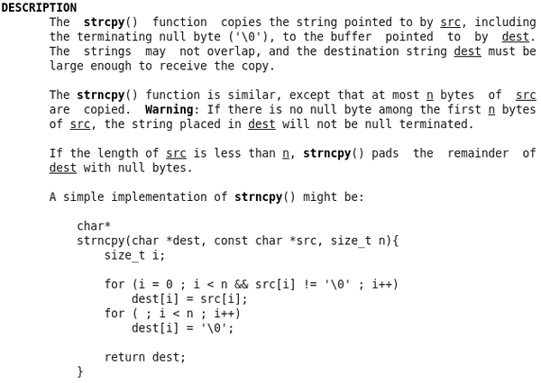
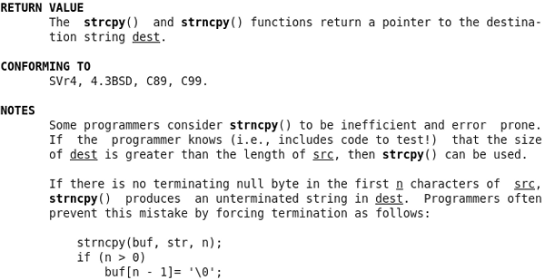
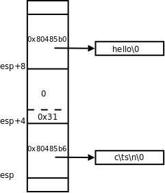

# 第二十四章 函数接口

# 第二十四章 函数接口

**目录**

*   1\. 本章的预备知识
    *   1.1\. `strcpy`与`strncpy`
    *   1.2\. `malloc`与`free`
*   2\. 传入参数与传出参数
*   3\. 两层指针的参数
*   4\. 返回值是指针的情况
*   5\. 回调函数
*   6\. 可变参数

我们在第 6 节 “折半查找”讲过，函数的调用者和函数的实现者之间订立了一个契约，在调用函数之前，调用者要为实现者提供某些条件，在函数返回时，实现者要对调用者尽到某些义务。如何描述这个契约呢？首先靠函数接口来描述，即函数名，参数，返回值，只要函数和参数的名字起得合理，参数和返回值的类型定得准确，至于这个函数怎么用，调用者单看函数接口就能猜出八九分了。函数接口并不能表达函数的全部语义，这时文档就起了重要的补充作用，函数的文档该写什么，怎么写，Man Page 为我们做了很好的榜样。

函数接口一旦和指针结合起来就变得异常灵活，有五花八门的用法，但是万变不离其宗，只要像图 23.1 “指针的基本概念”那样画图分析，指针的任何用法都能分析清楚，所以，如果上一章你真正学明白了，本章不用学也能自己领悟出来，之所以写这一章是为了照顾悟性不高的读者。本章把函数接口总结成几类常见的模式，对于每种模式，一方面讲函数接口怎么写，另一方面讲函数的文档怎么写。

## 1\. 本章的预备知识

这一节介绍本章的范例代码要用的几个 C 标准库函数。我们先体会一下这几个函数的接口是怎么设计的，Man Page 是怎么写的。其它常用的 C 标准库函数将在下一章介绍。

### 1.1\. `strcpy`与`strncpy`

从现在开始我们要用到很多库函数，在学习每个库函数时一定要看 Man Page。Man Page 随时都在我们手边，想查什么只要敲一个命令就行，然而很多初学者就是不喜欢看 Man Page，宁可满世界去查书、查资料，也不愿意看 Man Page。据我分析原因有三：

1.  英文不好。那还是先学好了英文再学编程吧，否则即使你把这本书都学透了也一样无法胜任开发工作，因为你没有进一步学习的能力。

2.  Man Page 的语言不够友好。Man Page 不像本书这样由浅入深地讲解，而是平铺直叙，不过看习惯了就好了，每个 Man Page 都不长，多看几遍自然可以抓住重点，理清头绪。本节分析一个例子，帮助读者把握 Man Page 的语言特点。

3.  Man Page 通常没有例子。描述一个函数怎么用，一靠接口，二靠文档，而不是靠例子。函数的用法无非是本章所总结的几种模式，只要把本章学透了，你就不需要每个函数都得有个例子教你怎么用了。

总之，Man Page 是一定要看的，一开始看不懂硬着头皮也要看，为了鼓励读者看 Man Page，本书不会像[[K&R]](bi01.html#bibli.kr "The C Programming Language")那样把库函数总结成一个附录附在书后面。现在我们来分析`strcpy(3)`。

**图 24.1\. `strcpy(3)`**


这个 Man Page 描述了两个函数，`strcpy`和`strncpy`，敲命令`man strcpy`或者`man strncpy`都可以看到这个 Man Page。这两个函数的作用是把一个字符串拷贝给另一个字符串。*SYNOPSIS*部分给出了这两个函数的原型，以及要用这些函数需要包含哪些头文件。参数`dest`、`src`和`n`都加了下划线，有时候并不想从头到尾阅读整个 Man Page，而是想查一下某个参数的含义，通过下划线和参数名就能很快找到你关心的部分。

`dest`表示 Destination，`src`表示 Source，看名字就能猜到是把`src`所指向的字符串拷贝到`dest`所指向的内存空间。这一点从两个参数的类型也能看出来，`dest`是`char *`型的，而`src`是`const char *`型的，说明`src`所指向的内存空间在函数中只能读不能改写，而`dest`所指向的内存空间在函数中是要改写的，显然改写的目的是当函数返回后调用者可以读取改写的结果。因此可以猜到`strcpy`函数是这样用的：

```cpp
char buf[10];
strcpy(buf, "hello");
printf(buf); 
```

至于`strncpy`的参数`n`是干什么用的，单从函数接口猜不出来，就需要看下面的文档。

**图 24.2\. `strcpy(3)`**



在文档中强调了`strcpy`在拷贝字符串时会把结尾的`'\0'`也拷到`dest`中，因此保证了`dest`中是以`'\0'`结尾的字符串。但另外一个要注意的问题是，`strcpy`只知道`src`字符串的首地址，不知道长度，它会一直拷贝到`'\0'`为止，所以`dest`所指向的内存空间要足够大，否则有可能写越界，例如：

```cpp
char buf[10];
strcpy(buf, "hello world"); 
```

如果没有保证`src`所指向的内存空间以`'\0'`结尾，也有可能读越界，例如：

```cpp
char buf[10] = "abcdefghij", str[4] = "hell";
strcpy(buf, str); 
```

因为`strcpy`函数的实现者通过函数接口无法得知`src`字符串的长度和`dest`内存空间的大小，所以“确保不会写越界”应该是调用者的责任，调用者提供的`dest`参数应该指向足够大的内存空间，“确保不会读越界”也是调用者的责任，调用者提供的`src`参数指向的内存应该确保以`'\0'`结尾。

此外，文档中还强调了`src`和`dest`所指向的内存空间不能有重叠。凡是有指针参数的 C 标准库函数基本上都有这条要求，每个指针参数所指向的内存空间互不重叠，例如这样调用是不允许的：

```cpp
char buf[10] = "hello";
strcpy(buf, buf+1); 
```

`strncpy`的参数`n`指定最多从`src`中拷贝`n`个字节到`dest`中，换句话说，如果拷贝到`'\0'`就结束，如果拷贝到`n`个字节还没有碰到`'\0'`，那么也结束，调用者负责提供适当的`n`值，以确保读写不会越界，比如让`n`的值等于`dest`所指向的内存空间的大小：

```cpp
char buf[10];
strncpy(buf, "hello world", sizeof(buf)); 
```

然而这意味着什么呢？文档中特别用了*Warning*指出，这意味着`dest`有可能不是以`'\0'`结尾的。例如上面的调用，虽然把`"hello world"`截断到 10 个字符拷贝至`buf`中，但`buf`不是以`'\0'`结尾的，如果再`printf(buf)`就会读越界。如果你需要确保`dest`以`'\0'`结束，可以这么调用：

```cpp
char buf[10];
strncpy(buf, "hello world", sizeof(buf));
buf[sizeof(buf)-1] = '\0'; 
```

`strncpy`还有一个特性，如果`src`字符串全部拷完了不足`n`个字节，那么还差多少个字节就补多少个`'\0'`，但是正如上面所述，这并不保证`dest`一定以`'\0'`结束，当`src`字符串的长度大于`n`时，不但不补多余的`'\0'`，连字符串的结尾`'\0'`也不拷贝。`strcpy(3)`的文档已经相当友好了，为了帮助理解，还给出一个`strncpy`的简单实现。

**图 24.3\. `strcpy(3)`**



函数的 Man Page 都有一部分专门讲返回值的。这两个函数的返回值都是`dest`指针。可是为什么要返回`dest`指针呢？`dest`指针本来就是调用者传过去的，再返回一遍`dest`指针并没有提供任何有用的信息。之所以这么规定是为了把函数调用当作一个指针类型的表达式使用，比如`printf("%s\n", strcpy(buf, "hello"))`，一举两得，如果`strcpy`的返回值是`void`就没有这么方便了。

*CONFORMING TO*部分描述了这个函数是遵照哪些标准实现的。`strcpy`和`strncpy`是 C 标准库函数，当然遵照 C99 标准。以后我们还会看到`libc`中有些函数属于 POSIX 标准但并不属于 C 标准，例如`write(2)`。

*NOTES*部分给出一些提示信息。这里指出如何确保`strncpy`的`dest`以`'\0'`结尾，和我们上面给出的代码类似，但由于`n`是个变量，在执行`buf[n - 1]= '\0';`之前先检查一下`n`是否大于 0，如果`n`不大于 0，`buf[n - 1]`就访问越界了，所以要避免。

**图 24.4\. `strcpy(3)`**


*BUGS*部分说明了使用这些函数可能引起的 Bug，这部分一定要仔细看。用`strcpy`比用`strncpy`更加不安全，如果在调用`strcpy`之前不仔细检查`src`字符串的长度就有可能写越界，这是一个很常见的错误，例如：

```cpp
void foo(char *str)
{
    char buf[10];
    strcpy(buf, str);
    ...
} 
```

`str`所指向的字符串有可能超过 10 个字符而导致写越界，在第 4 节 “段错误”我们看到过，这种写越界可能当时不出错，而在函数返回时出现段错误，原因是写越界覆盖了保存在栈帧上的返回地址，函数返回时跳转到非法地址，因而出错。像`buf`这种由调用者分配并传给函数读或写的一段内存通常称为缓冲区（Buffer），缓冲区写越界的错误称为缓冲区溢出（Buffer Overflow）。如果只是出现段错误那还不算严重，更严重的是缓冲区溢出 Bug 经常被恶意用户利用，使函数返回时跳转到一个事先设好的地址，执行事先设好的指令，如果设计得巧妙甚至可以启动一个 Shell，然后随心所欲执行任何命令，可想而知，如果一个用`root`权限执行的程序存在这样的 Bug，被攻陷了，后果将很严重。至于怎样巧妙设计和攻陷一个有缓冲区溢出 Bug 的程序，有兴趣的读者可以参考[[SmashStack]](bi01.html#bibli.smashstack "Smashing The Stack For Fun And Profit，网上到处都可以搜到这篇文章")。

#### 习题

1、自己实现一个`strcpy`函数，尽可能简洁，按照本书的编码风格你能用三行代码写出函数体吗？

2、编一个函数，输入一个字符串，要求做一个新字符串，把其中所有的一个或多个连续的空白字符都压缩为一个空格。这里所说的空白包括空格、'\t'、'\n'、'\r'。例如原来的字符串是：

```cpp
This Content hoho       is ok
        ok?

        file system
uttered words   ok ok      ?
end. 
```

压缩了空白之后就是：

```cpp
This Content hoho is ok ok? file system uttered words ok ok ? end. 
```

实现该功能的函数接口要求符合下述规范：

```cpp
char *shrink_space(char *dest, const char *src, size_t n); 
```

各项参数和返回值的含义和`strncpy`类似。完成之后，为自己实现的函数写一个 Man Page。

### 1.2\. `malloc`与`free`

程序中需要动态分配一块内存时怎么办呢？可以像上一节那样定义一个缓冲区数组。这种方法不够灵活，C89 要求定义的数组是固定长度的，而程序往往在运行时才知道要动态分配多大的内存，例如：

```cpp
void foo(char *str, int n)
{
    char buf[?];
    strncpy(buf, str, n);
    ...
} 
```

`n`是由参数传进来的，事先不知道是多少，那么`buf`该定义多大呢？在第 1 节 “数组的基本概念”讲过 C99 引入 VLA 特性，可以定义`char buf[n+1] = {};`，这样可确保`buf`是以`'\0'`结尾的。但即使用 VLA 仍然不够灵活，VLA 是在栈上动态分配的，函数返回时就要释放，如果我们希望动态分配一块全局的内存空间，在各函数中都可以访问呢？由于全局数组无法定义成 VLA，所以仍然不能满足要求。

其实在第 5 节 “虚拟内存管理”提过，进程有一个堆空间，C 标准库函数`malloc`可以在堆空间动态分配内存，它的底层通过`brk`系统调用向操作系统申请内存。动态分配的内存用完之后可以用`free`释放，更准确地说是归还给`malloc`，这样下次调用`malloc`时这块内存可以再次被分配。本节学习这两个函数的用法和工作原理。

```cpp
#include <stdlib.h>

void *malloc(size_t size);
返回值：成功返回所分配内存空间的首地址，出错返回 NULL

void free(void *ptr); 
```

`malloc`的参数`size`表示要分配的字节数，如果分配失败（可能是由于系统内存耗尽）则返回`NULL`。由于`malloc`函数不知道用户拿到这块内存要存放什么类型的数据，所以返回通用指针`void *`，用户程序可以转换成其它类型的指针再访问这块内存。`malloc`函数保证它返回的指针所指向的地址满足系统的对齐要求，例如在 32 位平台上返回的指针一定对齐到 4 字节边界，以保证用户程序把它转换成任何类型的指针都能用。

动态分配的内存用完之后可以用`free`释放掉，传给`free`的参数正是先前`malloc`返回的内存块首地址。举例如下：

**例 24.1\. malloc 和 free**

```cpp
#include <stdio.h>
#include <stdlib.h>
#include <string.h>

typedef struct {
    int number;
    char *msg;
} unit_t;

int main(void)
{
    unit_t *p = malloc(sizeof(unit_t));

    if (p == NULL) {
        printf("out of memory\n");
        exit(1);
    }
    p->number = 3;
    p->msg = malloc(20);
    strcpy(p->msg, "Hello world!");
    printf("number: %d\nmsg: %s\n", p->number, p->msg);
    free(p->msg);
    free(p);
    p = NULL;

    return 0;
} 
```

关于这个程序要注意以下几点：

*   `unit_t *p = malloc(sizeof(unit_t));`这一句，等号右边是`void *`类型，等号左边是`unit_t *`类型，编译器会做隐式类型转换，我们讲过`void *`类型和任何指针类型之间可以相互隐式转换。

*   虽然内存耗尽是很不常见的错误，但写程序要规范，`malloc`之后应该判断是否成功。以后要学习的大部分系统函数都有成功的返回值和失败的返回值，每次调用系统函数都应该判断是否成功。

*   `free(p);`之后，`p`所指的内存空间是归还了，但是`p`的值并没有变，因为从`free`的函数接口来看根本就没法改变`p`的值，`p`现在指向的内存空间已经不属于用户，换句话说，`p`成了野指针，为避免出现野指针，我们应该在`free(p);`之后手动置`p = NULL;`。

*   应该先`free(p-&gt;msg)`，再`free(p)`。如果先`free(p)`，`p`成了野指针，就不能再通过`p-&gt;msg`访问内存了。

上面的例子只有一个简单的顺序控制流程，分配内存，赋值，打印，释放内存，退出程序。这种情况下即使不用`free`释放内存也可以，因为程序退出时整个进程地址空间都会释放，包括堆空间，该进程占用的所有内存都会归还给操作系统。但如果一个程序长年累月运行（例如网络服务器程序），并且在循环或递归中调用`malloc`分配内存，则必须有`free`与之配对，分配一次就要释放一次，否则每次循环都分配内存，分配完了又不释放，就会慢慢耗尽系统内存，这种错误称为内存泄漏（Memory Leak）。另外，`malloc`返回的指针一定要保存好，只有把它传给`free`才能释放这块内存，如果这个指针丢失了，就没有办法`free`这块内存了，也会造成内存泄漏。例如：

```cpp
void foo(void)
{
    char *p = malloc(10);
    ...
} 
```

`foo`函数返回时要释放局部变量`p`的内存空间，它所指向的内存地址就丢失了，这 10 个字节也就没法释放了。内存泄漏的 Bug 很难找到，因为它不会像访问越界一样导致程序运行错误，少量内存泄漏并不影响程序的正确运行，大量的内存泄漏会使系统内存紧缺，导致频繁换页，不仅影响当前进程，而且把整个系统都拖得很慢。

关于`malloc`和`free`还有一些特殊情况。`malloc(0)`这种调用也是合法的，也会返回一个非`NULL`的指针，这个指针也可以传给`free`释放，但是不能通过这个指针访问内存。`free(NULL)`也是合法的，不做任何事情，但是`free`一个野指针是不合法的，例如先调用`malloc`返回一个指针`p`，然后连着调用两次`free(p);`，则后一次调用会产生运行时错误。

[[K&R]](bi01.html#bibli.kr "The C Programming Language")的 8.7 节给出了`malloc`和`free`的简单实现，基于环形链表。目前读者还没有学习链表，看那段代码会有点困难，我再做一些简化，图示如下，目的是让读者理解`malloc`和`free`的工作原理。`libc`的实现比这要复杂得多，但基本工作原理也是如此。读者只要理解了基本工作原理，就很容易分析在使用`malloc`和`free`时遇到的各种 Bug 了。

**图 24.5\. 简单的`malloc`和`free`实现**


图中白色背景的框表示`malloc`管理的空闲内存块，深色背景的框不归`malloc`管，可能是已经分配给用户的内存块，也可能不属于当前进程，Break 之上的地址不属于当前进程，需要通过`brk`系统调用向内核申请。每个内存块开头都有一个头节点，里面有一个指针字段和一个长度字段，指针字段把所有空闲块的头节点串在一起，组成一个环形链表，长度字段记录着头节点和后面的内存块加起来一共有多长，以 8 字节为单位（也就是以头节点的长度为单位）。

1.  一开始堆空间由一个空闲块组成，长度为 7×8=56 字节，除头节点之外的长度为 48 字节。

2.  调用`malloc`分配 8 个字节，要在这个空闲块的末尾截出 16 个字节，其中新的头节点占了 8 个字节，另外 8 个字节返回给用户使用，注意返回的指针`p1`指向头节点后面的内存块。

3.  又调用`malloc`分配 16 个字节，又在空闲块的末尾截出 24 个字节，步骤和上一步类似。

4.  调用`free`释放`p1`所指向的内存块，内存块（包括头节点在内）归还给了`malloc`，现在`malloc`管理着两块不连续的内存，用环形链表串起来。注意这时`p1`成了野指针，指向不属于用户的内存，`p1`所指向的内存地址在 Break 之下，是属于当前进程的，所以访问`p1`时不会出现段错误，但在访问`p1`时这段内存可能已经被`malloc`再次分配出去了，可能会读到意外改写数据。另外注意，此时如果通过`p2`向右写越界，有可能覆盖右边的头节点，从而破坏`malloc`管理的环形链表，`malloc`就无法从一个空闲块的指针字段找到下一个空闲块了，找到哪去都不一定，全乱套了。

5.  调用`malloc`分配 16 个字节，现在虽然有两个空闲块，各有 8 个字节可分配，但是这两块不连续，`malloc`只好通过`brk`系统调用抬高 Break，获得新的内存空间。在[[K&R]](bi01.html#bibli.kr "The C Programming Language")的实现中，每次调用`sbrk`函数时申请 1024×8=8192 个字节，在 Linux 系统上`sbrk`函数也是通过`brk`实现的，这里为了画图方便，我们假设每次调用`sbrk`申请 32 个字节，建立一个新的空闲块。

6.  新申请的空闲块和前一个空闲块连续，因此可以合并成一个。在能合并时要尽量合并，以免空闲块越割越小，无法满足大的分配请求。

7.  在合并后的这个空闲块末尾截出 24 个字节，新的头节点占 8 个字节，另外 16 个字节返回给用户。

8.  调用`free(p3)`释放这个内存块，由于它和前一个空闲块连续，又重新合并成一个空闲块。注意，Break 只能抬高而不能降低，从内核申请到的内存以后都归`malloc`管了，即使调用`free`也不会还给内核。

#### 习题

1、小练习：编写一个小程序让它耗尽系统内存。观察一下，分配了多少内存后才会出现分配失败？内存耗尽之后会怎么样？会不会死机？

## 2\. 传入参数与传出参数

如果函数接口有指针参数，既可以把指针所指向的数据传给函数使用（称为传入参数），也可以由函数填充指针所指的内存空间，传回给调用者使用（称为传出参数），例如`strcpy`的`src`参数是传入参数，`dest`参数是传出参数。有些函数的指针参数同时担当了这两种角色，如`select(2)`的`fd_set *`参数，既是传入参数又是传出参数，这称为 Value-result 参数。

**表 24.1\. 传入参数示例：`void func(const unit_t *p);`**

| 调用者 | 实现者 |
| --- | --- |
| 1\. 分配`p`所指的内存空间 2\. 在`p`所指的内存空间中保存数据 3\. 调用函数 4\. 由于有`const`限定符，调用者可以确信`p`所指的内存空间不会被改变 | 1\. 规定指针参数的类型`unit_t *` 2\. 读取`p`所指的内存空间 |

想一想，如果有函数接口`void func(const int p);`这里的`const`有意义吗？

**表 24.2\. 传出参数示例：`void func(unit_t *p);`**

| 调用者 | 实现者 |
| --- | --- |
| 1\. 分配`p`所指的内存空间 2\. 调用函数 3\. 读取`p`所指的内存空间 | 1\. 规定指针参数的类型`unit_t *` 2\. 在`p`所指的内存空间中保存数据 |

**表 24.3\. Value-result 参数示例：`void func(unit_t *p);`**

| 调用者 | 实现者 |
| --- | --- |
| 1\. 分配 p 所指的内存空间 2\. 在`p`所指的内存空间保存数据 3\. 调用函数 4\. 读取`p`所指的内存空间 | 1\. 规定指针参数的类型`unit_t *` 2\. 读取`p`所指的内存空间 3\. 改写`p`所指的内存空间 |

由于传出参数和 Value-result 参数的函数接口完全相同，应该在文档中说明是哪种参数。

以下是一个传出参数的完整例子：

**例 24.2\. 传出参数**

```cpp
/* populator.h */
#ifndef POPULATOR_H
#define POPULATOR_H

typedef struct {
     int number;
     char msg[20];
} unit_t;

extern void set_unit(unit_t *);

#endif 
```

```cpp
/* populator.c */
#include <string.h>
#include "populator.h"

void set_unit(unit_t *p)
{
     if (p == NULL)
          return; /* ignore NULL parameter */
     p->number = 3;
     strcpy(p->msg, "Hello World!");
} 
```

```cpp
/* main.c */
#include <stdio.h>
#include "populator.h"

int main(void)
{
     unit_t u;

     set_unit(&u);
     printf("number: %d\nmsg: %s\n", u.number, u.msg);
     return 0;
} 
```

很多系统函数对于指针参数是`NULL`的情况有特殊规定：如果传入参数是`NULL`表示取缺省值，例如`pthread_create(3)`的`pthread_attr_t *`参数，也可能表示不做特别处理，例如`free`的参数；如果传出参数是`NULL`表示调用者不需要传出值，例如`time(2)`的参数。这些特殊规定应该在文档中写清楚。

## 3\. 两层指针的参数

两层指针也是指针，同样可以表示传入参数、传出参数或者 Value-result 参数，只不过该参数所指的内存空间应该解释成一个指针变量。用两层指针做传出参数的系统函数也很常见，比如`pthread_join(3)`的`void **`参数。下面看一个简单的例子。

**例 24.3\. 两层指针做传出参数**

```cpp
/* redirect_ptr.h */
#ifndef REDIRECT_PTR_H
#define REDIRECT_PTR_H

extern void get_a_day(const char **);

#endif 
```

想一想，这里的参数指针是`const char **`，有`const`限定符，却不是传入参数而是传出参数，为什么？如果是传入参数应该怎么表示？

```cpp
/* redirect_ptr.c */
#include "redirect_ptr.h"

static const char *msg[] = {"Sunday", "Monday", "Tuesday", "Wednesday",
            "Thursday", "Friday", "Saturday"};
void get_a_day(const char **pp)
{
     static int i = 0;
     *pp = msg[i%7];
     i++;
} 
```

```cpp
/* main.c */
#include <stdio.h>
#include "redirect_ptr.h"

int main(void)
{
     const char *firstday = NULL;
     const char *secondday = NULL;
     get_a_day(&firstday);
     get_a_day(&secondday);
     printf("%s\t%s\n", firstday, secondday);
     return 0;
} 
```

两层指针作为传出参数还有一种特别的用法，可以在函数中分配内存，调用者通过传出参数取得指向该内存的指针，比如`getaddrinfo(3)`的`struct addrinfo **`参数。一般来说，实现一个分配内存的函数就要实现一个释放内存的函数，所以`getaddrinfo(3)`有一个对应的`freeaddrinfo(3)`函数。

**表 24.4\. 通过参数分配内存示例：`void alloc_unit(unit_t** pp);``void free_unit(unit_t *p);`**

| 调用者 | 实现者 |
| --- | --- |
| 1\. 分配`pp`所指的指针变量的空间 2\. 调用`alloc_unit`分配内存 3\. 读取`pp`所指的指针变量，通过后者使用`alloc_unit`分配的内存 4\. 调用`free_unit`释放内存 | 1\. 规定指针参数的类型`unit_t **` 2\. `alloc_unit`分配`unit_t`的内存并初始化，为`pp`所指的指针变量赋值 3\. `free_unit`释放在`alloc_unit`中分配的内存 |

**例 24.4\. 通过两层指针参数分配内存**

```cpp
/* para_allocator.h */
#ifndef PARA_ALLOCATOR_H
#define PARA_ALLOCATOR_H

typedef struct {
     int number;
     char *msg;
} unit_t;

extern void alloc_unit(unit_t **);
extern void free_unit(unit_t *);

#endif 
```

```cpp
/* para_allocator.c */
#include <stdio.h>
#include <string.h>
#include <stdlib.h>
#include "para_allocator.h"

void alloc_unit(unit_t **pp)
{
     unit_t *p = malloc(sizeof(unit_t));
     if(p == NULL) {
      printf("out of memory\n");
      exit(1);
     }
     p->number = 3;
     p->msg = malloc(20);
     strcpy(p->msg, "Hello World!");
     *pp = p;
}

void free_unit(unit_t *p)
{
     free(p->msg);
     free(p);
} 
```

```cpp
/* main.c */
#include <stdio.h>
#include "para_allocator.h"

int main(void)
{
     unit_t *p = NULL;

     alloc_unit(&p);
     printf("number: %d\nmsg: %s\n", p->number, p->msg);
     free_unit(p);
     p = NULL;
     return 0;
} 
```

思考一下，为什么在`main`函数中不能直接调用`free(p)`释放内存，而要调用`free_unit(p)`？为什么一层指针的函数接口`void alloc_unit(unit_t *p);`不能分配内存，而一定要用两层指针的函数接口？

总结一下，两层指针参数如果是传出的，可以有两种情况：第一种情况，传出的指针指向静态内存（比如上面的例子），或者指向已分配的动态内存（比如指向某个链表的节点）；第二种情况是在函数中动态分配内存，然后传出的指针指向这块内存空间，这种情况下调用者应该在使用内存之后调用释放内存的函数，调用者的责任是请求分配和请求释放内存，实现者的责任是完成分配内存和释放内存的操作。由于这两种情况的函数接口相同，应该在文档中说明是哪一种情况。

## 4\. 返回值是指针的情况

返回值显然是传出的而不是传入的，如果返回值传出的是指针，和上一节通过参数传出指针类似，也分为两种情况：第一种是传出指向静态内存或已分配的动态内存的指针，例如`localtime(3)`和`inet_ntoa(3)`，第二种是在函数中动态分配内存并传出指向这块内存的指针，例如`malloc(3)`，这种情况通常还要实现一个释放内存的函数，所以有和`malloc(3)`对应的`free(3)`。由于这两种情况的函数接口相同，应该在文档中说明是哪一种情况。

**表 24.5\. 返回指向已分配内存的指针示例`：unit_t *func(void);`**

| 调用者 | 实现者 |
| --- | --- |
| 1\. 调用函数 2\. 将返回值保存下来以备后用 | 1\. 规定返回值指针的类型`unit_t *` 2\. 返回一个指针 |

以下是一个完整的例子。

**例 24.5\. 返回指向已分配内存的指针**

```cpp
/* ret_ptr.h */
#ifndef RET_PTR_H
#define RET_PTR_H

extern char *get_a_day(int idx);

#endif 
```

```cpp
/* ret_ptr.c */
#include <string.h>
#include "ret_ptr.h"

static const char *msg[] = {"Sunday", "Monday", "Tuesday", "Wednesday",
            "Thursday", "Friday", "Saturday"};

char *get_a_day(int idx)
{
     static char buf[20];
     strcpy(buf, msg[idx]);
     return buf;
} 
```

```cpp
/* main.c */
#include <stdio.h>
#include "ret_ptr.h"

int main(void)
{
     printf("%s %s\n", get_a_day(0), get_a_day(1));
     return 0;
} 
```

这个程序的运行结果是`Sunday Monday`吗？请读者自己分析一下。

**表 24.6\. 动态分配内存并返回指针示例：`unit_t *alloc_unit(void);` `void free_unit(unit_t *p)`;**

| 调用者 | 实现者 |
| --- | --- |
| 1\. 调用`alloc_unit`分配内存 2\. 将返回值保存下来以备后用 3\. 调用`free_unit`释放内存 | 1\. 规定返回值指针的类型`unit_t *` 2\. `alloc_unit`分配内存并返回指向该内存的指针 3\. `free_unit`释放由`alloc_unit`分配的内存 |

以下是一个完整的例子。

**例 24.6\. 动态分配内存并返回指针**

```cpp
/* ret_allocator.h */
#ifndef RET_ALLOCATOR_H
#define RET_ALLOCATOR_H

typedef struct {
     int number;
     char *msg;
} unit_t;

extern unit_t *alloc_unit(void);
extern void free_unit(unit_t *);

#endif 
```

```cpp
/* ret_allocator.c */
#include <stdio.h>
#include <string.h>
#include <stdlib.h>
#include "ret_allocator.h"

unit_t *alloc_unit(void)
{
     unit_t *p = malloc(sizeof(unit_t));
     if(p == NULL) {
      printf("out of memory\n");
      exit(1);
     }
     p->number = 3;
     p->msg = malloc(20);
     strcpy(p->msg, "Hello world!");
     return p;
}

void free_unit(unit_t *p)
{
     free(p->msg);
     free(p);
} 
```

```cpp
/* main.c */
#include <stdio.h>
#include "ret_allocator.h"

int main(void)
{
     unit_t *p = alloc_unit();

     printf("number: %d\nmsg: %s\n", p->number, p->msg);
     free_unit(p);
     p = NULL;
     return 0;
} 
```

思考一下，通过参数分配内存需要两层的指针，而通过返回值分配内存就只需要返回一层的指针，为什么？

## 5\. 回调函数

如果参数是一个函数指针，调用者可以传递一个函数的地址给实现者，让实现者去调用它，这称为回调函数（Callback Function）。例如`qsort(3)`和`bsearch(3)`。

**表 24.7\. 回调函数示例：`void func(void (*f)(void *), void *p);`**

| 调用者 | 实现者 |
| --- | --- |
| 1\. 提供一个回调函数，再提供一个准备传给回调函数的参数。 2\. 把回调函数传给参数`f`，把准备传给回调函数的参数按`void *`类型传给参数`p` | 1\. 在适当的时候根据调用者传来的函数指针`f`调用回调函数，将调用者传来的参数`p`转交给回调函数，即调用`f(p);` |

以下是一个简单的例子。实现了一个`repeat_three_times`函数，可以把调用者传来的任何回调函数连续执行三次。

**例 24.7\. 回调函数**

```cpp
/* para_callback.h */
#ifndef PARA_CALLBACK_H
#define PARA_CALLBACK_H

typedef void (*callback_t)(void *);
extern void repeat_three_times(callback_t, void *);

#endif 
```

```cpp
/* para_callback.c */
#include "para_callback.h"

void repeat_three_times(callback_t f, void *para)
{
     f(para);
     f(para);
     f(para);
} 
```

```cpp
/* main.c */
#include <stdio.h>
#include "para_callback.h"

void say_hello(void *str)
{
     printf("Hello %s\n", (const char *)str);
}

void count_numbers(void *num)
{
     int i;
     for(i=1; i<=(int)num; i++)
      printf("%d ", i);
     putchar('\n');
}

int main(void)
{
     repeat_three_times(say_hello, "Guys");
     repeat_three_times(count_numbers, (void *)4);
     return 0;
} 
```

回顾一下前面几节的例子，参数类型都是由实现者规定的。而本例中回调函数的参数按什么类型解释由调用者规定，对于实现者来说就是一个`void *`指针，实现者只负责将这个指针转交给回调函数，而不关心它到底指向什么数据类型。调用者知道自己传的参数是`char *`型的，那么在自己提供的回调函数中就应该知道参数要转换成`char *`型来解释。

回调函数的一个典型应用就是实现类似 C++的泛型算法（Generics Algorithm）。下面实现的`max`函数可以在任意一组对象中找出最大值，可以是一组`int`、一组`char`或者一组结构体，但是实现者并不知道怎样去比较两个对象的大小，调用者需要提供一个做比较操作的回调函数。

**例 24.8\. 泛型算法**

```cpp
/* generics.h */
#ifndef GENERICS_H
#define GENERICS_H

typedef int (*cmp_t)(void *, void *);
extern void *max(void *data[], int num, cmp_t cmp);

#endif 
```

```cpp
/* generics.c */
#include "generics.h"

void *max(void *data[], int num, cmp_t cmp)
{
     int i;
     void *temp = data[0];
     for(i=1; i<num; i++) {
      if(cmp(temp, data[i])<0)
           temp = data[i];
     }
     return temp;
} 
```

```cpp
/* main.c */
#include <stdio.h>
#include "generics.h"

typedef struct {
     const char *name;
     int score;
} student_t;

int cmp_student(void *a, void *b)
{
     if(((student_t *)a)->score > ((student_t *)b)->score)
      return 1;
     else if(((student_t *)a)->score == ((student_t *)b)->score)
      return 0;
     else
      return -1;
}

int main(void)
{
     student_t list[4] = {{"Tom", 68}, {"Jerry", 72},
               {"Moby", 60}, {"Kirby", 89}};
     student_t *plist[4] = {&list[0], &list[1], &list[2], &list[3]};
     student_t *pmax = max((void **)plist, 4, cmp_student);
     printf("%s gets the highest score %d\n", pmax->name, pmax->score);

     return 0;
} 
```

`max`函数之所以能对一组任意类型的对象进行操作，关键在于传给`max`的是指向对象的指针所构成的数组，而不是对象本身所构成的数组，这样`max`不必关心对象到底是什么类型，只需转给比较函数`cmp`，然后根据比较结果做相应操作即可，`cmp`是调用者提供的回调函数，调用者当然知道对象是什么类型以及如何比较。

以上举例的回调函数是被同步调用的，调用者调用`max`函数，`max`函数则调用`cmp`函数，相当于调用者间接调了自己提供的回调函数。在实际系统中，异步调用也是回调函数的一种典型用法，调用者首先将回调函数传给实现者，实现者记住这个函数，这称为*注册*一个回调函数，然后当某个事件发生时实现者再调用先前注册的函数，比如`sigaction(2)`注册一个信号处理函数，当信号产生时由系统调用该函数进行处理，再比如`pthread_create(3)`注册一个线程函数，当发生调度时系统切换到新注册的线程函数中运行，在 GUI 编程中异步回调函数更是有普遍的应用，例如为某个按钮注册一个回调函数，当用户点击按钮时调用它。

以下是一个代码框架。

```cpp
/* registry.h */
#ifndef REGISTRY_H
#define REGISTRY_H

typedef void (*registry_t)(void);
extern void register_func(registry_t);

#endif 
```

```cpp
/* registry.c */
#include <unistd.h>
#include "registry.h"

static registry_t func;

void register_func(registry_t f)
{
     func = f;
}

static void on_some_event(void)
{
     ...
     func();
     ...
} 
```

既然参数可以是函数指针，返回值同样也可以是函数指针，因此可以有`func()();`这样的调用。返回函数的函数在 C 语言中很少见，在一些函数式编程语言（例如 LISP）中则很常见，基本思想是把函数也当作一种数据来操作，输入、输出和参与运算，操作函数的函数称为高阶函数（High-order Function）。

### 习题

1、[[K&R]](bi01.html#bibli.kr "The C Programming Language")的 5.6 节有一个`qsort`函数的实现，可以对一组任意类型的对象做快速排序。请读者仿照那个例子，写一个插入排序的函数和一个折半查找的函数。

## 6\. 可变参数

到目前为止我们只见过一个带有可变参数的函数`printf`：

```cpp
int printf(const char *format, ...); 
```

以后还会见到更多这样的函数。现在我们实现一个简单的`myprintf`函数：

**例 24.9\. 用可变参数实现简单的 printf 函数**

```cpp
#include <stdio.h>
#include <stdarg.h>

void myprintf(const char *format, ...)
{
     va_list ap;
     char c;

     va_start(ap, format);
     while (c = *format++) {
      switch(c) {
      case 'c': {
           /* char is promoted to int when passed through '...' */
           char ch = va_arg(ap, int);
           putchar(ch);
           break;
      }
      case 's': {
           char *p = va_arg(ap, char *);
           fputs(p, stdout);
           break;
      }
      default:
           putchar(c);
      }
     }
     va_end(ap);
}

int main(void)
{
     myprintf("c\ts\n", '1', "hello");
     return 0;
} 
```

要处理可变参数，需要用 C 到标准库的`va_list`类型和`va_start`、`va_arg`、`va_end`宏，这些定义在`stdarg.h`头文件中。这些宏是如何取出可变参数的呢？我们首先对照反汇编分析在调用`myprintf`函数时这些参数的内存布局。

```cpp
 myprintf("c\ts\n", '1', "hello");
 80484c5:    c7 44 24 08 b0 85 04     movl   $0x80485b0,0x8(%esp)
 80484cc:    08 
 80484cd:    c7 44 24 04 31 00 00     movl   $0x31,0x4(%esp)
 80484d4:    00 
 80484d5:    c7 04 24 b6 85 04 08     movl   $0x80485b6,(%esp)
 80484dc:    e8 43 ff ff ff           call   8048424 <myprintf> 
```

**图 24.6\. `myprintf`函数的参数布局**



这些参数是从右向左依次压栈的，所以第一个参数靠近栈顶，第三个参数靠近栈底。这些参数在内存中是连续存放的，每个参数都对齐到 4 字节边界。第一个和第三个参数都是指针类型，各占 4 个字节，虽然第二个参数只占一个字节，但为了使第三个参数对齐到 4 字节边界，所以第二个参数也占 4 个字节。现在给出一个`stdarg.h`的简单实现，这个实现出自[[Standard C Library]](bi01.html#bibli.standardclib "The Standard C Library")：

**例 24.10\. stdarg.h 的一种实现**

```cpp
/* stdarg.h standard header */
#ifndef _STDARG
#define _STDARG

/* type definitions */
typedef char *va_list;
/* macros */
#define va_arg(ap, T) \
    (* (T *)(((ap) += _Bnd(T, 3U)) - _Bnd(T, 3U)))
#define va_end(ap) (void)0
#define va_start(ap, A) \
    (void)((ap) = (char *)&(A) + _Bnd(A, 3U))
#define _Bnd(X, bnd) (sizeof (X) + (bnd) & ~(bnd))
#endif 
```

这个头文件中的内部宏定义`_Bnd(X, bnd)`将类型或变量`X`的长度对齐到`bnd+1`字节的整数倍，例如`_Bnd(char, 3U)`的值是 4，`_Bnd(int, 3U)`也是 4。

在`myprintf`中定义的`va_list ap;`其实是一个指针，`va_start(ap, format)`使`ap`指向`format`参数的下一个参数，也就是指向上图中`esp+4`的位置。然后`va_arg(ap, int)`把第二个参数的值按`int`型取出来，同时使`ap`指向第三个参数，也就是指向上图中`esp+8`的位置。然后`va_arg(ap, char *)`把第三个参数的值按`char *`型取出来，同时使`ap`指向更高的地址。`va_end(ap)`在我们的简单实现中不起任何作用，在有些实现中可能会把`ap`改写成无效值，C 标准要求在函数返回前调用`va_end`。

如果把`myprintf`中的`char ch = va_arg(ap, int);`改成`char ch = va_arg(ap, char);`，用我们这个`stdarg.h`的简单实现是没有问题的。但如果改用`libc`提供的`stdarg.h`，在编译时会报错：

```cpp
$ gcc main.c
main.c: In function ‘myprintf’:
main.c:33: warning: ‘char’ is promoted to ‘int’ when passed through ‘...’
main.c:33: note: (so you should pass ‘int’ not ‘char’ to ‘va_arg’)
main.c:33: note: if this code is reached, the program will abort
$ ./a.out
Illegal instruction 
```

因此要求`char`型的可变参数必须按`int`型来取，这是为了与 C 标准一致，我们在第 3.1 节 “Integer Promotion”讲过 Default Argument Promotion 规则，传递`char`型的可变参数时要提升为`int`型。

从`myprintf`的例子可以理解`printf`的实现原理，`printf`函数根据第一个参数（格式化字符串）来确定后面有几个参数，分别是什么类型。保证参数的类型、个数与格式化字符串的描述相匹配是调用者的责任，实现者只管按格式化字符串的描述从栈上取数据，如果调用者传递的参数类型或个数不正确，实现者是没有办法避免错误的。

还有一种方法可以确定可变参数的个数，就是在参数列表的末尾传一个 Sentinel，例如`NULL`。`execl(3)`就采用这种方法确定参数的个数。下面实现一个`printlist`函数，可以打印若干个传入的字符串。

**例 24.11\. 根据 Sentinel 判断可变参数的个数**

```cpp
#include <stdio.h>
#include <stdarg.h>

void printlist(int begin, ...)
{
     va_list ap;
     char *p;

     va_start(ap, begin);
     p = va_arg(ap, char *);

     while (p != NULL) {
      fputs(p, stdout);
      putchar('\n');
      p = va_arg(ap, char*);
     }
     va_end(ap);
}

int main(void)
{
     printlist(0, "hello", "world", "foo", "bar", NULL);
     return 0;
} 
```

`printlist`的第一个参数`begin`的值并没有用到，但是 C 语言规定至少要定义一个有名字的参数，因为`va_start`宏要用到参数列表中最后一个有名字的参数，从它的地址开始找可变参数的位置。实现者应该在文档中说明参数列表必须以`NULL`结尾，如果调用者不遵守这个约定，实现者是没有办法避免错误的。

### 习题

1、实现一个功能更完整的`printf`，能够识别`%`，能够处理`%d`、`%f`对应的整数参数。在实现中不许调用`printf(3)`这个 Man Page 中描述的任何函数。