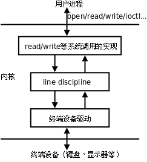
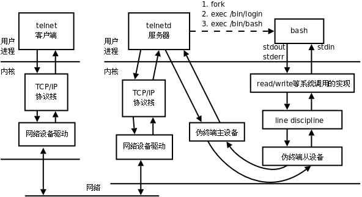
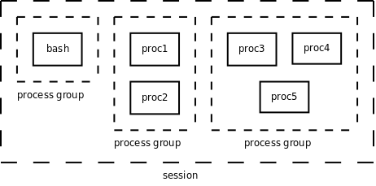

# 第三十四章 终端、作业控制与守护进程

# 第三十四章 终端、作业控制与守护进程

**目录**

*   1\. 终端
    *   1.1\. 终端的基本概念
    *   1.2\. 终端登录过程
    *   1.3\. 网络登录过程
*   2\. 作业控制
    *   2.1\. Session 与进程组
    *   2.2\. 与作业控制有关的信号
*   3\. 守护进程

## 1\. 终端

### 1.1\. 终端的基本概念

在 UNIX 系统中，用户通过终端登录系统后得到一个 Shell 进程，这个终端成为 Shell 进程的控制终端（Controlling Terminal），在第 1 节 “引言”讲过，控制终端是保存在 PCB 中的信息，而我们知道`fork`会复制 PCB 中的信息，因此由 Shell 进程启动的其它进程的控制终端也是这个终端。默认情况下（没有重定向），每个进程的标准输入、标准输出和标准错误输出都指向控制终端，进程从标准输入读也就是读用户的键盘输入，进程往标准输出或标准错误输出写也就是输出到显示器上。此外在第三十三章 *信号*还讲过，在控制终端输入一些特殊的控制键可以给前台进程发信号，例如 Ctrl-C 表示`SIGINT`，Ctrl-\表示`SIGQUIT`。

在第二十八章 *文件与 I/O*中讲过，每个进程都可以通过一个特殊的设备文件`/dev/tty`访问它的控制终端。事实上每个终端设备都对应一个不同的设备文件，`/dev/tty`提供了一个通用的接口，一个进程要访问它的控制终端既可以通过`/dev/tty`也可以通过该终端设备所对应的设备文件来访问。`ttyname`函数可以由文件描述符查出对应的文件名，该文件描述符必须指向一个终端设备而不能是任意文件。下面我们通过实验看一下各种不同的终端所对应的设备文件名。

**例 34.1\. 查看终端对应的设备文件名**

```cpp
#include <unistd.h>
#include <stdio.h>

int main()
{
    printf("fd 0: %s\n", ttyname(0));
    printf("fd 1: %s\n", ttyname(1));
    printf("fd 2: %s\n", ttyname(2));
    return 0;
} 
```

在图形终端窗口下运行这个程序，可能会得到

```cpp
$ ./a.out
fd 0: /dev/pts/0
fd 1: /dev/pts/0
fd 2: /dev/pts/0 
```

再开一个终端窗口运行这个程序，可能又会得到

```cpp
$ ./a.out
fd 0: /dev/pts/1
fd 1: /dev/pts/1
fd 2: /dev/pts/1 
```

用 Ctrl-Alt-F1 切换到字符终端运行这个程序，结果是

```cpp
$ ./a.out
fd 0: /dev/tty1
fd 1: /dev/tty1
fd 2: /dev/tty1 
```

读者可以再试试在 Ctrl-Alt-F2 的字符终端下或者在`telnet`或`ssh`登陆的网络终端下运行这个程序，看看结果是什么。

### 1.2\. 终端登录过程

一台 PC 通常只有一套键盘和显示器，也就是只有一套终端设备，但是可以通过 Ctrl-Alt-F1~Ctrl-Alt-F6 切换到 6 个字符终端，相当于有 6 套虚拟的终端设备，它们共用同一套物理终端设备，对应的设备文件分别是`/dev/tty1`~`/dev/tty6`，所以称为虚拟终端（Virtual Terminal）。设备文件`/dev/tty0`表示当前虚拟终端，比如切换到 Ctrl-Alt-F1 的字符终端时`/dev/tty0`就表示`/dev/tty1`，切换到 Ctrl-Alt-F2 的字符终端时`/dev/tty0`就表示`/dev/tty2`，就像`/dev/tty`一样也是一个通用的接口，但它不能表示图形终端窗口所对应的终端。

再举个例子，做嵌入式开发时经常会用到串口终端，目标板的每个串口对应一个终端设备，比如`/dev/ttyS0`、`/dev/ttyS1`等，将主机和目标板用串口线连起来，就可以在主机上通过 Linux 的`minicom`或 Windows 的超级终端工具登录到目标板的系统。

内核中处理终端设备的模块包括硬件驱动程序和线路规程（Line Discipline）。

**图 34.1\. 终端设备模块**



硬件驱动程序负责读写实际的硬件设备，比如从键盘读入字符和把字符输出到显示器，线路规程像一个过滤器，对于某些特殊字符并不是让它直接通过，而是做特殊处理，比如在键盘上按下 Ctrl-Z，对应的字符并不会被用户程序的`read`读到，而是被线路规程截获，解释成`SIGTSTP`信号发给前台进程，通常会使该进程停止。线路规程应该过滤哪些字符和做哪些特殊处理是可以配置的。

终端设备有输入和输出队列缓冲区，如下图所示。

**图 34.2\. 终端缓冲**


以输入队列为例，从键盘输入的字符经线路规程过滤后进入输入队列，用户程序以先进先出的顺序从队列中读取字符，一般情况下，当输入队列满的时候再输入字符会丢失，同时系统会响铃警报。终端可以配置成回显（Echo）模式，在这种模式下，输入队列中的每个字符既送给用户程序也送给输出队列，因此我们在命令行键入字符时，该字符不仅可以被程序读取，我们也可以同时在屏幕上看到该字符的回显。

现在我们来看终端登录的过程：

1、系统启动时，`init`进程根据配置文件`/etc/inittab`确定需要打开哪些终端。例如配置文件中有这样一行：

```cpp
1:2345:respawn:/sbin/getty 9600 tty1 
```

和`/etc/passwd`类似，每个字段用`:`号隔开。开头的 1 是这一行配置的 id，通常要和`tty`的后缀一致，配置`tty2`的那一行 id 就应该是 2。第二个字段 2345 表示运行级别 2~5 都执行这个配置。最后一个字段`/sbin/getty 9600 tty1`是`init`进程要`fork`/`exec`的命令，打开终端`/dev/tty1`，波特率是 9600（波特率只对串口和 Modem 终端有意义），然后提示用户输入帐号。中间的`respawn`字段表示`init`进程会监视`getty`进程的运行状态，一旦该进程终止，`init`会再次`fork`/`exec`这个命令，所以我们从终端退出登录后会再次提示输入帐号。

有些新的 Linux 发行版已经不用`/etc/inittab`这个配置文件了，例如 Ubuntu 用`/etc/event.d`目录下的配置文件来配置`init`。

2、`getty`根据命令行参数打开终端设备作为它的控制终端，把文件描述符 0、1、2 都指向控制终端，然后提示用户输入帐号。用户输入帐号之后，`getty`的任务就完成了，它再执行`login`程序：

```cpp
execle("/bin/login", "login", "-p", username, NULL, envp); 
```

3、`login`程序提示用户输入密码（输入密码期间关闭终端的回显），然后验证帐号密码的正确性。如果密码不正确，`login`进程终止，`init`会重新`fork`/`exec`一个`getty`进程。如果密码正确，`login`程序设置一些环境变量，设置当前工作目录为该用户的主目录，然后执行 Shell：

```cpp
execl("/bin/bash", "-bash", NULL); 
```

注意`argv[0]`参数的程序名前面加了一个`-`，这样`bash`就知道自己是作为登录 Shell 启动的，执行登录 Shell 的启动脚本。从`getty`开始`exec`到`login`，再`exec`到`bash`，其实都是同一个进程，因此控制终端没变，文件描述符 0、1、2 也仍然指向控制终端。由于`fork`会复制 PCB 信息，所以由 Shell 启动的其它进程也都是如此。

### 1.3\. 网络登录过程

虚拟终端或串口终端的数目是有限的，虚拟终端一般就是`/dev/tty1`~`/dev/tty6`六个，串口终端的数目也不超过串口的数目。然而网络终端或图形终端窗口的数目却是不受限制的，这是通过伪终端（Pseudo TTY）实现的。一套伪终端由一个主设备（PTY Master）和一个从设备（PTY Slave）组成。主设备在概念上相当于键盘和显示器，只不过它不是真正的硬件而是一个内核模块，操作它的也不是用户而是另外一个进程。从设备和上面介绍的`/dev/tty1`这样的终端设备模块类似，只不过它的底层驱动程序不是访问硬件而是访问主设备。通过例 34.1 “查看终端对应的设备文件名”的实验结果可以看到，网络终端或图形终端窗口的 Shell 进程以及它启动的其它进程都会认为自己的控制终端是伪终端从设备，例如`/dev/pts/0`、`/dev/pts/1`等。下面以`telnet`为例说明网络登录和使用伪终端的过程。

**图 34.3\. 伪终端**



1.  用户通过`telnet`客户端连接服务器。如果服务器配置为独立（Standalone）模式，则在服务器监听连接请求是一个`telnetd`进程，它`fork`出一个`telnetd`子进程来服务客户端，父进程仍监听其它连接请求。

    另外一种可能是服务器端由系统服务程序`inetd`或`xinetd`监听连接请求，`inetd`称为 Internet Super-Server，它监听系统中的多个网络服务端口，如果连接请求的端口号和`telnet`服务端口号一致，则`fork`/`exec`一个`telnetd`子进程来服务客户端。`xinetd`是`inetd`的升级版本，配置更为灵活。

2.  `telnetd`子进程打开一个伪终端设备，然后再经过`fork`一分为二：父进程操作伪终端主设备，子进程将伪终端从设备作为它的控制终端，并且将文件描述符 0、1、2 指向控制终端，二者通过伪终端通信，父进程还负责和`telnet`客户端通信，而子进程负责用户的登录过程，提示输入帐号，然后调用`exec`变成`login`进程，提示输入密码，然后调用`exec`变成 Shell 进程。这个 Shell 进程认为自己的控制终端是伪终端从设备，伪终端主设备可以看作键盘显示器等硬件，而操作这个伪终端的“用户”就是父进程`telnetd`。

3.  当用户输入命令时，`telnet`客户端将用户输入的字符通过网络发给`telnetd`服务器，由`telnetd`服务器代表用户将这些字符输入伪终端。Shell 进程并不知道自己连接的是伪终端而不是真正的键盘显示器，也不知道操作终端的“用户”其实是`telnetd`服务器而不是真正的用户。Shell 仍然解释执行命令，将标准输出和标准错误输出写到终端设备，这些数据最终由`telnetd`服务器发回给`telnet`客户端，然后显示给用户看。

如果`telnet`客户端和服务器之间的网络延迟较大，我们会观察到按下一个键之后要过几秒钟才能回显到屏幕上。这说明我们每按一个键`telnet`客户端都会立刻把该字符发送给服务器，然后这个字符经过伪终端主设备和从设备之后被 Shell 进程读取，同时回显到伪终端从设备，回显的字符再经过伪终端主设备、`telnetd`服务器和网络发回给`telnet`客户端，显示给用户看。也许你会觉得吃惊，但真的是这样：每按一个键都要在网络上走个来回！

BSD 系列的 UNIX 在`/dev`目录下创建很多`ptyXX`和`ttyXX`设备文件，`XX`由字母和数字组成，`ptyXX`是主设备，相对应的`ttyXX`是从设备，伪终端的数目取决于内核配置。而在 SYS V 系列的 UNIX 上，伪终端主设备是`/dev/ptmx`，“mx”表示 Multiplex，意思是多个主设备复用同一个设备文件，每打开一次`/dev/ptmx`，内核就分配一个主设备，同时在`/dev/pts`目录下创建一个从设备文件，当终端关闭时就从`/dev/pts`目录下删除相应的从设备文件。Linux 同时支持上述两种伪终端，目前的标准倾向于 SYS V 的伪终端。

## 2\. 作业控制

### 2.1\. Session 与进程组

在第 1 节 “信号的基本概念”中我说过“Shell 可以同时运行一个前台进程和任意多个后台进程”其实是不全面的，现在我们来研究更复杂的情况。事实上，Shell 分前后台来控制的不是进程而是作业（Job）或者进程组（Process Group）。一个前台作业可以由多个进程组成，一个后台作业也可以由多个进程组成，Shell 可以同时运行一个前台作业和任意多个后台作业，这称为作业控制（Job Control）。例如用以下命令启动 5 个进程（这个例子出自[[APUE2e]](bi01.html#bibli.apue "Advanced Programming in the UNIX Environment")）：

```cpp
$ proc1 | proc2 &
$ proc3 | proc4 | proc5 
```

其中`proc1`和`proc2`属于同一个后台进程组，`proc3`、`proc4`、`proc5`属于同一个前台进程组，Shell 进程本身属于一个单独的进程组。这些进程组的控制终端相同，它们属于同一个 Session。当用户在控制终端输入特殊的控制键（例如 Ctrl-C）时，内核会发送相应的信号（例如`SIGINT`）给前台进程组的所有进程。各进程、进程组、Session 的关系如下图所示。

**图 34.4\. Session 与进程组**



现在我们从 Session 和进程组的角度重新来看登录和执行命令的过程。

1.  `getty`或`telnetd`进程在打开终端设备之前调用`setsid`函数创建一个新的 Session，该进程称为 Session Leader，该进程的 id 也可以看作 Session 的 id，然后该进程打开终端设备作为这个 Session 中所有进程的控制终端。在创建新 Session 的同时也创建了一个新的进程组，该进程是这个进程组的 Process Group Leader，该进程的 id 也是进程组的 id。

2.  在登录过程中，`getty`或`telnetd`进程变成`login`，然后变成 Shell，但仍然是同一个进程，仍然是 Session Leader。

3.  由 Shell 进程`fork`出的子进程本来具有和 Shell 相同的 Session、进程组和控制终端，但是 Shell 调用`setpgid`函数将作业中的某个子进程指定为一个新进程组的 Leader，然后调用`setpgid`将该作业中的其它子进程也转移到这个进程组中。如果这个进程组需要在前台运行，就调用`tcsetpgrp`函数将它设置为前台进程组，由于一个 Session 只能有一个前台进程组，所以 Shell 所在的进程组就自动变成后台进程组。

    在上面的例子中，`proc3`、`proc4`、`proc5`被 Shell 放到同一个前台进程组，其中有一个进程是该进程组的 Leader，Shell 调用`wait`等待它们运行结束。一旦它们全部运行结束，Shell 就调用`tcsetpgrp`函数将自己提到前台继续接受命令。但是注意，如果`proc3`、`proc4`、`proc5`中的某个进程又`fork`出子进程，子进程也属于同一进程组，但是 Shell 并不知道子进程的存在，也不会调用`wait`等待它结束。换句话说，`proc3 | proc4 | proc5`是 Shell 的作业，而这个子进程不是，这是作业和进程组在概念上的区别。一旦作业运行结束，Shell 就把自己提到前台，如果原来的前台进程组还存在（如果这个子进程还没终止），则它自动变成后台进程组（回顾一下例 30.3 “fork”）。

下面看两个例子。

```cpp
$ ps -o pid,ppid,pgrp,session,tpgid,comm | cat
  PID  PPID  PGRP  SESS TPGID COMMAND
 6994  6989  6994  6994  8762 bash
 8762  6994  8762  6994  8762 ps
 8763  6994  8762  6994  8762 cat 
```

这个作业由`ps`和`cat`两个进程组成，在前台运行。从`PPID`列可以看出这两个进程的父进程是`bash`。从`PGRP`列可以看出，`bash`在 id 为 6994 的进程组中，这个 id 等于`bash`的进程 id，所以它是进程组的 Leader，而两个子进程在 id 为 8762 的进程组中，`ps`是这个进程组的 Leader。从`SESS`可以看出三个进程都在同一 Session 中，`bash`是 Session Leader。从`TPGID`可以看出，前台进程组的 id 是 8762，也就是两个子进程所在的进程组。

```cpp
$ ps -o pid,ppid,pgrp,session,tpgid,comm | cat &
[1] 8835
$   PID  PPID  PGRP  SESS TPGID COMMAND
 6994  6989  6994  6994  6994 bash
 8834  6994  8834  6994  6994 ps
 8835  6994  8834  6994  6994 cat 
```

这个作业由`ps`和`cat`两个进程组成，在后台运行，`bash`不等作业结束就打印提示信息`[1] 8835`然后给出提示符接受新的命令，`[1]`是作业的编号，如果同时运行多个作业可以用这个编号区分，8835 是该作业中某个进程的 id。请读者自己分析`ps`命令的输出结果。

### 2.2\. 与作业控制有关的信号

我们通过实验来理解与作业控制有关的信号。

```cpp
$ cat &
[1] 9386
$ （再次回车） 

[1]+  Stopped                 cat 
```

将`cat`放到后台运行，由于`cat`需要读标准输入（也就是终端输入），而后台进程是不能读终端输入的，因此内核发`SIGTTIN`信号给进程，该信号的默认处理动作是使进程停止。

```cpp
$ jobs
[1]+  Stopped                 cat
$ fg %1
cat
hello（回车）
hello
^Z
[1]+  Stopped                 cat 
```

`jobs`命令可以查看当前有哪些作业。`fg`命令可以将某个作业提至前台运行，如果该作业的进程组正在后台运行则提至前台运行，如果该作业处于停止状态，则给进程组的每个进程发`SIGCONT`信号使它继续运行。参数`%1`表示将第 1 个作业提至前台运行。`cat`提到前台运行后，挂起等待终端输入，当输入`hello`并回车后，`cat`打印出同样的一行，然后继续挂起等待输入。如果输入 Ctrl-Z 则向所有前台进程发`SIGTSTP`信号，该信号的默认动作是使进程停止。

```cpp
$ bg %1
[1]+ cat &

[1]+  Stopped                 cat 
```

`bg`命令可以让某个停止的作业在后台继续运行，也需要给该作业的进程组的每个进程发`SIGCONT`信号。`cat`进程继续运行，又要读终端输入，然而它在后台不能读终端输入，所以又收到`SIGTTIN`信号而停止。

```cpp
$ ps
  PID TTY          TIME CMD
 6994 pts/0    00:00:05 bash
11022 pts/0    00:00:00 cat
11023 pts/0    00:00:00 ps
$ kill 11022
$ ps
  PID TTY          TIME CMD
 6994 pts/0    00:00:05 bash
11022 pts/0    00:00:00 cat
11024 pts/0    00:00:00 ps
$ fg %1
cat
Terminated 
```

用`kill`命令给一个停止的进程发`SIGTERM`信号，这个信号并不会立刻处理，而要等进程准备继续运行之前处理，默认动作是终止进程。但如果给一个停止的进程发`SIGKILL`信号就不同了。

```cpp
$ cat &
[1] 11121
$ ps
  PID TTY          TIME CMD
 6994 pts/0    00:00:05 bash
11121 pts/0    00:00:00 cat
11122 pts/0    00:00:00 ps

[1]+  Stopped                 cat
$ kill -KILL 11121
[1]+  Killed                  cat 
```

`SIGKILL`信号既不能被阻塞也不能被忽略，也不能用自定义函数捕捉，只能按系统的默认动作立刻处理。与此类似的还有`SIGSTOP`信号，给一个进程发`SIGSTOP`信号会使进程停止，这个默认的处理动作不能改变。这样保证了不管什么样的进程都能用`SIGKILL`终止或者用`SIGSTOP`停止，当系统出现异常时管理员总是有办法杀掉有问题的进程或者暂时停掉怀疑有问题的进程。

上面讲了如果后台进程试图从控制终端读，会收到`SIGTTIN`信号而停止，如果试图向控制终端写呢？通常是允许写的。如果觉得后台进程向控制终端输出信息干扰了用户使用终端，可以设置一个终端选项禁止后台进程写。

```cpp
$ cat testfile &
[1] 11426
$ hello

[1]+  Done                    cat testfile
$ stty tostop
$ cat testfile &
[1] 11428

[1]+  Stopped                 cat testfile
$ fg %1
cat testfile
hello 
```

首先用`stty`命令设置终端选项，禁止后台进程写，然后启动一个后台进程准备往终端写，这时进程收到一个`SIGTTOU`信号，默认处理动作也是停止进程。

## 3\. 守护进程

Linux 系统启动时会启动很多系统服务进程，例如第 1.3 节 “网络登录过程”讲的`inetd`，这些系统服务进程没有控制终端，不能直接和用户交互。其它进程都是在用户登录或运行程序时创建，在运行结束或用户注销时终止，但系统服务进程不受用户登录注销的影响，它们一直在运行着。这种进程有一个名称叫守护进程（Daemon）。

下面我们用`ps axj`命令查看系统中的进程。参数`a`表示不仅列当前用户的进程，也列出所有其他用户的进程，参数`x`表示不仅列有控制终端的进程，也列出所有无控制终端的进程，参数`j`表示列出与作业控制相关的信息。

```cpp
$ ps axj
 PPID   PID  PGID   SID TTY      TPGID STAT   UID   TIME COMMAND
    0     1     1     1 ?           -1 Ss       0   0:01 /sbin/init
    0     2     0     0 ?           -1 S<       0   0:00 [kthreadd]
    2     3     0     0 ?           -1 S<       0   0:00 [migration/0]
    2     4     0     0 ?           -1 S<       0   0:00 [ksoftirqd/0]
...
    1  2373  2373  2373 ?           -1 S<s      0   0:00 /sbin/udevd --daemon
...
    1  4680  4680  4680 ?           -1 Ss       0   0:00 /usr/sbin/acpid -c /etc
...
    1  4808  4808  4808 ?           -1 Ss     102   0:00 /sbin/syslogd -u syslog
... 
```

凡是`TPGID`一栏写着-1 的都是没有控制终端的进程，也就是守护进程。在`COMMAND`一列用`[]`括起来的名字表示内核线程，这些线程在内核里创建，没有用户空间代码，因此没有程序文件名和命令行，通常采用以`k`开头的名字，表示 Kernel。`init`进程我们已经很熟悉了，`udevd`负责维护`/dev`目录下的设备文件，`acpid`负责电源管理，`syslogd`负责维护`/var/log`下的日志文件，可以看出，守护进程通常采用以`d`结尾的名字，表示 Daemon。

创建守护进程最关键的一步是调用`setsid`函数创建一个新的 Session，并成为 Session Leader。

```cpp
#include <unistd.h>

pid_t setsid(void); 
```

该函数调用成功时返回新创建的 Session 的 id（其实也就是当前进程的 id），出错返回-1。注意，调用这个函数之前，当前进程不允许是进程组的 Leader，否则该函数返回-1。要保证当前进程不是进程组的 Leader 也很容易，只要先`fork`再调用`setsid`就行了。`fork`创建的子进程和父进程在同一个进程组中，进程组的 Leader 必然是该组的第一个进程，所以子进程不可能是该组的第一个进程，在子进程中调用`setsid`就不会有问题了。

成功调用该函数的结果是：

*   创建一个新的 Session，当前进程成为 Session Leader，当前进程的 id 就是 Session 的 id。

*   创建一个新的进程组，当前进程成为进程组的 Leader，当前进程的 id 就是进程组的 id。

*   如果当前进程原本有一个控制终端，则它失去这个控制终端，成为一个没有控制终端的进程。所谓失去控制终端是指，原来的控制终端仍然是打开的，仍然可以读写，但只是一个普通的打开文件而不是控制终端了。

**例 34.2\. 创建守护进程**

```cpp
#include <stdlib.h>
#include <stdio.h>
#include <fcntl.h>

void daemonize(void)
{
    pid_t  pid;

    /*
     * Become a session leader to lose controlling TTY.
     */
    if ((pid = fork()) < 0) {
        perror("fork");
        exit(1);
    } else if (pid != 0) /* parent */
        exit(0);
    setsid();

    /*
     * Change the current working directory to the root.
     */
    if (chdir("/") < 0) {
        perror("chdir");
        exit(1);
    } 

    /*
     * Attach file descriptors 0, 1, and 2 to /dev/null.
     */
    close(0);
    open("/dev/null", O_RDWR);
    dup2(0, 1);
    dup2(0, 2);
}

int main(void)
{
    daemonize();
    while(1);
} 
```

为了确保调用`setsid`的进程不是进程组的 Leader，首先`fork`出一个子进程，父进程退出，然后子进程调用`setsid`创建新的 Session，成为守护进程。按照守护进程的惯例，通常将当前工作目录切换到根目录，将文件描述符 0、1、2 重定向到`/dev/null`。Linux 也提供了一个库函数`daemon(3)`实现我们的`daemonize`函数的功能，它带两个参数指示要不要切换工作目录到根目录，以及要不要把文件描述符 0、1、2 重定向到`/dev/null`。

```cpp
$ ./a.out 
$ ps
  PID TTY          TIME CMD
11494 pts/0    00:00:00 bash
13271 pts/0    00:00:00 ps
$ ps xj | grep a.out
    1 13270 13270 13270 ?           -1 Rs    1000   0:05 ./a.out
11494 13273 13272 11494 pts/0    13272 S+    1000   0:00 grep a.out
（关闭终端窗口重新打开，或者注销重新登录）
$ ps xj | grep a.out
    1 13270 13270 13270 ?           -1 Rs    1000   0:21 ./a.out
13282 13338 13337 13282 pts/1    13337 S+    1000   0:00 grep a.out
$ kill 13270 
```

运行这个程序，它变成一个守护进程，不再和当前终端关联。用`ps`命令看不到，必须运行带`x`参数的`ps`命令才能看到。另外还可以看到，用户关闭终端窗口或注销也不会影响守护进程的运行。