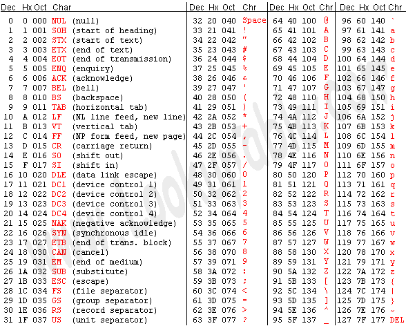
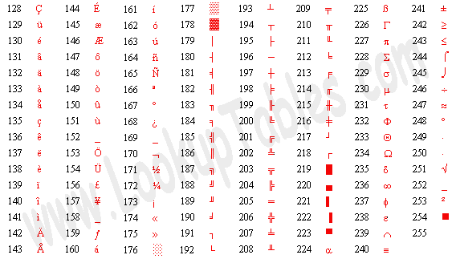
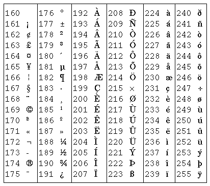

# 附录 A. 字符编码

# 附录 A. 字符编码

**目录**

*   1\. ASCII 码
*   2\. Unicode 和 UTF-8
*   3\. 在 Linux C 编程中使用 Unicode 和 UTF-8

## 1\. ASCII 码

ASCII 码的取值范围是 0~127，可以用 7 个 bit 表示。C 语言中`char`型变量的大小规定为一字节，如果存放 ASCII 码则只用到低 7 位，高位为 0。以下是 ASCII 码表：

**图 A.1\. ASCII 码表**



绝大多数计算机的一个字节是 8 位，取值范围是 0~255，而 ASCII 码并没有规定编号为 128~255 的字符，为了能表示更多字符，各厂商制定了很多种 ASCII 码的扩展规范。注意，虽然通常把这些规范称为扩展 ASCII 码（Extended ASCII），但其实它们并不属于 ASCII 码标准。例如以下这种扩展 ASCII 码由 IBM 制定，在字符终端下被广泛采用，其中包含了很多表格边线字符用来画界面。

**图 A.2\. IBM 的扩展 ASCII 码表**



在图形界面中最广泛使用的扩展 ASCII 码是 ISO-8859-1，也称为 Latin-1，其中包含欧洲各国语言中最常用的非英文字母，但毕竟只有 128 个字符，某些语言中的某些字母没有包含。如下表所示。

**图 A.3\. ISO-8859-1**



编号为 128~159 的是一些控制字符，在上表中没有列出。

## 2\. Unicode 和 UTF-8

为了统一全世界各国语言文字和专业领域符号（例如数学符号、乐谱符号）的编码，ISO 制定了 ISO 10646 标准，也称为 UCS（Universal Character Set）。UCS 编码的长度是 31 位，可以表示 2³¹个字符。如果两个字符编码的高位相同，只有低 16 位不同，则它们属于一个平面（Plane），所以一个平面由 2¹⁶个字符组成。目前常用的大部分字符都位于第一个平面（编码范围是 U-00000000~U-0000FFFD），称为 BMP（Basic Multilingual Plane）或 Plane 0，为了向后兼容，其中编号为 0~256 的字符和 Latin-1 相同。UCS 编码通常用 U-xxxxxxxx 这种形式表示，而 BMP 的编码通常用 U+xxxx 这种形式表示，其中 x 是十六进制数字。在 ISO 制定 UCS 的同时，另一个由厂商联合组织也在着手制定这样的编码，称为 Unicode，后来两家联手制定统一的编码，但各自发布各自的标准文档，所以 UCS 编码和 Unicode 码是相同的。

有了字符编码，另一个问题就是这样的编码在计算机中怎么表示。现在已经不可能用一个字节表示一个字符了，最直接的想法就是用四个字节表示一个字符，这种表示方法称为 UCS-4 或 UTF-32，UTF 是 Unicode Transformation Format 的缩写。一方面这样比较浪费存储空间，由于常用字符都集中在 BMP，高位的两个字节通常是 0，如果只用 ASCII 码或 Latin-1，高位的三个字节都是 0。另一种比较节省存储空间的办法是用两个字节表示一个字符，称为 UCS-2 或 UTF-16，这样只能表示 BMP 中的字符，但 BMP 中有一些扩展字符，可以用两个这样的扩展字符表示其它平面的字符，称为 Surrogate Pair。无论是 UTF-32 还是 UTF-16 都有一个更严重的问题是和 C 语言不兼容，在 C 语言中 0 字节表示字符串结尾，库函数`strlen`、`strcpy`等等都依赖于这一点，如果字符串用 UTF-32 存储，其中有很多 0 字节并不表示字符串结尾，这就乱套了。

UNIX 之父 Ken Thompson 提出的 UTF-8 编码很好地解决了这些问题，现在得到广泛应用。UTF-8 具有以下性质：

*   编码为 U+0000~U+007F 的字符只占一个字节，就是 0x00~0x7F，和 ASCII 码兼容。

*   编码大于 U+007F 的字符用 2~6 个字节表示，每个字节的最高位都是 1，而 ASCII 码的最高位都是 0，因此非 ASCII 码字符的表示中不会出现 ASCII 码字节（也就不会出现 0 字节）。

*   用于表示非 ASCII 码字符的多字节序列中，第一个字节的取值范围是 0xC0~0xFD，根据它可以判断后面有多少个字节也属于当前字符的编码。后面每个字节的取值范围都是 0x80~0xBF，见下面的详细说明。

*   UCS 定义的所有 2³¹个字符都可以用 UTF-8 编码表示出来。

*   UTF-8 编码最长 6 个字节，BMP 字符的 UTF-8 编码最长三个字节。

*   0xFE 和 0xFF 这两个字节在 UTF-8 编码中不会出现。

具体来说，UTF-8 编码有以下几种格式：

U-00000000 – U-0000007F: 0xxxxxxx U-00000080 – U-000007FF: 110xxxxx 10xxxxxx U-00000800 – U-0000FFFF: 1110xxxx 10xxxxxx 10xxxxxx U-00010000 – U-001FFFFF: 11110xxx 10xxxxxx 10xxxxxx 10xxxxxx U-00200000 – U-03FFFFFF: 111110xx 10xxxxxx 10xxxxxx 10xxxxxx 10xxxxxx U-04000000 – U-7FFFFFFF: 1111110x 10xxxxxx 10xxxxxx 10xxxxxx 10xxxxxx 10xxxxxx

第一个字节要么最高位是 0（ASCII 字节），要么最高两位都是 1，最高位之后 1 的个数决定后面有多少个字节也属于当前字符编码，例如 111110xx，最高位之后还有四个 1，表示后面有四个字节也属于当前字符的编码。后面每个字节的最高两位都是 10，可以和第一个字节区分开。这样的设计有利于误码同步，例如在网络传输过程中丢失了几个字节，很容易判断当前字符是不完整的，也很容易找到下一个字符从哪里开始，结果顶多丢掉一两个字符，而不会导致后面的编码解释全部混乱了。上面的格式中标为 x 的位就是 UCS 编码，最后一种 6 字节的格式中 x 位有 31 个，可以表示 31 位的 UCS 编码，UTF-8 就像一列火车，第一个字节是车头，后面每个字节是车厢，其中承载的货物是 UCS 编码。UTF-8 规定承载的 UCS 编码以大端表示，也就是说第一个字节中的 x 是 UCS 编码的高位，后面字节中的 x 是 UCS 编码的低位。

例如 U+00A9（©字符）的二进制是 10101001，编码成 UTF-8 是 11000010 10101001（0xC2 0xA9），但不能编码成 11100000 10000010 10101001，UTF-8 规定每个字符只能用尽可能少的字节来编码。

## 3\. 在 Linux C 编程中使用 Unicode 和 UTF-8

目前各种 Linux 发行版都支持 UTF-8 编码，当前系统的语言和字符编码设置保存在一些环境变量中，可以通过`locale`命令查看：

```cpp
$ locale
LANG=en_US.UTF-8
LC_CTYPE="en_US.UTF-8"
LC_NUMERIC="en_US.UTF-8"
LC_TIME="en_US.UTF-8"
LC_COLLATE="en_US.UTF-8"
LC_MONETARY="en_US.UTF-8"
LC_MESSAGES="en_US.UTF-8"
LC_PAPER="en_US.UTF-8"
LC_NAME="en_US.UTF-8"
LC_ADDRESS="en_US.UTF-8"
LC_TELEPHONE="en_US.UTF-8"
LC_MEASUREMENT="en_US.UTF-8"
LC_IDENTIFICATION="en_US.UTF-8"
LC_ALL= 
```

常用汉字也都位于 BMP 中，所以一个汉字的存储通常占 3 个字节。例如编辑一个 C 程序：

```cpp
#include <stdio.h>

int main(void)
{
    printf("你好\n");
    return 0;
} 
```

源文件是以 UTF-8 编码存储的：

```cpp
$ od -tc nihao.c 
0000000   #   i   n   c   l   u   d   e       <   s   t   d   i   o   .
0000020   h   >  \n  \n   i   n   t       m   a   i   n   (   v   o   i
0000040   d   )  \n   {  \n  \t   p   r   i   n   t   f   (   " 344 275
0000060 240 345 245 275   \   n   "   )   ;  \n  \t   r   e   t   u   r
0000100   n       0   ;  \n   }  \n
0000107 
```

其中八进制的`344 375 240`（十六进制`e4 bd a0`）就是“你”的 UTF-8 编码，八进制的`345 245 275`（十六进制`e5 a5 bd`）就是“好”。把它编译成目标文件，`"你好\n"`这个字符串就成了这样一串字节：`e4 bd a0 e5 a5 bd 0a 00`，汉字在其中仍然是 UTF-8 编码的，一个汉字占 3 个字节，这种字符在 C 语言中称为多字节字符（Multibyte Character）。运行这个程序相当于把这一串字节`write`到当前终端的设备文件。如果当前终端的驱动程序能够识别 UTF-8 编码就能打印出汉字，如果当前终端的驱动程序不能识别 UTF-8 编码（比如一般的字符终端）就打印不出汉字。也就是说，像这种程序，识别汉字的工作既不是由 C 编译器做的也不是由`libc`做的，C 编译器原封不动地把源文件中的 UTF-8 编码复制到目标文件中，`libc`只是当作以 0 结尾的字符串原封不动地`write`给内核，识别汉字的工作是由终端的驱动程序做的。

但是仅有这种程度的汉字支持是不够的，有时候我们需要在 C 程序中操作字符串里的字符，比如求字符串`"你好\n"`中有几个汉字或字符，用`strlen`就不灵了，因为`strlen`只看结尾的 0 字节而不管字符串里存的是什么，求出来的是字节数 7。为了在程序中操作 Unicode 字符，C 语言定义了宽字符（Wide Character）类型`wchar_t`和一些库函数。在字符常量或字符串字面值前面加一个 L 就表示宽字符常量或宽字符串，例如定义`wchar_t c = L'你';`，变量`c`的值就是汉字“你”的 31 位 UCS 编码，而`L"你好\n"`就相当于`{L'你', L'好', L'\n', 0}`，`wcslen`函数就可以取宽字符串中的字符个数。看下面的程序：

```cpp
#include <stdio.h>
#include <locale.h>

int main(void)
{
    if (!setlocale(LC_CTYPE, "")) {
        fprintf(stderr, "Can't set the specified locale! "
            "Check LANG, LC_CTYPE, LC_ALL.\n");
        return 1;
    }
    printf("%ls", L"你好\n");
    return 0;
} 
```

宽字符串`L"你好\n"`在源代码中当然还是存成 UTF-8 编码的，但编译器会把它变成 4 个 UCS 编码`0x00004f60 0x0000597d 0x0000000a 0x00000000`保存在目标文件中，按小端存储就是`60 4f 00 00 7d 59 00 00 0a 00 00 00 00 00 00 00`，用`od`命令查看目标文件应该能找到这些字节。

```cpp
$ gcc hihao.c
$ od -tx1 a.out 
```

`printf`的`%ls`转换说明表示把后面的参数按宽字符串解释，不是见到 0 字节就结束，而是见到 UCS 编码为 0 的字符才结束，但是要`write`到终端仍然需要以多字节编码输出，这样终端驱动程序才能识别，所以`printf`在内部把宽字符串转换成多字节字符串再`write`出去。事实上，C 标准并没有规定多字节字符必须以 UTF-8 编码，也可以使用其它的多字节编码，在运行时根据环境变量确定当前系统的编码，所以在程序开头需要调用`setlocale`获取当前系统的编码设置，如果当前系统是 UTF-8 的，`printf`就把 UCS 编码转换成 UTF-8 编码的多字节字符串再`write`出去。一般来说，程序在做内部计算时通常以宽字符编码，如果要存盘或者输出给别的程序，或者通过网络发给别的程序，则采用多字节编码。

关于 Unicode 和 UTF-8 本节只介绍了最基本的概念，部分内容出自[[Unicode FAQ]](bi01.html#bibli.unicodefaq "UTF-8 and Unicode FAQ, http://www.cl.cam.ac.uk/~mgk25/unicode.html")，读者可进一步参考这篇文章。