# 第八章 主窗口

# 第八章 主窗口

**本章重点**

*   Qt 中主窗口程序的框架
*   手工创建 QMainWindow 主窗口的基本步骤
*   结合 Qt Designer 创建主窗口的方法
*   QAction 动作的创建
*   如何在菜单及工具栏中加入动作
*   如何加入锚接窗口
*   各种锚接方式以及锚接窗体特性的设置方法
*   创建多文档应用程序的方法和步骤

在前面几章中，我们一起学习了 Qt 的基础知识和技能。这一章，我们将带领大家学习 如何创建主窗口应用程序，包括菜单栏、工具栏、状态栏、动作、中心部件、锚接部件等的 创建和使用。最后，将介绍创建多文档窗口的常用方法和步骤。

# 8.1 主窗口框架

## 8.1 主窗口框架

Qt 的 QMainWindow 类提供了一个应用程序主窗口，包括一个菜单栏（ menu bar）、多 个工具栏(tool bars)、多个锚接部件(dock widgets)、一个状态栏(status bar)以及一个 中心部件(central widget)，常见的一种界面布局如图 8-1 所示。

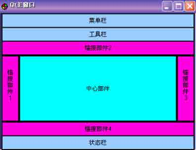

图 8-1 Qt 主窗口常见布局示意图

绝大多数现代 GUI 应用程序都会提供一些菜单、上下文菜单和工具栏。

Qt 通过引入“动作”（action）这一概念来简化有关菜单和工具栏的编程。一个动作 就是一个可以添加到任意数量的菜单和工具栏上的项。

1.菜单栏 菜单是一系列命令的列表。菜单可以让用户浏览应用程序并且处理一些事务，上下文菜单和工具栏则提供了对那些经常使用的功能进行快速访问的方法，它们能够提高软件的使用效率。

为了实现菜单、工具栏按钮、键盘快捷方式等命令的一致性， Qt 使用动作（Action） 来表示这些命令。Qt 的菜单就是由一系列的 QAction 动作对象构成的列表。而菜单栏则是 包容菜单的容器，它通常位于主窗口的顶部，标题栏的下面。一个主窗口通常只有一个菜单 栏。

2.工具栏 工具栏是由一系列的类似于按钮的动作排列而成的面板，它通常由一些经常使用的命令（动作）组成。工具栏的位置处在菜单栏下面、状态栏的上面，工具栏可以停靠在主窗口的上、下、左、右这 4 个不同的位置。一个主窗口可以有多个工具栏。

3.状态栏

状态栏通常是显示 GUI 应用程序的一些状态信息，它位于主窗口的最底部。可以在状 态栏上添加、使用 Qt 窗口部件。一个主窗口只有一个状态栏。

4.锚接部件

对于一个标准的 Qt 主窗口而言，锚接部件不是必需的。锚接部件一般是作为一个容器 来使用，以包容其他窗口部件来实现某些功能。 比如 Qt 设计器的属性编辑器、对象监视器 等都是由锚接部件包容其他的 Qt 窗口部件来实现的。它处在工具栏的内部，可以作为一个 窗口自由的浮动在主窗口的上面，也可以像工具栏一样停靠在主窗口的左、右、上、下四个 方向上。一个主窗口可以包含多个锚接部件。

5.中心窗口部件 中心窗口部件处在锚接部件的内部，它位于主窗口的中心，一个主窗口只有一个中心窗口部件。主窗口 QMainWindow 具有自己的布局管理器，因此在 QMainWindow 窗口上设置布局管理器或者创建一个父窗口部件为 QMainWindow 的布局管理器都是不允许的。但可以 在主窗口的中心窗口部件上设置布局管理器。

6.上下文菜单

为了控制主窗口工具栏和锚接部件的显隐，在默认情况下， QMainWindow 主窗口提供了 一个上下文菜单（Context Menu）。通常，通过在工具栏或锚接部件上单击鼠标右键就可以激活该上下文菜单；也可以通过函数 CMainWindow::createPopupMenu()来激活该菜单。此 外，还可以重写 CMainWindow::createPopupMenu()函数，实现自定义的上下文菜单。

# 8.2 创建主窗口的方法和流程

## 8.2 创建主窗口的方法和流程

### 8.2.1 方法

创建应用程序主窗口界面主要有两种方法：

1.全部代码生成，单继承自 QMainWindow 类，在子类的实现文件中使用代码创建应用 程序主窗口的菜单、工具栏、锚接部件以及状态栏等并设置它们的属性；使用单继承 Qt 窗 口部件类的方法生成中心部件并添加到主窗口中。

2.使用 Qt 设计师绘制应用程序主窗口，在 Qt 设计师中添加菜单（以及子菜单和动 作）、工具栏（以及动作）、锚接部件（以及子窗口部件）、状态栏（目前， Qt 设计师没 有提供状态栏的设计编辑功能，比如无法将窗口部件直接拖放到主窗口的状态栏上）等并设 置它们的属性，以及关联一些基本的信号和槽；然后采用前面介绍的 “单一继承方式”或 “多继承方式”实现应用程序主窗口的代码。这种方法需要和手写代码方法相结合。

一般的，采用第 2 种方法创建应用程序主窗口是比较快的 ，并且具有直观易懂的优 势。

### 8.2.2 流程

无论采用哪种方法，创建主窗口应用程序一般遵循如下步骤：

1\. 创建主菜单

2\. 创建子菜单

3\. 创建动作

4\. 创建工具栏

5\. 动作和菜单项以及工具栏按钮的关联

6\. 创建锚接窗口（不是必需的）

7\. 创建中心窗口部件

8\. 创建状态栏

这其中，依据采用手写代码和使用 Qt Designer 的不同，上述步骤有些不是必需的， 或者不是显式的。下面我们先来看看如何使用手写代码创建主窗口程序。

# 8.3 代码创建主窗口

## 8.3 代码创建主窗口

本实例实现一个基本的主窗口程序，包含一个菜单条、一个工具栏、中央可编辑窗体及状态栏。实现的效果如图 8-2 所示。

### 8.3.1 头文件

主窗口头文件代码如下：

```cpp
#ifndef MAINWINDOW_H
#define MAINWINDOW_H
#include &lt;QMainWindow&gt;
class QAction;
class QMenu;
class QToolBar;
class QTextEdit;
class MainWindow : public QMainWindow  {
    Q_OBJECT
public:
    MainWindow();
    void createMenus();
    void createActions();
    void createToolBars();
    void createStatusBar();
public slots:
    void slotNewFile();
    void slotOpenFile();
    void slotSaveFile();
    void slotCopy();
    void slotCut();
    void slotPaste();
    void slotAbout();
private:
    QTextCodec *codec;
    QMenu *menuFile;
    QMenu *menuEdit;
    QMenu *menuAbout;
    QToolBar *toolBarFile;
    QToolBar *toolBarEdit;
    QAction *actionOpenFile;
    QAction *actionNewFile;
    QAction *actionSaveFile;
    QAction *actionExit;
    QAction *actionCopy;
    QAction *actionCut;
    QAction *actionPaste;
    QAction *actionAboutQt;
    QTextEdit * text;
#endif // MAINWINDOW_H 
```

第 1 和第 2 句定义头文件包含卫哨，目的是防止重复包含头文件，这两句与结尾的第 42 句结合在一起使用才是完整的。

第 3 句包含了 QMainWindow 的定义，它是主窗口类的基类。

第 4 至第 7 句对程序下文中可能用到的类进行前置声明（ forward declaration）。它 们会告诉编译器，我们用到的这些类已经存在了，并且不需要知道这些类的完整定义。我们 为什么要这样做，而不是将它们的头文件包含进来呢？这主要是由于在程序下文中，我们只 是简单的定义了指向这些类的对象的指针，而并没有涉及到该类的其他方面。

这样做的好处，一是避免了头文件被其他文件多次包含，尤其是在头文件中包含头文 件时，容易造成重复包含和产生包含顺序问题，并且增大了文件的体积；二是提高了编译速 度，因为编译器只需知道该类已经被定义了，而无需了解定义的细节。

小贴士：尽量不要在头文件中包含另外的头文件 一种好的编程风格是，尽量在头文件中使用类前置声明程序下文中要用到的类，实在需要包含其它的头文件时，可以把它放在我们的类实现文件中。在下面的程序中，你将会看到这个准则的应用。

第 8 句声明了我们的 MainWindow 类是派生自 QMainWindow。

第 10 句的 Q_OBJECT 宏对于所有使用了信号/槽机制的类而言是必需的，同时它要求被 放置在类声明的开始处。

第 12 句声明了我们的主窗口类 MainWindow 的构造函数。

在第 13 至第 16 句中，createActions()函数用于创建程序中用到的动作（Action）， createMenus()函数用于创建菜单（Menu），createToolBars()函数用于创建工具栏（ToolBar），CreateStatusBar()函数用于创建状态栏（StatusBar）。接着声明了用到的槽函数，如“新建文件”、“打开文件”等。最后声明了实现主窗口所需的各个元素，包 括菜单项、工具条以及各个动作等。

第 17 至第 24 行，声明了类的槽，这里我们把它们定义为公有的，并且返回值均为 void。需要注意的是，槽同样可以被当做普通函数被调用，这时它的返回值对我们而言与调 用一个普通的 C++函数产生的返回值并无二致。而当槽作为一个信号的响应函数而被执行 时，它的返回值会被程序忽略。也就是说， 不使用信号，我们也可以正常调用槽函数来完 成一些事情。

第 25 至第 40 行，声明了用于实现主窗口所需的各种元素，主要包括 菜单项、工具 条、状态条以及各种动作等，它们是类的成员变量，通常我们被声明为私有的。

### 8.3.2 实现文件

下面我们分析一下主窗口类的实现文件。

1.构造函数

```cpp
#include "mainwindow.h"
#include &lt;QtGui&gt;
// 主窗口实现
CMyMainWindow:: CMyMainWindow()
{
    setWindowTitle(tr("MyMainWindow"));
    text = new QTextEdit(this);
    setCentralWidget(text);
    createActions();
    createMenu();
    createToolBars();
    createStatusBar();
} 
```

第 1 行引用主窗口类的头文件。

第 2 行引入 QtGui 模块。

小贴士：在 qmake 工程中，默认情况下已经包含了 QtCore 和 QtGui 模块，因此无需配置就 可以使用这两个模块中的类。如果不想使用 QtGui 模块，而仅仅使用 QtCore，就可以在 qmake 工程文件中通过使用”QT -= gui”来取消 QtGui 模块的包含。而对于 Qt 的其他模 块，在使用之前必须在 qmake 工程文件中通过 QT 选项进行配置。在下面的章节中，我们会 有说明。

一般可以在应用程序中通过#include <QtGui/QtGui>来包含整个 QtGui 模块的所有类 的头文件，其中第一个 QtGui 是模块名，第二个 QtGui 是 QtGui 模块（文件夹）下的预定 义头文件；还有一种方法是使用#include <QtGui>，这时 QtGui 表示模块下的预定义头文 件。也可以单独包含某个类的头文件，比如在我们这个主窗口类中引入的 #include <QMainWindow>，或者#include<QtGui/QMainWindow>。

第 5 行设置主窗口的标题，注意我们在程序中并没有使用任何中文的表示方法，因为 这是我们所不提倡的。在这里，你只需知道尽量不要在程序中的任何地方使用汉字，包括注 释，而我们有显示汉字和其他语言形式的方法。但是为了向大家讲解程序方便，我们会在注 释中使用一些汉字。

setWindowTitle 是继承自 QWidget 的方法，它的原型是 void setWindowTitle( const QString & )。再次提醒，要时刻记得 QMainWindow 是继承自 QWidget 的，所以 QWidget 的公有方法，在 QMainWindow 中也有。

第 6 行实例化 QTextEdit 的对象 text，参数 this 指针表示其父窗口为主窗口 CMyMainWindow。

第 7 行设置主窗口的中心窗口部件为 text。在前面我们曾经提到，Qt 主窗口应用程序 中，中心窗口部件是不可或缺的，通常只要是继承自 QWidget 的窗口部件的实例都可以用 作中心窗口部件。在本章的后面我们还会对中心窗口部件做详细的讲解。

第 8、9、10、11 行依次创建动作、主菜单、工具栏和状态栏。

2.创建动作

菜单与工具栏都与 QAction 类密切相关，工具栏上的功能按钮与菜单中的选项条目相 对应，完成相同的功能，使用相同的快捷键与图标。 QAction 类为用户提供了一个统一的命 令接口，无论是从菜单触发还是从工具栏触发，或快捷键触发都调用同样的操作接口，达到 同样的目的。以下是各个动作（Action）的实现代码：

```cpp
void CMyMainWindow::createActions()
{
    // open file action “打开”动作
    actionOpenFile = new QAction(QIcon(":/images/open.jpg"),tr("Open"),this);
    actionOpenFile-&gt;setShortcut(tr("Ctrl+O"));
    actionOpenFile-&gt;setStatusTip(tr("open a file"));
    connect(actionOpenFile,SIGNAL(triggered()),this,SLOT(slotOpenFile()));
    // new file action “新建”动作
    actionNewFile = new QAction(QIcon(":/images/new.jpg"),tr("New"),this);
    actionNewFile-&gt;setShortcut(tr("Ctrl+N"));
    actionNewFile-&gt;setStatusTip(tr("new file"));
    connect(actionNewFile,SIGNAL(triggered()),this,SLOT(slotNewFile()));
    // save file action “保存”动作
    actionSaveFile = new QAction(QPixmap(":/images/save.jpg"),tr("Save"),this);
    actionSaveFile-&gt;setShortcut(tr("Ctrl+S"));
    actionSaveFile-&gt;setStatusTip(tr("save file"));
    connect(actionSaveFile,SIGNAL(activated()),this,SLOT(slotSaveFile()));
    // exit action “退出”动作
    actionExit = new QAction(tr("Exit"), this);
    actionExit-&gt;setShortcut(tr("Ctrl+Q"));
    actionExit-&gt;setStatusTip(tr("exit"));
    connect(actionExit, SIGNAL(triggered()), this, SLOT(close()));
    // cut action “剪切”动作
    actionCut = new QAction(QIcon(":/images/cut.jpg"), tr("Cut"), this);
    actionCut-&gt;setShortcut(tr("Ctrl+X"));
    actionCut-&gt;setStatusTip(tr("cut to clipboard"));
    connect(actionCut, SIGNAL(triggered()), text, SLOT(cut()));
    // copy action “复制”动作
    actionCopy = new QAction(QIcon(":/images/copy.jpg"), tr("Copy"), this);
    actionCopy-&gt;setShortcut(tr("Ctrl+C"));
    actionCopy-&gt;setStatusTip(tr("copy to clipboard"));
    connect(actionCopy, SIGNAL(triggered()), text, SLOT(copy()));
    // paste action “粘贴”动作
    actionPaste = new QAction(QIcon(":/images/paste.jpg"), tr("Paste"), this);
    actionPaste-&gt;setShortcut(tr("Ctrl+V"));
    actionPaste-&gt;setStatusTip(tr("paste clipboard to selection"));
    connect(actionPaste, SIGNAL(triggered()), text, SLOT(paste()));
    // about action “关于”动作
    actionAbout = new QAction(tr("About"), this);
    connect(actionAbout, SIGNAL(triggered()), this, SLOT(slotAbout()));
} 
```

第 3～6 行实现的是“打开文件”动作，第 3 行在创建这个动作时，依次指定了此动作 使用的图标、名称以及父窗口。注意程序中 tr()函数的使用很普遍。

小贴士：在程序中需要使用字符串操作时，尽量使用 tr()函数，这是为了日后使得应用程 序可以被翻译为多种语言所必须的。

第 4 行设置了此动作的快捷键为 Ctrl+O，使用的是 setShortcut()方法，它的原型 是：

```cpp
void setShortcut ( const QKeySequence & shortcut ) 
```

由此引出了使用该方法的另一种方式：

```cpp
actionOpenFile-&gt;setShortcut( QKeySequence( tr("Ctrl+O") ) ); 
```

专题：QkeySequence 的使用

QKeySequence 是专门用作设置快捷键的。它有 3 种主要的用法：

*   使用 Qt 标准键缩写方式 它的标准写法是：

    ```cpp
    actionOpenFile-&gt;setShortcut( QKeySequence::Open ); 
    ```

    注意，这种快捷键的预定义是与平台相关的。

*   使用人们已经习惯的类似“Crtl+O”这样的形式 它的标准写法是：

    ```cpp
    actionOpenFile-&gt;setShortcut( QKeySequence( tr("Ctrl+O") ) ); 
    ```

    它不区分大小写，所以也可写成：

    ```cpp
    actionOpenFile-&gt;setShortcut( QKeySequence( tr("Ctrl+o") ) ); 
    ```

*   使用在 Qt::Key 和 Qt::Modifier 中定义的前缀修饰符和具体键的组合方式它的标准写法是：

    ```cpp
    actionOpenFile-&gt;setShortcut( QKeySequence( Qt::CTRL + Qt::Key_O ) ); 
    ```

    其中，Qt::CTRL 表示前置修饰符为 Ctrl 键，Qt::Key_O 表示按下的是字母 O 的键。

Qt::Key 和 Qt::Modifier 是枚举型常量，前者定义了在常见的键值，有上百条之多， 表 8-1 示出了我们这个程序中用到的值，读者可以在 Qt Assistant 中查阅它的所有值；后 者定义了 Qt 所支持的快捷键修饰语的缩写值，目前有 5 种，如表 8-2 所示。

表 8-1 Qt 标准键说明

| 常量 | 值 | 说明 |
| --- | --- | --- |
| QKeySequence::Close | 4 | 关闭文件 |
| QKeySequence::Copy | 9 | 复制 |
| QKeySequence::Cut | 8 | 剪切 |
| QKeySequence::Delete | 7 | 删除 |
| QKeySequence::HelpContents | 1 | 打开帮助内容 |
| QKeySequence::New | 6 | 创建新文件. |
| QKeySequence::Open | 3 | 打开文件 |
| QKeySequence::Paste | 10 | 粘贴 |
| QKeySequence::Print | 18 | 打印 |
| QKeySequence::SaveAs | 63 | 另存为 |
| QKeySequence::Save | 5 | 保存文件 |

表 8-2 Qt::Modifier 中定义的快捷键修饰语值

| 常量名 | 值 | 说明 |
| --- | --- | --- |
| Qt::SHIFT | Qt::ShiftModifier | 在所有标准键盘上都提供 |
| Qt::META | Qt::MetaModifier | Meta 键值. |
| Qt::CTRL | Qt::ControlModifier | Ctrl 键值. |
| Qt::ALT | Qt::AltModifier | Alt 键值 |
| Qt::UNICODE_ACCEL | 0x00000000 | 指定 Unicode 值，而不是 Qt 键值 |

小贴士：在 Mac OS X 中, CTRL 的值 对应 Macintosh 键盘上的命令键， 而 META 的值对应 Windows 平台上的 Ctrl 键值。

在主要使用系统预定义的快捷键的情况下，这是一种比较简便的方法。但快捷键的定 义与平台相关，而且这种写法不利于实现国际化，所以笔者不建议采用。

使用这种方式时，带上 tr()函数便可以支持国际化，并且也与 Windows 平台上大家所 熟悉的写法类似。作者向大家推荐尽量采用这种写法。

最后一种写法看上去比较复杂，并且不利于实现程序的国际化，也不推荐使用。 除了使用 setShortcut 外，定义快捷键还有一种方法，它的标准写法如下：

```cpp
shortcut = new QShortcut(QKeySequence(tr("Ctrl+O", "File|Open")),parent); 
```

请读者朋友自行针对我们的程序进行修改，作为一道课后思考题吧。

第 5 行设定了状态条显示，当把鼠标光标移动到此动作对应的菜单条目或工具栏按钮 上时，在状态条上会显示出“打开文件”的提示。

第 6 行连接此动作触发时所调用的槽函数 slotOpenFile()。

3.使用资源文件

首先，大家需要知道在 Qt 工程中，通常使用.qrc 文件来对资源文件进行配置。我们建 议在工程目录下为资源文件建立一个单独的文件夹，以便于管理。在第 8.6 节中，我们会 对资源文件和 Qt 资源系统作专题的讲解。

第 1 步，建立 images 目录

在工程文件夹下面新建一个名为 imgaes 的目录，并将程序工程中需要使用的资源文件（如图标文件、图像文件等）放入该文件夹下面。

第 2 步，建立.qrc 文件

在工程的主目录下面建立一个文本文件，将其保存为 mainwindow.qrc，输入内容如 下：

```cpp
&lt;RCC&gt;
&lt;qresource&gt;
&lt;/qresource&gt;
&lt;/RCC&gt;
&lt;file&gt;images/copy.jpg&lt;/file&gt;
&lt;file&gt;images/cut.jpg&lt;/file&gt;
&lt;file&gt;images/new.jpg&lt;/file&gt;
&lt;file&gt;images/open.jpg&lt;/file&gt;
&lt;file&gt;images/paste.jpg&lt;/file&gt;
&lt;file&gt;images/save.jpg&lt;/file&gt; 
```

注意，这是一种 xml 格式的变体，我们需要在成对的标签中放置资源文件。

第 3 步，使工程文件能够识别资源文件 在工程文件（mainwindow.pro）中加入一行：

```cpp
RESOURCES += /mainwindow.qrc 
```

这一行是必须的，这样 qmake 才可以找到资源文件。

接下来的各个动作的设置就类似了，“剪切”、“复制”和“粘贴”动作连接的触发 响应槽函数，分别直接使用 QTextEdit 对象的 cut()、copy()和 paste()函数即可。“关 于”动作的触发响应槽函数使用的是 QApplication 的 slotAbout()。

在创建动作时，并不是必须要配合使用图标显示的，例如程序中创建“关于”动作和 “退出”动作时就没有使用图标。这种做法通常用于对应到顶级菜单的动作，并且该顶级菜 单没有子菜单时的情况。

4.创建菜单栏 创建了各个动作后，就可以把它们与菜单栏中的项联系起来了。我们来分析一下 菜单栏的实现函数 createMenus()。

```cpp
void CMyMainWindow::createMenu()
{
    //文件菜单
    menuFile = menuBar()-&gt;addMenu(tr("File"));
    menuFile-&gt;addAction(actionNewfile);
    menuFile-&gt;addAction(actionOpenFileOpen);
    menuFile-&gt;addAction(actionSaveFileSave);
    menuFile-&gt;addAction(actionExit);
    //编辑菜单
    menuEdit = menuBar()-&gt;addMenu(tr("Edit"));
    menuEdit-&gt;addAction(actionCopy);
    menuEdit-&gt;addAction(actionCut);
    menuEdit-&gt;addAction(actionPaste);
    //帮助菜单
    menuAbout = menuBar()-&gt;addMenu(tr("Help"));
    menuAbout-&gt;addAction(actionAbout);
} 
```

其中，第 1～5 行创建了“文件”菜单。

第 1 行使用主窗口类的 menuBar()函数得到主窗口的菜单栏指针，再调用菜单栏对象的 addMenu()函数，即可把一个新菜单 menuFile 插入到菜单栏中。

menuBar()函数的原型如下：

```cpp
QMenuBar * QMainWindow::menuBar () const 
```

如果菜单栏已经存在，它将返回指向该菜单栏的指针；如果菜单栏还没有建立，它将 创建并且返回一个空的主窗口的菜单栏。

小贴士：menuBar()函数使得该菜单栏以程序中使用的主窗口作为自己的父窗口。因此，如 果你想在 Mac 应用程序中使得所有窗口都共用这个菜单栏的话，请不要使用这种写法来创 建菜单栏。要达到这个目的，你可以创建一个没有父窗口的菜单栏，这时我们的代码应该改 为：

```cpp
QMenuBar *menuBar = new QMenuBar(0); menuFile = menuBar-&gt;addMenu(tr("File")); 
```

另外，创建菜单栏还可以有另一种写法：

```cpp
menuFile = new QMenu(tr("File"),this); QMenuBar *menuBar = menuBar();
menuBar-&gt;addMenu(menuFile); 
```

如下面代码所示，addMenu()函数有多个原型，我们通常使用的是前两种。

```cpp
QAction * QMenuBar::addMenu ( QMenu * menu )
QMenu * QMenuBar::addMenu ( const QString & title )
QMenu * QMenuBar::addMenu ( const QIcon & icon, const QString & title ) 
```

第 2～5 行调用 QMenu 的 addAction()函数在菜单中加入菜单栏条目“打开”、“新建”、“保存”和“退出”。

与上面的情形类似，第 6～9 行创建“编辑”菜单。第 10、11 行创建“帮助”菜单。 5.创建工具栏

接下来创建工具栏，我们来看一下 createToolBars()函数。

```cpp
void CMyMainWindow::createToolBars()
{
toolBarFile = addToolBar(tr("File"));
toolBarFile-&gt;setMovable(false);
toolBarFile-&gt;setAllowedAreas(Qt::AllToolBarAreas);
toolBarFile-&gt;addAction(fileNewAction);
toolBarFile-&gt;addAction(fileOpenAction);
toolBarFile-&gt;addAction(fileSaveAction);
//编辑工具栏
toolBarEdit = addToolBar(tr(“Edit”));
addToolBar( Qt::RightToolBarArea, toolBarEdit);
toolBarEdit-&gt;setMovable(true);
toolBarEdit-&gt;setAllowedAreas( Qt::RightToolBarArea );
toolBarEdit-&gt;setFloatable(true);
QSize size(16, 15);
toolBarEdit-&gt;setIconSize(size);
toolBarEdit-&gt;addAction(copyAction);
toolBarEdit-&gt;addAction(cutAction);
toolBarEdit-&gt;addAction(pasteAction);
//文件工具栏
} 
```

第 1～6 行创建了“文件”工具栏，第 5～8 行创建了“编辑”工具栏。

主窗口的工具栏上可以有多个工具条，一般采用一个菜单对应一个工具条的方式，也 可根据需要进行工具条的划分。

第 1 行调用 QMainWindow 的 addToolBar()函数获得主窗口的工具条对象，每新增一个 工具条调用一次 addToolBar()函数，赋予不同的名称，即可在主窗口中新增一个工具条。

专题：创建工具条的方法

addToolBar()函数有 3 种原型，分别介绍如下。

第 1 种：

```cpp
void QMainWindow::addToolBar ( Qt::ToolBarArea area, QToolBar * toolbar ) 
```

这种方法是最为灵活的一个，第 1 个参数 area 负责设置工具栏的布局方向，比如是从 左到右（left-to-right ），还是从上到下（up-to-down）等等；第 2 个参数 toolbar 是工具栏对象的实例。

举个例子，把我们的程序修改成采用这个函数原型的形式：

第 2 种：

```cpp
void QMainWindow::addToolBar ( QToolBar * toolbar ) 
```

这种方法是默认将工具栏放置在主窗口的顶部工具栏区域（ Top Toolbar Area ）， 它的作用等同于 addToolBar(Qt::TopToolBarArea, toolbar)，实际上是第 1 种方法的一个具体例子。

这种方法有一个不灵活的地方，就是默认情况下它已经限定工具栏必须创建在主窗口 的顶部工具栏区域，那么由此工具栏的布局方向也已经确定是水平方向的，不可更改了。

第 3 种：

```cpp
QToolBar * QMainWindow::addToolBar ( const QString & title ) 
```

读者朋友可以看到，我们的程序中就是使用了这种方法。在使用这种方法时，程序会 自动的首先创建一个 QToolBar 对象，并把它的窗口标题设置为 title ，然后将它放置在主窗口的顶部工具栏区域。 使用这种写法，也不能设置工具栏的布局方向。

第 2～4 行调用 QToolBar 的 addAction()函数在工具条中插入属于本工具条的动作。 第 5～8 行编辑工具条的实现，与文件工具条类似。 两个工具条的显示可以由用户进行选择，在工具栏上单击鼠标右键将弹出工具条显示的选择菜单，如图 8-2 所示。


图 8-2 多个工具条可以自由切换

工具栏是可移动和停靠的窗口，它可停靠的区域由 Qt::ToolBarArea 枚举值所决定， 默认值是 Qt::AllToolBarAreas，即出现在主窗口的顶部工具栏区域。

setAllowAreas()函数用来指定工具条可停靠的区域，如：

```cpp
toolBarEdit-&gt;setAllowAreas(Qt::TopToolBarArea | Qt::LeftToolBarArea); 
```

它限定了“编辑”工具条只可以出现在主窗口的顶部或左侧。表 8-3 列举了 Qt 工具栏 所有可以停靠的区域。

表 8-3 工具栏可停靠区域- Qt::ToolBarArea 枚举值

| 常量 | 值 | 语义 |
| --- | --- | --- |
| Qt::LeftToolBarArea | 0x1 | 放置在主窗口左部工具栏区域 |
| Qt::RightToolBarArea | 0x2 | 放置在主窗口右部工具栏区域 |
| Qt::TopToolBarArea | 0x4 | 放置在主窗口顶部工具栏区域 |
| Qt::BottomToolBarArea | 0x8 | 放置在主窗口底部工具栏区域 |
| Qt::AllToolBarAreas | ToolBarArea_Mask | 可以放置在主窗口的上、下、左、右 4 个工具栏区域中的任意一个 |
| Qt::NoToolBarArea | 0 | 没有可供工具栏放置的区域 |

setMovable()函数用于设定工具条的可移动性，如：

```cpp
toolBarEdit-&gt;setMovable(false); 
```

该句指定文件工具条不可移动，只出现于主窗口的顶部。

6.创建状态栏

随着菜单和工具栏的完成，已经为设置应用程序的状态栏做好了准备。在程序的普通模式下，状态栏用于显示状态提示和其他的一些临时消息。

```cpp
tipLabel = new QLabel(tr("ready")); tipLabel-&gt;setAlignment(Qt::AlignHCenter);
tipLabel-&gt;setMinimumSize(tipLabel-&gt;sizeHint()); 
statusBar()-&gt;addWidget(tipLabel); 
```

QMainWindow::statusBar()函数返回一个指向状态栏的指针。在第一次调用 statusBar()函数的时候会创建一个状态栏。状态栏指示器一般是一些简单的 QLabel，可以 在任何需要的时候改变它们的文本。当把这些 QLabel 添加到状态栏的时候，它们会自动被 重定义父对象，以便让它们成为状态栏的子对象。

7.实现自定义槽函数 实现新建动作的响应的槽函数 slotNewFile()。

```cpp
void MainWindow::slotNewFile()
{
    MainWindow *newWin = new MainWindow(); newWin-&gt;show();
} 
```

新建一个空白文件。必须调用 show()方法使得窗口实例可以显示。

```cpp
void MainWindow::slotOpenFile()
{
    fileName = QfileDialog::getOpenFileName(this); if( !fileName.isEmpty() )
    {
        if( text-&gt;document()-&gt;isEmpty() )
        {

        }
        else
        {

        }
    }
}
loadFile(fileName);
MainWindow *newWin = new MainWindow; newWin-&gt;show();
newWin-&gt;loadFile(fileName); 
```

slotOpenFile()槽函数的作用是打开一个文件。利用标准文件对话框 QFileDialog 打 开一个已存在的文件，若当前中央窗体中已有打开的文件，则在一个新的窗口中打开选定的

文件；若当前中央窗体是空白的，则在当前窗体中打开。

具体读取文件内容的工作在 loadFile()函数中完成：

```cpp
void MainWindow::loadFile(QString fileName)
{
    QFile file( fileName );
    if ( file.open( QIODevice::ReadOnly｜QIODevice::Text ))
    {
        QTextStream textStream( &file ); 
        while( !textStream.atEnd() )
        {
            text-&gt;append( textStream.readLine() );
        }
    }
} 
```

主要是利用 QFile 和 QTextStream 读取文件内容。

本本例的重点是如何搭建一个基本的 QMainWindow 主窗口，因此对于菜单或工具栏的 具体功能实现并没有做太多的分析，这些功能可在此基本主窗口程序的基础之上逐步完善。

# 8.4 使用 Qt Designer 创建主窗口

## 8.4 使用 Qt Designer 创建主窗口

通过对第五章的学习，我们已经了解了 Qt Designer 及其组件的基本用法。Qt Designer 提供了许多预定义模板，使用它可以创建多种不同的用户界面。使用 Qt Designer 创建主窗口是非常快捷的，使用其中的 【templates\forms】→【Main Window】就可以完成主窗口类型应用程序界面的设计，主要包括菜单栏、工具栏以及锚接窗口部件的 设定，这其中锚接窗口部件不是必需的。

小贴士：在 Qt4.5 以前的版本中，使用 Qt Designer 不能创建状态栏和锚接窗口部件(Dock Widget)，必须使用手写代码实现；而在 Qt4.5 以后，可以在图形界面下创建锚接窗口部件 了，但状态栏还是需要结合手写代码创建。

好了，下面就给出一个完整的创建主窗口应用程序界面的图文流程，示范的环境是在 Windows XP SP2 中文版，Qt4.5.2 开源版下。你在其它操作系统如 Linux 以及 Mac OS X 下 的步骤与此类似，只是软件展现的界面风格有所不同。

### 8.4.1 创建菜单

在一个大型的应用程序中，菜单往往是不可或缺的，它为客户提供了简便快捷的操作模式。菜单有两种：主菜单和上下文菜单。主菜单的位置是固定的，即在应用程序主界面的顶部；上下文菜单一般在用户单击鼠标右键时出现在鼠标的位置，应用更加灵活方便。

第 1 步，选择 Main Window 模板

依次点击 Qt Designer 主菜单上的【文件】→【新建】，弹出如图 8-3 所示的【新建 窗体】对话框，在其中选择【templates\forms】→【Main Window】模板，然后点击【创 建】按钮，即生成一个默认的主窗口界面，如图 8-4 所示。

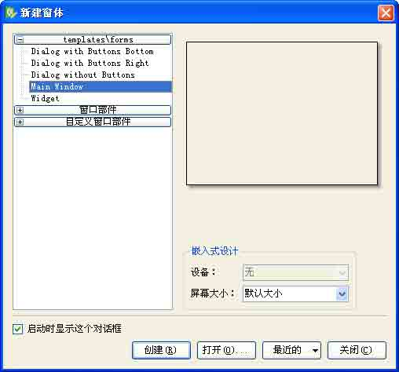

图 8-3 选择 Main Window 模板

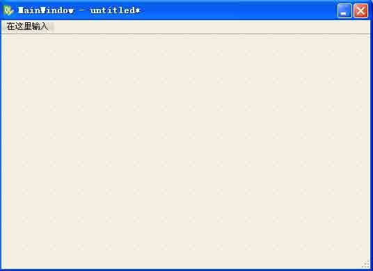

图 8-4 创建了一个空白主窗口界面

在这个系统默认生成的界面上，已经包含了一个菜单栏和一个状态栏，以及一个中心 窗口部件，我们可以从如图 8-5 所示的对象查看器中看得非常清楚。

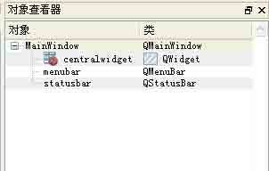

图 8-5 从对象查看器中看到的界面组成情况

菜单栏是可以被移除的，如图 8-6 所示，方法是在菜单栏上面点击鼠标右键，弹出上 下文菜单，选择【移除菜单栏】即可完成移除；再次创建菜单栏也很容易，在窗体上点击鼠 标右键，在弹出的上下文菜单上选择 【创建菜单栏】命令，即可增加一个新的菜单栏，如图 8-7 所示。状态栏的移除和创建与此相类似，只是状态栏并不可以在界面上编辑，而只能在 属性编辑器中设定属性，在对象观察器中也可设置其名字等基本属性。

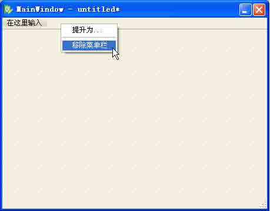

图 8-6 移除菜单栏

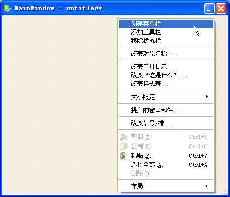

图 8-7 再次创建菜单栏

小贴士：根据 Qt Assistant 中的说法，这个界面默认包含了一个菜单栏和一个工具栏，原文如下：This template provides a main application window containing a menu bar and a toolbar by default -- these can be removed if they are not required. 这是与实际情况不符的，希望读者朋友注意。

一个 Qt 应用程序通常只有一个菜单栏和状态栏，但可以有多个工具栏以及锚接窗口部 件。

第 2 步，创建菜单项。

首先设计主菜单。 在主窗口上用鼠标左键双击【在这里输入】区域，在出现的文本框中输入第一个菜单的名字“&File”，并按下【Enter】键或【Return】键确认输入。其中“&”表示把字符 F 作为菜单显示文本助记符（在字母 F 下加下划线，即显示为“File”），作用是将 “Alt+F”设置为加速键（accelerator）。当应用程序处在活动状态时，通过按下加速键“Alt+F”，就可以将【File】菜单激活；或者主窗口的菜单栏处在活动的状态下（通过按下”Alt”键就可以将菜单栏激活），在键盘上直接按下 “F”键就可以激活【File】菜 单，如图 8-8 所示。这之后，依次建立【Edit】、【Help】等其它主菜单项。

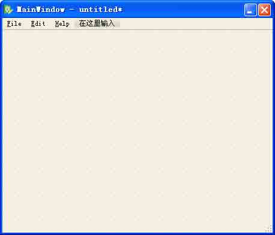

图 8-8 创建主菜单

你也可以在菜单项中输入中文名称，如 “文件”、“编辑”、“帮助”等，但我们不 推荐直接输入中文字符。输入中文的常见做法是 在主窗口上用鼠标左键双击“在这里输 入”区域，在出现的文本框中输入第一个菜单的名字 “文件(&F)”，并按下【Enter】键或【Return】键确认输入。同上，字母 F 将作为助记符，显示为“文件(F)”。其他菜单依此 类推。

小贴士：输入完毕后，一定要按下回车键（Enter 或 Return）予以确认，否则刚输入的字 符将无效。要拒绝输入的字符，可以按下【Escape】键，也可以同时按下“Ctrl+Z”组合键取消刚才的输入。

使用简单的拖拽方式就可以把主菜单项调整到你希望的位置，当你使用鼠标左键拖拽 主菜单项时，一条红色的竖线会提示出目的位置。

主菜单可以有任意多个菜单项，主菜单项的删除可以用上下文菜单命令实现，而不可 以使用【Delete】键。

然后设计子菜单。 子菜单的设计与主菜单类似,需要说明的是如何设置快捷键，这需要借助属性编辑器来完成，在属性编辑器中选中要设定的子菜单项，然后点击 ”shortcut”栏，如图 8-9 所示，在上面按下你想要加入的快捷键，比如 “Ctrl+N”,就同时按下这两个键即可完成设 置。这之后，用同样的做法完成各个子菜单项的添加。

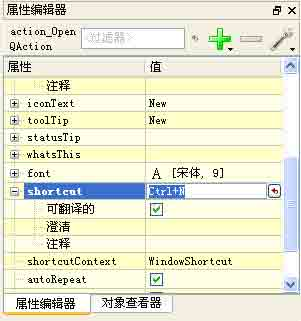

图 8-9 设置子菜单项的快捷键

子菜单也可以有任意多个或多个级联菜单项。子菜单项也可以使用拖拽方式到任意一 个主菜单下面，即使是一个已经关闭的主菜单。要删除子菜单项，可以直接按下 Delete 键。

小贴士：创建子菜单的同时，就创建了动作（ Action），这也是创建动作的方法之一。下面 还会讲到如何创建动作，并与菜单项进行关联。

第 3 步，设置属性 设置属性可以做到非常的快捷。请看下面的专题介绍。

专题：对象查看器和属性编辑器的配合使用

首先将对象查看器和属性编辑器按照如图 8-10 所示排列，然后在对象查看器中用鼠标 左键点击选中某一个对象，再切换到属性编辑器里面设置该对象的属性。

这种方法的好处是，不必在界面上费力气的逐个点击对象，再设置属性；而且有些对 象是不能通过鼠标点击获得焦点并设置属性的，如 Status Bar 等。

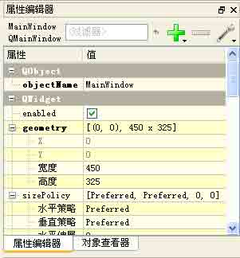

图 8-10 组合使用对象查看器和属性编辑器

### 8.4.2 创建动作

当菜单栏和工具栏被创建好之后，它们还不能够被使用，必须与动作关联起来。 Qt Designer 提供了一个动作编辑器，使用它创建和管理动作是一件非常轻松的事情。

创建动作有两种做法，一种就是在创建子菜单的同时，一并创建动作；另一种就是先 不创建子菜单，而是使用动作编辑器创建动作，然后再把动作 “拖”到菜单项上，这就在创 建动作的同时也创建了子菜单项。第一种前面已经讲过了，这里重点讲解后一种做法。首先 了解一下动作编辑器的用法。

专题：动作编辑器（Action Editor）

默认情况下，动作编辑器是显示在 Qt Designer 的右半部分的，如图 8-11 所示。


图 8-11 动作编辑器的样子

要控制动作编辑器的显示和隐藏也很容易，方法是依次点击主菜单项 【视图】→【动 作编辑器】，如图 8-12 所示。选中时，该项前面有一个对勾标记，表示显示动作编辑器， 反之，该项前面没有对勾，则表示隐藏动作编辑器。


图 8-12 显示或隐藏动作编辑器

动作编辑器允许用户创建、删除动作。它同时也提供了基于动作文本的搜索选项。 动作编辑器可以以图标视图（Icon View）或者是细节视图（Detailed View）的方式浏览。配置的方法是通过鼠标右键的上下文菜单，如图 8-13 所示，通过使用该菜单项可以对 动作进行增加、删除等各种操作。也可以使用动作编辑器工具栏上的快捷按钮。


图 8-13 设置动作编辑器的浏览方式

要创建一个动作，可以在动作编辑器中点击 【新建】按钮，将弹出【新建动作】对话 框，如图 8-14 所示。像图中那样为动作设置各个属性。当一个动作被创建完成后，它就可 以被应用了。


图 8-14 新建一个动作

在配置动作的图标时，如果不满意默认的图标，可以使用资源浏览器创建一个资源文 件（.qrc 文件），并添加各种图标文件。资源浏览器的使用请看后面的专题。

创建一个动作后，还需要把它与菜单或工具栏连接起来。方法是在动作编辑器上的某 个动作上点击鼠标左键，不要松开，把它拖到要关联的菜单或工具栏上。 Qt Designer 提供 了红色的高亮线来指示动作要关联的位置，判断好了之后，就可以释放鼠标左键，从而把动 作与菜单或工具栏按钮关联起来。图 8-15 显示了设置动作与菜单项关联的情形，图 8-16 显示了设置动作与工具栏按钮关联的情形。

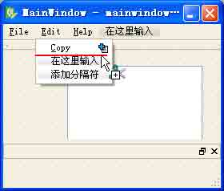

图 8-15 设置动作与菜单项的关联

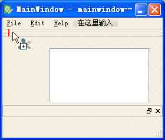

图 8-16 设置动作与工具栏按钮的关联

### 8.4.3 创建工具栏

创建工具栏很容易，通过使用鼠标右键的上下文菜单项 【添加工具栏】即可，如图所 示。同样的，如果已经有了工具栏，同样可以通过该上下文菜单项移除工具栏。

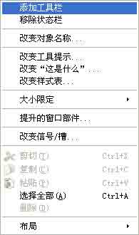

图 8-17 添加工具栏

要创建工具栏上的按钮，就必须在动作已经被创建的情况下才能进行。一个比较好的 方法是从动作编辑器中拖动动作至工具栏上，在认为合适的地方松开鼠标左键，这时就创建 了一个工具栏按钮。具体做法与上一小节介绍的相同。

工具栏上的按钮是可以被分组的，方法是使用鼠标右键的上下文菜单项 【添加分隔 符】，这样为【File】和【Edit】菜单分别创建工具组，如图 8-18 所示。

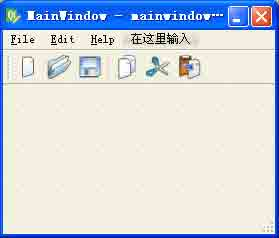

图 8-18 设置好工具栏的主窗口程序

### 8.4.4 创建锚接窗口部件（不是必需的）

从 Qt 4.5 开始，Qt Designer 在其窗口部件盒中可视化的提供了锚接窗口部件，这就 进一步简化了创建锚接窗口的步骤。因此，为主窗口程序创建锚接窗口比较简单，就是把这个部件从窗口部件盒中拖出来，放到合适的位置。如图 8-19 所示的例子中，一共放置了 4 个锚接窗口部件，而且上、下、左、右这 4 个可供停靠的位置上可以放置不止一个锚接窗 口部件。

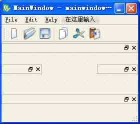

图 8-19 添加锚接窗口部件

注意，拖动锚接窗口部件时，不必太在意它的初始位置，这可以在属性编辑器中调 整，其锚接位置主要是通过 dockWidgetArea 属性来设置，如图 8-20 所示。

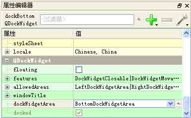

图 8-20 设置 dockWidgetArea 属性

### 8.4.5 创建中心窗口部件

在 Qt Designer 中为主窗口创建中心窗口部件，只需要将一个窗口部件拖动到窗口部 件盒中，然后再设置一个布局即可， Qt 会为程序设置好中心部件。如图 8-21 所示，图中 放置了一个 TextEdit 窗口部件，然后设置了一个垂直布局。


图 8-21 设置好中心窗口部件

我们可以从对象查看器中看到布局以及中心窗口部件的设置情况，如图 8-22 所示。

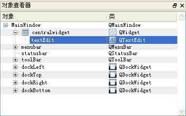

图 8-22 布局以及中心窗口部件的情况

好了，到此我们就使用 Qt Designer 创建了一个完整的主窗口界面，步骤也是比较清 晰的。中间用到了属性编辑器、对象浏览器、资源浏览器和动作编辑器以及窗口部件盒等重 要的工具，几乎将 Qt Designer 所用到的功能练习了一遍。使用 Qt Designer 创建主窗口 界面后，仍然需要使用代码完成菜单项的功能，可以采用手写代码的方式，也可以借助于 Qt Creator 这样的 IDE。请读者朋友自行练习。

# 8.5 中心窗口部件专题

## 8.5 中心窗口部件专题

从前面的例子中我们可以看到，Qt 程序中的主窗口通常具有一个中心窗口部件。从理 论上来讲，任何继承自 QWidget 的类的派生类的实例，都可以作为中心窗口部件使用。

### 8.5.1 几种常见情形

QMainWindow 的中心区域可以被任意种类的窗口部件所占用。下面给出的是所有可能情 形的概述。

1\. 使用标准的 Qt 窗口部件（Standard Widget）

像 QWidget、Qlabel 以及 QTextEdit 等等这样的标准窗口部件都可以用作中心窗口部 件。

2\. 使用自定义窗口部件（User-Define-Widget）

有时候，某些有特殊要求的应用程序需要在自定义窗口部件中显示数据，你可以把自 定义的窗口部件作为中心窗口部件。例如，你的绘图编辑器程序程序就可以使用类似名为 PhotoEditor 的自定义窗口部件作为自己的中心窗口部件。

3\. 使用一个带布局管理器的普通 Widget 有时候，应用程序的中央区域会被许多窗口部件所占用。这时就可以通过使用一个作为所有这些其他窗口部件父对象的 QWidget，以及通过使用布局管理器管理这些子窗口部件的大小和位置来完成这一特殊情况。

4\. 使用切分窗口（QSplitter） 其实，这种情况是上一种情况的一个例子。多个窗口部件一起使用的另一种方法是使用 QSplitter。我们把 QSplitter 作为一个容器，在其中容纳其它的窗口部件，这时的中心窗口部件就是一个 QSplitter。QSplitter 会在水平方向或者竖直方向上排列它的子窗口部 件，用户可以利用切分条（splitter handle）控制他们的尺寸大小。切分窗口可以包含所 有类型的窗口部件，包括其他切分窗口。

5\. 使用多文档界面工作空间（QMdiArea） 如果应用程序使用的是多文档界面，那么它的中心区域就会被 QMdiArea 窗口部件所占据，并且每个多文档界面窗口都是它的一个子窗口界面。 QMdiArea 是在 Qt4.3 以后引入的一个支持多文档应用的类。

6\. 使用工作空间部件（QWorkspace） 这种情况通常用于多文档应用程序中，这时应用程序主窗口的中心部件是一个 QWorkspace 部件或者它的子类化部件。但这种方法在 Qt4.5 以后将被废弃。后面我们还会讲到它。

### 8.5.2 创建和使用

一个 Qt 主窗口应用程序必须有一个中心窗口部件 (Central Widget)。当你采用 Qt Designer 创建主窗口时，默认情况下，系统已经为你创建了一个中心窗口部件，它是子类 化 QWidget 的。

结合代码可以方便的设置中心窗口部件，可以调用主窗口类的 setCentralWidget()方 法，它的原型如下：

```cpp
void QMainWindow::setCentralWidget ( QWidget * widget ) 
```

它将把 widget 设置为主窗口的中心窗口部件。

创建中心窗口部件完整的代码示例如下：

```cpp
QTextEdit * text;
text = new QTextEdit(this); setCentralWidget(text); 
```

Qt 应用程序的主窗口管理着中心窗口部件，它会在合适的时候销毁这个中心窗口部 件。每次程序调用 setCentralWidget()方法时，先前存在的中心窗口部件将被新的所替 换，而且主窗口会销毁原来的部件，无需用户处理。

要想在程序中获得并使用、设置中心窗口部件也很简单，通过调用主窗口类的 centralWidget()方法即可实现，它的函数原型如下：

```cpp
QWidget * QMainWindow::centralWidget () const 
```

它将返回主窗口的中心窗口部件，如果中心窗口部件不存在，它将返回 0。一个完整的 示例代码如下：

```cpp
QTextEdit * text = centralWidget();
//设置属性，但通常不需要
... 
```

# 8.6 Qt4 资源系统专题

## 8.6 Qt4 资源系统专题

Qt4 资源系统是与平台无关的，它被用来存储应用程序可执行文件运行时使用的二进制 文件（比如图标文件、翻译文件等）。它也是 Qt 的核心机制之一。当你的应用程序总是使 用一些特定的文件集合时，它会非常有用，并且能够保证文件不易丢失。

Qt4 资源系统的运转需要 qmake、rcc（(Qt's resource compiler）以及 QFile 的紧密 配合。

### 8.6.1 Qt 资源系统的改进

Qt4 的资源系统取代了 Qt3 的 qembed 工具和图片集（image collection）机制。 仍以我们的主窗口程序为例，如果采用 Qt3 的图片集机制，那么需要将下述代码加入到工程文件 mainwindow.pro 中：

```cpp
IMAGES = images/icon.jpg \
images/open.jpg \
......
images/find.jpg \ images/gotocell.jpg \
images/new.jpg \ 
```

而使用 Qt4 的资源系统机制的话，只需要在 mainwindow.pro 中加入一条代码：

```cpp
RESOURCE = mainwindow.qrc 
```

从中我们可以看出，Qt3 的图片集机制是把资源文件的分布情况罗列出来，逐条的写在 工程文件.pro 中，当程序中经常用到的资源文件数量非常多时，书写工程文件将是一件颇费力气而且乏味的工作，而且这样也会导致 .pro 文件条理不清晰，维护困难，容易出错。

### 8.6.2 Qt4 资源集文件

Qt4 在 Qt3 的基础上做了改进。重新定义了一个 Qt 资源集（Resource Collection Files）文件，即.qrc 文件，它是一个基于标准 xml 格式的文本文件，我们在程序中所用到 的资源文件就被有规律的嵌入到它的标签中，条理非常清晰，易于阅读和维护。 Qt4 的 qmake 能够识别这个资源集文件，并且能够根据它的描述去相应的目录下定位具体的资源。

### 8.6.3 资源文件的使用方法

在构造函数的最后部分，把窗口的图标设置为 icon.jpg，它是一个 PNG 格式的文件。 Qt 支持很多图像格式，包括 BMP、GIF、JPEG、PNG、PNM、SVG、TIFF、XBM 和 XPM。调用 QWidget::setWindowsIcon()函数可以设置显示在窗口左上角的图标。遗憾的是，还没有一 种与平台无关的可在桌面上显示应用程序图标的设置方法。

图形用户界面（GUI）应用程序通常会使用很多图片。为应用程序提供图片的方法有多 种，以下是最为常用的一些方法：

1\. 把图片保存到文件中，并且在程序运行时载入它们。

2\. 把 XPM 文件包含在源代码中。（这一方法之所以可行，是因为 XPM 文件也是有效的 C++文件。）

3\. 使用 Qt 的资源机制（Resource Mechanism）。

这里，我们使用了 Qt 的资源机制法，因为它比运行时载入文件的方法更为方便，并且 该方法适用于所支持的任意文件格式。我们将选中的图片存放在源代码树中名为 images 的 子目录下。

为了利用 Qt 的资源系统，必须创建一个资源文件（ Resource File），并且在识别该 资源文件的.pro 工程文件中添加一行代码。在这个例子中，已经将资源文件命名为 xxx.qrc，因此只需在.pro 文件中添加如下一行代码：

```cpp
RESOURCE = xxx.qrc 
```

资源文件自身使用了一种简单的 xml 文件格式。这里给出的是从已经使用的资源文件 中摘录的部分内容：

```cpp
&lt;RCC&gt;
&lt;qresource&gt;
&lt;file&gt;images/copy.jpg&lt;/file&gt;
&lt;file&gt;images/cut.jpg&lt;/file&gt;
&lt;file&gt;images/new.jpg&lt;/file&gt;
&lt;file&gt;images/open.jpg&lt;/file&gt;
&lt;/qresource&gt;
&lt;/RCC&gt;
&lt;file&gt;images/paste.jpg&lt;/file&gt;
&lt;file&gt;images/save.jpg&lt;/file&gt; 
```

所有资源文件都会被编译到应用程序的可执行文件中，因此并不会弄丢它们。当引用 这些资源时，需要使用带路径前缀 :/（冒号斜线）的形式，这就是为什么会将图标文件表示成:/images/icon.jpg 的形式。资源可以使任意类型的文件（并非只是一些图像），并且可以在 Qt 需要文件名的大多数地方使用它们。

通过 Qt 资源编辑器 rcc，可以将资源转换为 C++代码。还可以通过把下面一行代码加 入到.pro 文件中来告诉 qmake 包括专门的规则以运行 rcc。

```cpp
RESOURCE = myresourcefile.qrc 
```

myresourcefile.qrc 文件是一个 XML 文件，它列出了所有嵌入到可执行文件中的文 件。

假设我们正在编写一个保持联系细节的应用程序。考虑到用户使用的方便性，我们想 在最后的可执行文件中嵌入国际拨号代码。如果文件在应用程序所建目录的 datafiles 目 录下，那么资源文件将会如下所示：

```cpp
&lt;RCC&gt;
&lt;qresource&gt;
&lt;file&gt;datafiles/phone-codes.dat&lt;/file&gt;
&lt;/qresource&gt;
&lt;/RCC&gt; 
```

在应用程序中，资源是通过:/路径前缀识别的。在这个例子中，拨号代码文件的路径 为:/datafiles/phone-codes.dat，它可以像其他任何文件一样通过 QFile 读取。

在可执行文件中的嵌入数据具有不易丢失的优点，而且也有利于创建真正独立的可执 行文件（如果也采用了静态链接的话）。它的两个缺点是：第一，如果需要改变嵌入数据， 则整个可执行文件都要跟着替换；第二，由于必须容纳被嵌入的数据，可执行文件本身将变 得比较大。


图 8-23 Qt 资源的编译

Qt 资源系统所具备并提供的功能远远不止我们所介绍的这些，它还包括对文件名别名（Alias）的支持和本地化（Locale）的支持。如果你对此感兴趣，请在 Qt Assistant 中 查阅“The Qt Resource System”一节中的内容。

目前，Qt4 资源系统总是将资源文件数据直接存储在应用程序的可执行文件中，这确实 导致该文件体积偏大，这也是目前 Qt4 被人们所指摘的几个主要问题之一。众所周知， Windows 以及 Mac OS X 系统都提供了对资源的原生支持。在 Qt 的后续版本中，有望对这一 情况进行适应性修改。

### 8.6.4 资源浏览器（Resource Browser）的使用

资源浏览器是 Qt Designer 的常用组件之一。在使用 Qt Designer 创建的每一个界面 布局都可以拥有独立的资源集文件（ .qrc 文件）。

资源浏览器默认情况下已经打开并位于 Qt Designer 的右下角，如图 8-24 所示。

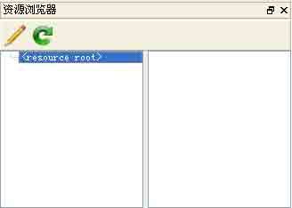

图 8-24 资源浏览器

在资源浏览器内，可以打开一个已经存在的资源集文件或者是创建新的资源集文件。 可以通过点击快捷按钮来编辑资源。表 8-4 列举了快捷按钮的功用。

表 8-4 资源浏览器快捷按钮的功用

| 图标 | 功用 |
| --- | --- |
|  | 编辑资源文件 |
|  | 重新载入资源文件 |

载入资源集文件后，可以创建或者是删除其中包含的资源文件。表 8-5 列举了【编辑 资源】对话框中各个功能按钮的功用。

表 8-5 编辑资源对话框中功能按钮的功用

| 图标 | 功用 |
| --- | --- |
|  | 增加前缀 |
|  | 增加资源文件 |
|  | 移除资源文件或者前缀 |
|  | 新建资源文件 |
|  | 打开资源文件 |
|  | 移除资源文件 |

注意，添加到资源集文件内的资源文件必须与资源集文件在同一个文件夹内或者是位 于它的子菜单下面。

图 8-25 显示的是一个添加资源集文件的范例。

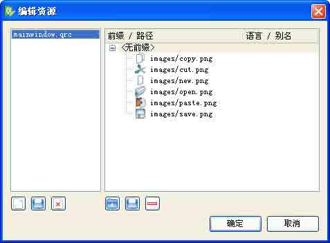

图 8-25 编辑资源集文件

注意，Qt 资源集文件中对前缀的要求不是必需的。

# 8.7 锚接窗口

## 8.7 锚接窗口

锚接窗口又被称作是停靠窗口，是指用户可以在工具栏区域内或区域间随意移动的窗 口。用户可以对停靠窗口解锁，使该窗口浮在应用程序顶部，也可以使窗口最小化。 锚接窗 口是由 QDockWidget 类提供的。通过 QDockWidget 实例化并添加窗体，可以创建自定义 锚 接窗口。如果锚接窗口占据水平区域（例如，在主窗口的顶部） ，那么窗体将会横向排列； 如果占据垂直区域（例如，在主窗口的左侧），那么窗体将会纵向排列。 锚接区域可嵌套， 以允许锚接窗口堆叠为多行或多列。


图 8-26 停靠区域包括三个停靠窗口，放在垂直标签页中； 其中一个停靠窗口带有自定义的标题栏和窗体控件。

停靠窗口可显示垂直的标题栏，窗口之前还可共享区域 – 当发生区域共享时，停靠 窗口将容纳在标签页中。 还可给停靠窗体设置风格独特的标题栏和窗体控件（参见上面的 图 8-26 ）

有些应用程序（包括 Qt Designer 和 Qt Linguist ）经常使用锚接窗口。 QMainWindow 为操作者提供保存并恢复锚接窗口和工具栏的位置的功能，这样，应用程序可 以轻松恢复用户首选工作环境。

### 8.7.1 创建锚接窗口的方法和流程

在主窗口程序中创建锚接窗口的一般流程如下：

1.创建锚接窗体

创建一个 QDockWidget 对象的锚接窗体。

2.设置此锚接窗体的属性

通常调用 setFeatures()及 setAllowedAreas()两种方法。

3.新建一个要插入锚接窗体的窗口部件

常用的一般为 QListWidget 和 QTextEdit。

4.把窗口部件插入锚接窗体

调用 QDockWidget 的 setWidget()方法。

5.在 MainWindow 中加入此停靠窗体

使用 addDockWidget()方法。 以下是一段示例代码，演示了上述方法和流程。

```cpp
// 停靠窗口
QDockWidget *dock = new QDockWidget(tr("DockWindow"), this ); dock-&gt;setFeatures( QDockWidget::DockWidgetMovable );
dock-&gt;setAllowedAreas(Qt::LeftDockWidgetArea|Qt::RightDockWidgetArea); QTextEdit *te = new QTextEdit();
te-&gt;setText(tr("Dock Window!")); dock-&gt;setWidget( te );
addDockWidget( Qt::RightDockWidgetArea, dock ); 
```

### 8.7.2 设置锚接窗体状态的方法

主要是 setAllowedAreas()和 setFeatures()方法的使用。 其中，setAllowedAreas()方法设置停靠窗体可停靠的区域，原型如下：

```cpp
void setAllowedAreas( Qt::DockWidgetAreas areas ); 
```

参数 areas 由 Qt::DockWidgetAreas 枚举变量指定了锚接窗体可停靠区域，包括表 8-6 列举的几种。

表 8-6 锚接窗体的可停靠区域

| Qt::LeftDockWidgetArea | 可在主窗口的左侧停靠 |
| --- | --- |
| Qt::LeftDockWidgetArea | 可在主窗口的右侧停靠 |
| Qt::RightDockWidgetArea | 可在主窗口的顶端停靠 |
| Qt::BottomDockWidgetArea | 可在主窗口的底部停靠 |
| Qt::AllDockWidgetAreas | 可在主窗口任意（以上 4 个）部位停靠 |
| Qt::NoDockWidgetArea | 只可停靠在插入处 |

以上各种情况可以叠加使用，采用或(｜)的方式进行综合设定。 setFeatures()方法设置停靠窗体的特性，原型如下：

```cpp
void setFeatures(DockWidgetFeatures features); 
```

参数 features 由 QDockWidget::DockWidgetFeature 枚举变量指定锚接窗体的特性，

表 8-7 列举了所有的情况。

表 8-7 锚接窗体的特性

| QDockWidget::DockWidgetClosable | 停靠窗可关闭，右上角的关闭按钮 |
| --- | --- |
| QDockWidget::DockWidgetMovable | 停靠窗可移动 |
| QDockWidget::DockWidgetFloatable | 停靠窗可浮动 |
| QDockWidget::DockWidgetFeatures | 此参数表示拥有停靠窗的所有特性 |
| QDockWidget::NoDockWidgetFeature | 不可移动、不可关闭、不可浮动 |

此参数也可采用或(|)的方式对停靠窗进行特性的设定。

# 8.8 多文档

## 8.8 多文档

在每一个主窗口中只提供一个文档的应用程序被称为单文档界面（ SDI）应用程序。基 于 SDI 的应用程序只提供了一个单一主窗口，并且在同一时间只能处理一个文档。如果想 让它在同一时间具有处理多个文档的能力，就需要同时启动多个应用程序实例。但是这对于 用户来讲是很不方便的。针对这种情况，我们可以使用基于多文档界面（ MDI）的应用程 序，它也只有一个主窗口，但可以产生和管理多个文档窗口。基于多文档的应用程序也是很 常见的，比如 FireFox 浏览器就是典型的例子，它允许用户在同一时间内打开多个浏览器 窗口。

Qt 可以在它所支持的所有平台上创建 SDI 和 MDI 应用程序。 根据笔者的经验，在通常的工程项目中，使用 SDI 的应用程序占到了大多数的比例，但我们仍然需要对 MDI 有所了解。

### 8.8.1 创建多文档

在 Qt4 中创建 MDI 应用程序主要有以下方法：

1\. 多实例实现主窗口的多文档

在一个应用程序中实例化多个主窗口，即当打开或新建文档的时候，文本编辑器应用 程序新建一个主窗口，这个主窗口单独加载和编辑文档。这种情况下，多个主窗口属于同一 个应用程序，当关闭所有的主窗口的时候，文本编辑器应用程序也就结束了运行。这种方法 称为多实例实现主窗口的多文档。

下面将修改应用程序，以使它可以处理多个文档。首先，需要对 File 菜单做一些简单 改动：

*   利用 File→New 创建一个空文档窗口，而不是再次使用已经存在的主窗口。
*   利用 File→Close 关闭当前主窗口。
*   利用 File→Exit 关闭所有窗口。

在 File 菜单的最初版本中，并没有 Close 选项，这只是因为当时它还和 Exit 一样具 有相同的功能。新的 File 菜单如图 8-27 所示。

新的 main()函数为：

```cpp
int main(int argc,char *argv[])
{
    QApplication app(argc,argv); MainWindow *mainWin = new MainWindow; mainWin-&gt;show();
    return app.exec();
} 
```

具有多窗口功能后，现在就需要使用菜单中的 new 来创建 MainWindow。考虑到节省内 存，可以再工作完成之后使用 delete 操作来删除主窗口。

这是新的 MainWindow::newFile()槽：

```cpp
void MainWindow::newFile()
{
    MainWindow *mainWin = new MainWindow; mainWin-&gt;show();
} 
```

我们只创建了一个新的 MainWindow 实例。这看起来有些奇怪，因为没有保留指向这个 新窗口的任何指针，但实际上这并不是什么问题，因为 Qt 会对所有的窗口进行跟踪。

以下是用于 Close 和 Exit 的动作：

```cpp
void MainWindow::createActions()
{
    ...
    closeAct = new QAction(tr("Cl&ose"), this); closeAct-&gt;setShortcut(tr("Ctrl+F4"));
    closeAct-&gt;setStatusTip(tr("Close the active window"));
    connect(closeAct, SIGNAL(triggered()),mdiArea, SLOT(closeActiveSubWindow()));
    exitAct = new QAction(tr("E&xit"), this); exitAct-&gt;setShortcut(tr("Ctrl+Q"));
    exitAct-&gt;setStatusTip(tr("Exit the application"));
    connect(exitAct, SIGNAL(triggered()), qApp, SLOT(closeAllWindows()));
} 
```

到此，我们就实现了从 SDI 到 MDI 的“转变”，组合好你的工程文件，编译、链接、 运行程序即可。

小贴士：在 Mac OS X 系统中，通常采用这种方法实现 MDI 应用程序。

2.使用 QWorkSpace

使用 QWorkSpace 作为主窗口的中心部件，在 QWorkspace 中打开多个子窗口，每一个 子窗口可以单独对文档进行加载和编辑。

QWorkspace 类继承自 QWidget 类，利用它可以很方便的实现多文档的应用。使用它的 方法有如下步骤：

第 1 步，在主窗口的头文件（如 mainwindow.h）中加入 QWorkspace 类的头文件，代码 如下：

```cpp
#include &lt;QWorkspace&gt; 
```

也可以采用类的前置声明，代码如下：

```cpp
class QWorkspace; 
```

第 2 步，在主窗口头文件中声明一个 QWorkspace 类对象，代码如下：

```cpp
QWorkspace *workspace; 
```

第 3 步，在构造函数中实例化该对象，并把该对象设置为主窗口的中心窗口部件，代 码如下：

```cpp
MainWindow::MainWindow()
{
    workspace = new QWorkspace; setCentralWidget(workspace);
    ...
} 
```

第 4 步，创建多个子窗口，并创建它们各自的中心窗口部件 。

```cpp
 QMainWindow *window1 = new QMainWindow; 
    window1-&gt;setWindowTitle(tr("window 1")); 
    QTextEdit *textEdit1 = new QTextEdit; 
    textEdit1-&gt;setText(tr("Window 1")); 
    window1-&gt;setCentralWidget(textEdit1);

    QMainWindow *window2 = new QMainWindow;
    window2-&gt;setWindowTitle(tr("window 2")); 
    QTextEdit * textEdit2 = new QTextEdit; 
    textEdit2-&gt;setText(tr("Window 2")); 
    window2-&gt;setCentralWidget(textEdit2);

    QMainWindow *window3 = new QMainWindow; 
    window3-&gt;setWindowTitle(tr("window 3")); 
    QTextEdit * textEdit3 = new QTextEdit;

    textEdit3-&gt;setText(tr("Window 3")); 
    window3-&gt;setCentralWidget(textEdit3); 
```

第 5 步，在 workSpace 对象中加入这几个子窗口，对它们进行管理，代码如下：

```cpp
workSpace-&gt;addWindow(window1); 
workSpace-&gt;addWindow(window2); 
workSpace-&gt;addWindow(window3); 
```

第 6 步，组织好你的工程文件，编译、链接、运行程序即可。 完整的示例程序在本章目录下的 workspace 文件夹下面。

小贴士：在 Qt4.5 版推出以后，不推荐采用上述方法来创建 MDI 应用程序。来自 Qt 的 官方说法是，QWorkspace 是被废弃的类，它的存在就是为了使采用以前版本的 Qt 开发的程 序能够正常运行。所以，如果你使用的是 Qt4.5 及以后的版本，我们强烈建议你使用 QMdiArea 来创建 MDI 应用程序。

3.使用 QMdiArea

这种方法的核心主要是掌握两个类的用法： QMdiArea 和 QMdiSubWindow，前者主要用 于创建程序主窗口的中心窗口部件，后者用于创建主窗口的各个子窗口。具体的做法是把 QMdiArea 类的实例作为主窗口的中心部件，把 QMdiSubWindow 类的实例作为子窗口，并由 QMdiArea 实现对多个子窗口的管理。

QMdiArea 类继承自 QAbstractScrollArea，它是 Qt 4.3 以后新增加的类。在创建 MDI 应用程序时，QMdiArea 类的实例通常被用作主窗口的中心窗口部件，但也可以被放置于一 个布局中。实际上，QMdiArea 是 MDI 应用程序的窗口管理器。它建立、绘制、管理在它之 上的子窗口，并可采用层叠或者平铺的方式排列它们。

QMdiSubWindow 继承自 QWidget，它的作用是为 QMdiArea 创建子窗口。它代表了在 QMdiArea 中创建的顶层窗口。它主要包含一个标题栏、一个内部窗口（ Internal Widget）、一个窗口框架和一个大小控制手柄。 QMdiSubWindow 有自己的布局（Layout）， 在其中包含窗口标题栏以及内部窗口的中心窗口区域。一个典型的 QMdiSubWindow 实例如 图 8-27 所示。

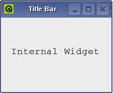

图 8-27 QMdiSubWindow 子窗口

听了上面的介绍，大家是不是有点“晕”呢？别着急，请看图 8-28，它示意了采用这 种方法创建 MDI 应用程序的窗口布局以及创建的方法。图中的主窗口是子类化 QMainWindow 类创建的；主窗口的中心窗口部件使用 QMdiArea 的实例创建；子窗口是子类化 QWidget 实 现的，而子窗口的内部窗口部件是使用 QMdiSubWindow 的实例创建的。

它们之间的关系总结如下：QMdiArea 是所有子窗口的容器和管理器，QMdiArea 中的子 窗口都是 QMdiSubWindow 类的实例。我们通过 addSubWindow()方法把它们加入到 MDI 应用 程序中。使用时，通常先建立一个 QWidget 或其子类的实例，然后把它作为参数调用 addSubWindow()函数，addSubWindow()函数将把它作为子窗口的内部窗口，并填充中心窗口 区域。由于 QMdiSubWindow 是 QWidget 的子类，所以你可以像使用以前我们介绍过的常见 顶层窗口那样使用它，如可以调用基类 QWidget 的 show(), hide(), showMaximized(), 以及 setWindowTitle()等方法对窗口实例进行设置。

看着这张图再对照笔者上面的讲解，应该就很清楚了吧。

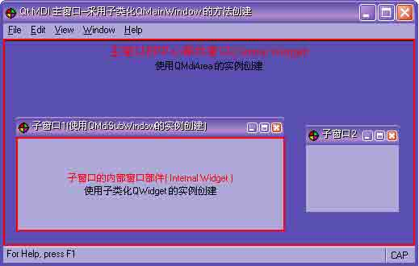

图 8-28 使用 QMdiArea 类创建 MDI 时的窗口框架

小贴士：为 QMdiSubWindow 创建内部窗口有两种方法，一种是调用 addSubWindow(widget)，其中 widget 参数将作为内部窗口部件；另一种是先创建一个继承 自 QWidget 的窗口实例，然后调用 setWidget ( QWidget * widget )方法，把 widget 作为子 窗口的内部窗口部件即可，这个内部窗口部件将被显示在子窗口的中心区域。注意， QMdiArea 会对其内部的子窗口进行管理，你不必使用代码显式的管理它们。

QMdiSubWindow 还有许多专门对应 MDI 应用类型而设置的方法和属性，大家可以在 Qt Assistant 中获得详尽的介绍。

好了，我们详细解说一下如何采用 QMdiArea 和 QMdiSubWindow 类来创建 MDI 应用程 序，这个例子在本章目录 mdi 文件夹下面。

第 1 步，包含用到的类

在主窗口的头文件（如 mainwindow.h）中包含程序中使用到的类,有两种方法，一是可 以加入头文件；二是当情况比较简单时，也可以采用类的前置声明。

加入头文件：

```cpp
#include &lt;QMdiArea&gt;
#include &lt;QMdiSubWindow&gt;
... 
```

或者采用类前置声明：

```cpp
class QMdiArea; 
class QMdiSubWindow;
... 
```

第 2 步，声明一个 QMdiArea 类对象

在主窗口的头文件中声明一个 QMdiArea 类对象，在后面还需要声明一个你的子窗口类 的对象，代码如下：

```cpp
QMdiArea *mdiArea;
...
MdiChild *child;//声明子窗口类的对象
... 
```

第 3 步，设置中心窗口部件

在主窗口类的实现文件中（如 mainwindow.cpp，通常在其构造函数中）实例化该对 象，并把它设置为主窗口的中心窗口部件，代码如下：

```cpp
MainWindow::MainWindow()
{
    mdiArea = new QMdiArea; setCentralWidget( mdiArea );
    ...
} 
```

第 4 步，创建子窗口

新建一个子窗口类，它可派生自 QWidget 或其子类，比如 QTextEdit。这个类的实例将 作为子窗口的内部窗口部件。这个子窗口类的创建与我们前面讲到的子类化对话框和子类化 QWidget 的方法相同，只是它没有菜单栏、工具栏和状态栏。

另外记得在主窗口的头文件中加入该子窗口类的声明。

第 5 步，实例化子窗口类，并使用 QMdiArea 对它进行管理，代码如下：

```cpp
child = new MdiChild;
QMdiSubWindow *subWindow = mdiArea-&gt;addSubWindow(child); subWindow-&gt;show();
... 
```

小贴士：QMdiArea::addSubWindow()函数创建一个新的 QMdiSubWindow，把作为参数传递的 该窗口部件放进子窗口中，并且返回该子窗口。最后一行代码调用 show()方法，使该子窗口可见。

第 6 步，创建并显示子窗口

这通常是在用户点击 File->NewFile 时完成的，代码如下：

```cpp
void MainWindow::newFile()
{
    child-&gt;newFile(); child-&gt;show();
} 
```

整个程序的实现过程可以用图描述。

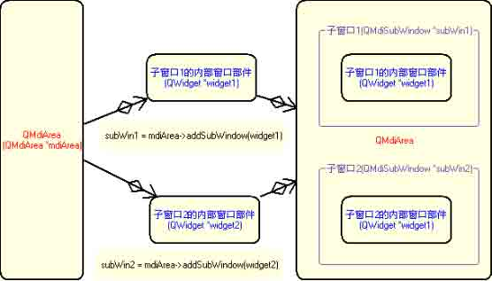

图 8-29 程序的实现过程

小贴士：在 MDI 应用程序中，主窗口类并不需要对文档进行具体处理，这些工作是在子窗 口类中完成的，相当于在 SDI 应用程序中实现的文档处理功能。

第 7 步，创建 main.cpp 文件 这步没有什么好说的，代码如下：

```cpp
#include &lt;QApplication&gt;
#include "mainwindow.h"
int main(int argc, char *argv[])
{
    Q_INIT_RESOURCE(mdi);//使用 Qt 资源系统
    QApplication app(argc, argv); MainWindow mainWin; mainWin.show();
    return app.exec();
} 
```

做完这些后，组织好你的工程内的文件（头文件、实现文件、资源文件、资源集文件 等），编译、链接、运行程序即可。一个典型的 MDI 应用程序界面如图 8-30 所示。

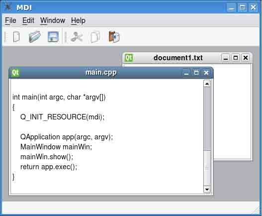

图 8-30 使用 QMdiArea 建立的 MDI 应用程序界面

到这里，关于如何使用 Qt4 创建 MDI 应用程序就讲解完了。采用 QMdiArea 的方法是笔 者重点讲解的，一是因为它是 Qt4.5 版以后官方所推荐采用的方法，用于替代 QWorkspace；二是因为它也是实现 MDI 的方法中使用起来最为复杂和令人困惑的一个。即 使是让 Qt“老鸟”来解释清楚什么是“主窗口的中心窗口”、“子窗口的内部窗口”、 “子窗口的中心区域”等等这些名词以及用法，也不是一件容易的事。

相对而言，使用 QWorkspace 创建 MDI 是比较容易的，但 Qt 以后将不再对这个类继续更新和支持，而“多实例实现多文档”的方法在 Mac OS X 上应用很广泛，它实质上就是使 用了多个顶层窗口，也是比较容易掌握的。

熟练使用 Qt4 建立 MDI 应用程序所涉及的内容远远不止本书所介绍的这些，比如子窗 口如何响应键盘与鼠标事件，如何同步所有主窗口的 “最近打开文件列表”等等问题都需要 费些力气解决。对于初学者而言，这是一个比较复杂的话题。大家在阅读到此处时，建议仍 然采用“知道、会用即可”的原则，不必深究它们背后的机理。随着学习进程的逐步深入， 一些开始接触时觉得困难的内容，就会在你心中逐渐明晰了。

# 8.9 问题与解答

## 8.9 问题与解答

问：我用的是 Qt Designer，会自动加上 statusbar，如何把它去掉呢？

答：如图 8-31 所示，可以在对象查看器（Object Inspector）中点击鼠标右键，然后 把它删掉。


图 8-31 在对象查看器中删除状态栏

对象查看器（Object Inspector）是很有用的一个部件工具，可以索引窗口部件。

问：在 Qt4 中如何创建有最大最小化的 MainWindow？

怎么新创建的 MainWindow 就只有一个关闭按钮,没有最大最小化呢,而且拖边框放大缩 小也不可以,只能在右下那个角拖.

答：用 setWindowFlags()方法设置。在 Qt Demos 里面有一个例子是演示 setWindowFlags 里各种选项的效果的。

你的问题可以使用下面的语句：

```cpp
setWindowFlags(windowFlags() & ~Qt::WindowMinMaxButtonsHint); 
```

问：怎样去掉 MainWindow 最大化和最小化按钮？

答：这个问题与前一个类似，用 setWindowFlags()方法设置。

```cpp
setWindowFlags(Qt::CustomizeWindowHint ); //这样应该能够达到你的需要
main_window* window 
    = new main_window(this,0,FALSE,WStyle_Customize | WStyle_NormalBorder | WStyle_Title | WStyle_SysMenu); 
```

也可以这样写：

或者在构造函数中加上这两句：

```cpp
setWindowFlags(Qt::Dialog); //窗体没有最大化最小化按钮 
setFixedSize(250, 100); //设置窗体的大小 
```

问：MainWindow 窗口如何固定？

项目要求将 MainWindow 窗口的标题栏屏蔽。就是只响应它的关闭按钮，对于最大化和 最小化都不响应，而且也不能被鼠标拖动， 请问有没有什么好的办法。

答：以下代码可以达到效果，可以看做是前面几个问题的综合示例：

```cpp
#include &lt;QtGui&gt;
#include &lt;QtCore&gt;
int main(int argc, char **argv)
{
    QApplication app(argc, argv); QMainWindow window;
    window.setWindowFlags(window.windowFlags()
        & ~Qt::WindowMaximizeButtonHint
        & ~Qt::WindowMinimizeButtonHint
    );
    int titleBarHeight =
        QApplication::style()-&gt;pixelMetric(QStyle::PM_TitleBarHeight); 
    QRect rect = QApplication::desktop()-&gt;availableGeometry(); 
    rect.setTop(rect.top() + titleBarHeight);
    window.setGeometry(rect); 
    window.setFixedSize(window.size()); 
    window.showMaximized();
    return app.exec();
} 
```

style()、setGeometry()、setFixedSize()方法在涉及到界面布局时经常会用到，用 法比较简单，可以查阅 Qt Assistant。

问：在 Qt Designer 中设计 Main Window 程序的问题

我在 Main Window 里放置了一个 TextEdit，被自动设为 centralWidget。可是在程序 执行的时候，该 TextEdit 不能充满整个程序界面，请问如何解决？

答：你对中心部件（Central Widget）的认识是存在误区的。那个 TextEdit 是不会被 自动设置为中心部件的。如果使用 Qt Designer 的话，你要添加一个布局管理器， 然后设 置主窗口的中心部件，其实和手写代码是一样的。

# 8.10 总结与提高

## 8.10 总结与提高

本章主要介绍了以下内容：

*   应用程序主窗口框架的组成
*   常用的创建主窗口的方法和适用场合
*   完全使用代码创建主窗口的方法和步骤
*   使用 Qt Designer 和代码相结合创建主窗口的方法和步骤
*   中心窗口部件专题讲解
*   Qt4 资源系统专题讲解
*   创建多文档应用程序的方法和步骤 这些都是日后在工程开发实践中经常会用到的基本知识和技能，必须熟练掌握。对于多文档的应用，建议大家只要能够熟练运用本书中介绍的 3 种方法中的一种就可以了。

关于主窗口的应用还有很多更为深入的内容，但它们都是建立在本章所介绍内容的基 础上的，大家把基础打好，再一步一步的向上 “攀登”，就会容易多了。

最后，提出一个问题供大家思考，即如何实现在 Qt 的工具栏中嵌入其他的窗口部件， 比如列表框(QComboBox)、编辑框(QLineEdit)。这种情况是很常见的，在 MS Word、IE 中 都有很多类似的应用。提示一下，我们前面提到过 Qt 编程的一般顺序，就是先声明所需的 窗口部件，然后实例化它，定义它的实例的属性和方法，最后就是在需要的地方使用它。这 个问题，我们也是这样处理，最后使用 QToolBar 的 AddWidget()方法把窗口部件的实例加 入到工具栏中。请大家自行完成这个 练习。