# 第十一章 布局管理

# 第十一章 布局管理

**本章重点**

*   在窗体中摆放窗口部件的方法
*   布局的基本概念和分类
*   基本布局的创建方法和步骤
*   堆栈窗体的创建和使用
*   切分窗口的创建和使用
*   各种布局方式的综合使用
*   如何优化布局结构
*   布局管理的经验总结

放置在窗体中的每一个窗口部件都必须有一个合适的大小和位置，并且它们应该能够随着程序自身的辩护做出响应而不改变整体的布局结构。 Qt4 提供了多种用于在窗体中摆放窗口部件的类：QHBoxLayout、QVBoxLayout、QGridLayout、QFormLayout 和 QStackedLayout。这些类简单易用，几何每个 Qt 开发人员都会用到它们-或者直接在源代码中，或者通过 Qt Designer。在这一章里，我们将学习如何使用 Qt4 中基本的布局管理器以及栈部件和分裂器部件来完成一些比较复杂的布局。

可以执行布局管理功能的其他类还有 QSplitter、QScrollArea、QMainWindow 和 QMdiArea 等。这些类所拥有的共同点在于它们提供了一种用户可以灵活掌控的布局方式。 例如，QSplitter 就提供了一个切分窗口拖动条（splitter bar），通过拖拽它，用户可以 改变窗口部件的大小。QMdiArea 则为多文档界面（multiple document interface,MDI）提 供了支持。它们经常适合用作布局类的替换方式，我们将在本章中讲述其中的部分内容。

# 11.1 基本概念和方法

## 11.1 基本概念和方法

Qt 布局管理器是 Qt 图形用户界面设计的基本内容，在前面的几章中也断断续续的讲到 了 Qt 的布局管理器的使用，也做了一些简单的应用。本小节将详细介绍 Qt 的布局管理器，详细阐述 Qt 布局管理器的一些特性。

### 11.1.1 摆放窗口部件的方法

Qt 提供了几种在窗口部件上管理子窗口部件的基本方式。

一共有 3 种方法用于管理窗体上子窗口部件的布局：绝对位置法、人工布局法和布局管理器法。

相比于使用固定尺寸和位置，布局提供了功能强大且极具灵活性的另一种方案。使用 布局后，编程人员无需计算尺寸和位置，布局可以自动进行调整，符合用户屏幕、语言以及 字体的要求。

1.绝对位置法

这种方法是最原始的摆放窗口部件的方法，甚至都不能称其为 “摆放”。它对窗体的 各个子窗口部件分配固定的大小和位置，是通过调用基类 QWidget 提供的 setGeometry()函 数来实现的。

绝对位置法有很多缺点：

*   用户无法改变窗口的大小，当父窗口改变时，子窗口不能做出相应的调整。
*   如果用户选择了一种不大常用的大字体，或者当应用程序被翻译成另外一种语言 时，也许会把一些文本截断。
*   对于某些风格的平台，这些窗口部件可能会具有并不合适的尺寸大小。
*   必须人工计算这些位置和大小。这样做不仅非常枯燥而且极易出错，并且还会让后 期的维护工作变得痛苦万分。

很显然，使用这种方式管理 GUI 应用程序大大降低了程序员的开发效率，降低了应用 程序的质量和适应性。

2.人工布局法

这种方法的核心是通过重载 QWidget::resizeEvent(QResizeEvent*)函数来使得子窗口 的的大小尺寸总是和父窗口的大小成比例，也就在一定程度上减轻了计算量，但是在其中也 要通过 setGeometry()函数来设置子窗口部件的位置和大小。

在程序的规模比较小，并且不需要时常变更设计的情况下，绝对位置法勉强可以胜 任。但是它就像前面的绝对位置法一样，仍然需要计算许多手写代码中的常量，尤其是当设 计被改变的时候，这种情况更加突出，而且它并没有消除文本会被截断的危险。辅以社会自 子窗口部件的大小提示，应该可以规避这种风险，但是这样会使代码变得尤为复杂。

3.布局管理器法

这种方式是使用 Qt 设计用户界面、组织管理 Qt 窗口部件的最好方法。布局管理器为 窗口部件提供了有感知的默认值（ sensible default sizes），可以随着窗口部件大小的变 化，对子窗口部件的大小和位置做出适当的调整。

### 11.1.2 布局管理器

Qt 的布局管理器负责在父才窗口部件区域内构建子窗口部件。这些管理器可以使其中 的窗口部件自动定位并重新调整子窗口部件、保持窗口部件敏感度最小化的变化和默认尺 寸，并可在内容或文本字体更改时自动重新定位。在 Qt Designer 中，完全可以使用布局管理器来定位控件。图 1-1 显示了使用了顶层布局管理器的应用程序在不同尺寸下的情形，可以看到，由于布局管理器的存在，使得窗口部件保持了整体的布局。

图 11-1a 图 11-1b

图 11-1 以不同尺寸显示的同一对话框

1.布局类的继承关系

QLayout 类是 Qt 的几何管理器的基类，它派生自 QObject 类和 QLayoutItem 类，是一 个抽象基类，必须被派生类所重新实现。它的派生类主要有 QBoxLayout， QGridLayout， QFormLayout 以及 QStackedLayout。而 QBoxLayout

又有两个主要的 Qt4 子类，QHBoxLayout 和 QVBoxLayout。它们之间的继承关系如图 11-2 所示，图中的抽象类用斜体表示。

*   QObject
    *   QLayout
        *   QGridLayout
        *   QHBoxLayout

图 11-2 Qt4 布局管理器类继承关系图

QLayout 也提供了一些有用的方法，如 setSizeConstraint() 和 setMenuBar()等,但是我们很少会用到它们。

2.内建布局管理器

Qt 的内建布局管理器可以将窗口部件以及其他布局排列为横向，纵向，网格以及表单中。

如前所述，在截至目前的 Qt 4.5 中，主要提供了 5 种内建的布局管理器。

(1) 水平布局管理器（QHBoxLayout） 按从左至右的顺序将管理的窗口部件横放在一行中。

图 11-3 显示了使用水平布局管理器的窗口的大致情形。


图 11-3 使用 QHBoxLayout 布局管理器排列的窗口部件

(2) 垂直布局管理器（QVBoxLayout） 按从上至下的顺序将管理的窗口部件竖放在一列中。

图 11-4 显示了使用水平布局管理器的窗口的大致情形。


图 11-4 使用 QVBoxLayout 布局管理器排列的窗口部件

(3) 栅格布局管理器（QGridLayout） 把管理的窗口部件放在可扩展的单元格中，这样一来，如有必要， 窗口部件可以跨越多个单元。

图 11-5 显示了使用水平布局管理器的窗口的大致情形。

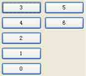

图 11-5 使用 QGridLayout 布局管理器排列的窗口部件

(4) 表单布局管理器（QFormLayout） 表单布局管理器主要用作管理界面上的输入窗口部件（ input widgets）以及和它们相连的标签窗口部件（labels）。

图 11-6 显示了使用水平布局管理器的窗口的大致情形。


图 11-6 使用 QFromLayout 布局管理器排列的窗口部件

(5) 栈布局管理器（QStackedLayout） 按照一种类似于栈的方式排列窗口部件，在某一时刻只有一个窗口部件是可见的。 图 11-7 显示了使用水平布局管理器的窗口的大致情形。

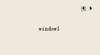

图 11-7 使用 QStackedLayout 布局管理器排列的窗口部件

小贴士：截至目前的 4.5.2 版，Qt Designer 的窗口部件盒没有可视化的提供对栈布局管理 器的支持，不过它提供了一个栈部件 QStackedWidget，作用与栈布局管理器类似。因此， 在使用 Qt Designer 绘制 GUI 界面时，完全可以使用 QStackedWidget 来代替 QStackedLayout。

每个内建布局管理器均支持窗口部件在分配的范围内横向/纵向对齐，这样只需使用简单的布局和对齐属性，即可自定义用户界面的外观。

除了上述内建的布局管理器外，分裂器也是一种常见的布局管理器，它是由 QSplitter 类实现的。在 Qt Designer 的窗口部件盒中也没有为它提供可视化的部件，不过却提供了 鼠标右键上下文菜单项来实现该布局。在 Qt 4.5 的后续版本中，它有望“转正”，成为正 式的内建布局管理器。在本章后面的内容中会详细的讲到如何使用分裂器布局。分裂器布局 又分为分裂器水平布局和分裂器垂直布局，图 11-8 和图 11-9 分别显示了它们的大致情 形。


图 11-8 使用分裂器水平布局管理器排列的窗口部件


图 11-9 使用分裂器垂直布局管理器排列的窗口部件

在实际的应用程序开发中，很少有只用到单一布局的情况，多数情况下需要组合或者 嵌套应用布局。Qt4 中的各种布局可以被组合或嵌套至任意的级别中，在后面的例子中将为 大家展示如何将基本布局综合使用起来。

### 11.1.3 优化布局结构

在迄今为止讲到每一个例子中，我们只是简单的把窗口部件放置到某个确定的布局中。但在某些情况下，由此形成的布局看起来可能还不是我们最想要的形式。在这些情形中，可以通过改变要摆放的窗口部件的大小策略和大小提示来调整布局。

1.大小提示（size hint）和最小大小提示（minimum size hint）

在介绍 Qt 窗口部件的大小策略之前，首先介绍大小提示（ size hint）和最小大小提 示（minimum size hint）。

(1) 大小提示

大小提示是 Qt 为一个窗口部件推荐的尺寸。当 Qt GUI 窗口部件进行初始化时，将通 过 QWidget::sizeHint()来获得窗口部件的大小提示，这是一个虚函数，它的原型为：

```cpp
virtual QSize sizeHint () const 
```

在未被重载的情况下，它的返回值是这样的：

*   如果该窗口部件不属于任何布局管理器，那么该函数将返回一个无效的值；
*   如果该窗口部件属于某个布局管理器，那么该函数将返回一个该布局管理器认为比 较合适的尺寸。

(2) 最小大小提示

最小大小提示（minimum size hint）是 Qt 为窗口部件推荐的最小尺寸，它的使用规 则是：

如果需要绘制的窗口部件的尺寸（包括长和高两个方面）小于其最小提示（这在 Qt Designer 中往往表现为有些被压缩的看不到它的内容），并且该窗口部件的最小提示在最 大尺寸和最小尺寸允许的范围内，那么该窗口部件显示的尺寸将是其最小提示的值。

设置窗口部件的最小大小提示是通过 QWidget::minimumSizeHint()完成的。它的返回 值有如下情景：

*   如果该窗口部件没有布局管理器，该函数返回一个无效的值；
*   如果该窗口部件属于某个布局管理器，该函数返回布局管理器认为合适的一个尺 寸。

2.大小策略（size policy）

一个窗口部件的大小策略会告诉布局系统应该如何对它进行拉伸或收缩。 Qt 为它所有的内置窗口部件都提供了合理的默认大小策略值，但是由于不可能为每一种可能产生的布局都提供唯一的默认值，所以在一个窗体中，开发人员改变它上面的一个或两个窗口部件的大 小策略是非常普遍的现象。一个 QSizePolicy 既包含一个水平分量也包含一个垂直分量。 以下是一些常用的取值：

表 11-1 枚举值 QSizePolicy::Policy 的内容

| 枚举常量 | 值 | 说明 |
| --- | --- | --- |
| QSizePolicy::Fixed | 0 | 大小提示是该窗口部件的唯一尺寸选择，所以它不会 发生任何的伸缩。 |
| QSizePolicy::Minimum | GrowFlag | 大小提示是该窗口部件的最小尺寸，它不会变得更 小，但它可以变得更大，不过采用该策略的窗口部件 在“争夺”空间上不占优势。 |
| QSizePolicy::Maximum | ShrinkFlag | 大小提示是该窗口部件的最大尺寸，也就是该窗口部 件不会比大小提示的尺寸更大。该窗口部件可以在没 有受到其它窗口部件“要求”的情况下，自由的缩小 尺寸。 |
| QSizePolicy::Preferred | GrowFlag &#124; ShrinkFlag | 一般情况下，该窗口部件会将大小提示作为它的优先 和最佳选择，但它也可以变得足够的小，也可以变大，但不占优势。该策略是 QWidget 窗口部件默认的 策略。 |
| QSizePolicy::Expanding | GrowFlag &#124; ShrinkFlag &#124; ExpandFlag | 采用该策略的窗口部件也能够感觉到尺寸提示，但是 它倾向于尽可能的占用更大的空间，该窗口部件也可 以变得足够小。 |
| QSizePolicy::MinimumExpanding | GrowFlag &#124; ExpandFlag | 大小提示将是该窗口部件的最小尺寸，该窗口部件将 尽可能的占用更多的空间。该策略已经不再被推荐使 用，建议用 Expanding 替代它，并且重载 minimumSizeHint()。 |
| QSizePolicy::Ignored | ShrinkFlag &#124; GrowFlag &#124; IgnoreFlag | 与 Expanding 有些相似，只是所有的大小提示都被忽 略，该窗口部件将会尽可能的占用空间。 |

表 11-1 中的“值”这一列实际上告诉了我们每一种策略一般是具有 “倾向性”的，比

如 QSizePolicy::Fixed 的值为 0，则它“倾向于”保持自己的大小不变，即保持大小提示 的尺寸。而 QSizePolicy::Expanding 的值是 3 个值的叠加，总的“倾向性”是趋于占用更 多空间的，等等。这就为当多个具有不同大小策略的窗口部件放置在一起时，如何判断它们 占用空间的模式提供了基本的判断依据，以下是几种常见的组合。

相同大小策略的窗口部件被布局管理器组合在一起。在这种情况下，除了窗口部件 不能超出它的大小范围外，不同的窗口部件可以按自己的伸缩因子在其允许的范围内自由的 伸缩。

QSizePolicy::Fixed 和任何其他的大小策略组合在一起。

具有 QSizePolicy::Fixed 大小策略的窗口部件其大小是不变的，即保持在 sizeHint() 大小，而其他的窗口部件可以在允许的范围内自由伸缩。

QSizePolicy::Preferred 和 QSizePolicy::Expanding 组合在一起。

具有 QSizePolicy::Preferred 尺寸策略的窗口部件其大小是不变的，即它认为大小提 示是最适合它的，而其他的窗口部件大小可以在其允许的范围内自由伸缩。

QSizePolicy::Ignored 和其他尺寸策略（QSizePolicy::Fixed 策略除外）组合在 一起的时候，不同的窗口部件在各自允许的范围内自由伸缩。

QSizePolicy::Preferred，QSizePolicy::Minimum 和 QSizePolicy::Maximum 组合 在一起的时候，各窗口部件在各自允许的范围内可以自由伸缩。

3.伸缩因子（stretch factor）

除了大小策略中包含的水平方向和垂直方向两个分量之外， QSizePolicy 类还保存了水平方向和垂直方向的一个伸缩因子。这些伸缩因子可以用来说明在增大窗体时，对不同的子窗口部件应使用的不同放大比例。即需要设置 QSizePolicy::horizontalStretch 和 QSizePolicy::verticalStretch 的值来实现。默认情况下，被布局管理器组合在一起的窗口部件的伸缩因子是相等的，都为 0。此时，在所有的窗口部件都没有超出各自的大小范围 允许的情况下，窗口部件的大小始终相等。

例如，假定在一个 QListWidget 的右面还有一个 QTextEdit，并且希望这个 QTextEdit 的长度能够是 QListWidget 长度的两倍，那么就可以把这个 QTextEdit 在水平方向上的拉 伸因子（QSizePolicy::horizontalStretch）设置为 2，而把 QListWidget 在水平方向上的 拉伸因子（QSizePolicy::horizontalStretch）设置为 1；垂直方向上保持默认为 0，即两 者一样的高。这样设置的效果如图 11-10 所示。


图 11-10 设置伸缩因子后窗体的效果

4.大小约束（size constraint）

影响布局方式的另一种方法是设置它的子窗口部件的最大大小、最小大小或固定大小。这些是通过设置 sizeConstraint 属性来完成的。该属性值是一个枚举常量，定义了布局的大小约束的模式。表列出了它所有可能的取值，它的默认值是 QLayout::SetDefaultConstraint。获取和设置该属性值可以通过 QWidget::layout()来获取主窗口部件的布局管理器，然后可以调用 QLayout::sizeConstraint()函数来查看当前的设置情况，然后再通过 QLayout::setSizeConstraint()函数来设置该布局管理器的 sizeConstraint 属性。这两种函数的原型如下：

```cpp
SizeConstraint sizeConstraint () const void setSizeConstraint ( SizeConstraint ) 
```

其中，SizeConstraint 的取值即是在表 11-2 中的枚举值的范围内。

表 11-2 布局管理器的大小约束属性（QLayout::SizeConstraint）可能的取值

| 常量 | 值 | 说明 |
| --- | --- | --- |
| QLayout::SetDefaultConstraint | 0 | 主窗口部件的最小尺寸设置为 minimumSize()，除非该窗口部件已经有一个 最小尺寸 |
| QLayout::SetFixedSize | 3 | 主窗口部件的尺寸设置为 sizeHint()，并且不允许改变该窗口部件的尺寸 |
| QLayout::SetMinimumSize | 2 | 主窗口部件的最小尺寸设置为 minimumSize()，并且该窗口部件不能够变得 更小 |
| QLayout::SetMaximumSize | 4 | 主窗口部件的最大尺寸设置为 maximumSize()，并且该窗口部件不能够变得 更大 |
| QLayout::SetMinAndMaxSize | 5 | 主窗口部件的最小尺寸设置为 minimumSize()，最大尺寸设置为 maximumSize() |
| QLayout::SetNoConstraint | 1 | 主窗口部件的大小不会受到约束 |

5.空白（margin）和间距（spacing）

每种布局都有两个重要的属性，空白和间距。空白指的是整个布局四周距离窗体边缘的距离；间距指的是布局管理器内部各个窗口部件之间的距离。

空白属性即 margin()，间距属性即 spacing()，它们的默认值是有窗体的风格决定 的。Qt 的默认风格下，子窗体部件的 margin()的值是 9 英寸，窗体的 margin()值是 11 英 寸。spacing()的值与 margin()相同。

如果要设置这两个值可以通过 setMargin()和 setSpacing()。

注意，从 Qt4.3 开始，margin()属性已经逐渐不再被 Qt4 所推荐，更好的设置空白的 方法是使用 setContentsMargins()方法，它的原型如下：

```cpp
void QLayout::setContentsMargins ( int left, int top, int right, int bottom ) 
```

其中，left, top, right, 和 bottom 表示环绕在布局周围的空白。

对于 QGridLayout 和 QFormLayout，不要使用 setSpacing()方法，而是要分别使用 setHorizontalSpacing()和 setVerticalSpacing()方法来设置水平和垂直方向的间距。如 果你使用了 setSpacing()方法，获取 spacing()时，它的返回值将为-1。

# 11.2 在 Qt Designer 中使用布局

## 11.2 在 Qt Designer 中使用布局

为了确保界面元素在应用程序程序在运行时或被预览时的各种状态下都能够正常显示，我们需要把它们放进布局当中去。

### 11.2.1 应用和破除布局

应用布局的最简单做法是选中界面元素，使用工具栏上的按钮、鼠标右键的上下文菜单，以及【Form】菜单都可以实现。

一旦界面元素被放进一个布局之中，它就不能单独自由行动了 -你不可以单独改变它的 大小，因为布局接管了这一工作，它控制了位于其中的界面元素的几何以及间隔器的大小策 略提示（size hint）。所以你要么破除布局，人工调整界面元素的大小，要么通过调整布 局的大小来间接调整界面元素的大小。

要破除一个布局，可以使用快捷键 Ctrl+0 或者通过鼠标右键上下文菜单以及主菜单项 或工具栏按钮。在一个布局完成之后，你仍然可以向其中添加或删除间隔器来影响布局内部 的窗口部件的几何，最为便捷的方式是从部件选择器中拖出一个间隔器，并把它拖入到布局 之中，删除的时候则相反，把间隔器从布局中拖出来即可。

1\. 向布局中增加窗口部件

如图 11-11 所示，要向一个已经存在的布局中增加窗口部件，只需要选中并拖动该窗口部件，把它从当前位置拖进布局之中，并在认为合适的位置放开鼠标。注意，当你的拖动 窗口部件在布局上方停留时，布局内部会显示一条蓝色的线，它提示了你的窗口部件未来在布局中的位置。

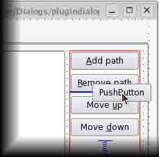

图 11-11 向布局中增加窗口部件

2\. 设置一个顶级布局（Top Level Layout） 设置界面的顶级布局是很有必要的，它能确保窗口界面元素在应用程序的各种状态下均能够保持适当的大小。

要设置顶级布局，需要用鼠标左键选中该 Form，然后使用快捷键或工具栏或者主菜单 项来选中一种布局。

如何验证已经设置了顶级布局呢，简单的做法就是在 Qt Designer 的预览窗口（按下 Ctrl+R 键）中，使用鼠标左键拖动窗口的边缘手柄，查看界面元素的变化情况。如果一切 正常，那就表示你已经设置过了。还有一种做法，就是用鼠标左键点击界面表单（你的 Form），然后在对象查看器中，如果看到 Form 前面有常见的几种布局图标之一（图 11-12 中是垂直布局），那么就表示你已经设置了顶级布局，如图 11-12 所示；反之，如果 Form 前面的图标右下角带有一个红色的停止标志，就表示还没有设置顶级布局，如图 11-13 所 示。

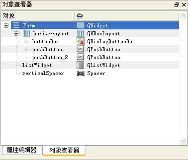

图 11-12 在对象查看器中浏览顶级布局-存在顶级布局

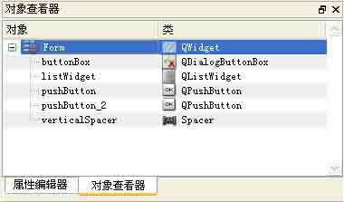

图 11-13 在对象查看器中浏览顶级布局-不存在顶级布局

3\. 应用一个布局

要应用一个布局，你可以使用工具栏上的按钮，如图 11-14 所示，也可以使用鼠标右键的上下文菜单，如图 11-15 所示。


图 11-14 使用工具栏按钮应用一个布局

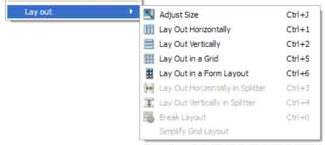

图 11-15 使用鼠标右键的上下文菜单来应用一个布局

### 11.2.2 快捷键

除了使用标准工具栏以及上下文菜单，我们还可以使用快捷键来对布局进行操作。表 11-3 显示了常见的布局操作所对应的快捷键。

表 11-3 布局的快捷键

| 布局 | 快捷键 | 说明 |
| --- | --- | --- |
| 水平布局 | Ctrl+1 | 将选中的界面元素置于一个水平布局中 |
| 垂直布局 | Ctrl+2 | 将选中的界面元素置于一个垂直布局中 |
| 栅格布局 | Ctrl+5 | 将选中的界面元素置于一个栅格布局中 |
| 表单布局 | Ctrl+6 | 将选中的界面元素置于一个表单布局中 |
| 分裂器水平布局 | Ctrl+3 | 创建一个分裂器水平布局，并将选中的界面元素置于其中 |
| 分裂器垂直布局 | Ctrl+4 | 创建一个分裂器垂直布局，并将选中的界面元素置于其中 |
| 调整大小 | Ctrl+J | 调整布局的大小，以使得位于其中的元素能够恰当的显示自身内容。关于这方面的内容，可以参见 QWidget::adjustSize()函数 |
| 破除布局 | Ctrl+0 | 破除选中的布局 |

# 11.3 基本布局实践

## 11.3 基本布局实践

基本布局主要包括：水平布局、垂直布局、栅格布局和表单布局这 4 种。在讲解水平 布局和垂直布局之前，还要重点说一下它们的父类 -QBoxLayout，它也是使用比较多的，并 且包含了水平布局和垂直布局的一些共性特点。

### 11.3.1 QBoxLayout

使用 QBoxLayout 类可以创建一个布局，能够把其中的窗口部件水平的或者垂直的按照直线排列。

之所以取名为“Box”，是由于 QBoxLayout 类把位于其内的空间均匀的划分成若干个 “盒子”，并把各个窗口部件都放入一个盒子里面。

使用 QBoxLayout 创建的布局是有方向性的，主要是有水平和垂直两个方向。当给定其 方向参数为 Qt::Horizontal 时，即表示水平方向，位于其中的窗口部件将水平排列成一 行，并且它们都会找到适合自己的大小。当给定方向参数为 Qt::Vertical 时，窗口部件将按 照垂直直线排列。布局内的其余空间是共享的，它们的尺寸可以由伸缩因子（ stretch factors）来确定。

使用 QBoxLayout 类来创建一个布局是很容易的，做法是直接调用其构造函数，其原型 如下：

```cpp
QBoxLayout::QBoxLayout ( Direction dir, QWidget * parent = 0 ) 
```

该构造函数它有两个参数，一个是布局的方向，一个是父窗口指针，默认为 0 即当前窗口。布局的方向枚举值如表 11-4 所示。

表 11-4 QBoxLayout 的方向枚举值

| 常量 | 值 | 说明 |
| --- | --- | --- |
| QBoxLayout::LeftToRight | 0 | 从左到右水平排列 |
| QBoxLayout::RightToLeft | 1 | 从右到左水平排列 |
| QBoxLayout::TopToBottom | 2 | 从上到下垂直排列 |
| QBoxLayout::BottomToTop | 3 | 从下到上垂直排列 |

一个实例代码如下：

```cpp
//第 1 步
QWidget *window = new QWidget;
QPushButton *button1 = new QPushButton(tr("One"));
QPushButton *button2 = new QPushButton(tr("Two"));
QPushButton *button3 = new QPushButton(tr("Three"));
QPushButton *button4 = new QPushButton(tr("Four"));
QPushButton *button5 = new QPushButton(tr("Five"));
//第 2 步
QBoxLayout *layout = new QBoxLayout(QBoxLayout::LeftToRight,0);
//第 3 步
layout-&gt;addWidget(button1);
layout-&gt;addWidget(button2);
layout-&gt;addWidget(button3);
layout-&gt;addWidget(button4);
layout-&gt;addWidget(button5);
//第 4 步
window-&gt;setLayout(layout);
//显示窗口
window-&gt;show(); 
```

创建这种布局的一般步骤是：

第 1 步，创建要使用的窗口部件。

第 2 步，创建布局，并指定其方向和父窗口。

第 3 步，将窗口部件依次加入到布局中。

第 4 步，为应用程序程序窗口设置布局。

如上代码所示，在其中通过注释指出了各步骤对应的代码行。这段代码将创建 1 个名 为 window 的应用程序窗口，1 个名为 layout 的 QBoxLayout 实例，以及 5 个按钮，布局方 向是从左到右的水平方向。图 11-16 显示了这个实例的效果，你会发现它与使用水平布局 的效果是一样的。


图 11-16 使用 QBoxLayout 类创建的布局效果

当然，在实际应用中，我们大多数情况下会直接使用 QBoxLayout 的两个派生类，水平 布局和垂直布局，它们更加方便而且有针对性。

### 11.3.2 水平布局

水平布局把在其中的窗口部件按照一条直线水平排列。 QHBoxLayout 类用来创建水平 布局的实例。

一个简单的手写代码创建水平布局的实例如下：

```cpp
QWidget *window = new QWidget;
QPushButton *button1 = new QPushButton(tr("One"));
QPushButton *button2 = new QPushButton(tr("Two"));
QPushButton *button3 = new QPushButton(tr("Three"));
QPushButton *button4 = new QPushButton(tr("Four"));
QPushButton *button5 = new QPushButton(tr("Five"));
QHBoxLayout *layout = new QHBoxLayout;
layout-&gt;addWidget(button1);
layout-&gt;addWidget(button2);
layout-&gt;addWidget(button3);
layout-&gt;addWidget(button4);
layout-&gt;addWidget(button5);
window-&gt;setLayout(layout);
window-&gt;show(); 
```

使用手写代码创建水平布局大体需要下面这些步骤：

第 1 步，创建布局内的窗口部件。

第 2 步，创建一个水平布局的实例，也就是创建一个 QHBoxLayout 的实例，并将第 1 步创建的窗口部件加入到该布局之中。

第 3 步，调用 QWidget::setLayout()函数将该布局安装到窗体上。设置了布局之后， 在该布局内的窗口部件将以 window 作为它们的父窗口。该实例的效果如图 11-17 所示：


图 11-17 水平布局效果

### 11.3.3 垂直布局

垂直布局把位于其中的窗口部件按照一条直线垂直排列。 QVBoxLayout 类用来创建一个 垂直布局的实例。

一个简单的使用手写代码创建垂直布局的实例如下：

```cpp
QWidget *window = new QWidget;
QPushButton *button1 = new QPushButton("One");
QPushButton *button2 = new QPushButton("Two");
QPushButton *button3 = new QPushButton("Three");
QPushButton *button4 = new QPushButton("Four");
QPushButton *button5 = new QPushButton("Five");
QVBoxLayout *layout = new QVBoxLayout;
layout-&gt;addWidget(button1);
layout-&gt;addWidget(button2);
layout-&gt;addWidget(button3);
layout-&gt;addWidget(button4);
layout-&gt;addWidget(button5);
window-&gt;setLayout(layout);
window-&gt;show(); 
```

使用手写代码创建垂直布局大体需要下面这些步骤：

第 1 步，创建布局内的窗口部件

第 2 步，创建一个垂直布局的实例，也就是创建一个 QVBoxLayout 类的实例，并将第 1 步创建的窗口部件加入到该布局之中

第 3 步，调用 QWidget::setLayout()函数将该布局安装到窗体上。设置了布局之后， 在该布局内的窗口部件将以 window 作为它们的父窗口。该实例的效果如图 11-18 所示：

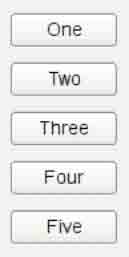

图 11-18 垂直布局实例效果

水平和垂直布局可以嵌套、组合使用，并且可至任意的深度。但在比较复杂的情况 下，使用栅格布局往往是更理想的做法。

### 11.3.4 栅格布局

栅格布局将位于其中的窗口部件放入一个网状的栅格之中。栅格布局是这样工作的：

它计算了位于其中的空间，然后将它们合理的划分成若干个行（ row）和列（column），并把每个由它管理的窗口部件放置在合适的单元之中，这里所指的单元（ cell）即是指由行和列交叉所划分出来的空间。

在使用栅格布局之前，需要在代码中包含如下的头文件声明：

```cpp
#include &lt;QGridLayout&gt; 
```

创建栅格布局的大致步骤如下：

第 1 步，创建布局内的窗口部件。

第 2 步，创建栅格布局的实例，也就是创建一个 QGridLayout 类的实例，并将第 1 步 创建的窗口部件加入到布局之中。

第 3 步，调用 QWidget::setLayout()函数将布局安装到窗体上。 一个典型的实例代码如下：

```cpp
nameLabel = new QLabel(tr("&Name:"));
nameLabel-&gt;setBuddy(nameLineEdit);
ageLabel = new QLabel(tr("&Age:"));
ageLabel-&gt;setBuddy(ageSpinBox);
QGridLayout *gridLayout = new QGridLayout;
gridLayout-&gt;addWidget(nameLabel, 0, 0);
gridLayout-&gt;addWidget(nameLineEdit, 0, 1);
gridLayout-&gt;addWidget(ageLabel, 1, 0);
gridLayout-&gt;addWidget(ageSpinBox, 1, 1);
setLayout(gridLayout); 
```

我们来讲解一下这段代码。可以明显的看出， QHBoxLayout 和 QVBoxLayout 的用法相当简单明了，但是 QGridLayout 的用法则稍微有些麻烦。QGridLayout 的工作基于一个二维单 元格。在这个布局中，左上角的 QLabel 即 nameLabel 的位置是(0,0)，而与之相应的 QLineEdit 即 nameLineEdit 的位置是(0,1)。以此类推，ageLabel 的位置是(1,0)，而 ageSpinBox 的位置是(1,1)。它们都占用一列的值。

对于 QGridLayout::addWidget()的调用遵循如下的语法形式：

```cpp
layout-&gt;addWidget(widget,row,column,rowSpan,columnSpan); 
```

其中,widget 是要插入到布局中的子窗口部件，(row,column)是由该窗口部件所占用的左上角单元格，rowSpan 是该窗口部件要占用的行数，而 column 是该窗口部件要占用的列 数。如果省略了这些参数，则它们将会取默认值 1。

该示例的运行效果如图 11-19 所示。


图 11-19 栅格布局效果

在栅格布局中，行和列本质上是相同的，只是叫法不同而已。下面我们将重点讨论 列，这些内容当然也适用于行。

在栅格布局中，每个列（以及行）都有一个最小宽度（ minimum width）以及一个伸缩 因子（stretch factor）。最小宽度指的是位于该列中的窗口部件的最小的宽度，而伸缩因 子决定了该列内的窗口部件能够获得多少空间。它们的值可以通过 setColumnMinimumWidth()和 setColumnStretch()方法来设置。

此外，一般情况下我们都是把某个窗口部件放进栅格布局的一个单元中，但窗口部件 有时也可能会需要占用多个单元。这时就需要用到 addWidget()方法的一个重载版本，它的 原型如下：

```cpp
void QGridLayout::addWidget ( QWidget * widget, int fromRow, int fromColumn, int rowSpan, int columnSpan,Qt::Alignment alignment = 0 ) 
```

这时这个单元将从 fromRow 和 fromColumn 开始，扩展到 rowSpan 和 columnSpan 指定 的倍数的行和列。如果 rowSpan 或 columnSpan 的值为-1，则窗口部件将扩展到布局的底部 或者右边边缘处。

小贴士：栅格布局中的某个单元（cell）的长和宽，也可以说是栅格布局的行和列的尺寸 并不是一样大小的。如果你想使它们相等，你必须通过调用 setColumnMinimumWidth()和 setColumnStretch()方法来使得它们的最小宽度以及伸缩因子都彼此相等。

如果 QGridLayout 不是窗体的顶层布局（就是说它不能管理所有的区域和子窗口部 件），那么当你创建它的同时，就必须为它指定一个父布局，也就是把它加入到父布局中 去，并且在此之前，不要对它做任何的操作。使用 addLayout()方法可以完成这一动作。

在创建栅格布局完成后，就可以使用 addWidget()，addItem()，以及 addLayout()方 法向其中加入窗口部件，以及其它的布局。

当界面元素较为复杂时，应该毫不犹豫的尽量使用栅格布局，而不是使用水平和垂直布局的组合或者嵌套的形式，因为在多数情况下，后者往往会使 “局势”更加复杂而难以控 制。栅格布局赋予了界面设计器更大的自由度来排列组合界面元素，而仅仅带来了微小的复杂度开销。

当要设计的界面是一种类似于两列和若干行组成的形式时，使用表单布局要比栅格布 局更为方便些。

### 11.3.5 表单布局

表单布局是从 Qt 4.4 开始被引入的。它把布局内的界面元素分成两列，左边的列通常 放置标签（label）而右边的列放置对应值的窗口部件，如 line edits,spin boxes 等等, 如图 11-20 所示。表单布局在不同的平台上与本地原生外观相同，并且支持长的行形式，

如表 11-5 所示。

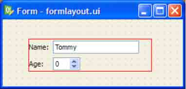

图 11-20 使用表单布局

QFormLayout 这个类是从 Qt 4.4 以后引入的。在使用该类之前，需要包含如下的头文 件声明。

```cpp
#include &lt;QFormLayout&gt; 
```

在 QFormLayout 类出现以前，这种类似于两列布局的情形我们通常使用 QGridLayout 来创建。而现在，使用 QFormLayout 则有更多的优势：

**能够适应不同的平台，并且提供与本地原生平台一致的观感**

举例来说，在 Mac OS X Aqua 和 KDE 平台上通常要求标签中的文本是右对齐的，而在 Windows 和 GNOME 平台上则要求文本是左对齐的，QFormLayout 能够很好的自动适应。

支持可折叠的长行（当其中的文本较多时） Support for wrapping long rows. 在便携式设备上，文本太长以至于需要折叠的情况比较常见，但既要折叠而又要不影响显示的效果则是比较困难的事情。现在的 QFormLayout 类可以很好的解决这个问题，它会判断当前的情形是否需要折叠以及怎样折叠才好。表 11-5 显示了它的折叠策略。

表 11-5 QFormLayout 行折叠策略枚举值

| 常量 | 值 | 说明 |
| --- | --- | --- |
| QFormLayout::DontWrapRows | 0 | 值域（即可输入的文本行）总是在其对应的标签(label)的旁边，也就是不 折叠。这是默认的行折叠策略（采用了 Qt 扩展风格的情况除外）。 |
| QFormLayout::WrapLongRows | 1 | 标签将获得最大允许的自由空间，与它对应的值域则使用剩余的空间，如 果一行放不下，它将另起一行，也就是把自己折叠起来。这是采用 Qt 扩展 风格情况的默认行折叠策略。 |
| QFormLayout::WrapAllRows | 2 | 值域将总是在与它对应的标签的下边一行。 |

API

为创建标签--（对应的）值域这种伙伴（buddy）类型的界面提供了丰富、方便的通过使用 addRow()函数（共有 6 种重载形式）或者 insertRow()函数（也有 6 种重载形式），我们可以简便的创建一个 QLabel 窗口部件以及它的伙伴窗口部件。一个实例代码 如下：

```cpp
QFormLayout *formLayout = new QFormLayout;
formLayout-&gt;addRow(tr("&Name:"), nameLineEdit);
formLayout-&gt;addRow(tr("&Age:"), ageSpinBox);
setLayout(formLayout); 
```

如果同样的情形使用 QGridLayout 来布局，则代码如下：

```cpp
nameLabel = new QLabel(tr("&Name:"));
nameLabel-&gt;setBuddy(nameLineEdit);
ageLabel = new QLabel(tr("&Age:"));
ageLabel-&gt;setBuddy(ageSpinBox);
QGridLayout *gridLayout = new QGridLayout;
gridLayout-&gt;addWidget(nameLabel, 0, 0);
gridLayout-&gt;addWidget(nameLineEdit, 0, 1);
gridLayout-&gt;addWidget(ageLabel, 1, 0);
gridLayout-&gt;addWidget(ageSpinBox, 1, 1);
setLayout(gridLayout); 
```

对比这两段代码就可以发现，它们实现了相同的界面，而使用 QFormLayout 类则更简单高效，并且不易出错。表 11-6 显示了该界面在不同的平台下的默认观感。

表 11-6 表单布局在不同平台上的默认外观


小贴士：标签（QLabel）和它的伙伴（buddy）窗口部件

一个标签窗口部件和一个窗口部件具有伙伴关系，即指当用户按下激活标签的快捷键 时，鼠标/键盘的焦点将会移到它的伙伴窗口部件上。只有 QLabel 的实例才可以有伙伴窗 口部件，也只有该 QLabel 实例具有快捷键（在显示文本的某个字符前面添加一个前缀 &， 就可以定义快捷键）时，伙伴关系才有效。例如：

```cpp
QLineEdit* nameLineEdit = new QLineEdit(this);
QLabel* nameLabel = new QLabel(tr("&Name"),this);
nameLabel-&gt;setBuddy(nameLineEdit); 
```

该代码定义了 nameLabel 标签的快捷键为"Alt+P"，并将行编辑框 nameLineEdit 设置为它的伙伴窗口部件。所以当用户按下快捷键 "Alt+P"时，焦点将会跳至行编辑框 nameLineEdit 中。

在 Qt Designer 中，可以通过鼠标拖放操作快捷的建立 QLabel 和它的窗口部件的伙伴 关系，这需要切换到“伙伴编辑模式”。

由于 Qt 提供了许多的方法，所以使用表单布局时可以比较灵活的变换它的风格，经常 使用的方法有 setLabelAlignment()、setFormAlignment()、setFieldGrowthPolicy()、 setRowWrapPolicy()等。举个例子，如果要在所有的平台上都模拟出 Mac OS X 上的观感， 但却是用 Windows 上常见的标签文本左对齐的规则，可以这样写代码：

```cpp
formLayout-&gt;setRowWrapPolicy(QFormLayout::DontWrapRows);
formLayout-&gt;setFieldGrowthPolicy(QFormLayout::FieldsStayAtSizeHint);
formLayout-&gt;setFormAlignment(Qt::AlignHCenter | Qt::AlignTop);
formLayout-&gt;setLabelAlignment(Qt::AlignLeft); 
```

总结一下，创建表单布局的大致步骤如下：

第 1 步，创建布局内的窗口部件。

第 2 步，创建表单布局的实例，也就是创建一个 QFormLayout 类的实例，并将第 1 步 创建的窗口部件加入到布局之中。

第 3 步，调用 QWidget::setLayout()函数将布局安装到窗体上。

读者朋友可以通过前面的代码验证这些步骤。

### 11.3.6 删除布局内窗口部件的方法

要从一个布局内删除一个窗口部件，只需调用 QLayout::removeWidget()方法。其原型 如下：

```cpp
void QLayout::removeWidget ( QWidget * widget ) 
```

这将删除该布局内的 widget 窗口部件，但是并没有把它从窗体界面上删除。调用完该函数后，你需要为该窗口部件指定一个合适的几何大小，或者干脆把它从界面上删除。一个 实例代码如下：

```cpp
gridLayout-&gt;removeWidget(nameLabel);
nameLabel-&gt;setGeometry(9,9,50,25); 
```

如果只是想使布局内的窗口部件隐藏起来，就可以调用 QWidget::hide()方法。然后调用 QWidget::show()方法可以使它再次显示。使用方法比较简单，读者可以自行验证。

如果往布局中添加一个窗口部件或者从布局中移除一个窗口部件，布局都会自动适应 所产生的这些新情况。如果对一个子窗口部件调用了 hide()或者 show()，也同样能够做到 自动适应。如果一个子窗口部件的大小提示发生了变化，布局将会自动进行调整，从而把新 的大小提示考虑进去。还有，布局管理器也会自动根据窗体中子窗口部件的最小大小提示和 大小提示，从总体上考虑，为这个窗体设置一个最小尺寸。

### 11.3.7 基本布局的综合运用

本实例利用基本布局管理（QHBoxLayout、QVBoxLayout、QGridLayout、QFormLayout）实现一个基于对话框的综合页面。实现效果如图 11-21 所示。实例代码见 basiclayouts 实例。

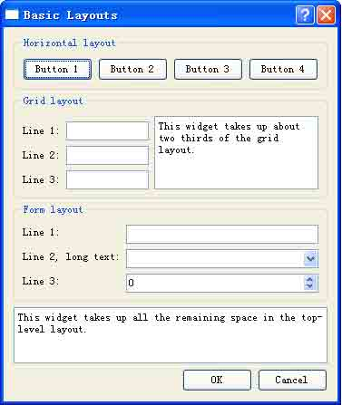

图 11-21 基本布局综合实例效果图

常用到的布局类有 QHBoxLayout、QVBoxLayout、QGridLayout、QFormLayout 这 4 种， 分别是水平布局、垂直布局、栅格布局和表单布局。布局中最常用的方法是 addWidget()和 addLayout()，addWidget()方法用于在布局中插入窗口部件，addLayout()用于在布局中插 入子布局。对于表单布局而言，向其中加入窗口部件最常用的方法是 addRow()。

下面通过实例的实现过程了解布局管理的使用方法。首先通过一个示意图了解此对话 框的布局结构，如图 11-22 所示。

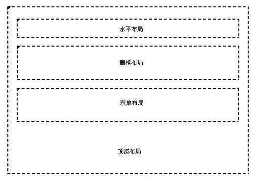

图 11-22 实例布局结构图

从图中可知，本实例共用到 4 个布局管理器，最外层也即是顶级布局是一个垂直布 局，它是 QVBoxLayout 的实例，在顶级布局里面的最上层是一个水平布局，它是 QHBoxLayout 的实例，在它的下面是一个栅格布局，它是 QGridLayout 的实例，然后下面是 一个表单布局，它是 QFormLayout 的实例。

下面是具体的实现，首先声明一个对话框类 Dialog，它单继承自 QDialog。在该类的 头文件 dialog.h 中声明对话框中的各个窗口部件。

```cpp
class Dialog : public QDialog
{
    Q_OBJECT
public:
    Dialog();
private:
    void createHorizontalGroupBox();
    void createGridGroupBox();
    void createFormGroupBox();
    enum { NumGridRows = 3, NumButtons = 4 };
    QGroupBox *horizontalGroupBox;
    QGroupBox *gridGroupBox;
    QGroupBox *formGroupBox;
    QTextEdit *smallEditor;
    QTextEdit *bigEditor;
    QLabel *labels[NumGridRows];
    QLineEdit *lineEdits[NumGridRows];
    QPushButton *buttons[NumButtons];
    QDialogButtonBox *buttonBox;
}; 
```

然后定义对话框中包含的窗口部件。我们看看类的构造函数。

```cpp
Dialog::Dialog()
{
    createHorizontalGroupBox();
    createGridGroupBox();
    createFormGroupBox();
    bigEditor = new QTextEdit;
    bigEditor-&gt;setPlainText(tr("This widget takes up all the remaining space "
        "in the top-level layout."));
    buttonBox = new QDialogButtonBox(QDialogButtonBox::Ok
        | QDialogButtonBox::Cancel);
    connect(buttonBox, SIGNAL(accepted()), this, SLOT(accept()));
    connect(buttonBox, SIGNAL(rejected()), this, SLOT(reject()));
    QVBoxLayout *mainLayout = new QVBoxLayout;
    mainLayout-&gt;addWidget(horizontalGroupBox);
    mainLayout-&gt;addWidget(gridGroupBox);
    mainLayout-&gt;addWidget(formGroupBox);
    mainLayout-&gt;addWidget(bigEditor);
    mainLayout-&gt;addWidget(buttonBox);
    setLayout(mainLayout);
    setWindowTitle(tr("Basic Layouts"));
} 
```

第 3-5 行分别创建了 3 个组框-GroupBox，在它们的内部是 3 个布局。

第 6-7 行创建了创建了一个 QTextEdit 类的实例，并设置了它的显示文本。

第 8 行创建了一个 QDialogButtonBox 的实例，其中包含【OK】和【Cancel】两个按钮。

第 9-10 行连接按钮的信号和窗体的响应的槽。

第 11 行定义了窗体的顶级布局，它是一个 QVBoxLayout 的实例，是垂直布局。

第 12-16 行依次向顶级布局中加入窗口部件，注意使用 addWidget()方法的话，这些窗 口部件在布局中的排列顺序与它们的加入顺序是关联的。

小贴士：如果你想对布局内的窗口部件排列顺序和位置大小等属性做出更为详尽的控 制，可以考虑使用 insertWidget()方法来向布局中加入窗口部件。insertWidget()的原型 如下：

```cpp
void QBoxLayout::insertWidget ( int index, QWidget * widget, int stretch = 0, Qt::Alignment alignment = 0 ) 
```

它为窗口部件 widget 指定了伸缩因子 stretch 和排列方向 alignment，以及在布局内 的顺序 index，然后把它加入到布局中。如果 index 的值为负整数，则表示把它加入到顺序 的最后面。

在布局中，哪个窗口部件的 stretch 值更大，那么它将有可能获得更大的空间。 如果在布局里面，所有窗口部件的 stretch 值都为 0，或者都不超过 0，那么它们的大小将由各自的大小策略以及大小策略互相影响的关系决定。

alignment 指定了窗口部件的排列方向，默认值为 0，表示该窗口部件将占用整个布局 内部的区域。alignment 通常有 3 个方向的取值，依次如如表 11-7、表 11-8 和表 11-9 所 示。

表 11-7 水平方向的取值

| 常量 | 值 | 说明 |
| --- | --- | --- |
| Qt::AlignLeft | 0x0001 | 在布局内水平左对齐 |
| Qt::AlignRight | 0x0002 | 在布局内水平右对齐 |
| Qt::AlignHCenter | 0x0004 | 在可用的空间内部水平居中排列 |
| Qt::AlignJustify | 0x0008 | Justifies the text in the available space. |

注意，水平方向同时只能取一个值。

表 11-8 垂直方向的取值

| 常量 | 值 | 说明 |
| --- | --- | --- |
| Qt::AlignTop | 0x0020 | 在布局内垂直向上对齐 |
| Qt::AlignBottom | 0x0040 | 在布局内垂直向下对齐 |
| Qt::AlignVCenter | 0x0080 | 在可用的空间内部垂直居中排列 |

垂直方向同时也只能取一个值。

表 11-9 居中取值

| 常量 | 值 | 说明 |
| --- | --- | --- |
| Qt::AlignCenter | AlignVCenter &#124; AlignHCenter | 在水平方向和垂直方向都居中排列 |

如果已近使用了居中取值的话，就不必再设置水平和垂直方向的取值了。

第 17 行将主布局安装到窗体上。

第 18 行设置窗口标题。

再来看看创建水平布局的 createHorizontalGroupBox()函数。

```cpp
void Dialog::createHorizontalGroupBox()
{
    horizontalGroupBox = new QGroupBox(tr("Horizontal layout"));
    QHBoxLayout *layout = new QHBoxLayout;
    for (int i = 0; i &lt; NumButtons; ++i)
    {
        buttons[i] = new QPushButton(tr("Button %1").arg(i + 1));
        layout-&gt;addWidget(buttons[i]);
    }
    horizontalGroupBox-&gt;setLayout(layout);
} 
```

第 4 行定义了一个水平布局的实例。

第 5-9 行定义了几个按钮窗口部件，然后依次向该布局中加入它们。

第 10 行把该布局安装到它的父窗体上。 然后看看创建栅格布局的函数 createGridGroupBox()里面的内容。

```cpp
void Dialog::createGridGroupBox()
{
    gridGroupBox = new QGroupBox(tr("Grid layout"));
    QGridLayout *layout = new QGridLayout;
    for (int i = 0; i &lt; NumGridRows; ++i)
    {
        labels[i] = new QLabel(tr("Line %1:").arg(i + 1));
        lineEdits[i] = new QLineEdit;
        layout-&gt;addWidget(labels[i], i + 1, 0);
        layout-&gt;addWidget(lineEdits[i], i + 1, 1);
    }
    smallEditor = new QTextEdit;
    smallEditor-&gt;setPlainText(tr("This widget takes up about two thirds of the "
        "grid layout."));
    layout-&gt;addWidget(smallEditor, 0, 2, 4, 1);
    layout-&gt;setColumnStretch(1, 10);
    layout-&gt;setColumnStretch(2, 20);
    gridGroupBox-&gt;setLayout(layout);
} 
```

第 1 行创建了一个组框的实例，它将作为栅格布局的父窗口。

第 3-9 行创建了若干 QLineEdit 的实例，并使用 addWidget()方法把它们加入到布局 中。addWidget()有若干变型，这里使用的这个需要依次指定窗口部件、行和列以及对齐方 式，对齐方式默认为 0。注意可以看到这里的第 1 个 QLineEdit 实例位于(1,0)这个单元 (cell)。

第 10-11 行创建一个 QTextEdit 实例，并为它设置显示文本。

第 12 行将 QTextEdit 的实例 smallEditor 加入到布局中，这里使用的是 addWidget() 的另一种常用变型，其实参分别需要指定窗口部件、起始行、起始列、行跨度数和列跨度 数。

在本实例中实际上创建了一个 3x3 的栅格布局。左上角的文本为 Line 1 的标签窗口部 件位于(1,0)，这样就可知道使用本行创建的 smallEditor 窗口部件位于(0,2)，行跨度是 4 行，列跨度是 1 列，也就是它的单元占用了 4 行 1 列的空间。

第 13-14 行分别设置了第 1 列和第 2 列的伸缩因子为 10 和 20，这就保证了这两列无论 何时均保持宽度为 1:2。

第 15 行把这个栅格布局安装到其父窗口 gridGroupBox 上。 再看一下创建表单布局的 createFormGroupBox()函数内容。

```cpp
void Dialog::createFormGroupBox()
{
    formGroupBox = new QGroupBox(tr("Form layout"));
    QFormLayout *layout = new QFormLayout;
    layout-&gt;addRow(new QLabel(tr("Line 1:")), new QLineEdit);
    layout-&gt;addRow(new QLabel(tr("Line 2, long text:")), new QComboBox);
    layout-&gt;addRow(new QLabel(tr("Line 3:")), new QSpinBox);
    formGroupBox-&gt;setLayout(layout);
} 
```

第 1 行创建了一个组框，用于管理表单布局。

第 2 行创建了一个表单布局的实例。

第 3-5 行使用 addRow()方法，创建了几个 QLabel 的实例和 QLineEdit、QComboBox 和 QSpinBox 的实例，并把它们加入到表单布局中。在前面讲解表单布局的时候，曾经说到过 addRow()方法有很多种变型，此处采用的是其中的一种。

第 6 行把表单布局安装到它的父窗口上，它的父窗口就是第 1 行创建的组框实例。 最后书写主函数 main.cpp，其内容是创建应用程序全局实例，将刚才创建的窗口显示出来。

```cpp
int main(int argc, char *argv[])
{
    QApplication app(argc, argv);
    Dialog dialog;
    return dialog.exec();
} 
```

这个实例完全采用手写代码实现。可以自己书写 .pro 文件，也可以在命令行下依次键 入 qmake 来生成。

本实例分析了 Qt4 中布局管理常用到的类及其方法，如果读者觉得这种手动布局的方 法比较麻烦，也可采用 Qt Designer 来布局。

# 11.4 堆栈布局

## 11.4 堆栈布局

堆栈布局也是布局管理器的一种。它把一系列的窗口部件排列成类似堆栈的样子，但 每次只能有一个窗口部件是当前的可见窗口。

### 11.4.1 使用方法

QStackedLayout 类被用来创建堆栈布局的实例。使用堆栈布局创建出来的应用程序的 样子与使用 QTabWidget 创建的效果有些相像。也可以使用 QStackedWidget 类来创建一个 应用程序界面，和使用 QStackedLayout 效果差不多，目前在最新的 4.5.2 版 Qt 中，我们如果使用 Qt Designer 创建用户界面，那么通常会使用 QStackedWidget，这点在后面还会讲到。

实际上，你可以把堆栈布局看成是由一系列的子窗口部件组成的，它们都是一些 “页 面”（pages）。

在使用堆栈布局时，首先应包含其头文件：

```cpp
#include &lt;QStackedLayout&gt; 
```

下面是手写代码创建一个堆栈布局的实例：

```cpp
QWidget *firstPageWidget = new QWidget;
QWidget *secondPageWidget = new QWidget;
QWidget *thirdPageWidget = new QWidget;
QStackedLayout *stackedLayout = new QStackedLayout;
stackedLayout-&gt;addWidget(firstPageWidget);
stackedLayout-&gt;addWidget(secondPageWidget);
stackedLayout-&gt;addWidget(thirdPageWidget);
QVBoxLayout *mainLayout = new QVBoxLayout;
mainLayout-&gt;addLayout(stackedLayout);
setLayout(mainLayout); 
```

创建栈布局的大致步骤如下：

第 1 步，创建布局内的窗口部件，也即是各个页面。

第 2 步，创建栈布局的实例，也就是创建一个 QStackedLayout 类的实例，并将第 1 步 创建的窗口部件加入到布局之中。

向布局内加入窗口部件的方法可以使用 addWidget()，也可以使用 insertWidget()， 前者将把窗口部件加入到子窗口索引的最后，而后者则可以指定在索引中的位置加入窗口部 件。可以根据实际需要选用。

第 3 步，调用 QWidget::setLayout()函数将布局安装到窗体上。 11.4.2 如何索引窗口部件

由于 QStackedLayout 类并没有提供位于其内部的窗口部件（即上文提到的 “页面”） 的索引，所以我们在使用堆栈布局时，通常需要使用组合框类（ QComboBox）或者列表部件 类（QListWidget）的实例来存储这些子窗口的索引，继而实现切换堆栈布局中子窗口的目 的。下面是一个使用 QComboBox 类的实例：

```cpp
QComboBox *pageComboBox = new QComboBox;
pageComboBox-&gt;addItem(tr("Page 1"));
pageComboBox-&gt;addItem(tr("Page 2"));
pageComboBox-&gt;addItem(tr("Page 3"));
connect(pageComboBox, SIGNAL(activated(int)),
stackedLayout, SLOT(setCurrentIndex(int))); 
```

在上述代码中，通过 addItem()方法为 QComboBox 的实例依次加入堆栈布局的索引，这样当调用 connect()函数显式的连接 pageComboBox 的 activated()信号和 stackedLayout 的 setCurrentIndex()槽时，这些索引就会被加入到内部的一个链表中，这样就可以方便的 查找布局内的窗口部件了。

要获得栈布局内的窗口部件的数量，可以使用 count()方法。 那么我们如何找到位于堆栈布局内的任意一个子窗口呢，可以使用堆栈窗口的 widget() 方法返回当前指定位置索引的子窗口，它的原型如下：

```cpp
QWidget * QStackedLayout::widget ( int index ) const 
```

它将返回由 index 指定的位置的子窗口，当返回值为 0 时，则表示在 index 指定的位置处并没有任何子窗口。

作为上述的一个特例，要找到当前的活动子窗口，可以先找到当前它对应的 index，方 法是使用 currentIndex()方法，它的原型如下：

```cpp
int currentIndex () const 
```

如果要取得某一个窗口部件在布局中的索引，可以使用 indexof()方法，其原型如下：

```cpp
int QLayout::indexOf ( QWidget * widget ) const [virtual] 
```

该方法将 widget 在布局内的索引返回，如果返回值为-1，则表示没有找到这个窗口部件。

小贴士：实际上堆栈布局有一个重要的属性 currentIndex : int，是一个 int 常量，它对 应当前活动子窗口的索引，获得该属性值的方法即是调用 currentIndex()方法。如果它的 值为-1，则表示没有当前活动子窗口，也就是没有子窗口在堆栈布局内。

要想找到当前的活动子窗口，可以使用 currentWidget()方法，它的原型如下：

```cpp
QWidget * QStackedLayout::currentWidget () const 
```

它将返回堆栈布局内当前的活动子窗口，如果返回值为 0，则表示没有当前的 堆栈布局内没有子窗口，由此这个函数也可以被用来判断当前布局内是否存在窗口部件。

要想指定一个位于堆栈布局内部的子窗口为当前的活动窗口，可以使用 setCurrentWidget()方法，它的原型如下：

```cpp
void QStackedLayout::setCurrentWidget ( QWidget * widget ) [slot] 
```

它将把你指定的 widget 作为当前的活动子窗口，前提是这个子窗口必须已经位于堆栈 布局内部。

此外，一旦堆栈布局内当前的窗口部件产生了变化或者被移除，布局就会发 出 currentChanged() 以及 widgetRemoved() 信号。

### 11.4.3 实例-堆栈窗体

本实例实现一个堆栈窗体的使用，实现的效果如图 11-23 所示。当用户选择左侧列表 框中不同的选项时，右侧则对应显示所选的窗体。

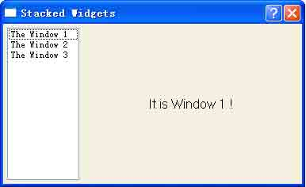

图 11-23 堆栈窗体实例

为了使读者朋友熟练掌握使用方法，这里将用两种方法为大家分别实现，一是完全手 写代码的方法，源代码见实例 stack。二是使用 Qt Designer 设计界面，然后在 Qt Creator 中创建工程辅以部分手写代码的方法，源代码见 stackDlg。

1.完全手写代码

实现头文件 stackdlg.h。

```cpp
class StackDlg : public QDialog
{
    Q_OBJECT
    public:
    StackDlg(QWidget *parent = 0, Qt::WindowFlags f1 = 0);
    QLabel *label1;
    QLabel *label2;
    QLabel *label3;
    QListWidget *listWidget;
    QStackedWidget *stackWidget;
}; 
```

在头文件中声明一个对话框类，它继承自 QDialog，然后声明所用到的窗口部件。 实现源文件 stackdlg.cpp。

```cpp
StackDlg::StackDlg(QWidget *parent, Qt::WindowFlags f1)
: QDialog(parent,f1)
{
    setWindowTitle(tr("Stacked Widgets"));
    listWidget = new QListWidget(this);
    listWidget-&gt;insertItem(0,tr("The Window 1"));
    listWidget-&gt;insertItem(1,tr("The Window 2"));
    listWidget-&gt;insertItem(2,tr("The Window 3"));
    label1 = new QLabel(tr("It is Window 1 !"));
    label2 = new QLabel(tr("It is Window 2 !"));
    label3 = new QLabel(tr("It is Window 3 !"));
    stackWidget = new QStackedWidget(this);
    stackWidget-&gt;addWidget(label1);
    stackWidget-&gt;addWidget(label2);
    stackWidget-&gt;addWidget(label3);
    QHBoxLayout *mainLayout = new QHBoxLayout(this);
    mainLayout-&gt;setMargin(5);
    mainLayout-&gt;setSpacing(5);
    mainLayout-&gt;addWidget(listWidget);
    mainLayout-&gt;addWidget(stackWidget,0,Qt::AlignHCenter);
    mainLayout-&gt;setStretchFactor(listWidget,1);
    mainLayout-&gt;setStretchFactor(stackWidget,3);
    connect(listWidget,SIGNAL(currentRowChanged(int)),stackWidget,SLOT(setCurrentIndex(int)));
} 
```

第 1 行设置应用程序的标题，注意要使用 tr()函数。

第 2-5 行创建乐一个 QListWidget 窗口部件的实例，并在其中插入 3 个条目，当我们

在 3 个条目之间切换时，右面的堆栈窗口将会对应变化 。

第 6-8 行依次创建了 3 个 QLabel 窗口部件的实例，作为右面的堆栈窗口中对应显示的 3 个窗体。

第 9 行创建了一个 QStackWidget 堆栈窗体的实例。

第 10-12 行调用 addWidget()方法把前面创建的 3 个 QLabel 窗体部件的实例依次插入 到堆栈窗中。

第 13 行设置了一个顶层（Top Level）布局，它是一个 QHBoxLayout 实例。 第 14 行调用 setMargin()函数设置布局距离窗体边界的尺寸。

第 15 行调用 setSpacing()设置了在该布局中的窗体部件之间的距离。该函数的原型如 下：

```cpp
void setSpacing ( int ) 
```

小贴士：QLayout 有两个非常重要的属性：

*   sizeConstraint : SizeConstraint 该属性定义了布局的伸缩模式。
*   spacing : int 该属性定义了在一个布局内部的窗口部件之间的距离，也就是间距。

如果没有明确的设置该属性值，那么该布局将继承它的父布局的设置，或者该布局中的 窗口部件将继承它们的父窗口部件的设置。

再次提醒，当使用 QGridLayout 或者 QFormLayout 布局时，很可能要分别设置不同的水 平和垂直方向的间距，这时就可以使用 setHorizontalSpacing() 、 setVerticalSpacing()这两个方法。当调用了这两个方法设置了水平和垂直间距后，再调用 spacing()获取该属性，这时它的返回值就是-1 了。

第 20 行连接 QListWidget 的 currentRowChanged()信号与堆栈窗的 setCurrentIndex() 槽，实现按选择显示窗体。此处的堆栈窗体 index 按插入的顺序从 0 起依次排序，与 QListWidget 的条目排序相一致。

2.Qt Designer 结合 Qt Creator 实现

本实例分析了堆栈窗的基本使用方法。在实际应用中，堆栈窗口多与列表框 QListWidget 或者下拉列表框 QComboBox 配合使用。

这种方法是前面第五章所讲述的 Qt 编程的 3 种基本方法之一，在此引领大家温习一 遍。对于.ui 文件的使用我们选用单继承法，如果对此法的使用还有不熟悉的地方，请回到 第七章复习。

项目的实现步骤如下：

第 1 步，创建一个新的项目

打开 Qt Designer，创建一个名为 stackDesigner 的新的项目，项目类型为用以存放项目文件。

第 2 步，创建程序界面文件（.ui 文件）

I. 启动 Qt Designer，在其中创建本程序的界面，模板的类型可以使 Widget 或者是 Dialog 等。

II. 从窗口部件盒内依次拖拉出 1 个 ListWidget、1 个 Horizontal Spacer 和 1 个 Stacked Widget,把它们摆放在大致的位置即可，它们构成了顶级布局的要素。

III. 然后在 ListWidget 的界面上双击鼠标左键，即可在弹出的如图 11-24 所示的【编辑 列表窗口部件】对话框中为列表添加项目，依次添加 3 个：window1、window2 和 window3。

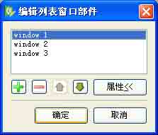

图 11-24 为列表窗口部件添加项目

IV. 接下来，为堆栈窗口部件添加子窗口部件，也就是页。初始情况下，堆栈窗口已经 为我们内置了两个页，我们从窗口部件盒中拖出 2 个 Label，分别放入两个页中。

注意，切换这两个页的方式是用鼠标点击堆栈窗口右上角的那两个黑色的三角形的导 航按钮，左边的那个是向前翻页，右边的那个是向后翻页。

V. 然后我们需要为堆栈窗口部件添加第 3 个页，方法先切换到第 2 个页，然后用鼠标 右键点击那两个导航按钮之一，在弹出的上下文菜单中依次选择 【插入页】→【在当前页 之后】，就完成了第 3 个页的插入。然后仿照上面的步骤，向其中加入 1 个 Label。

VI. 这之后，再在每个页面上 Label 的左右两侧各放置一个 Horizontal Spacer。

VII. 接下来我们为窗口部件设置属性，为简单起见，都取默认属性，而 3 个 Label 窗口 部件的 text 属性设置为 It is Window 1、It is Window 2 和 It is Window3。

必须要设置的是 Stacked Widget 的第 3 个页的 objectName 属性，这是 Qt Designer 的一个 bug，在目前的 4.5.2 版 Qt 里，你自己增加的页面的 objectName 属性将被 Qt Designer 命名为类似“页”的乱码，这将导致后面 qmake 运行时的错误。把它手动修改为 page_3。

VIII. 然后我们从里到外，依次为窗口部件布置布局。

布置好的样子如图 11-25 所示，你可以清楚的看到各个布局的情况，在此不再赘述。

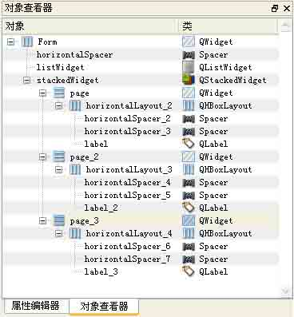

图 11-25 在对象查看器中看到的布局情况

第 3 步，向项目中引入该界面文件。

把这个文件命名为 stack Designer，保存在我们的项目目录下。在项目上点击鼠标右 键，在上下文菜单中选择【Add Existing Files...】，把该.ui 文件加入到工程中。

第 4 步，运行 qmake，以生成 ui_stackDesigner.h 头文件。

这时，先运行一下 qmake，它将调用 moc，以生成需要的 ui_stackDesigner.h 头文件。

第 5 步，自定义一个界面类，采用单继承方法使用界面文件。

首先新建一个名为 stackDesignerDlg.h 的头文件，其内容如下：

```cpp
#ifndef STACKDESIGNERDLG_H
#define STACKDESIGNERDLG_H
#include &lt;QtGui&gt;
#include "ui_stackDesigner.h"
class StackDesignerDlg : public QDialog
{
    Q_OBJECT
public:
    StackDesignerDlg(QWidget *parent = 0, Qt::WindowFlags f1 = 0);
private:
    Ui::Form ui;
};
#endif // STACKDESIGNERDLG_H 
```

在其中定义了该类公有单继承自 QDialog，以及它的构造函数。最重要的是声明了一个私有变量 ui，它是界面原生类的对象，这是单继承法最明显的特征。再建立该类的实现文件，其内容如下：

```cpp
#include "stackDesignerDlg.h"
StackDesignerDlg::StackDesignerDlg(QWidget *parent, Qt::WindowFlags f1)
: QDialog(parent,f1)
{
    setWindowTitle(tr("Stacked Widgets"));
    ui.setupUi(this);
    connect(ui.listWidget,SIGNAL(currentRowChanged(int)),ui.stackedWidget,SLOT(setCurrentIndex(int)));
} 
```

为简单起见，这里主要实现了其构造函数。

首先加入了类头文件声明。然后设置程序的标题，调用 setupUi()方法来完成界面布局 的初始化。

接下来把 listWidget 的 currentRowChanged()信号和 stackedWidget 的 setCurrentIndex()槽关联起来。

第 6 步，书写主程序文件。

完成了界面类的定义后，最后新建一个 main.cpp 文件，其内容如下：

```cpp
#include &lt;QApplication&gt;
#include "stackDesignerDlg.h"
int main( int argc, char * argv[] )
{
    QApplication a( argc, argv );
    StackDesignerDlg stack;
    stack.show();
    return a.exec();
} 
```

这段代码中定义一个我们刚才定义的界面类的实例，然后把它显示出来。

第 7 步，编译运行程序。

我们采用快捷键，依次按下 Ctrl+B 和 Ctrl+R 编译运行程序，其效果如图 11-26 所 示，与手写代码无异。

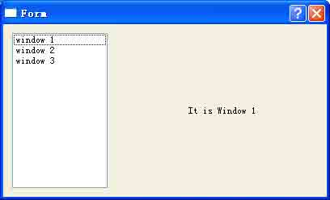

图 11-26 程序运行效果

需要注意的是，目前的 Qt Creator 并没有把 Qt Designer 的全部功能集成进来，比如 我们无法在其中预览 Qt Designer 生成的界面效果，因而笔者建议大家最好还是直接在 Qt Designer 中设计界面，然后使用 Qt Creator 完成项目的构建。

总而言之，这两种方法都是常用的，且各有长处。手写代码的方式似乎更加简洁，而 Qt Designer 结合 Qt Creator 的方式能使编程过程简化，且可以直观的验证你的布局情 况。读者朋友可以根据自己的喜好掌握。而笔者建议最好是将手写代码方式弄通，熟练之后 再使用 IDE 的方式，这样也能更好的理解 Qt 编程的精髓。

# 11.5 分裂器布局

## 11.5 分裂器布局

QSplitter 实质上是一个窗口部件，但同时它可以包含一些其他窗口部件。在切分窗口（splitter）中的这些窗口部件会通过切分条（splitter handle）而分隔开来。用户可以 通过拖动这些切分条来改变切分窗口中子窗口部件的尺寸。切分窗口常常可以用作布局管理 器的替代，从而可以把更多的控制权交给用户。

### 11.5.1 使用方法

大家知道，QSplitter 是一个容器类，Qt Designer 把分裂器对象视为可以容纳其它窗 口部件的布局。在 Qt Designer 中要使用分裂器布局也很容易，如图 11-27 所示，先选中 要布局的界面元素，然后选择工具栏上对应的按钮或者通过菜单项或者鼠标右键的上下文菜 单就可以完成。

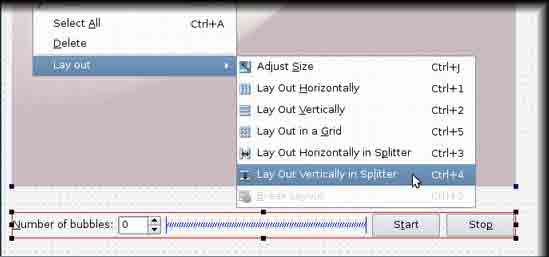

图 11-27 使用分裂器布局

QSplitter 类可以用来创建分裂器布局，继而实现切分窗口。 创建一个分裂器布局的一般步骤如下：

第 1 步，创建要使用的窗口部件。

第 2 步，创建分裂器布局的实例，就是 QSplitter 的实例。

第 3 步，使用 insertWidget()或者 addWidget()方法把第 1 步创建的窗口部件加入到 布局之中。

第 4 步，调用 QWidget::setLayou()方法把布局安装到窗体上。 注意，在使用分裂器布局之前，需要包含它的头文件声明：

```cpp
#include &lt;QSplitter&gt; 
```

### 11.5.2 构造函数

QSplitter 类有两个构造函数的原型：

```cpp
QSplitter::QSplitter ( Qt::Orientation orientation, QWidget * parent = 0 ) 
```

参数 orientation 指定了分裂器的方向是水平的还是垂直的， parent 指定了父窗口。一 个使用该型构造函数的代码示例如下：

```cpp
QSplitter *splitterRight = new QSplitter(Qt::Vertical,splitterMain); 
```

该代码定义了一个垂直分裂器布局，并指定了它的父窗口为 splitterMain，后者也是一个分裂器布局。

```cpp
QSplitter::QSplitter ( QWidget * parent = 0 ) 
```

这个型别实质上是第一种构造函数的缺省变体，它默认创建一个水平的分裂器布局。 一个使用该型构造函数的代码示例如下：

```cpp
QSplitter splitter(0); 
```

该代码定义了一个水平分裂器布局，并且采用程序上下文中的窗口作为父窗口。

这两种构造函数型我们都会经常用到，请读者朋友注意掌握。

### 11.5.3 一些深入的话题

默认情况下，在分裂器布局中的窗口部件会尽可能的按照用户的意愿在它的最小大小 提示以及最小大小或者是最大大小之间调整。如果有需要，也可以调用 QSplitter 类的 setSizes()方法来为布局中每个窗口部件指定大小。而要获取分裂器布局内当前的各个窗口 部件的大小，可以使用 QSplitter 类的 sizes()方法。

如果你想保存分裂器布局的构造，可以使用 QSplitter 的 saveState()和 restoreState()方法。它们通常与 QSettings 类结合使用，保存设置的代码如下：

```cpp
QSettings settings;
settings.setValue("splitterSizes", splitter-&gt;saveState()); 
```

恢复设置的代码如下：

```cpp
QSettings settings;
splitter-&gt;restoreState(settings.value("splitterSizes").toByteArray()); 
```

同前面讲过的堆栈布局的情形类似，如果你想获取分裂器布局中的窗口部件的相关信息，可以通过调用 indexof()、widget()以及 count()等方法来实现。

当你调用 hide()方法隐藏了分裂器布局中的某个窗口部件时，它会在界面上消失掉， 并且它原先占有的空间将被其它的窗口部件所 “分享”。而一旦你调用 show()方法显示它 时，一切又会恢复原样。

分裂器布局也是经常使用的一种，它分为分裂器水平布局和分裂器垂直布局，这可以 通过设置分裂器布局的方向来确定，如 Qt::Horizontal 和 Qt::Vertical。使用它们时，界 面效果和使用常见的水平和垂直布局几乎没有区别，它的最明显特征是布局内的元素之间是 等间距的，而水平和垂直布局则不一定是这样。

### 11.5.4 分裂器布局实例

在 QSplitter 中的子窗口部件将会自动按照创建时的顺序一个挨一个的（或者一个在 另外一个的下面）放在一起，并以切分窗口拖动条（ splitter bar）来分隔相邻的窗口部 件。以下是用于创建如图 11-28 所示的分裂器水平布局的窗口的代码。完整的源代码见实 例 splitter。

```cpp
#include &lt;QtGui&gt;
int main(int argc, char *argv[])
{
    QApplication app(argc, argv);
    QListWidget *listWidget = new QListWidget;
    QTreeWidget *treeWidget = new QTreeWidget;
    QTextEdit *editor = new QTextEdit;
    QSplitter splitter(Qt::Horizontal);
    splitter.addWidget(listWidget);
    splitter.addWidget(treeWidget);
    splitter.addWidget(editor);
    listWidget-&gt;addItem(QObject::tr("Inbox"));
    listWidget-&gt;addItem(QObject::tr("Outbox"));
    listWidget-&gt;addItem(QObject::tr("Sent"));
    listWidget-&gt;addItem(QObject::tr("Trash"));
    treeWidget-&gt;setColumnCount(1);
    QList&lt;QTreeWidgetItem *&gt; items;
    for (int i = 0; i &lt; 10; ++i)
        items.append(new QTreeWidgetItem((QTreeWidget*)0, QStringList(QString("item:%1").arg(i))));
    treeWidget-&gt;insertTopLevelItems(0, items);
    editor-&gt;setPlainText(QObject::tr("My child, my sister,\n"
        "think of the sweetness\n"
        "of going there to live together!\n"
        "To love at leisure,\n"
        "to love and to die\n"
        "in a country that is the image of you!"));
    splitter.setWindowTitle(QObject::tr("Splitter"));
    splitter.show();
    return app.exec();
} 
```

把这段代码保存成一个.cpp 文件，如 splitter.cpp,并创建一个文件夹 splitter，把 splitter.cpp 文件放入其中。依次运行 qmake –project，qmake splitter.pro,mingw32- make，即可生成可执行文件。程序的运行效果如图 11-28 所示。


图 11-28 分裂器布局实例效果

该程序代码比较易懂，我们简要的讲解一下。

第 1 行，加入了程序中用到的头文件声明，这也包括了 QSplitter 类的声明在里面。 第 5-7 行定义了布局内用到的窗口部件。

第 8 行定义了一个分裂器水平布局。

第 9-11 行将窗口部件加入到分裂器布局之中。

第 12-15 行为 listWidget 添加一些项目。注意在这个程序中，由于 main()主函数并不 是属于某个 QObject 类的子类，所以不能直接使用 tr()函数，而需要静态调用它，即 QObject::tr()。

第 16 行设置 treeWidget 的列数为 1。 第 17 行声明一个链表对象 items。

第 18-19 行为 items 赋值。

第 20 行将 items 的值加入到 treeWidget 中。 第 21 行为 editor 设置文本。

第 22 行设置窗口标题。

第 23-24 行显示窗体。

# 11.6 自定义布局管理器

## 11.6 自定义布局管理器

要使用自定义的布局管理器，我们可以重新实现 addItem(), sizeHint(), setGeometry(), itemAt() 和 takeAt()这些方法。为了确保当应用程序界面的空间非常小时，布局大小不会为 0，我们需要重载 minimumSize()方 法。日常中我们也经常看到这样的情形，即应用程序窗口的长和宽的尺寸是互为依存的，那 么我们就需要重载 hasHeightForWidth()和 heightForWidth()方法来实现这种效果。

这部分内容已经超出了本书的范围，感兴趣的读者请查阅 Qt Assistant 中的 Layout Classes 条目。

# 11.7 布局管理经验总结

## 11.7 布局管理经验总结

好了，到了现在，是时候为布局管理这个话题做一下总结了。

在大多数情况下，Qt 的布局管理器将为管理的窗口部件选择最优尺寸，以便窗口可以 顺利的重新调整大小。如果默认值不合理，那么 我们可以使用以下方法优化布局：

1\. 为某些子窗口部件设置最小尺寸、最大尺寸或固定尺寸

2\. 添加伸缩项目（stretch）或间距项目 这些项目将填补布局中的空白区域。手写代码即是调用 addStretch()，在 Qt Designer 中则是通过添加一个 spacer 窗口部件来实现。

3\. 更改子窗口部件的大小策略

通过调用 QWidget::setSizePolicy()，编程人员可以采用最优的方式重新设置子窗口 部件的尺寸变化行为。可以根据布局中其他子窗口部件来扩大、缩小子窗口部件，或者使其 尺寸不变。

4\. 更改子窗口部件的大小提示

QWidget::sizeHint() 和 QWidget::minimum SizeHint() 可以根据窗口部件的内容返 回其首选尺寸和首选最小尺寸。Qt 内建的窗口部件已经相应的提供了合适的实现。

5\. 设置伸缩因子

伸缩因子支持子窗口部件的相对增长；例如，将 2/3 的任何多余的可用空间分配给 A 窗口部件，将 1/3 的空间分配给 B 窗口部件，这将使得两者的比例保持在 2:1 的比例 上。

6.设置被布局管理的窗口部件之间的“间距”和整个布局周围的“空白”

默认情况下，Qt 使用与上下文相关的行业标准值。

7.自定义布局管理器

当 Qt 内建的这些布局管理器都不能很好的满足你的需要时，就可以考虑自定义布局管 理器。当然根据我的经验，这种情况是比较少见的。

8.各种布局方法综合使用 在有些情况下，可以将绝对位置法、人工布局法与布局管理器结合使用，往往会收到很好的效果。

当布局管理器在摆放这些窗口部件的时候，它就会考虑到上面讲到的这些约束条件。 并且如果这些还不满足你的要求的话，就可以对子窗口部件的类进行派生并且重新实现 sizeHint()函数，由此获得所需的大小提示。

# 11.8 问题与解答

## 11.8 问题与解答

问：关于 layout 布局与控件的大小

尽管我把一个窗口部件的 size 高和宽都设为 fixed，但是每次选用 layout 功能时，窗 口部件的 size 又会发生变化，有什么办法让窗口部件的大小一直维持在自己定义的大小， 无论外界布局做任何变化都不受影响？

答：与这个问题相关的内容很多，就是说布局受影响的因素很多。比如几种大小策略 在一起时的优先问题，某个大小策略的 “倾向性”问题，布局内部的各个窗口部件有没有设 置伸缩因子等问题，等等。通常你首先需要设置窗体的顶级布局，然后为窗体内的窗口部件 设置大小策略、伸缩因子、最大大小、最小大小等。另外，在需要绘制比较复杂的布局时， 手写代码的控制能力通常更强一些。

问：请教 Qt 布局的问题

最近发现在代码中手动建立的控件和布局 ，在窗口最大化的时候就可以自动调整大小，但是在 Qt desinger 里面画好的界面，虽然也加了布局，但是在窗口最大化的时候却 无法自动调整控件的大小，以至于最大化以后，旁边就有好多的空白。请问这种问题怎么解 决，怎么可以在使用 Qt desinger 的情况下，也让控件可以自动调整大小以适应窗口大小 的改变？

答：你的这个问题很典型，这是由于你没有为整个的窗体设置一个顶级布局的缘故。 设置了顶级布局之后，窗体上的所有窗口部件都处于它的管理之下，就能够实现整体的联动 了。

要查看你的窗体有没有设置顶级布局，可以在对象查看器中可以看到是否设置了布 局，以及布局是什么类型的。

另外，如果你对布局与窗体边界间的空白不是很满意，可以设置它，就是设置 margin，你可以阅读本章的内容，在里面有详细的使用方法。

问：容器内部的部件如何布局 我有三个容器已经布局好了,现在想将容器内部部件进行布局,使之能够跟所属容器同时变大或缩小,这个该怎么办呢？

答：添加布局的方法都大致如此：

第 1 步，定义布局内要用到的窗口部件

第 2 步，定义一个布局

第 3 步，把第 1 步定义的窗口部件加入到布局中

第 4 步，把布局安装到它的父窗口上

其中第 4 步就是针对你说的问题，你只需要把那些容器的实例作为布局的父窗口就可 以了。

# 11.9 总结与提高

## 11.9 总结与提高

布局管理是 Qt 程序开发最基本的技能之一，可以说，只要是使用 Qt 开发应用程序， 就会用到布局管理。在本章中，依次讲解了 Qt 中布局的基本概念和分类，基本布局的创建 方法和步骤，复杂的布局如栈布局、分裂器布局等的使用方法，最后对布局管理的经验进行 了总结。

设置布局管理有两种常见的做法，手写代码方法和使用 Qt Designer 设置布局的方 法。建议读者优先掌握手写代码的方法，在使用 Qt Designer 设置布局时，建议与 Qt Creator 结合使用，效果更佳。使用布局管理确实有着许多优势，但它也不是万能的，一般 在大型的应用程序开发中，通常是将布局管理与各种摆放窗口部件的方法结合起来使用。