<!--yml

category: 未分类

日期：2025-12-10 18:30:43

-->

# 实用指南：裸机C++

> 来源：[https://arobenko.github.io/bare_metal_cpp/#_data_serialisation](https://arobenko.github.io/bare_metal_cpp/#_data_serialisation)

## 概述

有时我会遇到这样的问题：C++是否适合嵌入式开发，尤其是裸机开发。有多篇文章认为C++优于C，你可以在C++中做的一切都可以在C中做，并且还有许多额外的功能，甚至应该用于裸机开发。然而，我没有找到很多关于如何使用C++的优势和提升开发过程与传统的使用“C”编程语言方法的实际指南或教程。通过这本书，我希望解释并展示如何实现**软实时系统**，而不需要优先考虑中断，也不需要任何复杂的实时任务调度。希望它能帮助某人开始使用C++进行嵌入式裸机开发。

本作品受[Commons Attribution-NonCommercial-ShareAlike 4.0国际许可协议](http://creativecommons.org/licenses/by-nc-sa/4.0/)的许可。


### 受众

本文档的主要目标受众是希望更好地理解裸机开发的专业C++开发者，了解如何在嵌入式环境中使用他们喜欢的编程语言，并可能将他们的C++技能提升到“专家”水平。为什么是**专业**开发者？因为裸机平台有很多限制。在大多数情况下，将没有异常和运行时类型信息（RTTI）的支持。在许多情况下，动态内存分配也将被排除。为了能够有效地使用C++，你必须对现有的C++惯用用法、构造和STL内容有深入的了解。你必须知道你喜欢的数据结构是如何实现的，以及是否可以在你的环境中重用它们。如果无法直接使用STL（或任何其他库）代码，你必须实现它的简化版本，并且最好知道库开发者是如何实现该功能的，以及如何使其适应你环境的限制。

对于具有中级C++知识的专业嵌入式开发者，这份文档也可能很有用。他们可能会从许多C++洞察中受益，并会有几次“我没想到我能做到这一点！”这样的顿悟时刻。

如果你的C++知识仅限于多态和虚函数，如果模板元编程对你来说毫无意义，那么你可能还没有准备好在嵌入式环境中使用C++，这份文档可能也会过于复杂而难以理解。

我想强调的是，这**不是一个 C++ 教程**。网上有很多资源教授传统的 C++，包括操作系统服务、异常和 RTTI。我个人的观点是，在使用裸机世界之前，你必须掌握在常规环境下的 C++。

### C++ 的流行度

C++ 在基于 Linux 的嵌入式系统中相当流行。然而，在裸机开发中并不那么流行。为什么？可能是因为它的复杂性。仅仅了解 C++ 语法是不够的。为了有效地使用它，开发者必须知道标准模板库（STL）提供了什么，在为特定平台开发时什么可以使用，什么不可以使用。对 STL 的精通也不够，开发者应该对模板元编程有一定的熟练程度。尽管有人认为模板因为可执行代码膨胀而危险，但我认为模板是开发者的朋友，但必须知道这些危险并知道如何有效地使用模板。但再次强调，要正确地做到这一点，需要时间和努力。

另一个原因，为什么 C++ 不用于裸机开发，是因为在许多项目（如果不是大多数项目）中，软件是由硬件开发者编写的，至少在最初阶段是为了确保硬件按预期工作。对于他们来说，“C”编程语言是一个自然的选择。当然，大多数硬件开发者缺乏软件开发的专业知识。他们可能难以编写高质量的“C”代码，更不用说“C++”了。当软件达到一定复杂度时，它会被转交给不允许从头开始重新实现的软件工程师。他们被告知：“这段代码几乎可以工作，只需修复几个错误，实现这个简短的功能集，我们就可以继续了。丢弃现有的代码是浪费，我们没有时间重新实现它。”

最后一个原因，我认为，是一个心理原因。人们宁愿在群体中犯错，也不愿自己正确。当大多数基于 Linux 的嵌入式系统产品正在使用“C”进行开发时，选择“C++”会感觉风险和自然，尽管从技术角度来看后者是一个更好的选择。

### C++ 的好处

选择 C++ 而不是 C 的主要原因是**代码重用**。多亏了模板，在 C++ 中实现通用的代码块，使其能够在项目之间重用，比在 C 中要容易得多。当从头开始实现所有内容时，使用 C++ 而不是 C 在开发工作量方面可能不会带来任何显著的优势，甚至可能增加工作量。然而，一旦开发出了通用组件，下一个项目的整个开发过程将会因为重用之前的组件而变得更加容易和快速。

### 本书内容

本文档介绍了可以在裸机开发中使用的几个概念，并展示了如何使用当时最新（撰写时）的 C++11 标准实现它们。

通用组件的代码作为“嵌入式 C++ 库”项目“embxx”的一部分实现，可以在[https://github.com/arobenko/embxx](https://github.com/arobenko/embxx)找到。它拥有 GPLv3 许可证。

也有一个项目实现了多个简单的裸机应用程序，使用 [embxx](https://github.com/arobenko/embxx) 可以在 RaspberryPi 平台上运行。源代码可以在 [https://github.com/arobenko/embxx_on_rpi](https://github.com/arobenko/embxx_on_rpi) 找到。它也拥有 GPLv3 许可证。

两个项目都需要 gcc 版本 4.7 或更高版本，因为需要 C++11 支持。它们还使用 [CMake](http://www.cmake.org) 作为它们的构建系统。代码已经与以下免费工具链进行了测试：

+   Launchpad 上的 [GNU Tools for ARM Embedded Processors](https://launchpad.net/gcc-arm-embedded)

+   [Sourcery CodeBench Lite Edition](http://www.mentor.com/embedded-software/sourcery-tools/sourcery-codebench/editions/lite-edition/)

整个文档以 ARM 平台为中心。目前我并不尝试涵盖其他内容。

在 Linux 环境中编译 Raspberry Pi 示例应用程序，请按照以下步骤操作：

+   检出 [embxx_on_rpi](https://github.com/arobenko/embxx_on_rpi) 项目

```cpp
> git clone https://github.com/arobenko/embxx_on_rpi.git
> cd embxx_on_rpi
```

+   创建单独的构建目录并切换到该目录

```cpp
> mkdir build
> cd build
```

+   生成 makefiles

```cpp
> cmake ..
```

注意，cmake 的最后一个参数是源树根的相对或绝对路径。另外注意，[embxx](https://github.com/arobenko/embxx) 库将在此过程中作为外部 git 子模块检出。

+   构建应用程序

```cpp
> make
```

+   从 `<build_dir>/image/<app_name>/kernel.img` 中获取生成的镜像

CMake 提供以下构建类型，我认为它们是自解释的：

+   None（默认）

+   Debug

+   Release

+   MinSizeRel

+   RelWithDebInfo

要指定所需的构建类型，请使用 cmake 实用工具的 `-DCMAKE_BUILD_TYPE=<value>` 选项：

```cpp
> cmake -DCMAKE_BUILD_TYPE=Release ..
```

如果未指定构建类型，默认类型是**None**，这与**Debug**类似，但没有 `-g` 编译选项，即不进行优化也不生成调试信息。

可以指定交叉编译工具链的前缀。默认期望 `arm-none-eabi-`，即 `arm-none-eabi-gcc`、`arm-none-eabi-g++` 和 `arm-none-eabi-as` 用于编译源代码。如果这些实用工具在环境搜索路径中找不到，那么您应该通过传递 `-DCROSS_COMPILE=<prefix>` 选项到 cmake 来指定前缀：

```cpp
> cmake -DCROSS_COMPILE=/opt/arm-none-eabi-2013.05/bin/arm-none-eabi- ..
```

要查看编译源代码使用的命令，请在 `make` 前面加上 `VERBOSE=1`：

```cpp
> VERBOSE=1 make
```

[embxx](https://github.com/arobenko/embxx) 库有 doxygen 生成的文档。可以在 [发布工件](https://github.com/arobenko/embxx/releases) 中找到。

### 贡献

如果您有任何建议、请求、错误修复、拼写错误修复，或者您觉得某些事情没有解释清楚，请随时通过电子邮件联系我 **arobenko@gmail.com**。

### 离线读取

本书源代码托管在 [github](https://github.com/arobenko/bare_metal_cpp_src) 上，本书的PDF和HTML版本可以从 [release_artifacts](https://github.com/arobenko/bare_metal_cpp_src/releases) 下载。

## 了解您的编译器输出

在裸机开发中成功使用C++语言及其库，了解编译器从C++源代码生成的二进制代码非常重要。本节将引导您通过构建简单测试应用程序并分析它们的二进制代码的过程。

### 测试应用程序

[embxx_on_rpi](https://github.com/arobenko/embxx_on_rpi) 项目包含几个简单的测试应用程序，这些应用程序仅用于二进制代码分析，不应在目标平台上执行。这些应用程序位于 [src/test_cpp](https://github.com/arobenko/embxx_on_rpi/tree/master/src/test_cpp) 目录中。为了正确分析编译器为生产环境生成的代码，让我们以发布模式编译所有应用程序：

```cpp
> git clone https://github.com/arobenko/embxx_on_rpi.git
> mkdir -p <build_dir_somewhere>
> cd <build_dir_somewhere>
> cmake -DCMAKE_BUILD_TYPE=Release <path/to/embxx_on_rpi>
> VERBOSE=1 make
```

每个应用程序的列表文件将是 `<build_dir_somewhere>/src/test_cpp/<app_name>/kernel.list`。

### 简单应用程序编译

让我们尝试编译一个无限循环的简单应用程序，称为 [test_cpp_simple](https://github.com/arobenko/embxx_on_rpi/tree/master/src/test_cpp/test_cpp_simple)。

要成功地将所有生成的对象链接起来，需要一个链接脚本。它说明了哪些代码/数据段需要在什么地址加载，以及定义了可能由源代码需要的几个符号。[这里](http://www.delorie.com/gnu/docs/binutils/ld_6.html)是一个关于链接脚本语法的良好手册，[这里](https://github.com/arobenko/embxx_on_rpi/blob/master/src/raspberrypi.ld)是我用来为Raspberry Pi平台链接应用程序的链接脚本。

根据您的编译器，链接可能会失败，因为某些符号缺失。例如，当应用程序使用异常支持编译时，需要 `__exidx_start` 和 `__exidx_end`，或者如果标准库包含清零 `.bss` 段的代码，可能需要 `__bss_start__` 和 `__bss_end__`。

每个应用程序都必须有一个启动代码，通常用汇编语言编写。这个启动代码必须执行以下步骤：

1.  在适当的位置（通常在地址0x0000）写入中断向量表。

1.  为每个运行时模式设置栈指针。

1.  清零 .bss 段

1.  调用全局（静态）对象的构造函数（仅适用于C++）

1.  调用主函数。

可能会发生编译器为您生成一些启动代码的情况，尤其是如果您没有从编译中排除标准库（stdlib）。为了检查这是否是这种情况，我们需要分析成功编译和链接的图像二进制文件的汇编列表。测试应用程序的所有生成文件都将位于`<build_dir>/src/test_cpp/<app_name>`。汇编列表文件将具有`kernel.list`名称。

**旁注**：可以使用以下命令生成汇编列表：

```cpp
> arm-none-eabi-objdump -D -S app_binary > app.list
```

打开列表文件，查找包含**CRT**字符串的函数。**CRT**代表“C运行时”。当使用[这个](https://launchpad.net/gcc-arm-embedded)编译器时，编译器生成的函数被称为`_mainCRTStartup`。让我们更仔细地看看这个函数做了什么。

```cpp
00008198 <_mainCRTStartup>:
```

加载RAM末端的地址并将其值赋给堆栈指针（sp）。

```cpp
 8198:	e59f30f0 	ldr	r3, [pc, #240]	; 8290 <_mainCRTStartup+0xf8>
    819c:	e3530000 	cmp	r3, #0
    81a0:	059f30e4 	ldreq	r3, [pc, #228]	; 828c <_mainCRTStartup+0xf4>
    81a4:	e1a0d003 	mov	sp, r3
```

为各种模式设置sp的值，堆栈的大小由编译器本身确定。

```cpp
 81a8:	e10f2000 	mrs	r2, CPSR
    81ac:	e312000f 	tst	r2, #15
    81b0:	0a000015 	beq	820c <_mainCRTStartup+0x74>
    81b4:	e321f0d1 	msr	CPSR_c, #209	; 0xd1
    81b8:	e1a0d003 	mov	sp, r3
    81bc:	e24daa01 	sub	sl, sp, #4096	; 0x1000
    81c0:	e1a0300a 	mov	r3, sl
    81c4:	e321f0d7 	msr	CPSR_c, #215	; 0xd7
    81c8:	e1a0d003 	mov	sp, r3
    81cc:	e2433a01 	sub	r3, r3, #4096	; 0x1000
    81d0:	e321f0db 	msr	CPSR_c, #219	; 0xdb
    81d4:	e1a0d003 	mov	sp, r3
    81d8:	e2433a01 	sub	r3, r3, #4096	; 0x1000
    81dc:	e321f0d2 	msr	CPSR_c, #210	; 0xd2
    81e0:	e1a0d003 	mov	sp, r3
    81e4:	e2433a02 	sub	r3, r3, #8192	; 0x2000
    81e8:	e321f0d3 	msr	CPSR_c, #211	; 0xd3
    81ec:	e1a0d003 	mov	sp, r3
    81f0:	e2433902 	sub	r3, r3, #32768	; 0x8000
    81f4:	e3c330ff 	bic	r3, r3, #255	; 0xff
    81f8:	e3c33cff 	bic	r3, r3, #65280	; 0xff00
    81fc:	e5033004 	str	r3, [r3, #-4]
    8200:	e9532000 	ldmdb	r3, {sp}^
    8204:	e38220c0 	orr	r2, r2, #192	; 0xc0
    8208:	e121f002 	msr	CPSR_c, r2
    820c:	e243a801 	sub	sl, r3, #65536	; 0x10000
    8210:	e3b01000 	movs	r1, #0
    8214:	e1a0b001 	mov	fp, r1
    8218:	e1a07001 	mov	r7, r1
```

加载`__bss_start__`和`__bss_end__`符号的地址，并将它们之间的所有区域清零。

```cpp
 821c:	e59f0078 	ldr	r0, [pc, #120]	; 829c <_mainCRTStartup+0x104>
    8220:	e59f2078 	ldr	r2, [pc, #120]	; 82a0 <_mainCRTStartup+0x108>
    8224:	e0522000 	subs	r2, r2, r0
    8228:	eb00004a 	bl	8358 <memset>

   ... Then comes some code, purpose of which is not clear
```

调用标准库提供的`__libc_init_array`函数，该函数将初始化所有全局对象。它将`__init_array_start`和`__init_array_end`之间的区域视为指向初始化函数的指针列表，并逐个调用它们。

```cpp
 8278:	eb000014 	bl	82d0 <__libc_init_array>
```

调用主函数。

```cpp
 8284:	eb000010 	bl	82cc <main>
```

如果由于某种原因`main`函数返回，则调用退出函数，该函数可能必须实现为无限循环或跳回启动代码的开始处。

```cpp
 8288:	eb000008 	bl	82b0 <exit>
```

接下来是局部数据

```cpp
 828c:	00080000 	andeq	r0, r8, r0
    8290:	04008000 	streq	r8, [r0], #-0
	...
    829c:	00008458 	andeq	r8, r0, r8, asr r4
    82a0:	00008474 	andeq	r8, r0, r4, ror r4
```

启动过程中唯一缺失的阶段是更新中断向量表。在正确更新了后者之后，就可以调用提供的服务程序`_mainCRTStartup`函数。然而，如果您的编译器没有提供此类函数，您别无选择，只能自己编写整个启动代码。[这里](https://github.com/arobenko/embxx_on_rpi/blob/master/src/asm/startup.s)是此类代码的一个示例。

请注意，根据定义，`.bss`段包含未初始化的数据，必须在启动时将其清零。即使您的代码中没有未初始化的变量，清零`.bss`也是必须的操作。这是因为编译器可能会出于性能原因将显式初始化为0的变量放入`.bss`，并假定在启动时此部分将被清零。

此外请注意，全局变量初始化函数的指针位于`.init.array`段中。要初始化您的全局对象，您只需遍历此段中的所有条目并逐个调用它们。

要实现缺失的阶段，请使用以下汇编指令：

```cpp
_entry:
    ldr pc,reset_handler_ptr        ;@  Processor Reset handler
    ldr pc,undefined_handler_ptr    ;@  Undefined instruction handler
    ldr pc,swi_handler_ptr          ;@  Software interrupt
    ldr pc,prefetch_handler_ptr     ;@  Prefetch/abort handler.
    ldr pc,data_handler_ptr         ;@  Data abort handler/
    ldr pc,unused_handler_ptr       ;@
    ldr pc,irq_handler_ptr          ;@  IRQ handler
    ldr pc,fiq_handler_ptr          ;@  Fast interrupt handler.

    ;@ Set the branch addresses
    reset_handler_ptr:      .word reset
    undefined_handler_ptr:  .word hang
    swi_handler_ptr:        .word hang
    prefetch_handler_ptr:   .word hang
    data_handler_ptr:       .word hang
    unused_handler_ptr:     .word hang
    irq_handler_ptr:        .word irq_handler
    fiq_handler_ptr:        .word hang

reset:
    ;@ Disable interrupts
    cpsid if

    ;@ Copy interrupt vector to its place
    ldr r0,=_entry
    mov r1,#0x0000

    ;@  Here we copy the branching instructions
    ldmia r0!,{r2,r3,r4,r5,r6,r7,r8,r9}
    stmia r1!,{r2,r3,r4,r5,r6,r7,r8,r9}

    ;@  Here we copy the branching addresses
    ldmia r0!,{r2,r3,r4,r5,r6,r7,r8,r9}
    stmia r1!,{r2,r3,r4,r5,r6,r7,r8,r9}
```

请注意，位于地址0x0000的中断向量表包含指向适当处理器的分支指令，而不仅仅是处理器的地址。让我们更仔细地看看这些分支指令在我们的汇编列表文件中的样子：

```cpp
_entry:
    800c:	e59ff018 	ldr	pc, [pc, #24]	; 802c <reset_handler_ptr>
    8010:	e59ff018 	ldr	pc, [pc, #24]	; 8030 <undefined_handler_ptr>
    8014:	e59ff018 	ldr	pc, [pc, #24]	; 8034 <swi_handler_ptr>
    8018:	e59ff018 	ldr	pc, [pc, #24]	; 8038 <prefetch_handler_ptr>
    801c:	e59ff018 	ldr	pc, [pc, #24]	; 803c <data_handler_ptr>
    8020:	e59ff018 	ldr	pc, [pc, #24]	; 8040 <unused_handler_ptr>
    8024:	e59ff018 	ldr	pc, [pc, #24]	; 8044 <irq_handler_ptr>
    8028:	e59ff018 	ldr	pc, [pc, #24]	; 8048 <fiq_handler_ptr>

0000802c <reset_handler_ptr>:
    802c:	0000804c 	andeq	r8, r0, ip, asr #32

00008030 <undefined_handler_ptr>:
    8030:	000082b4 			; <UNDEFINED> instruction: 0x000082b4

00008034 <swi_handler_ptr>:
    8034:	000082b4 			; <UNDEFINED> instruction: 0x000082b4

00008038 <prefetch_handler_ptr>:
    8038:	000082b4 			; <UNDEFINED> instruction: 0x000082b4

0000803c <data_handler_ptr>:
    803c:	000082b4 			; <UNDEFINED> instruction: 0x000082b4

00008040 <unused_handler_ptr>:
    8040:	000082b4 			; <UNDEFINED> instruction: 0x000082b4

00008044 <irq_handler_ptr>:
    8044:	000082b8 			; <UNDEFINED> instruction: 0x000082b8

00008048 <fiq_handler_ptr>:
    8048:	000082b4 			; <UNDEFINED> instruction: 0x000082b4
```

分支指令将中断函数的地址加载到“pc”寄存器。然而，函数的地址存储在某个地方，编译器生成对该存储的访问使用相对于当前“pc”寄存器的相对偏移。这就是为什么我们必须复制不仅仅是分支指令，还要复制存储中断例程地址的区域：

```cpp
 ;@ Copy interrupt vector to its place
    ldr r0,=_entry
    mov r1,#0x0000

    ;@  Here we copy the branching instructions
    ldmia r0!,{r2,r3,r4,r5,r6,r7,r8,r9}
    stmia r1!,{r2,r3,r4,r5,r6,r7,r8,r9}

    ;@  Here we copy the branching addresses
    ldmia r0!,{r2,r3,r4,r5,r6,r7,r8,r9}
    stmia r1!,{r2,r3,r4,r5,r6,r7,r8,r9}
```

### 动态内存分配

让我们尝试编译一个使用动态内存分配的简单应用程序。[test_cpp_vector](https://github.com/arobenko/embxx_on_rpi/tree/master/src/test_cpp/test_cpp_vector) 应用程序包含以下代码：

```cpp
std::vector<int> v;
static const int MaxVecSize = 256;
for (int i = 0; i < MaxVecSize; ++i) {
    v.push_back(i);
}
```

可能会出现链接操作失败的情况，因为多个引用符号未定义：

```cpp
unwind-arm.c:(.text+0x224): undefined reference to `__exidx_end'
unwind-arm.c:(.text+0x228): undefined reference to `__exidx_start'
/usr/bin/../lib/gcc/arm-none-eabi/4.8.3/../../../../arm-none-eabi/lib/libc.a(lib_a-abort.o): In function `abort':
abort.c:(.text.abort+0x10): undefined reference to `_exit'
/usr/bin/../lib/gcc/arm-none-eabi/4.8.3/../../../../arm-none-eabi/lib/libc.a(lib_a-sbrkr.o): In function `_sbrk_r':
sbrkr.c:(.text._sbrk_r+0x18): undefined reference to `_sbrk'
/usr/bin/../lib/gcc/arm-none-eabi/4.8.3/../../../../arm-none-eabi/lib/libc.a(lib_a-signalr.o): In function `_kill_r':
signalr.c:(.text._kill_r+0x1c): undefined reference to `_kill'
/usr/bin/../lib/gcc/arm-none-eabi/4.8.3/../../../../arm-none-eabi/lib/libc.a(lib_a-signalr.o): In function `_getpid_r':
signalr.c:(.text._getpid_r+0x4): undefined reference to `_getpid'
/usr/bin/../lib/gcc/arm-none-eabi/4.8.3/../../../../arm-none-eabi/lib/libc.a(lib_a-writer.o): In function `_write_r':
writer.c:(.text._write_r+0x20): undefined reference to `_write'
/usr/bin/../lib/gcc/arm-none-eabi/4.8.3/../../../../arm-none-eabi/lib/libc.a(lib_a-closer.o): In function `_close_r':
closer.c:(.text._close_r+0x18): undefined reference to `_close'
/usr/bin/../lib/gcc/arm-none-eabi/4.8.3/../../../../arm-none-eabi/lib/libc.a(lib_a-fstatr.o): In function `_fstat_r':
fstatr.c:(.text._fstat_r+0x1c): undefined reference to `_fstat'
/usr/bin/../lib/gcc/arm-none-eabi/4.8.3/../../../../arm-none-eabi/lib/libc.a(lib_a-isattyr.o): In function `_isatty_r':
isattyr.c:(.text._isatty_r+0x18): undefined reference to `_isatty'
/usr/bin/../lib/gcc/arm-none-eabi/4.8.3/../../../../arm-none-eabi/lib/libc.a(lib_a-lseekr.o): In function `_lseek_r':
lseekr.c:(.text._lseek_r+0x20): undefined reference to `_lseek'
/usr/bin/../lib/gcc/arm-none-eabi/4.8.3/../../../../arm-none-eabi/lib/libc.a(lib_a-readr.o): In function `_read_r':
readr.c:(.text._read_r+0x20): undefined reference to `_read'
collect2: error: ld returned 1 exit status
```

符号 `__exidx_start` 和 `__exidx_end` 用于指示 `.ARM.exidx` 部分的开始和结束。它用于异常处理。它们必须在链接脚本中定义：

```cpp
.ARM.exidx :
{
    __exidx_start = .;
    *(.ARM.exidx* .gnu.linkonce.armexidx.*)
    __exidx_end = .;
} >RAM
```

动态内存分配将需要实现 `_sbrk` 函数，该函数将用于为 C/C++ 堆管理分配内存块。

所有其他符号都需要正确支持由 C++ 堆管理系统使用的异常。[这里](https://sourceware.org/newlib/libc.html#Syscalls) 是一个很好的资源，列出了开发者可能需要实现的所有系统调用，以使应用程序编译成功。

现在，在成功编译后，仔细查看我们编译的两个示例应用程序的映像大小。路径是 `<build_dir>/src/test_cpp/test_cpp_simple/kernel.img` 和 `<build_dir>/src/test_cpp/test_cpp_vector/kernel.img`。

**旁注**：可以使用以下指令从 elf 二进制文件生成映像：> arm-none-eabi-objcopy <elf_executable> -O binary <binary_image_path>

你可能会注意到，[test_cpp_vector](https://github.com/arobenko/embxx_on_rpi/tree/master/src/test_cpp/test_cpp_vector) 图像的大小比 [test_cpp_simple](https://github.com/arobenko/embxx_on_rpi/tree/master/src/test_cpp/test_cpp_simple) 大约多 100K。这是由于 C++ 堆管理和异常处理引起的。让我们尝试看看如果将“C++”堆替换为不带异常的“C”堆，应用程序的大小会发生什么变化。你将不得不覆盖所有负责内存分配/释放的全局 C++ 操作符：

```cpp
#include <cstdlib>
#include <new> 
void* operator new(size_t size) noexcept
{
    return malloc(size);
}

void operator delete(void *p) noexcept
{
    free(p);
}

void* operator new[](size_t size) noexcept
{
    return operator new(size); // Same as regular new
}

void operator delete[](void *p) noexcept
{
    operator delete(p); // Same as regular delete
}

void* operator new(size_t size, std::nothrow_t) noexcept
{
    return operator new(size); // Same as regular new
}

void operator delete(void *p,  std::nothrow_t) noexcept
{
    operator delete(p); // Same as regular delete
}

void* operator new[](size_t size, std::nothrow_t) noexcept
{
    return operator new(size); // Same as regular new
}

void operator delete[](void *p,  std::nothrow_t) noexcept
{
    operator delete(p); // Same as regular delete
}
```

请重新编译 [test_cpp_vector](https://github.com/arobenko/embxx_on_rpi/tree/master/src/test_cpp/test_cpp_vector) 应用程序，创建其映像，并查看其大小。它将更接近 [test_cpp_simple](https://github.com/arobenko/embxx_on_rpi/tree/master/src/test_cpp/test_cpp_simple) 映像的大小。实际上，你可能甚至不需要之前实现的大多数系统调用函数。尝试逐个删除它们，看看链接器是否仍然报告对这些符号的“未定义引用”。

**结论**：使用C++堆会带来显著的代码大小开销。在裸机开发中使用C++时，覆盖`new`和`delete`操作符的实现，使用`malloc`和`free`是一个好的做法。请注意，在这种情况下，如果内存分配失败，将返回[nullptr](http://en.cppreference.com/w/cpp/types/nullptr_t)而不是抛出[std::bad_alloc](http://en.cppreference.com/w/cpp/memory/new/bad_alloc)异常，因此要小心第三方C++库，这些库依赖于抛出异常，并且没有检查从[operator new](http://en.cppreference.com/w/cpp/memory/new/operator_new)返回的值。

#### 排除动态内存的使用

动态内存分配是传统C++的核心部分。然而，在某些裸机产品中，使用动态内存可能存在问题和/或被禁止。如果使用动态内存，唯一（我知道的）使编译失败的方法是完全排除标准库。使用`gcc`编译器，可以通过使用`-nostdlib`编译选项来实现。

从编译中排除标准库将移除整个C++运行时环境，这包括动态内存（堆）管理和异常处理。使用此编译选项的含义将在[移除标准库和C++运行时](#compiler_output-nostdlib)部分进行描述。

### 异常

异常处理也是传统C++的核心特性之一。然而，由于代码执行时间不可预测以及对于裸机平台来说过于昂贵（从代码大小来看），这个特性被认为是非常危险的。在源代码中使用单个抛出语句会导致最终二进制映像中额外超过120KB的二进制代码。你可以自己尝试使用你的编译器，看看生成的二进制映像大小有何不同。

可以通过向编译器提供某些选项来禁止使用抛出语句。对于GNU编译器（`gcc`），请使用`-fno-exceptions`选项与`-fno-unwind-tables`选项一起使用。根据`gcc`手册[此页面](https://gcc.gnu.org/onlinedocs/libstdc++/manual/using_exceptions.html)的描述，所有抛出语句都应该被替换为对`abort()`的调用。不幸的是，这个信息似乎已经过时了。我在写作时使用的最新（当时）`gcc`版本4.8的行为略有不同。

当使用上述选项进行编译，并且在代码中存在`throw`语句（例如`throw std::runtime_error("Some error")`）时，编译将失败，并显示错误信息：

```cpp
main.cpp:34:42: error: exception handling disabled, use -fexceptions to enable
     throw std::runtime_error("Some error");
```

然而，尽管编译选项禁止了异常，标准库中的所有 `throw` 语句都被编译进去了，导致整个异常处理支持代码的额外开销都包含在最终的二进制映像中。测试应用程序 [test_cpp_exceptions](https://github.com/arobenko/embxx_on_rpi/tree/master/src/test_cpp/test_cpp_exceptions) 包含简单的代码，会导致异常被抛出：

```cpp
std::vector<int> v;
v.at(100) = 0;
```

主函数生成的代码看起来是这样的：

```cpp
00015f60 <main>:
   15f60:	e92d4008 	push	{r3, lr}
   15f64:	e59f0000 	ldr	r0, [pc]	; 15f6c <main+0xc>
   15f68:	eb0000a8 	bl	16210 <_ZSt20__throw_out_of_rangePKc>
   15f6c:	00013868 	andeq	r3, r1, r8, ror #16
```

我们还可以看到，生成的列表中存在多个与异常相关的函数，例如 `__cxa_allocate_exception`、`__cxa_throw`、`_ZSt20__throw_out_of_rangePKc`、`_ZSt21__throw_bad_exceptionv` 等... 由于异常处理，二进制映像的大小也将非常大（约125KB）。

如果你希望使用可能会抛出异常的STL类，例如 `std::string`、`std::vector`，但又不愿意为异常处理支付额外的代码空间成本，你将不得不做两件事。首先，确保你的代码运行中不会发生异常条件，即如果 `throw` 语句即将执行，这意味着你的代码中存在错误。其次，覆盖编译器尝试使用的所有 "__throw_*" 函数的定义。为了识别所有这些函数，你将不得不暂时禁用标准库的使用，通过将 `-nostdlib` 编译选项传递给 `gcc` 编译器。对于上面的代码示例，不使用标准库的编译将因错误信息而失败：

```cpp
main.cpp.o: In function `main':
main.cpp:(.text.startup+0x8): undefined reference to `std::__throw_out_of_range(char const*)'
collect2: error: ld returned 1 exit status
```

让我们尝试覆盖 `std::__throw_out_of_range(char const*)`:

```cpp
namespace std
{

void __throw_out_of_range(char const*)
{
    while (true) {}
}

}
```

这次编译将成功。现在让我们编译包含标准库的结果代码（不使用 `-nostdlib` 选项）并检查二进制映像大小。使用我的编译器，大小为1.3KB，这比使用异常处理时的120KB要好得多。

**结论**：在C++裸机开发中，排除异常处理支持是一个众所周知且广泛使用的实践。即使使用了相关的编译选项（GNU编译器中的 `-fno-exceptions` 和 `-fno-unwind-tables`），仍然需要覆盖编译器使用的和标准库提供的各种 `__throw_*` 函数。

### RTTI

**运行时类型信息** 也是传统C++的核心特性之一。它允许在运行时检索对象类型信息（使用 [typeid](http://en.cppreference.com/w/cpp/language/typeid) 操作符）以及检查继承层次结构（使用 [dynamic_cast](http://en.cppreference.com/w/cpp/language/dynamic_cast)）。RTTI仅在存在多态行为时才可用，即类至少有一个虚函数。

让我们尝试分析使用RTTI时生成的代码。在 [embxx_on_rpi](https://github.com/arobenko/embxx_on_rpi) 项目中的 [test_cpp_rtti](https://github.com/arobenko/embxx_on_rpi/tree/master/src/test_cpp/test_cpp_rtti) 应用程序中包含以下代码。

```cpp
struct SomeClass
{
    virtual void someFunc();
};
```

在某个 *.cpp 文件中：

```cpp
void SomeClass::someFunc()
{
}
```

在 `main` 函数的某个地方：

```cpp
SomeClass someClass;
someClass.someFunc();
```

让我们打开列表文件，看看里面发生了什么。`SomeClass::someFunc()` 的地址似乎为 `0x8300`：

```cpp
00008300 <_ZN9SomeClass8someFuncEv>:
    8300:	e12fff1e 	bx	lr
```

`SomeClass` 类的虚拟表必须在 `.rodata` 部分中，并包含 `SomeClass::someFunc()` 函数的地址，即它内部必须有 `0x8300` 的值：

```cpp
Disassembly of section .rodata:

...
00009c10 <_ZTV9SomeClass>:
    9c10:	00000000 	andeq	r0, r0, r0
    9c14:	00009c04 	andeq	r9, r0, r4, lsl #24
    9c18:	00008300 	andeq	r8, r0, r0, lsl #6
    9c1c:	00000000 	andeq	r0, r0, r0
```

可以看到，编译器在除了我们实现的单个虚拟函数之外，还向虚拟表添加了一些条目。地址 `0x9c04` 也位于 `.rodata` 部分中。这是一个类型相关表：

```cpp
00009c04 <_ZTI9SomeClass>:
    9c04:	00009c28 	andeq	r9, r0, r8, lsr #24
    9c08:	00009bf8 	strdeq	r9, [r0], -r8
    9c0c:	00000000 	andeq	r0, r0, r0
```

`0x9c28` 和 `0x9bf8` 都是 `.rodata*` 部分的地址。`0x9bf8` 地址似乎包含一些数据：

```cpp
00009bf8 <_ZTS9SomeClass>:
    9bf8:	6d6f5339 	stclvs	3, cr5, [pc, #-228]!	; 9b1c <strcmp+0x180>
    9bfc:	616c4365 	cmnvs	ip, r5, ror #6
    9c00:	00007373 	andeq	r7, r0, r3, ror r3
```

经过仔细观察，我们可能将此数据解码为 `9SomeClass` ascii 字符串。

地址 `0x9c28` 位于某些类型相关信息表中：

```cpp
00009c20 <_ZTVN10__cxxabiv117__class_type_infoE>:
    9c20:	00000000 	andeq	r0, r0, r0
    9c24:	00009c50 	andeq	r9, r0, r0, asr ip
    9c28:	00009dc0 	andeq	r9, r0, r0, asr #27
    9c2c:	00009de4 	andeq	r9, r0, r4, ror #27
    9c30:	0000a114 	andeq	sl, r0, r4, lsl r1
    9c34:	0000a11c 	andeq	sl, r0, ip, lsl r1
    9c38:	00009e40 	andeq	r9, r0, r0, asr #28
    9c3c:	00009d48 	andeq	r9, r0, r8, asr #26
    9c40:	00009e10 	andeq	r9, r0, r0, lsl lr
    9c44:	00009e94 	muleq	r0, r4, lr
    9c48:	00009dac 	andeq	r9, r0, ip, lsr #27
    9c4c:	00000000 	andeq	r0, r0, r0
```

编译器如何使用这些表对我们来说兴趣不大。有趣的是代码大小的开销。让我们检查二进制映像的大小。使用我的编译器，它略大于 13KB。

对于某些裸机平台，可能不希望甚至不可能将这么多额外的二进制代码添加到二进制映像中。GNU 编译器 (`gcc`) 提供了使用 `-no-rtti` 选项禁用 **RTTI** 的能力。让我们检查使用此选项时 `SomeClass` 类的虚拟表：

```cpp
Disassembly of section .rodata:

00008320 <_ZTV9SomeClass>:
	...
    8328:	00008300 	andeq	r8, r0, r0, lsl #6
    832c:	00000000 	andeq	r0, r0, r0
```

虚拟表现在看起来要简单得多，只有一个指向 `SomeClass::someFunc()` 虚拟函数的指针。不需要额外的代码大小开销来维护类型信息。如果上面的应用程序在没有异常（使用 `-fno-exceptions` 和 `-fno-unwind-tables`）以及没有 RTTI 支持（使用 `-no-rtti`）的情况下编译，二进制映像大小将约为 1.3KB，这要好得多。

然而，如果使用 `-no-rtti` 选项，编译器将不允许使用 [typeid](http://en.cppreference.com/w/cpp/language/typeid) 操作符以及 [dynamic_cast](http://en.cppreference.com/w/cpp/language/dynamic_cast)。在这种情况下，开发者需要想出其他解决方案来区分不同类型的对象（但具有相同的 '祖先'）在运行时。有多种惯用法可以使用，例如使用简单的 C 语言风格的 `switch` 在某些类型枚举成员上，或者使用对象的多态行为来执行 [双重分派](http://en.wikipedia.org/wiki/Double_dispatch)。

**结论**：在裸机 C++ 开发中，禁用 **R**un **T**ime **T**ype **I**nformation (RTTI) 以及消除异常处理是非常常见的。它允许在最终二进制映像中节省大约 10KB 的空间开销。

### 移除标准库和 C++ 运行时

由于平台RAM/ROM的限制，可能需要排除对异常和RTTI的支持（使用`-fno-exceptions` `-fno-unwind-tables` `-fno-rtti`编译），甚至还需要排除动态内存分配。后者包括向编译器传递`-nostdlib`选项。在排除标准库的情况下，编译器不会提供启动代码的帮助，开发者将不得不实现所有启动阶段：

+   更新中断向量表

+   为所有执行模式设置正确的栈指针

+   将`.bss`段清零

+   调用全局对象的初始化函数

+   调用“main”函数。

[这里](https://github.com/arobenko/embxx_on_rpi/blob/master/src/asm/startup.s)是一个此类启动代码的示例。

也可能需要提供某些函数的实现或某些全局符号的定义。例如，如果使用[std::copy](http://en.cppreference.com/w/cpp/algorithm/copy)算法从一处复制多个对象到另一处，编译器可能会决定使用标准库提供的[memcpy](http://en.cppreference.com/w/c/string/byte/memcpy)函数，结果构建过程会因“未定义引用”错误而失败。同样，使用[std::fill](http://en.cppreference.com/w/cpp/algorithm/fill)算法可能需要[memset](http://en.cppreference.com/w/c/string/byte/memset)函数。准备好在需要时实现它们。

另一个例子是调用带有[std::placeholders::_1](http://en.cppreference.com/w/cpp/utility/functional/placeholders)、[std::placeholders::_2](http://en.cppreference.com/w/cpp/utility/functional/placeholders)等占位符的[std::bind](http://en.cppreference.com/w/cpp/utility/functional/bind)函数。将需要将这些占位符定义为全局符号：

```cpp
#include <functional> namespace std
{
namespace placeholders
{

decltype(std::placeholders::_1) _1;
decltype(std::placeholders::_2) _2;
decltype(std::placeholders::_3) _3;
decltype(std::placeholders::_4) _4;

}  // namespace placeholders
}  // namespace std
```

即使在开发的产品中需要标准库，暂时将其排除在编译之外也是一个好的练习，同时也是良好的调试技术。编译很可能会在链接阶段失败。缺失的符号和/或函数的列表将很好地表明库提供了哪些缺失的功能。开发者可能会注意到某些组件仍然需要异常处理，例如，导致二进制映像过大。

### 静态对象

让我们分析初始化静态对象的代码。[test_cpp_statics](https://github.com/arobenko/embxx_on_rpi/tree/master/src/test_cpp/test_cpp_statics)是一个简单的应用程序，其中包含两个静态对象，一个在全局作用域中，另一个在函数作用域中。

```cpp
class SomeObj
{
public:
   static SomeObj& instanceGlobal();
   static SomeObj& instanceLocal();

private:
    SomeObj(int v1, int v2);
    int m_v1;
    int m_v2;

    static SomeObj globalObj;
};

SomeObj SomeObj::globalObj(1, 2);

SomeObj& SomeObj::instanceGlobal()
{
    return globalObj;
}

SomeObj& SomeObj::instanceLocal()
{
    static SomeObj localObj(3, 4);
    return localObj;
}

int main(int argc, const char** argv)
{
    static_cast<void>(argc);
    static_cast<void>(argv);

    auto& glob = SomeObj::instanceGlobal();
    auto& local = SomeObj::instanceLocal();
    static_cast<void>(glob);
    static_cast<void>(local);

    while (true) {};
    return 0;
}
```

注意，如果上述代码在同一文件中实现，编译器将尝试内联该代码。为了正确分析初始化全局变量的代码，你应该将构造函数和`instanceGlobal()`/`instanceLocal()`函数的实现放入单独的文件中。如果将`-nostdlib`选项传递给编译器以排除与标准库的链接，上述代码的编译将失败，并出现以下错误：

```cpp
main.cpp:(.text.startup+0x1c): undefined reference to `__cxa_guard_acquire'
main.cpp:(.text.startup+0x3c): undefined reference to `__cxa_guard_release'
```

这意味着编译器试图使静态变量的初始化线程安全。为了编译它，你必须自己实现锁定功能，或者通过添加`-fno-threadsafe-statics`编译选项允许编译器以不安全的方式执行。我认为在裸机开发中使用此选项相当安全，前提是你确保静态变量不在中断上下文中访问，或者在启用任何中断之前在`main()`函数的开始处初始化。要获取此类对象的引用而不使用它，只需这样做就足够了：

```cpp
 auto& local = SomeObj::instanceLocal();
    static_cast<void>(local);
```

现在，让我们分析`globalObj`的初始化。`.init.array`部分包含指向初始化函数`_GLOBAL__sub_I__ZN7SomeObj9globalObjE`的指针。

`.init.array`部分的反汇编：

```cpp
00008180 <__init_array_start>:
    8180:	00008154 	andeq	r8, r0, r4, asr r1
```

初始化函数将对象的地址传递给`SomeObj`的构造函数，并附带初始化参数（“1”和“2”整数值）。

```cpp
00008154 <_GLOBAL__sub_I__ZN7SomeObj9globalObjE>:
    8154:	e59f0008 	ldr	r0, [pc, #8]	; 8164 <_GLOBAL__sub_I__ZN7SomeObj9globalObjE+0x10>
    8158:	e3a01001 	mov	r1, #1
    815c:	e3a02002 	mov	r2, #2
    8160:	eaffffee 	b	8120 <_ZN7SomeObjC1Eii>
    8164:	00008168 	andeq	r8, r0, r8, ror #2

00008168 <_ZN7SomeObj9globalObjE>:
	...
```

上述代码将全局对象的地址（`0x00008168`）加载到**r0**中，并将初始化参数加载到**r1**和**r2**中，然后调用`SomeObj`的构造函数。

请记住，在调用`main()`函数之前，从`.init.array`部分调用所有初始化函数。

在链接器文件中：

```cpp
 .init.array :
    {
        __init_array_start = .;
        *(.init_array)
        *(.init_array.*)
        __init_array_end = .;
    } > RAM
```

在启动代码中：

```cpp
 ;@ Call constructors of all global objects
    ldr r0, =__init_array_start
    ldr r1, =__init_array_end

globals_init_loop:
    cmp     r0,r1
    it      lt
    ldrlt   r2, [r0], #4
    blxlt   r2
    blt     globals_init_loop

    ;@ Main function
    bl main
    b reset ;@ restart if main function returns
```

然而，如果未显式排除标准库的编译，标准库提供的`__libc_init_array`可能被使用：

```cpp
 ;@ Call constructors of all global objects
    bl	__libc_init_array

    ;@ Main function
    bl main
    b reset ;@ restart if main function returns
```

让我们也分析`SomeObj::instanceLocal()`中`localObj`的初始化。

```cpp
000080e4 <_ZN7SomeObj13instanceLocalEv>:
    80e4:	e92d4010 	push	{r4, lr}
    80e8:	e59f4028 	ldr	r4, [pc, #40]	; 8118 <_ZN7SomeObj13instanceLocalEv+0x34>
    80ec:	e5943008 	ldr	r3, [r4, #8]
    80f0:	e3130001 	tst	r3, #1
    80f4:	1a000005 	bne	8110 <_ZN7SomeObj13instanceLocalEv+0x2c>
    80f8:	e284000c 	add	r0, r4, #12
    80fc:	e3a01003 	mov	r1, #3
    8100:	e3a02004 	mov	r2, #4
    8104:	eb000005 	bl	8120 <_ZN7SomeObjC1Eii>
    8108:	e3a03001 	mov	r3, #1
    810c:	e5843008 	str	r3, [r4, #8]
    8110:	e59f0004 	ldr	r0, [pc, #4]	; 811c <_ZN7SomeObj13instanceLocalEv+0x38>
    8114:	e8bd8010 	pop	{r4, pc}
    8118:	00008168 	andeq	r8, r0, r8, ror #2
    811c:	00008174 	andeq	r8, r0, r4, ror r1
```

上述代码将表示对象已初始化的标志的地址加载到**r4**中，然后将其值加载到**r3**中，并使用`tst`指令进行检查。如果标志指示对象尚未初始化，则调用对象的构造函数，并在返回对象地址之前更新标志值。请注意，`tst r3, #1`指令在**r3**的值和整数值**#1**之间执行二进制**AND**操作，然后下一个`bne`指令在结果不为0时执行分支，即对象已经初始化。

**结论**：访问全局对象的成本略低于访问局部静态对象，因为后者访问涉及检查对象是否已初始化。

#### 自定义析构函数

那么，具有非平凡析构函数的静态对象的销毁又如何呢？让我们在上面的类中添加一个析构函数并尝试编译：

```cpp
class SomeObj
{
public:
   ~SomeObj();
    …
}
```

在某个*.cpp文件中：

```cpp
SomeObj::~SomeObj() {}
```

这次编译将失败，并出现以下错误：

```cpp
CMakeFiles/03_test_statics.dir/SomeObj.cpp.o: In function `SomeObj::instanceLocal()':
SomeObj.cpp:(.text+0x44): undefined reference to `__aeabi_atexit'
SomeObj.cpp:(.text+0x58): undefined reference to `__dso_handle'
CMakeFiles/03_test_statics.dir/SomeObj.cpp.o: In function `_GLOBAL__sub_I__ZN7SomeObj9globalObjE':
SomeObj.cpp:(.text.startup+0x28): undefined reference to `__aeabi_atexit'
SomeObj.cpp:(.text.startup+0x34): undefined reference to `__dso_handle'
```

根据[这份](http://infocenter.arm.com/help/topic/com.arm.doc.ihi0041d/IHI0041D_cppabi.pdf)文档，`__aeabi_atexit`函数用于在`main`函数返回后注册指向析构函数的指针以及指向将要析构的相关静态对象的指针。这种行为的原因是这些对象必须按照与它们构造相反的顺序进行析构。编译器无法知道局部静态对象的精确构造顺序。甚至可能存在一些静态对象根本未构造。`__dso_handle`是一个指向下一个**{析构函数指针，对象指针}**对将要存储的当前地址的全局指针。大多数裸机应用的`main`函数不应该返回，全局/静态对象也不会被析构。在这种情况下，以下方式实现所需函数就足够了：

```cpp
extern "C" int __aeabi_atexit(
    void *object,
    void (*destructor)(void *),
    void *dso_handle)
{
    static_cast<void>(object);
    static_cast<void>(destructor);
    static_cast<void>(dso_handle);
    return 0;
}

void* __dso_handle = nullptr;
```

然而，如果你的`main`函数返回，然后代码跳回到初始化/重置例程，就需要适当地执行全局/静态对象的析构。你需要分配足够的空间来存储所有必要的**{析构函数指针，对象指针}**对，然后在`__aeabi_atexit`函数中将这对存储在`__dso_handle`指向的区域，同时增加后面的值。注意，`__aeabi_atexit`函数的`dso_handle`参数实际上是指向全局`__dso_handle`值的指针。然后，当`main`函数返回时，以相关对象的地址作为第一个参数，以相反的顺序调用存储的析构函数。

为了验证上述所有内容，让我们再次查看初始化函数生成的代码（在添加了析构函数之后）：

```cpp
00008170 <_GLOBAL__sub_I__ZN7SomeObj9globalObjE>:
    8170:	e92d4010 	push	{r4, lr}
    8174:	e59f4020 	ldr	r4, [pc, #32]	; 819c <_GLOBAL__sub_I__ZN7SomeObj9globalObjE+0x2c>
    8178:	e3a01001 	mov	r1, #1
    817c:	e1a00004 	mov	r0, r4
    8180:	e3a02002 	mov	r2, #2
    8184:	ebffffeb 	bl	8138 <_ZN7SomeObjC1Eii>
    8188:	e1a00004 	mov	r0, r4
    818c:	e59f100c 	ldr	r1, [pc, #12]	; 81a0 <_GLOBAL__sub_I__ZN7SomeObj9globalObjE+0x30>
    8190:	e59f200c 	ldr	r2, [pc, #12]	; 81a4 <_GLOBAL__sub_I__ZN7SomeObj9globalObjE+0x34>
    8194:	e8bd4010 	pop	{r4, lr}
    8198:	eaffffe9 	b	8144 <__aeabi_atexit>
    819c:	000081a8 	andeq	r8, r0, r8, lsr #3
    81a0:	00008140 	andeq	r8, r0, r0, asr #2
    81a4:	000081bc 			; <UNDEFINED> instruction: 0x000081bc

00008140 <_ZN7SomeObjD1Ev>:
    8140:	e12fff1e 	bx	lr

000081bc <__dso_handle>:
    81bc:	00000000 	andeq	r0, r0, r0
```

事实上，调用构造函数紧接着调用`__aeabi_atexit`，其中对象地址在**r0**（第一个参数），析构函数地址在**r1**（第二个参数），`__dso_handle`地址在**r2**（第三个参数）。

**结论**：设计“main”函数包含无限循环并永不返回，以节省全局/静态对象析构功能的实现。

### 抽象类

下一步要测试的是具有纯虚函数的抽象类，同时排除对标准库的链接（使用`-nostdlib`编译选项）。以下是[测试_cpp_abstract_class](https://github.com/arobenko/embxx_on_rpi/tree/master/src/test_cpp/test_cpp_abstract_class)应用程序的摘录。

```cpp
class AbstractBase
{
public:
    virtual ~AbstractBase();
    virtual void func() = 0;
    virtual void nonOverridenFunc() final;
};

class Derived : public AbstractBase
{
public:
    virtual ~Derived();
    virtual void func() override;
};

AbstractBase::~AbstractBase()
{
}

void AbstractBase::nonOverridenFunc()
{
}

Derived::~Derived()
{
}

void Derived::func()
{
}
[source, c++]
```

在“main”函数的某个地方：

```cpp
Derived obj;
AbstractBase* basePtr = &obj;
basePtr->func();
```

编译将因以下错误而失败：

```cpp
CMakeFiles/04_test_abstract_class.dir/AbstractBase.cpp.o: In function `AbstractBase::~AbstractBase()':
AbstractBase.cpp:(.text+0x24): undefined reference to `operator delete(void*)'
CMakeFiles/04_test_abstract_class.dir/AbstractBase.cpp.o:(.rodata+0x10): undefined reference to `__cxa_pure_virtual'
CMakeFiles/04_test_abstract_class.dir/Derived.cpp.o: In function `Derived::~Derived()':
Derived.cpp:(.text+0x3c): undefined reference to `operator delete(void*)'
```

`__cxa_pure_virtual` 是一个函数，当函数是纯虚函数时，编译器将其地址写入虚拟表。它可能由于某些不自然的指针滥用或在尝试在抽象基类的析构函数中调用纯虚函数时被调用。在正常应用程序运行中不应调用此函数。如果发生这种情况，则意味着存在一个错误。使用无限循环或以某种方式向开发者报告错误（例如闪烁 led）来实现此函数是相当安全的。

```cpp
extern "C" void __cxa_pure_virtual()
{
    while (true) {}
}
```

尽管 `operator delete(void*)` 的需求相当奇怪，源代码中并没有动态内存分配。这需要调查。让我们模拟该函数并检查编译器的输出：

```cpp
void operator delete(void *)
{
}
```

类的虚拟表位于 `.rodata` 部分：

```cpp
Disassembly of section .rodata:

000081a0 <_ZTV12AbstractBase>:
	...
    81a8:	000080d8 	ldrdeq	r8, [r0], -r8	; <UNPREDICTABLE>
    81ac:	000080ec 	andeq	r8, r0, ip, ror #1
    81b0:	0000815c 	andeq	r8, r0, ip, asr r1
    81b4:	000080e8 	andeq	r8, r0, r8, ror #1

000081b8 <_ZTV7Derived>:
	...
    81c0:	00008110 	andeq	r8, r0, r0, lsl r1
    81c4:	00008130 	andeq	r8, r0, r0, lsr r1
    81c8:	0000810c 	andeq	r8, r0, ip, lsl #2
    81cc:	000080e8 	andeq	r8, r0, r8, ror #1
```

两个类的最后一个条目都指向 `AbstractBase::nonOverridenFunc` 函数：

```cpp
000080e8 <_ZN12AbstractBase16nonOverridenFuncEv>:
    80e8:	e12fff1e 	bx	lr
```

**Derived** 类的虚拟表中的第三个条目指向 `Derived::func` 函数，而 **AbstractBase** 类的虚拟表中的第三个条目指向 `__cxa_pure_virtual`，正如预期的那样。

```cpp
0000810c <_ZN7Derived4funcEv>:
    810c:	e12fff1e 	bx	lr

0000815c <__cxa_pure_virtual>:
    815c:	eafffffe 	b	815c <__cxa_pure_virtual>
```

虚拟表中的前两个条目指向两个不同的析构函数实现。第一个条目包含正常析构函数实现的地址，而第二个条目包含第二个析构函数实现的地址，该实现会在对象销毁后调用 operator delete（具有 `_ZdlPv` 符号）：

```cpp
000080d8 <_ZN12AbstractBaseD1Ev>:
    80d8:	e59f3004 	ldr	r3, [pc, #4]	; 80e4 <_ZN12AbstractBaseD1Ev+0xc>
    80dc:	e5803000 	str	r3, [r0]
    80e0:	e12fff1e 	bx	lr
    80e4:	000081a8 	andeq	r8, r0, r8, lsr #3

000080ec <_ZN12AbstractBaseD0Ev>:
    80ec:	e59f3014 	ldr	r3, [pc, #20]	; 8108 <_ZN12AbstractBaseD0Ev+0x1c>
    80f0:	e92d4010 	push	{r4, lr}
    80f4:	e1a04000 	mov	r4, r0
    80f8:	e5803000 	str	r3, [r0]
    80fc:	eb000015 	bl	8158 <_ZdlPv>
    8100:	e1a00004 	mov	r0, r4
    8104:	e8bd8010 	pop	{r4, pc}
    8108:	000081a8 	andeq	r8, r0, r8, lsr #3

00008110 <_ZN7DerivedD1Ev>:
    8110:	e59f3014 	ldr	r3, [pc, #20]	; 812c <_ZN7DerivedD1Ev+0x1c>
    8114:	e92d4010 	push	{r4, lr}
    8118:	e1a04000 	mov	r4, r0
    811c:	e5803000 	str	r3, [r0]
    8120:	ebffffec 	bl	80d8 <_ZN12AbstractBaseD1Ev>
    8124:	e1a00004 	mov	r0, r4
    8128:	e8bd8010 	pop	{r4, pc}
    812c:	000081c0 	andeq	r8, r0, r0, asr #3

00008130 <_ZN7DerivedD0Ev>:
    8130:	e59f301c 	ldr	r3, [pc, #28]	; 8154 <_ZN7DerivedD0Ev+0x24>
    8134:	e92d4010 	push	{r4, lr}
    8138:	e1a04000 	mov	r4, r0
    813c:	e5803000 	str	r3, [r0]
    8140:	ebffffe4 	bl	80d8 <_ZN12AbstractBaseD1Ev>
    8144:	e1a00004 	mov	r0, r4
    8148:	eb000002 	bl	8158 <_ZdlPv>
    814c:	e1a00004 	mov	r0, r4
    8150:	e8bd8010 	pop	{r4, pc}
    8154:	000081c0 	andeq	r8, r0, r0, asr #3

00008158 <_ZdlPv>:
    8158:	e12fff1e 	bx	lr
```

看起来，当存在虚拟析构函数时，编译器将不得不支持直接调用析构函数以及使用 operator delete。在前一种情况下，编译器将使用虚拟表中的第一个条目来调用析构函数，而在后一种情况下，编译器将使用第二个条目。让我们尝试在我们的 `main` 函数中添加以下行：

```cpp
basePtr->~AbstractBase();
delete basePtr;
```

编译器将向 `main` 函数添加以下指令：

```cpp
 8190:	e59d3004 	ldr	r3, [sp, #4]
    8194:	e1a00004 	mov	r0, r4
    8198:	e5933000 	ldr	r3, [r3]
    819c:	e12fff33 	blx	r3
    81a0:	e59d3004 	ldr	r3, [sp, #4]
    81a4:	e1a00004 	mov	r0, r4
    81a8:	e5933004 	ldr	r3, [r3, #4]
    81ac:	e12fff33 	blx	r3
```

虚拟表的地址被写入 **r3**，然后 **r3** 的值被覆盖为要调用的析构函数的地址，并通过 `blx` 指令执行调用。第一次调用从虚拟表的第一个条目中获取析构函数的地址，而第二次调用从第二个条目（偏移量为 `#4`）中获取地址。这正是预期的。

**结论**：即使没有动态内存分配，拥有虚拟析构函数可能也需要实现 `operator delete(void*)`。

### 模板

模板因其产生的代码膨胀而臭名昭著。一些组织明确禁止在其内部 C++ 编码标准中使用模板。然而，模板是一个非常强大的工具，如果不使用模板，编写通用的源代码，在多个独立的项目/平台上重用，而且不产生任何显著的性能损失，是非常困难（如果不是不可能）的。我认为那些害怕或不允许使用模板的开发者，将不得不反复实现相同的概念/模块，这些差异是项目/平台特定的。要正确掌握模板，我们必须看到当使用模板时，编译器生成的汇编代码重复。让我们尝试编译一个简单的应用程序 [test_cpp_templates](https://github.com/arobenko/embxx_on_rpi/tree/master/src/test_cpp/test_cpp_templates)，该应用程序使用具有不同输入参数类型的模板函数：

```cpp
template <typename T>
void func(T startValue)
{
    for (volatile T i = startValue; i < startValue * 2; i += 1) {}
    for (volatile T i = startValue; i < startValue * 2; i += 2) {}
    for (volatile T i = startValue; i < startValue * 2; i += 3) {}
    for (volatile T i = startValue; i < startValue * 2; i += 4) {}
    for (volatile T i = startValue; i < startValue * 2; i += 5) {}
    for (volatile T i = startValue; i < startValue * 2; i += 6) {}
}

int main(int argc, const char** argv)
{
    static_cast<void>(argc);
    static_cast<void>(argv);

    int start1 = 100;
    unsigned start2 = 200;

    func(start1);
    func(start2);

    while (true) {};
    return 0;
}
```

你可能会注意到函数 `func` 使用了两个参数，一个是 `int` 类型，另一个是 `unsigned` 类型。这两种类型具有相同的大小，应该生成几乎相同的代码。让我们看看 `main` 函数生成的代码：

```cpp
00008504 <main>:
    8504:	e92d4008 	push	{r3, lr}
    8508:	e3a00064 	mov	r0, #100	; 0x64
    850c:	ebfffefc 	bl	8104 <_Z4funcIiEvT_>
    8510:	e3a000c8 	mov	r0, #200	; 0xc8
    8514:	ebffff3a 	bl	8204 <_Z4funcIjEvT_>
    ...
```

是的，确实有两个对两个不同函数的调用。然而，这些函数的汇编代码几乎相同。让我们也尝试从不同的源文件中重用具有相同类型但相同的函数：

```cpp
void other()
{
    int start1 = 300;
    unsigned start2 = 500;

    func(start1);
    func(start2);
}
```

生成的代码是：

```cpp
000080d8 <_Z5otherv>:
    80d8:	e92d4008 	push	{r3, lr}
    80dc:	e3a00f4b 	mov	r0, #300	; 0x12c
    80e0:	eb000007 	bl	8104 <_Z4funcIiEvT_>
    80e4:	e3a00f7d 	mov	r0, #500	; 0x1f4
    80e8:	eb000045 	bl	8204 <_Z4funcIjEvT_>
    80ec:	e8bd8008 	pop	{r3, pc}
```

我们看到调用的是相同地址上的相同函数，即链接器正在执行其从不同目标文件中删除相同函数重复项的工作。

让我们也尝试用类包装相同的函数，并添加一个额外的模板参数：

```cpp
template <typename T, std::size_t TDummy>
struct SomeTemplateClass
{
    static void func(T startValue)
    {
        for (volatile T i = startValue; i < startValue * 2; i += 1) {}
        for (volatile T i = startValue; i < startValue * 2; i += 2) {}
        for (volatile T i = startValue; i < startValue * 2; i += 3) {}
        for (volatile T i = startValue; i < startValue * 2; i += 4) {}
        for (volatile T i = startValue; i < startValue * 2; i += 5) {}
        for (volatile T i = startValue; i < startValue * 2; i += 6) {}
    }
};
```

请注意未使用的虚拟模板参数 `TDummy`。现在，我们在 `main` 函数中添加两个额外的调用：

```cpp
int main(int argc, const char** argv)
{
    ...
    SomeTemplateClass<int, 5>::func(500);
    SomeTemplateClass<int, 10>::func(500);

    while (true) {};
    return 0;
}
```

注意，这些调用的功能是相同的。唯一的区别是虚拟模板参数。让我们看看生成的代码：

```cpp
00008504 <main>:
    ...
    8518:	e3a00f7d 	mov	r0, #500	; 0x1f4
    851c:	ebffff78 	bl	8304 <_ZN17SomeTemplateClassIiLj5EE4funcEi>
    8520:	e3a00f7d 	mov	r0, #500	; 0x1f4
    8524:	ebffffb6 	bl	8404 <_ZN17SomeTemplateClassIiLj10EE4funcEi>
    8528:	eafffffe 	b	8528 <main+0x24>
```

编译器生成了对两个不同函数的调用，它们的二进制代码是相同的。

**结论**：模板确实需要额外的关注和考虑。同样重要的是不要过度思考。众所周知的概念“不要过早优化。使正确的代码更快，比使代码更快更正确要容易得多。”也适用于代码大小。在需要之前不要尝试优化你的模板代码。首先让它工作，并且工作正确。

### 标签分派

[标签分派](http://www.generic-programming.org/languages/cpp/techniques.php#tag_dispatching) 是 C++ 开发中广泛使用的一种惯用法。本书的以下章节中广泛使用了它。

让我们尝试在 [embxx_on_rpi](https://github.com/arobenko/embxx_on_rpi) 项目中编译 [test_cpp_tag_dispatch](https://github.com/arobenko/embxx_on_rpi/tree/master/src/test_cpp/test_cpp_tag_dispatch) 应用程序，并查看编译器生成的代码。

```cpp
struct Tag1 {};
struct Tag2 {};

class Dispatcher
{
public:

    template <typename TTag>
    static void func()
    {
        funcInternal(TTag());
    }

private:
    static void funcInternal(Tag1 tag);
    static void funcInternal(Tag2 tag);

};
```

在`main`函数的某个地方：

```cpp
Dispatcher::func<Tag1>();
Dispatcher::func<Tag2>();
```

编译器生成的代码如下所示：

```cpp
000080fc <main>:
    80fc:	e92d4008 	push	{r3, lr}
    8100:	e3a00000 	mov	r0, #0
    8104:	ebfffff3 	bl	80d8 <_ZN10Dispatcher12funcInternalE4Tag1>
    8108:	e3a00000 	mov	r0, #0
    810c:	ebfffff2 	bl	80dc <_ZN10Dispatcher12funcInternalE4Tag2>
    ...
```

虽然`Tag1`和`Tag2`是空类，但编译器仍然使用整数值`0`作为函数的第一个参数。

让我们尝试通过让编译器知道标签参数没有被使用来优化掉这个多余的`mov r0, #0`指令：

```cpp
class Dispatcher
{
public:

    template <typename TTag>
    static void otherFunc()
    {
        otherFuncInternal(TTag());
    }

private:

    static void otherFuncInternal(Tag1 tag)
    {
        static_cast<void>(tag);
        otherFuncTag1();
    }

    static void otherFuncInternal(Tag2 tag)
    {
        static_cast<void>(tag);
        otherFuncTag2();
    }

    static void otherFuncTag1();
    static void otherFuncTag2();
};
```

在`main`函数的某个地方：

```cpp
Dispatcher::otherFunc<Tag1>();
Dispatcher::otherFunc<Tag2>();
```

编译器生成的代码如下所示：

```cpp
000080fc <main>:
    ...
    8110:	ebfffff2 	bl	80e0 <_ZN10Dispatcher13otherFuncTag1Ev>
    8114:	ebfffff2 	bl	80e4 <_ZN10Dispatcher13otherFuncTag2Ev>
```

在这种情况下，编译器优化掉了标签参数。

基于以上内容，我们可以得出**结论**：当使用[标签分派](http://www.generic-programming.org/languages/cpp/techniques.php#tag_dispatching)习语时，接收虚拟（标签）参数的函数应该是一个简单的内联包装器，包装其他实现所需功能的函数。在这种情况下，编译器将优化掉标签对象的创建，并直接调用包装的函数。

## 基本需求

在描述各种嵌入式（裸机）开发概念之前，我想先介绍几个基本需求，我认为大多数开发者都将在他们的产品中使用这些需求。

### 断言

在开发过程中，一个基本需求是能够在编译应用程序时以DEBUG模式测试各种假设和不变量，并在以RELEASE模式编译应用程序时移除检查。标准C++重用了标准C库中的`assert()`宏。

```cpp
#include <cassert> …
assert(some_condition);
```

如果定义了`NDEBUG`符号，`assert()`宏将评估为无内容，否则它将评估条件。如果条件不返回`true`，它将调用标准库提供的`__assert_fail`函数，该函数随后调用`printf`将错误信息打印到标准输出，然后调用`abort`函数，该函数旨在终止应用程序。

`printf`和`abort`函数都由标准库提供。然而，`printf`将需要实现`_write`函数以将字符打印到调试输出终端，而`abort`将需要实现`_exit`函数以终止应用程序。

如果从编译中排除了标准库（使用`-nostdlib`编译选项），编译将因`undefined reference to __assert_func`错误信息而失败。开发者必须使用正确的签名实现此函数。要检索正确的签名，您必须打开由您的编译器提供的`assert.h`标准头文件。它可能看起来像这样：

```cpp
void __assert_fail (const char *expr, const char *file, unsigned int line, const char *function) __attribute__ ((__noreturn__));
```

该属性指定此函数不会返回，因此编译器将生成对其的调用，而不设置任何返回地址。

从上述所有陈述中得出的结论是，使用标准的 `assert()` 宏是可能的，但有些不够灵活。只能从上述函数中访问全局变量，即如果需要闪烁一个LED来指示断言失败，那么其控制必须通过全局变量来访问，这有点不美观。这种方法的另一个缺点是，没有方便的手段来更改断言失败功能的行为，并在一段时间后恢复原始行为。这种行为可能有助于更好地识别失败的断言位置。例如，通过在某个函数的入口处激活特定的LED来覆盖默认的断言失败行为，并在函数返回时恢复原始的断言失败行为。

下面是处理断言检查和失败的一种更好的方法的简要描述。代码位于 [embxx](https://github.com/arobenko/embxx) 库中，可以在 [这里](https://github.com/arobenko/embxx/blob/master/embxx/util/Assert.h) 查阅。

为了解决上述问题并以C++的方式处理断言，我们必须创建一个通用的断言失败处理抽象类：

```cpp
class Assert
{
public:
    virtual void fail(
        const char* expr,
        const char* file,
        unsigned int line,
        const char* function) = 0;
};
```

在实现特定项目自定义的断言失败行为时，继承上述类：

```cpp
#include "embxx/util/Assert.h" 
typedef ... Led;
class LedOnAssert : public embxx::util::Assert
{
public:

    LedOnAssert(Led& led)
        : led_(led)
    {
    }

    virtual void fail(
        const char* expr,
        const char* file,
        unsigned int line,
        const char* function)
    {
        led_.on();
        while (true) {;}
    }

private:
    Led& led_;
};
```

为了管理上述类的对象，我们将不得不创建一个具有静态实例的单例类。它将存储当前注册的断言失败行为的指针：

```cpp
class AssertManager
{
public:
   static AssertManager& instance()
    {
        static AssertManager mgr;
        return mgr;
    }

    Assert* reset(Assert* newAssert = nullptr)
    {
        auto prevAssert = assert_;
        assert_ = newAssert;
        return prevAssert;
    }

    Assert* getAssert()
    {
        return assert_;
    }

    bool hasAssertRegistered() const
    {
        return assert_ != nullptr;
    }

    void infiniteLoop()
    {
        while (true) {};
    }

private:
    AssertManager() : assert_(nullptr) {}

    Assert* assert_;
};
```

`reset` 成员函数注册新的管理断言失败行为的对象，并返回先前的对象，这可以在以后用来恢复原始行为。

我们将需要一个新宏来检查断言条件并调用已注册的失败行为：

```cpp
#ifndef NDEBUG 
#define GASSERT(expr) \
    ((expr)                               \
      ? static_cast<void>(0)                     \
      : (embxx::util::AssertManager::instance().hasAssertRegistered() \
            ? embxx::util::AssertManager::instance().getAssert()->fail( \
                #expr, __FILE__, __LINE__, GASSERT_FUNCTION_STR) \
            : embxx::util::AssertManager::instance().infiniteLoop())) 
#else // #ifndef NDEBUG 
#define GASSERT(expr) static_cast<void>(0) 
#endif // #ifndef NDEBUG
```

然后，在条件检查失败的情况下，`GASSERT()` 宏检查是否已注册任何自定义的断言失败功能，并调用其虚拟的 `fail` 函数。如果没有，则执行无限循环。

为了完整地展示整个过程，我们必须提供一个方便的方式来注册新的断言失败行为：

```cpp
template < typename TAssert>
class EnableAssert
{
    static_assert(std::is_base_of<Assert, TAssert>::value,
        "TAssert class must be derived class of Assert");
public:
    typedef TAssert AssertType;

    template<typename... Params>
    EnableAssert(Params&&... args)
        : assert_(std::forward<Params>(args)...),
          prevAssert_(AssertManager::instance().reset(&assert_))
    {
    }

    ~EnableAssert()
    {
        AssertManager::instance().reset(prevAssert_);
    }

private:
    AssertType assert_;
    Assert* prevAssert_;
};
```

从现在起，我们只需实例化 `EnableAssert` 对象，并带有我们想要的行为。请注意，`EnableAssert` 类的构造函数可以接收任何数量的参数，并将它们转发到内部 `assert_` 对象的构造函数。

```cpp
int main (int argc, const char* argv[])
{
    ...
    Led led;
    embxx::util::EnableAssert<LedOnAssert> assertion(led);

    ... // Rest of the code
}
```

如果需要临时覆盖之前的断言失败行为，只需创建另一个 `EnableAssert` 对象。一旦后者超出作用域（对象被销毁），之前的行将恢复。

```cpp
int main (int argc, const char* argv[])
{
    ...
    Led led;
    embxx::util::EnableAssert<LedOnAssert> assertion(led);

    ...
    {
        embxx::util::EnableAssert<OtherAssert> otherAssertion(.../* some params */);
        ...
    }  // restore previous registered behaviour – LedOnAssert.
}
```

**总结**：上述描述的方法提供了一种灵活且方便的方式来控制如何将各种调试模式检查的失败报告给开发者。所有在 [embxx](https://github.com/arobenko/embxx) 库中的模块都使用 `GASSERT()` 宏来验证它们的先决条件和后置条件以及内部假设。

### 回调

如同在[C++的优势](#overview-benefits)章节中提到的，选择C++而不是C的主要原因在于代码复用。当有一些通用的代码片段试图使用特定平台的代码，并且需要从后者接收某种类型的通知时，就产生了对某种通用回调机制的需求。C++提供了[std::function](http://en.cppreference.com/w/cpp/utility/functional/function)类来实现这一目的，可以提供任何可调用的对象，例如[lambda函数](http://en.cppreference.com/w/cpp/language/lambda)或[std::bind](http://en.cppreference.com/w/cpp/utility/functional/bind)表达式：

```cpp
class LowLevelPeripheral {
public:
    template <typename TFunc>
    void setEventCallback(TFunc&& func)
    {
        eventCallback_ = std::forward<TFunc>(func);
    }

    void eventHandler()
    {
        if (eventCallback_) {
            eventCallback_(); // invoke registered callback object
        }
    }
private:
    std::function<void ()> eventCallback_;
};

class SomeGenericControl
{
public:
    SomeGenericControl()
    {
        periph_.setEventCallback(
            std::bind(&SomeGenericControl::eventCallbackHandler, this));
    }

    void eventCallbackHandler()
    {
        … // Handle the reported event.
    }

private:
     LowLevelPeripheral periph_;
};
```

使用[std::function](http://en.cppreference.com/w/cpp/utility/functional/function)存在两个问题。它使用动态内存分配，并且在未先分配可调用对象的情况下调用函数时抛出异常。因此，[std::function](http://en.cppreference.com/w/cpp/utility/functional/function)可能不适合在大多数裸机项目中使用。我们将不得不实现类似的功能，但不需要动态内存分配和异常。以下是一些关于如何实现此类函数类的简要说明。`StaticFunction`类的实现是[embxx](https://github.com/arobenko/embxx)库的一部分，其完整代码列表可以在[这里](https://github.com/arobenko/embxx/blob/master/embxx/util/StaticFunction.h)查看。

无法使用动态内存分配的限制要求使用存储大小的额外参数：

```cpp
template <typename TSignature, std::size_t TSize = sizeof(void*) * 3>
class StaticFunction;
```

在大多数情况下，回调对象将包含指向成员函数的指针、指向处理对象的指针和一些额外的单个参数。这就是指定默认存储空间等于3个指针大小的原因。“签名”模板参数与[std::function](http://en.cppreference.com/w/cpp/utility/functional/function)中的完全相同，加上一个可选的存储区域大小模板参数：

```cpp
typedef embxx::util::StaticFunction<void (int)> MyCallback;
typedef embxx::util::StaticFunction<
    void (int, int), sizeof(void*) * 4> MyOtherCallback;
```

为了正确实现`operator()`，需要将签名拆分为返回类型和其余参数。为此，使用了以下模板特殊化的技巧：

```cpp
template <std::size_t TSize, typename TRet, typename... TArgs>
class StaticFunction<TRet (TArgs...), TSize>
{
public:
    ...
    TRet operator()(TArgs... args) const {...}
    ...
private:
    typedef … StorageType; // Type of the storage area,
                           // will be explained later.
    StorageType handler_; // Storage area where the callback object
                          // is stored
    bool valid_; // flag indicating whether storage are contains
                 // valid callback, initialised to false in
                 // default constructor
};
```

`StaticFunction`对象需要能够将其内部数据成员存储为任何类型的可调用对象，并在其`operator()`成员函数中调用它。为了支持这一功能，我们需要额外的辅助类：

```cpp
class StaticFunction<TRet (TArgs...), TSize>
{
    ...
private:

    class Invoker
    {
    public:
        virtual ~Invoker() {}

        // virtual invocation function
        virtual TRet exec(TArgs... args) const = 0;
    };

    template <typename TBound>
    class InvokerBound : public Invoker
    {
    public:

        template <typename TFunc>
        InvokerBound(TFunc&& func)
            : func_(std::forward<TFunc>(func))
        {
        }

        virtual ~InvokerBound() {}

        virtual TRet exec(TArgs... args) const
        {
            return func_(std::forward<TArgs>(args)...);
        }

    private:
        TBound func_;
    };

    ...
};
```

将存储在`handler_`数据区域中的可调用对象，它将通过其基类`Invoker`的接口调用，其类型为`InvokerBound<…​>`。

需要正确定义`StorageType`以用于`handler_`数据成员：

```cpp
static const std::size_t StorageAreaSize = TSize + sizeof(Invoker);
typedef typename
    std::aligned_storage<
        StorageAreaSize,
        std::alignment_of<Invoker>::value
   >::type StorageType;
```

注意，`StorageType`是一个未初始化的存储，需要对齐以能够存储`Invoker`类型的对象。`InvokerBound<…>`类将具有与其基类`Invoker`相同的对齐要求，因此只要其大小不超过`StorageType`的大小，就可以安全地将任何`InvokerBound<…>`类型的对象存储在同一区域。

还要注意，存储区的实际大小是请求的`TSize`加上存储`Invoker`类对象所需的区域。`InvokerBound<…>`对象的大小是其私有成员的大小加上其基类`Invoker`的大小，其中将包含指向其虚表的单一（隐藏）指针。

任何可调用对象都可以使用构造函数或赋值运算符分配给`StaticFunction`：

```cpp
template <std::size_t TSize, typename TRet, typename... TArgs>
class StaticFunction<TRet (TArgs...), TSize>
{
public:
    ...

    template <typename TFunc>
    StaticFunction(TFunc&& func)
        : valid_(true)
    {
        assignHandler(std::forward<TFunc>(func));
    }

    StaticFunction& operator=(TFunc&& func)
    {
        destroyHandler();
        assignHandler(std::forward<TFunc>(func));
        valid_ = true;
        return *this;
    }

    ...

private:
    template <typename TFunc>
    void assignHandler(TFunc&& func)
    {
        typedef typename std::decay<TFunc>::type DecayedFuncType;
        typedef InvokerBound<DecayedFuncType> InvokerBoundType;

        static_assert(sizeof(InvokerBoundType) <= StorageAreaSize,
            "Increase the TSize template argument of the StaticFucntion");

        static_assert(alignof(Invoker) == alignof(InvokerBoundType),
            "Alignment requirement for Invoker object must be the same "
            "as alignment requirement for InvokerBoundType type object");

        new (&handler_) InvokerBoundType(std::forward<TFunc>(func));
    }

    void destroyHandler()
    {
        if (valid_) {
            auto invoker = reinterpret_cast<Invoker*>(&handler_);
            invoker->~Invoker();
        }
    }
};
```

请注意，赋值运算符必须在将新的可调用对象存储在其位置之前调用之前分配给它的函数的析构函数。

还要注意，使用[static_assert](http://en.cppreference.com/w/cpp/language/static_assert)进行编译时检查，以确保存储区中要存储的对象的大小不超过分配的大小，以及对齐要求仍然保持。

函数的调用实现方式如下：

```cpp
template <std::size_t TSize, typename TRet, typename... TArgs>
class StaticFunction<TRet (TArgs...), TSize>
{
public:
    ...
    TRet operator()(TArgs... args) const
    {
        GASSERT(valid_);
        auto invoker = reinterpret_cast<Invoker*>(&handler_);
        return invoker->exec(std::forward<TArgs>(args)...);
    }
    ...
};
```

注意，这里没有使用异常，并且函数调用的“必须满足”前提条件是已经有一个有效的可调用对象被分配给它。这就是为什么在函数体中进行断言检查的原因。

要完成`StaticFunction`类的实现，以下逻辑也必须实现：

1.  检查`StaticFunction`对象是否有效，即是否有任何可调用对象分配给它。

1.  默认构造函数 - 函数无效，无法调用。

1.  复制/移动构造函数 + 复制/移动赋值功能。

1.  清除函数（使其无效）。

1.  支持分配给的可调用对象中的`const`和非常量`operator()`。这需要`StaticFunction`及其内部`Invoker`和`InvokerBound<…>`类的`const`和非常量`operator()`实现。

所有这些我都留给读者作为练习。要查看上述功能描述的完整实现，请打开[这个链接](https://github.com/arobenko/embxx/blob/master/embxx/util/StaticFunction.h)。

### 数据序列化

在嵌入式开发中，另一个基本需求是能够序列化数据。大多数嵌入式产品从某种传感器读取数据，并通过某种有线或无线串行接口与控制中心通信。

在通过通信链路发送数据之前，必须将其序列化到缓冲区中，并在接收时，从另一端的缓冲区中反序列化字节。数据可以使用大端或小端序列化，这取决于所使用的通信协议。`[embxx](https://github.com/arobenko/embxx)` 库提供了一个通用的代码，具有从任何缓冲区中读取和写入整数值的能力。[这里](https://github.com/arobenko/embxx/blob/master/embxx/io/access.h) 是下面描述的函数的源代码。

以下（在命名空间 `embxx::io` 中定义）的函数支持使用任何类型的迭代器读取和写入整数值：

```cpp
template <typename T, typename TIter>
void writeBig(T value, TIter& iter);

template <typename T, typename TIter>
T readBig(TIter& iter);

template <typename T, typename TIter>
void writeLittle(T value, TIter& iter);

template <typename T, typename TIter>
T readLittle(TIter& iter);
```

这些函数接收缓冲区/容器的迭代器引用。当从/向缓冲区读取/写入字节时，迭代器会递增。只要迭代器支持解引用（`operator*()`）、前递增（`operator++`）和解引用对象的赋值，迭代器可以是任何类型。例如，使用大端将不同长度的多个值序列化到数组中：

```cpp
std::uint8_t buf[128];
auto iter = &buf[0];

std::uint16_t value1 = 0x0102;
std::uint32_t value2 = 0x03040506;
std::uint64_t value3 = 0x0708090a0b0c0d0e;

embxx::io::writeBig(value1, iter);
embxx::io::writeBig(value2, iter);
embxx::io::writeBig(value3, iter);
```

缓冲区的内容将是：`{0x01, 0x02, 0x03, 0x04, 0x05, 0x06, 0x07, 0x08, 0x09, 0x0a, 0x0b, 0x0c 0x0d, 0x0e, …}`

从缓冲区读取值的类似代码如下：

```cpp
std::uint8_t buf[128];
auto iter = &buf[0];

auto value1 = embxx::io::readBig<std::uint16_t>(iter);
auto value2 = embxx::io::readBig<std::uint32_t>(iter);
auto value3 = embxx::io::readBig<std::uint64_t>(iter);
```

另一个例子是将数据序列化到具有 `push_back()` 成员函数的容器中，例如 [std::vector](http://en.cppreference.com/w/cpp/container/vector) 或环形缓冲区。数据将被添加到现有数据的末尾：

```cpp
std::vector<std::uint8_t> buf;
auto iter = std::back_inserter(buf); // Will call push_back
                                     // on assignment
…
// The writes below will use push_back for every byte.
embxx::io::writeBig(value1, iter);
embxx::io::writeBig(value2, iter);
embxx::io::writeBig(value3, iter);
```

根据通信协议，可能需要仅序列化值的一部分。例如，某些通信协议字段定义为只有3个字节。在这种情况下，值可能存储在 `std::uint32_t` 类型的变量中。有一组类似的函数，但它们有一个额外的模板参数，指定要读取/写入的字节数：

```cpp
template <std::size_t TSize, typename T, typename TIter>
void writeBig(T value, TIter& iter);

template <typename T, std::size_t TSize, typename TIter>
T readBig(TIter& iter);

template <std::size_t TSize, typename T, typename TIter>
void writeLittle(T value, TIter& iter);

template <typename T, std::size_t TSize, typename TIter>
T readLittle(TIter& iter);
```

因此，读取/写入3个字节的代码如下：

```cpp
auto value = embxx::io::readBig<std::uint32_t, 3>(iter);
embxx::io::writeBig<3>(value, iter);
```

有时数据序列化的端序可能取决于某些特性类参数。为了能够在编译时而不是运行时选择“小端”或“大端”变体函数，必须使用标签参数分派习语。

有类似的读取/写入函数，但它们不是通过名称区分的，而是有额外的标签参数来指定序列化的端序：

```cpp
/// Same as writeBig<T, TIter>(value, iter);
template <typename T, typename TIter>
void writeData(
    T value,
    TIter& iter,
    const traits::endian::Big& endian);

/// Same as writeBig<TSize, T, TIter>(value, iter)
template <std::size_t TSize, typename T, typename TIter>
void writeData(
    T value,
    TIter& iter,
    const traits::endian::Big& endian);

/// Same as writeLittle<T, TIter>(value, iter)
template <typename T, typename TIter>
void writeData(
    T value,
    TIter& iter,
    const traits::endian::Little& endian);

/// Same as writeLittle<TSize, T, TIter>(value, iter)
template <std::size_t TSize, typename T, typename TIter>
void writeData(
    T value,
    TIter& iter,
    const traits::endian::Little& endian);

/// Same as readBig<T, TIter>(iter)
template <typename T, typename TIter>
T readData(TIter& iter, const traits::endian::Big& endian);

/// Same as readBig<TSize, T, TIter>(iter)
template <typename T, std::size_t TSize, typename TIter>
T readData(TIter& iter, const traits::endian::Big& endian);

/// Same as readLittle<T, TIter>(iter)
template <typename T, typename TIter>
T readData(TIter& iter, const traits::endian::Little& endian);

/// Same as readLittle<TSize, T, TIter>(iter)
template <typename T, std::size_t TSize, typename TIter>
T readData(TIter& iter, const traits::endian::Little& endian);
```

`traits::endian::Big` 和 `traits::endian::Little` 被定义为空标签类：

```cpp
namespace traits
{

namespace endian
{

struct Big {};

struct Little {};

}  // namespace endian

}  // namespace traits
```

例如：

```cpp
template <typename TTraits>
class SomeClass
{
public:
    typedef typename TTraits::Endianness Endianness;

    template <typename TIter>
    void serialise(TIter& iter) const
    {
        embxx::io::writeData(data_, iter, Endianness());
    }

private:
    std::uint32_t data_;
};
```

因此，上面的代码不知道用于序列化数据的端序。它作为名为 `Endianness` 的 `Traits` 类的内部类型提供。编译器将生成对适当的 `writeData()` 函数的调用，该函数随后将其转发到 `writeBig()` 或 `writeLittle()`。

使用大端序序列化数据时，特性应该定义为以下内容：

```cpp
struct MyTraits
{
    typedef embxx::io::traits::endian::Big Endianness;
};

SomeClass<MyTraits> someClassObj;
…
someClassObj.serialise(iter); // Will serialise using big endian
```

上文所述的界面非常易于使用且方便，并且使用直接的方法实现起来相当简单。然而，任何模板参数的变化都会创建一个新的二进制代码实例，如果不小心使用，可能会产生大量的代码膨胀。考虑以下情况：

+   有符号整数与无符号整数的读写。序列化/反序列化代码在这两种情况下是相同的，但在实例化函数时不会被视为如此。为了优化这种情况，需要仅对无符号值实现读写操作，而“有符号”函数则成为前者的包装器。在检索部分有符号值时，别忘了执行符号扩展操作。

+   对于任何长度的值，即任何类型的读写操作（例如`(unsigned) char`、`(unsigned) short`、`(unsigned) int`等）都或多或少是相同的。为了优化这种情况，需要内部函数，该函数接收序列化值的长度作为运行时参数，而上述函数只是它的包装器。

+   迭代器的使用也需要谨慎。例如，读取值可以使用常规的`iterator`，也可以使用`const_iterator`，即指向常量值的迭代器。这两种不同的迭代器类型，如果都使用，将会重复“读取”功能：

```cpp
char buf[128] = {…};
const char* iter1 = &buf[0];
char* iter2 = &buf[0];

// Instantiation 1
auto value1 = embxx::io::readBig<std::uint16_t>(iter1);

// Instantiation 2
auto value2 = embxx::io::readBig<std::uint16_t>(iter2);
```

可以通过使用指向无符号字符的临时指针来优化上述随机访问迭代器的情况，以读取所需值。检索完成后，只需将传入迭代器的值增加读取的字符数。

上文所述的所有考虑点都需要相当复杂的序列化/反序列化功能的实现，涉及多个抽象级别，这超出了本书的范围。尝试自己实现它将是一个很好的练习。另一个选择是直接从[embxx](https://github.com/arobenko/embxx)库中获取代码。

### 静态（固定大小）队列

几乎总是需要某种队列功能。循环缓冲区在执行速度和内存消耗之间提供了一个良好的折衷方案（例如与[std::deque](http://en.cppreference.com/w/cpp/container/deque)相比）。如果你的产品允许使用动态内存分配和/或异常处理，那么[boost::circular_buffer](http://www.boost.org/doc/libs/1_55_0/doc/html/circular_buffer.html)可能是一个不错的选择。然而，如果使用动态内存分配不是一个选项，那么除了在编译时已知最大长度的C数组或[std::array](http://en.cppreference.com/w/cpp/container/array)上实现循环缓冲区之外别无选择。[这里](https://github.com/arobenko/embxx/blob/master/embxx/container/StaticQueue.h)是来自[embxx](https://github.com/arobenko/embxx)库的`StaticQueue`功能的实现。我不会过多地深入细节或解释每一行代码。相反，我将强调几个必须考虑的重要点。

#### 无效操作

总是可能尝试执行无效操作，例如访问队列边界之外的元素，或者在队列满时插入新元素，或者在队列为空时弹出元素等。在C++中处理这些情况的传统方式是抛出异常。然而，在嵌入式编程，尤其是在裸机编程中，这不是一个选项。处理这些错误的正确方式是在预条件上断言。在[embxx](https://github.com/arobenko/embxx)库中的`StaticQueue`实现使用了前面描述的`GASSERT()`宏。这些检查仅在非发布模式（`NDEBUG`未定义）下编译，并且在失败的情况下将调用开发者编写的特定于项目的代码来报告断言失败。

```cpp
template <typename T, std::size_t TSize>
class StaticQueue
{
public:
    ...
    void popFront()
    {
        GASSERT(!empty());
        ...
    }
};
```

#### 元素的构建/销毁

当队列被创建时，它不包含任何元素。然而，它必须包含未初始化的空间，以便将来可以创建元素。该空间必须足够大并且正确对齐。

```cpp
template <typename T, std::size_t TSize>
class StaticQueue
{
public:
    typedef T ValueType;
    ...
private:
    typedef
        typename std::aligned_storage<
            sizeof(ValueType),
            std::alignment_of<ValueType>::value
        >::type StorageType;

    typedef std::array<StorageType, TSize> ArrayType;

    ArrayType array_;
    ...
};
```

当向队列中添加新元素时，必须执行“原地”构建操作：

```cpp
template <typename T, std::size_t TSize>
class StaticQueue
{
public:
    ...
    typedef T ValueType;
    ...

    template <typename U>
    void pushBack(U&& newElem)
    {
        auto* spacePtr = ...; // get pointer to the right place
        new (spacePtr) ValueType(std::forward<U>(newElem));
        ...
    }
};
```

当从队列中移除一个元素时，必须执行显式销毁操作：

```cpp
template <typename T, std::size_t TSize>
class StaticQueue
{
public:
    ...
    typedef T ValueType;
    ...
   void popBack()
    {
        auto* spacePtr = ...; // get pointer to the right place
        auto* elemPtr = reinterpret_cast<ValueType*>(spacePtr);
        elemPtr->~T(); // call the destructor;
        ...
    }
};
```

#### 迭代

经常需要遍历队列中的元素。标准的顺序随机访问容器，如[std::array](http://en.cppreference.com/w/cpp/container/array)、[std::vector](http://en.cppreference.com/w/cpp/container/vector)或[std::deque](http://en.cppreference.com/w/cpp/container/deque)，可以使用简单的指针（或围绕它的包装类）作为迭代器，因为每个元素的地址都大于其前驱元素的地址。在迭代过程中增加指针就足以访问下一个元素。然而，在循环队列/缓冲区中，可能存在队列开始地址大于队列结束地址的情况：


在这种情况下，简单地使用指针作为迭代器是不够的。在增加迭代器时需要检查循环覆盖的情况。然而，始终使用这种类型的迭代器可能会带来不期望的性能惩罚。这就是“线性化”概念出现的时候。当队列被线性化时，每个元素的地址都大于其前驱的地址，简单的指针（线性化迭代器）可以用来迭代队列中的所有元素：


当队列不是线性化的，它要么必须被线性化（可能有点昂贵，取决于队列的大小），要么在两个阶段迭代所有元素：首先在第一部分（顶部），然后在第二部分（底部）。在[embxx](https://github.com/arobenko/embxx)库中的`StaticQueue`实现提供了两个函数`arrayOne()`和`arrayTwo()`，它们返回这两个范围。

然而，可能需要从队列中读取/写入数据，而不必担心循环覆盖的情况。这种情况的良好例子是拥有这样的循环队列/缓冲区来包含从某些通信接口（如串行端口）读取的数据，并且需要从这个缓冲区中反序列化4字节值。最方便的方法是使用之前描述的`embxx::io::readBig<4>(iter)`。为了正确支持这种情况，我们需要一个更昂贵的迭代器，它可以正确处理在增加和/或解引用时的循环覆盖。这就是为什么`StaticQueue`有两个类型迭代器的原因：`LinearisedIterator`和`Iterator`。前者是一个简单的`typedef`，用于指针，只能用于队列的线性部分，而后者可以在迭代时使用，无需知道迭代过程中是否存在循环覆盖的情况。

当定义一个新的自定义迭代器类时，需要为它正确支持[std::iterator_traits](http://en.cppreference.com/w/cpp/iterator/iterator_traits)。这些特性用于实现诸如[std::advance](http://en.cppreference.com/w/cpp/iterator/advance)或[std::distance](http://en.cppreference.com/w/cpp/iterator/distanc))之类的函数。要求定义以下内部类型：

```cpp
template <typename T, std::size_t TSize>
class StaticQueue
{
public:
    class Iterator
    {
    public:
        typedef std::random_access_iterator_tag iterator_category;
        typedef T value_type;
        typedef T* pointer;
        typedef T& reference;
        typedef typename std::iterator_traits<pointer>::difference_type difference_type;
        ...
    };

    ...
};
```

#### 复制队列

在队列之间复制/移动元素时必须小心。编译器不知道存储在队列中的元素的正确类型，以及在编译时队列中有效元素的数量是未知的。当使用默认的复制/移动构造函数和/或赋值运算符时，编译器将在队列之间存储空间的原始字节之间生成代码。这可能适用于基本类型或POD结构体，但这并不是正确的复制方式。在构造或复制/移动赋值运算符的情况下，需要使用复制/移动构造函数，以及在不复制/移动未使用空间中的垃圾数据的情况下，对有效元素进行赋值。

除了常规的复制/移动构造函数和赋值运算符之外，还可能需要提供从包含相同类型元素但容量不同的队列中进行复制/移动构造和/或复制/移动赋值的操作：

```cpp
template <typename T, std::size_t TSize>
class StaticQueue
{
public:
    ...

    template <std::size_t TAnySize>
    StaticQueue(const StaticQueue<T, TAnySize>& queue)
        : Base(&array_[0], TSize)
    {
        ... // Copy all the elements from other queue
    }

    template <std::size_t TAnySize>
    StaticQueue(StaticQueue<T, TAnySize>&& queue)
        : Base(&array_[0], TSize)
    {
        ... // Move all the elements from other queue
    }

    template <std::size_t TAnySize>
    StaticQueue& operator=(const StaticQueue<T, TAnySize>& queue)
    {
        ... // Copy all the elements from other queueu
    }

    template <std::size_t TAnySize>
    StaticQueue& operator=(StaticQueue<T, TAnySize>&& queue)
    {
        ... // Move all the elements from other queue
    }
    ...
};
```

#### 优化代码生成

正如我们在[模板](#compiler_output-templates)章节中都知道并确认的那样，任何模板参数值的差异都会创建新的可执行代码实例。这意味着，即使有多个相同类型但大小不同的队列，也可能以不可接受的方式膨胀可执行文件。解决这个问题的最佳方法是将基类定义为仅模板化存储值的类型，并实现队列的全部逻辑，而派生的`StaticQueue`类只需提供必要的存储区域并重用（包装）基类中实现的所有函数：

```cpp
namespace details
{

template <typename T>
class StaticQueueBase
{
protected:
    typedef T ValueType;
    typedef
        typename std::aligned_storage<
            sizeof(ValueType),
            std::alignment_of<ValueType>::value
        >::type StorageType;
    typedef StorageType* StorageTypePtr;

    StaticQueueBase(StorageTypePtr data, std::size_t capacity)
        : data_(data),
          capacity_(capacity),
          startIdx_(0),
          count_(0)
    {
    }

    template <typename U>
    void pushBack(U&& value) {...}

    ... // All other API functions

private:
    StorageTypePtr data_; // Pointer to storage area
    std::size_t capacity_; // Capacity of the storage area
    std::size_t startIdx_; // Index of the beginning of the queue
    std::size_t count_; // Number of elements in the queue
};

} // namespace details

template <typename T, std::size_t TSize>
class StaticQueue : public details::StaticQueueBase<T>
{
    typedef details::StaticQueueBaseOptimised<T> Base;
    typedef typename Base::StorageType StorageType;

public:
   StaticQueue()
        : Base(&array_[0], TSize)
    {
    }

    template <typename U>
    void pushBack(U&& value)
    {
        Base::pushBack(std::forward<U>(value));
    }

    ... // Wrap all other API functions

private:
    typedef std::array<StorageType, TSize> ArrayType;
    ArrayType array_;
};
```

仍有方法可以进一步优化。以`int`和`unsigned`类型的队列为例。它们具有相同的大小，并且从队列实现的角度来看，处理它们之间没有区别，因此允许为队列实例化相同的二进制代码来处理这两种类型将是代码空间的浪费。使用模板特化技巧，我们可以实现带符号整型队列，使其成为包含无符号整型队列的包装器。另一个例子是存储任何类型的指针。明智的做法是将指针的`StaticQueue`特化为包装`void*`指针的队列，甚至可以是将指针大小相同的无符号整数值（例如32位架构上的`std::uint32_t`或64位架构上的`std::uint64_t`）。

多亏了模板特化，我们可以几乎无限制地应用优化。然而，我想提醒大家一句众所周知的名言：“过早的优化是万恶之源”。请避免在需要之前对您的`StaticQueue`实现进行优化。

## 基本概念

如已在[概述](#overview)中提到，本书解释并展示了如何实现**软实时**系统的示例。本章将解释异步事件处理的基本概念，以及如何在不使用复杂状态机或任务调度的情况下实现所需的功能。

### 事件循环

大多数裸机嵌入式产品只需要两种操作模式：

+   中断（或服务）模式

+   非中断（或用户）模式。

在中断模式下执行代码的任务是响应硬件事件（中断），通过执行最小的工作来更新各种状态寄存器，并在适用的情况下安排在非中断模式下执行的事件处理。在大多数项目中，中断处理程序没有被优先级排序，并且下一个硬件事件（中断）不会处理，直到之前调用的中断处理程序返回，即CPU准备好返回非中断模式。因此，中断处理程序尽快完成其工作非常重要。

在非中断模式下，从中断模式执行中的代码中调度事件处理代码的执行有多种方式。其中最简单直接的一种是设置某种全局标志，以指示事件已发生且需要处理：

```cpp
bool g_buttonPressed = false;

void gpioInterruptHandler()
{
    ...
    if (/*button_gpio_recognised*/) {
        g_buttonPressed = true;
    }
}

int main(int argc, const char* argv[])
{
    ...
    while (true) { // infinite event processing loop
        enableInterrupts();
        ...
        if (g_buttonPressed) {
            disableInterrupt(); // avoid races
            g_buttonPressed = false;
            enableInterrupts();
            ... // Handle button press
        }
        ...
        disableInterrupts();
        if (/* no_more_events */) {
            WFI(); // “Wait for interrupt” assembler instruction,
                   // instruction will exit when there is pending
                   // interrupt.
        }
    }
}
```

很明显，这种方法不可扩展，即当代码需要处理硬件事件的数量增加时，会迅速变得混乱。事件也可能不是按发生的顺序处理的，这可能在某些系统上创建不希望出现的竞态条件和副作用。

另一种广泛使用的方法是创建一个类似队列的容器（链表或环形缓冲区），其中包含要处理的事件ID，这些事件在类似的事件循环中处理：

```cpp
enum EventId
{
    EventId_ClockTick,
    EventId_ButtonPress,
    ....
}

Queue<EventId> events;

void gpioInterruptHandler()
{
    ...
    if (/*button_gpio_recognised*/) {
        events.push_back(EventId_ButtonPress);
    }
}

int main(int argc, const char* argv[])
{
    ...
    while (true) { // infinite event processing loop
        enableInterrupts();
        ...
        switch (events.front()) {
        case EventId_ClockTick:
            ... // handle clock tick
            break;

        case EventId_ButtonPress:
            ... // handle button press
            break;
            ...
        }
        ...
        disableInterrupts();
        events.pop_front(); // Remove processed event from queue
       if (events.empty()) {
            WFI(); // “Wait for interrupt” assembler instruction,
                   // instruction will exit when there is pending interrupt.
        }
    }
}
```

上述方法稍微好一些，它按事件发生的顺序处理事件，但仍然有其自身的缺点。有时需要为事件处理附加一些额外信息。通常这是通过使用全局变量来完成的，这给代码引入了一些额外的复杂性，并可能引发竞态条件。某些事件的处理可能包含几个内部阶段，并在处理过程中需要忙等待。这些忙等待可能会显著延迟其他挂起事件的处理。解决这类问题的常用方法是创建多个状态机，按阶段处理这类事件。大多数实时操作系统都提供创建独立任务（线程）的能力，这些任务可以在操作系统在它们之间进行上下文切换时执行独立的复杂多阶段工作流程。然而，代码可能会很快变得过于复杂且难以维护。

上述方法在用C编程语言开发的裸机项目中广泛使用。使用C++语言内置特性和STL中现成的类可以简化代码的复杂性，并实现正确的事件异步处理，这更容易调试和维护。

我建议使用由[std::bind()](http://en.cppreference.com/w/cpp/utility/functional/bind)表达式或[lambda函数](http://en.cppreference.com/w/cpp/language/lambda)创建的可调用对象队列。传统的C++方法将是使用[std::list](http://en.cppreference.com/w/cpp/container/list)的[std::function](http://en.cppreference.com/w/cpp/utility/functional/function)对象。然而，这些类使用动态内存分配并抛出异常，这可能不适合每个裸机项目。无论如何，让我们使用这两个类来展示这个想法：

```cpp
typedef std::list<std::function<void ()> > Queue;
Queue handlers;

template <typename TFunc>
void addHandlerFromInterrupt(TFunc&& func)
{
    // No need to disable interrupts.
    handlers.push_back(std::forward<TFunc>(func));
}

template <typename TFunc>
void addHandler(TFunc&& func)
{
   // Protect against races with interrupt handlers
    disableInterrupts();
    handlers.push_back(std::forward<TFunc>(func));
    enableInterrupts();
}

void handleButtonPressStart()
{
    ...// Start handling of button press event
    handleButtonPressBusyWait();
}

void handleButtonPressBusyWait()
{
    if (/* some_condition */) {
        handleButtonPressFinish();
        return;
    }

    // The condition is not true, need to wait,
    // reschedule the execution of the same function.
    addHandler(
        []()
        {
             handleButtonPressBusyWait();
        });
}

void handleButtonPressFinish()
{
    ...// Finalise handling of button press event.
}

void gpioInterruptHandler()
{
    ...
    if (/*button_gpio_recognised*/) {
        addHandlerFromInterrupt(
            []()
            {
		 // Will be executed in non-interrupt event loop.
                 handleButtonPressStart();
            });
    }
}

int main(int argc, const char* argv[])
{
    ...
    while (true) { // infinite event processing loop
        enableInterrupts();
        ...
        auto& firstHandler = handlers.front();
        firstHandler(); // Execute scheduled callable object
        ...
        disableInterrupts();
        handlers.pop_front(); // Remove executed callable object
                              // (function) from queue of handlers.

        if (handlers.empty()) {
            WFI(); // “Wait for interrupt” assembler instruction,
                   // instruction will exit when there is pending
                   // interrupt.
        }
    }
}
```

这种方法允许对一些具有许多子阶段和忙碌等待的复杂事件进行处理，同时仍然允许其他独立事件被处理。所有处理程序都按照它们被推入队列的顺序执行。有一种能力可以将多个附加参数与函数调用一起绑定，这减少了需要全局变量来传递值的必要性。没有必要维护各种事件ID的列表，明确定义状态机（的）阶段，或实现独立线程（任务）之间的复杂任务切换。

现在，让我们尝试消除动态内存分配和可能的异常。实现这一点的唯一方法是在编译时有一个常量，指定队列的最大大小。直观的实现是使用[StaticQueue](https://github.com/arobenko/embxx/blob/master/embxx/container/StaticQueue.h)来存储[StaticFunction](https://github.com/arobenko/embxx/blob/master/embxx/util/StaticFunction.h)对象，这些对象在[基本需求](#basic_needs-basic_needs)章节中描述。然而，[StaticFunction](https://github.com/arobenko/embxx/blob/master/embxx/util/StaticFunction.h)类的定义需要一个编译时常量来指定存储所有可调用对象数据的区域的大小。它必须足够大，以容纳将被推入队列的任何可能的可调用对象。例如：

```cpp
typedef embxx::util::StaticFunction<void (), sizeof(void*) * 10>  Func;
typedef embxx::container::StaticQueue<Func, 1024> Queue;

Queue handlers;
…
handlers.push_back(std::bind(&func1, param1, param2)); // Will require size of only 3 values
...
handlers.push_back(
    std::bind(
        &func2,
        param1,
        param2,
        param3,
        param4)); // Will require size of only 5 values

handlers.push_back(
    std::bind(
        &func3,
        param1,
        param2,
        param3,
        param4,
        param5,
        param6,
        param7,
        param8,
        param9)); // Will consume the whole available space.
```

队列将看起来像这样：

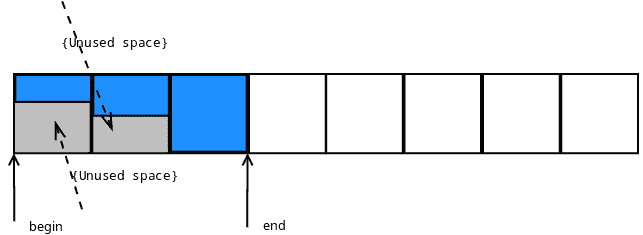

很明显，可能会浪费很多空间，这种方法必须进行优化。如果我们能够将可调用对象一个接一个地推入队列，而不考虑它们的实际大小，只需一点额外的空间开销（如v-table指针），这将帮助我们运行时检索对象的大小，并在可调用对象完成其工作后从这样的队列中移除适当数量的字节？

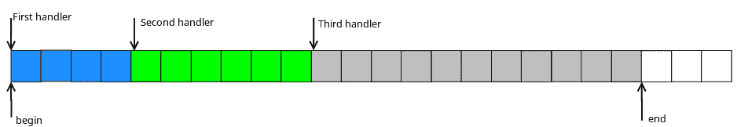

它看起来要好得多。空间消耗更加高效。

为了正确支持此类队列，我们必须：

1.  在调用每个处理程序时使用相同的接口实现多态行为。

1.  实现多态行为以检索单个处理程序的大小，以便知道在调用处理程序后需要从队列中移除多少字节。

1.  当推送的处理程序无法适应队列末尾和分配空间末尾之间的区域时，需要正确处理环绕情况。

所需类的代码将如下所示：

```cpp
class Task
{
public:
    virtual ~Task() {}

    virtual std::size_t getSize() const
    {
        return 1U;
    }

    virtual void exec() {}
};

template <typename TTask>
class TaskBound : public Task
{
public:

    // Size is minimal number of elements of size equal to sizeof(Task)
    // that will be able to store this TaskBound object
    static const std::size_t Size =
        ((sizeof(TaskBound<typename std::decay<TTask>::type>) - 1) /
                                                     sizeof(Task)) + 1;

    explicit TaskBound(const TTask& task)
      : task_(task)
    {
    }

    explicit TaskBound(TTask&& task)
      : task_(std::move(task))
    {
    }

    virtual ~TaskBound() {}

    virtual std::size_t getSize() const
    {
        return Size;
    }

    virtual void exec()
    {
        task_();
    }

private:
    TTask task_;
};
```

队列类型的定义将是：

```cpp
typedef typename
    std::aligned_storage<
        sizeof(Task),
        std::alignment_of<Task>::value
   >::type ArrayElemType;

static const std::size_t ArraySize = TSize / sizeof(Task);
typedef embxx::container::StaticQueue<ArrayElemType, ArraySize> Queue;
```

`TSize`是一个模板参数，指定队列存储区域的最大大小（以字节为单位）。

将新处理程序推送到队列的代码将如下所示：

```cpp
template <typename TTask>
bool addHandler(TTask&& task)
{
    typedef TaskBound<typename std::decay<TTask>::type> TaskBoundType;
    static_assert(
        std::alignment_of<Task>::value == std::alignment_of<TaskBoundType>::value,
        "Alignment of TaskBound must be same as alignment of Task");

    static const std::size_t requiredQueueSize = TaskBoundType::Size;

    auto placePtr = getAllocPlace(requiredQueueSize);
    if (placePtr == nullptr) {
        return false;
    }

    new (placePtr) TaskBoundType(std::forward<TTask>(task));
    return true;
}
```

注意，`getAllocPlace()`函数的职责是确保创建一个能够存储所需可调用对象的连续存储区域（通过调整队列大小），并返回该区域的指针。

```cpp
ArrayElemType* getAllocPlace(std::size_t requiredQueueSize)
{
    auto invalidIter = queue_.invalidIter();
    while (true)
    {
        if ((queue_.capacity() - queue_.size()) < requiredQueueSize) {
            return nullptr;
        }

        auto curSize = queue_.size();
        if (queue_.isLinearised()) {
            auto dist =
                static_cast<std::size_t>(
                    std::distance(queue_.arrayTwo().second, invalidIter));
            if ((0 < dist) && (dist < requiredQueueSize)) {
                queue_.resize(curSize + 1);
                auto placePtr = static_cast<void*>(&queue_.back());
                new (placePtr) Task();
                continue;
            }
        }

        queue_.resize(curSize + requiredQueueSize);
        return &queue_[curSize];
    }
}
```

在环绕的情况下，当队列末尾和其存储区域末尾之间没有足够的空间时，将推送一些什么也不做的简单`Task`对象（`exec()`函数的主体为空）来填充空间，直到存储区域的末尾，从而使队列非线性化，这反过来又允许在环形队列的第二半部分创建所需大小的连续区域。

事件处理循环将类似于以下内容：

```cpp
while (true) {
    ...
    // Get an access pointer to next handler
    auto taskPtr = reinterpret_cast<Task*>(&queue_.front());
    auto sizeToRemove = taskPtr->getSize();

    // Execute the handler while allowing interrutps
    enableInterrupts();
    taskPtr->exec();

    // Remove the handler information from the queue
    taskPtr->~Task();
    disableInterrupts();
    queue_.popFront(sizeToRemove);

    ...
}
```

剩下的唯一事情是创建一个方便且通用的接口，以便能够从中断和非中断上下文添加新的处理程序以执行。

#### 线程类比

在深入实现此类接口之前，我想将中断/非中断执行模式与两个线程之间的类比。线程间通信是通过锁（如[std::mutex](http://en.cppreference.com/w/cpp/thread/mutex)）和条件变量（如[std::condition_variable_any](http://en.cppreference.com/w/cpp/thread/condition_variable_any)）管理的。使用这个类比，处理程序执行循环（在非中断线程中执行）可以像这样实现：

```cpp
std::mutex lock_;
std::condition_variable_any cond_;
...

while (true) {
    lock_.lock();

    while (!queue_.isEmpty()) {
        auto taskPtr = reinterpret_cast<Task*>(&queue_.front());
        auto sizeToRemove = taskPtr->getSize();
        lock_.unlock();

        // Executed with interrupts enabled
        taskPtr->exec();
        taskPtr->~Task();

        lock_.lock();
        queue_.popFront(sizeToRemove);
    }

    // Still locked prior to wait
    cond_.wait(lock_);
    lock_.unlock();
}
```

从任何线程添加新的执行处理程序可以是：

```cpp
template <typename TTask>
bool addHandler(TTask&& task)
{
   std::lock_guard<decltype(lock_)> guard(lock_);
   ... // adding handler functionality
   cond_.notify_all(); // notify the condition variable
}
```

如果我们将中断和非中断执行模式视为两个线程，则非中断线程中的锁定相当于禁用中断；而等待条件变量被通知相当于等待中断（在ARM架构中使用`WFI`或`WFE`指令）而通知可以自动，因为挂起的中断或使用`SEV`指令实现。然而，我们的中断和非中断模式线程与传统的线程略有不同。非中断模式的线程可以随时被中断模式中断，而中断模式的“线程”不会被中断，实际上也不需要保护自己免受其他线程干预。

上文所述的非中断上下文中事件处理循环的整个逻辑是通用的，除了锁定（禁用中断）和等待新处理程序被添加（等待中断）这些是平台和架构特定的。正如我之前提到的，使用 C++ 而不是 C 进行裸机开发的整体想法是能够在提供最小平台特定硬件控制功能的同时编写和重用通用代码。`embxx` [库](https://github.com/arobenko/embxx) 提供了一个 [EventLoop](https://github.com/arobenko/embxx/blob/master/embxx/util/EventLoop.h) 类，它接受锁定和条件变量类作为模板参数，并在非中断上下文中管理新处理程序的安全添加和有序执行。

```cpp
The class definition looks like this:
template <std::size_t TSize, typename Tlock, typename TCond>
class EventLoop
{
    ...
};
```

`TLock` 类必须公开以下接口：

```cpp
class PlatformLock
{
public:
    // Locks out interrupt "thread". The function is called
    // in non-interrupt context
    void lock() {...}

    // Restore previous state changed by "lock()" function, i.e.
    // allow interrupts if they were disabled by lock().
    void unlock() {...}

    // Same as lock(), but will be called when new handler is about to
    // be added from interrupt handler. In normal case it should be an
    // empty function, unless the interrupts are prioritised and there
    // is a need to disable other interrupts from an interrupt handler
    void lockInterruptCtx() {...}

    // Same as unlock, but will be called in interrupt context. Should
    // also be empty function when interrupts are not prioritised.
    void unlockInterruptCtx() {...}
};
```

`TCond` 类必须公开以下接口：

```cpp
class PlatformCond
{
public:
    // Receives the reference to lockable object that is locked
    // (has lock() and unlock() member functions) and
    // responsible to release the lock if needed and wait for
    // notifications from other thread(s). After the notification
    // occurs it must re-acquire the lock prior to returning.
    template <typename TLock>
    void wait(TLock& lock) {...}

    // This function is used to notify condition that wait should
    // be terminated.
    void notify() {...}
};
```

对于树莓派平台此类类的示例，可以在此处找到：[这里](https://github.com/arobenko/embxx_on_rpi/blob/master/src/device/EventLoopDevices.h)。

```cpp
class InterruptLock
{
public:
    InterruptLock()
        : flags_(0) {}

    void lock()
    {
        __asm volatile("mrs %0, cpsr" : "=r" (flags_)); // store flags
        __asm volatile("cpsid i"); // disable interrupts
    }

    void unlock()
    {
        if ((flags_ & IntMask) == 0) {
            // Was previously enabled
            __asm volatile("cpsie i"); // enable interrupts
        }
    }

    void lockInterruptCtx()
    {
        // Nothing to do
    }

    void unlockInterruptCtx()
    {
        // Nothing to do
    }

private:
    volatile std::uint32_t flags_;
    static const std::uint32_t IntMask = 1U << 7;
};

class WaitCond
{
public:
    template <typename TLock>
    void wait(TLock& lock)
    {
        // no need to unlock (re-enable interrupts)
        static_cast<void>(lock);
        __asm volatile("wfi");
    }

    void notify()
    {
        // Nothing to do, pending interrupt will cause wfi
        // to exit even with interrupts disabled
    }
};
```

[EventLoop](https://github.com/arobenko/embxx/blob/master/embxx/util/EventLoop.h) 类公开以下接口：

```cpp
template <std::size_t TSize, typename Tlock, typename TCond>
class EventLoop
{
public:
    ...
    /// @brief Post new handler for execution.
    /// @details Acquires regular context lock. The task is added to
    ///          the execution queue. If the execution queue is empty
    ///          before the new handler is added, the condition
    ///          variable is signalled by calling its notify() member
    ///          function.
    /// @param[in] task R-value reference to new handler functor.
    /// @return true in case the handler was successfully posted,
    ///         false if there is not enough space in the execution
    ///         queue.
    template <typename TTask>
    bool post(TTask&& task);

    /// @brief Post new handler for execution from interrupt context.
    /// @details Acquires interrupt context lock. The task is added to
    ///          the execution queue. If the execution queue is empty
    ///          before the new handler is added, the condition variable
    ///          is signalled by calling its notify() member function.
    /// @param[in] task R-value reference to new handler functor.
    /// @return true in case the handler was successfully posted, false
    ///         if there is not enough space in the execution queue.
    template <typename TTask>
    bool postInterruptCtx(TTask&& task);

    /// @brief Event loop execution function.
    /// @details The function keeps executing posted handlers until
    ///          none are left. When execution queue becomes empty the
    ///          wait(...) member function of the condition variable
    ///          gets called to execute blocking wait for new handlers.
    ///          When new handler is added, the condition variable will
    ///          be signalled and blocking wait is expected to be
    ///          terminated to continue execution of the event loop.
    ///          This function never exits unless stop() was called to
    ///          terminate the execution. After stopping the main
    ///          loop, use reset() member function to enable the loop
    ///          to be executed again.
    void run();

    /// @brief Stop execution of the event loop.
    /// @details The execution may not be stopped immediately. If there
    ///          is an event handler being executed, the loop will be
    ///          stopped after the execution of the handler is finished.
    void stop();

    /// @brief Reset the state of the event loop.
    /// @details Clear the queue of registered event handlers and
    ///          resets the "stopped" flag to allow new event loop
    ///          execution.
    void reset();
}:
```

我将把上述函数的实现留给读者作为练习。不要忘记在向空队列添加新处理程序时调用条件变量的 `notify()` 成员函数。

如果需要，可以在此处找到参考实现：[这里](https://github.com/arobenko/embxx/blob/master/embxx/util/EventLoop.h)。

#### 忙循环

上文所述的事件循环是实现软实时系统的一种简单方便的方法。然而，此类架构的主要规则是：**不要执行忙循环**！这意味着，如果在进行下一阶段之前确实需要执行忙等待，可以通过让其他事件也被处理来实现。`EventLoop` 类还提供了一个 `busyWait()` 成员函数，它正是这样做的。

```cpp
template <std::size_t TSize, typename Tlock, typename TCond>
class EventLoop
{
public:
    ...
    /// @brief Perform busy wait.
    /// @details Executes busy wait while allowing other event handlers
    ///          posted by interrupt handlers being processed.
    /// @tparam TPred Predicate class type, must define
    ///         @code bool operator()(); @endcode
    ///         that return true in case busy wait must be terminated.
    /// @tparam TFunc Functor class that will be executed when wait is
    ///         complete. It must define
    ///         @code void operator()(); @endcode
    /// @param pred Any type of reference to predicate object
    /// @param func Any type of reference to "wait complete" function.
    /// @pre The event loop must have enough space to repost the call
    ///      to busyWait(). Note that there is no wait to notify the
    ///      caller if post operation fails. In debug compilation mode
    ///      there will be an assertion failure in case call to post()
    ///      returned false, in release compilation mode the failure
    ///      will be silent.
    template <typename TPred, typename TFunc>
    void busyWait(TPred&& pred, TFunc&& func)
    {
        if (pred()) {
            bool result = post(std::forward<TFunc>(func));
            GASSERT(result);
            static_cast<void>(result);
            return;
        }

        bool result = post(
            [this, pred, func]()
            {
                busyWait(std::move(pred), std::move(func));
            });
        GASSERT(result);
        static_cast<void>(result);
    }
};
```

### 设备-驱动程序-组件

现在，在理解了事件循环是什么以及如何在 C++ 中实现它之后，我想在进入实际示例之前，先描述一下 **设备-驱动程序-组件** 堆栈的概念。


**设备**是特定平台的外设控制层。有时它被称为 HAL - **硬件**抽象**层**。它有权访问特定平台的控制寄存器。其任务是实现上层**驱动程序**层所需的预定义接口，处理相关中断并通过回调将它们报告给**驱动程序**。

**驱动程序**是一个通用的平台无关层。其任务是接收来自**组件**层的异步操作请求并将其转发到**设备**。它还负责通过回调接收来自**设备**的中断通知，如果需要，对硬件事件进行最小处理，并使用[事件循环](#basic_concepts-event_loop)在非中断上下文中安排从**组件**执行适当的事件处理回调。

**组件**是一个通用或产品特定层，在事件循环（非中断）上下文中完全工作。它使用**驱动程序**启动异步操作，同时在事件循环上下文中提供当异步操作完成时被调用的回调对象。

对于任何异步事件处理，需要几个主要操作：

1.  开始操作。

1.  完成操作。

1.  取消操作。

1.  暂停操作。

1.  恢复挂起操作。

[外围设备](#peripherals-peripherals)章节中描述的所有外围设备都将遵循相同的操作方案，略有变化，例如有额外的参数或中间阶段。

#### 开始异步操作

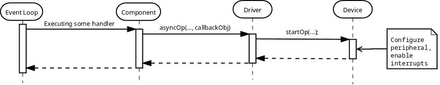

任何非中断上下文操作都是从[事件循环](#basic_concepts-event_loop)执行的事件处理器或从事件循环开始执行之前在`main()`函数中调用的处理器发起。正在执行的处理程序在某个**组件**中调用某个函数，该函数请求**驱动程序**执行某些异步操作，并提供在操作完成时执行的回调对象。**驱动程序**将提供的回调对象和其他参数存储在其内部数据结构中，然后将请求转发到**设备**，**设备**相应地配置硬件并启用所有必需的中断。

#### 完成异步操作

当适当的中断发生时，第一个意识到异步操作完成的是**设备**。它必须以某种方式向**驱动程序**报告完成。如前所述，**设备**是一个平台特定的层，位于**设备-驱动程序-组件**堆栈的底部，并且不了解使用它的通用**驱动程序**层。**设备**必须提供一种设置操作完成报告对象的方法。**驱动程序**通常在构造/初始化阶段分配此类对象：

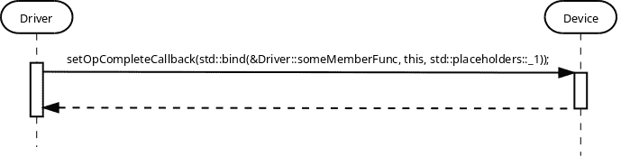

当预期的中断发生时，**设备**向**驱动程序**报告操作完成，驱动程序随后在非中断上下文中安排从**组件**执行回调对象，使用[事件循环](#basic_concepts-event_loop)。


注意，操作可能会失败，由于某些硬件故障，这就是为什么在两次回调调用中都有`status`参数报告成功和/或错误条件的原因。

#### 取消异步操作

必须能够取消正在进行的异步操作。例如，某些**组件**在某个硬件外围设备上激活异步操作请求的同时，向计时器发送异步等待请求以测量操作超时。如果首先调用超时回调，则需要取消挂起的异步操作。或者相反，一旦读取成功，应该取消超时测量。然而，取消可能有点棘手。异步事件处理的主要要求之一是**组件**的回调**必须**被调用，并且只**被调用一次**。这创造了一种情况，使得取消可能失败。例如，异步操作的回调被安排在事件循环中执行，但尚未被后者执行。这使我们有必要提供取消请求是否成功的指示。简单的布尔返回值就足够了。

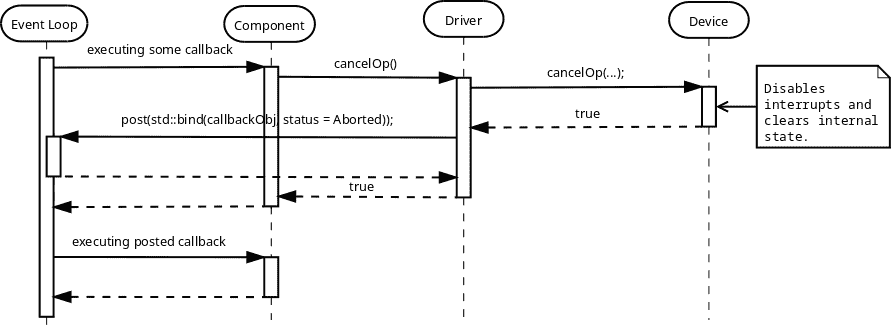

当取消操作成功时，**组件**的回调对象会被调用，`status`参数指定操作已被`中止`。

取消操作失败的一种可能情况是，当回调被安排在事件循环中执行时，但在尝试取消时尚未执行。在这种情况下，**驱动程序**知道没有挂起的异步操作，可以立即返回`false`。


取消操作失败的另一种可能情况是在取消请求过程中发生完成中断：

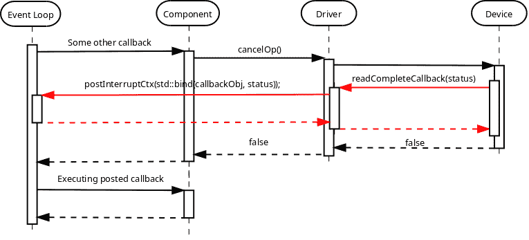

在这种情况下，**设备**必须能够适当地处理这种竞态条件，通过在检查完成回调是否执行之前暂时禁用中断。**驱动程序**还必须能够处理中断上下文中的非中断执行。

#### 暂停/恢复异步操作

可能存在一个 **Driver**，它需要同时支持多个异步操作，同时管理这些请求的内部队列并将它们逐个发送到 **Device**。在这种情况下，需要防止在事件循环（非中断）上下文中尝试访问内部数据结构时，在中断模式下调用“操作完成”回调。**Device** 必须提供 `suspendOp()` 和 `resumeOp()` 来抑制回调的调用，并允许其再次调用。通常，挂起意味着禁用中断而不停止当前操作，而恢复意味着重新启用它们。


注意，`suspendOp()` 请求还必须指示挂起是否成功，或者完成回调是否已经在中断模式下被调用，就像取消操作一样。在操作成功挂起后，它必须被**恢复**或**取消**。

#### **Device** 函数调用上下文

让我们考虑当 **Driver** 同时支持多个异步操作并内部排队，同时逐个向 **Device** 发送启动请求的情况。

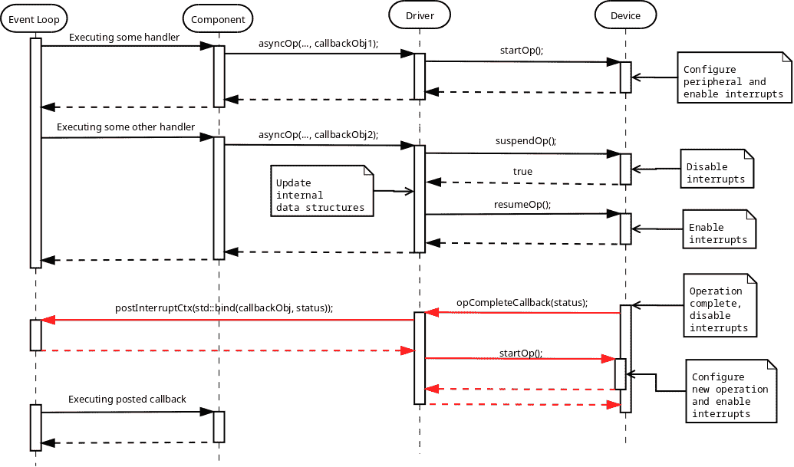

读者可能会注意到，**Device** 类的 `startOp()` 成员函数在事件循环（非中断）上下文中被调用，而第二次调用是在第一次操作完成报告后的中断上下文中。可能需要 **Device** 的实现来区分这些调用。

做到这一点的一种方法是有不同的名称，并让 **Driver** 根据当前的执行上下文使用它们：

```cpp
class MyDevice
{
public:
    void startOp();
    void startOpInterruptCtx();
}
```

另一种方法是使用 [tag dispatching idiom](http://www.generic-programming.org/languages/cpp/techniques.php#tag_dispatching)，我决定在 [embxx](https://github.com/arobenko/embxx) 库中使用它。

它在 [embxx/device/context.h](https://github.com/arobenko/embxx/blob/master/embxx/device/context.h) 中定义了两个额外的标签结构体：

```cpp
namespace embxx
{

namespace device
{

namespace context
{

// Event loop context tag class.
struct EventLoop {};

// Interrupt context tag class.
struct Interrupt {};

} // namespace context

} // namespace device

} // namespace embxx
```

然后，几乎由 **Device** 类定义的每个成员函数都必须指定额外的标签参数来指示上下文：

```cpp
class MyDevice
{
public:
    typedef embxx::device::context::EventLoop EventLoopCtx;
    typedef embxx::device::context::Interrupt InterruptCtx;

    void startOp(EventLoopCtx context)
    {
        static_cast<void>(context); // unused parameter
        ... // Perform operation when called in event loop context
    }

    void startOp(InterruptCtx context)
    {
        static_cast<void>(context); // unused parameter
        ... // Perform operation when called in interrupt context
    }
};
```

**Driver** 类将使用相关临时上下文对象作为最后一个参数调用 **Device** 函数：

```cpp
class MyDriver
{
public:
    typedef embxx::device::context::EventLoop EventLoopCtx;
    typedef embxx::device::context::Interrupt InterruptCtx;

    // Invoked by some Component object in Event Loop Context
    void asyncOp(...)
    {
        ...
        device_.startOp(EventLoopCtx());
        ...
    }

private:

   // Some registered event callback handler,
   // invoked in interrupt context
   void interruptCallbackHandler()
   {
       ...
       device_.startOp(InterruptCtx());
   }
};
```

如果某些函数需要在，比如说 `EventLoop` 上下文中调用，而不在 `Interrupt` 上下文中支持，那么只需要实现支持的变体就足够了。如果 **Driver** 层尝试使用不支持上下文标签参数调用该函数，编译将失败：

```cpp
class MyDevice
{
public:
    typedef embxx::device::context::EventLoop EventLoopCtx;

    void cancelOp(EventLoopCtx context)
    {
        static_cast<void>(context); // unused parameter
        ... // Cancel recent operation
    }
};
```

如果不需要区分函数被调用的上下文，那么统一它们相当简单：

```cpp
class SomeDevice
{
public:

    template <typename TContext>
    void startOp(TContext context)
    {
        static_cast<void>(context); // unused parameter
        startOpInternal();
    }

private:
    void startOpInternal()
    {
        ...
    }
};
```

#### 报告错误

当向**驱动程序**和/或**组件**发出异步操作请求时，必须有一种方式来报告操作的成功/失败状态，如果失败，则提供有关失败原因的一些额外信息。将此类信息作为回调函数对象的第一个参数是开发人员中广泛使用的一种约定。

在大多数情况下，错误代码的数值就足够了。

[embxx](https://github.com/arobenko/embxx)库在[embxx/error/ErrorCode.h](https://github.com/arobenko/embxx/blob/master/embxx/error/ErrorCode.h)中定义的枚举类中提供了一组这样的值：

```cpp
namespace embxx
{

namespace error
{

enum class ErrorCode
{
    Success, ///< Successful completion of operation.
    Aborted, ///< The operation was cancelled/aborted.
    BufferOverflow, /// The buffer is full with read termination condition being false
    HwProtocolError, ///< Hardware peripheral reported protocol error.
    Timeout, ///< The operation takes too much time.
    NumOfStatuses ///< Number of available statuses. Must be last
};

}  // namespace error

}  // namespace embxx
```

在`embxx::error::ErrorCode`周围还有一个包装类，称为`embxx::error::ErrorStatus`（在[embxx/error/ErrorStatus.h](https://github.com/arobenko/embxx/blob/master/embxx/error/ErrorStatus.h)中定义）：

```cpp
namespace embxx
{

namespace error
{

template <typename TErrorCode = ErrorCode>
class ErrorStatusT
{
public:
    /// @brief Error code enum type
    typedef TErrorCode ErrorCodeType;

    /// @brief Default constructor.
    /// @details The code value is 0, which is "success".
    ErrorStatusT();

    /// @brief Constructor
    /// @details This constructor may be used for implicit
    ///          construction of error status object out
    ///          of error code value.
    /// @param code Numeric error code value.
    ErrorStatusT(ErrorCodeType code);

    /// @brief Copy constructor is default
    ErrorStatusT(const ErrorStatusT&) = default;

    /// @brief Destructor is default
    ~ErrorStatusT() = default;

    /// @brief Copy assignment is default
    ErrorStatusT& operator=(const ErrorStatusT&) = default;

    /// @brief Retrieve error code value.
    const ErrorCodeType code() const;

    /// @brief boolean conversion operator.
    /// @details Returns true if error code is not equal 0,
    ///          i.e. any error will return true, success
    ///          value will return false.
    operator bool() const;

    /// @brief Same as !(static_cast<bool>(*this)).
    bool operator!() const;

private:
    ErrorCodeType code_;
};

typedef ErrorStatusT<ErrorCode> ErrorStatus;

}  // namespace error

}  // namespace embxx
```

这允许从`embxx::error::ErrorCode`到`embxx::error::ErrorStatus`的隐式转换，并在`if`语句中方便地评估是否发生了错误：

```cpp
embxx::error::ErrorStatus es;
GASSERT(!es); // No error
...
if (/* some condition */) {
    es = embxx::error::ErrorCode::BufferOverflow;
}
...
if (es) {
    ... // Error occurred, access the arror code by calling es.code()
}
```

按照惯例，任何在[embxx](https://github.com/arobenko/embxx)库中实现的**驱动程序**和/或**组件**提供的异步请求的回调函数都将接收`const embxx::error::ErrorStatus&`作为其第一个参数：

```cpp
void callback(const embxx::error::ErrorStatus& es, ... /* some other parameters */)
{
    if (es == embxx::error::ErrorCode::Aborted) {
        return; // Nothing to do
    }

    if (es) {
        ... // Error occurred
        return;
    }
    ... // Success
}
```

#### 合作

如上图所示，**驱动程序**必须能够访问**设备**以及**事件循环**对象。然而，前者并不知道后者的确切类型。为了编写完全通用的代码，必须将**设备**和**事件循环**类型作为模板参数提供：

```cpp
template <typename TDevice, typename TEventLoop>
class MyDriver
{
public:
    // During the construction store references to Device
    // and Event Loop objects.
    MyDriver(TDevice& device, TEventLoop& el)
      : device_(device),
        el_(el)
    {
    }

    ...

private:

    TDevice& device_;
    TEventLoop& el_;
};
```

**组件**只需要对**设备**和可能**事件循环**的访问。后者的引用可以从**设备**对象本身检索：

```cpp
template <typename TDevice, typename TEventLoop>
class MyDriver
{
public:
    TEventLoop& getEventLoop()
    {
        return el_;
    }

private:
    TEventLoop& el_;
};

template <typename TDriver>
class MyComponent
{
public:
    MyComponent(TDriver& driver)
      : driver_(driver)
    {
    }

    void someFunc()
    {
        auto& el = driver_.getEventLoop();
        el.post(...);
    }

private:
    TDriver& driver_;
};
```

#### 存储回调对象

**驱动程序**需要向**设备**提供一个回调对象，以便在适当的中断发生时调用。**组件**也提供了一个回调对象，在异步操作完成、取消或由于某些错误条件而终止时在非中断上下文中调用。这些回调对象需要存储在某个地方。在传统的C++中，最佳做法是使用[std::function](http://en.cppreference.com/w/cpp/utility/functional/function)。

```cpp
template <typename TDevice, typename TEventLoop>
class MyDriver
{
public:
    template <typename TFunc>
    void asyncOp(TFunc&& callbackObj)
    {
        callback_ = std::forward<TFunc>(callbackObj);
        ... // Start the operation
    }

private:
    typedef std::function<void embxx::error::ErrorStatus&> CallbackType;

    void opCompleteInterruptCallback(void embxx::error::ErrorStatus& es)
    {
        ... // Complete the operation
        el_.postInterruptCtx(std::bind(std::move(callback_), es));
    }

    EventLoop& el_;
    CallbackType callback_;
};
```

使用[std::function](http://en.cppreference.com/w/cpp/utility/functional/function)有两个问题：异常和动态内存分配。可以通过确保函数对象在没有正确分配对象的情况下永远不会被调用，并覆盖适当的`__throw_*`函数来移除异常处理代码从二进制图像中（在[异常](#compiler_output-exceptions)章节中描述）。然而，在这种情况下无法消除动态内存分配，这减少了**驱动程序**代码可以重用的裸机产品的数量，即它使得**驱动程序**类不是完全通用的。

通过将回调存储类型定义为**驱动程序**的模板参数来解决问题：

```cpp
template <typename TDevice,
          typename TEventLoop,
          typename TCallbackType>
class MyDriver
{
private:
    ...
    TCallbackType callback_;
};
```

对于允许动态内存分配的项目，可以传递 `std::function<…>`，对于其他项目，必须使用 `embxx::util::StaticFunction<…>` 或类似的。

## 外设

在本章中，我将描述并给出多个示例，说明如何在结合使用 [Device-Driver-Component](#basic_concepts-device_driver_component) 模型和 [事件循环](#basic_concepts-event_loop) 的同时驱动和控制多个硬件外设。

这里提供的所有通用、平台无关的代码都是作为 [embxx](https://github.com/arobenko/embxx) 库的一部分实现的，而平台（树莓派）特定的代码则来自 [embxx_on_rpi](https://github.com/arobenko/embxx_on_rpi) 项目。

所有平台特定的外设控制类都位于 [src/device](https://github.com/arobenko/embxx_on_rpi/tree/master/src/device) 目录中。

[src/app](https://github.com/arobenko/embxx_on_rpi/tree/master/src/app) 目录包含几个简单的应用程序，例如闪烁led或响应按钮按下。

应用程序之间还共享一些常见的**组件**类。它们位于 [src/component](https://github.com/arobenko/embxx_on_rpi/tree/master/src/component) 目录中。

为了编译所有应用程序，请遵循 [本书内容](#overview-contents) 中描述的说明。

### 函数配置

在ARM平台上，每个引脚都需要配置为gpio输入、gpio输出或具有微控制器支持的几种替代功能之一。定义在 [src/device/Function.h](https://github.com/arobenko/embxx_on_rpi/blob/master/src/device/Function.h) 和 [src/device/Function.cpp](https://github.com/arobenko/embxx_on_rpi/blob/master/src/device/Function.cpp) 中的 `device::Function` 类实现了简单的接口，允许每个**设备**类配置它使用的引脚。

```cpp
class Function
{
public:
    enum class FuncSel {
        Input,  // b000
        Output, // b001
        Alt5,   // b010
        Alt4,   // b011
        Alt0,   // b100
        Alt1,   // b101
        Alt2,   // b110
        Alt3    // b111
    };

    typedef unsigned PinIdxType;

    static const std::size_t NumOfLines = 54;

    void configure(PinIdxType idx, FuncSel sel);
};
```

每个实现的**设备**类在其构造函数中都将接收到对 `Function` 对象的引用，并将必须使用它来配置所需的引脚。

### 中断管理

还有一个所有**设备**都会使用的组件。它是定义在 [src/device/InterruptMgr.h](https://github.com/arobenko/embxx_on_rpi/blob/master/src/device/InterruptMgr.h) 中的 `device::InterruptMgr`。这个类对象的 主要职责是控制全局级别的中断，从各种**设备**中注册中断处理程序，并在发生中断时调用适当的处理程序。

`device::InterruptMgr` 的接口定义如下：

```cpp
template <typename THandler = embxx::util::StaticFunction<void ()> >
class InterruptMgr
{
public:
    typedef THandler HandlerFunc;
    enum IrqId {
        IrqId_Timer,
        IrqId_AuxInt,
        IrqId_Gpio1,
        IrqId_Gpio2,
        IrqId_Gpio3,
        IrqId_Gpio4,
        IrqId_I2C,
        IrqId_SPI,
        IrqId_NumOfIds // Must be last
    };

    InterruptMgr();

    template <typename TFunc>
    void registerHandler(IrqId id, TFunc&& handler);

    void enableInterrupt(IrqId id);

    void disableInterrupt(IrqId id);

    void handleInterrupt();

private:
    typedef std::uint32_t EntryType;

    struct IrqInfo {
        ... // Contains interrupt related information
            // per single IrqId
    };

    typedef std::array<IrqInfo, IrqId_NumOfIds> IrqsArray;

    IrqsArray irqs_;
};
```

每个驱动程序都将使用 `registerHandler()` 成员函数来注册其成员函数作为其 `IrqId` 的处理程序。`enableInterrupt()` 和 `disableInterrupt()` 也被**设备**对象用于控制其在全局级别上的中断。

为了使用上面描述的**中断管理器**，每个应用程序都必须实现适当的中断处理程序，该处理程序将检索`device::InterruptMgr`对象的引用（通过全局/静态变量）并调用其`handleInterrupt()`函数，该函数反过来检查适当的寄存器状态并调用已注册的处理程序。请注意，处理程序将在中断上下文中执行。

代码看起来可能像这样：

```cpp
extern "C"
void interruptHandler()
{
    System::instance().interruptMgr().handleInterrupt();
}
```

也可能需要通过在`CPS`寄存器中切换`i`标志来启用/禁用所有中断。同一[src/device/InterruptMgr.h](https://github.com/arobenko/embxx_on_rpi/blob/master/src/device/InterruptMgr.h)文件提供了两个用于此目的的函数：

```cpp
namespace device
{

namespace interrupt
{

inline
void enable()
{
    __asm volatile("cpsie i");
}

inline
void disable()
{
    __asm volatile("cpsid i");
}

}  // namespace interrupt

}  // namespace device
```

### 计时器

在裸机开发中，通常在第一个应用程序中闪烁LED（而不是编写“Hello world”）。然而，大多数教程展示了如何使用循环同步等待一段时间，然后改变LED的状态。我将描述如何使用计时器中断结合[事件循环](#basic_concepts-event_loop)异步地完成它。

几乎每个嵌入式平台通常都有一个或两个计时器外设。这样的外设可以被编程在一段时间后提供中断。然而，可能需要多个计时器，它们可以在同一时间独立激活。很明显，应该有一个实体接收来自各种**组件**的非中断上下文中的所有等待请求，然后在内部排队等待请求，编程计时器外设在一段时间后提供中断，并最终通过回调在非中断（事件循环）上下文中向适当的**组件**报告完成。

这样的实体可以是一个通用的（平台无关的）**驱动程序**，如果它提供了平台特定的**设备**对象，该对象公开一些预定义的公共接口并控制实际的平台特定硬件。


异步计时器事件处理遵循在[设备驱动组件](#basic_concepts-device_driver_component)章节中描述的相同模式。

#### 分配等待完成回调

正如[设备驱动组件](#basic_concepts-device_driver_component)章节中描述的那样，**驱动程序**需要提供当计时器中断发生时被调用的“等待完成”回调对象。分配通常在**驱动程序**的初始化/构造阶段进行：


#### 开始异步等待

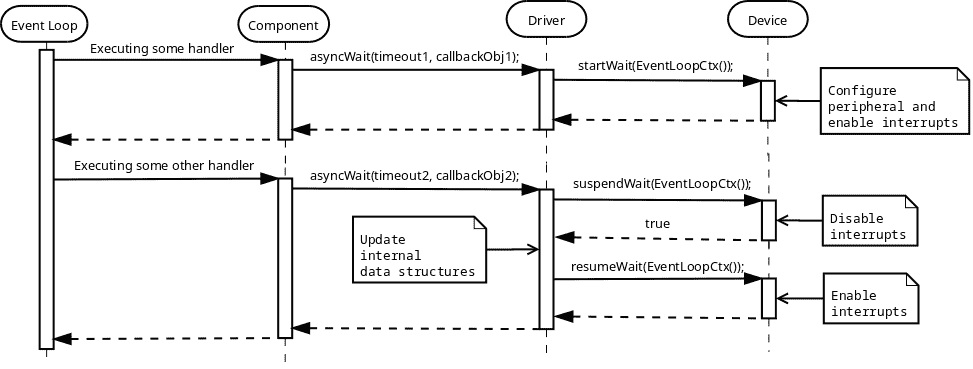

**驱动程序**必须能够支持来自各种**组件**的多个等待请求，并相应地管理内部队列。在上面的图表中，定时器外设是在第一次`asyncWait()`请求上激活的。当发出第二个请求时（假设`timeout1 < timeout2`且现有的等待不应停止），**驱动程序**必须防止在中断上下文中报告当前计划好的计时器倒计时的完成，同时干扰内部数据结构的更新。通过调用**设备**的`suspendWait()`成员函数来禁用中断。对`suspendWait()`的调用返回`true`，这意味着中断已成功禁用，可以安全地更新内部数据结构。如果对`suspendWait()`的调用返回`false`，则表示中断已经发生，没有正在进行的等待，即第二个`asyncWait()`实际上成为新序列中的第一个。

也可能存在`timeout2 < timeout1`的情况，这意味着必须重新评估超时请求的顺序，并重新编程新的等待。

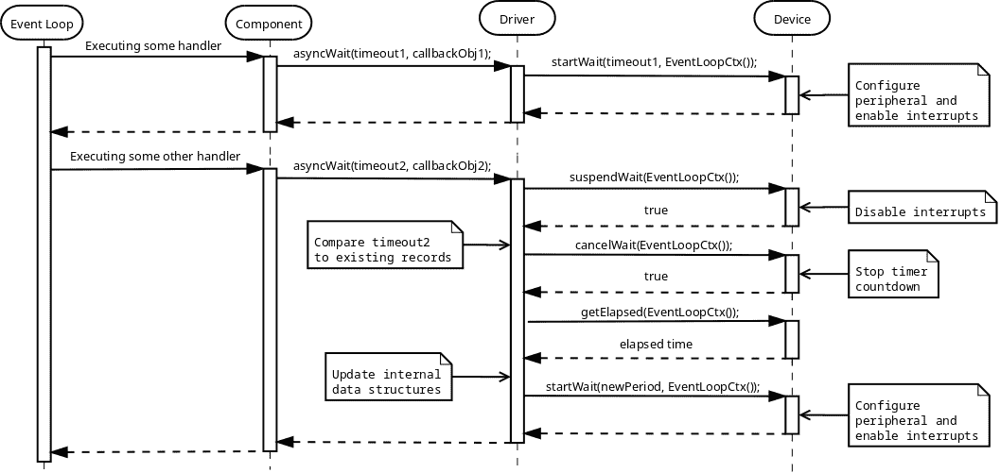

**驱动程序**必须能够取消现有的计时器倒计时，评估自第一次请求以来经过的时间，评估新的值以重新编程计时器**设备**倒计时。

#### 完成异步等待

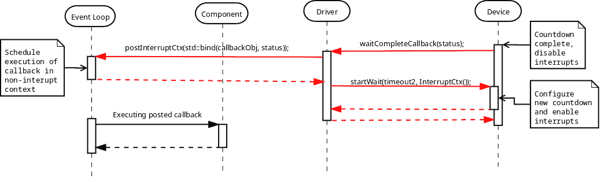

由于**驱动程序**可能接收到多个独立的等待请求，它必须在中断模式下运行时重新编程下一个等待（如果存在）。请注意传递给**设备**的`startWait()`成员函数的`InterruptCtx()`标签参数。它表示请求是在中断上下文中执行的，而相同的请求使用`EventLoopCtx()`作为标签参数来指定调用是在事件循环（非中断）上下文中执行的。

#### 取消异步等待

如果有请求取消当前正在执行的等待，**驱动程序**必须接收到关于已过时间的通知，并在存在的情况下重新编程下一个等待。

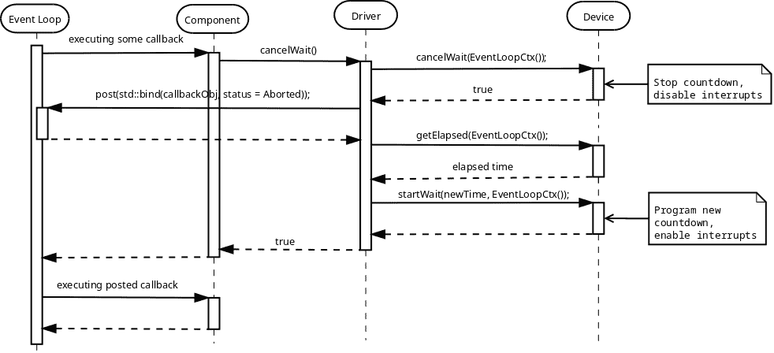

如果取消请求是针对某些尚未转发到**设备**的其他等待，**驱动程序**只需更新其内部数据结构，而无需取消当前正在执行的计时器倒计时。

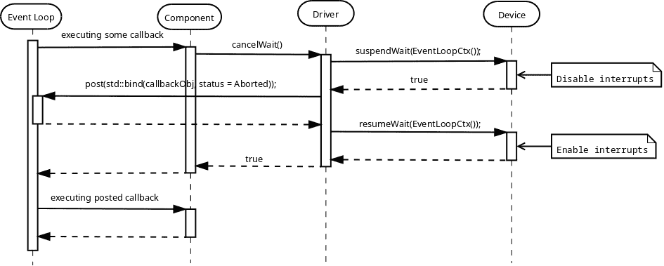

取消等待的不成功尝试与[设备-驱动-组件](#basic_concepts-device_driver_component)章节中描述的方式完全相同。


#### 识别等待请求

显然，需要有一种方式来识别等待请求，以便能够在保持其余请求在等待队列中的同时取消某些特定请求。一种方法是在取消请求期间使用某种类型的句柄：

```cpp
class MyTimerDriver
{
public:
    typedef ... Handle;

    Handle asyncWait(...);

    void cancelWait(Handle handle);
};
```

另一种方法是将句柄隐藏在某个包装类中，这使得使用它更加安全：

```cpp
class MyTimerDriver
{
public:

    typedef ... Handle;

    class Timer
    {
    public:
        Timer(MyTimerDriver& mgr, Handle handle)
          : mgr_(mgr),
            handle_(handle)
        {
        }

        ~Timer()
        {
            ... // Invalidate the allocated handle
        }

        void asyncWait(...)
        {
            mgr_.asyncWait(handle_, ...)
        }

        void cancelWait()
        {
            mgr_.cancelWait(handle_);
        }

    private:
	MyTimerDriver& mgr_;
        Handle handle_;
    };

    Timer allocTimer()
    {
        auto someHandle = ...;
        return Timer(*this, someHandle)
    }

private:

    friend class TimerMgr::Timer;

    void asyncWait(Handle handle, ...);

    void cancelWait(Handle handle);
};
```

**Driver**本身只有一个公共函数`allocTimer()`。它用于分配`Timer`对象。所有等待和/或取消请求都直接向这个定时器对象发出，该对象被声明为**Driver**类的`friend`，即它能够使用其句柄调用后者的私有函数。`Timer`的析构函数确保句柄被正确地无效化。

```cpp
MyTimerDriver driver(...);
auto timer = driver.allocTimer();
timer.asyncWait(...);
...
timer.cancelWait();
...
```

第二种方法比第一种方法更安全，并且在[embxx](https://github.com/arobenko/embxx)库中实现了此类通用“定时器管理Driver”。

#### 指定等待时长

定时器**Device**是平台特定的。某些平台可能支持微秒级的等待时长粒度，而其他平台只能达到毫秒级。这通常取决于系统时钟速度。然而，当使用通用**Driver**和/或**Component**时，需要能够编写与平台无关的代码，该代码能够执行指定时长等待，而不管使用的**Device**是什么。C++11标准的**标准模板库（STL**）提供了方便的[日期和时间实用工具](http://en.cppreference.com/w/cpp/chrono)，使得这种使用成为可能。

如果**Device**使用[std::chrono::duration](http://en.cppreference.com/w/cpp/chrono/duration)类型声明最小等待时长单位，**Driver**可以使用[std::chrono::duration_cast](http://en.cppreference.com/w/cpp/chrono/duration/duration_cast)将请求的等待时长转换为支持的时长单位。

```cpp
class MyTimerDevice
{
public:
    typedef std::chrono::duration<unsigned, std::milli>
                                                WaitTimeUnitDuration;

    typedef embxx::device::context::EventLoop EventLoopCtx;

    void startWait(WaitTimeUnitDuration::rep count, EventLoopCtx) {...}
    ...
};
```

在上面的示例中，最小支持的时长单位（`WaitTimeUnitDuration`）被声明为1毫秒。请注意，`startWait()`成员函数期望接收等待单元的数量，即毫秒作为其第一个参数。

然后可以像这样定义**Driver**类的`asyncWait()`成员函数：

```cpp
template <typename TDevice, ...>
class MyTimerDriver
{
public:
    typedef typename TDevice::WaitTimeUnitDuration WaitTimeUnitDuration
    class Timer
    {
    public:
        template <typename TRep, typename TPeriod, typename TFunc>
        void asyncWait(
            const std::chrono::duration<TRep, TPeriod>& waitTime,
            TFunc&& func)
        {
            auto castedWaitDuration =
                std::chrono::duration_cast<WaitTimeUnitDuration>(waitTime);
            auto waitUnits = castedWaitDuration.count();
            ... // Call the asyncWait() of the driver with waitUnits as
                // first parameter.
        }

    };
};
```

在上面的示例中，下面的调用将正确调整时长，并使用任何**Device**测量相同的超时时间，无论后者在其`startWait()`成员函数中期望的是毫秒还是微秒。

```cpp
timer.asyncWait(std::chrono::seconds(5), ...);
```

如果开发者在**Driver**只支持毫秒级粒度的情况下尝试执行几个微秒的等待，编译将失败。

```cpp
timer.asyncWait(std::chrono::microseconds(5), ...);
```

#### Driver实现

定时器管理**Driver**是一个通用层。它必须在任何平台上与任何暴露正确接口的定时器**Device**对象一起工作。

这样的 **驱动程序** 已经在 [embxx](https://github.com/arobenko/embxx) 库中作为 `embxx::driver::TimerMgr` 实现，位于 [embxx/driver/TimerMgr.h](https://github.com/arobenko/embxx/blob/master/embxx/driver/TimerMgr.h)，而平台特定（树莓派）外设控制对象在 [embxx_on_rpi](https://github.com/arobenko/embxx_on_rpi) 项目中作为 `device::Timer` 实现，位于 [src/device/Timer.h](https://github.com/arobenko/embxx_on_rpi/blob/master/src/device/Timer.h)。

`embxx::driver::TimerMgr` 的定义如下：

```cpp
template <typename TDevice,
          typename TEventLoop,
          std::size_t TMaxTimers,
          typename TTimeoutHandler = embxx::util::StaticFunction<void (const embxx::error::ErrorStatus&)> >
class TimerMgr
{
public:
    TimerMgr(TDevice& device, TEventLoop& el);
      : device_(device),
        el_(el)
    {
        ...
    }

    ...

private:
    struct TimerInfo {
        TTimeoutHandler handler_; //
        ...;                      // Some other internal data
    }

    // Internal data structures to track all the scheduled
    // wait requests.
    std::array<TimerInfo, TMaxTimers> infos_;

    TDevice& device_;
    TEventLoop& el_;
    ...
};
```

`TDevice` 模板参数是定时器外设的平台特定控制类。

`TEventLoop` 模板参数是 [事件循环](#basic_concepts-event_loop) 的类。

`TMaxTimers` 模板参数指定了 `TimerMgr` 将能分配的最大定时器对象数量。此参数是必需的，因为 `embxx::driver::TimerMgr` 是设计用于没有动态内存分配的系统。如果允许动态内存分配，那么在不限定的条件下实现类似功能就相当容易了。

`TTimeoutHandler` 模板参数指定了超时回调对象的类型。此对象必须具有 `void (const embxx::error::ErrorStatus&)` 签名，并暴露类似于 [std::function](http://en.cppreference.com/w/cpp/utility/functional/function) 或 `embxx::util::StaticFunction` 的接口。

`embxx::driver::TimerMgr` 提供以下公共接口：

```cpp
template <...>
class TimerMgr
{
public:
    class Timer
    {
    public:
        // Destructor, removes Timer record from internal
        // data structures of TimerMgr
        ~Timer() {...}

        // Activates asyncrhonous wait
        void asyncWait(...) {...}

        // Cancels scheduled asynchronous wait
        void cancel() {...}
    };

    // Allocate timer object
    Timer allocTimer() {...}

private:
    // Allows usage of non-exposed private functions of
    // TimerMgr
    friend class TimerMgr::Timer;
    ...
};
```

读者可能会注意到 `embxx::driver::TimerMgr` 仅公开了一个函数：`Timer allocTimer();`。此函数返回一个简单的 `TimerMgr::Timer` 对象，可用于安排新的等待以及取消之前的等待请求。此外，请注意 `TimerMgr::Timer` 类被声明为 `TimerMgr` 的 `friend`。这是为了允许从 `TimerMgr::Timer` 无缝地将等待/取消请求委托给 `TimerMgr`，后者负责管理多个同时进行的等待请求并将它们逐个委托给实际的硬件控制对象。

然后，LED闪烁应用程序（在 [src/app/app_led_flash](https://github.com/arobenko/embxx_on_rpi/tree/master/src/app/app_led_flash) 中实现）可以像下面的代码一样简单：

```cpp
namespace
{

const auto LedChangeStateTimeout = std::chrono::milliseconds(500);

template <typename TTimer>
void ledOff(
    TTimer& timer,
    System::Led& led);

template <typename TTimer>
void ledOn(
    TTimer& timer,
    System::Led& led)
{
    led.on();

    timer.asyncWait(
        LedChangeStateTimeout,
        [&timer, &led](const embxx::error::ErrorStatus& status)
        {
            static_cast<void>(status);
            ledOff(timer, led);
        });
}

template <typename TTimer>
void ledOff(
    TTimer& timer,
    System::Led& led)
{
    led.off();

    timer.asyncWait(
        std::chrono::milliseconds(LedChangeStateTimeout),
        [&timer, &led](const embxx::error::ErrorStatus& status)
        {
            static_cast<void>(status);
            ledOn(timer, led);
        });
}

}  // namespace

int main() {
    // Get reference to TimerMgr object
    auto& system = System::instance();
    auto& timerMgr = system.timerMgr();

    // Allocate timer
    auto timer = timerMgr.allocTimer();

    // Start flashing with initial state to be OFF
    device::interrupt::enable();
    ledOff(timer, led);

    // Run the event loop
    auto& el = system.eventLoop();
    el.run();

    GASSERT(0); // Mustn't exit
    return 0;
}
```

#### 平台特定定时器设备

如前所述，`embxx::driver::TimerMgr` 是一个通用的 **驱动程序** 类，它执行了管理调度独立等待请求的大部分工作。它需要来自底层定时器 **设备** 对象的支持来编程代码运行的平台上的实际硬件。`embxx::driver::TimerMgr` 定义为接收 **设备** 类作为模板参数，以及在构造函数中接收对 **设备** 定时器对象的引用。**驱动程序** 不了解确切的 **设备** 类型，但期望它暴露某些公共接口：

```cpp
template <typename TDevice, typename TEventLoop, ...>
class TimerMgr
{
public:
    TimerMgr(TDevice& device, TEventLoop& el);
    ...
};
```

定时器控制 **设备** 类必须公开以下公共接口：

1.  将`WaitTimeUnitDuration`类型定义为[std::chrono::duration](https://en.cppreference.com/w/cpp/chrono/duration)的变体，该类型指定了**设备**支持的单一等待单元的持续时间。

    ```cpp
    typedef std::chrono::duration<...> WaitTimeUnitDuration;
    ```

1.  设置从定时器中断调用的回调对象的函数：

    ```cpp
    template <typename TFunc>
    void setWaitCompleteCallback(TFunc&& func);
    ```

1.  在事件循环（非中断）和中断上下文中启动定时器倒计时的函数：

    ```cpp
    void startWait(
        WaitTimeUnitDuration::rep waitTime, // num of wait units
        embxx::device::context::EventLoop context);
    void startWait(
        WaitTimeUnitDuration::rep waitTime, // num of wait units
        embxx::device::context::Interrupt context);
    ```

1.  在事件循环（非中断）上下文中取消定时器倒计时的函数。如果等待实际上被取消，则该函数必须返回true，如果没有等待正在进行，则返回false。

    ```cpp
    bool cancelWait(embxx::device::context::EventLoop context);
    ```

1.  在事件循环（非中断）上下文中挂起倒计时（在实际的等待倒计时未停止时禁用中断）的函数。如果等待实际上被挂起，则该函数必须返回true，如果没有等待正在进行，则返回false。对该函数的调用将跟随`resumeWait()`或`cancelWait()`。

    ```cpp
    bool suspendWait(embxx::device::context::EventLoop context);
    ```

1.  在事件循环（非中断）上下文中恢复倒计时的函数。

    ```cpp
    void resumeWait(embxx::device::context::EventLoop context);
    ```

1.  获取最后一次执行等待的已过时间的函数。它将在`cancelWait()`之后立即被调用。

    ```cpp
    WaitTimeUnitDuration::rep getElapsed(embxx::device::context::EventLoop context) const;
    ```

对于Raspberry Pi平台，此类定时器的定义和实现可以在[embxx_on_rpi](https://github.com/arobenko/embxx_on_rpi)项目的[src/device/Timer.h](https://github.com/arobenko/embxx_on_rpi/blob/master/src/device/Timer.h)文件中找到。

### UART

我们的下个阶段将是通过UART接口支持调试日志记录。在传统的C++中，日志记录是通过使用[printf](http://en.cppreference.com/w/cpp/io/c/fprintf)函数或[输出流](http://en.cppreference.com/w/cpp/io/basic_ostream)（例如[std::cout](http://en.cppreference.com/w/cpp/io/cout)或[std::cerr](http://en.cppreference.com/w/cpp/io/cerr)）来执行的。

如果使用`printf`，则编译可能在链接阶段失败，并出现以下错误：

```cpp
/usr/bin/../lib/gcc/arm-none-eabi/4.8.3/../../../../arm-none-eabi/lib/libc.a(lib_a-sbrkr.o): In function `_sbrk_r':
sbrkr.c:(.text._sbrk_r+0x18): undefined reference to `_sbrk'
/usr/bin/../lib/gcc/arm-none-eabi/4.8.3/../../../../arm-none-eabi/lib/libc.a(lib_a-writer.o): In function `_write_r':
writer.c:(.text._write_r+0x20): undefined reference to `_write'
/usr/bin/../lib/gcc/arm-none-eabi/4.8.3/../../../../arm-none-eabi/lib/libc.a(lib_a-closer.o): In function `_close_r':
closer.c:(.text._close_r+0x18): undefined reference to `_close'
/usr/bin/../lib/gcc/arm-none-eabi/4.8.3/../../../../arm-none-eabi/lib/libc.a(lib_a-fstatr.o): In function `_fstat_r':
fstatr.c:(.text._fstat_r+0x1c): undefined reference to `_fstat'
/usr/bin/../lib/gcc/arm-none-eabi/4.8.3/../../../../arm-none-eabi/lib/libc.a(lib_a-isattyr.o): In function `_isatty_r':
isattyr.c:(.text._isatty_r+0x18): undefined reference to `_isatty'
/usr/bin/../lib/gcc/arm-none-eabi/4.8.3/../../../../arm-none-eabi/lib/libc.a(lib_a-lseekr.o): In function `_lseek_r':
lseekr.c:(.text._lseek_r+0x20): undefined reference to `_lseek'
/usr/bin/../lib/gcc/arm-none-eabi/4.8.3/../../../../arm-none-eabi/lib/libc.a(lib_a-readr.o): In function `_read_r':
readr.c:(.text._read_r+0x20): undefined reference to `_read'
collect2: error: ld returned 1 exit status
```

一旦这些函数用空体填充，编译将成功，但映像大小将相当大（约45KB）。

`_sbrk`函数是支持动态内存分配所必需的。`printf`函数可能使用`malloc()`来分配一些临时缓冲区。如果我们打开汇编列表文件，我们将看到对`<malloc>`和`<free>`的调用。

`_write`函数用于将字符写入标准输出控制台，这在嵌入式产品中不存在。开发者必须使用此函数实现将所有提供的字符写入UART串行接口。许多开发者以直接同步的方式实现此函数，使用忙等待循环：

```cpp
extern "C" int _write(int file, char *ptr, int len)
{
    int count = len;
    if (file == 1) { // stdout
        while (count > 0) {
            while (... /* poll the status bit */) {} // just wait
            TX_REG = *ptr;
            ++ptr;
            --count;
        }
    }
    return len;
}
```

在这种情况下，对`printf`函数的调用将是阻塞的，并且不会返回，直到所有字符逐个写入UART，这需要大量的执行时间。这种方法适用于快速且简单的调试，但当项目增长时将很快变得不切实际。

为了使 `printf` 的执行快速，必须有一种中断驱动的组件，负责缓冲所有提供的字符，并使用“**TX缓冲寄存器空闲**”这类中断异步逐个将它们转发到UART。

使用 `printf` 进行日志记录的一个缺点是需要指定打印变量的输出格式：

```cpp
std::int32_t i = ...; // some value
printf("Value = %d\n");
```

如果打印变量的类型发生变化，开发者必须记得更新格式字符串中的类型。这也是为什么许多C++开发者更喜欢使用流而不是 `printf` 的原因：

```cpp
std::int32_t i = ...; // some value
std::cout << "Value = " << i << std::endl;
```

即使打印变量的类型发生变化，编译器也会生成对适当的重载 `operator<<` 的调用，值将被正确打印。开发者还必须实现缺失的 `_write` 函数，以便将提供的字符写入某个地方（在我们的例子中是UART接口）。

然而，在裸机开发中使用C++流通常不是一个选择。它们使用异常来处理错误情况，以及[区域设置](http://en.cppreference.com/w/cpp/locale/locale)来进行格式化。使用 [GNU Tools for ARM Embedded Processors](https://launchpad.net/gcc-arm-embedded) 编译器编译简单的输出语句，生成的映像大小超过500KB。

总结上述所有内容，使用标准的 [printf](http://en.cppreference.com/w/cpp/io/c/fprintf) 函数或 [输出流](http://en.cppreference.com/w/cpp/io/basic_ostream) 进行调试日志记录可能存在问题，尤其是在内存较小且不允许使用动态内存分配和异常的系统。我们的最终目标将是创建一个标准输出流接口，用于调试日志记录，同时使用 [Device-Driver-Component](#basic_concepts-device_driver_component) 模型和 [事件循环](#basic_concepts-event_loop)，其中大部分代码是通用的，只有一小部分是针对管理写入UART接口的单个字符的平台特定部分。

在UART接口上的异步读写操作与前面在[设备驱动组件](#basic_concepts-device_driver_component)章节中描述的通用编程和处理异步事件的方式非常相似。

#### 向UART写入

**阶段1** - 在事件循环（非中断）上下文中，从**组件**层向**驱动程序**发送异步缓冲写入请求。

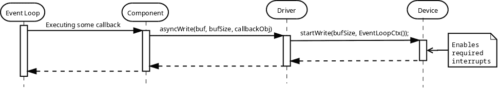

**组件**调用**驱动器**的`asyncWrite()`成员函数，并提供缓冲区的指针、缓冲区的大小以及写入完成后要调用的回调对象。`asyncWrite()`函数需要能够接收任何类型的可调用对象，例如[std::bind](http://en.cppreference.com/w/cpp/utility/functional/bind)表达式或[lambda函数](http://en.cppreference.com/w/cpp/language/lambda)。为了实现这一点，函数必须是模板化的：

```cpp
class CharacterDriver
{
public:
    typedef ... CharType;

    template <typename TCallbackFunc>
    void asyncWrite(
        const CharType* buf,
        std::size_t bufSize,
        TCallbackFunc&& func);
};
```

根据之前提到的约定[基本概念-设备驱动组件](#basic_concepts-device_driver_component)，回调必须接收操作是否成功的错误状态作为其第一个参数。在缓冲区上执行异步操作时，可能需要知道在错误发生之前已读取/写入了多少字符，以防操作未成功。为此，此类回调对象必须接收已写入的字节数作为第二个参数，即暴露`void (const embxx::error::ErrorStatus& err, std::size_t bytesTransferred)`签名。

当**驱动器**收到异步操作请求时，它将请求转发给**设备**，让后者知道在整个过程中将写入多少字节。请注意，**驱动器**使用`embxx::device::context::EventLoop`标签参数来指定**设备**的`startWrite()`成员函数在事件循环（非中断）上下文中被调用。**设备**对象的任务是启用适当的中断并立即返回。一旦发生中断，数据写入的阶段就开始了。

**阶段2** - 写入提供的数据。

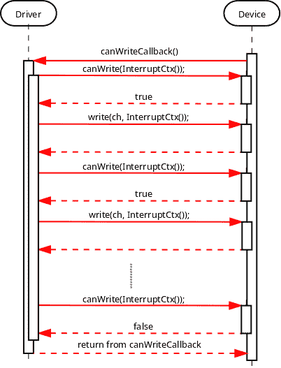

一旦发生“TX可用”中断，**设备**必须让**驱动器**知道。显然，必须涉及某种回调，**驱动器**必须在构建/初始化阶段提供该回调。让我们假设此时这种分配已成功完成，并且**设备**能够成功通知**驱动器**，可以写入外围的TX FIFO字符。

当**驱动器**收到此类通知时，它尝试写入尽可能多的字符：

```cpp
typedef embxx::device::context::Interrupt InterruptContext;

void canWriteCallback()
{
    // Executed in interrupt context, must be quick
    while(device_.canWrite(InterruptContext())) {
        if ((writeBufStart_ + writeBufSize_) <= currentWriteBufPtr_) {
            break;
        }

        device_.write(*currentWriteBufPtr_, InterruptContext());
        ++currentWriteBufPtr_;
    }
}
```

这是因为当“TX可用”中断发生时，可能有多个字符可以发送，而不仅仅是单个字符。在循环中进行检查和写入可以节省许多CPU周期。

请注意，所有这些调用都是在中断上下文中执行的。它们在上面的图片中被标记为红色。

一旦底层**设备**的Tx FIFO已满或没有更多字符可以写入，回调返回。上述整个周期将在每个“TX可用”中断上重复，直到整个提供的缓冲区被发送到**设备**进行写入。

**阶段3** - 通知调用者完成情况：

一旦整个缓冲区被发送到 **设备** 进行写入，**驱动程序** 意识到将不再执行更多写入操作。然而，它不会报告完成，直到 **设备** 本身调用适当的回调指示操作确实已完成。将识别操作何时完成的职责转移到 **设备** 将在稍后需要时需要，那时我们希望重用相同的 **驱动程序** 用于 [I2C](#peripherals-i2c) 和 [SPI](#peripherals-spi) 外设。在所有先前操作中的字符都已写入后，了解外设内部 Tx FIFO 是否为空将非常重要。


一旦 **驱动程序** 从 **设备**（仍在中断上下文中）收到通知，表示写入操作已完成，它将使用 [std::bind](http://en.cppreference.com/w/cpp/utility/functional/bind) 表达式将提供的回调对象与错误状态和实际传输的字节数捆绑在一起，并将可调用对象发送到 [事件循环](#basic_concepts-event_loop) 以在事件循环（非中断）上下文中执行。

#### 从 UART 读取

从 UART 的读取操作以非常相似的方式进行。

**阶段1** - 从 **组件** 层向事件循环（非中断）上下文中的 **驱动程序** 发送异步缓冲区读取请求。


**驱动程序** 的 `asyncRead()` 成员函数应允许回调为任何类型的可调用对象（但当然必须暴露预定义的签名）。

```cpp
class CharacterDriver
{
public:
    typedef ... CharType;

    template <typename TCallbackFunc>
    void asyncRead(
        CharType* buf,
        std::size_t bufSize,
        TCallbackFunc&& func);
};
```

**阶段2** - 将数据读取到缓冲区中。


回调的实现可能如下：

```cpp
 void canReadCallback()
    {
        while(device_.canRead(InterruptContext())) {
            if ((readBufStart_ + readBufSize_) <= currentReadBufPtr_) {
                break;
            }

            auto ch = device_.read(InterruptContext());
            *currentReadBufPtr_ = ch;
            ++currentReadBufPtr_;
        }
    }
```

**阶段3** - 通知调用者完成：

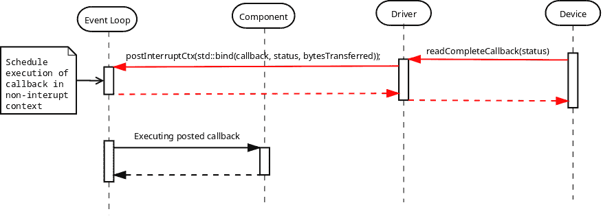

#### 取消异步操作

取消流程与 [Device-Driver-Component](#basic_concepts-device_driver_component) 章节中描述的非常相似：

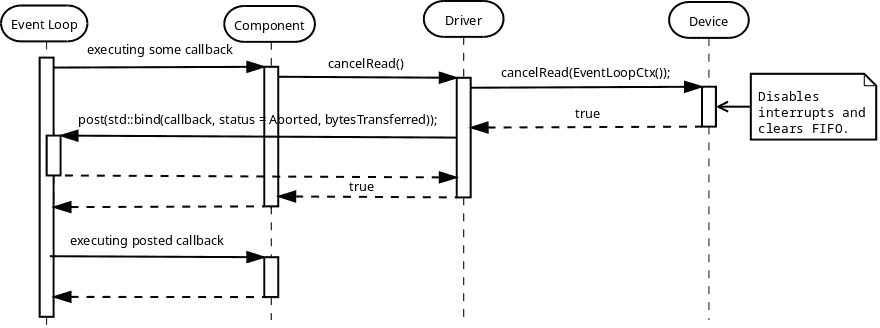

如果取消操作成功，回调必须使用指示操作已中止的错误代码调用（`embxx::error::ErrorCode::Aborted`）。

取消操作不成功的一个可能情况是，当回调被发布到事件循环以执行时，但在尝试取消时尚未执行。在这种情况下，**驱动程序** 意识到没有挂起的异步操作，可以立即返回 `false`。


另一种取消操作不成功的可能情况是在取消请求过程中发生完成中断：


#### 读取 "Until"

可能存在需要执行部分读取的情况，例如直到遇到特定字符。在这种情况下，**Driver** 负责监控传入的字符，并在缓冲区读取完成之前取消读取操作：


注意，之前 **Driver** 在事件循环（非中断）上下文中调用 **Device** 的 `cancelRead()` 成员函数，而在“读取直到”情况下，取消操作发生在中断模式下。这要求 **Device** 为两种模式都实现这些函数：

```cpp
class MyDevice
{
public:
    bool cancelRead(embxx::device::context::EventLoop) {...}
    bool cancelRead(embxx::device::context::Interrupt) {...}
};
```

**Driver** 类的 `asyncReadUntil()` 成员函数应该能够接收任何定义了 `bool operator()(CharType ch) const` 的无状态谓词对象。当接收到期望的字符时，谓词调用应返回 `true`，并且读取操作必须停止。

```cpp
class MyDriver
{
public:
    template <typename TPred, typename TFunc>
    void asyncReadUntil(
        CharType* buf,
        std::size_t size,
        TPred&& pred,
        TFunc&& func)
    {
        ...
    }
};
```

这允许在评估字符时使用复杂条件。例如，当遇到 `'\r'` 或 `'\n'` 时停止：

```cpp
typedef embxx::error::ErrorStatus EmbxxErrorStatus;

driver_.asyncReadUntil(
    buf,
    bufSize,
    [](CharType ch) -> bool
        {
            return (ch == '\r') || (ch == '\n');
        },
    [](const EmbxxErrorStatus& es, std::size_t bytesTransferred)
        {
            ...
        });
```

#### Device 实现部分

在本节中，我将尝试更详细地描述 **Device** 类需要为 **Driver** 正确工作提供什么。首先，它需要定义使用的字符类型：

```cpp
class MyDevice
{
public:
    typedef std::uint8_t CharType;
};
```

**Driver** 层将在其内部函数中重用字符的定义：

```cpp
template<typename TDevice, ...>
class MyDriver
{
public:
    typedef typename TDevice::CharType CharType;

    void asyncRead(CharType* buf, std::size_t bufSize, ...) {}
};
```

需要能够从 **Driver** 记录回调对象，以便通知后者关于读取/写入下一个字符的能力以及操作完成的情况。

```cpp
class MyDevice
{
public:
    template <typename TFunc>
    void setCanReadHandler(TFunc&& func)
    {
        canReadHandler_ = std::forward<TFunc>(func);
    }

    template <typename TFunc>
    void setCanWriteHandler(TFunc&& func)
    {
        canWriteHandler_ = std::forward<TFunc>(func);
    }

    template <typename TFunc>
    void setReadCompleteHandler(TFunc&& func)
    {
        readCompleteHandler_ = std::forward<TFunc>(func);
    }

    template <typename TFunc>
    void setWriteCompleteHandler(TFunc&& func)
    {
        writeCompleteHandler_ = std::forward<TFunc>(func);
    }

private:
    typedef ... OpAvailableHandler;
    typedef ... OpCompleteHandler;

    OpAvailableHandler canReadHandler_;
    OpCompleteHandler readCompleteHandler_;

    OpAvailableHandler canWriteHandler_;
    OpCompleteHandler writeCompleteHandler_;

};
```

`OpAvailableHandler` 和 `OpCompleteHandler` 类型可以是硬编码为 `std::function<void ()>` 和 `std::function<void (const embxx::error::ErrorStatus&)>`，或者作为模板参数传递：

```cpp
template <typename TCanReadHandler,
          typename TCanWriteHandler,
          typename TReadCompleteHandler,
          typename TWriteCompleteHandler>
class MyDevice
{
public:
    ... // setters are as above

private:

    TCanReadHandler canReadHandler_;
    TReadCompleteHandler readCompleteHandler_;

    TCanWriteHandler canWriteHandler_;
    TWriteCompleteHandler writeCompleteHandler_;
};
```

选择“模板参数选项”在多个应用程序之间重用相同的 **Device** 类时很有用，这些应用程序属于同一产品线。

下一个阶段是实现所有必需的函数：

```cpp
class MyDevice
{
public:

    typedef embxx::device::context::EventLoop EventLoopContext;
    typedef embxx::device::context::Interrupt InterruptContext;

    // Start read operation - enables interrupts
    void startRead(std::size_t length, EventLoopContext context);

    // Cancel read in event loop context
    bool cancelRead(EventLoopContext context);

    // Cancel read in interrupt context - used only if
    // asyncReadUntil() function was used in Device
    bool cancelRead(InterruptContext context);

    // Start write operation - enables interrupts
    void startWrite(std::size_t length, EventLoopContext context);

    // Cancell write operation
    bool cancelWrite(EventLoopContext context);

    // Check whether there is a character available to be read.
    bool canRead(InterruptContext context);

    // Check whether there is space for one character to be written.
    bool canWrite(InterruptContext context);

    // Read the available character from Rx FIFO of the peripheral
    CharType read(InterruptContext context);

    // Write one more character to Tx FIFO of the peripheral
    void write(CharType value, InterruptContext context);
};
```

注意，可能存在针对被控制的外设的特定配置函数。例如，UART 的波特率、奇偶校验、流控制。这种配置几乎总是平台和/或产品特定的，通常在应用程序启动时执行。这与本书中引入的 [Device-Driver-Component](#basic_concepts-device_driver_component) 模型无关。

```cpp
class MyDevice
{
public:
    void configBaud(unsigned value) { ... }
    ...
};
```

[embxx_on_rpi](https://github.com/arobenko/embxx_on_rpi) 项目有多个应用程序使用 UART1 接口进行日志记录。所有这些应用程序的外设控制代码都是相同的，并在 [src/device/Uart1.h](https://github.com/arobenko/embxx_on_rpi/blob/master/src/device/Uart1.h) 中实现。

#### Driver 实现部分

**Driver** 必须是一段通用的代码，可以与任何 **Device** 控制对象（只要它公开了正确的公共接口）以及任何应用程序（包括没有动态内存分配的应用程序）重用。

首先，我们需要引用**设备**以及[事件循环](#basic_concepts-event_loop)对象：

```cpp
template <typename TDevice, typename TEventLoop>
class MyDriver
{
public:
    // Reuse definition of character type from the Device
    typedef TDevice::CharType CharType;

    // During the construction store references to Device
    // and Event Loop objects.
    MyDriver(TDevice& device, TEventLoop& el)
      : device_(device),
        el_(el)
    {
        // Register appropriate callbacks with device
        device_.setCanReadHandler(
            std::bind(
                &MyDriver::canReadInterruptHandler, this));
        device_.setReadCompleteHandler(
            std::bind(
                &MyDriver::readCompleteInterruptHandler,
                this,
                std::placeholders::_1));

        device_.setCanWriteHandler(
            std::bind(
                &MyDriver::canWriteInterruptHandler, this));
        device_.setWriteCompleteHandler(
            std::bind(
                &MyDriver::writeCompleteInterruptHandler,
                this,
                std::placeholders::_1));

    }

    ...

private:

    void canReadInterruptHandler() {...}
    void readCompleteInterruptHandler(
        const embxx::error::ErrorStatus& es) {...}

    void canWriteInterruptHandler() {...}
    void writeCompleteInterruptHandler(
        const embxx::error::ErrorStatus& es) {...}

    TDevice& device_;
    TEventLoop& el_;
};
```

我们还需要存储与任何异步操作一起提供的回调。请注意，“读取”和“写入”是独立的操作，应该可以同时执行`asyncRead()`和`asyncWrite()`调用。

使**驱动程序**通用的唯一方法是将指定回调存储类型的责任提升一级，即我们必须将它们作为模板参数：

```cpp
template <typename TDevice,
          typename TEventLoop,
          typename TReadCompleteCallback,
          typename TWriteCompleteCallback>
class MyDriver
{
public:
    ...

    typedef embxx::device::context::EventLoop EventLoopContext;

    template <typename TFunc>
    void asyncRead(
        CharType* buf,
        std::size_t bufSize,
        TFunc&& func)
    {
        readBufStart_ = buf;
        currentReadBufPtr = buf;
        readBufSize_ = bufSize;
        readCompleteCallback_ = std::forward<TFunc>(func);
        driver_.startRead(bufSize, EventLoopContext());
    }

    template <typename TFunc>
    void asyncWrite(
        const CharType* buf,
        std::size_t bufSize,
        TFunc&& func)
    {
        writeBufStart_ = buf;
        currentWriteBufPtr = buf;
        writeBufSize_ = bufSize;
        writeCompleteCallback_ = std::forward<TFunc>(func);
        driver_.startWrite(bufSize, EventLoopContext());
    }

private:
    ...

    // Read info
    CharType* readBufStart_;
    CharType* currentReadBufPtr_;
    std::size_t readBufSize_;
    TReadCompleteCallback readCompleteCallback_;

    // Write info
    const CharType* writeBufStart_;
    const CharType* currentWriteBufPtr_;
    std::size_t writeBufSize_;
    TWriteCompleteCallback writeCompleteCallback_;
};
```

如前所述，在[读取“直到”](#peripherals-uart-reading_until)部分，经常需要停止将字符读取到提供的缓冲区中，当某些条件评估为真时。这意味着还需要提供用于字符评估谓词的存储空间：

```cpp
template <typename TDevice,
          typename TEventLoop,
          typename TReadCompleteCallback,
          typename TWriteCompleteCallback,
          typename TReadUntilPred>
class MyDriver
{
public:
    ...

    typedef embxx::device::context::EventLoop EventLoopContext;

    template <typename TPred, typename TFunc>
    void asyncReadUntil(
        CharType* buf,
        std::size_t bufSize,
        TPred&& pred,
        TFunc&& func)
    {
        readBufStart_ = buf;
        currentReadBufPtr = buf;
        readBufSize_ = bufSize;
        readCompleteCallback_ = std::forward<TFunc>(func);
        readUntilPred_ = std::forward<TPred>(pred)
        driver_.startRead(bufSize, EventLoopContext());
    }

private:
    ...

    // Read info
    CharType* readBufStart_;
    CharType* currentReadBufPtr_;
    std::size_t readBufSize_;
    TReadCompleteCallback readCompleteCallback_;
    TReadUntilPred readUntilPred_;

    ...
};
```

上面的示例代码可能可行，但它违反了C++的一个基本原则：“你应该只为你所用的付费”。在用UART进行日志记录的情况下，外围设备没有输入，保留用于管理“读取”操作所需的“读取”数据成员是一种浪费。让我们通过使用模板特化和使用“特质”聚合结构来减少模板参数的数量，来尝试稍微改善一下这种情况。

```cpp
struct MyOutputTraits
{
    // The "read" handler storage type.
    typedef std::nullptr_t ReadHandler;

    // The "write" handler storage type.
    // The valid handler must have the following signature:
    //  "void handler(const embxx::error::ErrorStatus&, std::size_t);"
    typedef embxx::util::StaticFunction<
        void(const embxx::error::ErrorStatus&, std::size_t)> WriteHandler;

    // The "read until" predicate storage type
    typedef std::nullptr_t ReadUntilPred;

    // Read queue size
    static const std::size_t ReadQueueSize = 0;

    // Write queue size
    static const std::size_t WriteQueueSize = 1;
};
```

请注意，在上面的特质结构中，允许挂起的“读取”请求数量被指定为0，即不允许读取操作。“读取完成”和“读取直到谓词”类型是不相关的，被指定为[std::nullptr_t](http://en.cppreference.com/w/cpp/types/nullptr_t)。**驱动程序**对象的实例化必须考虑到这一点，并且不包括任何与“读取”相关的功能。为了实现这一点，**驱动程序**类需要有两个独立的“读取”和“写入”子功能。这可以通过从两个基类继承来实现。

```cpp
template <typename TDevice,
          typename TEventLoop,
          typename TTraits = MyOutputTraits>
class MyDriver :
    public ReadSupportBase<
                TDevice,
                TEventLoop,
                typename TTraits::ReadHandler,
                typename TTraits::ReadUntilPred,
                TTraits::ReadQueueSize>,
    public WriteSupportBase<
                TDevice,
                TEventLoop,
                typename TTraits::WriteHandler,
                TTraits::WriteQueueSize>
{
    typedef ReadSupportBase<...> ReadBase;
    typedef WriteSupportBase<...> WriteBase;
public:
    template <typename TPred, typename TFunc>
    void asyncRead(
        CharType* buf,
        std::size_t bufSize,
        TFunc&& func)
    {
        ReadBase::asyncRead(buf, bufSize, std::forward<TFunc>(func);
    }

    template <typename TPred, typename TFunc>
    void asyncWrite(
        const CharType* buf,
        std::size_t bufSize,
        TFunc&& func)
    {
        WriteBase::asyncWrite(buf, bufSize, std::forward<TFunc>(func);
    }
};
```

现在，基于队列大小的模板特化应该可以完成这项工作：

```cpp
template <typename TDevice,
          typename TEventLoop,
          typename TReadHandler,
          typename TReadUntilPred,
          std::size_t ReadQueueSize>;
class ReadSupportBase;

template <typename TDevice,
          typename TEventLoop,
          typename TReadHandler,
          typename TReadUntilPred>;
class ReadSupportBase<TDevice, TEventLoop, TReadHandler, TReadUntilPred, 1>
{
public:
    ReadSupportBase(TDevice& device, TEventLoop& el) {...}
    ... // Implements the "read" related API
private:
    ... // Read related data members
};

template <typename TDevice,
          typename TEventLoop,
          typename TReadHandler,
          typename TReadUntilPred>;
class ReadSupportBase<TDevice, TEventLoop, TReadHandler, TReadUntilPred, 0>
{
public:
    ReadSupportBase(TDevice& device, TEventLoop& el) {}
    // No need for any "read" related API and data members
};

template <typename TDevice,
          typename TEventLoop,
          typename TWriteHandler,
          std::size_t WriteQueueSize>;
class WriteSupportBase;

template <typename TDevice,
          typename TEventLoop,
          typename TReadHandler>;
class WriteSupportBase<TDevice, TEventLoop, TWriteHandler, 1>
{
public:
    WriteSupportBase(TDevice& device, TEventLoop& el) {...}
    ... // Implements the "write" related API
private:
    ... // Write related data members
};

template <typename TDevice,
          typename TEventLoop,
          typename TWriteHandler>;
class WriteSupportBase<TDevice, TEventLoop, TWriteHandler, 0>
{
public:
    WriteSupportBase(TDevice& device, TEventLoop& el) {}
    // No need for any "write" related API and data members
};
```

注意，当读写队列大小大于1时，可以实现通用情况。这需要某种请求排队（例如使用[静态（固定大小）队列](#basic_needs-queue)），并允许同时发出多个异步读写请求。

为了支持这个扩展，**设备**类也必须实现一些额外的功能：

1.  新的读写请求可以在中断上下文中由**驱动程序**发出，在先前的操作报告完成之后。

    ```cpp
    class MyDevice
    {
    public:
        void startRead(std::size_t length, InterruptContext context);
        void startWrite(std::size_t length, InterruptContext context);
    };
    ```

1.  当向**驱动程序**发出新的异步读写请求时，它必须能够防止中断上下文回调被调用，以避免在内部数据结构上发生竞争：

    ```cpp
    class MyDevice
    {
    public:
        bool suspendRead(EventLoopContext context);
        void resumeRead(EventLoopContext context)
        bool suspendWrite(EventLoopContext context);
        void resumeWrite(EventLoopContext context);
    };
    ```

    请注意`suspend*()`函数的布尔返回值。它们类似于`cancel*()`函数，有一个指示是否暂停回调调用或当前没有正在进行的操作。

这样的通用**驱动程序**已经在[embxx/driver/Character.h](https://github.com/arobenko/embxx/blob/master/embxx/driver/Character.h)文件中的[embxx](https://github.com/arobenko/embxx)库中实现。该**驱动程序**被称为“Character”，因为它一次读取/写入提供的缓冲区中的一个字符。

#### 字符回显应用程序

现在，是时候做一些实际的事情了。[embxx_on_rpi](https://github.com/arobenko/embxx_on_rpi)项目中的[app_uart1_echo](https://github.com/arobenko/embxx_on_rpi/tree/master/src/app/app_uart1_echo)应用程序实现了简单的单个字符回显。

在[app_uart1_echo](https://github.com/arobenko/embxx_on_rpi/tree/master/src/app/app_uart1_echo)应用程序中，[System.h](https://github.com/arobenko/embxx_on_rpi/blob/master/src/app/app_uart1_echo/System.h)文件定义了**设备**和**驱动程序**层：

```cpp
class System
{
public:
    static const std::size_t EventLoopSpaceSize = 1024;
    typedef embxx::util::EventLoop<
        EventLoopSpaceSize,
        device::InterruptLock,
        device::WaitCond> EventLoop;

    typedef device::InterruptMgr<> InterruptMgr;

    typedef device::Uart1<InterruptMgr> Uart;

    typedef embxx::driver::Character<Uart, EventLoop> UartSocket;

    ...

private:

    ...
    EventLoop el_;
    Uart uart_;
    UartSocket uartSocket_;
};
```

注意，`UartSocket`使用`embxx::driver::Character`的默认“TTraits”模板参数，该参数被定义为：

```cpp
struct DefaultCharacterTraits
{
    typedef embxx::util::StaticFunction<
        void(const embxx::error::ErrorStatus&, std::size_t)> ReadHandler;
    typedef embxx::util::StaticFunction<
        void(const embxx::error::ErrorStatus&, std::size_t)> WriteHandler;
    typedef std::nullptr_t ReadUntilPred;
    static const std::size_t ReadQueueSize = 1;
    static const std::size_t WriteQueueSize = 1;
};
```

这允许同时使用“读取”和“写入”操作。有了这些定义，实现“回显”功能相当简单：

```cpp
// Forward declaration
void writeChar(System::UartSocket& uartSocket, System::Uart::CharType& ch);

void readChar(System::UartSocket& uartSocket, System::Uart::CharType& ch)
{
    uartSocket.asyncRead(&ch, 1,
        [&uartSocket, &ch](const embxx::error::ErrorStatus& es, std::size_t bytesRead)
        {
            GASSERT(!es);
            GASSERT(bytesRead == 1);
            static_cast<void>(es);
            static_cast<void>(bytesRead);
            writeChar(uartSocket, ch);
        });
}

void writeChar(System::UartSocket& uartSocket, System::Uart::CharType& ch)
{
    uartSocket.asyncWrite(&ch, 1,
        [&uartSocket, &ch](const embxx::error::ErrorStatus& es, std::size_t bytesWritten)
        {
            GASSERT(!es);
            GASSERT(bytesWritten == 1);
            static_cast<void>(es);
            static_cast<void>(bytesWritten);
            readChar(uartSocket, ch);
        });
}

int main() {
    auto& system = System::instance();
    auto& uart = system.uart();

    // Configure serial interface
    uart.configBaud(115200);
    uart.setReadEnabled(true);
    uart.setWriteEnabled(true);

    // Start with asynchronous read
    auto& uartSocket = system.uartSocket();
    System::Uart::CharType ch = 0;
    readChar(uartSocket, ch);

    // Run the event loop
    device::interrupt::enable();
    auto& el = system.eventLoop();
    el.run();

    GASSERT(0); // Mustn't exit
    return 0;
```

#### 流式打印接口

如前所述，我们的最终目标是有标准输出流接口，用于调试输出，该接口异步工作，没有任何阻塞的忙等待。这样的接口必须是一个通用的**组件**，在非中断上下文中工作，同时使用最近介绍的通用“字符”**驱动程序**与平台特定的“Uart”**设备**一起使用。

这样的**组件**应该实现为两个子**组件**。一个是“流缓冲区”，负责维护已写入字符的循环缓冲区，并在需要时使用“字符”**驱动程序**将它们刷新到外围设备。成功写入的字符将从内部缓冲区中删除。另一个是“流”本身，负责将各种值转换为字符并将它们写入“流缓冲区”的末尾。

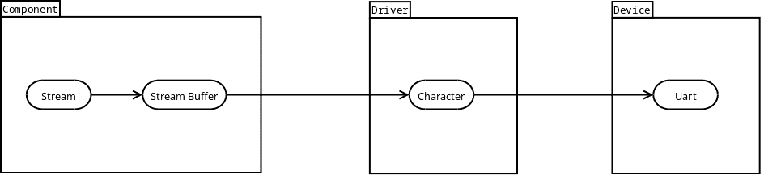

首先，让我们从“输出流缓冲区”开始。它需要接收将要使用的**驱动程序**的引用：

```cpp
template <typename TDriver>
class OutStreamBuf
{
public:
    OutStreamBuf(TDriver& driver)
      : driver_(driver)
    {
    }

private:
   TDriver& driver_;
   ...
};
```

还需要有一个缓冲区，用于在将字符写入设备之前存储它们。记住，我们正在尝试创建一个**组件**，该组件可以在多个独立的项目中重复使用，包括不支持动态内存分配的项目。因此，[静态（固定大小）队列](#basic_needs-queue)可能是一个不错的选择。这意味着需要提供缓冲区的大小作为模板参数之一：

```cpp
template <typename TDriver,
          std::size_t TBufSize>
class OutStreamBuf
{
public:
   typedef typename TDriver::CharType CharType;
   typedef embxx::container::StaticQueue<CharType, BufSize> Buffer;

private:
   ...
   Buffer buf_;
};
```

“输出流缓冲区”需要支持两个主要操作：

1.  将新的单个字符推送到缓冲区的末尾。

1.  清除所有（或部分）已写入的字符，即激活与**驱动程序**的异步写入。

当推送一个新字符时，可能会出现内部缓冲区已满的情况。在这种情况下，需要丢弃推送的字符，并且必须有指示“推送”操作是否成功的标志。函数可以返回`bool`来指示操作的成功，或者返回`std::size_t`来通知调用者已写入多少个字符。如果返回`0`，则表示字符没有被写入。

```cpp
template <...>
class OutStreamBuf
{
public:
   // Add new character at the end of the buffer
   std::size_t pushBack(CharType ch);

   // Get number of written, not-flushed characters
   std::size_t size();

   // Flush number of characters
   void flush(std::size_t count = size());
   ...
};
```

这有限数量的操作足以实现类似“输出流”的接口。然而，“输出流缓冲区”在将任何序列化数据写入外围设备时可能很有用，而不仅仅是调试输出。例如，使用标准算法：

```cpp
OutStreamBuf<...> outStreamBuf(...);
std::array<std::uint8_t, 128> data = {{.../* some data*/}};

std::copy(data.begin(), data.end(), std::back_inserter(outStreamBuf));
outStreamBuf.flush();
```

在上面的示例中，[std::back_inserter](http://en.cppreference.com/w/cpp/iterator/back_inserter)需要一个容器来定义`push_back()`成员函数：

```cpp
template <...>
class OutStreamBuf
{
public:
   // Wrap pushBack()
   void push_back(CharType ch)
   {
       pushBack(ch);
   }
   ...
};
```

也可能需要遍历已写入但尚未刷新的字符，并在调用`flush()`之前更新其中的一些字符。换句话说，“输出流缓冲区”必须被视为随机访问容器：

```cpp
template <...>
class OutStreamBuf
{
public:
    typedef embxx::container::StaticQueue<CharType, BufSize> Buffer;
    typedef typename Buffer::Iterator Iterator;
    typedef typename Buffer::ConstIterator ConstIterator;
    typedef typename Buffer::ValueType ValueType;
    typedef typename Buffer::Reference Reference;
    typedef typename Buffer::ConstReference ConstReference;

    bool empty() const;
    void clear();
    void resize(std::size_t newSize);

    Iterator begin();
    Iterator end();

    ConstIterator begin() const;
    ConstIterator end() const;

    ConstIterator cbegin() const;
    ConstIterator cend() const;

    Reference operator[](std::size_t idx);
    ConstReference operator[](std::size_t idx) const;
   ...
};
```

如前所述，`OutStreamBuf`使用[静态（固定大小）队列](#basic_needs-queue)作为其内部缓冲区，任何超出容量的字符都会被丢弃。必须有一种方法来识别可用容量，以及在请求的容量变得可用时通过回调进行异步通知：

```cpp
template <typename TDriver,
          std::size_t TBufSize,
          typename TWaitHandler =
              embxx::util::StaticFunction<void (const embxx::error::ErrorStatus&)> >
class OutStreamBuf
{
public:
    std::size_t availableCapacity() const;

    template <typename TFunc>
    void asyncWaitAvailableCapacity(
        std::size_t capacity,
        TFunc&& func)
    {
        if (capacity <= availableCapacity()) {
            ... // invoke callback via post() member function of Event Loop
        }
        waitAvailableCapacity_ = capacity;
        waitHandler_ = std::forward<TFunc>(func);

        // The Driver is writing some portion of flushed characters,
        // evaluate the capacity again when Driver reports completion.
    }

private:
    ...
    std::size_t waitAvailableCapacity_;
    WaitHandler waitHandler_;
};
```

这样的“输出流缓冲区”已经在[embxx/io/OutStreamBuf.h](https://github.com/arobenko/embxx/blob/master/embxx/io/OutStreamBuf.h)文件中实现，该文件位于[embxx](https://github.com/arobenko/embxx)库中。

下一个阶段将是定义“输出流”类，这将允许打印以null结尾的字符串以及各种整数值。

```cpp
template <typename TStreamBuf>
class OutStream
{
public:
    typedef typename TStreamBuf::CharType CharType;

    explicit OutStream(TStreamBuf& buf)
    : buf_(buf)
    {
    }

    OutStream(OutStream&) = delete;
    ~OutStream() = default;

    void flush()
    {
        buf_.flush();
    }

    OutStream& operator<<(const CharType* str)
    {
        while (*str != '\0') {
            buf_.pushBack(*str);
            ++str;
        }
        return *this;
    }

    OutStream& operator<<(char ch)
    {
        buf_.pushBack(ch);
        return *this;
    }

    OutStream& operator<<(std::uint8_t value)
    {
        // Cast std::uint8_t to unsigned and print.
        return (*this << static_cast<unsigned>(value));
    }

    OutStream& operator<<(std::int16_t value)
    {
        ... // Cast std::int16_t to int type and print.
        return *this;
    }

    OutStream& operator<<(std::uint16_t value)
    {
        // Cast std::uint16_t to unsigned and print
        return (*this << static_cast<std::uint32_t>(value));
    }

    OutStream& operator<<(std::int32_t value)
    {
        ... // Print signed value
        return *this;
    }

    OutStream& operator<<(std::uint32_t value)
    {
        ... // Print unsigned value
        return *this;
    }

    OutStream& operator<<(std::int64_t value)
    {
        ... // Print 64 bit signed value
        return *this
    }

    OutStream& operator<<(std::uint64_t value)
    {
        ... // Print 64 bit signed value
        return *this
    }

private:
    TStreamBuf& buf_;
};
```

我们还将需要数值基表示和操作符。不幸的是，使用`std::oct`、`std::dec`或`std::hex`操作符将需要包含标准库头文件 [<ios>](http://en.cppreference.com/w/cpp/header/ios)，这反过来又包含其他标准流相关头文件，这些头文件定义了一些静态对象，这些静态对象又是在标准库中定义和实例化的。这与我们编写不使用标准库的泛型代码的主要目标相矛盾。最好是自己定义这样的操作符：

```cpp
enum Base
{
    bin, ///< Binary numeric base stream manipulator
    oct, ///< Octal numeric base stream manipulator
    dec, ///< Decimal numeric base stream manipulator
    hex, ///< Hexadecimal numeric base stream manipulator
    Base_NumOfBases ///< Must be last
};

template <typename TStreamBuf>
class OutStream
{
public:
    explicit OutStream(TStreamBuf& buf)
    : buf_(buf)
      base_(dec)
    {
    }

    OutStream& operator<<(Base value)
    {
        base_ = value;
        return *this
    }

private:
    TStreamBuf& buf_;
    Base base_;
};
```

在创建数值的字符串表示时，必须考虑数值基表示的值。其用法与标准类似：

```cpp
OutStream<...> stream;

stream << "var1=" << dec << var1 << "; var2=" << hex << var2 << '\n';
stream.flush();
```

支持一些格式化功能可能很方便，例如指定输出的最小宽度以及填充字符：

```cpp
class WidthManip : public ValueManipBase<std::size_t>
{
public:
    WidthManip(std::size_t value) : value_(value) {}
    std::size_t value() const { return value_;}
private:
    std::size_t value_;
};

inline
WidthManip setw(std::size_t value)
{
    return WidthManip(value);
}

template <typename T>
class FillManip
{
public:
    FillManip(T value) : value_(value) {}
    T value() const { return value_;}
private:
    T value_;
};

template <typename T>
inline
FillManip<T> setfill(T value)
{
    return FillManip<T>(value);
}

template <typename TStreamBuf>
class OutStream
{
public:
    explicit OutStream(TStreamBuf& buf)
    : buf_(buf)
      base_(dec),
      width_(0),
      fill_(static_cast<CharType>(' ');
    {
    }

    OutStream& operator<<(WidthManip manip)
    {
        width_ = manip.value();
        return *this;
    }

    template <typename T>
    OutStream& operator<<(details::FillManip<T> manip)
    {
        fill_ = static_cast<CharType>(manip.value());
        return *this;
    }

private:
    TStreamBuf& buf_;
    Base base_;
    std::size_t width_;
    CharType fill_;
};
```

其用法与基本操作符非常相似：

```cpp
OutStream<...> stream;

stream << "var1=" << dec << setw(4) << var1 << "; var2=" << hex
       << setfill('0') << var2 << '\n';
stream.flush();
```

另一个有用的操作符是在末尾添加'\n'以及调用`flush()`，就像使用标准输出流时`std::endl`所做的那样：

```cpp
enum Endl
{
    endl ///< End of line stream manipulator
};

template <typename TStreamBuf>
class OutStream
{
public:

    OutStream& operator<<(Endl manip)
    {
        static_cast<void>(manip);
        buf_.pushBack(static_cast<CharType>('\n');
        flush();
        return *this;
    }

private:
    ...
};
```

然后，使用示例可以更改为：

```cpp
OutStream<...> stream;

stream << "var1=" << dec << setw(4) << var1 << "; var2=" << hex
       << setfill('0') << var2 << endl;
```

**总结**： "输出流" 对象将给定的整数值转换为可打印字符，并使用 "输出流缓冲区" 的 `pushBack()` 成员函数将这些字符进一步传递。对 `flush()` 的请求也会传递。当 "输出流缓冲区" 收到刷新内部缓冲区的请求时，它激活 "字符" **驱动程序**，然后它使用 "UART" **设备**逐个将字符写入串行接口。作为这种合作的结果，"打印" 语句非常快，不需要等待所有字符写入函数返回，就像通常使用 `printf()` 一样。所有字符都在后台使用中断写入，而应用程序的主线程继续执行，不会停滞。

这样的 "输出流" 已经在 [embxx/io/OutStream.h](https://github.com/arobenko/embxx/blob/master/embxx/io/OutStream.h) 文件中的 [embxx](https://github.com/arobenko/embxx) 库中实现。

#### 日志记录

通常，调试日志应该在条件编译下，例如仅在 **DEBUG** 模式下，而在 **RELEASE** 模式下编译时排除打印代码。

```cpp
#ifndef NDEBUG
    stream << "Some info massage" << endl;
#endif
```

有时需要轻松地更改打印的调试消息的数量。为此，广泛使用日志级别概念：

```cpp
namespace log
{

enum Level
{
    Trace, ///< Use for tracing enter to and exit from functions.
    Debug, ///< Use for debugging information.
    Info, ///< Use for general informative output.
    Warning, ///< Use for warning about potential dangers.
    Error, ///< Use to report execution errors.
    NumOfLogLevels ///< Number of log levels, must be last
};

}  // namespace log
```

日志语句变成一个宏：

```cpp
const auto MinLogLevel = log::Info;

#define LOG(stream__, level__, output__) \
    do { \
        if (MinLevel <= (level__)) { \
            (stream__).stream() << output__; \
        } \
    } while (false)
```

在这种情况下，所有低于 `log::Info` 级别的日志尝试都会被编译器优化掉，因为 `if` 语句在编译时已知评估为 `false`：

```cpp
LOG(stream, log::Debug, "This message is not printed." << endl);
LOG(stream, log::Info, "This message IS printed." << endl);
LOG(stream, log::Warning, "This message IS printed also." << endl);
```

能够在日志语句中添加一些自动格式化功能会很好，例如打印日志级别和/或添加 '\n' 并在末尾刷新。例如，下面的代码

```cpp
LOG(stream, log::Debug, "This is DEBUG message.");
LOG(stream, log::Info, "This is INFO message.");
LOG(stream, log::Warning, "This is WARNING message.");
```

生成以下输出

```cpp
[DEBUG]: This is DEBUG message.
[INFO]: This is INFO message.
[WARNING]: This is WARNING message.
```

在末尾添加 `'\n'` 字符和调用 `flush()`。

当使用某种类型的包装日志类以及相关的格式化程序时，这很容易实现。例如：

```cpp
template <log::Level TLevel, typename TStream>
class StreamLogger
{
public:

    typedef TStream Stream;

    static const log::Level MinLevel = TLevel;

    explicit StreamLogger(Stream& outStream)
      : outStream_(outStream)
    {
    }

    Stream& stream()
    {
        return outStream_;
    }

    // Begin output. This function is called before requested
    // output is redirected to stream. It does nothing.
    void begin(log::Level level)
    {
        static_cast<void>(level);
    }

    // End output. This function is called after requested
    // output is redirected to stream. It does nothing.
    void end(log::Level level)
    {
        static_cast<void>(level);
    }

private:
    Stream& outStream_;
};
```

日志宏将看起来像这样：

```cpp
#define SLOG(log__, level__, output__) \
    do { \
        if ((log__).MinLevel <= (level__)) { \
            (log__).begin(level__); \
            (log__).stream() << output__; \
            (log__).end(level__); \
        } \
    } while (false)
```

可以通过暴露相同的接口来定义格式化程序，但它包装了原始的 `StreamLogger` 或另一个格式化程序。例如，让我们定义一个在输出完成时调用流成员函数 `flush()` 的格式化程序：

```cpp
template <typename TNextLayer>
class StreamFlushSuffixer
{
public:

    // Constructor, forwards all the other parameters to the constructor
    // of the next layer.
    template<typename... TParams>
    StreamFlushSuffixer(TParams&&... params)
      : nextLavel_(std::forward<TParams>(params)...)
    {
    }

    Stream& stream()
    {
        return nextLavel_.stream();
    }

    void begin(log::Level level)
    {
        nextLavel_.begin(level);
    }

    void end(log::Level level)
    {
        nextLavel_.end(level);
        stream().flush();
    }

private:
    TNextLavel nextLavel_;
};
```

这样日志记录器的定义如下：

```cpp
typedef ... OutStream; // type of the output stream
typedef
    StreamFlushSuffixer<
        StreamLogger<
            log::Debug,
            OutStream
        >
    > Log;
```

同样的 `SLOG()` 宏将适用于此日志记录器，并具有额外的格式化：

```cpp
OutStream stream(... /* construction params */);
Log log(stream);
SLOG(log, log::Debug, "This is DEBUG message.\n");
```

让我们再添加一个能够打印任何值（特别是 `'\n'`）的格式化程序。

```cpp
template <typename T, typename TNextLayer>
class StreamableValueSuffixer
{
public:

    template<typename... TParams>
    explicit StreamableValueSuffixer(T&& value, TParams&&... params)
      : value_(std::forward<T>(value)),
        nextLevel_(std::forward<TParams>(params)...)
    {
    }

    Stream& stream()
    {
        return nextLavel_.stream();
    }

    void begin(log::Level level)
    {
        nextLavel_.begin(level);
    }

    void end(log::Level level)
    {
        nextLavel_.end(level);
        stream() << value_;
    }

private:
    T value_;
    TNextLavel nextLavel_;
};
```

定义一个在添加 `'\n'` 字符后调用底层流 `flush()` 成员函数的日志记录器的函数如下：

```cpp
typedef embxx::io::OutStream<...> OutStream;
typedef
    StreamFlushSuffixer<
        StreamableValueSuffixer<
            char,
            StreamLogger<
                log::Debug,
                OutStream
            >
        >
    > Log;
```

虽然构造函数将需要指定在调用 `flush()` 之前打印在末尾的字符。

```cpp
OutStream stream(...);
Log log('\n', stream);
SLOG(log, log::Debug, "This is DEBUG message.");
```

作为最后一个格式化程序，让我们做一个在输出前缀添加日志级别信息的格式化程序：

```cpp
template <typename TNextLayer>
class LevelStringPrefixer
{
public:
    template<typename... TParams>
    LevelStringPrefixer(TParams&&... params);
      : next_value(std::forward<TParams>(params)...)
    {
    }

    Stream& stream()
    {
        return nextLavel_.stream();
    }

    void begin(Level level)
    {
        static const char* const Strings[NumOfLogLevels] = {
            "[TRACE] ",
            "[DEBUG] ",
            "[INFO] ",
            "[WARNING] ",
            "[ERROR] "
        };

        if ((level < NumOfLogLevels) && (Strings[level] != nullptr)) {
            stream() << Strings[level];
        }

        nextLavel_.begin(level);
    }

    void end(log::Level level)
    {
        nextLavel_.end(level);
    }

private:
    TNextLavel nextLavel_;
};
```

定义一个日志记录器，它在开头打印这样的前缀并在末尾打印 `'\n'` 以及调用 `flush()` 的函数如下：

```cpp
typedef
    StreamFlushSuffixer<
        StreamableValueSuffixer<
            char,
            LevelStringPrefixer<
                StreamLogger<
                    log::Debug,
                    OutStream
                >
            >
        >
    > Log;
```

这样的`StreamLogger`与多个格式化程序一起已在[embxx](https://github.com/arobenko/embxx)库的[embxx/util/StreamLogger.h](https://github.com/arobenko/embxx/blob/master/embxx/util/StreamLogger.h)文件中实现。

#### 日志应用程序

[embxx_on_rpi](https://github.com/arobenko/embxx_on_rpi)项目中的[app_uart1_logging](https://github.com/arobenko/embxx_on_rpi/tree/master/src/app/app_uart1_logging)应用程序实现了每秒增加一次的简单计数器的日志记录：

```cpp
namespace log = embxx::util::log;
template <typename TLog, typename TTimer>
void performLog(TLog& log, TTimer& timer, std::size_t& counter)
{
    ++counter;

    SLOG(log, log::Info,
        "Logging output: counter = " <<
        embxx::io::dec << counter <<
        " (0x" << embxx::io::hex << counter << ")");

    // Perform next logging after a timeout
    static const auto LoggingWaitPeriod = std::chrono::seconds(1);
    timer.asyncWait(
        LoggingWaitPeriod,
        [&](const embxx::error::ErrorStatus& es)
        {
            GASSERT(!es);
            static_cast<void>(es);
            performLog(log, timer, counter);
        });
}

int main() {
    auto& system = System::instance();
    auto& log = system.log();

    // Configure UART
    auto& uart = system.uart();
    uart.configBaud(115200);
    uart.setWriteEnabled(true);

    // Timer allocation
    auto timer = system.timerMgr().allocTimer();
    GASSERT(timer.isValid());

    // Start logging
    std::size_t counter = 0;
    performLog(log, timer, counter);

    // Run event loop
    device::interrupt::enable();
    auto& el = system.eventLoop();
    el.run();

    GASSERT(0); // Mustn't exit
    return 0;
}
```

[System.h](https://github.com/arobenko/embxx_on_rpi/blob/master/src/app/app_uart1_logging/System.h)文件定义了整个输出堆栈：

```cpp
class System
{
public:
    static const std::size_t EventLoopSpaceSize = 1024;
    typedef embxx::util::EventLoop<
        EventLoopSpaceSize,
        device::InterruptLock,
        device::WaitCond> EventLoop;

    // Devices
    typedef device::Uart1<InterruptMgr> Uart;
    ...

    // Drivers
    struct CharacterTraits
    {
        typedef std::nullptr_t ReadHandler;
        typedef embxx::util::StaticFunction<
            void(const embxx::error::ErrorStatus&, std::size_t)> WriteHandler;
        typedef std::nullptr_t ReadUntilPred;
        static const std::size_t ReadQueueSize = 0;
        static const std::size_t WriteQueueSize = 1;
    };
    typedef embxx::driver::Character<
        Uart, EventLoop, CharacterTraits> UartDriver;
    ...

    // Components
    static const std::size_t OutStreamBufSize = 1024;
    typedef embxx::io::OutStreamBuf<
        UartDriver, OutStreamBufSize> OutStreamBuf;

    typedef embxx::io::OutStream<OutStreamBuf> OutStream;
    typedef embxx::util::log::StreamFlushSuffixer<
            embxx::util::log::StreamableValueSuffixer<
                const OutStream::CharType*,
                embxx::util::log::LevelStringPrefixer<
                    embxx::util::StreamLogger<
                        embxx::util::log::Debug,
                        OutStream
                    >
                >
            >
        > Log;

    ...
private:

    EventLoop el_;

    // Devices
    Uart uart_;
    ...

    // Drivers
    UartDriver uartDriver_;
    ...

    // Components
    OutStreamBuf buf_;
    OutStream stream_;
    Log log_;
    ...
};
```

此应用程序将以下输出发送到UART接口，每秒出现一个新行：

```cpp
[INFO] Logging output: counter = 1 (0x1)
[INFO] Logging output: counter = 2 (0x2)
[INFO] Logging output: counter = 3 (0x3)
...
```

#### 缓冲输入

在许多系统中，UART接口也用于同一板上的各种微控制器或外部设备之间的通信。当有传入的消息时，字符必须在它们可以被某些**组件**处理之前存储在某个缓冲区中。就像我们有“输出流缓冲区”用于缓冲传出字符一样，我们必须有“输入流缓冲区”用于缓冲传入的字符。

显然，它必须能够访问**字符驱动程序**，并且可能有一个环形缓冲区来存储传入的字符。

```cpp
template <typename TDriver, std::size_t TBufSize>
class InStreamBuf
{
public:
    typedef typename TDriver::CharType CharType;
    typedef embxx::container::StaticQueue<CharType, TBufSize> Buffer;

    explicit
    InStreamBuf(TDriver& driver)
      : driver_(driver)
    {
    }

private:
    TDriver& driver_;
    Buffer buf_;
};
```

**驱动程序**不会执行任何读取操作，除非它被明确请求通过其`asyncRead()`成员函数来这样做。有时，即使负责处理这些字符的**组件**尚未准备好，也需要保持字符在流动并在缓冲区中存储。为了实现这一点，“输入流缓冲区”必须负责不断请求**驱动程序**执行异步读取，同时提供存储这些字符的空间。

```cpp
template <typename TDriver, std::size_t TBufSize>
class InStreamBuf
{
public:
    // Start data accumulation in the internal buffer.
    void start();

    // Stop data accumulation in the internal buffer.
    void stop();

    // Inquire whether characters are being accumulated.
    bool isRunning() const;
};
```

大多数时候，负责的**组件**将需要在开始处理之前积累一定数量的字符。需要提供异步通知回调请求，当适当数量的字符可用时。回调必须存储在“输入流缓冲区”的内部数据结构中，并在需要时调用。由于后者被开发为一个通用类，因此需要提供回调存储类型作为模板参数。

```cpp
template <typename TDriver, std::size_t TBufSize, typename TWaitHandler>
class InStreamBuf
{
public:

    template <typename TFunc>
    void asyncWaitDataAvailable(std::size_t reqSize, TFunc&& func)
    {
        callback_ = std::forward<TFunc>(func)
        ...
    }

private:
    TWaitHandler callback_;
};
```

一旦积累到所需数量的字符，**组件**必须能够访问和处理它们。这意味着“输入流缓冲区”也必须是一个具有随机访问迭代器的容器。

```cpp
template <typename TDriver, std::size_t TBufSize, typename TWaitHandler>
class InStreamBuf
{
public:
    typedef typename Buffer::ConstIterator ConstIterator;
    typedef ConstIterator const_iterator;
    typedef typename Buffer::ValueType ValueType;
    typedef ValueType value_type;
    typedef typename Buffer::ConstReference ConstReference;
    typedef ConstReference const_reference;

    // Get size of available for read data.
    std::size_t size() const;

    // Check whether number of available characters is 0.
    bool empty() const;

    //Get full capacity of the buffer.
    constexpr std::size_t fullCapacity() const;

    ConstIterator begin() const;
    ConstIterator end() const;
    ConstIterator cbegin() const;
    ConstIterator cend() const;
    ConstReference operator[](std::size_t idx) const;
};
```

请注意，所有对字符的访问都是通过const迭代器完成的。这意味着我们不允许外部和无控制的更新缓冲区内的字符。

当缓冲区内的字符被处理并且不再需要时，它们需要被丢弃以释放缓冲区内的空间，为新字符的到来腾出空间。

```cpp
template <typename TDriver, std::size_t TBufSize, typename TWaitHandler>
class InStreamBuf
{
public:
    // Consume part or the whole buffer of the available data for read.
    void consume(std::size_t consumeSize = size());
};
```

#### 摩尔斯电码应用程序

[embxx_on_rpi](https://github.com/arobenko/embxx_on_rpi)项目中的[app_uart1_morse](https://github.com/arobenko/embxx_on_rpi/tree/master/src/app/app_uart1_morse)应用程序实现了在“输入流缓冲区”中缓冲输入字符，并使用[莫尔斯电码](http://en.wikipedia.org/wiki/Morse_code)方法通过闪烁板载LED来显示它们。

首先需要访问要闪烁的LED、输入缓冲区以存储输入字符和定时器管理器以分配一个计时器来测量超时。

```cpp
template <typename TLed, typename TInBuf, typename TTimerMgr>
class Morse
{
public:
    typedef TLed Led;
    typedef TInBuf InBuf;
    typedef TTimerMgr TimerMgr;
    typedef typename TimerMgr::Timer Timer;

    Morse(Led& led, InBuf& buf, TimerMgr& timerMgr)
      : led_(led),
        buf_(buf),
        timer_(timerMgr.allocTimer())
    {
        GASSERT(timer_.isValid());
    }

    ~Morse() = default;

private:
    Led& led_;
    InBuf& buf_;
    Timer timer_;
};
```

其次，需要定义莫尔斯电码序列，包括点划的持续时间，以及将输入字符映射到相应的序列。

```cpp
template <...>
class Morse
{
public:
    typedef typename InBuf::CharType CharType;
    ...
private:
    typedef unsigned Duration;
    static const Duration Dot = 200;
    static const Duration Dash = Dot * 3;
    static const Duration End = 0;
    static const Duration Spacing = Dot;
    static const Duration InterSpacing = Spacing * 2;

    const Duration* getLettersSeq(CharType ch) const
    {
        static const Duration Seq_A[] = {Dot, Dash, End};
        static const Duration Seq_B[] = {Dash, Dot, Dot, Dot, End};
        ...
        static const Duration Seq_Z[] = {Dash, Dash, Dot, Dot, End};

        static const Duration Seq_0[] = {
            Dash, Dash, Dash, Dash, Dash, End};
        static const Duration Seq_1[] = {
            Dot, Dash, Dash, Dash, Dash, End};
        ...
        static const Duration Seq_9[] = {
            Dash, Dash, Dash, Dash, Dot, End};

        static const Duration* Letters[] = {
            Seq_A,
            Seq_B,
            ...
            Seq_Z
        };

        static const Duration* Numbers[] = {
            Seq_0,
            ...
            Seq_9
        };

        if ((static_cast<CharType>('A') <= ch) &&
            (ch <= static_cast<CharType>('Z'))) {
            return Letters[ch - 'A'];
        }

        if ((static_cast<CharType>('a') <= ch) &&
            (ch <= static_cast<CharType>('z'))) {
            return Letters[ch - 'a'];
        }

        if ((static_cast<CharType>('0') <= ch) &&
            (ch <= static_cast<CharType>('9'))) {
            return Numbers[ch - '0'];
        }

        return nullptr;
    }
};
```

现在，负责闪烁LED的代码相当简单：

```cpp
template <...>
class Morse
{
public:

    void start()
    {
        buf_.start();
        nextLetter();
    }

private:
    void nextLetter()
    {
        buf_.asyncWaitDataAvailable(
            1U,
            [this](const embxx::error::ErrorStatus& es)
            {
                if (es) {
                    GASSERT(buf_.empty());
                    nextLetter();
                    return;
                }

                GASSERT(!buf_.empty());
                auto ch = buf_[0];
                buf_.consume(1U);

                auto* seq = getLettersSeq(ch);
                if (seq == nullptr) {
                    nextLetter();
                    return;
                }

                nextSyllable(seq);
            });
    }

    void nextSyllable(const Duration* seq)
    {
        GASSERT(seq != nullptr);
        GASSERT(*seq != End);

        auto duration = *seq;
        ++seq;

        led_.on();
        timer_.asyncWait(
            std::chrono::milliseconds(duration),
            [this, seq](const embxx::error::ErrorStatus& es)
            {
                static_cast<void>(es);
                GASSERT(!es);

                led_.off();

                if (*seq != End) {
                    timer_.asyncWait(
                        std::chrono::milliseconds(Duration(Spacing)),
                        [this, seq](const embxx::error::ErrorStatus& es)
                        {
                            static_cast<void>(es);
                            GASSERT(!es);
                            nextSyllable(seq);
                        });
                    return;
                }

                timer_.asyncWait(
                    std::chrono::milliseconds(Duration(InterSpacing)),
                    [this](const embxx::error::ErrorStatus& es)
                    {
                        static_cast<void>(es);
                        GASSERT(!es);
                        nextLetter();
                    });
            });
    }

};
```

`nextLetter()`成员函数等待缓冲区中有一个字符可用，然后将它映射到序列并从缓冲区中移除。如果存在映射，它将调用`nextSyllable()`成员函数以启动闪烁序列。该函数激活LED并等待基于提供的点或划持续时间的相关时间。超时后，LED熄灭并启动新的等待。然而，如果达到序列的末尾，等待将持续`InterSpacing`持续时间，然后再次调用`nextLetter()`成员函数，否则等待将持续`Spacing`持续时间，然后再次调用`nextSyllable()`以激活LED并等待序列中的下一个周期。

#### 摘要

经过相当大的努力，我们创建了一个完整的通用堆栈，用于在串行接口（如UART）上执行异步输入/输出操作。它可以在多个独立的项目中重用，同时在堆栈的底部提供平台特定的低级设备控制对象。

### GPIO

在许多情况下，GPIO输入不需要在中断发生时同时处理。它可以很容易地使用[设备驱动组件](#basic_concepts-device_driver_component)模型在事件循环（非中断）上下文中调度执行。

根据在[设备驱动组件](#basic_concepts-device_driver_component)章节中所述以及我们所看到的，**组件**提供了一个回调对象以及异步操作请求。回调函数仅在操作完成、取消或由于某些错误而终止时执行一次。如果需要重复操作，则需要向**驱动器**发出另一个异步操作，并提供另一个回调对象，以便在操作完成时调用。

虽然GPIO输入处理的需求略有不同。在将事件报告给**组件**以及后者重新请求异步等待值变化之间，该行可能多次更改其值。**驱动程序**必须保留由**组件**提供的回调对象，并在GPIO输入值每次变化时调用它，直到**组件**取消操作。

让我们更详细地了解所有这些阶段。

#### 配置

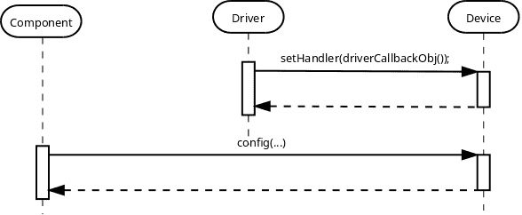

**设备**必须提供回调对象来处理所有请求的输入线路上的GPIO中断。

硬件也必须正确配置：输入/输出线路、上升/下降沿上的中断等。此类配置是平台/产品特定的，不属于本书中介绍的通用[设备-驱动程序-组件](#basic_concepts-device_driver_component)模型的一部分。因此，产品特定的**组件**必须获取对设备对象的访问权限，并根据需要对其进行配置。

#### 开始连续异步读取操作

**驱动程序**必须能够支持在不同输入上执行多个异步读取操作。这意味着它必须通过请求**设备**暂停回调调用（即禁用中断）来保护对内部数据结构的访问。此外，为了遵循我们迄今为止使用的模式，必须在第一次读取请求时请求或启用**设备**的操作，并在最后一次读取请求时取消或禁用它。


读者可能会注意到，在第一次`asyncReadCont()`请求时，**驱动程序**向**设备**发出了`suspend()`请求，并返回了`false`。这意味着**设备**对GPIO输入的监控尚未开始。这就是为什么接下来会调用`enable()`的原因。在第二次`asyncReadCont()`请求中，`suspend()`的调用返回了`true`，随后是`resume()`。

#### 报告GPIO输入事件

现在，每当相关的GPIO中断发生时，**驱动程序**的处理程序就会在中断模式上下文中被调用。它负责在事件循环（非中断）上下文中调度**组件**的处理程序的执行。


#### 取消连续读取操作

当不再需要监控某些输入时，**组件**可以请求**驱动程序**取消连续的异步读取操作。如果最后记录的异步读取操作被取消，**驱动程序**负责让**设备**知道不再需要GPIO中断。


#### GPIO设备

根据上述信息，平台特定的GPIO控制**设备**对象必须提供以下公共接口：

1.  定义引脚识别类型。

    ```cpp
    typedef unsigned PinIdType;
    ```

1.  用于在发生中断时调用回调对象的功能。回调参数必须提供有关引脚的信息以及导致中断的最终输入值。回调对象必须实现以下签名：“void (PinIdType, bool)”其中第一个参数是引脚，第二个参数是输入值。

    ```cpp
    template <typename TFunc>
    void setHandler(TFunc&& func);
    ```

1.  用于启动/启用GPIO输入监控的功能。

    ```cpp
    void start(embxx::device::context::EventLoop context);
    ```

1.  用于取消/禁用GPIO输入监控的功能。

    ```cpp
    bool cancel(embxx::device::context::EventLoop context);
    ```

1.  用于启用/禁用单个引脚的GPIO中断的功能。

    ```cpp
    void setEnabled(
        PinIdType pin,
        bool enabled,
        embxx::device::context::EventLoop context);
    ```

1.  用于在中断模式下挂起回调调用，即禁用GPIO中断。

    ```cpp
    bool suspend(embxx::device::context::EventLoop context);
    ```

1.  用于在中断模式下恢复挂起的回调调用，即启用GPIO中断。

    ```cpp
    void resume(embxx::device::context::EventLoop context);
    ```

针对 RaspberryPi 平台的这种GPIO控制 **设备** 类已在[src/device/Gpio.h](https://github.com/arobenko/embxx_on_rpi/blob/master/src/device/Gpio.h)文件中实现，该文件位于[embxx_on_rpi](https://github.com/arobenko/embxx_on_rpi)项目中。

#### GPIO 驱动程序

首先，我们需要**设备**以及[事件循环](#basic_concepts-event_loop)对象的引用：

```cpp
template <typename TDevice, typename TEventLoop>
class MyGpioDriver
{
public:
    // During the construction store references to Device
    // and Event Loop objects.
    MyGpioDriver(TDevice& device, TEventLoop& el)
      : device_(device),
        el_(el)
    {
        // Register appropriate interrupt callbacks with device
        device_.setHandler(...);
    }

    ...

private:

    TDevice& device_;
    TEventLoop& el_;
};
```

**驱动程序**还必须提供执行和取消多个引脚的连续异步读取操作的能力：

```cpp
template <typename TDevice, typename TEventLoop>
class MyGpioDriver
{
public:
    typedef typename TDevice::PinIdType PinIdType;

    template <typename TFunc>
    void asyncReadCont(PinIdType id, TFunc&& func) { ... }

    bool cancelReadCont(PinIdType id) { ... }
};
```

与迄今为止的任何异步操作一样，回调必须接收状态信息作为其第一个参数，以及可能作为第二个参数的输入值。当使用`cancelReadCont()`取消操作时，回调必须最后一次被调用，状态指定操作已“中止”。

**驱动程序**应该是一段通用的代码，可以在多个独立的产品中重用，包括那些没有动态内存分配和/或异常的产品。这意味着**驱动程序**类必须接收它将要支持的引脚的最大数量以及回调存储的类型。

```cpp
template <typename TDevice,
          typename TEventLoop,
          std::size_t TNumOfLines,
          typename THandler =
              embxx::util::StaticFunction<void (const embxx::error::ErrorStatus&, bool)> >
class MyGpioDriver
{
public:
    template <typename TFunc>
    void asyncReadCont(PinIdType id, TFunc&& func)
    {
        ...
        auto* node = ...; // Locate or allocate appropriate node
        node->id_ = id;
        node->handler_ = std::forward<TFunc>(func);
        ...
    }

private:
    struct Node
    {
        Node() : id_(PinIdType()) {}

        PinIdType id_;
        THandler handler_;
    };

    typedef std::array<Node, TNumOfLines> Infos;

    Infos infos_;
    ...
};
```

**驱动程序**不做任何特别的事情，它只是接收**设备**通知的GPIO中断，根据**设备**提供的引脚信息定位适当的已注册**组件**的回调对象，并使用**事件循环**在事件循环（非中断）上下文中调度**组件**的回调以及关于输入值的详细信息。

这种通用的GPIO **驱动程序**已经在[embxx/driver/Gpio.h](https://github.com/arobenko/embxx/blob/master/embxx/driver/Gpio.h)文件中实现，该文件位于[embxx](https://github.com/arobenko/embxx)库中。

#### 按钮组件

[embxx_on_rpi](https://github.com/arobenko/embxx_on_rpi)项目有一个简单的按钮**组件**，在[src/component/Button.h](https://github.com/arobenko/embxx_on_rpi/blob/master/src/component/Button.h)中实现。它配置提供的GPIO线路作为输入，并具有上升和下降沿中断。它还提供了一个简单的接口，以便能够监控按钮的按压和释放。

```cpp
template <typename TDriver,
          bool TActiveState,
          typename THandler = embxx::util::StaticFunction<void ()> >
class Button
{
public:
    typedef TDriver Driver;
    typedef typename Driver::PinIdType PinIdType;

    Button(Driver& driver, PinIdType pin);
    ~Button();

    bool isPressed() const;

    template <typename TFunc>
    void setPressedHandler(TFunc&& func);

    template <typename TFunc>
    void setReleasedHandler(TFunc&& func);
};
```

#### 按钮按压监控应用

[embxx_on_rpi](https://github.com/arobenko/embxx_on_rpi) 项目还包含一个名为 [app_button](https://github.com/arobenko/embxx_on_rpi/tree/master/src/app/app_button) 的简单应用程序。它监控连接到GPIO线之一的单个按钮的按下和释放。当按钮被按下时，LED灯亮1秒钟，并将 "Button Pressed" 字符串记录到UART。当按钮释放时，仅将 "Button Released" 字符串记录到UART，而不会影响LED状态。如果在LED亮起1秒钟之前检测到新的按钮按下，LED保持亮起，并重新开始1秒钟的计时器倒计时。

感谢 [Device-Driver-Component](#basic_concepts-device_driver_component) 模型和所有级别的抽象，应用程序代码相当简单。

```cpp
int main() {
    auto& system = System::instance();

    // Configure uart
    auto& uart = system.uart();
    uart.configBaud(9600);
    uart.setWriteEnabled(true);

    // Allocate timer
    auto& timerMgr = system.timerMgr();
    auto timer = timerMgr.allocTimer();
    GASSERT(timer.isValid());

    // Set handlers for button press / release
    auto& button = system.button();
    button.setPressedHandler(
        std::bind(
            &buttonPressed,
            std::ref(timer)));

    button.setReleasedHandler(&buttonReleased);

    // Run event loop with enabled interrupts
    device::interrupt::enable();
    auto& el = system.eventLoop();
    el.run();

    GASSERT(0); // Mustn't exit
	return 0;
}
```

"按钮按下"的代码如下：

```cpp
void buttonPressed(System::TimerMgr::Timer& timer)
{
    static_cast<void>(timer);
    auto& system = System::instance();
    auto& el = system.eventLoop();
    auto& led = system.led();
    auto& log = system.log();

    SLOG(log, embxx::util::log::Info, "Button Pressed");

    timer.cancel();
    auto result = el.post(
        [&led]()
        {
            led.on();
        });
    GASSERT(result);
    static_cast<void>(result);

    static const auto WaitTime = std::chrono::seconds(1);
    timer.asyncWait(
        WaitTime,
        [&led](const embxx::error::ErrorStatus& es)
        {
            if (es == embxx::error::ErrorCode::Aborted) {
                return;
            }
            led.off();
        });
}
```

"按钮释放"的代码非常简单：

```cpp
void buttonReleased()
{
    auto& system = System::instance();
    auto& log = system.log();

    SLOG(log, embxx::util::log::Info, "Button Released");
}
```

### I2C

[I2C](http://en.wikipedia.org/wiki/I%C2%B2C) 是串行通信总线。它在嵌入式开发中非常流行，主要用于与各种低速外围设备通信，例如EEPROM和各种传感器。

I2C的控制和使用非常适合本书中描述的 [Device-Driver-Component](#basic_concepts-device_driver_component) 模型。它是一个串行接口，控制 **设备** 对象将不得不逐个读取/写入字符，就像与 [UART](#peripherals-uart) 一样。如果我们能重用之前实现的字符 **驱动程序** 那就太好了。然而，I2C是多主/多从总线，在启动读取和/或写入操作时需要指定从设备ID（或地址）。

#### ID适配器

很明显，需要某种类型的 **ID 设备适配器**。它将使用额外的ID参数构建，并将负责将所有API调用从字符 **驱动程序** 转发到I2C **设备**，同时添加一个额外的ID参数。

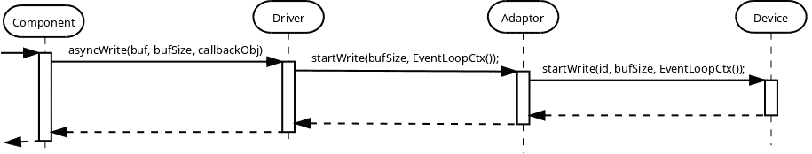

这种适配器的实现非常简单直接：

```cpp
template <typename TDevice>
class IdAdaptor
{
public:
    // Type of the underlaying device.
    typedef TDevice Device;

    // Character type defined in the wrapped device
    typedef typename TDevice::CharType CharType;

    // Device identification type defined in the wrapped device class.
    typedef typename TDevice::DeviceIdType DeviceIdType;

    IdAdaptor(Device& device, DeviceIdType id)
      : device_(device),
        id_(id)
    {
    }

    template <typename TFunc>
    void setCanReadHandler(TFunc&& func)
    {
        device_.setCanReadHandler(id_, std::forward<TFunc>(func));
    }

    template <typename TFunc>
    void setCanWriteHandler(TFunc&& func)
    {
        device_.setCanWriteHandler(id_, std::forward<TFunc>(func));
    }

    template <typename TFunc>
    void setReadCompleteHandler(TFunc&& func)
    {
        device_.setReadCompleteHandler(id_, std::forward<TFunc>(func));
    }

    template <typename TFunc>
    void setWriteCompleteHandler(TFunc&& func)
    {
        device_.setWriteCompleteHandler(id_, std::forward<TFunc>(func));
    }

    template <typename... TArgs>
    void startRead(TArgs&&... args)
    {
        device_.startRead(id_, std::forward<TArgs>(args)...);
    }

    template <typename... TArgs>
    bool cancelRead(TArgs&&... args)
    {
        return device_.cancelRead(id_, std::forward<TArgs>(args)...);
    }

    template <typename... TArgs>
    void startWrite(TArgs&&... args)
    {
        device_.startWrite(id_, std::forward<TArgs>(args)...);
    }

    template <typename... TArgs>
    bool cancelWrite(TArgs&&... args)
    {
        return device_.cancelWrite(id_, std::forward<TArgs>(args)...);
    }

    template <typename... TArgs>
    bool suspend(TArgs&&... args)
    {
        return device_.suspend(id_, std::forward<TArgs>(args)...);
    }

    template <typename... TArgs>
    void resume(TArgs&&... args)
    {
        device_.resume(id_, std::forward<TArgs>(args)...);
    }

    template <typename... TArgs>
    bool canRead(TArgs&&... args)
    {
        return device_.canRead(id_, std::forward<TArgs>(args)...);
    }

    template <typename... TArgs>
    bool canWrite(TArgs&&... args)
    {
        return device_.canWrite(id_, std::forward<TArgs>(args)...);
    }

    template <typename... TArgs>
    CharType read(TArgs&&... args)
    {
        return device_.read(id_, std::forward<TArgs>(args)...);
    }

    template <typename... TArgs>
    void write(TArgs&&... args)
    {
        device_.write(id_, std::forward<TArgs>(args)...);
    }

private:
    Device& device_;
    DeviceIdType id_;
};
```

相同的适配器类在 [embxx](https://github.com/arobenko/embxx) 库的 [embxx/device/IdDeviceCharAdapter.h](https://github.com/arobenko/embxx/blob/master/embxx/device/IdDeviceCharAdapter.h) 文件中实现。

#### 操作队列

I2C协议允许同一总线上存在多个独立的从设备。这意味着可能有多个独立的 **组件** 与不同的I2C设备（例如EEPROM和温度传感器）通信，但必须共享相同的 **设备** 控制对象，并且可以并行向其发出读写请求。为了解决这个问题，必须有一种操作排队设施，负责排队所有对 **设备** 的读写请求，并依次发出。

对象使用图如下：


此队列是一段平台/产品无关的代码，它应该在不使用动态内存分配和/或异常的情况下实现。这意味着它应该接收各种**驱动器**对象的数量，这些对象可以独立地向它发出读写请求（即内部队列的大小），作为一个模板参数，并且可能使用[静态（固定大小）队列](#basic_needs-queue)来排队所有传入的请求。它还应接收回调存储类型，以报告何时可以读取/写入新字符，以及何时读写操作完成。

```cpp
template <typename TDevice,
          std::size_t TSize,
          typename TCanDoOpHandler = embxx::util::StaticFunction<void()>,
          typename TOpCompleteHandler =
              embxx::util::StaticFunction<void (const embxx::error::ErrorStatus&)> >
class DeviceOpQueue
{
public:
    DeviceOpQueue(TDevice& device);
    ...
private:
    typedef embxx::container::StaticQueue<..., TSize> Queue;
    Queue queue_;
};
```

当`TSize`模板参数设置为`1`时，不需要所有排队功能，`DeviceOpQueue`类可能成为一个简单的透传内联类，使用模板特化：

```cpp
template <typename TDevice>
class DeviceOpQueue<TDevice, 1>
{
public:

    typedef typename TDevice::PinIdType PinIdType;

    template <typename... TArgs>
    void startRead(TArgs&&... args)
    {
        device_.startRead(std::forward<TArgs>(args)...)
    }

    template <typename... TArgs>
    bool cancelRead(PinIdType id, TArgs&&... args)
    {
        static_cast<void>(id); // No use for id in the Device itself
        return device_.cancelRead(std::forward<TArgs>(args)...)
    }

    template <typename... TArgs>
    bool suspend(PinIdType id, TArgs&&... args)
    {
        static_cast<void>(id); // No use for id in the Device itself
        return device_.suspend(std::forward<TArgs>(args)...)
    }

    ...
};
```

此队列也在[embxx](https://github.com/arobenko/embxx)库中实现。它位于[embxx/device/DeviceOpQueue.h](https://github.com/arobenko/embxx/blob/master/embxx/device/DeviceOpQueue.h)文件中。

请注意，[ID适配器](#peripherals-i2c-id_adaptor)和[[peripherals-i2c-operations_queue]](#peripherals-i2c-operations_queue)都是**设备**层类。它们作为包装实际外围控制**设备**的包装器，以便向上层**驱动器**暴露正确的接口。

#### I2C设备

剩下的唯一事情是正确实现I2C控制设备，该设备可以被`DeviceOpQueue`使用，而`DeviceOpQueue`反过来又被`IdAdaptor`使用。`IdAdaptor`对象可以与现有的用于[UART](#peripherals-uart)外围设备的`Character`**驱动器**一起使用。

根据上述信息，特定平台的I2C控制**设备**对象必须提供以下公共接口：

```cpp
class I2CDevice
{
public:
    // Single character type
    typedef std::uint8_t CharType;

    // ID type
    typedef std::uint8_t DeviceIdType;

    // Context types
    typedef embxx::device::context::EventLoop EventLoopContext;
    typedef embxx::device::context::Interrupt InterruptContext;

    // Set various interrupt handlers
    template <typename TFunc>
    void setCanReadHandler(TFunc&& func);

    template <typename TFunc>
    void setCanWriteHandler(TFunc&& func);

    template <typename TFunc>
    void setReadCompleteHandler(TFunc&& func);

    template <typename TFunc>
    void setWriteCompleteHandler(TFunc&& func);

    // Start read for both contexts.
    void startRead(DeviceIdType address, std::size_t length, EventLoopContext);
    void startRead(DeviceIdType address, std::size_t length, InterruptContext);

    // Cancel read for both contexts.
    bool cancelRead(EventLoopContext);
    bool cancelRead(InterruptContext);

    // Start write for both contexts.
    void startWrite(DeviceIdType address, std::size_t length, EventLoopContext);
    void startWrite(DeviceIdType address, std::size_t length, InterruptContext);
        TContext context);

    // Cancel write for both contexts.
    bool cancelWrite(EventLoopContext);
    bool cancelWrite(InterruptContext);

    // Suspend/Resume
    bool suspend(EventLoopContext);
    void resume(EventLoopContext);

    // Helper functions to manage read/write during the interrupt
    bool canRead(InterruptContext);
    bool canWrite(InterruptContext);
    CharType read(InterruptContext);
    void write(CharType value, InterruptContext);
};
```

在RaspberryPi平台上控制**I2C0**接口的此类设备在[embxx_on_rpi](https://github.com/arobenko/embxx_on_rpi)项目的[src/device/I2C0.h](https://github.com/arobenko/embxx_on_rpi/blob/master/src/device/I2C0.h)文件中实现。

#### EEPROM访问应用程序

[embxx_on_rpi](https://github.com/arobenko/embxx_on_rpi)项目包含一个名为[app_i2c0_eeprom](https://github.com/arobenko/embxx_on_rpi/tree/master/src/app/app_i2c0_eeprom)的应用程序。它实现了对连接到同一I2C0总线但具有不同地址的2个EEPROM的并行访问。EEPROM同时以读写操作独立访问。这些操作由包装实际I2C控制**设备**并逐个转发请求的`DeviceOpQueue`对象排队和管理。

### SPI

[SPI](http://en.wikipedia.org/wiki/Serial_Peripheral_Interface_Bus)也是一种相当流行的串行通信接口。在它使用本书中描述的[设备-驱动器-组件](#basic_concepts-device_driver_component)模型方面，它与[I2C](#peripherals-i2c)非常相似。主要区别是：

1.  SPI使用“芯片选择”识别方法而不是外围设备的“地址”。

1.  SPI 是一个双向链接 - 总是会并行执行读取和写入操作（而不是只有读取或只有写入）。

“芯片选择”从机识别将需要与 [I2C](#peripherals-i2c) 集成时使用的相同的 "**ID 适配器**"。

就像 [I2C](#peripherals-i2c) 一样，[SPI](http://en.wikipedia.org/wiki/Serial_Peripheral_Interface_Bus) 是一个多从机总线。它允许将多个独立设备连接到 SPI 接口的相同 MISO/MOSI/CLK 线。这意味着需要与 [I2C](#peripherals-i2c) 集成时使用的相同的 "**操作队列**"。由于 SPI 是一个双向链接，所以 "**操作队列**" 必须能够转发，例如，读取操作请求到实际的 **设备**，即使对同一从设备的“写入”操作已经在进行中。

这意味着对象的用法图与 [I2C](#peripherals-i2c) 完全相同。


上图中的所有中间层（字符 **驱动程序**、ID 适配器、操作队列）都必须允许同时发出读取和写入操作。这成为特定产品 **组件** 的责任，使其意识到使用了哪种类型的 **设备**，并且如果实际 **设备**（如 I2C）不支持，则不要并行发出这些请求。

#### SPI 设备

根据上述信息，特定平台 SPI 控制设备对象必须提供并实现与 [I2C](#peripherals-i2c) **设备** 完全相同的接口：

```cpp
class SpiDevice
{
public:
    // Single character type
    typedef std::uint8_t CharType;

    // ID type - chip select index
    typedef unsigned DeviceIdType;

    // Context types
    typedef embxx::device::context::EventLoop EventLoopContext;
    typedef embxx::device::context::Interrupt InterruptContext;

    // Set various interrupt handlers
    template <typename TFunc>
    void setCanReadHandler(TFunc&& func);

    template <typename TFunc>
    void setCanWriteHandler(TFunc&& func);

    template <typename TFunc>
    void setReadCompleteHandler(TFunc&& func);

    template <typename TFunc>
    void setWriteCompleteHandler(TFunc&& func);

    // Start read for both contexts.
    void startRead(DeviceIdType chipSelect, std::size_t length, EventLoopContext);
    void startRead(DeviceIdType chipSelect, std::size_t length, InterruptContext);

    // Cancel read for both contexts.
    bool cancelRead(EventLoopContext);
    bool cancelRead(InterruptContext);

    // Start write for both contexts.
    void startWrite(DeviceIdType chipSelect, std::size_t length, EventLoopContext);
    void startWrite(DeviceIdType chipSelect, std::size_t length, InterruptContext);
        TContext context);

    // Cancel write for both contexts.
    bool cancelWrite(EventLoopContext);
    bool cancelWrite(InterruptContext);

    // Suspend/Resume
    bool suspend(EventLoopContext);
    void resume(EventLoopContext);

    // Helper functions to manage read/write during the interrupt
    bool canRead(InterruptContext);
    bool canWrite(InterruptContext);
    CharType read(InterruptContext);
    void write(CharType value, InterruptContext);
};
```

在 RaspberryPi 平台上控制 **SPI0** 接口的此类设备在 [embxx_on_rpi](https://github.com/arobenko/embxx_on_rpi) 项目的 [src/device/Spi0.h](https://github.com/arobenko/embxx_on_rpi/blob/master/src/device/Spi0.h) 文件中实现。

#### 其他细微差别

SPI 经常与外部持久存储设备一起使用，例如 SD 卡。这些设备在 `MOSI` 线上的块写入操作和它们在 `MISO` 线上发送关于操作完成确认之间可能会有一些显著的延迟。SPI **设备** 必须不断读取传入的字节，直到接收到预期的 `ACK`/`NACK` 字节，而不释放 `CS`（芯片选择）。如果负责管理 SPI 闪存内存的 **组件** 只发出单个“读取”操作以等待此类确认，提供的缓冲区可能会在接收到所需的字节之前就满了。在这种情况下，SPI 控制设备对象不知道新的“读取”请求可能随后到来，并必须释放 `CS`，这是不希望的。

为了解决这个问题，[UART](#peripherals-uart)章节中描述的字符**驱动程序**必须扩展以支持同时执行多个读写操作。这种扩展基于提供的`Traits`类中的`ReadQueueSize`/`WriteQueueSize`值。这些值表示可以发送给**驱动程序**的最大并发读写操作数。负责的**组件**必须同时执行2或3次“读取直到”操作以等待预期的响应。一旦第一个缓冲区填满，**驱动程序**将发布**组件**的回调对象以在事件循环上下文中执行，同时调用**设备**的`startRead()`成员函数以在中断上下文中填充下一个挂起的“读取直到”操作，以填充第二个缓冲区。**设备**负责继续其读取操作而不释放`CS`线。当第二个缓冲区被填充时，**组件**有足够的时间识别填充的缓冲区中没有响应，并重新向**驱动程序**发出“读取直到”请求，同时重用相同的缓冲区。这个“读取直到”请求的循环必须继续，直到遇到预期的响应或操作超时，超时是通过异步等待请求到[定时器](timer.md)独立测量的。负责的**组件**对象必须管理对字符**驱动程序**的操作以及事件循环上下文中的定时器，并在执行来自另一个回调的回调时取消一个。

#### 外部存储

如前所述，SPI通常与外部持久存储一起使用，例如SD卡。为了正确支持它，必须有一种`SpiFlash`管理**组件**，该组件负责实现适当的[通信协议](https://www.sdcard.org/downloads/pls/simplified_specs/part1_410.pdf)，同时提供必要的公共接口。所需的最小接口必须能够：

1.  异步初始化设备。

1.  异步读取数据块。

1.  异步写入数据块。

一旦这样的**组件**被实现和测试，下一个阶段将是实现适当的文件系统（FAT32）管理**组件**，使用前者的异步函数。这将允许在处理所有其他事件的同时处理耗时的文件系统读写操作，而不会创建任何性能瓶颈，也不需要任何复杂的独立任务调度。

### 其他

有许多其他外围设备或协议（例如I2S、USB、单线）。实现和主要概念应该与迄今为止涵盖的外围设备非常相似。在这个阶段，我并不打算在本书中实现它。至少在近期内不会。

各种微控制器也可能支持对某些外设的 [DMA](http://en.wikipedia.org/wiki/Direct_memory_access) 访问。在这种情况下，[UART](#peripherals-uart) 章节中提到的 `Character` **驱动程序** 必须替换为某种 `Block` **驱动程序**，这将允许同时发出多个读写请求，并且只会从 **设备** 接收“操作完成”通知。我将其实施留作读者的练习。至少目前是这样。
