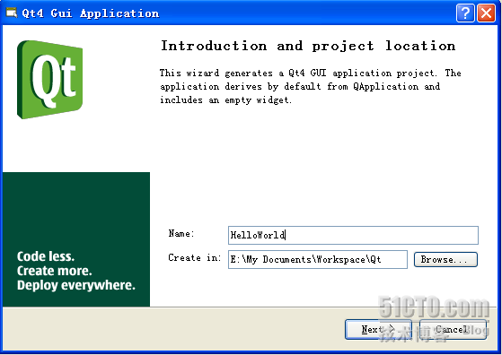
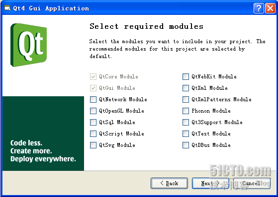
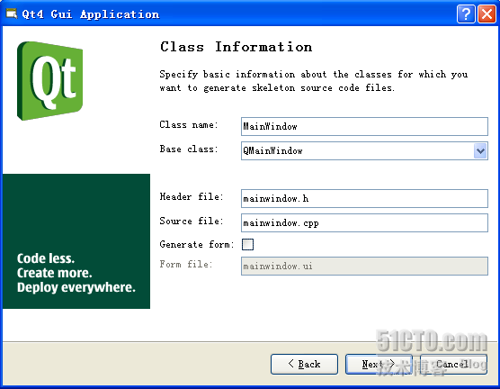
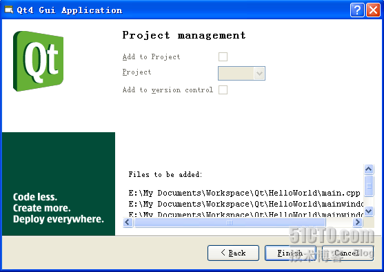
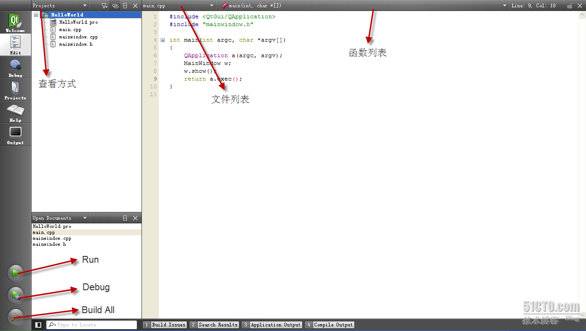

# 一、Hello, world!

任何编程技术的学习第一课基本上都会是 Hello, world!，我也不想故意打破这个惯例——照理说，应该首先回顾一下 Qt 的历史，不过即使不说这些也并无大碍。

或许有人总想知道，Qt 这个单词是什么意思。其实，这并不是一个缩写词，仅仅是因为它的发明者，TrollTech 公司的 CEO，Haarard Nord 和 Trolltech 公司的总裁 Eirik Chambe-Eng 在联合发明 Qt 的时候并没有一个很好的名字。在这里，字母 Q 是 Qt 库中所有类的前缀——这仅仅是因为在 Haarard 的 emacs 的字体中，这个字母看起来特别的漂亮；而字母 t 则代表“toolkit”，这是在 Xt( X toolkit )中得到的灵感。

顺便说句，Qt 原始的公司就是上面提到的 Trolltech，貌似有一个中文名字是奇趣科技——不过现在已经被 Nokia 收购了。因此，一些比较旧的文章里面会提到 Trolltech 这个名字。

好了，闲话少说，先看看 Qt 的开发吧！事先说明一下，我是一个比较懒的人，不喜欢配置很多的东西，而 Qt 已经提供了一个轻量级的 IDE，并且它的网站上也有 for Eclipse 和 VS 的开发插件，不过在这里我并不想用这些大块头 :)

Qt 有两套协议——商业版本和开源的 LGPL 版本。不同的是前者要收费，而后者免费，当然，后者还要遵循 LGPL 协议的规定，这是题外话。

Qt 的网址是 [`qt.nokia.com/downloads`](https://qt.nokia.com/downloads)，不过我打开这个站点总是很慢，不知道为什么。你可以找到大大的 LGPL/Free 和 Commercial，好了，我选的是 LGPL 版本的，下载包蛮大，但是下载并不会很慢。下载完成后安装就可以了，其它不用管了。这样，整个 Qt 的开发环境就装好了——如果你需要的话，也可以把 qmake 所在的目录添加进环境变量，不过我就不做了。

安装完成后会有个 Qt Creator 的东西，这就是官方提供的一个轻量级 IDE，不过它的功能还是蛮强大的。运行这个就会发现，其实 Qt 不仅仅是 Linux KDE 桌面的底层实现库。而且是这个 IDE 的实现 :) 这个 IDE 就是用 Qt 完成的。

Qt Creator 左面从上到下依次是 Welcome(欢迎页面，就是一开始出现的那个)；Edit(我们的代码编辑窗口)；Debug(调试窗口)；Projects(工程窗口)；Help(帮助，这个帮助完全整合的 Qt 的官方文档，相当有用)；Output(输出窗口)。

下面我们来试试我们的 Hello, world! 吧！

在 Edit 窗口空白处点右键，有 New project... 这里我们选第三项，Qt Gui Application。


然后点击 OK，来到下一步，输入工程名字和保存的位置。



点击 Next，来到选择库的界面。这里我们系统默认为我们选择了 Qt core 和 GUI，还记得我们建的是 Gui Application 吗？嗯，就是这里啦，它会自动为我们加上 gui 这个库。现在应该就能看出，Qt 是多么庞大的一个库，它不仅仅有 Gui，而且有 Network，OpenGL，XML 之类。不过，现在在这里我们不作修改，直接 Next。



下一个界面需要我们定义文件名，我们不修改默认的名字，只是为了清除起见，把 generate form 的那个勾去掉即可。



Next 之后终于到了 Finish 了——漫长的一系列啊！检查无误后 Finish 就好啦！



之后可以看到，IDE 自动生成了四个文件，一个.pro 文件，两个.cpp 和一个.h。这里说明一下，.pro 就是工程文件(project)，它是 qmake 自动生成的用于生产 makefile 的配置文件。这里我们先不去管它。main.cpp 里面就是一个 main 函数，其他两个文件就是先前我们曾经指定的文件名的文件。



现在，我们把 main.cpp 中的代码修改一下：

```cpp
 #include <QtGui/QApplication> 

 #include <QLabel> 

int main(int argc, char *argv[]) 
{ 
        QApplication a(argc, argv); 
        QLabel *label = new QLabel("Hello, world!"); 
        label->show(); 
        return a.exec(); 
}
```

修改完成后保存。点击左下角的绿色三角键，Run。一个小小的窗口出现了——


好了！我们的第一个 Qt 程序已经完成了。

PS：截了很多图，说得详细些，以后可就没这么详细的步骤啦，嘿嘿…相信很多朋友应该一下子就能看明白这个 IDE 应该怎么使用了的，无需我多费口舌。呵呵。

下一篇中，将会对这个 Hello, world!做一番逐行解释！

本文出自 “豆子空间” 博客，请务必保留此出处 [`devbean.blog.51cto.com/448512/194031`](http://devbean.blog.51cto.com/448512/194031)