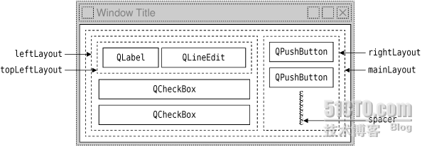

# 七、创建一个对话框(下)

接着前一篇，下面是源代码部分：

```cpp
 #include <QtGui> 

 #include "finddialog.h" 

FindDialog::FindDialog(QWidget *parent) 
        : QDialog(parent) 
{ 
        label = new QLabel(tr("Find &what:")); 
        lineEdit = new QLineEdit; 
        label->setBuddy(lineEdit); 

        caseCheckBox = new QCheckBox(tr("Match &case")); 
        backwardCheckBox = new QCheckBox(tr("Search &backford")); 

        findButton = new QPushButton(tr("&Find")); 
        findButton->setDefault(true); 
        findButton->setEnabled(false); 

        closeButton = new QPushButton(tr("Close")); 

        connect(lineEdit, SIGNAL(textChanged(const QString&)), this, SLOT(enableFindButton(const QString&))); 
        connect(findButton, SIGNAL(clicked()), this, SLOT(findClicked())); 
        connect(closeButton, SIGNAL(clicked()), this, SLOT(close())); 

        QHBoxLayout *topLeftLayout = new QHBoxLayout; 
        topLeftLayout->addWidget(label); 
        topLeftLayout->addWidget(lineEdit); 

        QVBoxLayout *leftLayout = new QVBoxLayout; 
        leftLayout->addLayout(topLeftLayout); 
        leftLayout->addWidget(caseCheckBox); 
        leftLayout->addWidget(backwardCheckBox); 

        QVBoxLayout *rightLayout = new QVBoxLayout; 
        rightLayout->addWidget(findButton); 
        rightLayout->addWidget(closeButton); 
        rightLayout->addStretch(); 

        QHBoxLayout *mainLayout = new QHBoxLayout; 
        mainLayout->addLayout(leftLayout); 
        mainLayout->addLayout(rightLayout); 
        setLayout(mainLayout); 

        setWindowTitle(tr("Find")); 
        setFixedHeight(sizeHint().height()); 
} 

FindDialog::~FindDialog() 
{ 

} 

void FindDialog::findClicked() 
{ 
        QString text = lineEdit->text(); 
        Qt::CaseSensitivity cs = caseCheckBox->isChecked() ? Qt::CaseInsensitive : Qt::CaseSensitive; 
        if(backwardCheckBox->isChecked()) { 
                emit findPrevious(text, cs); 
        } else { 
                emit findNext(text, cs); 
        } 
} 

void FindDialog::enableFindButton(const QString &text) 
{ 
        findButton->setEnabled(!text.isEmpty()); 
}
```

CPP 文件要长一些哦——不过，它们的价钱也会更高，嘿嘿——嗯，来看代码，第一行 include 的是 QtGui。Qt 是分模块的，记得我们建工程的时候就会问你，使用哪些模块？QtCore？QtGui？QtXml？等等。这里，我们引入 QtGui，它包括了 QtCore 和 QtGui 模块。不过，这并不是最好的做法，因为 QtGui 文件很大，包括了 GUI 的所有组件，但是很多组件我们根本是用不到的——就像 Swing 的 import，你可以 import 到类，也可以使用*，不过都不会建议使用*，这里也是一样的。我们最好只引入需要的组件。不过，那样会把文件变长，现在就先用 QtGui 啦，只要记得正式开发时不能这么用就好啦！

构造函数有参数初始化列表，用来调用父类的构造函数，相当于 Java 里面的 super()函数。这是 C++ 的相关知识，不是 Qt 发明的，这里不再赘述。

然后新建一个 QLabel。还记得前面的 Hello, world!里面也使用过 QLabel 吗？那时候只是简单的传入一个字符串啊！这里怎么是一个函数 tr()？函数 tr()全名是 QObject::tr()，被它处理的字符串可以使用工具提取出来翻译成其他语言，也就是做国际化使用。这以后还会仔细讲解，只要记住，Qt 的最佳实践：如果你想让你的程序国际化的话，那么，所有用户可见的字符串都要使用 QObject::tr()！但是，为什么我们没有写 QObject::tr()，而仅仅是 tr()呢？原来，tr()函数是定义在 Object 里面的，所有使用了 Q_OBJECT 宏的类都自动具有 tr()函数。

字符串中的&代表快捷键。注意看下面的 findButton 的 &Find，它会生成 Find 字符串，当你按下 Alt+F 的时候，这个按钮就相当于被点击——这么说很难受，相信大家都明白什么意思。同样，前面 label 里面也有一个&，因此它的快捷键就是 Alt+W。不过，这个 label 使用了 setBuddy 函数，它的意思是，当 label 获得焦点时，比如按下 Alt+W，它的焦点会自动传给它的 buddy，也就是 lineEdit。看，这就是伙伴的含义(buddy 英文就是伙伴的意思)。

后面几行就比较简单了：创建了两个 QCheckBox，把默认的按钮设为 findButton，把 findButton 设为不可用——也就是变成灰色的了。

再下面是三个 connect 语句，用来连接信号槽。可以看到，当 lineEdit 发出 textChanged(const QString&)信号时，FindDialog 的 enableFindButton(const QString&)函数会被调用——这就是回调，是有系统自动调用，而不是你去调用——当 findButton 发出 clicked()信号时，FindDialog 的 findClicked()函数会被调用；当 closeButton 发出 clicked()信号时，FindDialog 的 close()函数会被调用。注意，connect()函数也是 QObject 的，因为我们继承了 QObject，所以能够直接使用。

后面的很多行语句都是 layout 的使用，虽然很复杂，但是很清晰——编写 layout 布局最重要一点就是思路清楚，想清楚哪个套哪个，就会很好编写。这里我们的对话框实际上是这个样子的：



注意那个 spacer 是由 rightLayout 的 addStretch()添加的，就像弹簧一样，把上面的组件“顶起来”。

最后的 setWindowTitle()就是设置对话框的标题，而 setFixedHeight()是设置成固定的高度，其参数值 sizeHint()返回“最理想”的大小，这里我们使用的是 height()函数去到“最理想”的高度。

好了，下面该编写槽了——虽然说是 slot，但实际上它就是普通的函数，既可以和其他函数一样使用，又可以被系统回调。

先看 findClicked()函数。首先取出 lineEdit 的输入值；然后判断 caseCheckBox 是不是选中，如果选中就返回 Qt::CaseInsensitive，否则返回 Qt::CaseSensitive，用于判断是不是大小写敏感的查找；最后，如果 backwardCheckBox 被选中，就 emit(发出)信号 findPrevious()，否则 emit 信号 findNext。

enableFindButton()则根据 lineEdit 的内容是不是变化——这是我们的 connect 连接的——来设置 findButton 是不是可以使用，这个很简单，不再说了。

这样，FindDialog.cpp 也就完成了。下面编写 main.cpp——其实 QtCreator 已经替我们完成了——

```cpp
 #include <QApplication> 

 #include "finddialog.h" 

int main(int argc, char *argv[]) 
{ 
        QApplication app(argc, argv); 
        FindDialog *dialog = new FindDialog; 
        dialog->show(); 
        return app.exec(); 
}
```

运行一下看看我们的成果吧！

虽然很简单，也没有什么实质性的功能，但是我们已经能够制作对话框了—— Qt 的组件成百上千，不可能全部介绍完，只能用到什么学什么，更重要的是，我们已经了解了其编写思路，否则的话，即便是你拿着全世界所有的砖瓦，没有设计图纸，你也不知道怎么把它们组合成高楼大厦啊！

嘿嘿，下回见！

本文出自 “豆子空间” 博客，请务必保留此出处 [`devbean.blog.51cto.com/448512/194031`](http://devbean.blog.51cto.com/448512/194031)