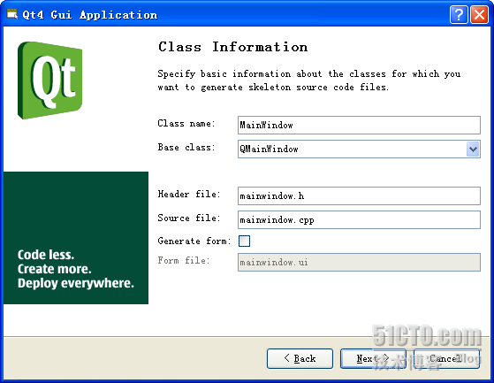
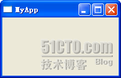
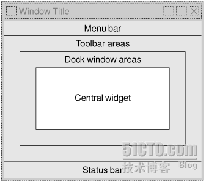

# 十、MainWindow

尽管 Qt 提供了很方便的快速开发工具 QtDesigner 用来拖放界面元素，但是现在我并不打算去介绍这个工具，原因之一在于我们的学习大体上是依靠手工编写代码，过早的接触设计工具并不能让我们对 Qt 的概念突飞猛进……

前面说过，本教程很大程度上依照的是《C++ GUI Programming with Qt4, 2nd Edition》这本书。但是，这本书中接下来的部分用了很大的篇幅完成了一个简单的类似 Excel 的程序。虽然最终效果看起来很不错，但我并不打算完全依照这个程序来，因为这个程序太大，以至于我们在开始之后会有很大的篇幅接触不到能够运行的东西，这无疑会严重打击学习的积极性——至少我是如此，看不到做的东西很难受——所以，我打算重新组织一下这个程序，请大家按照我的思路试试看吧！

闲话少说，下面开始新的篇章！

就像 Swing 的顶层窗口一般都是 JFrame 一样，Qt 的 GUI 程序也有一个常用的顶层窗口，叫做 MainWindow。好了，现在我们新建一个 Gui Application 项目 MyApp，注意在后面选择的时候选择 Base Class 是 QMainWindow。

然后确定即可。此时，QtCreator 已经为我们生成了必要的代码，我们只需点击一下 Run，看看运行出来的结果。

一个很简单的窗口，什么都没有，这就是我们的主窗口了。

MainWindow 继承自 QMainWindow。QMainWindow 窗口分成几个主要的区域：

最上面是 Window Title，用于显示标题和控制按钮，比如最大化、最小化和关闭等；下面一些是 Menu Bar，用于显示菜单；再下面一点事 Toolbar areas，用于显示工具条，注意，Qt 的主窗口支持多个工具条显示，因此这里是 ares，你可以把几个工具条并排显示在这里，就像 Word2003 一样；工具条下面是 Dock window areas，这是停靠窗口的显示区域，所谓停靠窗口就是像 Photoshop 的工具箱一样，可以在主窗口的四周显示；再向下是 Status Bar，就是状态栏；中间最大的 Central widget 就是主要的工作区了。

好了，今天的内容不多，我们以后的工作就是要对这个 MainWindow 进行修改，以满足我们的各种需要。

本文出自 “豆子空间” 博客，请务必保留此出处 [`devbean.blog.51cto.com/448512/194031`](http://devbean.blog.51cto.com/448512/194031)