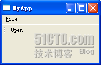

# 十一、菜单和工具条

在前面的 QMainWindow 的基础之上，我们开始着手建造我们的应用程序。虽然现在已经有一个框架，但是，确切地说我们还一行代码没有写呢！下面的工作就不那么简单了！在这一节里面，我们要为我们的框架添加菜单和工具条。

就像 Swing 里面的 Action 一样，Qt 里面也有一个类似的类，叫做 QAction。顾名思义，QAction 类保存有关于这个动作，也就是 action 的信息，比如它的文本描述、图标、快捷键、回调函数(也就是信号槽)，等等。神奇的是，QAction 能够根据添加的位置来改变自己的样子——如果添加到菜单中，就会显示成一个菜单项；如果添加到工具条，就会显示成一个按钮。这也是为什么要把菜单和按钮放在一节里面。下面开始学习！

首先，我想添加一个打开命令。那么，就在头文件里面添加一个私有的 QAction 变量：

```cpp
class QAction; 
//... 
private: 
        QAction *openAction; 
//...
```

注意，不要忘记 QAction 类的前向声明哦！要不就会报错的！

然后我们要在 cpp 文件中添加 QAction 的定义。为了简单起见，我们直接把它定义在构造函数里面：

```cpp
        openAction = new QAction(tr("&Open"), this); 
        openAction->setShortcut(QKeySequence::Open); 
        openAction->setStatusTip(tr("Open a file."));
```

第一行代码创建一个 QAction 对象。QAction 有几个重载的构造函数，我们使用的是

```cpp
QAction(const QString &text, QObject* parent);
```

这一个。它有两个参数，第一个 text 是这个动作的文本描述，用来显示文本信息，比如在菜单中的文本；第二个是 parent，一般而言，我们通常传入 this 指针就可以了。我们不需要去关心这个 parent 参数具体是什么，它的作用是指明这个 QAction 的父组件，当这个父组件被销毁时，比如 delete 或者由系统自动销毁，与其相关联的这个 QAction 也会自动被销毁。

如果你还是不明白构造函数的参数是什么意思，或者说想要更加详细的了解 QAction 这个类，那么就需要自己翻阅一下它的 API 文档。前面说过有关 API 的使用方法，这里不再赘述。这也是学习 Qt 的一种方法，因为 Qt 是一个很大的库，我们不可能面面俱到，因此只为说道用到的东西，至于你自己想要实现的功能，就需要自己去查文档了。

第二句，我们使用了 setShortcut 函数。shortcut 是这个动作的快捷键。Qt 的 QKeySequence 已经为我们定义了很多内置的快捷键，比如我们使用的 Open。你可以通过查阅 API 文档获得所有的快捷键列表，或者是在 QtCreator 中输入::后会有系统的自动补全功能显示出来。这个与我们自己定义的有什么区别呢？简单来说，我们完全可以自己定义一个 tr("Ctrl+O")来实现快捷键。原因在于，这是 Qt 跨平台性的体现。比如 PC 键盘和 Mac 键盘是不一样的，一些键在 PC 键盘上有，而 Ma x 键盘上可能并不存在，或者反之，所以，推荐使用 QKeySequence 类来添加快捷键，这样，它会根据平台的不同来定义不同的快捷键。

第三句是 setStatusTip 函数。这是添加状态栏的提示语句。状态栏就是主窗口最下面的一条。现在我们的程序还没有添加状态栏，因此你是看不到有什么作用的。

下面要做的是把这个 QAction 添加到菜单和工具条：

```cpp
QMenu *file = menuBar()->addMenu(tr("&File")); 
        file->addAction(openAction); 

        QToolBar *toolBar = addToolBar(tr("&File")); 
        toolBar->addAction(openAction);
```

QMainWindow 有一个 menuBar()函数，会返回菜单栏，也就是最上面的那一条。如果不存在会自动创建，如果已经存在就返回那个菜单栏的指针。直接使用返回值添加一个菜单，也就是 addMenu，参数是一个 QString，也就是显示的菜单名字。然后使用这个 QMenu 指针添加这个 QAction。类似的，使用 addToolBar 函数的返回值添加了一个工具条，并且把这个 QAction 添加到了上面。

好了，主要的代码已经写完了。不过，如果你只修改这些的话，是编译不过的哦！因为像 menuBar()函数返回一个 QMenuBar 指针，但是你并没有 include 它的头文件哦！虽然没有明着写出 QMenuBar 这个类，但是实际上你已经用到了它的 addMenu 函数了，所以还是要注意的！

下面给出来全部的代码：

1.  mainwindow.h

```cpp
 #ifndef MAINWINDOW_H 

 #define MAINWINDOW_H 

 #include <QtGui/QMainWindow> 

class QAction; 

class MainWindow : public QMainWindow 
{ 
        Q_OBJECT 

public: 
        MainWindow(QWidget *parent = 0); 
        ~MainWindow(); 

private: 
        QAction *openAction; 
}; 

 #endif // MAINWINDOW_H
```

1.  mainwindow.cpp

```cpp
 #include <QtGui/QAction> 

 #include <QtGui/QMenu> 

 #include <QtGui/QMenuBar> 

 #include <QtGui/QKeySequence> 

 #include <QtGui/QToolBar> 

 #include "mainwindow.h" 

MainWindow::MainWindow(QWidget *parent) 
        : QMainWindow(parent) 
{ 
        openAction = new QAction(tr("&Open"), this); 
        openAction->setShortcut(QKeySequence::Open); 
        openAction->setStatusTip(tr("Open a file.")); 

        QMenu *file = menuBar()->addMenu(tr("&File")); 
        file->addAction(openAction); 

        QToolBar *toolBar = addToolBar(tr("&File")); 
        toolBar->addAction(openAction); 
} 

MainWindow::~MainWindow() 
{ 

}
```

main.cpp 没有修改，这里就不给出了。下面是运行结果：



很丑，是吧？不过我们已经添加上了菜单和工具条了哦！按一下键盘上的 Alt+F，因为这是我们给它定义的快捷键。虽然目前挺难看，不过以后就会变得漂亮的！想想看，Linux 的 KDE 桌面可是 Qt 实现的呢！

本文出自 “豆子空间” 博客，请务必保留此出处 [`devbean.blog.51cto.com/448512/194031`](http://devbean.blog.51cto.com/448512/194031)