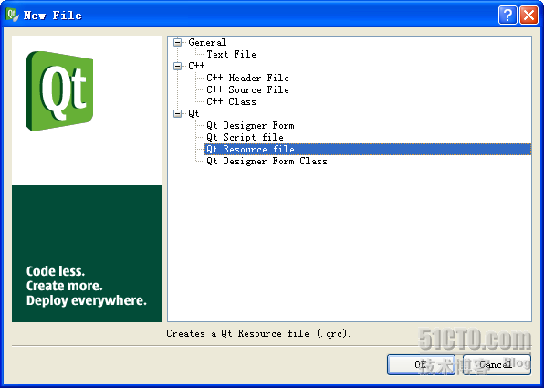
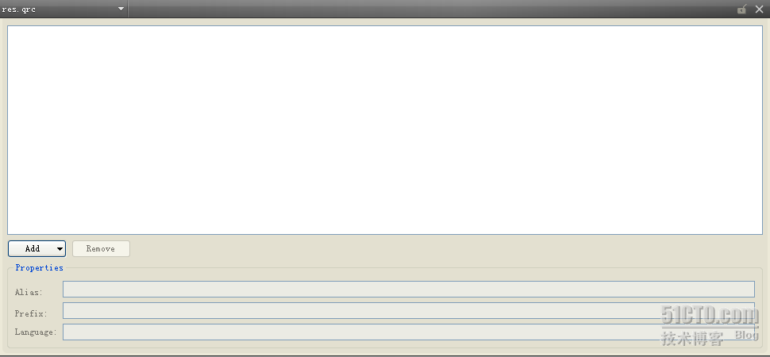
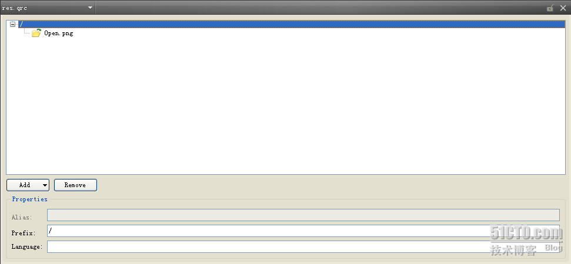
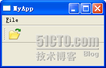
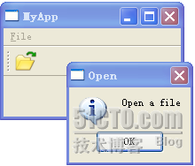

# 十二、菜单和工具条(续)

前面一节我们已经把 QAction 添加到菜单和工具条上面。现在我们要添加一些图片美化一下，然后把信号槽加上，这样，我们的 action 就可以相应啦！

首先来添加图标。QAction 的图标会显示在菜单项的前面以及工具条按钮上面显示。

为了添加图标，我们首先要使用 Qt 的资源文件。在 QtCreator 的项目上右击，选择 New File...，然后选择 resource file。



然后点击 next，选择好位置，Finish 即可。为了使用方便，我就把这个文件建在根目录下，建议应该在仔细规划好文件之后，建在专门的 rsources 文件夹下。完成之后，生成的是一个.qrc 文件，qrc 其实是 Qt Recource Collection 的缩写。它只是一个普通的 XML 文件，可以用记事本等打开。不过，这里我们不去深究它的结构，完全利用 QtCreator 操作这个文件，



点击 Add 按钮，首先选择 Add prefix，然后把生成的/new/prefix 改成/。这是 prefix 就是以后使用图标时需要提供的前缀，以/开头。添加过 prefix 之后，然后在工程文件中添加一个图标，再选择 Add file，选择那个图标。这样完成之后保存 qrc 文件即可。

说明一下，QToolBar 的图标大小默认是 32*32，菜单默认是 16*16。如果提供的图标小于要求的尺寸，则不做操作，Qt 不会为你放大图片；反之，如果提供的图标文件大于相应的尺寸要求，比如是 64*64，Qt 会自动缩小尺寸。



图片的路径怎么看呢？可以看出，Qt 的资源文件视图使用树状结构，根是/，叶子节点就是图片位置，连接在一起就是路径。比如这张图片的路径就是/Open.png。

注意，为了简单起见，我们没有把图标放在专门的文件夹中。正式的项目中应该单独有一个 resources 文件夹放资源文件的。

然后回到前面的 mainwindow.cpp，在构造函数中修改代码：

```cpp
openAction = new QAction(tr("&Open"), this); 
openAction->setShortcut(QKeySequence::Open); 
openAction->setStatusTip(tr("Open a file.")); 
openAction->setIcon(QIcon(":/Open.png")); // Add code.
```

我们使用 setIcon 添加图标。添加的类是 QIcon，构造函数需要一个参数，是一个字符串。由于我们要使用 qrc 中定义的图片，所以字符串以 : 开始，后面跟着 prefix，因为我们先前定义的 prefix 是/，所以就需要一个/，然后后面是 file 的路径。这是在前面的 qrc 中定义的，打开 qrc 看看那张图片的路径即可。

好了，图片添加完成，然后点击运行，看看效果吧！



瞧！我们只需要修改 QAction，菜单和工具条就已经为我们做好了相应的处理，还是很方便的！

下一步，为 QAction 添加事件响应。还记得 Qt 的事件响应机制是基于信号槽吗？点击 QAction 会发出 triggered()信号，所以，我们要做的是声名一个 slot，然后 connect 这个信号。

mainwindow.h

```cpp
class MainWindow : public QMainWindow 
{ 
        Q_OBJECT 

public: 
        MainWindow(QWidget *parent = 0); 
        ~MainWindow(); 

private slots: 
        void open();         

private: 
        QAction *openAction; 
};
```

因为我们的 open()目前只要在类的内部使用，因此定义成 private slots 即可。然后修改 cpp 文件：

```cpp
MainWindow::MainWindow(QWidget *parent) 
        : QMainWindow(parent) 
{ 
        openAction = new QAction(tr("&Open"), this); 
        openAction->setShortcut(QKeySequence::Open); 
        openAction->setStatusTip(tr("Open a file.")); 
        openAction->setIcon(QIcon(":/Open.png")); 
        connect(openAction, SIGNAL(triggered()), this, SLOT(open())); 

        QMenu *file = menuBar()->addMenu(tr("&File")); 
        file->addAction(openAction); 

        QToolBar *toolBar = addToolBar(tr("&File")); 
        toolBar->addAction(openAction); 
} 

void MainWindow::open() 
{ 
        QMessageBox::information(NULL, tr("Open"), tr("Open a file")); 
}
```

注意，我们在 open()函数中简单的弹出一个标准对话框，并没有其他的操作。编译后运行，看看效果：



好了，关于 QAction 的动作也已经添加完毕了！

至此，QAction 有关的问题先告一段落。最后说一下，如果你还不知道怎么添加子菜单的话，看一下 QMenu 的 API，里面会有一个 addMenu 函数。也就是说，创建一个 QMenu 然后添加就可以的啦！

本文出自 “豆子空间” 博客，请务必保留此出处 [`devbean.blog.51cto.com/448512/194031`](http://devbean.blog.51cto.com/448512/194031)