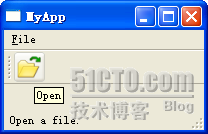
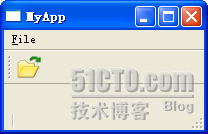

# 十三、状态栏

有段时间没有写过博客了。假期去上海旅游，所以一直没有能够上网。现在又来到这里，开始新的篇章吧！

今天的内容主要还是继续完善前面的那个程序。我们要为我们的程序加上一个状态栏。

状态栏位于主窗口的最下方，提供一个显示工具提示等信息的地方。一般地，当窗口不是最大化的时候，状态栏的右下角会有一个可以调节大小的控制点；当窗口最大化的时候，这个控制点会自动消失。Qt 提供了一个 QStatusBar 类来实现状态栏。

Qt 具有一个相当成熟的 GUI 框架的实现——这一点感觉比 Swing 要强一些—— Qt 似乎对 GUI 的开发做了很多设计，比如 QMainWindow 类里面就有一个 statusBar()函数，用于实现状态栏的调用。类似 menuBar()函数，如果不存在状态栏，该函数会自动创建一个，如果已经创建则会返回这个状态栏的指针。如果你要替换掉已经存在的状态栏，需要使用 QMainWindow 的 setStatusBar()函数。

在 Qt 里面，状态栏显示的信息有三种类型：临时信息、一般信息和永久信息。其中，临时信息指临时显示的信息，比如 QAction 的提示等，也可以设置自己的临时信息，比如程序启动之后显示 Ready，一段时间后自动消失——这个功能可以使用 QStatusBar 的 showMessage()函数来实现；一般信息可以用来显示页码之类的；永久信息是不会消失的信息，比如可以在状态栏提示用户 Caps Lock 键被按下之类。

QStatusBar 继承自 QWidget，因此它可以添加其他的 QWidget。下面我们在 QStatusBar 上添加一个 QLabel。

首先在 class 的声明中添加一个私有的 QLabel 属性：

```cpp
private: 
        QAction *openAction; 
        QLabel *msgLabel;
```

然后在其构造函数中添加：

```cpp
      msgLabel = new QLabel; 
        msgLabel->setMinimumSize(msgLabel->sizeHint()); 
        msgLabel->setAlignment(Qt::AlignHCenter); 

        statusBar()->addWidget(msgLabel);
```

这里，第一行创建一个 QLabel 的对象，然后设置最小大小为其本身的建议大小——注意，这样设置之后，这个最小大小可能是变化的——最后设置显示规则是水平居中(HCenter)。最后一行使用 statusBar()函数将这个 label 添加到状态栏。编译运行，将鼠标移动到工具条或者菜单的 QAction 上，状态栏就会有相应的提示：



看起来是不是很方便？只是，我们很快发现一个问题：当没有任何提示时，状态栏会有一个短短的竖线：



这是什么呢？其实，这是 QLabel 的边框。当没有内容显示时，QLabel 只显示出自己的一个边框。但是，很多情况下我们并不希望有这条竖线，于是，我们对 statusBar()进行如下设置：

```cpp
statusBar()->setStyleSheet(QString("QStatusBar::item{border: 0px}"));
```

这里先不去深究这句代码是什么意思，简单来说，就是把 QStatusBar 的子组件的 border 设置为 0，也就是没有边框。现在再编译试试吧！那个短线消失了！

QStatusBar 右下角的大小控制点可以通过 setSizeGripEnabled()函数来设置是否存在，详情参见 API 文档。

好了，现在，我们的状态栏已经初步完成了。由于 QStatusBar 可以添加多个 QWidget，因此，我们可以构建出很复杂的状态栏。

本文出自 “豆子空间” 博客，请务必保留此出处 [`devbean.blog.51cto.com/448512/194031`](http://devbean.blog.51cto.com/448512/194031)