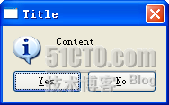
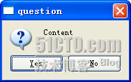
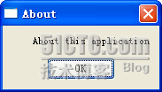
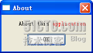
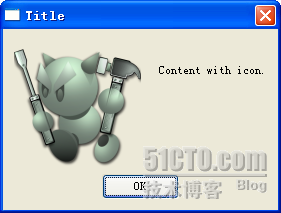

# 十七、Qt 学习之路(17): Qt 标准对话框之 QMessageBox

好久没有更新博客，主要是公司里面还在验收一些东西，所以没有及时更新。而且也在写一个基于 Qt 的画图程序，基本上类似于 PS 的东西，主要用到的是 Qt Graphics View Framework。好了，现在还是继续来说说 Qt 的标准对话框吧！

这次来说一下 QMessageBox 以及类似的几种对话框。其实，我们已经用过 QMessageBox 了，就在之前的几个程序中。不过，当时是大略的说了一下，现在专门来说说这几种对话框。

先来看一下最熟悉的 QMessageBox::information。我们在以前的代码中这样使用过：

```cpp
QMessageBox::information(NULL, "Title", "Content", QMessageBox::Yes | QMessageBox::No, QMessageBox::Yes);
```

下面是一个简单的例子：



现在我们从 API 中看看它的函数签名：

```cpp
static StandardButton QMessageBox::information ( QWidget * parent, const QString & title, const QString & text, StandardButtons buttons = Ok, StandardButton defaultButton = NoButton );
```

首先，它是 static 的，所以我们能够使用类名直接访问到(怎么看都像废话…)；然后看它那一堆参数，第一个参数 parent，说明它的父组件；第二个参数 title，也就是对话框的标题；第三个参数 text，是对话框显示的内容；第四个参数 buttons，声明对话框放置的按钮，默认是只放置一个 OK 按钮，这个参数可以使用或运算，例如我们希望有一个 Yes 和一个 No 的按钮，可以使用 QMessageBox::Yes | QMessageBox::No，所有的按钮类型可以在 QMessageBox 声明的 StandarButton 枚举中找到；第五个参数 defaultButton 就是默认选中的按钮，默认值是 NoButton，也就是哪个按钮都不选中。这么多参数，豆子也是记不住的啊！所以，我们在用 QtCreator 写的时候，可以在输入 QMessageBox::information 之后输入(，稍等一下，QtCreator 就会帮我们把函数签名显示在右上方了，还是挺方便的一个功能！

Qt 提供了五个类似的接口，用于显示类似的窗口。具体代码这里就不做介绍，只是来看一下样子吧！

```cpp
QMessageBox::critical(NULL, "critical", "Content", QMessageBox::Yes | QMessageBox::No, QMessageBox::Yes);
```


```cpp
QMessageBox::warning(NULL, "warning", "Content", QMessageBox::Yes | QMessageBox::No, QMessageBox::Yes);
```


```cpp
QMessageBox::question(NULL, "question", "Content", QMessageBox::Yes | QMessageBox::No, QMessageBox::Yes);
```



```cpp
QMessageBox::about(NULL, "About", "About this application");
```



请注意，最后一个 about()函数是没有后两个关于 button 设置的按钮的！

QMessageBox 对话框的文本信息时可以支持 HTML 标签的。例如：

```cpp
QMessageBox::about(NULL, "About", "About this <font color='red'>application</font>");
```

运行效果如下：



如果我们想自定义图片的话，也是很简单的。这时候就不能使用这几个 static 的函数了，而是要我们自己定义一个 QMessagebox 来使用：

```cpp
QMessageBox message(QMessageBox::NoIcon, "Title", "Content with icon."); 
message.setIconPixmap(QPixmap("icon.png")); 
message.exec();
```

这里我们使用的是 exec()函数，而不是 show()，因为这是一个模态对话框，需要有它自己的事件循环，否则的话，我们的对话框会一闪而过哦(感谢 laetitia 提醒).

需要注意的是，同其他的程序类似，我们在程序中定义的相对路径都是要相对于运行时的.exe 文件的地址的。比如我们写"icon.png"，意思是是在.exe 的当前目录下寻找一个"icon.png"的文件。这个程序的运行效果如下：



还有一点要注意，我们使用的是 png 格式的图片。因为 Qt 内置的处理图片格式是 png，所以这不会引起很大的麻烦，如果你要使用 jpeg 格式的图片的话，Qt 是以插件的形式支持的。在开发时没有什么问题，不过如果要部署的话，需要注意这一点。

最后再来说一下怎么处理对话框的交互。我们使用 QMessageBox 类的时候有两种方式，一是使用 static 函数，另外是使用构造函数。

首先来说一下 static 函数的方式。注意，static 函数都是要返回一个 StandardButton，我们就可以通过判断这个返回值来对用户的操作做出相应。

```cpp
QMessageBox::StandardButton rb = QMessageBox::question(NULL, "Show Qt", "Do you want to show Qt dialog?", QMessageBox::Yes | QMessageBox::No, QMessageBox::Yes); 
if(rb == QMessageBox::Yes) 
{ 
        QMessageBox::aboutQt(NULL, "About Qt");
```

如果要使用构造函数的方式，那么我们就要自己运行判断一下啦：

```cpp
QMessageBox message(QMessageBox::NoIcon, "Show Qt", "Do you want to show Qt dialog?", QMessageBox::Yes | QMessageBox::No, NULL); 
if(message.exec() == QMessageBox::Yes) 
{ 
        QMessageBox::aboutQt(NULL, "About Qt"); 
}
```

其实道理上也是差不多的。

本文出自 “豆子空间” 博客，请务必保留此出处 [`devbean.blog.51cto.com/448512/194031`](http://devbean.blog.51cto.com/448512/194031)