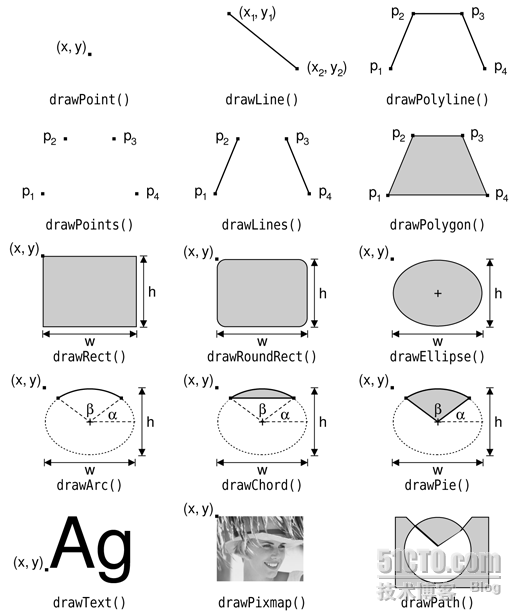

# 二十四、QPainter

多些大家对我的支持啊！有朋友也提出，前面的几节有关 event 的教程缺少例子。因为 event 比较难做例子，也就没有去写，只是把大概写了一下。今天带来的是新的部分，有关 Qt 的 2D 绘图。这部分不像前面的内容，还是比较好理解的啦！所以，例子也会增加出来。

有人问豆子拿 Qt 做什么，其实，豆子就是在做一个 Qt 的画图程序，努力朝着 Photoshop 和 GIMP 的方向发展。但这终究要经过很长的时间、很困难的路程的，所以也放在网上开源，有兴趣的朋友可以来试试的呀…

好了，闲话少说，来继续我们的学习吧！

Qt 的绘图系统允许使用相同的 API 在屏幕和打印设备上进行绘制。整个绘图系统基于 QPainter，QPainterDevice 和 QPaintEngine 三个类。

QPainter 用来执行绘制的操作；QPaintDevice 是一个二维空间的抽象，这个二维空间可以由 QPainter 在上面进行绘制；QPaintEngine 提供了画笔 painter 在不同的设备上进行绘制的统一的接口。QPaintEngine 类用在 QPainter 和 QPaintDevice 之间，并且通常对开发人员是透明的，除非你需要自定义一个设备，这时候你就必须重新定义 QPaintEngine 了。

下图给出了这三个类之间的层次结构(出自 Qt API 文档)：


这种实现的主要好处是，所有的绘制都遵循着同一种绘制流程，这样，添加可以很方便的添加新的特性，也可以为不支持的功能添加一个默认的实现方式。另外需要说明一点，Qt 提供了一个独立的 QtOpenGL 模块，可以让你在 Qt 的应用程序中使用 OpenGL 功能。该模块提供了一个 OpenGL 的模块，可以像其他的 Qt 组件一样的使用。它的不同之处在于，它是使用 OpenGL 作为显示技术，使用 OpenGL 函数进行绘制。对于这个组件，我们以后会再介绍。

通过前面的介绍我们知道，Qt 的绘图系统实际上是说，使用 QPainter 在 QPainterDevice 上面进行绘制，它们之间使用 QPaintEngine 进行通讯。好了，下面我们来看看怎么使用 QPainter。

首先我们定义一个组件，同前面的定义类似：

```cpp
class PaintedWidget : public QWidget 
{ 
public: 
        PaintedWidget(); 

protected: 
        void paintEvent(QPaintEvent *event); 
};
```

这里我们只定义了一个构造函数，并且重定义 paintEvent()函数。从名字就可以看出，这实际上是一个事件的回调函数。请注意，一般而言，Qt 的事件函数都是 protected 的，所以，如果你要重写事件，就需要继承这个类了。至于事件相关的东西，我们在前面的内容已经比较详细的叙述了，这里不再赘述。

构造函数里面主要是一些大小之类的定义，这里不再详细说明：

```cpp
PaintedWidget::PaintedWidget() 
{ 
        resize(800, 600); 
        setWindowTitle(tr("Paint Demo")); 
}
```

我们关心的是 paintEvent()函数的实现：

```cpp
void PaintedWidget::paintEvent(QPaintEvent *event) 
{ 
        QPainter painter(this); 
        painter.drawLine(80, 100, 650, 500); 
        painter.setPen(Qt::red); 
        painter.drawRect(10, 10, 100, 400); 
        painter.setPen(QPen(Qt::green, 5)); 
        painter.setBrush(Qt::blue); 
        painter.drawEllipse(50, 150, 400, 200); 
}
```

为了把我们的程序运行起来，下面是 main()函数：

```cpp
int main(int argc, char *argv[]) 
{ 
        QApplication app(argc, argv); 
        PaintedWidget w; 
        w.show(); 
        return app.exec(); 
}
```

运行结果如下所示：


首先，我们声明了一个 QPainter 对象。注意，我们在这个函数的栈空间建立了对象，因此不需要 delete。

QPainter 接收一个 QPaintDevice*类型的参数。QPaintDevice 有很多子类，比如 QImage，以及 QWidget。注意回忆一下，QPaintDevice 可以理解成要在哪里去画，而现在我们希望在这个 widget 上画，因此传入的是 this 指针。

QPainter 有很多以 draw 开头的函数，用于各种图形的绘制，比如这里的 drawLine，drawRect 和和 drawEllipse 等。具体的参数请参阅 API 文档。下图给出了 QPainter 的 draw 函数的实例，本图来自 C++ GUI Programming with Qt4, 2nd Edition.



好了，今天先到这里，我们将在下面一章中继续对这个 paintEvent()函数进行说明。

本文出自 “豆子空间” 博客，请务必保留此出处 [`devbean.blog.51cto.com/448512/194031`](http://devbean.blog.51cto.com/448512/194031)