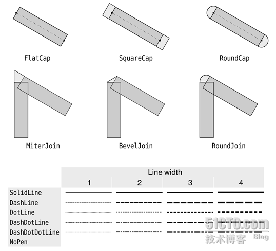
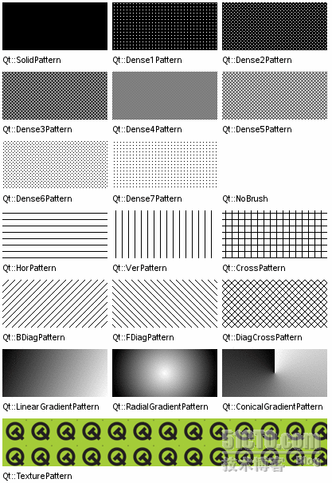
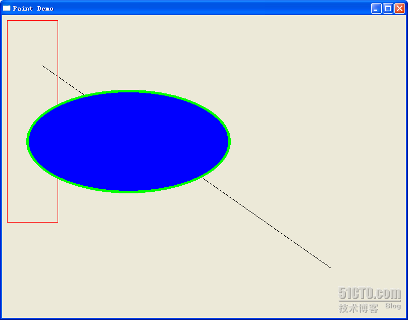

# 二十五、QPainter(续)

过去一天没有接上上章的东西，今天继续啊！

首先还是要先把上次的代码拿上来。

```cpp
void PaintedWidget::paintEvent(QPaintEvent *event) 
{ 
        QPainter painter(this); 
        painter.drawLine(80, 100, 650, 500); 
        painter.setPen(Qt::red); 
        painter.drawRect(10, 10, 100, 400); 
        painter.setPen(QPen(Qt::green, 5)); 
        painter.setBrush(Qt::blue); 
        painter.drawEllipse(50, 150, 400, 200); 
}
```

上次我们说的是 Qt 绘图相关的架构，以及 QPainter 的建立和 drawXXXX 函数。可以看到，基本上代码中已经设计到得函数还剩下两个：setPen()和 setBrush()。现在，我们就要把这两个函数讲解一下。

Qt 绘图系统提供了三个主要的参数设置，画笔(pen)、画刷(brush)和字体(font)。这里我们要说明的是画笔和画刷。

所谓画笔，是用于绘制线的，比如线段、轮廓线等，都需要使用画笔绘制。画笔类即 QPen，可以设置画笔的样式，例如虚线、实现之类，画笔的颜色，画笔的转折点样式等。画笔的样式可以在创建时指定，也可以由 setStyle()函数指定。画笔支持三种主要的样式：笔帽(cap)，结合点(join)和线形 (line)。这些样式具体显示如下(图片来自 C++ GUI Programming with Qt4, 2nd Edition)：



上图共分成三行：第一行是 Cap 样式，第二行是 Join 样式，第三行是 Line 样式。QPen 允许你使用 setCapStyle()、setJoinStyle()和 setStyle()分别进行设置。具体请参加 API 文档。

所谓画刷，主要用来填充封闭的几何图形。画刷主要有两个参数可供设置：颜色和样式。当然，你也可以使用纹理或者渐变色来填充图形。请看下面的图片(图片出自 Qt API 文档)：



这里给出了不同 style 的画刷的表现。同画笔类似，这些样式也可用通过一个 enum 进行设置。

明白了这些之后我们再来看看我们的代码。首先，我们直接使用 drawLine()函数，由于没有设置任何样式，所以使用的是默认的 1px,，黑色，solid 样式画了一条直线；然后使用 setPen()函数，将画笔设置成 Qt::red，即红色，画了一个矩形；最后将画笔设置成绿色，5px，画刷设置成蓝色，画了一个椭圆。这样便显示出了我们最终的样式：



另外要说明一点，请注意我们的绘制顺序，首先是直线，然后是矩形，最后是椭圆。这样，因为椭圆是最后画的，因此在最上方。

在我们学习 OpenGL 的时候，肯定听过这么一句话：OpenGL 是一个状态机。所谓状态机，就是说，OpenGL 保存的只是各种状态。怎么理解呢？比如，你把颜色设置成红色，那么，直到你重新设置另外的颜色，它的颜色会一直是红色。QPainter 也是这样，它的状态不会自己恢复，除非你使用了各种 set 函数。因此，如果在上面的代码中，我们在椭圆绘制之后再画一个椭圆，它的样式还会是绿色 5px 的轮廓和蓝色的填充，除非你显式地调用了 set 进行更新。这可能是绘图系统较多的实现方式，因为无论是 OpenGL、QPainter 还是 Java2D，都是这样实现的(DirectX 不大清楚)。

本文出自 “豆子空间” 博客，请务必保留此出处 [`devbean.blog.51cto.com/448512/194031`](http://devbean.blog.51cto.com/448512/194031)