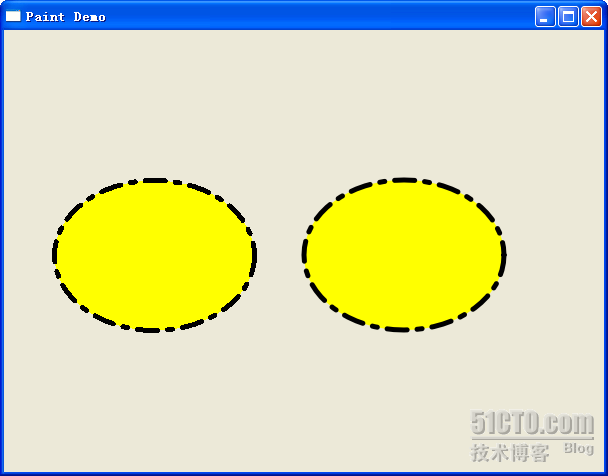
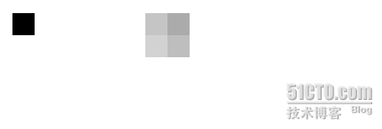

# 二十六、反走样

今天继续前面的内容。既然已经进入 2D 绘图部分，那么就先继续研究一下有关 QPainter 的东西吧！

反走样是图形学中的重要概念，用以防止“锯齿”现象的出现。很多系统的绘图 API 里面都会内置了反走样的算法，不过默认一般都是关闭的，Qt 也不例外。下面我们来看看代码。这段代码仅仅给出了 paintEvent 函数，相信你可以很轻松地替换掉前面章节中的相关代码。

```cpp
void PaintedWidget::paintEvent(QPaintEvent *event) 
{ 
        QPainter painter(this); 
        painter.setPen(QPen(Qt::black, 5, Qt::DashDotLine, Qt::RoundCap)); 
        painter.setBrush(Qt::yellow); 
        painter.drawEllipse(50, 150, 200, 150); 

        painter.setRenderHint(QPainter::Antialiasing, true); 
        painter.setPen(QPen(Qt::black, 5, Qt::DashDotLine, Qt::RoundCap)); 
        painter.setBrush(Qt::yellow); 
        painter.drawEllipse(300, 150, 200, 150); 
}
```

看看运行后的效果：



左边的是没有使用反走样技术的，右边是使用了反走样技术的。二者的差别可以很容易的看出来。

下面来看看相关的代码。为了尝试画笔的样式，这里故意使用了一个新的画笔：

```cpp
painter.setPen(QPen(Qt::black, 5, Qt::DashDotLine, Qt::RoundCap));
```

我们对照着 API 去看，第一个参数是画笔颜色，这里设置为黑色；第二个参数是画笔的粗细，这里是 5px；第三个是画笔样式，我们使用了 DashDotLine，正如同其名字所示，是一个短线和一个点相间的类型；第四个是 RoundCap，也就是圆形笔帽。然后我们使用一个黄色的画刷填充，画了一个椭圆。

后面的一个和前面的十分相似，唯一的区别是多了一句

```cpp
painter.setRenderHint(QPainter::Antialiasing, true);
```

，不过这句也很清楚，就是设置 Antialiasing 属性为 true。如果你学过图形学就会知道，这个长长的单词就是“反走样”。经过这句设置，我们就打开了 QPainter 的反走样功能。还记得我们曾经说过，QPainter 是一个状态机，因此，只要这里我们打开了它，之后所有的代码都会是反走样绘制的了。

看到这里你会发现，反走样的效果其实比不走样要好得多，那么，为什么不默认打开反走样呢？这是因为，反走样是一种比较复杂的算法，在一些对图像质量要求不高的应用中，是不需要进行反走样的。为了提高效率，一般的图形绘制系统，如 Java2D、OpenGL 之类都是默认不进行反走样的。

还有一个疑问，既然反走样比不反走样的图像质量高很多，不进行反走样的绘制还有什么作用呢？前面说的是一个方面，也就是，在一些对图像质量要求不高的环境下，或者说性能受限的环境下，比如嵌入式和手机环境，是不必须要进行反走样的。另外还有一点，在一些必须精确操作像素的应用中，也是不能进行反走样的。请看下面的图片：



上图是使用 Photoshop 的铅笔和画笔工具画的 1 像素的点在放大到 3200%视图下截下来的。Photoshop 里面的铅笔工具是不进行反走样，而画笔是要进行反走样的。在放大的情况下就会知道，有反走样的情况下是不能进行精确到 1 像素的操作的。因为反走样很难让你控制到 1 个像素。这不是 Photoshop 画笔工具的缺陷，而是反走样算法的问题。如果你想了解为什么这样，请查阅计算机图形学里面关于反走样的原理部分。

本文出自 “豆子空间” 博客，请务必保留此出处 [`devbean.blog.51cto.com/448512/194031`](http://devbean.blog.51cto.com/448512/194031)