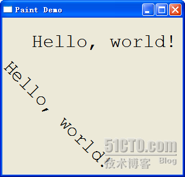

# 二十八、坐标变换

经过前面的章节，我们已经能够画出一些东西来，主要就是使用 QPainter 的相关函数。今天，我们要看的是 QPainter 的坐标系统。

同很多坐标系统一样，QPainter 的默认坐标的原点(0, 0)位于屏幕的左上角，X 轴正方向是水平向右，Y 轴正方向是竖直向下。在这个坐标系统中，每个像素占据 1 x 1 的空间。你可以把它想象成是一张坐标值，其中的每个小格都是 1 个像素。这么说来，一个像素的中心实际上是一个“半像素坐标系”，也就是说，像素(x, y)的中心位置其实是在(x + 0.5, y + 0.5)的位置上。因此，如果我们使用 QPainter 在(100, 100)处绘制一个像素，那么，这个像素的中心坐标是(100.5, 100.5)。

这种细微的差别在实际应用中，特别是对坐标要求精确的系统中是很重要的。首先，只有在禁止反走样，也就是默认状态下，才会有这 0.5 像素的偏移；如果使用了反走样，那么，我们画(100, 100)位置的像素时，QPainter 会在(99.5, 99.5)，(99.5, 100.5)，(100.5, 99.5)和(100.5, 100.5)四个位置绘制一个亮色的像素，这么产生的效果就是在这四个像素的焦点处(100, 100)产生了一个像素。如果不需要这个特性，就需要将 QPainter 的坐标系平移(0.5, 0.5)。

这一特性在绘制直线、矩形等图形的时候都会用到。下图给出了在没有反走样技术时，使用 drawRect(2, 2, 6, 5)绘制一个矩形的示例。在 No Pen 的情况下，请注意矩形左上角的像素是在(2, 2)，其中心位置是在(2.5, 2.5)的位置。然后注意下有不同的 Pen 的值的绘制样式，在 Pen 宽为 1 时，实际画出的矩形的面积是 7 x 6 的(图出自 C++ GUI Programming with Qt4, 2nd Edition)：


在具有反走样时，使用 drawRect(2, 2, 6, 5)的效果如下(图出自 C++ GUI Programming with Qt4, 2nd Edition)：


注意我们前面说过，通过平移 QPainter 的坐标系来消除着 0.5 像素的差异。下面给出了使用 drawRect(2.5, 2.5, 6, 5)在反走样情况下绘制的矩形(图出自 C++ GUI Programming with Qt4, 2nd Edition)：


请对比与上图的区别。

在上述的 QPainter 的默认坐标系下，QPainter 提供了视口(viewport)窗口(window)机制，用于绘制与绘制设备的大小和分辨率无关的图形。视口和窗口是紧密的联系在一起的，它们一般都是矩形。视口是由物理坐标确定其大小，而窗口则是由逻辑坐标决定。我们在使用 QPainter 进行绘制时，传给 QPainter 的是逻辑坐标，然后，Qt 的绘图机制会使用坐标变换将逻辑坐标转换成物理坐标后进行绘制。

通常，视口和窗口的坐标是一致的。比如一个 600 x 800 的 widget(这是一个 widget，或许是一个对话框，或许是一个面板等等)，默认情况下，视口和窗口都是一个 320 x 200 的矩形，原点都在(0, 0)，此时，视口和窗口的坐标是相同的。

注意到 QPainter 提供了 setWindow()和 setViewport()函数，用来设置视口和窗口的矩形大小。比如，在上面所述的 320 x 200 的 widget 中，我们要设置一个从(-50, -50)到(+50, +50)，原点在中心的矩形窗口，就可以使用

```cpp
painter.setWindow(-50, -50, 100, 100);
```

其中，(-50, -50)指明了原点，100, 100 指明了窗口的长和宽。这里的“指明原点”意思是，逻辑坐标的(-50, -50)对应着物理坐标的(0, 0)；“长和宽”说明，逻辑坐标系下的长 100，宽 100 实际上对应物理坐标系的长 320，宽 200。

或许你已经发现这么一个好处，我们可以随时改变 window 的范围，而不改变底层物理坐标系。这就是前面所说的，视口与窗口的作用：“绘制与绘制设备的大小和分辨率无关的图形”，如下图所示(图出自 C++ GUI Programming with Qt4, 2nd Edition)：


除了视口与窗口的变化，QPainter 还提供了一个“世界坐标系”，同样也可以变换图形。所不同的是，视口与窗口实际上是统一图形在两个坐标系下的表达，而世界坐标系的变换是通过改变坐标系来平移、缩放、旋转、剪切图形。为了清楚起见，我们来看下面一个例子：

```cpp
void PaintedWidget::paintEvent(QPaintEvent *event) 
{ 
        QPainter painter(this); 
        QFont font("Courier", 24); 
        painter.setFont(font); 
        painter.drawText(50, 50, "Hello, world!"); 
        QTransform transform; 
        transform.rotate(+45.0); 
        painter.setWorldTransform(transform); 
        painter.drawText(60, 60, "Hello, world!"); 
}
```

为了显示方便，我在这里使用了 QFont 改变了字体。QPainter 的 drawText()函数提供了绘制文本的功能。它有几种重载形式，我们使用了其中的一种，即制定文本的坐标然后绘制。需要注意的是，这里的坐标是文字左下角的坐标(特别提醒这一点，因为很多绘图系统，比如 Java2D 都是把**左上角**作为坐标点的)！下面是运行结果：



我们使用 QTransform 做了一个 rotate 变换。这个变换就是旋转，而且是顺时针旋转 45 度。然后我们使用这个变换设置了 QPainter 的世界坐标系，注意到 QPainter 是一个状态机，所以这种变换并不会改变之前的状态，因此只有第二个 Hello, world!被旋转了。确切的说，**被旋转的是坐标系而不是这个文字！**请注意体会这两种说法的不同。

本文出自 “豆子空间” 博客，请务必保留此出处 [`devbean.blog.51cto.com/448512/194031`](http://devbean.blog.51cto.com/448512/194031)